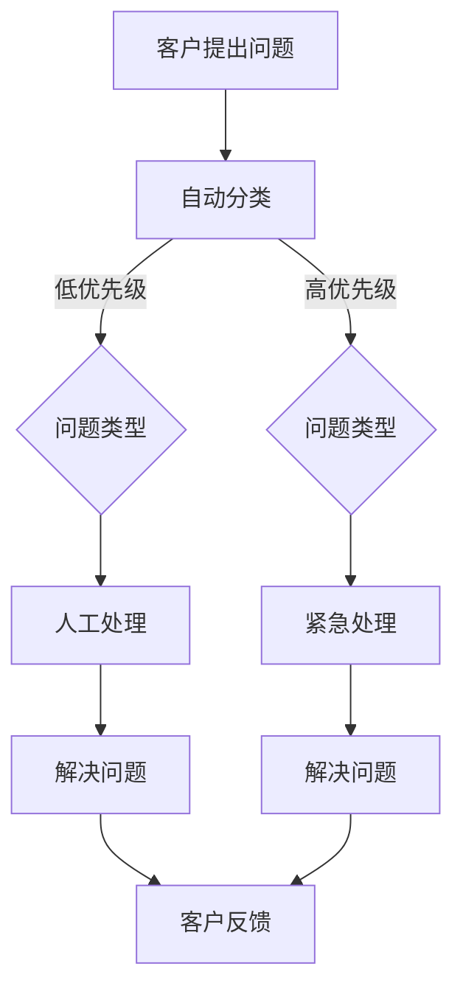

                 

# 《技术型创业者如何打造高效的客户支持系统》

## 关键词：
- 技术型创业者
- 客户支持系统
- 效率优化
- 智能化
- 客户体验

## 摘要：
在当今竞争激烈的市场环境中，技术型创业者面临着不断增长的需求和挑战。本文将深入探讨如何打造高效的客户支持系统，以帮助创业者提升客户满意度，降低运营成本，并确保业务的持续增长。通过分析技术型创业者的特点、客户支持系统的发展历程、核心要素以及未来的趋势，本文旨在为创业者提供一套实用且创新的客户支持解决方案。

### 第一部分：绪论

#### 第1章：技术型创业者的特点与挑战

**1.1 技术型创业者的特点**

技术型创业者通常具备以下特点：
- 强烈的创新意识：他们热衷于探索新技术，并将其应用于实际业务中。
- 技术背景：通常拥有深厚的编程、算法或软件开发背景。
- 快速迭代：注重产品快速迭代，以适应市场变化。
- 灵活性：能够迅速调整策略，以应对不确定的市场环境。

**1.2 技术型创业者的挑战**

尽管技术型创业者具有上述优势，但他们也面临着诸多挑战：
- 客户支持需求增加：随着产品的普及，客户支持需求日益增长。
- 资源有限：初创企业往往资源有限，需要在有限资源下实现高效运营。
- 技术与业务的平衡：在追求技术创新的同时，还需关注业务的稳定性和可持续性。

#### 第2章：客户支持系统的重要性

**2.1 客户支持系统的定义**

客户支持系统是指企业为了提供高质量的客户服务，所采用的一系列技术、流程和工具的集合。

**2.2 客户支持系统的重要性**

高效的客户支持系统对技术型创业者至关重要：
- 提升客户满意度：及时、专业的客户支持可以增强客户的忠诚度和满意度。
- 降低运营成本：通过自动化和智能化手段，减少人工干预，降低运营成本。
- 提高响应速度：快速响应客户问题，减少客户等待时间，提升服务质量。
- 数据驱动决策：通过分析客户支持数据，优化业务流程，提升整体运营效率。

#### 第3章：效率的定义与测量

**3.1 效率的定义**

效率是指单位时间内所完成的工作量，通常用来衡量工作效能。

**3.2 效率的测量**

效率可以通过以下指标进行测量：
- 响应时间：从客户提出问题到得到响应的时间。
- 处理时间：从接收到客户问题到解决问题的时间。
- 客户满意度：通过调查问卷或评分系统，了解客户对服务的满意度。

#### 第4章：客户支持系统的基本架构

**4.1 客户支持系统的组成**

一个高效的客户支持系统通常包括以下几个部分：
- 客户反馈渠道：如在线聊天、电话、邮件等。
- 客户管理平台：用于记录和管理客户信息。
- 自动化工具：如聊天机器人、自动化回复等。
- 数据分析平台：用于分析客户支持数据，优化业务流程。

### 第二部分：核心概念与联系

#### 第5章：客户支持系统的Mermaid流程图

**5.1 Mermaid流程图的基本概念**

Mermaid是一种基于Markdown的图形化工具，可以方便地绘制流程图、时序图等。

**5.2 客户支持系统的Mermaid流程图设计**

以下是一个简单的客户支持系统流程图示例：



**5.3 Mermaid流程图的应用案例**

通过Mermaid流程图，可以直观地展示客户支持系统的工作流程，有助于团队成员理解和优化流程。

#### 第6章：客户支持系统的核心算法原理

**6.1 客户行为分析算法**

客户行为分析算法用于分析客户的行为数据，以预测客户需求和偏好。

**6.2 情感分析算法**

情感分析算法用于分析客户反馈中的情感倾向，以了解客户的满意度和需求。

**6.3 智能客服算法**

智能客服算法用于自动化处理客户问题，提高响应速度和效率。

#### 第7章：数学模型和数学公式

**7.1 客户满意度的计算模型**

客户满意度可以通过以下公式计算：

$$
\text{满意度} = \frac{\text{满意客户数}}{\text{总客户数}} \times 100\%
$$

**7.2 客户流失预测模型**

客户流失预测模型可以通过以下公式计算：

$$
\text{流失率} = \frac{\text{流失客户数}}{\text{总客户数}} \times 100\%
$$

**7.3 客户支持系统的优化模型**

客户支持系统的优化模型可以通过以下公式计算：

$$
\text{效率} = \frac{\text{处理客户数}}{\text{总客户数} \times \text{平均响应时间}}
$$

### 第三部分：项目实战

#### 第8章：客户支持系统的开发环境搭建

**8.1 开发环境搭建**

搭建客户支持系统需要以下环境：
- 服务器：用于运行系统服务。
- 数据库：用于存储客户信息和反馈数据。
- 开发工具：如IDE、版本控制工具等。

**8.2 代码实现与解读**

以下是一个简单的聊天机器人代码示例：

```python
import random

def get_response(message):
    if "hello" in message.lower():
        return "Hello! How can I help you today?"
    elif "bye" in message.lower():
        return "Goodbye! Have a great day!"
    else:
        return random.choice(["I'm not sure how to help with that.", "Let me check that for you.", "I'll forward your question to the appropriate team."])

while True:
    message = input("You: ")
    print("Bot:", get_response(message))
```

**8.3 代码解读与分析**

该代码实现了一个简单的聊天机器人，通过输入消息并返回预设的回答，实现了基本的对话功能。通过优化和扩展，可以实现更复杂的功能，如情感分析、自动分类等。

#### 第9章：客户支持系统的未来发展趋势

**9.1 智能化趋势**

随着人工智能技术的发展，客户支持系统将越来越智能化，通过自然语言处理、机器学习等技术，实现更智能、更高效的客户服务。

**9.2 社交化趋势**

客户支持系统将逐渐融入社交媒体平台，通过社交媒体渠道提供客户服务，提高客户体验。

**9.3 客户体验优化趋势**

客户支持系统将更加注重客户体验，通过个性化服务、快速响应等手段，提升客户的满意度。

### 附录

#### 附录A：客户支持系统开发工具与资源

**A.1 主流开发工具介绍**

- 开发框架：如React、Vue等。
- 数据库：如MySQL、MongoDB等。
- 服务器：如AWS、阿里云等。

**A.2 开源资源和框架推荐**

- 开源聊天机器人框架：如Botpress、Microsoft Bot Framework等。
- 客户关系管理系统（CRM）：如Salesforce、HubSpot等。

**A.3 常见问题解答与参考资料**

- 客户支持系统常见问题及解决方案。
- 技术文档和教程。
- 开源社区和论坛。

**作者：** AI天才研究院/AI Genius Institute & 禅与计算机程序设计艺术 /Zen And The Art of Computer Programming 

