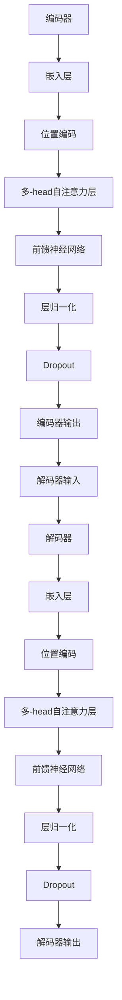

                 

### 《持续学习：让AI系统不断适应新知识》

#### 关键词：
- 持续学习
- AI系统
- 适应性
- 算法优化
- 实践应用

#### 摘要：
在人工智能（AI）迅猛发展的今天，持续学习成为AI系统不断适应新知识和动态环境的关键。本文深入探讨了持续学习的核心概念、理论基础、实践应用以及未来发展。通过详细分析自然语言处理、计算机视觉、机器人学等多个领域的应用，本文揭示了持续学习对提高AI系统性能和扩展其应用范围的重要性。同时，本文也探讨了持续学习在工业应用中的前景以及相关的伦理和法律问题。最终，本文展望了持续学习技术的发展趋势及其在教育领域中的应用潜力。

### 第一部分：持续学习的核心概念

#### 第1章：AI系统的持续学习概述

##### 1.1 持续学习的定义与重要性

###### 1.1.1 持续学习的概念
持续学习指的是AI系统能够在获取新数据或情境时自动调整其行为和知识，从而不断提高其性能和适应性。它不仅仅是传统机器学习过程的延续，更是一种动态、自适应的学习方式。

在机器学习领域，持续学习可以定义为：
$$
\text{持续学习} = \text{自适应学习} + \text{在线学习} + \text{迁移学习}
$$
其中，自适应学习是指系统根据新数据调整模型参数；在线学习是指系统实时处理和更新数据；迁移学习是指系统在不同领域间转移知识。

###### 1.1.2 持续学习的重要性
持续学习对于AI系统的性能提升至关重要。首先，它能够使系统更好地应对数据的动态变化，提高其在不断变化的环境中的适应能力。其次，持续学习可以减少模型的过拟合问题，通过持续地更新和优化模型，使其更加通用和稳健。最后，持续学习能够提高AI系统的计算效率，通过减少重新训练的频率和优化算法，降低计算成本。

持续学习的重要性可以总结为以下几点：
1. **提升系统适应性**：使系统能够适应不断变化的数据和环境。
2. **减少过拟合**：通过持续地更新模型，提高模型的泛化能力。
3. **提高计算效率**：减少重新训练的频率，优化算法，降低计算成本。

###### 1.1.3 持续学习与机器学习的关系
持续学习是机器学习的一个扩展，二者紧密相关。机器学习侧重于从静态数据中提取知识，而持续学习则关注如何在动态环境中不断更新和优化模型。可以说，持续学习是机器学习的高级阶段，其核心目标是通过不断的学习和调整，使AI系统具备自我进化能力。

##### 1.2 持续学习的挑战

###### 1.2.1 数据的动态变化
持续学习面临的一个主要挑战是数据的动态变化。在实际应用中，数据分布可能会随着时间的推移而发生变化，这使得传统的静态学习模型难以适应。为了应对这一挑战，需要开发能够动态调整学习策略的算法，例如在线学习算法和增量学习算法。

###### 1.2.2 模型的过拟合问题
在持续学习中，模型的过拟合问题也是一个重要的挑战。由于持续学习过程中模型会不断地更新，这可能会导致模型对新数据的适应性下降，从而出现过拟合现象。为了解决这个问题，可以采用一些正则化方法，如L1和L2正则化，以及集成学习方法，如随机森林和梯度提升树。

###### 1.2.3 持续学习中的计算效率
持续学习还需要考虑计算效率的问题。由于持续学习过程中需要不断地更新模型，这可能会带来较高的计算成本。为了提高计算效率，可以采用一些优化技术，如模型压缩和迁移学习。此外，硬件技术的发展，如GPU和TPU的普及，也为持续学习提供了强大的计算支持。

##### 1.3 持续学习的应用领域

###### 1.3.1 自然语言处理
自然语言处理（NLP）是持续学习的一个重要应用领域。随着互联网和社交媒体的发展，NLP系统需要不断处理海量的新数据和变化的语言模式。持续学习可以显著提高NLP系统的适应性和性能，例如在语言模型、文本分类和命名实体识别等方面。

###### 1.3.2 计算机视觉
计算机视觉是另一个持续学习的重点应用领域。在图像识别、目标检测和图像生成等任务中，持续学习能够帮助模型更好地适应新的图像数据和环境变化，从而提高系统的鲁棒性和准确性。

###### 1.3.3 机器人学
机器人学中，持续学习可以显著提高机器人的感知、决策和控制能力。通过持续学习，机器人能够更好地适应不同的环境和任务，从而提高其自主性和适应性。

#### 第2章：AI系统持续学习的理论基础

##### 2.1 经典机器学习模型概述

###### 2.1.1 监督学习
监督学习是一种最常见的机器学习模型，它通过已有标签数据训练模型，并在新的、未见过的数据上进行预测。监督学习的核心是损失函数和优化算法，其中损失函数用于衡量模型预测结果与实际标签之间的差距，优化算法用于最小化这个损失函数。

监督学习的伪代码如下：
```
function supervised_learning(data, labels, model, epochs):
    for epoch in range(epochs):
        for x, y in zip(data, labels):
            prediction = model.predict(x)
            loss = loss_function(prediction, y)
            model.update_parameters(-learning_rate * gradient(loss))
    return model
```

其中，`data`和`labels`分别为输入数据和标签，`model`为机器学习模型，`epochs`为训练轮数，`learning_rate`为学习率，`gradient`为损失函数的梯度。

###### 2.1.2 无监督学习
无监督学习是一种不依赖于标签数据的机器学习模型，其主要目标是发现数据中的潜在结构和模式。无监督学习包括聚类、降维和生成模型等方法。聚类方法如K-means和DBSCAN，用于将数据划分为多个类；降维方法如PCA和t-SNE，用于减少数据维度；生成模型如Gaussian Mixture Model和变分自编码器，用于生成新的数据。

无监督学习的伪代码如下：
```
function unsupervised_learning(data, model, epochs):
    for epoch in range(epochs):
        z = model.encode(data)
        data_new = model.decode(z)
    return model
```

其中，`data`为输入数据，`model`为机器学习模型，`epochs`为训练轮数，`encode`和`decode`分别为编码和解码函数。

###### 2.1.3 强化学习
强化学习是一种通过与环境交互来学习最优策略的机器学习模型。在强化学习中，智能体（agent）通过选择行动来获取奖励，并不断更新策略以最大化累积奖励。强化学习的核心是策略和价值函数，其中策略决定了智能体的行动，价值函数用于评估不同行动的价值。

强化学习的伪代码如下：
```
function reinforcement_learning(agent, environment, episodes):
    for episode in range(episodes):
        state = environment.reset()
        done = False
        while not done:
            action = agent.select_action(state)
            next_state, reward, done = environment.step(action)
            agent.update_value_function(state, action, reward, next_state)
            state = next_state
    return agent
```

其中，`agent`为智能体，`environment`为环境，`episodes`为训练轮数，`select_action`和`update_value_function`分别为选择行动和更新价值函数的函数。

##### 2.2 持续学习的核心算法

###### 2.2.1 自适应学习算法
自适应学习算法是一种能够根据新数据动态调整模型参数的算法。其主要思想是在每次新数据到来时，对模型进行微调，使其更好地适应新数据。自适应学习算法包括梯度下降、Adam优化器和Adaptive Moment Estimation（Adam）等。

自适应学习算法的伪代码如下：
```
function adaptive_learning(data, model, epochs):
    for epoch in range(epochs):
        for x, y in zip(data, labels):
            prediction = model.predict(x)
            loss = loss_function(prediction, y)
            gradient = gradient(loss)
            model.update_parameters(-learning_rate * gradient)
    return model
```

其中，`data`和`labels`分别为输入数据和标签，`model`为机器学习模型，`epochs`为训练轮数，`learning_rate`为学习率，`gradient`为损失函数的梯度。

###### 2.2.2 主动学习算法
主动学习算法是一种在有限数据集上最大化学习效率的算法。其主要思想是在有限的训练样本中，选择最有价值的数据进行标注，从而提高模型的性能。主动学习算法包括不确定性采样、基于实例的采样和基于价值的采样等。

主动学习算法的伪代码如下：
```
function active_learning(data, model, num_samples):
    selected_samples = []
    for _ in range(num_samples):
        uncertainty_score = model.compute_uncertainty(data)
        next_sample = select_max_uncertainty_sample(uncertainty_score)
        selected_samples.append(next_sample)
        data = data + [next_sample]
    return data
```

其中，`data`为输入数据，`model`为机器学习模型，`num_samples`为需要选择的样本数，`compute_uncertainty`为计算不确定性的函数，`select_max_uncertainty_sample`为选择具有最大不确定性的样本的函数。

###### 2.2.3 模型压缩与迁移学习
模型压缩是一种减少模型大小和计算复杂度的技术。其主要方法包括量化、剪枝和知识蒸馏等。量化是将模型的权重和激活值从浮点数转换为低精度数值；剪枝是通过剪掉模型中的冗余神经元或连接来减少模型大小；知识蒸馏是将大模型的知识传递给小模型，从而提高小模型的性能。

迁移学习是一种利用预训练模型在新任务上获得更好的性能的技术。其主要思想是将预训练模型在大型数据集上的知识迁移到新的、较小的数据集上，从而提高模型的泛化能力。

模型压缩与迁移学习的伪代码如下：
```
function model_compression_and_transfer_learning(model, pre-trained_model, data):
    # Quantization
    quantized_model = quantize(model)

    # Pruning
    pruned_model = prune(model)

    # Knowledge Distillation
    distilled_model = knowledge_distill(pre-trained_model, quantized_model)

    # Transfer Learning
    transferred_model = transfer_learning(pre-trained_model, data)

    return quantized_model, pruned_model, distilled_model, transferred_model
```

其中，`model`为原始模型，`pre-trained_model`为预训练模型，`data`为新的数据集，`quantize`为量化函数，`prune`为剪枝函数，`knowledge_distill`为知识蒸馏函数，`transfer_learning`为迁移学习函数。

##### 2.3 持续学习中的数学模型

###### 2.3.1 信息论基础
信息论是研究信息传递和处理的基本理论，其在持续学习中具有重要的应用。信息论中的熵、信息量和互信息是理解持续学习的重要概念。

熵（Entropy）是衡量数据随机性的度量，定义为：
$$
H(X) = -\sum_{x \in X} p(x) \log_2 p(x)
$$

信息量（Information）是接收一个信息后的不确定性减少量，定义为：
$$
I(X; Y) = H(X) - H(X | Y)
$$

互信息（Mutual Information）是两个随机变量之间的相关性度量，定义为：
$$
I(X; Y) = \sum_{x \in X} \sum_{y \in Y} p(x, y) \log_2 \frac{p(x, y)}{p(x) p(y)}
$$

###### 2.3.2 概率论基础
概率论是机器学习的基础，其在持续学习中同样具有重要意义。概率论中的条件概率、贝叶斯定理和马尔可夫模型是理解持续学习的重要工具。

条件概率是指在一个事件已发生的条件下，另一个事件发生的概率，定义为：
$$
P(A | B) = \frac{P(A \cap B)}{P(B)}
$$

贝叶斯定理是一种基于概率的推理方法，用于计算后验概率，定义为：
$$
P(A | B) = \frac{P(B | A) P(A)}{P(B)}
$$

马尔可夫模型是一种用于描述系统状态转移的概率模型，其基本假设是当前状态仅取决于前一个状态，与过去的状态无关。

###### 2.3.3 最优化算法基础
最优化算法是机器学习中用于寻找最优解的关键技术。在持续学习中，最优化算法用于调整模型参数，以最小化损失函数。常见的最优化算法包括梯度下降、Adam优化器和Adaptive Moment Estimation（Adam）等。

梯度下降算法是一种基于损失函数梯度的最优化方法，其核心思想是通过迭代更新模型参数，以最小化损失函数。梯度下降算法的伪代码如下：
```
function gradient_descent(data, model, learning_rate, epochs):
    for epoch in range(epochs):
        for x, y in zip(data, labels):
            prediction = model.predict(x)
            loss = loss_function(prediction, y)
            gradient = gradient(loss)
            model.update_parameters(-learning_rate * gradient)
    return model
```

其中，`data`和`labels`分别为输入数据和标签，`model`为机器学习模型，`learning_rate`为学习率，`epochs`为训练轮数，`gradient`为损失函数的梯度。

Adam优化器是一种结合了梯度下降和动量法的优化算法，其能够更好地处理稀疏数据和梯度消失问题。Adam优化器的伪代码如下：
```
function adam_optimizer(data, model, learning_rate, beta1, beta2, epsilon, epochs):
    m = 0
    v = 0
    for epoch in range(epochs):
        for x, y in zip(data, labels):
            prediction = model.predict(x)
            loss = loss_function(prediction, y)
            gradient = gradient(loss)
            m = beta1 * m + (1 - beta1) * gradient
            v = beta2 * v + (1 - beta2) * gradient**2
            m_hat = m / (1 - beta1**epoch)
            v_hat = v / (1 - beta2**epoch)
            model.update_parameters(-learning_rate * m_hat / (sqrt(v_hat) + epsilon))
    return model
```

其中，`data`和`labels`分别为输入数据和标签，`model`为机器学习模型，`learning_rate`为学习率，`beta1`和`beta2`分别为一阶和二阶矩估计的指数衰减率，`epsilon`为小常数，`epochs`为训练轮数。

### 第二部分：持续学习的实践应用

#### 第3章：自然语言处理中的持续学习

##### 3.1 语言模型与持续学习

###### 3.1.1 语言模型的定义
语言模型（Language Model，LM）是一种用于预测文本中下一个单词或字符的概率分布的模型。在自然语言处理中，语言模型广泛应用于文本生成、机器翻译和语音识别等领域。语言模型的基本任务是从已知的单词序列中预测下一个单词。

语言模型的定义可以表示为：
$$
P(\text{单词}_t | \text{单词}_{<t}) = \text{LM}(\text{单词}_t | \text{单词}_{<t})
$$
其中，$\text{单词}_t$表示当前要预测的单词，$\text{单词}_{<t}$表示已知的单词序列。

###### 3.1.2 语言模型的基本结构
语言模型通常采用神经网络架构，如循环神经网络（RNN）、长短期记忆网络（LSTM）和变换器（Transformer）等。这些神经网络架构能够有效地处理文本数据，捕捉文本中的长距离依赖关系。

以变换器（Transformer）为例，其基本结构包括编码器（Encoder）和解码器（Decoder）。编码器用于将输入的单词序列编码为固定长度的向量表示，解码器则用于根据编码器的输出和已生成的单词序列生成新的单词。

变换器的基本结构图如下：



###### 3.1.3 持续学习在语言模型中的应用
持续学习在语言模型中的应用主要涉及模型参数的动态调整和模型的在线更新。通过持续学习，语言模型能够更好地适应新的语言模式和数据分布，从而提高其预测性能。

持续学习在语言模型中的应用可以分为以下几个方面：

1. **在线学习**：在线学习是指模型在接收到新数据时，立即更新其参数，以适应新的数据分布。在线学习的关键是选择合适的更新策略，以确保模型参数的稳定性和收敛性。

2. **自适应学习**：自适应学习是指模型根据新数据的特征和模式，动态调整其学习策略。例如，在文本分类任务中，当数据集中的负面评论比例增加时，模型可以自动调整其正负面分类阈值，以更好地适应新的数据分布。

3. **迁移学习**：迁移学习是指将已有模型在新任务上的知识迁移到新任务上。在自然语言处理中，迁移学习可以用于将预训练的语言模型迁移到新的语言任务上，从而提高模型的性能和泛化能力。

4. **增量学习**：增量学习是指模型在已有知识的基础上，逐步学习新的知识。在自然语言处理中，增量学习可以用于在线更新语言模型，使其能够处理不断变化的语言数据。

##### 3.2 文本分类与持续学习

###### 3.2.1 文本分类的基本方法
文本分类是一种将文本数据分为多个预定义类别的方法。常见的文本分类方法包括朴素贝叶斯、支持向量机和深度学习等。

以朴素贝叶斯为例，其基本方法是基于贝叶斯定理和特征概率分布，计算每个类别的概率，并选择概率最高的类别作为文本的类别。

文本分类的基本流程如下：

1. **特征提取**：将文本数据转换为数值特征，例如词袋模型、TF-IDF和词嵌入等。

2. **模型训练**：使用训练数据集训练分类模型，例如朴素贝叶斯、支持向量机和神经网络等。

3. **类别预测**：使用训练好的模型对新的文本数据进行分类，计算每个类别的概率，并选择概率最高的类别作为预测结果。

文本分类的伪代码如下：
```
function text_classification(text, model):
    # Feature extraction
    features = extract_features(text)

    # Classification
    probabilities = model.predict(features)
    predicted_category = max(probabilities)

    return predicted_category
```

其中，`text`为输入文本，`model`为分类模型，`extract_features`为特征提取函数，`predict`为模型预测函数。

###### 3.2.2 持续学习在文本分类中的应用
持续学习在文本分类中的应用可以显著提高模型的性能和适应性。通过持续学习，文本分类模型能够动态地适应新的数据分布和语言模式，从而提高其分类准确性。

持续学习在文本分类中的应用可以分为以下几个方面：

1. **在线更新**：在线更新是指模型在接收到新数据时，立即更新其参数，以适应新的数据分布。例如，可以使用在线学习算法（如SGD）对模型进行实时更新。

2. **自适应阈值调整**：在文本分类中，分类阈值是影响分类准确性的重要参数。通过自适应阈值调整，模型可以根据新数据的特征和模式，动态调整分类阈值，以提高分类性能。

3. **迁移学习**：迁移学习可以用于将预训练的分类模型迁移到新的分类任务上，从而提高模型的性能和泛化能力。例如，可以使用预训练的词嵌入模型，结合新的分类任务进行迁移学习。

4. **增量学习**：增量学习可以用于在线更新分类模型，使其能够处理不断变化的数据分布。例如，可以使用增量学习算法（如Adagrad和Adam）对模型进行增量更新。

##### 3.3 命名实体识别与持续学习

###### 3.3.1 命名实体识别的基本方法
命名实体识别（Named Entity Recognition，NER）是一种用于识别文本中的命名实体的方法。命名实体通常包括人名、地名、组织名、时间名等。NER在信息提取、文本挖掘和语义分析等领域具有重要应用。

常见的NER方法包括基于规则的方法、基于统计的方法和基于深度学习的方法。

基于规则的方法通过手工编写规则，对文本中的命名实体进行识别。这种方法具有较高的准确性和速度，但规则编写复杂，难以适应变化。

基于统计的方法通过统计方法，如隐马尔可夫模型（HMM）和条件随机场（CRF），对文本中的命名实体进行识别。这种方法能够较好地处理文本中的上下文关系，但需要大量的标注数据。

基于深度学习的方法，如长短期记忆网络（LSTM）和变换器（Transformer），通过学习文本的深层特征，对命名实体进行识别。这种方法能够处理复杂的上下文关系，但需要大量的计算资源和训练数据。

命名实体识别的基本流程如下：

1. **特征提取**：将文本数据转换为数值特征，例如词袋模型、TF-IDF和词嵌入等。

2. **模型训练**：使用训练数据集训练NER模型，例如隐马尔可夫模型、条件随机场和深度学习模型等。

3. **实体识别**：使用训练好的模型对新的文本数据进行命名实体识别，输出每个词的实体类别。

命名实体识别的伪代码如下：
```
function named_entity_recognition(text, model):
    # Feature extraction
    features = extract_features(text)

    # Entity recognition
    entities = model.predict(features)

    return entities
```

其中，`text`为输入文本，`model`为NER模型，`extract_features`为特征提取函数，`predict`为模型预测函数。

###### 3.3.2 持续学习在命名实体识别中的应用
持续学习在命名实体识别中的应用可以显著提高模型的性能和适应性。通过持续学习，命名实体识别模型能够动态地适应新的数据分布和语言模式，从而提高其识别准确性。

持续学习在命名实体识别中的应用可以分为以下几个方面：

1. **在线更新**：在线更新是指模型在接收到新数据时，立即更新其参数，以适应新的数据分布。例如，可以使用在线学习算法（如SGD）对模型进行实时更新。

2. **自适应阈值调整**：在命名实体识别中，识别阈值是影响识别准确性的重要参数。通过自适应阈值调整，模型可以根据新数据的特征和模式，动态调整识别阈值，以提高识别性能。

3. **迁移学习**：迁移学习可以用于将预训练的命名实体识别模型迁移到新的命名实体识别任务上，从而提高模型的性能和泛化能力。例如，可以使用预训练的词嵌入模型，结合新的命名实体识别任务进行迁移学习。

4. **增量学习**：增量学习可以用于在线更新命名实体识别模型，使其能够处理不断变化的数据分布。例如，可以使用增量学习算法（如Adagrad和Adam）对模型进行增量更新。

### 第4章：计算机视觉中的持续学习

##### 4.1 图像识别与持续学习

###### 4.1.1 图像识别的基本方法
图像识别是一种将图像分类到预定义类别的方法。常见的图像识别方法包括基于传统机器学习的方法和基于深度学习的方法。

基于传统机器学习的方法，如支持向量机（SVM）和k近邻（k-NN），通过学习图像的特征和类别之间的关系，对图像进行分类。

基于深度学习的方法，如卷积神经网络（CNN）和变换器（Transformer），通过学习图像的深层特征，对图像进行分类。深度学习方法在图像识别任务中取得了显著的性能提升。

图像识别的基本流程如下：

1. **特征提取**：将图像数据转换为数值特征，例如卷积神经网络中的卷积层和池化层，提取图像的特征。

2. **模型训练**：使用训练数据集训练图像识别模型，例如支持向量机、k近邻和深度学习模型等。

3. **图像分类**：使用训练好的模型对新的图像数据进行分类，输出每个图像的类别。

图像识别的伪代码如下：
```
function image_recognition(image, model):
    # Feature extraction
    features = extract_features(image)

    # Classification
    predicted_category = model.predict(features)

    return predicted_category
```

其中，`image`为输入图像，`model`为图像识别模型，`extract_features`为特征提取函数，`predict`为模型预测函数。

###### 4.1.2 持续学习在图像识别中的应用
持续学习在图像识别中的应用可以显著提高模型的性能和适应性。通过持续学习，图像识别模型能够动态地适应新的数据分布和图像模式，从而提高其分类准确性。

持续学习在图像识别中的应用可以分为以下几个方面：

1. **在线更新**：在线更新是指模型在接收到新图像时，立即更新其参数，以适应新的数据分布。例如，可以使用在线学习算法（如SGD）对模型进行实时更新。

2. **自适应阈值调整**：在图像识别中，分类阈值是影响分类准确性的重要参数。通过自适应阈值调整，模型可以根据新图像的特征和模式，动态调整分类阈值，以提高分类性能。

3. **迁移学习**：迁移学习可以用于将预训练的图像识别模型迁移到新的图像识别任务上，从而提高模型的性能和泛化能力。例如，可以使用预训练的卷积神经网络模型，结合新的图像识别任务进行迁移学习。

4. **增量学习**：增量学习可以用于在线更新图像识别模型，使其能够处理不断变化的数据分布。例如，可以使用增量学习算法（如Adagrad和Adam）对模型进行增量更新。

##### 4.2 目标检测与持续学习

###### 4.2.1 目标检测的基本方法
目标检测是一种在图像中检测和识别目标位置的方法。常见的目标检测方法包括基于传统机器学习的方法和基于深度学习的方法。

基于传统机器学习的方法，如支持向量机（SVM）和k近邻（k-NN），通过学习图像的特征和类别之间的关系，检测图像中的目标。

基于深度学习的方法，如区域提议网络（RPN）和变换器（Transformer），通过学习图像的深层特征，检测图像中的目标。深度学习方法在目标检测任务中取得了显著的性能提升。

目标检测的基本流程如下：

1. **特征提取**：将图像数据转换为数值特征，例如卷积神经网络中的卷积层和池化层，提取图像的特征。

2. **区域提议**：使用区域提议网络（RPN）或其他方法，生成可能的物体区域。

3. **物体分类**：使用分类模型，对每个区域进行分类，判断其是否包含目标。

4. **目标定位**：使用回归模型，对每个目标的边界框进行回归，确定其具体位置。

目标检测的伪代码如下：
```
function object_detection(image, model):
    # Feature extraction
    features = extract_features(image)

    # Region proposal
    regions = model.region Proposal(features)

    # Object classification
    categories = model.classify(regions)

    # Object localization
    bounding_boxes = model.localize(regions, categories)

    return bounding_boxes
```

其中，`image`为输入图像，`model`为目标检测模型，`extract_features`为特征提取函数，`region Proposal`为区域提议函数，`classify`为分类函数，`localize`为定位函数。

###### 4.2.2 持续学习在目标检测中的应用
持续学习在目标检测中的应用可以显著提高模型的性能和适应性。通过持续学习，目标检测模型能够动态地适应新的数据分布和图像模式，从而提高其检测准确性。

持续学习在目标检测中的应用可以分为以下几个方面：

1. **在线更新**：在线更新是指模型在接收到新图像时，立即更新其参数，以适应新的数据分布。例如，可以使用在线学习算法（如SGD）对模型进行实时更新。

2. **自适应阈值调整**：在目标检测中，分类阈值和定位阈值是影响检测准确性的重要参数。通过自适应阈值调整，模型可以根据新图像的特征和模式，动态调整分类阈值和定位阈值，以提高检测性能。

3. **迁移学习**：迁移学习可以用于将预训练的目标检测模型迁移到新的目标检测任务上，从而提高模型的性能和泛化能力。例如，可以使用预训练的卷积神经网络模型，结合新的目标检测任务进行迁移学习。

4. **增量学习**：增量学习可以用于在线更新目标检测模型，使其能够处理不断变化的数据分布。例如，可以使用增量学习算法（如Adagrad和Adam）对模型进行增量更新。

##### 4.3 图像生成与持续学习

###### 4.3.1 图像生成的基本方法
图像生成是一种从数据中生成新图像的方法。常见的图像生成方法包括基于传统生成模型的方法和基于深度学习的方法。

基于传统生成模型的方法，如生成对抗网络（GAN），通过学习图像的分布，生成与训练图像相似的图像。

基于深度学习的方法，如变分自编码器（VAE）和生成扩散模型（Gaussian Diffusion Model），通过学习图像的深层特征，生成与训练图像相似的图像。深度学习方法在图像生成任务中取得了显著的性能提升。

图像生成的基本流程如下：

1. **特征提取**：将图像数据转换为数值特征，例如卷积神经网络中的卷积层和池化层，提取图像的特征。

2. **图像生成**：使用生成模型，生成与训练图像相似的图像。

3. **图像增强**：使用图像增强技术，提高生成图像的质量和多样性。

4. **图像优化**：使用优化算法，调整生成模型的参数，以提高生成图像的准确性。

图像生成的伪代码如下：
```
function image_generation(image, model):
    # Feature extraction
    features = extract_features(image)

    # Image generation
    generated_image = model.generate(features)

    # Image enhancement
    enhanced_image = enhance_image(generated_image)

    # Image optimization
    optimized_image = optimize_image(enhanced_image, model)

    return optimized_image
```

其中，`image`为输入图像，`model`为图像生成模型，`extract_features`为特征提取函数，`generate`为生成函数，`enhance_image`为图像增强函数，`optimize_image`为图像优化函数。

###### 4.3.2 持续学习在图像生成中的应用
持续学习在图像生成中的应用可以显著提高模型的性能和多样性。通过持续学习，图像生成模型能够动态地适应新的数据分布和图像模式，从而提高其生成图像的质量和多样性。

持续学习在图像生成中的应用可以分为以下几个方面：

1. **在线更新**：在线更新是指模型在接收到新图像时，立即更新其参数，以适应新的数据分布。例如，可以使用在线学习算法（如SGD）对模型进行实时更新。

2. **自适应阈值调整**：在图像生成中，生成阈值是影响生成图像质量的重要参数。通过自适应阈值调整，模型可以根据新图像的特征和模式，动态调整生成阈值，以提高生成图像的质量。

3. **迁移学习**：迁移学习可以用于将预训练的图像生成模型迁移到新的图像生成任务上，从而提高模型的性能和泛化能力。例如，可以使用预训练的生成对抗网络模型，结合新的图像生成任务进行迁移学习。

4. **增量学习**：增量学习可以用于在线更新图像生成模型，使其能够处理不断变化的数据分布。例如，可以使用增量学习算法（如Adagrad和Adam）对模型进行增量更新。

### 第5章：机器人学中的持续学习

##### 5.1 机器人感知与持续学习

###### 5.1.1 机器人感知的基本方法
机器人感知是指机器人通过传感器获取环境信息，以理解周围环境的过程。常见的机器人感知方法包括视觉感知、听觉感知、触觉感知和嗅觉感知等。

视觉感知是机器人感知中最重要的方法之一。机器人通过摄像头或其他视觉传感器获取图像数据，然后使用图像处理和计算机视觉算法对图像进行分析和处理，从而理解周围环境。

视觉感知的基本流程如下：

1. **图像获取**：机器人通过摄像头或其他视觉传感器获取环境图像。

2. **图像预处理**：对获取的图像进行预处理，如去噪、校正和增强等，以提高图像质量。

3. **特征提取**：从预处理后的图像中提取特征，如边缘、角点、纹理和颜色等。

4. **图像分析**：使用计算机视觉算法对提取的特征进行分析，以识别和分类图像中的对象和场景。

视觉感知的伪代码如下：
```
function visual_perception(image):
    # Image preprocessing
    preprocessed_image = preprocess_image(image)

    # Feature extraction
    features = extract_features(preprocessed_image)

    # Image analysis
    objects = analyze_image(features)

    return objects
```

其中，`image`为输入图像，`preprocess_image`为图像预处理函数，`extract_features`为特征提取函数，`analyze_image`为图像分析函数。

###### 5.1.2 持续学习在机器人感知中的应用
持续学习在机器人感知中的应用可以显著提高机器人的环境理解和感知能力。通过持续学习，机器人能够动态地适应新的环境变化和未知场景，从而提高其感知准确性和鲁棒性。

持续学习在机器人感知中的应用可以分为以下几个方面：

1. **在线学习**：在线学习是指机器人能够在实际运行过程中实时更新其感知模型，以适应新的环境信息。例如，机器人可以使用在线学习算法（如SGD）对感知模型进行实时更新。

2. **迁移学习**：迁移学习可以用于将已在不同环境训练的感知模型迁移到新的环境上，从而提高感知模型的泛化能力。例如，可以使用预训练的视觉感知模型，结合新环境的图像数据进行迁移学习。

3. **增量学习**：增量学习可以用于在线更新机器人感知模型，使其能够处理不断变化的环境信息。例如，可以使用增量学习算法（如Adagrad和Adam）对感知模型进行增量更新。

4. **自适应调整**：在机器人感知中，自适应调整是指机器人能够根据感知模型和环境的交互结果，动态调整其感知参数和策略。例如，机器人可以根据感知到的障碍物和目标，调整其行走速度和路径规划策略。

##### 5.2 机器人决策与持续学习

###### 5.2.1 机器人决策的基本方法
机器人决策是指机器人根据感知到的环境信息和既定的目标，选择合适的行动方案，以实现其任务目标。常见的机器人决策方法包括基于规则的决策、基于模型的决策和基于学习的方法。

基于规则的决策是指机器人根据预先定义的规则和策略进行决策。这种方法通常适用于任务简单、环境稳定的情况。

基于模型的决策是指机器人根据感知到的环境信息和预定义的模型进行决策。这种方法通常适用于任务复杂、环境变化较大的情况。

基于学习的方法是指机器人通过学习历史决策结果和环境反馈进行决策。这种方法能够提高机器人的自适应性和鲁棒性。

机器人决策的基本流程如下：

1. **感知信息融合**：将来自不同感知模块的信息进行融合，以获得全面的环境理解。

2. **状态评估**：根据感知到的环境和既定目标，评估当前状态。

3. **行动规划**：根据当前状态和预定的目标，选择合适的行动方案。

4. **执行决策**：根据行动方案，执行具体的任务动作。

机器人决策的伪代码如下：
```
function robot_decision(perception, goal):
    # Perception information fusion
    fused_perception = fusion_perception(perception)

    # State assessment
    state = assess_state(fused_perception, goal)

    # Action planning
    action_plan = plan_action(state)

    # Execute decision
    execute_action(action_plan)

    return action_plan
```

其中，`perception`为感知信息，`goal`为目标，`fusion_perception`为感知信息融合函数，`assess_state`为状态评估函数，`plan_action`为行动规划函数，`execute_action`为执行决策函数。

###### 5.2.2 持续学习在机器人决策中的应用
持续学习在机器人决策中的应用可以显著提高机器人的自适应性和鲁棒性。通过持续学习，机器人能够动态地适应新的环境和任务需求，从而提高其决策效率和准确性。

持续学习在机器人决策中的应用可以分为以下几个方面：

1. **在线学习**：在线学习是指机器人能够在实际运行过程中实时更新其决策模型，以适应新的环境信息。例如，机器人可以使用在线学习算法（如SGD）对决策模型进行实时更新。

2. **迁移学习**：迁移学习可以用于将已在不同环境训练的决策模型迁移到新的环境上，从而提高决策模型的泛化能力。例如，可以使用预训练的决策模型，结合新环境的感知数据进行迁移学习。

3. **增量学习**：增量学习可以用于在线更新机器人决策模型，使其能够处理不断变化的环境信息。例如，可以使用增量学习算法（如Adagrad和Adam）对决策模型进行增量更新。

4. **自适应调整**：在机器人决策中，自适应调整是指机器人能够根据决策模型和环境的交互结果，动态调整其决策参数和策略。例如，机器人可以根据感知到的障碍物和目标，调整其决策策略以优化行动路径。

##### 5.3 机器人控制与持续学习

###### 5.3.1 机器人控制的基本方法
机器人控制是指通过控制算法和执行机构，使机器人实现预定任务的过程。常见的机器人控制方法包括基于规则的控制系统、基于模型的控制系统和基于学习的方法。

基于规则的控制系统是指通过预定义的规则和策略进行机器人控制。这种方法通常适用于任务简单、环境稳定的情况。

基于模型的控制系统是指通过建立机器人模型和控制模型，实现机器人控制。这种方法通常适用于任务复杂、环境变化较大的情况。

基于学习的方法是指通过机器学习和深度学习技术，实现机器人控制。这种方法能够提高机器人的自适应性和鲁棒性。

机器人控制的基本流程如下：

1. **目标设定**：根据机器人任务，设定控制目标。

2. **状态监测**：实时监测机器人当前状态，包括位置、速度、加速度等。

3. **控制算法**：根据当前状态和目标，选择合适的控制算法，计算控制指令。

4. **执行控制**：根据控制指令，驱动执行机构，实现机器人运动。

机器人控制的伪代码如下：
```
function robot_control(goal, state):
    # Control algorithm selection
    control_algorithm = select_control_algorithm(goal, state)

    # Compute control command
    control_command = control_algorithm(goal, state)

    # Execute control
    execute_control(control_command)

    return control_command
```

其中，`goal`为控制目标，`state`为机器人当前状态，`select_control_algorithm`为选择控制算法函数，`control_algorithm`为控制算法函数，`execute_control`为执行控制函数。

###### 5.3.2 持续学习在机器人控制中的应用
持续学习在机器人控制中的应用可以显著提高机器人的控制性能和鲁棒性。通过持续学习，机器人能够动态地适应新的环境和任务需求，从而提高其控制效率和准确性。

持续学习在机器人控制中的应用可以分为以下几个方面：

1. **在线学习**：在线学习是指机器人能够在实际运行过程中实时更新其控制模型，以适应新的环境信息。例如，机器人可以使用在线学习算法（如SGD）对控制模型进行实时更新。

2. **迁移学习**：迁移学习可以用于将已在不同环境训练的控制模型迁移到新的环境上，从而提高控制模型的泛化能力。例如，可以使用预训练的控制模型，结合新环境的感知数据进行迁移学习。

3. **增量学习**：增量学习可以用于在线更新机器人控制模型，使其能够处理不断变化的环境信息。例如，可以使用增量学习算法（如Adagrad和Adam）对控制模型进行增量更新。

4. **自适应调整**：在机器人控制中，自适应调整是指机器人能够根据控制模型和环境的交互结果，动态调整其控制参数和策略。例如，机器人可以根据感知到的障碍物和目标，调整其控制策略以优化运动轨迹。

### 第6章：持续学习在工业中的应用

##### 6.1 工业自动化中的持续学习

###### 6.1.1 工业自动化的现状与挑战
工业自动化是现代工业生产的重要方向，它通过引入自动化设备和系统，提高生产效率、降低成本和提升产品质量。随着人工智能和机器学习技术的发展，持续学习在工业自动化中发挥了越来越重要的作用。

当前，工业自动化主要面临以下挑战：

1. **数据动态变化**：工业生产过程中，数据分布可能会随着生产条件和环境的变化而发生变化，这对传统静态学习模型提出了挑战。

2. **模型过拟合**：在工业自动化中，模型需要具备良好的泛化能力，以应对不同的生产场景。然而，过拟合问题可能会导致模型在特定数据上表现优异，但在新数据上性能下降。

3. **计算效率**：工业自动化系统通常需要实时处理大量数据，这对计算效率和资源利用率提出了高要求。

###### 6.1.2 持续学习在工业自动化中的应用
持续学习在工业自动化中的应用可以显著提高系统的适应性和效率。以下是一些具体应用场景：

1. **质量检测**：在制造过程中，持续学习算法可以用于检测产品质量，通过实时更新模型，提高检测准确率和鲁棒性。

2. **故障诊断**：通过持续学习，工业自动化系统可以自动诊断设备故障，提高设备的可靠性和生产效率。

3. **生产优化**：持续学习可以帮助优化生产流程，通过分析历史数据，动态调整生产参数，降低生产成本。

4. **设备维护**：持续学习可以用于预测设备故障，提前进行维护，减少设备停机时间，提高生产连续性。

###### 6.1.3 工业自动化中的持续学习策略
为了有效地应用持续学习，工业自动化系统可以采取以下策略：

1. **在线学习**：系统可以在运行过程中实时更新模型，以适应生产环境的变化。

2. **迁移学习**：将已在不同工业环境训练的模型迁移到新环境，提高模型的泛化能力。

3. **增量学习**：通过增量学习，系统可以逐步更新模型，避免重新训练带来的计算成本。

4. **自适应调整**：系统可以根据生产数据的特征，动态调整学习参数和策略，以提高学习效果。

##### 6.2 质量控制中的持续学习

###### 6.2.1 质量控制的方法与挑战
质量控制是确保产品符合规定标准和用户期望的关键环节。传统质量控制方法主要包括统计过程控制（SPC）和人工检测等。然而，随着产品质量要求的提高和生产线复杂度的增加，传统方法已无法满足需求。

持续学习在质量控制中的应用主要面临以下挑战：

1. **数据动态变化**：生产过程中的数据分布可能随时间变化，导致传统静态模型难以适应。

2. **复杂特征提取**：现代产品具有复杂的生产过程和多样化的特征，如何提取有效的特征是质量控制的关键。

3. **实时性要求**：质量控制需要实时监测产品质量，这对系统的计算效率和响应速度提出了高要求。

###### 6.2.2 持续学习在质量控制中的应用
持续学习在质量控制中的应用可以显著提高检测准确率和实时性。以下是一些具体应用：

1. **过程监控**：通过持续学习算法，实时监控生产过程中的质量变化，及时识别异常情况。

2. **故障预测**：利用持续学习模型，预测生产过程中可能出现的质量故障，提前采取预防措施。

3. **模型更新**：随着生产数据的变化，持续学习模型可以自动更新，保持高检测准确率。

4. **优化策略**：通过分析生产数据，持续学习算法可以优化质量控制策略，提高生产效率。

###### 6.2.3 质量控制中的持续学习策略
为了有效应用持续学习，质量控制系统可以采取以下策略：

1. **在线学习**：实时更新模型，以适应生产环境的变化。

2. **迁移学习**：将已在不同生产线训练的模型迁移到新生产线，提高模型的泛化能力。

3. **增量学习**：逐步更新模型，避免重新训练带来的计算成本。

4. **自适应调整**：根据生产数据的特征，动态调整学习参数和策略，以提高检测效果。

##### 6.3 设备维护中的持续学习

###### 6.3.1 设备维护的挑战
设备维护是确保生产线连续运行的关键环节。然而，随着设备的复杂度和自动化程度的提高，传统的定期维护和故障维修方法已无法满足需求。持续学习在设备维护中的应用面临以下挑战：

1. **数据动态变化**：设备运行状态数据可能随时间变化，传统静态模型难以适应。

2. **故障预测准确性**：如何提高故障预测的准确性，避免误报和漏报，是设备维护的关键。

3. **实时性要求**：设备维护需要实时监测设备状态，及时发现问题并进行处理。

###### 6.3.2 持续学习在设备维护中的应用
持续学习在设备维护中的应用可以显著提高故障预测准确率和维护效率。以下是一些具体应用：

1. **状态监测**：通过持续学习算法，实时监测设备运行状态，识别潜在故障。

2. **故障诊断**：利用持续学习模型，对设备故障进行诊断，提高故障预测准确性。

3. **维护计划**：通过分析设备运行数据，持续学习算法可以制定科学的维护计划，减少不必要的维护和停机时间。

4. **预防性维护**：利用持续学习模型，预测设备故障点，提前进行预防性维护，减少故障风险。

###### 6.3.3 设备维护中的持续学习策略
为了有效应用持续学习，设备维护系统可以采取以下策略：

1. **在线学习**：实时更新模型，以适应设备运行环境的变化。

2. **迁移学习**：将已在不同设备类型训练的模型迁移到新设备类型，提高模型的泛化能力。

3. **增量学习**：逐步更新模型，避免重新训练带来的计算成本。

4. **自适应调整**：根据设备运行数据的特征，动态调整学习参数和策略，以提高故障预测准确性。

### 第7章：持续学习的未来发展

##### 7.1 持续学习技术的发展趋势

随着人工智能技术的不断进步，持续学习技术也在不断发展，呈现出以下几大趋势：

1. **新算法的创新与应用**：随着深度学习技术的发展，越来越多的新算法被提出并应用于持续学习领域，如自适应梯度下降、自适应正则化和自适应模型更新等。这些新算法在提高学习效率和性能方面具有显著优势。

2. **新硬件的支持与优化**：硬件技术的发展为持续学习提供了强大的计算支持。例如，GPU和TPU的普及使得大规模并行计算成为可能，从而加速了模型的训练和更新过程。

3. **新应用场景的探索**：随着持续学习技术的不断成熟，其在各个领域的应用场景也在不断扩展。例如，在自动驾驶、智能医疗和智能农业等领域，持续学习技术正发挥着越来越重要的作用。

##### 7.2 持续学习中的伦理与法律问题

尽管持续学习技术在各个领域展现了巨大的潜力，但也带来了一系列伦理和法律问题，需要引起关注：

1. **数据隐私**：持续学习依赖于大量数据，如何保护用户隐私成为关键问题。需要建立完善的数据隐私保护机制，确保用户数据的安全和隐私。

2. **算法公平性**：持续学习算法可能会引入偏见，导致算法决策的不公平。如何确保算法的公平性，避免歧视和偏见，是持续学习领域的重要挑战。

3. **法律责任**：在持续学习应用中，如何界定责任成为法律问题的焦点。需要建立明确的法律框架，规范持续学习技术的应用，确保其合规性和安全性。

##### 7.3 持续学习在教育中的应用

持续学习技术在教育领域的应用正在不断拓展，为教育改革带来了新的机遇：

1. **个性化学习**：通过持续学习技术，可以为学生提供个性化的学习建议和资源，满足不同学生的学习需求。

2. **智能教学辅助**：持续学习技术可以用于辅助教师进行教学，如自动批改作业、提供学习反馈等，提高教学效率和效果。

3. **教育数据分析**：通过分析学生的学习数据，持续学习技术可以帮助教育机构了解学生的学习情况和效果，为教育决策提供支持。

##### 附录

###### 附录 A：持续学习资源与工具

为了更好地理解和应用持续学习技术，以下是一些常用的资源与工具：

1. **开源持续学习框架**：
   - TensorFlow：Google开发的开源机器学习框架，支持持续学习算法。
   - PyTorch：Facebook开发的开源机器学习框架，支持动态计算图和持续学习算法。

2. **持续学习相关的书籍与论文**：
   - 《深度学习》（Ian Goodfellow、Yoshua Bengio和Aaron Courville著）：深入介绍了深度学习的基本理论和应用。
   - 《持续学习与自适应系统》（David C. McNamee著）：详细探讨了持续学习在自适应系统中的应用。

3. **持续学习的在线课程与讲座**：
   - Coursera：提供了多门关于机器学习和深度学习的在线课程，包括持续学习相关内容。
   - edX：提供了由世界顶级大学提供的免费在线课程，包括持续学习相关课程。

### 结语

持续学习是人工智能领域的关键技术，它在不断变化的环境中，使AI系统能够持续地适应新知识和新情境。本文系统地介绍了持续学习的核心概念、理论基础、实践应用以及未来发展，涵盖了自然语言处理、计算机视觉、机器人学等多个领域的应用。同时，本文还探讨了持续学习在工业应用、伦理与法律问题以及教育领域中的应用潜力。

随着技术的不断进步和应用场景的不断拓展，持续学习将继续在人工智能领域发挥重要作用。我们期待持续学习技术能够带来更多的创新和突破，为人类社会的发展做出更大的贡献。

### 作者信息

**作者：AI天才研究院/AI Genius Institute & 禅与计算机程序设计艺术/Zen And The Art of Computer Programming**

### 文章标题

#### 《持续学习：让AI系统不断适应新知识》

### 文章关键词

- 持续学习
- AI系统
- 适应性
- 算法优化
- 实践应用

### 文章摘要

本文系统地介绍了持续学习的核心概念、理论基础、实践应用以及未来发展。通过详细分析自然语言处理、计算机视觉、机器人学等多个领域的应用，本文揭示了持续学习对提高AI系统性能和扩展其应用范围的重要性。同时，本文也探讨了持续学习在工业应用中的前景以及相关的伦理和法律问题。最终，本文展望了持续学习技术的发展趋势及其在教育领域中的应用潜力。持续学习作为AI系统不断适应新知识的关键技术，将在人工智能领域发挥重要作用。

