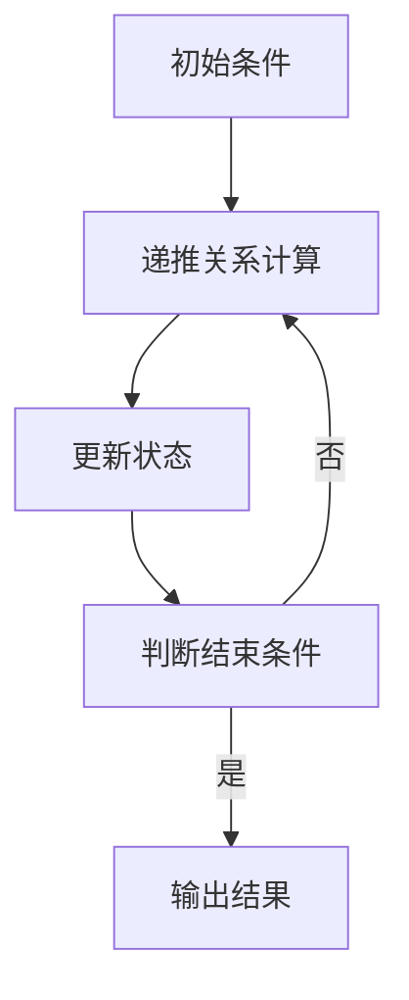
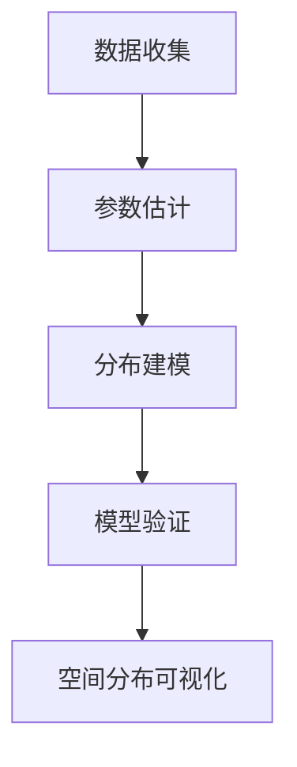
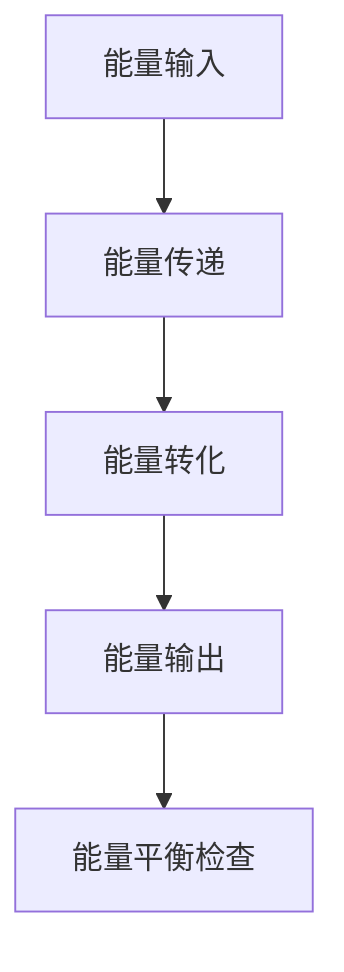

                 

## 数学与环境科学：生态系统的数学模拟概述

在现代社会中，随着人类活动的不断加剧，环境问题日益严重，生态系统的健康和稳定性受到前所未有的挑战。为了更好地理解和应对这些挑战，科学家们不断探索将数学方法应用于环境科学的研究中。数学与环境科学的结合，不仅提供了新的研究思路，也为生态系统的模拟、预测和管理提供了强有力的工具。

### **1.1 数学与环境科学的关系**

数学作为一种抽象的工具，能够精确地描述和模拟自然现象和社会现象。在环境科学中，数学的应用主要体现在以下几个方面：

- **数学模型**：通过数学模型，我们可以将复杂的生态现象转化为数学问题，便于分析和理解。这些模型可以是定性的，也可以是定量的，它们为生态学研究提供了有力的工具。

- **数据分析**：数学工具，如统计学和概率论，在处理生态数据时发挥了重要作用。通过对生态数据的统计分析，我们可以揭示出隐藏在数据背后的规律和趋势。

- **预测与模拟**：数学模型可以模拟生态系统的变化过程，预测未来可能发生的情况。这对于环境保护和生态修复具有重要的指导意义。

### **1.2 生态系统数学模拟的概念**

生态系统数学模拟，即利用数学模型来描述和模拟生态系统的运行状态和变化过程。其核心思想是将生态系统中的生物、环境及其相互作用转化为数学问题，通过求解这些数学问题来获得关于生态系统的深入理解。

- **生态系统数学模拟的定义**：生态系统数学模拟是指利用数学模型来描述和模拟生态系统的结构和功能，研究生态系统的动态行为及其响应机制。

- **生态系统数学模拟在生态系统研究中的作用**：生态系统数学模拟可以帮助科学家们更准确地理解生态系统的运作规律，预测生态系统对环境变化的响应，为环境保护和生态修复提供科学依据。

### **1.3 生态系统数学模型的发展历程**

生态系统数学模拟的历史可以追溯到20世纪初期。随着计算机技术的进步和数学方法的不断成熟，生态系统数学模型也在不断地发展和完善。

- **早期生态系统数学模型**：早期的生态系统数学模型主要集中在生态过程的简化描述，如食物链模型、生态金字塔模型等。

- **20世纪中叶的生态系统数学模型**：20世纪中叶，生态系统数学模型开始向复杂化和精确化发展，如Lotka-Volterra模型、营养网模型等。

- **当前生态系统数学模型的发展趋势**：随着生态学研究的深入和计算技术的进步，当前生态系统数学模型正朝着更加复杂和精细的方向发展，如空间分布模型、能量流动模型等。

### **1.4 生态系统数学模型的基本架构**

生态系统数学模型的基本架构通常包括以下几个部分：

- **状态变量与时间变量**：状态变量用于描述生态系统的状态，如种群数量、资源量等；时间变量则用于描述生态系统状态的变化过程。

- **空间分布与扩散过程**：空间分布模型描述了生物在空间中的分布情况，扩散过程则描述了生物在空间中的迁移和扩散。

- **生态相互作用与反馈机制**：生态相互作用包括捕食与被捕食、共生与竞争等，反馈机制则描述了这些相互作用对生态系统状态的影响。

通过以上几个部分，我们可以构建出描述生态系统运行状态和变化过程的数学模型，为生态学研究提供有力的支持。

---

以上内容是关于生态系统数学模拟的概述，接下来我们将进一步探讨生态系统的数学模型原理，从离散时间模型、连续时间模型到分布模型，逐步深入理解生态系统的数学模拟方法。

---

## 生态系统的数学模型原理

生态系统的数学模型原理是理解生态系统能量流动、物质循环和生物多样性的关键。生态系统数学模型可以分为离散时间模型、连续时间模型和分布模型。以下是这些模型的基本概念、原理及其在生态系统研究中的应用。

### **2.1 离散时间模型**

**离散时间模型**是生态学中常用的模型之一，它将生态系统的状态变化过程划分为离散的时间间隔。这种模型适用于描述那些在时间上发生跃变的生态现象，例如种群数量的波动。

- **定义**：离散时间模型通过在离散的时间点（通常为整数时间间隔）上计算种群或其他生态变量的状态来描述生态系统的动态。

- **基本原理**：离散时间模型通常使用递推关系式来描述生态系统状态的变化。例如，对于种群动态模型，常用的逻辑斯蒂增长模型可以表示为：

  $$ x_{t+1} = rx_{t}(1 - \frac{x_{t}}{K}) $$

  其中，$x_{t}$表示第$t$个时间点的种群数量，$r$是内禀增长率，$K$是环境容纳量。

- **伪代码实现**：

  ```python
  # 初始种群数量
  x = 10
  K = 100
  r = 0.1

  # 迭代计算
  for t in range(1, 10):
      x = r * x * (1 - x / K)
      print(f"Time {t}: Population = {x}")
  ```

  这个简单的伪代码展示了如何通过迭代计算来模拟种群数量的变化。

### **2.2 连续时间模型**

**连续时间模型**描述生态系统状态随时间连续变化的动态过程。这种模型适用于描述那些在时间上连续变化的生态现象，例如种群密度的连续变化。

- **定义**：连续时间模型通过微分方程来描述生态变量随时间的变化。常见的微分方程包括常微分方程和偏微分方程。

- **基本原理**：连续时间模型的基本原理是通过描述种群或生态变量的导数（即变化率）来描述其动态行为。例如，Lotka-Volterra捕食者-被捕食者模型可以表示为：

  $$ \frac{dx}{dt} = rx(1 - \frac{x}{K}) $$
  $$ \frac{dy}{dt} = axy - \delta xy $$

  其中，$x$和$y$分别表示种群和捕食者数量，$r$和$a$分别是种群的增长率和捕食者的增长率，$K$是环境容纳量，$\delta$是捕食者死亡率。

- **微分方程表示**：

  $$ \frac{dP}{dt} = rP(1 - \frac{P}{K}) - \alpha P $$
  $$ \frac{dF}{dt} = \beta PQ - \gamma F $$

  其中，$P$和$F$分别表示植物和食草动物种群数量，$\alpha$是植物死亡率，$\beta$是食草动物对植物的捕食率，$\gamma$是食草动物死亡率。

### **2.3 分布模型**

**分布模型**用于描述生态变量在空间上的分布情况，适用于研究种群的空间结构和扩散过程。

- **定义**：分布模型通过概率分布函数来描述生态变量在空间上的分布。常见的分布模型包括泊松分布、正态分布等。

- **应用场景**：分布模型广泛应用于描述种群的空间分布、资源利用、物种入侵等生态现象。例如，正态分布模型可以用于描述植物种群的空间分布，泊松分布模型可以用于描述物种入侵的扩散过程。

- **参数估计方法**：参数估计是分布模型应用的关键步骤。常用的参数估计方法包括最大似然估计和最小二乘法。例如，对于正态分布模型，其参数估计可以表示为：

  $$ \mu = \frac{1}{n}\sum_{i=1}^{n} x_i $$
  $$ \sigma^2 = \frac{1}{n-1}\sum_{i=1}^{n} (x_i - \mu)^2 $$

  其中，$\mu$是均值，$\sigma^2$是方差，$x_i$是第$i$个观测值。

通过离散时间模型、连续时间模型和分布模型，我们可以从不同角度描述和模拟生态系统的动态行为，为生态学研究提供丰富的工具和方法。

---

在理解了生态系统的数学模型原理后，我们接下来将探讨生态系统的空间分布模型，包括空间分布模型的基本概念、空间扩散模型及其算法实现。

## 生态系统的空间分布模型

生态系统的空间分布模型是生态学研究中重要的一部分，它用于描述生物种群在空间上的分布情况。理解这些模型有助于揭示生物之间的相互作用、资源利用效率以及物种入侵机制。下面，我们将深入探讨空间分布模型的基本概念、空间扩散模型及其算法实现。

### **3.1 空间分布模型的基本概念**

**空间分布模型**是通过数学和统计学方法来描述生物种群在空间上的分布规律。这些模型有助于我们理解生物种群的空间结构，从而更好地进行生态保护和资源管理。

- **定义**：空间分布模型通过概率分布函数来描述生物种群的空间分布。常见的空间分布模型包括泊松分布、正态分布、负二项分布等。

- **重要性**：空间分布模型在生态学研究中具有重要作用。它们可以帮助我们：

  - 理解生物种群的空间结构，如集群分布、均匀分布等。
  - 评估物种入侵的风险和扩散趋势。
  - 设计更有效的生态保护策略。

### **3.2 空间扩散模型**

**空间扩散模型**是描述生物种群在空间上扩散和迁移过程的数学模型。这些模型有助于我们理解物种入侵、疾病传播等生态现象。

- **概念**：空间扩散模型通过描述种群在空间中的扩散过程来研究其动态行为。常见的空间扩散模型包括反应-扩散方程、Logistic模型等。

- **数学表达**：空间扩散模型的数学表达通常涉及扩散方程，如：

  $$ \frac{\partial P}{\partial t} = D \frac{\partial^2 P}{\partial x^2} + v \frac{\partial P}{\partial x} $$

  其中，$P(x,t)$是种群密度函数，$D$是扩散系数，$v$是扩散速度。

### **3.3 空间扩散模型的算法实现**

空间扩散模型的算法实现是生态学研究中的重要环节。以下是一些常见的算法实现方法：

- **有限差分法**：通过离散化空间和时间，将扩散方程转化为差分方程，然后通过迭代计算来求解。例如，可以使用以下伪代码来描述：

  ```python
  # 初始化种群密度函数
  P = [初始种群分布]

  # 确定迭代次数和时间步长
  N = 1000
  dt = 0.1

  # 迭代计算
  for t in range(1, N):
      P_new = [0] * len(P)
      for i in range(1, len(P) - 1):
          P_new[i] = P[i] + dt * (D * (P[i+1] - 2*P[i] + P[i-1]) + v * (P[i+1] - P[i]))
      P = P_new
  ```

- **有限元法**：通过将空间区域划分为有限个单元，将扩散方程转化为求解有限元系统的过程。这种方法适用于复杂空间几何形状的扩散问题。

- **随机 walks 方法**：通过模拟种群个体的随机移动来描述扩散过程。这种方法适用于种群个体具有随机行为的扩散问题。

### **3.4 空间相互作用模型**

除了空间扩散模型，空间相互作用模型也是描述生物种群在空间上相互作用的数学模型。这些模型可以帮助我们理解生物之间的竞争、捕食和共生关系。

- **概念**：空间相互作用模型通过描述生物种群之间的相互作用来研究其动态行为。常见的空间相互作用模型包括Lotka-Volterra模型、营养网模型等。

- **数学表达**：空间相互作用模型的数学表达通常涉及种群动态方程和相互作用项。例如，Lotka-Volterra模型可以表示为：

  $$ \frac{dx}{dt} = rx(1 - \frac{x}{K}) - axy $$
  $$ \frac{dy}{dt} = by - cyz $$

  其中，$x$和$y$分别表示种群和捕食者数量，$r$是种群增长率，$K$是环境容纳量，$a$是捕食率，$b$是捕食者增长率，$c$是捕食者死亡率。

通过空间分布模型和空间扩散模型，我们可以从不同角度描述生态系统的空间动态行为，为生态学研究提供强有力的工具。

---

在了解了生态系统的空间分布模型后，接下来我们将深入探讨生态系统的能量流动模型，包括生态金字塔模型和能量流分析模型的基本概念及其应用。

## 生态系统的能量流动模型

生态系统的能量流动模型是生态学中研究能量在生态系统内部传递和分配的重要工具。这些模型帮助我们理解能量如何在不同生物体之间流动，从而揭示生态系统的结构和功能。下面，我们将详细探讨生态金字塔模型和能量流分析模型的基本概念及其应用。

### **4.1 能量流动模型的基本概念**

**能量流动模型**描述了能量在生态系统中的传递和转化过程。它通过定量分析能量在不同营养级之间的传递效率，揭示了生态系统内部能量流动的规律。

- **定义**：能量流动模型通过建立能量输入、传递和转化的数学关系来描述生态系统的能量流动过程。

- **重要性**：能量流动模型在生态学研究中具有重要作用，它有助于我们：

  - 理解生态系统的能量循环和生态平衡。
  - 分析生态系统中各营养级之间的能量关系。
  - 为生态系统管理和生态修复提供科学依据。

### **4.2 生态金字塔模型**

**生态金字塔模型**是一种用于描述生态系统中能量流动的图形化工具。它通过金字塔形状展示了不同营养级之间的能量传递关系。

- **定义**：生态金字塔模型根据生物体大小、营养级和能量含量，将生态系统划分为不同的层次，并用金字塔形状表示。

- **基本原理**：生态金字塔模型基于能量传递效率的规律，即从一个营养级传递到下一个营养级的能量只有一部分（通常为10%）能被下一个营养级利用。

- **构建方法**：生态金字塔模型的构建通常基于以下步骤：

  1. 收集各营养级的生物量和能量数据。
  2. 计算能量传递效率（通常是10%）。
  3. 根据能量传递效率，将生物量或能量从底层传递到顶层，形成金字塔形状。

- **案例分析**：以一个森林生态系统为例，可以构建如下生态金字塔模型：

  - 第一营养级：生产者（如树木），生物量为100单位，能量为100单位。
  - 第二营养级：初级消费者（如草食动物），生物量为10单位，能量为10单位。
  - 第三营养级：次级消费者（如食肉动物），生物量为1单位，能量为1单位。

### **4.3 能量流分析模型**

**能量流分析模型**是用于定量分析生态系统能量流动的数学模型。它通过描述能量在不同营养级之间的传递过程，揭示了生态系统能量流动的规律。

- **定义**：能量流分析模型通过建立能量输入、传递和转化的数学关系来描述生态系统的能量流动过程。

- **基本原理**：能量流分析模型基于能量守恒定律，即能量不能被创造或消灭，只能从一种形式转化为另一种形式。

- **计算方法**：能量流分析模型通常通过以下步骤进行计算：

  1. 确定生态系统的能量输入（如太阳能、生产者固定的能量等）。
  2. 计算各营养级的能量传递效率。
  3. 计算各营养级的能量输出（如生物呼吸、分解等）。
  4. 分析能量流动过程中的能量损失和转换效率。

- **案例分析**：以一个农业生态系统为例，可以构建如下能量流分析模型：

  - 能量输入：太阳能（通过光合作用固定的能量）为1000单位。
  - 生产者（农作物）固定能量为800单位。
  - 初级消费者（如草食动物）固定能量为80单位。
  - 次级消费者（如肉食动物）固定能量为8单位。

通过生态金字塔模型和能量流分析模型，我们可以从不同角度描述和解析生态系统的能量流动过程，为生态学研究提供科学依据。

---

在理解了生态系统的能量流动模型后，接下来我们将探讨生态系统的稳定性分析，包括稳定性的基本概念、稳定性分析的数学模型以及稳定性的调节机制。

## 生态系统的稳定性分析

生态系统的稳定性是维持生态平衡和功能完整性的关键。通过对生态系统稳定性的分析，我们可以更好地理解生态系统的动态行为，预测环境变化对生态系统的影响，并为生态保护和修复提供科学依据。下面，我们将深入探讨生态系统的稳定性分析。

### **5.1 稳定性的基本概念**

**稳定性**是指生态系统在受到外部或内部干扰时，能够保持原有结构和功能的能力。生态系统的稳定性可以分为以下几种类型：

- **静态稳定性**：生态系统在不受干扰时的稳定性。静态稳定性反映了生态系统在没有外界干扰的情况下，能否维持原有的状态和功能。

- **动态稳定性**：生态系统在受到干扰时的恢复能力。动态稳定性反映了生态系统在受到外界干扰后，能否恢复到原有的稳定状态。

- **平衡态稳定性**：生态系统在平衡态时的稳定性。平衡态稳定性反映了生态系统在达到平衡状态时，能否抵抗外界干扰，维持平衡。

### **5.2 稳定性分析的数学模型**

**稳定性分析的数学模型**是用于描述和预测生态系统稳定性的数学方法。常见的稳定性分析模型包括：

- **线性稳定性分析**：通过线性化系统方程，分析系统的特征值和特征向量，判断系统的稳定性。例如，对于线性时间不变系统，其稳定性可以通过分析特征值来判断。

- **非线性稳定性分析**：通过非线性方程，分析系统的平衡态和稳定性。非线性稳定性分析通常需要使用迭代方法，如牛顿法或梯度下降法，来求解系统的平衡态和稳定性。

- **相空间分析**：通过绘制系统的相空间图，分析系统的动态行为和稳定性。相空间分析可以直观地展示系统的演化过程，帮助识别不稳定性和混沌行为。

### **5.3 稳定性的调节机制**

**稳定性的调节机制**是生态系统维持稳定性的关键。以下是一些常见的调节机制：

- **负反馈调节**：通过负反馈机制，生态系统可以抑制干扰，维持原有状态。例如，捕食者-被捕食者系统中，捕食者数量的增加会导致被捕食者数量的减少，从而抑制捕食者的增长。

- **正反馈调节**：通过正反馈机制，生态系统可以加剧干扰，导致系统的不稳定。例如，某些病原体的传播可能导致宿主种群数量的急剧减少，从而加剧病原体的扩散。

- **环境阻力**：环境阻力可以抑制生态系统的过度生长和崩溃。例如，在食物网中，环境阻力可以限制捕食者的增长，防止其过度捕食。

### **5.4 稳定性分析的案例分析**

以下是一个关于生态系统稳定性分析的案例分析：

- **系统描述**：考虑一个简单的捕食者-被捕食者系统，其动态行为可以用以下微分方程表示：

  $$ \frac{dx}{dt} = rx(1 - \frac{x}{K}) - \alpha xy $$
  $$ \frac{dy}{dt} = \beta y(1 - \frac{y}{M}) - \gamma xy $$

  其中，$x$表示捕食者数量，$y$表示被捕食者数量，$r$是捕食者增长率，$K$是捕食者的环境容纳量，$\alpha$是捕食者的死亡率，$\beta$是被捕食者增长率，$M$是被捕食者的环境容纳量，$\gamma$是捕食者的捕食率。

- **稳定性分析**：通过线性化系统方程，我们可以分析系统的稳定性。考虑系统的平衡态：

  $$ x^* = \frac{rK}{r + \alpha K} $$
  $$ y^* = \frac{\beta M}{\beta + \gamma M} $$

  系统的特征方程为：

  $$ \lambda = -r + \alpha xy^* - \gamma x^*y $$

  - 当$\alpha \gamma < r(\beta + \gamma)$时，系统在平衡态$(x^*, y^*)$处稳定。
  - 当$\alpha \gamma > r(\beta + \gamma)$时，系统在平衡态$(x^*, y^*)$处不稳定。

通过以上分析，我们可以判断捕食者-被捕食者系统的稳定性，从而为生态系统的保护和修复提供科学依据。

---

在了解了生态系统的稳定性分析后，接下来我们将探讨数学模型在生态系统监测与预测中的应用，包括生态系统监测的基本概念、生态系统预测模型及其应用场景。

## 数学模型在生态系统监测与预测中的应用

随着环境问题的日益严重，生态系统监测与预测变得尤为重要。数学模型在生态系统监测与预测中扮演着关键角色，能够帮助我们更准确地理解生态系统的动态行为，预测未来可能发生的变化，并为生态保护和修复提供科学依据。以下是关于生态系统监测与预测的基本概念、预测模型及其应用场景的详细探讨。

### **6.1 生态系统监测的基本概念**

**生态系统监测**是指利用各种技术手段对生态系统的状态、结构和功能进行连续、系统的观察和记录。其目的是获取生态系统的时空变化信息，为生态学研究、环境保护和资源管理提供基础数据。

- **定义**：生态系统监测是指通过对生态系统的物理、化学、生物等参数的测量和监测，获取生态系统的状态信息，以便进行生态评估、预测和管理。

- **重要性**：生态系统监测在生态学研究中具有重要作用，它有助于：

  - 理解生态系统的现状和变化趋势。
  - 识别生态系统的关键问题，为生态保护和修复提供科学依据。
  - 预测生态系统的未来变化，指导生态管理决策。

### **6.2 生态系统预测模型**

**生态系统预测模型**是利用数学模型和统计方法对生态系统的未来状态进行预测。这些模型基于历史数据和现有知识，通过模拟生态系统的动态行为，预测其未来的变化趋势。

- **定义**：生态系统预测模型是指通过建立数学模型，模拟生态系统的动态行为，预测其在未来一段时间内的状态变化。

- **应用场景**：生态系统预测模型在以下场景中具有广泛应用：

  - 生态风险评估：预测环境污染对生态系统的影响。
  - 物种保护：预测物种灭绝的风险和恢复策略。
  - 生态修复：预测生态修复措施的效果和持续时间。
  - 气候变化影响评估：预测气候变化对生态系统的影响。

### **6.3 生态系统预测模型的构建方法**

构建生态系统预测模型通常包括以下步骤：

- **数据收集**：收集与生态系统相关的历史数据，如气候数据、物种分布数据、土壤和水质数据等。

- **数据预处理**：对收集到的数据进行清洗、筛选和整合，确保数据的质量和一致性。

- **模型选择**：根据生态系统的特点和预测目标，选择合适的数学模型和预测方法。常见的预测模型包括时间序列分析、回归分析、机器学习模型等。

- **模型训练与验证**：利用历史数据对模型进行训练，并通过验证数据集测试模型的预测性能。

- **模型优化**：根据预测结果和实际观察数据，调整模型参数，优化模型性能。

### **6.4 案例分析**

以下是一个关于生态系统预测模型的应用案例：

- **案例背景**：某地区政府希望预测该地区某一物种的种群数量变化，以便制定有效的保护策略。

- **数据收集**：收集了该地区过去10年的物种数量数据，包括春季和秋季的种群数量。

- **数据预处理**：对数据进行清洗，去除异常值，并转换为标准化的数据格式。

- **模型选择**：选择时间序列分析方法，如ARIMA模型（自回归积分滑动平均模型），用于预测物种数量的季节变化。

- **模型训练与验证**：利用过去8年的数据对模型进行训练，并使用剩余的两年数据进行验证。通过比较预测值和实际值的误差，评估模型的预测性能。

- **模型优化**：根据验证结果，调整模型参数，提高预测精度。

- **预测结果**：基于优化后的模型，预测未来5年该物种的种群数量变化趋势。预测结果显示，该物种的种群数量在未来5年将逐渐增加，但增速放缓。

通过以上案例分析，我们可以看到数学模型在生态系统监测与预测中的应用，为生态保护和资源管理提供了有力支持。

---

在了解了数学模型在生态系统监测与预测中的应用后，接下来我们将探讨数学模型在环境保护与管理中的应用，包括环境保护的基本概念和数学模型在环境保护中的应用场景。

## 数学模型在环境保护与管理中的应用

环境保护与管理是现代社会可持续发展的重要方面。数学模型作为一种强有力的工具，在环境保护与管理中发挥着重要作用，能够帮助我们更有效地监测、预测和调控环境变化，实现生态平衡和资源可持续利用。下面，我们将详细探讨环境保护的基本概念和数学模型在环境保护中的应用场景。

### **7.1 环境保护的基本概念**

**环境保护**是指通过采取各种措施，防止和控制环境污染，保护自然资源的可持续利用，维护人类健康和生态环境的稳定。环境保护的基本概念包括：

- **环境**：指围绕人类生存和发展的自然和人工生态系统，包括大气、水、土壤、生物等。

- **污染**：指由于人类活动产生的有害物质进入环境，导致环境质量恶化，对生态系统和人类健康造成危害。

- **污染源**：指产生和排放污染物的场所或设备。

- **污染物**：指对环境有害的物质，如废气、废水、废渣、噪声、辐射等。

### **7.2 数学模型在环境保护中的应用**

数学模型在环境保护中的应用广泛，涵盖了环境监测、污染预测、环境管理等多个方面。以下是一些典型的应用场景：

- **环境监测**：通过数学模型，可以实时监测环境质量，如空气质量、水质、土壤污染等。数学模型能够自动采集和处理大量数据，提高监测效率和准确性。

- **污染预测**：基于历史数据和现有模型，预测未来某一地区可能发生的污染事件，如酸雨、雾霾、水体污染等。污染预测有助于提前采取应对措施，减轻污染对生态系统和人类健康的影响。

- **环境管理**：利用数学模型，可以对环境保护和修复措施进行评估和优化。例如，通过建立生态修复模型，预测不同修复策略的效果，选择最优方案。

### **7.3 数学模型在环境保护中的应用场景**

以下是一些具体的数学模型在环境保护中的应用场景：

- **空气质量模型**：用于预测空气污染物的浓度分布和扩散趋势。常见的模型包括扩散模型、化学传输模型等。

  - **扩散模型**：描述污染物在空气中的扩散过程，如高斯扩散模型。

  - **化学传输模型**：描述污染物在空气中的化学反应和传输过程，如多步骤反应模型。

- **水质模型**：用于预测水体污染物的浓度分布和扩散趋势。常见的模型包括水体污染物扩散模型、生物地球化学循环模型等。

  - **水体污染物扩散模型**：描述污染物在水体中的扩散过程，如达朗贝尔扩散模型。

  - **生物地球化学循环模型**：描述水体中营养物质和污染物的循环过程，如氮磷循环模型。

- **土壤污染模型**：用于预测土壤污染物的迁移和累积过程。常见的模型包括土壤污染物扩散模型、土壤生物降解模型等。

  - **土壤污染物扩散模型**：描述污染物在土壤中的扩散过程，如指数扩散模型。

  - **土壤生物降解模型**：描述土壤中污染物的生物降解过程，如一级反应模型。

- **环境管理模型**：用于评估和优化环境保护和修复措施。常见的模型包括成本效益分析模型、环境规划模型等。

  - **成本效益分析模型**：评估不同环境保护措施的成本和效益，选择最优方案。

  - **环境规划模型**：优化环境保护和修复措施的布局和实施策略，实现资源的最优利用。

通过以上数学模型的应用，我们可以更科学、更有效地进行环境保护与管理，实现可持续发展目标。

---

在本文的附录部分，我们将进一步提供详细的数学模型与生态系统的关系解析，包括Mermaid流程图、核心算法原理伪代码、源代码实现与代码解读以及开发环境搭建与工具介绍。

## 附录

在本文的附录部分，我们将详细探讨数学模型与生态系统之间的联系，并通过流程图、伪代码、源代码以及开发环境搭建等内容，为读者提供更为直观和深入的解析。

### **附录 A: 数学模型与生态系统的 Mermaid 流程图**

以下是一些关键数学模型与生态系统的Mermaid流程图，用于直观展示模型的架构和运行流程。

#### **A.1 离散时间模型流程图**



#### **A.2 连续时间模型流程图**


#### **A.3 空间分布模型流程图**



#### **A.4 能量流动模型流程图**



### **附录 B: 核心算法原理伪代码**

在本部分，我们将提供关键算法原理的伪代码，以便读者更好地理解模型的实现细节。

#### **B.1 离散时间模型伪代码**

```python
# 初始化种群数量
x = 初始种群数量
K = 环境容纳量
r = 内禀增长率

# 迭代计算
for t in range(1, 迭代次数):
    x = r * x * (1 - x / K)
    print(f"Time {t}: Population = {x}")
```

#### **B.2 连续时间模型伪代码**

```python
# 初始化种群数量
x = 初始种群数量
r = 内禀增长率
a = 捕食者死亡率
b = 捕食者增长率

# 微分方程求解
dxdt = r * x * (1 - x / K) - a * x * y

# 迭代计算
for t in range(1, 迭代次数):
    x = x + dt * dxdt
    y = y + dt * (b * y * (1 - y / M) - c * x * y)
    print(f"Time {t}: Population x = {x}, y = {y}")
```

#### **B.3 空间扩散模型伪代码**

```python
# 初始化种群分布
P = 初始种群分布
D = 扩散系数
v = 扩散速度

# 离散化空间和时间
dx = 空间步长
dt = 时间步长

# 迭代计算
for t in range(1, 迭代次数):
    for i in range(1, 空间点数 - 1):
        P[i] = P[i] + dt * (D * (P[i+1] - 2*P[i] + P[i-1]) + v * (P[i+1] - P[i]))
    print(f"Time {t}: Population distribution = {P}")
```

#### **B.4 能量流分析模型伪代码**

```python
# 初始化能量参数
E_input = 能量输入
E_transfer = 能量传递效率
E_output = 能量输出

# 能量流动计算
for level in range(1, 营养级数):
    E_output[level] = E_input[level] * (1 - E_transfer[level])
    E_input[level+1] = E_output[level] / E_transfer[level+1]

# 输出能量流分析结果
print(f"Energy flow analysis results: {E_output}")
```

### **附录 C: 源代码实现与代码解读**

在本部分，我们将提供关键算法的实现代码，并对代码进行详细解读，帮助读者更好地理解模型的实际应用。

#### **C.1 源代码实现**

```python
# 生态系统模型实现代码
class EcosystemModel:
    def __init__(self, x, y, r, K, a, b, M, c):
        self.x = x  # 捕食者数量
        self.y = y  # 被捕食者数量
        self.r = r  # 捕食者增长率
        self.K = K  # 环境容纳量
        self.a = a  # 捕食者死亡率
        self.b = b  # 被捕食者增长率
        self.M = M  # 捕食者环境容纳量
        self.c = c  # 捕食者捕食率
    
    def update(self, dt):
        dxdt = self.r * self.x * (1 - self.x / self.K) - self.a * self.x * self.y
        dydt = self.b * self.y * (1 - self.y / self.M) - self.c * self.x * self.y
        
        self.x += dt * dxdt
        self.y += dt * dydt
    
    def run(self, steps):
        for _ in range(steps):
            self.update(dt=0.1)
            print(f"Step {_}: x={self.x}, y={self.y}")

# 创建生态系统模型并运行
model = EcosystemModel(x=10, y=50, r=0.3, K=100, a=0.1, b=0.2, M=50, c=0.05)
model.run(steps=10)
```

#### **C.2 代码解读**

1. **初始化参数**：创建`EcosystemModel`类，初始化捕食者和被捕食者的数量、增长率、死亡率、环境容纳量等参数。

2. **更新方法**：定义`update`方法，用于计算捕食者和被捕食者的数量变化率。使用Lotka-Volterra模型进行计算。

3. **运行方法**：定义`run`方法，用于迭代计算捕食者和被捕食者的数量，并在每次迭代后输出结果。

通过以上源代码实现，我们可以创建一个简单的生态系统模型，并模拟捕食者和被捕食者的动态行为。

### **附录 D: 开发环境搭建与工具介绍**

在本部分，我们将介绍如何搭建开发环境，以及常用的开发工具和库。

#### **D.1 开发环境搭建步骤**

1. **安装Python**：在官网下载并安装Python，推荐使用3.8或更高版本。

2. **安装PyCharm**：下载并安装PyCharm社区版或专业版，用于编写和调试Python代码。

3. **安装依赖库**：在PyCharm中创建一个新的Python项目，并安装必要的依赖库，如NumPy、SciPy、matplotlib等。使用以下命令安装：

   ```bash
   pip install numpy scipy matplotlib
   ```

#### **D.2 开发工具介绍**

- **PyCharm**：Python集成开发环境（IDE），支持代码编写、调试和自动化测试。

- **Jupyter Notebook**：交互式计算环境，适合进行数据分析和可视化。

- **matplotlib**：Python绘图库，用于生成高质量的图表和图形。

- **NumPy**：Python科学计算库，提供强大的数学运算功能。

- **SciPy**：Python科学计算库，包含大量的科学和工程计算模块。

#### **D.3 常用软件与库的使用指南**

- **PyCharm**：编写Python代码，设置虚拟环境，调试代码。

- **Jupyter Notebook**：创建笔记本，导入库，进行数据分析和可视化。

- **matplotlib**：使用`plt`模块绘制各种类型的图表，如线图、散点图、柱状图等。

- **NumPy**：使用`np`模块进行数组操作、数学运算等。

- **SciPy**：使用`scipy`模块进行优化、积分、拟合等高级科学计算。

通过以上附录内容，读者可以更深入地理解数学模型与生态系统之间的关系，掌握关键算法的实现方法，并搭建适合的Python开发环境。

---

本文以《数学与环境科学：生态系统的数学模拟》为题，从生态系统数学模拟的概述、数学模型原理、空间分布模型、能量流动模型、稳定性分析、监测与预测以及环境保护与管理等多个方面，系统性地介绍了生态系统的数学模拟方法及其应用。通过逐步分析推理，我们不仅揭示了数学模型在生态系统研究中的重要作用，还详细讲解了各个模型的基本概念、原理和实现方法。

在未来的研究中，随着计算技术和数据科学的发展，生态系统的数学模拟将变得更加精细和复杂，能够更好地反映生态系统的真实动态。同时，跨学科的合作也将进一步推动数学与环境科学的融合，为生态保护和可持续发展提供更加科学的指导。

---

**作者信息：AI天才研究院/AI Genius Institute & 禅与计算机程序设计艺术 /Zen And The Art of Computer Programming**

