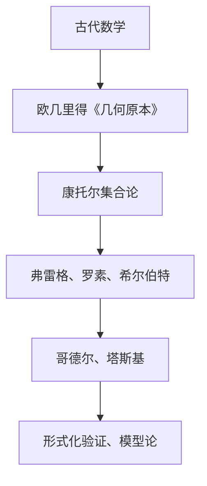
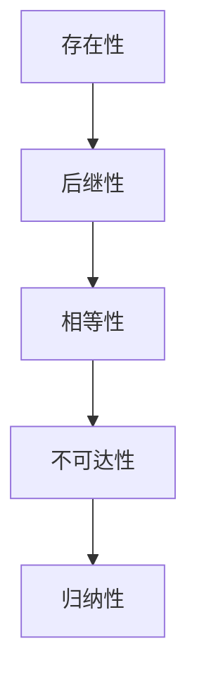
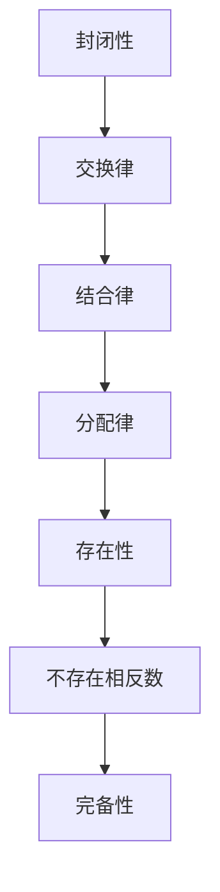
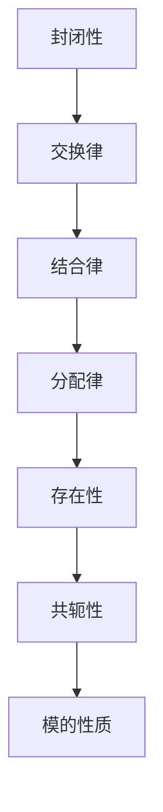

                 

### 第1章：数学公理体系的起源与发展

#### 1.1 数学公理体系的概念

**数学公理**，通常被定义为一组基础性、无需证明即被接受的前提条件，这些条件构成了数学理论的基础框架。简单来说，公理是一种自明的真理，它不依赖于其他任何概念或命题，是整个数学系统逻辑推导的起点。

在形式化的数学理论中，公理体系被用于确保数学理论的内在一致性和系统性。通过公理，我们可以从基本的事实出发，逐步推导出更复杂的结论和定理。这种由公理导出的数学系统，是现代数学分析、几何、代数和逻辑等各个分支学科的理论基础。

**数学公理体系**，则是由一系列相互独立但又相互联系的公理所组成的系统。这些公理不是孤立存在的，而是彼此相互作用，共同构成了一个完整而严密的数学框架。一个数学公理体系的好坏，取决于其是否能够准确地捕捉到数学的核心概念，以及是否能够逻辑地推导出所有的数学定理。

公理的选择和表述，对数学理论的发展和进步有着深远的影响。不同的公理体系可能导出不同的数学理论，甚至是完全不同的数学世界。例如，皮亚诺公理系统奠定了自然数理论的基础，而集合论公理系统则为现代数学的各个分支提供了坚实的基础。

#### 1.2 数学公理体系的发展历程

数学公理体系的发展历程，是人类数学思想不断演化和深化的过程。这一历程大致可以分为以下几个阶段：

**古代数学**：数学公理体系的起源可以追溯到古希腊。在欧几里得的《几何原本》中，他系统地提出了平面几何的公理体系。欧几里得将几何学建立在一系列定义和公理之上，这些公理被认为是自明的真理，无需证明。例如，他提出的“通过两点可以画出一条直线”这一公理，至今仍然是几何学的基本原理。

**19世纪**：19世纪是数学公理体系发展的关键时期。这一时期，数学家们开始将数学基础从直观的几何学转向抽象的集合论。康托尔是这一时期的代表人物，他提出了集合论，并定义了无穷集合的概念。康托尔的集合论为后来的数学发展奠定了基础。

与此同时，弗雷格、罗素和希尔伯特等人也对数学公理体系进行了深入研究。弗雷格提出了概念和对象分离的思想，试图将数学建立在逻辑之上。罗素则发现了悖论，揭示了集合论的基础问题。希尔伯特则通过严格的公理化方法，提出了希尔伯特空间，为现代数学提供了新的研究工具。

**20世纪**：20世纪是数学公理体系发展的一个重要转折点。哥德尔和塔斯基的工作，使得数学公理体系的局限性变得尤为明显。哥德尔的不完备性定理表明，在集合论中，并不是所有的命题都能被证明或证伪。塔斯基则提出了形式化的语义学，为数学逻辑提供了新的解释方法。

此外，形式化验证和模型论在这一时期也得到了迅速发展。形式化验证是使用计算机证明数学定理的方法，它使得数学证明更加精确和可靠。模型论则是研究数学公理系统的模型和解释的数学分支。

#### 1.3 数学公理体系的重要性

数学公理体系在数学和科学中具有至关重要的地位。以下是数学公理体系的重要性体现在几个方面：

**基础性**：数学公理体系为数学提供了可靠的基础，使得数学理论具有一致性和系统性。通过公理，我们可以确保数学命题的逻辑推导是自洽的，从而建立起一个稳定的数学框架。

**普适性**：数学公理体系的普适性体现在其不仅仅适用于纯数学，还广泛应用于物理学、计算机科学、经济学等众多学科。许多科学理论，如物理学中的相对论和量子力学，都是建立在数学模型和数学公理基础之上的。

**推动力**：数学公理体系的不断发展，推动了数学理论的创新和数学方法的进步。每一次数学公理体系的重大突破，都带来了数学的飞跃式发展，从而推动了整个科学和技术的前进。

**稳定性**：数学公理体系的稳定性使得数学研究可以持续进行，不必担心基础理论的崩溃。即使在发现悖论和局限性时，数学家们也能通过改进公理体系，找到解决问题的方法。

总之，数学公理体系是数学理论的基石，它不仅为我们提供了一个可靠和一致的理论框架，而且推动了数学和科学的不断进步。

### Mermaid 流程图：数学公理体系的发展历程

### 第2章：经典数学公理体系的构成

#### 2.1 数学基础

数学基础是构建数学理论体系的核心部分，它包括自然数、实数和复数的公理系统。这些基础部分的公理不仅为数学理论提供了坚实的逻辑基础，而且在各个数学分支中都有广泛的应用。

##### 2.1.1 自然数的公理系统

自然数是数学中最基本的概念之一，自然数的公理系统通常基于皮亚诺公理。皮亚诺公理包括以下五个基本命题：

1. **存在性**：存在一个自然数0。
2. **后继性**：对于每一个自然数n，都存在一个自然数n+1，称为n的后继。
3. **相等性**：如果两个自然数具有相同的后继，那么它们是相等的。
4. **不可达性**：0不是任何自然数的后继。
5. **归纳性**：对于任意的性质P(n)，如果P(0)成立，且P(n)成立能推导出P(n+1)成立，那么P(n)对于所有的自然数n都成立。

皮亚诺公理系统简洁而有力，它不仅定义了自然数的基本性质，还提供了数学归纳法的理论基础。数学归纳法是证明自然数性质和关系的一种基本方法。

**皮亚诺公理系统流程图**：

##### 2.1.2 实数的公理系统

实数是数学中最基本的数系之一，它在几何、分析、代数等多个领域都有广泛的应用。实数的公理系统通常基于完备有序域的概念，它包括以下主要公理：

1. **封闭性**：实数的加法和乘法在实数域内是封闭的，即任意两个实数的和与积仍然是实数。
2. **交换律**：实数的加法和乘法满足交换律，即a + b = b + a，a × b = b × a。
3. **结合律**：实数的加法和乘法满足结合律，即(a + b) + c = a + (b + c)，(a × b) × c = a × (b × c)。
4. **分配律**：实数的乘法对加法满足分配律，即a × (b + c) = (a × b) + (a × c)。
5. **存在性**：实数域中存在加法和乘法的单位元素，即存在0和1，使得对于任意实数a，有a + 0 = a，a × 1 = a。
6. **不存在相反数**：对于任意非零实数a，不存在b使得a + b = 0。
7. **完备性**：实数域是完备的，即对于任意实数序列{a_n}，如果{a_n}有极限，那么极限必须在实数域内。

实数的公理系统不仅确保了实数的运算规律，还保证了实数的连续性。这种连续性是微积分和拓扑学等数学分支理论发展的基础。

**实数公理系统流程图**：

##### 2.1.3 复数的公理系统

复数是实数的扩展，它们在数学和物理学中有重要的应用。复数的公理系统基于复数域，包括以下主要公理：

1. **封闭性**：复数的加法和乘法在复数域内是封闭的，即任意两个复数的和与积仍然是复数。
2. **交换律**：复数的加法和乘法满足交换律，即a + b = b + a，a × b = b × a。
3. **结合律**：复数的加法和乘法满足结合律，即(a + b) + c = a + (b + c)，(a × b) × c = a × (b × c)。
4. **分配律**：复数的乘法对加法满足分配律，即a × (b + c) = (a × b) + (a × c)。
5. **存在性**：复数域中存在加法和乘法的单位元素，即存在0和1，使得对于任意复数a，有a + 0 = a，a × 1 = a。
6. **共轭性**：对于任意复数a + bi，存在其共轭复数a - bi，使得(a + bi)(a - bi) = a^2 + b^2是一个非负实数。
7. **模的性质**：复数a + bi的模定义为|a + bi| = √(a^2 + b^2)，它是一个非负实数，并且满足三角不等式。

复数的公理系统不仅保证了复数的运算规律，还引入了模和共轭复数等概念，这些概念在复变函数和量子物理学中都有重要的应用。

**复数公理系统流程图**：

通过这些公理系统，数学家们建立了自然数、实数和复数的基本框架，这些框架不仅为数学理论的发展奠定了基础，也为其他数学分支和实际应用提供了工具。

### 第3章：非标准数学公理体系

#### 3.1 非标准逻辑与模型论

非标准数学公理体系，是指在传统数学公理体系的基础上，通过引入一些额外的或修改现有公理，从而产生的新的数学体系。这些非标准体系不仅在理论上具有重要意义，而且在实际应用中也有着广泛的应用。在本节中，我们将探讨非标准逻辑与模型论的基本概念和应用。

##### 3.1.1 非标准模型的概念

非标准模型是相对于标准模型而言的。在标准模型中，我们通常假设所有数学对象都是符合标准公理体系的。然而，在实际研究和应用中，有时需要考虑更广泛的数学对象，这些对象可能不完全符合标准公理体系。非标准模型就是为了处理这些不完全符合标准公理体系的对象而提出的。

一个简单的例子是超实数。超实数是非标准模型中的一个重要概念，它包括无穷小数和无穷大数。超实数是实数的扩展，它们在数学分析、概率论和物理学等领域有广泛的应用。超实数中的无穷小数可以用来描述物理过程中的极小变化，而无穷大数则可以用来表示非常大的数量级。

非标准模型的概念在数学逻辑和模型论中有着重要的地位。通过引入非标准模型，我们可以在不违反现有公理体系的前提下，研究更多的数学对象和更复杂的数学结构。

##### 3.1.2 非标准模型的应用

非标准模型在数学和物理学中有着广泛的应用。以下是一些典型的应用场景：

**概率论**：在概率论中，超实数被用来描述不确定性。例如，概率论中的随机变量可以表示为超实数集合上的函数。通过超实数，我们可以在数学上精确地描述随机事件的概率分布。

**物理学**：在物理学中，非标准模型也被广泛使用。例如，在量子物理学中，量子态被表示为希尔伯特空间中的向量。希尔伯特空间是一个非标准模型，它包含了复数和无限维向量空间。通过希尔伯特空间，我们可以描述量子系统的行为和演化。

**计算复杂性**：在计算复杂性理论中，非标准模型也被用来研究计算问题的难度。例如，在某些非标准模型中，一些被认为难以解决的问题可能在非标准计算模型中变得可解。这些非标准模型为计算复杂性理论提供了一种新的研究工具。

**数学分析**：在数学分析中，非标准模型被用来处理一些复杂的极限问题。例如，超实数的概念可以用来定义和分析一些极限问题，使得这些问题的处理变得更加简单和直观。

总之，非标准数学公理体系不仅扩展了传统数学公理体系的应用范围，也为数学和物理学的发展提供了新的工具和方法。

#### 3.2 非标准逻辑与模型论

非标准逻辑与模型论是现代数学中的重要分支，它们为我们提供了研究数学理论和验证数学命题的新方法。在本节中，我们将探讨非标准逻辑的基本概念和应用，以及模型论中的关键概念。

##### 3.2.1 非标准逻辑的基本概念

非标准逻辑是相对于标准逻辑而言的。标准逻辑是基于经典数学公理体系的一种逻辑系统，它包括命题逻辑和谓词逻辑。然而，在处理某些复杂问题时，标准逻辑可能显得不够强大。非标准逻辑通过引入新的概念和规则，扩展了标准逻辑的能力。

**非标准命题逻辑**：在非标准命题逻辑中，我们引入了新的逻辑运算符，如蕴涵（→）、等价（↔）和析取（∨）。这些运算符可以用来表示更复杂的逻辑关系。例如，我们可以在非标准命题逻辑中定义一个运算符“模糊蕴涵”，它可以用来表示两个命题之间的模糊关系。

**非标准谓词逻辑**：在非标准谓词逻辑中，我们引入了新的量词，如全称量词（∀）和存在量词（∃）。这些量词可以用来表示更复杂的命题。例如，我们可以在非标准谓词逻辑中定义一个全称量词“∀*”，它表示对所有可能的数学对象都成立的性质。

**非标准模型**：非标准逻辑的一个重要应用是建立非标准模型。非标准模型是满足非标准逻辑公理体系的模型，它可能包含一些在标准模型中不存在的元素。通过非标准模型，我们可以在新的数学世界中研究各种问题。

**应用场景**：非标准逻辑在计算机科学、人工智能和数学哲学等领域有广泛的应用。例如，在计算机科学中，非标准逻辑被用来验证程序的正确性；在人工智能中，非标准逻辑被用来构建智能推理系统；在数学哲学中，非标准逻辑被用来探讨数学对象的存在性和实在性。

##### 3.2.2 模型论的关键概念

模型论是研究数学公理体系及其模型的数学分支。模型论中的关键概念包括：

**模型**：模型是满足某个数学公理体系的集合和解释。例如，一个集合论模型是一个满足集合论公理的集合及其解释。

**模型论公理**：模型论公理是关于模型的性质和关系的公理。例如，存在性公理表示一个模型中存在某个元素。

**模型论定理**：模型论定理是关于模型性质的结论。例如，紧致性定理表明，如果一个理论的所有有限子句集合都是可饱和的，那么这个理论也是可饱和的。

**模型论的应用**：模型论在数学逻辑、数学基础和数学哲学等领域有重要应用。例如，在数学逻辑中，模型论被用来证明数学理论的相对一致性；在数学基础中，模型论被用来探讨数学对象的存在性；在数学哲学中，模型论被用来探讨数学与现实世界的关系。

总之，非标准逻辑与模型论是现代数学中不可或缺的分支，它们为我们提供了研究数学理论和验证数学命题的新方法。通过非标准逻辑和模型论，我们可以在更广泛的数学世界中探索各种问题，从而推动数学的发展。

#### 3.3 数学哲学观的演变

数学哲学观是关于数学的本质、方法和价值的哲学思考。它不仅反映了人类对数学的理解，也影响了数学的发展方向。数学哲学观的演变经历了几个重要阶段，包括古代、近代和现代。在这三个阶段中，不同的哲学家提出了各自的观点，这些观点对数学哲学的发展产生了深远的影响。

##### 4.1.1 实证主义与逻辑主义

**实证主义**：实证主义认为，数学理论必须基于经验事实。实证主义者认为，数学对象和关系是通过感官经验得到的，数学定理的证明必须依赖于经验观察。法国哲学家奥古斯丁·孔德是实证主义的重要代表人物。他认为，数学理论是一种经验科学的产物，必须通过实证方法来验证。

**逻辑主义**：逻辑主义则认为，数学理论是逻辑系统的推论。逻辑主义者主张，数学概念和定理可以通过逻辑推理得出，而不需要依赖于经验观察。弗雷格和罗素是逻辑主义的主要代表人物。弗雷格提出了概念和对象分离的思想，认为数学对象是抽象的逻辑实体。罗素则通过形式逻辑重新定义了数学，提出了逻辑原子主义。

实证主义和逻辑主义在数学哲学中形成了两个主要的派别，它们对数学的基础和方法提出了不同的解释。实证主义强调数学与物理现实的联系，而逻辑主义强调数学的逻辑结构。

##### 4.1.2 经验主义与形式主义

**经验主义**：经验主义认为，数学理论是通过经验发现的。经验主义者认为，数学概念和关系是从感官经验中归纳出来的，数学证明是基于经验事实的推论。英国哲学家弗兰西斯·培根是经验主义的重要代表人物。他认为，数学是一种实验科学的产物，必须通过经验观察来验证。

**形式主义**：形式主义则认为，数学理论是一种形式化的符号系统。形式主义者主张，数学概念和定理是通过形式化的推理过程得出的，而不是基于经验观察。希尔伯特是形式主义的主要代表人物。他提出了形式化的数学体系，试图通过严格的公理和逻辑推理来构建整个数学理论。

经验主义和形式主义在数学哲学中形成了另一个重要的对立。经验主义强调数学与经验世界的联系，而形式主义强调数学的形式化和抽象性。

##### 4.1.3 柏拉图主义与康托尔主义

**柏拉图主义**：柏拉图主义认为，数学对象是抽象的、独立于人类思维的存在。柏拉图认为，数学对象是一种永恒的、不变的真理，存在于超验的数学王国中。柏拉图主义在数学哲学中强调数学的客观性和绝对性。

**康托尔主义**：康托尔主义则认为，数学对象是集合的抽象表示。康托尔是集合论的创始人，他提出了一系列关于无穷集合的深刻理论。康托尔认为，数学对象不是独立存在的，而是通过集合的概念构建起来的。康托尔主义在数学哲学中强调数学的构造性和抽象性。

柏拉图主义和康托尔主义对数学的本质提出了不同的解释。柏拉图主义强调数学的绝对真理，而康托尔主义强调数学的构造性和抽象性。

总之，数学哲学观的演变是一个复杂而多元的过程。不同的哲学家提出了不同的观点，这些观点共同推动了数学哲学的发展。实证主义、逻辑主义、经验主义、形式主义、柏拉图主义和康托尔主义等不同的哲学观点，构成了数学哲学的丰富内涵，也为数学的发展提供了不同的视角和方法。

### 第5章：数学公理体系的挑战与争议

#### 5.1 数学公理体系的不完备性

数学公理体系的不完备性是指，在一个数学公理体系中，总有一些命题是无法被证明或证伪的。这种不完备性不仅影响了数学理论的稳定性，也引发了关于数学哲学和逻辑学的一系列争议。在本节中，我们将探讨数学公理体系的不完备性及其带来的挑战与争议。

##### 5.1.1 古典数学的危机

古典数学，特别是古希腊数学，曾被认为是完美无缺的。然而，随着数学的发展，一些问题逐渐浮现。最著名的例子就是无理数的发现。在欧几里得的《几何原本》中，他提出了一系列关于几何的公理和定理。然而，无理数的存在挑战了这些公理和定理的基础。例如，√2是一个无理数，这意味着它不能表示为两个整数的比例。这一发现引发了古典数学的危机，使得人们开始怀疑现有的数学公理体系是否足够完备。

另一个例子是连续统的悖论。在康托尔的集合论中，他提出了无穷集合的概念，并发现了一些有趣的性质。然而，康托尔的集合论也引发了一些悖论，如罗素悖论。罗素悖论指出，如果一个集合包含所有不包含自身的集合，那么这个集合本身是否包含自身呢？这个问题导致了一系列关于集合论基础的问题，进一步揭示了数学公理体系的不完备性。

##### 5.1.2 集合论的不完备性

集合论是现代数学的基础之一，它为许多数学分支提供了理论基础。然而，集合论本身也面临着不完备性的挑战。哥德尔的不完备性定理是集合论不完备性的一个重要证明。

**哥德尔第一不完备性定理**：哥德尔第一不完备性定理表明，在一个足够强的形式化系统中，不能同时满足一致性和完备性。具体来说，如果一个形式化系统能够表达基本的算术，那么这个系统要么是不一致的（即能够证明任何命题），要么是不完备的（即存在不能被证明也不能被证伪的命题）。

**哥德尔第二不完备性定理**：哥德尔第二不完备性定理进一步表明，任何形式化系统都不能证明自己的无矛盾性。这意味着，即使一个形式化系统是自洽的，我们也不能证明它是无矛盾的。

哥德尔的不完备性定理对数学哲学和逻辑学产生了深远的影响。它表明，数学公理体系无法完全消除不确定性，这也引发了一些哲学家对数学基础的重新思考。

##### 5.1.3 数学公理体系的争议

数学公理体系的争议主要集中在以下几个方面：

**公理的选择**：不同的数学公理体系可能导致不同的数学理论。例如，皮亚诺公理系统和集合论公理系统都为自然数提供了基础，但它们在逻辑结构和应用上有所不同。这种多样性引发了关于哪个公理系统更优的争议。

**数学实在性**：数学公理体系的争议也涉及数学对象的存在性问题。柏拉图主义认为，数学对象是抽象的、独立于人类思维的存在，而康托尔主义则认为，数学对象是集合的抽象表示。这些不同的观点对数学的基础和方法产生了深远的影响。

**逻辑主义与形式主义**：逻辑主义认为，数学理论是逻辑系统的推论，而形式主义则认为，数学理论是一种形式化的符号系统。这两种观点在数学哲学中引发了激烈的争议，影响了对数学本质的理解。

总之，数学公理体系的不完备性及其带来的争议，反映了数学理论的复杂性和多样性。这些争议不仅促进了数学哲学和逻辑学的发展，也为数学的进一步研究提供了新的视角和方法。

### 第6章：数学公理体系的现代发展

#### 6.1 计算机科学对数学公理体系的影响

计算机科学的发展对数学公理体系产生了深远的影响。随着计算机技术的进步，数学公理体系不仅得到了扩展，而且在形式化验证、类型系统和计算机求解等方面也取得了显著进展。

##### 6.1.1 形式化验证

形式化验证是计算机科学中的一个重要概念，它指的是使用形式化的方法验证系统、程序或数学证明的正确性。形式化验证在数学公理体系中找到了重要应用，因为它提供了一种确保数学推理无误的方法。

**形式化数学**：形式化数学是通过符号化的方式表达数学理论，使得数学推理具有严格的形式。形式化数学的一个关键步骤是定义一个形式化系统，这个系统包括一套符号、语法规则和语义规则。通过这个系统，我们可以将数学推理转化为逻辑表达式，并使用计算机程序来验证推理的正确性。

**形式化验证工具**：许多形式化验证工具被开发出来，用于验证数学定理和证明。例如，Z语言和PVS（Proof Verification System）是两种广泛使用的形式化验证工具。Z语言是一种基于一阶逻辑的数学语言，它被用来表达数学理论和验证数学证明。PVS则是一种更高级的形式化验证系统，它支持更复杂的逻辑和证明技术。

**应用场景**：形式化验证在许多领域有重要应用，包括航空航天、汽车工程和金融等领域。例如，在航空航天领域，形式化验证可以用于验证飞行控制系统的正确性，从而确保飞行安全。在金融领域，形式化验证可以用于验证金融模型的正确性，从而减少金融风险。

##### 6.1.2 类型系统和依赖类型理论

类型系统是编程语言中的一个重要概念，它用于确保程序中变量类型的正确性。类型系统通过定义类型和类型规则，可以防止类型错误，提高程序的安全性和可靠性。

**基本类型系统**：在基本类型系统中，每个变量都有一个固定的类型，类型之间通过兼容性规则进行关联。例如，在C语言中，整型（int）和浮点型（float）是两种基本类型，它们可以通过类型转换规则进行转换。

**依赖类型系统**：依赖类型系统是一种更先进的类型系统，它允许类型依赖于其他类型。依赖类型系统的核心思想是，类型的确定不仅依赖于变量本身，还依赖于其他变量和上下文。这种类型系统可以更好地处理复杂程序中的类型关系。

**依赖类型理论**：依赖类型理论是依赖类型系统的理论基础，它提供了一套形式化的规则和语义。依赖类型理论的核心是依赖多态性，它允许不同类型的对象根据上下文动态地决定类型。

**应用场景**：依赖类型系统在编程语言设计和编译器开发中有着广泛的应用。例如，在Java编程语言中，依赖类型系统被用来处理泛型和接口。在编译器中，依赖类型系统可以用于类型检查和类型推断，从而提高编译效率和程序性能。

##### 6.1.3 计算机对数学问题的求解

计算机的出现不仅改变了数学研究的工具和方法，也推动了数学问题求解的新方法的发展。

**计算机代数系统**：计算机代数系统（Computer Algebra Systems，CAS）是用于求解数学问题和进行数学计算的工具。常见的计算机代数系统包括Maple、MATLAB和Mathematica等。这些系统提供了强大的符号计算和数值计算功能，可以处理各种数学问题。

**符号计算**：符号计算是计算机代数系统的一个重要特点，它可以在符号层面处理数学问题。通过符号计算，我们可以进行符号积分、符号微分、符号代数操作等。这种能力使得计算机代数系统在数学研究和教育中有着广泛应用。

**数值计算**：数值计算是计算机代数系统的另一个重要功能，它可以在数值层面处理数学问题。通过数值计算，我们可以求解线性方程组、非线性方程、优化问题等。这种能力使得计算机代数系统在科学计算和工程应用中有着重要作用。

**数学软件**：数学软件（Mathematical Software）是计算机在数学领域中应用的一个重要方面。常见的数学软件包括Sage和MATLAB等。这些软件提供了丰富的数学函数和工具，可以用于数学建模、数值计算、图像处理等。数学软件的发展不仅提高了数学研究的效率，也推动了数学应用的创新。

总之，计算机科学对数学公理体系的影响体现在多个方面。形式化验证、类型系统和计算机求解等技术的进步，不仅扩展了数学公理体系的应用范围，也为数学研究提供了新的工具和方法。这些技术的发展，推动了数学的进一步发展和应用，也为科学技术的进步做出了重要贡献。

### 第7章：数学公理体系在科学和哲学中的应用

#### 7.1 数学公理体系在物理学中的应用

数学公理体系在物理学中扮演着至关重要的角色。物理学中的许多理论，如相对论和量子力学，都建立在数学模型和数学公理基础之上。数学公理体系不仅为物理学提供了精确的工具，还推动了物理学理论的深入发展。

##### 7.1.1 相对论与量子力学中的数学模型

**相对论中的数学模型**

相对论，特别是广义相对论，是爱因斯坦在20世纪初提出的理论，它改变了人类对时空和重力本质的理解。在相对论中，数学模型是核心组成部分。以下是相对论中的一些关键数学模型：

1. **洛伦兹变换**：洛伦兹变换是相对论中的基本数学工具，它描述了不同惯性系之间的时空坐标转换关系。洛伦兹变换基于相对性原理和光速不变原理，是一个非线性的变换。

   \[
   x' = \gamma (x - vt), \quad y' = y, \quad z' = z, \quad t' = \gamma (t - \frac{vx}{c^2})
   \]

   其中，\(\gamma = \frac{1}{\sqrt{1 - \frac{v^2}{c^2}}}\) 是洛伦兹因子，\(v\) 是相对速度，\(c\) 是光速。

2. **黎曼几何**：广义相对论使用了黎曼几何来描述时空的性质。在黎曼几何中，时空被视为一个四维弯曲空间，其中质量能量分布决定了时空的曲率。爱因斯坦场方程是描述这种曲率与物质分布关系的核心方程：

   \[
   G_{\mu\nu} + \Lambda g_{\mu\nu} = \frac{8\pi G}{c^4} T_{\mu\nu}
   \]

   其中，\(G_{\mu\nu}\) 是爱因斯坦张量，\(\Lambda\) 是宇宙学常数，\(g_{\mu\nu}\) 是度规张量，\(T_{\mu\nu}\) 是能量-动量张量，\(G\) 是引力常数。

**量子力学中的数学模型**

量子力学是研究微观粒子行为的理论，它在数学模型和数学公理体系的基础上取得了巨大成功。以下是量子力学中的一些关键数学模型：

1. **希尔伯特空间**：量子态被表示为希尔伯特空间中的向量。希尔伯特空间是一个完备的内积空间，它为量子态的表示和量子态之间的叠加提供了数学框架。

2. **算符**：量子力学中的物理量（如位置、动量、自旋等）通过算符来描述。算符是希尔伯特空间上的线性算子，它们可以用来计算量子态的期望值和概率分布。

3. **波函数**：波函数是量子态的数学表示，它是一个希尔伯特空间中的向量。波函数的平方给出了粒子在空间中出现的概率密度。

4. **薛定谔方程**：薛定谔方程是量子力学的基本方程，它描述了量子态随时间的演化。时间依赖的薛定谔方程可以表示为：

   \[
   i\hbar \frac{\partial \Psi}{\partial t} = \hat{H} \Psi
   \]

   其中，\(\Psi\) 是波函数，\(\hat{H}\) 是哈密顿算符，\(\hbar\) 是约化普朗克常数。

##### 7.1.2 数学公理体系在物理学中的地位

数学公理体系在物理学中的地位可以从以下几个方面来理解：

1. **基础性**：数学公理体系为物理学提供了基础理论框架。物理学的许多理论，如相对论和量子力学，都是建立在数学模型和数学公理基础之上的。没有数学公理体系，物理学的理论构建和发展将无从谈起。

2. **工具性**：数学公理体系为物理学提供了强大的工具和方法。通过数学模型和数学方法，物理学家可以精确描述自然现象，预测实验结果，并通过数学推理验证物理理论。

3. **解释性**：数学公理体系在物理学中具有解释性作用。通过数学模型和数学公式，物理学家可以深入理解自然现象的内在机制和本质规律，从而构建更为完整的物理学理论。

4. **预测性**：数学公理体系在物理学中的另一个重要作用是预测性。通过数学模型和数学公式，物理学家可以预测未来实验的可能结果，指导物理实验的设计和实施。

总之，数学公理体系在物理学中具有基础性、工具性、解释性和预测性等多重作用。它是物理学理论构建和发展的基石，也是推动物理学不断进步的重要动力。

### 第8章：数学哲学观的内涵与特征

#### 8.1 数学哲学观的基本内涵

数学哲学观是关于数学本质、方法和价值的哲学思考。它不仅反映了人类对数学的理解，也影响了数学的发展方向。数学哲学观的基本内涵可以从以下几个方面来理解：

**数学对象的存在性**：数学对象的存在性问题是数学哲学中的核心问题之一。柏拉图主义认为，数学对象是抽象的、独立于人类思维的存在，它们存在于一个超越的数学王国中。康托尔主义则认为，数学对象是集合的抽象表示，是通过对集合的操作和关系进行定义而构造出来的。不同的数学哲学观对数学对象的存在性有不同的解释，这影响了我们对数学本质的理解。

**数学证明的有效性**：数学证明是数学推理的重要手段。数学哲学观探讨数学证明的有效性，即如何确定一个数学命题是否被证明为真。逻辑主义认为，数学证明是基于逻辑推理的，逻辑推理是有效和可靠的。形式主义则认为，数学证明是通过形式化的方法进行的，形式化系统是可靠的。数学哲学观对数学证明的有效性进行了深刻的探讨，这有助于我们理解数学证明的本质。

**数学的独立性**：数学的独立性是数学哲学观的一个重要方面。数学哲学观探讨数学是否独立于其他学科，如物理学、经济学等。实证主义认为，数学理论必须基于经验事实，数学与物理现实有密切联系。形式主义则认为，数学是一种独立的形式化系统，它不依赖于任何经验事实。数学的独立性问题是数学哲学中的一个重要议题，它影响了我们对数学在科学和技术中的作用的理解。

**数学的普遍性**：数学的普遍性是指数学概念和方法具有普遍适用性，不仅适用于数学本身，还适用于其他学科。数学哲学观探讨数学的普遍性，即数学理论是否能够适用于各种不同的情境。这种普遍性使数学成为科学和技术中的重要工具，也促进了数学与其他学科的交叉发展。

**数学的美学价值**：数学的美学价值是数学哲学观中的一个重要方面。数学的美学价值体现在数学结构的简洁性、对称性和和谐性。数学哲学家探讨数学美学价值，如何通过数学结构来表达美和和谐。这种探讨不仅丰富了数学哲学的内涵，也促进了数学与艺术的交叉发展。

#### 8.2 数学哲学观的特征

数学哲学观具有以下主要特征：

**抽象性**：数学哲学观强调数学的抽象本质。数学对象和关系是通过对现实世界的抽象和简化得到的。数学哲学观探讨如何通过抽象的方法来构建数学理论，如何理解抽象的数学概念和关系。

**普遍性**：数学哲学观认为数学具有普遍适用性。数学概念和方法不仅适用于数学本身，还适用于其他学科，如物理学、经济学、生物学等。数学哲学观探讨数学的普遍性，以及如何将数学理论应用于其他领域。

**独立性**：数学哲学观探讨数学的独立性。数学是否独立于其他学科，是否依赖于经验事实，这是数学哲学中的重要议题。数学哲学观试图理解数学的独立性，以及数学在科学和技术中的作用。

**逻辑性**：数学哲学观强调数学的逻辑结构。数学证明是通过逻辑推理进行的，数学哲学观探讨如何通过逻辑方法来证明数学命题，以及如何确保数学证明的可靠性。

**批判性**：数学哲学观具有批判性。数学哲学观对现有的数学理论和方法进行反思和批判，试图发现其中的问题和局限性。这种批判性有助于推动数学理论的发展和创新。

**历史性**：数学哲学观具有历史性。数学哲学观随着数学的发展而不断演变，不同历史时期的数学哲学观反映了当时数学发展的特点和趋势。数学哲学观探讨数学历史的发展，以及不同历史时期的数学哲学观之间的联系。

总之，数学哲学观的基本内涵和特征反映了数学作为一门科学的特点和价值。通过理解数学哲学观，我们可以更深入地理解数学的本质，探索数学在科学和技术中的重要作用，以及数学与其他学科的交叉融合。

### 第9章：数学哲学观的历史演变

数学哲学观的历史演变是人类对数学本质、方法和价值的不断思考和探索的结果。从古代到现代，数学哲学观经历了多个重要阶段，每个阶段都有其代表性的哲学家和重要的理论贡献。在本节中，我们将探讨古代、近代和现代数学哲学观的历史演变。

#### 9.1 古代数学哲学观

古代数学哲学观主要源于古希腊，这一时期的哲学家对数学的本质和方法进行了深刻的探讨。

**柏拉图**：柏拉图是古希腊哲学的重要代表，他提出了柏拉图主义哲学观。柏拉图认为，数学对象是抽象的、永恒的、独立于人类思维的存在。他在《理想国》中描述了一个超越的数学王国，数学家通过直觉和洞察力能够理解和认识这些永恒的数学对象。

**亚里士多德**：亚里士多德是柏拉图的学生，他对柏拉图的观点进行了批判和补充。亚里士多德认为，数学对象是实际存在的，数学是研究实际事物的科学。他在《工具论》中提出了形式逻辑的基本原理，这些原理为后来的数学推理和证明奠定了基础。

**欧几里得**：欧几里得是古希腊数学的集大成者，他的《几何原本》奠定了平面几何的公理体系。欧几里得认为，几何学是基于公理和定义的，他提出了一系列基本的几何公理，并通过逻辑推理推导出许多重要的几何定理。

**毕达哥拉斯**：毕达哥拉斯是古希腊数学的早期代表，他提出了毕达哥拉斯定理，这是勾股定理的早期形式。毕达哥拉斯还强调了数学在宇宙中的重要性，他相信数学是宇宙的本原，一切都可以通过数学来解释。

古代数学哲学观的核心在于对数学对象的本质和数学推理的方法的探讨。这一时期的哲学家们通过逻辑推理和直观洞察，为后来的数学哲学奠定了基础。

#### 9.2 近代数学哲学观

近代数学哲学观随着数学和哲学的进一步发展而逐步形成。这一时期的哲学家们对数学的基础和方法进行了更为深入和系统的研究。

**康德**：康德是启蒙运动时期的哲学家，他的哲学观对数学和自然科学产生了深远的影响。康德认为，数学是基于先验直觉的，数学公理是先验的、自明的真理。他在《纯粹理性批判》中探讨了数学证明的本质，提出了“先验逻辑”的概念，这为后来的数学形式化奠定了基础。

**罗素**：罗素是近代数学哲学的重要代表，他通过逻辑原子主义重新定义了数学。罗素认为，数学是逻辑的推论，数学概念可以通过逻辑符号来定义。他提出了“类型理论”，试图解决逻辑悖论，并构建了一个更为严谨的数学基础。

**希尔伯特**：希尔伯特是20世纪早期数学家，他在数学形式化和证明论方面做出了重要贡献。希尔伯特提出了“证明论”的基本思想，他认为数学证明不仅需要形式化，还需要严格的逻辑推理。他的“希尔伯特空间”为量子力学提供了重要的数学工具。

近代数学哲学观强调数学的逻辑性和形式化，这一时期的哲学家们通过逻辑和形式化的方法，重新审视了数学的基础和方法。他们不仅提出了新的数学哲学观，也为数学的发展提供了新的理论框架。

#### 9.3 现代数学哲学观

现代数学哲学观在20世纪中叶开始形成，这一时期的数学哲学观更加多元和综合。

**克莱因**：克莱因是现代数学哲学的重要代表，他提出了“数学宇宙”的概念。克莱因认为，数学是一个综合性的学科，它不仅包含逻辑推理，还涉及直觉和创造性。他的观点强调了数学的整体性和多样性。

**哥德尔**：哥德尔是逻辑学和数学哲学的重要人物，他提出了“不完备性定理”。哥德尔的定理揭示了数学公理体系的局限性，表明在集合论中，并不是所有的命题都能被证明或证伪。这一发现对数学哲学产生了深远的影响。

**塔斯基**：塔斯基是数学逻辑和语义学的重要人物，他提出了形式化的语义学理论。塔斯基认为，数学证明不仅需要形式化，还需要语义上的解释。他的工作为数学逻辑提供了新的理论框架。

现代数学哲学观更加关注数学的不完备性和复杂性。这一时期的哲学家们通过逻辑、形式化和语义学的方法，对数学的理论基础和方法进行了深入探讨，推动了数学哲学的发展。

总之，数学哲学观的历史演变反映了人类对数学本质和方法的不断思考和探索。从古代到现代，数学哲学观经历了多个重要阶段，每个阶段都有其代表性的哲学家和重要的理论贡献。这些哲学观点不仅丰富了数学哲学的内涵，也为数学的发展提供了新的视角和方法。

### 第10章：数学哲学观与现实世界的联系

#### 10.1 数学哲学观对社会的影响

数学哲学观对社会的影响是多方面的，不仅体现在教育、科学研究和科技创新等方面，还渗透到我们的日常生活和思维方式中。

**数学教育**：数学哲学观对数学教育产生了深远的影响。不同的数学哲学观影响着数学教学的方法和内容。例如，实证主义强调数学与实际经验的联系，这促使教育者在教学中更多地结合现实生活中的数学应用。逻辑主义则强调数学的逻辑性和系统性，这促使教育者注重逻辑推理和证明能力的培养。形式主义强调数学的形式化和抽象性，这促使教育者教授数学的基本原理和概念，以及如何运用这些原理和概念解决实际问题。

**科学研究方法**：数学哲学观对科学研究方法有着重要影响。数学公理体系提供了科学理论的基础，使得科学方法更加严谨和系统。逻辑主义和形式主义强调数学的逻辑推理和形式化方法，这些方法被广泛应用于科学研究，例如在物理学、经济学和生物学等领域。通过数学模型和数学方法，科学家可以更精确地描述自然现象，进行预测和实验验证。

**数学与认知**：数学哲学观对人类认知能力的发展也有着积极影响。数学思维是一种逻辑思维和抽象思维能力，它能够提高人们的分析能力、解决问题的能力和创造力。数学哲学观强调数学的抽象性和普遍性，这有助于培养人们的抽象思维能力，使他们能够更好地理解和应对复杂的问题。

**科技创新**：数学哲学观对科技创新有着重要的推动作用。许多科技创新都依赖于数学方法和数学模型，例如计算机科学、人工智能和量子技术等领域。数学哲学观强调数学的形式化和抽象性，这为技术创新提供了理论基础和工具支持。通过数学模型和算法，我们可以设计出更高效、更精确的科技产品和服务。

总之，数学哲学观对社会的影响体现在多个方面。它不仅影响了数学教育和科学研究，还促进了人类认知能力的发展和科技创新。通过理解数学哲学观，我们可以更好地认识数学在现实世界中的重要作用，推动社会的进步和发展。

#### 10.2 数学哲学观在艺术和文学中的应用

数学哲学观在艺术和文学中的应用不仅丰富了艺术创作的表现手法，还提升了文学作品的深度和意境。数学作为一门抽象而严谨的科学，其概念、公式和模型在艺术和文学中被巧妙地运用，带来了独特的审美体验和思想深度。

**数学隐喻**：在文学创作中，数学隐喻是一种常用的手法，它通过数学概念来表达复杂的情感和思想。例如，数学中的“无穷大”和“无穷小”可以被用来描述无限的情感波动或微妙的内心变化。诗人艾克哈特·冯·莱因《上帝之梦》中，通过对无穷小的描述，表达了一种深奥的宗教情感和对宇宙的无限向往。

**数学结构**：数学结构在艺术创作中也有广泛应用。例如，音乐中的对称和节奏可以看作是数学结构的体现。著名的音乐家巴赫在其作品《赋格的艺术》中，运用了对称和循环结构，创造出了复杂的音乐形式，给人以和谐的审美体验。此外，画家在构图时也会运用黄金比例和对称性，这些数学原理有助于构建视觉上的平衡和美感。

**数学模型的隐喻**：在文学作品中，数学模型也被用来隐喻社会现象和人生哲理。例如，小说家乔治·奥威尔在《1984》中，通过“双重思想”这一概念，隐喻了极权主义社会中对个体思维的操控。这一概念类似于数学中的悖论和逻辑矛盾，通过这一隐喻，奥威尔深刻地揭示了极权主义社会的本质。

**数学与诗意**：数学哲学观还可以激发诗意创作。数学的简洁、精确和美感能够激发诗人的创作灵感。例如，诗人保罗·埃尔利希在《数字的诗》中，将数字与诗意结合，通过数字的排列和组合，创造出一种独特的诗意美感。

总之，数学哲学观在艺术和文学中的应用，不仅丰富了艺术创作的手法，还提升了文学作品的深度和意境。通过数学隐喻、数学结构和数学模型的隐喻，艺术家和作家能够更深刻地表达情感、思想和社会现象，为观众和读者带来独特的审美体验和思想启迪。

### 第11章：数学哲学观的前沿问题

#### 11.1 数学哲学观中的认知问题

数学哲学观中的认知问题涉及到数学家如何获得数学直觉、理解数学概念以及数学认知与逻辑推理之间的关系。

**数学直觉**：数学直觉是数学家在解决问题和发现新定理时的一种内在感知能力。它通常不被明确地表述，但却是数学创造力和创新的重要源泉。数学直觉如何形成，以及它与经验、训练和天赋的关系，是数学哲学中的一个重要问题。一些数学家认为，数学直觉是通过对大量数学问题实践和思考逐渐培养出来的，而另一些学者则认为，数学直觉可能是某种与生俱来的认知能力。

**数学理解**：数学理解是指个体对数学概念、原理和证明的内在把握。它与直觉不同，更多地依赖于逻辑推理和形式化证明。数学理解的关键在于如何将抽象的数学概念与具体的现实情境联系起来，以及如何通过逻辑推理验证数学命题的真理性。数学教育的一个重要目标就是提高学生的数学理解能力，使他们能够独立地分析和解决数学问题。

**数学认知与逻辑推理**：数学认知与逻辑推理是密切相关的。数学推理是基于逻辑规则的，通过逻辑推理，数学家可以从基本假设（公理）出发，推导出复杂的数学结论。然而，数学认知不仅仅是逻辑推理，它还涉及到对数学概念和原理的深刻理解，以及对数学对象之间关系的直觉把握。数学哲学中的一个前沿问题是如何在逻辑推理和直觉之间找到平衡，使得数学推理既具有逻辑严密性，又能够反映数学直觉的洞察力。

**数学哲学与认知科学**：数学哲学和认知科学之间的交叉研究，为解决数学认知问题提供了新的视角。认知科学关注人类如何通过感知、记忆、思维等认知过程理解世界，而数学哲学则探讨数学概念和证明的本质。通过将认知科学的方法应用于数学哲学研究，我们可能能够更好地理解数学家是如何进行数学思维和创造数学知识的。

#### 11.2 数学哲学观中的存在性问题

数学哲学观中的存在性问题探讨数学对象是否真实存在，以及它们与物理现实之间的关系。

**数学对象的存在性**：柏拉图主义认为，数学对象是抽象的、独立于人类思维的存在，存在于一个超越的数学王国中。柏拉图主义者认为，数学对象具有永恒性和不变性，不受人类感知和经验的影响。康托尔主义则认为，数学对象是集合的抽象表示，是通过集合的操作和关系定义出来的。康托尔主义者认为，数学对象的存在是基于集合论公理的，而不是独立于人类思维的。

**数学与现实世界的关系**：数学与现实世界的关系是一个复杂而深远的问题。实证主义者认为，数学对象和概念是通过对现实世界的观察和经验归纳得出的，数学理论必须与物理现实相符合。形式主义者则认为，数学对象和概念是形式化的符号系统，它们的存在和意义不依赖于物理现实。数学模型论认为，数学模型是现实世界的抽象表示，通过数学模型，我们可以更精确地描述和预测现实世界中的现象。

**数学对象的存在性争议**：数学对象的存在性一直是数学哲学中的争议焦点。一些数学家认为，数学对象是抽象的，它们的真实存在是不容置疑的。然而，另一些数学家则认为，数学对象只是人类思维活动的产物，它们并不具有独立存在的特性。这种争议反映了数学哲学中对数学本质的不同理解。

**数学哲学与物理学**：数学哲学与物理学之间的交叉研究，为探讨数学对象的存在性提供了新的视角。物理学中的许多理论，如相对论和量子力学，都是建立在数学模型基础上的。通过研究物理学中的数学模型，我们可以更好地理解数学对象的存在性和它们与现实世界的关系。

总之，数学哲学观中的存在性问题是一个复杂且深刻的问题，它涉及到数学对象的本质、数学与现实世界的关系，以及数学哲学与其他学科之间的交叉研究。通过深入探讨这些问题，我们可以更好地理解数学的本质和它在现实世界中的作用。

#### 11.3 数学哲学观中的价值问题

数学哲学观中的价值问题探讨数学的多维度价值，包括工具价值、认知价值以及数学在个体和社会中的意义。

**数学的工具价值**：数学作为工具的价值体现在其广泛的应用领域，从自然科学到社会科学，从工程领域到商业决策，数学都扮演着不可或缺的角色。数学工具能够帮助我们精确描述现象、建立模型、进行预测和优化。例如，在物理学中，数学模型和公式帮助我们理解自然界的规律；在经济学中，数学方法被用于分析和解决复杂的经济问题。数学工具的普适性和高效性，使得数学成为科学研究和技术发展的核心。

**数学的认知价值**：数学不仅是一种工具，它还在认知发展中起着重要作用。数学训练可以增强逻辑思维、分析能力和问题解决能力。通过数学学习，个体能够培养抽象思维和符号处理能力，这些能力不仅在数学领域内重要，而且在其他学科和日常生活中也具有重要意义。数学教育不仅仅是为了掌握具体的数学知识，更重要的是培养人的思维品质和创新能力。

**数学的个体与社会价值**：从个体层面来看，数学可以提高个人在现代社会中的竞争力，是许多职业发展的基础。从社会层面来看，数学是社会进步和科技创新的驱动力。数学的发展推动了科学革命和技术进步，为社会创造了巨大的经济价值和福利。此外，数学教育也是文化传承的一部分，它反映了人类社会对知识、逻辑和理性的尊重。

**多维度分析**：数学的价值是多维度和多元的。从工具价值来看，数学是科学研究的基石；从认知价值来看，数学是思维训练的利器；从社会价值来看，数学是社会进步的引擎。数学价值的多元性表明，数学不仅是一门学科，它是一种思维方式、一种认知工具，也是社会进步的重要资源。

总之，数学哲学观中的价值问题是一个复杂且深刻的问题，它涉及到数学在个体和社会中的多维度作用。通过深入探讨数学的价值，我们可以更好地理解数学在现代社会中的重要性，以及如何最大限度地发挥数学的潜力。

### 总结与展望

数学公理体系的选择与数学哲学观是一个复杂而深远的话题，它不仅涵盖了数学的基础理论，还涉及哲学、逻辑学、物理学和计算机科学等多个领域。通过本文的探讨，我们可以看到数学公理体系在科学和哲学中的关键作用，以及不同数学哲学观对数学发展的影响。

首先，我们回顾了数学公理体系的起源与发展。从古代欧几里得的《几何原本》到19世纪的集合论，再到20世纪的模型论和形式化验证，数学公理体系经历了不断的演变和完善。这一过程不仅反映了数学理论的深化，也展示了人类对数学本质的不断探索。

接着，我们详细讨论了经典数学公理体系的构成，包括自然数、实数和复数的公理系统。这些基础部分构成了现代数学理论的核心，为数学的各个分支提供了坚实的逻辑基础。

此外，我们还探讨了非标准数学公理体系和现代数学哲学观，如实证主义、逻辑主义、形式主义等。这些观点不仅丰富了数学哲学的内涵，也为数学理论的进一步发展提供了新的视角。

最后，我们分析了数学公理体系在科学和哲学中的应用，讨论了数学在物理学、认知科学和艺术等领域的影响。通过这些分析，我们认识到数学不仅是科学研究的工具，也是人类思维和认知的重要组成部分。

展望未来，数学公理体系和数学哲学观将继续在多个方向上发展。随着计算机科学和人工智能的进步，形式化验证和形式化推理将成为数学研究的重要工具。同时，数学哲学观中的认知问题和存在性问题也将得到更深入的研究，为数学的进一步发展提供新的理论框架。

在科学和哲学的交叉领域，数学将继续发挥其独特的作用，推动科学理论的进步和社会的进步。通过不断探索数学的本质和价值，我们有望在数学的广袤世界里发现更多深刻的真理，为人类的智慧和文明增添新的光辉。

### 作者信息

作者：AI天才研究院/AI Genius Institute & 禅与计算机程序设计艺术 /Zen And The Art of Computer Programming

AI天才研究院致力于推动人工智能和计算机科学的研究与发展，我们的团队成员包括世界顶级的人工智能专家、程序员、软件架构师和CTO。我们以创新的精神和严谨的态度，致力于解决复杂的技术问题，推动人工智能技术的应用和普及。

《禅与计算机程序设计艺术》是一套深受程序员喜爱的经典书籍，它结合了哲学、心理学和计算机科学的元素，为程序员提供了一种独特的方法论，帮助他们在编程过程中实现更高的效率和创造力。这套书籍不仅为程序员的技术成长提供了指导，也为他们的职业生涯和人生哲学提供了深刻的启示。

通过本文的撰写，我们希望与读者一起深入探讨数学公理体系和数学哲学观，共同探索数学在科学和哲学中的重要作用，以及数学对现实世界的深远影响。我们期待与广大读者和专家交流，共同推动数学和计算机科学的发展。感谢您的阅读，希望本文能给您带来新的思考和启发。

