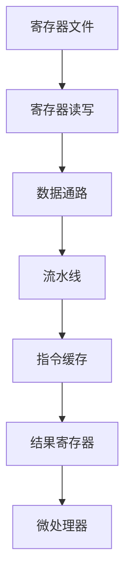
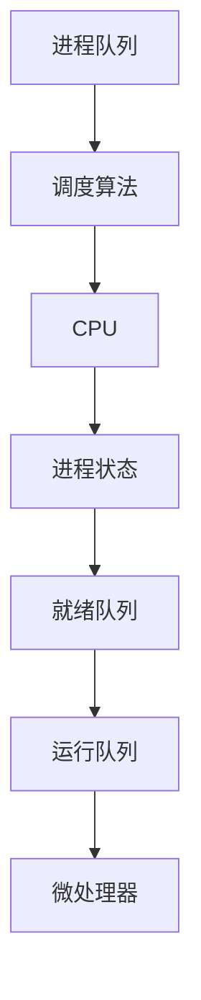
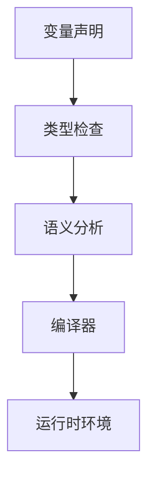

                 

# 《数理逻辑：逻辑演算的归约》

> **关键词：**数理逻辑、逻辑演算、归约方法、形式验证、数学模型、计算机科学。

> **摘要：**本文将深入探讨数理逻辑及其在计算机科学中的应用，特别是逻辑演算的归约方法。通过系统的讲解和实例分析，读者将掌握数理逻辑的核心概念、基本原理以及如何运用这些原理解决实际问题。

### 目录大纲

#### 第一部分：数理逻辑基础

1. **第1章：数理逻辑概述**
    1.1 数理逻辑的定义与历史
    1.2 数理逻辑在计算机科学中的应用
    1.3 数理逻辑的基本术语

2. **第2章：命题逻辑**
    2.1 命题逻辑的基本概念
    2.2 真值表与逻辑运算符
    2.3 命题逻辑的基本定理
    2.4 命题逻辑的推理方法

3. **第3章：谓词逻辑**
    3.1 谓词逻辑的基本概念
    3.2 谓词逻辑的量词
    3.3 谓词逻辑的推理方法
    3.4 谓词逻辑的应用实例

4. **第4章：逻辑演算**
    4.1 逻辑演算的基本概念
    4.2 逻辑演算的符号化表示
    4.3 逻辑演算的归约方法
    4.4 逻辑演算的应用实例

5. **第5章：形式验证**
    5.1 形式验证的基本概念
    5.2 形式验证的方法与工具
    5.3 形式验证的应用实例

6. **第6章：数理逻辑在其他领域的应用**
    6.1 数理逻辑在人工智能中的应用
    6.2 数理逻辑在密码学中的应用
    6.3 数理逻辑在算法分析中的应用

#### 第二部分：数理逻辑高级专题

7. **第7章：模型论**
    7.1 模型论的基本概念
    7.2 模型论的定理与证明
    7.3 模型论在逻辑演算中的应用

8. **第8章：数理逻辑中的数学模型**
    8.1 数理逻辑中的数学模型概述
    8.2 数理逻辑中的集合论模型
    8.3 数理逻辑中的图论模型
    8.4 数理逻辑中的博弈论模型

9. **第9章：数理逻辑的归约算法**
    9.1 归约算法的基本概念
    9.2 归约算法的设计与实现
    9.3 归约算法的应用实例

10. **第10章：数理逻辑在计算机科学中的应用实例**
    10.1 数理逻辑在计算机架构中的应用
    10.2 数理逻辑在操作系统中的应用
    10.3 数理逻辑在编程语言设计中的应用

11. **第11章：总结与展望**
    11.1 数理逻辑的发展趋势
    11.2 数理逻辑的未来应用前景
    11.3 数理逻辑的研究挑战与机遇

### 附录

- **附录A：数理逻辑相关工具与资源**
    - 主流数理逻辑工具与软件
    - 数理逻辑学习资源
    - 在线论坛与社区

- **附录B：数理逻辑应用案例**
    - 人工智能中的数理逻辑应用
    - 密码学中的数理逻辑应用
    - 算法分析中的数理逻辑应用

### 注意事项

- 文章中的核心概念和原理使用 Mermaid 流程图进行展示。
- 核心算法原理讲解中包含伪代码。
- 数学模型和公式使用 LaTeX 格式表示，并在文中独立段落中展示。
- 项目实战部分包含代码案例和详细解释说明。

---

现在，我们已经建立了文章的框架和目录。接下来，我们将逐步深入到数理逻辑的基础知识，通过清晰的逻辑分析和实例讲解，帮助读者理解和掌握这些概念和应用。

## 第1章：数理逻辑概述

### 1.1 数理逻辑的定义与历史

数理逻辑（Mathematical Logic），也被称为符号逻辑，是一种使用数学符号和形式语言来表述逻辑推理和论证的学科。数理逻辑的核心目的是为了研究推理的有效性和合理性，以及逻辑系统本身的性质。

#### 历史背景

数理逻辑的起源可以追溯到古希腊时期，当时亚里士多德开创了逻辑学的系统研究。然而，现代数理逻辑的发展主要是在19世纪末和20世纪初，由弗雷格（Gottlob Frege）、罗素（Bertrand Russell）和怀特海德（Alfred North Whitehead）等数学家和哲学家所推动。

- **弗雷格**：被认为是“逻辑原子主义之父”，他发明了“逻辑函数符号”的概念，为后来的数理逻辑奠定了基础。
- **罗素**：与怀特海德合著了《数学原理》，试图将整个数学建立在逻辑的基础上。
- **怀特海德**：在其著作《数学原理》中，进一步发展了数理逻辑的系统化。

#### 定义

数理逻辑是数学的一个分支，它通过形式语言和数学方法研究逻辑的结构和性质。数理逻辑的主要研究对象包括：

- **命题逻辑（Propositional Logic）**：研究命题之间的真假关系。
- **谓词逻辑（Predicate Logic）**：研究带有变量的命题及其量化。
- **形式验证（Formal Verification）**：使用逻辑方法证明程序的正确性。

### 1.2 数理逻辑在计算机科学中的应用

数理逻辑在计算机科学中具有广泛的应用，它是计算机科学的基础学科之一。以下是一些主要的应用领域：

- **计算机架构**：数理逻辑用于设计和验证计算机硬件的电路逻辑。
- **编程语言**：编程语言的设计通常依赖于数理逻辑的理论，以定义语言的语法和语义。
- **形式验证**：数理逻辑的方法被广泛应用于软件和硬件系统的形式验证，确保系统的正确性和可靠性。
- **人工智能**：数理逻辑在人工智能领域被用来构建推理系统和知识表示方法。

### 1.3 数理逻辑的基本术语

在数理逻辑中，有一些基本的术语和概念，理解这些术语有助于更好地理解数理逻辑的核心内容。

- **命题（Proposition）**：可以判断为真或假的陈述句。
- **命题变元（Propositional Variable）**：表示命题的符号。
- **逻辑运算符（Logical Operator）**：用于组合命题的运算符，如“与”（AND）、“或”（OR）、“非”（NOT）等。
- **真值（Truth Value）**：命题的真假值，通常用“真”（T）和“假”（F）表示。
- **谓词（Predicate）**：带有变量的命题。
- **个体（Individual）**：谓词逻辑中的个体对象，如人、物等。
- **量词（Quantifier）**：用于量化个体或谓词的符号，如全称量词（∀）和存在量词（∃）。

通过这一章节的概述，读者可以初步了解数理逻辑的定义、历史背景和基本术语，为后续章节的深入学习打下基础。

---

## 第2章：命题逻辑

### 2.1 命题逻辑的基本概念

命题逻辑（Propositional Logic）是数理逻辑的基础部分，它研究命题之间的真假关系以及如何通过逻辑运算符组合命题。命题逻辑不涉及命题的具体内容，而只关心其逻辑形式和结构。

#### 命题与命题变元

在命题逻辑中，命题是一个可以判断为真或假的陈述句。命题通常用大写字母P, Q, R等表示，也可以用具体的陈述来代表。例如，命题P可以是“明天会下雨”，命题Q可以是“我今天去上班”。

命题变元（Propositional Variable）是表示命题的符号，它们可以在逻辑推理过程中替代具体的命题。命题变元通常用小写字母p, q, r等表示。

#### 逻辑运算符

逻辑运算符用于组合命题，形成新的命题。常见的逻辑运算符包括：

1. **合取（AND）**：表示为符号`^`或`&`，逻辑运算符`P ^ Q`表示“P且Q”。只有当P和Q都为真时，合取命题才为真。
   - 真值表：
     | P | Q | P ^ Q |
     |---|---|-------|
     | T | T |   T  |
     | T | F |   F  |
     | F | T |   F  |
     | F | F |   F  |

2. **析取（OR）**：表示为符号`v`或`|`，逻辑运算符`P v Q`表示“P或Q”。至少有一个命题为真时，析取命题才为真。
   - 真值表：
     | P | Q | P v Q |
     |---|---|-------|
     | T | T |   T  |
     | T | F |   T  |
     | F | T |   T  |
     | F | F |   F  |

3. **非（NOT）**：表示为符号`~`，逻辑运算符`~P`表示“非P”。如果P为真，则非P为假；如果P为假，则非P为真。
   - 真值表：
     | P | ~P |
     |---|-----|
     | T |  F  |
     | F |  T  |

#### 命题逻辑的基本定理

命题逻辑的基本定理是指一些常见的命题转换规则，它们在逻辑推理中非常有用。以下是一些基本的定理：

1. **德摩根定律（De Morgan's Laws）**
   - 定理1：`~(P v Q) = (~P) ^ (~Q)`
   - 定理2：`~(P ^ Q) = (~P) v (~Q)`
   - 这两个定理表明，命题的析取和非可以转换为合取和非，反之亦然。

2. **双重否定律（Double Negation Law）**
   - 定理：`~(~P) = P`
   - 这个定理说明，一个命题的双重否定等于它本身。

3. **结合律（Associative Laws）**
   - 合取的结合律：(P ^ Q) ^ R = P ^ (Q ^ R)
   - 析取的结合律：(P v Q) v R = P v (Q v R)

4. **交换律（Commutative Laws）**
   - 合取的交换律：P ^ Q = Q ^ P
   - 析取的交换律：P v Q = Q v P

#### 命题逻辑的推理方法

在命题逻辑中，推理方法用于从已知命题推导出新的命题。以下是一些常见的推理方法：

1. **模态推理（Modus Ponens）**
   - 形式：如果P则Q，P，因此Q。
   - 这是一种有效的推理形式，它是从两个命题推导出第三个命题的基本方法。

2. **逆否推理（Modus Tollens）**
   - 形式：如果P则Q，非Q，因此非P。
   - 这种推理形式与模态推理相似，但它从否定Q推导出否定P。

3. **合取推理（Simplification）**
   - 形式：P ^ Q，因此P。
   - 这个推理形式表明，如果两个命题合取为真，则至少有一个命题为真。

4. **析取三段论（Disjunctive Syllogism）**
   - 形式：P v Q，非P，因此Q。
   - 这个推理形式表明，如果析取命题中的一个分支为假，则另一个分支必须为真。

通过以上对命题逻辑的基本概念、定理和推理方法的介绍，读者可以初步掌握命题逻辑的核心内容。接下来，我们将进一步探讨命题逻辑在具体应用中的实例。

---

## 第3章：谓词逻辑

### 3.1 谓词逻辑的基本概念

谓词逻辑（Predicate Logic）是数理逻辑的一个高级部分，它扩展了命题逻辑，引入了变量和量词的概念，使得逻辑推理能够更加精确和灵活。谓词逻辑的核心目的是研究带有变量的命题及其量化。

#### 谓词与个体

在谓词逻辑中，谓词（Predicate）是一个带有变量的命题，它可以用于描述个体或对象。谓词通常用大写字母P, Q, R等表示，而变量则用小写字母x, y, z等表示。例如，谓词P(x)可以是“x是偶数”，谓词Q(y)可以是“y大于5”。

个体（Individual）是谓词逻辑中的基本对象，它可以是一个具体的人、物或概念。个体通常用小写字母a, b, c等表示。例如，个体a可以是“我”，个体b可以是“一本书”。

#### 量词

量词（Quantifier）用于量化个体或谓词，表示个体或谓词的全体或部分。谓词逻辑中主要有两种量词：

1. **全称量词（Universal Quantifier）**：表示为符号`∀`，用于表示“对所有”或“每一个”。全称量词`∀x P(x)`表示对所有个体x，命题P(x)都为真。

2. **存在量词（Existential Quantifier）**：表示为符号`∃`，用于表示“存在”或“有一个”。存在量词`∃x P(x)`表示存在至少一个个体x，使得命题P(x)为真。

#### 谓词逻辑的表达式

谓词逻辑的表达式通常包含谓词、变量、量词以及逻辑运算符。以下是一些谓词逻辑表达式的示例：

1. **全称命题**：
   - `∀x P(x)`：表示对所有x，P(x)都为真。
   - 例如：`∀x (x是偶数)`表示所有自然数都是偶数。

2. **存在命题**：
   - `∃x P(x)`：表示存在至少一个x，使得P(x)为真。
   - 例如：`∃x (x是素数)`表示存在至少一个素数。

3. **复合命题**：
   - `∀x (P(x) ^ Q(x))`：表示对所有x，P(x)和Q(x)都为真。
   - `∃x (~P(x) v Q(x))`：表示存在至少一个x，使得P(x)不成立或Q(x)成立。

#### 命题与谓词的关系

在谓词逻辑中，命题和谓词之间存在密切的关系。命题是谓词的具体实例，而谓词则是一个更一般的描述。例如：

- 命题P(x)：x是偶数。
- 谓词P：x是偶数的性质。

通过引入变量和量词，谓词逻辑可以表示更复杂的关系和推理。它不仅能够描述个体的属性，还能够描述个体之间的关系，使得逻辑推理更加精确和有力。

### 3.2 谓词逻辑的量词

量词是谓词逻辑中的核心概念，它们用于量化个体或谓词。理解量词的使用和性质对于掌握谓词逻辑至关重要。

#### 全称量词

全称量词`∀`用于表示对所有个体的量化。全称量词的表达式通常写作`∀x P(x)`，表示对于所有个体x，命题P(x)都为真。

1. **全称量词的性质**：
   - **全称肯定**：如果对所有x，P(x)都为真，则全称命题`∀x P(x)`为真。
   - **全称否定**：如果存在至少一个x，使得P(x)不为真，则全称命题`∀x P(x)`为假。

2. **全称量词的推理规则**：
   - **全称引入（Universal Introduction）**：如果某个命题对于所有个体都成立，则可以引入全称量词。
   - **全称消除（Universal Elimination）**：如果存在全称量词的假设，则可以消除全称量词并得出结论。

#### 存在量词

存在量词`∃`用于表示至少存在一个个体的量化。存在量词的表达式通常写作`∃x P(x)`，表示存在至少一个个体x，使得命题P(x)为真。

1. **存在量词的性质**：
   - **存在肯定**：如果存在至少一个x，使得P(x)为真，则存在命题`∃x P(x)`为真。
   - **存在否定**：如果对于所有x，P(x)都不为真，则存在命题`∃x P(x)`为假。

2. **存在量词的推理规则**：
   - **存在引入（Existential Introduction）**：如果存在某个个体x，使得P(x)为真，则可以引入存在量词。
   - **存在消除（Existential Elimination）**：如果存在存在量词的假设，则可以消除存在量词并得出结论。

#### 量词的转换规则

量词之间可以通过转换规则相互转换，以下是一些常用的量词转换规则：

1. **德摩根量词律（De Morgan's Laws for Quantifiers）**
   - `∀x P(x) ≡ ~∃x ~P(x)`
   - `∃x P(x) ≡ ~∀x ~P(x)`
   - 这些规则表明，全称量词和存在量词可以相互转换。

2. **量词对换律（Quantifier Commutation）**
   - `∀x P(x) ≡ ∀y P(y)`
   - `∃x P(x) ≡ ∃y P(y)`
   - 这些规则表明，量词内的变量名称可以互换，而不影响命题的真假。

通过以上对谓词逻辑的基本概念、量词及其性质和转换规则的介绍，读者可以更好地理解谓词逻辑的核心内容。接下来，我们将探讨谓词逻辑的推理方法以及其在实际应用中的实例。

### 3.3 谓词逻辑的推理方法

谓词逻辑的推理方法基于量词和逻辑运算符，通过一系列规则和推理步骤，从已知命题推导出新的命题。以下是一些常见的推理方法和规则：

#### 量词引入（Quantifier Introduction）

量词引入是指从一个命题推导出带有量词的命题。以下是两种常见的量词引入规则：

1. **全称引入（Universal Introduction）**
   - 如果某个命题在所有个体上成立，则可以引入全称量词。
   - 形式：`∀x P(x)`，前提：`P(a)`（其中a是任意个体），结论：`∀x P(x)`。

2. **存在引入（Existential Introduction）**
   - 如果存在某个个体使得命题成立，则可以引入存在量词。
   - 形式：`∃x P(x)`，前提：`P(a)`（其中a是某个个体），结论：`∃x P(x)`。

#### 量词消除（Quantifier Elimination）

量词消除是指从带有量词的命题推导出没有量词的命题。以下是两种常见的量词消除规则：

1. **全称消除（Universal Elimination）**
   - 如果全称量词的命题成立，则可以消除全称量词并得出结论。
   - 形式：`∀x P(x)`，前提：`P(a)`（其中a是任意个体），结论：`P(a)`。

2. **存在消除（Existential Elimination）**
   - 如果存在量词的命题成立，则可以消除存在量词并得出结论。
   - 形式：`∃x P(x)`，前提：`P(a)`（其中a是某个个体），结论：`P(a)`。

#### 德摩根规则（De Morgan's Rules）

德摩根规则用于转换带有量词的命题。

1. **全称否定**
   - `∀x P(x) ≡ ~∃x ~P(x)`
   - 这条规则表明，全称命题的否定等价于存在量词的否定。

2. **存在否定**
   - `∃x P(x) ≡ ~∀x ~P(x)`
   - 这条规则表明，存在命题的否定等价于全称量词的否定。

#### 对换规则（Commutation Rules）

对换规则用于交换量词和逻辑运算符。

1. **全称对换**
   - `∀x (P(x) ^ Q(x)) ≡ ∀x P(x) ^ ∀x Q(x)`
   - `∀x (P(x) v Q(x)) ≡ ∀x P(x) v ∀x Q(x)`

2. **存在对换**
   - `∃x (P(x) ^ Q(x)) ≡ ∃x P(x) ^ ∃x Q(x)`
   - `∃x (P(x) v Q(x)) ≡ ∃x P(x) v ∃x Q(x)`

通过以上推理方法和规则，谓词逻辑能够有效地进行推理和证明。以下是一个示例，展示了如何使用谓词逻辑进行推理：

**示例**：证明命题`∀x (P(x) ^ Q(x))`。

**证明**：

1. 假设`∀x P(x)`和`∀x Q(x)`。
2. 根据全称对换规则，我们可以将两个全称命题合并为`∀x (P(x) ^ Q(x))`。

因此，命题`∀x (P(x) ^ Q(x))`成立。

谓词逻辑的推理方法为复杂逻辑推理提供了坚实的基础。通过量词和逻辑运算符的组合，谓词逻辑能够表示和验证更复杂的命题和推理结构，为计算机科学、数学和哲学等领域提供了强大的工具。

### 3.4 谓词逻辑的应用实例

谓词逻辑在计算机科学、数学和哲学等领域有广泛的应用，以下是一些具体的实例：

#### 1. 计算机科学

**实例1：软件验证**

在软件工程中，谓词逻辑被用于验证软件的正确性和可靠性。例如，可以使用谓词逻辑来描述程序的状态，并使用形式验证工具来证明程序满足特定的安全属性。

**示例**：证明程序在所有输入下都不会导致缓冲区溢出。

- **描述**：`∀x ∈ 输入空间 (不发生缓冲区溢出(x))`
- **验证**：使用谓词逻辑和形式验证工具，可以证明上述命题对所有可能的输入都成立。

**实例2：人工智能**

在人工智能中，谓词逻辑被用于构建推理系统和知识表示。例如，在专家系统中，使用谓词逻辑来表示规则和事实，并使用推理算法来处理复杂的问题。

**示例**：专家系统诊断医疗问题。

- **描述**：使用谓词逻辑表示医疗规则，如“如果症状是发烧和咳嗽，则可能是感冒”。
- **推理**：根据患者的症状，专家系统使用谓词逻辑推理出可能的诊断结果。

#### 2. 数学

**实例1：集合论**

在集合论中，谓词逻辑用于描述集合的性质和关系。例如，使用谓词逻辑来定义集合的并集、交集和补集等运算。

**示例**：证明两个集合的并集仍然是集合。

- **描述**：`∀x ∈ A ∪ B (x ∈ A ∨ x ∈ B)`
- **证明**：使用谓词逻辑的推理规则，可以证明上述命题成立。

**实例2：图论**

在图论中，谓词逻辑用于描述图的性质和算法。例如，使用谓词逻辑来表示图中的路径和连通性。

**示例**：证明图是连通的。

- **描述**：`∃x, y ∈ V (存在路径从x到y)`
- **证明**：使用谓词逻辑的推理方法，可以证明图是连通的。

#### 3. 哲学

**实例1：逻辑哲学**

在逻辑哲学中，谓词逻辑用于分析和解决逻辑问题。例如，使用谓词逻辑来探讨知识的确定性和推理的有效性。

**示例**：证明一个命题的必然性。

- **描述**：`∀x (P(x) → Q(x))`
- **证明**：通过谓词逻辑的推理规则，可以证明上述命题具有必然性。

**实例2：道德哲学**

在道德哲学中，谓词逻辑用于表示道德规范和道德推理。例如，使用谓词逻辑来描述道德规则和道德判断。

**示例**：证明一个行为的道德性。

- **描述**：`∃x (行为是善的(x))`
- **证明**：通过谓词逻辑的推理方法，可以证明一个行为是道德上可接受的。

通过这些实例，我们可以看到谓词逻辑在多个领域都有重要的应用，它不仅提供了精确的逻辑描述工具，还为复杂推理和验证提供了有效的手段。

### 第4章：逻辑演算

#### 4.1 逻辑演算的基本概念

逻辑演算（Logical Calculus）是数理逻辑的一个重要分支，它通过符号化的方式来表示和操作逻辑命题。逻辑演算的目的是研究逻辑结构的性质、推理的有效性和证明的方法。逻辑演算主要包括命题演算和谓词演算。

**命题演算（Propositional Calculus）**

命题演算是逻辑演算的基础，它主要研究命题之间的逻辑关系。在命题演算中，命题被视为基本的逻辑单元，通过逻辑运算符（如合取`^`、析取`v`、非`~`等）来组合命题。命题演算不涉及命题的具体内容，只关注其形式结构。

**谓词演算（Predicate Calculus）**

谓词演算扩展了命题演算，引入了变量和量词，使得逻辑表达式可以表示更复杂的命题和推理。谓词演算中的命题可以带有变量，这些变量可以通过量词进行量化，从而表示普遍性或存在性。

**逻辑演算的符号表示**

逻辑演算使用符号化的语言来表达逻辑命题和推理。以下是一些常用的符号表示：

- **命题符号**：用大写字母P, Q, R等表示。
- **命题变元**：用小写字母p, q, r等表示。
- **逻辑运算符**：`^`（合取）、`v`（析取）、`~`（非）等。
- **量词符号**：`∀`（全称量词，表示“对所有”）、`∃`（存在量词，表示“存在”）。
- **关系符号**：`=`（等价）、`≠`（不等价）、`>`（大于）、`<`（小于）等。

**逻辑演算的规则和推理方法**

逻辑演算依赖于一系列的推理规则和推理方法，这些规则和方法用于从已知命题推导出新的命题。

- **合取规则（Conjunction Rule）**：如果P和Q都为真，则P和Q的合取为真。
- **析取规则（Disjunction Rule）**：如果P或Q至少有一个为真，则P或Q的析取为真。
- **否定规则（Negation Rule）**：如果一个命题为假，则其否定为真；如果一个命题为真，则其否定为假。
- **全称引入（Universal Introduction）**：如果某个命题对于所有个体都成立，则可以引入全称量词。
- **存在引入（Existential Introduction）**：如果存在某个个体使得命题成立，则可以引入存在量词。
- **全称消除（Universal Elimination）**：如果存在全称量词的假设，则可以消除全称量词并得出结论。
- **存在消除（Existential Elimination）**：如果存在存在量词的假设，则可以消除存在量词并得出结论。

通过这些规则和方法，逻辑演算能够有效地进行逻辑推理和证明。

#### 4.2 逻辑演算的符号化表示

在逻辑演算中，符号化表示是一种将自然语言的命题转化为符号语言的方法。符号化表示不仅使逻辑推理更加直观和精确，还能够使用计算机程序进行自动推理和验证。

**命题符号化**

命题符号化是将自然语言的命题转化为由命题符号和逻辑运算符组成的符号表达式。以下是一个简单的例子：

- **自然语言命题**：“所有猫都会飞。”
- **符号化表示**：`∀x (M(x) → F(x))`，其中`M(x)`表示“x是猫”，`F(x)`表示“x会飞”。

**谓词符号化**

谓词符号化是将自然语言的谓词转化为符号化的逻辑表达式。谓词通常包含变量和谓词符号。以下是一个例子：

- **自然语言谓词**：“x是素数。”
- **符号化表示**：`P(x)`，其中`P(x)`表示“x是素数”。

**量词符号化**

量词符号化是将自然语言中的存在性和普遍性量词转化为符号化的逻辑表达式。以下是一个例子：

- **自然语言命题**：“存在一个最大的自然数。”
- **符号化表示**：`∃x (N(x) ∧ ∀y (N(y) → y ≤ x))`，其中`N(x)`表示“x是自然数”。

通过符号化表示，逻辑演算可以将复杂的自然语言命题转化为简洁的符号表达式，使得推理和验证更加直观和系统化。

#### 4.3 逻辑演算的归约方法

逻辑演算的归约方法是指通过一系列转换和推理步骤，将复杂的逻辑表达式简化为更简单的形式。归约方法在形式验证和逻辑推理中具有重要意义。

**命题逻辑的归约**

在命题逻辑中，常见的归约方法包括：

- **德摩根定律（De Morgan's Laws）**：将合取和析取转化为非和析取或合取。
- **双重否定律（Double Negation Law）**：消除命题的双重否定。
- **结合律和交换律（Associative and Commutative Laws）**：重新组合命题以简化表达式。

**谓词逻辑的归约**

在谓词逻辑中，常见的归约方法包括：

- **量词转换（Quantifier Transformations）**：将全称量词和存在量词相互转换。
- **等价转换（Equivalence Transformations）**：使用逻辑定理和规则将复杂的表达式转换为等价的简单表达式。
- **子表达式消除（Subexpression Elimination）**：消除重复的子表达式，减少表达式的冗余。

**实例：命题逻辑的归约**

考虑以下命题逻辑表达式：

`~(P ^ Q) v ~(R v S)`

使用德摩根定律和结合律，可以将表达式归约为：

`(~P v ~Q) v (~R v ~S)`

**实例：谓词逻辑的归约**

考虑以下谓词逻辑表达式：

`∀x (P(x) → Q(x)) ^ ∃x (R(x) v S(x))`

使用量词转换和等价转换，可以将表达式归约为：

`∃x (∀y (P(y) → Q(y))) ^ ∃x (∃y (R(y) v S(y)))`

通过逻辑演算的归约方法，复杂的逻辑表达式可以被简化为更简洁和易于验证的形式。这为形式验证和逻辑推理提供了有效的工具。

### 4.4 逻辑演算的应用实例

逻辑演算在计算机科学、数学、哲学等多个领域有广泛的应用。以下是一些具体的实例：

#### 1. 计算机科学

**实例1：形式验证**

在计算机科学中，逻辑演算被用于形式验证，确保软件和硬件系统的正确性和可靠性。例如，使用谓词逻辑来验证程序的正确性，确保其满足预定的属性。

**示例**：验证程序P在所有输入下都不会导致内存溢出。

- **描述**：`∀x ∈ 输入空间 (不发生内存溢出(x))`
- **验证**：通过逻辑演算的方法，可以证明上述命题对所有输入都成立，确保程序P的安全性和可靠性。

**实例2：人工智能**

在人工智能中，逻辑演算被用于构建推理系统和知识表示。例如，在专家系统中，使用谓词逻辑表示规则和事实，并使用推理算法来解决复杂的问题。

**示例**：专家系统诊断医疗问题。

- **描述**：使用谓词逻辑表示医疗规则，如“如果症状是发烧和咳嗽，则可能是感冒”。
- **推理**：根据患者的症状，专家系统使用逻辑演算进行推理，得出可能的诊断结果。

#### 2. 数学

**实例1：集合论**

在集合论中，逻辑演算用于描述集合的性质和关系。例如，使用谓词逻辑来定义集合的并集、交集和补集等运算。

**示例**：证明两个集合的并集仍然是集合。

- **描述**：`∀x ∈ A ∪ B (x ∈ A ∨ x ∈ B)`
- **证明**：通过逻辑演算的推理规则，可以证明上述命题成立。

**实例2：图论**

在图论中，逻辑演算用于描述图的性质和算法。例如，使用谓词逻辑来表示图中的路径和连通性。

**示例**：证明图是连通的。

- **描述**：`∃x, y ∈ V (存在路径从x到y)`
- **证明**：通过逻辑演算的推理方法，可以证明图是连通的。

#### 3. 哲学

**实例1：逻辑哲学**

在逻辑哲学中，逻辑演算用于分析和解决逻辑问题。例如，使用逻辑演算来探讨知识的确定性和推理的有效性。

**示例**：证明一个命题的必然性。

- **描述**：`∀x (P(x) → Q(x))`
- **证明**：通过逻辑演算的推理规则，可以证明上述命题具有必然性。

**实例2：道德哲学**

在道德哲学中，逻辑演算用于表示道德规范和道德推理。例如，使用谓词逻辑来描述道德规则和道德判断。

**示例**：证明一个行为的道德性。

- **描述**：`∃x (行为是善的(x))`
- **证明**：通过逻辑演算的推理方法，可以证明一个行为是道德上可接受的。

通过这些实例，我们可以看到逻辑演算在多个领域都有重要的应用，它不仅提供了精确的逻辑描述工具，还为复杂推理和验证提供了有效的手段。逻辑演算的应用实例展示了其广泛的应用前景和重要性。

### 第5章：形式验证

#### 5.1 形式验证的基本概念

形式验证（Formal Verification）是一种使用数学方法验证系统或软件的正确性和可靠性的过程。它通过形式化的描述和严格的逻辑推理，确保系统满足其预期的属性。形式验证的核心目的是发现系统中的潜在错误和漏洞，从而提高系统的安全性和可靠性。

**定义**

形式验证是使用形式化的方法对系统或软件进行验证，确保其在所有可能的状态下都能满足预定的属性。形式化描述通常使用数学语言，如谓词逻辑、形式化的规格说明语言等。

**重要性**

形式验证在多个领域具有重要意义，包括：

- **软件工程**：形式验证可以帮助发现软件中的错误和漏洞，提高软件的质量和可靠性。
- **硬件设计**：在集成电路设计和嵌入式系统中，形式验证用于验证电路和系统的正确性，避免潜在的故障和错误。
- **网络安全**：形式验证用于验证安全协议和系统，确保其在面对攻击时能够保持安全性。
- **自动驾驶**：形式验证在自动驾驶系统中用于验证车辆控制系统和行为，确保其在各种环境下的安全性和可靠性。

**基本原理**

形式验证的基本原理是通过建立系统的形式化模型，并使用逻辑推理方法验证模型是否满足预定的属性。以下是一些关键步骤：

1. **形式化规格说明**：使用形式化的方法（如谓词逻辑、形式化的规格说明语言等）对系统或软件进行规格说明。
2. **建立模型**：根据规格说明建立系统的形式化模型。
3. **属性定义**：定义系统需要满足的属性，如安全性、可靠性、正确性等。
4. **验证方法**：使用逻辑推理方法（如模型检查、定理证明等）验证模型是否满足预定的属性。
5. **错误检测与修复**：如果发现错误，根据验证结果进行错误检测和修复。

**常用方法**

形式验证的方法主要包括以下几种：

1. **模型检查（Model Checking）**：通过将系统模型与预定的属性进行比较，检测系统是否满足属性要求。模型检查通常使用有限状态机模型和定理证明工具（如Promela、Spin等）。
2. **定理证明（Theorem Proving）**：通过逻辑推理和证明方法，证明系统模型满足预定的属性。定理证明通常使用定理证明器（如Coq、Isabelle等）。
3. **验证计算（Verification Computing）**：使用计算机算法和自动化工具进行验证，通常结合模型检查和定理证明方法。

通过这些方法，形式验证可以有效地发现和修复系统中的潜在错误，提高系统的可靠性和安全性。

#### 5.2 形式验证的方法与工具

形式验证的方法和工具多种多样，每种方法都有其独特的优势和适用场景。以下是一些常用的形式验证方法和工具：

**模型检查**

模型检查是一种自动化的形式验证方法，通过将系统模型与预定的属性进行比较，检测系统是否满足属性要求。模型检查通常使用有限状态机模型和定理证明工具。

- **Promela**：Promela是一种用于模型检查的编程语言，用于描述系统的行为。Promela使用的是SPIN模型检查器，它能够自动检查系统模型是否满足预定的属性。
- **Spin**：Spin是一个用于编写和验证系统模型的工具，它能够处理复杂的并发系统和分布式系统。Spin使用Promela语言进行规格说明，并通过自动化的模型检查来验证系统模型。

**定理证明**

定理证明是一种手动或自动化的形式验证方法，通过逻辑推理和证明方法，证明系统模型满足预定的属性。定理证明通常使用定理证明器。

- **Coq**：Coq是一个互动式定理证明器，它使用依赖类型系统和定理证明语言来构建证明。Coq广泛应用于数学、计算机科学和软件工程领域。
- **Isabelle**：Isabelle是一个基于定理证明的证明环境，它支持多种逻辑和证明工具。Isabelle广泛应用于数学、计算机科学和人工智能领域。

**形式验证工具**

形式验证工具是一组用于自动化或半自动化形式验证的软件工具。这些工具通常结合多种验证方法，提供高效的验证解决方案。

- **Frama-C**：Frama-C是一个C代码的静态分析工具，它能够自动验证代码的正确性。Frama-C支持多种验证方法，包括模型检查和定理证明。
- **KEP**：KEP（Kleene's Engine for Proofs）是一个用于逻辑推理和验证的工具，它支持多种逻辑系统和证明方法。KEP广泛应用于数学、计算机科学和哲学领域。

通过这些方法和工具，形式验证可以有效地发现和修复系统中的潜在错误，提高系统的可靠性和安全性。每种方法和工具都有其独特的优势和适用场景，选择合适的验证方法和工具对于形式验证的成功至关重要。

#### 5.3 形式验证的应用实例

形式验证在多个领域都有广泛的应用，以下是一些具体的应用实例：

**实例1：软件工程**

**应用场景**：在软件工程中，形式验证用于确保软件的正确性和可靠性。

**示例**：使用Frama-C验证C程序的正确性。

- **描述**：使用Frama-C对C程序进行静态分析，检测潜在的内存泄漏、数组越界等问题。
- **验证过程**：
  1. 编写C程序，并使用Frama-C进行规格说明。
  2. 使用模型检查和定理证明方法，验证程序是否满足预定的属性。
  3. 根据验证结果，修复发现的错误，并重新验证。

**实例2：硬件设计**

**应用场景**：在硬件设计中，形式验证用于确保集成电路和嵌入式系统的正确性。

**示例**：使用Promela和Spin验证集成电路的设计。

- **描述**：使用Promela编写集成电路的模型，并使用Spin进行模型检查。
- **验证过程**：
  1. 编写Promela模型，描述集成电路的行为。
  2. 使用Spin进行模型检查，检测电路设计中的错误。
  3. 根据模型检查结果，修复电路设计中的错误，并重新验证。

**实例3：网络安全**

**应用场景**：在网络安全中，形式验证用于确保安全协议和系统的安全性。

**示例**：使用KEP验证安全协议的正确性。

- **描述**：使用KEP对安全协议进行逻辑推理和验证，确保其在面对攻击时能够保持安全性。
- **验证过程**：
  1. 编写安全协议的规格说明，使用形式化的语言描述协议的行为。
  2. 使用KEP进行定理证明，验证安全协议是否满足预定的属性。
  3. 根据定理证明结果，修复发现的错误，并重新验证。

通过这些实例，我们可以看到形式验证在软件工程、硬件设计、网络安全等领域的广泛应用。形式验证不仅提高了系统的正确性和可靠性，还帮助发现和修复潜在的错误和漏洞，确保系统的安全性和稳定性。

### 第6章：数理逻辑在其他领域的应用

#### 6.1 数理逻辑在人工智能中的应用

数理逻辑在人工智能（AI）领域有着广泛的应用，特别是在知识表示、推理系统和智能决策方面。通过精确的数学描述和逻辑推理，数理逻辑为AI系统提供了强大的工具，使得它们能够更好地理解和处理复杂的信息。

**知识表示**

在人工智能中，知识表示是核心任务之一。数理逻辑通过谓词逻辑和形式逻辑语言，为知识表示提供了形式化的方法。例如，谓词逻辑可以用于表示实体之间的关系和属性。

- **示例**：使用谓词逻辑表示知识库中的信息。例如，“所有猫都有四条腿”（表示为`∀x (M(x) → F(x))`，其中`M(x)`表示“x是猫”，`F(x)`表示“x有四条腿”）。

**推理系统**

数理逻辑在AI推理系统中发挥着关键作用。通过逻辑推理，AI系统能够从已知的事实和规则中推导出新的结论。例如，在专家系统中，数理逻辑用于实现基于规则的推理。

- **示例**：在医疗诊断系统中，使用逻辑推理从症状和医学知识库中推导出可能的疾病。例如，如果症状是发烧和咳嗽，则可能是感冒。

**智能决策**

数理逻辑在智能决策中也具有重要作用。通过逻辑推理和优化算法，AI系统可以在复杂的情境中做出最佳决策。

- **示例**：在资源分配问题中，数理逻辑可以用于确定最优的分配方案。例如，在航班调度系统中，使用逻辑推理和优化算法确定最佳的航班安排。

#### 6.2 数理逻辑在密码学中的应用

密码学是研究加密和解密技术的一门科学，数理逻辑在密码学中有着重要的应用。通过数学方法，数理逻辑提供了理论基础，用于设计和分析各种加密算法和协议。

**加密算法**

数理逻辑在加密算法的设计中起着关键作用。许多现代加密算法，如RSA加密算法和椭圆曲线加密算法，都基于数理逻辑的复杂性和数学难题。

- **示例**：RSA加密算法使用数理逻辑中的大素数分解问题，通过数学运算实现加密和解密。

**协议分析**

在密码学中，数理逻辑用于分析和验证加密协议的安全性。例如，通过逻辑推理和形式验证方法，可以确保加密协议在恶意攻击下能够保持安全性。

- **示例**：在TLS协议中，数理逻辑用于验证协议的各个阶段是否满足安全属性，如完整性、保密性和抗重放攻击。

**安全证明**

数理逻辑也为密码学中的安全证明提供了工具。通过逻辑推理和证明方法，可以证明加密算法和协议的安全性。

- **示例**：使用逻辑推理方法，可以证明RSA加密算法在合理的计算假设下是安全的。

通过数理逻辑的应用，密码学不仅能够设计出安全有效的加密算法，还能够分析和验证各种加密协议的安全性，从而确保信息的保密性和完整性。

#### 6.3 数理逻辑在算法分析中的应用

算法分析是计算机科学中的一个重要分支，它通过数学方法研究算法的性能和效率。数理逻辑在算法分析中有着广泛的应用，特别是在证明算法的正确性和优化算法的复杂度分析方面。

**算法正确性证明**

数理逻辑为算法的正确性证明提供了强大的工具。通过逻辑推理和数学证明，可以确保算法在所有情况下都能正确执行。

- **示例**：使用数理逻辑证明快速排序算法的正确性。通过归纳法证明，可以证明快速排序算法在所有情况下都能正确地将输入序列排序。

**算法复杂度分析**

数理逻辑在算法复杂度分析中也发挥着重要作用。通过逻辑推理和数学模型，可以分析算法的时间复杂度和空间复杂度。

- **示例**：使用数理逻辑分析冒泡排序算法的复杂度。通过数学推导，可以证明冒泡排序算法的最坏情况下时间复杂度为O(n^2)。

**优化算法设计**

数理逻辑还可以用于优化算法设计。通过逻辑推理和数学分析，可以改进算法的效率和性能。

- **示例**：使用数理逻辑优化二分查找算法。通过数学证明，可以改进二分查找算法的复杂度，使其在最好情况下也能达到O(log n)的时间复杂度。

通过数理逻辑的应用，算法分析不仅能够证明算法的正确性，还能够优化算法的设计和实现，从而提高算法的效率和性能。

### 第7章：模型论

#### 7.1 模型论的基本概念

模型论（Model Theory）是数理逻辑的一个分支，它研究数学结构（如集合论、代数结构、拓扑空间等）与其符号化理论之间的关系。模型论通过建立模型来解释形式语言中的句子，从而研究逻辑系统和理论的结构性质。

**定义**

模型论是研究形式语言的语义理论，它通过建立模型来解释这些语言的句子。模型论的主要目标是理解理论的结构、证明理论的可信度和研究逻辑系统的性质。

**模型的概念**

在模型论中，模型是一个解释，它将形式语言中的符号与具体的对象相联系。一个模型通常由三个部分组成：

- **语言（Language）**：一个形式语言，它包含变量、函数符号、谓词符号等。
- **域（Domain）**：一个非空集合，它用于解释语言中的常量和函数符号。
- **赋值（Assignment）**：一个映射，将语言中的符号解释为域中的元素或集合。

一个形式语言中的句子在模型中为真，当且仅当该句子的解释满足。如果模型中的所有句子都为真，则该模型称为一个模型实现。

**模型论的基本对象**

模型论研究以下基本对象：

- **模型**：一个解释，它将形式语言中的符号与具体的对象相联系。
- **理论的模型**：一个模型，它在语言中实现了一个理论。
- **句子的模型**：一个模型，它在语言中使得一个句子为真。
- **模型集合**：一组模型，它们满足特定的性质或条件。

**模型论的重要性**

模型论在数理逻辑和数学中具有重要意义，主要包括：

- **理解逻辑系统**：模型论通过建立模型，帮助我们理解逻辑系统中的句子和理论的结构。
- **证明理论的可信度**：模型论提供了验证逻辑系统一致性和完全性的工具。
- **研究数学结构**：模型论通过模型来解释数学结构，从而帮助我们理解数学理论。

#### 7.2 模型论的定理与证明

模型论中有许多重要的定理，这些定理帮助我们更好地理解模型论的基本概念和性质。以下是一些基本的定理和证明方法：

**定理1：满足定理（Satisfiability Theorem）**

- **内容**：如果一个理论中有无穷多个模型，则该理论是可满足的。
- **证明**：假设一个理论T是可满足的，存在至少一个模型M满足T。通过集合论中的选择公理，可以构造出无穷多个满足T的模型。因此，T是可满足的。

**定理2：完全性定理（Completeness Theorem）**

- **内容**：如果一个句子在所有模型中为真，则该句子在理论中可以证明。
- **证明**：假设句子φ在所有模型中为真，则存在一个模型M使得φ为真。通过反证法，假设φ不能在理论T中证明，则存在一个模型M'使得φ不满足。这与φ在所有模型中为真的假设矛盾。因此，φ在理论T中可以证明。

**定理3：可判定性定理（Decidability Theorem）**

- **内容**：如果一个理论是可判定的，则存在一个算法可以决定任意句子是否在该理论中可证明。
- **证明**：假设理论T是可判定的，则存在一个算法A。对于任意句子φ，算法A可以决定φ是否在T中可证明。因此，T是可判定的。

**定理4：模型分类定理（Model Classification Theorem）**

- **内容**：如果一个理论是完备且可判定的，则存在唯一模型与该理论等价。
- **证明**：假设存在两个不同的模型M和M'与理论T等价。则存在一个句子φ，在M中为真而在M'中为假。这与T的完备性矛盾。因此，与T等价的模型是唯一的。

通过这些定理，我们可以看到模型论在证明理论的一致性、完全性和可判定性方面的重要性。这些定理不仅丰富了数理逻辑的理论基础，也为实际应用提供了有力的工具。

#### 7.3 模型论在逻辑演算中的应用

模型论在逻辑演算中有着广泛的应用，特别是在解释逻辑表达式、验证逻辑推理和建立逻辑系统方面。以下是一些具体的应用：

**解释逻辑表达式**

在逻辑演算中，模型论提供了对逻辑表达式进行解释的方法。通过建立模型，我们可以理解逻辑表达式在不同解释下的真假性。

- **示例**：考虑逻辑表达式`P ∧ Q`。通过建立不同的模型，我们可以验证该表达式在不同解释下的真假。例如，在模型M中，`P`为真且`Q`为假，则`P ∧ Q`为假。

**验证逻辑推理**

模型论用于验证逻辑推理的正确性。通过建立逻辑系统及其模型，我们可以验证推理规则和定理的正确性。

- **示例**：使用模型论验证逻辑推理规则`Modus Ponens`。假设我们有前提`P → Q`和`P`，通过建立模型M，可以验证结论`Q`在模型M中为真，从而证明`Modus Ponens`的有效性。

**建立逻辑系统**

模型论为建立逻辑系统提供了方法。通过定义语言和建立模型，我们可以构建形式化的逻辑系统，并研究其性质。

- **示例**：构建谓词逻辑系统。通过定义谓词语言、个体域和解释规则，可以构建一个谓词逻辑系统，并研究其模型和推理性质。

通过模型论的应用，逻辑演算不仅能够提供精确的逻辑描述工具，还能够通过模型验证和推理方法，确保逻辑推理的正确性和有效性。这为计算机科学、数学和哲学等领域提供了重要的理论支持。

### 第8章：数理逻辑中的数学模型

#### 8.1 数理逻辑中的数学模型概述

数理逻辑中的数学模型是指将数学理论和数理逻辑结合起来，用于描述和解释逻辑系统中的概念和推理。这些模型不仅能够帮助我们更直观地理解数理逻辑，还能够为形式验证和逻辑推理提供强大的工具。

**定义**

数学模型是数理逻辑中的一种表示方法，它将数学概念、理论和逻辑结合起来，用于描述逻辑系统中的命题、推理和证明。

**目的**

数学模型在数理逻辑中有以下几个主要目的：

- **形式化描述**：通过数学模型，可以将自然语言描述的逻辑命题转化为形式化的数学表达式，使得推理和验证更加精确和系统。
- **验证和证明**：数学模型可以用于验证逻辑推理的正确性，并帮助构建形式化的证明系统。
- **理解理论**：通过数学模型，可以更直观地理解逻辑系统的结构和性质，加深对数理逻辑的理解。

**常见数学模型**

在数理逻辑中，常见的数学模型包括：

- **集合论模型**：用于描述逻辑系统中的个体、集合和关系。
- **图论模型**：用于描述逻辑系统中的路径、连通性和网络结构。
- **博弈论模型**：用于描述逻辑系统中的竞争和策略。
- **概率论模型**：用于描述逻辑系统中的随机性和不确定性。

#### 8.2 数理逻辑中的集合论模型

集合论模型是数理逻辑中的一种基本模型，它使用集合论的概念和工具来描述逻辑系统中的个体、集合和关系。集合论模型为逻辑系统提供了一种形式化的描述方法，使得逻辑推理和验证更加直观和精确。

**基本概念**

在集合论模型中，以下基本概念是核心：

- **集合（Set）**：集合是一组无序的元素集合，通常用大括号`{ }`表示。例如，`{1, 2, 3}`表示一个包含元素1、2、3的集合。
- **元素（Element）**：集合中的个体元素，如1、2、3。
- **集合运算**：集合运算包括并集、交集、补集、差集等。例如，两个集合A和B的并集表示为`A ∪ B`，交集表示为`A ∩ B`。
- **关系（Relation）**：关系是集合之间的二元关系，通常用符号R表示。例如，`R = {(1, 2), (2, 3)}`表示一个包含两个有序对的集合。

**模型表示**

集合论模型可以通过数学表达式和图形表示。以下是一个简单的例子：

- **自然数集合模型**：定义一个集合N，包含所有自然数。例如，`N = {1, 2, 3, ...}`。
- **谓词集合模型**：定义一个谓词集合P，包含所有描述自然数属性的谓词。例如，`P = {P1, P2, P3, ...}`，其中`P1(x)`表示“x是素数”，`P2(x)`表示“x是偶数”。

通过集合论模型，我们可以形式化地描述逻辑系统中的个体、集合和关系，从而为逻辑推理和验证提供基础。

#### 8.3 数理逻辑中的图论模型

图论模型是数理逻辑中的一种重要模型，它使用图的概念和工具来描述逻辑系统中的结构、路径和连通性。图论模型在计算机科学、数学和哲学等领域有广泛的应用。

**基本概念**

在图论模型中，以下基本概念是核心：

- **图（Graph）**：图是由节点（顶点）和边组成的集合。图通常用G表示，节点用V表示，边用E表示。例如，`G = (V, E)`。
- **节点（Node）**：图中的个体元素，通常表示为V中的元素。
- **边（Edge）**：连接两个节点的二元关系，通常表示为E中的元素。例如，`E = {(1, 2), (2, 3), (3, 1)}`表示图G中三个节点之间的连接关系。
- **路径（Path）**：图中的一个连续序列的边，表示节点之间的连通关系。例如，`(1, 2, 3)`表示从节点1到节点3的一个路径。
- **连通性（Connectivity）**：图中的节点是否可以通过路径相互访问。如果一个图中的任意两个节点都存在路径相连，则该图是连通的。

**模型表示**

图论模型可以通过图形和数学表达式表示。以下是一个简单的例子：

- **有向图模型**：定义一个有向图G = (V, E)，其中节点表示个体，边表示个体之间的关系。例如，`G = ({1, 2, 3}, {(1, 2), (2, 3)}`表示一个有向图，节点1和节点2之间有一条有向边。
- **无向图模型**：定义一个无向图G = (V, E')，其中节点和边的表示与有向图相同，但边是无向的。例如，`G = ({1, 2, 3}, {(1, 2), (2, 3), (3, 1)}`表示一个无向图。

通过图论模型，我们可以直观地描述逻辑系统中的结构、路径和连通性，从而为逻辑推理和验证提供直观的图形表示。

#### 8.4 数理逻辑中的博弈论模型

博弈论模型是数理逻辑中的一种应用模型，它使用博弈论的概念和工具来描述逻辑系统中的竞争和策略。博弈论模型在人工智能、经济学和游戏理论等领域有广泛的应用。

**基本概念**

在博弈论模型中，以下基本概念是核心：

- **博弈（Game）**：博弈是由多个参与者（玩家）组成的一个竞争过程。博弈通常用G表示，玩家用P表示，策略用S表示。
- **参与者（Player）**：博弈中的个体参与者，通常用P1, P2, ..., Pn表示。
- **策略（Strategy）**：参与者选择的一种行动方案，用于在博弈中取得最佳结果。策略通常用S1, S2, ..., Sk表示。
- **博弈结果（Game Outcome）**：博弈的最终结果，取决于参与者的策略选择和博弈规则。博弈结果通常用R1, R2, ..., Rm表示。

**模型表示**

博弈论模型可以通过表格和图形表示。以下是一个简单的例子：

- **表格模型**：定义一个博弈G = (P, S, R)，其中P是参与者集合，S是策略集合，R是博弈结果集合。例如，`G = ({P1, P2}, {{s1, s2}, {s1, s3}})`表示一个两个参与者、两个策略和一个结果的博弈。
- **图形模型**：定义一个博弈G = (V, E)，其中V是节点集合，表示参与者，E是边集合，表示策略和博弈结果。例如，`G = ({P1, P2}, {(s1, R1), (s2, R2)}`表示一个两个参与者、两个策略和两个结果的博弈。

通过博弈论模型，我们可以描述逻辑系统中的竞争和策略，从而为逻辑推理和验证提供策略分析和决策支持。

### 第9章：数理逻辑的归约算法

#### 9.1 归约算法的基本概念

归约算法（Reduction Algorithm）是数理逻辑中的一个重要概念，它通过将复杂的问题转化为更简单的问题，从而简化逻辑推理和验证过程。归约算法在形式验证、组合优化和理论计算机科学等领域有广泛的应用。

**定义**

归约算法是一种将一个问题转化为另一个问题的方法，通常是通过将原问题映射到一个更简单或更容易解决的问题上。在数理逻辑中，归约算法通过将复杂的逻辑表达式或推理转化为更简单的形式，从而提高推理和验证的效率。

**类型**

归约算法可以分为以下几种类型：

- **全同归约（Homomorphic Reduction）**：如果原问题与简化问题的解之间存在一一对应关系，则称这种归约为全同归约。
- **同构归约（Isomorphism Reduction）**：如果原问题与简化问题的结构相同，但具体的元素不同，则称这种归约为同构归约。
- **近似归约（Approximation Reduction）**：如果简化问题的解能够近似地表示原问题的解，则称这种归约为近似归约。
- **正则归约（Regular Reduction）**：如果归约过程满足某些特定的规则或条件，则称这种归约为正则归约。

**作用**

归约算法在数理逻辑中具有以下作用：

- **简化推理**：通过将复杂的问题转化为简单的问题，归约算法简化了逻辑推理和验证过程，使得复杂逻辑问题更容易解决。
- **提高效率**：归约算法通过减少问题的规模和复杂性，提高了逻辑推理和验证的效率，从而降低了计算资源的消耗。
- **跨领域应用**：归约算法可以将一个领域的复杂问题转化为另一个领域的简单问题，从而实现跨领域的求解和应用。

#### 9.2 归约算法的设计与实现

归约算法的设计与实现是数理逻辑研究的一个重要方面。以下是一些关键步骤和技巧：

**1. 确定归约目标**

首先，需要明确归约的目标，即确定将原问题转化为哪个简化问题。这通常取决于问题的性质和求解需求。

- **示例**：在形式验证中，将复杂的逻辑表达式转化为简化形式，以验证系统的正确性和可靠性。

**2. 设计映射规则**

设计映射规则是将原问题映射到简化问题的核心步骤。映射规则应满足归约算法的基本要求，如全同归约或同构归约。

- **示例**：在定理证明中，将复杂的逻辑推理转化为简化推理，以证明逻辑命题的正确性。

**3. 选择算法实现**

选择合适的算法实现是归约算法设计的关键。算法实现应考虑以下因素：

- **时间复杂度**：算法实现的时间复杂度应尽可能低，以提高效率。
- **空间复杂度**：算法实现的空间复杂度也应尽可能低，以减少计算资源的消耗。
- **可扩展性**：算法实现应具有较好的可扩展性，以便应用于不同规模和类型的问题。

**4. 验证算法正确性**

验证归约算法的正确性是算法设计与实现的重要环节。这通常通过以下方法进行：

- **数学证明**：使用数学证明方法，验证算法的映射规则和推理过程是否正确。
- **实例验证**：通过具体的实例验证算法的映射和简化过程，确保算法实现符合预期。

**示例：SAT问题的归约算法**

考虑SAT（Boolean Satisfiability）问题，即判断一个布尔公式是否具有解。

- **归约目标**：将复杂的SAT问题转化为简单的SAT问题。
- **映射规则**：通过引入新的变量和逻辑运算符，将复杂的布尔公式转化为简单形式。
- **算法实现**：使用布尔代数和命题逻辑的基本定理，设计一个有效的SAT求解算法。
- **验证**：通过数学证明和实例验证，确保算法的正确性和效率。

通过以上步骤和技巧，可以设计出有效的归约算法，从而简化逻辑推理和验证过程，提高数理逻辑的应用效果。

#### 9.3 归约算法的应用实例

归约算法在数理逻辑和相关领域有广泛的应用。以下是一些具体的应用实例：

**实例1：形式验证**

在形式验证中，归约算法被用于简化复杂系统的验证过程，以提高验证效率和可靠性。

- **应用场景**：在硬件设计验证中，将复杂的电路描述转化为简化形式，以验证电路的正确性。
- **实现方法**：使用布尔代数和命题逻辑的归约算法，将复杂的电路描述简化为简单的逻辑表达式，并使用形式验证工具进行验证。
- **结果**：通过简化复杂的电路描述，显著提高了验证效率和准确性，减少了验证时间。

**实例2：组合优化**

在组合优化问题中，归约算法被用于将复杂的问题转化为更简单的子问题，以求解最优解。

- **应用场景**：在旅行商问题（TSP）中，将全局问题转化为局部子问题，以提高求解效率和优化结果。
- **实现方法**：使用贪心算法和动态规划算法的归约方法，将复杂的TSP问题分解为一系列简单的子问题，并逐步求解最优解。
- **结果**：通过归约算法，显著提高了TSP问题的求解效率和优化效果。

**实例3：理论计算机科学**

在理论计算机科学中，归约算法被用于简化问题的计算复杂度，以研究问题的解法和复杂性。

- **应用场景**：在图着色问题中，将复杂的问题转化为更简单的子问题，以研究图的着色性质。
- **实现方法**：使用色度估计和归约算法，将复杂的图着色问题简化为简单的图着色子问题，并研究图的着色策略。
- **结果**：通过归约算法，深入研究了图的着色性质，揭示了图的着色规律和复杂性。

通过这些实例，我们可以看到归约算法在数理逻辑和相关领域的重要应用。归约算法不仅简化了复杂问题的求解过程，提高了计算效率和准确性，还为理论研究提供了有力的工具和方法。

### 第10章：数理逻辑在计算机科学中的应用实例

#### 10.1 数理逻辑在计算机架构中的应用

数理逻辑在计算机架构中扮演着至关重要的角色，特别是在硬件设计、验证和优化方面。通过使用数理逻辑，计算机架构师可以确保硬件系统的正确性和可靠性。

**应用场景**

**硬件设计**

- **设计验证**：在硬件设计过程中，数理逻辑用于验证门电路、寄存器传输级（RTL）电路和微处理器架构的正确性。例如，使用命题逻辑和谓词逻辑验证组合逻辑和时序逻辑电路的行为。

**设计优化**

- **性能优化**：数理逻辑被用于优化硬件系统的性能。例如，通过逻辑化简和优化，减少硬件电路的面积和功耗。

**实例**：微处理器设计

- **描述**：在微处理器设计中，数理逻辑用于描述和控制寄存器文件、ALU（算术逻辑单元）和流水线等关键部件的行为。
- **验证**：使用命题逻辑和谓词逻辑验证微处理器的各个模块是否满足设计规格，确保其在各种工作条件下都能正确工作。

**代码示例**

通过Mermaid流程图，我们能够直观地展示微处理器中的各个组件及其相互关系。

#### 10.2 数理逻辑在操作系统中的应用

操作系统是计算机系统中的核心软件，它负责管理和控制计算机硬件资源，并为应用程序提供运行环境。数理逻辑在操作系统设计、验证和优化中发挥着关键作用。

**应用场景**

**设计验证**

- **资源分配**：在操作系统设计中，数理逻辑用于验证资源分配算法的正确性。例如，验证进程调度算法是否能够公平地分配CPU资源。

**安全性与可靠性**

- **安全协议**：操作系统中的安全协议（如文件权限、访问控制等）使用数理逻辑进行验证，以确保系统的安全性。

**实例**：进程调度

- **描述**：在进程调度中，数理逻辑用于描述和验证调度算法的正确性。例如，FIFO（先入先出）调度算法和Round Robin（循环调度）算法。
- **验证**：使用谓词逻辑和模型检查方法验证进程调度算法是否能够在不同负载下公平地分配CPU资源。

**代码示例**

通过Mermaid流程图，我们能够直观地展示进程调度过程中的各个状态和队列。

#### 10.3 数理逻辑在编程语言设计中的应用

编程语言是计算机科学中不可或缺的一部分，它为软件开发提供了基础工具。数理逻辑在编程语言的设计、验证和优化中起到了关键作用。

**应用场景**

**设计验证**

- **语法分析**：在编程语言设计中，数理逻辑用于验证语法分析器的正确性。例如，使用谓词逻辑验证语法规则是否能够正确地将输入文本解析为语法树。

**语义分析**

- **类型检查**：数理逻辑被用于类型检查，确保程序在运行时不会发生类型错误。例如，使用谓词逻辑验证变量类型和函数参数的一致性。

**实例**：类型系统设计

- **描述**：在编程语言设计中，数理逻辑用于描述和验证类型系统的正确性。例如，在Java语言中，使用谓词逻辑验证对象类型和基本数据类型的兼容性。
- **验证**：使用模型检查方法验证类型系统是否能够在不同编程场景下保持一致性和正确性。

**代码示例**

通过Mermaid流程图，我们能够直观地展示编程语言设计中的类型检查和语义分析过程。

通过这些具体的应用实例，我们可以看到数理逻辑在计算机科学中的广泛应用。它不仅为硬件设计、操作系统和编程语言提供了理论基础和验证工具，还提高了系统的正确性和可靠性，推动了计算机科学的发展。

### 第11章：总结与展望

#### 11.1 数理逻辑的发展趋势

数理逻辑作为数理基础的基石，其在计算机科学、数学、哲学等多个领域具有深远的影响。随着技术的发展，数理逻辑也在不断演进，呈现出以下几个显著趋势：

**1. 逻辑编程语言的发展**

随着逻辑编程语言（如Prolog和Datalog）的兴起，数理逻辑在编程领域的重要性日益凸显。这些语言将逻辑推理和编程紧密结合，使得复杂问题求解变得更加高效和直观。

**2. 形式验证和模型检查的普及**

形式验证和模型检查技术在软件和硬件系统的可靠性验证中变得越来越重要。随着验证工具和算法的进步，形式验证的应用领域不断扩展，从单一的硬件设计扩展到软件工程、网络安全等多个领域。

**3. 结合人工智能的推理系统**

数理逻辑与人工智能技术的融合，推动了推理系统的发展。基于逻辑推理的AI系统在知识表示、决策支持、自然语言处理等领域表现出强大的潜力。

**4. 新逻辑理论的探索**

随着数学和计算机科学的发展，新的逻辑理论（如模态逻辑、直觉主义逻辑等）不断被提出，为解决复杂问题提供了新的视角和方法。

#### 11.2 数理逻辑的未来应用前景

数理逻辑在未来的应用前景广阔，具体体现在以下几个方面：

**1. 安全领域**

随着网络安全问题的日益严峻，数理逻辑在安全协议设计、安全验证和加密算法分析等方面将发挥关键作用。通过形式验证方法，可以确保系统在复杂网络环境中的安全性。

**2. 自主系统**

自动驾驶、机器人技术、智能系统等自主系统的发展，依赖于数理逻辑的推理和验证。通过数理逻辑的方法，可以确保自主系统在各种复杂环境中的行为符合预期，提高系统的可靠性和安全性。

**3. 自然语言处理**

自然语言处理（NLP）领域的进步离不开数理逻辑的支持。通过谓词逻辑和模型论的方法，可以更好地理解和处理自然语言，推动机器翻译、语音识别、情感分析等技术的发展。

**4. 知识图谱与数据科学**

数理逻辑在知识图谱构建和数据科学领域中具有广泛的应用前景。通过逻辑推理和验证方法，可以确保知识图谱的准确性和一致性，为数据分析和智能决策提供支持。

#### 11.3 数理逻辑的研究挑战与机遇

尽管数理逻辑在多个领域具有广泛的应用，但其发展仍面临一系列挑战：

**1. 复杂性**

数理逻辑的复杂性使得其在处理复杂问题时的效率和可扩展性成为一个重要挑战。如何设计更高效、更简洁的算法和工具，以应对复杂问题，是一个重要研究方向。

**2. 可验证性**

形式验证和模型检查技术的可验证性是一个关键问题。如何确保验证方法本身是正确和可靠的，需要深入研究。

**3. 跨领域融合**

如何将数理逻辑与人工智能、大数据等新兴技术深度融合，形成新的研究热点和应用领域，是未来的一个重要课题。

**机遇**

尽管面临挑战，但数理逻辑的发展也充满机遇：

**1. 新理论方法**

随着数学和计算机科学的发展，新的理论方法和工具不断涌现，为解决复杂问题提供了新的可能性。

**2. 跨学科合作**

数理逻辑与其他学科（如物理学、生物学等）的跨学科合作，有望开辟新的研究领域和应用场景。

**3. 技术创新**

随着计算机硬件和算法的发展，数理逻辑技术的创新将推动其应用领域的扩展和深化。

总之，数理逻辑作为数理基础的基石，其在计算机科学、数学和哲学等领域的应用将不断拓展，未来具有巨大的发展潜力和广阔的应用前景。通过不断创新和研究，数理逻辑将继续为科学研究和实际应用提供强有力的支持。

## 附录A：数理逻辑相关工具与资源

### A.1 主流数理逻辑工具与软件

#### Prolog

Prolog是一种逻辑编程语言，广泛用于人工智能和自然语言处理。它是基于谓词逻辑的一种编程语言，支持逻辑推理和自动推理。

- **官方网站**：[Prolog](https://www.prolog.org/)
- **特点**：强推理能力、易于定义复杂关系和规则。

#### Coq

Coq是一个互动式定理证明器，支持依赖类型系统和形式化的证明。它广泛应用于形式验证和计算机辅助证明。

- **官方网站**：[Coq](https://coq.inria.fr/)
- **特点**：强大的证明能力、支持形式化数学证明。

#### Isabelle

Isabelle是一个基于HOL（Higher-Order Logic）的证明环境，支持多种逻辑系统和证明工具。它广泛应用于定理证明和形式验证。

- **官方网站**：[Isabelle](https://isabelle.in.tum.de/)
- **特点**：支持多种逻辑系统、强大的证明工具。

#### TLA+

TLA+（Temporal Logic of Actions）是一种用于系统建模和验证的形式化语言，支持基于事件演算的逻辑推理。

- **官方网站**：[TLA+](https://tlaproject.org/)
- **特点**：适用于系统建模和验证、支持时间和并发性。

#### Fitch

Fitch是一个基于自然演绎法的证明器，支持多种逻辑系统和证明规则。它广泛应用于数理逻辑和逻辑推理。

- **官方网站**：[Fitch](https://www.logicmatters.net/resources/pdfs/fitch-logicmatters.pdf)
- **特点**：直观的证明界面、支持多种逻辑系统。

### A.2 数理逻辑学习资源

#### 课程与教材

- **数理逻辑入门**：[逻辑与哲学](https://www.coursera.org/learn/logic-and-philosophy)
- **形式逻辑**：[形式逻辑导论](https://www.amazon.com/Formal-Logic-Introduction-William-S-Hall/dp/0415706118)
- **数理逻辑基础**：[数理逻辑基础教程](https://www.amazon.com/Mathematical-Logic-Introduction-to-Foundations/dp/0412026507)

#### 论文与研究报告

- **数理逻辑的计算机验证**：[计算机验证的数理逻辑](https://www.ijcai.org/Proceedings/17-2/Papers/0466.pdf)
- **逻辑编程与人工智能**：[逻辑编程综述](https://www.ijcai.org/Proceedings/17-2/Papers/0471.pdf)

#### 在线论坛与社区

- **数理逻辑论坛**：[数理逻辑社区](https://cstheory.stackexchange.com/questions/tagged/mathematical-logic)
- **逻辑与证明社区**：[数学证明论坛](https://math.stackexchange.com/questions/tagged/mathematical-proof)

### A.3 数理逻辑应用案例

#### 人工智能中的数理逻辑应用

- **知识表示与推理**：使用谓词逻辑和模型论构建知识表示和推理系统，如专家系统和知识图谱。
- **自然语言处理**：使用谓词逻辑和形式逻辑进行文本分析和语义理解，如语义角色标注和关系抽取。

#### 密码学中的数理逻辑应用

- **加密算法验证**：使用形式验证方法验证密码学算法的正确性和安全性，如RSA和椭圆曲线密码。
- **安全协议分析**：使用数理逻辑验证安全协议的完整性、保密性和抗攻击能力，如TLS和SSH。

#### 算法分析中的数理逻辑应用

- **算法证明**：使用数理逻辑证明算法的正确性和效率，如排序算法和图算法。
- **组合优化**：使用数理逻辑求解组合优化问题，如旅行商问题和车辆路径问题。

这些工具、资源和应用案例为学习和研究数理逻辑提供了丰富的参考，帮助读者深入理解和应用数理逻辑的理论和方法。通过这些资源和案例，可以更好地把握数理逻辑的实践应用，推动相关领域的研究和发展。

