                 

# 新浪2024校招测试工程师面试题集

## 关键词
- 新浪校招
- 测试工程师
- 面试题集
- 软件测试
- 自动化测试
- 性能测试
- 安全测试
- 面试技巧

## 摘要
本文是针对新浪2024校招测试工程师岗位的面试题集，旨在帮助考生全面掌握软件测试相关的核心知识，包括测试基础知识、自动化测试、性能测试和安全测试等。此外，文章还深入解析了常见的面试题类型及实战案例，并提供了面试技巧与心态调整的方法，帮助考生顺利应对面试挑战。

### 《新浪2024校招测试工程师面试题集》目录大纲

#### 第一部分：测试基础知识

#### 第1章：软件测试基础

##### 1.1 软件测试概述

软件测试是一种验证和验证软件产品是否满足其需求和设计标准的过程。它不仅包括发现和报告缺陷，还包括评估软件质量的各种技术。以下是软件测试的一些关键概念和联系：

- **定义与目标**：软件测试的定义是评估软件产品的质量，确保其满足既定的需求。测试的目标包括验证功能、性能、安全性和兼容性等方面。
- **类型**：软件测试可以分为功能测试、非功能测试、自动化测试和手工测试等类型。每种类型的测试都有其特定的目标和应用场景。
- **原则**：软件测试应遵循一些基本原则，如完整性、独立性、重复性和可复现性。这些原则有助于确保测试的有效性和可靠性。

**Mermaid 流程图：**
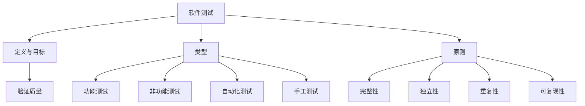

##### 1.2 测试策略与计划

测试策略和计划是确保测试活动有效执行的重要环节。以下是一些关键概念和联系：

- **测试策略**：测试策略是一系列决策和指导方针，用于确定测试的目标、范围、方法和资源分配。
- **测试计划**：测试计划是详细描述测试活动、时间表、资源需求、风险评估等内容的文档。
- **执行**：测试计划的执行涉及按计划进行测试活动，记录测试结果，以及根据结果调整测试策略和计划。

**Mermaid 流程图：**
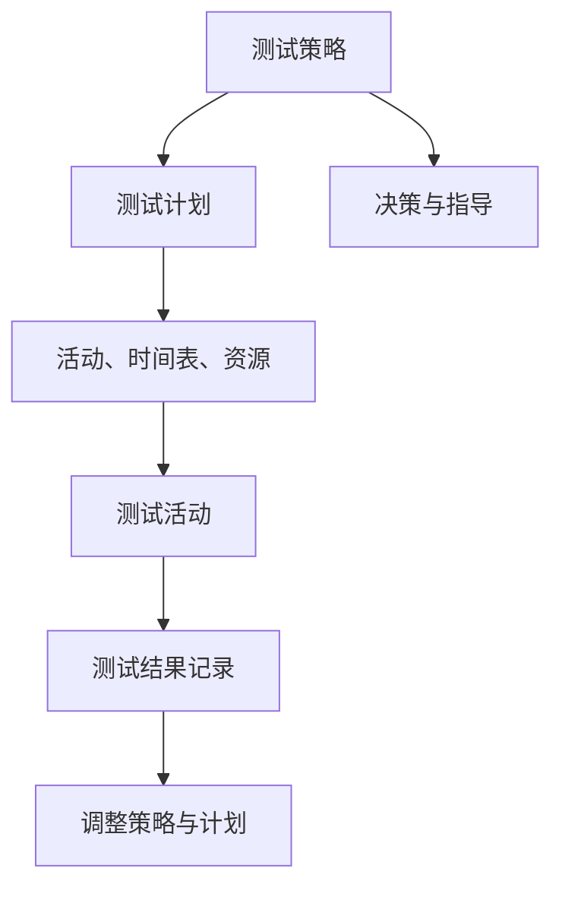

##### 1.3 测试用例设计

测试用例设计是软件测试的核心步骤，它决定了测试的全面性和有效性。以下是一些关键概念和联系：

- **设计原则**：测试用例设计应遵循一些基本原则，如覆盖性、可读性、可维护性和可重复性。
- **功能测试用例设计**：功能测试用例设计旨在验证软件功能是否符合需求规格说明。它包括正常测试用例和异常测试用例。
- **非功能测试用例设计**：非功能测试用例设计关注软件的非功能性需求，如性能、安全性、兼容性和用户体验。

**Mermaid 流程图：**
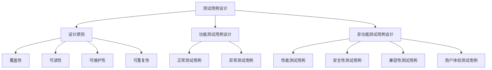

#### 第2章：自动化测试

##### 2.1 自动化测试概述

自动化测试是将测试脚本与测试工具结合，以自动化执行测试的过程。以下是一些关键概念和联系：

- **定义与优势**：自动化测试是指通过脚本和工具自动执行测试用例。其优势包括提高测试效率、降低成本、确保测试的重复性和一致性。
- **类型**：自动化测试可以分为功能自动化测试、性能自动化测试、安全自动化测试等类型。
- **工具选择**：选择合适的自动化测试工具是成功实施自动化测试的关键。常见的自动化测试工具有Selenium、Appium、JMeter等。

**Mermaid 流程图：**
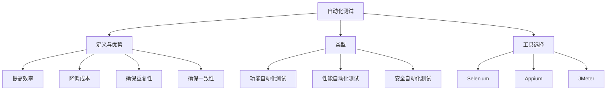

##### 2.2 自动化测试工具使用

自动化测试工具的使用是自动化测试成功的关键。以下是一些关键概念和联系：

- **Selenium介绍与使用**：Selenium是一个开源的自动化测试工具，支持多种编程语言和浏览器。它主要用于Web应用的自动化测试。
- **Appium介绍与使用**：Appium是一个跨平台的自动化测试工具，支持iOS和Android应用。它基于Selenium WebDriver，但可以自动化原生应用和混合应用。
- **JMeter介绍与使用**：JMeter是一个开源的性能测试工具，用于模拟负载测试和性能测试。它主要用于Web应用的性能测试。

**Mermaid 流.Builder流程图：**
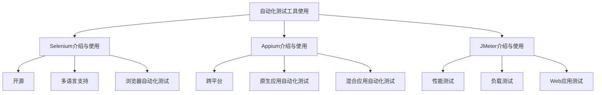

##### 2.3 自动化测试实践

自动化测试实践涉及自动化测试框架的搭建、脚本编写、执行和结果分析。以下是一些关键概念和联系：

- **自动化测试框架搭建**：自动化测试框架是自动化测试的核心，它负责管理测试脚本、测试数据、测试报告等。
- **自动化测试脚本编写**：自动化测试脚本是基于特定编程语言编写的，用于实现测试用例的自动化执行。
- **自动化测试执行与结果分析**：自动化测试执行是指通过测试工具执行自动化测试脚本，并分析测试结果。

**Mermaid 流程图：**
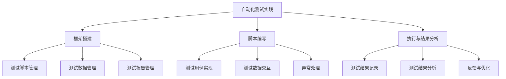

#### 第3章：性能测试

##### 3.1 性能测试概述

性能测试是一种评估软件性能的测试，它关注软件在特定负载下的响应时间、吞吐量、资源利用率等指标。以下是一些关键概念和联系：

- **定义与目标**：性能测试是指通过模拟实际用户负载，评估软件的性能和稳定性。其目标包括识别性能瓶颈、优化系统性能和验证系统的负载能力。
- **类型**：性能测试可以分为负载测试、压力测试、性能调优等类型。
- **工具选择**：选择合适的性能测试工具是成功实施性能测试的关键。常见的性能测试工具有JMeter、LoadRunner等。

**Mermaid 流程图：**
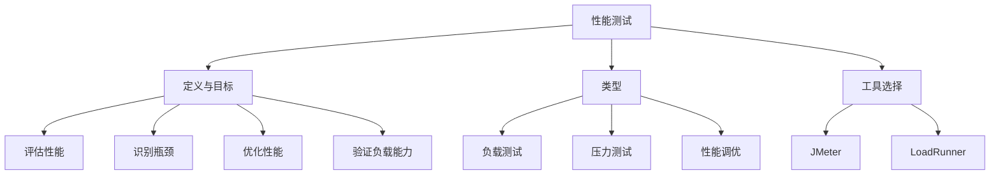

##### 3.2 性能测试指标

性能测试指标是评估软件性能的关键参数。以下是一些关键概念和联系：

- **常见性能测试指标**：常见的性能测试指标包括响应时间、吞吐量、资源利用率、并发用户数等。
- **计算方法**：性能测试指标的计算方法包括平均值、最大值、最小值、标准差等统计方法。
- **分析**：性能测试结果分析可以帮助识别性能瓶颈，并为性能优化提供依据。

**Mermaid 流程图：**
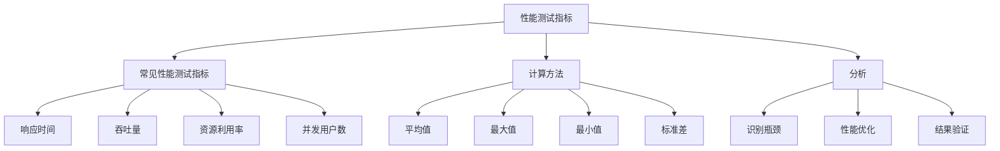

##### 3.3 性能测试实践

性能测试实践涉及性能测试环境的搭建、测试脚本的编写、测试执行和结果分析。以下是一些关键概念和联系：

- **性能测试环境搭建**：性能测试环境搭建包括搭建测试环境、配置测试工具和准备测试数据等。
- **测试脚本编写**：性能测试脚本是基于特定编程语言编写的，用于模拟用户负载和记录性能指标。
- **测试执行与结果分析**：性能测试执行是指通过测试工具执行性能测试脚本，并分析测试结果。

**Mermaid 流程图：**
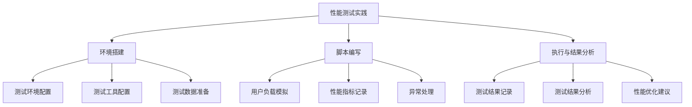

#### 第4章：安全测试

##### 4.1 安全测试概述

安全测试是一种评估软件安全性的测试，它关注软件在面临各种安全威胁时的抵御能力。以下是一些关键概念和联系：

- **定义与目标**：安全测试是指通过模拟攻击和漏洞扫描，评估软件的安全性。其目标包括识别安全漏洞、验证安全策略的有效性和提高系统的安全性。
- **类型**：安全测试可以分为黑盒安全测试、白盒安全测试和漏洞扫描等类型。
- **工具选择**：选择合适的安全测试工具是成功实施安全测试的关键。常见的安全测试工具有Burp Suite、Nessus等。

**Mermaid 流程图：**
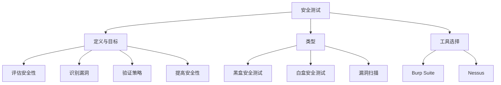

##### 4.2 安全测试方法

安全测试方法包括黑盒安全测试、白盒安全测试和漏洞扫描。以下是一些关键概念和联系：

- **黑盒安全测试**：黑盒安全测试是从外部角度评估软件的安全性，无需了解软件的内部结构。它主要通过模拟攻击来识别安全漏洞。
- **白盒安全测试**：白盒安全测试是从内部角度评估软件的安全性，需要了解软件的内部结构。它主要通过代码审计和漏洞分析来识别安全漏洞。
- **漏洞扫描**：漏洞扫描是使用自动化工具扫描软件和系统中的已知漏洞。它可以快速识别大量的安全漏洞，但无法发现未知漏洞。

**Mermaid 流程图：**
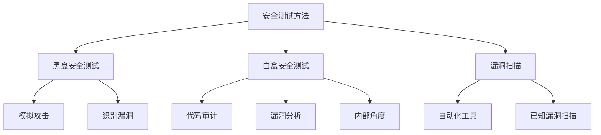

##### 4.3 安全测试实践

安全测试实践涉及安全测试计划的制定、测试执行和结果分析。以下是一些关键概念和联系：

- **安全测试计划**：安全测试计划是详细描述安全测试活动的文档，包括测试目标、测试范围、测试策略和资源分配。
- **测试执行**：安全测试执行是指通过测试工具和手工测试来执行安全测试用例。
- **测试结果分析**：安全测试结果分析是评估测试结果的合理性、有效性并及时修复安全漏洞。

**Mermaid 流程图：**
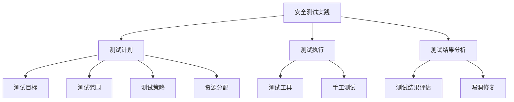

#### 第二部分：面试题解析

#### 第5章：面试题类型及解析

##### 5.1 编程题解析

编程题是面试中常见的一种类型，它主要考察应聘者的编程能力和算法思维能力。以下是一些关键概念和联系：

- **常见编程题类型**：常见的编程题类型包括排序算法、查找算法、字符串处理、数组操作等。
- **解题思路**：解题思路包括理解题目要求、分析输入和输出、设计算法和数据结构、编写代码和测试代码等。
- **案例分析**：通过实际案例来解析编程题的解题思路和技巧。

**Mermaid 流程图：**
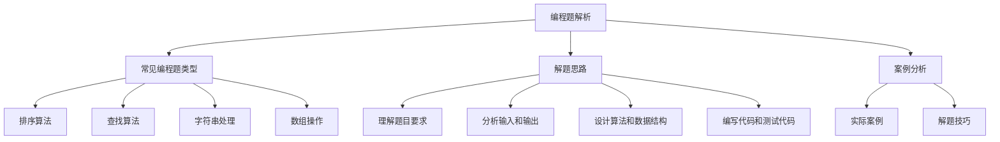

##### 5.2 数据结构与算法解析

数据结构与算法是编程的核心，也是面试的重点。以下是一些关键概念和联系：

- **常见数据结构**：常见的数据结构包括数组、链表、栈、队列、树、图等。
- **常见算法**：常见的算法包括排序算法、查找算法、图算法、动态规划等。
- **面试题解析**：通过对常见数据结构与算法的面试题进行解析，帮助应聘者掌握解题技巧。

**Mermaid 流程图：**
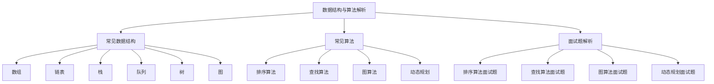

##### 5.3 测试理论知识题解析

测试理论知识是测试工程师必备的基础知识。以下是一些关键概念和联系：

- **测试基础理论题解析**：包括软件测试的定义、类型、原则等基础知识的解析。
- **自动化测试相关理论题解析**：包括自动化测试的定义、工具选择、流程等知识的解析。
- **性能测试相关理论题解析**：包括性能测试的定义、指标、工具选择等知识的解析。
- **安全测试相关理论题解析**：包括安全测试的定义、方法、工具选择等知识的解析。

**Mermaid 流程图：**
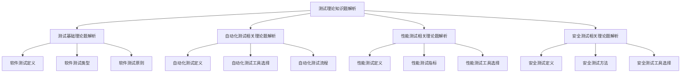

#### 第6章：面试题实战案例

##### 6.1 编程实战案例

编程实战案例是通过实际编程问题来考察应聘者的编程能力和算法思维能力。以下是一些关键概念和联系：

- **常见编程实战案例**：包括排序算法、查找算法、字符串处理、数组操作等常见问题的实际应用。
- **复杂编程实战案例**：包括高级算法、系统设计等复杂问题的实际应用。
- **解析**：通过对实战案例的解析，帮助应聘者掌握解题技巧和实战经验。

**Mermaid 流程图：**
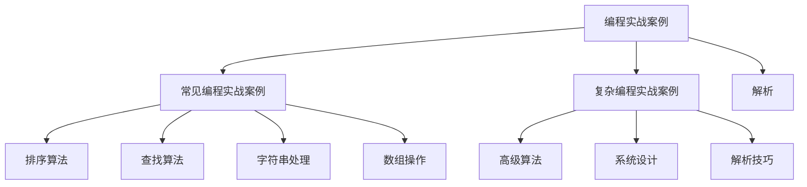

##### 6.2 数据结构与算法实战案例

数据结构与算法实战案例是通过实际应用问题来考察应聘者的数据结构与算法能力。以下是一些关键概念和联系：

- **常见数据结构与算法实战案例**：包括链表、树、图、排序、查找等常见问题的实际应用。
- **复杂数据结构与算法实战案例**：包括高级算法、图算法、动态规划等复杂问题的实际应用。
- **解析**：通过对实战案例的解析，帮助应聘者掌握数据结构与算法的实际应用技巧。

**Mermaid 流程图：**
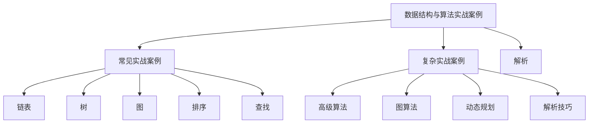

##### 6.3 测试实战案例

测试实战案例是通过实际测试项目来考察应聘者的测试能力和实战经验。以下是一些关键概念和联系：

- **自动化测试实战案例**：包括自动化测试工具的选择、测试脚本编写、测试执行和结果分析等实际应用。
- **性能测试实战案例**：包括性能测试环境的搭建、测试脚本编写、测试执行和结果分析等实际应用。
- **安全测试实战案例**：包括安全测试策略的制定、测试执行和结果分析等实际应用。
- **解析**：通过对实战案例的解析，帮助应聘者掌握测试实战技能和经验。

**Mermaid 流程图：**
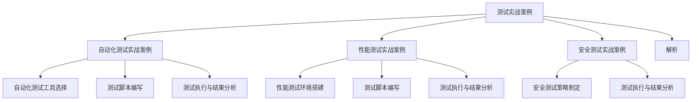

#### 第7章：面试技巧与心态

##### 7.1 面试前的准备工作

面试前的准备工作是面试成功的关键。以下是一些关键概念和联系：

- **了解公司背景与岗位需求**：通过了解公司的业务范围、文化和发展历程，以及岗位的职责和要求，可以帮助应聘者更好地准备面试。
- **面试前准备资料**：准备面试所需的资料，如简历、作品集、面试指南等，有助于提高面试效果。
- **简历撰写技巧**：简历是面试前的第一印象，撰写一份清晰、有针对性的简历是成功面试的关键。

**Mermaid 流程图：**
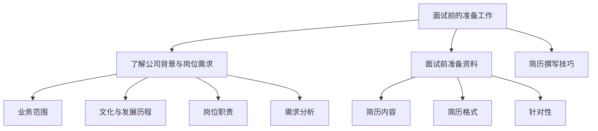

##### 7.2 面试过程中的表现

面试过程中的表现决定了面试的成败。以下是一些关键概念和联系：

- **面试官常见提问及回答技巧**：了解面试官可能提出的常见问题，并掌握回答技巧，有助于提高面试效果。
- **非语言沟通技巧**：非语言沟通包括肢体语言、面部表情、声音等，良好的非语言沟通技巧可以增强面试者的印象。
- **面试结束后的后续工作**：面试结束后，及时跟进面试结果和反馈，有助于了解面试表现并及时调整。

**Mermaid 流程图：**
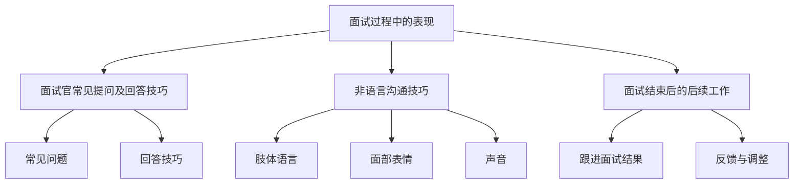

##### 7.3 面试心态调整

面试心态调整是面试成功的重要因素。以下是一些关键概念和联系：

- **面试前的心理调适**：通过放松技巧、心理暗示等方法，可以帮助应聘者缓解紧张情绪，提高面试信心。
- **面试中的心理调节**：在面试过程中，通过保持冷静、集中注意力和积极思考，可以更好地应对面试挑战。
- **面试失败后的反思与总结**：面试失败是成长的机会，通过反思和总结，可以找出不足并不断提高。

**Mermaid 流程图：**
```mermaid
graph TB
A[面试心态调整] --> B[面试前的心理调适]
A --> C[面试中的心理调节]
A --> D[面试失败后的反思与总结]
B --> E[放松技巧]
B --> F[心理暗示]
B --> G[提高信心]
C --> H[保持冷静]
C --> I[集中注意力]
C --> J[积极思考]
D --> K[反思不足]
D --> L[总结经验]
D --> M[不断提高]
```

#### 附录

##### 附录A：参考资源

以下是一些常用的参考资源，包括测试工具、数据结构与算法学习资源和编程语言学习资源，供读者参考。

- **测试工具**：
  - Selenium：[https://www.selenium.dev/](https://www.selenium.dev/)
  - Appium：[https://appium.io/](https://appium.io/)
  - JMeter：[https://jmeter.apache.org/](https://jmeter.apache.org/)
  - Burp Suite：[https://portswigger.net/burp/](https://portswigger.net/burp/)
  - Nessus：[https://www.tenable.com/products/nessus](https://www.tenable.com/products/nessus)

- **数据结构与算法学习资源**：
  - 《算法导论》：[https://book.douban.com/subject/26708254/](https://book.douban.com/subject/26708254/)
  - 《大话数据结构》：[https://book.douban.com/subject/26997621/](https://book.douban.com/subject/26997621/)

- **编程语言学习资源**：
  - Python：[https://www.python.org/](https://www.python.org/)
  - Java：[https://www.java.com/](https://www.java.com/)
  - C++：[https://isocpp.org/](https://isocpp.org/)

##### 附录B：面试题汇总

以下是常见面试题汇总，包括编程题、数据结构与算法题和测试理论知识题，供读者参考。

- **编程题**：
  - 如何实现一个高效的栈？
  - 如何实现一个有序链表？
  - 如何实现一个二叉搜索树？
  
- **数据结构与算法题**：
  - 如何实现一个快速排序算法？
  - 如何实现一个最小堆？
  - 如何实现一个广度优先搜索算法？
  
- **测试理论知识题**：
  - 什么是测试用例设计原则？
  - 什么是自动化测试的优势？
  - 什么是性能测试指标？

---

**作者：AI天才研究院/AI Genius Institute & 禅与计算机程序设计艺术 /Zen And The Art of Computer Programming**

