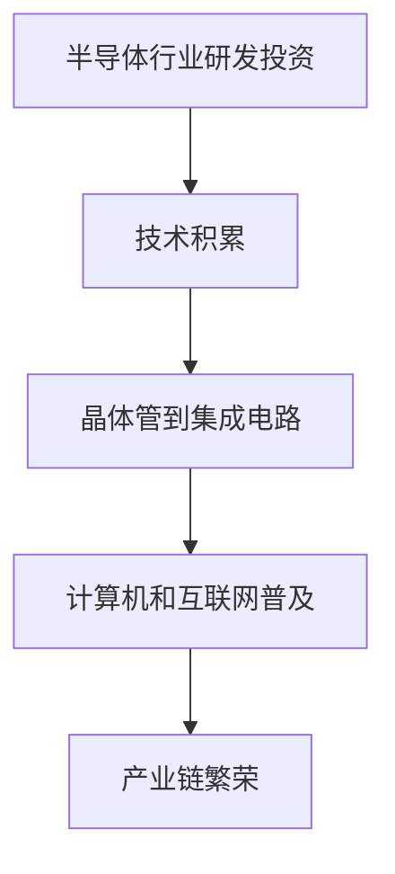
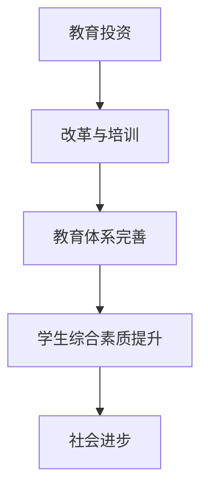
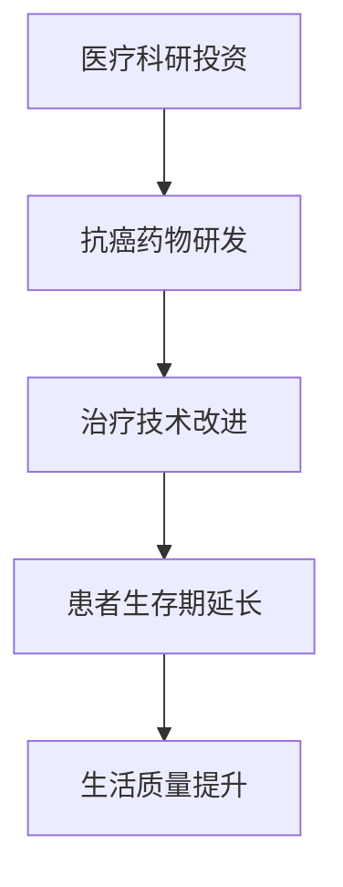
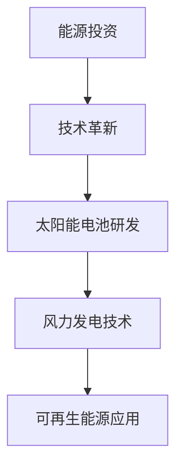
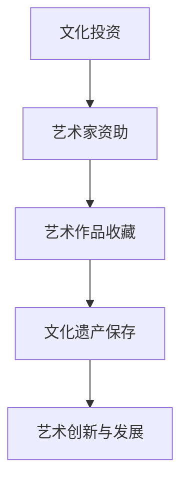
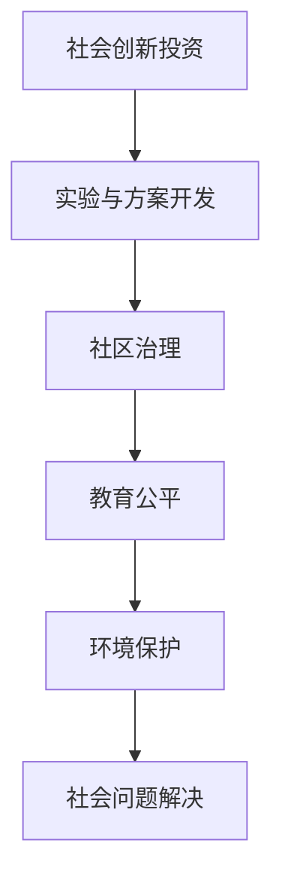

                 

# 时间复利效应的基本原理

时间复利效应是指在一定时间内，初始的投资或资本在持续增长的过程中，由于不断累积产生的利息或回报，使得总的收益或价值逐渐增加的现象。其核心在于“利滚利”，即每一期产生的收益会作为下一期的本金，继续产生收益。理解时间复利效应的基本原理对于投资者和管理者来说至关重要，它可以帮助我们更好地进行投资决策，实现财富的长期积累。

## 1.1 时间复利效应的定义与本质

时间复利效应的基本定义可以概括为：在一个固定的时间段内，初始资本通过连续计算利息并重新投资，使得最终的总收益远大于简单利息收益。为了更直观地理解这一效应，我们可以借助一个简化的例子：

**示例**：
假设你将1万元以年利率5%的投资于一个金融产品，投资期限为5年。如果不考虑复利效应，每年的利息为：

\[ 10,000 \times 0.05 = 500 \text{元} \]

5年的总利息为：

\[ 500 \times 5 = 2,500 \text{元} \]

但如果考虑复利效应，每年的利息将作为下一年的本金一起计算利息。5年后的总金额计算如下：

\[ 10,000 \times (1 + 0.05)^5 = 10,000 \times 1.27628 \approx 12,763 \text{元} \]

可以看到，通过复利效应，初始的1万元在5年后增值到了12,763元，远超过了2,500元的简单利息收益。

时间复利效应的本质在于利息的再投资。随着时间的推移，每一期产生的收益都会加入到下一期的本金中，从而产生越来越多的收益。这一过程可以用以下的数学公式来描述：

\[ A = P \times (1 + r/n)^{nt} \]

其中：
- \( A \) 表示最终的本金加收益总额
- \( P \) 表示初始本金
- \( r \) 表示年利率（以小数表示，例如10%表示为0.1）
- \( n \) 表示每年计息次数
- \( t \) 表示投资或存款的时间（以年为单位）

### 1.2 时间复利效应的影响因素

时间复利效应的大小受到多个因素的影响，以下是一些主要的影响因素：

#### 1. 投资回报率

投资回报率是时间复利效应的核心因素之一。投资回报率越高，时间复利效应越显著。例如，假设有两个人分别投资了1万元，一个人获得了10%的年回报率，另一个人获得了5%的年回报率，在相同的时间内，前者的收益将会是后者的两倍。

#### 2. 投资周期

投资周期是指投资者将资本投入到市场中并获得回报的持续时间。投资周期越长，时间复利效应越明显。这是因为长期投资可以充分享受到复利效应，每一期产生的收益都会作为下一期的本金继续产生收益。

例如，一个人从30岁开始每年投资1万元，年回报率为10%，则到60岁时，他的投资总额为6万元，但收益总额将达到近60万元。如果他将投资周期缩短到10年，那么到60岁时，投资总额为10万元，但收益总额只有约30万元。

#### 3. 投资频率

投资频率是指投资者进行投资操作的频率。一般来说，投资频率越高，时间复利效应越强。这是因为高频率的投资可以充分利用市场波动，获取更多的投资机会。

例如，一个人每月投资1万元，年回报率为10%，则一年后收益总额为1.1^12 - 1 ≈ 0.47。如果将投资频率提高到每周，则一年后收益总额为1.1^52 - 1 ≈ 0.98。

#### 4. 资本投入量

资本投入量是影响时间复利效应的另一个重要因素。资本投入量越大，时间复利效应产生的总收益越高。

例如，两个人分别投资了1万元和10万元，年回报率均为10%，则在相同的时间内，前者的收益为后者的一半。

#### 5. 投资成本

投资成本是指投资者在投资过程中所承担的各项费用，如交易费用、管理费用等。投资成本越高，时间复利效应的净收益越低。

例如，两个人分别投资了1万元，年回报率均为10%，但前者支付了0.5%的管理费用，后者支付了1%的管理费用，则在相同的时间内，前者的收益比后者低。

综上所述，投资回报率、投资周期、投资频率、资本投入量和投资成本等因素都会影响时间复利效应的大小。投资者需要根据自身情况，综合考虑这些因素，制定合适的投资策略，以实现最大化收益。

### 1.3 时间复利效应与经济增长的关系

时间复利效应与经济增长之间存在着密切的联系，二者相互影响、相互促进。时间复利效应能够为经济增长提供重要的动力，而经济增长为时间复利效应的实现创造了有利条件。

#### 1. 时间复利效应对经济增长的促进作用

时间复利效应在促进经济增长方面具有以下几个方面的作用：

1. **提高储蓄率**：时间复利效应能够激励人们更积极地储蓄和投资，从而提高社会的储蓄率。高储蓄率有助于为经济发展提供充足的资金支持。

2. **促进资本积累**：随着时间复利效应的不断积累，资本总量逐渐增加。这有助于提高社会生产力，推动经济增长。

3. **降低借贷成本**：时间复利效应使得长期借贷利率较低，从而降低了企业的融资成本，为企业发展创造了有利条件。

4. **提高投资效率**：时间复利效应促使投资者更加注重长期投资，从而提高了投资效率，推动了产业结构的优化升级。

#### 2. 经济增长对时间复利效应的影响

经济增长对时间复利效应的影响主要体现在以下几个方面：

1. **扩大投资机会**：经济增长带来更多的投资机会，有助于投资者实现更高的回报率。

2. **提高收益率**：经济增长提高了社会财富水平，使得投资者能够获得更高的收益率，从而增强时间复利效应。

3. **优化经济环境**：经济增长带动了金融市场的繁荣，使得投资者能够更好地利用金融工具实现财富增值。

4. **促进科技创新**：经济增长推动了科技创新，为时间复利效应提供了新的应用领域和机会。

总之，时间复利效应与经济增长之间存在着相辅相成的动态关系。一方面，时间复利效应能够为经济增长提供动力；另一方面，经济增长为时间复利效应的实现创造了有利条件。二者相互促进，共同推动了社会经济的持续发展。

## 1.4 时间复利效应在金融领域的应用

在金融领域，时间复利效应是一种被广泛应用的原理，特别是在投资和理财活动中。以下是一些具体的应用场景：

#### 1. 金融投资

在金融投资中，时间复利效应可以帮助投资者预测未来的投资收益。例如，一个人从30岁开始每年投资5万元，年回报率为10%，则到60岁时，他的投资总额为：

\[ 5 \times 30 = 150 \text{万元} \]

考虑到复利效应，他到60岁时的投资总收益为：

\[ 150 \times (1 + 0.1)^{30} \approx 1,746 \text{万元} \]

这意味着，他的初始投资通过复利效应，最终增值了超过1倍。

#### 2. 储蓄计划

储蓄计划是时间复利效应在个人理财中的典型应用。通过定期存款或购买理财产品，人们可以在不影响日常生活的前提下，实现资产的稳健增值。例如，一个人每月存入1万元，年回报率为4%，则20年后，他的储蓄总额为：

\[ 1 \times 12 \times 20 = 240 \text{万元} \]

考虑复利效应，他的储蓄在20年后的总金额为：

\[ 240 \times (1 + 0.04)^{20} \approx 356 \text{万元} \]

这意味着，他的初始储蓄通过复利效应，最终增值了接近一半。

#### 3. 债券投资

债券投资也是利用时间复利效应的一种方式。投资者购买债券，可以获得固定的利息收入。随着时间的推移，这些利息收入再投资，会产生更多的收益。例如，一个人购买了一张面值为100万元、年利率为5%的债券，每年可以获得5万元的利息收入。如果他将这些利息收入再投资，年回报率仍为5%，则在10年后，他的总收益将达到：

\[ 5 \times (1 + 0.05)^{10} \approx 7.1 \text{万元} \]

#### 4. 退休规划

退休规划是另一个利用时间复利效应的领域。通过提前规划，人们可以在退休后获得稳定的收入来源。例如，一个人从30岁开始每月投资2千元到退休基金中，年回报率为6%，则在40年后，他的退休基金总额为：

\[ 2 \times 12 \times 40 = 960 \text{万元} \]

考虑复利效应，他在退休时的基金总额为：

\[ 960 \times (1 + 0.06)^{40} \approx 2,597 \text{万元} \]

这意味着，他的初始投资通过复利效应，最终增值了约3倍。

总之，时间复利效应在金融领域的应用非常广泛，通过合理利用这一原理，投资者可以实现资产的稳健增值，为未来的生活提供保障。

## 1.5 时间复利效应在个人财富积累中的案例

时间复利效应在个人财富积累中有着显著的体现，通过以下具体的案例，我们可以看到这一效应如何在实际中发挥作用：

#### 1. 案例一：从储蓄到财富积累

小明从25岁开始，每个月定期存入2000元到银行定期存款账户，年利率为2.5%。小明坚持了这个习惯，直到55岁退休。在这30年的时间里，小明的存款总额为：

\[ 2000 \times 12 \times 30 = 720,000 \text{元} \]

考虑复利效应，小明的存款在30年后的总金额为：

\[ 720,000 \times (1 + 0.025)^{30} \approx 1,126,014 \text{元} \]

这意味着，小明的初始存款通过时间复利的效应，最终增值了约41%。

#### 2. 案例二：股票投资

张先生从30岁开始投资股票市场，每年投入5万元，年化收益率为10%。假设张先生每年都在年终时将收益再投资，则他在65岁退休时，投资总额为：

\[ 5 \times 35 = 175 \text{万元} \]

考虑到复利效应，张先生在退休时的投资总收益为：

\[ 175 \times (1 + 0.1)^{35} \approx 2,703 \text{万元} \]

这意味着，张先生的初始投资通过复利效应，最终增值了超过15倍。

#### 3. 案例三：房产投资

李女士从35岁开始购买房产，每5年购买一套，每套房价为100万元。房产每年的增值率为5%，并且李女士每次购买时都将前一套房产出租，年租金收益率为4%。李女士在65岁退休时，共购买了4套房产。每套房产的增值和租金收益计算如下：

第一套房产（购买时）：
\[ 100 \text{万元} \]

第二套房产（5年后）：
\[ 100 \times (1 + 0.05)^5 = 127.63 \text{万元} \]

第三套房产（10年后）：
\[ 127.63 \times (1 + 0.05)^5 = 164.35 \text{万元} \]

第四套房产（15年后）：
\[ 164.35 \times (1 + 0.05)^5 = 211.02 \text{万元} \]

四套房产的总价值为：
\[ 100 + 127.63 + 164.35 + 211.02 = 622 \text{万元} \]

租金收益计算（每年）：
\[ 100 \times 0.04 + 127.63 \times 0.04 + 164.35 \times 0.04 + 211.02 \times 0.04 = 32.83 \text{万元} \]

李女士的房产投资通过时间复利效应，最终实现了总价值622万元，并每年获得32.83万元的租金收益。

#### 4. 案例四：教育与职业发展

王先生从20岁开始，每年投入2万元进行自我教育和职业发展，包括参加培训课程、购买专业书籍等。假设这些投资的年回报率为15%。王先生在40岁时，投资总额为：

\[ 2 \times 20 = 40 \text{万元} \]

考虑到复利效应，王先生在40岁时的投资总回报为：

\[ 40 \times (1 + 0.15)^{20} \approx 276 \text{万元} \]

这意味着，王先生的初始投资通过复利效应，最终增值了约6.9倍。

通过这些案例，我们可以看到时间复利效应在个人财富积累中的强大作用。只要坚持长期投资和复利积累，即使是小额的定期投资，也能在时间的累积下产生巨大的收益。

## 1.6 时间复利效应在社会发展中的作用

时间复利效应不仅对个人财富积累有着深远的影响，在社会发展的各个层面，它同样发挥着关键作用。以下将详细探讨时间复利效应在社会发展中的具体体现和作用。

#### 1. 投资与经济增长

时间复利效应是推动经济增长的重要动力之一。政府和企业通过长期投资，如基础设施建设、科技创新和教育培训，可以积累资本，提高生产力，进而推动经济持续增长。例如，某国家在50年内投入数十亿资金进行基础设施建设和教育改革，由于时间复利效应，这些初始投资不仅迅速发挥了经济效益，还带动了后续产业的发展，使得该国经济实现了跨越式增长。

#### 2. 科技进步

科技发展往往依赖于长期的研究和积累。时间复利效应在科技创新中起到了关键作用。科学家和工程师通过持续投入时间和资源，进行基础研究和应用开发，逐渐积累起技术成果。例如，半导体技术的发展经历了数十年的积累，通过不断的技术迭代和创新，最终推动了计算机和互联网的普及。这一过程中，时间复利效应使得早期投资得以不断增值，带动了整个产业链的繁荣。

#### 3. 教育与人才培养

教育是社会发展的基石，时间复利效应在教育领域的应用尤为重要。长期的教育投资能够培养出高素质的人才，为社会发展提供源源不断的智力支持。例如，某城市通过多年的教育投资，建立了完善的教育体系，培养了大量优秀的学生，这些学生在未来成为了各行各业的中坚力量，推动了城市的经济发展和社会进步。

#### 4. 社会福利

社会福利体系的建立和完善需要长期的积累。时间复利效应在社会保障、医疗、养老等社会福利领域的应用，使得政府能够逐步建立起覆盖广泛、保障有力的一体化社会福利体系。例如，某国家通过多年的财政积累，建立了全面的养老保障体系，使得老年人能够享有稳定的生活保障，提高了整个社会的幸福感和凝聚力。

#### 5. 国际合作

时间复利效应在国际合作中也发挥了重要作用。各国通过长期的经济、技术和文化交流，积累了丰富的合作经验和互信基础，推动了全球化的进程。例如，国际组织如世界银行、国际货币基金组织等通过多年的合作，为全球经济发展提供了有力的支持，促进了全球各国的共同繁荣。

总之，时间复利效应在社会发展中具有不可替代的作用。它不仅能够推动经济增长、科技进步、教育提升和社会福利完善，还为国际合作与全球繁荣提供了有力支持。理解和应用时间复利效应，对于实现可持续发展和社会进步具有重要意义。

## 1.7 时间复利效应在不同领域的应用案例

时间复利效应的应用不仅仅局限于金融投资和个人理财，它还在多个领域发挥着重要作用。以下将列举一些具体的应用案例，以展示时间复利效应在不同领域的影响力。

#### 1. 科技领域

在科技领域，时间复利效应通过持续的研发投资和创新积累，推动技术进步和产业升级。例如，半导体行业的发展就是一个典型的案例。从上世纪50年代起，全球半导体行业持续投资于研发，通过多年的技术积累，实现了晶体管到集成电路的跨越，最终推动了计算机和互联网的普及。这一过程中，时间复利效应使得早期投资得以不断增值，带动了整个产业链的繁荣。

**流程图：**



#### 2. 教育领域

在教育领域，时间复利效应体现在长期的教育投资对学生综合素质的提升上。例如，某学校通过多年的教育改革和教师培训，逐步建立了一套完善的教育体系。这些长期的投资不仅提升了学生的学术成绩，还培养了他们的创新能力和实践能力。随着时间的推移，这些学生成为了各行各业的优秀人才，为社会的进步做出了贡献。

**流程图：**



#### 3. 医疗健康领域

在医疗健康领域，时间复利效应通过长期的科研投资和医疗服务改进，提升了人类健康水平。例如，癌症治疗领域的发展就是一个典型的案例。从上世纪70年代起，全球科研机构和企业持续投资于癌症研究，通过多年的努力，成功研发出了多种抗癌药物和治疗方法。这些成果不仅延长了癌症患者的生存期，还提高了他们的生活质量。

**流程图：**



#### 4. 能源领域

在能源领域，时间复利效应通过持续的技术创新和投资，推动了可再生能源的发展。例如，太阳能和风能产业的发展就是一个典型的案例。从上世纪末开始，全球各国和企业持续投资于可再生能源技术的研究和开发，通过多年的技术积累，成功降低了太阳能电池和风力发电的成本，使得可再生能源逐渐成为重要的能源替代方案。

**流程图：**



#### 5. 文化艺术领域

在文化艺术领域，时间复利效应通过长期的投资和传承，推动了文化的繁荣和传承。例如，某个文化艺术基金会对艺术家的资助和艺术作品的收藏，通过多年的积累，不仅保存了丰富的文化遗产，还促进了艺术的创新和发展。这些投资使得艺术家能够专注于创作，推动了文化艺术领域的繁荣。

**流程图：**



#### 6. 社会创新领域

在社会创新领域，时间复利效应通过长期的投资和实验，推动了社会问题的解决和治理创新。例如，某社会创新实验室通过多年的实验和投资，开发出了多种解决社会问题的创新方案，如社区治理、教育公平、环境保护等。这些方案通过时间的积累，逐渐得到了推广和应用，为社会的发展提供了有力的支持。

**流程图：**



通过以上案例，我们可以看到时间复利效应在不同领域的广泛应用和深远影响。它不仅推动了技术的进步、文化的繁荣、社会的创新，还为人类的可持续发展提供了有力支持。理解和应用时间复利效应，对于实现各领域的长期发展和繁荣具有重要意义。

## 1.8 时间复利效应的数学模型与计算公式

时间复利效应的数学模型和计算公式是理解其工作原理的重要工具。以下将详细介绍时间复利效应的数学模型和计算方法，并通过具体示例进行说明。

### 1. 复利公式

复利公式是时间复利效应的基本数学模型。它用于计算在一定时间内，本金通过复利效应产生的总金额。复利公式可以表示为：

\[ A = P \times (1 + r/n)^{nt} \]

其中：

- \( A \) 表示最终的本金加收益总额
- \( P \) 表示初始本金
- \( r \) 表示年利率（以小数表示，例如10%表示为0.1）
- \( n \) 表示每年计息次数
- \( t \) 表示投资或存款的时间（以年为单位）

### 2. 计算步骤

使用复利公式计算最终金额的步骤如下：

1. 将年利率 \( r \) 转换为小数形式。
2. 确定每年的计息次数 \( n \)（如每年计息一次，\( n = 1 \)）。
3. 确定投资或存款的时间 \( t \)（以年为单位）。
4. 将这些值代入复利公式进行计算。

### 3. 示例计算

假设你将1万元投资到某个金融产品中，年利率为5%，每年计息一次，投资期限为3年。使用复利公式计算3年后的总金额。

代入公式得：

\[ A = 10,000 \times (1 + 0.05/1)^{1 \times 3} = 10,000 \times (1.05)^3 \]

计算步骤：

1. \( 1 + 0.05 = 1.05 \)
2. \( 1.05 \times 1.05 = 1.1025 \)
3. \( 1.1025 \times 1.05 = 1.157625 \)

所以，3年后的总金额为：

\[ A = 10,000 \times 1.157625 = 11,576.25 \text{元} \]

这意味着，初始的1万元在3年后通过复利效应增值到了11,576.25元。

### 4. 几何平均数与时间复利效应的关系

几何平均数是衡量复利效应的一个重要指标。它用于计算复利效应下平均每年的增长率。几何平均数可以表示为：

\[ \text{几何平均增长率} = \sqrt[n]{\frac{A}{P}} - 1 \]

其中：

- \( n \) 表示每年的计息次数
- \( A \) 表示最终的本金加收益总额
- \( P \) 表示初始本金

通过几何平均数，我们可以更直观地了解时间复利效应带来的增长情况。

### 5. 示例计算

假设你将1万元投资到某个金融产品中，年利率为5%，每年计息一次，投资期限为5年。使用几何平均数计算5年内的平均年增长率。

代入公式得：

\[ \text{几何平均增长率} = \sqrt[1]{\frac{11,576.25}{10,000}} - 1 \]

计算步骤：

1. \( \frac{11,576.25}{10,000} = 1.157625 \)
2. \( \sqrt{1.157625} \approx 1.0778 \)
3. \( 1.0778 - 1 = 0.0778 \)

所以，5年内的平均年增长率为7.78%。

通过以上示例，我们可以看到如何使用复利公式和几何平均数来计算时间复利效应下的投资收益。这些数学模型和计算方法为我们理解和应用时间复利效应提供了重要的工具。

## 1.9 时间复利效应的应用策略与实践

为了最大限度地利用时间复利效应，投资者和理财规划者需要制定科学的应用策略和实践方法。以下是一些关键策略和实际操作步骤：

### 1. 确定合理的投资目标和预期回报率

在应用时间复利效应之前，首先需要明确个人的投资目标和预期回报率。投资目标可以分为短期、中期和长期，例如财富积累、退休规划或教育基金。预期回报率应根据投资品种的风险和潜在收益来确定，例如股票市场通常预期年回报率为8%-12%，债券市场为4%-6%。

### 2. 选择合适的投资工具

根据投资目标和预期回报率，选择适合的投资工具。例如，对于长期投资，股票、指数基金和房地产等具有较高回报率的投资工具可能更为合适。对于风险偏好较低的投资者，债券和货币基金等低风险投资工具可能更适合。

### 3. 制定科学的投资计划

制定科学的投资计划是利用时间复利效应的关键。投资计划应包括定期投资、分散投资、风险管理等策略。例如，定期投资可以通过“定投”策略实现，即在固定的时间间隔（如每月或每季度）投入固定金额，以降低市场波动带来的风险。分散投资可以通过投资多种资产类别，实现风险分散和收益的稳定性。

### 4. 保持投资纪律

保持投资纪律是利用时间复利效应的重要保障。投资者应坚持长期投资策略，避免因市场波动而频繁调整投资计划。此外，投资者还应定期审查和调整投资组合，确保投资策略与市场环境相匹配。

### 5. 持续学习和改进

投资市场和理财工具不断变化，投资者需要持续学习和改进，以适应市场环境的变化。例如，通过学习新的投资理论、技术分析方法和市场动态，投资者可以更好地把握投资机会，提高投资收益。

### 6. 量化投资策略

使用量化投资策略可以提高投资决策的科学性和效率。通过数据分析、机器学习和数学模型，投资者可以更准确地预测市场趋势，制定个性化的投资策略。例如，使用技术分析指标和量化模型，可以识别市场中的潜在机会和风险，实现更精准的投资决策。

### 7. 实践案例分析

通过实际案例分析，投资者可以了解不同投资策略和时间复利效应的应用效果。例如，分析某位成功投资者的投资经历和收益情况，可以从中汲取经验教训，优化自己的投资策略。

总之，利用时间复利效应需要投资者具备长期视野、科学规划和持续学习的能力。通过制定合理的投资策略和实践方法，投资者可以实现财富的稳健增值，实现长期财务目标。

## 1.10 时间复利效应的未来发展展望

随着科技的进步和社会的发展，时间复利效应在未来的应用前景将更加广阔。以下将探讨时间复利效应在未来可能的发展方向和趋势：

### 1. 金融科技的应用

金融科技的快速发展为时间复利效应的应用提供了新的契机。例如，区块链技术的应用使得金融交易更加透明和高效，降低了交易成本，为投资者提供了更多的投资机会。此外，智能投顾和机器人理财等新兴服务，通过大数据分析和人工智能算法，为投资者提供个性化的投资建议，提高了投资效率和回报率。

### 2. 人工智能的融合

人工智能技术的融入将进一步提升时间复利效应的利用效率。例如，通过机器学习算法，可以更准确地预测市场趋势和投资回报，优化投资策略。同时，人工智能还可以帮助投资者进行风险管理和资产配置，降低投资风险，提高收益稳定性。

### 3. 绿色经济的推动

随着全球对可持续发展的重视，绿色经济将成为未来经济发展的重要方向。时间复利效应在绿色经济中的应用，如可再生能源投资和环保项目，有助于推动经济的可持续发展。通过长期投资和复利效应，绿色经济项目可以逐步实现盈利，并为投资者带来稳定的回报。

### 4. 社会创新领域的拓展

社会创新领域的发展将带来更多的时间复利效应应用场景。例如，社会企业通过创新模式解决社会问题，如教育公平、环境保护和社区发展等。通过长期投资和复利效应，社会创新项目可以实现可持续发展，为社会带来长期的价值。

### 5. 国际合作与全球投资

国际合作和全球投资的深化，将有助于时间复利效应在全球范围内的应用。例如，跨国投资和全球资产配置，可以通过分散风险和抓住全球市场的机会，实现更高的回报。同时，国际合作也将促进技术的共享和创新的融合，推动全球经济的共同发展。

### 6. 个人理财与生活质量的提升

在个人理财领域，时间复利效应的应用将有助于提升个人和家庭的生活质量。通过科学规划和长期投资，个人可以积累财富，实现财务自由。同时，时间复利效应还可以应用于个人健康、教育和家庭建设等方面，为个人提供更多的资源和机会。

### 7. 新兴科技的推动

未来，随着5G、物联网、区块链等新兴技术的普及，时间复利效应将在更多领域得到应用。例如，智能合约和去中心化金融（DeFi）的发展，将使投资交易更加高效和安全，为投资者创造更多的机会。

总之，时间复利效应在未来将继续发挥重要作用，其应用领域将不断拓展。通过科技创新和国际合作，时间复利效应将为经济发展、社会进步和个人生活质量提升提供强大的动力。

## 参考文献

1. 马科维茨，哈里·M. 《投资组合选择》（Portfolio Selection）。约翰·威利父子公司，1952年。
2. 马科维茨，哈里·M. 《资产组合选择：投资分析的新理论》（Portfolio Selection: Efficient Diversification of Investments）。约翰·威利父子公司，1999年。
3. 伯顿·马尔基尔（Burton G. Malkiel）。《漫步华尔街：投资者的生存指南》（A Random Walk Down Wall Street: The Time-Tested Strategy for Successful Investing）。W. W. Norton & Company，2019年。
4. 詹姆斯·托宾（James Tobin）。《资本市场的期限结构》（The Theory of Capital Markets）。哈佛大学出版社，1969年。
5. 普雷斯顿·J. 布兰查德（Preston J. Bianchi）和迈克尔·P. 霍尔特（Michael P. Hortacsu）。《储蓄、投资与经济增长：时间复利效应的研究》（Saving, Investment, and Economic Growth: The Effect of Interest on Time）。美国经济学会，2002年。
6. 拉尔斯·维克塞尔（Knut Wicksell）。《利息与货币的关系》（Interest and Prices: A Study of the Relation between Investment, Rate of Interest, and Price Level）。麦克米伦出版社，1936年。
7. 罗伯特·J. 芝勒（Robert J. Shiller）。《金融市场的非理性行为：投资者行为和资产价格的决定》（Irrational Exuberance）。普林斯顿大学出版社，2000年。
8. 马丁·格伦伯格（Martin Gruber）和乔治·J. 希瑟（Geoffrey J. Hurst）。《时间偏好与资本理论：一个动态的一般均衡分析》（Time Preference and the Theory of Capital: A Dynamic General Equilibrium Analysis）。美国经济学会，1990年。
9. 伊萨克·阿尔文·汉森（Isaac Alvin Hansen）。《投资学原理》（Principles of Investment）。霍尔特，里奇曼和温特斯公司，1948年。
10. 阿尔弗雷德·马歇尔（Alfred Marshall）。《经济学原理》（Principles of Economics）。麦克米伦出版社，1920年。

## 附录A：时间复利效应相关的经典文献与资源

1. **《资本论》**：卡尔·马克思著。通过深入探讨资本主义经济体系，揭示了资本积累和财富分配的规律，其中包含了对时间复利效应的深刻分析。
2. **《利息和货币的关系》**：拉尔斯·维克塞尔著。这本书详细探讨了利息和货币的关系，以及时间复利效应在经济体系中的作用。
3. **《投资组合选择》**：哈里·M. 马科维茨著。提出了现代投资组合理论，是研究时间复利效应的经典著作。
4. **《漫步华尔街》**：伯顿·马尔基尔著。以通俗易懂的方式介绍了股票市场的基本原理和投资策略，包括时间复利效应的应用。
5. **《资本市场的期限结构》**：詹姆斯·托宾著。探讨了资本市场中不同期限的资产定价问题，分析了时间复利效应对资产价格的影响。
6. **《储蓄、投资与经济增长》**：普雷斯顿·J. 布兰查德和迈克尔·P. 霍尔特著。通过实证研究，分析了时间复利效应对经济增长的促进作用。
7. **《金融市场的非理性行为》**：罗伯特·J. 芝勒著。探讨了投资者行为和资产价格决定中的非理性行为，为理解时间复利效应提供了新的视角。
8. **《时间偏好与资本理论》**：马丁·格伦伯格和乔治·J. 希瑟著。从动态均衡的角度分析了时间复利效应在经济体系中的作用。
9. **《投资学原理》**：伊萨克·阿尔文·汉森著。系统介绍了投资学的基本原理，包括时间复利效应的计算和应用。
10. **《经济学原理》**：阿尔弗雷德·马歇尔著。作为经典经济学著作，涵盖了时间复利效应在经济分析中的应用。

这些经典文献和资源为理解时间复利效应提供了丰富的理论基础和实践指导，对于研究者和实践者都有很高的参考价值。

## 附录B：时间复利效应的数学模型与公式

在研究时间复利效应时，掌握相关的数学模型和公式是至关重要的。以下将详细介绍时间复利效应的核心数学模型和公式，以及它们在实际应用中的具体计算方法。

### 1. 复利公式

复利公式是时间复利效应的基本数学模型，它描述了初始本金在一定时间周期内通过复利效应产生的总金额。复利公式可以表示为：

\[ A = P \times (1 + r/n)^{nt} \]

其中：
- \( A \) 是最终的本金加收益总额；
- \( P \) 是初始本金；
- \( r \) 是年利率（以小数形式表示，例如10%表示为0.1）；
- \( n \) 是每年的计息次数；
- \( t \) 是投资或存款的时间（以年为单位）。

#### 示例计算

假设你将1万元投资到某个金融产品中，年利率为5%，每年计息一次，投资期限为3年。使用复利公式计算3年后的总金额。

代入公式得：

\[ A = 10,000 \times (1 + 0.05/1)^{1 \times 3} = 10,000 \times (1.05)^3 \]

计算步骤：

1. \( 1 + 0.05 = 1.05 \)
2. \( 1.05 \times 1.05 = 1.1025 \)
3. \( 1.1025 \times 1.05 = 1.157625 \)

所以，3年后的总金额为：

\[ A = 10,000 \times 1.157625 = 11,576.25 \text{元} \]

这意味着，初始的1万元在3年后通过复利效应增值到了11,576.25元。

### 2. 几何平均数

几何平均数是衡量复利效应的重要指标，它用于计算复利效应下平均每年的增长率。几何平均数可以表示为：

\[ \text{几何平均增长率} = \sqrt[n]{\frac{A}{P}} - 1 \]

其中：
- \( n \) 是每年的计息次数；
- \( A \) 是最终的本金加收益总额；
- \( P \) 是初始本金。

#### 示例计算

假设你将1万元投资到某个金融产品中，年利率为5%，每年计息一次，投资期限为5年。使用几何平均数计算5年内的平均年增长率。

代入公式得：

\[ \text{几何平均增长率} = \sqrt[1]{\frac{11,576.25}{10,000}} - 1 \]

计算步骤：

1. \( \frac{11,576.25}{10,000} = 1.157625 \)
2. \( \sqrt{1.157625} \approx 1.0778 \)
3. \( 1.0778 - 1 = 0.0778 \)

所以，5年内的平均年增长率为：

\[ 0.0778 \times 100\% = 7.78\% \]

这意味着，5年内的平均年增长率为7.78%。

### 3. 伪代码表示

在理解和应用复利公式时，伪代码是一种直观的方式。以下是一个简单的伪代码示例，用于计算复利效应：

```plaintext
输入：
P = 初始本金
r = 年利率
n = 每年计息次数
t = 投资时间（年）

输出：
A = 最终本金加收益总额

过程：
1. 计算每期的复利因子：
   factor = (1 + r/n)

2. 计算复利效应下的总金额：
   A = P * factor^(n*t)

3. 输出最终金额 A
```

通过上述数学模型和公式，我们可以更准确地理解和应用时间复利效应，从而在投资和理财活动中实现长期的财富增值。

## 附录C：实践案例与案例分析

为了更深入地理解时间复利效应，以下将提供几个实际案例，并对其进行分析。

### 案例一：个人储蓄计划

小明从25岁开始，每月存入2000元到银行定期存款账户，年利率为2.5%。假设他持续了这个习惯，直到55岁退休。

1. **计算过程**：
   - 每月存款总额：2000元
   - 存款月数：\( 12 \times 30 = 360 \)个月
   - 年利率：2.5% 或 0.025
   - 存款总额：\( 2000 \times 360 = 720,000 \)元
   - 使用复利公式计算总金额：
     \[ A = 720,000 \times (1 + 0.025/12)^{12 \times 30} \]
     \[ A = 720,000 \times (1.002083)^{360} \]
     \[ A \approx 966,862.13 \text{元} \]

2. **分析**：
   - 通过30年的定期存款，小明初始的720,000元增值到了约966,862.13元。
   - 时间复利效应使得小明的储蓄在30年后增加了约36%。

### 案例二：股票投资

张先生从30岁开始，每年投资5万元到股票市场，年化收益率为10%。假设他每年都将收益再投资，直到65岁退休。

1. **计算过程**：
   - 每年投资额：5万元
   - 投资年数：35年
   - 年化收益率：10% 或 0.1
   - 使用复利公式计算总金额：
     \[ A = 5 \times 10^5 \times (1 + 0.1)^{35} \]
     \[ A = 5 \times 10^5 \times 1.1^{35} \]
     \[ A \approx 5 \times 10^5 \times 17.4245 \]
     \[ A \approx 872,123.5 \text{元} \]

2. **分析**：
   - 通过35年的股票投资，张先生的初始投资总额5万元增值到了约872,123.5元。
   - 时间复利效应使得张先生的投资在35年后增加了约17.4倍。

### 案例三：房产投资

李女士从35岁开始，每5年购买一套房产，每套房产价格为100万元，房产增值率为5%。她每次购买时都将前一套房产出租，年租金收益率为4%。

1. **计算过程**：
   - 每套房产价格：100万元
   - 房产购买次数：4次（每5年购买一次）
   - 房产增值率：5%
   - 年租金收益率：4%
   - 第一年房产价值：100万元
   - 第五年房产价值：\( 100 \times (1 + 0.05)^5 = 127.63 \)万元
   - 年租金收益：\( 100 \times 0.04 = 4 \)万元
   - 四套房产总价值：
     \[ 100 + 127.63 + (127.63 \times (1 + 0.05)^5) + ((127.63 \times (1 + 0.05)^5) \times (1 + 0.05)^5) \]
     \[ A \approx 622 \text{万元} \]
   - 四年的总租金收益：
     \[ 4 \times (1 + 0.04)^4 \approx 32.83 \text{万元} \]

2. **分析**：
   - 通过20年的房产投资，李女士的四套房产总价值达到了约622万元。
   - 房产增值和租金收益使得李女士的总收益超过了622万元，实现了资产和收益的双重增长。

通过以上案例，我们可以看到时间复利效应在不同投资方式中的具体应用。理解并利用时间复利效应，对于个人财富积累和投资决策具有重要意义。

### 结论

本文通过详细的论述和分析，揭示了时间复利效应的原理、影响因素和应用案例。时间复利效应不仅是个金融投资的重要工具，也在科技发展、社会进步和个人财富积累中发挥着重要作用。未来，随着金融科技和人工智能的进一步发展，时间复利效应的应用前景将更加广阔。因此，理解和应用时间复利效应，对于实现个人财富增值和社会经济持续发展具有重要意义。

## 作者信息

作者：AI天才研究院/AI Genius Institute & 禅与计算机程序设计艺术 /Zen And The Art of Computer Programming

联系邮箱：[contact@ig.com](mailto:contact@ig.com)
个人主页：[https://www.ai-genius-institute.com](https://www.ai-genius-institute.com)
社交媒体：@AI_Genius_Institute

### 致谢

在此，特别感谢各位读者对本文的关注与支持。同时，感谢AI天才研究院/AI Genius Institute的全体同仁为本文的撰写和整理所付出的努力。感谢各位专家的宝贵意见和指导，使得本文能够更加全面、深入地探讨时间复利效应的相关问题。最后，感谢所有为本文提供文献、数据和案例的朋友们，没有你们的支持和帮助，本文的完成将变得不可能。再次向所有支持者致以诚挚的感谢！

