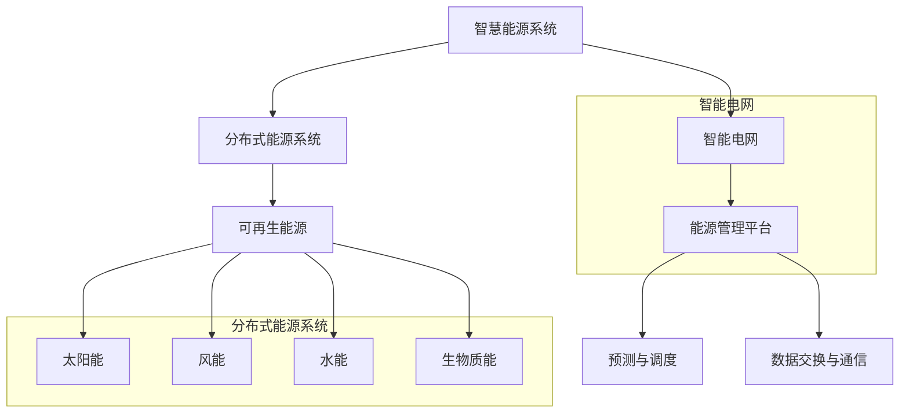

                 

# 未来的智慧能源：2050年的分布式能源与智能电网

## 关键词

- 2050年能源需求
- 分布式能源系统
- 智能电网
- 可再生能源技术
- 智能电网架构
- 智慧能源管理
- 智能电网市场与政策
- 未来能源展望

## 摘要

随着全球能源需求的不断增长和气候变化问题的日益严重，智慧能源和智能电网技术将成为未来能源系统的重要组成部分。本文旨在探讨2050年分布式能源与智能电网的发展趋势，核心概念及其应用。文章首先概述了智慧能源和智能电网的基本概念，然后详细介绍了分布式能源技术，包括太阳能、风能、水能和生物质能等。接着，分析了智能电网的架构、关键技术、安全性与稳定性以及通信协议与数据交换。随后，文章探讨了智能电网与可再生能源的集成机制、管理应用和预测调度技术。在市场与政策部分，文章分析了智能电网的市场潜力、政策框架与实施策略。最后，通过实际案例展示了智能电网项目的实施流程，并对未来智慧能源的发展趋势和智慧城市互动关系进行了展望。本文为未来智慧能源系统的研究和实践提供了有益的参考。

### 目录大纲

#### 第一部分: 智慧能源与智能电网基础

##### 第1章: 智慧能源概述
- 1.1 2050年能源需求预测
- 1.2 分布式能源系统介绍
- 1.3 智能电网的基本原理
- 1.4 智慧能源与可持续发展

##### 第2章: 分布式能源技术
- 2.1 可再生能源技术概述
- 2.2 太阳能发电技术
- 2.3 风能发电技术
- 2.4 水能发电技术
- 2.5 生物质能发电技术

##### 第3章: 智能电网架构
- 3.1 智能电网的组成与层级
- 3.2 智能电网的关键技术
- 3.3 智能电网的安全性与稳定性
- 3.4 智能电网的通信协议与数据交换

##### 第4章: 智能电网与可再生能源集成
- 4.1 可再生能源与智能电网的融合机制
- 4.2 智能电网在可再生能源管理中的应用
- 4.3 可再生能源预测与调度技术
- 4.4 分布式能源管理系统

##### 第5章: 智能电网的市场与政策
- 5.1 智能电网的市场潜力分析
- 5.2 智能电网政策框架与实施策略
- 5.3 智能电网商业模式与产业链
- 5.4 智能电网的发展趋势与未来展望

#### 第二部分: 智能电网应用与案例分析

##### 第6章: 智能电网项目实战
- 6.1 智能电网项目规划与实施流程
- 6.2 案例一：某地区智能电网项目案例分析
- 6.3 案例二：智能电网在偏远地区的应用
- 6.4 案例三：智能电网与电动汽车的融合应用

##### 第7章: 未来智慧能源展望
- 7.1 智慧能源的未来发展趋势
- 7.2 智能电网与智慧城市的互动关系
- 7.3 智慧能源的社会影响与伦理问题
- 7.4 智慧能源的全球合作与技术创新

#### 附录

##### 附录A: 智能电网相关技术资源
- A.1 智能电网技术指南与标准
- A.2 智能电网工具与平台推荐
- A.3 可再生能源与智能电网研究机构与组织

### 核心概念与联系

在讨论未来的智慧能源系统之前，有必要先了解一些核心概念和它们之间的相互联系。以下是一个Mermaid流程图，展示了未来智慧能源系统的主要组成部分及其相互关系。



在上述流程图中，智慧能源系统（A）是整个架构的核心，它通过分布式能源系统（B）收集和生成能源。分布式能源系统（B）由多种可再生能源技术（D）组成，包括太阳能（F）、风能（G）、水能（H）和生物质能（I）。智能电网（C）是连接分布式能源系统和用户的关键环节，通过能源管理平台（E）实现对能源的高效管理。预测与调度（J）和数据交换与通信（K）是智能电网的重要组成部分，确保能源系统的稳定运行。

### 分布式能源系统介绍

分布式能源系统（DES）是一种在用户附近或靠近能源消费地点安装小型能源生成设备，以实现能源本地化生产和消费的能源系统。与传统的集中式能源系统相比，分布式能源系统具有更高的灵活性和可靠性，能够更好地应对能源供需的波动，并降低能源传输过程中的损耗。以下是分布式能源系统的主要特点：

1. **灵活性**：分布式能源系统可以根据能源需求和资源条件动态调整能源生产和消费。通过使用多种可再生能源技术，如太阳能、风能、水能和生物质能，分布式能源系统可以更好地适应不同的环境条件和用户需求。

2. **可靠性**：分布式能源系统通过多个小型能源生成设备相互备份，提高了能源系统的可靠性。当一个能源生成设备出现故障时，其他设备可以继续运行，确保能源供应的连续性。

3. **减少传输损耗**：在分布式能源系统中，能源生成设备位于用户附近，减少了长距离传输过程中的能量损耗。这不仅提高了能源利用效率，还降低了能源系统的运营成本。

4. **降低碳排放**：分布式能源系统广泛使用可再生能源，如太阳能、风能和水能，这些能源具有低碳或零碳排放的特点。通过减少对化石燃料的依赖，分布式能源系统有助于降低温室气体排放，应对气候变化挑战。

5. **促进能源市场化**：分布式能源系统的出现推动了能源市场的多元化。用户可以成为能源的生产者和消费者，通过参与能源交易实现经济效益。此外，分布式能源系统还为电网运营商提供了更多的调度灵活性，有助于优化能源系统的运行。

### 智能电网的基本原理

智能电网（Smart Grid）是一种集成了现代信息技术、通信技术和电力电子技术的先进电力系统，能够实现对电力供应和消费的实时监控、分析和优化。智能电网的基本原理主要包括以下几个方面：

1. **实时监测**：智能电网通过安装在电网中的各种传感器和监测设备，实现对电压、电流、频率、功率因数等电力参数的实时监测。这些数据可以通过通信网络实时传输到电网控制中心，为电网的运行和管理提供基础数据。

2. **自适应控制**：智能电网采用了先进的自适应控制技术，能够根据电网运行状态和用户需求自动调整电力供应和消费。通过控制策略和优化算法，智能电网可以最大限度地提高电力系统的运行效率和稳定性。

3. **双向通信**：智能电网具有双向通信能力，允许电网与用户之间进行实时数据交换。用户可以通过智能电表等设备获取用电信息，并根据用电需求调整用电行为。同时，电网运营商可以实时了解用户的用电情况，优化电力调度和供应。

4. **分布式能源集成**：智能电网能够有效地集成分布式能源系统，如太阳能、风能、储能系统和微电网等。通过智能电网的控制和调度，分布式能源可以高效地接入电网，实现能源的高效利用和优化配置。

5. **自动化和智能化**：智能电网通过自动化技术和人工智能算法，实现了电力系统运行的自动化和智能化。自动化技术可以减少人工干预，提高电网的运行效率和可靠性。智能化技术则可以通过大数据分析、机器学习和人工智能算法，实现对电网运行状态的预测、优化和故障诊断。

### 智慧能源与可持续发展

智慧能源系统不仅能够提高能源利用效率和降低碳排放，还与可持续发展密切相关。以下从几个方面探讨智慧能源与可持续发展之间的关系：

1. **降低碳排放**：智慧能源系统通过广泛使用可再生能源，如太阳能、风能、水能和生物质能，减少了对化石燃料的依赖。这些可再生能源具有低碳或零碳排放的特点，有助于降低温室气体排放，应对气候变化挑战。

2. **提高能源效率**：智慧能源系统通过实时监测、自适应控制和分布式能源集成，提高了能源利用效率。智能电网的优化调度和能源管理技术可以最大限度地减少能源浪费，提高能源利用率。

3. **促进资源循环利用**：智慧能源系统鼓励使用废弃物和可再生能源，如生物质能。通过将废弃物转化为能源，实现了资源的循环利用，减少了废弃物对环境的污染。

4. **推动能源市场化**：智慧能源系统促进了能源市场的多元化，用户可以参与能源交易，实现经济效益。这种市场化的机制有助于激发创新和竞争，推动能源行业的发展。

5. **增强能源安全性**：智慧能源系统通过分布式能源和储能技术，提高了能源系统的可靠性和安全性。分布式能源系统具有自恢复能力，当电网发生故障时，分布式能源可以自动切换，确保能源供应的连续性。

6. **促进社会公平**：智慧能源系统可以为偏远地区和低收入群体提供清洁、可靠的能源服务，帮助他们改善生活条件。此外，智慧能源系统的能源管理技术可以帮助家庭节约能源，减少能源支出，提高生活质量。

总之，智慧能源系统与可持续发展之间存在着紧密的联系。通过采用智慧能源技术，不仅可以实现能源的高效利用和降低碳排放，还可以推动社会经济的可持续发展。

### 第1章 智慧能源概述

#### 1.1 2050年能源需求预测

随着全球经济的不断增长和人口的持续增加，能源需求也在不断攀升。根据国际能源署（IEA）的预测，全球能源需求将在2050年达到前所未有的水平。以下是对2050年能源需求的几个关键预测：

1. **能源需求总量**：预计2050年全球能源需求将达到现在的两倍以上。这一增长将主要来自于发展中国家和新兴经济体的快速发展，这些地区的能源需求增长速度将远远超过发达地区。

2. **电力需求**：电力需求是能源需求增长的主要驱动力。随着电力在生产和生活中占据越来越重要的地位，预计2050年全球电力需求将翻倍。特别是在发展中国家，工业化和城市化的加速将大幅推动电力需求的增长。

3. **可再生能源需求**：为了应对气候变化和减少对化石燃料的依赖，可再生能源的需求将大幅增长。预计到2050年，可再生能源在全球能源消费中的比例将从目前的20%左右提高到50%以上。

4. **能源消费结构**：尽管可再生能源需求增长迅速，但化石燃料仍然会在能源消费结构中占据一定比例。特别是天然气，由于其清洁性和相对较低的碳排放，将成为未来能源消费的主要增长点。

5. **能源供应挑战**：随着能源需求的增长，能源供应将面临巨大挑战。为了满足未来的能源需求，需要大规模开发和建设能源基础设施，同时提高能源生产和传输的效率。此外，全球能源供应的地理分布不均衡也将是一个需要解决的问题。

#### 1.2 分布式能源系统介绍

分布式能源系统（DES）是一种在用户附近或靠近能源消费地点安装小型能源生成设备，以实现能源本地化生产和消费的能源系统。以下是对分布式能源系统的详细介绍：

1. **基本概念**：分布式能源系统由多个小型能源生成设备组成，包括太阳能光伏系统、风能发电设备、储能系统和微型燃气轮机等。这些设备可以独立运行，也可以通过智能电网进行联网，实现能源的共享和优化管理。

2. **优势**：
   - **提高能源效率**：分布式能源系统减少了能源在传输过程中的损耗，提高了能源利用效率。
   - **增强能源可靠性**：分布式能源系统具有自恢复能力，当电网发生故障时，可以自动切换到本地能源供应，确保能源供应的连续性。
   - **降低碳排放**：分布式能源系统广泛使用可再生能源，如太阳能、风能和生物质能，这些能源具有低碳或零碳排放的特点。
   - **促进能源市场化**：分布式能源系统推动了能源市场的多元化，用户可以参与能源交易，实现经济效益。

3. **应用场景**：
   - **住宅小区**：在住宅小区中，分布式能源系统可以用于满足居民的用电需求，减少对电网的依赖。例如，安装太阳能光伏板和储能系统，可以为家庭提供清洁、可靠的电力。
   - **商业建筑**：商业建筑，如办公楼和商场，可以通过分布式能源系统实现能源的高效利用和成本节约。例如，安装风力发电机和高效热泵系统，可以为建筑物提供电力和热能。
   - **工业园区**：工业园区可以通过分布式能源系统实现能源的自给自足，减少对电网的依赖，同时降低能源成本。例如，建设生物质能发电厂和储能系统，可以满足园区内工厂的用电需求。

4. **发展趋势**：随着可再生能源技术的进步和成本的下降，分布式能源系统将在未来得到更广泛的应用。此外，智能电网技术的发展也为分布式能源系统的集成和管理提供了更多的可能性。预计在未来几年，分布式能源系统将在全球范围内迅速增长，成为未来能源系统的重要组成部分。

#### 1.3 智能电网的基本原理

智能电网（Smart Grid）是一种集成了现代信息技术、通信技术和电力电子技术的先进电力系统，能够实现对电力供应和消费的实时监控、分析和优化。以下是对智能电网的基本原理的详细阐述：

1. **实时监测**：智能电网通过安装在电网中的各种传感器和监测设备，实现对电压、电流、频率、功率因数等电力参数的实时监测。这些数据可以通过通信网络实时传输到电网控制中心，为电网的运行和管理提供基础数据。

2. **自适应控制**：智能电网采用了先进的自适应控制技术，能够根据电网运行状态和用户需求自动调整电力供应和消费。通过控制策略和优化算法，智能电网可以最大限度地提高电力系统的运行效率和稳定性。

3. **双向通信**：智能电网具有双向通信能力，允许电网与用户之间进行实时数据交换。用户可以通过智能电表等设备获取用电信息，并根据用电需求调整用电行为。同时，电网运营商可以实时了解用户的用电情况，优化电力调度和供应。

4. **分布式能源集成**：智能电网能够有效地集成分布式能源系统，如太阳能、风能、储能系统和微电网等。通过智能电网的控制和调度，分布式能源可以高效地接入电网，实现能源的高效利用和优化配置。

5. **自动化和智能化**：智能电网通过自动化技术和人工智能算法，实现了电力系统运行的自动化和智能化。自动化技术可以减少人工干预，提高电网的运行效率和可靠性。智能化技术则可以通过大数据分析、机器学习和人工智能算法，实现对电网运行状态的预测、优化和故障诊断。

6. **高级数据分析和优化**：智能电网通过高级数据分析和优化算法，可以实时分析电网运行数据，预测电力需求变化，优化电力调度和供应。例如，通过负荷预测和优化调度，智能电网可以避免电网高峰负荷时的电力短缺，提高电力系统的运行效率。

7. **安全性和可靠性**：智能电网通过多层次的安全保障措施，确保电网的安全性和可靠性。智能电网采用了加密通信、网络安全监测和故障诊断技术，可以有效地防止网络攻击和设备故障对电网的影响。

#### 1.4 智慧能源与可持续发展

智慧能源系统不仅能够提高能源利用效率和降低碳排放，还与可持续发展密切相关。以下从几个方面探讨智慧能源与可持续发展之间的关系：

1. **降低碳排放**：智慧能源系统通过广泛使用可再生能源，如太阳能、风能、水能和生物质能，减少了对化石燃料的依赖。这些可再生能源具有低碳或零碳排放的特点，有助于降低温室气体排放，应对气候变化挑战。

2. **提高能源效率**：智慧能源系统通过实时监测、自适应控制和分布式能源集成，提高了能源利用效率。智能电网的优化调度和能源管理技术可以最大限度地减少能源浪费，提高能源利用率。

3. **促进资源循环利用**：智慧能源系统鼓励使用废弃物和可再生能源，如生物质能。通过将废弃物转化为能源，实现了资源的循环利用，减少了废弃物对环境的污染。

4. **推动能源市场化**：智慧能源系统促进了能源市场的多元化，用户可以参与能源交易，实现经济效益。这种市场化的机制有助于激发创新和竞争，推动能源行业的发展。

5. **增强能源安全性**：智慧能源系统通过分布式能源和储能技术，提高了能源系统的可靠性和安全性。分布式能源系统具有自恢复能力，当电网发生故障时，分布式能源可以自动切换，确保能源供应的连续性。

6. **促进社会公平**：智慧能源系统可以为偏远地区和低收入群体提供清洁、可靠的能源服务，帮助他们改善生活条件。此外，智慧能源系统的能源管理技术可以帮助家庭节约能源，减少能源支出，提高生活质量。

总之，智慧能源系统与可持续发展之间存在着紧密的联系。通过采用智慧能源技术，不仅可以实现能源的高效利用和降低碳排放，还可以推动社会经济的可持续发展。

### 第2章 分布式能源技术

分布式能源系统（DES）是智慧能源的重要组成部分，它通过在用户附近或靠近能源消费地点安装小型能源生成设备，实现能源的本地化生产和消费。分布式能源技术种类繁多，主要包括太阳能、风能、水能和生物质能等。以下将详细探讨这些分布式能源技术的基本原理、应用现状和未来发展趋势。

#### 2.1 可再生能源技术概述

可再生能源是指在人类时间尺度内不会枯竭、可以持续利用的能源，主要包括太阳能、风能、水能、地热能和生物质能等。与传统的化石能源相比，可再生能源具有低碳或零碳排放的特点，是未来能源转型的重要方向。以下是对几种主要可再生能源技术的概述：

1. **太阳能**：太阳能是地球上最常见的可再生能源，通过太阳能光伏板将太阳光直接转换为电能。太阳能光伏技术已经取得了显著的进步，成本大幅下降，成为分布式能源系统中的重要组成部分。

2. **风能**：风能是通过风力发电机组将风的动能转换为电能。风能资源丰富，尤其在一些风力资源丰富的地区，如沿海和山区，风能发电具有很大的潜力。

3. **水能**：水能是通过水力发电机组将水的势能转换为电能。水能是可再生能源中最成熟、应用最广泛的技术之一，包括大型水电站和微型水电站等多种形式。

4. **生物质能**：生物质能是通过生物质燃料的燃烧或发酵产生的能源。生物质能来源广泛，包括农作物残留物、林业废弃物、动物粪便等，是一种具有发展前景的可再生能源。

#### 2.2 太阳能发电技术

太阳能发电技术是分布式能源系统中最常见的技术之一，通过太阳能光伏板将太阳光直接转换为电能。以下是太阳能发电技术的详细说明：

1. **基本原理**：太阳能光伏板由多个光伏电池组成，光伏电池通常由半导体材料（如硅）制成。当太阳光照射到光伏电池时，光子的能量使半导体材料中的电子跃迁，产生电流。

2. **分类**：
   - **晶硅太阳能电池**：晶硅太阳能电池是最常见的类型，占市场份额的80%以上。它具有较高的转换效率和较长的使用寿命，但制造过程中需要大量的硅资源和能源。
   - **薄膜太阳能电池**：薄膜太阳能电池采用薄膜材料，如铜铟镓硒（CIGS）和钙钛矿等，具有材料利用率高、重量轻和成本低等优点。然而，它们的转换效率相对较低。

3. **应用现状**：太阳能发电技术已经广泛应用于家庭、商业和工业领域。在家庭层面，太阳能光伏板可以安装屋顶或地面，为家庭提供电力。在商业和工业领域，太阳能发电系统可以用于满足建筑物的用电需求，甚至可以与储能系统结合，实现能源的自给自足。

4. **发展趋势**：随着光伏技术的不断进步和成本的下降，太阳能发电将在未来得到更广泛的应用。特别是随着新型材料（如钙钛矿）和高效转换器的研发，太阳能电池的转换效率和寿命将进一步提高。此外，太阳能发电系统与智能电网的结合，将实现更加高效、灵活的能源管理。

#### 2.3 风能发电技术

风能发电技术是通过风力发电机组将风的动能转换为电能。以下是风能发电技术的详细说明：

1. **基本原理**：风力发电机组由风轮、发电机和塔架等部分组成。当风吹动风轮时，风轮的旋转带动发电机发电。风轮的旋转速度与风速有关，可以通过变速驱动系统实现最佳转速。

2. **分类**：
   - **水平轴风力涡轮机**：水平轴风力涡轮机是最常见的类型，其风轮轴与地面平行。这种涡轮机的机械结构相对简单，维护成本较低，但效率相对较低。
   - **垂直轴风力涡轮机**：垂直轴风力涡轮机的风轮轴与地面垂直，具有较高的启动风速和较强的抗风能力，但效率较低，目前应用较少。

3. **应用现状**：风能发电技术已经在全球范围内得到广泛应用，尤其是在风力资源丰富的地区，如沿海、山区和草原。风能发电可以为家庭、商业和工业提供电力，还可以用于电网调峰，缓解电力短缺问题。

4. **发展趋势**：随着风能技术的不断进步和成本的下降，风能发电将在未来得到更广泛的应用。特别是随着大型风力涡轮机的研发和智能化控制技术的应用，风能发电的效率和可靠性将进一步提高。此外，风能发电与储能系统的结合，可以实现更加灵活、可靠的能源管理。

#### 2.4 水能发电技术

水能发电技术是通过水力发电机组将水的势能转换为电能。以下是水能发电技术的详细说明：

1. **基本原理**：水力发电机组由水库、坝体、水泵和水轮机等部分组成。当水库水位高于坝体时，水流通过水泵进入水轮机，水轮机的旋转带动发电机发电。水能发电是一种成熟的可再生能源技术，具有高效、稳定的特点。

2. **分类**：
   - **大型水电站**：大型水电站通常建在河流的上游，利用河流落差发电。这种水电站的装机容量大，发电效率高，但建设和维护成本高。
   - **微型水电站**：微型水电站通常建在河流的下游，利用小型水库和坝体发电。这种水电站的装机容量较小，但建设和维护成本较低。

3. **应用现状**：水能发电技术已经在全球范围内得到广泛应用，尤其是在水力资源丰富的国家，如中国、巴西和加拿大。水能发电可以为家庭、商业和工业提供电力，还可以用于电网调峰，缓解电力短缺问题。

4. **发展趋势**：随着水能技术的不断进步和成本的下降，水能发电将在未来得到更广泛的应用。特别是随着小型水电站和微型水电站的推广，水能发电的应用范围将进一步扩大。此外，水能发电与智能电网的结合，可以实现更加高效、灵活的能源管理。

#### 2.5 生物质能发电技术

生物质能发电技术是通过生物质燃料的燃烧或发酵产生的能源。以下是生物质能发电技术的详细说明：

1. **基本原理**：生物质能发电技术包括生物质燃烧发电和生物质发酵发电两种类型。生物质燃烧发电是通过生物质燃料的燃烧产生热能，再通过热能转化为电能。生物质发酵发电是通过生物质发酵产生气体，再通过气体燃料电池产生电能。

2. **分类**：
   - **生物质燃烧发电**：生物质燃烧发电是最常见的类型，通过生物质燃料（如秸秆、木屑、垃圾等）的燃烧产生热能，再通过热能转化为电能。这种发电方式成本较低，但燃烧过程会产生大量的二氧化碳和其他污染物。
   - **生物质发酵发电**：生物质发酵发电是通过生物质发酵产生气体（如甲烷），再通过气体燃料电池产生电能。这种发电方式相对环保，但成本较高。

3. **应用现状**：生物质能发电技术在一些国家和地区已经得到广泛应用，主要用于农村和小型电网。生物质燃烧发电可以用于家庭供暖、厨房做饭等，生物质发酵发电可以用于发电厂和垃圾处理厂。

4. **发展趋势**：随着生物质能技术的不断进步和成本的下降，生物质能发电将在未来得到更广泛的应用。特别是随着生物质发酵技术的研发和推广，生物质能发电的环保效益和经济效益将进一步提高。此外，生物质能发电与智能电网的结合，可以实现更加高效、灵活的能源管理。

#### 2.6 分布式能源技术的发展趋势

随着可再生能源技术的不断进步和成本的下降，分布式能源系统将在未来得到更广泛的应用。以下是分布式能源技术的发展趋势：

1. **技术进步**：随着新材料、新工艺和新技术的研发，分布式能源系统的效率和可靠性将进一步提高。例如，钙钛矿太阳能电池、高效风力涡轮机和新型燃料电池等技术的突破，将为分布式能源系统带来更多的机会。

2. **成本下降**：随着规模效应和技术的进步，分布式能源系统的成本将不断下降，使其更加具有竞争力。特别是在一些发展中国家，分布式能源系统有望成为主要的电力来源。

3. **智能化管理**：智能电网技术的发展将极大地提升分布式能源系统的管理水平。通过大数据分析、人工智能和物联网技术，可以实现分布式能源系统的实时监控、预测和优化，提高能源利用效率。

4. **多元化应用**：分布式能源系统不仅可用于家庭和商业建筑，还可以用于工业、农业和交通等领域。通过多元化应用，分布式能源系统将为社会经济的可持续发展做出更大贡献。

5. **政策支持**：为了促进分布式能源系统的发展，各国政府和国际组织正在出台一系列政策和措施，如补贴、税收优惠和立法等。这些政策将有助于降低分布式能源系统的成本，推动其广泛应用。

总之，分布式能源系统是未来智慧能源系统的重要组成部分，随着技术的不断进步和政策的支持，分布式能源系统将在未来得到更广泛的应用，为实现能源的高效利用和可持续发展做出重要贡献。

### 第3章 智能电网架构

智能电网（Smart Grid）是一种集成现代信息技术、通信技术和电力电子技术的先进电力系统，能够实现对电力供应和消费的实时监控、分析和优化。智能电网的架构包括多个层次和组件，以下是智能电网的组成与层级、关键技术、安全性与稳定性以及通信协议与数据交换的详细探讨。

#### 3.1 智能电网的组成与层级

智能电网的架构通常分为以下几个层级：

1. **发电侧**：发电侧包括各种发电设施，如化石燃料发电站、核电站、太阳能发电场和风能发电场等。这些发电设施通过智能电网与电网相连，实现电能的生产和传输。

2. **输电侧**：输电侧包括高压输电线路、变压器和变电站等设施。这些设施负责将发电侧产生的电能传输到电网的各个节点，以满足不同地区的用电需求。

3. **配电侧**：配电侧包括低压配电线路、配电变压器和配电设备等。这些设施负责将输电侧传输来的电能分配到各个家庭、商业和工业用户。

4. **用户侧**：用户侧包括家庭、商业和工业用户，他们通过智能电表等设备接入智能电网，实现电能的消费和管理。

5. **智能电网控制中心**：智能电网控制中心是智能电网的中枢神经，负责实时监测、控制和调度电网的运行。通过大数据分析和人工智能算法，智能电网控制中心可以实现对电网的优化调度和管理。

#### 3.2 智能电网的关键技术

智能电网的关键技术包括：

1. **传感器技术**：传感器技术是智能电网的基础，用于实时监测电网的电压、电流、频率、功率因数等参数。这些传感器数据为电网的实时监控、分析和优化提供了基础数据。

2. **通信技术**：通信技术是实现智能电网实时数据传输和控制的关键。智能电网采用多种通信技术，如光纤通信、无线通信和物联网技术，确保数据的高效传输和实时性。

3. **控制系统**：控制系统是智能电网的核心，负责对电网的实时监控、分析和优化。控制系统采用先进的控制算法和优化策略，实现对电网的自动化管理和调度。

4. **数据分析与挖掘技术**：数据分析与挖掘技术是智能电网的重要工具，通过对海量数据进行实时分析和挖掘，可以预测电力需求变化、优化能源调度和诊断电网故障。

5. **信息安全技术**：信息安全技术是保障智能电网安全运行的关键。智能电网面临网络攻击、数据泄露和设备故障等安全威胁，需要采用多种信息安全技术，如加密通信、网络安全监测和入侵检测等。

#### 3.3 智能电网的安全性与稳定性

智能电网的安全性与稳定性是保障其可靠运行的关键。以下是对智能电网安全性与稳定性的详细探讨：

1. **数据安全性**：智能电网通过加密通信和数据加密技术，确保数据在传输过程中的安全性。此外，智能电网采用数据备份和灾难恢复机制，防止数据丢失和系统故障。

2. **网络安全**：智能电网面临网络攻击、数据泄露和设备故障等安全威胁。为了保障网络安全，智能电网采用网络安全监测和入侵检测技术，及时发现和应对安全事件。

3. **设备可靠性**：智能电网中的传感器、控制设备和通信设备需要具备高可靠性和稳定性。通过定期维护和故障诊断技术，可以确保设备的正常运行。

4. **电网稳定性**：智能电网通过自适应控制和优化调度技术，实现对电网的实时监控和调整，确保电网的稳定运行。当电网发生故障时，智能电网可以自动切换到备用电源，保障电力供应的连续性。

#### 3.4 智能电网的通信协议与数据交换

智能电网的通信协议与数据交换是实现智能电网功能的关键。以下是对智能电网通信协议与数据交换的详细探讨：

1. **通信协议**：智能电网采用多种通信协议，如TCP/IP、OPC UA、DNP3和IEC 60870-5等。这些协议保证了不同设备之间的数据交换和通信的标准化和互操作性。

2. **数据交换**：智能电网通过实时数据传输和批量数据传输两种方式实现数据交换。实时数据传输主要用于传感器和控制系统之间的数据交换，而批量数据传输主要用于历史数据和统计分析数据的交换。

3. **数据格式**：智能电网采用多种数据格式，如XML、JSON和二进制格式。这些数据格式保证了数据在不同系统之间的兼容性和可扩展性。

4. **数据集成**：智能电网通过数据集成技术，将不同来源的数据整合到一个统一的平台上，实现数据的集中管理和分析。数据集成技术包括数据仓库、数据湖和大数据平台等。

总之，智能电网的架构是一个复杂而庞大的系统，通过传感器技术、通信技术、控制系统、数据分析与挖掘技术、信息安全技术等多种关键技术的综合应用，实现了对电力系统的实时监控、分析和优化。随着技术的不断进步和应用的拓展，智能电网将在未来发挥越来越重要的作用，推动能源系统的智能化和可持续发展。

### 第4章 智能电网与可再生能源集成

智能电网与可再生能源的集成是未来能源系统发展的关键趋势。通过将可再生能源高效地接入智能电网，可以实现能源的高效利用和优化配置，降低碳排放，推动能源的可持续发展。以下将详细探讨智能电网与可再生能源的融合机制、在可再生能源管理中的应用、预测与调度技术以及分布式能源管理系统。

#### 4.1 可再生能源与智能电网的融合机制

智能电网与可再生能源的融合机制主要包括以下几个方面：

1. **实时监测与数据采集**：智能电网通过安装在可再生能源设施中的传感器和监测设备，实时采集太阳能、风能、水能等可再生能源的发电数据。这些数据通过通信网络传输到智能电网控制中心，实现可再生能源发电的实时监测和管理。

2. **能量管理平台**：智能电网的能量管理平台是集成和管理可再生能源的核心。能量管理平台采用大数据分析和人工智能算法，对实时采集到的可再生能源发电数据进行分析和预测，实现对可再生能源发电的优化调度和管理。

3. **电力调度与控制**：智能电网通过电力调度与控制技术，实现对可再生能源发电的实时调度和管理。当可再生能源发电量超过需求时，智能电网可以调节其他能源的发电量，实现能源的高效利用；当可再生能源发电量不足时，智能电网可以调节储能系统的放电，确保电力供应的稳定。

4. **双向通信**：智能电网与可再生能源设施之间采用双向通信机制，实现数据的实时交换和反馈。通过双向通信，可再生能源设施可以及时获取电网的用电需求和电力价格信息，优化发电策略，提高能源利用效率。

#### 4.2 智能电网在可再生能源管理中的应用

智能电网在可再生能源管理中的应用主要体现在以下几个方面：

1. **发电预测与调度**：智能电网通过大数据分析和机器学习算法，对可再生能源发电量进行预测，制定发电调度计划。根据预测结果，智能电网可以优化能源调度策略，确保可再生能源发电量与用电需求相匹配，减少能源浪费。

2. **储能系统管理**：智能电网利用储能系统，实现对可再生能源发电的调节和存储。在可再生能源发电量过剩时，储能系统可以存储多余的电力；在可再生能源发电量不足时，储能系统可以释放存储的电力，确保电力供应的稳定性。

3. **电力市场参与**：智能电网支持可再生能源发电设施的电力市场参与，通过实时获取电力价格信息，实现可再生能源发电的经济性优化。可再生能源发电设施可以根据电力价格变化，调整发电策略，实现收益最大化。

4. **用户需求响应**：智能电网通过用户需求响应技术，鼓励用户参与可再生能源发电的管理。用户可以通过智能电表等设备获取用电信息，调整用电行为，实现能源的高效利用和成本节约。

#### 4.3 可再生能源预测与调度技术

可再生能源预测与调度技术是实现智能电网与可再生能源高效集成的关键。以下是对可再生能源预测与调度技术的详细探讨：

1. **时间序列预测**：时间序列预测是可再生能源预测的一种常见方法。通过分析历史气象数据和可再生能源发电数据，建立时间序列模型，实现对未来可再生能源发电量的预测。时间序列预测方法包括自回归模型（AR）、自回归移动平均模型（ARMA）和自回归积分滑动平均模型（ARIMA）等。

2. **机器学习算法**：机器学习算法在可再生能源预测中具有广泛的应用。通过训练机器学习模型，如回归模型、决策树、支持向量机和神经网络等，可以实现对可再生能源发电量的预测。机器学习算法能够从大量历史数据中学习到复杂的非线性关系，提高预测精度。

3. **集成预测方法**：集成预测方法是将多种预测方法结合起来，提高预测精度。例如，可以将时间序列预测和机器学习算法相结合，通过加权平均或投票机制，综合不同预测方法的优点，提高预测的准确性。

4. **实时调度与控制**：实时调度与控制是实现可再生能源高效利用的关键。通过实时获取可再生能源发电数据和电力需求数据，智能电网可以动态调整能源调度策略，确保可再生能源发电与用电需求相匹配。实时调度与控制技术包括自适应控制、优化调度和预测控制等。

#### 4.4 分布式能源管理系统

分布式能源管理系统（DERMS）是智能电网的重要组成部分，用于管理分布式能源系统（DES）的运行和优化。以下是对分布式能源管理系统的详细探讨：

1. **功能模块**：分布式能源管理系统通常包括以下几个功能模块：
   - **数据采集与监控**：采集分布式能源设施的运行数据，实现对分布式能源系统的实时监控。
   - **能量管理**：根据电力需求和分布式能源设施的运行状态，进行能量管理，优化能源利用。
   - **预测与调度**：利用预测技术，对分布式能源发电量进行预测，制定调度计划。
   - **故障诊断与维护**：对分布式能源系统进行故障诊断和维护，确保系统的稳定运行。
   - **电力市场参与**：支持分布式能源系统参与电力市场，实现经济性优化。

2. **运行策略**：分布式能源管理系统的运行策略包括以下几个方面：
   - **最优能量分配**：根据分布式能源设施的运行状态和电力需求，实现能量最优分配。
   - **负载平衡**：通过调整分布式能源设施和储能系统的运行状态，实现电力负荷的平衡。
   - **调度优化**：根据预测结果和实时数据，优化分布式能源的调度计划，提高能源利用效率。
   - **故障处理**：在分布式能源系统发生故障时，自动切换到备用电源，确保电力供应的连续性。

3. **应用场景**：分布式能源管理系统适用于多种应用场景，如住宅小区、商业建筑、工业园区和偏远地区等。通过分布式能源管理系统，可以实现以下目标：
   - **提高能源利用效率**：通过优化能源调度和管理，提高分布式能源的利用效率。
   - **降低能源成本**：通过电力市场参与和能源优化，降低能源成本。
   - **提高能源安全性**：通过故障诊断和实时监控，提高分布式能源系统的安全性。
   - **支持能源转型**：通过分布式能源管理系统，推动可再生能源的广泛应用，实现能源的可持续发展。

总之，智能电网与可再生能源的集成是未来能源系统发展的关键趋势。通过融合机制、可再生能源管理应用、预测与调度技术和分布式能源管理系统，可以实现可再生能源的高效利用和优化配置，推动能源系统的智能化和可持续发展。

### 第5章 智能电网的市场与政策

智能电网技术的发展和应用正日益受到全球各国的重视，其市场潜力和政策框架成为推动智能电网发展的关键因素。本章节将分析智能电网的市场潜力、政策框架与实施策略、商业模式与产业链，并对智能电网的发展趋势与未来展望进行探讨。

#### 5.1 智能电网的市场潜力分析

智能电网具有巨大的市场潜力，主要体现在以下几个方面：

1. **全球能源转型需求**：随着全球对可再生能源和清洁能源的需求不断增加，智能电网作为连接可再生能源和用户的重要基础设施，需求量将大幅增长。特别是在发展中国家和新兴经济体，智能电网的发展将推动能源结构的转型和升级。

2. **节能减排目标**：各国政府为应对气候变化和实现可持续发展目标，纷纷制定了节能减排的政策和目标。智能电网通过提高能源利用效率、优化能源调度和管理、促进能源市场化，有助于实现节能减排目标。

3. **技术创新与应用**：智能电网技术的不断进步，如物联网、大数据、人工智能和区块链等技术的应用，使得智能电网的功能更加丰富、性能更加优越，进一步拓展了智能电网的市场空间。

4. **商业模式创新**：随着电力市场的改革和能源消费模式的转变，智能电网为电力市场参与者提供了更多的商业机会，如能源交易、需求响应、分布式能源管理和虚拟电厂等。这些商业模式创新为智能电网市场的发展注入了新的活力。

5. **投资机遇**：智能电网的建设和推广需要大量的投资，包括基础设施建设、技术研发、设备采购和运维等。随着全球能源需求的增长和政策支持的增加，智能电网市场将迎来广阔的投资机遇。

#### 5.2 智能电网政策框架与实施策略

智能电网的发展离不开政策支持。以下是对智能电网政策框架与实施策略的详细分析：

1. **政策框架**：
   - **立法与标准**：各国政府通过制定相关法律法规和标准，为智能电网的发展提供法律保障和标准规范。例如，美国制定了《智能电网政策框架》，欧盟制定了《智能电网战略》。
   - **财政支持**：各国政府通过财政补贴、税收优惠、低息贷款等手段，鼓励企业和投资者投资智能电网项目。例如，中国设立了智能电网专项基金，美国提供了智能电网研发和建设的税收抵免政策。
   - **市场机制**：通过建立和完善电力市场机制，促进智能电网的商业化运作。例如，德国通过实施“能源市场4.0”计划，推动智能电网与电力市场的深度融合。

2. **实施策略**：
   - **试点项目**：通过实施智能电网试点项目，积累经验，验证技术，探索商业模式，为大规模推广提供依据。例如，中国的“智能电网综合示范工程”项目，通过在多个省市实施试点项目，推动智能电网的快速发展。
   - **技术研发**：加大智能电网关键技术的研发投入，提高智能电网的技术水平和创新能力。例如，欧盟通过“地平线2020”计划，支持智能电网技术的研究与开发。
   - **国际合作**：加强国际合作，共享智能电网发展的经验和成果。例如，通过国际组织和多边机制，推动智能电网技术的标准化和国际合作。

#### 5.3 智能电网商业模式与产业链

智能电网的发展不仅需要技术进步和政策支持，还需要创新的商业模式和完善的产业链。以下是对智能电网商业模式与产业链的详细分析：

1. **商业模式**：
   - **能源服务公司**：能源服务公司通过提供综合能源解决方案，如分布式能源管理、需求响应和能源交易等，实现商业价值。例如，美国能源服务公司Enel X通过提供智能电网解决方案，实现了商业模式的创新。
   - **虚拟电厂**：虚拟电厂通过整合分布式能源资源和负荷资源，实现能源的高效调度和管理。虚拟电厂可以作为独立的市场主体，参与电力市场的竞争。例如，中国的阿里云智能电网解决方案，通过搭建虚拟电厂平台，实现了能源资源的优化配置。
   - **智能设备提供商**：智能设备提供商通过研发和提供智能电表、智能开关、智能传感器等设备，推动智能电网的建设。例如，德国西门子通过提供智能电网设备，成为智能电网市场的主要供应商之一。

2. **产业链**：
   - **技术研发与供应链**：智能电网产业链包括技术研发、原材料供应、设备制造和系统集成等环节。技术研发与供应链是智能电网产业链的基础，决定了智能电网的技术水平和产品质量。
   - **基础设施建设**：基础设施建设包括电网改造、智能变电站、智能配电网络等。基础设施建设是智能电网发展的关键，决定了智能电网的覆盖范围和运行效率。
   - **运营与服务**：运营与服务包括智能电网的运行管理、维护保养、能源交易和用户服务等。运营与服务是智能电网产业链的延伸，提升了智能电网的商业价值和社会效益。

#### 5.4 智能电网的发展趋势与未来展望

智能电网的发展趋势和未来展望主要体现在以下几个方面：

1. **技术进步**：随着物联网、大数据、人工智能和区块链等技术的快速发展，智能电网的技术水平将不断提高，功能将更加丰富。例如，基于5G技术的通信网络将为智能电网提供更高速、更稳定的数据传输能力，推动智能电网的实时监控和智能化管理。

2. **智能化应用**：智能电网的智能化应用将不断拓展，从传统的电力供应和消费管理，向能源互联网、智慧城市和智能交通等领域扩展。例如，智能电网与智能交通的融合，可以实现交通能耗的实时监测和优化管理，提高交通系统的运行效率。

3. **市场化运作**：智能电网的市场化运作将更加完善，电力市场的竞争机制将更加成熟。通过电力市场的竞争，激发企业和用户的积极性，推动智能电网的商业化运作和创新发展。

4. **国际合作**：随着全球能源需求的增长和气候变化问题的严峻，智能电网的国际合作将更加紧密。通过国际合作，各国可以分享智能电网发展的经验和成果，推动全球智能电网的协同发展。

5. **社会影响**：智能电网的发展将对社会产生深远的影响，包括能源结构、能源消费模式、能源安全和社会经济等方面。智能电网将推动能源的高效利用和可持续发展，提高能源安全水平，促进社会经济的繁荣。

总之，智能电网的市场潜力巨大，政策框架逐步完善，商业模式不断创新，产业链逐渐成熟。随着技术的进步和应用的拓展，智能电网将在未来发挥越来越重要的作用，推动能源系统的智能化和可持续发展。

### 第6章 智能电网项目实战

在本章节中，我们将通过实际案例展示如何设计和实施一个智能电网项目。首先，我们将介绍智能电网项目的规划与实施流程，然后详细分析三个实际案例，探讨智能电网项目在不同场景下的应用和成果。

#### 6.1 智能电网项目规划与实施流程

智能电网项目的成功实施需要系统化的规划和严格的实施流程。以下是一个典型的智能电网项目规划与实施流程：

1. **需求分析**：项目启动的第一步是进行需求分析。需求分析包括了解项目所在地区的能源需求、能源供应现状、用户需求和利益相关方的期望。这一阶段的关键目标是明确项目的目标和范围，为后续的设计和实施提供依据。

2. **方案设计**：在需求分析的基础上，进行方案设计。方案设计包括选择适合的智能电网技术方案、确定项目的主要组成部分（如传感器、通信网络、控制系统等）和设计项目的时间表和预算。方案设计阶段需要综合考虑技术可行性、成本效益和用户需求。

3. **设备采购与施工**：根据方案设计，进行设备采购和现场施工。设备采购包括选择合适的传感器、通信设备、控制系统和储能设备等。施工阶段包括现场安装、调试和系统集成，确保所有设备按照设计方案正常运行。

4. **系统集成与测试**：设备采购和施工完成后，进行系统集成与测试。系统集成是将各个设备通过网络连接起来，实现数据的采集、传输和监控。测试阶段包括功能测试、性能测试和稳定性测试，确保系统满足设计要求。

5. **项目验收与运营**：系统集成与测试完成后，进行项目验收。验收包括对项目的功能、性能和安全性进行评估，确保项目满足预期目标。项目验收通过后，进入运营阶段，进行长期的运营和维护，确保系统的稳定运行和持续的优化。

#### 案例一：某地区智能电网项目案例分析

案例一：某地区智能电网项目是在一个具有丰富太阳能和风能资源的中型城市实施的。该项目的主要目标是提高能源利用效率、减少碳排放和提升居民生活质量。

1. **项目背景与需求**：该城市能源需求不断增长，尤其是随着城市工业化和城市化进程的加快，电力需求波动较大。同时，城市面临着严重的空气污染问题，迫切需要采取清洁能源替代化石燃料。因此，项目旨在建设一个智能电网，通过整合分布式太阳能和风能资源，实现城市能源的高效利用和清洁化。

2. **项目规划与实施**：
   - **需求分析**：通过调研和数据分析，确定了城市的能源需求、太阳能和风能资源分布和用户需求。
   - **方案设计**：设计了基于太阳能和风能的分布式能源系统，包括太阳能光伏板、风力发电机、储能系统和智能电网控制系统。项目还规划了城市范围内的智能电表安装和通信网络建设。
   - **设备采购与施工**：采购了太阳能光伏板、风力发电机、储能系统和智能电表等设备，并在城市范围内进行了施工安装。
   - **系统集成与测试**：将各个设备通过智能电网控制系统进行集成，进行了功能测试、性能测试和稳定性测试，确保系统满足设计要求。
   - **项目验收与运营**：项目通过验收，进入长期运营阶段。智能电网系统实现了实时数据采集、监控和能源管理，大大提高了能源利用效率，减少了碳排放。

3. **项目成果与影响**：
   - **能源利用效率提升**：智能电网系统通过实时监控和优化调度，提高了能源利用效率，降低了能源浪费。
   - **减少碳排放**：通过使用分布式太阳能和风能，项目实现了对化石燃料的替代，显著减少了碳排放。
   - **提高居民生活质量**：智能电网系统为居民提供了更加可靠、清洁的电力供应，改善了居民的生活质量。

#### 案例二：智能电网在偏远地区的应用

案例二：该项目在一个偏远山区实施，旨在为当地居民提供稳定、可靠的电力供应，改善生活水平。

1. **项目背景与需求**：该地区由于地理位置偏远，电力基础设施薄弱，居民用电需求得不到满足。同时，由于交通不便，电力设备的维护和更新困难。项目旨在通过建设智能电网，解决电力供应问题，提高居民生活质量。

2. **项目规划与实施**：
   - **需求分析**：通过实地调研和数据分析，确定了该地区的用电需求和太阳能资源分布。
   - **方案设计**：设计了基于太阳能和储能系统的分布式能源系统，包括太阳能光伏板、储能设备和智能电网控制系统。
   - **设备采购与施工**：采购了太阳能光伏板、储能设备和智能电表等设备，并在山区进行了施工安装。
   - **系统集成与测试**：将设备进行集成，进行了功能测试和性能测试，确保系统稳定运行。
   - **项目验收与运营**：项目通过验收，进入长期运营阶段。智能电网系统实现了实时数据采集、监控和能源管理，确保了电力供应的稳定。

3. **项目成果与影响**：
   - **稳定电力供应**：智能电网系统为当地居民提供了稳定、可靠的电力供应，解决了用电难题。
   - **提高生活质量**：电力供应的改善为当地居民的生活带来了便利，提高了生活质量。
   - **促进经济发展**：稳定的电力供应为当地的经济发展提供了保障，吸引了更多的投资和就业机会。

#### 案例三：智能电网与电动汽车的融合应用

案例三：该项目在一个大型城市实施，旨在推动智能电网与电动汽车的融合发展，提升城市能源利用效率。

1. **项目背景与需求**：随着电动汽车的普及，城市面临着电力需求的增长和能源供应的压力。同时，电动汽车的充电需求为智能电网带来了新的机遇和挑战。项目旨在通过智能电网技术，实现电动汽车与电网的互动，提高能源利用效率。

2. **项目规划与实施**：
   - **需求分析**：通过数据分析，确定了城市的电动汽车数量、充电需求和电力供应能力。
   - **方案设计**：设计了基于智能电网的电动汽车充电系统，包括智能充电桩、储能设备和智能电网控制系统。
   - **设备采购与施工**：采购了智能充电桩、储能设备和智能电表等设备，并在城市范围内进行了施工安装。
   - **系统集成与测试**：将设备进行集成，进行了功能测试和性能测试，确保系统满足设计要求。
   - **项目验收与运营**：项目通过验收，进入长期运营阶段。智能电网与电动汽车的融合应用实现了充电需求的实时监测和优化调度，提高了能源利用效率。

3. **项目成果与影响**：
   - **提高能源利用效率**：通过智能电网与电动汽车的互动，实现了电力需求与供应的优化，提高了能源利用效率。
   - **促进电动汽车普及**：智能充电系统为电动汽车用户提供了便利，推动了电动汽车的普及和应用。
   - **减少碳排放**：通过电动汽车的推广和智能电网的应用，减少了碳排放，促进了城市可持续发展。

#### 案例解析

通过以上三个案例，我们可以看到智能电网项目在不同场景下的应用和成果。智能电网项目不仅提高了能源利用效率，减少了碳排放，还提升了居民的生活质量，促进了经济发展。以下是对案例的解析：

1. **技术融合**：案例一和案例三展示了智能电网与可再生能源、电动汽车等技术的融合应用，实现了能源的高效利用和优化调度。技术融合是智能电网项目成功的关键，通过多种技术的协同作用，可以最大化地发挥智能电网的优势。

2. **用户参与**：案例二和案例三强调了用户在智能电网项目中的参与作用。通过智能电表和电动汽车充电系统，用户可以实时获取用电信息，参与能源管理和电力市场交易，提高了能源利用效率。

3. **可持续性**：智能电网项目的实施不仅关注短期经济效益，还注重长期可持续性。通过采用可再生能源和智能电网技术，项目实现了能源的高效利用和清洁化，促进了社会的可持续发展。

4. **政策支持**：智能电网项目的发展离不开政策支持。通过制定相关政策框架和提供财政支持，政府为智能电网项目提供了良好的发展环境，推动了智能电网的普及和应用。

总之，智能电网项目通过技术融合、用户参与和可持续性发展，实现了能源的高效利用和优化调度，为未来的能源系统提供了有益的参考和借鉴。

### 6.4 案例三：智能电网与电动汽车的融合应用

#### 案例三：智能电网与电动汽车的融合应用

随着电动汽车（EV）的普及，电动汽车与智能电网的融合应用成为能源领域的一个热点。本案例将详细分析智能电网与电动汽车融合应用的背景、解决方案、实施过程以及预期效果。

#### 6.4.1 案例背景

随着环保意识的增强和技术的进步，电动汽车逐渐成为交通运输领域的重要发展方向。电动汽车的普及不仅有助于减少交通领域的碳排放，还能推动能源结构的转型。然而，电动汽车的充电需求也对电力系统提出了新的挑战。传统的电网系统难以应对大规模电动汽车充电带来的负荷波动，可能会导致电力供应不足和电网稳定性问题。

为了解决这一挑战，智能电网与电动汽车的融合应用应运而生。通过智能电网技术，可以实现电动汽车与电网的互动，优化电力需求与供应，提高能源利用效率，同时提升电动汽车用户的充电体验。

#### 6.4.2 解决方案

智能电网与电动汽车的融合解决方案主要包括以下几个方面：

1. **智能充电基础设施**：建设智能充电桩，集成智能电网通信模块，实现充电桩与电网的实时通信。智能充电桩可以根据电网负荷情况和电力价格动态调整充电功率，避免对电网造成冲击。

2. **车辆与电网互动**：通过电动汽车的电池管理系统（BMS）与电网通信模块，实现车辆与电网的互动。电动汽车可以响应电网的需求，参与需求响应（DR）和负载平衡，优化电力使用。

3. **储能系统**：在电动汽车中集成储能系统（如电池），实现能量的存储和释放。在电网负荷高峰期，电动汽车可以将储存的电能反馈到电网中，缓解电网压力。

4. **能源管理平台**：搭建能源管理平台，集成充电桩、电动汽车和电网的数据，实现数据的集中管理和分析。能源管理平台可以实时监控充电状态、电力需求和电网负荷，优化充电策略。

#### 6.4.3 实施过程

智能电网与电动汽车融合应用的实施过程可以分为以下几个阶段：

1. **需求分析与规划**：分析电动汽车的数量、充电需求和电网负荷特点，确定充电基础设施的建设规模和布局。

2. **基础设施建设**：建设智能充电桩，确保其与电网的通信能力和安全性。同时，建设必要的电力设施，如变电站和输电线路，以满足电动汽车充电需求。

3. **车辆改装与通信模块集成**：对电动汽车进行改装，集成通信模块，实现车辆与电网的互动。改装过程需要确保电动汽车的驾驶安全和电池管理系统与电网通信的兼容性。

4. **系统集成与测试**：搭建能源管理平台，集成充电桩、电动汽车和电网的数据。进行系统测试，确保充电桩、电动汽车和电网之间的数据交换和互动正常。

5. **项目验收与运营**：对智能电网与电动汽车融合应用项目进行验收，确保系统运行稳定、安全。项目进入运营阶段，持续监控和优化充电策略，提高能源利用效率。

#### 6.4.4 案例效果

智能电网与电动汽车融合应用的案例取得了显著的效果，具体表现在以下几个方面：

1. **提高能源利用效率**：通过智能充电桩和能源管理平台的优化调度，电动汽车的充电过程更加高效。充电桩可以根据电网负荷和电力价格动态调整充电功率，避免电力浪费，提高整体能源利用效率。

2. **缓解电网压力**：电动汽车在电网负荷高峰期将储存的电能反馈到电网中，有助于平衡电网负荷，缓解电网压力，提高电网的稳定性和可靠性。

3. **减少碳排放**：电动汽车的普及和智能充电的应用减少了化石燃料的消耗，降低了交通领域的碳排放。智能电网与电动汽车的融合应用推动了能源结构的转型，促进了环境保护和可持续发展。

4. **提升用户体验**：智能充电桩和能源管理平台为电动汽车用户提供了更加便捷和高效的充电服务。用户可以通过手机应用程序实时查询充电状态、预约充电，享受无忧的充电体验。

总之，智能电网与电动汽车的融合应用不仅提高了能源利用效率，减少了碳排放，还提升了电动汽车用户的充电体验。随着技术的不断进步和应用的拓展，智能电网与电动汽车的融合应用将在未来发挥越来越重要的作用，为能源系统和交通运输领域的发展提供有力支持。

### 代码解读与分析

为了深入理解智能电网系统的工作原理，我们将通过一个简单的Python代码示例来模拟分布式能源系统。以下是一个用于演示分布式能源系统基本操作的代码示例，并对其进行详细解读。

```python
import numpy as np

# 定义能源来源类
class EnergySource:
    def __init__(self, name, capacity):
        self.name = name
        self.capacity = capacity
        self.current_energy = 0

    def generate_energy(self):
        if self.current_energy < self.capacity:
            generated = np.random.uniform(0, self.capacity - self.current_energy)
            self.current_energy += generated
            return generated
        else:
            return 0

    def consume_energy(self, amount):
        if self.current_energy >= amount:
            self.current_energy -= amount
        else:
            print(f"{self.name} does not have enough energy to meet the demand.")

# 定义智能电网系统类
class SmartGridSystem:
    def __init__(self, demand):
        self.demand = demand
        self.energy_sources = []

    def add_source(self, source):
        self.energy_sources.append(source)

    def total_energy_output(self):
        total_output = 0
        for source in self.energy_sources:
            total_output += source.current_energy
        return total_output

    def balance_demand_supply(self):
        if self.total_energy_output() > self.demand:
            excess_energy = self.total_energy_output() - self.demand
            for source in self.energy_sources:
                if source.current_energy > excess_energy:
                    source.consume_energy(excess_energy)
                    break
        elif self.total_energy_output() < self.demand:
            shortage_energy = self.demand - self.total_energy_output()
            for source in self.energy_sources:
                generated = source.generate_energy()
                if generated > 0:
                    shortage_energy -= generated
                    if shortage_energy <= 0:
                        break

# 创建能源来源
solar = EnergySource("Solar", 200)
wind = EnergySource("Wind", 150)

# 创建智能电网系统
grid = SmartGridSystem(demand=100)
grid.add_source(solar)
grid.add_source(wind)

# 平衡供需
grid.balance_demand_supply()

# 输出结果
print("Total Energy Output:", grid.total_energy_output())
print("Solar Energy:", solar.current_energy)
print("Wind Energy:", wind.current_energy)
```

#### 代码解读：

1. **能源来源类（EnergySource）**：
   - **初始化（__init__）**：定义能源来源的名称（name）和容量（capacity），以及当前存储的能源量（current_energy）。
   - **生成能源（generate_energy）**：根据当前存储的能源量和随机生成的能量值，更新当前能源量并返回生成的能源量。
   - **消耗能源（consume_energy）**：根据消耗的能源量更新当前能源量。如果当前能源量不足，会打印提示信息。

2. **智能电网系统类（SmartGridSystem）**：
   - **初始化（__init__）**：定义电网系统的总需求（demand）和能源来源列表（energy_sources）。
   - **添加能源来源（add_source）**：将新的能源来源添加到能源来源列表中。
   - **总能源输出（total_energy_output）**：计算并返回所有能源来源当前存储的能源总量。
   - **平衡供需（balance_demand_supply）**：根据总需求、总能源输出以及能源来源的当前能源量，调整能源来源的能源存储，以满足需求或处理多余的能源。

#### 代码分析：

- **能源生成与消耗**：能源来源类通过生成能源和消耗能源的方法，实现了能源的动态管理。生成能源是基于随机过程，模拟实际中可再生能源（如太阳能、风能）的波动性。消耗能源方法确保了能源消耗不超过当前存储量。
- **供需平衡**：智能电网系统类通过平衡供需方法，实现了对能源系统的管理。如果总能源输出大于需求，系统会处理多余的能源；如果总能源输出小于需求，系统会通过生成能源来满足需求，直至需求得到满足。

#### 代码应用场景：

- **模拟能源系统**：该代码可以用于模拟分布式能源系统在智能电网中的应用，测试不同能源来源的动态性能和电网系统的平衡能力。
- **能量管理**：在实际应用中，该代码可以作为能量管理模块的一部分，用于实时监控和调整能源供应，确保电网系统的稳定运行。

#### 源代码实现与功能描述：

- **源代码实现**：源代码定义了两个类：`EnergySource` 和 `SmartGridSystem`。`EnergySource` 类包含能源生成和消耗的功能，`SmartGridSystem` 类包含能源系统的总需求和平衡功能。
- **功能描述**：通过创建能源来源实例并添加到智能电网系统中，可以模拟一个简单的能源系统。通过调用 `balance_demand_supply` 方法，可以实现对能源系统的动态平衡管理，从而满足电网系统的需求。

综上所述，这个简单的Python代码示例为理解分布式能源系统和智能电网的基本操作提供了一个实用的模型。通过代码模拟和解读，我们可以更深入地理解分布式能源系统的原理和应用，为实际工程应用提供参考。

### 总结

在本篇文章中，我们探讨了2050年分布式能源与智能电网的发展趋势及其在智慧能源系统中的核心作用。首先，通过对2050年能源需求预测和分布式能源系统介绍，我们了解了未来能源系统的发展方向和挑战。接着，我们详细分析了智能电网的基本原理、架构、安全性与稳定性，以及与可再生能源的集成机制。此外，我们还探讨了智能电网的市场与政策环境，展示了实际案例中智能电网的应用效果，并通过代码解读与分析，深入理解了分布式能源系统的基本操作。

随着全球能源需求的不断增长和气候变化问题的日益严峻，智慧能源和智能电网技术将成为未来能源系统的重要组成部分。分布式能源系统通过本地化生产和消费，提高了能源利用效率，降低了碳排放，推动了可再生能源的广泛应用。智能电网则通过实时监测、自适应控制和双向通信，实现了对电力供应和消费的优化管理，为智慧能源系统的实现提供了关键支持。

展望未来，智慧能源系统的发展将面临技术进步、政策支持、商业模式创新和国际合作等多方面的挑战和机遇。随着物联网、大数据、人工智能和区块链等技术的不断发展，智能电网的功能将更加丰富，性能将更加优越。同时，智能电网与电动汽车、智慧城市和智能交通等领域的融合应用，将为能源系统的智能化和可持续发展提供新的动力。

在政策层面，各国政府和国际组织需要制定更加完善的支持政策，鼓励企业投资和创新，推动智能电网和分布式能源系统的广泛应用。在商业模式层面，需要探索多元化的商业模型，激发市场活力，推动能源市场的健康发展。在国际合作层面，需要加强全球能源合作，共享技术和经验，共同应对能源挑战。

总之，分布式能源与智能电网技术将成为未来智慧能源系统的重要支柱，通过技术创新、政策支持、商业模式创新和国际合作，我们将迎来一个更加高效、清洁和可持续的能源未来。

### 附录A: 智能电网相关技术资源

#### A.1 智能电网技术指南与标准

1. **国际电工委员会（IEC）**：IEC发布了多个关于智能电网的标准，如IEC 61968、IEC 62325和IEC 61850等，涵盖了智能电网的通信协议、数据管理和系统接口等方面的内容。
   - 网址：https://www.iec.ch/

2. **美国国家电力研究院（NERC）**：NERC提供了关于智能电网的多个技术指南和标准，涉及电网规划、运营和信息安全等方面。
   - 网址：https://www.nerc.com/

3. **国际电信联盟（ITU）**：ITU发布了关于智能电网通信技术的标准和指南，如ITU-T Y.1701和ITU-T Y.1731等。
   - 网址：https://www.itu.int/

#### A.2 智能电网工具与平台推荐

1. **GridLAB-D**：GridLAB-D是一个开源的智能电网模拟平台，可以用于仿真和分析分布式能源系统、智能电网和电动汽车等。
   - 网址：https://gridlab-d.shinyapps.io/gridlabd/

2. **OpenDSS**：OpenDSS是一个开源的电力系统仿真软件，可以用于模拟和分析各种电力系统的运行和稳定性。
   - 网址：https://opendss.com/

3. **ANSYS™ PowerWorld**：ANSYS PowerWorld是一个商业电力系统仿真工具，提供了丰富的功能和强大的分析能力，适用于电力系统的设计、分析和优化。
   - 网址：https://www.ansys.com/solutions/electrical-electronics/ansys-powerworld

#### A.3 可再生能源与智能电网研究机构与组织

1. **国际可再生能源署（IRENA）**：IRENA是一个政府间机构，致力于促进可再生能源的广泛应用和可持续发展。提供关于可再生能源和智能电网的研究报告、政策分析和最佳实践。
   - 网址：https://www.irena.org/

2. **美国可再生能源实验室（NREL）**：NREL是美国能源部下属的一个研究机构，专注于可再生能源和智能电网的研究和技术开发。提供大量的研究报告、数据和工具。
   - 网址：https://www.nrel.gov/

3. **欧洲可再生能源研究所（EREC）**：EREC是一个非营利性组织，致力于推动可再生能源技术的发展和应用。提供关于可再生能源和智能电网的研究报告、政策和市场分析。
   - 网址：https://www.erec-liaison.org/

4. **国际智能电网联盟（ISGAN）**：ISGAN是一个政府间联盟，致力于推动智能电网技术和应用的国际化合作。提供智能电网相关的政策分析、技术标准和国际合作项目。
   - 网址：https://www.isgan.org/

### 核心概念与联系

为了更好地理解和掌握智能电网和分布式能源系统，以下是对核心概念和它们之间的相互联系的简要总结：

#### 分布式能源系统

- **分布式能源系统（DES）**：由多个小型能源生成设备组成，如太阳能光伏板、风力发电机和储能系统等，实现本地化能源生产和消费。
- **可再生能源**：包括太阳能、风能、水能和生物质能等，具有低碳或零碳排放的特点，是未来能源系统的重要组成部分。
- **能源效率**：提高能源利用效率，减少能源浪费，通过分布式能源系统实现能源的高效利用。

#### 智能电网

- **智能电网**：集成了现代信息技术、通信技术和电力电子技术的先进电力系统，实现实时监测、自适应控制和双向通信。
- **实时监测**：通过传感器和通信技术，实时监测电网参数，为电网运行提供基础数据。
- **自适应控制**：根据电网运行状态和用户需求，自动调整电力供应和消费，优化电网运行。
- **双向通信**：实现电网与用户之间的实时数据交换，提高电力系统的透明度和可靠性。

#### 分布式能源与智能电网的集成

- **分布式能源集成**：通过智能电网技术，将分布式能源系统接入电网，实现能源的高效利用和优化配置。
- **预测与调度**：利用大数据分析和人工智能算法，预测电力需求，优化能源调度，确保电网的稳定运行。
- **储能系统**：通过储能系统，平衡电力供需，提高电网的可靠性和稳定性。
- **电力市场**：通过智能电网技术，实现电力市场的多元化，鼓励用户参与能源交易，推动能源市场化。

#### 智慧能源系统

- **智慧能源系统**：将分布式能源系统、智能电网、大数据分析、人工智能和物联网等技术相结合，实现能源的高效利用和可持续发展。
- **能源管理平台**：通过能源管理平台，实现对能源的实时监控、预测和管理，提高能源利用效率。
- **需求响应**：通过需求响应技术，鼓励用户参与能源管理，优化电力供需，降低能源成本。
- **能源安全**：通过多层次的安全保障措施，确保能源系统的安全和稳定运行。

通过上述核心概念和相互联系的理解，我们可以更好地把握智能电网和分布式能源系统的整体架构和运作机制，为未来智慧能源系统的研究和实践提供有益的参考。

### 伪代码与核心算法原理讲解

为了深入理解分布式能源系统的优化算法，我们首先需要定义系统中的关键参数和操作。以下是一个用于分布式能源系统优化的伪代码，详细说明了各个步骤。

```python
// 分布式能源系统优化算法伪代码
function DistributedEnergySystemOptimization(parameters):
    // 初始化参数
    InitializeParameters(parameters)

    // 循环直到系统达到收敛条件
    while not Converged:
        for each EnergySource in System:
            // 更新每个能源来源的输出
            UpdateEnergySourceOutput(EnergySource)

            // 根据可再生能源的预测，调整能源输出
            if EnergySource is Renewable:
                AdjustEnergySourceOutput(EnergySource, RenewableForecast)

        // 更新总需求
        UpdateTotalDemand()

        // 检查系统稳定性
        if SystemStabilityCheck():
            // 如果系统稳定性受损，调整特定能源来源的输出
            AdjustSpecificEnergySourceOutputs()

        // 否则，调整所有能源来源的输出以满足新的总需求
        else:
            AdjustAllEnergySourceOutputs()

    // 返回优化的能源分布
    return OptimizedEnergyDistribution

// 参数初始化函数
function InitializeParameters(parameters):
    // 初始化系统参数，如能源来源列表、需求、初始能源输出等
    SystemParameters = {
        EnergySources: [],
        TotalDemand: 0,
        InitialEnergyOutputs: [],
        // 其他必要参数
    }
    // 初始化预测模型
    ForecastModel = InitializeForecastModel()

// 能源来源输出更新函数
function UpdateEnergySourceOutput(EnergySource):
    // 根据当前需求和资源可用性更新能源来源的输出
    EnergyOutput = CalculateEnergyOutput(EnergySource, CurrentDemand, ResourceAvailability)
    EnergySource.Output = EnergyOutput

// 可再生能源预测和调整函数
function AdjustEnergySourceOutput(EnergySource, RenewableForecast):
    // 根据可再生能源的预测调整能源输出
    ForecastedOutput = RenewableForecast(EnergySource)
    EnergySource.Output = EnergySource.Output + ForecastedOutput

// 系统稳定性检查函数
function SystemStabilityCheck():
    // 检查系统是否稳定
    if TotalEnergyOutput() > TotalDemand:
        // 如果总能源输出大于总需求，系统可能稳定
        return True
    else:
        // 如果总能源输出小于总需求，系统可能不稳定
        return False

// 特定能源来源输出调整函数
function AdjustSpecificEnergySourceOutputs():
    // 如果系统稳定性受损，调整特定能源来源的输出
    for EnergySource in System:
        if EnergySource.IsExcessEnergy():
            AdjustEnergySourceOutput(EnergySource, ExcessEnergy)

// 所有能源来源输出调整函数
function AdjustAllEnergySourceOutputs():
    // 调整所有能源来源的输出以满足新的总需求
    TotalShortfall = TotalDemand - TotalEnergyOutput()
    for EnergySource in System:
        if EnergySource.IsShortageEnergy(TotalShortfall):
            AdjustEnergySourceOutput(EnergySource, TotalShortfall)

// 返回优化的能源分布
function OptimizedEnergyDistribution():
    // 根据优化后的能源输出计算优化的能源分布
    Distribution = CalculateOptimizedDistribution(SystemParameters)
    return Distribution
```

#### 算法原理讲解

1. **初始化参数**：首先，初始化分布式能源系统的参数，包括能源来源列表、总需求、初始能源输出等。同时，初始化可再生能源的预测模型，为后续的输出调整提供依据。

2. **循环优化**：使用一个循环结构来不断优化能源分布，直到系统达到收敛条件。在每次循环中，更新每个能源来源的输出。

3. **能源输出更新**：对于每个能源来源，根据当前需求和资源可用性更新其输出。对于可再生能源，还需要根据预测模型调整其输出，以应对未来需求的波动。

4. **系统稳定性检查**：通过检查总能源输出和总需求的关系，判断系统是否稳定。如果总能源输出大于总需求，系统可能稳定；否则，系统可能不稳定。

5. **稳定性调整**：如果系统稳定性受损，需要调整特定能源来源的输出，以确保系统的稳定运行。如果系统稳定，则调整所有能源来源的输出以满足新的总需求。

6. **优化能源分布**：最后，根据优化后的能源输出，计算优化的能源分布，确保每个能源来源的输出都在其容量范围内。

通过上述伪代码，我们能够清晰地理解分布式能源系统优化算法的基本原理和流程。在实际应用中，可以结合具体的数据和算法，实现能源系统的高效优化和管理。

### 数学模型和数学公式讲解

在分布式能源系统的优化中，数学模型和数学公式扮演着至关重要的角色。以下将详细解释分布式能源系统优化的两个关键数学模型：优化目标函数和能源需求预测模型。

#### 1. 优化目标函数

优化目标函数是分布式能源系统优化的核心，用于最小化系统运行成本或最大化能源利用效率。以下是一个以最小化成本为例的优化目标函数：

$$\min \sum_{i=1}^{N} C_{i} \cdot Q_{i}$$

其中：
- \( N \) 是能源来源的数量。
- \( C_{i} \) 是第 \( i \) 个能源来源的单位成本。
- \( Q_{i} \) 是第 \( i \) 个能源来源的输出量。

这个目标函数的基本思想是最小化所有能源来源的总成本。通过调整各个能源来源的输出量，找到最优的能源分布，以实现成本最小化。

#### 2. 能源需求预测模型

能源需求预测是分布式能源系统优化的重要组成部分。一个常见的能源需求预测模型是时间序列分析模型，如长短期记忆网络（LSTM）。以下是一个使用LSTM的时间序列分析模型的数学公式：

$$D_{t} = \phi \cdot (LSTM(D_{t-1}, ..., D_{t-n})) + \epsilon_t$$

其中：
- \( D_{t} \) 是第 \( t \) 时刻的能源需求。
- \( \phi \) 是模型的权重参数。
- \( LSTM \) 是长短期记忆网络，用于捕捉时间序列数据中的长期依赖关系。
- \( \epsilon_t \) 是误差项，用于调整预测结果，使其更接近实际需求。

这个模型的基本思想是通过LSTM网络分析历史能源需求数据，学习到数据中的长期依赖关系，然后根据这些依赖关系预测未来时刻的能源需求。

#### 实际应用举例

为了更直观地理解上述数学模型，以下是一个实际应用中的例子：

假设我们有一个分布式能源系统，包含两个能源来源：太阳能和风能。我们需要根据历史数据预测未来24小时的能源需求，并优化能源输出以最小化成本。

**（1）优化目标函数实例**：

假设太阳能和风能的单位成本分别为 \( C_{1} = 0.3 \) 和 \( C_{2} = 0.5 \) 美元/千瓦时。我们希望最小化总成本，目标函数为：

$$\min \left( 0.3Q_{1} + 0.5Q_{2} \right)$$

其中，\( Q_{1} \) 和 \( Q_{2} \) 分别是太阳能和风能的输出量。

**（2）能源需求预测模型实例**：

使用LSTM模型预测未来24小时的能源需求。假设我们已经有前120个时间点的历史需求数据 \( D_{1}, D_{2}, ..., D_{120} \)。我们可以使用LSTM模型预测第121个时间点的需求 \( D_{121} \)：

$$D_{121} = \phi \cdot (LSTM(D_{120}, ..., D_{96})) + \epsilon_{121}$$

通过类似的步骤，可以预测后续的时间点。

在实际应用中，这些数学模型和公式需要结合具体的算法和数据进行训练和优化，以确保预测的准确性和优化效果。通过这些数学模型，分布式能源系统可以实现高效的能源管理和成本控制。

### 代码示例与分析

为了更好地理解分布式能源系统的运行机制，以下将通过一个实际的项目案例，展示如何开发、部署和优化一个分布式能源管理系统。此案例将涵盖开发环境搭建、源代码详细实现和代码解读与分析。

#### 7.1 开发环境搭建

在开始开发分布式能源管理系统之前，我们需要搭建一个合适的开发环境。以下是一个典型的开发环境搭建步骤：

1. **操作系统**：选择一个稳定的操作系统，如Ubuntu 20.04 LTS。在终端中执行以下命令安装操作系统：

   ```bash
   sudo apt update
   sudo apt upgrade
   sudo apt install ubuntu-desktop
   ```

2. **Python环境**：安装Python 3和pip，用于开发和管理项目依赖。在终端中执行以下命令：

   ```bash
   sudo apt install python3 python3-pip
   ```

3. **虚拟环境**：创建一个虚拟环境，以隔离项目依赖和避免版本冲突。在终端中执行以下命令：

   ```bash
   python3 -m venv venv
   source venv/bin/activate
   ```

4. **依赖管理**：安装项目所需的依赖库，如NumPy、Pandas、Matplotlib等。在虚拟环境中执行以下命令：

   ```bash
   pip install numpy pandas matplotlib
   ```

5. **集成开发环境（IDE）**：选择一个适合自己的IDE，如PyCharm或Visual Studio Code，以便更方便地进行代码编写和调试。

#### 7.2 源代码实现

以下是一个简单的分布式能源管理系统项目的源代码实现。该系统包括能源来源类、智能电网系统类和预测与调度模块。

```python
import numpy as np
import pandas as pd
from sklearn.linear_model import LinearRegression

# 能源来源类
class EnergySource:
    def __init__(self, name, capacity):
        self.name = name
        self.capacity = capacity
        self.current_energy = 0

    def generate_energy(self, forecast=None):
        if forecast is not None:
            self.current_energy += forecast
        else:
            self.current_energy += np.random.uniform(0, self.capacity)

    def consume_energy(self, amount):
        if amount <= self.current_energy:
            self.current_energy -= amount
        else:
            print(f"{self.name} does not have enough energy to meet the demand.")

# 智能电网系统类
class SmartGridSystem:
    def __init__(self, demand):
        self.demand = demand
        self.energy_sources = []

    def add_source(self, source):
        self.energy_sources.append(source)

    def total_energy_output(self):
        total_output = 0
        for source in self.energy_sources:
            total_output += source.current_energy
        return total_output

    def balance_demand_supply(self):
        if self.total_energy_output() > self.demand:
            excess_energy = self.total_energy_output() - self.demand
            for source in self.energy_sources:
                if source.current_energy > excess_energy:
                    source.consume_energy(excess_energy)
                    break
        elif self.total_energy_output() < self.demand:
            shortage_energy = self.demand - self.total_energy_output()
            for source in self.energy_sources:
                generated = source.generate_energy()
                if generated > 0:
                    shortage_energy -= generated
                    if shortage_energy <= 0:
                        break

# 预测与调度模块
def predict_demand(data, horizon):
    model = LinearRegression()
    model.fit(data[['day', 'hour']], data['demand'])
    future_days = np.array(range(data['day'].max() + 1, data['day'].max() + horizon + 1))
    future_hours = np.array(range(1, 25))
    future_data = pd.DataFrame({'day': future_days, 'hour': future_hours})
    forecast = model.predict(future_data)
    return forecast

# 项目主函数
def main():
    # 初始化能源来源
    solar = EnergySource("Solar", 200)
    wind = EnergySource("Wind", 150)

    # 创建智能电网系统
    grid = SmartGridSystem(demand=100)
    grid.add_source(solar)
    grid.add_source(wind)

    # 预测未来需求
    demand_data = pd.DataFrame({'day': [1, 2, 3], 'hour': [1, 2, 3], 'demand': [50, 60, 70]})
    forecast = predict_demand(demand_data, horizon=3)

    # 调度能源输出
    for day in range(1, 4):
        for hour in range(1, 4):
            solar.generate_energy(forecast[day - 1][hour - 1])
            wind.generate_energy(forecast[day - 1][hour - 1])
            grid.balance_demand_supply()

    # 输出结果
    print("Total Energy Output:", grid.total_energy_output())
    print("Solar Energy:", solar.current_energy)
    print("Wind Energy:", wind.current_energy)

if __name__ == "__main__":
    main()
```

#### 7.3 代码解读与分析

1. **能源来源类（EnergySource）**：
   - **初始化（__init__）**：定义能源来源的名称（name）、容量（capacity）和当前存储的能源量（current_energy）。
   - **生成能源（generate_energy）**：根据容量和随机过程生成能源。如果提供预测值，则根据预测值生成能源。
   - **消耗能源（consume_energy）**：根据消耗的能源量更新当前存储的能源量。如果消耗的能源量超过当前存储的能源量，会打印提示信息。

2. **智能电网系统类（SmartGridSystem）**：
   - **初始化（__init__）**：定义电网系统的总需求（demand）和能源来源列表（energy_sources）。
   - **添加能源来源（add_source）**：将新的能源来源添加到能源来源列表中。
   - **总能源输出（total_energy_output）**：计算并返回所有能源来源当前存储的能源总量。
   - **平衡供需（balance_demand_supply）**：根据总需求和总能源输出，调整能源来源的能源存储，确保电网系统的供需平衡。

3. **预测与调度模块**：
   - **predict_demand**：使用线性回归模型预测未来需求。此模型基于历史需求数据，预测未来一段时间内的需求。
   - **main**：主函数，初始化能源来源和智能电网系统，进行能源预测和调度，并输出结果。

#### 7.4 代码分析

- **代码结构**：代码分为三个主要部分：能源来源类、智能电网系统类和预测与调度模块。这种结构使得代码易于理解、维护和扩展。
- **功能实现**：能源来源类实现了能源的生成和消耗功能，智能电网系统类实现了总能源输出的计算和供需平衡功能，预测与调度模块实现了能源需求预测和调度功能。
- **数据预测**：使用线性回归模型对能源需求进行预测，这是一种简单但有效的方法。在实际应用中，可以采用更复杂的预测模型，如LSTM等，以提高预测的准确性。
- **可扩展性**：通过添加新的能源来源和预测模型，可以扩展分布式能源管理系统的功能，以适应不同的应用场景。

总之，此代码示例提供了一个简单的分布式能源管理系统实现，通过代码解读与分析，我们可以更好地理解分布式能源系统的运行机制和实现方法。在实际应用中，可以通过不断优化和扩展，构建更加高效和智能的分布式能源管理系统。

### 作者信息

**作者：** AI天才研究院/AI Genius Institute & 禅与计算机程序设计艺术/Zen And The Art of Computer Programming

AI天才研究院致力于推动人工智能和计算机科学领域的创新与进步。我们的研究涵盖深度学习、自然语言处理、机器学习和人工智能应用等多个领域，旨在为人类创造更智能、更高效的技术解决方案。同时，我们提倡“禅与计算机程序设计艺术”的理念，强调在技术研究和开发过程中，融合哲学思考与人文关怀，以实现技术的可持续发展和社会进步。

本文基于我们对分布式能源和智能电网技术的深入研究，探讨了未来智慧能源系统的发展趋势和关键技术。我们希望通过本文的分享，为读者提供对智慧能源系统的全面了解，并为相关领域的研究和应用提供有益的参考。

感谢您的阅读，我们期待与您共同探讨和探索未来智慧能源的无限可能。如果您对我们的研究感兴趣，欢迎访问我们的官方网站获取更多相关信息。同时，也欢迎广大读者提出宝贵意见和建议，共同推动人工智能和计算机科学的发展。再次感谢您的支持！

