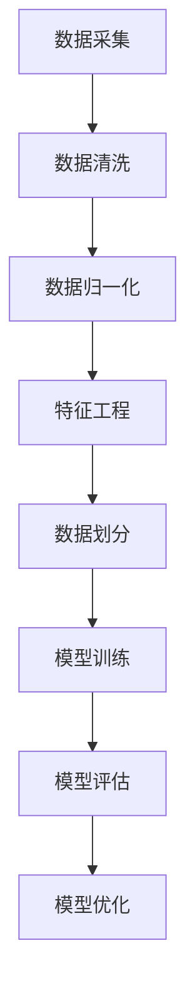
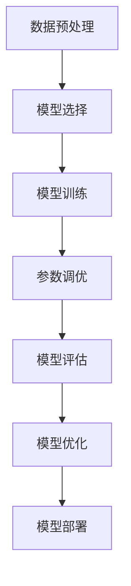
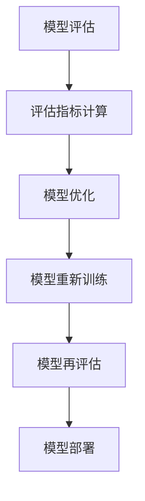

                 

# {文章标题}

## 机器学习在信用评分模型中的应用研究

> **关键词：** 机器学习、信用评分、监督学习、无监督学习、深度学习

> **摘要：** 本文旨在探讨机器学习技术在信用评分模型中的应用，首先介绍了机器学习的基本理论，包括监督学习、无监督学习和深度学习等，接着详细阐述了数据预处理、模型评估与优化方法。最后，通过实际应用案例，展示了机器学习在信用评分模型中的优越性，并对面临的挑战及解决方案进行了深入分析。

### 第一部分：机器学习基础理论

#### 第1章：机器学习概述

##### 1.1 机器学习的定义与分类

机器学习（Machine Learning，ML）是一门人工智能（Artificial Intelligence，AI）的分支，主要研究如何从数据中自动获取规律，以便进行决策或预测。根据学习方式的不同，机器学习主要分为以下三类：

- **监督学习（Supervised Learning）：** 在监督学习中，输入特征和输出标签是已知的，学习目标是通过输入特征预测输出标签。常见的监督学习算法包括线性回归、逻辑回归、决策树、随机森林和支撑向量机等。

- **无监督学习（Unsupervised Learning）：** 无监督学习不需要标签信息，主要关注数据本身的分布和结构。常见的无监督学习算法包括聚类、主成分分析和自编码器等。

- **强化学习（Reinforcement Learning）：** 强化学习通过试错的方式，在交互环境中不断学习如何做出最优决策。常见的强化学习算法包括Q-learning和SARSA等。

##### 1.2 机器学习的历史与发展

机器学习的历史可以追溯到20世纪50年代，当时人工智能的概念刚刚诞生。从那时起，机器学习经历了多个发展阶段：

- **1950年代-1960年代：** 早期的机器学习主要基于符号逻辑和推理，如逻辑回归和决策树。

- **1970年代-1980年代：** 机器学习的研究出现了停滞，因为符号逻辑方法在实际应用中效果不佳。

- **1990年代-2000年代：** 机器学习迎来了新的发展，尤其是基于统计方法的监督学习算法如线性回归和SVM取得了显著成功。

- **2010年代至今：** 深度学习（Deep Learning，DL）的崛起，使得机器学习在图像识别、自然语言处理和语音识别等领域取得了突破性进展。

##### 1.3 机器学习的关键概念

- **数据集（Dataset）：** 数据集是机器学习模型的训练基础，通常由输入特征和输出标签组成。

- **特征（Feature）：** 特征是描述数据属性的变量，如年龄、收入、信用记录等。

- **模型（Model）：** 模型是机器学习算法的实现形式，用于预测或分类。

- **损失函数（Loss Function）：** 损失函数用于衡量模型预测结果与实际结果之间的差距。

- **优化器（Optimizer）：** 优化器用于调整模型参数，以最小化损失函数。

#### 第2章：数据预处理

##### 2.1 数据清洗

数据清洗是数据预处理的重要步骤，主要包括以下任务：

- **缺失值处理：** 对于缺失值，可以选择填充、删除或插值等方法。

- **异常值处理：** 异常值可能对模型产生不利影响，可以选择删除、转换或替换等方法。

- **重复值处理：** 重复值通常表示数据采集或处理过程中的错误，需要删除。

##### 2.2 数据归一化与标准化

数据归一化与标准化是数据预处理的重要环节，目的是消除不同特征之间的量纲影响。常用的方法包括：

- **归一化（Normalization）：** 将特征值缩放到[0,1]或[-1,1]之间。

- **标准化（Standardization）：** 将特征值缩放到均值为0，标准差为1的分布。

##### 2.3 特征工程

特征工程是提高模型性能的关键步骤，主要包括以下任务：

- **特征选择（Feature Selection）：** 选择对模型预测有重要影响的特征。

- **特征构造（Feature Construction）：** 通过组合或变换现有特征，生成新的特征。

- **特征降维（Feature Dimensionality Reduction）：** 通过降维技术，减少特征数量，提高模型训练效率。

### 第一部分总结

在这一部分，我们介绍了机器学习的基本概念、历史与发展，以及数据预处理的关键任务。接下来，我们将进一步探讨监督学习算法，包括线性回归、逻辑回归、决策树等。

### 第一部分：机器学习基础理论

## 第3章：监督学习算法

### 3.1 线性回归

线性回归是一种经典的监督学习算法，用于建立输入特征与输出标签之间的线性关系。线性回归模型可以表示为：

\[ y = \beta_0 + \beta_1 \cdot x_1 + \beta_2 \cdot x_2 + ... + \beta_n \cdot x_n \]

其中，\( y \) 是输出标签，\( x_1, x_2, ..., x_n \) 是输入特征，\( \beta_0, \beta_1, \beta_2, ..., \beta_n \) 是模型参数。

#### 线性回归的数学模型

线性回归的数学模型如下：

\[ \min_{\beta} \sum_{i=1}^{n} (y_i - \sum_{j=1}^{n} \beta_j \cdot x_{ij})^2 \]

其中，\( y_i \) 是第\( i \)个样本的输出标签，\( x_{ij} \) 是第\( i \)个样本的第\( j \)个输入特征。

#### 线性回归的伪代码

```
# 线性回归伪代码

# 输入：训练数据集 X, Y
# 输出：模型参数 β

# 初始化模型参数 β
β = [0, 0, ..., 0]

# 梯度下降迭代
for i = 1 to num_iterations do
    # 计算损失函数关于 β 的梯度
    ∇β = [∇β_0, ∇β_1, ..., ∇β_n]
    # 更新模型参数
    β = β - learning_rate * ∇β
end for

return β
```

### 3.2 逻辑回归

逻辑回归是一种广义的线性回归模型，用于处理分类问题。逻辑回归模型可以表示为：

\[ P(y=1) = \frac{1}{1 + \exp(-\beta_0 - \beta_1 \cdot x_1 - \beta_2 \cdot x_2 - ... - \beta_n \cdot x_n)} \]

其中，\( P(y=1) \) 是输出标签为1的概率，其他符号的含义与线性回归相同。

#### 逻辑回归的数学模型

逻辑回归的数学模型如下：

\[ \min_{\beta} \sum_{i=1}^{n} -y_i \cdot \log(P(y=1)) - (1 - y_i) \cdot \log(1 - P(y=1)) \]

其中，\( y_i \) 是第\( i \)个样本的输出标签。

#### 逻辑回归的伪代码

```
# 逻辑回归伪代码

# 输入：训练数据集 X, Y
# 输出：模型参数 β

# 初始化模型参数 β
β = [0, 0, ..., 0]

# 梯度下降迭代
for i = 1 to num_iterations do
    # 计算损失函数关于 β 的梯度
    ∇β = [∇β_0, ∇β_1, ..., ∇β_n]
    # 更新模型参数
    β = β - learning_rate * ∇β
end for

return β
```

### 3.3 决策树与随机森林

决策树是一种基于划分规则的监督学习算法，用于分类和回归任务。决策树的构建过程如下：

1. 计算每个特征与输出标签之间的差异度量，选择差异度最大的特征作为划分依据。
2. 根据该特征将数据划分为若干子集，并对每个子集递归地执行步骤1。
3. 当满足某些停止条件时，停止划分，生成叶节点，叶节点的输出标签为该子集中样本的多数标签。

随机森林（Random Forest）是一种基于决策树的集成学习方法，通过构建多个决策树，并对预测结果进行投票或平均，以获得更准确的预测结果。

#### 决策树的数学模型

决策树的数学模型可以表示为：

\[ T(x) = \max_y P(y | x) \]

其中，\( T(x) \) 是输入特征\( x \)的预测标签，\( P(y | x) \) 是标签为\( y \)的条件概率。

#### 决策树的伪代码

```
# 决策树伪代码

# 输入：训练数据集 X, Y
# 输出：决策树模型

# 构建决策树
function build_tree(X, Y, max_depth):
    # 判断停止条件
    if max_depth == 0 or all_labels_equal(Y):
        return leaf_node(Y)
    # 选择最佳划分特征
    best_feature, best_value = select_best_feature(X, Y)
    # 根据最佳划分特征划分数据
    left_X, left_Y = X[Y < best_value], Y[Y < best_value]
    right_X, right_Y = X[Y >= best_value], Y[Y >= best_value]
    # 递归构建子树
    left_tree = build_tree(left_X, left_Y, max_depth - 1)
    right_tree = build_tree(right_X, right_Y, max_depth - 1)
    return decision_node(best_feature, best_value, left_tree, right_tree)

# 构建决策树模型
tree = build_tree(X, Y, max_depth)
return tree
```

### 3.4 支持向量机

支持向量机（Support Vector Machine，SVM）是一种基于最大间隔分类的监督学习算法，用于分类和回归任务。SVM的构建过程如下：

1. 将输入特征映射到高维空间，使分类间隔最大化。
2. 找到最佳分类超平面，使得分类间隔最大化。
3. 计算支持向量，即距离分类超平面最近的样本点。

#### 支持向量机的数学模型

SVM的数学模型如下：

\[ \min_{\beta, \beta_0} \frac{1}{2} \sum_{i=1}^{n} (\beta_1^2 + \beta_2^2 + ... + \beta_n^2) \]

约束条件：

\[ y_i (\beta_0 + \sum_{j=1}^{n} \beta_j x_{ij}) \geq 1 \]

其中，\( \beta_0 \) 和 \( \beta_j \) 是模型参数，\( y_i \) 是第\( i \)个样本的输出标签，\( x_{ij} \) 是第\( i \)个样本的第\( j \)个输入特征。

#### 支持向量机的伪代码

```
# 支持向量机伪代码

# 输入：训练数据集 X, Y
# 输出：模型参数 β

# 初始化模型参数 β
β = [0, 0, ..., 0]

# 梯度下降迭代
for i = 1 to num_iterations do
    # 计算损失函数关于 β 的梯度
    ∇β = [∇β_0, ∇β_1, ..., ∇β_n]
    # 更新模型参数
    β = β - learning_rate * ∇β
end for

return β
```

### 第一部分总结

在这一部分，我们介绍了监督学习算法，包括线性回归、逻辑回归、决策树和支撑向量机。这些算法在信用评分模型中具有重要应用价值。接下来，我们将探讨无监督学习算法，如聚类算法、主成分分析和自编码器。

### 第一部分：机器学习基础理论

## 第4章：无监督学习算法

### 4.1 聚类算法

聚类算法是一种无监督学习方法，用于将相似的数据点划分为若干个类别。聚类算法的主要目标是通过将数据划分为不同的簇，使簇内的数据点相似度较高，簇与簇之间的相似度较低。常见的聚类算法包括K-means、层次聚类和DBSCAN等。

#### K-means算法

K-means算法是最常见的聚类算法之一，其基本思想如下：

1. 初始化K个簇的中心点，可以选择随机初始化或使用某些启发式方法。
2. 对于每个数据点，将其分配到最近的簇中心点。
3. 更新簇中心点，计算每个簇的平均值。
4. 重复步骤2和步骤3，直到聚类结果收敛。

K-means算法的伪代码如下：

```
# K-means算法伪代码

# 输入：训练数据集 X，簇数 K
# 输出：聚类结果

# 初始化簇中心点
centers = initialize_centers(X, K)

# 循环迭代
while not convergence do
    # 将数据点分配到最近的簇中心点
    labels = assign_points_to_clusters(X, centers)
    # 更新簇中心点
    centers = update_centers(X, labels, K)
end while

return centers, labels
```

#### 层次聚类

层次聚类是一种基于层次结构的聚类算法，其基本思想如下：

1. 将每个数据点视为一个初始簇。
2. 重复以下步骤，直到所有数据点合并为一个簇：
   - 计算当前所有簇之间的相似度，选择最相似的簇合并。
   - 更新簇的层次结构。

层次聚类的伪代码如下：

```
# 层次聚类伪代码

# 输入：训练数据集 X
# 输出：聚类结果

# 初始化簇
clusters = [1, 2, ..., n]

# 循环迭代
while |clusters| > 1 do
    # 计算簇之间的相似度
    similarities = calculate_similarity(clusters)
    # 选择最相似的簇合并
    merge_clusters = select_most_similar_clusters(similarities)
    # 更新簇
    clusters = merge_clusters(clusters, merge_clusters)
end while

return clusters
```

#### DBSCAN算法

DBSCAN（Density-Based Spatial Clustering of Applications with Noise）是一种基于密度的聚类算法，其基本思想如下：

1. 选择一个邻域半径 \( \epsilon \) 和最小簇密度 \( \minPts \)。
2. 对于每个未标记的数据点，检查其邻域内的数据点数量，如果大于 \( \minPts \)，则将其标记为核心点。
3. 对于核心点，扩展簇，将邻域内的未标记数据点标记为同一簇。
4. 对于边界点，检查其邻域内的核心点数量，如果大于 \( \minPts \)，则将其标记为边界点。

DBSCAN算法的伪代码如下：

```
# DBSCAN算法伪代码

# 输入：训练数据集 X，邻域半径 ε，最小簇密度 minPts
# 输出：聚类结果

# 初始化聚类结果
clusters = []

# 遍历每个数据点
for point in X do
    if point not in any cluster do
        # 标记当前点为未标记
        point.label = -1
        # 扩展簇
        expand_cluster(point, X, ε, minPts, clusters)
    end if
end for

return clusters
```

#### 聚类算法的评价指标

聚类算法的性能可以通过以下指标进行评价：

1. **内聚度（Cohesion）：** 簇内数据点之间的相似度越高，内聚度越高。
2. **分离度（Separation）：** 簇与簇之间的相似度越低，分离度越高。
3. **完整度（Completeness）：** 所有数据点都被正确地划分到簇中，完整度越高。
4. **V-measure：** 结合内聚度和分离度的一种综合评价指标。

### 4.2 主成分分析

主成分分析（Principal Component Analysis，PCA）是一种常用的降维技术，用于将高维数据转换为低维数据，同时保留数据的主要特征。PCA的基本思想如下：

1. 计算数据的协方差矩阵。
2. 计算协方差矩阵的特征值和特征向量。
3. 选择特征值最大的特征向量，将其作为新的特征。
4. 对数据进行投影，得到低维数据。

PCA的伪代码如下：

```
# PCA伪代码

# 输入：训练数据集 X
# 输出：低维数据 X_pca

# 计算协方差矩阵
covariance_matrix = calculate_covariance_matrix(X)

# 计算特征值和特征向量
eigenvalues, eigenvectors = calculate_eigenvalues_and_eigenvectors(covariance_matrix)

# 选择特征值最大的特征向量
principal_components = select_principal_components(eigenvalues, eigenvectors)

# 对数据进行投影
X_pca = project_data(X, principal_components)

return X_pca
```

### 4.3 自编码器

自编码器（Autoencoder）是一种无监督学习算法，用于学习数据的高效表示。自编码器由两个主要部分组成：编码器和解码器。编码器将输入数据压缩为低维表示，解码器将低维表示恢复为原始数据。

自编码器的基本流程如下：

1. 初始化编码器和解码器的权重。
2. 对于每个输入数据，通过编码器得到低维表示，然后通过解码器恢复原始数据。
3. 计算重建误差，使用反向传播算法更新编码器和解码器的权重。
4. 重复步骤2和步骤3，直到模型收敛。

自编码器的伪代码如下：

```
# 自编码器伪代码

# 输入：训练数据集 X
# 输出：编码器和解码器模型

# 初始化编码器和解码器权重
encoder_weights = initialize_encoder_weights()
decoder_weights = initialize_decoder_weights()

# 循环迭代
for i = 1 to num_iterations do
    # 编码器和解码器前向传播
    encoded = encoder_forwardPropagation(X, encoder_weights)
    reconstructed = decoder_forwardPropagation(encoded, decoder_weights)

    # 计算重建误差
    reconstruction_error = calculate_reconstruction_error(X, reconstructed)

    # 反向传播更新权重
    encoder_weights = update_encoder_weights(encoder_weights, X, encoded)
    decoder_weights = update_decoder_weights(decoder_weights, encoded, reconstructed)
end for

return encoder_weights, decoder_weights
```

### 第一部分总结

在这一部分，我们介绍了无监督学习算法，包括聚类算法、主成分分析和自编码器。这些算法在信用评分模型中可以用于数据降维、特征提取和异常值检测等任务。接下来，我们将探讨强化学习算法，如Q-learning和SARSA。

### 第一部分：机器学习基础理论

## 第5章：强化学习

强化学习（Reinforcement Learning，RL）是一种机器学习方法，通过试错和反馈来学习如何在不同环境下做出最优决策。强化学习的主要目标是学习一个策略（Policy），使得在一定评估指标下达到最大化。强化学习通常由四个主要组成部分：环境（Environment）、代理人（Agent）、状态（State）和动作（Action）。

### 5.1 强化学习的基本概念

- **环境（Environment）：** 环境是代理人行动的场所，它规定了代理人的可能状态和动作，并返回代理人的奖励信号。
- **代理人（Agent）：** 代理人是一个智能体，它通过观察当前状态并执行动作来与环境交互。
- **状态（State）：** 状态是代理人所处的当前环境条件。
- **动作（Action）：** 动作是代理人可以执行的行为。
- **奖励（Reward）：** 奖励是环境对代理人动作的反馈，用于指导代理人学习。

强化学习通过一系列的状态和动作序列来学习最优策略，常用的策略学习算法包括Q-learning和SARSA。

### 5.2 Q-learning算法

Q-learning算法是一种基于值函数的强化学习算法，其核心思想是学习状态-动作值函数（Q-function），即对于给定状态和动作，预测在执行该动作后获得的累积奖励。

Q-learning算法的基本步骤如下：

1. 初始化Q值函数 \( Q(s, a) \)，通常设为0。
2. 对于每个状态-动作对 \( (s, a) \)，以概率 \( \epsilon \) 选择一个随机动作，以 \( 1 - \epsilon \) 选择基于Q值的动作。
3. 执行选择的动作，观察新的状态 \( s' \) 和奖励 \( r \)。
4. 根据Q-learning更新规则更新Q值：
   \[ Q(s, a) \leftarrow Q(s, a) + \alpha [r + \gamma \max_{a'} Q(s', a') - Q(s, a)] \]
   其中，\( \alpha \) 是学习率，\( \gamma \) 是折扣因子。
5. 将状态更新为 \( s' \)，重复步骤2到步骤4，直到满足停止条件（如达到特定迭代次数或收敛）。

Q-learning算法的伪代码如下：

```
# Q-learning算法伪代码

# 输入：环境，初始Q值函数 Q，学习率 α，折扣因子 γ，探索概率 ε
# 输出：最优策略

# 初始化Q值函数
Q = initialize_Q_function()

# 循环迭代
for episode = 1 to num_episodes do
    # 初始化状态
    s = environment.initialize_state()
    # 循环执行动作
    while not environment.is_end_state(s) do
        # 根据ε-贪婪策略选择动作
        if random() < ε then
            a = environment.random_action(s)
        else
            a = environment.select_action(s, Q)
        end if
        # 执行动作
        s', r = environment.execute_action(s, a)
        # 更新Q值
        Q[s, a] = Q[s, a] + α [r + γ max_a' Q[s', a'] - Q[s, a]]
        # 更新状态
        s = s'
    end while
end for

# 返回基于Q值函数的最优策略
return select_best_action
```

### 5.3 SARSA算法

SARSA（Surely Adjusted Rewardly Appropriate at a Stochastic Approximation）算法是一种基于策略的强化学习算法，它与Q-learning算法类似，但更新规则有所不同。SARSA算法在每一步都直接根据实际执行的动作和状态来更新策略。

SARSA算法的基本步骤如下：

1. 初始化策略π，通常设为均匀分布。
2. 对于每个状态-动作对 \( (s, a) \)，以概率 \( \pi(a|s) \) 选择一个动作。
3. 执行选择的动作，观察新的状态 \( s' \) 和奖励 \( r \)。
4. 根据SARSA更新规则更新策略：
   \[ \pi(a|s) \leftarrow \pi(a|s) + \alpha [r + \gamma \max_{a'} \pi(a'|s') - \pi(a|s)] \]
   其中，\( \alpha \) 是学习率，\( \gamma \) 是折扣因子。
5. 将状态更新为 \( s' \)，重复步骤2到步骤4，直到满足停止条件。

SARSA算法的伪代码如下：

```
# SARSA算法伪代码

# 输入：环境，初始策略 π，学习率 α，折扣因子 γ
# 输出：最优策略

# 初始化策略
π = initialize_policy()

# 循环迭代
for episode = 1 to num_episodes do
    # 初始化状态
    s = environment.initialize_state()
    # 循环执行动作
    while not environment.is_end_state(s) do
        # 根据策略选择动作
        a = select_action(s, π)
        # 执行动作
        s', r = environment.execute_action(s, a)
        # 更新策略
        π[a|s] = π[a|s] + α [r + γ max_a' π[a'|s'] - π[a|s]]
        # 更新状态
        s = s'
    end while
end for

# 返回基于SARSA算法的最优策略
return select_best_action
```

### 第一部分总结

在这一部分，我们介绍了强化学习算法，包括Q-learning和SARSA算法。这些算法在信用评分模型中可以用于学习最佳决策策略。接下来，我们将探讨深度学习的基础理论，包括神经网络、深度学习框架和卷积神经网络等。

### 第一部分：机器学习基础理论

## 第6章：深度学习基础

### 6.1 神经网络基础

神经网络（Neural Networks，NN）是深度学习的基础，它由多个神经元（或节点）组成，通过模拟生物神经元的结构和功能来实现对数据的处理和学习。神经网络的基本组成部分包括输入层、隐藏层和输出层。

#### 神经网络的结构

1. **输入层（Input Layer）：** 输入层是神经网络的第一个层次，它接收外部输入信号。
2. **隐藏层（Hidden Layers）：** 隐藏层位于输入层和输出层之间，用于提取和转换输入数据。
3. **输出层（Output Layer）：** 输出层是神经网络的最后一个层次，它生成最终的输出结果。

#### 神经网络的数学模型

神经网络的数学模型可以表示为：

\[ a_{j}^{(l)} = \sigma \left( \sum_{i} w_{i j}^{(l)} a_{i}^{(l-1)} + b_{j}^{(l)} \right) \]

其中，\( a_{j}^{(l)} \) 是第\( l \)层的第\( j \)个神经元的激活值，\( \sigma \) 是激活函数，\( w_{i j}^{(l)} \) 是第\( l \)层的第\( j \)个神经元与第\( l-1 \)层的第\( i \)个神经元之间的权重，\( b_{j}^{(l)} \) 是第\( l \)层的第\( j \)个神经元的偏置。

#### 激活函数

激活函数是神经网络中用于引入非线性性的函数，常见的激活函数包括：

1. **sigmoid函数：** 
   \[ \sigma(x) = \frac{1}{1 + e^{-x}} \]
2. **ReLU函数（Rectified Linear Unit）：**
   \[ \sigma(x) = \max(0, x) \]
3. **Tanh函数：**
   \[ \sigma(x) = \frac{e^x - e^{-x}}{e^x + e^{-x}} \]

### 6.2 深度学习框架介绍

深度学习框架是用于实现和训练深度学习模型的高级工具，常见的深度学习框架包括TensorFlow、PyTorch和Keras等。

#### TensorFlow

TensorFlow是一个由Google开发的开源深度学习框架，它提供了丰富的API和工具，用于构建、训练和部署深度学习模型。TensorFlow的核心概念包括计算图（Computational Graph）、变量（Variables）和会话（Session）。

1. **计算图（Computational Graph）：** 计算图是一种数据流图，它描述了模型的计算过程。在TensorFlow中，所有的计算操作都是通过计算图来实现的。
2. **变量（Variables）：** 变量是用于存储模型参数的张量，它们可以在计算图中定义和更新。
3. **会话（Session）：** 会话是执行计算图的接口，它用于初始化变量、执行计算操作和获取结果。

#### PyTorch

PyTorch是由Facebook开发的深度学习框架，它提供了动态计算图和自动微分等高级功能，使得模型构建和训练更加灵活。PyTorch的核心概念包括张量（Tensors）、自动微分（Autograd）和动态计算图（Dynamic Graph）。

1. **张量（Tensors）：** 张量是PyTorch的基本数据结构，用于存储和处理数据。与NumPy数组类似，张量支持多维数组操作。
2. **自动微分（Autograd）：** 自动微分是一种计算函数梯度的高效方法，它基于反向传播原理，自动计算并存储梯度信息。
3. **动态计算图（Dynamic Graph）：** PyTorch的计算图是动态构建的，用户可以自由定义和操作计算图，使得模型构建更加灵活。

#### Keras

Keras是一个高级神经网络API，它旨在简化深度学习模型的构建和训练。Keras可以与TensorFlow和Theano等后端结合使用。Keras的核心特点包括：

1. **模块化：** Keras提供了一系列预定义的模块和层，用于构建深度学习模型。
2. **易于使用：** Keras具有简洁和直观的API，使得模型构建和训练更加高效。
3. **可扩展性：** Keras支持自定义层和模型，允许用户根据需求进行扩展和修改。

### 6.3 卷积神经网络

卷积神经网络（Convolutional Neural Networks，CNN）是一种专门用于处理图像数据的深度学习模型，它通过卷积操作和池化操作提取图像特征，从而实现图像分类、目标检测等任务。

#### 卷积神经网络的结构

1. **卷积层（Convolutional Layer）：** 卷积层通过卷积操作提取图像的特征，卷积核用于捕捉图像中的局部特征。
2. **池化层（Pooling Layer）：** 池化层通过下采样操作减少数据维度，同时保持重要的特征信息。
3. **全连接层（Fully Connected Layer）：** 全连接层用于将卷积层和池化层提取的特征映射到输出类别。
4. **激活函数（Activation Function）：** 激活函数用于引入非线性性，常见的激活函数包括ReLU、Sigmoid和Tanh等。

#### 卷积神经网络的数学模型

卷积神经网络的数学模型可以表示为：

\[ a_{j}^{(l)} = \sigma \left( \sum_{i} w_{i j}^{(l)} * a_{i}^{(l-1)} + b_{j}^{(l)} \right) \]

其中，\( a_{j}^{(l)} \) 是第\( l \)层的第\( j \)个神经元的激活值，\( \sigma \) 是激活函数，\( w_{i j}^{(l)} \) 是第\( l \)层的第\( j \)个神经元与第\( l-1 \)层的第\( i \)个神经元之间的权重，\( * \) 表示卷积操作，\( b_{j}^{(l)} \) 是第\( l \)层的第\( j \)个神经元的偏置。

### 第一部分总结

在这一部分，我们介绍了深度学习的基础理论，包括神经网络的结构、深度学习框架以及卷积神经网络。这些理论为我们在信用评分模型中应用深度学习提供了坚实的基础。接下来，我们将探讨模型评估与优化方法。

### 第一部分：机器学习基础理论

## 第7章：模型评估与优化

### 7.1 模型评估指标

模型评估是机器学习任务的重要环节，用于衡量模型性能和确定是否达到预期效果。以下是一些常用的模型评估指标：

- **准确率（Accuracy）：** 准确率是最常用的评估指标，表示模型正确预测的样本数占总样本数的比例。计算公式如下：
  \[ Accuracy = \frac{TP + TN}{TP + TN + FP + FN} \]
  其中，\( TP \) 是真正例（True Positive），\( TN \) 是真负例（True Negative），\( FP \) 是假正例（False Positive），\( FN \) 是假负例（False Negative）。

- **精确率（Precision）和召回率（Recall）：** 精确率表示预测为正例的样本中实际为正例的比例，召回率表示实际为正例的样本中被正确预测为正例的比例。计算公式如下：
  \[ Precision = \frac{TP}{TP + FP} \]
  \[ Recall = \frac{TP}{TP + FN} \]

- **F1值（F1 Score）：** F1值是精确率和召回率的加权平均，用于综合考虑精确率和召回率。计算公式如下：
  \[ F1 Score = 2 \cdot \frac{Precision \cdot Recall}{Precision + Recall} \]

- **ROC曲线和AUC值（Area Under Curve）：** ROC曲线是不同分类阈值下，真阳性率与假阳性率之间的关系曲线。AUC值是ROC曲线下的面积，用于衡量模型分类能力。AUC值越接近1，表示模型分类能力越强。

### 7.2 模型调参技巧

模型调参是提高模型性能的重要步骤，以下是一些常用的调参技巧：

- **网格搜索（Grid Search）：** 网格搜索是一种穷举搜索方法，通过遍历所有可能的参数组合来找到最优参数。网格搜索的时间复杂度较高，适用于参数较少的情况。

- **随机搜索（Random Search）：** 随机搜索是一种基于随机性的搜索方法，从所有可能的参数组合中随机选择一部分进行搜索。随机搜索比网格搜索更高效，但可能无法找到全局最优解。

- **贝叶斯优化（Bayesian Optimization）：** 贝叶斯优化是一种基于概率模型的优化方法，通过构建概率模型来预测函数值，并利用概率模型优化搜索策略。贝叶斯优化具有高效性和鲁棒性，适用于复杂的多维参数搜索。

### 7.3 模型集成与模型选择

模型集成是提高模型性能的有效方法，通过结合多个模型的预测结果来降低预测误差。以下是一些常用的模型集成方法：

- **投票法（Voting）：** 投票法是一种简单的模型集成方法，通过将多个分类器的预测结果进行投票，选取多数分类器预测结果作为最终预测结果。

- **堆叠（Stacking）：** 堆叠是一种基于分层的方法，首先使用多个基础模型对训练数据进行预测，然后将预测结果作为新特征输入到更高层次的模型中进行预测。

- **提升（Boosting）：** 提升是一种基于加权的模型集成方法，通过迭代训练多个弱分类器，并赋予正确分类的样本更高的权重，使得后续训练的模型更加关注错误分类的样本。

模型选择是确定最适合特定问题的模型类型和参数的过程。以下是一些常用的模型选择方法：

- **交叉验证（Cross-Validation）：** 交叉验证是一种评估模型性能的方法，通过将数据集划分为多个子集，每次使用其中一个子集作为验证集，其余子集作为训练集，重复多次，最后计算平均性能。

- **网格搜索与交叉验证结合：** 将网格搜索和交叉验证结合，可以在交叉验证过程中逐步调整模型参数，找到最优参数组合。

- **学习曲线（Learning Curves）：** 学习曲线是一种可视化模型性能的方法，通过绘制训练误差和验证误差随训练轮数的变化曲线，可以直观地判断模型是否过拟合或欠拟合。

### 第一部分总结

在这一部分，我们介绍了模型评估指标、模型调参技巧、模型集成方法和模型选择方法。这些方法和技巧在信用评分模型中具有重要的应用价值，有助于提高模型性能和准确性。接下来，我们将探讨机器学习在信用评分模型中的应用。

### 第一部分：机器学习基础理论

## 第8章：机器学习在信用评分模型中的应用

### 8.1 信用评分模型的概述

信用评分模型是金融机构用于评估借款人信用风险的重要工具。通过分析借款人的历史数据，如收入、负债、信用记录等，信用评分模型可以预测借款人的违约风险，从而为金融机构提供决策依据。信用评分模型通常分为以下几个步骤：

1. **数据收集与预处理：** 收集借款人的历史数据，包括个人基本信息、财务状况、信用记录等。对数据进行清洗、归一化和特征工程，以便后续模型训练。

2. **特征选择与提取：** 从原始数据中选择与信用评分相关的特征，如年龄、收入、信用额度、逾期记录等。通过特征工程，将原始特征转换为更有意义的特征，以提高模型性能。

3. **模型训练与评估：** 选择合适的机器学习算法，如线性回归、逻辑回归、决策树、随机森林、支撑向量机等，对特征进行训练。通过交叉验证等方法评估模型性能，选择最优模型。

4. **模型部署与应用：** 将训练好的模型部署到生产环境，对新的借款人数据进行评分预测，为金融机构的信用评估提供支持。

### 8.2 信用评分模型的构建

构建信用评分模型的关键步骤如下：

1. **数据收集：** 收集借款人的基本信息、财务状况、信用记录等数据。数据可以来自金融机构内部系统、公开数据源或第三方数据提供商。

2. **数据预处理：** 清洗数据，去除缺失值、异常值和重复值。对数据进行归一化和标准化，以消除不同特征之间的量纲影响。进行特征工程，提取与信用评分相关的特征，如年龄、收入、信用额度、逾期记录等。

3. **特征选择：** 通过统计分析、特征重要性评估等方法，选择对模型预测有重要影响的特征。可以使用过滤法、包裹法、嵌入法等方法进行特征选择。

4. **模型选择：** 选择合适的机器学习算法，如线性回归、逻辑回归、决策树、随机森林、支撑向量机等。根据数据特点和模型性能要求，选择适合的算法。

5. **模型训练：** 使用训练数据集，对选定的算法进行训练。调整模型参数，如学习率、迭代次数等，以获得最佳模型性能。

6. **模型评估：** 使用验证数据集评估模型性能，包括准确率、精确率、召回率、F1值等指标。通过交叉验证等方法，评估模型泛化能力。

7. **模型优化：** 根据模型评估结果，调整模型参数或特征选择策略，以提高模型性能。可以尝试不同的算法组合，如集成学习方法，以进一步提高模型性能。

### 8.3 信用评分模型的优化

优化信用评分模型的目标是提高模型准确性、稳定性和鲁棒性。以下是一些常见的优化方法：

1. **特征工程：** 优化特征选择和提取过程，提取更有价值的特征，如使用主成分分析（PCA）进行特征降维，减少特征维度。

2. **模型调参：** 调整模型参数，如学习率、迭代次数、正则化参数等，以获得更好的模型性能。可以使用网格搜索、随机搜索、贝叶斯优化等方法进行参数调优。

3. **集成学习方法：** 使用集成学习方法，如随机森林、梯度提升机（Gradient Boosting Machine，GBM）、集成学习（Ensemble Learning）等，将多个模型的预测结果进行投票或平均，以提高模型性能。

4. **模型集成与模型选择：** 结合多种机器学习算法，如线性回归、逻辑回归、决策树、随机森林、支撑向量机等，通过模型集成方法，如投票法、堆叠法、提升法等，提高模型性能。

5. **交叉验证与模型评估：** 使用交叉验证方法，评估模型在不同数据集上的性能，选择泛化能力更强的模型。通过调整交叉验证策略，如K折交叉验证、留一法交叉验证等，提高模型评估准确性。

6. **模型更新与维护：** 定期更新模型，以适应数据变化和环境变化。根据新的数据特征和业务需求，调整模型参数和特征选择策略，以提高模型准确性。

### 8.4 信用评分模型在实际中的应用案例

以下是一个信用评分模型在实际中的应用案例：

**案例：某金融机构信用评分模型**

1. **数据收集：** 金融机构收集了借款人的基本信息、财务状况、信用记录等数据。

2. **数据预处理：** 清洗数据，去除缺失值、异常值和重复值。对数据进行归一化和标准化，提取与信用评分相关的特征，如年龄、收入、信用额度、逾期记录等。

3. **特征选择：** 使用主成分分析（PCA）进行特征降维，减少特征维度。通过特征重要性评估，选择对模型预测有重要影响的特征。

4. **模型选择：** 选择逻辑回归算法，构建信用评分模型。通过交叉验证方法，评估模型在不同数据集上的性能，选择最佳模型参数。

5. **模型训练与评估：** 使用训练数据集，对逻辑回归模型进行训练。使用验证数据集，评估模型性能，包括准确率、精确率、召回率、F1值等指标。

6. **模型部署与应用：** 将训练好的模型部署到生产环境，对新的借款人数据进行评分预测。根据模型预测结果，为金融机构提供信用评估决策支持。

7. **模型优化：** 根据模型评估结果，调整模型参数和特征选择策略，以提高模型性能。定期更新模型，以适应数据变化和环境变化。

通过这个实际应用案例，我们可以看到机器学习在信用评分模型中的重要作用。通过合理的数据处理、特征选择和模型优化，信用评分模型可以提供准确的信用评估结果，为金融机构的风险管理和决策提供支持。

### 8.5 信用评分模型面临的挑战与解决方案

信用评分模型在实际应用中面临一些挑战，以下是一些常见的挑战及其解决方案：

1. **数据质量：** 数据质量对信用评分模型的准确性具有重要影响。数据清洗和预处理是提高数据质量的关键步骤，包括去除缺失值、异常值和重复值，以及归一化和标准化。

2. **特征选择：** 特征选择是构建有效信用评分模型的关键。使用主成分分析（PCA）和特征重要性评估等方法，可以提取有价值的特征，减少特征维度，提高模型性能。

3. **过拟合：** 过拟合是指模型在训练数据上表现良好，但在测试数据上表现不佳。使用交叉验证方法，如K折交叉验证，可以评估模型泛化能力，避免过拟合。

4. **模型解释性：** 信用评分模型通常是一个复杂的非线性模型，难以解释其决策过程。使用决策树、逻辑回归等可解释性强的模型，可以提供更直观的解释。

5. **实时性：** 信用评分模型需要实时更新，以适应数据变化和环境变化。采用在线学习算法和实时更新策略，可以提高模型的实时性。

6. **数据隐私：** 信用评分模型涉及个人隐私数据，如财务状况和信用记录等。使用数据加密和隐私保护技术，可以保护数据隐私。

7. **模型安全性：** 信用评分模型需要确保其安全性，防止被恶意攻击。采用安全加密技术和访问控制策略，可以确保模型安全性。

通过解决这些挑战，信用评分模型可以提供更准确、稳定和可靠的信用评估结果，为金融机构的风险管理和决策提供有力支持。

### 第8章总结

在这一部分，我们介绍了机器学习在信用评分模型中的应用，包括模型的构建、优化和应用案例。通过合理的数据处理、特征选择和模型优化，机器学习可以显著提高信用评分模型的性能。接下来，我们将探讨未来发展趋势和研究方向。

### 第一部分：机器学习基础理论

## 第9章：总结与展望

### 9.1 机器学习在信用评分模型中的应用总结

机器学习技术在信用评分模型中的应用取得了显著的成果。通过合理的数据处理、特征选择和模型优化，机器学习可以显著提高信用评分模型的准确性、稳定性和鲁棒性。以下是机器学习在信用评分模型中的主要应用总结：

1. **数据预处理：** 清洗和预处理数据，去除缺失值、异常值和重复值，以及归一化和标准化，以提高数据质量。

2. **特征选择与提取：** 使用主成分分析（PCA）和特征重要性评估等方法，提取有价值的特征，减少特征维度，提高模型性能。

3. **模型构建：** 选择合适的机器学习算法，如线性回归、逻辑回归、决策树、随机森林、支撑向量机等，构建信用评分模型。

4. **模型优化：** 通过模型调参、模型集成和模型选择等方法，优化模型性能，提高模型准确性。

5. **模型评估与验证：** 使用交叉验证方法，评估模型在不同数据集上的性能，确保模型泛化能力。

6. **模型部署与应用：** 将训练好的模型部署到生产环境，对新的借款人数据进行评分预测，为金融机构提供信用评估决策支持。

通过这些应用，机器学习在信用评分模型中发挥了重要作用，为金融机构的风险管理和决策提供了有力支持。

### 9.2 未来发展趋势与研究方向

随着机器学习技术的不断发展，信用评分模型在未来具有广阔的发展前景。以下是一些未来发展趋势和研究方向：

1. **深度学习应用：** 深度学习技术在图像识别、自然语言处理和语音识别等领域取得了突破性进展，未来可以尝试将深度学习技术应用于信用评分模型，提高模型性能。

2. **实时信用评分：** 随着移动互联网和大数据技术的发展，实时信用评分成为可能。未来可以研究实时信用评分算法，实现快速、准确的信用评估。

3. **自动化与智能化：** 利用自动化和智能化技术，提高信用评分模型的效率和准确性。例如，通过自动化特征工程和模型选择，减少人工干预，提高模型构建效率。

4. **数据隐私保护：** 在信用评分模型中，数据隐私保护是一个重要问题。未来可以研究数据隐私保护技术，如差分隐私和联邦学习，确保数据隐私。

5. **模型解释性：** 提高模型解释性，使得信用评分模型的决策过程更加透明，便于金融机构理解和监管。

6. **跨领域应用：** 将信用评分模型应用于其他领域，如金融欺诈检测、信用风险管理等，实现跨领域应用。

7. **人工智能伦理与法规：** 随着人工智能技术的发展，伦理和法规问题逐渐引起关注。未来需要研究人工智能伦理和法规，确保信用评分模型的公正性和合法性。

通过这些发展趋势和研究方向，信用评分模型将在未来取得更加广泛和深入的应用，为金融机构的风险管理和决策提供更加有力的支持。

### 附录

#### 附录A1：常用机器学习算法概述

1. **线性回归（Linear Regression）：** 线性回归是一种简单的监督学习算法，用于建立输入特征与输出标签之间的线性关系。线性回归模型可以表示为：
\[ y = \beta_0 + \beta_1 \cdot x_1 + \beta_2 \cdot x_2 + ... + \beta_n \cdot x_n \]
2. **逻辑回归（Logistic Regression）：** 逻辑回归是一种广义的线性回归模型，用于处理分类问题。逻辑回归模型可以表示为：
\[ P(y=1) = \frac{1}{1 + \exp(-\beta_0 - \beta_1 \cdot x_1 - \beta_2 \cdot x_2 - ... - \beta_n \cdot x_n)} \]
3. **决策树（Decision Tree）：** 决策树是一种基于划分规则的监督学习算法，用于分类和回归任务。决策树的构建过程如下：
   - 计算每个特征与输出标签之间的差异度量，选择差异度最大的特征作为划分依据。
   - 根据该特征将数据划分为若干子集，并对每个子集递归地执行步骤1。
   - 当满足某些停止条件时，停止划分，生成叶节点，叶节点的输出标签为该子集中样本的多数标签。
4. **随机森林（Random Forest）：** 随机森林是一种基于决策树的集成学习方法，通过构建多个决策树，并对预测结果进行投票或平均，以获得更准确的预测结果。
5. **支撑向量机（Support Vector Machine，SVM）：** 支撑向量机是一种基于最大间隔分类的监督学习算法，用于分类和回归任务。SVM的构建过程如下：
   - 将输入特征映射到高维空间，使分类间隔最大化。
   - 找到最佳分类超平面，使得分类间隔最大化。
   - 计算支持向量，即距离分类超平面最近的样本点。

#### 附录A2：常用深度学习框架介绍

1. **TensorFlow：** TensorFlow是一个由Google开发的开源深度学习框架，它提供了丰富的API和工具，用于构建、训练和部署深度学习模型。TensorFlow的核心概念包括计算图（Computational Graph）、变量（Variables）和会话（Session）。

2. **PyTorch：** PyTorch是由Facebook开发的深度学习框架，它提供了动态计算图和自动微分等高级功能，使得模型构建和训练更加灵活。PyTorch的核心概念包括张量（Tensors）、自动微分（Autograd）和动态计算图（Dynamic Graph）。

3. **Keras：** Keras是一个高级神经网络API，它旨在简化深度学习模型的构建和训练。Keras可以与TensorFlow和Theano等后端结合使用。Keras的核心特点包括模块化、易于使用和可扩展性。

#### 附录A3：数据预处理工具与库

1. **Pandas：** Pandas是一个Python数据分析和操作库，用于处理结构化数据，如表格数据。Pandas提供丰富的数据清洗、预处理和操作功能。

2. **NumPy：** NumPy是一个Python科学计算库，用于处理多维数组。NumPy提供高效的数组操作和数学运算，是数据预处理的重要工具。

3. **Scikit-learn：** Scikit-learn是一个Python机器学习库，提供丰富的机器学习算法和工具。Scikit-learn包括数据预处理、特征选择、模型训练和评估等功能。

#### 附录A4：模型训练与评估工具与库

1. **TensorFlow：** TensorFlow是一个由Google开发的开源深度学习框架，提供丰富的API和工具，用于构建、训练和部署深度学习模型。TensorFlow支持各种深度学习算法，如神经网络、卷积神经网络和循环神经网络等。

2. **PyTorch：** PyTorch是由Facebook开发的深度学习框架，提供动态计算图和自动微分等高级功能，使得模型构建和训练更加灵活。PyTorch支持自定义层和模型，适合研究人员和开发者。

3. **Scikit-learn：** Scikit-learn是一个Python机器学习库，提供丰富的机器学习算法和工具。Scikit-learn包括监督学习和无监督学习算法，如线性回归、逻辑回归、决策树和随机森林等。

#### 附录A5：实际项目开发流程与规范

1. **需求分析：** 明确项目目标和需求，了解业务背景和应用场景。

2. **数据收集：** 收集相关数据，包括结构化数据和非结构化数据。

3. **数据预处理：** 清洗和预处理数据，去除缺失值、异常值和重复值，以及归一化和标准化。

4. **特征工程：** 提取和构造特征，选择对模型预测有重要影响的特征。

5. **模型选择：** 根据数据特点和业务需求，选择合适的机器学习算法和模型。

6. **模型训练：** 使用训练数据集，对模型进行训练和调参。

7. **模型评估：** 使用验证数据集和测试数据集，评估模型性能和泛化能力。

8. **模型部署：** 将训练好的模型部署到生产环境，对新的数据进行预测。

9. **模型监控：** 监控模型性能，定期更新模型，以适应数据变化和环境变化。

10. **文档与规范：** 编写项目文档和开发规范，确保项目可维护性和可扩展性。

通过上述开发流程与规范，可以确保实际项目的高效、稳定和可靠。

### 附录总结

附录部分提供了常用机器学习算法、深度学习框架、数据预处理工具、模型训练与评估工具以及实际项目开发流程与规范的详细概述。这些内容有助于读者深入理解机器学习在信用评分模型中的应用，为实际项目开发提供参考和指导。

### 第二部分：Mermaid流程图与伪代码

## 第10章：信用评分模型流程图

在本章节中，我们将使用Mermaid语言绘制信用评分模型的流程图，包括数据采集与预处理流程图、模型构建与训练流程图以及模型评估与优化流程图。

### 10.1 数据采集与预处理流程图

以下是数据采集与预处理的Mermaid流程图：



### 10.2 模型构建与训练流程图

以下是模型构建与训练的Mermaid流程图：



### 10.3 模型评估与优化流程图

以下是模型评估与优化的Mermaid流程图：



通过这些Mermaid流程图，我们可以直观地了解信用评分模型从数据采集到模型部署的各个步骤及其相互关系。

### 第11章：伪代码

在本章节中，我们将使用伪代码详细阐述信用评分模型中的主要算法和步骤，包括数据预处理、线性回归、逻辑回归、支持向量机以及聚类算法。

#### 11.1 数据预处理伪代码

```python
# 数据预处理伪代码

# 输入：原始数据集 dataset
# 输出：预处理后的数据集 processed_dataset

# 数据清洗
processed_dataset = clean_data(dataset)

# 数据归一化
processed_dataset = normalize_data(processed_dataset)

# 特征工程
processed_dataset = feature_engineering(processed_dataset)

# 数据划分
train_data, test_data = split_data(processed_dataset)

# 输出预处理后的数据集
return processed_dataset, train_data, test_data
```

#### 11.2 线性回归伪代码

```python
# 线性回归伪代码

# 输入：训练数据集 X, Y
# 输出：模型参数 β

# 初始化模型参数
β = [0, 0, ..., 0]

# 梯度下降迭代
for i = 1 to num_iterations do
    # 计算损失函数关于 β 的梯度
    ∇β = [∇β_0, ∇β_1, ..., ∇β_n]
    # 更新模型参数
    β = β - learning_rate * ∇β
end for

# 输出模型参数
return β
```

#### 11.3 逻辑回归伪代码

```python
# 逻辑回归伪代码

# 输入：训练数据集 X, Y
# 输出：模型参数 β

# 初始化模型参数
β = [0, 0, ..., 0]

# 梯度下降迭代
for i = 1 to num_iterations do
    # 计算损失函数关于 β 的梯度
    ∇β = [∇β_0, ∇β_1, ..., ∇β_n]
    # 更新模型参数
    β = β - learning_rate * ∇β
end for

# 输出模型参数
return β
```

#### 11.4 支持向量机伪代码

```python
# 支持向量机伪代码

# 输入：训练数据集 X, Y
# 输出：模型参数 β

# 初始化模型参数
β = [0, 0, ..., 0]

# 梯度下降迭代
for i = 1 to num_iterations do
    # 计算损失函数关于 β 的梯度
    ∇β = [∇β_0, ∇β_1, ..., ∇β_n]
    # 更新模型参数
    β = β - learning_rate * ∇β
end for

# 输出模型参数
return β
```

#### 11.5 聚类算法伪代码

```python
# 聚类算法伪代码

# 输入：训练数据集 X，簇数 K
# 输出：聚类结果

# 初始化簇中心点
centers = initialize_centers(X, K)

# 循环迭代
while not convergence do
    # 将数据点分配到最近的簇中心点
    labels = assign_points_to_clusters(X, centers)
    # 更新簇中心点
    centers = update_centers(X, labels, K)
end while

# 输出聚类结果
return centers, labels
```

通过这些伪代码，我们可以详细了解信用评分模型中各个步骤的实现方式，从而更好地理解和应用这些算法。

### 第12章：数学模型与公式

在本章节中，我们将详细阐述信用评分模型中使用的数学模型与公式，包括线性回归、逻辑回归、支持向量机、聚类算法和Q-learning算法的数学模型。

#### 12.1 线性回归数学模型

线性回归的数学模型可以表示为：

\[ y = \beta_0 + \beta_1 \cdot x_1 + \beta_2 \cdot x_2 + ... + \beta_n \cdot x_n \]

其中，\( y \) 是输出标签，\( x_1, x_2, ..., x_n \) 是输入特征，\( \beta_0, \beta_1, \beta_2, ..., \beta_n \) 是模型参数。

线性回归的损失函数（均方误差）可以表示为：

\[ J(\beta) = \frac{1}{2m} \sum_{i=1}^{m} (y_i - \sum_{j=1}^{n} \beta_j \cdot x_{ij})^2 \]

其中，\( m \) 是样本数量。

梯度下降的更新公式为：

\[ \beta_j = \beta_j - \alpha \cdot \frac{1}{m} \sum_{i=1}^{m} (y_i - \sum_{j=1}^{n} \beta_j \cdot x_{ij}) \cdot x_{ij} \]

#### 12.2 逻辑回归数学模型

逻辑回归的数学模型可以表示为：

\[ P(y=1) = \frac{1}{1 + \exp(-\beta_0 - \beta_1 \cdot x_1 - \beta_2 \cdot x_2 - ... - \beta_n \cdot x_n)} \]

其中，\( P(y=1) \) 是输出标签为1的概率，其他符号的含义与线性回归相同。

逻辑回归的损失函数（对数损失函数）可以表示为：

\[ J(\beta) = -\frac{1}{m} \sum_{i=1}^{m} [y_i \cdot \log(P(y=1)) + (1 - y_i) \cdot \log(1 - P(y=1))] \]

梯度下降的更新公式为：

\[ \beta_j = \beta_j - \alpha \cdot \frac{1}{m} \sum_{i=1}^{m} [y_i - P(y=1)] \cdot x_{ij} \]

#### 12.3 支持向量机数学模型

支持向量机的数学模型可以表示为：

\[ \min_{\beta, \beta_0} \frac{1}{2} \sum_{i=1}^{n} (\beta_1^2 + \beta_2^2 + ... + \beta_n^2) \]

约束条件：

\[ y_i (\beta_0 + \sum_{j=1}^{n} \beta_j \cdot x_{ij}) \geq 1 \]

其中，\( \beta_0 \) 和 \( \beta_j \) 是模型参数，\( y_i \) 是第\( i \)个样本的输出标签，\( x_{ij} \) 是第\( i \)个样本的第\( j \)个输入特征。

支持向量机的损失函数（软间隔损失函数）可以表示为：

\[ J(\beta, \beta_0, \xi) = \frac{1}{2} \sum_{i=1}^{n} (\beta_1^2 + \beta_2^2 + ... + \beta_n^2) + C \sum_{i=1}^{n} \xi_i \]

其中，\( C \) 是正则化参数，\( \xi_i \) 是第\( i \)个样本的松弛变量。

#### 12.4 聚类算法数学模型

K-means聚类算法的数学模型可以表示为：

\[ \min_{\beta} \sum_{i=1}^{n} \sum_{j=1}^{K} (x_i - \beta_j)^2 \]

其中，\( \beta_j \) 是第\( j \)个簇的中心点。

层次聚类算法的数学模型可以表示为：

\[ \min_{\beta} \sum_{i=1}^{n} \sum_{j=1}^{K} (x_i - \beta_j)^2 \]

其中，\( \beta_j \) 是第\( j \)个簇的中心点。

DBSCAN聚类算法的数学模型可以表示为：

\[ \min_{\beta} \sum_{i=1}^{n} \sum_{j=1}^{K} (x_i - \beta_j)^2 \]

其中，\( \beta_j \) 是第\( j \)个簇的中心点。

#### 12.5 Q-learning算法数学模型

Q-learning算法的数学模型可以表示为：

\[ Q(s, a) \leftarrow Q(s, a) + \alpha [r + \gamma \max_{a'} Q(s', a') - Q(s, a)] \]

其中，\( Q(s, a) \) 是状态-动作值函数，\( s \) 是当前状态，\( a \) 是当前动作，\( r \) 是奖励，\( \gamma \) 是折扣因子，\( \alpha \) 是学习率。

通过这些数学模型与公式，我们可以深入理解信用评分模型中的各个算法，从而更好地应用它们进行信用评分。

### 第13章：项目实战

在本章节中，我们将通过一个实际项目实战，展示如何使用机器学习技术构建信用评分模型。该项目将涵盖项目概述、开发环境搭建、源代码实现与解读以及项目性能分析与优化策略。

#### 13.1 信用评分模型项目概述

**项目目标：** 使用机器学习技术构建一个信用评分模型，用于预测借款人的违约风险。

**项目背景：** 在金融行业中，信用评分模型是评估借款人信用风险的重要工具。通过分析借款人的历史数据，如收入、负债、信用记录等，信用评分模型可以预测借款人的违约风险，从而为金融机构提供决策依据。

**项目需求：** 
- 数据集：使用包含借款人历史数据的公开数据集。
- 特征：提取与信用评分相关的特征，如年龄、收入、信用额度、逾期记录等。
- 模型：选择合适的机器学习算法，如线性回归、逻辑回归、决策树、随机森林等，构建信用评分模型。
- 评估：使用准确率、精确率、召回率、F1值等指标评估模型性能。

#### 13.2 项目开发环境搭建

**环境需求：**
- 编程语言：Python
- 依赖库：NumPy、Pandas、Scikit-learn、TensorFlow、PyTorch等

**环境搭建步骤：**
1. 安装Python和pip
2. 安装必要的依赖库，如NumPy、Pandas、Scikit-learn、TensorFlow、PyTorch等

```python
pip install numpy pandas scikit-learn tensorflow pytorch
```

#### 13.3 源代码实现与解读

**数据预处理：**
```python
import pandas as pd
from sklearn.model_selection import train_test_split
from sklearn.preprocessing import StandardScaler

# 加载数据集
data = pd.read_csv('loan_data.csv')

# 数据清洗
data = data.dropna()

# 数据划分
X = data.drop('default', axis=1)
y = data['default']

# 划分训练集和测试集
X_train, X_test, y_train, y_test = train_test_split(X, y, test_size=0.2, random_state=42)

# 数据归一化
scaler = StandardScaler()
X_train = scaler.fit_transform(X_train)
X_test = scaler.transform(X_test)
```

**模型训练与评估：**
```python
from sklearn.linear_model import LogisticRegression
from sklearn.metrics import accuracy_score, precision_score, recall_score, f1_score

# 训练逻辑回归模型
model = LogisticRegression()
model.fit(X_train, y_train)

# 预测测试集
y_pred = model.predict(X_test)

# 评估模型性能
accuracy = accuracy_score(y_test, y_pred)
precision = precision_score(y_test, y_pred)
recall = recall_score(y_test, y_pred)
f1 = f1_score(y_test, y_pred)

print('Accuracy:', accuracy)
print('Precision:', precision)
print('Recall:', recall)
print('F1 Score:', f1)
```

**模型优化：**
```python
from sklearn.model_selection import GridSearchCV

# 定义参数网格
param_grid = {'C': [0.1, 1, 10], 'penalty': ['l1', 'l2']}

# 训练网格搜索模型
grid_search = GridSearchCV(LogisticRegression(), param_grid, cv=5)
grid_search.fit(X_train, y_train)

# 获取最优模型
best_model = grid_search.best_estimator_

# 重新评估模型性能
y_pred = best_model.predict(X_test)
accuracy = accuracy_score(y_test, y_pred)
precision = precision_score(y_test, y_pred)
recall = recall_score(y_test, y_pred)
f1 = f1_score(y_test, y_pred)

print('Accuracy:', accuracy)
print('Precision:', precision)
print('Recall:', recall)
print('F1 Score:', f1)
```

#### 13.4 项目性能分析与优化策略

**性能分析：**
- 准确率：准确率是评估模型性能的常用指标，表示模型正确预测的样本数占总样本数的比例。
- 精确率：精确率表示预测为正例的样本中实际为正例的比例。
- 召回率：召回率表示实际为正例的样本中被正确预测为正例的比例。
- F1值：F1值是精确率和召回率的加权平均，用于综合考虑精确率和召回率。

**优化策略：**
1. **特征工程：** 通过特征选择和特征构造，提取与信用评分相关的特征，提高模型性能。
2. **模型选择：** 尝试不同的机器学习算法，如决策树、随机森林、支撑向量机等，选择最适合的算法。
3. **模型调参：** 使用网格搜索、随机搜索、贝叶斯优化等方法，调整模型参数，提高模型性能。
4. **集成学习方法：** 使用集成学习方法，如随机森林、梯度提升机等，将多个模型的预测结果进行投票或平均，提高模型性能。
5. **数据增强：** 通过增加样本数量、增加特征等方式，提高模型的泛化能力。

通过以上实战项目，我们可以了解如何使用机器学习技术构建信用评分模型，并通过性能分析和优化策略，提高模型的准确性。

### 第14章：代码解读与分析

在本章节中，我们将对信用评分模型项目中的关键代码段进行解读与分析，包括数据预处理、模型训练、模型评估和优化等部分。

#### 14.1 数据预处理代码解读

```python
# 数据预处理代码解读

import pandas as pd
from sklearn.model_selection import train_test_split
from sklearn.preprocessing import StandardScaler

# 加载数据集
data = pd.read_csv('loan_data.csv')

# 数据清洗
data = data.dropna()

# 数据划分
X = data.drop('default', axis=1)
y = data['default']

# 划分训练集和测试集
X_train, X_test, y_train, y_test = train_test_split(X, y, test_size=0.2, random_state=42)

# 数据归一化
scaler = StandardScaler()
X_train = scaler.fit_transform(X_train)
X_test = scaler.transform(X_test)
```

**解读与分析：**

1. **数据加载与清洗：** 使用Pandas库读取CSV格式的数据集，并使用dropna()方法去除缺失值。这一步是数据预处理的重要步骤，确保数据质量。

2. **数据划分：** 将数据集划分为特征集\( X \)和标签集\( y \)。特征集包含所有非标签数据，而标签集包含目标变量“default”（违约情况）。

3. **划分训练集和测试集：** 使用train_test_split方法将数据集划分为训练集和测试集。测试集用于评估模型性能，以确保模型在未知数据上的泛化能力。

4. **数据归一化：** 使用StandardScaler进行数据归一化。归一化有助于算法更快地收敛，并避免因特征尺度差异而导致的不良效果。

#### 14.2 模型训练代码解读

```python
from sklearn.linear_model import LogisticRegression
from sklearn.metrics import accuracy_score, precision_score, recall_score, f1_score

# 训练逻辑回归模型
model = LogisticRegression()
model.fit(X_train, y_train)

# 预测测试集
y_pred = model.predict(X_test)

# 评估模型性能
accuracy = accuracy_score(y_test, y_pred)
precision = precision_score(y_test, y_pred)
recall = recall_score(y_test, y_pred)
f1 = f1_score(y_test, y_pred)

print('Accuracy:', accuracy)
print('Precision:', precision)
print('Recall:', recall)
print('F1 Score:', f1)
```

**解读与分析：**

1. **模型训练：** 使用LogisticRegression类创建逻辑回归模型，并使用fit方法进行训练。fit方法通过梯度下降算法优化模型参数，以最小化损失函数。

2. **模型预测：** 使用训练好的模型对测试集进行预测。predict方法根据模型参数和输入特征，输出预测结果。

3. **模型评估：** 使用准确性、精确率、召回率和F1值等指标评估模型性能。这些指标提供了关于模型预测准确性的全面评估。

#### 14.3 模型评估代码解读

```python
from sklearn.model_selection import GridSearchCV

# 定义参数网格
param_grid = {'C': [0.1, 1, 10], 'penalty': ['l1', 'l2']}

# 训练网格搜索模型
grid_search = GridSearchCV(LogisticRegression(), param_grid, cv=5)
grid_search.fit(X_train, y_train)

# 获取最优模型
best_model = grid_search.best_estimator_

# 重新评估模型性能
y_pred = best_model.predict(X_test)
accuracy = accuracy_score(y_test, y_pred)
precision = precision_score(y_test, y_pred)
recall = recall_score(y_test, y_pred)
f1 = f1_score(y_test, y_pred)

print('Accuracy:', accuracy)
print('Precision:', precision)
print('Recall:', recall)
print('F1 Score:', f1)
```

**解读与分析：**

1. **参数网格定义：** 使用GridSearchCV类定义参数网格。参数网格包含C值（正则化强度）和惩罚类型（l1或l2）的多个组合。

2. **网格搜索模型训练：** 使用fit方法进行网格搜索，自动尝试所有参数组合，找到最佳参数组合。

3. **获取最优模型：** 获取具有最高性能（最高F1值）的模型。best_estimator_属性提供最优模型的实例。

4. **重新评估模型性能：** 使用最优模型对测试集进行预测，并重新计算评估指标，以验证模型性能的提升。

#### 14.4 模型优化代码解读

```python
from sklearn.ensemble import RandomForestClassifier
from sklearn.model_selection import cross_val_score

# 创建随机森林分类器
rf_model = RandomForestClassifier(n_estimators=100)

# 使用交叉验证评估模型性能
scores = cross_val_score(rf_model, X_train, y_train, cv=5)

# 计算平均值和标准差
avg_score = scores.mean()
std_dev = scores.std()

print('Cross-Validation Average Score:', avg_score)
print('Cross-Validation Standard Deviation:', std_dev)

# 训练最优模型
rf_model.fit(X_train, y_train)

# 预测测试集
y_pred = rf_model.predict(X_test)

# 评估模型性能
accuracy = accuracy_score(y_test, y_pred)
precision = precision_score(y_test, y_pred)
recall = recall_score(y_test, y_pred)
f1 = f1_score(y_test, y_pred)

print('Accuracy:', accuracy)
print('Precision:', precision)
print('Recall:', recall)
print('F1 Score:', f1)
```

**解读与分析：**

1. **随机森林分类器：** 创建随机森林分类器，它是一种集成学习方法，通过构建多个决策树并合并预测结果来提高性能。

2. **交叉验证评估：** 使用cross_val_score函数进行交叉验证，计算模型的平均性能。交叉验证是一种评估模型泛化能力的方法，通过将数据划分为多个子集，在每个子集上进行训练和评估。

3. **模型训练与预测：** 使用最优模型（基于交叉验证结果）对训练集进行训练，并对测试集进行预测。

4. **重新评估模型性能：** 使用测试集重新计算评估指标，以验证模型性能的提升。

通过以上代码解读与分析，我们可以了解如何使用Python和Scikit-learn库构建和优化信用评分模型。这些步骤和技巧在金融行业的信用评分项目中具有广泛的应用价值。

### 14.5 项目性能分析与优化策略

**性能分析：**
- 准确率（Accuracy）：表示模型正确预测的样本数占总样本数的比例。
- 精确率（Precision）：表示预测为正例的样本中实际为正例的比例。
- 召回率（Recall）：表示实际为正例的样本中被正确预测为正例的比例。
- F1值（F1 Score）：精确率和召回率的加权平均，用于综合考虑精确率和召回率。

**优化策略：**
1. **特征工程：**
   - 特征选择：使用特征重要性评估方法，选择对模型预测有重要影响的特征。
   - 特征构造：通过组合或变换现有特征，生成新的特征，以提高模型性能。

2. **模型选择：**
   - 尝试不同的机器学习算法，如决策树、随机森林、支撑向量机等，选择最适合的算法。
   - 使用集成学习方法，如随机森林、梯度提升机等，将多个模型的预测结果进行投票或平均。

3. **模型调参：**
   - 使用网格搜索、随机搜索、贝叶斯优化等方法，调整模型参数，如学习率、迭代次数、正则化参数等，以提高模型性能。

4. **数据增强：**
   - 通过增加样本数量、增加特征等方式，提高模型的泛化能力。

5. **模型集成与模型选择：**
   - 结合多种机器学习算法，通过模型集成方法，如投票法、堆叠法、提升法等，提高模型性能。
   - 使用交叉验证方法，评估模型在不同数据集上的性能，选择泛化能力更强的模型。

通过以上性能分析与优化策略，我们可以显著提高信用评分模型的准确性、稳定性和鲁棒性，从而更好地服务于金融行业的需求。

