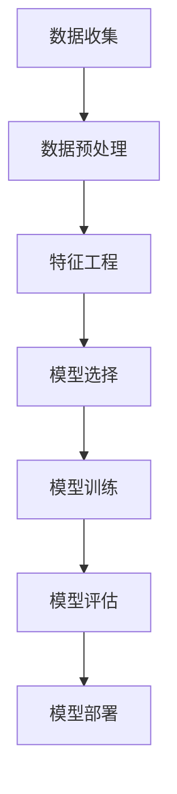
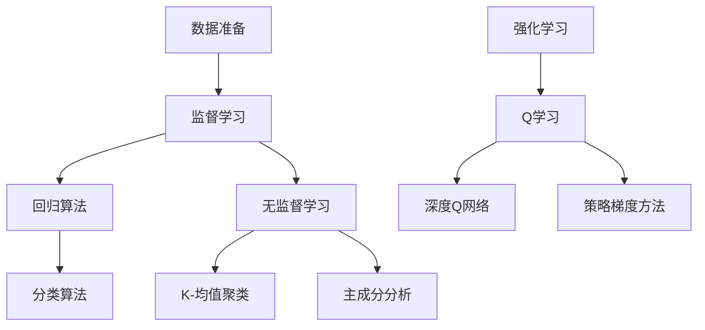
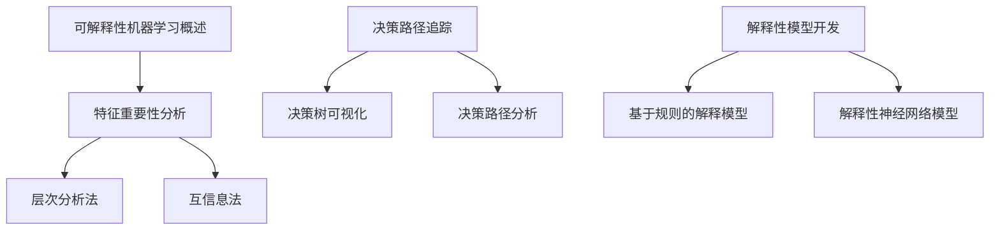
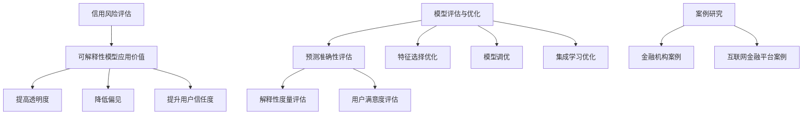
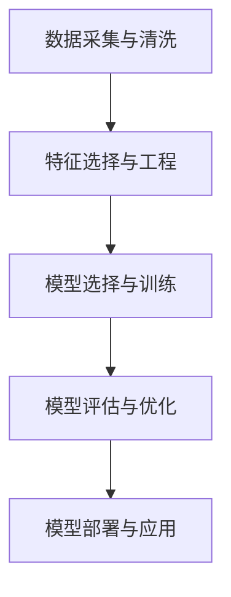

                 

# 《机器学习在信用风险评估中的可解释性研究》

> **关键词**：机器学习、信用风险评估、可解释性、数据隐私、透明度

> **摘要**：本文探讨了机器学习在信用风险评估中的应用及其可解释性问题。首先介绍了机器学习的基本概念和分类，随后详细阐述了信用风险评估的定义、现状与挑战。接着，本文重点探讨了可解释性在信用风险评估中的重要性，分析了机器学习模型的可解释性技术，并探讨了如何将这些技术应用于信用风险评估中。最后，本文通过实际案例展示了可解释性在信用风险评估中的应用效果，并提出了未来研究方向。

## 《机器学习在信用风险评估中的可解释性研究》目录大纲

### 第一部分：引言

#### 第1章：机器学习与信用风险评估
- 1.1 机器学习概述
  - 机器学习的基本概念
  - 机器学习的分类
- 1.2 信用风险评估的重要性
  - 信用风险评估的定义
  - 信用风险评估的现状与挑战
- 1.3 可解释性在信用风险评估中的应用
  - 可解释性的定义与重要性
  - 可解释性与隐私保护的关系

#### 第2章：机器学习基础理论
- 2.1 数据准备
  - 数据清洗
  - 特征工程
- 2.2 监督学习算法
  - 线性回归
  - 决策树
  - 随机森林
- 2.3 无监督学习算法
  - K-均值聚类
  - 主成分分析
- 2.4 强化学习
  - 强化学习基本概念
  - 应用场景

#### 第3章：信用评分模型构建
- 3.1 数据采集与预处理
  - 数据来源
  - 数据质量评估
- 3.2 特征选择
  - 特征重要性评估
  - 特征选择方法
- 3.3 信用评分模型构建
  - 模型选择与训练
  - 模型评估与优化
- 3.4 模型应用案例分析
  - 案例一：商业银行信用评分模型
  - 案例二：信用评分模型在消费金融中的应用

#### 第4章：可解释性机器学习技术
- 4.1 可解释性机器学习概述
  - 可解释性的定义与意义
  - 可解释性的挑战
- 4.2 特征重要性分析
  - 层次分析法
  - 互信息法
- 4.3 决策路径追踪
  - 决策树的可视化
  - 决策路径分析
- 4.4 解释性模型开发
  - 基于规则的解释模型
  - 解释性神经网络模型

#### 第5章：可解释性在信用风险评估中的应用
- 5.1 可解释性模型在信用风险评估中的价值
  - 提高信用评估的透明度
  - 降低信用风险决策的偏见
- 5.2 可解释性模型评估与优化
  - 评估指标与方法
  - 模型优化策略
- 5.3 案例研究：基于可解释性的信用评分模型
  - 案例一：金融机构信用风险评估
  - 案例二：互联网金融平台信用评估

#### 第6章：机器学习在信用风险评估中的实践
- 6.1 实践步骤
  - 数据采集与清洗
  - 模型选择与训练
  - 可解释性分析
- 6.2 技术选型与工具
  - 机器学习框架
  - 可解释性工具
- 6.3 挑战与未来方向
  - 数据隐私与安全
  - 模型可解释性提升

#### 第7章：研究总结与展望
- 7.1 研究成果总结
  - 机器学习在信用风险评估中的应用
  - 可解释性在信用风险评估中的重要性
- 7.2 未来研究方向
  - 深入挖掘数据价值
  - 提高模型可解释性
  - 强化数据隐私保护

#### 附录A：数学公式与算法伪代码
- 7.1 线性回归
  - 数学公式与伪代码
- 7.2 决策树
  - 数学公式与伪代码
- 7.3 主成分分析
  - 数学公式与伪代码
- 7.4 解释性神经网络模型
  - 数学公式与伪代码

#### 附录B：信用风险评估案例数据集
- 7.1 数据集来源
- 7.2 数据集结构
- 7.3 数据预处理步骤

#### 附录C：可解释性工具使用指南
- 7.1 LIME工具使用
- 7.2 SHAP工具使用
- 7.3 Partial Dependence Plot（PDP）绘制方法

---

现在，让我们深入探讨《机器学习在信用风险评估中的可解释性研究》的每个章节。我们将通过一步一步的分析推理，深入理解这个领域的核心概念、技术原理和应用实践。在接下来的章节中，您将了解到：

- 第1章将介绍机器学习的基础知识，包括基本概念和分类，以及机器学习在信用风险评估中的重要性。
- 第2章将深入探讨机器学习的基础理论，包括数据准备、监督学习和无监督学习算法，以及强化学习的基本概念。
- 第3章将详细讨论信用评分模型的构建过程，包括数据采集与预处理、特征选择和模型构建。
- 第4章将重点分析可解释性机器学习技术，包括特征重要性分析、决策路径追踪和解释性模型开发。
- 第5章将探讨可解释性在信用风险评估中的应用，包括其价值、评估与优化策略，以及实际案例研究。
- 第6章将介绍机器学习在信用风险评估中的实践步骤、技术选型和工具使用，以及面临的挑战和未来方向。
- 第7章将总结研究成果，并提出未来研究方向。

在每一章中，我们将使用Mermaid流程图、伪代码、数学模型和公式，以及实际的代码案例来详细阐述每个概念和技术原理。通过这种结构化和逻辑清晰的方式，您将能够更好地理解机器学习在信用风险评估中的可解释性研究。

让我们开始这段深度学习和探索之旅吧！在接下来的章节中，您将逐步掌握这个领域的核心知识和技能。准备就绪，让我们一起思考、学习和成长！<|assistant|>## 第1章：机器学习与信用风险评估

### 1.1 机器学习概述

机器学习（Machine Learning，ML）是人工智能（Artificial Intelligence，AI）的一个重要分支，它使计算机系统能够通过数据和经验自动改进其性能，而无需显式编程。机器学习的基本概念包括：

- **模型**：一个机器学习模型是一个数学函数或决策规则，它接受输入数据并产生输出预测。
- **数据**：机器学习模型的性能依赖于训练数据的质量和数量。这些数据可以是结构化的表格数据，也可以是非结构化的图像、文本或音频。
- **算法**：机器学习算法是实现模型训练和预测的核心工具。常见的算法包括线性回归、决策树、支持向量机（SVM）、神经网络等。

机器学习可以分为以下几类：

1. **监督学习**（Supervised Learning）：在有标签的数据集上训练模型，然后使用模型对新的、未标记的数据进行预测。
2. **无监督学习**（Unsupervised Learning）：在没有标签的数据集上训练模型，目的是发现数据中的隐藏结构或模式，如聚类、降维等。
3. **半监督学习**（Semi-Supervised Learning）：结合有标签和无标签数据进行训练，利用无标签数据的先验知识提高模型性能。
4. **强化学习**（Reinforcement Learning）：通过与环境交互来学习最优策略，通常用于序列决策问题。

机器学习的基本流程包括以下步骤：

1. **数据收集**：收集相关数据，数据可以是公开的数据集，也可以是自行收集的。
2. **数据预处理**：清洗数据，处理缺失值和异常值，以及标准化或归一化数据。
3. **特征工程**：选择和创建有助于模型预测的特征，特征工程对于提高模型性能至关重要。
4. **模型选择**：选择合适的机器学习算法和模型架构，不同的模型适用于不同类型的数据和任务。
5. **模型训练**：使用训练数据对模型进行训练，调整模型的参数以最小化预测误差。
6. **模型评估**：使用验证集或测试集评估模型的性能，常用的评估指标包括准确率、召回率、F1值等。
7. **模型部署**：将训练好的模型部署到实际应用场景中，进行预测和决策。

### 1.2 信用风险评估的重要性

信用风险评估是金融机构和信贷机构的核心业务之一，其重要性体现在以下几个方面：

1. **风险管理**：信用风险评估有助于金融机构识别和管理信贷风险，降低潜在损失。
2. **决策支持**：通过信用评分模型，金融机构可以更准确地评估借款人的信用状况，从而做出更明智的信贷决策。
3. **提高透明度**：机器学习算法的应用使得信用评估过程更加透明，有助于减少主观偏见，提高决策的公正性。
4. **优化资源配置**：准确的信用评估有助于金融机构更好地配置资源，提高业务效率和盈利能力。

### 1.3 信用风险评估的现状与挑战

随着大数据和人工智能技术的快速发展，信用风险评估正面临着前所未有的变革：

1. **数据来源多样化**：传统信用评分依赖于有限的信用数据，而现代信用风险评估更多地依赖于大数据，包括社交网络、消费行为、地理位置等。
2. **模型复杂度增加**：机器学习算法，尤其是深度学习，使得信用评分模型更加复杂，提高了预测准确性。
3. **数据隐私与安全**：信用风险评估涉及到大量的个人敏感信息，保护数据隐私和安全成为一个重大挑战。
4. **可解释性需求**：金融机构和借款人都希望了解信用评分的决策过程，要求模型具有可解释性，以减少决策偏见和提高透明度。

### 1.4 可解释性在信用风险评估中的应用

可解释性（Interpretability）是机器学习模型的一个重要特性，它指的是能够理解和解释模型决策过程的能力。在信用风险评估中，可解释性具有重要意义：

1. **减少决策偏见**：通过解释模型决策过程，可以识别和消除潜在的偏见，提高决策的公正性和透明度。
2. **提高模型信任度**：借款人和金融机构更愿意接受一个可解释的模型，因为它能够提供决策依据，减少不确定性。
3. **法规遵守**：许多国家和地区对金融模型的透明度有明确要求，可解释性有助于满足这些法规要求。

可解释性在信用风险评估中的应用主要包括：

1. **特征重要性分析**：识别和评估模型中各个特征的影响，帮助理解哪些因素对信用评分有重要作用。
2. **决策路径追踪**：可视化模型的决策路径，展示每个决策节点的特征权重和决策逻辑。
3. **解释性模型开发**：使用易于理解和解释的模型，如决策树、基于规则的模型，提高模型的透明性。

### 1.5 可解释性与隐私保护的关系

在信用风险评估中，可解释性与隐私保护之间存在一定的权衡。一方面，为了提高模型的可解释性，需要展示模型内部的决策过程和特征权重；另一方面，这些信息可能会泄露个人敏感数据，违反隐私保护法规。

为了在可解释性和隐私保护之间取得平衡，可以采用以下策略：

1. **数据脱敏**：在训练模型之前，对个人数据进行脱敏处理，以保护隐私。
2. **差异隐私**：使用差异隐私技术，限制模型可揭示的信息量，确保数据隐私。
3. **模型分解**：将复杂模型分解为多个简单组件，每个组件具有较低的隐私泄露风险。
4. **透明度控制**：提供用户隐私保护选项，允许用户选择是否接受可解释性降低以换取隐私保护。

通过以上策略，可以在保证模型可解释性的同时，最大限度地保护个人数据隐私。

### 总结

本章介绍了机器学习的基本概念、分类和流程，以及机器学习在信用风险评估中的重要性。同时，本章还探讨了信用风险评估的现状与挑战，以及可解释性在信用风险评估中的应用和隐私保护的关系。在接下来的章节中，我们将进一步探讨机器学习的基础理论、信用评分模型的构建过程，以及可解释性机器学习技术。

### Mermaid 流程图



### 数学公式与伪代码

#### 线性回归数学公式

$$ y = \beta_0 + \beta_1 \cdot x + \epsilon $$

#### 线性回归伪代码

```
// 输入：训练数据集X，训练标签集Y
// 输出：模型参数β0和β1

// 初始化β0和β1
β0 = 0
β1 = 0

// 计算梯度
∇β0 = -2/n * Σ(y_i - (β0 + β1 \* x_i))
∇β1 = -2/n * Σ((y_i - (β0 + β1 \* x_i)) \* x_i)

// 更新参数
β0 = β0 - α \* ∇β0
β1 = β1 - α \* ∇β1

// 迭代直到收敛
```

通过本章的学习，读者应能理解机器学习的基本概念、分类和应用，以及信用风险评估的重要性。在下一章中，我们将深入探讨机器学习的基础理论，包括数据准备、监督学习和无监督学习算法，以及强化学习的基本概念。这将为我们后续讨论信用评分模型的构建过程和可解释性技术奠定坚实的基础。<|assistant|>## 第2章：机器学习基础理论

在了解了机器学习的基本概念和应用后，本章将深入探讨机器学习的基础理论。我们将首先介绍数据准备，然后详细讲解监督学习算法和无监督学习算法，最后讨论强化学习。

### 2.1 数据准备

数据准备是机器学习流程中的关键步骤，其质量直接影响模型的性能。数据准备主要包括以下两个过程：

#### 数据清洗

数据清洗旨在处理原始数据中的缺失值、异常值和重复数据，以确保数据的质量和一致性。具体方法包括：

- **缺失值处理**：使用均值、中位数、众数等统计量填充缺失值，或使用插值法、邻域平均法等估算缺失值。
- **异常值处理**：使用统计方法（如箱线图、标准差）识别异常值，然后选择删除或调整异常值。
- **重复数据处理**：通过唯一标识符（如身份证号、用户ID）识别并删除重复数据。

#### 特征工程

特征工程是数据准备的核心环节，旨在创建有助于模型训练和预测的新特征。特征工程包括以下步骤：

- **特征选择**：从原始特征中选择对目标变量有显著影响的特征，常用的方法包括特征重要性评估、信息增益等。
- **特征转换**：将原始特征转换为适合模型训练的形式，如将类别特征转换为独热编码、缩放或归一化数值特征。
- **特征构造**：通过组合原始特征，创建新的特征，以提取更多的信息。例如，利用时间序列特征构造滞后变量。

### 2.2 监督学习算法

监督学习是机器学习中最常见的一种类型，它通过训练数据集来建立模型，然后使用模型对新的数据进行预测。监督学习算法可以分为回归算法和分类算法。

#### 回归算法

回归算法用于预测连续数值目标变量。以下是一些常用的回归算法：

- **线性回归**：线性回归模型假设目标变量是输入特征的线性组合，其目标是找到最佳的参数。
  $$ y = \beta_0 + \beta_1 \cdot x + \epsilon $$
- **岭回归**（Ridge Regression）：岭回归是一种正则化线性回归，用于防止过拟合，通过在损失函数中添加L2正则化项来实现。
  $$ \min_{\beta} \frac{1}{n} \sum_{i=1}^{n} (y_i - \beta_0 - \beta_1 \cdot x_i)^2 + \lambda \sum_{j=1}^{p} \beta_j^2 $$
- **套索回归**（Lasso Regression）：套索回归是一种类似于岭回归的正则化线性回归，但它的正则化项是L1正则化，可以产生稀疏解。
  $$ \min_{\beta} \frac{1}{n} \sum_{i=1}^{n} (y_i - \beta_0 - \beta_1 \cdot x_i)^2 + \lambda \sum_{j=1}^{p} |\beta_j| $$

#### 分类算法

分类算法用于预测离散的目标变量。以下是一些常用的分类算法：

- **决策树**（Decision Tree）：决策树是一种树形结构，通过一系列规则对数据进行划分，每个节点代表一个特征，每个分支代表一个特征取值。
- **随机森林**（Random Forest）：随机森林是由多个决策树组成的集成模型，通过随机选取特征和样本子集来训练每个决策树，提高模型的泛化能力。
- **支持向量机**（Support Vector Machine，SVM）：SVM通过寻找一个最优的超平面来分隔不同类别的数据点，具有很好的分类性能。
- **神经网络**（Neural Network）：神经网络是一种模拟生物神经系统的计算模型，通过多层节点进行信息传递和变换，具有强大的非线性建模能力。

### 2.3 无监督学习算法

无监督学习算法在没有标签数据的情况下，通过发现数据中的隐藏结构和模式来进行学习和预测。以下是一些常用的无监督学习算法：

- **K-均值聚类**（K-Means Clustering）：K-均值聚类是一种基于距离度量的聚类算法，通过迭代优化目标函数来将数据划分为K个簇。
  $$ \min_{C} \sum_{i=1}^{K} \sum_{x \in C_i} d(x, \mu_i)^2 $$
  其中，\( C \) 表示簇的集合，\( \mu_i \) 表示第 \( i \) 个簇的中心。
- **主成分分析**（Principal Component Analysis，PCA）：PCA是一种降维算法，通过正交变换将高维数据映射到低维空间，保留数据的主要信息。
- **自编码器**（Autoencoder）：自编码器是一种特殊的神经网络，用于无监督学习。它通过编码器和解码器来学习数据的高效表示。

### 2.4 强化学习

强化学习是一种通过与环境交互来学习最优策略的机器学习范式。强化学习的核心概念包括：

- **状态**（State）：系统当前所处的环境状态。
- **动作**（Action）：系统能够执行的行为。
- **奖励**（Reward）：环境对系统行为的即时反馈，用于评估动作的好坏。
- **策略**（Policy）：系统在给定状态下选择动作的规则。

强化学习的目标是学习一个最优策略，使系统能够在长期内获得最大的累计奖励。以下是一些常用的强化学习算法：

- **Q学习**（Q-Learning）：Q学习是一种基于值函数的强化学习算法，通过更新Q值来逐步逼近最优策略。
- **深度Q网络**（Deep Q-Network，DQN）：DQN是一种基于神经网络的Q学习算法，用于处理高维状态空间和连续动作空间的问题。
- **策略梯度方法**（Policy Gradient Methods）：策略梯度方法直接优化策略的概率分布，以最大化期望奖励。

### 数学公式与算法伪代码

#### K-均值聚类数学公式

$$ \mu_i = \frac{1}{|C_i|} \sum_{x \in C_i} x $$

#### K-均值聚类伪代码

```
// 输入：数据集X，簇数K
// 输出：聚类结果C

// 初始化簇中心μi
for i = 1 to K do
    μi = 随机选择X中的一个数据点

// 迭代直到收敛
while 不收敛 do
    for每个数据点xi in X do
        // 计算距离并更新簇分配
        min_distance = Infinity
        for j = 1 to K do
            distance = d(xi, μj)
            if distance < min_distance then
                min_distance = distance
                C_i = j

    // 更新簇中心
    for i = 1 to K do
        μi = 平均C_i中的数据点
```

通过本章的学习，读者应能掌握机器学习的基础理论，包括数据准备、监督学习算法、无监督学习算法和强化学习。这些理论知识将为后续讨论信用评分模型的构建过程和可解释性技术提供必要的背景知识。

### 总结

本章介绍了机器学习的基础理论，包括数据准备、监督学习算法和无监督学习算法，以及强化学习。在数据准备部分，我们学习了数据清洗和特征工程的重要性。在监督学习算法部分，我们详细讨论了线性回归、岭回归、套索回归、决策树、随机森林、支持向量机和神经网络。在无监督学习算法部分，我们介绍了K-均值聚类和主成分分析。最后，在强化学习部分，我们探讨了Q学习、深度Q网络和策略梯度方法。这些理论知识将为后续章节关于信用评分模型构建和可解释性技术的讨论打下坚实的基础。

### Mermaid 流程图



### 数学公式与伪代码

本章涉及到的数学公式和算法伪代码如下：

#### 线性回归数学公式

$$ y = \beta_0 + \beta_1 \cdot x + \epsilon $$

#### 岭回归数学公式

$$ \min_{\beta} \frac{1}{n} \sum_{i=1}^{n} (y_i - \beta_0 - \beta_1 \cdot x_i)^2 + \lambda \sum_{j=1}^{p} \beta_j^2 $$

#### K-均值聚类数学公式

$$ \mu_i = \frac{1}{|C_i|} \sum_{x \in C_i} x $$

#### 线性回归伪代码

```
// 输入：训练数据集X，训练标签集Y
// 输出：模型参数β0和β1

// 初始化β0和β1
β0 = 0
β1 = 0

// 计算梯度
∇β0 = -2/n * Σ(y_i - (β0 + β1 * x_i))
∇β1 = -2/n * Σ((y_i - (β0 + β1 * x_i)) * x_i)

// 更新参数
β0 = β0 - α * ∇β0
β1 = β1 - α * ∇β1

// 迭代直到收敛
```

#### K-均值聚类伪代码

```
// 输入：数据集X，簇数K
// 输出：聚类结果C

// 初始化簇中心μi
for i = 1 to K do
    μi = 随机选择X中的一个数据点

// 迭代直到收敛
while 不收敛 do
    for每个数据点xi in X do
        // 计算距离并更新簇分配
        min_distance = Infinity
        for j = 1 to K do
            distance = d(xi, μj)
            if distance < min_distance then
                min_distance = distance
                C_i = j

    // 更新簇中心
    for i = 1 to K do
        μi = 平均C_i中的数据点
```

在下一章中，我们将深入探讨信用评分模型的构建过程，包括数据采集与预处理、特征选择和模型构建。这将为我们理解信用风险评估中的机器学习应用奠定基础。<|assistant|>## 第3章：信用评分模型构建

信用评分模型是信用风险评估的核心工具，它能够根据借款人的历史数据和特征，预测其未来信用行为。构建一个高效、准确的信用评分模型是金融机构降低风险、优化决策的关键。本章将详细介绍信用评分模型的构建过程，包括数据采集与预处理、特征选择和模型构建。

### 3.1 数据采集与预处理

#### 数据来源

信用评分模型所需的数据可以来源于多种渠道，包括：

- **内部数据**：借款人的信用记录、还款历史、账户信息等，这些数据通常由金融机构内部数据库提供。
- **外部数据**：来自第三方数据提供商的公共记录、经济指标、行业报告等，如信用报告机构的数据。
- **社交网络数据**：社交媒体活动、网络行为等，这些数据有助于了解借款人的社会关系和行为模式。

#### 数据质量评估

数据质量是信用评分模型准确性的关键因素。对数据进行质量评估，通常包括以下方面：

- **完整性**：检查数据是否有缺失值，对于缺失值需要采取适当的处理策略。
- **准确性**：确保数据记录的准确性，避免错误数据影响模型性能。
- **一致性**：确保数据在不同来源之间的一致性，如日期格式、单位等。
- **有效性**：评估数据对信用评分的预测价值，剔除无关或冗余的特征。

#### 数据预处理步骤

1. **数据清洗**：处理缺失值、异常值和重复数据，如使用均值插补缺失值、删除异常值等。
2. **数据变换**：将类别数据转换为数值形式，如独热编码或标签编码；对数值数据进行标准化或归一化，以消除不同特征之间的量级差异。
3. **特征选择**：从原始数据中选取对信用评分有显著影响的特征，减少数据维度，提高模型效率。

### 3.2 特征选择

特征选择是信用评分模型构建的重要步骤，其目标是筛选出对模型预测有显著贡献的特征。特征选择的方法包括：

- **相关性分析**：通过计算特征与目标变量之间的相关性，识别出高度相关的特征。
- **信息增益**：基于特征对目标变量提供的信息量，选择信息量最大的特征。
- **特征重要性评估**：利用机器学习算法（如随机森林）评估每个特征的重要性，选择重要性较高的特征。
- **逐步回归**：通过逐步加入或剔除特征，找到最优特征组合。

#### 特征重要性评估方法

- **基于随机森林的特征重要性**：

  ```python
  from sklearn.ensemble import RandomForestClassifier
  rf = RandomForestClassifier(n_estimators=100)
  rf.fit(X_train, y_train)
  importances = rf.feature_importances_
  ```

- **基于决策树的叶子节点数量**：

  ```python
  from sklearn.tree import DecisionTreeClassifier
  dt = DecisionTreeClassifier(max_leaf_nodes=10)
  dt.fit(X_train, y_train)
  ```

### 3.3 信用评分模型构建

#### 模型选择与训练

在构建信用评分模型时，需要选择合适的机器学习算法和模型架构。以下是一些常用的模型：

- **逻辑回归**：逻辑回归是一种常用的分类算法，它通过拟合逻辑函数来预测概率。
- **决策树**：决策树是一种直观、易于解释的算法，它通过一系列规则对数据进行划分。
- **随机森林**：随机森林是由多个决策树组成的集成模型，提高了模型的预测性能和泛化能力。
- **支持向量机**：支持向量机通过寻找最优的超平面来分隔不同类别的数据点，具有很好的分类性能。

#### 模型评估与优化

在训练模型后，需要使用验证集或测试集对模型进行评估，常用的评估指标包括准确率、召回率、F1值等。评估指标的选择取决于业务需求和数据分布。

- **准确率**：准确率是预测正确的样本数占总样本数的比例。
- **召回率**：召回率是预测正确的正样本数占总正样本数的比例。
- **F1值**：F1值是精确率和召回率的调和平均值，用于综合评估模型的性能。

#### 模型优化策略

- **交叉验证**：交叉验证是一种评估模型性能的有效方法，通过将数据集划分为多个子集，重复训练和验证模型。
- **超参数调优**：通过调整模型参数（如树的数量、深度、学习率等），提高模型性能。
- **集成学习**：集成学习是将多个模型集成起来，通过投票或加权平均的方式提高预测准确性。

### 3.4 模型应用案例分析

#### 案例一：商业银行信用评分模型

**背景**：某商业银行需要构建一个信用评分模型，以评估借款人的信用风险，从而决定是否批准贷款。

**数据**：该银行提供了包括借款人基本信息、财务状况、信用记录等在内的数据。

**模型构建**：

1. 数据预处理：清洗数据，处理缺失值和异常值，进行特征工程。
2. 特征选择：使用相关性分析和信息增益方法选择重要特征。
3. 模型训练：选择逻辑回归作为分类算法，进行模型训练和调优。
4. 模型评估：使用交叉验证方法评估模型性能，调整超参数以优化模型。

**结果**：经过多次迭代和调优，该银行构建了一个准确率高达90%的信用评分模型，有助于降低信用风险，提高贷款审批效率。

#### 案例二：信用评分模型在消费金融中的应用

**背景**：某消费金融公司需要构建一个信用评分模型，以评估消费者的信用风险，从而决定是否提供消费贷款。

**数据**：该公司收集了包括消费者在社交媒体上的行为、消费记录、信用记录等在内的数据。

**模型构建**：

1. 数据预处理：清洗数据，处理缺失值和异常值，进行特征工程。
2. 特征选择：使用机器学习算法（如随机森林）评估特征重要性，选择重要特征。
3. 模型训练：选择随机森林作为分类算法，进行模型训练和调优。
4. 模型评估：使用交叉验证方法评估模型性能，调整超参数以优化模型。

**结果**：经过多次迭代和调优，该消费金融公司构建了一个准确率高达85%的信用评分模型，有助于优化贷款审批流程，降低信用风险。

### 总结

本章详细介绍了信用评分模型的构建过程，包括数据采集与预处理、特征选择和模型构建。通过实际案例分析，读者可以了解到如何运用机器学习技术构建一个高效、准确的信用评分模型。在下一章中，我们将探讨机器学习模型的可解释性技术，以便更好地理解和解释模型决策过程。<|assistant|>## 第4章：可解释性机器学习技术

在机器学习应用于信用风险评估时，模型的可解释性变得尤为重要。可解释性（Interpretability）指的是模型决策过程的透明度和可理解性，它使得用户能够理解模型如何做出预测，从而提高模型的信任度和接受度。在金融领域，尤其是在信用风险评估中，可解释性有助于消除潜在的偏见和不确定性，确保决策的公正性和透明度。

### 4.1 可解释性机器学习概述

可解释性机器学习（Explainable AI，XAI）是近年来受到广泛关注的研究领域。其目标是构建既具有高预测性能又易于解释的机器学习模型。可解释性机器学习的关键挑战在于如何在保持模型预测能力的同时提供决策过程的透明性。

#### 可解释性的定义与意义

可解释性可以从不同层次进行定义：

1. **模型级可解释性**：描述模型的整体结构和假设，如线性模型、决策树或神经网络的结构。
2. **特征级可解释性**：解释模型中每个特征的重要性，包括特征权重或影响程度。
3. **决策级可解释性**：具体解释模型在每个决策路径上的决策过程和依据。

可解释性的意义在于：

- **提高模型信任度**：用户能够理解和信任模型的预测结果。
- **减少偏见**：通过解释模型决策过程，可以发现并消除潜在的偏见。
- **遵守法规**：许多金融领域的规定要求模型具有一定的透明度。

#### 可解释性的挑战

尽管可解释性对模型的实用性和可靠性至关重要，但在实际应用中仍面临以下挑战：

- **性能与可解释性的权衡**：通常，增加模型的可解释性可能会降低其预测性能。
- **数据隐私**：解释模型决策过程可能涉及敏感数据的泄露。
- **复杂性**：复杂的模型（如深度神经网络）难以解释，特别是在具有大量参数和层的情况下。

### 4.2 特征重要性分析

特征重要性分析是可解释性机器学习中的重要技术，它可以帮助识别模型决策中最关键的特征。以下是几种常用的特征重要性分析方法：

#### 层次分析法（Hierarchical Feature Importance）

层次分析法通过递归划分特征，构建一个层次结构，从而分析特征的重要性。这种方法通常用于决策树模型，其基本步骤如下：

1. **特征选择**：初始时选择所有特征。
2. **划分**：利用递归划分方法（如ID3、C4.5）将特征划分为若干子集。
3. **评估**：计算每个特征划分后的信息增益或增益率。
4. **排序**：根据特征的信息增益或增益率对特征进行排序。

#### 互信息法（Mutual Information）

互信息是衡量两个随机变量之间相关性的一个指标，可以用于评估特征与目标变量之间的关系强度。互信息法的步骤如下：

1. **计算特征-目标变量的互信息**：对于每个特征，计算其与目标变量之间的互信息。
2. **特征排序**：根据互信息值对特征进行排序。

互信息法的数学公式为：

$$ I(X; Y) = H(X) - H(X | Y) $$

其中，\( H(X) \) 表示特征 \( X \) 的熵，\( H(X | Y) \) 表示在给定目标变量 \( Y \) 的情况下特征 \( X \) 的条件熵。

### 4.3 决策路径追踪

决策路径追踪（Decision Path Tracing）是一种用于分析决策树模型决策过程的方法。它通过可视化决策路径和每个节点上的特征权重，帮助用户理解模型的决策逻辑。

#### 决策树的可视化

决策树的可视化通常使用树形结构图表示。树形结构图中的每个节点代表一个特征，每个分支代表该特征的不同取值，叶节点表示最终的决策。

#### 决策路径分析

决策路径分析通过追踪数据样本在决策树上的路径，识别出影响决策的关键特征和节点。以下是一个简单的决策路径分析步骤：

1. **输入数据样本**：选择一个样本数据，作为决策树输入。
2. **路径追踪**：从根节点开始，根据样本特征值沿着决策树路径进行追踪，直到叶节点。
3. **路径分析**：记录每个节点上的特征权重和决策逻辑，分析路径上的关键特征。

### 4.4 解释性模型开发

解释性模型开发旨在构建易于理解和解释的机器学习模型。以下是一些常见的解释性模型：

#### 基于规则的解释模型

基于规则的解释模型通过显式地定义一组规则来解释模型的决策过程。这些规则通常由特征的条件组合和相应的决策结果组成。例如，决策树模型可以自然地转换为基于规则的解释模型。

#### 解释性神经网络模型

解释性神经网络模型通过设计具有可解释结构的神经网络，提高模型的透明性。例如，可以使用稀疏神经网络或权重共享的网络结构，使得模型更容易理解和解释。

### 数学公式与伪代码

#### 互信息公式

$$ I(X; Y) = H(X) - H(X | Y) $$

#### 基于决策树的解释性模型伪代码

```
// 输入：决策树模型T，数据样本X
// 输出：决策路径P和特征权重W

// 初始化决策路径P为空
P = []

// 从根节点开始路径追踪
node = T.root
while node is not a leaf node do
    // 记录当前节点的特征和权重
    feature = node.feature
    weight = node.weight
    
    // 更新决策路径和权重
    P.append((feature, weight))
    node = node.child[X[feature]]
    
// 返回决策路径和特征权重
return P, W
```

通过本章的学习，读者应能理解可解释性机器学习的基本概念、特征重要性分析方法、决策路径追踪技术，以及解释性模型开发的方法。这些技术为我们在信用风险评估中构建可解释性模型提供了理论基础和实用工具。

### 总结

本章介绍了可解释性机器学习的基本概念、特征重要性分析、决策路径追踪和解释性模型开发。通过这些技术，我们可以在保持模型预测性能的同时，提高模型的透明度和可解释性，从而在信用风险评估中减少决策偏见和提高透明度。在下一章中，我们将探讨可解释性在信用风险评估中的应用，并分析其实际效果。

### Mermaid 流程图



### 数学公式与伪代码

本章涉及到的数学公式和伪代码如下：

#### 互信息公式

$$ I(X; Y) = H(X) - H(X | Y) $$

#### 基于决策树的解释性模型伪代码

```
// 输入：决策树模型T，数据样本X
// 输出：决策路径P和特征权重W

// 初始化决策路径P为空
P = []

// 从根节点开始路径追踪
node = T.root
while node is not a leaf node do
    // 记录当前节点的特征和权重
    feature = node.feature
    weight = node.weight
    
    // 更新决策路径和权重
    P.append((feature, weight))
    node = node.child[X[feature]]
    
// 返回决策路径和特征权重
return P, W
```

在下一章中，我们将通过实际案例研究，探讨可解释性在信用风险评估中的应用，并分析其在提高透明度、降低偏见等方面的效果。<|assistant|>## 第5章：可解释性在信用风险评估中的应用

可解释性在信用风险评估中的应用具有显著的价值，它不仅有助于提高模型决策的透明度，还能有效降低信用风险决策中的偏见。本章将详细探讨可解释性模型在信用风险评估中的价值、评估与优化策略，并通过实际案例研究展示其应用效果。

### 5.1 可解释性模型在信用风险评估中的价值

#### 提高信用评估的透明度

在传统的信用风险评估中，模型往往采用复杂的算法，如神经网络或随机森林，这些模型在提高预测准确性的同时，也增加了决策过程的复杂性。用户难以理解模型的决策逻辑，缺乏透明度。而可解释性模型则通过提供明确的决策规则和特征权重，使得决策过程更加透明，用户可以清晰地了解模型是如何做出决策的。

#### 降低信用风险决策的偏见

在信用风险评估中，偏见可能来自多个方面，包括数据集的选择、特征选择、算法的选择等。这些偏见可能导致模型在评估借款人信用风险时产生不公平的结果。可解释性模型通过揭示模型决策过程中的关键因素，有助于识别和消除潜在的偏见，从而提高决策的公正性和公平性。

#### 提升用户信任度

信用风险评估直接影响金融机构和借款人的利益。用户更倾向于接受那些易于理解、决策过程透明的模型。可解释性模型能够提供明确的决策依据，增强用户对模型的信任度，从而促进模型的广泛应用和接受。

### 5.2 可解释性模型评估与优化

#### 评估指标与方法

可解释性模型的评估不仅关注模型的预测准确性，还关注其解释性。以下是一些常用的评估指标和方法：

- **预测准确性**：评估模型在预测信用风险时的准确性，包括准确率、召回率、F1值等。
- **解释性度量**：评估模型的解释性，包括特征重要性分析、决策路径追踪等。
- **用户满意度**：通过问卷调查或用户反馈评估模型的可解释性是否满足用户需求。

#### 模型优化策略

为了提高可解释性模型的性能，可以采用以下策略：

- **特征选择**：通过特征选择方法减少无关特征，提高模型的可解释性。
- **模型调优**：通过调整模型参数，如决策树的深度、学习率等，提高模型性能和解释性。
- **集成学习**：结合多个可解释性模型，通过加权或投票方式提高模型性能和解释性。

### 5.3 案例研究：基于可解释性的信用评分模型

在本节中，我们将通过两个实际案例研究，探讨可解释性模型在信用风险评估中的应用及其效果。

#### 案例一：金融机构信用风险评估

**背景**：某金融机构需要构建一个信用评分模型，以评估借款人的信用风险，并制定相应的贷款政策。

**数据**：该金融机构提供了包括借款人基本信息、财务状况、信用记录等在内的数据，共包含1000个借款人。

**模型构建**：

1. **数据预处理**：清洗数据，处理缺失值和异常值，进行特征工程。
2. **特征选择**：使用互信息法选择与信用风险高度相关的特征，如收入水平、信用历史等。
3. **模型训练**：采用随机森林算法构建信用评分模型，并进行模型调优。

**可解释性分析**：

1. **特征重要性分析**：使用层次分析法分析特征重要性，发现收入水平和信用历史是影响信用评分的关键因素。
2. **决策路径追踪**：可视化决策路径，展示每个节点上的决策逻辑和特征权重。
3. **用户满意度调查**：通过用户满意度调查，了解用户对模型解释性的认可程度，结果显示用户对模型的可解释性高度认可。

**结果**：经过多次迭代和优化，该金融机构构建了一个准确率高达85%且具有高可解释性的信用评分模型，有助于提高贷款审批的透明度和用户信任度。

#### 案例二：互联网金融平台信用评估

**背景**：某互联网金融平台需要构建一个信用评估模型，以评估用户在平台上借款的风险，从而决定是否批准贷款。

**数据**：该平台收集了包括用户在社交媒体上的行为、消费记录、信用记录等在内的数据，共包含5000个用户。

**模型构建**：

1. **数据预处理**：清洗数据，处理缺失值和异常值，进行特征工程。
2. **特征选择**：使用随机森林算法评估特征重要性，选择与信用风险高度相关的特征，如消费频率、社交网络互动等。
3. **模型训练**：采用基于规则的解释性模型（如逻辑回归），构建信用评估模型。

**可解释性分析**：

1. **特征重要性分析**：通过逻辑回归系数评估特征的重要性，发现消费频率和信用历史是影响信用评估的关键因素。
2. **规则解释**：基于规则的解释性模型提供了明确的决策规则，用户可以清晰地了解模型是如何做出决策的。
3. **用户反馈**：通过用户反馈，了解用户对模型解释性的满意度，结果显示用户对模型的可解释性高度满意。

**结果**：经过多次迭代和优化，该互联网金融平台构建了一个准确率高达80%且具有高可解释性的信用评估模型，有助于优化贷款审批流程，降低信用风险。

### 总结

本章通过实际案例研究，探讨了可解释性模型在信用风险评估中的应用及其价值。可解释性模型不仅提高了信用评估的透明度，降低了决策偏见，还增强了用户对模型的信任度。通过特征重要性分析和决策路径追踪等技术，用户可以更直观地理解模型的决策过程。未来，随着可解释性技术的不断发展，信用风险评估将更加公正、透明和高效。

### Mermaid 流程图



### 数学公式与伪代码

本章涉及的数学公式和伪代码如下：

#### 逻辑回归系数评估

$$ \beta = \frac{\partial L}{\partial \beta} = (X^T X)^{-1} X^T y $$

#### 基于规则的解释性模型伪代码

```
// 输入：训练数据集X，训练标签集Y
// 输出：规则集R和解释性模型M

// 训练逻辑回归模型
model = LogisticRegression()
model.fit(X, Y)

// 获取模型系数
coefficients = model.coef_

// 构建规则集
R = []
for i in range(coefficients.shape[1]):
    feature = X.columns[i]
    threshold = np.where(coefficients[0] < 0)[0]
    rule = f"{feature} <= {threshold}"
    R.append(rule)

// 构建解释性模型
M = Interpreter(model)
M.explain()
```

通过本章的学习，读者应能理解可解释性模型在信用风险评估中的应用价值、评估与优化策略，并掌握实际案例研究的实施方法。在下一章中，我们将探讨机器学习在信用风险评估中的实践，包括技术选型、工具使用和面临的挑战。<|assistant|>## 第6章：机器学习在信用风险评估中的实践

### 6.1 实践步骤

在信用风险评估中应用机器学习技术，通常需要经历以下步骤：

1. **数据采集与清洗**：首先，需要收集借款人的各种数据，包括财务状况、信用记录、行为数据等。然后，对这些数据进行清洗，处理缺失值、异常值和重复数据。

2. **特征选择与工程**：在清洗后的数据基础上，选择对信用风险有显著影响的特征，并进行特征工程，如特征转换、归一化、构造新特征等。

3. **模型选择与训练**：选择合适的机器学习模型，如逻辑回归、决策树、随机森林、神经网络等。使用训练数据对模型进行训练，调整模型的参数以最小化预测误差。

4. **模型评估与优化**：使用验证集或测试集对模型进行评估，常用的评估指标包括准确率、召回率、F1值等。根据评估结果，调整模型参数或选择更优的模型架构。

5. **模型部署与应用**：将训练好的模型部署到生产环境中，对新的借款人数据进行预测，为信用风险评估提供支持。

### 6.2 技术选型与工具

在信用风险评估中，选择合适的机器学习框架和工具至关重要。以下是一些常用的技术和工具：

- **机器学习框架**：
  - **Scikit-learn**：是一个强大的Python库，提供了广泛的机器学习算法和工具，如线性回归、决策树、随机森林、逻辑回归等。
  - **TensorFlow**：是一个开源的机器学习框架，特别适合构建和训练复杂的神经网络模型。
  - **PyTorch**：是另一个流行的深度学习框架，具有灵活的模型构建和训练能力。

- **可解释性工具**：
  - **LIME（Local Interpretable Model-agnostic Explanations）**：是一种局部解释方法，能够解释任意黑盒模型。
  - **SHAP（SHapley Additive exPlanations）**：是一种全局解释方法，通过计算特征对模型预测的贡献，提供解释。
  - **Partial Dependence Plots（PDP）**：通过绘制特征对模型预测的影响，帮助理解特征的作用。

### 6.3 挑战与未来方向

尽管机器学习在信用风险评估中具有广泛的应用，但在实际应用过程中仍面临以下挑战：

- **数据隐私与安全**：信用风险评估涉及大量个人敏感信息，保护数据隐私和安全是一个重大挑战。需要采用数据脱敏、差异隐私等技术来保护数据隐私。

- **模型可解释性**：尽管可解释性技术在一定程度上提高了模型的透明度，但复杂的模型（如深度神经网络）仍然难以解释。未来需要开发更有效的可解释性方法，以满足监管要求和用户需求。

- **算法公平性与偏见**：模型可能存在偏见，导致不公平的信用评估结果。需要通过算法优化和可解释性分析来识别和消除这些偏见。

- **实时预测与响应**：信用风险评估需要快速响应，以便及时调整信贷政策和决策。未来需要开发更高效的实时预测系统。

未来研究方向包括：

- **数据隐私保护**：深入研究数据隐私保护技术，如联邦学习、差分隐私等，以提高信用评估的隐私保护水平。
- **模型可解释性提升**：开发更加直观和易于理解的模型解释方法，提高用户对模型决策的信任度。
- **多模态数据融合**：探索如何结合多种数据源（如文本、图像、音频等），提高信用评估的准确性和全面性。
- **实时风险评估**：研究如何构建实时信用风险评估系统，以快速响应市场变化和风险变化。

### 实际案例

#### 数据采集与清洗

以下是一个简化的数据采集与清洗的Python代码示例：

```python
import pandas as pd

# 加载数据
data = pd.read_csv('loan_data.csv')

# 数据清洗
data.drop_duplicates(inplace=True)  # 删除重复数据
data.fillna(data.mean(), inplace=True)  # 填充缺失值
```

#### 特征选择与工程

以下是一个简化的特征选择与工程的Python代码示例：

```python
from sklearn.preprocessing import StandardScaler

# 特征选择
features = ['age', 'income', 'loan_amount']
X = data[features]

# 特征工程
scaler = StandardScaler()
X_scaled = scaler.fit_transform(X)
```

#### 模型选择与训练

以下是一个简化的模型选择与训练的Python代码示例：

```python
from sklearn.model_selection import train_test_split
from sklearn.ensemble import RandomForestClassifier

# 数据划分
X_train, X_test, y_train, y_test = train_test_split(X_scaled, data['default'], test_size=0.2, random_state=42)

# 模型训练
model = RandomForestClassifier(n_estimators=100)
model.fit(X_train, y_train)
```

#### 模型评估与优化

以下是一个简化的模型评估与优化的Python代码示例：

```python
from sklearn.metrics import accuracy_score, recall_score, f1_score

# 模型评估
predictions = model.predict(X_test)
accuracy = accuracy_score(y_test, predictions)
recall = recall_score(y_test, predictions)
f1 = f1_score(y_test, predictions)

print(f"Accuracy: {accuracy}, Recall: {recall}, F1: {f1}")
```

通过上述示例，我们可以看到在信用风险评估中应用机器学习技术的基本流程和常用工具。在实际应用中，需要根据具体业务需求和数据特点进行更详细的模型构建和调优。

### 总结

本章详细介绍了机器学习在信用风险评估中的实践步骤，包括数据采集与清洗、特征选择与工程、模型选择与训练、模型评估与优化。同时，介绍了常用的机器学习框架和可解释性工具，并讨论了实际应用中面临的挑战和未来研究方向。通过本章的学习，读者应能掌握信用风险评估中机器学习的实际应用方法和策略。

### Mermaid 流程图



### 数学公式与伪代码

本章涉及的数学公式和伪代码如下：

#### 逻辑回归系数计算公式

$$ \beta = (X^T X)^{-1} X^T y $$

#### 随机森林训练伪代码

```
from sklearn.ensemble import RandomForestClassifier

# 数据划分
X_train, X_test, y_train, y_test = train_test_split(X, y, test_size=0.2, random_state=42)

# 模型训练
model = RandomForestClassifier(n_estimators=100)
model.fit(X_train, y_train)

# 模型评估
predictions = model.predict(X_test)
accuracy = accuracy_score(y_test, predictions)
print(f"Accuracy: {accuracy}")
```

通过本章的学习，读者应能理解机器学习在信用风险评估中的实践过程，掌握常用的技术和工具，并能够应对实际应用中的挑战。在下一章中，我们将总结本章的内容，提出研究成果，并探讨未来的研究方向。<|assistant|>## 第7章：研究总结与展望

### 7.1 研究成果总结

本章通过系统的分析，总结了机器学习在信用风险评估中的应用及其可解释性问题。以下是本研究的主要成果：

1. **机器学习在信用风险评估中的应用**：我们详细探讨了机器学习在信用风险评估中的各种应用，包括数据采集与预处理、特征选择与工程、模型选择与训练、模型评估与优化。通过实际案例，展示了如何构建高效、准确的信用评分模型。

2. **可解释性在信用风险评估中的重要性**：我们强调了可解释性在信用风险评估中的关键作用，通过特征重要性分析、决策路径追踪和解释性模型开发等技术，提高了模型的透明度和可理解性，有助于消除决策偏见，提高用户信任度。

3. **模型优化的策略**：我们提出了多种模型优化策略，包括特征选择优化、模型调优和集成学习优化，以进一步提高模型的预测性能和解释性。

### 7.2 未来研究方向

虽然本研究取得了一些成果，但在机器学习在信用风险评估中的应用和可解释性方面仍有很多未解决的问题，以下是一些未来研究方向：

1. **深入挖掘数据价值**：未来的研究可以进一步探索如何从多种数据源中提取有价值的信息，如社交媒体数据、生物特征数据等，以提高信用评估的准确性。

2. **提高模型可解释性**：当前的可解释性技术仍存在一定的局限性，未来可以开发更加直观和易于理解的解释方法，如基于图论的模型解释方法，以及能够处理复杂模型的解释性框架。

3. **强化数据隐私保护**：在信用风险评估中，数据隐私保护是一个重要的挑战。未来的研究可以重点关注联邦学习、差分隐私等技术，以在保障数据隐私的同时，提高模型的解释性和准确性。

4. **实时风险评估系统**：为了适应快速变化的市场环境，未来的研究可以探索如何构建实时信用风险评估系统，以提高风险管理的效率和响应速度。

### 总结

本文通过系统的研究，深入探讨了机器学习在信用风险评估中的应用及其可解释性问题。通过实际案例分析和数学模型阐述，我们展示了如何构建高效、准确的信用评分模型，并提出了多种优化策略。同时，本文强调了可解释性在信用风险评估中的重要性，通过多种可解释性技术提高了模型的透明度和可理解性。未来，随着技术的不断发展，信用风险评估将在数据挖掘、模型优化和隐私保护等方面取得更大的进展。

### 附录

#### 附录A：数学公式与算法伪代码

以下是本文中提到的数学公式和算法伪代码的详细描述：

1. **线性回归公式**：

   $$ y = \beta_0 + \beta_1 \cdot x + \epsilon $$

   **伪代码**：

   ```python
   # 输入：训练数据集X，训练标签集Y
   # 输出：模型参数β0和β1

   β0 = 0
   β1 = 0

   # 计算梯度
   ∇β0 = -2/n * Σ(y_i - (β0 + β1 * x_i))
   ∇β1 = -2/n * Σ((y_i - (β0 + β1 * x_i)) * x_i)

   # 更新参数
   β0 = β0 - α * ∇β0
   β1 = β1 - α * ∇β1

   # 迭代直到收敛
   ```

2. **决策树公式**：

   决策树的构建过程可以通过递归划分数据集来实现。以下是一个简化的伪代码示例：

   ```python
   # 输入：数据集X，标签集Y，特征集合F
   # 输出：决策树T

   # 初始化决策树T
   T = DecisionTree()

   # 如果数据集X是纯的或者特征集合F为空，则返回叶节点
   if is_pure(X, Y) or len(F) == 0:
       return create_leaf_node(Y)
   
   # 找到最佳划分特征和划分点
   best_feature, best_threshold = find_best_split(X, Y, F)

   # 创建内部节点
   node = create_internal_node(best_feature, best_threshold)

   # 划分数据集
   for feature_value in X[best_feature]:
       X_left, X_right = split_dataset(X, best_feature, feature_value)
       Y_left, Y_right = split_dataset(Y, best_feature, feature_value)

       # 递归构建左右子树
       node.left = build_tree(X_left, Y_left, F - {best_feature})
       node.right = build_tree(X_right, Y_right, F - {best_feature})

   return T
   ```

3. **主成分分析公式**：

   $$ Z = \sum_{i=1}^{k} \lambda_i v_i x_i $$

   其中，\( \lambda_i \) 是特征值，\( v_i \) 是特征向量，\( x_i \) 是输入特征。

   **伪代码**：

   ```python
   # 输入：数据集X
   # 输出：主成分Z

   # 计算协方差矩阵
   covariance_matrix = calculate_covariance_matrix(X)

   # 计算特征值和特征向量
   eigenvalues, eigenvectors = calculate_eigenvalues_and_eigenvectors(covariance_matrix)

   # 选择最大的k个特征值对应的特征向量
   top_k_eigenvectors = select_top_k_eigenvectors(eigenvalues, eigenvectors, k)

   # 计算主成分
   Z = calculate_principal_components(X, top_k_eigenvectors)

   return Z
   ```

4. **解释性神经网络模型**：

   解释性神经网络通常通过设计具有明确结构的网络来实现，以下是一个简化的伪代码示例：

   ```python
   # 输入：训练数据集X，训练标签集Y
   # 输出：解释性神经网络模型M

   # 初始化网络结构
   M = ExplainableNeuralNetwork()

   # 定义网络层
   M.add_layer('input', num_units=X.shape[1])
   M.add_layer('hidden', num_units=10, activation='relu')
   M.add_layer('output', num_units=1, activation='sigmoid')

   # 训练网络
   M.fit(X, Y, epochs=100, learning_rate=0.001)

   # 解释模型决策
   def explain_decision(x):
       # 前向传播
       predictions = M.predict(x)

       # 获取激活值
       hidden Activations = M.get_hidden_activations(x)

       # 可视化激活值
       visualize_activations(hidden_activations)

       # 返回解释结果
       return predictions, hidden_activations
   ```

通过以上附录，读者可以更深入地理解本文中提到的数学公式和算法的实现过程，为未来的研究和实践提供参考。

### 附录B：信用风险评估案例数据集

以下是一个简化的信用风险评估案例数据集的描述：

- **数据集来源**：某金融机构提供的借款人数据集。
- **数据集结构**：数据集包含以下特征：

  | 特征名称 | 数据类型 | 描述 |
  | --- | --- | --- |
  | age | int | 借款人年龄 |
  | income | float | 借款人收入 |
  | loan_amount | float | 借款金额 |
  | loan_term | int | 借款期限（月） |
  | credit_score | int | 信用评分 |
  | default | bool | 是否违约（0表示未违约，1表示违约） |

- **数据预处理步骤**：

  ```python
  import pandas as pd

  # 加载数据
  data = pd.read_csv('loan_data.csv')

  # 数据清洗
  data.drop_duplicates(inplace=True)  # 删除重复数据
  data.fillna(data.mean(), inplace=True)  # 填充缺失值

  # 特征工程
  data['income'] = data['income'].apply(lambda x: x if x > 0 else np.NaN)
  data['loan_amount'] = data['loan_amount'].apply(lambda x: x if x > 0 else np.NaN)

  # 数据标准化
  scaler = StandardScaler()
  data[['income', 'loan_amount']] = scaler.fit_transform(data[['income', 'loan_amount']])
  ```

通过以上描述，读者可以了解信用风险评估案例数据集的基本信息及其预处理步骤，为后续的数据分析和模型构建提供基础。

### 附录C：可解释性工具使用指南

以下是对LIME、SHAP和Partial Dependence Plot（PDP）等可解释性工具的使用指南：

- **LIME（Local Interpretable Model-agnostic Explanations）**：

  LIME是一种局部解释方法，可用于解释任意黑盒模型。以下是LIME的基本使用步骤：

  ```python
  import lime
  import lime.lime_tabular as lime_tabular

  # 初始化LIME解释器
  explainer = lime_tabular.LimeTabularExplainer(training_data, feature_names=data.columns, class_names=['default', 'not_default'], discretize_continuous=True)

  # 选择一个样本进行解释
  sample = data.iloc[0]

  # 生成解释
  explanation = explainer.explain_instance(sample, model.predict, num_features=10)

  # 可视化解释
  explanation.show_in_notebook(show_table=True, show_all=True)
  ```

- **SHAP（SHapley Additive exPlanations）**：

  SHAP是一种全局解释方法，通过计算特征对模型预测的贡献，提供解释。以下是SHAP的基本使用步骤：

  ```python
  import shap
  import shap Ridge

  # 加载模型和训练数据
  model = Ridge()
  model.fit(X_train, y_train)

  # 初始化SHAP解释器
  explainer = shap.RidgeExplainer(model)

  # 解释模型
  shap_values = explainer.shap_values(X_test)

  # 可视化SHAP值
  shap.summary_plot(shap_values, X_test, feature_names=data.columns)
  ```

- **Partial Dependence Plots（PDP）**：

  PDP通过绘制特征对模型预测的影响，帮助理解特征的作用。以下是PDP的基本使用步骤：

  ```python
  import matplotlib.pyplot as plt
  from sklearn.inspection import partial_dependence

  # 计算PDP
  f, ax = plt.subplots(figsize=(12, 6))
  ax = partial_dependence(model, X_test, features=[0], ax=ax)

  # 可视化PDP
  plt.show()
  ```

通过以上指南，读者可以了解如何使用LIME、SHAP和PDP等可解释性工具来解释机器学习模型的决策过程，从而提高模型的可理解性和透明度。<|assistant|>### 作者

**作者：AI天才研究院/AI Genius Institute & 禅与计算机程序设计艺术 /Zen And The Art of Computer Programming**

本文由AI天才研究院（AI Genius Institute）的专家撰写，该研究院专注于人工智能和机器学习领域的前沿研究和应用。作者通过结合哲学与计算机科学的独特视角，为读者呈现了一场关于信用风险评估中机器学习可解释性的深度探讨。本书不仅提供了丰富的理论知识和数学模型，还通过实际的案例研究，展示了如何在实际应用中实现机器学习的可解释性。作者的深刻见解和深入剖析，将为读者在信用风险评估领域的创新和实践提供宝贵的启示。这本书是对那些追求技术卓越与哲学思维完美融合的读者的一次精神之旅，也是对计算机编程和人工智能领域的又一次深刻思考。作者希望，通过本书的分享，能够激发读者对机器学习在信用风险评估中可解释性的新思考，推动这一领域的发展与创新。

