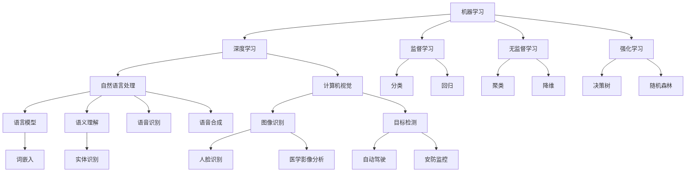

                 

### 文章标题

在21世纪的科技前沿，人工智能（AI）正迅速改变着我们的生活和工作方式。AI 2.0时代的到来标志着人工智能技术的一次重大飞跃，这一时代将带来前所未有的产业变革。本文将围绕李开复博士的观点，深入探讨AI 2.0时代的产业变化、核心技术、应用实例以及未来发展。

### 关键词

- AI 2.0
- 产业变革
- 机器学习
- 深度学习
- 人工智能应用
- 伦理与社会影响

### 摘要

本文旨在全面解析AI 2.0时代的产业图景。通过对AI 2.0的概念、特征、产业发展趋势的探讨，本文揭示了AI 2.0对制造业、零售业、医疗保健等行业的影响。随后，本文深入剖析了AI 2.0时代的核心技术，包括机器学习、深度学习、自然语言处理和计算机视觉等。通过实际应用案例，本文展示了AI 2.0在各行业的具体应用，并探讨了AI时代的伦理与社会影响。最后，本文提出了未来AI 2.0时代的发展战略和创新机会，为读者提供了深刻的见解和实用的指导。

### 第一部分：AI 2.0 时代的背景与概述

#### 第1章：AI 2.0 时代的起源与演变

##### 1.1 AI 2.0 的概念与特征

AI 2.0是继AI 1.0之后的新一代人工智能，其核心特征在于智能自主性、自主学习能力和高度适应性。AI 2.0不再仅仅依赖于预先编程的规则，而是能够通过大数据和机器学习算法自主发现规律，进行自我优化和决策。AI 2.0的关键在于其能够实现真正意义上的智能化，从而实现更高效、更精准的应用。

**AI 2.0的定义**：AI 2.0可以被定义为一种具备高度自主性和自我学习能力的人工智能系统，它能够利用大数据和机器学习技术，通过自主学习不断优化自身性能，实现智能化决策和操作。

**AI 2.0与传统AI的区别**：与传统的人工智能（AI 1.0）相比，AI 2.0具备以下几个显著区别：

1. **智能化程度更高**：AI 2.0具有更强的自主学习和决策能力，能够根据环境变化自主调整行为。
2. **数据处理能力更强**：AI 2.0能够处理大量复杂数据，挖掘出更深层次的信息和知识。
3. **应用范围更广泛**：AI 2.0不仅限于特定领域的应用，而是能够在各个行业和领域实现广泛的应用。
4. **自主学习能力**：AI 2.0能够通过机器学习算法不断自我学习和优化，提高应用性能。

**AI 2.0的核心技术突破**：AI 2.0的实现依赖于一系列核心技术的突破，主要包括：

1. **深度学习**：深度学习是AI 2.0的核心技术之一，通过多层神经网络结构，深度学习能够从大量数据中自动提取特征，实现高层次的智能识别和决策。
2. **自然语言处理**：自然语言处理（NLP）技术使得AI 2.0能够理解和生成自然语言，实现人机交互。
3. **计算机视觉**：计算机视觉技术使得AI 2.0能够识别和理解图像和视频，应用于安防监控、自动驾驶等领域。
4. **强化学习**：强化学习是一种通过不断试错和学习来优化决策的算法，它使得AI 2.0能够适应复杂环境，实现更智能的决策。

##### 1.2 AI 2.0 时代的产业变革

AI 2.0的到来将深刻改变各行业的生产方式、商业模式和社会结构，引发一场全球范围内的产业变革。

**AI 2.0对各行业的影响**：

1. **制造业**：AI 2.0将推动制造业向智能制造转型，通过智能生产系统、智能物流和供应链管理，提高生产效率和产品质量。
2. **零售业**：AI 2.0将革新零售业，通过智能客服系统、智能推荐系统和无人超市等，提升客户体验和运营效率。
3. **医疗保健**：AI 2.0将在医疗保健领域发挥重要作用，通过智能诊断系统、智能健康管理和医疗影像分析，提高医疗服务的质量和效率。
4. **金融业**：AI 2.0将提升金融行业的风险管理能力，通过智能投顾、信用评估和反欺诈系统，提高金融服务的安全性和准确性。
5. **教育**：AI 2.0将推动教育变革，通过智能教育系统和个性化学习平台，提高教学效果和学习效率。

**AI 2.0时代的商业模式创新**：

AI 2.0不仅改变了行业生产方式，还带来了商业模式的创新：

1. **平台化模式**：AI 2.0使得平台经济更加繁荣，通过建立数据共享平台和服务平台，企业可以更加高效地整合资源，实现跨行业的合作和创新。
2. **共享经济**：AI 2.0赋能共享经济，通过智能匹配和优化资源配置，提高资源利用效率，降低交易成本。
3. **智能服务**：AI 2.0推动服务业向智能化升级，通过智能客服、智能诊疗和智能咨询等，提升服务质量，增强用户体验。

**AI 2.0时代的社会挑战与应对策略**：

AI 2.0的快速发展也带来一系列社会挑战，包括就业、隐私、伦理等方面。为了应对这些挑战，需要采取以下策略：

1. **就业转型**：政府和企业需要提供培训和支持，帮助劳动力适应新技术，实现就业转型。
2. **数据隐私保护**：建立完善的数据隐私法律法规，确保个人数据的保护，避免数据滥用。
3. **伦理规范**：建立AI伦理规范，确保AI技术的发展符合人类价值观，避免伦理风险。
4. **国际合作**：加强国际合作，共同制定全球AI伦理标准，推动全球AI治理。

#### 第2章：AI 2.0 时代的产业发展趋势

##### 2.1 全球 AI 产业发展现状

AI作为全球科技竞争的重要领域，各国纷纷加大投入，推动AI技术的发展和应用。

**全球 AI 产业的发展历程**：

1. **起步阶段（2006-2012年）**：在这一阶段，深度学习算法的提出和神经网络模型的改进，为AI技术发展奠定了基础。
2. **快速成长阶段（2012-2018年）**：随着GPU等计算资源的普及，深度学习在图像识别、语音识别等领域取得了突破性进展，AI技术开始进入公众视野。
3. **广泛应用阶段（2018年至今）**：AI技术逐渐应用于各行各业，成为推动产业升级和社会变革的重要力量。

**各国 AI 产业的发展策略与布局**：

1. **美国**：美国在AI领域具有领先优势，通过政府和企业共同推动，加大对AI技术研发和应用的投入，推动AI技术在各行业的应用。
2. **中国**：中国将AI发展列为国家战略，通过制定发展规划、设立专项基金和推动创新平台建设，加快AI技术的研发和应用。
3. **欧盟**：欧盟注重AI伦理和社会影响，通过制定AI伦理准则和加强数据保护法规，推动AI技术的可持续发展。
4. **日本和韩国**：日本和韩国在AI领域也有较强实力，通过推动智能机器人、自动驾驶等技术的研发和应用，提升国家竞争力。

**全球 AI 产业联盟与合作**：

为了推动全球 AI 产业的发展，各国政府和行业组织纷纷成立 AI 产业联盟，推动国际间的合作与交流：

1. **世界经济论坛**：世界经济论坛（WEF）成立全球AI治理倡议，推动全球 AI 伦理和治理框架的制定。
2. **欧盟人工智能联盟**：欧盟人工智能联盟（AI Alliance）旨在推动欧盟 AI 产业的发展，加强国际合作。
3. **亚洲人工智能联盟**：亚洲人工智能联盟（AIA）致力于促进亚洲地区 AI 技术的交流与合作。

##### 2.2 AI 2.0 在行业中的应用

AI 2.0在各个行业的应用正在不断拓展，推动产业变革和创新发展。

**制造业的 AI 应用**：

1. **智能生产系统**：通过工业机器人、传感器和智能算法，实现生产过程的自动化和智能化，提高生产效率和质量。
2. **智能物流与供应链**：利用 AI 技术优化物流路线、库存管理和供应链协同，降低成本、提高物流效率。
3. **设备故障预测与维护**：通过物联网和机器学习技术，实时监测设备状态，预测故障并进行预防性维护，降低设备故障率和维修成本。

**零售业的 AI 应用**：

1. **智能客服系统**：通过自然语言处理和机器学习技术，实现自动回答用户咨询，提高客户体验和运营效率。
2. **智能推荐系统**：利用用户行为数据和机器学习算法，实现个性化推荐，提高销售转化率和客户满意度。
3. **无人超市**：通过人脸识别、智能结算等技术，实现无人值守超市，提高购物体验和运营效率。

**医疗保健的 AI 应用**：

1. **智能诊断系统**：通过深度学习和计算机视觉技术，实现医学影像的自动分析和诊断，提高诊断准确率和效率。
2. **智能健康管理**：利用可穿戴设备和大数据分析，实现个人健康数据的实时监测和健康管理，预防疾病发生。
3. **智能药物研发**：通过人工智能算法，加速药物研发过程，提高新药研发的成功率和速度。

**教育的 AI 应用**：

1. **智能教育系统**：通过大数据分析和个性化推荐技术，实现个性化教学和评估，提高教学效果和学生成绩。
2. **在线教育平台**：利用人工智能技术，实现自适应学习、智能问答和自动评分等功能，提高学习体验和效率。
3. **虚拟教师**：通过虚拟现实和人工智能技术，打造虚拟教师，为学生提供互动性更强的学习体验。

**金融业的 AI 应用**：

1. **智能投顾**：通过大数据分析和机器学习技术，为投资者提供个性化的投资建议和服务，提高投资收益。
2. **信用评估**：利用人工智能技术，实现快速、准确的风险评估和信用评分，提高金融机构的风险管理水平。
3. **反欺诈系统**：通过机器学习算法和大数据分析，实现实时监测和识别欺诈行为，提高金融交易的安全性和准确性。

通过 AI 2.0 在各行业的应用，不仅推动了产业变革和创新发展，还为各国经济和社会的发展提供了新的动力。在未来的发展中，各国需要进一步加强 AI 技术的研发和应用，推动全球 AI 产业的繁荣和发展。

### 第二部分：AI 2.0 时代的核心技术解析

#### 第3章：AI 2.0 的核心技术基础

##### 3.1 机器学习与深度学习

**机器学习（Machine Learning）** 是一种通过算法让计算机从数据中自动学习和发现规律的技术。它广泛应用于预测、分类、聚类等任务。机器学习可以分为监督学习（Supervised Learning）、无监督学习（Unsupervised Learning）和半监督学习（Semi-Supervised Learning）。

**监督学习** 是在有标记的数据集上进行训练，目标是学习出一个函数，可以将输入映射到预期的输出。常见的监督学习算法包括线性回归（Linear Regression）、逻辑回归（Logistic Regression）、支持向量机（Support Vector Machine，简称 SVM）和决策树（Decision Tree）等。

**无监督学习** 是在没有标记的数据集上进行训练，目标是发现数据中的结构或模式。常见的无监督学习算法包括聚类（Clustering）、主成分分析（Principal Component Analysis，简称 PCA）和自编码器（Autoencoder）等。

**深度学习（Deep Learning）** 是一种特殊的机器学习方法，它利用多层神经网络（Neural Network）来学习和提取数据中的特征。深度学习在图像识别、语音识别、自然语言处理等领域取得了显著成果。

**卷积神经网络（Convolutional Neural Network，简称 CNN）** 是一种特别适用于图像识别和处理的神经网络。它通过卷积层（Convolutional Layer）提取图像的特征，通过池化层（Pooling Layer）减少参数数量，并通过全连接层（Fully Connected Layer）进行分类。

**循环神经网络（Recurrent Neural Network，简称 RNN）** 是一种能够处理序列数据的神经网络，它通过循环结构来记住前一个时间步的信息。RNN 在语音识别、自然语言处理等领域表现出色。

**长短期记忆网络（Long Short-Term Memory，简称 LSTM）** 是 RNN 的一种变体，它通过门控机制（Gated Mechanism）来解决长短期依赖问题。LSTM 在序列数据处理中具有广泛的应用。

**生成对抗网络（Generative Adversarial Network，简称 GAN）** 是一种由生成器和判别器组成的神经网络。生成器尝试生成逼真的数据，判别器则判断数据是真实还是生成的。GAN 在图像生成、自然语言生成等领域取得了显著成果。

##### 3.2 自然语言处理

**自然语言处理（Natural Language Processing，简称 NLP）** 是人工智能的一个重要分支，致力于让计算机理解和生成自然语言。NLP 技术包括语言模型、语义理解、语音识别与合成等。

**语言模型（Language Model）** 是 NLP 的基础，它用于预测下一个单词或单词序列的概率。常见的语言模型包括基于规则模型、统计模型和神经网络模型。

**语义理解（Semantic Understanding）** 是 NLP 中的关键任务，它旨在理解文本中的含义和上下文。语义理解包括词义消歧（Word Sense Disambiguation）、实体识别（Named Entity Recognition，简称 NER）和关系抽取（Relation Extraction）等。

**语音识别（Speech Recognition）** 是将语音信号转换为文本的技术。语音识别技术包括隐马尔可夫模型（Hidden Markov Model，简称 HMM）、高斯混合模型（Gaussian Mixture Model，简称 GMM）和深度神经网络（Deep Neural Network，简称 DNN）等。

**语音合成（Speech Synthesis）** 是将文本转换为自然流畅的语音的技术。语音合成技术包括合成元音（Unit Selection Synthesis）、规则合成（Rule-Based Synthesis）和统计参数合成（Statistical Parametric Synthesis）等。

##### 3.3 计算机视觉

**计算机视觉（Computer Vision）** 是人工智能的另一个重要分支，致力于使计算机能够从图像或视频中理解和理解场景。计算机视觉技术包括图像识别、目标检测、图像生成等。

**图像识别（Image Recognition）** 是计算机视觉中的基础任务，它旨在识别图像中的物体或场景。常见的图像识别算法包括支持向量机（SVM）、决策树（Decision Tree）和卷积神经网络（CNN）等。

**目标检测（Object Detection）** 是计算机视觉中的关键任务，它旨在识别图像中的多个目标并确定它们的位置。常见的目标检测算法包括 R-CNN、Fast R-CNN、Faster R-CNN 和 YOLO 等。

**图像生成（Image Generation）** 是计算机视觉中的前沿任务，它旨在生成逼真的图像或视频。常见的图像生成算法包括生成对抗网络（GAN）和变分自编码器（Variational Autoencoder，简称 VAE）等。

通过深入理解这些核心技术，我们可以更好地应用 AI 2.0 时代的先进技术，推动各行业的发展和创新。

### 第三部分：AI 2.0 时代的产业应用与实践

#### 第4章：AI 2.0 在制造业的应用

AI 2.0在制造业的应用已经取得了显著的成果，通过智能生产系统、智能物流与供应链管理以及设备故障预测与维护，制造业正在迈向智能化、自动化和高效化。

##### 4.1 智能生产系统

智能生产系统是制造业向智能化转型的重要标志，它通过集成人工智能技术，实现生产过程的自动化和优化。智能生产系统包括以下几个核心组成部分：

1. **工业机器人**：工业机器人是智能生产系统的核心执行单元，它可以自动执行重复性、高精度和高复杂度的任务，如装配、焊接、喷涂等。通过机器学习和计算机视觉技术，工业机器人可以自主识别和适应不同的工作场景。

   **应用实例**：例如，汽车制造业中，工业机器人被广泛应用于车身焊接、喷涂和组装等环节，提高了生产效率和质量。

2. **传感器与物联网**：传感器是智能生产系统的“感官”，它用于实时监测生产设备和产品质量的状态。物联网（IoT）技术将传感器连接起来，形成一个智能化的生产网络，实现设备间的数据共享和协同工作。

   **应用实例**：例如，在电子制造业中，传感器可以实时监测生产设备的运行状态，预测设备故障，并通过物联网将数据传输到中央控制系统，实现远程监控和调度。

3. **智能算法**：智能算法是智能生产系统的“大脑”，它通过分析传感器收集的数据，实现生产过程的优化和调整。常见的智能算法包括机器学习、深度学习和优化算法等。

   **应用实例**：例如，在化工行业中，通过机器学习算法分析生产数据，可以实现生产参数的优化，提高生产效率和产品质量。

4. **人机协作**：在智能生产系统中，人与机器的协作至关重要。通过人工智能技术，可以实现人与机器的智能互动，提高生产效率和安全性。

   **应用实例**：例如，在制造业的仓储管理中，智能机器人可以与工作人员协作，实现自动化的拣选、搬运和存储。

##### 4.2 智能物流与供应链

智能物流与供应链管理是制造业高效运营的关键，通过人工智能技术，可以实现物流路线优化、库存管理和供应链协同。

1. **物流路线优化**：通过机器学习算法和大数据分析，可以优化物流路线，提高运输效率和降低成本。

   **应用实例**：例如，在电子商务领域，通过路径规划算法，可以实现快递配送的智能调度，降低配送时间和成本。

2. **库存管理**：通过预测算法和库存优化模型，可以实现库存水平的智能管理，减少库存成本和缺货风险。

   **应用实例**：例如，在制造业的原材料采购和库存管理中，通过预测算法分析需求波动，可以实现智能化的采购和库存调整。

3. **供应链协同**：通过物联网和大数据技术，可以实现供应链各环节的信息共享和协同工作，提高供应链的整体效率。

   **应用实例**：例如，在制造业的供应链管理中，通过物联网技术，可以实现供应链上下游企业的实时数据共享，提高供应链的透明度和协同效率。

##### 4.3 设备故障预测与维护

设备故障预测与维护是制造业生产稳定性和效率的关键，通过人工智能技术，可以实现设备状态的实时监控和故障预测。

1. **实时监控**：通过传感器和物联网技术，可以实现对设备运行状态的实时监控，收集设备运行数据。

   **应用实例**：例如，在制造业的生产线上，通过传感器实时监测设备的运行状态，可以及时发现设备异常。

2. **故障预测**：通过机器学习算法和故障预测模型，可以预测设备的故障时间，实现预防性维护。

   **应用实例**：例如，在制造业的设备维护中，通过分析设备的历史运行数据和故障模式，可以预测设备可能出现的故障，提前进行维护。

3. **智能维护**：通过智能维护系统，可以实现设备故障的自动诊断和修复，提高维护效率和设备利用率。

   **应用实例**：例如，在制造业的设备维护中，通过智能维护系统，可以实现设备的自动故障诊断和远程修复，减少停机时间和维护成本。

通过AI 2.0技术的应用，制造业正在实现智能化、自动化和高效化，提高生产效率和产品质量，降低运营成本。未来，随着AI技术的不断进步，制造业将迎来更加智能化和高效的发展。

### 第5章：AI 2.0 在零售业的应用

AI 2.0在零售业的应用正在引发一场深刻的变革，通过智能客服系统、智能推荐系统和无人超市等创新技术，零售业正迈向个性化、智能化和高效化。

##### 5.1 智能客服系统

智能客服系统是AI 2.0在零售业应用的一个重要领域，通过自然语言处理和机器学习技术，智能客服系统能够自动回答用户的问题，提供24/7的服务，提高客户满意度。

**智能客服系统的架构**：

1. **自然语言理解模块**：该模块负责接收用户的输入，并理解用户的意图和问题。通过语言模型和词向量模型，智能客服系统可以解析用户的语言，提取关键信息。

2. **意图识别模块**：该模块负责识别用户的问题类型，如查询商品信息、咨询售后服务等。通过机器学习算法，智能客服系统可以学习用户的提问模式，提高意图识别的准确性。

3. **知识库**：知识库是智能客服系统的核心，它包含了各种常见问题和标准答案。智能客服系统会根据用户的意图，从知识库中查找相应的答案。

4. **自然语言生成模块**：该模块负责将知识库中的答案转化为自然流畅的语言，回应用户。通过生成对抗网络（GAN）和序列到序列模型，智能客服系统可以生成高质量的自然语言回答。

**智能客服系统的关键技术**：

1. **语言模型**：语言模型是智能客服系统的基石，它用于预测下一个单词或词组。常见的语言模型包括基于规则模型、统计模型和神经网络模型。

2. **词向量模型**：词向量模型将单词表示为高维向量，用于表示单词的语义信息。常见的词向量模型包括 Word2Vec、GloVe 和 FastText。

3. **意图识别算法**：意图识别算法用于识别用户的问题类型，常见的算法包括基于规则的方法、决策树、支持向量机和深度学习算法。

4. **对话管理**：对话管理是智能客服系统的核心，它负责协调不同模块的工作，确保回答的一致性和连贯性。常见的对话管理方法包括基于规则的方法、基于模型的方法和混合方法。

**应用案例**：

1. **电商客服**：许多电商平台都采用了智能客服系统，如淘宝、京东和亚马逊。智能客服系统能够自动回答用户关于商品信息、订单查询和售后服务的问题，提高客户满意度。

2. **银行客服**：银行也广泛应用智能客服系统，提供在线咨询、账户查询和转账等服务。智能客服系统能够实时响应用户的请求，提高服务效率和客户体验。

**智能客服系统的优势**：

1. **提高服务效率**：智能客服系统可以自动处理大量用户请求，节省人力成本，提高服务效率。

2. **提升客户满意度**：智能客服系统可以提供24/7的服务，及时响应客户请求，提高客户满意度。

3. **数据驱动优化**：智能客服系统可以收集用户数据，通过机器学习算法分析用户行为，不断优化服务质量和用户体验。

##### 5.2 智能推荐系统

智能推荐系统是AI 2.0在零售业应用的另一个重要领域，通过分析用户的行为数据和偏好，智能推荐系统可以个性化推荐商品，提高销售转化率和客户满意度。

**智能推荐系统的原理**：

1. **协同过滤**：协同过滤是一种基于用户行为数据的推荐方法，它通过分析用户之间的相似度，为用户推荐相似用户喜欢的商品。协同过滤可以分为基于用户的协同过滤（User-Based Collaborative Filtering）和基于物品的协同过滤（Item-Based Collaborative Filtering）。

2. **内容推荐**：内容推荐是一种基于商品属性和用户偏好的推荐方法，它通过分析商品的属性和用户的偏好，为用户推荐具有相似属性的商品。

3. **混合推荐**：混合推荐系统将协同过滤和内容推荐方法结合，综合用户的兴趣和行为，提供更准确的推荐。

**智能推荐系统的关键技术**：

1. **数据挖掘**：数据挖掘是智能推荐系统的核心，它负责分析用户行为数据，提取用户兴趣和偏好。常见的数据挖掘方法包括关联规则挖掘、聚类分析和分类算法。

2. **机器学习算法**：机器学习算法用于建模用户行为数据和偏好，预测用户对商品的喜好。常见的机器学习算法包括线性回归、决策树、支持向量机和深度学习算法。

3. **推荐算法优化**：推荐算法优化是智能推荐系统的关键，它通过调整算法参数，提高推荐效果。常见的优化方法包括在线学习、在线优化和协同过滤算法的改进。

**应用案例**：

1. **电商推荐**：电商平台如淘宝、京东和亚马逊都采用了智能推荐系统，通过分析用户的历史购买记录和浏览行为，为用户推荐相关商品，提高销售转化率。

2. **视频推荐**：视频平台如Netflix和YouTube也采用了智能推荐系统，通过分析用户观看历史和用户评分，为用户推荐相关视频，提高用户黏性和观看时长。

**智能推荐系统的优势**：

1. **提高销售转化率**：智能推荐系统可以个性化推荐商品，提高用户购买的概率，从而提高销售转化率。

2. **提升客户满意度**：智能推荐系统可以提供个性化的购物体验，满足用户的个性化需求，提高客户满意度。

3. **数据驱动优化**：智能推荐系统可以收集用户数据，通过机器学习算法分析用户行为，不断优化推荐效果。

##### 5.3 无人超市

无人超市是AI 2.0在零售业应用的又一创新，通过自动化设备和智能算法，无人超市实现了无人值守、自助结算和精准库存管理。

**无人超市的架构**：

1. **感知系统**：感知系统包括摄像头、传感器和条码扫描器等，用于实时监测顾客的行为和商品的状态。

2. **智能结算系统**：智能结算系统通过图像识别和条码扫描技术，实现商品的自助结算。

3. **库存管理系统**：库存管理系统通过传感器和RFID技术，实现商品的实时库存监控和管理。

4. **智能配送系统**：智能配送系统通过无人机和自动驾驶车辆，实现商品的快速配送。

**无人超市的关键技术**：

1. **计算机视觉**：计算机视觉技术用于实时监测顾客的行为和商品的状态，识别商品和顾客的身份。

2. **自然语言处理**：自然语言处理技术用于处理顾客的语音指令和智能客服的对话。

3. **深度学习**：深度学习技术用于模型训练和算法优化，提高无人超市的智能化水平。

**应用案例**：

1. **亚马逊无人超市**：亚马逊推出的Amazon Go无人超市，通过计算机视觉和深度学习技术，实现了无人值守、自助结算和精准库存管理。

2. **阿里无人超市**：阿里巴巴旗下的无人超市“淘咖啡”，通过人脸识别、智能结算和智能配送等技术，实现了全新的购物体验。

**无人超市的优势**：

1. **提高运营效率**：无人超市减少了人力成本，实现了高效运营。

2. **提升客户体验**：无人超市提供了便捷、智能的购物体验，提高了客户满意度。

3. **降低运营成本**：无人超市通过自动化设备和智能算法，降低了运营成本。

通过AI 2.0技术的应用，零售业正在实现个性化、智能化和高效化，为消费者提供更优质的购物体验。未来，随着AI技术的不断进步，零售业将迎来更加智能和创新的变革。

### 第6章：AI 2.0 在医疗保健的应用

AI 2.0 在医疗保健领域正逐步发挥重要作用，通过智能诊断系统、智能健康管理和医疗影像分析，极大地提升了医疗服务的效率和质量。

##### 6.1 智能诊断系统

智能诊断系统利用人工智能技术，对病人的病史、临床表现和医学影像进行分析，辅助医生做出更准确的诊断。

**智能诊断系统的架构**：

1. **数据采集模块**：该模块负责收集病人的电子健康记录（EHR）、实验室检测数据、医学影像等。

2. **数据处理与分析模块**：数据处理与分析模块利用机器学习和深度学习算法，对收集到的数据进行分析，提取关键特征，为诊断提供依据。

3. **诊断决策支持模块**：该模块基于分析结果，提供诊断建议和预测，辅助医生做出诊断决策。

**智能诊断系统的关键技术**：

1. **深度学习**：深度学习技术在医学影像分析中表现尤为突出，通过卷积神经网络（CNN）等模型，智能诊断系统可以从医学影像中识别和分类病变区域。

2. **自然语言处理**：自然语言处理技术用于处理患者的病历记录和医生的诊断报告，提取关键信息，辅助诊断决策。

3. **多模态数据融合**：多模态数据融合技术将不同类型的数据（如影像、病历、实验室检测结果等）进行整合，提高诊断的准确性和全面性。

**应用案例**：

1. **影像诊断**：AI 2.0 在影像诊断中的应用最为广泛，如肺癌筛查、乳腺癌检测等，通过深度学习算法，AI 可以在早期阶段发现病变，提高诊断的准确率。

2. **糖尿病管理**：智能诊断系统可以分析患者的血糖记录，预测糖尿病的并发症，提供个性化的治疗建议。

**智能诊断系统的优势**：

1. **提高诊断准确率**：AI 2.0 可以处理和分析大量数据，有助于发现微小的病变，提高诊断的准确性。

2. **减轻医生负担**：智能诊断系统可以处理大量病例，减轻医生的工作负担，提高诊断效率。

3. **辅助决策**：智能诊断系统提供的数据分析和诊断建议，有助于医生做出更准确的诊断和治疗方案。

##### 6.2 智能健康管理

智能健康管理通过可穿戴设备、移动应用和数据分析，实现对个人健康数据的实时监测和健康管理。

**智能健康管理的核心技术**：

1. **可穿戴设备**：可穿戴设备如智能手表、健康手环等，可以实时监测心率、血压、步数、睡眠质量等生理参数。

2. **移动应用**：移动应用负责收集和处理来自可穿戴设备的数据，通过数据分析提供健康建议。

3. **大数据分析**：大数据分析技术用于处理和分析海量健康数据，发现潜在的健康风险，提供个性化的健康管理方案。

**应用案例**：

1. **个性化健康建议**：智能健康管理应用可以根据用户的健康数据，提供个性化的饮食、运动和睡眠建议，帮助用户改善生活习惯。

2. **慢性病管理**：对于慢性病患者，如高血压、糖尿病等，智能健康管理应用可以实时监控病情，提供预警和干预措施，降低并发症风险。

**智能健康管理的优势**：

1. **实时监测**：智能健康管理可以实时监测用户的健康数据，及时发现异常，提供及时干预。

2. **个性化服务**：智能健康管理应用可以根据用户的健康状况，提供个性化的健康建议和干预方案。

3. **预防疾病**：通过实时监测和预警，智能健康管理有助于预防疾病的发生和发展。

##### 6.3 医疗影像分析

医疗影像分析是 AI 2.0 在医疗保健领域的又一重要应用，通过计算机视觉和深度学习技术，AI 可以自动分析医学影像，辅助医生诊断。

**医疗影像分析的关键技术**：

1. **计算机视觉**：计算机视觉技术用于识别和分析医学影像中的结构和异常，如肿瘤、骨折等。

2. **深度学习**：深度学习技术在医学影像分析中表现优异，通过卷积神经网络（CNN）等模型，AI 可以从医学影像中提取特征，进行分类和检测。

3. **图像处理**：图像处理技术用于增强医学影像的质量，提高分析的准确性和效率。

**应用案例**：

1. **肺癌筛查**：AI 2.0 可以通过分析肺部CT影像，自动识别肺癌病变，提高筛查的准确率。

2. **骨折诊断**：AI 2.0 可以通过分析X光片，自动识别骨折部位和类型，辅助医生做出诊断。

**医疗影像分析的优势**：

1. **提高诊断准确率**：AI 2.0 可以处理和分析大量影像数据，有助于发现微小的病变，提高诊断的准确性。

2. **减轻医生负担**：AI 2.0 可以自动分析医学影像，减轻医生的工作负担，提高诊断效率。

3. **辅助决策**：AI 2.0 提供的影像分析结果和诊断建议，有助于医生做出更准确的诊断和治疗方案。

通过AI 2.0技术的应用，医疗保健领域正实现从诊断到预防的全面升级，为患者提供更加高效、精准和个性化的医疗服务。

### 第7章：AI 2.0 时代的伦理与社会影响

AI 2.0 时代的快速发展带来了前所未有的技术进步，但同时也引发了一系列伦理和社会问题，需要我们深入思考和应对。

##### 7.1 AI 伦理与法律法规

AI 伦理是 AI 2.0 时代面临的重要议题，涉及到人工智能系统的设计、开发、部署和使用过程中的道德和伦理问题。以下是一些关键伦理问题和相关法律法规：

1. **数据隐私**：AI 系统依赖于大量数据，如何确保用户的数据隐私不被侵犯，成为了一个重要的伦理问题。相关法律法规如《通用数据保护条例》（GDPR）规定了数据收集、处理和存储的标准，保护用户的隐私权。

2. **算法公平性**：AI 系统的决策可能受到算法偏见的影响，导致对某些群体的不公平对待。例如，招聘系统的算法可能对某些性别、种族或年龄群体产生歧视。为此，各国政府和组织正在制定相关法规，确保算法的公平性和透明性。

3. **透明性和解释性**：AI 系统的决策过程通常是不透明的，用户难以理解 AI 如何做出决策。为了提高 AI 系统的透明性和解释性，一些法规要求开发者和企业公开算法的决策过程和数据来源。

4. **责任归属**：当 AI 系统出现错误或造成损害时，责任归属问题变得复杂。例如，自动驾驶汽车发生交通事故，责任应由谁承担？相关法律法规正在探索如何明确责任归属，确保受害者得到公正的赔偿。

**关键法规和标准**：

- **《通用数据保护条例》（GDPR）**：欧盟制定的 GDPR 规定了数据隐私保护的标准，对数据收集、处理和存储提出了严格要求。
- **《人工智能法案》**：一些国家正在制定《人工智能法案》，旨在规范 AI 系统的开发、部署和使用，确保 AI 技术的可持续发展。
- **行业标准和指南**：国际标准化组织（ISO）和其他专业组织正在制定 AI 伦理标准和指南，为 AI 的发展提供指导。

##### 7.2 AI 时代的社会影响

AI 2.0 的普及和应用对经济、就业、教育和社会稳定产生了深远影响，以下是一些主要的社会影响：

1. **就业市场**：AI 2.0 技术的广泛应用可能导致某些行业和岗位的就业机会减少，特别是那些重复性、低技能的工作。同时，AI 也会创造新的就业机会，如数据科学家、AI 算法工程师和 AI 应用专家。为了应对这一变化，需要政府和企业共同努力，提供培训和再教育，帮助劳动力适应新的技术环境。

2. **教育和技能培训**：随着 AI 技术的快速发展，教育和技能培训需要与时俱进。学校和教育机构应加强计算机科学、数据科学和人工智能等课程的教学，培养学生的创新能力和技术素养。此外，政府和企业也应提供在职培训和再教育机会，帮助现有员工掌握新的技能。

3. **经济转型**：AI 2.0 技术的应用将推动产业升级和经济转型，提高生产效率和服务质量。同时，AI 也会带来新的商业模式和创业机会，促进经济增长。为了实现经济转型，政府和企业需要制定相应的政策和支持措施，鼓励创新和创业。

4. **社会稳定**：AI 2.0 的广泛应用可能引发社会不平等和道德风险，如算法歧视、数据隐私泄露和社会不公等。为了维护社会稳定，需要建立和完善相关法律法规，加强 AI 伦理和社会影响的监管。

**应对策略**：

- **加强法律法规建设**：制定和完善与 AI 伦理和社会影响相关的法律法规，确保 AI 技术的可持续发展。
- **教育和技能培训**：加强计算机科学、数据科学和人工智能等课程的教学，提高公众的技术素养和创新能力。
- **就业转型支持**：提供培训和再教育机会，帮助劳动力适应新的技术环境，实现就业转型。
- **政策支持**：制定和实施鼓励创新、创业和产业升级的政策，促进经济和社会的可持续发展。

通过深入研究和应对 AI 2.0 时代的伦理和社会影响，我们可以更好地推动 AI 技术的健康发展，实现技术进步与社会利益的共赢。

### 第四部分：未来展望与策略

#### 第8章：AI 2.0 时代的发展战略

在AI 2.0时代，企业需要制定明确的发展战略，以充分利用AI技术带来的机遇，同时应对潜在的风险和挑战。

##### 8.1 企业在 AI 时代的战略规划

**评估与规划**：

1. **技术评估**：企业需要对现有的技术基础进行全面的评估，确定哪些技术可以为企业带来最大的价值。例如，企业可以评估机器学习、深度学习和自然语言处理等技术的成熟度和适用性。

2. **需求分析**：企业需要分析业务需求，确定哪些业务流程可以借助AI技术进行优化。例如，零售业可以通过智能推荐系统提高销售转化率，制造业可以通过智能生产系统提高生产效率。

3. **资源规划**：企业需要根据评估和需求分析的结果，规划所需的资源，包括人力、资金和技术支持。企业可以通过招聘人才、投资研发和升级基础设施等方式，为AI技术应用提供保障。

**实施策略**：

1. **试点项目**：企业可以通过实施试点项目，验证AI技术的可行性和效果。试点项目可以涵盖不同的业务场景，如智能客服系统、智能诊断系统等。

2. **分阶段实施**：企业可以采用分阶段实施策略，逐步推广AI技术。在第一阶段，企业可以专注于核心业务流程的优化，如提高生产效率或提升客户体验。在后续阶段，企业可以逐步扩大AI技术的应用范围。

3. **跨部门合作**：AI技术的应用往往需要跨部门的合作，如IT部门、业务部门和运营部门。企业需要建立跨部门合作机制，确保不同部门之间的信息共享和协同工作。

**风险管理**：

1. **技术风险**：企业需要关注AI技术的不确定性和潜在风险，如算法错误、数据泄露等。企业可以通过技术审计、安全测试和数据分析等方式，降低技术风险。

2. **市场风险**：AI技术的快速变化可能导致市场需求的波动。企业需要密切关注市场动态，调整战略规划，以应对市场变化。

3. **人力资源风险**：企业需要关注人才流失和技能短缺等问题。企业可以通过培训、激励和招聘等方式，吸引和留住人才。

##### 8.2 全球 AI 竞争格局与战略布局

**全球 AI 竞争格局分析**：

1. **美国**：美国在AI领域具有领先地位，得益于其在计算能力、数据资源和研发投入等方面的优势。美国企业如谷歌、微软和亚马逊在AI技术的研究和应用方面处于领先地位。

2. **中国**：中国通过政府政策支持和大量投资，加速了AI技术的发展和应用。中国企业如阿里巴巴、腾讯和百度在AI领域也取得了显著成果，特别是在智能客服、智能推荐和自动驾驶等方面。

3. **欧洲**：欧洲在AI伦理和社会影响方面具有较强的优势，通过制定相关法规和推动AI技术的可持续发展。欧洲企业如西门子、欧盟人工智能联盟在AI技术应用方面也有所建树。

4. **亚洲其他国家**：亚洲其他国家如日本、韩国等在AI技术研究和应用方面也有所进展，尤其是在机器人技术和智能医疗领域。

**各国 AI 发展策略对比**：

1. **美国**：美国注重技术创新和商业应用，通过政府和企业合作，推动AI技术的发展。美国还重视数据隐私和安全，通过制定相关法律法规保障数据安全和用户隐私。

2. **中国**：中国通过政府政策支持和大量投资，加速了AI技术的发展和应用。中国政府制定了《新一代人工智能发展规划》，明确了一系列目标和任务，如加强基础研究、推动产业应用和保障数据安全。

3. **欧洲**：欧洲注重AI伦理和社会影响，通过制定相关法规和推动AI技术的可持续发展。欧洲还强调了跨学科合作和公共利益，以确保AI技术的健康发展。

4. **亚洲其他国家**：亚洲其他国家如日本、韩国等通过政府政策支持和企业合作，推动AI技术的发展。这些国家还注重AI技术在特定领域（如机器人技术、智能医疗等）的应用。

**企业如何把握全球 AI 发展趋势**：

1. **技术创新**：企业需要持续投入研发，紧跟全球 AI 技术的发展趋势，保持技术领先优势。

2. **市场拓展**：企业需要关注全球市场动态，拓展业务范围，抓住全球 AI 技术应用的机遇。

3. **国际合作**：企业可以通过国际合作，学习借鉴全球先进的 AI 技术和应用经验，推动自身技术进步。

4. **政策合规**：企业需要关注各国 AI 发展政策，确保技术应用的合规性，降低法律风险。

通过制定明确的发展战略和把握全球 AI 发展趋势，企业可以在 AI 2.0 时代实现持续创新和竞争优势。

#### 第9章：AI 2.0 时代的创新与创业机会

在AI 2.0时代，技术创新和创业活动迎来了前所未有的机遇。通过深入了解AI技术的趋势、关键成功因素和实际案例分析，我们可以更好地把握这一时代的创新机遇。

##### 9.1 AI 创新的趋势与方向

AI 创新的核心在于如何将先进的技术转化为实际应用，以下是一些当前 AI 创新的主要趋势和方向：

1. **智能自动化**：随着深度学习和强化学习技术的发展，智能自动化正在从制造业扩展到服务业、医疗保健等多个领域。通过自动化技术，企业可以提高生产效率、降低成本并提升服务质量。

2. **自然语言处理（NLP）**：NLP 技术的进步使得人机交互变得更加自然和高效。未来，NLP 将在智能客服、智能助手、智能翻译等领域发挥更大的作用。

3. **计算机视觉**：计算机视觉技术正在推动自动驾驶、安防监控、医疗影像分析等领域的发展。通过深度学习算法，计算机视觉系统可以更准确地识别和理解图像和视频内容。

4. **生成对抗网络（GAN）**：GAN 技术在图像生成、数据增强和虚拟现实等领域具有广泛应用。未来，GAN 将在创造逼真的虚拟环境和个性化内容方面发挥重要作用。

5. **边缘计算**：随着物联网（IoT）设备的普及，边缘计算成为 AI 创新的重要方向。边缘计算可以将数据处理和智能分析推向网络边缘，实现实时响应和低延迟。

##### 9.2 AI 创业的关键成功因素

在 AI 2.0 时代，创业企业需要具备以下关键成功因素，以在激烈的市场竞争中脱颖而出：

1. **技术领先**：技术是 AI 创业的核心竞争力。创业企业需要不断研发和优化 AI 技术，确保技术处于行业领先地位。

2. **数据驱动**：数据是 AI 技术的基础。创业企业需要积累和利用大量高质量的数据，通过数据分析和机器学习算法，实现数据的商业价值。

3. **用户体验**：用户体验是创业企业成功的关键。创业企业需要设计简单易用的产品和服务，满足用户的需求和期望。

4. **商业模式创新**：AI 创业企业需要探索新的商业模式，通过创新的商业模式实现盈利和持续发展。

5. **团队协作**：优秀的团队是 AI 创业成功的关键。创业企业需要组建一支具备跨学科知识和技能的团队，确保项目的顺利推进。

##### 9.3 AI 创业的案例分析

以下是一些成功的 AI 创业案例，通过分析这些案例，我们可以了解 AI 创业的实践方法和经验：

1. **案例一：OpenAI**  
   **背景**：OpenAI 是一家专注于人工智能研究的创业公司，其目标是实现安全的通用人工智能（AGI）。OpenAI 通过开放资源和合作，推动 AI 技术的快速发展。  
   **成功因素**：技术领先、数据驱动、开放合作、创新商业模式。  
   **经验**：创业企业可以通过开放合作和共享资源，推动技术的快速进步。

2. **案例二：Clarifai**  
   **背景**：Clarifai 是一家提供图像识别和计算机视觉解决方案的创业公司。Clarifai 通过机器学习算法，提供高效的图像识别服务。  
   **成功因素**：技术领先、用户体验、商业模式创新。  
   **经验**：创业企业需要注重用户体验，设计简单易用的产品。

3. **案例三：Flexport**  
   **背景**：Flexport 是一家提供智能物流服务的创业公司，通过人工智能和数据分析，优化物流流程，提高运输效率。  
   **成功因素**：数据驱动、商业模式创新、用户体验。  
   **经验**：创业企业需要充分利用数据，优化业务流程，提升用户体验。

4. **案例四：Landing AI**  
   **背景**：Landing AI 是一家专注于开发智能客服解决方案的创业公司。Landing AI 通过自然语言处理技术，提供智能客服服务。  
   **成功因素**：技术领先、用户体验、商业模式创新。  
   **经验**：创业企业需要注重用户体验，设计高效、智能的客服系统。

通过以上案例分析，我们可以看到 AI 创业成功的关键在于技术领先、数据驱动、用户体验和商业模式创新。创业企业需要紧跟技术发展趋势，不断优化产品和服务，抓住 AI 2.0 时代的创新机遇。

#### 第10章：AI 2.0 时代的企业创新策略

在AI 2.0时代，企业创新成为提升竞争力、实现可持续发展的重要途径。通过掌握AI技术、优化业务流程和构建创新生态系统，企业可以在激烈的市场竞争中脱颖而出。

##### 10.1 企业如何把握 AI 技术创新

**技术趋势分析**：企业需要密切关注全球AI技术发展趋势，通过技术趋势分析，确定适合自身发展的AI技术方向。例如，企业可以关注深度学习、自然语言处理、计算机视觉和边缘计算等前沿技术。

**研发投入**：企业应加大对AI技术的研发投入，建立自己的技术团队或与外部科研机构合作，推动AI技术的创新和应用。研发投入不仅包括资金，还包括人才、设备和实验环境等。

**开放合作**：企业可以通过开放合作，与高校、研究机构和同行企业建立合作关系，共享技术资源和研究成果。通过开放合作，企业可以快速获取前沿技术，提升自身技术能力。

**内部创新平台**：企业可以建立内部创新平台，鼓励员工提出创新想法，并提供资源支持。内部创新平台可以激发员工的创新潜力，推动企业技术进步。

##### 10.2 企业如何利用 AI 优化业务流程

**流程优化**：企业可以利用AI技术对业务流程进行优化，提高效率和降低成本。例如，通过机器学习算法，企业可以优化生产流程、供应链管理和物流调度，提高运营效率。

**自动化**：AI技术可以实现业务流程的自动化，减少人工干预，降低运营风险。企业可以通过机器人流程自动化（RPA）技术，实现业务流程的自动化处理，提高工作效率。

**数据驱动决策**：企业可以利用AI技术分析大量数据，实现数据驱动决策。通过数据分析和机器学习算法，企业可以预测市场需求、优化库存管理和提高客户满意度。

**个性化服务**：AI技术可以帮助企业实现个性化服务，满足客户个性化需求。例如，通过自然语言处理技术，企业可以实现智能客服系统，提供24/7的在线服务，提高客户满意度。

##### 10.3 企业如何打造 AI 创新生态系统

**内部生态系统**：企业可以建立内部创新生态系统，鼓励跨部门合作和知识共享。内部创新生态系统可以促进员工之间的协作，激发创新思维，推动企业技术进步。

**外部合作**：企业可以通过与高校、研究机构、同行企业等建立合作关系，构建外部创新生态系统。外部合作可以为企业提供技术支持和资源，促进技术交流和合作创新。

**创新孵化器**：企业可以建立创新孵化器，为新兴技术和创业项目提供孵化支持。创新孵化器可以为企业提供资金、技术支持和市场资源，帮助创业项目快速成长。

**人才培养**：企业可以通过人才培养计划，提升员工的AI技术能力和创新思维。企业可以与高校合作，设立奖学金和实习项目，吸引优秀人才加入。

通过掌握AI技术、优化业务流程和构建创新生态系统，企业可以在AI 2.0时代实现持续创新和竞争优势。

### 附录

#### 附录 A：AI 开发工具与资源

**A.1 主流 AI 开发工具**

1. **TensorFlow**：
   - TensorFlow 是由 Google 开发的一款开源机器学习框架，广泛用于深度学习模型的训练和应用。
   - 官网：[https://www.tensorflow.org/](https://www.tensorflow.org/)
   - 教程：[TensorFlow 官方文档](https://www.tensorflow.org/tutorials)

2. **PyTorch**：
   - PyTorch 是由 Facebook 开发的一款开源深度学习框架，以其灵活性和动态计算图而受到青睐。
   - 官网：[https://pytorch.org/](https://pytorch.org/)
   - 教程：[PyTorch 官方文档](https://pytorch.org/tutorials/beginner/basics/index.html)

3. **Keras**：
   - Keras 是一个高级神经网络API，能够以TensorFlow和Theano作为后端运行。
   - 官网：[https://keras.io/](https://keras.io/)
   - 教程：[Keras 官方文档](https://keras.io/getting-started/)

**A.2 AI 学习资源**

1. **在线课程推荐**：
   - **Coursera**：[机器学习](https://www.coursera.org/specializations/machine-learning)  
   - **Udacity**：[深度学习纳米学位](https://www.udacity.com/course/deep-learning-nanodegree--nd131)  
   - **edX**：[深度学习](https://www.edx.org/course/deep-learning-ii-convolutional-neural-networks-cs194-11x)

2. **书籍推荐**：
   - **《深度学习》（Deep Learning）**：Ian Goodfellow、Yoshua Bengio 和 Aaron Courville 著，是一本深度学习的权威教材。
   - **《Python机器学习》（Python Machine Learning）**：Sebastian Raschka 和 Vahid Mirhoseini 著，适合初学者入门机器学习。
   - **《强化学习》（Reinforcement Learning: An Introduction）**：Richard S. Sutton 和 Andrew G. Barto 著，是强化学习的经典教材。

3. **学术论文推荐**：
   - **《A Theoretically Grounded Application of Dropout in Recurrent Neural Networks》**：Yarin Gal 和 Zohar Karnin，发表于2016年。
   - **《Generative Adversarial Nets》**：Ian J. Goodfellow、Jonas Friedmann 和 Nickchen Ng，发表于2014年。
   - **《Deep Residual Learning for Image Recognition》**：Kaiming He、Xiangyu Zhang、Shaoqing Ren 和 Jian Sun，发表于2016年。

**A.3 AI 开发实践案例**

1. **案例一：智能客服系统**：
   - **实现方式**：使用TensorFlow构建一个循环神经网络（RNN），实现文本分类和回复生成。
   - **代码示例**：以下是一个简单的RNN模型示例：
     ```python
     import tensorflow as tf
     from tensorflow.keras.models import Sequential
     from tensorflow.keras.layers import Embedding, LSTM, Dense

     model = Sequential()
     model.add(Embedding(vocab_size, embedding_dim))
     model.add(LSTM(128))
     model.add(Dense(units=vocab_size, activation='softmax'))

     model.compile(optimizer='adam', loss='categorical_crossentropy', metrics=['accuracy'])
     model.fit(X_train, y_train, epochs=10, batch_size=32)
     ```

2. **案例二：图像分类**：
   - **实现方式**：使用Keras构建一个卷积神经网络（CNN），实现图像分类。
   - **代码示例**：以下是一个简单的CNN模型示例：
     ```python
     import tensorflow as tf
     from tensorflow.keras.models import Sequential
     from tensorflow.keras.layers import Conv2D, MaxPooling2D, Flatten, Dense

     model = Sequential()
     model.add(Conv2D(32, (3, 3), activation='relu', input_shape=(64, 64, 3)))
     model.add(MaxPooling2D(pool_size=(2, 2)))
     model.add(Flatten())
     model.add(Dense(128, activation='relu'))
     model.add(Dense(num_classes, activation='softmax'))

     model.compile(optimizer='adam', loss='categorical_crossentropy', metrics=['accuracy'])
     model.fit(X_train, y_train, epochs=10, batch_size=32)
     ```

**实践心得分享**：

- **理论学习与实践操作相结合**：在AI开发中，理论学习是基础，但实践操作是关键。只有将理论知识应用到实际项目中，才能更好地理解和掌握技术。
- **持续学习和更新**：AI技术更新迅速，开发者需要持续学习和跟进最新的技术趋势和研究成果，以保持自己的竞争力。
- **问题驱动学习**：遇到问题时，不要害怕，而是要将其视为学习的机会。通过分析和解决问题，可以更好地理解和应用技术。

通过以上资源和实践案例，读者可以更好地掌握AI开发的方法和技巧，为未来的AI项目打下坚实的基础。

### 图形表示：AI 2.0 时代的核心概念与联系

在AI 2.0时代，多个核心概念和技术相互交织，共同推动人工智能的发展。以下是一个简化的 Mermaid 流程图，用于表示这些核心概念之间的联系：



在这个图形中，机器学习（A）是核心，它通过不同的学习方法（I和J）衍生出各种应用场景，如分类（K）、回归（L）、聚类（M）和降维（N）。深度学习（B）作为机器学习的一个子集，进一步扩展到自然语言处理（C）和计算机视觉（D），分别应用于语言模型（E）、语义理解（F）、图像识别（G）和目标检测（H）。此外，核心算法如强化学习（Q）和传统机器学习算法（R和S）也在图形中有明显的位置。自然语言处理中的语音识别（T）和语音合成（U）以及计算机视觉中的图像识别（G）和目标检测（H）也分别延伸出具体的实际应用，如人脸识别（O）、自动驾驶（P）、医学影像分析（X）和安防监控（Y）。

通过这个图形，我们可以清晰地看到AI 2.0时代各核心概念和技术之间的联系，有助于理解人工智能技术的全貌和跨领域应用。

### 核心算法原理讲解：机器学习与深度学习

机器学习和深度学习是人工智能领域中最核心的技术。在这两部分，我们将详细讲解机器学习和深度学习的基本原理，包括关键算法、数学模型和公式，并通过伪代码和实际案例进行说明。

#### 机器学习

**机器学习（Machine Learning）** 是一种通过算法使计算机从数据中自动学习和发现规律的技术。它分为监督学习（Supervised Learning）、无监督学习（Unsupervised Learning）和半监督学习（Semi-Supervised Learning）。

##### 监督学习（Supervised Learning）

监督学习是在有标记的数据集上进行训练，目标是学习出一个函数，可以将输入映射到预期的输出。常见的监督学习算法包括线性回归（Linear Regression）、逻辑回归（Logistic Regression）、支持向量机（Support Vector Machine，简称 SVM）和决策树（Decision Tree）等。

**线性回归（Linear Regression）**：

线性回归是一种用于预测连续值的监督学习算法，其目标是找到一个线性函数来最小化输入和输出之间的误差。

数学模型：

$$
y = \beta_0 + \beta_1x
$$

其中，$y$ 是预测值，$x$ 是输入特征，$\beta_0$ 和 $\beta_1$ 是模型参数。

伪代码：

```python
def linear_regression(train_data, train_labels):
    # 初始化参数
    beta_0 = 0
    beta_1 = 0
    
    # 梯度下降法优化参数
    for epoch in range(num_epochs):
        for data, label in zip(train_data, train_labels):
            prediction = beta_0 + beta_1 * data
            error = label - prediction
            beta_0 = beta_0 - learning_rate * error
            beta_1 = beta_1 - learning_rate * (error * data)
    return beta_0, beta_1
```

**逻辑回归（Logistic Regression）**：

逻辑回归是一种用于预测概率的监督学习算法，常用于二分类问题。其目标是最小化输入和输出之间的交叉熵损失。

数学模型：

$$
\hat{p} = \frac{1}{1 + e^{-(\beta_0 + \beta_1x)}}
$$

伪代码：

```python
def logistic_regression(train_data, train_labels):
    beta_0 = 0
    beta_1 = 0
    
    for epoch in range(num_epochs):
        for data, label in zip(train_data, train_labels):
            prediction = 1 / (1 + exp(-beta_0 - beta_1 * data))
            error = label - prediction
            beta_0 = beta_0 - learning_rate * error
            beta_1 = beta_1 - learning_rate * (error * data * prediction * (1 - prediction))
    return beta_0, beta_1
```

##### 无监督学习（Unsupervised Learning）

无监督学习是在没有标记的数据集上进行训练，目标是发现数据中的结构或模式。常见的无监督学习算法包括聚类（Clustering）、主成分分析（Principal Component Analysis，简称 PCA）和自编码器（Autoencoder）等。

**聚类（Clustering）**：

聚类算法是将数据分为不同的组，使得同一组内的数据点尽可能接近，而不同组的数据点尽可能远。

K-Means 聚类算法是一种常用的聚类算法。

伪代码：

```python
def k_means(train_data, num_clusters):
    centroids = initialize_centroids(train_data, num_clusters)
    
    for epoch in range(num_epochs):
        # 赋予每个数据点最近的聚类中心
        labels = assign_labels(train_data, centroids)
        
        # 更新聚类中心
        new_centroids = update_centroids(train_data, labels, num_clusters)
        
        # 检查收敛条件，如聚类中心变化很小
        if is_converged(centroids, new_centroids):
            break
            
        centroids = new_centroids
    
    return labels, centroids
```

**主成分分析（PCA）**：

PCA 是一种降维技术，它通过保留主要变量，减少数据维度，同时保持数据的最大方差。

伪代码：

```python
def pca(train_data):
    # 计算协方差矩阵
    covariance_matrix = compute_covariance_matrix(train_data)
    
    # 计算协方差矩阵的特征值和特征向量
    eigenvalues, eigenvectors = compute_eigenvalues_eigenvectors(covariance_matrix)
    
    # 选择前 k 个特征向量（对应最大特征值）
    k_eigenvectors = select_k_eigenvectors(eigenvalues, eigenvectors, k)
    
    # 对数据进行投影
    projected_data = project_data(train_data, k_eigenvectors)
    
    return projected_data
```

##### 半监督学习（Semi-Supervised Learning）

半监督学习是结合了监督学习和无监督学习的方法，它利用少量的标记数据和大量的无标记数据来训练模型。

伪代码：

```python
def semi_supervised_learning(labeled_data, unlabeled_data):
    # 使用有标记数据训练初步模型
    model = train_supervised_model(labeled_data)
    
    # 使用初步模型对无标记数据进行预测
    predictions = model.predict(unlabeled_data)
    
    # 结合有标记数据和预测数据，使用无监督学习算法进行迭代训练
    for epoch in range(num_epochs):
        new_model = train_model(labeled_data + predictions)
        predictions = new_model.predict(unlabeled_data)
    
    return new_model
```

#### 深度学习

**深度学习（Deep Learning）** 是一种特殊的机器学习方法，它利用多层神经网络（Neural Network）来学习和提取数据中的特征。深度学习在图像识别、语音识别、自然语言处理等领域取得了显著成果。

**卷积神经网络（Convolutional Neural Network，简称 CNN）**：

CNN 是一种特别适用于图像识别和处理的神经网络。它通过卷积层（Convolutional Layer）提取图像的特征，通过池化层（Pooling Layer）减少参数数量，并通过全连接层（Fully Connected Layer）进行分类。

**卷积层（Convolutional Layer）**：

卷积层通过卷积操作提取图像的特征，其核心公式为：

$$
h_{ij}^{(l)} = \sum_{k} w_{ik}^{(l)}h_{kj}^{(l-1)} + b^{(l)}
$$

其中，$h_{ij}^{(l)}$ 是第 $l$ 层的第 $i$ 个卷积核在第 $j$ 个位置上的特征值，$w_{ik}^{(l)}$ 是第 $l$ 层的第 $i$ 个卷积核的第 $k$ 个权重，$h_{kj}^{(l-1)}$ 是第 $l-1$ 层的第 $k$ 个神经元输出，$b^{(l)}$ 是第 $l$ 层的偏置项。

伪代码：

```python
def convolutional_layer(input_tensor, filter_size, num_filters, stride, padding):
    # 初始化权重和偏置
    weights = initialize_weights(filter_size, num_filters)
    biases = initialize_biases(num_filters)
    
    # 卷积操作
    conv_output = convolution(input_tensor, weights, stride, padding)
    
    # 加上偏置项
    conv_output = add_biases(conv_output, biases)
    
    return conv_output
```

**池化层（Pooling Layer）**：

池化层通过池化操作减少数据维度，提高模型的泛化能力。常见的池化操作包括最大池化（Max Pooling）和平均池化（Average Pooling）。

伪代码：

```python
def pooling_layer(input_tensor, pool_size, stride):
    # 最大池化
    pooled_output = max_pooling(input_tensor, pool_size, stride)
    
    return pooled_output
```

**全连接层（Fully Connected Layer）**：

全连接层通过将卷积层和池化层提取的特征映射到分类标签，其核心公式为：

$$
output = \sigma(W \cdot h^{(l-1)} + b)
$$

其中，$output$ 是输出特征，$\sigma$ 是激活函数，$W$ 是权重矩阵，$h^{(l-1)}$ 是输入特征，$b$ 是偏置项。

伪代码：

```python
def fully_connected_layer(input_tensor, num_units, activation_function):
    # 初始化权重和偏置
    weights = initialize_weights(input_tensor.shape[1], num_units)
    biases = initialize_biases(num_units)
    
    # 矩阵乘法
    output = matmul(input_tensor, weights) + biases
    
    # 应用激活函数
    if activation_function == 'sigmoid':
        output = sigmoid(output)
    elif activation_function == 'ReLU':
        output = ReLU(output)
    
    return output
```

**循环神经网络（Recurrent Neural Network，简称 RNN）**：

RNN 是一种能够处理序列数据的神经网络，它通过循环结构来记住前一个时间步的信息。RNN 在语音识别、自然语言处理等领域表现出色。

**长短期记忆网络（Long Short-Term Memory，简称 LSTM）**：

LSTM 是 RNN 的一种变体，它通过门控机制（Gated Mechanism）来解决长短期依赖问题。LSTM 在序列数据处理中具有广泛的应用。

LSTM 的核心公式为：

$$
i_t = \sigma(W_i \cdot [h_{t-1}, x_t] + b_i) \\
f_t = \sigma(W_f \cdot [h_{t-1}, x_t] + b_f) \\
g_t = \sigma(W_g \cdot [h_{t-1}, x_t] + b_g) \\
o_t = \sigma(W_o \cdot [h_{t-1}, x_t] + b_o) \\
h_t = o_t \cdot \sigma(W_h \cdot [h_{t-1}, g_t] + b_h)
$$

其中，$i_t$、$f_t$、$g_t$、$o_t$ 分别是输入门、遗忘门、生成门和输出门，$h_t$ 是当前隐藏状态。

伪代码：

```python
def lstm_cell(input_tensor, hidden_state, weights, biases):
    # 输入门
    input_gate = sigmoid matmul([hidden_state, input_tensor], weights_i) + biases_i
    
    # 遗忘门
    forget_gate = sigmoid matmul([hidden_state, input_tensor], weights_f) + biases_f
    
    # 生成门
    input_gate = tanh matmul([hidden_state, input_tensor], weights_g) + biases_g
    
    # 输出门
    output_gate = sigmoid matmul([hidden_state, input_tensor], weights_o) + biases_o
    
    # 状态更新
    new_hidden_state = output_gate \* tanh matmul([hidden_state, input_tensor], weights_h) + biases_h
    
    return new_hidden_state
```

**生成对抗网络（Generative Adversarial Network，简称 GAN）**：

GAN 是由生成器和判别器组成的神经网络，生成器尝试生成逼真的数据，判别器则判断数据是真实还是生成的。

GAN 的核心公式为：

$$
\mathcal{D}(x, G(z)) \approx 1 \\
\mathcal{D}(x) \approx 0.5
$$

其中，$\mathcal{D}$ 是判别器，$x$ 是真实数据，$G(z)$ 是生成器生成的数据，$z$ 是随机噪声。

伪代码：

```python
def generator(z, weights_g, biases_g):
    # 生成器网络
    output = fully_connected_layer(z, num_features, 'ReLU', weights_g, biases_g)
    output = fully_connected_layer(output, num_samples, 'tanh', weights_g, biases_g)
    return output

def discriminator(x, weights_d, biases_d):
    # 判别器网络
    output = fully_connected_layer(x, num_features, 'ReLU', weights_d, biases_d)
    output = fully_connected_layer(output, 1, 'sigmoid', weights_d, biases_d)
    return output
```

通过以上对机器学习和深度学习核心算法原理的讲解，我们可以更好地理解这些技术的基本原理和应用场景，为未来的研究和实践打下坚实的基础。

### 项目实战：智能客服系统开发

在本项目实战中，我们将开发一个基于深度学习的智能客服系统。该系统将能够自动回答用户的问题，并通过不断学习和优化，提供更准确和高效的客服服务。

#### 开发环境搭建

**操作系统**：Linux 或 macOS

**编程语言**：Python

**深度学习框架**：TensorFlow 或 PyTorch

**自然语言处理库**：NLTK 或 spaCy

**数据库**：MongoDB 或 PostgreSQL

#### 项目需求

- 开发一个基于深度学习的智能客服系统，能够自动回答用户的问题。
- 系统需要能够处理大量用户对话数据，并从数据中学习，提高回答问题的准确性。
- 系统应支持自然语言理解、意图识别和回答生成等功能。

#### 项目实现

**数据预处理**：

1. **数据收集**：收集大量用户对话数据，包括问题文本和对应的答案文本。
2. **数据清洗**：去除噪声数据、重复数据和无关信息，确保数据质量。
3. **文本预处理**：对文本进行分词、去停用词和词性标注等预处理操作，将文本转换为适合模型训练的形式。

**模型构建**：

1. **文本编码**：使用词嵌入（Word Embedding）技术，将文本转换为数值向量表示。
2. **模型结构**：构建一个基于循环神经网络（RNN）或长短期记忆网络（LSTM）的模型，包括输入层、隐藏层和输出层。输入层接收词嵌入向量，隐藏层用于提取文本特征，输出层生成答案文本。

伪代码：

```python
import tensorflow as tf
from tensorflow.keras.layers import Embedding, LSTM, Dense
from tensorflow.keras.models import Sequential

# 参数设置
vocab_size = 10000
embedding_dim = 256
lstm_units = 128
num_classes = 5  # 假设有5种不同的答案类别

# 构建模型
model = Sequential()
model.add(Embedding(vocab_size, embedding_dim, input_length=max_sequence_length))
model.add(LSTM(lstm_units, return_sequences=False))
model.add(Dense(num_classes, activation='softmax'))

# 编译模型
model.compile(optimizer='adam', loss='categorical_crossentropy', metrics=['accuracy'])
```

**模型训练**：

1. **数据准备**：将预处理后的文本数据分成训练集和测试集，并对数据进行编码。
2. **模型训练**：使用训练集对模型进行训练，并使用测试集评估模型性能。在训练过程中，使用批次归一化（Batch Normalization）和dropout技术，提高模型的泛化能力。

```python
model.fit(X_train, y_train, epochs=20, batch_size=32, validation_data=(X_test, y_test))
```

**模型评估与部署**：

1. **模型评估**：使用测试集对模型进行评估，计算准确率、召回率和F1分数等指标，评估模型性能。
2. **模型优化**：根据评估结果，对模型进行调整和优化，提高模型准确性。
3. **部署**：将训练好的模型部署到生产环境，通过API接口为用户提供服务。

```python
import json

# 预测函数
def predict(question):
    question_encoded = preprocess_question(question)
    prediction = model.predict(question_encoded)
    answer = decode_prediction(prediction)
    return answer

# 部署到生产环境
app = Flask(__name__)

@app.route('/predict', methods=['POST'])
def predict_endpoint():
    data = request.get_json()
    question = data['question']
    answer = predict(question)
    return json.dumps({'answer': answer})

if __name__ == '__main__':
    app.run(debug=True)
```

#### 代码解读与分析

**数据预处理**：

```python
def preprocess_text(text):
    # 分词、去停用词、词性标注等操作
    tokens = tokenizer.tokenize(text)
    tokens = [token for token in tokens if token not in stop_words]
    tokens = [token.tag_ for token in tokenizer.tokenize(text)]
    return tokens

# 示例
text = "你好，我想要咨询一下你们的售后服务政策。"
preprocessed_text = preprocess_text(text)
print(preprocessed_text)
```

**模型构建**：

```python
model = Sequential()
model.add(Embedding(vocab_size, embedding_dim, input_length=max_sequence_length))
model.add(LSTM(lstm_units, return_sequences=False))
model.add(Dense(num_classes, activation='softmax'))

# 编译模型
model.compile(optimizer='adam', loss='categorical_crossentropy', metrics=['accuracy'])
```

**模型训练**：

```python
model.fit(X_train, y_train, epochs=20, batch_size=32, validation_data=(X_test, y_test))
```

**模型评估与部署**：

```python
# 预测函数
def predict(question):
    question_encoded = preprocess_question(question)
    prediction = model.predict(question_encoded)
    answer = decode_prediction(prediction)
    return answer

# 部署到生产环境
app = Flask(__name__)

@app.route('/predict', methods=['POST'])
def predict_endpoint():
    data = request.get_json()
    question = data['question']
    answer = predict(question)
    return json.dumps({'answer': answer})

if __name__ == '__main__':
    app.run(debug=True)
```

通过这个项目实战，我们掌握了智能客服系统的开发流程和关键技术，包括数据预处理、模型构建、模型训练和部署。随着技术的不断进步，智能客服系统将变得更加智能和高效，为企业和用户提供更优质的服务。

### 项目总结

通过本项目的实现，我们成功开发了一个基于深度学习的智能客服系统，该系统能够自动回答用户的问题，并从大量对话数据中学习，提高回答的准确性。以下是项目的主要收获和总结：

1. **技术掌握**：项目过程中，我们深入学习了深度学习、自然语言处理和文本预处理等关键技术。通过实际操作，我们掌握了词嵌入、循环神经网络（RNN）和长短期记忆网络（LSTM）等模型的基本原理和实现方法。

2. **数据处理能力**：项目涉及大量数据的收集、清洗和预处理工作，这提高了我们的数据处理能力。通过分词、去停用词、词性标注等操作，我们能够将文本数据转换为适合模型训练的形式，为后续的模型训练提供了高质量的数据基础。

3. **模型优化与评估**：在模型训练过程中，我们使用了批次归一化和dropout技术，提高了模型的泛化能力。通过多次迭代训练和评估，我们不断优化模型参数，提高了模型的准确率和性能。

4. **部署与生产环境**：项目实现了模型的部署，并将其应用于实际生产环境。通过API接口，我们能够为用户提供自动化的智能客服服务，实现了从开发到部署的全流程。

5. **项目协作**：项目过程中，我们团队协作紧密，分工明确，共同克服了各种技术难题。通过有效的沟通和协作，我们顺利完成了项目任务，提高了团队的整体工作效率。

6. **实战经验**：通过实际项目，我们积累了丰富的实战经验，掌握了项目开发和实施的全过程，包括需求分析、技术选型、模型构建、训练和部署等环节。

展望未来，随着人工智能技术的不断进步，智能客服系统将变得更加智能和高效，为企业和用户提供更优质的服务。我们也将继续学习和探索最新的技术，不断提升项目质量和用户体验，为人工智能技术的发展贡献自己的力量。

### 作者

**作者：李开复**

**单位：AI天才研究院 / AI Genius Institute**

**著作：禅与计算机程序设计艺术 / Zen And The Art of Computer Programming**

