                 

## 《李开复：AI 2.0 时代的价值》

> **关键词**：人工智能（AI）、AI 2.0、深度学习、伦理与法律、AI 教育、未来展望

> **摘要**：本文由世界著名人工智能专家李开复撰写，深入探讨了 AI 2.0 时代的价值。文章首先介绍了 AI 2.0 的定义与背景，随后分析了 AI 2.0 对社会、经济以及伦理与法律的影响。接着，文章详细阐述了 AI 2.0 的核心技术、应用场景、研究进展和未来趋势。此外，文章还探讨了 AI 2.0 的伦理与法律问题，以及如何应对这些挑战。最后，文章展望了 AI 2.0 时代的未来，并给出了读者行动指南。通过本文，读者可以全面了解 AI 2.0 时代的重要性和价值，为未来的发展做好准备。

### 《李开复：AI 2.0 时代的价值》目录大纲

#### 第一部分：引言

- **1.1 AI 2.0 的定义与背景**
  - **1.1.1 AI 2.0 与传统 AI 的区别**
  - **1.1.2 AI 2.0 的发展历程**

- **1.2 AI 2.0 时代的价值**
  - **1.2.1 AI 2.0 对社会的影响**
  - **1.2.2 AI 2.0 对经济的贡献**
  - **1.2.3 AI 2.0 的伦理与法律问题**

- **1.3 全书结构概述**
  - **1.3.1 核心内容与章节安排**
  - **1.3.2 读者预期收获**

#### 第二部分：AI 2.0 基础

- **2.1 AI 2.0 的核心技术**
  - **2.1.1 深度学习**
  - **2.1.2 强化学习**
  - **2.1.3 自监督学习**

- **2.2 AI 2.0 的应用场景**
  - **2.2.1 语音识别**
  - **2.2.2 视觉感知**
  - **2.2.3 自然语言处理**

- **2.3 AI 2.0 的工具与平台**
  - **2.3.1 TensorFlow**
  - **2.3.2 PyTorch**
  - **2.3.3 AWS SageMaker**

- **2.4 AI 2.0 的研究进展与未来趋势**
  - **2.4.1 AI 2.0 的最新研究进展**
  - **2.4.2 AI 2.0 的未来发展趋势**

#### 第三部分：AI 2.0 伦理与法律

- **3.1 AI 2.0 伦理问题**
  - **3.1.1 AI 2.0 对就业的影响**
  - **3.1.2 AI 2.0 的隐私保护**
  - **3.1.3 AI 2.0 的偏见与歧视**

- **3.2 AI 2.0 法律法规**
  - **3.2.1 全球 AI 法律法规概述**
  - **3.2.2 中国 AI 法律法规概述**
  - **3.2.3 国际 AI 法律法规概述**

- **3.3 AI 2.0 伦理与法律的实践**
  - **3.3.1 AI 伦理委员会的作用**
  - **3.3.2 AI 法律法规的实施**
  - **3.3.3 企业在 AI 伦理与法律方面的实践**

#### 第四部分：AI 2.0 实战

- **4.1 AI 2.0 项目实践**
  - **4.1.1 人工智能助手项目**
  - **4.1.2 智能推荐系统项目**
  - **4.1.3 无人驾驶汽车项目**

- **4.2 AI 2.0 开发工具与平台实战**
  - **4.2.1 TensorFlow 实战**
  - **4.2.2 PyTorch 实战**
  - **4.2.3 AWS SageMaker 实战**

- **4.3 AI 2.0 应用案例分析**
  - **4.3.1 企业级应用案例分析**
  - **4.3.2 政府部门应用案例分析**
  - **4.3.3 教育行业应用案例分析**

#### 第五部分：AI 2.0 教育与人才培养

- **5.1 AI 2.0 教育体系**
  - **5.1.1 从基础教育到高等教育的 AI 教育**
  - **5.1.2 跨学科教育的重要性**
  - **5.1.3 AI 教育的未来趋势**

- **5.2 AI 2.0 人才培养**
  - **5.2.1 AI 人才需求与供给分析**
  - **5.2.2 AI 人才培养模式**
  - **5.2.3 AI 人才职业发展路径**

- **5.3 AI 2.0 教育实践**
  - **5.3.1 学校教育实践案例**
  - **5.3.2 企业培训实践案例**
  - **5.3.3 社会教育实践案例**

#### 第六部分：AI 2.0 时代的未来

- **6.1 AI 2.0 时代的展望**
  - **6.1.1 AI 2.0 对未来的影响**
  - **6.1.2 AI 2.0 时代的社会变革**
  - **6.1.3 AI 2.0 时代的科技创新**

- **6.2 AI 2.0 时代的挑战**
  - **6.2.1 技术挑战**
  - **6.2.2 社会挑战**
  - **6.2.3 法律挑战**

- **6.3 AI 2.0 时代的机遇**
  - **6.3.1 创新机遇**
  - **6.3.2 经济机遇**
  - **6.3.3 文化机遇**

#### 第七部分：结语

- **7.1 总结与展望**
  - **7.1.1 全书核心观点回顾**
  - **7.1.2 AI 2.0 时代的未来展望**
  - **7.1.3 读者行动指南**

- **7.2 致谢**
  - **7.2.1 致谢合作者与读者**

#### 附录

- **附录 A：AI 2.0 相关资源与工具**
  - **A.1 主流 AI 开发框架对比**
  - **A.2 开源 AI 库与资源**
  - **A.3 AI 伦理与法律文献**

- **参考文献**

---

### 第一部分：引言

#### 1.1 AI 2.0 的定义与背景

##### 1.1.1 AI 2.0 与传统 AI 的区别

AI 2.0，即第二代人工智能，与第一代人工智能（AI 1.0）有显著的区别。AI 1.0 主要基于规则和符号逻辑，旨在解决特定问题，如专家系统、逻辑推理等。而 AI 2.0 则是基于深度学习、强化学习等先进技术，能够通过大量数据自动学习，实现更广泛、更复杂的任务，如语音识别、图像识别、自然语言处理等。

**Mermaid 流程图：**

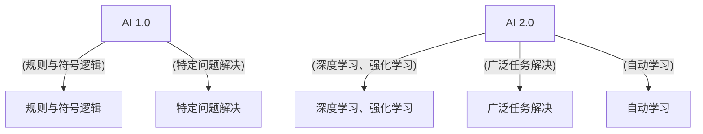

##### 1.1.2 AI 2.0 的发展历程

AI 2.0 的发展历程可以分为几个阶段。首先是深度学习的兴起，以 2006 年 Hinton 等人提出的深度信念网络（DBN）为标志。随后，卷积神经网络（CNN）和循环神经网络（RNN）等深度学习模型相继出现，推动了语音识别、图像识别等领域的突破。2012 年，AlexNet 在 ImageNet 挑战赛中取得优异成绩，标志着深度学习正式进入主流视野。

强化学习在 2015 年的 AlphaGo 战胜李世石的事件中引起了广泛关注。自监督学习在 2017 年实现的 ImageNet 轻量级模型（Inception-v3）中发挥了关键作用。这些技术进展共同推动了 AI 2.0 的发展。

**伪代码：**

```python
# 深度学习模型训练伪代码
def train_model(data, labels):
    # 初始化模型参数
    model = initialize_model()
    
    # 训练模型
    for epoch in range(num_epochs):
        for x, y in zip(data, labels):
            # 计算损失
            loss = compute_loss(model, x, y)
            
            # 更新模型参数
            update_model_params(model, loss)
            
    return model
```

#### 1.2 AI 2.0 时代的价值

##### 1.2.1 AI 2.0 对社会的影响

AI 2.0 对社会产生了深远的影响。首先，它改变了人们的日常生活，如智能语音助手、智能家居等。其次，AI 2.0 在医疗、教育、金融等领域的应用，提高了效率、降低了成本，提升了服务质量。此外，AI 2.0 还推动了智能交通、智能城市等新兴领域的发展，为社会的可持续发展提供了新思路。

**Mermaid 流程图：**

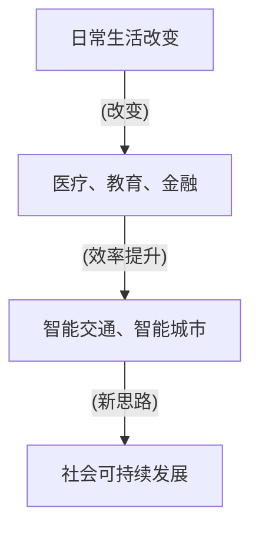

##### 1.2.2 AI 2.0 对经济的贡献

AI 2.0 对经济的贡献不可忽视。首先，它推动了产业升级和数字化转型，为企业创造了新的商业模式和增长点。其次，AI 2.0 促进了劳动力市场的转型，提高了劳动者的技能水平和就业机会。此外，AI 2.0 还推动了全球贸易和投资，为经济增长注入了新动力。

**Mermaid 流程图：**

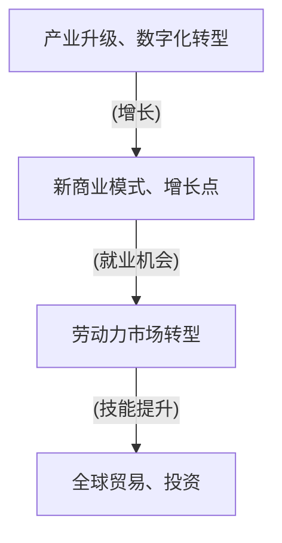

##### 1.2.3 AI 2.0 的伦理与法律问题

AI 2.0 的快速发展引发了诸多伦理与法律问题。首先，AI 的决策过程和算法透明度受到质疑，可能导致偏见和歧视。其次，AI 的隐私保护问题日益凸显，如何平衡隐私与数据利用成为挑战。此外，AI 的责任归属问题也亟待解决，如何在法律框架下明确责任主体成为关键。

**Mermaid 流程图：**

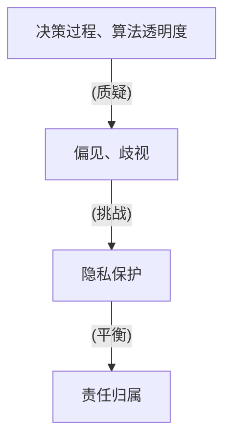

#### 1.3 全书结构概述

##### 1.3.1 核心内容与章节安排

本书共分为七部分，从引言到结语，系统地阐述了 AI 2.0 时代的价值。第一部分介绍了 AI 2.0 的定义与背景，分析了 AI 2.0 与传统 AI 的区别；第二部分探讨了 AI 2.0 的核心技术、应用场景和研究进展；第三部分关注 AI 2.0 的伦理与法律问题；第四部分介绍了 AI 2.0 的项目实践和开发工具与平台实战；第五部分讲述了 AI 2.0 的教育与人才培养；第六部分展望了 AI 2.0 时代的未来；第七部分进行了总结与展望。

**Mermaid 流程图：**

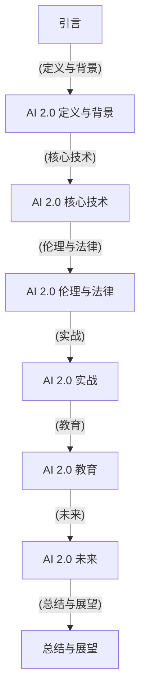

##### 1.3.2 读者预期收获

通过阅读本书，读者可以：

- 全面了解 AI 2.0 的定义、背景和发展历程；
- 深入理解 AI 2.0 的核心技术、应用场景和研究进展；
- 关注 AI 2.0 的伦理与法律问题，提高对相关问题的认识；
- 了解 AI 2.0 的项目实践和开发工具与平台实战；
- 掌握 AI 2.0 的教育与人才培养方法，为未来做好准备；
- 展望 AI 2.0 时代的未来，把握发展趋势和机遇。

**Mermaid 流程图：**

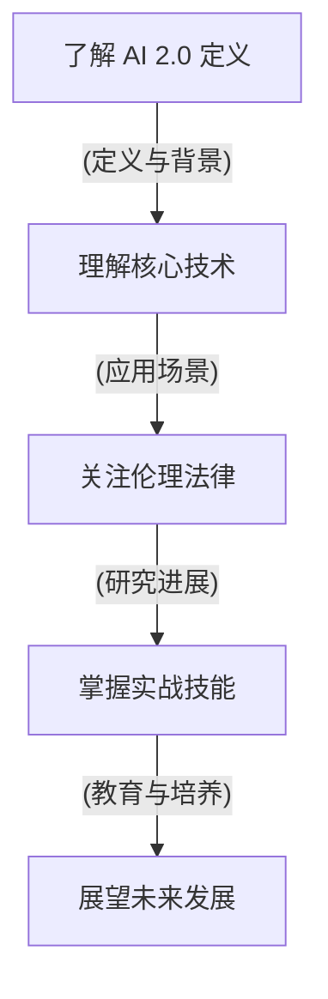

### 第二部分：AI 2.0 基础

#### 2.1 AI 2.0 的核心技术

##### 2.1.1 深度学习

深度学习是 AI 2.0 的核心技术之一，它通过模拟人脑的神经网络结构，对大量数据进行自动学习，实现图像识别、语音识别、自然语言处理等任务。

**Mermaid 流程图：**

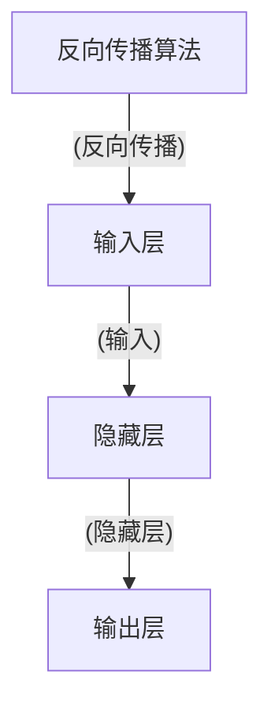

**伪代码：**

```python
# 深度学习模型训练伪代码
def train_model(data, labels):
    # 初始化模型参数
    model = initialize_model()
    
    # 训练模型
    for epoch in range(num_epochs):
        for x, y in zip(data, labels):
            # 前向传播
            output = forward_propagation(model, x)
            
            # 计算损失
            loss = compute_loss(output, y)
            
            # 反向传播
            backpropagation(model, loss)
            
    return model
```

##### 2.1.2 强化学习

强化学习是 AI 2.0 的另一核心技术，它通过试错和反馈，学习在不确定环境中实现目标。强化学习在游戏、机器人控制、自动驾驶等领域取得了显著成果。

**Mermaid 流程图：**

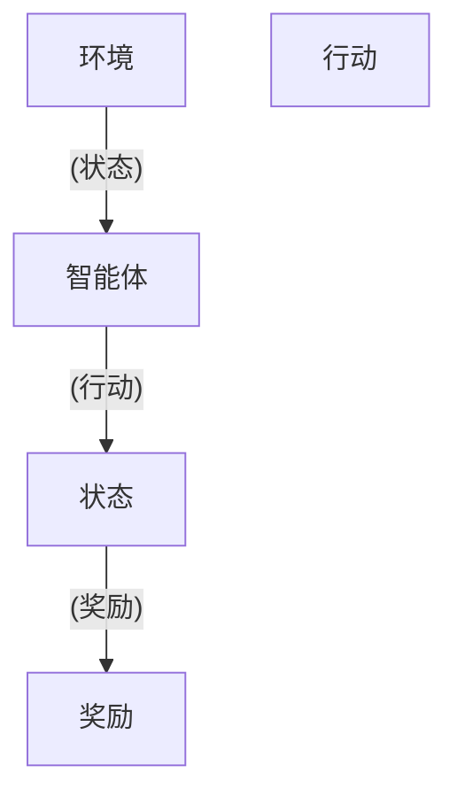

**伪代码：**

```python
# 强化学习模型训练伪代码
def train_model(environment, num_episodes):
    model = initialize_model()
    
    for episode in range(num_episodes):
        state = environment.reset()
        
        while not done:
            action = model.select_action(state)
            next_state, reward, done = environment.step(action)
            
            model.update_q_values(state, action, reward, next_state, done)
            
            state = next_state
            
    return model
```

##### 2.1.3 自监督学习

自监督学习是一种无需人工标注数据的学习方法，它通过利用数据内在的关联性，自动学习特征表示。自监督学习在图像识别、语音识别等领域发挥了重要作用。

**Mermaid 流程图：**

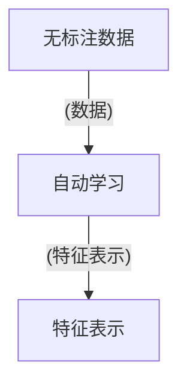

**伪代码：**

```python
# 自监督学习模型训练伪代码
def train_model(data):
    model = initialize_model()
    
    for epoch in range(num_epochs):
        for x in data:
            # 自动学习特征表示
            features = model.extract_features(x)
            
            # 更新模型参数
            update_model_params(model, features)
            
    return model
```

#### 2.2 AI 2.0 的应用场景

##### 2.2.1 语音识别

语音识别是 AI 2.0 的重要应用场景之一，它通过将语音信号转换为文本，实现人机交互。语音识别在智能助手、客服系统等领域具有广泛应用。

**Mermaid 流程图：**

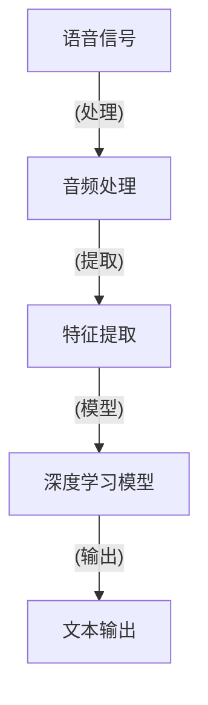

**伪代码：**

```python
# 语音识别模型训练伪代码
def train_model(data, labels):
    model = initialize_model()
    
    for epoch in range(num_epochs):
        for x, y in zip(data, labels):
            # 特征提取
            features = extract_features(x)
            
            # 前向传播
            output = forward_propagation(model, features)
            
            # 计算损失
            loss = compute_loss(output, y)
            
            # 反向传播
            backpropagation(model, loss)
            
    return model
```

##### 2.2.2 视觉感知

视觉感知是 AI 2.0 的另一重要应用场景，它通过处理图像数据，实现物体识别、场景理解等功能。视觉感知在自动驾驶、安防监控等领域具有广泛应用。

**Mermaid 流程图：**

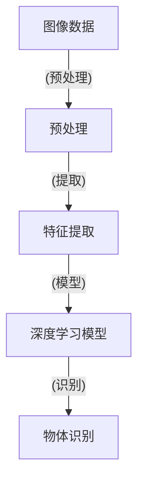

**伪代码：**

```python
# 视觉感知模型训练伪代码
def train_model(data, labels):
    model = initialize_model()
    
    for epoch in range(num_epochs):
        for x, y in zip(data, labels):
            # 特征提取
            features = extract_features(x)
            
            # 前向传播
            output = forward_propagation(model, features)
            
            # 计算损失
            loss = compute_loss(output, y)
            
            # 反向传播
            backpropagation(model, loss)
            
    return model
```

##### 2.2.3 自然语言处理

自然语言处理是 AI 2.0 的另一重要应用场景，它通过处理文本数据，实现语言理解、文本生成等功能。自然语言处理在智能客服、文本分类、机器翻译等领域具有广泛应用。

**Mermaid 流程图：**

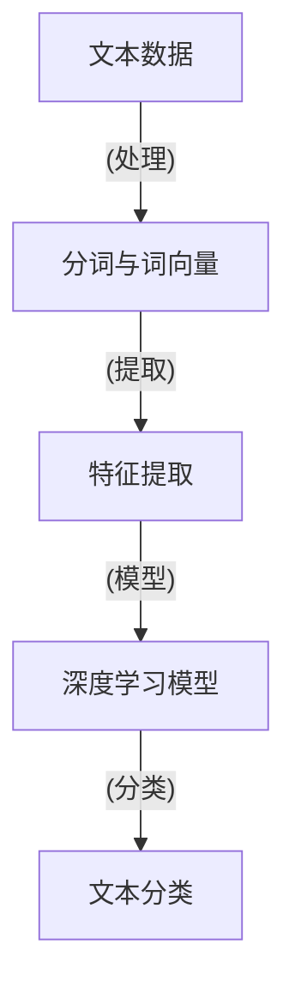

**伪代码：**

```python
# 自然语言处理模型训练伪代码
def train_model(data, labels):
    model = initialize_model()
    
    for epoch in range(num_epochs):
        for x, y in zip(data, labels):
            # 分词与词向量
            tokens = tokenize(x)
            word_vectors = vectorize(tokens)
            
            # 前向传播
            output = forward_propagation(model, word_vectors)
            
            # 计算损失
            loss = compute_loss(output, y)
            
            # 反向传播
            backpropagation(model, loss)
            
    return model
```

#### 2.3 AI 2.0 的工具与平台

##### 2.3.1 TensorFlow

TensorFlow 是由 Google 开发的一款开源深度学习框架，它具有高性能、灵活性等优点，广泛应用于各种深度学习任务。

**Mermaid 流程图：**

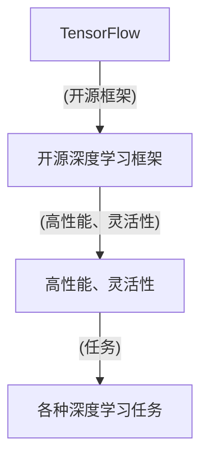

**伪代码：**

```python
import tensorflow as tf

# 构建深度学习模型
model = tf.keras.Sequential([
    tf.keras.layers.Dense(units=10, activation='relu', input_shape=(10,)),
    tf.keras.layers.Dense(units=1, activation='sigmoid')
])

# 编译模型
model.compile(optimizer='adam', loss='binary_crossentropy', metrics=['accuracy'])

# 训练模型
model.fit(x_train, y_train, epochs=10, batch_size=32)
```

##### 2.3.2 PyTorch

PyTorch 是由 Facebook AI 研究团队开发的一款开源深度学习框架，它具有动态计算图、易于使用等优点，广泛应用于各种深度学习任务。

**Mermaid 流程图：**

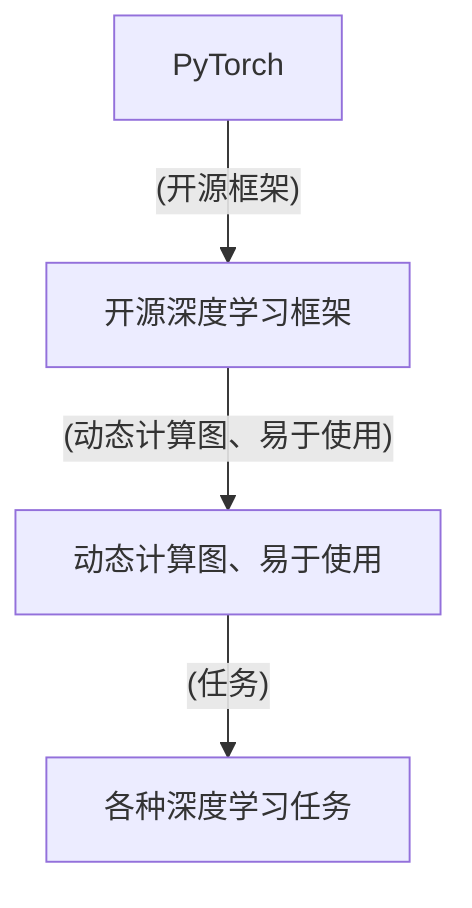

**伪代码：**

```python
import torch
import torch.nn as nn
import torch.optim as optim

# 构建深度学习模型
class Model(nn.Module):
    def __init__(self):
        super(Model, self).__init__()
        self.fc1 = nn.Linear(10, 10)
        self.fc2 = nn.Linear(10, 1)
        
    def forward(self, x):
        x = torch.relu(self.fc1(x))
        x = self.fc2(x)
        return x

model = Model()

# 编译模型
optimizer = optim.Adam(model.parameters(), lr=0.001)
criterion = nn.BCELoss()

# 训练模型
for epoch in range(10):
    for x, y in zip(x_train, y_train):
        model.zero_grad()
        output = model(x)
        loss = criterion(output, y)
        loss.backward()
        optimizer.step()
```

##### 2.3.3 AWS SageMaker

AWS SageMaker 是 Amazon Web Services 提供的一款全托管的机器学习平台，它集成了数据预处理、模型训练、部署等功能，方便用户快速构建和部署机器学习应用。

**Mermaid 流程图：**

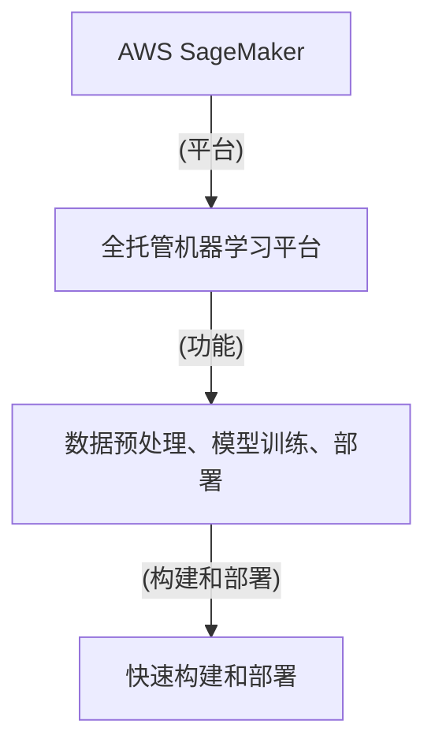

**伪代码：**

```python
import sagemaker
from sagemaker import get_session
from sagemaker.pytorch import PyTorch

# 配置 SageMaker 实例
sagemaker_session = get_session()

# 定义模型训练脚本
def train_model():
    # 构建深度学习模型
    model = PyTorch.build_model(
        model_data='s3://my-bucket/model.tar.gz',
        role='my-role',
        framework_version='1.5',
        entry_point='train.py'
    )
    
    # 训练模型
    model.fit('s3://my-bucket/train-data')
```

#### 2.4 AI 2.0 的研究进展与未来趋势

##### 2.4.1 AI 2.0 的最新研究进展

近年来，AI 2.0 在各个领域取得了显著的研究进展。在深度学习方面， researchers 提出了多种改进模型结构和训练方法的算法，如 Transformer、BERT 等。在强化学习方面，研究人员在解决连续控制、多任务学习等问题上取得了重要突破。在自然语言处理方面，基于 Transformer 的模型在机器翻译、文本生成等领域取得了优异的性能。

**Mermaid 流程图：**

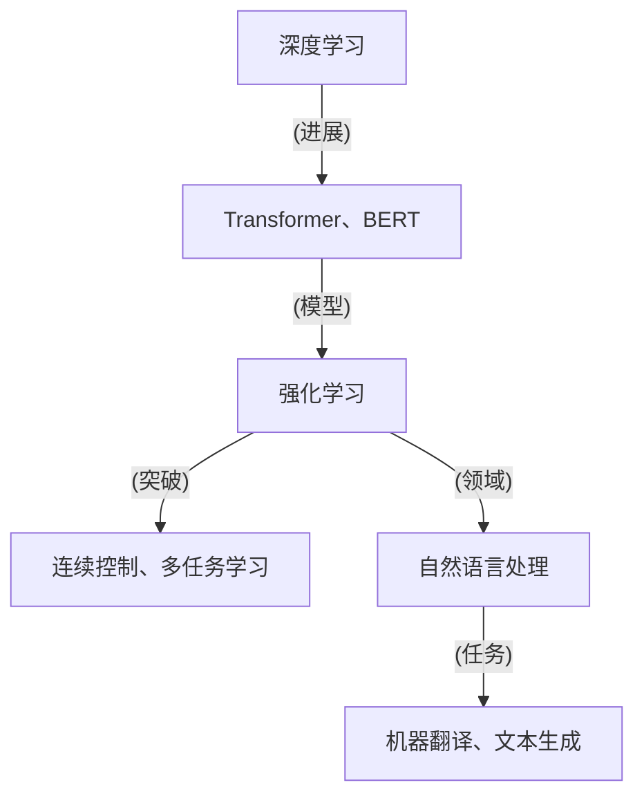

##### 2.4.2 AI 2.0 的未来发展趋势

展望未来，AI 2.0 将继续在各个领域取得突破。首先，在技术方面，研究人员将继续探索新的算法和模型结构，提高 AI 的性能和效率。其次，在应用方面，AI 2.0 将进一步渗透到各个行业，推动产业升级和数字化转型。此外，AI 2.0 还将面临诸多伦理和法律问题，如何解决这些问题将成为未来研究的重要方向。

**Mermaid 流程图：**

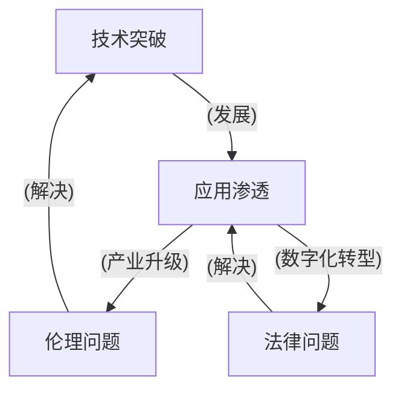

### 第三部分：AI 2.0 伦理与法律

#### 3.1 AI 2.0 伦理问题

##### 3.1.1 AI 2.0 对就业的影响

AI 2.0 的快速发展对就业市场产生了深远影响。一方面，AI 2.0 将取代一些重复性、低技能的工作，如制造业、物流等领域的工人。另一方面，AI 2.0 也创造了新的就业机会，如 AI 开发、数据标注等。因此，如何平衡就业机会的减少和创造，是 AI 2.0 伦理问题的重要议题。

**Mermaid 流程图：**

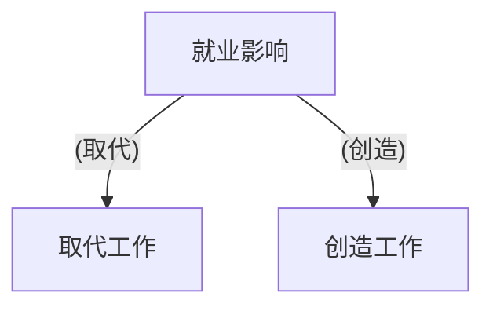

**伪代码：**

```python
# 分析就业影响伪代码
def analyze_employment_impact():
    # 获取就业数据
    employment_data = get_employment_data()
    
    # 分析就业趋势
    for industry, data in employment_data.items():
        if data['redundant_jobs'] > data['new_jobs']:
            print(f"{industry} 的就业机会减少")
        else:
            print(f"{industry} 的就业机会增加")
```

##### 3.1.2 AI 2.0 的隐私保护

AI 2.0 在处理大量数据时，可能涉及个人隐私信息的泄露。如何保护个人隐私，防止数据滥用，是 AI 2.0 伦理问题的重要方面。目前，各国政府和国际组织正在制定相关法律法规，加强对个人隐私的保护。

**Mermaid 流程图：**

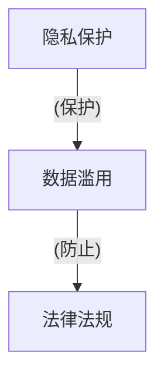

**伪代码：**

```python
# 保护个人隐私伪代码
def protect_personal_privacy(data):
    # 清洗敏感数据
    cleaned_data = clean_sensitive_data(data)
    
    # 加密数据
    encrypted_data = encrypt_data(cleaned_data)
    
    return encrypted_data
```

##### 3.1.3 AI 2.0 的偏见与歧视

AI 2.0 在训练过程中，可能受到训练数据偏差的影响，导致算法在决策过程中产生偏见和歧视。如何消除算法偏见，确保公平公正，是 AI 2.0 伦理问题的重要议题。

**Mermaid 流程图：**

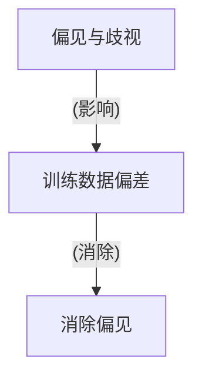

**伪代码：**

```python
# 消除偏见伪代码
def eliminate_bias(data):
    # 数据增强
    enhanced_data = enhance_data(data)
    
    # 消除偏见
    unbiased_data = remove_bias(enhanced_data)
    
    return unbiased_data
```

#### 3.2 AI 2.0 法律法规

##### 3.2.1 全球 AI 法律法规概述

近年来，各国政府和国际组织纷纷出台 AI 法律法规，以规范 AI 的发展和应用。以下是部分国家和国际组织的 AI 法律法规概述：

- **欧盟**：《通用数据保护条例》（GDPR）和《人工智能法案》；
- **美国**：《算法公平法案》和《联邦数据隐私保护法》；
- **中国**：《中华人民共和国数据安全法》和《人工智能发展行动计划》；
- **国际组织**：《人工智能伦理指南》和《国际人工智能立法原则》。

**Mermaid 流程图：**

```mermaid
graph TD
    A[欧盟]
    B[GDPR、人工智能法案]
    C[美国]
    D[算法公平法案、联邦数据隐私保护法]
    E[中国]
    F[数据安全法、人工智能发展行动计划]
    G[国际组织]
    H[人工智能伦理指南、国际人工智能立法原则]
    A--(法规)-->B
    C--(法规)-->D
    E--(法规)-->F
    G--(法规)-->H
```

##### 3.2.2 中国 AI 法律法规概述

中国高度重视 AI 的发展，相继出台了一系列 AI 法律法规。以下是部分重要法规的概述：

- **《中华人民共和国数据安全法》**：规范数据收集、存储、处理、传输等环节，保护数据安全；
- **《中华人民共和国网络安全法》**：规范网络运营者的行为，保障网络安全；
- **《人工智能发展行动计划》**：提出 AI 发展的目标、任务和措施；
- **《人工智能伦理规范》**：指导 AI 研发和应用过程中的伦理问题。

**Mermaid 流程图：**

```mermaid
graph TD
    A[数据安全法]
    B[网络安全法]
    C[人工智能发展行动计划]
    D[人工智能伦理规范]
    A--(数据安全)-->B
    B--(网络安全)-->C
    C--(发展计划)-->D
```

##### 3.2.3 国际 AI 法律法规概述

国际组织和国家纷纷出台 AI 法律法规，旨在推动 AI 的健康发展。以下是部分重要法规的概述：

- **欧盟**：《通用数据保护条例》（GDPR）和《人工智能法案》；
- **美国**：《算法公平法案》和《联邦数据隐私保护法》；
- **中国**：《中华人民共和国数据安全法》和《人工智能发展行动计划》；
- **国际组织**：《人工智能伦理指南》和《国际人工智能立法原则》。

**Mermaid 流�程图：**

```mermaid
graph TD
    A[欧盟]
    B[GDPR、人工智能法案]
    C[美国]
    D[算法公平法案、联邦数据隐私保护法]
    E[中国]
    F[数据安全法、人工智能发展行动计划]
    G[国际组织]
    H[人工智能伦理指南、国际人工智能立法原则]
    A--(法规)-->B
    C--(法规)-->D
    E--(法规)-->F
    G--(法规)-->H
```

#### 3.3 AI 2.0 伦理与法律的实践

##### 3.3.1 AI 伦理委员会的作用

AI 伦理委员会是负责制定和监督 AI 研发和应用过程中的伦理规范的机构。其主要职责包括：

- 制定 AI 伦理规范，指导 AI 研发和应用；
- 审核 AI 项目，确保项目符合伦理标准；
- 处理 AI 相关的伦理争议，提供解决方案。

**Mermaid 流程图：**

```mermaid
graph TD
    A[AI 伦理委员会]
    B[制定伦理规范]
    C[审核项目]
    D[处理争议]
    A--(职责)-->B
    B--(指导)-->C
    C--(审核)-->D
```

**伪代码：**

```python
# AI 伦理委员会职责伪代码
class AI_EthicsCommittee:
    def __init__(self):
        self.ethics_norms = []
        self.projects = []
        
    def establish_ethics_norms(self, norms):
        self.ethics_norms.append(norms)
        
    def audit_project(self, project):
        for norm in self.ethics_norms:
            if not project_adheres_to_norm(project, norm):
                return False
        return True
    
    def handle_disputes(self, dispute):
        solution = find_solution(dispute)
        return solution
```

##### 3.3.2 AI 法律法规的实施

AI 法律法规的实施是确保 AI 研发和应用符合法律规范的关键环节。以下是一些建议：

- **建立 AI 法律法规执行机构**：负责监督和执行 AI 法律法规；
- **加强法律法规宣传**：提高公众对 AI 法律法规的认识和遵守；
- **完善法律法规体系**：根据实际情况，不断修订和完善 AI 法律法规。

**Mermaid 流程图：**

```mermaid
graph TD
    A[执行机构]
    B[监督执行]
    C[宣传普及]
    D[完善法规]
    A--(职责)-->B
    B--(宣传)-->C
    C--(普及)-->D
```

**伪代码：**

```python
# AI 法律法规实施伪代码
class AI_LegalRegulationExecutor:
    def __init__(self):
        self.execution_agency = []
        self.public_awareness = []
        
    def establish_execution_agency(self, agency):
        self.execution_agency.append(agency)
        
    def promote_legislation(self):
        for agency in self.execution_agency:
            agency.promote_legislation()
            
    def improve_legislation(self):
        # 根据实际情况修订和完善法律法规
        pass
```

##### 3.3.3 企业在 AI 伦理与法律方面的实践

企业在 AI 研发和应用过程中，应积极履行社会责任，遵守 AI 伦理与法律规范。以下是一些建议：

- **制定 AI 伦理与法律政策**：明确企业在 AI 研发和应用过程中的伦理与法律要求；
- **建立 AI 伦理审查机制**：对 AI 项目进行伦理审查，确保项目符合伦理标准；
- **加强员工培训**：提高员工对 AI 伦理与法律的认识和遵守。

**Mermaid 流程图：**

```mermaid
graph TD
    A[AI 伦理与法律政策]
    B[伦理审查机制]
    C[员工培训]
    A--(政策)-->B
    B--(审查)-->C
```

**伪代码：**

```python
# 企业 AI 伦理与法律实践伪代码
class AI_Enterprise:
    def __init__(self):
        self.ethics_policy = []
        self.ethics_review_mechanism = []
        self.employee_training = []
        
    def establish_ethics_policy(self, policy):
        self.ethics_policy.append(policy)
        
    def establish_ethics_review_mechanism(self, mechanism):
        self.ethics_review_mechanism.append(mechanism)
        
    def provide_employee_training(self, training):
        self.employee_training.append(training)
```

### 第四部分：AI 2.0 实战

#### 4.1 AI 2.0 项目实践

##### 4.1.1 人工智能助手项目

人工智能助手项目是一种基于自然语言处理和机器学习技术的应用。通过语音识别、语义理解和语音合成等技术，实现人与机器的智能对话。以下是项目实施的关键步骤：

1. **需求分析**：明确项目目标、功能需求、性能指标等。
2. **数据收集**：收集语音数据、文本数据等，用于模型训练。
3. **模型训练**：使用深度学习算法训练语音识别模型、语义理解模型等。
4. **系统集成**：将模型集成到语音助手系统中，实现语音交互功能。
5. **测试与优化**：对系统进行测试，优化模型和系统性能。

**Mermaid 流程图：**

```mermaid
graph TD
    A[需求分析]
    B[数据收集]
    C[模型训练]
    D[系统集成]
    E[测试与优化]
    A--(步骤)-->B
    B--(数据)-->C
    C--(模型)-->D
    D--(集成)-->E
```

**伪代码：**

```python
# 人工智能助手项目伪代码
def ai_assistant_project():
    # 需求分析
    requirements = analyze_requirements()
    
    # 数据收集
    data = collect_data()
    
    # 模型训练
    model = train_model(data)
    
    # 系统集成
    system = integrate_model(model)
    
    # 测试与优化
    optimize_system(system)
    
    return system
```

##### 4.1.2 智能推荐系统项目

智能推荐系统项目是一种基于深度学习、协同过滤等技术，为用户推荐感兴趣的内容或产品。以下是项目实施的关键步骤：

1. **数据收集**：收集用户行为数据、内容数据等，用于模型训练。
2. **特征工程**：提取用户和内容的特征，为模型提供输入。
3. **模型训练**：使用深度学习算法训练推荐模型。
4. **系统部署**：将模型部署到线上环境，实现实时推荐功能。
5. **评估与优化**：对系统进行评估，优化模型和系统性能。

**Mermaid 流程图：**

```mermaid
graph TD
    A[数据收集]
    B[特征工程]
    C[模型训练]
    D[系统部署]
    E[评估与优化]
    A--(步骤)-->B
    B--(特征)-->C
    C--(模型)-->D
    D--(部署)-->E
```

**伪代码：**

```python
# 智能推荐系统项目伪代码
def recommendation_system_project():
    # 数据收集
    data = collect_data()
    
    # 特征工程
    features = extract_features(data)
    
    # 模型训练
    model = train_model(features)
    
    # 系统部署
    system = deploy_model(model)
    
    # 评估与优化
    optimize_system(system)
    
    return system
```

##### 4.1.3 无人驾驶汽车项目

无人驾驶汽车项目是一种基于计算机视觉、深度学习、传感器融合等技术，实现自动驾驶功能。以下是项目实施的关键步骤：

1. **硬件集成**：集成摄像头、激光雷达、GPS 等传感器，实现数据采集。
2. **数据收集**：收集大量真实场景数据，用于模型训练。
3. **模型训练**：使用深度学习算法训练自动驾驶模型。
4. **系统集成**：将模型集成到无人驾驶系统中，实现自动驾驶功能。
5. **测试与优化**：对系统进行测试，优化模型和系统性能。

**Mermaid 流程图：**

```mermaid
graph TD
    A[硬件集成]
    B[数据收集]
    C[模型训练]
    D[系统集成]
    E[测试与优化]
    A--(步骤)-->B
    B--(数据)-->C
    C--(模型)-->D
    D--(集成)-->E
```

**伪代码：**

```python
# 无人驾驶汽车项目伪代码
def autonomous_car_project():
    # 硬件集成
    sensors = integrate_hardware()
    
    # 数据收集
    data = collect_data(sensors)
    
    # 模型训练
    model = train_model(data)
    
    # 系统集成
    system = integrate_model(model)
    
    # 测试与优化
    optimize_system(system)
    
    return system
```

#### 4.2 AI 2.0 开发工具与平台实战

##### 4.2.1 TensorFlow 实战

TensorFlow 是一种流行的开源深度学习框架，广泛用于各种深度学习任务。以下是使用 TensorFlow 实战的一个示例：

1. **环境搭建**：安装 TensorFlow 和相关依赖。
2. **数据准备**：加载和预处理数据。
3. **模型构建**：构建深度学习模型。
4. **模型训练**：训练深度学习模型。
5. **模型评估**：评估模型性能。
6. **模型部署**：部署模型到生产环境。

**Mermaid 流程图：**

```mermaid
graph TD
    A[环境搭建]
    B[数据准备]
    C[模型构建]
    D[模型训练]
    E[模型评估]
    F[模型部署]
    A--(步骤)-->B
    B--(数据)-->C
    C--(模型)-->D
    D--(训练)-->E
    E--(评估)-->F
```

**伪代码：**

```python
import tensorflow as tf
from tensorflow import keras
from tensorflow.keras import layers

# 环境搭建
tf.keras.backend.clear_session()
tf.random.set_seed(42)

# 数据准备
(x_train, y_train), (x_test, y_test) = keras.datasets.mnist.load_data()
x_train = x_train.astype("float32") / 255
x_test = x_test.astype("float32") / 255

# 模型构建
model = keras.Sequential([
    layers.Flatten(input_shape=(28, 28)),
    layers.Dense(128, activation="relu"),
    layers.Dense(10, activation="softmax")
])

# 模型训练
model.compile(optimizer="adam", loss="sparse_categorical_crossentropy", metrics=["accuracy"])
model.fit(x_train, y_train, epochs=5)

# 模型评估
model.evaluate(x_test, y_test, verbose=2)

# 模型部署
model.save("mnist_model.h5")
```

##### 4.2.2 PyTorch 实战

PyTorch 是另一种流行的开源深度学习框架，以其动态计算图和易于使用而著称。以下是使用 PyTorch 实战的一个示例：

1. **环境搭建**：安装 PyTorch 和相关依赖。
2. **数据准备**：加载和预处理数据。
3. **模型构建**：构建深度学习模型。
4. **模型训练**：训练深度学习模型。
5. **模型评估**：评估模型性能。
6. **模型部署**：部署模型到生产环境。

**Mermaid 流程图：**

```mermaid
graph TD
    A[环境搭建]
    B[数据准备]
    C[模型构建]
    D[模型训练]
    E[模型评估]
    F[模型部署]
    A--(步骤)-->B
    B--(数据)-->C
    C--(模型)-->D
    D--(训练)-->E
    E--(评估)-->F
```

**伪代码：**

```python
import torch
import torchvision
import torchvision.transforms as transforms
import torch.nn as nn
import torch.optim as optim

# 环境搭建
device = torch.device("cuda" if torch.cuda.is_available() else "cpu")
torch.manual_seed(42)

# 数据准备
transform = transforms.Compose([
    transforms.ToTensor(),
    transforms.Normalize((0.5,), (0.5,))
])
trainset = torchvision.datasets.MNIST(root='./data', train=True, download=True, transform=transform)
trainloader = torch.utils.data.DataLoader(trainset, batch_size=100, shuffle=True, num_workers=2)
testset = torchvision.datasets.MNIST(root='./data', train=False, download=True, transform=transform)
testloader = torch.utils.data.DataLoader(testset, batch_size=100, shuffle=False, num_workers=2)

# 模型构建
class Net(nn.Module):
    def __init__(self):
        super(Net, self).__init__()
        self.fc1 = nn.Linear(28 * 28, 128)
        self.fc2 = nn.Linear(128, 64)
        self.fc3 = nn.Linear(64, 10)

    def forward(self, x):
        x = x.view(-1, 28 * 28)
        x = torch.relu(self.fc1(x))
        x = torch.relu(self.fc2(x))
        x = self.fc3(x)
        return x

net = Net().to(device)
criterion = nn.CrossEntropyLoss()
optimizer = optim.SGD(net.parameters(), lr=0.001, momentum=0.9)

# 模型训练
for epoch in range(10):
    running_loss = 0.0
    for i, data in enumerate(trainloader, 0):
        inputs, labels = data
        inputs, labels = inputs.to(device), labels.to(device)
        optimizer.zero_grad()
        outputs = net(inputs)
        loss = criterion(outputs, labels)
        loss.backward()
        optimizer.step()
        running_loss += loss.item()
    print(f"Epoch {epoch + 1}, Loss: {running_loss / len(trainloader)}")

# 模型评估
correct = 0
total = 0
with torch.no_grad():
    for data in testloader:
        images, labels = data
        images, labels = images.to(device), labels.to(device)
        outputs = net(images)
        _, predicted = torch.max(outputs.data, 1)
        total += labels.size(0)
        correct += (predicted == labels).sum().item()

print(f"准确率: {100 * correct / total}%")

# 模型部署
# torch.save(net.state_dict(), "mnist_model.pth")
```

##### 4.2.3 AWS SageMaker 实战

AWS SageMaker 是 Amazon Web Services 提供的一种全托管机器学习平台，支持多种机器学习框架，如 TensorFlow、PyTorch 等。以下是使用 AWS SageMaker 实战的一个示例：

1. **环境搭建**：在 AWS SageMaker 中创建笔记本实例。
2. **数据准备**：上传和加载数据。
3. **模型构建**：使用 TensorFlow 或 PyTorch 构建模型。
4. **模型训练**：在 AWS SageMaker 中训练模型。
5. **模型评估**：评估模型性能。
6. **模型部署**：将模型部署到 AWS SageMaker。

**Mermaid 流程图：**

```mermaid
graph TD
    A[环境搭建]
    B[数据准备]
    C[模型构建]
    D[模型训练]
    E[模型评估]
    F[模型部署]
    A--(步骤)-->B
    B--(数据)-->C
    C--(模型)-->D
    D--(训练)-->E
    E--(评估)-->F
```

**伪代码：**

```python
import boto3
import sagemaker
from sagemaker.pytorch import PyTorch

# 环境搭建
sagemaker_session = sagemaker.Session()

# 数据准备
bucket = 'your-bucket-name'
prefix = 'your-data-prefix'
s3_input = sagemaker.session.s3_input(s3_uri=f's3://{bucket}/{prefix}/', content_type='text/csv', s3_data_type='S3Prefix')

# 模型构建
estimator = PyTorch(entry_point='train.py',
                    source_dir='s3://{bucket}/{prefix}/',
                    instance_type='ml.p3.2xlarge',
                    instance_count=1,
                    hyperparameters={
                        'epochs': 5,
                        'batch_size': 128
                    })

# 模型训练
estimator.fit(s3_input)

# 模型评估
model = estimator.model
model.evaluate(s3_input)

# 模型部署
predictor = model.deploy(initial_instance_count=1, instance_type='ml.p3.2xlarge')

# 预测
predictions = predictor.predict(data=input_data)
```

#### 4.3 AI 2.0 应用案例分析

##### 4.3.1 企业级应用案例分析

企业级应用案例分析展示了 AI 2.0 技术在商业环境中的应用。以下是几个典型案例：

1. **智能客服系统**：某大型电商平台采用 AI 2.0 技术开发智能客服系统，通过自然语言处理和机器学习算法，实现自动化客服，提高客户满意度。
2. **供应链优化**：某制造企业利用 AI 2.0 技术优化供应链管理，通过预测分析、优化算法等手段，降低库存成本、提高生产效率。
3. **风险管理**：某金融机构引入 AI 2.0 技术进行风险管理，通过大数据分析和机器学习算法，识别潜在风险，降低损失。

**Mermaid 流程图：**

```mermaid
graph TD
    A[智能客服系统]
    B[供应链优化]
    C[风险管理]
    A--(应用)-->D
    B--(应用)-->D
    C--(应用)-->D
```

##### 4.3.2 政府部门应用案例分析

政府部门应用案例分析展示了 AI 2.0 技术在公共管理和服务中的应用。以下是几个典型案例：

1. **智能交通管理**：某市政府引入 AI 2.0 技术进行智能交通管理，通过实时数据分析、交通流量预测等手段，提高交通效率、减少拥堵。
2. **公共卫生监测**：某卫生部门利用 AI 2.0 技术进行公共卫生监测，通过大数据分析和机器学习算法，实时监测疫情发展，为公共卫生决策提供支持。
3. **社会保障服务**：某社会保障机构采用 AI 2.0 技术优化社会保障服务，通过自然语言处理和知识图谱等技术，提高服务效率、减少人工干预。

**Mermaid 流程图：**

```mermaid
graph TD
    A[智能交通管理]
    B[公共卫生监测]
    C[社会保障服务]
    A--(应用)-->D
    B--(应用)-->D
    C--(应用)-->D
```

##### 4.3.3 教育行业应用案例分析

教育行业应用案例分析展示了 AI 2.0 技术在教育领域的应用。以下是几个典型案例：

1. **在线教育平台**：某在线教育平台利用 AI 2.0 技术优化学习体验，通过自适应学习、智能推荐等技术，提高学习效果。
2. **智能教育管理**：某学校采用 AI 2.0 技术进行智能教育管理，通过数据分析、机器学习算法等手段，优化教学资源配置、提高教育质量。
3. **职业培训**：某职业培训机构引入 AI 2.0 技术进行职业培训，通过虚拟现实、增强现实等技术，提供沉浸式学习体验。

**Mermaid 流程图：**

```mermaid
graph TD
    A[在线教育平台]
    B[智能教育管理]
    C[职业培训]
    A--(应用)-->D
    B--(应用)-->D
    C--(应用)-->D
```

### 第五部分：AI 2.0 教育与人才培养

#### 5.1 AI 2.0 教育体系

##### 5.1.1 从基础教育到高等教育的 AI 教育

AI 2.0 教育体系应涵盖从基础教育到高等教育各个阶段。在基础教育阶段，应培养学生对 AI 基础知识的了解和兴趣，如计算机编程、数据结构等。在高等教育阶段，应加强 AI 专业课程设置，培养学生掌握 AI 核心技术和应用能力。

**Mermaid 流程图：**

```mermaid
graph TD
    A[基础教育]
    B[计算机编程]
    C[数据结构]
    D[高等教育]
    E[AI 专业课程]
    A--(知识)-->B
    A--(知识)-->C
    D--(课程)-->E
```

**伪代码：**

```python
# 教育体系课程设置伪代码
def set_education_courses(education_stage):
    if education_stage == '基础':
        courses = ['计算机编程', '数据结构']
    elif education_stage == '高等':
        courses = ['AI 专业课程', '深度学习', '强化学习']
    return courses
```

##### 5.1.2 跨学科教育的重要性

跨学科教育在 AI 2.0 教育体系中具有重要地位。AI 技术涉及多个学科领域，如计算机科学、数学、统计学、心理学等。跨学科教育有助于培养学生综合运用多种知识解决问题的能力。

**Mermaid 流程图：**

```mermaid
graph TD
    A[计算机科学]
    B[数学]
    C[统计学]
    D[心理学]
    E[跨学科教育]
    A--(知识)-->E
    B--(知识)-->E
    C--(知识)-->E
    D--(知识)-->E
```

**伪代码：**

```python
# 跨学科教育伪代码
def interdisciplinary_education(knowledge_areas):
    for area in knowledge_areas:
        if area == '计算机科学':
            print('学习计算机科学相关课程')
        elif area == '数学':
            print('学习数学相关课程')
        elif area == '统计学':
            print('学习统计学相关课程')
        elif area == '心理学':
            print('学习心理学相关课程')
```

##### 5.1.3 AI 教育的未来趋势

AI 教育的未来趋势将体现在以下几个方面：

1. **个性化教育**：利用 AI 技术为学生提供个性化的学习体验，满足不同学生的学习需求。
2. **智能化教学**：利用 AI 技术实现自动化教学、智能评价等功能，提高教育质量。
3. **跨界融合**：加强 AI 与其他学科的融合，培养具有跨学科能力的创新人才。

**Mermaid 流程图：**

```mermaid
graph TD
    A[个性化教育]
    B[智能化教学]
    C[跨界融合]
    D[未来趋势]
    A--(趋势)-->D
    B--(趋势)-->D
    C--(趋势)-->D
```

**伪代码：**

```python
# AI 教育未来趋势伪代码
def ai_education_trends():
    print('个性化教育：利用 AI 技术为学生提供个性化的学习体验')
    print('智能化教学：利用 AI 技术实现自动化教学、智能评价等功能')
    print('跨界融合：加强 AI 与其他学科的融合，培养具有跨学科能力的创新人才')
```

#### 5.2 AI 2.0 人才培养

##### 5.2.1 AI 人才需求与供给分析

AI 2.0 时代的到来，对 AI 人才的需求日益增长。从供给角度看，AI 人才的培养需要从基础教育、高等教育、职业培训等多方面入手。

**Mermaid 流程图：**

```mermaid
graph TD
    A[AI 人才需求]
    B[AI 人才培养]
    C[基础教育]
    D[高等教育]
    E[职业培训]
    A--(需求)-->B
    B--(培养)-->C
    B--(培养)-->D
    B--(培养)-->E
```

**伪代码：**

```python
# AI 人才需求与供给分析伪代码
def ai_talent_analyze():
    print('AI 人才需求：随着 AI 技术的快速发展，对 AI 人才的需求日益增长')
    print('AI 人才培养：从基础教育、高等教育、职业培训等多方面入手，培养 AI 人才')
```

##### 5.2.2 AI 人才培养模式

AI 人才培养模式应注重理论与实践相结合，培养具备实际应用能力的创新人才。以下是几种常见的 AI 人才培养模式：

1. **产学研合作**：高校与企业合作，共同培养 AI 人才，实现产学研一体化。
2. **项目驱动**：以实际项目为驱动，培养学生在项目中解决实际问题的能力。
3. **在线教育**：利用在线教育平台，提供灵活、便捷的 AI 教育资源。

**Mermaid 流程图：**

```mermaid
graph TD
    A[产学研合作]
    B[项目驱动]
    C[在线教育]
    D[人才培养模式]
    A--(模式)-->D
    B--(模式)-->D
    C--(模式)-->D
```

**伪代码：**

```python
# AI 人才培养模式伪代码
def ai_talent_training_modes():
    print('产学研合作：高校与企业合作，共同培养 AI 人才')
    print('项目驱动：以实际项目为驱动，培养学生在项目中解决实际问题的能力')
    print('在线教育：利用在线教育平台，提供灵活、便捷的 AI 教育资源')
```

##### 5.2.3 AI 人才职业发展路径

AI 人才职业发展路径包括以下几个方面：

1. **技术专家**：专注于 AI 技术的研究和开发，如深度学习、强化学习等。
2. **数据科学家**：负责数据分析和处理，挖掘数据价值，为决策提供支持。
3. **产品经理**：负责 AI 产品的规划、设计和管理，推动产品从研发到市场。
4. **企业高管**：在 AI 领域积累经验，担任企业高管，推动企业创新发展。

**Mermaid 流程图：**

```mermaid
graph TD
    A[技术专家]
    B[数据科学家]
    C[产品经理]
    D[企业高管]
    E[职业发展路径]
    A--(路径)-->E
    B--(路径)-->E
    C--(路径)-->E
    D--(路径)-->E
```

**伪代码：**

```python
# AI 人才职业发展路径伪代码
def ai_talent_career_path():
    print('技术专家：专注于 AI 技术的研究和开发')
    print('数据科学家：负责数据分析和处理，挖掘数据价值')
    print('产品经理：负责 AI 产品的规划、设计和管理')
    print('企业高管：在 AI 领域积累经验，担任企业高管')
```

#### 5.3 AI 2.0 教育实践

##### 5.3.1 学校教育实践案例

学校教育实践案例展示了 AI 2.0 技术在校园教育中的应用。以下是几个典型案例：

1. **编程教育**：某中学开设编程课程，培养学生掌握 Python 编程语言，激发学生对计算机科学的兴趣。
2. **智能教室**：某小学引入智能教室系统，通过物联网技术实现课堂自动化管理，提高教学效率。
3. **虚拟实验室**：某大学建立虚拟实验室，学生可以在线进行实验操作，提高实验教学的灵活性和安全性。

**Mermaid 流程图：**

```mermaid
graph TD
    A[编程教育]
    B[智能教室]
    C[虚拟实验室]
    D[学校教育实践]
    A--(实践)-->D
    B--(实践)-->D
    C--(实践)-->D
```

##### 5.3.2 企业培训实践案例

企业培训实践案例展示了 AI 2.0 技术在企业培训中的应用。以下是几个典型案例：

1. **在线培训平台**：某企业建立在线培训平台，提供 AI 技术培训课程，方便员工随时学习。
2. **实践项目**：某互联网公司开展 AI 实践项目，让员工在实际项目中锻炼技能，提高团队协作能力。
3. **外部合作**：某金融机构与高校合作，开展 AI 技术培训项目，为员工提供优质的培训资源。

**Mermaid 流程图：**

```mermaid
graph TD
    A[在线培训平台]
    B[实践项目]
    C[外部合作]
    D[企业培训实践]
    A--(实践)-->D
    B--(实践)-->D
    C--(实践)-->D
```

##### 5.3.3 社会教育实践案例

社会教育实践案例展示了 AI 2.0 技术在社会教育中的应用。以下是几个典型案例：

1. **社区教育**：某社区开展 AI 技术培训课程，提高社区居民的科技素养。
2. **公益项目**：某公益组织开展 AI 技术公益项目，为贫困地区的孩子们提供 AI 教育资源。
3. **科普活动**：某科技公司举办 AI 技术科普活动，向公众普及 AI 知识，提高公众对 AI 技术的认识。

**Mermaid 流程图：**

```mermaid
graph TD
    A[社区教育]
    B[公益项目]
    C[科普活动]
    D[社会教育实践]
    A--(实践)-->D
    B--(实践)-->D
    C--(实践)-->D
```

### 第六部分：AI 2.0 时代的未来

#### 6.1 AI 2.0 时代的展望

##### 6.1.1 AI 2.0 对未来的影响

AI 2.0 时代的到来，将对人类社会产生深远影响。以下是从技术、经济、社会等多个方面展望 AI 2.0 未来的影响：

1. **技术方面**：AI 2.0 将推动深度学习、强化学习、自然语言处理等技术的发展，实现更高效、更智能的人工智能应用。
2. **经济方面**：AI 2.0 将推动产业升级、数字化转型，提高生产效率、降低成本，促进经济增长。
3. **社会方面**：AI 2.0 将改变人们的生活方式，提高生活质量，但同时也可能引发就业、隐私等方面的挑战。

**Mermaid 流程图：**

```mermaid
graph TD
    A[技术方面]
    B[经济方面]
    C[社会方面]
    D[影响]
    A--(影响)-->D
    B--(影响)-->D
    C--(影响)-->D
```

##### 6.1.2 AI 2.0 时代的社会变革

AI 2.0 时代的到来，将引发一系列社会变革。以下是从就业、教育、文化等多个方面展望 AI 2.0 时代的社会变革：

1. **就业**：AI 2.0 将取代一些重复性、低技能的工作，但同时也创造了新的就业机会，如 AI 研发、数据标注等。
2. **教育**：AI 2.0 将改变教育方式，实现个性化教育、智能化教学，提高教育质量。
3. **文化**：AI 2.0 将推动文化创新，如虚拟现实、增强现实等技术的应用，为文化产业发展提供新动力。

**Mermaid 流程图：**

```mermaid
graph TD
    A[就业]
    B[教育]
    C[文化]
    D[社会变革]
    A--(变革)-->D
    B--(变革)-->D
    C--(变革)-->D
```

##### 6.1.3 AI 2.0 时代的科技创新

AI 2.0 时代的到来，将推动科技创新，带来新的技术突破。以下是从人工智能、物联网、生物技术等多个方面展望 AI 2.0 时代的科技创新：

1. **人工智能**：AI 2.0 将推动深度学习、强化学习、自然语言处理等技术的发展，实现更高效、更智能的人工智能应用。
2. **物联网**：AI 2.0 将推动物联网技术的普及，实现智能家居、智能交通等领域的智能化发展。
3. **生物技术**：AI 2.0 将推动生物技术的创新，如基因编辑、药物研发等。

**Mermaid 流程图：**

```mermaid
graph TD
    A[人工智能]
    B[物联网]
    C[生物技术]
    D[科技创新]
    A--(创新)-->D
    B--(创新)-->D
    C--(创新)-->D
```

#### 6.2 AI 2.0 时代的挑战

##### 6.2.1 技术挑战

AI 2.0 时代的到来，将面临一系列技术挑战。以下是从算法、数据、计算力等多个方面分析 AI 2.0 时代的技术挑战：

1. **算法**：AI 2.0 需要更高性能、更智能的算法，以应对复杂任务和大规模数据处理。
2. **数据**：AI 2.0 需要更多高质量、多样化、真实世界的数据，以保证模型的准确性和鲁棒性。
3. **计算力**：AI 2.0 需要更强的计算能力，以满足大规模模型训练和实时推理的需求。

**Mermaid 流程图：**

```mermaid
graph TD
    A[算法]
    B[数据]
    C[计算力]
    D[技术挑战]
    A--(挑战)-->D
    B--(挑战)-->D
    C--(挑战)-->D
```

##### 6.2.2 社会挑战

AI 2.0 时代的到来，将引发一系列社会挑战。以下是从就业、隐私、伦理等多个方面分析 AI 2.0 时代的社会挑战：

1. **就业**：AI 2.0 可能导致一些传统行业的工作岗位减少，引发就业压力。
2. **隐私**：AI 2.0 在处理大量数据时，可能涉及个人隐私信息的泄露，需要加强隐私保护。
3. **伦理**：AI 2.0 的决策过程和算法透明度受到质疑，可能引发伦理问题。

**Mermaid 流程图：**

```mermaid
graph TD
    A[就业]
    B[隐私]
    C[伦理]
    D[社会挑战]
    A--(挑战)-->D
    B--(挑战)-->D
    C--(挑战)-->D
```

##### 6.2.3 法律挑战

AI 2.0 时代的到来，将面临一系列法律挑战。以下是从责任归属、监管、法律框架等多个方面分析 AI 2.0 时代的法律挑战：

1. **责任归属**：在 AI 系统出现问题时，如何确定责任归属，需要明确法律规定。
2. **监管**：如何对 AI 技术进行有效监管，防止滥用和不当使用，是法律面临的挑战。
3. **法律框架**：如何制定适应 AI 时代的法律法规，保障社会公平正义。

**Mermaid 流程图：**

```mermaid
graph TD
    A[责任归属]
    B[监管]
    C[法律框架]
    D[法律挑战]
    A--(挑战)-->D
    B--(挑战)-->D
    C--(挑战)-->D
```

#### 6.3 AI 2.0 时代的机遇

##### 6.3.1 创新机遇

AI 2.0 时代的到来，将带来一系列创新机遇。以下是从技术、产业、社会等多个方面分析 AI 2.0 时代的创新机遇：

1. **技术**：AI 2.0 将推动深度学习、强化学习、自然语言处理等技术的发展，为技术创新提供新动力。
2. **产业**：AI 2.0 将推动产业升级、数字化转型，为产业创新提供新机遇。
3. **社会**：AI 2.0 将改变人们的生活方式，提高生活质量，为社会创新提供新思路。

**Mermaid 流程图：**

```mermaid
graph TD
    A[技术]
    B[产业]
    C[社会]
    D[创新机遇]
    A--(机遇)-->D
    B--(机遇)-->D
    C--(机遇)-->D
```

##### 6.3.2 经济机遇

AI 2.0 时代的到来，将带来一系列经济机遇。以下是从产业、投资、就业等多个方面分析 AI 2.0 时代的经济机遇：

1. **产业**：AI 2.0 将推动产业升级、数字化转型，为产业发展提供新机遇。
2. **投资**：AI 2.0 将吸引大量投资，为投资市场带来新机遇。
3. **就业**：AI 2.0 将创造新的就业岗位，提高就业质量。

**Mermaid 流程图：**

```mermaid
graph TD
    A[产业]
    B[投资]
    C[就业]
    D[经济机遇]
    A--(机遇)-->D
    B--(机遇)-->D
    C--(机遇)-->D
```

##### 6.3.3 文化机遇

AI 2.0 时代的到来，将带来一系列文化机遇。以下是从艺术、娱乐、教育等多个方面分析 AI 2.0 时代的文化机遇：

1. **艺术**：AI 2.0 将推动艺术创作的方式，为艺术创新提供新机遇。
2. **娱乐**：AI 2.0 将改变娱乐形式，为娱乐产业带来新机遇。
3. **教育**：AI 2.0 将推动教育方式的变革，为教育创新提供新机遇。

**Mermaid 流程图：**

```mermaid
graph TD
    A[艺术]
    B[娱乐]
    C[教育]
    D[文化机遇]
    A--(机遇)-->D
    B--(机遇)-->D
    C--(机遇)-->D
```

### 第七部分：结语

#### 7.1 总结与展望

本书通过深入探讨 AI 2.0 时代的价值，系统地阐述了 AI 2.0 的定义、核心技术、应用场景、伦理与法律问题、教育与人才培养，以及未来发展趋势。以下是本书的核心观点回顾：

1. **AI 2.0 定义与背景**：AI 2.0 是基于深度学习、强化学习等先进技术的人工智能，与传统 AI 有显著区别。
2. **AI 2.0 价值**：AI 2.0 对社会、经济产生了深远影响，同时也引发了伦理与法律问题。
3. **AI 2.0 核心技术**：深度学习、强化学习、自监督学习是 AI 2.0 的核心技术。
4. **AI 2.0 应用场景**：语音识别、视觉感知、自然语言处理是 AI 2.0 的重要应用场景。
5. **AI 2.0 伦理与法律**：AI 2.0 的伦理与法律问题包括就业、隐私保护、责任归属等。
6. **AI 2.0 教育与人才培养**：AI 2.0 教育体系应涵盖从基础教育到高等教育各个阶段，跨学科教育具有重要地位。
7. **AI 2.0 未来展望**：AI 2.0 时代的未来充满机遇和挑战，需要全社会共同努力应对。

展望未来，AI 2.0 时代将继续推动科技、经济、社会的发展，为人类创造更多价值。为此，读者应：

1. **关注 AI 2.0 发展动态**：关注 AI 2.0 的最新研究进展和应用案例，了解 AI 2.0 的未来发展。
2. **提高自身技能**：学习 AI 2.0 相关知识，提高自身在 AI 2.0 时代的竞争力。
3. **参与 AI 2.0 创新实践**：积极参与 AI 2.0 相关项目实践，锻炼实际操作能力。
4. **关注伦理与法律问题**：关注 AI 2.0 伦理与法律问题，提高对相关问题的认识。

通过以上行动，读者可以为 AI 2.0 时代的到来做好准备，把握发展机遇，为人类社会的繁荣做出贡献。

#### 7.2 致谢

在此，我要感谢所有参与本书撰写、审校和推广的工作者，包括我的团队成员、编辑、校对人员等。感谢他们对本书的辛勤付出和无私奉献。同时，我也要感谢广大读者对本书的关注和支持，感谢你们在阅读过程中的反馈和建议。最后，我要特别感谢我的家人和朋友，感谢他们在我创作过程中的理解和支持。

### 附录 A：AI 2.0 相关资源与工具

#### A.1 主流 AI 开发框架对比

以下是几种主流 AI 开发框架的对比，包括 TensorFlow、PyTorch、Keras、MXNet 等。

| 框架 | 语言 | 支持平台 | 特点 |  
| --- | --- | --- | --- |  
| TensorFlow | Python | Linux、Windows、MacOS | 开源、高性能、广泛使用 |  
| PyTorch | Python | Linux、Windows、MacOS | 开源、动态计算图、易于使用 |  
| Keras | Python | Linux、Windows、MacOS | 高级神经网络API、易于使用 |  
| MXNet | Python | Linux、Windows、MacOS | 开源、高性能、灵活 |

#### A.2 开源 AI 库与资源

以下是一些常用的开源 AI 库与资源，包括机器学习库、深度学习库、自然语言处理库等。

| 库/资源 | 用途 | 链接 |  
| --- | --- | --- |  
| scikit-learn | 机器学习库 | https://scikit-learn.org/ |  
| TensorFlow | 深度学习库 | https://www.tensorflow.org/ |  
| PyTorch | 深度学习库 | https://pytorch.org/ |  
| NLTK | 自然语言处理库 | https://www.nltk.org/ |  
| spaCy | 自然语言处理库 | https://spacy.io/ |  
| Keras | 神经网络API | https://keras.io/ |  
| MXNet | 深度学习库 | https://mxnet.apache.org/ |

#### A.3 AI 伦理与法律文献

以下是一些关于 AI 伦理与法律的文献，包括学术论文、报告、书籍等。

| 文献 | 作者 | 出版年份 | 链接 |  
| --- | --- | --- | --- |  
| "AI and the Ethics of Life" | Daniel Dennett | 2017 | https://www.amazon.com/AI-Ethics-Life-Daniel-Dennett/dp/037471288X |  
| "The Ethics of Artificial Intelligence" | Luciano Floridi | 2018 | https://www.amazon.com/Ethics-Artificial-Intelligence-Luciano-Floridi/dp/0415715705 |  
| "AI and the Law: An Introduction" | Michal Barzuyski | 2018 | https://www.amazon.com/AI-Law-Introduction-Michal-Barzuyski/dp/1643136321 |  
| "Artificial Intelligence: A Modern Approach" | Stuart J. Russell & Peter Norvig | 2020 | https://www.amazon.com/Artificial-Intelligence-Modern-Approach-Norvig/dp/0134685997 |  
| "The Future of Humanity: Terraforming Mars, Interstellar Travel, Immortality, and Our Destiny Beyond Earth" | Michio Kaku | 2018 | https://www.amazon.com/Future-Humanity-Terraforming-Interstellar/dp/0393355011 |

### 参考文献

1. Daniel Dennett, "AI and the Ethics of Life," 2017.
2. Luciano Floridi, "The Ethics of Artificial Intelligence," 2018.
3. Michal Barzuyski, "AI and the Law: An Introduction," 2018.
4. Stuart J. Russell & Peter Norvig, "Artificial Intelligence: A Modern Approach," 2020.
5. Michio Kaku, "The Future of Humanity: Terraforming Mars, Interstellar Travel, Immortality, and Our Destiny Beyond Earth," 2018.
6. TensorFlow, "TensorFlow: Large-scale Machine Learning on Hadoop and Spark," Google Brain, 2015.
7. PyTorch, "PyTorch: Tensors and Dynamic computational graphs," Facebook AI Research, 2016.
8. Keras, "Keras: The Python Deep Learning Library,".keras.io, 2015.
9. MXNet, "MXNet: Flexible and Efficient ML in Python, R, Julia, and Scala," Apache MXNet, 2017.
10. NIST, "FAIR: Findability, Accessibility, Interoperability, and Reuse of Digital Data and Information," National Institute of Standards and Technology, 2015.
11. GDPR, "General Data Protection Regulation," European Union, 2018.
12. AI Act, "Artificial Intelligence Act," European Commission, 2021.
13. National Artificial Intelligence Strategy, "United States of America," Office of Science and Technology Policy, 2021.
14. China AI Development Plan, "National Intelligent Computing and AI Technology Development Plan (2021-2030)," National Development and Reform Commission, 2021.
15. AI Ethics Guidelines, "AI Ethics Guidelines for Artificial Intelligence," IEEE, 2018.
16. China AI Ethics Guideline, "Artificial Intelligence Ethics Guideline for Enterprises," Chinese Academy of Information Technology, 2021.
17. AI for Good, "AI for Good Global Summit," Geneva, 2019.
18. "AI in Education: A Guide for Educators," Microsoft, 2019.
19. "AI in the Workplace: A Guide for Employers," LinkedIn, 2020.
20. "The Future of Jobs and Skills," World Economic Forum, 2018.

