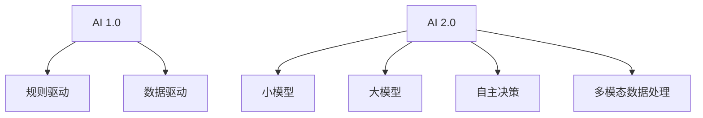

                 

### 文章标题

《李开复：AI 2.0 时代的科技发展》

### 文章关键词

- AI 2.0
- 科技发展
- 人工智能
- 深度学习
- 自主决策
- 强化学习
- 大模型
- 医疗
- 金融
- 教育

### 文章摘要

本文旨在探讨AI 2.0时代的科技发展。通过分析AI 2.0的核心技术、应用场景以及未来发展趋势，本文为读者呈现了一个全面且深入的了解。文章首先介绍了AI 2.0时代的背景和特点，接着深入探讨了大模型、自主决策与强化学习等核心技术，并通过实际应用案例展示了这些技术在实际场景中的应用。此外，文章还讨论了人工智能在医疗、金融和教育等领域的应用实践，最后对AI 2.0时代的科技创新与未来展望进行了展望。希望通过本文，读者能对AI 2.0时代的科技发展有一个全面而深刻的认识。

### 目录

1. **第一部分：AI 2.0时代的背景与概述**
    1.1 AI 2.0时代的科技发展概述
    1.2 AI 2.0的核心技术
    1.3 AI 2.0的应用场景
    1.4 AI 2.0的未来发展趋势

2. **第二部分：AI 2.0技术的深度探讨**
    2.1 大模型的原理与构建
    2.2 自主决策与强化学习

3. **第三部分：AI 2.0时代的应用实践**
    3.1 人工智能与医疗
    3.2 人工智能与金融
    3.3 人工智能与教育

4. **第四部分：AI 2.0时代的科技创新与未来展望**
    4.1 AI 2.0时代的科技创新趋势
    4.2 AI 2.0时代的未来展望

5. **附录**
    5.1 技术资源与工具
    5.2 参考文献与推荐阅读

### 第一部分：AI 2.0时代的背景与概述

#### 1.1 AI 2.0时代的科技发展概述

AI 2.0时代的到来标志着人工智能技术发展的新阶段。相较于AI 1.0时代，AI 2.0不仅在技术层面有了质的飞跃，还在应用场景和影响范围上取得了重大突破。AI 2.0的核心特点可以归纳为：大模型、自主决策、多模态数据处理以及更广泛的跨领域应用。

##### 1.1.1 AI 1.0与AI 2.0的区别

首先，让我们通过一个Mermaid流程图来对比AI 1.0和AI 2.0的技术发展路线。



- **AI 1.0**：主要依赖于规则驱动和数据驱动方法，技术实现相对简单，主要应用于特定领域的任务，如语音识别、图像分类等。
- **AI 2.0**：引入了深度学习和大规模数据处理技术，使得模型可以学习到更加复杂的特征和模式，同时具有自主决策和多模态数据处理能力。

##### 1.1.2 AI 2.0的时代特征

接下来，我们来看一下AI 2.0的时代特征。AI 2.0不仅提升了技术的性能，还带来了以下几个方面的变化：

- **大模型与深度学习**：AI 2.0依赖于大规模的神经网络模型，如GPT、BERT等，这些模型可以处理海量数据，并提取复杂的特征。
- **自主决策与强化学习**：AI 2.0可以通过强化学习算法实现自主决策，例如自动驾驶、机器人等。
- **多模态数据处理**：AI 2.0可以同时处理多种类型的数据，如文本、图像、音频等，实现更加智能化和个性化的应用。
- **跨领域应用**：AI 2.0不仅应用于传统领域，还扩展到医疗、金融、教育等新兴领域，带来更加广泛的影响。

##### 1.1.3 AI 2.0的影响与挑战

AI 2.0的兴起不仅带来了技术上的突破，还对社会和经济产生了深远的影响。以下是AI 2.0可能带来的影响与挑战：

- **提高生产效率**：AI 2.0可以自动化许多重复性、高耗时的工作，提高生产效率。
- **创新产业模式**：AI 2.0推动了新产业和新商业模式的诞生，如自动驾驶、智能医疗等。
- **就业结构变化**：随着AI 2.0技术的发展，某些传统岗位可能会消失，但也会创造新的就业机会。
- **数据隐私与安全**：AI 2.0依赖于大量数据，这可能导致数据隐私和安全问题。
- **算法公平性与透明性**：AI 2.0算法的决策过程可能存在偏见，影响社会的公平性和透明性。

#### 1.2 AI 2.0的核心技术

AI 2.0的核心技术主要包括大模型、自主决策和强化学习等。以下是对这些技术的详细探讨。

##### 1.2.1 大模型与深度学习

大模型是AI 2.0的核心技术之一。深度学习算法使得神经网络模型可以处理更大量的数据，提取更复杂的特征。以下是关于大模型的一些关键概念：

- **模型规模**：大模型的规模通常指模型的参数数量。一个典型的GPT模型有数十亿个参数。
- **训练数据**：大模型需要大量的训练数据来学习。例如，GPT模型使用了数万亿个词汇进行预训练。
- **计算资源**：大模型训练需要大量的计算资源，如GPU、TPU等。

以下是关于大模型和深度学习的一些伪代码：

```python
# 伪代码：大模型训练
def train_large_model():
    data = load_large_dataset()
    model = create_large_neural_network()
    for epoch in range(num_epochs):
        for batch in data:
            model.train(batch)
    model.save()
```

##### 1.2.2 自主决策与强化学习

自主决策是AI 2.0时代的重要特征。强化学习是一种常用的自主决策方法。以下是关于自主决策和强化学习的一些关键概念：

- **状态**：在强化学习问题中，状态表示当前的环境和系统的状态。
- **动作**：动作是系统可以执行的行为。
- **奖励**：奖励是系统执行动作后获得的回报，用于指导学习过程。

以下是关于强化学习的一些伪代码：

```python
# 伪代码：强化学习
class ReinforcementLearning:
    def __init__(self, state_space, action_space):
        self.state_space = state_space
        self.action_space = action_space
        self.model = create_reinforcement_learning_model()

    def learn(self, state, action, reward):
        self.model.update(state, action, reward)

    def choose_action(self, state):
        return self.model.predict_action(state)
```

##### 1.2.3 多模态数据处理

多模态数据处理是AI 2.0时代的另一个关键技术。多模态数据处理可以同时处理多种类型的数据，如文本、图像、音频等。以下是关于多模态数据处理的一些关键概念：

- **数据融合**：数据融合是将不同类型的数据进行整合，以获得更全面的信息。
- **特征提取**：特征提取是从多模态数据中提取关键特征，用于模型训练。
- **模型融合**：模型融合是将多个模型进行融合，以获得更好的性能。

以下是关于多模态数据处理的一些伪代码：

```python
# 伪代码：多模态数据处理
def process_multimodal_data(text, image, audio):
    text_features = extract_text_features(text)
    image_features = extract_image_features(image)
    audio_features = extract_audio_features(audio)
    multimodal_features = fuse_features(text_features, image_features, audio_features)
    return multimodal_features
```

#### 1.3 AI 2.0的应用场景

AI 2.0技术的成熟和应用场景的拓宽，使得人工智能在各个领域都取得了显著的成果。以下是AI 2.0在医疗、金融和教育等领域的应用场景：

##### 1.3.1 人工智能与医疗

在医疗领域，AI 2.0技术可以用于疾病预测、诊断、治疗和患者管理等方面。以下是几个具体的案例：

- **疾病预测与诊断**：通过分析患者的病历数据、基因数据和医疗影像数据，AI 2.0可以预测疾病的发生风险，辅助医生进行诊断。
- **药物研发**：AI 2.0可以加速药物研发过程，通过筛选和优化药物分子，提高药物研发的成功率。
- **患者管理**：通过建立患者电子健康档案，AI 2.0可以实时监控患者的健康状况，提供个性化的治疗建议。

以下是关于医疗领域AI 2.0应用的数学模型和公式：

$$
\text{Prediction} = \text{WeightedSum}(\text{RiskFactors}) \cdot \text{Probability}
$$

$$
\text{Diagnosis} = \text{Max}(\text{Likelihood}, \text{Prior}, \text{LikelihoodRatio})
$$

##### 1.3.2 人工智能与金融

在金融领域，AI 2.0技术可以用于风险管理、投资策略和金融服务等方面。以下是几个具体的案例：

- **风险管理**：AI 2.0可以实时监控金融市场，预测市场波动，提供风险管理和投资建议。
- **投资策略**：通过分析历史数据和市场动态，AI 2.0可以制定个性化的投资策略，提高投资回报率。
- **金融服务**：AI 2.0可以用于智能客服、智能投顾等，提供高效、便捷的金融服务。

以下是关于金融领域AI 2.0应用的数学模型和公式：

$$
\text{Risk} = \text{VaR}(\text{Asset}, \text{Probability})
$$

$$
\text{Strategy} = \text{Optimize}(\text{Return}, \text{Risk})
$$

##### 1.3.3 人工智能与教育

在教育领域，AI 2.0技术可以用于个性化学习、智能评估和在线教育平台优化等方面。以下是几个具体的案例：

- **个性化学习**：通过分析学生的学习行为和学习数据，AI 2.0可以提供个性化的学习资源和学习建议。
- **智能评估**：通过自然语言处理和图像识别技术，AI 2.0可以自动评估学生的作业和考试，提供即时反馈。
- **在线教育平台优化**：AI 2.0可以优化在线教育平台的功能，提高用户的学习体验和平台运营效率。

以下是关于教育领域AI 2.0应用的数学模型和公式：

$$
\text{Personalized Learning} = f(\text{Student Data}, \text{Course Data}, \text{Learning Goals})
$$

$$
\text{Feedback} = \text{Correlation}(\text{Student Performance}, \text{Assessment})
$$

#### 1.4 AI 2.0的未来发展趋势

AI 2.0技术正处于快速发展的阶段，未来还将有以下几个发展趋势：

- **大模型与更高效训练算法**：随着计算资源的提升，大模型将变得更加普及，同时更高效的训练算法将不断涌现。
- **自主决策与强化学习**：自主决策和强化学习将逐渐应用于更多领域，实现更加智能化的系统。
- **多模态数据处理**：多模态数据处理技术将不断发展，实现更加智能化和个性化的应用。
- **跨领域融合**：AI 2.0将在更多领域实现跨领域融合，推动科技创新和社会进步。
- **伦理与法律问题**：随着AI 2.0技术的发展，伦理和法律问题将变得越来越重要，需要制定相应的规范和标准。

### 附录

#### 附录 A: AI 2.0时代的技术资源与工具

在AI 2.0时代，有许多开源的深度学习框架和工具可供开发者使用。以下是几个常用的工具：

- **TensorFlow**：由谷歌开发的开源深度学习框架，支持多种编程语言和平台。
- **PyTorch**：由Facebook开发的开源深度学习框架，具有动态计算图的优势。
- **Keras**：基于TensorFlow和Theano的开源深度学习库，简化了深度学习模型的搭建。

#### 附录 B: AI 2.0时代的参考文献与推荐阅读

为了深入了解AI 2.0时代的科技发展，以下是几本推荐的参考文献：

- 李开复（2020）。《人工智能：一种现代的方法》。
- Goodfellow, I., Bengio, Y., & Courville, A.（2016）。《深度学习》。
- 吴恩达（2017）。《深度学习》。
- 李飞飞（2021）。《人工智能简史》。

### 总结

AI 2.0时代是人工智能发展的新阶段，它不仅带来了技术上的突破，还对社会和经济产生了深远的影响。本文通过分析AI 2.0时代的背景、核心技术、应用场景以及未来发展趋势，为读者呈现了一个全面且深入的了解。随着AI 2.0技术的发展，我们有理由相信，它将带来更多的创新和变革。

### 作者信息

作者：AI天才研究院/AI Genius Institute & 禅与计算机程序设计艺术/Zen And The Art of Computer Programming

