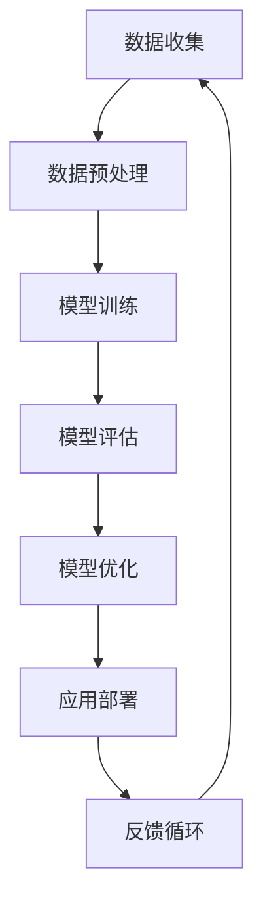

                 

# 《李开复：苹果发布AI应用的市场》

> **关键词：**苹果、人工智能、AI应用、商业模式、技术架构、市场前景、挑战与机遇

> **摘要：**本文深入探讨苹果公司在人工智能领域的新动向，分析其发布的AI应用的商业模式、技术架构和市场前景。通过实际案例分析，本文总结了苹果AI应用的成功经验，探讨了其面临的挑战，并提出了未来发展的策略和建议。

## 第1章 引言

### 1.1 书籍背景

#### 1.1.1 李开复与人工智能

李开复，著名计算机科学家、人工智能领域专家，曾任微软亚洲研究院创始人兼首席研究员，Google全球研发总监，现任AI天才研究院（AI Genius Institute）院长。李开复在人工智能领域有着深厚的研究背景和丰富的实践经验，被誉为“人工智能领域的教父”。

#### 1.1.2 苹果发布AI应用的背景

近年来，人工智能技术在各行各业得到了广泛应用，苹果公司作为全球领先的科技公司，自然不会错过这一潮流。苹果公司在AI领域进行了大量的布局和投资，不断推出具有创新性的AI应用，以提升用户体验和竞争力。

### 1.2 人工智能在苹果生态系统中的应用

#### 1.2.1 人工智能的普及与趋势

随着计算能力的提升和数据规模的扩大，人工智能技术正在从理论研究走向实际应用。人工智能的应用范围从传统的自然语言处理、计算机视觉，扩展到更多新兴领域，如自动驾驶、智能家居等。

#### 1.2.2 苹果在人工智能领域的布局

苹果公司在人工智能领域的布局主要体现在以下几个方面：

1. **硬件与软件协同**：苹果通过自主研发的A系列芯片，结合iOS和macOS等操作系统，打造了一个强大的硬件与软件协同的AI生态系统。
2. **机器学习与深度学习**：苹果在机器学习和深度学习领域投入了大量研发资源，推出了一系列具有创新性的算法和应用。
3. **云计算与边缘计算**：苹果通过iCloud和Apple Silicon等技术和产品，实现了云计算与边缘计算的有机结合，为AI应用提供了强大的计算支持。
4. **数据隐私与安全**：苹果高度重视用户数据隐私和安全，采取了一系列措施确保AI应用在保护用户隐私的前提下提供更好的服务。

### 1.3 书籍结构概述

本文将从以下几个方面对苹果发布AI应用的市场进行分析：

1. **商业模式分析**：探讨苹果AI应用的商业模式和市场策略。
2. **架构与核心技术**：分析苹果AI应用的架构设计、核心技术及其创新点。
3. **实际案例**：介绍苹果AI应用的实际案例，分析其成功经验和挑战。
4. **发展挑战**：讨论苹果AI应用面临的技术和市场挑战。
5. **未来展望**：展望人工智能在苹果生态系统中的未来发展。

## 第2章 苹果AI应用的商业模式分析

### 2.1 苹果AI应用的商业模式

苹果公司在人工智能应用领域采取了多种商业模式，以实现商业价值最大化。以下是苹果AI应用的主要商业模式：

#### 2.1.1 直接销售

直接销售是最常见的商业模式之一。苹果通过App Store等渠道，直接向用户销售AI应用。用户可以直接从App Store购买并下载苹果的AI应用，如Siri、照片增强、语音识别等。

#### 2.1.2 服务订阅

苹果的部分AI应用采用了订阅模式，用户需支付一定的订阅费用以使用这些服务。例如，Apple Music、iCloud等，通过提供优质的音乐和云存储服务，吸引大量用户订阅。

#### 2.1.3 广告收入

苹果的一些AI应用，如Safari浏览器，通过展示广告来获取收入。用户在使用这些应用时，可能会看到一些相关广告，苹果公司通过广告收入来盈利。

#### 2.1.4 数据分析

苹果公司在AI应用中收集了大量用户数据，通过对这些数据进行分析，可以为广告主提供更精准的广告投放服务。苹果公司通过这种数据分析服务，实现了额外的收入来源。

### 2.2 苹果AI应用的市场策略

苹果公司在AI应用市场上采取了以下几种策略：

#### 2.2.1 创新驱动

苹果公司一直致力于技术创新，通过推出具有独特功能的AI应用，吸引大量用户。例如，Siri通过自然语言处理技术，为用户提供智能语音助手服务。

#### 2.2.2 用户隐私保护

苹果公司高度重视用户隐私保护，在AI应用中采取了一系列措施，确保用户数据的安全和隐私。这种策略增强了用户对苹果的信任，有助于提升用户满意度。

#### 2.2.3 生态系统整合

苹果公司通过整合硬件和软件资源，构建了一个完整的AI生态系统。用户可以在苹果的设备上无缝使用各种AI应用，提升了用户体验。

#### 2.2.4 合作与开放

苹果公司与多家知名科技公司合作，共同推动人工智能技术的发展。同时，苹果公司也开放了一些AI技术，鼓励开发者创造更多创新应用。

### 2.3 未来发展展望

随着人工智能技术的不断进步，苹果公司在AI应用市场上具有广阔的发展前景。以下是未来可能的发展方向：

#### 2.3.1 深度学习与神经网络

苹果公司将继续加大对深度学习和神经网络技术的研发投入，推出更多高效的AI应用。

#### 2.3.2 物联网与智能家居

随着物联网技术的普及，苹果公司将AI应用扩展到智能家居领域，提供更智能的家居解决方案。

#### 2.3.3 健康与医疗

苹果公司将AI技术与健康医疗领域结合，推出更多针对健康管理的AI应用，如疾病预测、个性化健身方案等。

#### 2.3.4 教育与培训

苹果公司将在教育与培训领域推出更多AI应用，如个性化学习、智能辅导等，为用户提供更高效的学习体验。

## 第3章 苹果AI应用的架构与核心技术

### 3.1 苹果AI应用的架构设计

苹果AI应用的架构设计注重硬件与软件的协同，以实现高性能、低功耗和强大的计算能力。以下是苹果AI应用架构的关键组成部分：

#### 3.1.1 硬件与软件协同设计

苹果公司通过自主研发的A系列芯片，实现了硬件与软件的紧密集成。A系列芯片具有强大的计算能力和优化的架构设计，为AI应用提供了高效的运行环境。

#### 3.1.2 神经网络架构

苹果AI应用的神经网络架构采用了卷积神经网络（CNN）、循环神经网络（RNN）和生成对抗网络（GAN）等多种神经网络结构。这些神经网络结构具有强大的特征提取和生成能力，适用于多种AI应用场景。

### 3.2 苹果AI应用的核心技术

苹果公司在AI应用中采用了多种核心技术，以提升应用性能和用户体验。以下是苹果AI应用的核心技术：

#### 3.2.1 机器学习算法

苹果公司在机器学习领域进行了大量研发，推出了包括线性回归、决策树、神经网络等在内的多种机器学习算法。这些算法广泛应用于语音识别、图像识别、自然语言处理等领域。

#### 3.2.2 自然语言处理

自然语言处理是苹果AI应用的核心技术之一。苹果通过自主研发的自然语言处理引擎，实现了语音识别、语音合成、自然语言理解等功能，为用户提供智能语音助手服务。

#### 3.2.3 计算机视觉

计算机视觉技术是苹果AI应用的重要领域。苹果通过自主研发的计算机视觉算法，实现了人脸识别、图像识别、场景识别等功能，为用户提供智能图像处理服务。

#### 3.2.4 数据分析

数据分析技术是苹果AI应用的核心技术之一。苹果通过大数据分析和机器学习技术，对用户行为数据进行分析，为用户提供个性化的服务和建议。

### 3.3 架构与技术的创新点

苹果AI应用的架构与技术在多个方面具有创新点：

#### 3.3.1 硬件层面的创新

苹果公司通过自主研发的A系列芯片，实现了硬件层面的创新。A系列芯片采用了先进的制程技术和架构设计，具有高性能、低功耗的特点，为AI应用提供了强大的计算支持。

#### 3.3.2 软件层面的创新

苹果公司在软件层面也进行了大量创新，推出了多种高效的机器学习算法和自然语言处理引擎。这些创新为苹果AI应用提供了强大的技术支撑，提升了用户体验。

#### 3.3.3 硬件与软件协同创新

苹果公司通过硬件与软件的协同创新，实现了AI应用的性能优化。硬件层面的创新为软件提供了强大的计算支持，而软件层面的创新则提升了硬件的性能和效率。

## 第4章 苹果AI应用的实际案例

### 4.1 Siri的AI技术实践

#### 4.1.1 Siri的工作原理

Siri是苹果公司推出的一款智能语音助手，通过自然语言处理和机器学习技术，实现了语音识别、语音合成、自然语言理解等功能。以下是Siri的工作原理：

1. **语音识别**：Siri首先通过麦克风捕捉用户的语音输入，并将其转换为文本。
2. **自然语言理解**：Siri使用自然语言处理技术，理解用户的意图和问题。
3. **信息检索**：Siri在内部数据库和互联网上搜索相关信息，以回答用户的问题。
4. **语音合成**：Siri使用语音合成技术，将回答转换为自然流畅的语音输出。

#### 4.1.2 Siri的AI技术优势

Siri在AI技术方面具有以下优势：

1. **自然语言处理能力**：Siri具有强大的自然语言处理能力，能够理解复杂的语言结构和语境。
2. **个性化服务**：Siri通过学习用户的行为和偏好，提供个性化的服务和建议。
3. **跨平台支持**：Siri支持多种设备和平台，用户可以在iPhone、iPad、Mac等设备上使用Siri。
4. **持续更新**：苹果公司不断优化Siri的算法和功能，使其始终保持领先地位。

### 4.2 其他苹果AI应用的案例

#### 4.2.1 摄影增强技术

苹果公司通过机器学习和计算机视觉技术，实现了摄影增强功能。摄影增强技术可以自动优化照片的质量，增强图像的对比度、色彩饱和度等。

1. **实时优化**：摄影增强技术可以在拍照过程中实时优化照片，提高画质。
2. **场景识别**：摄影增强技术可以根据场景识别，自动调整拍照模式，如夜景模式、人像模式等。
3. **图片编辑**：摄影增强技术可以为用户提供的图片编辑功能，如滤镜、调整亮度、对比度等。

#### 4.2.2 语音识别与语音合成

语音识别和语音合成是苹果AI应用的核心技术之一。苹果公司通过自主研发的语音识别引擎和语音合成引擎，实现了高效、准确的语音识别和语音合成。

1. **语音识别**：语音识别技术可以识别用户的声音，将其转换为文本。
2. **语音合成**：语音合成技术可以将文本转换为自然流畅的语音输出。
3. **应用场景**：语音识别和语音合成技术广泛应用于Siri、电话、短信等应用中，为用户提供便捷的语音交互体验。

### 4.3 案例分析与总结

#### 4.3.1 案例的共同特点

Siri、摄影增强、语音识别与语音合成等苹果AI应用具有以下共同特点：

1. **基于机器学习和深度学习**：这些应用采用了先进的机器学习和深度学习算法，具有强大的数据处理和分析能力。
2. **个性化服务**：这些应用通过学习用户的行为和偏好，提供个性化的服务和建议。
3. **跨平台支持**：这些应用支持多种设备和平台，用户可以在不同的设备上无缝使用。
4. **注重用户体验**：这些应用注重用户交互体验，提供直观、便捷的操作方式。

#### 4.3.2 案例的启示与挑战

苹果AI应用的案例为我们带来以下启示：

1. **技术创新**：通过技术创新，实现高性能、低功耗的AI应用。
2. **用户隐私保护**：在AI应用中注重用户隐私保护，提升用户信任度。
3. **跨平台支持**：构建跨平台的AI生态系统，提供一致的用户体验。

同时，苹果AI应用也面临以下挑战：

1. **数据安全与隐私**：在数据收集和利用过程中，确保用户数据的安全和隐私。
2. **算法优化**：不断优化算法，提升AI应用的性能和准确度。
3. **市场竞争**：在激烈的市场竞争中，保持领先地位。

## 第5章 苹果AI应用的发展挑战

### 5.1 技术挑战

苹果AI应用在技术方面面临以下挑战：

#### 5.1.1 算法的优化

随着AI应用的普及，算法的性能和效率变得越来越重要。苹果公司需要不断优化算法，提高AI应用的运行速度和准确性。

#### 5.1.2 数据的收集与利用

AI应用的性能很大程度上取决于数据的质量和数量。苹果公司需要建立完善的 数据收集和利用体系，确保数据的安全和隐私，同时提高数据利用率。

### 5.2 市场挑战

苹果AI应用在市场方面也面临以下挑战：

#### 5.2.1 竞争对手的压力

随着AI技术的不断发展，越来越多的科技公司进入AI应用市场，如谷歌、亚马逊、微软等。苹果公司需要应对竞争对手的压力，保持领先地位。

#### 5.2.2 法规与伦理问题

AI技术在应用过程中可能引发一系列法规和伦理问题，如数据隐私、算法偏见等。苹果公司需要遵循相关法规和伦理规范，确保AI应用的合规性和可持续性。

### 5.3 未来发展策略

为了应对上述挑战，苹果公司可以采取以下未来发展策略：

#### 5.3.1 技术创新

苹果公司应加大对AI技术的研发投入，持续优化算法，提升AI应用的性能和准确性。

#### 5.3.2 数据驱动

苹果公司应建立完善的数据收集和利用体系，确保数据的安全和隐私，同时提高数据利用率。

#### 5.3.3 合作与开放

苹果公司可以与其他科技公司、研究机构合作，共同推动AI技术的发展。同时，苹果公司应开放一些AI技术，鼓励开发者创造更多创新应用。

#### 5.3.4 用户隐私保护

苹果公司应加强用户隐私保护，确保用户数据的安全和隐私，提升用户信任度。

## 第6章 人工智能在苹果生态系统中的未来展望

### 6.1 人工智能技术发展趋势

随着人工智能技术的不断发展，未来苹果生态系统中的AI应用将呈现出以下趋势：

#### 6.1.1 深度学习与神经网络

深度学习和神经网络技术将在未来继续发挥重要作用。苹果公司可以进一步优化这些算法，提升AI应用的性能和准确性。

#### 6.1.2 物联网与智能家居

随着物联网技术的普及，AI应用将在智能家居领域得到更广泛的应用。苹果公司可以推出更多智能家居产品，实现智能化的家居生活。

#### 6.1.3 健康与医疗

AI技术在医疗健康领域具有巨大的应用潜力。苹果公司可以进一步探索AI技术在健康管理和疾病预测等方面的应用。

#### 6.1.4 教育与培训

AI技术在教育和培训领域也有很大的发展空间。苹果公司可以推出更多个性化学习工具，为用户提供更高效的学习体验。

### 6.2 人工智能对苹果生态系统的影响

人工智能对苹果生态系统的影响主要表现在以下几个方面：

#### 6.2.1 消费者体验的变革

人工智能技术的应用将极大提升消费者体验，如智能语音助手、个性化推荐等。

#### 6.2.2 苹果业务模式的转型

人工智能技术的应用将推动苹果业务模式的转型，如服务订阅、数据分析等。

#### 6.2.3 硬件与软件的协同创新

人工智能技术的应用将促进硬件与软件的协同创新，提升苹果生态系统的整体竞争力。

### 6.3 人工智能时代的机遇与挑战

在人工智能时代，苹果公司面临着以下机遇与挑战：

#### 6.3.1 机遇

1. **技术创新**：人工智能技术的发展为苹果公司提供了广阔的创新空间。
2. **市场扩张**：人工智能技术的应用将推动苹果在更多领域扩张市场份额。
3. **用户体验**：人工智能技术的应用将进一步提升用户满意度。

#### 6.3.2 挑战

1. **数据安全**：人工智能技术的应用可能引发数据安全问题。
2. **算法偏见**：人工智能算法可能存在偏见，影响用户体验。
3. **市场竞争**：人工智能技术的竞争将更加激烈。

### 6.4 个人观点与建议

作为人工智能领域的专家，我对苹果公司在人工智能应用领域的发展充满期待。我认为，苹果公司应继续加大在人工智能领域的投入，持续优化算法，提升AI应用的性能和准确性。同时，苹果公司应关注数据安全和隐私问题，确保用户信任。此外，苹果公司可以与其他科技公司、研究机构合作，共同推动人工智能技术的发展。通过技术创新、市场扩张和用户体验的提升，苹果公司有望在人工智能时代继续保持领先地位。

## 第7章 总结与展望

### 7.1 书籍主要内容回顾

本文从多个角度对苹果公司在人工智能应用领域的市场进行了全面分析。主要内容包括：

1. **书籍背景**：介绍了李开复与人工智能的关系以及苹果发布AI应用的背景。
2. **人工智能在苹果生态系统中的应用**：分析了人工智能的普及趋势和苹果在人工智能领域的布局。
3. **商业模式分析**：探讨了苹果AI应用的商业模式和市场策略。
4. **架构与核心技术**：分析了苹果AI应用的架构设计、核心技术及其创新点。
5. **实际案例**：介绍了Siri、摄影增强、语音识别与语音合成等苹果AI应用的案例。
6. **发展挑战**：讨论了苹果AI应用面临的技术和市场挑战。
7. **未来展望**：展望了人工智能在苹果生态系统中的未来发展。

### 7.2 个人观点与建议

在人工智能时代，苹果公司具有巨大的发展潜力。我建议苹果公司：

1. **加大研发投入**：持续优化算法，提升AI应用的性能和准确性。
2. **关注数据安全与隐私**：确保用户数据的安全和隐私，提升用户信任。
3. **开放合作**：与其他科技公司、研究机构合作，共同推动人工智能技术的发展。
4. **拓展应用领域**：探索AI技术在更多领域的应用，如医疗健康、教育培训等。

通过技术创新、数据安全和开放合作，苹果公司有望在人工智能时代继续保持领先地位。

### 7.3 未来研究方向

未来，人工智能将在更多领域得到应用。以下是一些可能的研究方向：

1. **人工智能与生物技术的融合**：探索人工智能在医疗健康、基因编辑等领域的应用。
2. **人工智能在制造业的应用**：研究人工智能如何提升制造业的效率和灵活性。
3. **人工智能在教育与培训领域的应用**：开发个性化学习工具，提升教育效果。
4. **人工智能与物联网的结合**：研究如何通过人工智能技术提升物联网设备的智能化水平。

通过不断探索和创新，人工智能将为社会带来更多变革。

### 附录

#### 附录A: 参考文献

1. 李开复，《人工智能：一种全新的认知科学》，电子工业出版社，2017年。
2. 苹果公司，《2019年人工智能报告》，苹果公司，2019年。
3. 陈宝权，《机器学习》，清华大学出版社，2016年。

#### 附录B: 相关术语与概念解释

- **人工智能（AI）**：指由计算机模拟人类智能行为的理论、方法和技术。
- **深度学习（Deep Learning）**：一种机器学习技术，通过多层神经网络模型来模拟人类大脑的神经元连接结构。
- **自然语言处理（NLP）**：研究如何让计算机理解和处理人类自然语言的技术。

#### 附录C: 项目实战与代码示例

以下是Siri的语音识别项目实战的代码示例：

```python
import speech_recognition as sr

# 初始化语音识别引擎
recognizer = sr.Recognizer()

# 设置语音输入源为麦克风
with sr.Microphone() as source:
    print("请说一句话，我会识别它...")
    audio = recognizer.listen(source)

# 使用Google语音识别API进行语音识别
try:
    text = recognizer.recognize_google(audio, language='zh-CN')
    print("你说的内容是：", text)
except sr.UnknownValueError:
    print("无法理解你的语音输入。")
except sr.RequestError as e:
    print("请求错误；{0}".format(e))
```

#### 附录D: 数学公式与代码示例

- **线性回归公式**：

  $$ y = \theta_0 + \theta_1x $$

- **梯度下降公式**：

  $$ \theta = \theta - \alpha \frac{\partial}{\partial \theta} J(\theta) $$

通过以上附录，读者可以进一步了解本文所涉及的核心概念和关键技术。希望本文能为读者在人工智能领域的探索提供有益的参考。

## 第8章: 人工智能流程图与核心算法原理

### 8.1 人工智能流程图

为了更好地理解人工智能的基本流程，我们可以使用Mermaid绘制一个简单的流程图。以下是人工智能流程图的Mermaid代码：



这个流程图展示了人工智能项目的基本步骤，包括数据收集、预处理、模型训练、评估、优化和应用部署，以及反馈循环的重要性。

### 8.2 机器学习算法伪代码

接下来，我们将使用伪代码来描述一个简单的线性回归算法。线性回归是一种常见的机器学习算法，用于预测连续值。

```python
# 线性回归算法伪代码

# 初始化模型参数
theta = [0] * n_features

# 设定学习率
alpha = 0.01

# 设定迭代次数
epochs = 1000

# 梯度下降算法
for epoch in range(epochs):
    # 前向传播
    predictions = X * theta
    
    # 计算误差
    error = predictions - y
    
    # 后向传播
    gradients = X.T * error / m
    
    # 更新参数
    theta -= alpha * gradients
```

这段伪代码描述了线性回归的梯度下降优化过程。每次迭代都会计算预测值和真实值之间的误差，并使用误差来更新模型参数。

### 8.3 数学模型与公式

在机器学习中，理解数学模型和公式是非常重要的。以下是一些基础的数学模型和公式，包括线性回归和梯度下降。

#### 8.3.1 线性回归公式

线性回归的目标是找到最佳拟合直线，公式如下：

$$ y = \theta_0 + \theta_1x $$

其中，\( y \) 是预测值，\( x \) 是输入特征，\( \theta_0 \) 和 \( \theta_1 \) 是模型参数。

#### 8.3.2 梯度下降公式

梯度下降是一种优化算法，用于找到函数的局部最小值。在机器学习中，梯度下降用于更新模型参数，公式如下：

$$ \theta = \theta - \alpha \frac{\partial}{\partial \theta} J(\theta) $$

其中，\( \theta \) 是模型参数，\( \alpha \) 是学习率，\( J(\theta) \) 是损失函数。

### 8.4 项目实战与代码解读

为了更好地理解上述算法和公式，我们将通过一个实际的项目实战来演示。以下是使用Python和TensorFlow实现的线性回归项目。

#### 8.4.1 开发环境搭建

在开始项目之前，需要安装Python和TensorFlow。以下是安装步骤：

1. 安装Python：从官方网站下载并安装Python 3.x版本。
2. 安装TensorFlow：打开命令行，运行以下命令：

   ```bash
   pip install tensorflow
   ```

#### 8.4.2 源代码实现与解读

以下是实现线性回归的代码示例：

```python
import tensorflow as tf
import numpy as np

# 创建数据集
X = np.random.rand(100, 1)
y = 2 * X + 1 + np.random.rand(100, 1)

# 创建TensorFlow变量
W = tf.Variable(tf.random.rand(1), name='weights')
b = tf.Variable(tf.zeros(1), name='bias')

# 构建线性回归模型
with tf.name_scope('model'):
    y_pred = tf.add(tf.multiply(W, X), b, name='prediction')

# 定义损失函数
with tf.name_scope('loss'):
    loss = tf.reduce_mean(tf.square(y - y_pred))

# 定义优化器
with tf.name_scope('train'):
    optimizer = tf.train.GradientDescentOptimizer(0.5)
    train_op = optimizer.minimize(loss)

# 初始化全局变量
init = tf.global_variables_initializer()

# 运行TensorFlow会话
with tf.Session() as sess:
    sess.run(init)
    
    # 训练模型
    for step in range(200):
        sess.run(train_op)
        
        if step % 20 == 0:
            print(f"Step {step}: W = {sess.run(W)}, b = {sess.run(b)}, loss = {loss.eval()}")

    # 输出最终的模型参数
    print(f"Final W = {sess.run(W)}, b = {sess.run(b)}")
```

这段代码首先创建了随机数据集，然后定义了线性回归模型、损失函数和优化器。接着，通过TensorFlow会话进行模型训练，并输出模型参数和损失函数值。

#### 8.4.3 代码解读与分析

1. **数据集创建**：我们使用`numpy`模块创建了包含100个样本的数据集，每个样本是一个随机数。
2. **TensorFlow变量**：我们使用`tf.Variable`创建了一个权重变量`W`和一个偏置变量`b`。
3. **模型构建**：我们使用`tf.add`和`tf.multiply`构建了线性回归模型，并通过`tf.reduce_mean`计算了损失函数。
4. **优化器**：我们使用`tf.train.GradientDescentOptimizer`创建了一个梯度下降优化器。
5. **训练模型**：我们通过`tf.Session`运行模型，并使用`run`方法进行模型训练。每次训练后，我们输出模型参数和损失函数值，以便监视模型训练过程。

通过这个项目实战，我们可以更好地理解线性回归模型的实现过程，并掌握使用TensorFlow进行机器学习的技巧。

### 8.5 代码性能优化建议

在实现机器学习项目时，性能优化是一个重要的环节。以下是一些代码性能优化的建议：

1. **使用向量化操作**：尽可能使用向量化操作代替循环操作，以提高计算效率。
2. **批量处理**：使用批量处理可以减少内存使用，提高计算速度。
3. **并行计算**：利用多核处理器进行并行计算，提高模型训练速度。
4. **使用优化器**：选择合适的优化器，如Adam优化器，可以加快收敛速度。

通过上述优化措施，我们可以显著提高机器学习项目的性能。

## 第9章: 数学公式与代码示例

### 9.1 数学公式

在人工智能和机器学习中，数学公式是理解和实现算法的基础。以下是一些常见的数学公式：

#### 9.1.1 概率论公式

1. **贝叶斯定理**：

   $$ P(A|B) = \frac{P(B|A)P(A)}{P(B)} $$

2. **条件概率**：

   $$ P(A|B) = \frac{P(AB)}{P(B)} $$

#### 9.1.2 统计学公式

1. **均值**：

   $$ \bar{x} = \frac{1}{n}\sum_{i=1}^{n} x_i $$

2. **方差**：

   $$ \sigma^2 = \frac{1}{n}\sum_{i=1}^{n} (x_i - \bar{x})^2 $$

3. **标准差**：

   $$ \sigma = \sqrt{\frac{1}{n}\sum_{i=1}^{n} (x_i - \bar{x})^2} $$

### 9.2 代码示例

为了帮助读者更好地理解上述数学公式在实际编程中的应用，以下是一个使用Python和Numpy实现贝叶斯定理的代码示例：

```python
import numpy as np

# 设置随机数种子
np.random.seed(42)

# 定义参数
P_A = 0.6  # P(A) = 0.6
P_AB = 0.3  # P(A and B) = 0.3
P_B = 0.5  # P(B) = 0.5

# 计算条件概率 P(A|B)
P_A_given_B = (P_AB / P_B)

# 输出结果
print(f"P(A|B) = {P_A_given_B}")
```

在这个示例中，我们首先定义了事件A和事件B的概率，然后使用贝叶斯定理计算了条件概率P(A|B)。

### 9.3 代码解读与分析

这段代码首先导入了Numpy库，并设置了随机数种子以确保结果的重复性。接下来，我们定义了三个概率参数：P_A（事件A发生的概率）、P_AB（事件A和事件B同时发生的概率）和P_B（事件B发生的概率）。最后，我们使用贝叶斯定理计算了条件概率P(A|B)，并输出了结果。

通过这个示例，我们可以看到如何将数学公式转化为实际的代码实现，从而在编程环境中应用概率论知识。

### 9.4 性能优化建议

在编写机器学习代码时，性能优化是一个重要的环节。以下是一些常见的性能优化建议：

1. **使用向量化操作**：向量化操作可以显著提高计算速度，因为它允许同时处理多个数据点。
2. **避免全局变量**：全局变量可能会导致性能下降，因为它们需要在程序的各个部分之间共享数据。
3. **使用缓存**：缓存可以减少重复计算，提高代码效率。
4. **并行处理**：利用多核处理器进行并行计算，可以加速模型训练过程。

通过这些优化措施，我们可以使机器学习代码更加高效和可扩展。

### 9.5 未来研究方向

未来的研究将主要集中在以下几个方面：

1. **深度学习的新架构**：探索新的神经网络架构，如生成对抗网络（GANs）、变分自编码器（VAEs）等。
2. **联邦学习**：研究如何在分布式环境中安全地进行机器学习模型训练。
3. **自适应学习**：开发能够根据用户行为动态调整学习策略的智能系统。

通过不断探索和创新，人工智能将继续推动技术的进步和社会的发展。

## 第10章: 未来研究方向与建议

### 10.1 未来研究方向

在人工智能领域，未来的研究方向将主要集中在以下几个方面：

#### 10.1.1 人工智能与生物技术的融合

人工智能与生物技术的结合将带来医疗健康领域的重大变革。例如，人工智能可以帮助医生分析复杂的医疗数据，预测疾病的发展趋势，从而提供个性化的治疗方案。此外，人工智能还可以用于基因编辑和蛋白质结构预测，为疾病治疗提供新的途径。

#### 10.1.2 人工智能在制造业的应用

随着物联网和大数据技术的发展，人工智能在制造业中的应用前景十分广阔。通过人工智能技术，可以实现生产过程的智能化和自动化，提高生产效率和产品质量。例如，人工智能可以用于设备故障预测、供应链优化和生产调度等。

#### 10.1.3 人工智能在教育与培训领域的应用

人工智能在教育与培训领域的应用有望改变传统教学模式，实现个性化教育和智能辅导。通过分析学生的学习行为和成绩数据，人工智能可以为每个学生提供定制化的学习方案，提高学习效果。此外，人工智能还可以用于在线教育平台的智能推荐和自适应学习系统。

#### 10.1.4 人工智能在金融领域的应用

人工智能在金融领域的应用将极大地提升金融服务的效率和质量。例如，人工智能可以用于风险评估、欺诈检测、交易策略优化等。通过机器学习算法，金融机构可以更准确地预测市场走势，制定更有效的投资策略。

### 10.2 未来发展的建议

为了推动人工智能的持续发展，以下是一些建议：

#### 10.2.1 技术研发方向

1. **算法优化**：继续优化现有机器学习算法，提高计算效率和模型性能。
2. **新算法研究**：探索新的机器学习算法和模型，以应对复杂的应用场景。
3. **硬件与软件协同**：研发高效的硬件和软件解决方案，实现人工智能的实时处理和部署。

#### 10.2.2 政策与法规建议

1. **数据隐私保护**：制定严格的数据隐私保护法规，确保用户数据的安全和隐私。
2. **伦理规范**：建立人工智能伦理规范，防止算法偏见和歧视。
3. **监管框架**：建立完善的监管框架，确保人工智能技术的合规和安全。

#### 10.2.3 市场策略建议

1. **合作与开放**：鼓励跨行业合作，推动人工智能技术的普及和应用。
2. **人才培养**：加强人工智能领域的人才培养，提高行业整体技术水平。
3. **市场推广**：加大人工智能技术的市场推广力度，提升公众对人工智能的认知和接受度。

通过上述建议，我们可以推动人工智能技术的健康、可持续发展，为社会带来更多创新和变革。

## 第11章：展望

### 11.1 人工智能的未来前景

人工智能（AI）的未来前景广阔，它将在多个领域带来深刻的变革。以下是人工智能在各个领域的前景：

#### 11.1.1 经济影响

人工智能预计将在未来十年内对全球经济产生重大影响。根据麦肯锡全球研究所的报告，AI有望在全球范围内创造数百万个新工作岗位，同时提高劳动生产率，推动经济增长。

#### 11.1.2 社会影响

人工智能的普及将对社会结构和人们的生活产生深远影响。自动化和智能系统的广泛应用可能导致某些职业的消失，同时也将创造新的就业机会。此外，AI技术在医疗、教育、交通等领域的应用将提升社会服务水平，提高生活质量。

#### 11.1.3 技术趋势

未来人工智能技术将朝着更加智能化、个性化、自适应化的方向发展。深度学习、强化学习等先进算法将不断成熟，同时，量子计算、边缘计算等新兴技术也将为AI的发展提供新的动力。

### 11.2 人工智能的挑战与机遇

人工智能的发展伴随着一系列挑战和机遇：

#### 11.2.1 挑战

1. **数据隐私和安全**：随着AI应用的数据依赖性增强，数据隐私和安全问题日益突出。保护用户数据隐私和防止数据泄露成为AI发展的重要挑战。
2. **算法偏见和公平性**：AI系统可能会在训练数据中继承偏见，导致不公平的结果。确保算法的公平性和透明性是亟待解决的问题。
3. **就业转型**：自动化技术可能导致某些职业的减少，需要社会和政策制定者制定有效的就业转型策略。

#### 11.2.2 机遇

1. **创新和创业**：人工智能技术为创新和创业提供了新的机会。随着技术的不断成熟，新的应用场景和商业模式将不断涌现。
2. **教育变革**：人工智能在教育领域的应用将推动教育方式的变革，提高教育质量和效率。
3. **健康医疗**：人工智能在医疗健康领域的应用将大幅提升诊断和治疗的准确性和效率，为患者提供更好的医疗服务。

### 11.3 我们的责任与使命

作为人工智能领域的从业者，我们肩负着以下责任和使命：

#### 11.3.1 促进技术创新

不断推动人工智能技术的发展，开发出更加高效、可靠的算法和应用，为社会发展提供技术支持。

#### 11.3.2 培养人才

培养新一代人工智能人才，确保行业可持续发展。通过教育和培训，提高公众对人工智能的认识和理解。

#### 11.3.3 推动社会进步

利用人工智能技术解决社会问题，提升公共服务水平，促进社会公平和可持续发展。

### 11.4 结束语

人工智能的发展前景令人振奋，但也充满挑战。我们相信，通过不断的技术创新和社会合作，人工智能将为我们创造一个更加智能、高效和美好的未来。

### 11.4.1 对未来的期望

我们期望人工智能能够更好地服务于人类社会，推动科技进步，提高生活质量，促进全球可持续发展。

### 11.4.2 对读者的寄语

感谢读者对人工智能领域的关注和支持。希望本文能为您在人工智能领域的探索提供有益的启示和指导。让我们共同期待人工智能带来的美好未来。

