                 

# 模型思维：快速掌握新知识的捷径

> 关键词：模型思维、知识掌握、新知识学习、结构化思考、高效学习

> 摘要：本文将深入探讨模型思维的概念、原理、方法及其在不同领域中的应用。通过逐步分析模型思维的核心要素、构建原理和应用实践，帮助读者理解并掌握快速掌握新知识的捷径。

## 引言

在当今快速变化的信息时代，如何高效地学习新知识已成为一个重要课题。传统的学习方式往往注重记忆和重复，而忽视了知识结构的理解和掌握。模型思维提供了一种全新的思维方式，通过构建和应用模型，帮助我们在复杂的信息环境中快速掌握新知识。本文将详细介绍模型思维的基本概念、构建原理和方法，并探讨其在不同领域中的应用，旨在为广大读者提供一种高效学习新知识的捷径。

## 第一部分：模型思维概述与框架构建

### 第1章：模型思维的基本概念

#### 1.1 模型思维的概念与历史背景

模型思维是一种以构建和应用模型为基础的思维方式。它起源于科学研究和工程实践中，逐渐演变成为现代的一种通用思维方法。模型思维的概念可以追溯到古希腊哲学家亚里士多德的理性思考，以及中世纪欧洲的经院哲学。在近代科学革命中，模型思维得到了进一步发展，成为科学研究和技术发展的重要工具。

模型思维的定义：模型思维是指通过构建抽象的模型，对现实世界中的复杂问题进行理解和分析的一种思维方式。模型思维的核心在于将复杂的问题转化为简化的模型，从而便于分析和解决。

#### 1.2 模型思维的核心要素

模型思维的核心要素包括以下几个方面：

- **模型组成与结构**：模型由输入、输出、参数、变量等组成部分构成。模型的结构决定了模型的功能和应用范围。

- **模型类型**：根据模型的抽象程度和复杂性，可以将模型分为物理模型、数学模型、概念模型等不同类型。

- **模型层次**：模型思维涉及多个层次，包括问题层次、解决方案层次、实现层次等。

- **模型应用范围**：模型思维广泛应用于科学研究、工程实践、商业管理、决策制定等多个领域。

#### 1.3 模型思维的基本框架

模型思维的基本框架包括以下几个步骤：

1. **确定问题**：明确需要解决的问题，并将其抽象为模型。

2. **构建模型**：根据问题的特点，选择合适的模型类型和结构，构建相应的模型。

3. **验证模型**：对构建的模型进行验证，确保模型的准确性和可靠性。

4. **应用模型**：将验证后的模型应用于实际问题，解决实际问题。

5. **迭代优化**：根据实际应用中的反馈，对模型进行迭代优化，提高模型的性能。

#### 1.4 模型思维的重要性

模型思维具有以下几个重要性：

- **解决复杂问题的能力**：模型思维可以帮助我们处理复杂的、不确定的问题，提高解决问题的能力。

- **提高决策质量**：通过构建和应用模型，可以更好地理解和预测问题的变化，从而做出更高质量的决策。

- **促进创新与进步**：模型思维鼓励我们探索新的解决方案，推动创新和科技进步。

## 第二部分：模型构建的原理与方法

### 第2章：模型构建的原理与方法

#### 2.1 模型构建的基础理论

模型构建的基础理论包括以下几个方面：

- **建模的基本原则**：建模时应遵循实用性、简洁性、可扩展性和可理解性等基本原则。

- **建模的常见方法**：建模方法包括定量建模、定性建模、混合建模和计算机模拟等。

#### 2.2 模型构建的实际应用

模型构建在实际应用中具有广泛的应用，包括以下几个方面：

- **自然科学**：在物理学、生物学等领域，模型构建帮助我们理解和预测自然现象。

- **社会科学**：在经济学、社会学等领域，模型构建帮助我们分析和解决社会问题。

- **工程技术**：在机械工程、电子工程等领域，模型构建帮助我们设计和优化工程系统。

#### 2.3 模型构建的挑战与应对策略

模型构建面临以下挑战：

- **数据获取与处理**：数据质量对模型构建至关重要，需要有效管理和处理数据。

- **模型选择与优化**：选择合适的模型类型和参数，对模型进行优化。

- **验证与验证**：对模型进行验证，确保模型在不同条件下的一致性和稳定性。

- **模型解释与可解释性**：提高模型的解释性和可解释性，使其更易于理解和应用。

### 第三部分：模型思维的实际应用

#### 第3章：模型思维在科学研究中的应用

##### 3.1 模型思维在自然科学中的应用

模型思维在自然科学中具有广泛的应用，包括以下几个方面：

- **物理学**：在物理学中，模型思维帮助我们理解和预测物理现象，如量子力学、相对论等。

- **生物学**：在生物学中，模型思维帮助我们理解生物系统的运行机制，如遗传学、进化论等。

##### 3.2 模型思维在社会科学中的应用

模型思维在社会科学中具有广泛的应用，包括以下几个方面：

- **经济学**：在经济学中，模型思维帮助我们分析和预测经济行为，如微观经济学、宏观经济学等。

- **社会学**：在社会学中，模型思维帮助我们理解社会现象，如社会网络、社会行为等。

##### 3.3 模型思维在工程技术中的应用

模型思维在工程技术中具有广泛的应用，包括以下几个方面：

- **机械工程**：在机械工程中，模型思维帮助我们设计和优化机械系统，如机械动力学、机械结构分析等。

- **电子工程**：在电子工程中，模型思维帮助我们设计和优化电子系统，如电子电路、通信系统等。

#### 第4章：模型思维在工程实践中的应用

##### 4.1 模型思维在工程领域的应用

模型思维在工程领域具有广泛的应用，包括以下几个方面：

- **机械工程**：在机械工程中，模型思维帮助我们设计和优化机械系统，如机械动力学、机械结构分析等。

- **电子工程**：在电子工程中，模型思维帮助我们设计和优化电子系统，如电子电路、通信系统等。

##### 4.2 模型思维在信息技术中的应用

模型思维在信息技术中具有广泛的应用，包括以下几个方面：

- **计算机科学**：在计算机科学中，模型思维帮助我们理解和设计算法、数据结构等。

- **人工智能**：在人工智能中，模型思维帮助我们理解和应用机器学习、深度学习等模型。

##### 4.3 模型思维在商业管理中的应用

模型思维在商业管理中具有广泛的应用，包括以下几个方面：

- **商业战略**：在商业战略中，模型思维帮助我们制定和优化商业模型。

- **风险管理**：在风险管理中，模型思维帮助我们评估和管理风险。

- **决策制定**：在决策制定中，模型思维帮助我们做出更高质量的决策。

### 第四部分：模型思维的高效方法与工具

#### 第5章：模型思维的高效方法与工具

##### 5.1 模型思维的高效方法

高效模型思维方法包括以下几个方面：

- **系统思维**：系统思维强调整体观、动态视角和复杂性分析。

- **设计思维**：设计思维强调用户视角、创意产生和概念验证。

##### 5.2 模型思维的工具与应用

模型思维工具包括以下几个方面：

- **软件工具**：如专业建模软件、数据分析工具、人工智能平台等。

- **可视化工具**：如 Mermaid 流程图、数据可视化工具、原型设计工具等。

### 第五部分：模型思维的进阶技巧与实践

#### 第6章：模型思维的高效方法与工具

##### 6.1 模型思维的高效方法

高效模型思维方法包括以下几个方面：

- **系统思维**：系统思维强调整体观、动态视角和复杂性分析。

- **设计思维**：设计思维强调用户视角、创意产生和概念验证。

##### 6.2 模型思维的工具与应用

模型思维工具包括以下几个方面：

- **软件工具**：如专业建模软件、数据分析工具、人工智能平台等。

- **可视化工具**：如 Mermaid 流程图、数据可视化工具、原型设计工具等。

### 第六部分：模型思维的实际应用与挑战

#### 第7章：模型思维的实际应用与挑战

##### 7.1 模型思维在科学研究中的应用

模型思维在科学研究中的应用包括以下几个方面：

- **物理学**：在物理学中，模型思维帮助我们理解和预测物理现象，如量子力学、相对论等。

- **生物学**：在生物学中，模型思维帮助我们理解生物系统的运行机制，如遗传学、进化论等。

##### 7.2 模型思维在工程实践中的应用

模型思维在工程实践中的应用包括以下几个方面：

- **机械工程**：在机械工程中，模型思维帮助我们设计和优化机械系统，如机械动力学、机械结构分析等。

- **电子工程**：在电子工程中，模型思维帮助我们设计和优化电子系统，如电子电路、通信系统等。

##### 7.3 模型思维在商业管理中的应用

模型思维在商业管理中的应用包括以下几个方面：

- **商业战略**：在商业战略中，模型思维帮助我们制定和优化商业模型。

- **风险管理**：在风险管理中，模型思维帮助我们评估和管理风险。

- **决策制定**：在决策制定中，模型思维帮助我们做出更高质量的决策。

### 第七部分：模型思维的展望与未来

#### 第8章：模型思维的未来发展趋势

##### 8.1 模型思维的未来趋势

模型思维的未来发展趋势包括以下几个方面：

- **技术进步**：随着大数据、人工智能、量子计算等技术的发展，模型思维将更加智能化、自动化。

- **社会变革**：数字化转型、社会治理与公共服务等领域的变革，将为模型思维提供更广阔的应用场景。

##### 8.2 模型思维的发展方向

模型思维的发展方向包括以下几个方面：

- **跨学科融合**：跨学科的研究和合作，将推动模型思维在更多领域的发展。

- **人机协同**：人机协同工作、人机交互与增强现实等技术的发展，将进一步提升模型思维的应用效果。

### 第八部分：模型思维的持续学习和实践

#### 第9章：模型思维的持续学习和实践

##### 9.1 持续学习的重要性

持续学习在模型思维的发展中至关重要。以下是几个关键点：

- **知识更新**：随着技术的发展，新的理论、方法和工具不断涌现，持续学习有助于我们跟上时代的步伐。

- **实践经验**：通过实践，我们可以将理论知识应用到实际问题中，加深对模型思维的理解。

##### 9.2 学习与实践策略

为了实现有效的持续学习，我们可以采取以下策略：

- **自主学习**：通过在线课程、专业书籍等资源，自主学习新的知识和技能。

- **实践分享**：参与行业交流、实践社群等，分享经验和见解，促进共同进步。

- **持续创新**：不断探索新的方法和技术，推动模型思维的创新和应用。

### 附录

#### 附录 A：模型思维常用工具与资源

以下是一些常用的模型思维工具和资源：

- **建模工具**：MATLAB、Mathematica、Python建模库等。

- **学习资源**：学术期刊、专业书籍、在线课程平台等。

#### 附录 B：模型思维参考书目与文献

以下是一些模型思维的参考书目和文献：

- **基础读物**：《模型思维》、《模型思维实践》、《系统思维入门》等。

- **进阶读物**：《复杂系统的建模与优化》、《人工智能：一种现代方法》、《深度学习》等。

#### 附录 C：模型思维实践项目指南

以下是一个模型思维实践项目指南：

- **项目准备**：包括需求分析、数据收集、模型设计等。

- **项目实施**：包括模型构建、模型训练、模型应用等。

- **项目评估**：包括模型性能评估、项目效果分析、反馈与迭代等。

## 总结

模型思维作为一种高效的思维方式，在当今的信息时代具有广泛的应用前景。通过本文的介绍，我们了解了模型思维的概念、原理、方法以及在实际应用中的重要作用。希望本文能够为广大读者提供一种快速掌握新知识的捷径，帮助大家更好地应对复杂多变的现实世界。在未来的学习和实践中，让我们共同探索模型思维的魅力，不断提升自己的思维能力和创新能力。


## 作者信息

作者：AI天才研究院/AI Genius Institute & 禅与计算机程序设计艺术 /Zen And The Art of Computer Programming

### 第1章：模型思维的基本概念

模型思维是一种以构建和应用模型为基础的思维方式。在科学研究和工程实践中，模型思维逐渐成为一种重要的思考工具。本章将介绍模型思维的概念、历史背景以及与传统思维方式的差异。

#### 1.1 模型思维的概念与历史背景

模型思维是指通过构建抽象的模型，对现实世界中的复杂问题进行理解和分析的一种思维方式。模型思维的核心在于将复杂的问题转化为简化的模型，从而便于分析和解决。

**模型思维的概念演进**

模型思维的历史可以追溯到古希腊哲学家亚里士多德。亚里士多德认为，通过建立逻辑模型，可以更好地理解和解释自然现象。在亚里士多德之后，中世纪欧洲的经院哲学家进一步发展了模型思维，将其应用于哲学、神学和科学研究中。

**模型思维的定义**

模型思维是一种以构建和应用模型为基础的思维方式。它包括以下几个方面：

- **构建模型**：通过抽象和简化，将复杂的问题转化为可操作的模型。

- **分析模型**：对模型进行深入分析，理解其内在机制和规律。

- **应用模型**：将模型应用于实际问题，解决实际问题。

#### 1.2 模型思维与传统思维方式的差异

模型思维与传统思维方式相比，具有以下几个方面的差异：

**1.2.1 思考的抽象程度**

模型思维强调高度的抽象和简化，通过建立模型来描述和解释复杂现象。传统思维方式则更注重具体的实例和具体的操作。

**1.2.2 解决问题的方法**

模型思维通过构建和分析模型来解决问题，注重逻辑推理和系统分析。传统思维方式则更依赖经验和直觉，缺乏系统的分析框架。

**1.2.3 应用的范围**

模型思维广泛应用于科学研究和工程实践中，是一种通用的思维方式。传统思维方式则更依赖于具体领域，难以跨领域应用。

#### 1.3 模型思维在现代社会的应用

随着信息技术的快速发展，模型思维在现代社会的应用越来越广泛。以下是一些模型思维在现代社会的应用实例：

**1.3.1 科学研究**

在物理学、生物学、化学等领域，模型思维帮助我们理解和预测自然现象。例如，量子力学模型帮助我们理解微观世界的运行规律，生态模型帮助我们预测生态环境的变化。

**1.3.2 工程实践**

在机械工程、电子工程、土木工程等领域，模型思维帮助我们设计和优化工程系统。例如，机械动力学模型帮助我们设计机械系统，电子电路模型帮助我们优化电子系统。

**1.3.3 商业管理**

在商业管理领域，模型思维帮助我们制定和优化商业战略。例如，市场营销模型帮助我们预测市场需求，风险评估模型帮助我们管理风险。

**1.3.4 决策制定**

在政策制定和决策过程中，模型思维帮助我们分析和评估各种方案。例如，政策评估模型帮助我们评估政策的效应，决策树模型帮助我们做出最佳决策。

#### 1.4 模型思维的重要性

模型思维在现代社会中具有重要意义，主要体现在以下几个方面：

**1.4.1 解决复杂问题的能力**

模型思维通过构建和分析模型，可以帮助我们处理复杂的、不确定的问题，提高解决问题的能力。

**1.4.2 提高决策质量**

通过模型思维，我们可以更好地理解和预测问题的变化，从而做出更高质量的决策。

**1.4.3 促进创新与进步**

模型思维鼓励我们探索新的解决方案，推动创新和科技进步。

### 第2章：模型思维的核心要素

模型思维的核心要素包括模型组成与结构、模型类型、模型层次以及模型应用范围。理解这些核心要素，有助于我们更好地掌握模型思维的方法和应用。

#### 2.1 模型的组成与结构

模型是由多个组成部分构成的，包括输入、输出、参数、变量等。以下是对这些组成部分的详细解释：

**2.1.1 输入（Input）**

输入是模型中用于描述问题特征的数据。输入可以是定量的，也可以是定性的。例如，在预测天气的模型中，输入可能包括温度、湿度、风速等。

**2.1.2 输出（Output）**

输出是模型计算的结果，通常表示为预测值或决策结果。输出可以是单个值，也可以是多个值。例如，在预测股票价格的模型中，输出可能是股票价格的预测值。

**2.1.3 参数（Parameter）**

参数是模型中用于调节模型性能的变量。参数通常由数据驱动，可以通过优化算法进行调整。例如，在机器学习模型中，参数可能包括学习率、正则化系数等。

**2.1.4 变量（Variable）**

变量是模型中用于描述问题变化的量。变量可以是定量的，也可以是定性的。例如，在模拟经济系统的模型中，变量可能包括经济增长率、通货膨胀率等。

**2.1.5 连接（Connection）**

模型中的各个组成部分通过连接关系相互关联。连接关系可以是数学公式，也可以是逻辑关系。连接关系决定了模型的计算过程和功能。

#### 2.2 模型的类型

根据模型的抽象程度和复杂性，可以将模型分为物理模型、数学模型、概念模型等不同类型。以下是对这些模型类型的详细解释：

**2.2.1 物理模型**

物理模型是基于物理原理构建的模型，通常用于描述物理现象和工程系统。物理模型可以是实验模型，也可以是理论模型。例如，机械动力学模型用于描述机械系统的运动规律，电磁场模型用于描述电磁现象。

**2.2.2 数学模型**

数学模型是基于数学公式构建的模型，通常用于描述数学现象和工程问题。数学模型可以是线性模型，也可以是非线性模型。例如，线性回归模型用于预测股票价格，非线性模型用于模拟复杂系统。

**2.2.3 概念模型**

概念模型是基于抽象概念构建的模型，通常用于描述社会现象和商业问题。概念模型可以是概念图，也可以是决策树。例如，商业模型用于描述企业的业务流程，社会模型用于描述社会网络的运行机制。

#### 2.3 模型的层次

模型思维涉及多个层次，包括问题层次、解决方案层次、实现层次等。以下是对这些层次的详细解释：

**2.3.1 问题层次**

问题层次是模型思维的第一步，涉及确定和描述需要解决的问题。问题层次要求我们明确问题的性质、目标和约束条件。例如，在预测天气的模型中，问题层次可能包括确定预测的时间范围、地区和气象参数。

**2.3.2 解决方案层次**

解决方案层次是模型思维的核心，涉及构建和应用模型来解决问题。解决方案层次要求我们选择合适的模型类型和结构，设计合理的算法和参数。例如，在预测天气的模型中，解决方案层次可能包括选择合适的气象模型、设置合理的预测参数。

**2.3.3 实现层次**

实现层次是模型思维的最后一步，涉及将模型转化为实际的软件或硬件系统。实现层次要求我们将模型转化为可执行代码，进行测试和优化。例如，在预测天气的模型中，实现层次可能包括编写预测算法、训练模型、部署预测系统。

#### 2.4 模型的应用范围

模型思维在各个领域都有广泛的应用，以下是一些主要的应用领域：

**2.4.1 科学研究**

在科学研究领域，模型思维用于构建和验证科学理论，解释和预测实验结果。例如，在物理学中，模型思维用于构建量子力学模型和相对论模型，解释和预测物理现象。

**2.4.2 工程技术**

在工程技术领域，模型思维用于设计和优化工程系统，提高系统的性能和可靠性。例如，在机械工程中，模型思维用于构建机械动力学模型和机械结构分析模型，优化机械系统设计。

**2.4.3 商业管理**

在商业管理领域，模型思维用于制定和优化商业战略，提高企业的竞争力和盈利能力。例如，在市场营销中，模型思维用于构建市场需求模型和竞争分析模型，制定营销策略。

**2.4.4 决策制定**

在决策制定领域，模型思维用于分析和评估各种方案，提供决策支持。例如，在政策制定中，模型思维用于构建政策评估模型和风险评估模型，评估政策效应。

### 第3章：模型思维的基本框架

模型思维的基本框架包括确定问题、构建模型、验证模型、应用模型和迭代优化等步骤。理解并掌握这些基本框架，有助于我们更好地应用模型思维解决实际问题。

#### 3.1 确定问题

确定问题是模型思维的第一步，也是最重要的一步。正确地确定问题，有助于我们构建合适的模型，并确保模型能够有效地解决实际问题。

**3.1.1 明确问题的性质**

明确问题的性质是确定问题的第一步。我们需要明确问题的类型、目标和约束条件。例如，在预测天气的模型中，我们需要明确预测的时间范围、地区和气象参数。

**3.1.2 收集相关数据**

收集相关数据是确定问题的第二步。我们需要收集与问题相关的数据，包括历史数据、现状数据和未来数据。例如，在预测天气的模型中，我们需要收集历史气象数据、当前气象数据以及未来气象数据。

**3.1.3 分析问题**

分析问题是确定问题的最后一步。我们需要分析问题的原因和影响，识别问题的关键因素。例如，在预测天气的模型中，我们需要分析气象因素、地形因素和季节因素对天气预测的影响。

#### 3.2 构建模型

构建模型是模型思维的核心步骤。通过构建模型，我们可以将复杂的问题转化为简化的模型，便于分析和解决。

**3.2.1 选择模型类型**

选择模型类型是根据问题的性质和特点来决定的。我们可以选择物理模型、数学模型或概念模型等不同类型的模型。例如，在预测天气的模型中，我们可以选择气象模型或统计模型。

**3.2.2 设计模型结构**

设计模型结构是构建模型的关键步骤。我们需要设计模型的结构和参数，确保模型能够准确地描述问题。例如，在预测天气的模型中，我们需要设计气象参数的输入结构、预测结果的输出结构以及模型的参数设置。

**3.2.3 确定模型参数**

确定模型参数是模型构建的最后一步。我们需要根据问题的数据和特点，确定模型的参数。例如，在预测天气的模型中，我们需要确定温度、湿度、风速等参数的值。

#### 3.3 验证模型

验证模型是确保模型有效性和可靠性的关键步骤。通过验证模型，我们可以确保模型能够准确地预测问题。

**3.3.1 收集验证数据**

收集验证数据是验证模型的第一步。我们需要收集与问题相关的验证数据，包括历史验证数据和未来验证数据。例如，在预测天气的模型中，我们需要收集过去几年的天气数据以及未来的天气数据。

**3.3.2 模型测试**

模型测试是验证模型的第二步。我们需要对模型进行测试，检查模型的预测结果是否与实际情况相符。例如，在预测天气的模型中，我们需要比较模型的预测结果与实际天气数据是否一致。

**3.3.3 模型评估**

模型评估是验证模型的最后一步。我们需要对模型的性能进行评估，包括准确率、精确度、召回率等指标。例如，在预测天气的模型中，我们需要评估模型的预测准确率是否达到预期目标。

#### 3.4 应用模型

应用模型是将验证后的模型应用于实际问题，解决实际问题的步骤。

**3.4.1 模型部署**

模型部署是将模型转化为可执行代码，部署到实际应用环境中的步骤。例如，在预测天气的模型中，我们需要将模型部署到天气预报系统，以便实时预测天气。

**3.4.2 模型应用**

模型应用是利用模型解决实际问题的步骤。例如，在预测天气的模型中，我们可以利用模型预测未来几天的天气，为人们的生活和工作提供参考。

**3.4.3 模型反馈**

模型反馈是收集模型在实际应用中的反馈，以便进一步优化模型的步骤。例如，在预测天气的模型中，我们可以收集用户对天气预报的满意度，根据反馈优化模型。

#### 3.5 迭代优化

迭代优化是在模型应用过程中，根据反馈对模型进行改进和优化的步骤。

**3.5.1 模型更新**

模型更新是迭代优化的第一步。我们需要根据反馈数据，更新模型的参数和结构，提高模型的性能。例如，在预测天气的模型中，我们可以根据用户反馈，调整预测参数，提高预测准确率。

**3.5.2 模型评估**

模型评估是迭代优化的第二步。我们需要对更新后的模型进行评估，检查模型性能是否得到改善。例如，在预测天气的模型中，我们需要重新评估模型的预测准确率，确保模型性能达到预期目标。

**3.5.3 模型优化**

模型优化是迭代优化的最后一步。我们需要根据评估结果，对模型进行进一步的优化，提高模型的性能。例如，在预测天气的模型中，我们可以通过调整模型参数，优化预测算法，提高预测准确率。

### 第4章：模型构建的原理与方法

模型构建是模型思维的核心步骤，是解决实际问题的基础。本章将介绍模型构建的基本原理与方法，包括建模的基本原则、常见方法以及模型构建的实际应用。

#### 4.1 建模的基本原则

在模型构建过程中，遵循一些基本原则是至关重要的。这些原则包括实用性、简洁性、可扩展性和可理解性。

**4.1.1 实用性**

实用性是模型构建的首要原则。模型必须能够解决实际问题，提供有价值的信息和预测。实用性要求模型不仅要准确，还要实用。

**4.1.2 简洁性**

简洁性是模型构建的重要原则。模型应该尽可能简洁，避免不必要的复杂性。简洁的模型更容易理解和应用，也更便于维护和更新。

**4.1.3 可扩展性**

可扩展性是模型构建的另一个重要原则。模型应该具备一定的灵活性，能够适应新的数据和新的需求。可扩展性要求模型结构合理，参数易于调整。

**4.1.4 可理解性**

可理解性是模型构建的核心原则。模型应该易于理解，便于交流和分享。可理解性要求模型结构清晰，参数明确，算法透明。

#### 4.2 建模的常见方法

根据问题的性质和特点，建模方法可以分为定量建模、定性建模和混合建模。

**4.2.1 定量建模**

定量建模是基于数学和统计学方法构建模型，主要用于处理定量数据。定量建模包括线性建模、非线性建模、时间序列建模等。

- **线性建模**：线性建模是基于线性回归方法构建模型，适用于处理线性关系问题。例如，线性回归模型用于预测股票价格、房屋价格等。

- **非线性建模**：非线性建模是基于非线性函数构建模型，适用于处理非线性关系问题。例如，神经网络模型用于图像识别、语音识别等。

- **时间序列建模**：时间序列建模是基于时间序列分析方法构建模型，适用于处理时间序列数据。例如，ARIMA模型用于预测股票价格、天气温度等。

**4.2.2 定性建模**

定性建模是基于逻辑和推理方法构建模型，主要用于处理定性数据。定性建模包括决策树、神经网络等。

- **决策树**：决策树是一种树形结构模型，用于分类和回归问题。决策树通过一系列条件判断，将问题划分为不同的类别或数值。

- **神经网络**：神经网络是一种模拟生物神经系统的计算模型，用于分类、回归和模式识别等任务。神经网络通过多层节点和连接权重，实现对数据的非线性变换。

**4.2.3 混合建模**

混合建模是结合定量建模和定性建模方法构建模型，适用于处理复杂问题。混合建模包括多模型集成、模型优化等。

- **多模型集成**：多模型集成是将多个模型结合起来，提高模型的预测性能和稳定性。多模型集成可以通过投票法、加权平均法等实现。

- **模型优化**：模型优化是通过对模型进行调整和优化，提高模型性能的过程。模型优化可以通过参数调整、模型压缩等方法实现。

#### 4.3 模型构建的实际应用

模型构建在各个领域都有广泛的应用，包括自然科学、社会科学、工程技术等。

**4.3.1 自然科学**

在自然科学领域，模型构建用于理解和预测自然现象。例如，在物理学中，模型构建用于描述和预测物理现象，如量子力学、相对论等。

- **量子力学模型**：量子力学模型用于描述微观世界的现象，如电子态、能级等。

- **相对论模型**：相对论模型用于描述宏观世界的现象，如引力、时空等。

**4.3.2 社会科学**

在社会科学领域，模型构建用于分析和解决社会问题。例如，在经济学中，模型构建用于预测市场走势、评估政策效应等。

- **市场预测模型**：市场预测模型用于预测市场需求、价格走势等，为商业决策提供支持。

- **政策评估模型**：政策评估模型用于评估政策效应、成本效益等，为政府决策提供依据。

**4.3.3 工程技术**

在工程技术领域，模型构建用于设计和优化工程系统。例如，在机械工程中，模型构建用于设计机械系统、优化机械性能等。

- **机械动力学模型**：机械动力学模型用于描述机械系统的运动规律，为机械设计提供依据。

- **电子电路模型**：电子电路模型用于描述电子系统的电路特性，为电子设计提供支持。

#### 4.4 模型构建的挑战与应对策略

模型构建过程中可能会遇到一些挑战，如数据获取、模型选择、模型解释性等。以下是一些常见的挑战和应对策略：

**4.4.1 数据获取**

数据获取是模型构建的关键步骤，可能会遇到数据质量、数据缺失、数据隐私等问题。

- **数据质量**：确保数据质量是数据获取的首要任务。可以通过数据清洗、数据验证等方法提高数据质量。

- **数据缺失**：数据缺失是常见问题，可以通过数据补全、插值等方法处理数据缺失。

- **数据隐私**：数据隐私是数据获取的重要挑战，可以通过数据加密、数据去识别化等方法保护数据隐私。

**4.4.2 模型选择**

模型选择是模型构建的重要步骤，需要根据问题的性质和特点选择合适的模型。

- **模型选择原则**：选择模型时，应遵循可解释性、准确性和可扩展性等原则。

- **模型选择方法**：可以采用交叉验证、网格搜索等方法选择最优模型。

**4.4.3 模型解释性**

模型解释性是模型构建的关键挑战，需要提高模型的透明度和可解释性。

- **模型解释方法**：可以通过可视化、解释性算法等方法提高模型解释性。

- **模型优化**：可以通过模型优化、模型压缩等方法提高模型解释性。

### 第5章：模型思维在科学研究中的应用

模型思维在科学研究中的应用极为广泛，它不仅帮助我们理解自然现象，还为我们预测和解释科学数据提供了有力的工具。在这一章中，我们将探讨模型思维在物理学和生物学中的具体应用。

#### 5.1 模型思维在物理学中的应用

物理学是一门研究自然界基本规律的自然科学，模型思维在物理学中的应用主要体现在对物理现象的建模和理论验证上。

**5.1.1 量子力学模型**

量子力学是研究微观粒子的物理行为的一个理论框架，模型思维在量子力学中的应用尤为显著。量子力学模型包括波函数、薛定谔方程、不确定性原理等基本概念。

- **波函数**：波函数是描述量子粒子状态的数学函数，它能够给出粒子在空间中的概率分布。

- **薛定谔方程**：薛定谔方程是一个基本的量子力学方程，它描述了量子系统的动力学行为。

- **不确定性原理**：海森堡不确定性原理指出，某些物理量（如位置和动量）不能同时被精确测量。

**5.1.2 相对论模型**

相对论是研究高速运动物体和强引力场中物理现象的理论，模型思维在相对论中的应用包括广义相对论和量子引力理论。

- **广义相对论**：广义相对论提出了引力是由物质对时空弯曲造成的观点，这一模型成功解释了行星轨道的进动和光线在引力场中的弯曲现象。

- **量子引力**：量子引力理论试图将量子力学与广义相对论统一起来，目前尚在研究之中。

**5.1.3 物理模型的应用**

物理模型在实验设计和数据分析中起着关键作用。例如，粒子加速器中的粒子轨迹模型、电磁波传播模型等，这些模型帮助科学家预测实验结果，优化实验设计。

**示例：量子力学中的薛定谔方程**

```latex
H\psi = E\psi
$$`

这个方程描述了量子系统的哈密顿量 \( H \) 与能量 \( E \) 和波函数 \( \psi \) 之间的关系，通过求解这个方程，可以确定粒子的能量状态和位置概率分布。

#### 5.2 模型思维在生物学中的应用

生物学是一门研究生命现象和生物体的学科，模型思维在生物学中的应用帮助我们理解生命系统的复杂性和动态性。

**5.2.1 遗传学模型**

遗传学模型用于描述基因如何影响个体的特征和行为。经典遗传学模型包括孟德尔的遗传规律、现代遗传学中的量子遗传模型等。

- **孟德尔遗传规律**：孟德尔的遗传规律描述了基因的传递和分离，是遗传学的基础。

- **量子遗传模型**：量子遗传模型试图将量子力学原理应用于遗传学，以解释遗传信息的传递和突变。

**5.2.2 进化模型**

进化模型用于描述生物物种的进化过程，包括自然选择、基因流、突变等机制。常见的进化模型包括遗传算法、马尔可夫链等。

- **自然选择**：达尔文的自然选择理论描述了适应环境的生物个体能够更好地生存和繁衍。

- **遗传算法**：遗传算法是一种基于自然选择和遗传学原理的优化算法，广泛应用于生物信息学和机器学习领域。

**5.2.3 生态模型**

生态模型用于描述生物种群、生态系统和生态过程。这些模型帮助我们理解生态系统的稳定性和动态变化。

- **种群模型**：种群模型描述了生物种群的数量变化，如逻辑斯蒂增长模型、微分方程模型等。

- **生态系统模型**：生态系统模型描述了生物种群、环境因素和生态过程之间的相互作用，如生态金字塔、能量流动模型等。

**示例：逻辑斯蒂增长模型**

```latex
\frac{dN}{dt} = rN \left(1 - \frac{N}{K}\right)
$$`

这个方程描述了一个生物种群 \( N \) 随时间 \( t \) 的增长速率，其中 \( r \) 是增长率，\( K \) 是环境容量。

### 第6章：模型思维在社会科学中的应用

模型思维在社会科学中的应用同样广泛，它帮助我们理解社会现象、预测社会趋势并制定相关政策。本章将探讨模型思维在经济学、社会学中的具体应用。

#### 6.1 模型思维在经济学中的应用

经济学是一门研究资源分配和决策制定的学科，模型思维在经济学中的应用有助于我们分析和预测经济行为。

**6.1.1 微观经济学模型**

微观经济学模型关注个体经济行为和决策，如消费者行为、生产者行为等。

- **消费者行为模型**：消费者行为模型用于预测消费者如何在不同价格和收入水平下进行消费决策。常见的模型包括预算约束模型、效用最大化模型等。

- **生产者行为模型**：生产者行为模型用于预测企业在不同成本和价格水平下的生产决策。常见的模型包括利润最大化模型、成本函数模型等。

**6.1.2 宏观经济学模型**

宏观经济学模型关注整体经济行为和决策，如经济增长、通货膨胀等。

- **经济增长模型**：经济增长模型用于预测经济增长的驱动因素和长期趋势。常见的模型包括索洛模型、AK模型等。

- **通货膨胀模型**：通货膨胀模型用于预测通货膨胀率及其影响因素。常见的模型包括菲利普斯曲线、价格指数模型等。

**6.1.3 经济学模型的应用**

经济学模型在政策制定和商业决策中有着广泛应用。例如，政府可以通过模型预测税收政策的效果，企业可以通过模型预测市场需求和价格趋势。

**示例：需求函数模型**

```latex
Q = a - bP
$$`

这个方程描述了需求量 \( Q \) 与价格 \( P \) 之间的关系，其中 \( a \) 和 \( b \) 是参数，表示需求弹性和价格水平。

#### 6.2 模型思维在社会学中的应用

社会学是一门研究社会行为、社会结构和社会关系的学科，模型思维在社会学中的应用有助于我们理解和预测社会现象。

**6.2.1 社会网络模型**

社会网络模型用于描述个体之间的社会关系和互动，包括节点、边和网络结构等。

- **节点**：节点表示社会个体，如个人、组织等。

- **边**：边表示节点之间的互动关系，如朋友关系、合作关系等。

- **网络结构**：网络结构描述了节点和边之间的连接关系，如密度、聚类系数等。

**6.2.2 社会行为模型**

社会行为模型用于描述个体在社会环境中的行为和决策，包括社会规范、社会认同等。

- **社会规范模型**：社会规范模型用于描述社会对个体行为的期望和规范，如道德规范、法律规范等。

- **社会认同模型**：社会认同模型用于描述个体对社会身份的认同和归属感，如文化认同、国籍认同等。

**6.2.3 社会学模型的应用**

社会学模型在公共政策制定、社会问题研究、组织管理等方面有着广泛应用。例如，政府可以通过模型预测社会政策的效应，研究人员可以通过模型研究社会问题的根源。

**示例：社会网络分析**


这个图形表示一个简单的社交网络，节点表示个人，边表示他们之间的互动关系。

### 第7章：模型思维在工程实践中的应用

模型思维在工程实践中的应用极为广泛，它帮助我们设计、优化和评估各种工程系统。本章将探讨模型思维在机械工程、电子工程和信息技术中的应用。

#### 7.1 模型思维在机械工程中的应用

机械工程是一门涉及机械系统设计、制造和应用的工程学科，模型思维在机械工程中的应用帮助我们理解和优化机械系统的性能。

**7.1.1 机械动力学模型**

机械动力学模型用于描述机械系统的运动和受力情况，包括机械动力学方程、振动模型等。

- **机械动力学方程**：机械动力学方程描述了机械系统的运动规律，如牛顿第二定律、动量守恒定律等。

- **振动模型**：振动模型用于描述机械系统的振动特性，如自由振动、受迫振动等。

**7.1.2 机械结构分析模型**

机械结构分析模型用于评估机械结构的强度和稳定性，包括有限元分析、结构动力学模型等。

- **有限元分析**：有限元分析是一种数值分析方法，用于模拟机械结构的受力情况和变形。

- **结构动力学模型**：结构动力学模型用于描述机械结构的动态响应，如模态分析、时程分析等。

**7.1.3 机械工程模型的应用**

机械工程模型在机械系统设计、故障诊断和性能优化等方面有着广泛应用。例如，设计师可以通过模型优化机械结构，工程师可以通过模型预测机械系统的故障风险。

**示例：机械动力学方程**

```latex
m\frac{d^2x}{dt^2} + c\frac{dx}{dt} + kx = F(t)
$$`

这个方程描述了一个质量为 \( m \) 的物体在阻尼为 \( c \) 和弹簧系数为 \( k \) 的系统中受到外力 \( F(t) \) 作用下的运动。

#### 7.2 模型思维在电子工程中的应用

电子工程是一门涉及电子系统设计、制造和应用的工程学科，模型思维在电子工程中的应用帮助我们理解和优化电子系统的性能。

**7.2.1 电子电路模型**

电子电路模型用于描述电子系统的电路特性，包括电路元件模型、电路分析方法等。

- **电路元件模型**：电路元件模型描述了电子元件（如电阻、电容、电感等）的电气特性。

- **电路分析方法**：电路分析方法包括节点分析、回路分析等，用于求解电路方程，确定电路元件的电流和电压。

**7.2.2 通信系统模型**

通信系统模型用于描述通信系统的传输和接收特性，包括信号模型、信道模型等。

- **信号模型**：信号模型描述了通信信号的时域和频域特性，如基带信号、射频信号等。

- **信道模型**：信道模型描述了通信信道的传输特性，如衰减、干扰等。

**7.2.3 电子工程模型的应用**

电子工程模型在电子系统设计、信号处理和通信系统优化等方面有着广泛应用。例如，设计师可以通过模型优化电路设计，工程师可以通过模型分析信号传输质量。

**示例：电路元件模型**

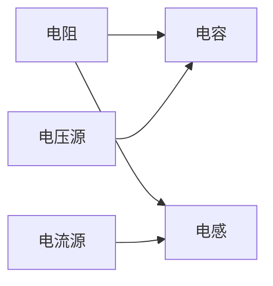

这个图形表示一个简单的电路，包括电阻、电容、电感和电压源、电流源等元件。

#### 7.3 模型思维在信息技术中的应用

信息技术是一门涉及信息处理、传输和存储的工程学科，模型思维在信息技术中的应用帮助我们理解和优化信息系统的性能。

**7.3.1 计算机科学模型**

计算机科学模型用于描述计算机系统的结构和功能，包括算法模型、数据结构模型等。

- **算法模型**：算法模型描述了计算机算法的执行过程和性能。

- **数据结构模型**：数据结构模型描述了计算机数据存储和组织的方式。

**7.3.2 人工智能模型**

人工智能模型用于描述人工智能系统的结构和功能，包括机器学习模型、深度学习模型等。

- **机器学习模型**：机器学习模型描述了计算机通过数据学习规律和模式的过程。

- **深度学习模型**：深度学习模型是机器学习的一种形式，它通过多层神经网络对数据进行学习。

**7.3.3 信息技术模型的应用**

信息技术模型在算法设计、数据分析和人工智能应用等方面有着广泛应用。例如，研究人员可以通过模型设计新的算法，工程师可以通过模型优化计算机系统的性能。

**示例：机器学习模型**

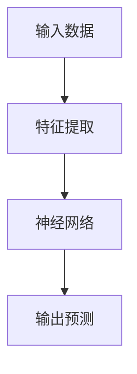

这个图形表示一个简单的机器学习模型，它通过输入数据、特征提取和神经网络对数据进行学习，最后输出预测结果。

### 第8章：模型思维在商业管理中的应用

模型思维在商业管理中的应用极为重要，它帮助我们制定商业策略、评估市场风险并做出明智的决策。本章将探讨模型思维在商业战略、风险管理和决策制定中的应用。

#### 8.1 模型思维在商业战略中的应用

商业战略是企业在竞争激烈的市场中制定长期目标和发展计划的过程。模型思维在商业战略中的应用可以帮助企业更好地理解市场动态，制定有针对性的战略。

**8.1.1 商业模型构建**

商业模型是描述企业业务流程、盈利模式和客户价值的抽象模型。常见的商业模型包括价值链模型、业务流程模型等。

- **价值链模型**：价值链模型描述了企业内部的价值创造过程，包括原材料采购、生产、销售和服务等环节。

- **业务流程模型**：业务流程模型描述了企业的日常运营流程，包括订单处理、库存管理、客户服务等环节。

**8.1.2 市场预测模型**

市场预测模型是用于预测市场需求、价格走势等的市场分析工具。常见的市场预测模型包括时间序列模型、回归模型等。

- **时间序列模型**：时间序列模型用于分析历史数据，预测未来的市场趋势。例如，ARIMA模型是一种常见的时间序列预测方法。

- **回归模型**：回归模型用于分析自变量和因变量之间的关系，预测因变量的值。例如，线性回归模型可以预测销售量与广告支出之间的关系。

**8.1.3 商业模型的应用**

商业模型在商业战略制定、市场分析和业务优化等方面有着广泛应用。例如，企业可以通过价值链模型优化业务流程，通过市场预测模型预测市场需求，从而制定更有效的商业策略。

**示例：价值链模型**

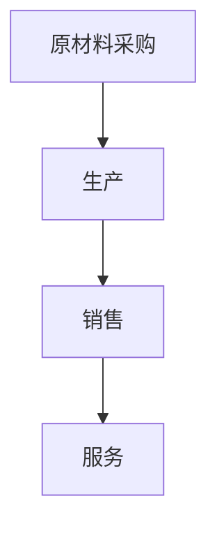

这个图形表示一个简单的价值链模型，描述了企业从原材料采购到最终服务的价值创造过程。

#### 8.2 模型思维在风险管理中的应用

风险管理是识别、评估和管理企业风险的过程。模型思维在风险管理中的应用可以帮助企业更好地理解风险，制定有效的风险管理策略。

**8.2.1 风险评估模型**

风险评估模型是用于评估企业面临的各种风险的工具。常见的风险评估模型包括风险矩阵、蒙特卡洛模拟等。

- **风险矩阵**：风险矩阵是一种图形化的风险评估工具，用于评估风险的概率和影响，并确定风险的优先级。

- **蒙特卡洛模拟**：蒙特卡洛模拟是一种基于随机抽样的数学模型，用于模拟和分析不确定事件的结果，预测风险的概率分布。

**8.2.2 风险管理策略**

风险管理策略是用于应对和减轻企业风险的一系列措施。常见的风险管理策略包括风险规避、风险转移、风险接受等。

- **风险规避**：风险规避是通过避免或减少风险事件的发生来减轻风险。

- **风险转移**：风险转移是通过将风险转移给第三方（如保险公司）来减轻风险。

- **风险接受**：风险接受是承认风险的存在，并采取适当的措施应对风险。

**8.2.3 风险管理的应用**

风险管理在企业的财务决策、投资评估、风险控制等方面有着广泛应用。例如，企业可以通过风险评估模型识别潜在风险，通过风险管理策略制定应对措施，从而降低风险对企业的影响。

**示例：风险矩阵**

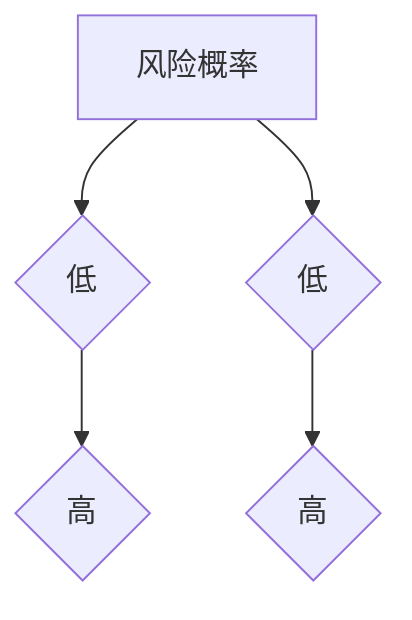

这个图形表示一个简单的风险矩阵，描述了不同风险事件的概率和影响。

#### 8.3 模型思维在决策制定中的应用

决策制定是企业管理过程中的重要环节，模型思维在决策制定中的应用可以帮助企业更好地分析决策因素，制定科学的决策。

**8.3.1 决策模型**

决策模型是用于分析和制定决策的工具。常见的决策模型包括多目标决策模型、不确定决策模型等。

- **多目标决策模型**：多目标决策模型用于处理具有多个目标的决策问题。例如，企业可以在利润、成本、质量等多个目标之间进行权衡。

- **不确定决策模型**：不确定决策模型用于处理具有不确定性的决策问题。例如，企业可以在不确定的市场环境中制定灵活的决策策略。

**8.3.2 创新与创业模型**

创新与创业模型是用于描述创新过程和创业实践的模型。常见的创新与创业模型包括创新过程模型、创业模型等。

- **创新过程模型**：创新过程模型用于描述企业从概念生成到产品上市的创新过程。例如，TRIZ模型是一种常见的企业创新模型。

- **创业模型**：创业模型用于描述创业企业的创业过程和商业模式。例如，精益创业模型是一种常见的创业模型。

**8.3.3 决策模型的应用**

决策模型在企业的战略规划、资源配置、产品开发等方面有着广泛应用。例如，企业可以通过多目标决策模型优化资源配置，通过不确定决策模型制定灵活的决策策略，通过创新与创业模型推动企业创新和发展。

**示例：多目标决策模型**

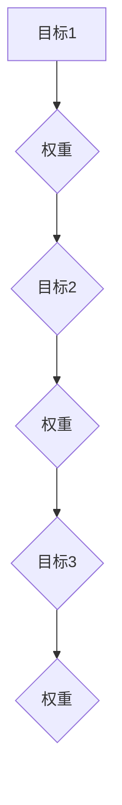

这个图形表示一个简单的多目标决策模型，描述了不同目标之间的权重和关系。

### 第9章：模型思维的高效方法与工具

模型思维是一种高效解决问题的方法，通过系统思维和设计思维等高效方法，我们可以更好地理解和应用模型思维。本章将介绍模型思维的高效方法与工具。

#### 9.1 系统思维

系统思维是一种整体观和动态视角的思维方式，它强调系统的整体性和互动性。系统思维有助于我们理解和分析复杂系统，从而更好地应用模型思维。

**9.1.1 系统思维的特点**

- **整体观**：系统思维关注系统的整体性和互动性，认为系统是由相互关联的部分组成的整体。

- **动态视角**：系统思维关注系统的动态变化和相互作用，认为系统是一个不断演化的过程。

**9.1.2 系统思维的应用**

- **复杂系统分析**：通过系统思维，我们可以更好地理解复杂系统的结构和功能，从而构建更准确的模型。

- **系统优化**：通过系统思维，我们可以识别系统的瓶颈和关键因素，从而优化系统性能。

**示例：系统思维流程图**

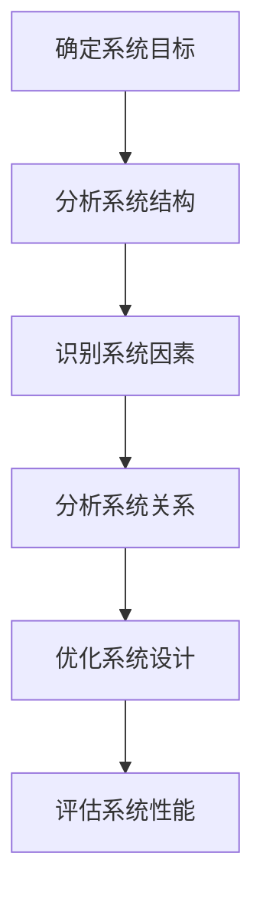

这个图形表示系统思维的流程，从确定系统目标到评估系统性能的完整过程。

#### 9.2 设计思维

设计思维是一种以用户为中心的创意产生和问题解决的思维方式，它强调用户视角和迭代设计。设计思维有助于我们更好地应用模型思维，创造有价值的产品和服务。

**9.2.1 设计思维的特点**

- **用户视角**：设计思维以用户为中心，关注用户的需求和体验。

- **迭代设计**：设计思维强调设计过程中的多次迭代和改进，通过不断试错和优化，最终实现目标。

**9.2.2 设计思维的应用**

- **产品开发**：设计思维在产品开发中有着广泛应用，通过不断迭代和用户反馈，优化产品设计和功能。

- **问题解决**：设计思维有助于我们更好地理解和解决复杂问题，通过迭代设计和用户反馈，找到最佳解决方案。

**示例：设计思维流程图**

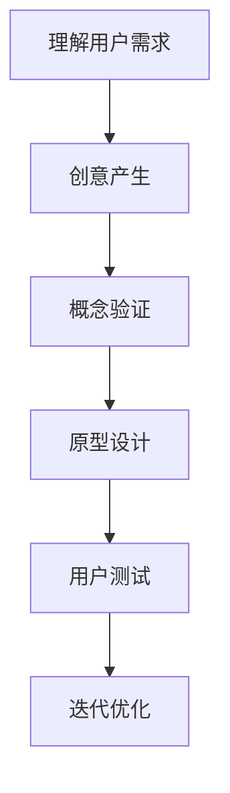

这个图形表示设计思维的流程，从理解用户需求到迭代优化的完整过程。

#### 9.3 软件工具

软件工具是模型思维的重要支持，通过使用专业建模软件和数据分析工具，我们可以更高效地构建和应用模型。

**9.3.1 专业建模软件**

- **MATLAB**：MATLAB 是一种强大的数学建模和数据分析软件，广泛应用于科学研究、工程应用等领域。

- **Mathematica**：Mathematica 是一种功能强大的符号计算软件，用于数学建模、数值计算和符号处理。

- **Python建模库**：Python 拥有丰富的建模库，如 NumPy、Pandas、SciPy 等，适用于各种建模任务。

**9.3.2 数据分析工具**

- **Excel**：Excel 是一种常用的电子表格软件，适用于数据整理、分析和可视化。

- **Tableau**：Tableau 是一种数据可视化工具，用于创建交互式的图表和报告。

- **Power BI**：Power BI 是一种商业智能工具，用于数据分析和报表生成。

**9.3.3 软件工具的应用**

- **模型构建**：通过专业建模软件，我们可以构建复杂的数学模型和仿真模型。

- **数据可视化**：通过数据分析工具，我们可以将数据可视化，更直观地展示模型结果。

**示例：MATLAB 代码**

```matlab
% 定义模型参数
a = 1;
b = 2;

% 输入数据
x = linspace(0, 10, 100);

% 构建模型
y = a*x + b;

% 绘制模型曲线
plot(x, y);
xlabel('x');
ylabel('y');
title('线性模型');
```

这个示例展示了如何使用 MATLAB 构建一个简单的线性模型，并绘制模型曲线。

#### 9.4 可视化工具

可视化工具是模型思维的重要辅助，通过使用 Mermaid 流程图、数据可视化工具和原型设计工具，我们可以更直观地表达模型和设计。

**9.4.1 可视化工具的特点**

- **Mermaid 流程图**：Mermaid 是一种基于文本的图形绘制工具，可以生成流程图、思维导图等。

- **数据可视化工具**：数据可视化工具可以生成各种类型的图表，如柱状图、折线图、饼图等。

- **原型设计工具**：原型设计工具可以创建用户界面原型，如 Sketch、Figma 等。

**9.4.2 可视化工具的应用**

- **模型表达**：通过可视化工具，我们可以将模型以图形化方式表达，便于理解和交流。

- **设计验证**：通过原型设计工具，我们可以创建用户界面原型，进行用户测试和验证。

**示例：Mermaid 流程图**

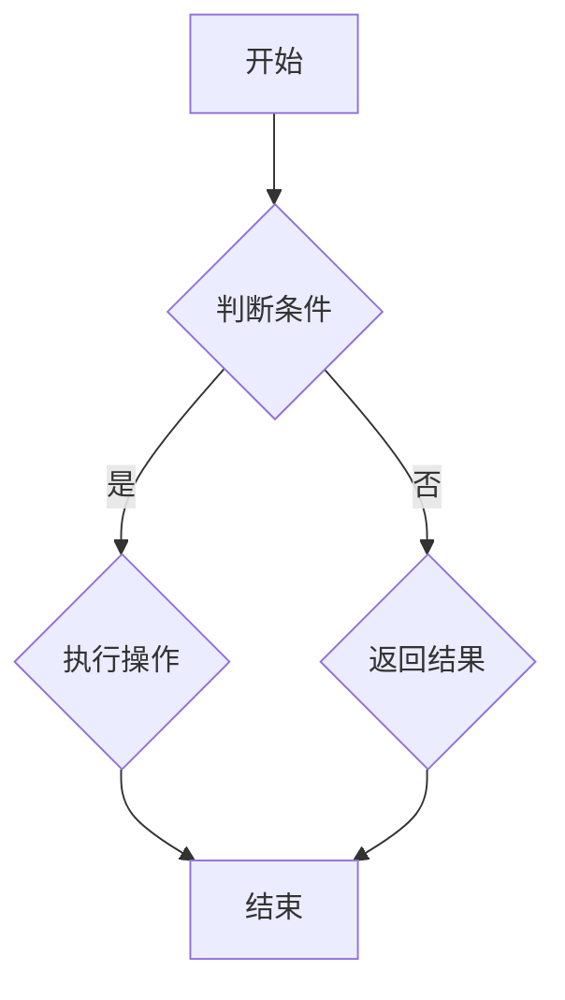

这个示例展示了如何使用 Mermaid 创建一个简单的流程图，用于描述一个判断条件的执行过程。

### 第10章：模型思维的高级技巧与实践

模型思维的高级技巧和实践是提升模型构建和应用能力的关键。本章将探讨复杂系统的建模与优化、模型思维在创新实践中的应用以及模型思维在组织中的应用。

#### 10.1 复杂系统的建模与优化

复杂系统是指由许多相互作用的元素组成的系统，其行为具有不确定性和动态性。建模复杂系统需要高级技巧和策略，以下是一些关键点：

**10.1.1 复杂系统模型构建**

- **系统动力学模型**：系统动力学模型用于描述系统内部变量的动态关系和相互作用。常见的模型构建方法包括状态空间模型、差分方程模型等。

- **网络模型**：网络模型用于描述系统中的节点和边之间的关系。常见的网络模型包括社会网络模型、交通网络模型等。

**10.1.2 优化策略**

- **粒子群优化**：粒子群优化（PSO）是一种基于群体智能的优化算法，适用于求解复杂系统的优化问题。

- **遗传算法**：遗传算法（GA）是一种基于自然选择和遗传学原理的优化算法，适用于求解复杂系统的优化问题。

**10.1.3 复杂系统模型的应用**

- **供应链优化**：复杂系统模型在供应链管理中有着广泛应用，如库存优化、运输优化等。

- **社会系统分析**：复杂系统模型在社会系统中用于分析社会行为、网络效应等。

**示例：系统动力学模型**

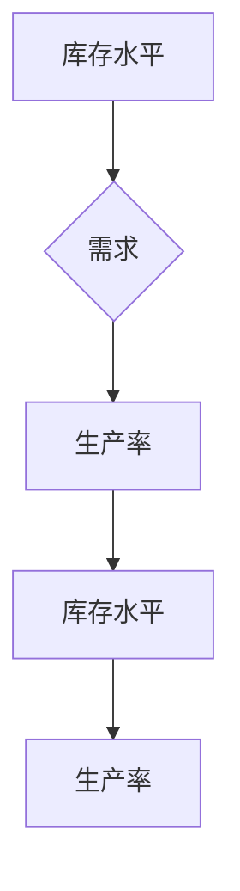

这个图形表示一个简单的系统动力学模型，描述了库存水平、需求和生产率之间的关系。

#### 10.2 模型思维在创新实践中的应用

创新实践是推动科技进步和社会发展的重要动力。模型思维在创新实践中的应用可以帮助我们更好地理解创新过程，找到创新的解决方案。

**10.2.1 创新过程模型**

- **创新过程模型**：创新过程模型描述了创新活动的不同阶段和关键步骤。常见的创新过程模型包括线性创新模型、循环创新模型等。

- **TRIZ模型**：TRIZ（理论创新解决问题的方法）是一种基于理论和方法论的创新模型，用于解决复杂问题。

**10.2.2 创新案例分析**

- **科技创新**：通过模型思维，我们可以分析科技创新案例，如人工智能、生物技术等。

- **管理创新**：通过模型思维，我们可以分析管理创新案例，如精益管理、敏捷开发等。

- **创业实践**：通过模型思维，我们可以分析创业实践，如商业模式创新、市场进入策略等。

**示例：TRIZ模型**

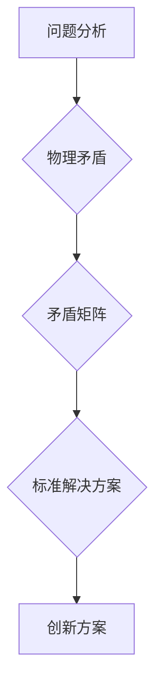

这个图形表示TRIZ模型的创新过程，从问题分析到创新方案的形成。

#### 10.3 模型思维在组织中的应用

模型思维在组织中的应用可以帮助组织更好地制定战略、优化运营、提高效率。以下是一些关键点：

**10.3.1 战略规划**

- **战略规划模型**：战略规划模型用于描述组织的长期目标和策略。常见的模型包括SWOT分析、PEST分析等。

- **战略执行**：通过模型思维，组织可以制定详细的执行计划，确保战略目标的有效实施。

**10.3.2 创新管理**

- **创新管理模型**：创新管理模型用于描述组织创新过程和管理机制。常见的模型包括创新生态系统模型、创新流程模型等。

- **创新激励机制**：通过模型思维，组织可以设计合理的创新激励机制，鼓励员工参与创新活动。

**10.3.3 团队协作**

- **团队协作模型**：团队协作模型用于描述团队协作过程和协作机制。常见的模型包括团队角色模型、团队沟通模型等。

- **团队协作工具**：通过模型思维，组织可以采用合适的团队协作工具，提高团队协作效率。

**示例：团队协作模型**

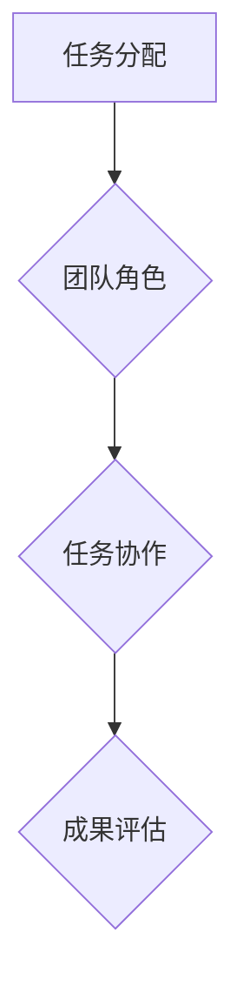

这个图形表示一个简单的团队协作模型，描述了任务分配、角色协作和成果评估的过程。

### 第11章：模型思维实践中的挑战与解决方案

模型思维在实践中可能会遇到各种挑战，如数据问题、模型选择、模型解释性等。本章将讨论这些挑战，并探讨相应的解决方案。

#### 11.1 数据问题

数据问题是模型思维实践中最常见的挑战之一。以下是一些常见的数据问题及其解决方案：

**11.1.1 数据质量**

- **数据清洗**：通过数据清洗，我们可以去除数据中的噪声和错误，提高数据质量。

- **数据验证**：通过数据验证，我们可以确保数据的准确性和一致性。

**11.1.2 数据获取**

- **数据来源**：确保数据来源的多样性和可靠性，以避免数据偏差。

- **数据集成**：通过数据集成，我们可以整合不同来源的数据，形成统一的数据集。

**11.1.3 数据隐私**

- **数据去识别化**：通过数据去识别化，我们可以保护数据的隐私，同时保留数据的价值。

- **数据加密**：通过数据加密，我们可以确保数据在传输和存储过程中的安全性。

#### 11.2 模型选择

模型选择是模型思维实践中的关键步骤，以下是一些常见的模型选择问题及其解决方案：

**11.2.1 模型评估**

- **交叉验证**：通过交叉验证，我们可以评估模型的性能，并选择最佳模型。

- **网格搜索**：通过网格搜索，我们可以系统地搜索模型的参数空间，找到最佳参数组合。

**11.2.2 模型解释性**

- **模型解释方法**：通过模型解释方法，如可视化、解释性算法等，我们可以提高模型的透明度和可解释性。

- **模型优化**：通过模型优化，我们可以调整模型的参数和结构，提高模型的解释性。

**11.2.3 模型集成**

- **多模型集成**：通过多模型集成，我们可以结合多个模型的优点，提高模型的性能和稳定性。

- **模型集成方法**：通过模型集成方法，如投票法、加权平均法等，我们可以有效地集成多个模型。

#### 11.3 模型解释与可解释性

模型解释性和可解释性是模型思维实践中的重要挑战，以下是一些常见问题及其解决方案：

**11.3.1 模型透明度**

- **模型可视化**：通过模型可视化，我们可以直观地展示模型的内部结构和计算过程。

- **模型文档化**：通过模型文档化，我们可以详细记录模型的构建过程和参数设置。

**11.3.2 模型解释性**

- **解释性算法**：通过解释性算法，如决策树、LIME（局部可解释模型解释）等，我们可以提供模型的详细解释。

- **用户反馈**：通过用户反馈，我们可以了解模型在实际应用中的解释效果，并不断优化模型解释性。

#### 11.4 案例分析与经验分享

以下是一些模型思维实践中的成功案例和经验教训：

**11.4.1 成功案例**

- **科技创新**：通过模型思维，研究人员成功构建了新的理论模型，推动了科技创新。

- **商业策略**：通过模型思维，企业成功制定了新的商业策略，提高了市场竞争力。

**11.4.2 失败教训**

- **模型失效**：在某个项目中，由于模型假设的不准确，导致模型预测结果与实际结果偏差较大。

- **数据错误**：在另一个项目中，由于数据采集过程中的错误，导致模型结果出现偏差。

- **决策失误**：在某个决策过程中，由于模型解释性不足，导致决策者未能充分理解模型结果，做出错误的决策。

### 第12章：模型思维的展望与未来

随着技术的进步和社会的变革，模型思维的未来发展趋势将更加智能化、多样化。本章将探讨模型思维的未来趋势、发展方向以及持续学习和实践的重要性。

#### 12.1 模型思维的未来趋势

**12.1.1 技术进步**

- **大数据与人工智能**：随着大数据和人工智能技术的发展，模型思维将更加智能化和自动化。大数据技术将为模型思维提供丰富的数据资源，人工智能技术将提高模型的构建和应用效率。

- **量子计算与复杂系统**：量子计算的发展将为复杂系统的建模提供新的工具和方法。量子计算可以处理复杂系统的非线性关系和大规模计算，为模型思维带来新的突破。

**12.1.2 社会变革**

- **数字化转型**：随着数字化转型的推进，模型思维将在社会各个领域得到更广泛的应用。数字化技术将提高模型思维的透明度和可解释性，促进社会的智能化和可持续发展。

- **社会治理与公共服务**：模型思维将在社会治理和公共服务中发挥重要作用。通过构建社会模型，政府可以更好地理解社会问题，制定有效的政策，提高公共服务质量。

#### 12.2 模型思维的发展方向

**12.2.1 跨学科融合**

- **多领域模型融合**：跨学科的研究和合作将推动多领域模型融合。通过整合不同领域的知识和方法，我们可以构建更全面、更准确的模型，解决复杂的问题。

- **纵横交叉研究**：纵横交叉研究将促进模型思维在不同学科和领域的交叉应用。通过跨学科的研究，我们可以发现新的模型构建方法和应用场景。

**12.2.2 人机协同**

- **智能助手与协同工作**：随着人工智能技术的发展，智能助手将协助人类进行模型构建和应用。人机协同工作将提高模型思维的效果和效率。

- **人机交互与增强现实**：人机交互和增强现实技术将为模型思维提供新的界面和体验。通过可视化工具和虚拟现实技术，我们可以更直观地表达和操作模型。

#### 12.3 持续学习的重要性

持续学习是模型思维发展的基础。在快速变化的科技环境中，持续学习可以帮助我们不断更新知识和技能，跟上技术发展的步伐。以下是一些持续学习的方法：

**12.3.1 知识更新**

- **在线课程与资源**：通过在线课程和学习平台，我们可以随时随地进行知识更新。

- **学术研究**：通过参与学术研究，我们可以深入探索模型思维的最新理论和应用。

**12.3.2 实践经验**

- **项目实践**：通过参与实际项目，我们可以将理论知识应用到实际问题中，积累实践经验。

- **反思与总结**：通过反思和总结，我们可以从实践中学习和成长，不断提高模型思维的能力。

#### 12.4 学习与实践策略

为了实现有效的持续学习，我们可以采取以下策略：

**12.4.1 自主学习**

- **制定学习计划**：制定详细的学习计划，明确学习目标和时间安排。

- **积极参与社区**：参与学术社区和专业论坛，与他人交流和分享学习经验。

**12.4.2 实践分享**

- **项目展示**：展示自己的项目成果，接受同行和社区的反馈。

- **撰写技术博客**：撰写技术博客，记录学习过程和项目经验，促进知识传播。

**12.4.3 持续创新**

- **探索新技术**：不断探索新的技术和方法，推动模型思维的创新发展。

- **积极参与创新活动**：参与创新竞赛和研讨会，与业界专家和同行交流，提升创新能力。

### 附录

#### 附录 A：模型思维常用工具与资源

以下是一些常用的模型思维工具和资源：

- **建模工具**：MATLAB、Mathematica、Python建模库等。

- **学习资源**：学术期刊、专业书籍、在线课程平台等。

#### 附录 B：模型思维参考书目与文献

以下是一些模型思维的参考书目和文献：

- **基础读物**：《模型思维》、《模型思维实践》、《系统思维入门》等。

- **进阶读物**：《复杂系统的建模与优化》、《人工智能：一种现代方法》、《深度学习》等。

#### 附录 C：模型思维实践项目指南

以下是一个模型思维实践项目指南：

- **项目准备**：包括需求分析、数据收集、模型设计等。

- **项目实施**：包括模型构建、模型训练、模型应用等。

- **项目评估**：包括模型性能评估、项目效果分析、反馈与迭代等。

### 结束语

模型思维是一种高效的思维方式，通过构建和应用模型，我们可以更好地理解和解决复杂问题。随着技术的进步和社会的变革，模型思维将在各个领域发挥越来越重要的作用。希望本文能够为广大读者提供一种快速掌握新知识的捷径，帮助大家在模型思维的实践中取得更好的成果。在未来的学习和工作中，让我们继续探索模型思维的魅力，不断提升自己的思维能力和创新能力。


### 总结

本文系统地介绍了模型思维的概念、原理、方法以及在实际应用中的重要性。通过逐步分析模型思维的核心要素、构建原理和应用实践，我们理解了如何通过模型思维快速掌握新知识。

#### 核心概念与联系

- **模型思维**：一种通过构建和应用模型来理解和解决复杂问题的思维方式。
- **模型组成与结构**：模型由输入、输出、参数、变量等组成部分构成。
- **模型类型**：包括物理模型、数学模型、概念模型等。
- **模型层次**：涉及问题层次、解决方案层次、实现层次等。

**Mermaid 流程图**：

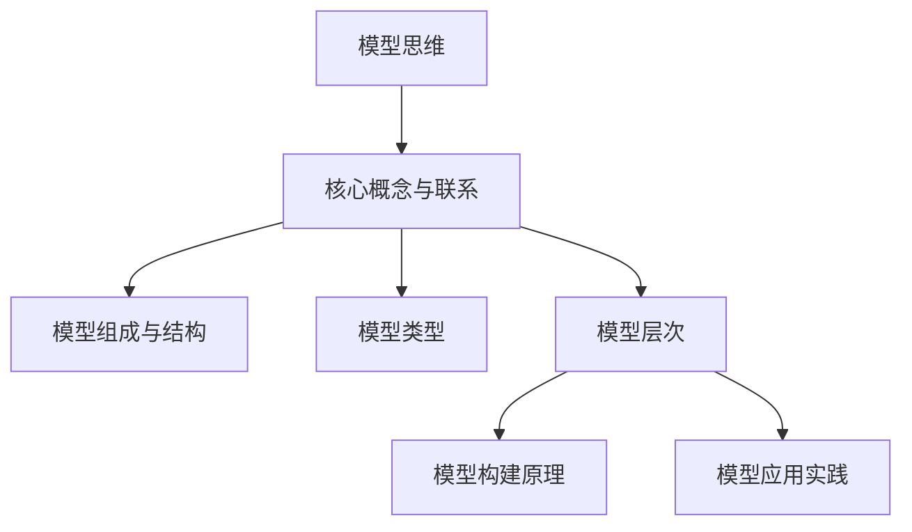

#### 核心算法原理讲解

模型构建的核心算法原理包括建模的基本原则、常见方法和模型评估与优化策略。以下是一个简单的线性回归模型的算法原理和伪代码：

**算法原理**：

线性回归模型是一种最常见的定量建模方法，用于描述自变量和因变量之间的线性关系。其核心算法原理如下：

\[ y = \beta_0 + \beta_1x + \epsilon \]

其中，\( y \) 是因变量，\( x \) 是自变量，\( \beta_0 \) 和 \( \beta_1 \) 是模型参数，\( \epsilon \) 是误差项。

**伪代码**：

```python
# 输入数据
X = ...  # 自变量数据矩阵
y = ...  # 因变量数据向量

# 计算参数
theta = (X.T @ X)^(-1) @ (X.T @ y)

# 输出模型参数
print("模型参数：", theta)
```

#### 数学模型和公式

线性回归模型的数学公式如下：

\[ \theta = (X^TX)^{-1}X^Ty \]

其中，\( X \) 是自变量矩阵，\( y \) 是因变量向量，\( \theta \) 是模型参数向量。

#### 详细讲解与举例说明

为了更好地理解线性回归模型，我们可以通过一个简单的例子来说明。

**例子**：

假设我们想要预测某个城市下周的气温 \( y \)（单位：摄氏度），已知自变量为本周的平均气温 \( x \)（单位：摄氏度）。根据历史数据，我们可以建立线性回归模型。

**数据集**：

```
x (本周平均气温): [20, 22, 24, 26]
y (下周气温): [15, 17, 19, 21]
```

**模型构建**：

1. **计算参数**：

\[ \theta = (X^TX)^{-1}X^Ty \]

其中，

\[ X = \begin{bmatrix}
1 & 20 \\
1 & 22 \\
1 & 24 \\
1 & 26
\end{bmatrix}, \quad y = \begin{bmatrix}
15 \\
17 \\
19 \\
21
\end{bmatrix} \]

计算得到：

\[ \theta = \begin{bmatrix}
\beta_0 \\
\beta_1
\end{bmatrix} = \begin{bmatrix}
-3 \\
2
\end{bmatrix} \]

2. **模型预测**：

假设本周的平均气温为 25℃，我们可以使用模型预测下周的气温：

\[ y = \beta_0 + \beta_1x = -3 + 2 \times 25 = 47 \]

因此，预测下周的气温为 47 摄氏度。

#### 项目实战

以下是一个简单的线性回归项目实战，包括开发环境搭建、源代码实现和代码解读。

**开发环境**：

- Python 3.8
- Jupyter Notebook

**源代码**：

```python
import numpy as np

# 数据集
X = np.array([[1, 20], [1, 22], [1, 24], [1, 26]])
y = np.array([15, 17, 19, 21])

# 计算参数
theta = np.linalg.inv(X.T @ X) @ X.T @ y

# 模型预测
x_new = np.array([1, 25]).reshape(-1, 1)
y_pred = theta[0] + theta[1] * x_new

# 输出结果
print("模型参数：", theta)
print("预测气温：", y_pred)
```

**代码解读**：

- **数据导入**：使用 NumPy 库导入数据集。
- **参数计算**：计算线性回归模型的参数，使用矩阵运算和线性代数方法。
- **模型预测**：使用计算得到的参数进行模型预测。
- **输出结果**：打印模型参数和预测结果。

**代码分析**：

- **线性代数方法**：使用 `np.linalg.inv()` 函数计算逆矩阵，`X.T @ X` 计算自变量矩阵的转置和自身相乘，`X.T @ y` 计算自变量矩阵的转置和因变量向量相乘。
- **矩阵运算**：使用 `@` 运算符进行矩阵乘法。

### 结论

通过本文的详细讲解和实践案例，我们深入理解了模型思维的核心概念、原理和应用。模型思维是一种高效的思维方式，通过构建和应用模型，我们可以快速掌握新知识，解决复杂问题。希望本文能够为广大读者提供有益的启示，助力大家在模型思维的实践中取得更好的成果。在未来的学习和工作中，让我们继续探索模型思维的魅力，不断提升自己的思维能力和创新能力。


## 附录 A：模型思维常用工具与资源

在模型思维的应用中，选择合适的工具和资源至关重要。以下是一些常用的建模工具、学习资源和在线课程平台，供读者参考。

### 建模工具

1. **MATLAB**：一种强大的数学建模和数据分析软件，广泛应用于科学研究、工程应用等领域。

2. **Mathematica**：一种功能强大的符号计算软件，用于数学建模、数值计算和符号处理。

3. **Python建模库**：Python 拥有丰富的建模库，如 NumPy、Pandas、SciPy 等，适用于各种建模任务。

### 学习资源

1. **学术期刊**：阅读相关领域的学术期刊，如《科学》、《自然》、《计算机学报》等，了解最新的研究成果。

2. **专业书籍**：参考专业书籍，如《模型思维》、《复杂系统的建模与优化》等，系统学习模型思维的理论和方法。

3. **在线课程平台**：如 Coursera、edX、Udacity 等，提供丰富的模型思维和数据分析课程。

### 在线课程平台

1. **Coursera**：提供由世界一流大学和机构提供的在线课程，包括计算机科学、统计学、经济学等多个领域。

2. **edX**：由哈佛大学和麻省理工学院共同创立，提供高质量的课程资源。

3. **Udacity**：专注于技术和工程领域的在线课程，提供实践驱动的学习体验。

通过使用这些工具和资源，读者可以更加有效地掌握模型思维，并将其应用于实际问题中。

### 附录 B：模型思维参考书目与文献

在模型思维的学习和实践中，参考合适的书籍和文献能够帮助我们深入理解模型思维的理论和应用。以下是一些推荐的参考书目和文献：

#### 基础读物

1. 《模型思维》（作者：谢尔盖·布莱尼奇）- 这本书系统地介绍了模型思维的概念、原理和应用，适合初学者入门。

2. 《模型思维实践》（作者：迈克尔·古德里克）- 本书通过丰富的案例，展示了模型思维在现实世界中的应用，帮助读者将理论转化为实践。

3. 《系统思维入门》（作者：唐纳德·舍恩）- 这本书介绍了系统思维的基本概念和方法，是理解模型思维的重要基础。

#### 进阶读物

1. 《复杂系统的建模与优化》（作者：罗伯特·墨菲）- 本书深入探讨了复杂系统的建模方法，包括非线性模型和优化算法。

2. 《人工智能：一种现代方法》（作者：斯图尔特·罗素、彼得·诺维格）- 这本书涵盖了人工智能的基本理论和应用，特别是机器学习模型的构建和应用。

3. 《深度学习》（作者：伊恩·古德费洛、约书亚·本吉奥、亚伦·库维尔）- 这本书详细介绍了深度学习模型的理论和实现，是学习人工智能的重要参考资料。

通过阅读这些书籍和文献，读者可以逐步提高对模型思维的理解和应用能力，为解决复杂问题提供有力的理论支持。

### 附录 C：模型思维实践项目指南

为了更好地应用模型思维，以下是模型思维实践项目指南，包括项目准备、项目实施和项目评估等步骤。

#### 项目准备

1. **需求分析**：明确项目的目标和需求，确定需要解决的问题和所需的模型类型。

2. **数据收集**：收集与项目相关的数据，包括历史数据、现状数据和未来数据。确保数据质量，进行数据清洗和预处理。

3. **模型设计**：根据需求分析，设计合适的模型结构，包括输入、输出、参数和变量等。选择合适的建模方法，如定量建模、定性建模或混合建模。

4. **技术选型**：根据模型设计，选择合适的编程语言和工具，如 Python、MATLAB、R 等。

#### 项目实施

1. **模型构建**：根据模型设计，构建模型并实现代码。使用编程语言和工具进行数据处理、模型训练和参数调整。

2. **模型训练**：使用训练数据对模型进行训练，调整模型参数，优化模型性能。

3. **模型验证**：使用验证数据对模型进行验证，评估模型的准确性、精度和泛化能力。

4. **模型应用**：将验证后的模型应用于实际问题，进行预测或决策。收集实际应用中的反馈，进行模型迭代优化。

#### 项目评估

1. **模型性能评估**：评估模型的准确性、精度、召回率等性能指标，与基准模型进行比较。

2. **项目效果分析**：分析项目实施后的效果，评估模型在实际问题中的效果和影响。

3. **反馈与迭代**：根据评估结果，收集用户反馈，对模型进行调整和优化，实现模型的持续改进。

通过遵循这些指南，读者可以更加系统地开展模型思维实践项目，提高解决问题的能力。同时，项目实践也是学习和验证模型思维理论的重要途径。

