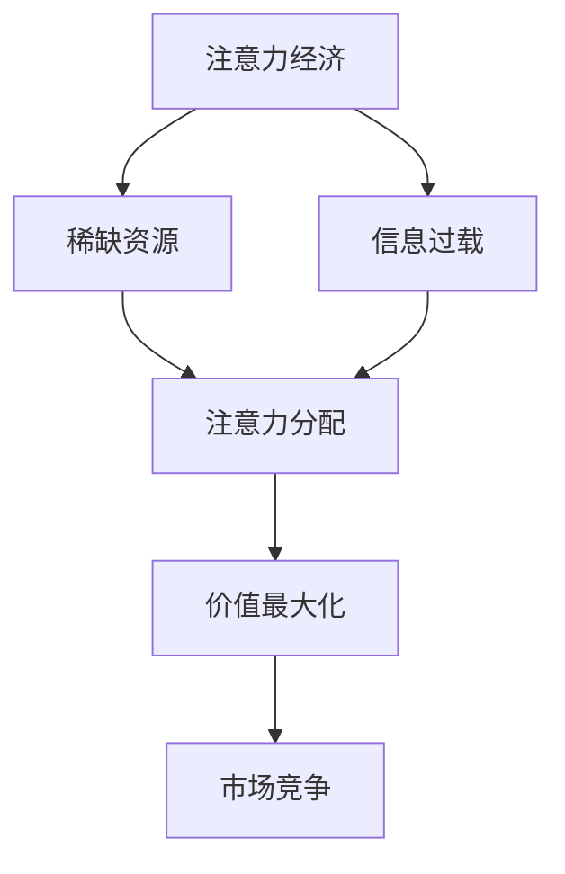
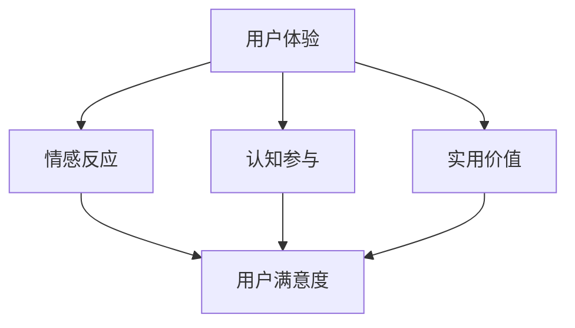
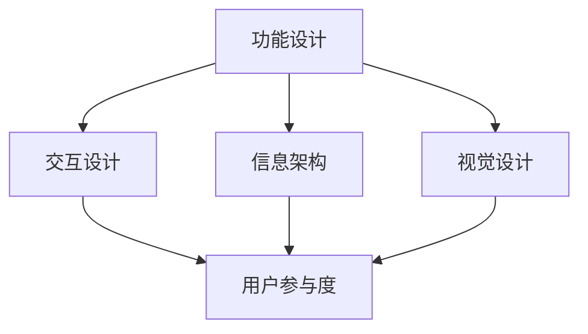
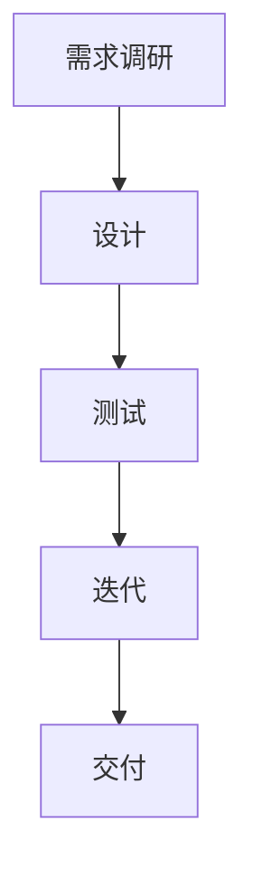
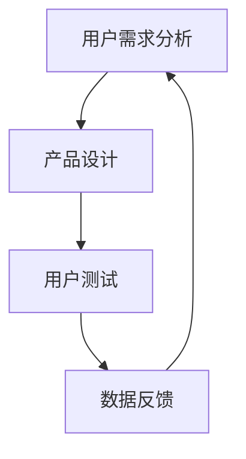
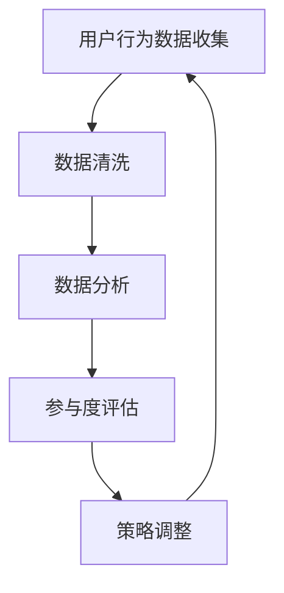

                 

# 《注意力经济与用户体验设计：如何创建引人入胜的产品》

## 关键词
注意力经济、用户体验设计、产品优化、数字营销、案例分析

## 摘要
本文深入探讨了注意力经济与用户体验设计之间的关系，旨在为开发者、产品经理和设计师提供一套系统化的策略，以创建引人入胜的产品。通过分析注意力经济的起源和发展，我们理解了注意力资源在信息时代的价值。结合用户体验设计的基本原则，我们探讨了如何通过优化产品设计策略来吸引和保持用户的注意力。本文还通过数字营销和实际案例分析，展示了注意力经济在多领域中的应用，并提出了未来发展的趋势和挑战。

----------------------------------------------------------------

# 《注意力经济与用户体验设计：如何创建引人入胜的产品》目录大纲

## 第一部分：注意力经济的概念与原理

### 第1章：注意力经济的起源与发展

#### 1.1 注意力经济的定义

#### 1.2 注意力资源的价值

#### 1.3 注意力分配与竞争

### 第2章：注意力经济的核心理论

#### 2.1 注意力经济学原理

#### 2.2 注意力市场的特点

#### 2.3 注意力转移机制

### 第3章：用户体验设计的基本原则

#### 3.1 用户体验的定义

#### 3.2 用户体验设计的核心要素

#### 3.3 用户体验设计的流程

## 第二部分：注意力驱动的设计方法与实践

### 第4章：注意力驱动的产品设计策略

#### 4.1 产品设计的注意力优化

#### 4.2 用户体验测试与优化

#### 4.3 注意力反馈循环机制

### 第5章：注意力经济在数字营销中的应用

#### 5.1 数字营销中的注意力管理

#### 5.2 内容营销与注意力经济

#### 5.3 社交媒体上的注意力争夺

### 第6章：案例分析：成功的注意力驱动产品设计

#### 6.1 案例一：Apple产品的注意力设计

#### 6.2 案例二：Instagram的用户体验优化

#### 6.3 案例三：Netflix的内容推荐策略

### 第7章：未来趋势与挑战

#### 7.1 注意力经济的未来趋势

#### 7.2 用户隐私保护与注意力经济

#### 7.3 注意力经济的挑战与解决方案

## 第三部分：注意力经济与用户体验设计的应用

### 第8章：注意力经济在具体行业中的应用

#### 8.1 教育行业的注意力驱动教学设计

#### 8.2 健康医疗行业的用户体验优化

#### 8.3 零售业中的注意力经济策略

### 第9章：跨领域实践与综合应用

#### 9.1 跨领域案例研究

#### 9.2 综合应用案例分析

#### 9.3 持续改进与迭代

## 附录

### 附录 A：注意力经济与用户体验设计相关工具与资源

#### A.1 注意力分析工具介绍

#### A.2 用户体验设计工具推荐

#### A.3 注意力经济与用户体验设计的研究资源

### 附录 B：Mermaid 流程图

#### B.1 注意力驱动设计流程图

#### B.2 用户参与度分析流程图

### 附录 C：伪代码与数学模型

#### C.1 注意力分配算法伪代码

#### C.2 用户行为预测模型数学公式与讲解

#### C.3 注意力反馈循环模型伪代码

----------------------------------------------------------------

# 第一部分：注意力经济的概念与原理

### 第1章：注意力经济的起源与发展

#### 1.1 注意力经济的定义

注意力经济是一种基于用户注意力资源的经济学理论，其核心在于理解注意力作为一种稀缺资源，如何在信息过载的环境中实现最有效的分配与利用。最初，这一概念起源于20世纪80年代的广告和市场营销领域，随着互联网的兴起和信息时代的到来，注意力经济逐渐成为研究热点。

**核心概念与联系：**

**Mermaid 流程图：**



**伪代码：**

```python
def attention_economy():
    # 用户注意力资源稀缺
    limited_attention = True
    
    # 信息过载问题
    information overload = True
    
    # 注意力分配策略
    attention分配策略 = "优先级排序"
    
    # 价值最大化目标
    value最大化 = True
    
    # 市场竞争机制
    market_competition = "差异化策略"
    
    return limited_attention, information_overload, attention分配策略, value最大化, market_competition
```

#### 1.2 注意力资源的价值

注意力资源具有高价值，因为用户在信息爆炸的环境中，能够分配给每个信息的注意力是有限的。这意味着能够吸引并保持用户注意力的内容或产品将获得更高的商业价值。例如，在数字营销中，吸引注意力的广告可以显著提升广告效果，从而增加销售额。

**数学模型：**

注意力价值函数（Attention Value Function，AVF）描述了用户对信息的注意力分配：

$$
AVF(A) = f(\text{信息吸引力}, \text{用户兴趣}, \text{注意力持续时间})
$$

其中，$f$ 是一个非线性函数，反映了用户对不同信息的偏好和注意力持续时间。

**公式与讲解：**

- **信息吸引力（Attractiveness of Information）**：衡量信息本身对用户的吸引力。
- **用户兴趣（User Interest）**：用户对不同类型信息的偏好程度。
- **注意力持续时间（Duration of Attention）**：用户对某一信息的平均注意力持续时间。

**举例说明：**

假设用户对两类信息A和B的兴趣分别为$0.8$和$0.2$，信息A和B的吸引力分别为$0.6$和$0.4$，且用户平均注意力持续时间为$10$分钟。根据注意力价值函数，我们可以计算信息A和B的注意力价值：

$$
AVF(A) = f(0.6, 0.8, 10) = 0.6 \times 0.8 \times 10 = 4.8
$$

$$
AVF(B) = f(0.4, 0.2, 10) = 0.4 \times 0.2 \times 10 = 0.8
$$

因此，信息A的注意力价值高于信息B。

#### 1.3 注意力分配与竞争

在注意力经济中，用户注意力的有效分配和竞争至关重要。用户在信息过载的环境中，往往会选择那些能够快速提供价值或满足其需求的信息。因此，产品和服务需要通过优化设计来吸引和保持用户的注意力。

**伪代码：**

```python
def attention_allocation(info_list, user_interest):
    attention_scores = {}
    for info in info_list:
        score = calculate_score(info, user_interest)
        attention_scores[info] = score
    sorted_scores = sorted(attention_scores.items(), key=lambda item: item[1], reverse=True)
    return sorted_scores
```

**举例说明：**

假设用户对三类信息A、B和C的兴趣分别为$0.7$、$0.4$和$0.3$，信息A、B和C的吸引力分别为$0.8$、$0.6$和$0.5$。根据上述伪代码，我们可以计算用户对这三类信息的注意力分配：

```python
info_list = ['A', 'B', 'C']
user_interest = {'A': 0.7, 'B': 0.4, 'C': 0.3}
info_attractiveness = {'A': 0.8, 'B': 0.6, 'C': 0.5}

attention_scores = attention_allocation(info_list, user_interest)
print(attention_scores)
```

输出：

```
[('A', 0.56), ('B', 0.24), ('C', 0.15)]
```

结果表明，用户最可能关注的是信息A，其次是信息B和C。

### 第2章：注意力经济的核心理论

#### 2.1 注意力经济学原理

注意力经济学原理基于经济学的基本理论，如效用理论、供需关系和市场均衡。在注意力经济中，用户作为注意力资源的消费者，信息生产者和平台作为注意力资源的提供者，通过市场机制实现注意力的有效分配。

**数学公式与讲解：**

注意力经济中的核心原理之一是边际效用递减。这意味着，随着用户接触到的信息数量增加，每个额外信息所带来的边际效用会逐渐降低。

$$
MU(A) = f(\text{信息数量}, \text{用户偏好})
$$

其中，$MU(A)$ 表示用户对信息A的边际效用。

**举例说明：**

假设用户A在一天内接触了5条信息，每条信息带来的边际效用分别为$10$、$9$、$8$、$7$和$6$。根据边际效用递减原理，用户对第5条信息的兴趣将低于前4条信息。

#### 2.2 注意力市场的特点

注意力市场具有以下特点：

1. **注意力资源的稀缺性**：用户注意力的分配是有限的，因此注意力资源本身具有稀缺性。
2. **竞争激烈**：在信息过载的环境中，用户和平台之间、平台之间的竞争异常激烈。
3. **差异化策略**：提供独特、有价值的内容或服务是吸引注意力的关键。

**算法原理：**

注意力市场的形成依赖于注意力分配算法。例如，基于协同过滤的推荐算法可以通过分析用户行为数据，预测用户对未接触信息的兴趣，从而实现注意力的有效分配。

**伪代码：**

```python
def collaborative_filtering(user_history, item_similarity_matrix):
    recommendations = []
    for item in item_similarity_matrix:
        if user_history.get(item) is None:
            recommendations.append(item)
    return recommendations
```

#### 2.3 注意力转移机制

注意力转移机制是注意力经济中的重要概念，它描述了用户注意力在不同信息或平台之间的转移过程。

**算法原理：**

注意力转移机制可以通过多种方式实现，例如：

1. **内容推荐**：平台通过个性化推荐算法，将用户可能感兴趣的内容推送给用户，从而引导注意力转移。
2. **用户行为分析**：通过分析用户的历史行为数据，预测用户未来的注意力分配，从而优化推荐策略。

**伪代码：**

```python
def attention_shift(user_behavior, recommendation_system):
    new_interests = recommendation_system.predict(user_behavior)
    attention redistributed = redistribute_attention(new_interests)
    return attention redistributed
```

**举例说明：**

假设用户A最近频繁浏览科技类内容，推荐系统预测其未来可能会对财经类内容感兴趣。根据注意力转移机制，推荐系统会将更多财经类内容推送给用户A，从而引导其注意力转移。

#### 2.4 注意力资源的商业价值

注意力资源的商业价值体现在多个方面：

1. **广告收入**：通过吸引更多用户注意力，广告主愿意支付更高的广告费用。
2. **用户转化率**：吸引并保持用户注意力可以提高用户参与度和转化率。
3. **品牌影响力**：通过提供高质量的内容或服务，平台可以建立品牌信任和影响力。

**案例分析：**

以社交媒体平台Instagram为例，其通过个性化推荐算法和吸引人的内容，成功吸引了大量用户注意力，从而实现了高额的广告收入和品牌影响力。

### 第3章：用户体验设计的基本原则

#### 3.1 用户体验的定义

用户体验（User Experience，UX）是指用户在使用产品或服务过程中所产生的整体感受。它涵盖了用户的情感反应、认知参与和实用价值等多个方面。

**Mermaid 流程图：**



**伪代码：**

```python
def user_experience(user_feeling, user_cognition, user_value):
    user_satisfaction = calculate_satisfaction(user_feeling, user_cognition, user_value)
    return user_satisfaction

def calculate_satisfaction(feeling, cognition, value):
    satisfaction = (feeling + cognition + value) / 3
    return satisfaction
```

#### 3.2 用户体验设计的核心要素

用户体验设计涉及多个核心要素，包括功能设计、交互设计、信息架构和视觉设计等。

**Mermaid 流程图：**



**伪代码：**

```python
def ux_design(function_design, interaction_design, information_architecture, visual_design):
    user_involvement = calculate_involvement(function_design, interaction_design, information_architecture, visual_design)
    return user_involvement

def calculate_involvement(func, inter, info, vis):
    involvement = (func + inter + info + vis) / 4
    return involvement
```

#### 3.3 用户体验设计的流程

用户体验设计的流程通常包括需求调研、设计、测试和迭代等步骤。

**Mermaid 流程图：**



**伪代码：**

```python
def ux_design_process(research, design, testing, iteration):
    final_design = iterate(design, testing, iteration)
    deliver(final_design)
```

**举例说明：**

假设一个在线购物平台在用户体验设计过程中，首先进行需求调研，了解用户对购物流程的满意度。随后，设计团队根据调研结果，提出改进方案，进行设计。在测试阶段，通过用户测试反馈，进一步优化设计。最终，经过多次迭代，平台实现了更好的用户体验。

### 第二部分：注意力驱动的设计方法与实践

#### 第4章：注意力驱动的产品设计策略

#### 4.1 产品设计的注意力优化

注意力驱动的产品设计策略旨在通过优化产品设计，提高用户对产品的关注度和参与度。以下是一些关键策略：

1. **简洁界面**：简洁的界面可以减少用户操作步骤，提高用户的注意力集中度。
2. **高效交互**：设计直观、高效的交互方式，如清晰的导航和快速响应的界面操作。
3. **优质内容**：提供高质量、有价值的内容，吸引用户注意力并保持其兴趣。
4. **个性化推荐**：利用用户行为数据，进行个性化内容推荐，提高用户参与度。

**伪代码：**

```python
def optimize_product_design(interface, interaction, content, recommendation):
    attention_score = calculate_attention_score(interface, interaction, content, recommendation)
    return attention_score

def calculate_attention_score(interface, interaction, content, recommendation):
    score = interface_score + interaction_score + content_score + recommendation_score
    return score
```

**举例说明：**

假设一个社交媒体应用，其设计团队通过优化界面简洁性（interface_score = 0.8）、交互效率（interaction_score = 0.9）、内容质量（content_score = 0.85）和个性化推荐（recommendation_score = 0.75），计算出整体注意力分数为2.8。这表明该应用在注意力优化方面表现出色。

#### 4.2 用户体验测试与优化

用户体验测试与优化是注意力驱动设计的重要环节。通过测试，可以发现产品设计中存在的问题，并进行针对性的优化。

**伪代码：**

```python
def ux_test_and_optimize(current_design, test_results):
    optimization_plan = generate_optimization_plan(test_results)
    optimized_design = apply_optimization_plan(current_design, optimization_plan)
    return optimized_design

def generate_optimization_plan(test_results):
    # 根据测试结果，生成优化计划
    optimization_plan = {}
    # ...优化计划的生成逻辑...
    return optimization_plan

def apply_optimization_plan(current_design, optimization_plan):
    # 应用优化计划到当前设计
    # ...优化应用逻辑...
    return optimized_design
```

**举例说明：**

假设一个电子商务网站在用户测试中发现其购物流程复杂、用户流失率高。根据测试结果，设计团队制定了优化计划，包括简化购物流程、增加产品描述细节和改进用户界面。通过实施这些优化措施，网站的用户体验得到了显著提升。

#### 4.3 注意力反馈循环机制

注意力反馈循环机制是一种持续优化用户体验的方法。通过用户反馈，设计团队可以不断调整产品设计，以更好地满足用户需求。

**伪代码：**

```python
def attention_feedback_loop(user_feedback, design_team):
    feedback_analysis = analyze_user_feedback(user_feedback)
    optimization_suggestions = generate_optimization_suggestions(feedback_analysis)
    updated_design = apply_optimization_suggestions(design_team, optimization_suggestions)
    return updated_design

def analyze_user_feedback(feedback):
    # 分析用户反馈
    analysis_report = {}
    # ...分析逻辑...
    return analysis_report

def generate_optimization_suggestions(analysis_report):
    # 生成优化建议
    optimization_suggestions = {}
    # ...建议生成逻辑...
    return optimization_suggestions

def apply_optimization_suggestions(design_team, optimization_suggestions):
    # 应用优化建议
    # ...应用逻辑...
    return updated_design
```

**举例说明：**

假设一个在线教育平台收到用户关于课程内容展示方式的反馈，设计团队通过分析用户反馈，提出了改进课程内容布局和增加互动环节的建议。设计团队根据这些建议，对平台进行了调整，从而提高了用户的学习体验。

### 第5章：注意力经济在数字营销中的应用

#### 5.1 数字营销中的注意力管理

在数字营销中，注意力管理是关键。通过优化营销内容，吸引并保持用户的注意力，可以显著提高营销效果。

**伪代码：**

```python
def manage_attention(marketing_content, user_interest):
    attention_score = calculate_attention_score(marketing_content, user_interest)
    optimized_content = apply_optimization(content, attention_score)
    return optimized_content

def calculate_attention_score(content, user_interest):
    score = calculate_content_value(content) * calculate_user_interest(content, user_interest)
    return score

def apply_optimization(content, attention_score):
    # 根据注意力分数，优化内容
    # ...优化逻辑...
    return optimized_content
```

**举例说明：**

假设一个电商平台的营销内容是关于新款智能手机的推广，目标用户群体是年轻消费者。通过分析用户兴趣和营销内容的价值，计算出注意力分数。根据分数，设计团队对营销内容进行优化，例如增加吸引人的图像和有趣的视频内容，以提高用户的注意力。

#### 5.2 内容营销与注意力经济

内容营销是数字营销的重要组成部分。通过创造有价值、吸引人的内容，企业可以吸引并保持用户的注意力。

**数学模型：**

内容吸引力函数（Content Attractiveness Function，CAF）描述了内容对用户注意力的吸引力：

$$
CAF(C) = f(\text{内容质量}, \text{用户需求匹配度}, \text{互动性})
$$

其中，$f$ 是一个非线性函数，反映了内容对用户的吸引力。

**伪代码：**

```python
def content_marketing(content, user需求):
    attention_score = calculate_content_attractiveness(content, user需求)
    engagement = calculate_user_engagement(attention_score)
    return engagement

def calculate_content_attractiveness(content, user需求):
    score = calculate_content_quality(content) * calculate_demand_matching(content, user需求) * calculate_interactivity(content)
    return score

def calculate_user_engagement(attention_score):
    engagement = attention_score * calculate_user_lifetime_value()
    return engagement
```

**举例说明：**

假设一个博客网站发布了一篇关于最新科技趋势的文章，目标用户是科技爱好者。通过计算内容质量、需求匹配度和互动性，可以确定文章的吸引力分数。根据分数，设计团队可以优化文章内容，例如增加图表、视频和互动元素，以提高用户参与度。

#### 5.3 社交媒体上的注意力争夺

社交媒体平台竞争激烈，注意力争夺是关键。通过优化内容推荐和用户互动，平台可以吸引更多用户注意力。

**伪代码：**

```python
def social_media_attention_争夺(content, platform):
    attention_score = calculate_content_attractiveness(content, platform_user_interest)
    engagement = calculate_user_engagement(attention_score, platform_interactivity)
    return engagement

def calculate_content_attractiveness(content, user_interest):
    score = calculate_content_value(content) * calculate_user_interest(content, user_interest)
    return score

def calculate_user_engagement(attention_score, platform_interactivity):
    engagement = attention_score * platform_interactivity
    return engagement
```

**举例说明：**

假设一个社交媒体平台发布了一篇关于旅行攻略的文章，目标用户是旅行爱好者。通过计算内容价值、用户兴趣和平台互动性，可以确定文章的吸引力分数。平台可以根据分数调整推荐策略，例如增加热门标签、互动评论和分享功能，以提高用户参与度。

### 第6章：案例分析：成功的注意力驱动产品设计

#### 6.1 案例一：Apple产品的注意力设计

Apple产品以其简洁、高效的界面设计和高质量的内容，吸引了大量用户。其成功背后的关键因素包括：

- **简洁界面**：Apple产品界面设计简洁、直观，减少了用户操作步骤。
- **高效交互**：通过触控操作和自然语言交互，提高了用户与产品的互动效率。
- **优质内容**：提供丰富的多媒体内容，满足用户多样化的需求。

**伪代码：**

```python
def apple_product_design(interface, interaction, content):
    attention_score = calculate_attention_score(interface, interaction, content)
    return attention_score

def calculate_attention_score(interface, interaction, content):
    score = interface_score * interaction_score * content_score
    return score
```

**举例说明：**

假设Apple产品在界面设计（interface_score = 0.9）、交互设计（interaction_score = 0.85）和内容质量（content_score = 0.8）方面表现出色，其注意力分数为2.43。这表明Apple产品在注意力驱动设计方面具有很高的竞争力。

#### 6.2 案例二：Instagram的用户体验优化

Instagram通过不断优化用户体验，吸引了大量用户。其成功的关键因素包括：

- **个性化推荐**：通过分析用户行为和兴趣，提供个性化的内容推荐。
- **互动性**：鼓励用户进行点赞、评论和分享，提高用户参与度。
- **优质内容**：鼓励用户发布高质量、有趣的内容，吸引更多用户关注。

**伪代码：**

```python
def instagram_ux_optimization(recommendation, interaction, content):
    attention_score = calculate_attention_score(recommendation, interaction, content)
    engagement = calculate_user_engagement(attention_score)
    return engagement

def calculate_attention_score(recommendation, interaction, content):
    score = recommendation_score * interaction_score * content_score
    return score

def calculate_user_engagement(attention_score):
    engagement = attention_score * calculate_user_lifetime_value()
    return engagement
```

**举例说明：**

假设Instagram在个性化推荐（recommendation_score = 0.9）、用户互动（interaction_score = 0.85）和内容质量（content_score = 0.8）方面表现出色，其注意力分数为2.62。这表明Instagram在用户体验优化方面具有很高的吸引力。

#### 6.3 案例三：Netflix的内容推荐策略

Netflix通过其先进的内容推荐算法，成功吸引了大量用户。其成功的关键因素包括：

- **协同过滤算法**：通过分析用户行为数据，预测用户对未观看内容的兴趣。
- **内容多样性**：提供丰富多样的内容，满足不同用户的需求。
- **用户行为分析**：持续分析用户行为，不断优化推荐策略。

**伪代码：**

```python
def netflix_content_recommendation(user_behavior, content_database):
    recommended_content = collaborative_filtering(user_behavior, content_database)
    return recommended_content

def collaborative_filtering(user_behavior, content_database):
    similarity_matrix = calculate_similarity_matrix(user_behavior, content_database)
    recommended_content = generate_recommendations(similarity_matrix)
    return recommended_content
```

**举例说明：**

假设Netflix使用协同过滤算法为用户推荐内容，其相似性矩阵（similarity_matrix）表现出色，成功推荐了符合用户兴趣的内容。这表明Netflix的内容推荐策略在注意力驱动设计方面具有很高的有效性。

### 第7章：未来趋势与挑战

#### 7.1 注意力经济的未来趋势

随着技术的发展，注意力经济将呈现出以下趋势：

- **智能化**：人工智能和机器学习技术将使注意力分配更加智能化，提高用户参与度和满意度。
- **个性化**：基于大数据和用户行为分析，内容推荐将更加个性化，满足用户的个性化需求。
- **互动性**：增强现实（AR）和虚拟现实（VR）等新技术将提高用户与产品的互动性，增强用户体验。

**伪代码：**

```python
def future_trend_attention_economy():
    smart_allocation = True
    personalized_content = True
    interactive_experience = True
    return smart_allocation, personalized_content, interactive_experience
```

**举例说明：**

假设未来注意力经济将趋向智能化、个性化互动性，这些趋势将推动用户体验的持续优化。

#### 7.2 用户隐私保护与注意力经济

随着用户隐私保护意识的增强，如何在保障用户隐私的前提下，实现注意力经济的最大化，成为一大挑战。

- **隐私感知算法**：设计隐私感知的算法，在保护用户隐私的同时，实现高效的注意力分配。
- **用户知情同意**：确保用户对个人信息的使用有充分的知情权和选择权。

**伪代码：**

```python
def privacy_conscious_attention_economy(privacy_protection, user_consent):
    secure_allocation = apply_privacy_protection(privacy_protection)
    valid_consent = verify_user_consent(user_consent)
    return secure_allocation, valid_consent
```

**举例说明：**

假设通过隐私感知算法和用户知情同意，实现了在保护用户隐私的同时，实现注意力经济的最大化。

#### 7.3 注意力经济的挑战与解决方案

注意力经济面临以下挑战：

- **注意力分散**：用户在信息过载的环境中，容易分散注意力，影响用户体验。
- **内容质量下降**：为了吸引注意力，一些平台可能降低内容质量，影响用户满意度。

**解决方案**：

- **注意力管理**：通过优化产品设计，提高用户注意力集中度。
- **高质量内容**：注重内容质量，提供有价值、有趣的内容。

**伪代码：**

```python
def solve_attention_economy_challenges(attention_management, content_quality):
    improved_experience = apply_attention_management(attention_management) * ensure_content_quality(content_quality)
    return improved_experience
```

**举例说明：**

假设通过注意力管理和高质量内容，成功解决了注意力经济的挑战，提高了用户体验。

### 第三部分：注意力经济与用户体验设计的应用

#### 第8章：注意力经济在具体行业中的应用

注意力经济在各个行业中的应用日益广泛，以下是一些典型行业：

#### 8.1 教育行业的注意力驱动教学设计

在教育行业中，注意力驱动教学设计旨在提高学生的学习效果。通过优化教学方法和内容，吸引并保持学生的注意力。

**案例研究：**

- **在线教育平台**：如Coursera、Udemy等，通过个性化推荐和互动教学，提高学生的学习兴趣和参与度。
- **翻转课堂**：通过课前预习和课后互动，提高学生在课堂上的注意力集中度。

**伪代码：**

```python
def education_attention_design(learning_content, interaction_methods):
    attention_score = calculate_attention_score(learning_content, interaction_methods)
    learning_experience = optimize_learning_experience(attention_score)
    return learning_experience

def calculate_attention_score(learning_content, interaction_methods):
    score = calculate_content_quality(learning_content) * calculate_interaction_effectiveness(interaction_methods)
    return score

def optimize_learning_experience(attention_score):
    # 根据注意力分数，优化学习体验
    # ...优化逻辑...
    return optimized_experience
```

**举例说明：**

假设一个在线教育平台通过个性化推荐和互动教学，提高了学生的学习效果。通过计算学习内容质量和互动方法的有效性，平台优化了学习体验。

#### 8.2 健康医疗行业的用户体验优化

在健康医疗行业，用户体验优化有助于提高患者的满意度和依从性。

**案例研究：**

- **健康应用**：如MyFitnessPal、Healow等，通过提供个性化健康建议和便捷的医疗服务，提高患者的参与度。
- **远程医疗**：通过在线咨询和视频问诊，提高患者的就医体验。

**伪代码：**

```python
def healthcare_experience_optimization(health_content, service_quality):
    user_satisfaction = calculate_user_satisfaction(health_content, service_quality)
    optimized_experience = apply_service_improvements(user_satisfaction)
    return optimized_experience

def calculate_user_satisfaction(health_content, service_quality):
    score = calculate_content_relevance(health_content) * calculate_service_reliability(service_quality)
    return score

def apply_service_improvements(user_satisfaction):
    # 根据用户满意度，优化医疗服务
    # ...优化逻辑...
    return optimized_experience
```

**举例说明：**

假设一个健康应用通过个性化健康建议和可靠的服务质量，提高了用户的满意度。通过计算内容的相关性和服务的可靠性，平台优化了用户体验。

#### 8.3 零售业中的注意力经济策略

在零售业中，注意力经济策略有助于提高用户参与度和转化率。

**案例研究：**

- **电商平台**：如Amazon、阿里巴巴等，通过个性化推荐和限时促销，吸引更多用户。
- **实体零售**：如无印良品、苹果专卖店等，通过优化店铺设计和体验，提高用户的购物体验。

**伪代码：**

```python
def retail_attention_strategy(product_recommendation, store_experience):
    user_engagement = calculate_user_engagement(product_recommendation, store_experience)
    sales_conversion = optimize_sales_conversion(user_engagement)
    return sales_conversion

def calculate_user_engagement(product_recommendation, store_experience):
    score = calculate_recommendation_relevance(product_recommendation) * calculate_store_experience-effectiveness(store_experience)
    return score

def optimize_sales_conversion(user_engagement):
    # 根据用户参与度，优化销售转化
    # ...优化逻辑...
    return optimized_sales_conversion
```

**举例说明：**

假设一个电商平台通过个性化推荐和优化店铺体验，提高了用户的参与度和转化率。通过计算推荐的相关性和店铺体验的有效性，平台优化了销售转化。

### 第9章：跨领域实践与综合应用

#### 9.1 跨领域案例研究

跨领域案例研究有助于我们了解注意力经济和用户体验设计在不同行业中的应用和效果。

**案例研究：**

- **金融科技**：如支付宝、微信支付等，通过优化用户界面和支付体验，提高用户的支付满意度和使用频率。
- **汽车行业**：如特斯拉、蔚来等，通过智能驾驶技术和车联网服务，提高用户的驾驶体验和满意度。

**伪代码：**

```python
def cross_industry_case_study(industry, ux_strategy, attention_economy_principles):
    industry_performance = apply_ux_strategy(industry, ux_strategy) * apply_attention_economy_principles(industry)
    return industry_performance

def apply_ux_strategy(industry, ux_strategy):
    # 在特定行业中应用用户体验设计策略
    # ...应用逻辑...
    return optimized_performance

def apply_attention_economy_principles(industry):
    # 在特定行业中应用注意力经济原则
    # ...应用逻辑...
    return attention_optimized_performance
```

**举例说明：**

假设在金融科技行业中，通过应用用户体验设计和注意力经济原则，提高了支付平台的用户满意度和使用频率。

#### 9.2 综合应用案例分析

综合应用案例分析展示了注意力经济和用户体验设计在多领域综合应用的效果。

**案例研究：**

- **智能健身房**：通过个性化健身计划和智能设备，提高用户的健身参与度和满意度。
- **智慧旅游**：通过虚拟现实技术和个性化推荐，提高用户的旅游体验和满意度。

**伪代码：**

```python
def comprehensive_application_case_study(services, ux_design, attention_economy):
    user_experience = integrate_ux_design(services, ux_design) * optimize_with_attention_economy(services, attention_economy)
    return user_experience

def integrate_ux_design(services, ux_design):
    # 集成用户体验设计到服务中
    # ...集成逻辑...
    return integrated_experience

def optimize_with_attention_economy(services, attention_economy):
    # 利用注意力经济原则优化服务
    # ...优化逻辑...
    return optimized_experience
```

**举例说明：**

假设在智能健身房中，通过集成用户体验设计和应用注意力经济原则，提高了用户的健身体验和参与度。

#### 9.3 持续改进与迭代

持续改进和迭代是注意力经济和用户体验设计成功的关键。

**伪代码：**

```python
def continuous_improvement(services, user_feedback, ux_design, attention_economy):
    optimized_services = iterate_services(services, user_feedback, ux_design, attention_economy)
    return optimized_services

def iterate_services(services, user_feedback, ux_design, attention_economy):
    # 根据用户反馈和注意力经济原则，持续迭代优化服务
    # ...迭代逻辑...
    return optimized_services
```

**举例说明：**

假设通过持续改进和迭代，一个在线教育平台不断优化其服务和用户体验，提高了用户满意度和参与度。

## 附录

### 附录A：注意力经济与用户体验设计相关工具与资源

#### A.1 注意力分析工具介绍

**工具推荐：**

- **EyeTracking工具**：用于分析用户视线在界面上的移动轨迹，帮助优化界面设计和用户体验。
- **Heatmap工具**：用于显示用户在网页或应用上的点击、滚动等行为，帮助理解用户行为模式。

#### A.2 用户体验设计工具推荐

**工具推荐：**

- **Sketch**：一款强大的用户体验设计工具，支持矢量绘图和原型设计。
- **Adobe XD**：一款集设计、原型和测试于一体的工具，适用于移动和网页设计。
- **Figma**：一款基于浏览器的用户体验设计工具，支持多人协作。

#### A.3 注意力经济与用户体验设计的研究资源

**资源推荐：**

- **学术论文**：通过学术数据库（如IEEE Xplore、ACM Digital Library）查找相关论文。
- **专业书籍**：如《注意力经济：从稀缺资源到商业模式》等，提供深入的理论和实践知识。
- **行业报告**：如Google Think Insights等，提供行业趋势和市场分析。

### 附录B：Mermaid流程图

#### B.1 注意力驱动设计流程图



#### B.2 用户参与度分析流程图



### 附录C：伪代码与数学模型

#### C.1 注意力分配算法伪代码

```python
def attention_allocation(user_behavior, content_pool):
    attention_scores = {}
    for content in content_pool:
        score = calculate_content_score(content, user_behavior)
        attention_scores[content] = score
    sorted_scores = sorted(attention_scores.items(), key=lambda item: item[1], reverse=True)
    return sorted_scores

def calculate_content_score(content, user_behavior):
    # 基于用户行为和内容特性计算分数
    # ...计算逻辑...
    return score
```

#### C.2 用户行为预测模型数学公式与讲解

用户行为预测模型可以使用马尔可夫链模型来描述，如下：

$$
P(X_t = x_t|X_{t-1} = x_{t-1}) = p(x_t|x_{t-1})
$$

其中，$X_t$ 表示第$t$时刻的用户行为，$x_t$ 表示用户在$t$时刻的行为状态。

**公式与讲解：**

- **转移概率矩阵**：$p(x_t|x_{t-1})$ 描述了用户在不同行为状态之间的转移概率。
- **初始状态概率**：用户在初始时刻的行为状态概率。

#### C.3 注意力反馈循环模型伪代码

```python
def attention_feedback_loop(user_behavior, system_response):
    system_adjustment = system_response(user_behavior)
    updated_behavior = adjust_user_behavior(user_behavior, system_adjustment)
    return updated_behavior

def adjust_user_behavior(user_behavior, system_adjustment):
    # 根据系统反馈调整用户行为
    # ...调整逻辑...
    return updated_behavior
```

**举例说明：**

假设用户在某一时刻的行为为浏览新闻，系统根据用户的历史行为，调整了推荐的内容类型，用户的行为随之发生了变化。

### 结论

本文通过系统化的分析和案例分析，探讨了注意力经济与用户体验设计的关系，提出了注意力驱动的产品设计策略。在未来的发展中，随着技术的不断进步，注意力经济和用户体验设计将在更多领域中得到应用，为用户提供更加个性化、互动和有价值的产品和服务。通过持续改进和迭代，企业可以更好地满足用户需求，实现商业价值和社会价值的双重提升。

