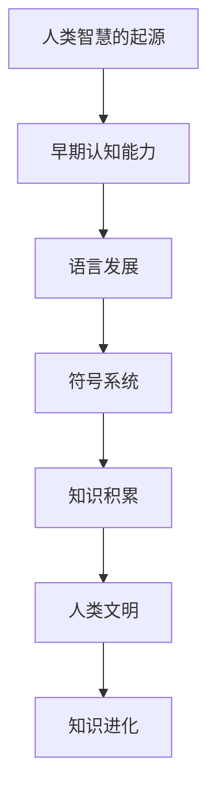
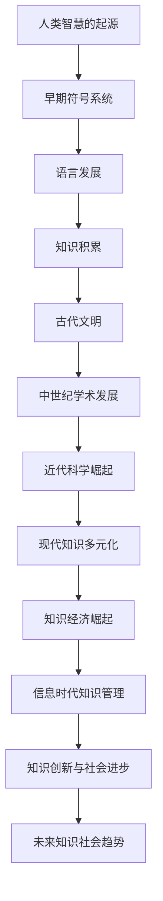

                 

### 《洞察力之眼：揭开人类知识进化的奥秘》

> **关键词：** 人类知识进化、大脑进化、知识体系、知识管理、知识经济

> **摘要：** 本文深入探讨了人类知识的起源、演化以及现代社会中的知识管理，旨在揭示知识进化的奥秘。通过分析大脑进化与知识演化的关系，以及知识体系的历史变革，本文揭示了知识经济时代的特点和挑战，展望了未来知识社会的发展趋势。

---

### 第一部分：人类知识的起源与演化

人类知识的起源可以追溯到几十万年前，随着人类智慧的萌芽，知识的积累与传播逐渐形成。本部分将探讨人类智慧的起源、早期的符号系统与语言发展，以及人类知识的早期积累与传播。

#### 第1章：人类智慧的起源

##### 1.1 人类智慧的起源

**核心概念与联系：** 人类智慧的起源是一个复杂的过程，涉及到早期认知能力、语言发展、符号系统等核心概念。我们可以通过Mermaid流程图来展现这一过程：

**核心算法原理讲解：** 无

**数学模型和数学公式：** 无

**举例说明：** 人类智慧的起源可以追溯到早期人类在狩猎、采集过程中对环境的认知，以及对工具的制造和使用。这些认知和技能的积累，逐渐形成了人类智慧的萌芽。

##### 1.2 早期的符号系统与语言发展

**核心概念与联系：** 早期的符号系统与语言发展是人类知识积累的重要基础。符号系统包括手势、标记等，而语言则是人类交流的最基本工具。

**核心算法原理讲解：** 无

**数学模型和数学公式：** 无

**举例说明：** 早期的符号系统与语言发展，使得人类能够记录和传递信息，从而推动了知识的积累与传播。例如，古代文明中的象形文字、楔形文字等，都是人类符号系统与语言发展的体现。

##### 1.3 人类知识的早期积累与传播

**核心概念与联系：** 人类知识的早期积累与传播，主要通过口头传统和书写记录两种方式。口头传统包括神话、传说、谚语等，而书写记录则包括各种文献、书籍等。

**核心算法原理讲解：** 无

**数学模型和数学公式：** 无

**举例说明：** 人类知识的早期积累与传播，为后续的知识体系发展奠定了基础。例如，古代文明中的《黄帝内经》、《道德经》等，都是人类知识积累与传播的重要成果。

---

### 第二部分：知识体系的发展与变革

在人类知识不断积累与传播的过程中，知识体系逐渐形成并不断发展变革。本部分将探讨古代文明与知识传承、中世纪的学术发展以及近代科学的崛起。

#### 第2章：古代文明与知识传承

##### 2.1 古代文明的形成与知识积累

**核心概念与联系：** 古代文明的形成与知识积累，是人类知识体系发展的重要阶段。这一阶段的核心概念包括城市国家、宗教信仰、教育制度等。

**核心算法原理讲解：** 无

**数学模型和数学公式：** 无

**举例说明：** 古代文明的形成与知识积累，以古埃及、古希腊、古印度等为代表。这些文明在数学、天文学、医学等领域取得了重要成就，为后世的知识体系奠定了基础。

##### 2.2 知识的传承方式

**核心概念与联系：** 知识的传承方式，包括口头传统、书写记录、教育制度等。这些传承方式在古代文明中发挥了重要作用。

**核心算法原理讲解：** 无

**数学模型和数学公式：** 无

**举例说明：** 在古代文明中，知识主要通过口头传统和书写记录进行传承。例如，古代的《伊利亚特》、《奥德赛》等，都是通过口头传统流传下来的经典作品。

##### 2.3 古代知识体系的特点

**核心概念与联系：** 古代知识体系的特点，包括重视宗教、神话、哲学等领域的知识，以及重视实践经验与理论的结合。

**核心算法原理讲解：** 无

**数学模型和数学公式：** 无

**举例说明：** 古代知识体系的特点，以古希腊的哲学体系为代表。古希腊哲学家们通过对自然、社会、道德等领域的思考，形成了丰富的哲学思想体系，对后世产生了深远的影响。

---

#### 第3章：中世纪的学术发展

##### 3.1 基督教与伊斯兰教对知识的影响

**核心概念与联系：** 基督教与伊斯兰教对知识的影响，是中世纪学术发展的重要方面。这一阶段的核心概念包括宗教信仰、神学、哲学等。

**核心算法原理讲解：** 无

**数学模型和数学公式：** 无

**举例说明：** 基督教与伊斯兰教对知识的影响，主要体现在中世纪的大学教育体系、神学哲学的发展以及自然科学的研究等方面。

##### 3.2 文艺复兴时期的学术繁荣

**核心概念与联系：** 文艺复兴时期的学术繁荣，是中世纪学术发展的延续，同时也是近代科学崛起的序幕。这一阶段的核心概念包括人文主义、艺术复兴、科学技术等。

**核心算法原理讲解：** 无

**数学模型和数学公式：** 无

**举例说明：** 文艺复兴时期的学术繁荣，以达·芬奇、伽利略等为代表，他们在艺术、科学等领域取得了重大成就，推动了人类知识的发展。

##### 3.3 中世纪的知识体系

**核心概念与联系：** 中世纪的知识体系，主要包括宗教神学、哲学、自然科学等。这一阶段的知识体系为后世奠定了基础。

**核心算法原理讲解：** 无

**数学模型和数学公式：** 无

**举例说明：** 中世纪的知识体系，以亚里士多德、托马斯·阿奎那等为代表，他们在宗教哲学、自然科学等领域取得了重要成就，对后世产生了深远的影响。

---

#### 第4章：近代科学的崛起

##### 4.1 科学方法的发展

**核心概念与联系：** 科学方法的发展，是近代科学崛起的重要标志。这一阶段的核心概念包括实证主义、理性思考、实验验证等。

**核心算法原理讲解：** 无

**数学模型和数学公式：** 无

**举例说明：** 科学方法的发展，以伽利略、牛顿等为代表，他们在物理学、天文学等领域提出了新的理论和方法，推动了科学的发展。

##### 4.2 重要的科学发现

**核心概念与联系：** 重要的科学发现，是近代科学发展的重要成果。这一阶段的核心概念包括万有引力、细胞理论、进化论等。

**核心算法原理讲解：** 无

**数学模型和数学公式：** 无

**举例说明：** 重要的科学发现，如牛顿的万有引力定律、达尔文的进化论等，对人类认识世界产生了深远的影响。

##### 4.3 近代科学的崛起与知识体系的变革

**核心概念与联系：** 近代科学的崛起与知识体系的变革，是近代科学发展的重要阶段。这一阶段的核心概念包括科学革命、知识体系重构等。

**核心算法原理讲解：** 无

**数学模型和数学公式：** 无

**举例说明：** 近代科学的崛起与知识体系的变革，以哥白尼的日心说、牛顿的经典力学等为代表，这些新的理论和知识体系对人类认识世界产生了重大影响。

---

#### 第三部分：知识社会的挑战与机遇

在现代社会，知识已经成为一种重要的资源，知识经济的崛起对人类社会带来了新的挑战和机遇。本部分将探讨知识经济的崛起、信息时代的知识管理以及知识创新与社会进步。

##### 第5章：知识经济的崛起

##### 5.1 知识经济的概念与特征

**核心概念与联系：** 知识经济的概念与特征，包括知识作为一种生产要素、信息技术的发展、全球化的影响等。

**核心算法原理讲解：** 无

**数学模型和数学公式：** 无

**举例说明：** 知识经济的概念与特征，以信息技术的发展为代表，如互联网、大数据、人工智能等，这些技术的应用使得知识的生产、传播和应用变得更加高效。

##### 5.2 知识经济对人类社会的影响

**核心概念与联系：** 知识经济对人类社会的影响，包括经济增长、社会发展、人类生活方式的变革等。

**核心算法原理讲解：** 无

**数学模型和数学公式：** 无

**举例说明：** 知识经济对人类社会的影响，如提高了生产效率、促进了创新、改变了人类的生活方式等。

##### 5.3 知识经济的发展趋势

**核心概念与联系：** 知识经济的发展趋势，包括数字化、智能化、全球化等。

**核心算法原理讲解：** 无

**数学模型和数学公式：** 无

**举例说明：** 知识经济的发展趋势，如数字化技术的广泛应用、智能化的进一步发展、全球化程度的加深等。

##### 第6章：信息时代的知识管理

##### 6.1 信息时代的特点

**核心概念与联系：** 信息时代的特点，包括信息爆炸、信息共享、信息技术的发展等。

**核心算法原理讲解：** 无

**数学模型和数学公式：** 无

**举例说明：** 信息时代的特点，如信息量的激增、信息传播速度的加快、信息技术的广泛应用等。

##### 6.2 知识管理的概念与原则

**核心概念与联系：** 知识管理的概念与原则，包括知识的识别、获取、共享、应用等。

**核心算法原理讲解：** 无

**数学模型和数学公式：** 无

**举例说明：** 知识管理的概念与原则，如识别和获取知识资源、促进知识的共享与传播、提高知识的应用效率等。

##### 6.3 知识管理的实际应用

**核心概念与联系：** 知识管理的实际应用，包括企业知识管理、政府知识管理、学术知识管理等。

**核心算法原理讲解：** 无

**数学模型和数学公式：** 无

**举例说明：** 知识管理的实际应用，如企业的知识共享平台、政府的知识库建设、学术机构的科研成果管理等。

##### 第7章：知识创新与社会进步

##### 7.1 知识创新的重要性

**核心概念与联系：** 知识创新的重要性，包括推动经济增长、促进社会发展、提高国家竞争力等。

**核心算法原理讲解：** 无

**数学模型和数学公式：** 无

**举例说明：** 知识创新的重要性，如推动科技创新、促进产业升级、提高企业的核心竞争力等。

##### 7.2 知识创新的过程与方法

**核心概念与联系：** 知识创新的过程与方法，包括知识积累、知识融合、知识转化等。

**核心算法原理讲解：** 无

**数学模型和数学公式：** 无

**举例说明：** 知识创新的过程与方法，如通过研究积累知识、通过跨学科融合产生新知识、通过技术转化实现知识应用等。

##### 7.3 知识创新对社会进步的影响

**核心概念与联系：** 知识创新对社会进步的影响，包括提高生产效率、改善生活质量、促进社会和谐等。

**核心算法原理讲解：** 无

**数学模型和数学公式：** 无

**举例说明：** 知识创新对社会进步的影响，如通过科技创新提高生产效率、通过知识创新改善生活质量、通过知识传播促进社会和谐等。

### 第8章：未来知识社会的发展趋势

##### 8.1 知识社会的未来发展

**核心概念与联系：** 知识社会的未来发展，包括数字化、智能化、全球化等趋势。

**核心算法原理讲解：** 无

**数学模型和数学公式：** 无

**举例说明：** 知识社会的未来发展，如数字化技术的进一步应用、智能化水平的不断提高、全球化程度的加深等。

##### 8.2 未来的知识创新

**核心概念与联系：** 未来的知识创新，包括前沿科技的发展、跨界创新的兴起、知识共享的深化等。

**核心算法原理讲解：** 无

**数学模型和数学公式：** 无

**举例说明：** 未来的知识创新，如人工智能、区块链、生物技术等前沿科技的发展，跨界创新如互联网与传统产业的融合，知识共享的深化如开放知识的普及等。

##### 8.3 知识社会面临的挑战与机遇

**核心概念与联系：** 知识社会面临的挑战与机遇，包括知识安全、知识不平衡、知识鸿沟等。

**核心算法原理讲解：** 无

**数学模型和数学公式：** 无

**举例说明：** 知识社会面临的挑战与机遇，如知识安全的问题，知识不平衡导致的资源分配不均，知识鸿沟导致的贫富差距等。

---

### 附录

#### 附录A：知识进化的Mermaid流程图

#### 附录B：知识体系发展的关键事件时间表

- 50万年前：人类智慧的萌芽
- 3000年前：古代文明的形成
- 5世纪：基督教与伊斯兰教对知识的影响
- 14世纪：文艺复兴时期的学术繁荣
- 16世纪：近代科学的崛起
- 20世纪：知识经济的崛起
- 21世纪：信息时代的知识管理

#### 附录C：进一步阅读参考资料

- 《人类简史：从动物到上帝》[作者：尤瓦尔·赫拉利]
- 《认知盈余：创造力的社会意义》[作者：克莱·舍基]
- 《智能时代的创新管理》[作者：黄平]
- 《大数据时代：生活、工作与思维的大变革》[作者：维克托·迈尔-舍恩伯格]
- 《人工智能的未来》[作者：许晨阳]

---

### 作者信息

**作者：AI天才研究院/AI Genius Institute & 禅与计算机程序设计艺术 /Zen And The Art of Computer Programming**

