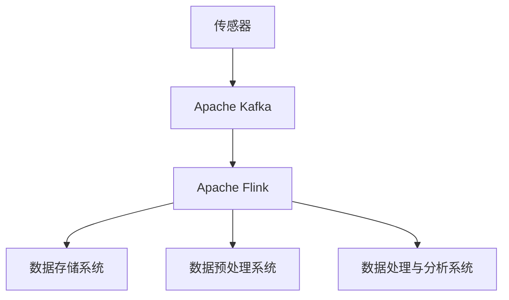

                 

### 深度学习在物联网中的应用

> 关键词：深度学习，物联网，智能传感器，边缘计算，安全与隐私保护

> 摘要：随着物联网技术的快速发展，深度学习作为一种强大的机器学习技术，正在逐步应用于物联网的各个领域。本文将深入探讨深度学习在物联网中的应用，包括核心概念、数据处理、边缘计算、安全与隐私保护，以及具体应用场景，旨在为读者提供一个全面的技术解析和未来发展趋势展望。

---

#### 目录

1. [深度学习与物联网概述](#深度学习与物联网概述)
    1. [深度学习简介](#深度学习简介)
    2. [物联网简介](#物联网简介)
    3. [深度学习在物联网中的潜在应用](#深度学习在物联网中的潜在应用)
2. [深度学习基础](#深度学习基础)
    1. [神经网络与深度学习](#神经网络与深度学习)
    2. [训练与优化算法](#训练与优化算法)
    3. [深度学习框架](#深度学习框架)
3. [物联网数据处理](#物联网数据处理)
    1. [物联网数据特点](#物联网数据特点)
    2. [数据采集与预处理](#数据采集与预处理)
    3. [数据流处理技术](#数据流处理技术)
4. [深度学习在物联网中的应用](#深度学习在物联网中的应用)
    1. [智能传感器与数据采集](#智能传感器与数据采集)
    2. [边缘计算与深度学习](#边缘计算与深度学习)
    3. [物联网安全与隐私保护](#物联网安全与隐私保护)
    4. [深度学习在智能设备中的应用](#深度学习在智能设备中的应用)
    5. [深度学习在工业物联网中的应用](#深度学习在工业物联网中的应用)
    6. [深度学习在智慧城市中的应用](#深度学习在智慧城市中的应用)
    7. [深度学习在物联网中的未来发展趋势](#深度学习在物联网中的未来发展趋势)
5. [附录](#附录)
    1. [深度学习在物联网中的实际应用案例](#深度学习在物联网中的实际应用案例)
    2. [深度学习与物联网资源](#深度学习与物联网资源)
    3. [深度学习与物联网学习资源](#深度学习与物联网学习资源)

---

### 第一部分：深度学习与物联网概述

#### 第1章：深度学习与物联网简介

##### 1.1 深度学习的核心概念

深度学习是机器学习的一个分支，它通过模拟人脑中的神经网络结构来实现对数据的自动学习和特征提取。深度学习的核心概念包括神经网络、反向传播算法、激活函数等。

- **神经网络**：神经网络由大量的神经元组成，每个神经元可以接收多个输入并产生一个输出。神经网络通过学习输入和输出之间的映射关系来实现对数据的自动学习。
  
  ```mermaid
  graph TD
  A[输入] --> B[神经元1]
  B --> C[神经元2]
  C --> D[输出]
  ```

- **反向传播算法**：反向传播算法是深度学习中的核心训练算法，它通过计算网络输出和实际输出之间的误差，并反向传播误差，不断调整网络的权重和偏置，以达到最小化误差的目的。

  ```mermaid
  graph TD
  A[输入] --> B[神经网络]
  B --> C{计算输出}
  C --> D[误差计算]
  D --> E[反向传播]
  E --> B{权重更新}
  ```

- **激活函数**：激活函数是神经网络中的一个关键组件，它用来引入非线性因素，使神经网络能够解决更复杂的任务。

  ```mermaid
  graph TD
  A[输入] --> B[激活函数]
  B --> C[输出]
  ```

##### 1.2 物联网的基本原理与架构

物联网（Internet of Things，IoT）是通过将各种物理设备、传感器、软件和应用连接到互联网上，实现信息的收集、传输和处理的系统。物联网的基本原理包括以下几个方面：

- **设备互联**：通过无线网络、有线网络或其他传输技术，将各种设备互联起来，形成一个庞大的网络系统。
  
  ```mermaid
  graph TD
  A[设备1] --> B[网络]
  B --> C[设备2]
  C --> D[网络]
  D --> E[设备3]
  ```

- **传感器与数据采集**：物联网中的传感器负责采集各种物理信号，如温度、湿度、光照等，并将这些信号转换为数字信号，传输到服务器或云端进行处理。
  
  ```mermaid
  graph TD
  A[传感器] --> B[数据采集]
  B --> C[服务器或云端]
  ```

- **数据处理与存储**：物联网系统通过数据处理和存储技术，对采集到的数据进行分析和处理，以实现智能决策和实时响应。
  
  ```mermaid
  graph TD
  A[数据采集] --> B[数据处理]
  B --> C[数据存储]
  ```

##### 1.3 深度学习在物联网中的潜在应用

深度学习在物联网中的潜在应用非常广泛，主要包括以下几个方面：

- **智能传感器与数据采集**：通过深度学习算法，可以实现对传感器的智能控制，提高数据采集的准确性和实时性。

- **边缘计算**：在物联网中，深度学习模型可以在边缘设备上直接运行，实现实时数据分析和处理，降低对云端的依赖。

- **物联网安全与隐私保护**：深度学习算法可以用于检测和防御物联网中的安全威胁，提高系统的安全性和隐私性。

- **智能设备与应用**：深度学习算法可以应用于智能家居、智能交通、智能农业等领域，实现更智能化的设备与应用。

  ```mermaid
  graph TD
  A[智能传感器] --> B[边缘计算]
  B --> C[物联网安全]
  C --> D[智能设备]
  D --> E[智能家居]
  E --> F[智能交通]
  F --> G[智能农业]
  ```

在接下来的章节中，我们将详细探讨深度学习在物联网中的应用，包括基础理论、数据处理、边缘计算、安全与隐私保护等方面，希望对读者有所启发和帮助。<|endoftext|>### 第二部分：深度学习基础

深度学习作为机器学习的一个重要分支，是物联网技术发展的关键驱动力之一。在这一部分，我们将深入探讨深度学习的基础概念、训练与优化算法，以及主流深度学习框架。

#### 第2章：深度学习基础

##### 2.1 神经网络与深度学习

神经网络（Neural Networks）是深度学习的基础，它模拟了人脑神经元的工作方式，通过多层神经元结构来实现对数据的处理和预测。一个典型的神经网络包括输入层、隐藏层和输出层。

- **输入层**：接收输入数据，并将其传递到下一层。
  
  ```mermaid
  graph TD
  A[输入] --> B[隐藏层]
  ```

- **隐藏层**：对输入数据进行处理，并通过激活函数引入非线性因素。
  
  ```mermaid
  graph TD
  A[输入] --> B[隐藏层1]
  B --> C[隐藏层2]
  ```

- **输出层**：对隐藏层输出的数据进行处理，生成最终输出结果。
  
  ```mermaid
  graph TD
  A[输入] --> B[隐藏层1]
  B --> C[输出]
  ```

在神经网络中，每个神经元都与其他神经元相连，并具有权重和偏置。通过调整这些权重和偏置，神经网络可以学习到输入和输出之间的映射关系。

##### 2.2 训练与优化算法

神经网络的训练过程实质上是不断调整网络权重和偏置的过程，以使网络输出能够尽可能接近实际输出。训练算法主要包括梯度下降（Gradient Descent）及其变体。

- **梯度下降**：梯度下降是一种优化算法，通过计算网络输出和实际输出之间的误差（即损失函数），并沿着误差梯度的反方向更新权重和偏置，以最小化损失函数。

  ```python
  # 梯度下降伪代码
  while not converged:
      loss = compute_loss(output, actual_output)
      gradients = compute_gradients(loss, weights, biases)
      weights -= learning_rate * gradients
      biases -= learning_rate * gradients
  ```

- **反向传播**：反向传播是梯度下降算法的核心，它通过将误差反向传播到网络的每一层，计算每一层的梯度，并更新权重和偏置。

  ```mermaid
  graph TD
  A[输出层] --> B[隐藏层]
  B --> C[输入层]
  ```

##### 2.3 深度学习框架

深度学习框架是一种用于构建、训练和部署深度学习模型的工具。目前主流的深度学习框架包括TensorFlow、PyTorch、Keras等。

- **TensorFlow**：TensorFlow是由谷歌开发的开源深度学习框架，它提供了丰富的API和工具，支持从简单的线性回归到复杂的神经网络的各种应用。

  ```python
  import tensorflow as tf
  model = tf.keras.Sequential([
      tf.keras.layers.Dense(128, activation='relu', input_shape=(784,)),
      tf.keras.layers.Dropout(0.2),
      tf.keras.layers.Dense(10, activation='softmax')
  ])
  model.compile(optimizer='adam',
                loss='categorical_crossentropy',
                metrics=['accuracy'])
  model.fit(x_train, y_train, batch_size=128, epochs=10)
  ```

- **PyTorch**：PyTorch是另一种流行的深度学习框架，它提供了动态计算图，使得模型的构建和训练更加灵活和直观。

  ```python
  import torch
  import torch.nn as nn
  import torch.optim as optim
  model = nn.Sequential(nn.Linear(784, 128), nn.ReLU(), nn.Dropout(0.2), nn.Linear(128, 10))
  criterion = nn.CrossEntropyLoss()
  optimizer = optim.Adam(model.parameters(), lr=0.001)
  for epoch in range(10):
      optimizer.zero_grad()
      output = model(x_train)
      loss = criterion(output, y_train)
      loss.backward()
      optimizer.step()
  ```

- **Keras**：Keras是一个高层次的神经网络API，它构建在TensorFlow和Theano之上，提供了简洁的API，使得深度学习模型的构建和训练更加容易。

  ```python
  from keras.models import Sequential
  from keras.layers import Dense, Dropout
  model = Sequential()
  model.add(Dense(128, input_dim=784, activation='relu'))
  model.add(Dropout(0.2))
  model.add(Dense(10, activation='softmax'))
  model.compile(loss='categorical_crossentropy', optimizer='adam', metrics=['accuracy'])
  model.fit(x_train, y_train, epochs=10, batch_size=128)
  ```

在接下来的章节中，我们将深入探讨物联网数据处理、深度学习在物联网中的应用，以及物联网安全与隐私保护等关键问题。希望这些基础知识的介绍能为读者打下坚实的理论基础。<|endoftext|>### 第三部分：物联网数据处理

物联网（IoT）作为连接物理世界与数字世界的关键桥梁，其核心在于对海量数据的采集、传输和处理。在这一部分，我们将详细探讨物联网数据的特性、数据采集与预处理方法，以及数据流处理技术。

#### 第3章：物联网数据处理

##### 3.1 物联网数据特点

物联网数据具有以下特点：

- **多样性**：物联网设备种类繁多，包括传感器、智能设备、移动设备等，这些设备产生的数据类型各异，如文本、图像、音频、视频等。

- **大规模**：物联网设备数量庞大，每天产生的数据量巨大，对数据处理提出了极高的要求。

- **实时性**：物联网应用往往要求对实时数据的快速处理和分析，如智能交通系统中的实时路况预测、智能家居中的设备控制等。

- **动态变化**：物联网环境动态变化，设备的连接与断开、数据的噪声和异常等，都给数据处理带来了挑战。

- **低延迟**：许多物联网应用对数据处理的延迟要求很低，如自动驾驶车辆需要实时处理传感器数据，以确保安全行驶。

##### 3.2 数据采集与预处理

物联网数据处理的第一步是数据采集。数据采集包括以下步骤：

- **传感器选择与部署**：根据应用需求，选择合适的传感器，并将其部署在适当的位置。

- **数据格式定义**：为每个传感器定义数据格式，包括数据类型、单位、精度等。

- **数据采集**：通过传感器采集环境数据，并将其转换为数字信号。

数据预处理是物联网数据处理的第二步，其目的是提高数据的质量和可用性。数据预处理包括以下步骤：

- **数据清洗**：去除数据中的噪声、异常值和重复数据，以提高数据质量。

- **数据转换**：将不同类型的数据转换为统一的格式，如将温度传感器采集的温度数据转换为摄氏度或华氏度。

- **数据归一化**：将数据缩放到一个标准范围内，以便于后续处理和分析。

- **数据特征提取**：从原始数据中提取有用的特征，用于深度学习模型的训练。

##### 3.3 数据流处理技术

数据流处理技术是物联网数据处理的核心，其目的是对实时数据进行高效处理和分析。数据流处理技术包括以下方面：

- **数据采集系统**：数据采集系统负责从传感器和其他数据源收集数据，并将其存储在数据存储系统中。

  ```mermaid
  graph TD
  A[传感器] --> B[数据采集系统]
  B --> C[数据存储系统]
  ```

- **数据存储系统**：数据存储系统负责存储和管理采集到的数据，如关系型数据库、NoSQL数据库、时间序列数据库等。

  ```mermaid
  graph TD
  C[数据存储系统]
  C --> D[关系型数据库]
  C --> E[NoSQL数据库]
  C --> F[时间序列数据库]
  ```

- **数据预处理系统**：数据预处理系统负责对数据进行清洗、转换、归一化和特征提取，以提高数据的质量和可用性。

  ```mermaid
  graph TD
  B[数据采集系统] --> C[数据预处理系统]
  C --> D[数据存储系统]
  ```

- **数据处理与分析系统**：数据处理与分析系统负责对预处理后的数据进行分析、挖掘和预测，以支持智能决策和实时响应。

  ```mermaid
  graph TD
  C[数据预处理系统] --> D[数据处理与分析系统]
  D --> E[数据可视化]
  D --> F[智能决策]
  ```

在数据流处理技术中，流处理框架（如Apache Kafka、Apache Flink、Apache Storm等）起到了关键作用。流处理框架可以高效地处理海量实时数据，支持数据的实时采集、传输和处理。



通过数据流处理技术，物联网系统能够实现实时数据的高效采集、处理和分析，为各种智能应用提供数据支持。在下一部分中，我们将深入探讨深度学习在物联网中的应用，包括智能传感器与数据采集、边缘计算、物联网安全与隐私保护等。希望这些内容对您有所帮助。<|endoftext|>### 第四部分：深度学习在物联网中的应用

深度学习在物联网中的应用正在迅速扩展，通过智能传感器、边缘计算、物联网安全与隐私保护等方面，深度学习为物联网带来了巨大的变革。以下将详细介绍这些方面的应用。

#### 第4章：智能传感器与数据采集

##### 4.1 智能传感器的原理与应用

智能传感器是物联网中的重要组成部分，它通过感知环境中的物理信号（如温度、湿度、光照、气体浓度等），将模拟信号转换为数字信号，并传输到物联网平台进行处理。智能传感器的原理主要包括以下几个方面：

- **传感元件**：智能传感器的核心是传感元件，如温度传感器、湿度传感器、光照传感器等，它们能够感知环境中的物理信号。
  
  ```mermaid
  graph TD
  A[环境信号] --> B[传感元件]
  B --> C[模拟信号]
  C --> D[转换电路]
  D --> E[数字信号]
  ```

- **信号转换**：传感元件采集到的模拟信号需要通过转换电路转换为数字信号，以便于传输和处理。常见的转换方法包括模数转换（ADC）和数字信号处理（DSP）。

- **通信接口**：智能传感器通过通信接口（如Wi-Fi、蓝牙、ZigBee等）将数字信号传输到物联网平台或其他设备。

智能传感器在物联网中的应用非常广泛，如智能家居、智能交通、智能医疗、工业自动化等领域。例如，智能家居中的智能门锁、智能灯光、智能空调等设备，通过智能传感器感知用户的行动和环境变化，实现自动控制和智能化管理。

##### 4.2 数据采集系统设计

数据采集系统是物联网中数据处理的起点，其设计至关重要。一个典型的数据采集系统包括以下几个方面：

- **传感器选择与部署**：根据应用需求，选择合适的传感器，并将其部署在适当的位置，如室内、室外、生产线等。

- **数据传输**：智能传感器通过通信接口将数据传输到物联网平台或其他设备。常用的通信接口包括Wi-Fi、蓝牙、ZigBee、LoRa等。

- **数据存储**：数据采集系统需要将采集到的数据存储在数据库或云平台中，以便于后续处理和分析。

- **数据处理**：数据采集系统需要对采集到的数据进行预处理，如去噪、归一化、特征提取等，以提高数据质量。

- **数据可视化**：通过数据可视化，用户可以直观地了解采集到的数据，如温度、湿度、光照等。

数据采集系统设计的关键是确保数据的准确性、实时性和可靠性。在设计过程中，需要考虑以下几个方面：

1. **传感器精度与稳定性**：选择精度高、稳定性好的传感器，以减少数据误差和噪声。

2. **通信稳定性**：选择可靠的通信接口，确保数据传输的稳定性和实时性。

3. **数据处理能力**：数据采集系统需要具备强大的数据处理能力，以应对海量数据的采集和处理。

4. **系统扩展性**：数据采集系统应具有良好的扩展性，以适应未来设备增加和数据处理需求的变化。

通过智能传感器与数据采集系统的设计，物联网系统能够高效地采集、传输和处理数据，为深度学习应用提供丰富的数据支持。在下一节中，我们将探讨深度学习在边缘计算中的应用。希望这部分内容对您有所帮助。<|endoftext|>### 第5章：边缘计算与深度学习

边缘计算作为物联网技术中的重要组成部分，旨在将数据处理和分析能力从云端转移到网络边缘，即靠近数据源的地方。这种分布式计算架构可以显著降低数据传输延迟、节省带宽资源，并提高系统的响应速度。在本章中，我们将深入探讨边缘计算的概念、优势以及深度学习模型在边缘计算中的应用。

#### 5.1 边缘计算的概念与优势

**边缘计算的概念**

边缘计算（Edge Computing）是指将数据计算、存储、处理和分析从传统的集中式云计算中心转移到网络的边缘节点，这些边缘节点可以是路由器、交换机、服务器、甚至是一个简单的物联网设备。边缘计算的核心思想是将计算任务分散到网络边缘，使得数据处理更加接近数据源，从而提高系统的实时性和效率。

**边缘计算的优势**

1. **降低延迟**：由于数据处理在靠近数据源的地方进行，因此可以显著降低数据传输的延迟，这对于需要实时响应的应用（如自动驾驶、智能医疗等）尤为重要。

2. **节省带宽**：将数据处理移至边缘，可以减少需要传输到云端的数据量，从而节省网络带宽资源。

3. **提高系统效率**：边缘计算可以减轻云计算中心的负载，提高整个系统的处理效率和资源利用率。

4. **增强数据隐私**：在边缘设备上处理数据可以减少数据在传输过程中的暴露风险，提高数据的隐私性。

5. **适应性强**：边缘计算允许在本地部署定制化的应用和服务，更好地适应特定场景的需求。

**边缘计算与云计算的比较**

| 特性 | 边缘计算 | 云计算 |
| --- | --- | --- |
| 数据处理位置 | 数据源附近 | 云数据中心 |
| 延迟 | 低 | 较高 |
| 数据传输量 | 较少 | 较多 |
| 系统效率 | 高 | 中等 |
| 系统扩展性 | 易扩展 | 难扩展 |
| 数据隐私性 | 高 | 低 |

#### 5.2 边缘计算中的深度学习模型

深度学习模型在边缘计算中的应用正变得越来越普及，因为它们可以在资源有限的边缘设备上实现高效的智能处理。以下是一些关键点：

**1. 模型压缩**

在边缘设备上部署深度学习模型时，模型的大小是一个重要的考虑因素。为了减少模型的大小，可以采用以下技术：

- **模型剪枝**：通过删除模型中不重要的神经元和权重，来减少模型的参数数量。
  
  ```python
  # 模型剪枝伪代码
  pruned_model = model_prune(original_model, pruning_rate)
  ```

- **量化**：将模型的浮点数权重转换为低精度的整数权重，从而减少模型的大小。

  ```python
  # 量化伪代码
  quantized_model = model_quantize(original_model, precision)
  ```

- **知识蒸馏**：使用一个较大的模型（教师模型）来训练一个较小的模型（学生模型），从而传递知识。

  ```python
  # 知识蒸馏伪代码
  student_model = model_train_distributed(original_model, student_model)
  ```

**2. 模型迁移**

将预训练的深度学习模型迁移到边缘设备，可以显著提高模型的性能。迁移学习利用了预训练模型在特定领域的知识，减少了在边缘设备上从头训练模型所需的计算资源。

**3. 模型融合**

在边缘设备上，可以融合多个深度学习模型来提高预测的准确性。这种方法称为模型融合（Model Ensemble），它通过将多个模型的预测结果进行综合，来得到最终的预测结果。

**4. 模型推理**

在边缘设备上执行深度学习模型的推理（Inference），即使用训练好的模型对新的数据进行预测。为了提高推理速度，可以采用以下技术：

- **硬件加速**：使用专门的硬件（如GPU、FPGA等）来加速模型的推理过程。

  ```python
  # 硬件加速伪代码
  accelerated_model = model_accelerate(original_model, hardware)
  ```

- **模型优化**：对模型进行优化，以减少推理过程中的计算量和内存占用。

  ```python
  # 模型优化伪代码
  optimized_model = model_optimize(original_model)
  ```

#### 5.3 边缘计算平台与架构

边缘计算平台是实现边缘计算的关键，它提供了必要的计算资源、存储资源和网络连接。以下是一些常见的边缘计算平台与架构：

- **边缘网关**：边缘网关是边缘计算平台的核心组件，它连接物联网设备和云平台，负责数据的收集、处理和传输。

  ```mermaid
  graph TD
  A[物联网设备] --> B[边缘网关]
  B --> C[云平台]
  ```

- **边缘服务器**：边缘服务器提供了强大的计算和存储能力，可以运行复杂的深度学习模型。

  ```mermaid
  graph TD
  A[物联网设备] --> B[边缘服务器]
  B --> C[边缘网关]
  C --> D[云平台]
  ```

- **边缘容器**：使用容器技术（如Docker）来部署和管理边缘应用程序，可以提高系统的灵活性和可扩展性。

  ```mermaid
  graph TD
  A[物联网设备] --> B[边缘容器]
  B --> C[边缘服务器]
  C --> D[边缘网关]
  D --> E[云平台]
  ```

通过边缘计算与深度学习技术的结合，物联网系统可以更好地适应实时数据处理的挑战，提高系统的智能化水平。在下一章中，我们将探讨物联网安全与隐私保护，这是确保物联网系统可靠运行的重要一环。希望本章内容对您有所帮助。<|endoftext|>### 第6章：物联网安全与隐私保护

物联网（IoT）的安全性是确保其正常运行和用户信任的关键因素。随着物联网设备的数量和种类不断增多，安全问题变得越来越复杂。深度学习技术在这一领域有着广泛的应用，可以通过检测和防护安全威胁、提高隐私保护水平等方面，为物联网安全保驾护航。以下将详细探讨物联网安全挑战、深度学习在安全防护中的应用，以及隐私保护技术。

#### 6.1 物联网安全挑战

物联网安全面临以下主要挑战：

1. **设备安全性**：物联网设备通常采用简单且不安全的通信协议和操作系统，容易成为黑客攻击的突破口。

2. **数据传输安全**：物联网设备采集的数据在传输过程中可能遭受中间人攻击、数据篡改等安全威胁。

3. **数据隐私**：物联网设备采集的数据可能包含用户隐私信息，如位置、行为等，这些数据如果泄露，将严重威胁用户隐私。

4. **软件更新问题**：物联网设备的固件和软件更新通常较为困难，导致设备安全漏洞长期存在。

5. **系统复杂度高**：物联网系统通常包含多种设备、协议和网络，系统复杂度高使得安全防护变得更加困难。

#### 6.2 深度学习在安全防护中的应用

深度学习技术在物联网安全防护中具有以下应用：

1. **入侵检测**：利用深度学习模型，可以对物联网网络中的异常流量和恶意行为进行实时检测和识别。通过训练大量的正常和异常数据，深度学习模型可以学习到正常行为的特征，并能够及时识别出异常行为。

   ```mermaid
   graph TD
   A[物联网网络] --> B[深度学习模型]
   B --> C{检测异常行为}
   ```

2. **恶意软件检测**：深度学习模型可以用于检测和识别物联网设备上的恶意软件。通过分析设备运行时的行为特征，深度学习模型可以区分正常行为和恶意行为，从而防止恶意软件的传播。

   ```mermaid
   graph TD
   A[物联网设备] --> B[深度学习模型]
   B --> C{检测恶意软件}
   ```

3. **数据加密**：深度学习模型可以用于生成和破解加密算法，从而提高数据传输的安全性。通过训练深度学习模型，可以生成更加复杂和安全的加密算法，同时也能够提高解密算法的效率。

   ```mermaid
   graph TD
   A[深度学习模型] --> B[加密算法]
   B --> C[数据传输]
   ```

4. **身份验证**：深度学习模型可以用于实现更安全的用户身份验证。通过分析用户行为特征，如登录时间、设备特征等，深度学习模型可以识别出恶意用户或异常登录行为，从而提高系统的安全性。

   ```mermaid
   graph TD
   A[用户行为数据] --> B[深度学习模型]
   B --> C{身份验证}
   ```

#### 6.3 隐私保护技术

在物联网中，隐私保护是确保用户数据不被泄露或滥用的重要措施。以下是一些隐私保护技术：

1. **数据匿名化**：通过将数据中的个人信息去除或替换为匿名标识符，可以减少数据泄露的风险。

2. **差分隐私**：差分隐私是一种数学方法，它通过对数据集中的每个个体添加随机噪声，从而保护个体隐私，同时确保数据分析的准确性。

3. **加密存储与传输**：使用加密算法对存储和传输的数据进行加密，可以有效防止数据在传输过程中被窃取或篡改。

4. **访问控制**：通过访问控制机制，可以确保只有授权用户才能访问敏感数据，从而降低数据泄露的风险。

5. **隐私增强技术**：如联邦学习（Federated Learning）和同态加密（Homomorphic Encryption），可以在保护用户隐私的同时，实现数据分析和建模。

通过深度学习和隐私保护技术的结合，物联网系统可以在确保安全性和隐私性的同时，充分发挥物联网的潜力。在下一章中，我们将探讨深度学习在智能设备中的应用，包括智能家居、智能交通和智能农业等领域。希望这部分内容对您有所帮助。<|endoftext|>### 第7章：深度学习在智能设备中的应用

智能设备是物联网的核心组成部分，通过深度学习的应用，这些设备能够实现更高程度的自动化和智能化。以下将详细介绍深度学习在智能家居、智能交通和智能农业等领域的具体应用。

#### 7.1 智能家居

智能家居（Smart Home）通过连接家中的各种设备，如智能灯光、智能门锁、智能恒温器等，使用户能够远程控制家中的环境。深度学习在智能家居中的应用主要体现在以下几个方面：

1. **智能语音助手**：智能语音助手如Amazon Alexa、Google Assistant等，利用深度学习技术实现了自然语言处理（NLP），能够理解用户的语音指令并执行相应操作。

   ```mermaid
   graph TD
   A[用户语音] --> B[NLP模型]
   B --> C{指令识别}
   C --> D[智能家居设备]
   ```

2. **智能设备控制**：通过深度学习模型，可以实现对智能家居设备的自动控制。例如，智能灯光可以根据环境光线自动调整亮度，智能恒温器可以自动调节室内温度。

   ```mermaid
   graph TD
   A[环境光线/室内温度] --> B[深度学习模型]
   B --> C{智能控制策略}
   C --> D[智能家居设备]
   ```

3. **设备故障预测**：深度学习模型可以通过分析设备运行数据，预测设备的故障，提前进行维护和更换，以减少设备的停机时间和维护成本。

   ```mermaid
   graph TD
   A[设备运行数据] --> B[深度学习模型]
   B --> C{故障预测}
   C --> D[设备维护]
   ```

#### 7.2 智能交通

智能交通（Smart Traffic）利用物联网技术和深度学习，实现交通系统的自动化和智能化，提高交通效率、减少交通事故和环境污染。以下为深度学习在智能交通中的应用：

1. **交通流量预测**：通过分析历史交通数据，深度学习模型可以预测未来某段时间内的交通流量，为交通管理部门提供决策支持。

   ```mermaid
   graph TD
   A[历史交通数据] --> B[深度学习模型]
   B --> C{流量预测}
   C --> D[交通管理部门]
   ```

2. **实时路况预测**：深度学习模型可以实时分析摄像头和传感器数据，预测当前道路的交通状况，为驾驶员提供最优行驶路线。

   ```mermaid
   graph TD
   A[摄像头/传感器数据] --> B[深度学习模型]
   B --> C{路况预测}
   C --> D[驾驶员导航系统]
   ```

3. **自动驾驶**：深度学习在自动驾驶领域有着广泛的应用，通过训练自动驾驶汽车感知环境、规划路径和做出决策，实现安全、高效的自动驾驶。

   ```mermaid
   graph TD
   A[环境感知数据] --> B[深度学习模型]
   B --> C{路径规划}
   C --> D{自动驾驶车辆}
   ```

#### 7.3 智能农业

智能农业（Smart Agriculture）利用物联网技术和深度学习，实现农业生产的自动化和智能化，提高农业生产效率和农产品质量。以下为深度学习在智能农业中的应用：

1. **作物病害检测**：通过分析植物叶片的图像，深度学习模型可以检测作物病害，提前采取防治措施，减少损失。

   ```mermaid
   graph TD
   A[植物叶片图像] --> B[深度学习模型]
   B --> C{病害检测}
   C --> D[农业生产者]
   ```

2. **作物产量预测**：通过分析土壤、气候等数据，深度学习模型可以预测作物的产量，帮助农民优化种植策略。

   ```mermaid
   graph TD
   A[土壤/气候数据] --> B[深度学习模型]
   B --> C{产量预测}
   C --> D[农业生产者]
   ```

3. **智能灌溉系统**：通过分析土壤湿度、天气等数据，深度学习模型可以自动控制灌溉系统，实现精准灌溉，提高水资源利用率。

   ```mermaid
   graph TD
   A[土壤湿度/天气数据] --> B[深度学习模型]
   B --> C{灌溉策略}
   C --> D[智能灌溉系统]
   ```

通过深度学习技术的应用，智能设备在各个领域的表现日益出色，为人们的生活带来更多便利和效益。在下一章中，我们将探讨深度学习在工业物联网中的应用，以及如何通过深度学习技术提高工业生产效率和产品质量。希望这部分内容对您有所帮助。<|endoftext|>### 第8章：深度学习在工业物联网中的应用

工业物联网（IIoT）是将物联网技术应用于工业生产和管理中，通过数据采集、分析和决策支持，实现工业过程的智能化和自动化。深度学习技术在工业物联网中的应用，为提高生产效率、优化资源利用和确保设备安全提供了强有力的支持。以下将详细探讨深度学习在工业物联网中的应用领域、工业设备监控、工业质量检测与预测，以及其带来的变革。

#### 8.1 工业物联网概述

工业物联网通过连接各种工业设备和系统，实现设备间的数据交换和协同工作。其主要特点包括：

1. **设备互联互通**：通过传感器、RFID、条码等技术，实现设备的互联互通，使设备能够实时共享数据。
   
2. **数据采集与分析**：通过数据采集系统，实时收集设备运行数据，利用数据分析技术进行数据挖掘和趋势分析。

3. **智能决策与优化**：基于深度学习等人工智能技术，对采集到的数据进行分析，提供智能决策支持，优化生产流程和资源利用。

4. **远程监控与维护**：通过物联网技术，实现对工业设备的远程监控和维护，提高设备的运行效率和可靠性。

#### 8.2 深度学习在工业物联网中的应用领域

深度学习在工业物联网中的应用非常广泛，以下为一些关键领域：

1. **设备故障预测与维护**：通过深度学习模型，对设备运行数据进行分析，预测设备故障的发生，提前进行维护，减少停机时间和维护成本。

   ```mermaid
   graph TD
   A[设备运行数据] --> B[深度学习模型]
   B --> C{故障预测}
   C --> D[设备维护]
   ```

2. **生产流程优化**：通过深度学习模型，分析生产过程中的数据，优化生产流程，提高生产效率和产品质量。

   ```mermaid
   graph TD
   A[生产数据] --> B[深度学习模型]
   B --> C{流程优化}
   C --> D[生产效率提升]
   ```

3. **供应链管理**：通过深度学习模型，分析供应链数据，优化供应链流程，降低库存成本，提高供应链的响应速度。

   ```mermaid
   graph TD
   A[供应链数据] --> B[深度学习模型]
   B --> C{供应链优化}
   C --> D[库存成本降低]
   ```

4. **能源管理**：通过深度学习模型，分析能源使用数据，优化能源消耗，提高能源利用效率。

   ```mermaid
   graph TD
   A[能源使用数据] --> B[深度学习模型]
   B --> C{能源管理}
   C --> D[能源效率提升]
   ```

#### 8.3 深度学习在工业设备监控中的应用

深度学习在工业设备监控中的应用，主要体现在以下几个方面：

1. **实时监控**：通过传感器和摄像头，实时监控设备的运行状态，利用深度学习模型进行异常检测和故障预测。

   ```mermaid
   graph TD
   A[设备状态数据] --> B[深度学习模型]
   B --> C{实时监控}
   C --> D{异常检测}
   ```

2. **智能报警**：基于深度学习模型，对设备运行数据进行实时分析，当发现异常情况时，自动发送报警信息，提醒相关人员及时处理。

   ```mermaid
   graph TD
   A[设备状态数据] --> B[深度学习模型]
   B --> C{智能报警}
   C --> D{异常情况}
   ```

3. **预测性维护**：通过深度学习模型，对设备运行数据进行分析，预测设备故障的发生时间，提前进行维护，避免设备意外停机。

   ```mermaid
   graph TD
   A[设备运行数据] --> B[深度学习模型]
   B --> C{故障预测}
   C --> D[预测性维护]
   ```

#### 8.4 工业质量检测与预测

深度学习在工业质量检测与预测中的应用，主要体现在以下几个方面：

1. **产品质量检测**：通过深度学习模型，对生产过程中的产品质量进行实时检测和预测，确保产品质量符合标准。

   ```mermaid
   graph TD
   A[产品质量数据] --> B[深度学习模型]
   B --> C{质量检测}
   C --> D{质量预测}
   ```

2. **生产效率分析**：通过深度学习模型，对生产过程中的效率进行实时分析和预测，找出生产瓶颈，优化生产流程。

   ```mermaid
   graph TD
   A[生产效率数据] --> B[深度学习模型]
   B --> C{效率分析}
   C --> D{生产优化}
   ```

3. **设备状态预测**：通过深度学习模型，对设备的运行状态进行预测，提前发现潜在故障，实现预测性维护。

   ```mermaid
   graph TD
   A[设备运行数据] --> B[深度学习模型]
   B --> C{状态预测}
   C --> D{预测性维护}
   ```

通过深度学习在工业物联网中的应用，工业生产实现了自动化和智能化，提高了生产效率、降低了成本、确保了产品质量，为工业企业的可持续发展提供了有力支持。在下一章中，我们将探讨深度学习在智慧城市中的应用，包括交通管理、公共安全等方面。希望这部分内容对您有所帮助。<|endoftext|>### 第9章：深度学习在智慧城市中的应用

智慧城市（Smart City）是运用物联网、大数据、云计算和人工智能等技术，实现城市资源高效管理和智能化服务的一种城市发展新模式。深度学习作为人工智能的重要分支，在智慧城市中的应用日益广泛，极大地提升了城市管理的效率和质量。以下将探讨深度学习在智慧城市中的应用领域，包括交通管理和公共安全。

#### 9.1 智慧城市的基本概念

智慧城市是指通过先进的信息技术和通信技术，实现城市各系统之间的互联互通、信息共享和智能协同，从而提高城市的管理效率、居民的生活质量和可持续发展水平。智慧城市的主要特征包括：

1. **数字化**：通过数字化技术，将城市各类数据和信息集成到一个统一的平台上，实现数据的实时采集、传输和处理。

2. **智能化**：利用人工智能、机器学习和大数据分析等技术，对城市运行数据进行智能分析和决策，实现城市管理的智能化。

3. **协同化**：通过城市各系统的协同运作，提高城市资源利用效率和公共服务水平。

4. **可持续性**：通过技术创新和绿色发展战略，实现城市的可持续发展。

#### 9.2 深度学习在交通管理中的应用

深度学习在交通管理中的应用，旨在通过数据分析和智能决策，提高交通运行效率、减少拥堵和交通事故。以下为深度学习在交通管理中的应用领域：

1. **实时路况预测**：通过分析历史交通数据和实时交通流数据，深度学习模型可以预测未来某段时间内的交通状况，为交通管理部门提供决策支持，优化交通信号控制，减少拥堵。

   ```mermaid
   graph TD
   A[历史交通数据] --> B[深度学习模型]
   B --> C{路况预测}
   C --> D[交通管理部门]
   ```

2. **交通流量优化**：通过深度学习模型，分析交通流量数据，优化道路布局、公共交通线路和交通信号控制，提高道路通行效率。

   ```mermaid
   graph TD
   A[交通流量数据] --> B[深度学习模型]
   B --> C{流量优化}
   C --> D[交通管理部门]
   ```

3. **自动驾驶**：深度学习在自动驾驶领域有着广泛的应用，通过训练自动驾驶汽车感知环境、规划路径和做出决策，实现安全、高效的自动驾驶，减少交通事故。

   ```mermaid
   graph TD
   A[环境感知数据] --> B[深度学习模型]
   B --> C{路径规划}
   C --> D[自动驾驶车辆]
   ```

4. **智能停车管理**：通过深度学习模型，分析停车数据，优化停车资源分配，提高停车效率。

   ```mermaid
   graph TD
   A[停车数据] --> B[深度学习模型]
   B --> C{停车资源优化}
   C --> D[智能停车系统]
   ```

#### 9.3 深度学习在公共安全中的应用

深度学习在公共安全中的应用，旨在通过数据分析和智能监控，提高公共安全保障水平，预防和打击犯罪活动。以下为深度学习在公共安全中的应用领域：

1. **视频监控分析**：通过深度学习模型，对视频监控数据进行实时分析，识别潜在的安全威胁，如非法集会、人员聚集、异常行为等，及时采取应对措施。

   ```mermaid
   graph TD
   A[视频监控数据] --> B[深度学习模型]
   B --> C{安全威胁识别}
   C --> D[公共安全部门]
   ```

2. **人脸识别与追踪**：通过深度学习模型，对监控视频中的人脸进行识别和追踪，帮助公共安全部门及时发现和监控犯罪嫌疑人。

   ```mermaid
   graph TD
   A[监控视频数据] --> B[深度学习模型]
   B --> C{人脸识别与追踪}
   C --> D[公共安全部门]
   ```

3. **犯罪预测与预防**：通过分析历史犯罪数据和实时监控数据，深度学习模型可以预测犯罪活动的发生，为公共安全部门提供预警和预防策略。

   ```mermaid
   graph TD
   A[历史犯罪数据] --> B[深度学习模型]
   B --> C{犯罪预测}
   C --> D[公共安全部门]
   ```

4. **紧急响应优化**：通过深度学习模型，分析紧急事件的数据，优化救援资源的分配和调度，提高应急响应效率。

   ```mermaid
   graph TD
   A[紧急事件数据] --> B[深度学习模型]
   B --> C{响应优化}
   C --> D[紧急救援部门]
   ```

通过深度学习技术在智慧城市中的应用，城市管理更加高效、安全、智能，为居民创造了更加美好的生活环境。在下一章中，我们将探讨深度学习在物联网中的未来发展趋势，以及面临的挑战和机遇。希望这部分内容对您有所帮助。<|endoftext|>### 第10章：深度学习在物联网中的未来发展趋势

随着物联网技术的不断成熟和普及，深度学习在物联网中的应用也呈现出蓬勃发展的趋势。未来，深度学习将在物联网的多个方面带来革命性的变化，推动物联网技术的进一步发展。以下将探讨深度学习在物联网中的未来发展趋势，包括新型深度学习算法、物联网技术的演进，以及深度学习在物联网中的挑战与机遇。

#### 10.1 新型深度学习算法

深度学习算法的不断发展，将为物联网应用提供更强大的支持。未来，以下新型深度学习算法有望在物联网中发挥重要作用：

1. **联邦学习（Federated Learning）**：联邦学习是一种分布式学习技术，它允许不同设备上的模型在本地训练后，通过加密和聚合的方式共享模型参数，实现全局模型的优化。这种算法可以有效保护用户隐私，同时提高模型的训练效率和性能。

   ```mermaid
   graph TD
   A[设备A] --> B[本地训练]
   B --> C[模型参数]
   C --> D[联邦学习服务器]
   D --> E[全局模型优化]
   ```

2. **强化学习（Reinforcement Learning）**：强化学习是一种通过试错和奖励机制来学习最优策略的算法。在未来，强化学习有望在物联网中的应用中发挥重要作用，如智能交通、智能安防等，通过不断学习和优化策略，实现系统的自适应和智能化。

   ```mermaid
   graph TD
   A[智能系统] --> B[环境]
   B --> C{策略学习}
   C --> D[奖励机制]
   ```

3. **生成对抗网络（GANs）**：生成对抗网络是一种通过两个对抗模型（生成器和判别器）相互竞争来生成逼真数据的算法。未来，GANs有望在物联网中用于数据增强、虚假数据检测等应用，提高系统的鲁棒性和安全性。

   ```mermaid
   graph TD
   A[生成器] --> B[判别器]
   B --> C[对抗训练]
   C --> D[逼真数据生成]
   ```

#### 10.2 物联网技术的演进

随着物联网技术的不断演进，深度学习在物联网中的应用也将面临新的机遇和挑战。以下为物联网技术的演进趋势：

1. **5G技术**：5G技术的普及将显著提高物联网设备的连接速度和带宽，为深度学习的实时数据处理提供更好的支持。

2. **边缘计算**：随着边缘计算技术的发展，越来越多的计算任务将转移到网络边缘，深度学习模型将在边缘设备上直接运行，实现更高效的数据处理和决策。

3. **物联网安全**：随着物联网设备的增多，物联网安全将成为一个重要议题。未来的物联网技术将更加注重安全性的提升，包括加密、身份验证、访问控制等。

4. **物联网标准化**：物联网的标准化将为深度学习在物联网中的应用提供更好的基础设施，促进不同设备和平台之间的互操作性。

#### 10.3 深度学习在物联网中的挑战与机遇

深度学习在物联网中应用的同时，也面临着一系列挑战和机遇：

**挑战：**

1. **数据隐私**：物联网设备大量收集用户数据，数据隐私保护成为关键挑战。如何在不泄露用户隐私的情况下，充分利用数据进行深度学习模型的训练和优化，是一个亟待解决的问题。

2. **计算资源**：深度学习模型通常需要大量的计算资源，这对于资源有限的物联网设备来说是一个挑战。如何优化深度学习算法，降低计算资源的需求，是当前研究的一个热点。

3. **实时性**：物联网应用通常要求实时响应，而深度学习模型训练和推理过程可能需要较长时间。如何提高深度学习模型的实时性，满足物联网应用的需求，是一个重要的研究课题。

**机遇：**

1. **智能化应用**：深度学习技术的应用将使物联网设备更加智能化，提高设备的工作效率和服务水平。

2. **产业升级**：深度学习在物联网中的应用将推动传统产业的升级和转型，如智能制造、智能交通、智能医疗等。

3. **安全防护**：深度学习技术在物联网安全防护中的应用，将为物联网系统提供更强大的保护能力，提高系统的安全性和可靠性。

通过不断研究和创新，深度学习在物联网中的应用将不断扩展和深化，为物联网技术的发展带来新的机遇和挑战。在未来的发展中，深度学习和物联网技术将共同推动社会进步和产业升级。希望这部分内容对您有所帮助。<|endoftext|>### 附录A：深度学习在物联网中的实际应用案例

深度学习在物联网中的应用已经取得了显著成效，以下是一些实际应用案例，通过这些案例我们可以更直观地了解深度学习在物联网中的强大能力。

#### A.1 案例一：智能家居的智能语音助手

**应用场景**：智能家居中的智能语音助手，如Amazon Alexa、Google Assistant等，通过深度学习技术实现了自然语言处理（NLP），能够理解用户的语音指令并执行相应操作。

**技术实现**：

1. **语音识别**：使用深度学习模型（如深度神经网络）进行语音识别，将用户的语音转换为文本。

   ```python
   # 伪代码
   recognized_text = speech_recognition_model.process_audio(input_audio)
   ```

2. **意图识别**：使用深度学习模型（如长短期记忆网络LSTM）识别用户的意图。

   ```python
   # 伪代码
   user_intent = intent_recognition_model.predict(recognized_text)
   ```

3. **执行操作**：根据识别到的用户意图，执行相应的操作，如调整灯光亮度、控制空调温度等。

   ```python
   # 伪代码
   home_automation_system.execute_action(user_intent)
   ```

**代码解读**：

```python
# 假设我们有一个语音识别模型和意图识别模型
speech_recognition_model = DeepNeuralNetwork()
intent_recognition_model = LongShortTermMemory()

# 处理语音输入
input_audio = get_audio_input_from_mic()
recognized_text = speech_recognition_model.process_audio(input_audio)

# 识别用户意图
user_intent = intent_recognition_model.predict(recognized_text)

# 执行相应操作
if user_intent == "turn_on_light":
    home_automation_system.turn_on_light()
elif user_intent == "adjust_ac":
    home_automation_system.adjust_ac_temperature()
```

#### A.2 案例二：智能交通的实时路况预测

**应用场景**：通过深度学习技术，实时预测道路交通状况，为驾驶员提供最优行驶路线。

**技术实现**：

1. **数据采集**：收集实时交通数据，如流量、速度、密度等。

   ```mermaid
   graph TD
   A[交通传感器] --> B[数据采集系统]
   B --> C[数据存储系统]
   ```

2. **数据预处理**：对采集到的交通数据进行清洗和预处理。

   ```python
   # 伪代码
   cleaned_data = data_preprocessing(raw_data)
   ```

3. **深度学习模型训练**：使用预处理后的数据训练深度学习模型（如卷积神经网络CNN）。

   ```python
   # 伪代码
   traffic_prediction_model = ConvolutionalNeuralNetwork()
   traffic_prediction_model.train(cleaned_data)
   ```

4. **实时路况预测**：使用训练好的模型对实时交通数据进行分析，预测未来一段时间内的交通状况。

   ```python
   # 伪代码
   predicted_traffic = traffic_prediction_model.predict(current_traffic_data)
   ```

**代码解读**：

```python
# 假设我们有一个交通预测模型
traffic_prediction_model = ConvolutionalNeuralNetwork()

# 训练模型
raw_traffic_data = get_traffic_data()
cleaned_traffic_data = data_preprocessing(raw_traffic_data)
traffic_prediction_model.train(cleaned_traffic_data)

# 实时路况预测
current_traffic_data = get_current_traffic_data()
predicted_traffic = traffic_prediction_model.predict(current_traffic_data)
```

#### A.3 案例三：智能农业的作物病害检测

**应用场景**：通过深度学习技术，检测作物叶片上的病害，帮助农民提前采取防治措施。

**技术实现**：

1. **图像采集**：使用摄像头或无人机采集作物叶片的图像。

   ```mermaid
   graph TD
   A[摄像头/无人机] --> B[图像采集系统]
   ```

2. **图像预处理**：对采集到的图像进行预处理，如缩放、裁剪、灰度化等。

   ```python
   # 伪代码
   preprocessed_image = image_preprocessing(raw_image)
   ```

3. **深度学习模型训练**：使用预处理后的图像训练深度学习模型（如卷积神经网络CNN）。

   ```python
   # 伪代码
   disease_detection_model = ConvolutionalNeuralNetwork()
   disease_detection_model.train(preprocessed_images, labels)
   ```

4. **病害检测**：使用训练好的模型对实时图像进行分析，检测作物叶片上的病害。

   ```python
   # 伪代码
   detected_diseases = disease_detection_model.predict(current_image)
   ```

**代码解读**：

```python
# 假设我们有一个病害检测模型
disease_detection_model = ConvolutionalNeuralNetwork()

# 训练模型
raw_images = get_disease_images()
preprocessed_images = image_preprocessing(raw_images)
labels = get_disease_labels()
disease_detection_model.train(preprocessed_images, labels)

# 实时病害检测
current_image = get_current_image()
detected_diseases = disease_detection_model.predict(current_image)
```

#### A.4 案例四：工业物联网的设备故障预测

**应用场景**：通过深度学习技术，预测工业设备的故障，提前进行维护，减少设备停机时间。

**技术实现**：

1. **数据采集**：收集设备运行数据，如温度、压力、振动等。

   ```mermaid
   graph TD
   A[传感器] --> B[数据采集系统]
   ```

2. **数据预处理**：对采集到的数据进行预处理，如归一化、去噪等。

   ```python
   # 伪代码
   preprocessed_data = data_preprocessing(raw_data)
   ```

3. **深度学习模型训练**：使用预处理后的数据训练深度学习模型（如长短期记忆网络LSTM）。

   ```python
   # 伪代码
   failure_prediction_model = LongShortTermMemory()
   failure_prediction_model.train(preprocessed_data)
   ```

4. **故障预测**：使用训练好的模型对实时数据进行预测，判断设备是否可能发生故障。

   ```python
   # 伪代码
   predicted_failure = failure_prediction_model.predict(current_data)
   ```

**代码解读**：

```python
# 假设我们有一个故障预测模型
failure_prediction_model = LongShortTermMemory()

# 训练模型
raw_data = get_device_data()
preprocessed_data = data_preprocessing(raw_data)
failure_prediction_model.train(preprocessed_data)

# 实时故障预测
current_data = get_current_device_data()
predicted_failure = failure_prediction_model.predict(current_data)
```

通过这些实际应用案例，我们可以看到深度学习在物联网中的强大能力，为各行各业带来了巨大的变革和提升。在未来，随着深度学习技术的进一步发展和应用，物联网将变得更加智能化、高效化和安全化。希望这些案例对您有所启发和帮助。<|endoftext|>### 附录B：深度学习与物联网资源

在探索深度学习与物联网的融合应用时，掌握相关的资源对于学习和发展至关重要。以下我们将介绍一些主流的深度学习框架、物联网平台与技术选型，以及深度学习与物联网的开源工具和库，帮助读者更好地理解这一领域。

#### B.1 主流深度学习框架介绍

1. **TensorFlow**：
   - **官网**：[TensorFlow官网](https://www.tensorflow.org/)
   - **特点**：谷歌推出的开源深度学习框架，支持多种类型的硬件平台，包括CPU、GPU和TPU，适合复杂模型的构建和训练。

2. **PyTorch**：
   - **官网**：[PyTorch官网](https://pytorch.org/)
   - **特点**：使用动态计算图，使得模型的构建和调试更加直观，适合研究者和开发者进行深度学习的研究和开发。

3. **Keras**：
   - **官网**：[Keras官网](https://keras.io/)
   - **特点**：基于TensorFlow和Theano，提供了简洁的API，适合快速构建和训练深度学习模型。

4. **Apache MXNet**：
   - **官网**：[Apache MXNet官网](https://mxnet.apache.org/)
   - **特点**：支持多种编程语言（包括Python、C++等），易于与其他系统集成。

5. **Caffe**：
   - **官网**：[Caffe官网](https://caffe.readthedocs.io/)
   - **特点**：适合图像识别和视觉任务的深度学习框架，具有良好的性能和易用性。

#### B.2 物联网平台与技术选型

1. **IBM Watson IoT Platform**：
   - **官网**：[IBM Watson IoT Platform](https://www.ibm.com/watson/iot/)
   - **特点**：提供全面的物联网解决方案，包括设备管理、数据存储和分析等。

2. **Amazon Web Services IoT**：
   - **官网**：[AWS IoT](https://aws.amazon.com/iot/)
   - **特点**：提供广泛的物联网服务和工具，包括设备管理、数据传输、分析和机器学习等。

3. **Microsoft Azure IoT**：
   - **官网**：[Microsoft Azure IoT](https://azure.microsoft.com/zh-cn/services/iot/)
   - **特点**：提供全面的物联网解决方案，包括设备连接、数据存储和分析、机器学习等。

4. **SAP Leonardo IoT**：
   - **官网**：[SAP Leonardo IoT](https://www.sap.com/zh China/products/iot.html)
   - **特点**：提供端到端的物联网解决方案，包括设备管理、数据分析和业务流程优化等。

#### B.3 深度学习与物联网开源工具和库介绍

1. **TensorFlow Lite**：
   - **官网**：[TensorFlow Lite](https://www.tensorflow.org/lite/)
   - **特点**：用于在移动设备和边缘设备上部署TensorFlow模型，支持多种硬件平台。

2. **TensorFlow Extended（TFX）**：
   - **官网**：[TFX官网](https://tfx.org/)
   - **特点**：提供端到端的机器学习管道解决方案，包括数据预处理、模型训练、模型评估和部署等。

3. **Keras-RL**：
   - **官网**：[Keras-RL官网](https://keras-rl.readthedocs.io/)
   - **特点**：基于Keras，提供强化学习算法的实现，适合在物联网设备上进行强化学习应用。

4. **IoT Open Software Factory (IOT-OSF)**：
   - **官网**：[IOT-OSF官网](http://iot-osf.org/)
   - **特点**：提供物联网应用开发的框架和工具，支持多种物联网协议和硬件平台。

通过这些资源，读者可以更好地了解深度学习和物联网的相关知识，掌握关键技术和工具，为在深度学习和物联网领域的研究和开发提供支持。希望这些资源的介绍对您的学习和实践有所帮助。<|endoftext|>### 附录C：深度学习与物联网学习资源

对于希望深入了解深度学习和物联网技术的读者，掌握相关的学习资源是至关重要的。以下我们将介绍一些在线课程、研究论文、报告以及社区和论坛，以帮助读者深入学习这一领域。

#### C.1 在线课程与教程

1. **深度学习专项课程（吴恩达，Coursera）**：
   - **官网**：[深度学习专项课程](https://www.coursera.org/specializations/deeplearning)
   - **内容**：由知名教授吴恩达主讲，涵盖深度学习的理论基础和实践应用，适合初学者和进阶者。

2. **物联网技术（MIT OpenCourseWare）**：
   - **官网**：[MIT物联网技术](https://ocw.mit.edu/courses/electrical-engineering-and-computer-science/6-893-introduction-to-the-internet-of-things-fall-2016/)
   - **内容**：MIT提供的物联网技术入门课程，涵盖物联网的基本概念、架构和关键技术。

3. **Keras教程**：
   - **官网**：[Keras官方教程](https://keras.io/getting-started/sequential-model-guide/)
   - **内容**：Keras官方提供的教程，从基础到进阶，适合学习如何使用Keras构建和训练深度学习模型。

4. **TensorFlow教程**：
   - **官网**：[TensorFlow官方教程](https://www.tensorflow.org/tutorials/)
   - **内容**：TensorFlow官方提供的教程，涵盖TensorFlow的基础使用、模型构建和训练等。

#### C.2 研究论文与报告

1. **《深度学习：神经网络的基础》**（Goodfellow, Bengio, Courville）：
   - **官网**：[《深度学习：神经网络的基础》](https://www.deeplearningbook.org/)
   - **内容**：该书的电子版免费提供，是深度学习领域的经典教材，适合深入研究深度学习理论。

2. **《物联网：技术与趋势》**（物联网研究小组）：
   - **官网**：[《物联网：技术与趋势》](https://www.iot-trends-research.com/)
   - **内容**：物联网研究小组发布的一系列报告，涵盖了物联网技术的最新趋势和应用案例。

3. **《边缘计算与智能物联网》**（IBM Research）：
   - **官网**：[《边缘计算与智能物联网》](https://www.ibm.com/zh-cn/research/topics/edge-computing/)
   - **内容**：IBM研究团队发布的研究报告，探讨了边缘计算在物联网中的应用和挑战。

#### C.3 社区与论坛

1. **深度学习社区（Deep Learning Community）**：
   - **官网**：[深度学习社区](https://www.deeplearning.net/)
   - **内容**：提供深度学习相关的新闻、教程、论文和讨论区，适合深度学习爱好者交流和分享。

2. **物联网社区（IoT for All）**：
   - **官网**：[物联网社区](https://iotforall.io/)
   - **内容**：提供物联网技术的最新动态、教程和应用案例，适合物联网开发者学习和交流。

3. **Stack Overflow（深度学习和物联网标签）**：
   - **官网**：[Stack Overflow](https://stackoverflow.com/questions/tagged/deep-learning+iot)
   - **内容**：全球最大的编程问答社区，提供深度学习和物联网相关的问题和解决方案，适合解决实际问题。

通过这些学习资源，读者可以系统地学习和深入研究深度学习和物联网技术，掌握关键理论和实践技能。希望这些资源的介绍对您有所帮助，助力您在深度学习和物联网领域取得更大的成就。

