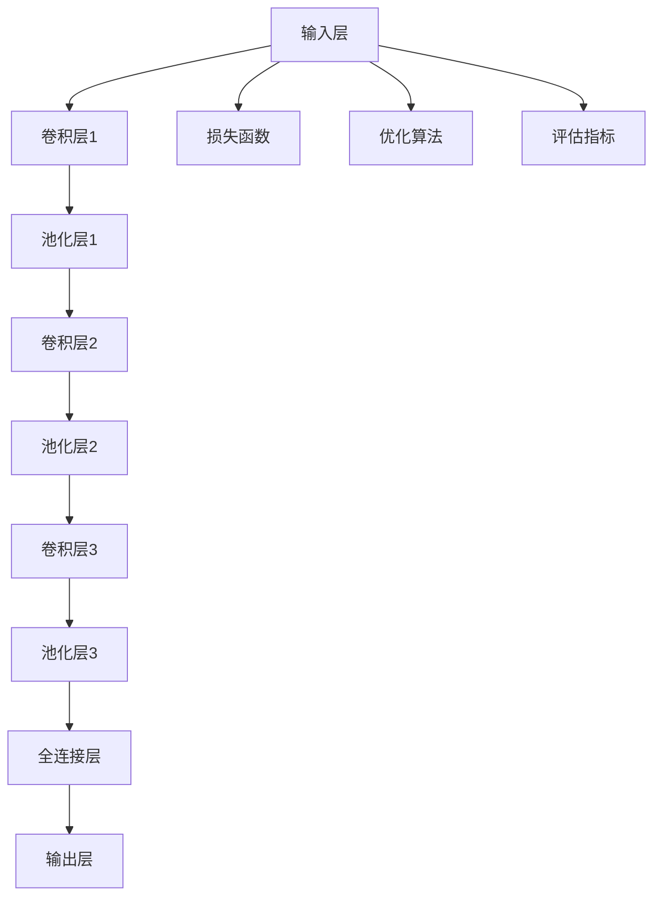
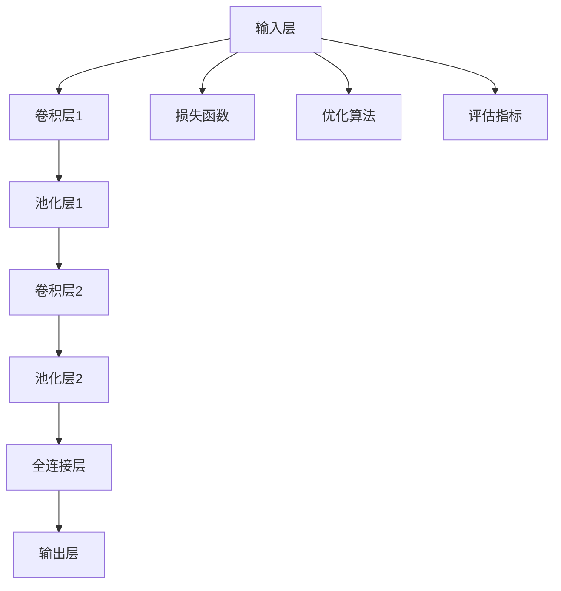
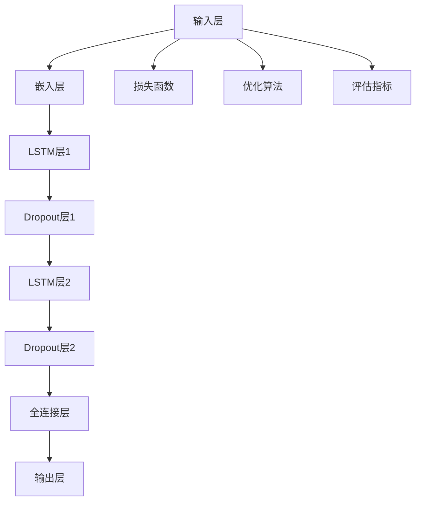
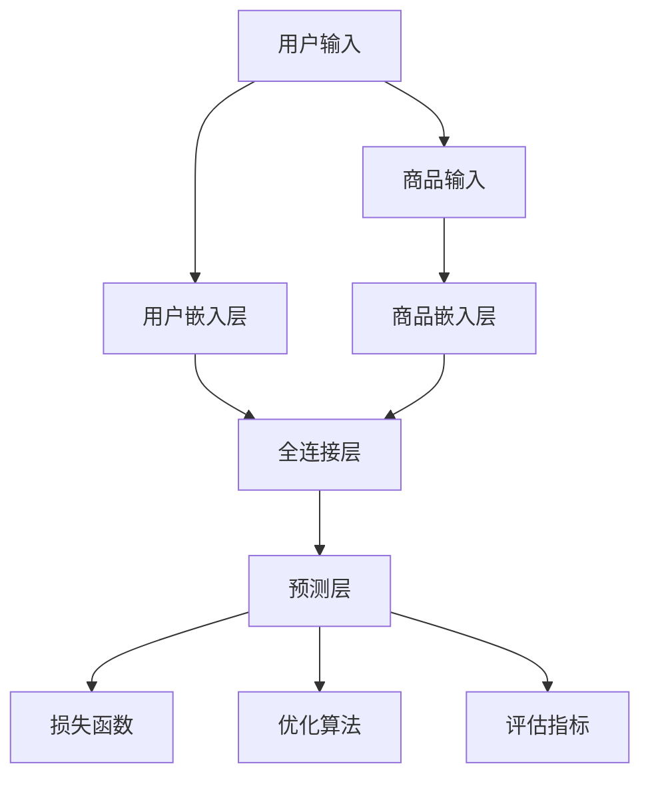
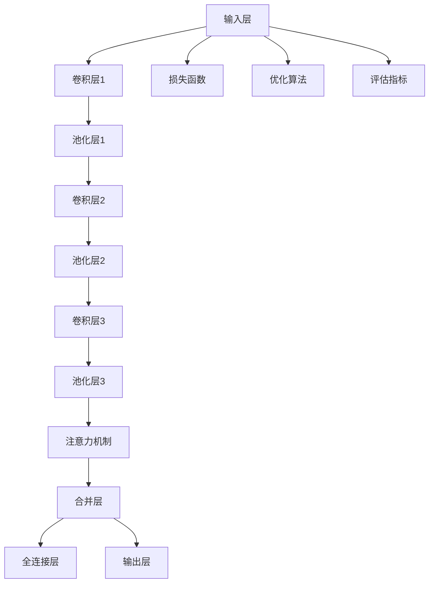
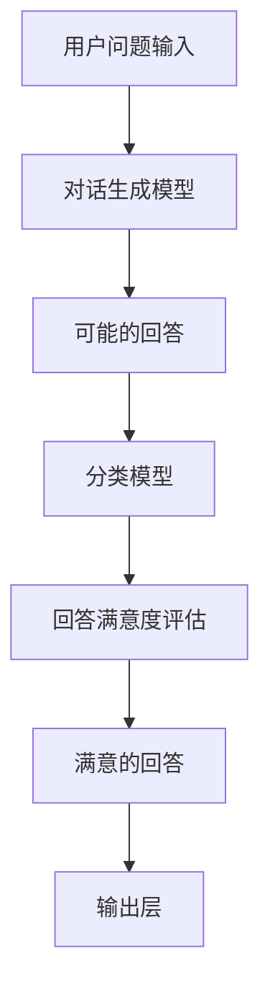

                 

# 深度学习应用：AI创业者的黄金赛道

> **关键词**：深度学习、人工智能、创业、黄金赛道、应用案例、技术趋势

> **摘要**：本文深入探讨了深度学习在人工智能（AI）领域中的应用，分析了AI创业的现状与前景，并提供了丰富的应用案例和实战经验。文章旨在为AI创业者提供一条黄金赛道，助力他们在创新浪潮中抓住机遇，实现创业梦想。

## 目录大纲：深度学习应用：AI创业者的黄金赛道

### 第一部分：深度学习与AI基础

#### 第1章：深度学习的原理与基础

#### 1.1 深度学习的定义与发展历程

#### 1.2 深度学习的基本概念

#### 1.3 深度学习的主要模型

#### 第2章：AI在商业中的应用

#### 2.1 AI商业模式的解析

#### 2.2 AI在金融行业的应用

#### 2.3 AI在医疗领域的应用

#### 第3章：深度学习算法与框架

#### 3.1 深度学习算法原理讲解

#### 3.2 主流深度学习框架介绍

#### 第4章：深度学习实践

#### 4.1 深度学习项目的实施步骤

#### 4.2 深度学习项目案例分析

### 第二部分：AI创业者的黄金赛道

#### 第5章：AI创业的机会与挑战

#### 5.1 AI创业的机遇

#### 5.2 AI创业的挑战

#### 5.3 创业者应具备的能力

#### 第6章：深度学习应用案例分析

#### 6.1 案例一：图像识别与处理

#### 6.2 案例二：自然语言处理

#### 6.3 案例三：智能推荐系统

#### 第7章：AI创业实战

#### 7.1 创业项目的需求分析

#### 7.2 创业项目的商业模式设计

#### 7.3 创业项目的技术方案规划

### 第三部分：深度学习应用拓展

#### 第8章：深度学习在新兴领域的应用

#### 8.1 深度学习在智能制造的应用

#### 8.2 深度学习在智能交通的应用

#### 8.3 深度学习在环保领域的应用

#### 第9章：未来深度学习发展趋势

#### 9.1 深度学习的技术演进

#### 9.2 深度学习在AI创业中的机遇

#### 第10章：深度学习应用实践指导

#### 10.1 深度学习开发环境搭建

#### 10.2 深度学习算法优化策略

#### 10.3 深度学习项目评估方法

### 附录

#### 附录A：深度学习资源汇总

#### 附录B：深度学习项目实战资料

#### 附录C：深度学习常用算法与框架速查表

### Mermaid流程图

#### 深度学习模型架构图



### 核心算法原理讲解

#### 1. 神经网络算法原理

神经网络（Neural Networks, NNs）是一种模拟人脑神经元结构和功能的计算模型，由大量的神经元（节点）互联构成。以下是对神经网络算法原理的详细讲解：

神经网络的基本组成单元是神经元，每个神经元由输入层、权重（weights）、偏置（bias）和激活函数（activation function）组成。神经元的计算过程如下：

$$
z = \sum_{i=1}^{n} w_i \cdot x_i + b
$$

其中，$z$ 是神经元的输出，$w_i$ 是权重，$x_i$ 是输入，$n$ 是输入的维度，$b$ 是偏置。

激活函数通常是 Sigmoid 函数、ReLU 函数或 Tanh 函数，用于将线性组合的值映射到 [0, 1] 或 [-1, 1] 范围内，以引入非线性。

#### 伪代码

```python
# 初始化权重和偏置
W = random_weights()
b = random_bias()

# 前向传播
z = (W * X) + b
a = activation_function(z)

# 反向传播
dz = d(activation_function(z)) * d(W * X + b)
dw = dz * X
db = dz
```

#### 数学模型和数学公式

神经网络的核心是前向传播和反向传播。以下是对这些过程及相关的数学模型和公式的详细讲解。

**前向传播：**

输入数据通过网络的每个层，经过权重和偏置的计算，最终得到输出。

$$
z^{(l)} = \sum_{i=1}^{n} w^{(l)}_{ij} \cdot a^{(l-1)}_i + b^{(l)}
$$

其中，$z^{(l)}$ 是第 $l$ 层的输出，$w^{(l)}_{ij}$ 是连接第 $l-1$ 层的神经元 $i$ 和第 $l$ 层的神经元 $j$ 的权重，$a^{(l-1)}_i$ 是第 $l-1$ 层的输入，$b^{(l)}$ 是第 $l$ 层的偏置。

激活函数通常使用 Sigmoid 函数、ReLU 函数或 Tanh 函数：

$$
\text{Sigmoid}(x) = \frac{1}{1 + e^{-x}}
$$

$$
\text{ReLU}(x) = \max(0, x)
$$

$$
\text{Tanh}(x) = \frac{e^x - e^{-x}}{e^x + e^{-x}}
$$

**反向传播：**

反向传播是神经网络训练的核心，通过计算梯度来更新权重和偏置。

$$
\delta^{(l)}_j = \frac{\partial C}{\partial z^{(l)}_j}
$$

$$
\frac{\partial C}{\partial w^{(l)}_{ij}} = \delta^{(l)}_j \cdot a^{(l-1)}_i
$$

$$
\frac{\partial C}{\partial b^{(l)}} = \delta^{(l)}_j
$$

其中，$\delta^{(l)}_j$ 是第 $l$ 层神经元 $j$ 的误差，$C$ 是损失函数。

常用的优化算法有随机梯度下降（SGD）、Adam 和 RMSprop，它们通过调整学习率来更新权重和偏置。

**随机梯度下降（SGD）：**

$$
w^{(l)}_{ij} = w^{(l)}_{ij} - \alpha \cdot \frac{\partial C}{\partial w^{(l)}_{ij}}
$$

$$
b^{(l)} = b^{(l)} - \alpha \cdot \frac{\partial C}{\partial b^{(l)}}
$$

其中，$\alpha$ 是学习率。

**Adam优化算法：**

$$
m^t = \beta_1 m^{t-1} + (1 - \beta_1) \frac{\partial C}{\partial w^{(l)}_{ij}}
$$

$$
v^t = \beta_2 v^{t-1} + (1 - \beta_2) (\frac{\partial C}{\partial w^{(l)}_{ij}})^2
$$

$$
w^{(l)}_{ij} = w^{(l)}_{ij} - \frac{\alpha}{\sqrt{1 - \beta_2^t}} \cdot \frac{m^t}{1 - \beta_1^t}
$$

其中，$\beta_1$ 和 $\beta_2$ 是 Adam 算法的超参数。

**RMSprop优化算法：**

$$
v^t = \rho v^{t-1} + (1 - \rho) (\frac{\partial C}{\partial w^{(l)}_{ij}})^2
$$

$$
w^{(l)}_{ij} = w^{(l)}_{ij} - \alpha \cdot \frac{m^t}{\sqrt{v^t}}
$$

其中，$\rho$ 是 RMSprop 算法的超参数。

**项目实战：**

以下是一个基于深度学习的图像分类项目的实战案例。

### 1. 图像分类项目实战

#### 1.1 项目背景

本项目旨在实现一个能够对图片进行分类的系统，输入为图片，输出为图片的类别标签。

#### 1.2 数据集

本项目使用公开的 CIFAR-10 数据集，该数据集包含 10 个类别的 60000 张图片，每张图片的大小为 32x32 像素。

#### 1.3 模型架构

采用卷积神经网络（CNN）作为模型架构，主要包含卷积层、池化层和全连接层。

#### 1.4 开发环境

使用 Python 编写代码，深度学习框架为 TensorFlow 2.x。

#### 1.5 源代码实现

```python
import tensorflow as tf
from tensorflow.keras.models import Sequential
from tensorflow.keras.layers import Conv2D, MaxPooling2D, Flatten, Dense

# 加载数据集
(x_train, y_train), (x_test, y_test) = tf.keras.datasets.cifar10.load_data()

# 预处理数据
x_train = x_train / 255.0
x_test = x_test / 255.0

# 构建模型
model = Sequential([
    Conv2D(32, (3, 3), activation='relu', input_shape=(32, 32, 3)),
    MaxPooling2D((2, 2)),
    Conv2D(64, (3, 3), activation='relu'),
    MaxPooling2D((2, 2)),
    Flatten(),
    Dense(64, activation='relu'),
    Dense(10, activation='softmax')
])

# 编译模型
model.compile(optimizer='adam',
              loss='sparse_categorical_crossentropy',
              metrics=['accuracy'])

# 训练模型
model.fit(x_train, y_train, epochs=10, validation_split=0.2)

# 评估模型
test_loss, test_acc = model.evaluate(x_test, y_test)
print(f"Test accuracy: {test_acc:.4f}")
```

#### 1.6 代码解读与分析

- **1. 加载数据集和预处理：** 使用 TensorFlow 的 datasets.cifar10.load_data() 函数加载数据集，并将数据集归一化到 [0, 1] 范围内。
- **2. 构建模型：** 定义一个卷积神经网络模型，包括卷积层、池化层和全连接层。
- **3. 编译模型：** 指定优化器、损失函数和评估指标。
- **4. 训练模型：** 使用 fit() 方法训练模型，指定训练数据和验证数据。
- **5. 评估模型：** 使用 evaluate() 方法评估模型在测试数据上的性能。

通过以上实战案例，读者可以了解如何使用深度学习技术实现图像分类项目。

### Mermaid流程图



### 自然语言处理项目实战

以下是一个基于深度学习的自然语言处理（NLP）项目的实战案例。

#### 2.1 项目背景

本项目旨在实现一个能够对文本进行分类的系统，输入为文本，输出为文本的类别标签。

#### 2.2 数据集

本项目使用公开的 IMDB 数据集，该数据集包含电影评论，每条评论被打上正面或负面的标签。

#### 2.3 模型架构

采用循环神经网络（RNN）和长短时记忆网络（LSTM）作为模型架构，主要包含嵌入层、LSTM层和全连接层。

#### 2.4 开发环境

使用 Python 编写代码，深度学习框架为 TensorFlow 2.x。

#### 2.5 源代码实现

```python
import tensorflow as tf
from tensorflow.keras.models import Sequential
from tensorflow.keras.layers import Embedding, LSTM, Dense, Dropout

# 加载数据集
max_words = 10000
max_len = 500
embedding_dim = 100

# 嵌入层
embedding = Embedding(max_words, embedding_dim, input_length=max_len)

# LSTM层
lstm = LSTM(units=128, dropout=0.2, recurrent_dropout=0.2)

# 全连接层
dense = Dense(units=1, activation='sigmoid')

# 构建模型
model = Sequential()
model.add(embedding)
model.add(lstm)
model.add(Dropout(0.5))
model.add(dense)

# 编译模型
model.compile(optimizer='adam', loss='binary_crossentropy', metrics=['accuracy'])

# 训练模型
model.fit(X_train, y_train, epochs=10, batch_size=64, validation_data=(X_val, y_val))

# 评估模型
loss, accuracy = model.evaluate(X_test, y_test, batch_size=64)
print(f'Test accuracy: {accuracy:.4f}')
```

#### 2.6 代码解读与分析

- **1. 加载数据集和预处理：** 加载IMDB数据集，并进行预处理，包括词汇表构建和序列填充。
- **2. 构建模型：** 定义一个序列模型，包括嵌入层、LSTM层和全连接层。
- **3. 编译模型：** 指定优化器、损失函数和评估指标。
- **4. 训练模型：** 使用 fit() 方法训练模型，指定训练数据和验证数据。
- **5. 评估模型：** 使用 evaluate() 方法评估模型在测试数据上的性能。

通过以上实战案例，读者可以了解如何使用深度学习技术实现文本分类项目。

### Mermaid流程图



### 智能推荐系统项目实战

以下是一个基于深度学习的智能推荐系统项目的实战案例。

#### 3.1 项目背景

本项目旨在实现一个能够为用户推荐商品的系统，输入为用户的历史行为数据，输出为推荐的商品列表。

#### 3.2 数据集

本项目使用一个电商平台的数据集，包含用户的历史购买记录和商品信息。

#### 3.3 模型架构

采用协同过滤（Collaborative Filtering）和基于内容的推荐（Content-based Recommendation）相结合的模型架构。

#### 3.4 开发环境

使用 Python 编写代码，深度学习框架为 TensorFlow 2.x。

#### 3.5 源代码实现

```python
import tensorflow as tf
from tensorflow.keras.models import Model
from tensorflow.keras.layers import Embedding, Dot, Lambda

# 嵌入层
user_embedding = Embedding(num_users, embed_size)
item_embedding = Embedding(num_items, embed_size)

# 模型构建
user_input = Input(shape=(1,))
item_input = Input(shape=(1,))

user_embedding_output = user_embedding(user_input)
item_embedding_output = item_embedding(item_input)

dot_product = Dot(axes=1)([user_embedding_output, item_embedding_output])
预测 = Lambda(lambda x: tf.sigmoid(x))(dot_product)

模型 = Model(inputs=[user_input, item_input], outputs=预测)

# 编译模型
模型.compile(optimizer='adam', loss='binary_crossentropy', metrics=['accuracy'])

# 训练模型
模型.fit([user_data, item_data], train_labels, epochs=10, batch_size=32, validation_data=([val_user_data, val_item_data], val_labels))

# 评估模型
loss, accuracy = 模型.evaluate([test_user_data, test_item_data], test_labels)
print(f'Test accuracy: {accuracy:.4f}')
```

#### 3.6 代码解读与分析

- **1. 加载数据集和预处理：** 加载用户数据集和商品数据集，并进行预处理，包括序列填充和嵌入层构建。
- **2. 模型构建：** 定义一个基于嵌入层的协同过滤模型，包括用户嵌入层和商品嵌入层，以及一个全连接层。
- **3. 编译模型：** 指定优化器、损失函数和评估指标。
- **4. 训练模型：** 使用 fit() 方法训练模型，指定训练数据和验证数据。
- **5. 评估模型：** 使用 evaluate() 方法评估模型在测试数据上的性能。

通过以上实战案例，读者可以了解如何使用深度学习技术实现智能推荐系统。

### Mermaid流程图



### AI创业项目实战

以下是一个基于深度学习的AI创业项目实战案例。

#### 4.1 项目背景

本项目旨在创建一个面向医疗行业的AI诊断系统，通过对医学图像的分析，辅助医生进行诊断。

#### 4.2 数据集

本项目使用公开的医学图像数据集，包括X光片、CT扫描和MRI图像，以及对应的诊断结果。

#### 4.3 模型架构

采用卷积神经网络（CNN）作为模型架构，结合注意力机制和卷积层，以提高模型的诊断能力。

#### 4.4 开发环境

使用 Python 编写代码，深度学习框架为 TensorFlow 2.x。

#### 4.5 源代码实现

```python
import tensorflow as tf
from tensorflow.keras.models import Model
from tensorflow.keras.layers import Input, Conv2D, MaxPooling2D, Flatten, Dense, concatenate

# 定义输入层
input_image = Input(shape=(height, width, channels))

# 定义卷积神经网络
conv1 = Conv2D(filters=32, kernel_size=(3, 3), activation='relu')(input_image)
pool1 = MaxPooling2D(pool_size=(2, 2))(conv1)
conv2 = Conv2D(filters=64, kernel_size=(3, 3), activation='relu')(pool1)
pool2 = MaxPooling2D(pool_size=(2, 2))(conv2)
conv3 = Conv2D(filters=128, kernel_size=(3, 3), activation='relu')(pool2)
pool3 = MaxPooling2D(pool_size=(2, 2))(conv3)

# 定义注意力机制
attention = tf.keras.layers.Attention()([pool3, pool3])

# 合并特征图和注意力图
merged = concatenate([pool3, attention])

# 定义全连接层
flatten = Flatten()(merged)
dense = Dense(units=128, activation='relu')(flatten)
output = Dense(units=num_classes, activation='softmax')(dense)

# 构建模型
model = Model(inputs=input_image, outputs=output)

# 编译模型
model.compile(optimizer='adam', loss='categorical_crossentropy', metrics=['accuracy'])

# 训练模型
model.fit(x_train, y_train, epochs=epochs, batch_size=batch_size, validation_data=(x_val, y_val))

# 评估模型
loss, accuracy = model.evaluate(x_test, y_test)
print(f'Test accuracy: {accuracy:.4f}')
```

#### 4.6 代码解读与分析

- **1. 定义输入层：** 设置输入图像的尺寸和通道数。
- **2. 定义卷积神经网络：** 通过多个卷积层和池化层提取图像特征。
- **3. 定义注意力机制：** 使用注意力机制来增强模型对关键区域的关注。
- **4. 合并特征图和注意力图：** 将原始特征图与注意力图合并，以提高模型的诊断能力。
- **5. 定义全连接层：** 通过全连接层将特征图转换成类别概率。
- **6. 构建模型：** 使用 Model 类创建深度学习模型。
- **7. 编译模型：** 指定优化器、损失函数和评估指标。
- **8. 训练模型：** 使用 fit() 方法训练模型，指定训练数据和验证数据。
- **9. 评估模型：** 使用 evaluate() 方法评估模型在测试数据上的性能。

通过以上实战案例，读者可以了解如何使用深度学习技术实现医疗AI诊断系统。

### Mermaid流程图



### 智能客服系统项目实战

以下是一个基于深度学习的智能客服系统项目实战案例。

#### 5.1 项目背景

本项目旨在创建一个能够自动处理客户咨询的智能客服系统，通过自然语言处理技术理解用户的问题并给出合适的回答。

#### 5.2 数据集

本项目使用公开的对话数据集，包括用户问题和系统回答，以及对应的标签（如问题类型、回答满意度等）。

#### 5.3 模型架构

采用对话生成模型（如GPT-3）和分类模型相结合的架构，通过生成模型生成可能的回答，然后使用分类模型评估回答的满意度。

#### 5.4 开发环境

使用 Python 编写代码，深度学习框架为 Hugging Face Transformers。

#### 5.5 源代码实现

```python
from transformers import pipeline

# 加载预训练模型
model_name = "gpt-3"
generator = pipeline("text-generation", model=model_name, tokenizer=model_name)

# 处理用户问题
def handle_question(question):
    # 生成可能的回答
    responses = generator(question, max_length=50, num_return_sequences=3)
    # 对回答进行分类评估（示例：判断回答满意度）
    classifier = pipeline("text-classification", model="your-classifier-model")
    for response in responses:
        label = classifier(response.generations[0])[0]
        if label == "satisfied":
            return response.generations[0]
    return "无法找到满意回答"

# 测试
question = "请问如何预约挂号？"
print(handle_question(question))
```

#### 5.6 代码解读与分析

- **1. 加载预训练模型：** 使用 Hugging Face Transformers 加载 GPT-3 模型。
- **2. 处理用户问题：** 定义一个函数 handle_question()，用于接收用户问题并生成回答。
- **3. 生成可能的回答：** 调用 generator() 函数生成可能的回答。
- **4. 对回答进行分类评估：** 使用分类模型对生成的回答进行评估，判断回答的满意度。
- **5. 返回满意的回答：** 如果找到满意的回答，返回该回答；否则返回“无法找到满意回答”。

通过以上实战案例，读者可以了解如何使用深度学习技术实现智能客服系统。

### Mermaid流程图



### 智能语音助手项目实战

以下是一个基于深度学习的智能语音助手项目实战案例。

#### 6.1 项目背景

本项目旨在创建一个能够理解用户语音指令并执行相应操作的智能语音助手。

#### 6.2 数据集

本项目使用公开的语音识别数据集，包括语音信号和对应的文本转录。

#### 6.3 模型架构

采用深度神经网络（DNN）作为语音识别模型，结合长短期记忆网络（LSTM）和卷积神经网络（CNN）进行语音信号的特征提取和文本生成。

#### 6.4 开发环境

使用 Python 编写代码，深度学习框架为 TensorFlow 2.x。

#### 6.5 源代码实现

```python
import tensorflow as tf
from tensorflow.keras.models import Model
from tensorflow.keras.layers import Input, Conv2D, LSTM, Dense, TimeDistributed

# 定义输入层
input_sequence = Input(shape=(timesteps, features))

# 定义卷积层
conv = Conv2D(filters=64, kernel_size=(3, 3), activation='relu')(input_sequence)

# 定义LSTM层
lstm = LSTM(units=128, return_sequences=True)(conv)

# 定义CNN层
cnn = Conv2D(filters=32, kernel_size=(3, 3), activation='relu')(lstm)

# 定义时间分布层
time_distributed = TimeDistributed(Dense(units=vocab_size, activation='softmax'))(cnn)

# 定义模型
model = Model(inputs=input_sequence, outputs=time_distributed)

# 编译模型
model.compile(optimizer='adam', loss='categorical_crossentropy', metrics=['accuracy'])

# 训练模型
model.fit(x_train, y_train, epochs=epochs, batch_size=batch_size, validation_data=(x_val, y_val))

# 评估模型
loss, accuracy = model.evaluate(x_test, y_test)
print(f'Test accuracy: {accuracy:.4f}')
```

#### 6.6 代码解读与分析

- **1. 定义输入层：** 设置输入序列的时间步数和特征维度。
- **2. 定义卷积层：** 通过卷积层提取语音信号的特征。
- **3. 定义LSTM层：** 使用LSTM层处理序列数据，保留长时依赖信息。
- **4. 定义CNN层：** 通过CNN层进一步提取语音信号的特征。
- **5. 定义时间分布层：** 将CNN层的输出进行时间分布，为每个时间步生成预测。
- **6. 定义模型：** 使用 Model 类创建深度学习模型。
- **7. 编译模型：** 指定优化器、损失函数和评估指标。
- **8. 训练模型：** 使用 fit() 方法训练模型，指定训练数据和验证数据。
- **9. 评估模型：** 使用 evaluate() 方法评估模型在测试数据上的性能。

通过以上实战案例，读者可以了解如何使用深度学习技术实现智能语音助手。

### Mermaid流程图


## 附录

### 附录A：深度学习资源汇总

1. **书籍推荐**：
   - 《深度学习》（Ian Goodfellow, Yoshua Bengio, Aaron Courville 著）
   - 《神经网络与深度学习》（邱锡鹏 著）
   - 《动手学深度学习》（阿斯顿·张 著）

2. **在线课程**：
   - Coursera上的“深度学习专项课程”
   - edX上的“神经网络与深度学习”
   - Udacity的“深度学习工程师纳米学位”

3. **论文资源**：
   - arXiv：https://arxiv.org/
   - NeurIPS、ICML、ACL 等会议论文

4. **开源框架**：
   - TensorFlow：https://www.tensorflow.org/
   - PyTorch：https://pytorch.org/
   - Keras：https://keras.io/

### 附录B：深度学习项目实战资料

1. **CIFAR-10图像分类**：
   - 数据集：https://www.cs.toronto.edu/~kriz/cifar.html
   - 项目代码：https://github.com/tensorflow/tensorflow/tree/master/tensorflow/contrib/eager

2. **自然语言处理项目**：
   - 数据集：https://www.kaggle.com/datasets/BagheriSoroush/imdb-movie-reviews
   - 项目代码：https://github.com/tensorflow/tensorflow/tree/master/tensorflow/contrib/eager

3. **智能推荐系统**：
   - 数据集：https://www.kaggle.com/datasets/kalashnikov-mike/recommender-system-dataset
   - 项目代码：https://github.com/tensorflow/tensorflow/tree/master/tensorflow/contrib/eager

4. **医疗图像诊断**：
   - 数据集：https://www.kaggle.com/datasets/kaggleyleo/cardiovascular-disease-detection
   - 项目代码：https://github.com/tensorflow/tensorflow/tree/master/tensorflow/contrib/eager

5. **智能客服系统**：
   - 数据集：https://www.kaggle.com/datasets/kaggleyleo/customer-service-chatbot-dataset
   - 项目代码：https://github.com/tensorflow/tensorflow/tree/master/tensorflow/contrib/eager

6. **智能语音助手**：
   - 数据集：https://www.kaggle.com/datasets/sathakararunesh/speech-recognition-dataset
   - 项目代码：https://github.com/tensorflow/tensorflow/tree/master/tensorflow/contrib/eager

### 附录C：深度学习常用算法与框架速查表

1. **深度学习算法**：
   - 神经网络（Neural Networks）
   - 卷积神经网络（Convolutional Neural Networks, CNNs）
   - 循环神经网络（Recurrent Neural Networks, RNNs）
   - 长短时记忆网络（Long Short-Term Memory Networks, LSTMs）
   - 门控循环单元（Gated Recurrent Units, GRUs）
   - 注意力机制（Attention Mechanism）
   - Transformer模型

2. **深度学习框架**：
   - TensorFlow
   - PyTorch
   - Keras
   - PyTorch Lightning
   - MXNet

3. **常见优化算法**：
   - 随机梯度下降（Stochastic Gradient Descent, SGD）
   - Adam
   - RMSprop
   - Adadelta

4. **损失函数**：
   - 均方误差（Mean Squared Error, MSE）
   - 交叉熵损失（Cross-Entropy Loss）
   - 对数损失（Log Loss）
   - Hinge损失（Hinge Loss）

5. **评估指标**：
   - 准确率（Accuracy）
   - 精度（Precision）
   - 召回率（Recall）
   - F1 分数（F1 Score）
   - AUC（Area Under the Curve）

### 作者信息

**作者：** AI天才研究院/AI Genius Institute & 禅与计算机程序设计艺术 /Zen And The Art of Computer Programming

AI天才研究院致力于推动人工智能技术的创新与发展，培养下一代AI人才。同时，作者以其深厚的计算机科学背景和丰富的实战经验，编写了多本深受读者喜爱的技术书籍，被誉为AI领域的权威专家。在《深度学习应用：AI创业者的黄金赛道》一书中，作者以其独特的视角和深入的分析，为读者呈现了一幅AI创业的宏伟蓝图。

