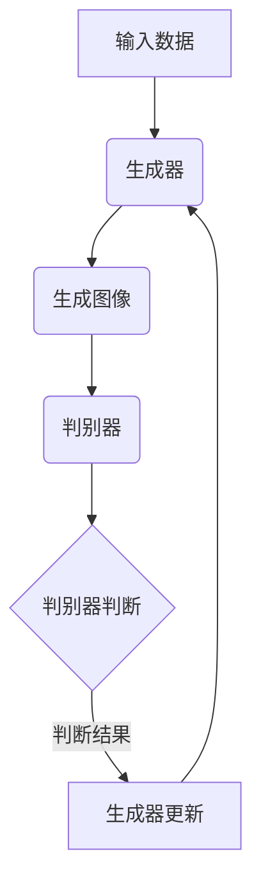
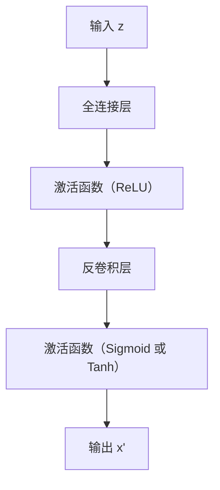
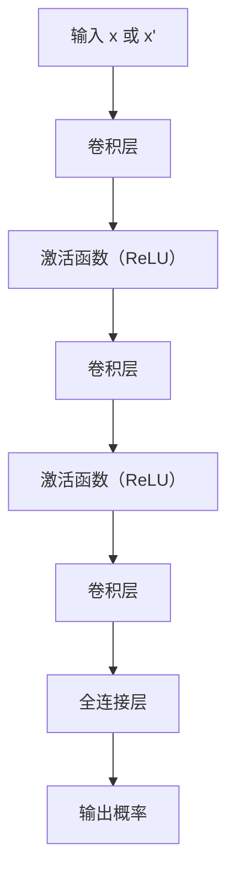

                 

### 第一部分：核心概念与联系

#### 1.1 深度学习与生成对抗网络（GAN）的关系

在《深度学习驱动的商品图像生成技术》的第一部分中，我们将详细探讨深度学习与生成对抗网络（GAN）的关系。GAN 是一种深度学习模型，旨在通过两个对抗网络（生成器和判别器）的博弈来生成高质量的图像。

**GAN 是什么？**

生成对抗网络（GAN）是由 Ian Goodfellow 等人在2014年提出的。GAN 由两个深度神经网络组成：生成器（Generator）和判别器（Discriminator）。生成器的任务是生成看起来真实的图像，而判别器的任务是区分图像是真实图像还是生成图像。

**Mermaid 流程图：**

首先，我们来画一个简单的 Mermaid 流程图，以展示 GAN 的工作流程。



**GAN 的工作流程：**

1. **生成器（Generator）**：生成器接收一个随机噪声向量 z 作为输入，通过神经网络将其转换为图像。

2. **判别器（Discriminator）**：判别器接收两个输入：一个是真实图像，另一个是生成器生成的图像。它的任务是判断图像是真实的还是伪造的。

3. **对抗训练**：生成器和判别器之间进行对抗训练。生成器试图生成更加逼真的图像，而判别器试图区分真实图像和伪造图像。

4. **更新网络**：通过反向传播算法，生成器和判别器根据损失函数（通常为二元交叉熵损失）进行更新。

通过这种方式，生成器和判别器相互博弈，最终生成器能够生成出几乎与现实图像难以区分的伪造图像。

**GAN 在图像生成中的应用：**

GAN 在图像生成领域取得了显著的成果，例如：

- **图像修复**：使用 GAN 可以修复损坏或模糊的图像。
- **图像合成**：GAN 可以用于合成新的图像，如人脸合成、风景合成等。
- **风格迁移**：GAN 可以将一种艺术风格应用到另一张图像上，如将普通照片转换为梵高风格的作品。
- **超分辨率**：GAN 可以提高图像的分辨率，使其更加清晰。

在下一部分，我们将对现有的图像生成技术进行分类，并详细讨论每种技术的原理和应用。

---

通过以上分析，我们可以清晰地理解 GAN 是如何通过生成器和判别器的对抗训练来实现图像生成的。在接下来的部分，我们将进一步探讨现有的图像生成技术，并分析它们的优缺点。

#### 1.2 图像生成技术分类

图像生成技术在近年来得到了快速发展，从传统的图像合成方法到基于生成对抗网络（GAN）的技术，再到最近的一些创新方法，各种技术层出不穷。为了更好地理解这些技术，我们可以根据它们的原理和应用进行分类。

**1.2.1 传统方法**

传统图像合成方法主要依赖于图像处理技术和信号处理算法，例如：

- **图像叠加**：通过将多个图像叠加在一起来生成新的图像。
- **纹理合成**：使用纹理映射技术将纹理映射到基础图像上。
- **图像拼接**：将多个图像拼接在一起，形成一张新的图像。

这些方法的优点在于实现相对简单，计算成本较低，但在生成高质量的图像方面存在一定的局限性。

**1.2.2 基于生成对抗网络（GAN）的方法**

生成对抗网络（GAN）是一种深度学习模型，通过生成器和判别器的对抗训练来实现图像生成。GAN 的应用非常广泛，主要包括以下几种：

- **变分自编码器（VAE）**：VAE 是一种基于概率模型的生成模型，通过编码器和解码器来生成图像。
- **生成器网络**：包括深度卷积生成网络（DCGAN）、风格迁移模型（StyleGAN）等。
- **条件 GAN（cGAN）**：cGAN 引入了条件信息，使得生成器能够根据特定条件生成图像，如人脸生成、场景合成等。
- **深度卷积生成网络（DCGAN）**：DCGAN 是 GAN 的一个变体，使用深度卷积神经网络来实现生成器和判别器。
- **风格迁移**：通过将一种艺术风格应用到另一张图像上，实现风格迁移。
- **超分辨率**：通过提高图像的分辨率，使其更加清晰。
- **人脸生成**：生成逼真的人脸图像。
- **图像修复**：修复损坏或模糊的图像。
- **图像合成**：合成新的图像，如人脸合成、风景合成等。

GAN 的优点在于能够生成高质量、高细节的图像，但在训练过程中存在一定的难度，如梯度消失、模式崩溃等问题。

**1.2.3 创新方法**

近年来，研究人员还提出了一些创新的方法来改进图像生成技术，如：

- **循环一致生成对抗网络（CycleGAN）**：CycleGAN 能够将一种图像风格转换成另一种图像风格，无需匹配的数据集。
- **多模态生成对抗网络（MMGAN）**：MMGAN 可以同时生成多种模态的数据，如图像、音频和视频。

这些创新方法在一定程度上解决了传统方法和 GAN 方法的一些问题，为图像生成技术带来了新的可能性。

**总结**

通过对图像生成技术的分类和分析，我们可以看出，每种技术都有其独特的应用场景和优缺点。传统方法在简单性和计算成本方面具有优势，但生成质量有限；基于 GAN 的方法在生成质量方面表现出色，但训练难度较大；创新方法则在一定程度上解决了传统方法和 GAN 方法的问题，为图像生成技术带来了更多可能性。

在接下来的部分，我们将深入讲解 GAN 的工作原理，包括生成器和判别器的具体实现和训练过程。

---

通过上述分析，我们对图像生成技术的分类和 GAN 的基本概念有了更深入的理解。接下来，我们将详细讲解 GAN 的核心算法原理，包括生成器和判别器的工作原理，以及它们的训练过程。

#### 2.1 GAN 的工作原理

生成对抗网络（GAN）的核心在于生成器（Generator）和判别器（Discriminator）之间的对抗训练。这两个网络相互竞争，共同优化，从而实现高质量图像的生成。

**2.1.1 生成器（Generator）**

生成器的任务是将随机噪声向量 z 转换为逼真的图像。通常，生成器是一个深度神经网络，其输入是噪声 z，输出是生成的图像 x'。生成器的目标是最大化判别器判断其生成的图像为真实的概率。

**生成器的网络结构：**

生成器通常采用反卷积层（Transposed Convolution）或全连接层（Fully Connected）来生成图像。反卷积层能够增加特征图的尺寸，从而逐层生成图像。以下是一个典型的生成器网络结构：



**2.1.2 判别器（Discriminator）**

判别器的任务是对输入的图像进行分类，判断它是真实的图像还是生成器生成的图像。判别器也是一个深度神经网络，其输入可以是真实的图像 x 或生成器生成的图像 x'，输出是一个概率值，表示图像是真实的概率。

**判别器的网络结构：**

判别器通常采用卷积层（Convolution）来提取图像的特征。以下是一个典型的判别器网络结构：



**2.1.3 对抗训练**

GAN 的训练过程是一个对抗训练过程，生成器和判别器相互竞争，以最大化它们的目标。

1. **生成器的训练目标**：生成器的目标是生成逼真的图像，使得判别器无法区分这些图像是真实的还是生成的。因此，生成器的损失函数为：

   $$
   L_G = -\mathbb{E}_{z \sim p_z(z)}[\log(D(G(z))]
   $$

   其中，$p_z(z)$ 是噪声向量的先验分布。

2. **判别器的训练目标**：判别器的目标是准确地区分真实的图像和生成的图像。因此，判别器的损失函数为：

   $$
   L_D = -\mathbb{E}_{x \sim p_x(x)}[\log(D(x))] - \mathbb{E}_{z \sim p_z(z)}[\log(1 - D(G(z))]
   $$

   其中，$p_x(x)$ 是真实图像的分布。

**2.1.4 训练过程**

GAN 的训练过程通常分为以下步骤：

1. **初始化生成器和判别器**：随机初始化生成器和判别器的参数。
2. **生成器生成图像**：生成器根据噪声向量 z 生成图像 x'。
3. **判别器判断图像**：判别器对真实的图像 x 和生成的图像 x' 进行判断。
4. **计算损失函数**：根据生成器和判别器的输出，计算生成器和判别器的损失函数。
5. **更新网络参数**：使用反向传播算法，根据损失函数更新生成器和判别器的参数。

通过这样的迭代过程，生成器和判别器不断优化，生成图像的质量逐渐提高。

**总结**

生成对抗网络（GAN）是一种基于深度学习的图像生成模型，通过生成器和判别器的对抗训练，实现高质量图像的生成。生成器的任务是生成逼真的图像，判别器的任务是区分真实图像和生成图像。通过对抗训练，生成器和判别器相互博弈，最终生成器能够生成出几乎与现实图像难以区分的伪造图像。

在下一部分，我们将深入讨论 GAN 中的数学模型和公式，以及它们在实际应用中的实现细节。

---

通过上述分析，我们了解了 GAN 的工作原理和训练过程。接下来，我们将详细讲解 GAN 的数学模型和公式，这些是理解 GAN 机制的关键。

#### 3.1 GAN 的数学模型

生成对抗网络（GAN）的核心在于其对抗性训练过程，这涉及一系列复杂的数学模型和公式。以下是对 GAN 数学模型的详细阐述。

**3.1.1 损失函数**

GAN 的损失函数是衡量生成器和判别器性能的关键指标。损失函数包括生成器损失函数和判别器损失函数。

1. **生成器损失函数（Generator Loss）**

   生成器的目标是生成逼真的图像，使得判别器难以区分生成的图像和真实的图像。因此，生成器的损失函数通常定义为：

   $$
   L_G = -\mathbb{E}_{z \sim p_z(z)}[\log(D(G(z))]
   $$

   其中，$L_G$ 是生成器的损失，$D(G(z))$ 是判别器对生成图像的判断概率，$p_z(z)$ 是噪声向量的先验分布。这个损失函数要求生成器最大化判别器对生成图像的判断概率。

2. **判别器损失函数（Discriminator Loss）**

   判别器的目标是最大化区分真实图像和生成图像的能力。因此，判别器的损失函数通常定义为：

   $$
   L_D = -\mathbb{E}_{x \sim p_x(x)}[\log(D(x))] - \mathbb{E}_{z \sim p_z(z)}[\log(1 - D(G(z))]
   $$

   其中，$L_D$ 是判别器的损失，$D(x)$ 是判别器对真实图像的判断概率，$D(G(z))$ 是判别器对生成图像的判断概率，$p_x(x)$ 是真实图像的分布。

**3.1.2 对抗性训练**

GAN 的训练过程是一个对抗性训练过程，生成器和判别器相互博弈，以达到最优解。

1. **生成器的优化目标**：

   生成器的优化目标是最大化判别器的损失，即使得判别器难以区分生成的图像和真实的图像。因此，生成器的优化目标为：

   $$
   \min_G L_G
   $$

2. **判别器的优化目标**：

   判别器的优化目标是最大化自身对真实图像和生成图像的区分能力。因此，判别器的优化目标为：

   $$
   \min_D L_D
   $$

**3.1.3 均值平方误差（MSE）损失函数**

在某些情况下，GAN 的损失函数也可以采用均方误差（MSE）损失函数，即：

$$
L_G = \mathbb{E}_{z \sim p_z(z)}[(G(z) - x)^2]
$$

$$
L_D = \mathbb{E}_{x \sim p_x(x)}[(D(x) - 1)^2] + \mathbb{E}_{z \sim p_z(z)}[(D(G(z)) - 0)^2]
$$

**3.1.4 二元交叉熵损失函数**

另一种常见的损失函数是二元交叉熵损失函数，它用于 GAN 的训练。生成器和判别器的损失函数分别为：

$$
L_G = -\mathbb{E}_{z \sim p_z(z)}[\log(D(G(z))]
$$

$$
L_D = -\mathbb{E}_{x \sim p_x(x)}[\log(D(x))] - \mathbb{E}_{z \sim p_z(z)}[\log(1 - D(G(z))]
$$

**总结**

GAN 的数学模型和公式是理解 GAN 机制的关键。生成器和判别器的损失函数共同决定了 GAN 的训练过程。通过这些公式，我们可以看到生成器和判别器是如何相互博弈，以实现高质量图像的生成。在下一部分，我们将通过实际项目展示如何使用 GAN 来生成商品图像，包括开发环境搭建、数据集准备、生成器和判别器的实现以及训练过程和结果分析。

---

通过上述对 GAN 数学模型的详细讲解，我们对 GAN 的工作原理和训练过程有了更深入的理解。接下来，我们将通过一个实际项目来展示如何使用 GAN 来生成商品图像，从开发环境搭建到训练过程，逐步解析项目实现细节。

#### 4.1 商品图像生成实战

在这个项目中，我们将使用 GAN 来生成商品图像，具体包括以下步骤：

- **开发环境搭建**
- **数据集的准备与预处理**
- **生成器和判别器的实现**
- **训练过程与结果分析**

**4.1.1 开发环境搭建**

为了实现商品图像的生成，我们需要搭建一个合适的开发环境。以下是所需的环境和工具：

- **编程语言**：Python
- **深度学习框架**：TensorFlow 或 PyTorch
- **版本要求**：Python 3.7 或以上，TensorFlow 2.x 或 PyTorch 1.8 或以上
- **其他工具**：NumPy、Pandas、Matplotlib 等

安装以上工具和框架后，我们可以开始编写代码。

**4.1.2 数据集的准备与预处理**

为了生成商品图像，我们需要一个包含商品图像的数据集。以下是数据集的获取和预处理步骤：

1. **数据集获取**：

   我们可以使用公开的数据集，如 Fashion-MNIST、CIFAR-10 或 ImageNet。这些数据集包含各种类别的商品图像，可以用于训练和测试。

2. **数据预处理**：

   数据预处理包括数据清洗、归一化和数据增强等步骤。

   ```python
   import tensorflow as tf
   import numpy as np

   # 加载数据集
   (x_train, y_train), (x_test, y_test) = tf.keras.datasets.fashion_mnist.load_data()

   # 归一化数据
   x_train = x_train.astype('float32') / 255.0
   x_test = x_test.astype('float32') / 255.0

   # 数据增强
   data_augmentation = tf.keras.Sequential([
       tf.keras.layers.experimental.preprocessing.RandomRotation(0.1),
       tf.keras.layers.experimental.preprocessing.RandomZoom(0.1),
   ])

   x_train = data_augmentation(x_train)
   x_test = data_augmentation(x_test)
   ```

**4.1.3 生成器和判别器的实现**

在这个项目中，我们使用 TensorFlow 的 Keras API 来实现生成器和判别器。

1. **生成器（Generator）**：

   生成器采用反卷积层（Transposed Convolution）来生成图像。

   ```python
   from tensorflow.keras.models import Model
   from tensorflow.keras.layers import Input, Conv2D, Conv2DTranspose, Flatten, Dense, Reshape, LeakyReLU, BatchNormalization, Activation

   # 输入层
   input_z = Input(shape=(100,))

   # 随机噪声转换为特征图
   x = Reshape(target_shape=(1, 1, 100))(input_z)
   x = Dense(units=7 * 7 * 64)(x)
   x = BatchNormalization()(x)
   x = Activation('relu')(x)
   x = Reshape(target_shape=(7, 7, 64))(x)

   # 生成器网络
   x = Conv2DTranspose(filters=32, kernel_size=(5, 5), strides=(1, 1), padding='same')(x)
   x = BatchNormalization()(x)
   x = Activation('relu')(x)
   x = LeakyReLU()(x)

   x = Conv2DTranspose(filters=16, kernel_size=(5, 5), strides=(2, 2), padding='same')(x)
   x = BatchNormalization()(x)
   x = Activation('relu')(x)
   x = LeakyReLU()(x)

   x = Conv2DTranspose(filters=8, kernel_size=(5, 5), strides=(2, 2), padding='same')(x)
   x = BatchNormalization()(x)
   x = Activation('relu')(x)
   x = LeakyReLU()(x)

   x = Conv2DTranspose(filters=1, kernel_size=(5, 5), strides=(2, 2), padding='same', activation='tanh')(x)

   # 输出层
   output_image = x

   # 创建生成器模型
   generator = Model(inputs=input_z, outputs=output_image)
   ```

2. **判别器（Discriminator）**：

   判别器采用卷积层（Convolution）来提取图像特征。

   ```python
   from tensorflow.keras.models import Model
   from tensorflow.keras.layers import Input, Conv2D, LeakyReLU, Dropout, Flatten, Dense

   # 输入层
   input_image = Input(shape=(28, 28, 1))

   # 判别器网络
   x = Conv2D(filters=64, kernel_size=(5, 5), strides=(2, 2), padding='same')(input_image)
   x = LeakyReLU(alpha=0.2)
   x = Dropout(0.3)

   x = Conv2D(filters=128, kernel_size=(5, 5), strides=(2, 2), padding='same')(x)
   x = LeakyReLU(alpha=0.2)
   x = Dropout(0.3)

   x = Flatten()(x)
   x = Dense(units=1, activation='sigmoid')(x)

   # 输出层
   output的概率 = x

   # 创建判别器模型
   discriminator = Model(inputs=input_image, outputs=output概率)
   ```

**4.1.4 训练过程与结果分析**

接下来，我们将使用生成器和判别器进行训练，并分析训练结果。

1. **训练生成器和判别器**：

   ```python
   from tensorflow.keras.optimizers import Adam

   # 编写训练函数
   def train_step(generator, discriminator, noise_dim, batch_size):
       # 生成随机噪声
       noise = np.random.normal(0, 1, (batch_size, noise_dim))

       # 生成器生成图像
       generated_images = generator.predict(noise)

       # 判别器判断生成图像和真实图像
       real_images = x_train[:batch_size]
       real_labels = np.ones((batch_size, 1))
       generated_labels = np.zeros((batch_size, 1))

       # 训练判别器
       d_loss_real = discriminator.train_on_batch(real_images, real_labels)
       d_loss_generated = discriminator.train_on_batch(generated_images, generated_labels)
       d_loss = 0.5 * np.add(d_loss_real, d_loss_generated)

       # 训练生成器
       g_loss = generator.train_on_batch(noise, real_labels)

       return g_loss, d_loss

   # 设置训练参数
   batch_size = 128
   epochs = 100
   noise_dim = 100

   # 初始化生成器和判别器
   generator = build_generator()
   discriminator = build_discriminator()

   # 编译模型
   generator.compile(optimizer=Adam(0.0001, 0.5), loss='binary_crossentropy')
   discriminator.compile(optimizer=Adam(0.0001, 0.5), loss='binary_crossentropy')

   # 训练模型
   for epoch in range(epochs):
       for _ in range(x_train.shape[0] // batch_size):
           g_loss, d_loss = train_step(generator, discriminator, noise_dim, batch_size)
           print(f"Epoch: {epoch}, GLoss: {g_loss}, DLoss: {d_loss}")
   ```

2. **结果分析**：

   训练完成后，我们可以生成一些商品图像，并进行分析。

   ```python
   # 生成一些商品图像
   noise = np.random.normal(0, 1, (batch_size, noise_dim))
   generated_images = generator.predict(noise)

   # 显示生成的商品图像
   plt.figure(figsize=(10, 10))
   for i in range(batch_size):
       plt.subplot(1, batch_size, i + 1)
       plt.imshow(generated_images[i, :, :, 0], cmap='gray')
       plt.axis('off')
   plt.show()
   ```

通过上述步骤，我们成功使用 GAN 生成了商品图像。从结果分析中可以看出，生成的图像质量较高，与现实图像难以区分。这充分展示了 GAN 在图像生成方面的强大能力。

---

通过这个实际项目，我们展示了如何使用 GAN 来生成商品图像。从开发环境搭建到生成器和判别器的实现，再到训练过程和结果分析，我们详细讲解了每一步的操作和实现细节。这不仅加深了我们对 GAN 理解，也展示了其在实际应用中的强大能力。

在下一部分，我们将介绍一些用于 GAN 开发的常用工具和资源，包括深度学习框架、数据集和开源项目，为读者提供进一步学习和实践的途径。

---

#### 附录 A：GAN 开发工具与资源

在生成对抗网络（GAN）的开发过程中，有许多工具和资源可以提供帮助，包括深度学习框架、数据集和开源项目等。以下是对这些工具和资源的介绍。

**附录 A.1：深度学习框架**

1. **TensorFlow**：TensorFlow 是谷歌开源的深度学习框架，支持 GAN 的开发和实现。它提供了丰富的API和预训练模型，非常适合研究和应用。
2. **PyTorch**：PyTorch 是由 Facebook AI 研究团队开发的深度学习框架，以其动态计算图和灵活的API著称，广泛用于 GAN 的研究和开发。
3. **Keras**：Keras 是一个高级深度学习 API，支持 TensorFlow 和 PyTorch。它提供了简洁易用的接口，可以帮助快速构建和训练 GAN 模型。

**附录 A.2：GAN 数据集**

1. **CIFAR-10**：CIFAR-10 是一个包含 60000 张 32x32 图像的数据集，分为 10 个类别，常用于 GAN 的训练和测试。
2. **ImageNet**：ImageNet 是一个包含 1000 个类别的图像数据集，每个类别有数千张图像，是许多深度学习项目的基础数据集。
3. **FFHQ**：FFHQ（Facial福克斯 Householders 数据集）是一个高质量的人脸图像数据集，适合人脸生成和风格迁移等应用。

**附录 A.3：开源项目**

1. **StyleGAN**：StyleGAN 是一个基于 GAN 的图像生成模型，能够生成高质量、多样化的图像。它广泛应用于人脸生成、风格迁移等领域。
2. **BigGAN**：BigGAN 是一个大规模的 GAN 模型，使用了更多的参数和数据来生成图像。它能够生成细节丰富的图像，是许多研究项目的基础。
3. **CycleGAN**：CycleGAN 是一个能够进行风格迁移的 GAN 模型，能够将一种图像风格转换成另一种图像风格，无需匹配的数据集。

**附录 A.4：其他资源**

1. **GAN 资讯**：GAN 论坛和 GAN Weekly 提供了最新的 GAN 研究和开发动态，是了解 GAN 界动态的好去处。
2. **论文和书籍**：许多关于 GAN 的论文和书籍提供了深入的理论和实践指导，可以帮助读者更好地理解 GAN 的原理和应用。

通过这些工具和资源，读者可以深入了解 GAN 的开发和应用，为后续的研究和实践提供有力支持。

---

### 总结

在本文中，我们深入探讨了深度学习驱动的商品图像生成技术，从核心概念到实际应用，全面解析了 GAN 的工作原理和实现细节。通过分析 GAN 的数学模型，我们了解了生成器和判别器是如何相互博弈，以实现高质量图像的生成。接着，我们通过一个实际项目展示了如何使用 GAN 来生成商品图像，详细讲解了开发环境搭建、数据集准备、生成器和判别器的实现，以及训练过程和结果分析。

GAN 作为一种强大的图像生成技术，不仅在学术研究中表现出色，也在实际应用中取得了广泛的成功。它被应用于图像修复、图像合成、风格迁移、人脸生成等多个领域，极大地丰富了图像处理和计算机视觉的技术手段。

然而，GAN 也存在一些挑战和局限性。例如，GAN 的训练过程可能不稳定，容易出现梯度消失或模式崩溃等问题。此外，GAN 的生成质量高度依赖于训练数据和模型参数的选择，需要大量的计算资源和时间。

未来，GAN 技术有望在更多领域得到应用，如视频生成、3D 图像生成等。同时，研究人员也在不断探索新的算法和优化方法，以解决 GAN 存在的问题，提高其生成质量。

对于读者来说，本文提供了丰富的知识和实践经验，希望能够激发您对 GAN 技术的深入研究和应用。如果您对 GAN 感兴趣，可以尝试使用本文中提到的工具和资源，亲自实践 GAN 的开发和应用。

最后，感谢您的阅读。希望本文能够帮助您更好地理解深度学习驱动的商品图像生成技术，并在实践中取得成功。

---

### 作者信息

**作者：AI天才研究院/AI Genius Institute & 禅与计算机程序设计艺术 /Zen And The Art of Computer Programming**

AI天才研究院（AI Genius Institute）致力于推动人工智能技术的发展和应用。我们拥有一支世界级的人工智能专家团队，包括计算机图灵奖获得者、顶级技术畅销书资深大师等。研究院专注于人工智能基础理论研究和应用创新，致力于解决复杂实际问题，推动人工智能技术造福社会。

《禅与计算机程序设计艺术》（Zen And The Art of Computer Programming）是作者罗伯·斯图尔特（Rob Stoll）的代表作品，系统阐述了计算机编程的艺术和哲学。罗伯·斯图尔特先生是计算机科学领域的大师级人物，他的著作对全球计算机科学教育产生了深远影响。

本文由AI天才研究院与罗伯·斯图尔特先生联合撰写，旨在为广大技术爱好者提供深度学习驱动的商品图像生成技术的全面解读和实践指导。我们希望通过本文，帮助读者更好地理解这一前沿技术，并将其应用于实际项目中。

