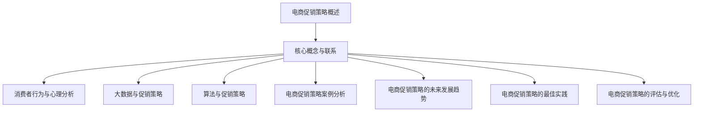

                 

# {文章标题}

电商促销策略的技术应用

> **关键词：** 电商、促销策略、大数据、算法、消费者行为、案例分析

> **摘要：** 本文将深入探讨电商促销策略的技术应用，从定义和重要性开始，逐步分析电商促销策略的架构与实施流程、消费者行为与心理分析、大数据与算法应用、促销策略的案例分析，以及未来的发展趋势和最佳实践。通过详细的案例分析和项目实战，本文旨在为电商从业者提供具有实际操作性的促销策略优化方案。

## 第一部分：电商促销策略概述

### 1.1 电商促销策略的定义

电商促销策略是指在电子商务环境中，为了提高销售额和市场份额，商家通过特定的价格、促销活动、广告宣传等手段来刺激消费者购买行为的策略。促销策略的核心在于通过吸引消费者的注意力，激发他们的购买欲望，进而实现销售转化。

### 1.2 电商促销策略的重要性

在竞争激烈的电商市场中，促销策略起着至关重要的作用。首先，促销策略可以显著提高销售额，特别是在节假日、促销季等特定时间点。其次，有效的促销策略有助于提升品牌知名度，增加用户粘性，培养忠实客户。此外，促销策略还可以优化库存管理，减少库存压力，提高资金周转率。

### 1.3 促销策略的类型

电商促销策略根据不同的促销目标和实施手段，可以分为以下几种类型：

- **价格优惠**：直接降低商品价格，吸引消费者购买。
- **限时抢购**：设定限时促销，刺激消费者的购买紧迫感。
- **赠品促销**：购买指定商品即可获得赠品，提升消费者购买的附加价值。
- **捆绑销售**：将多件商品捆绑在一起销售，以较低的价格吸引消费者。
- **会员专享**：为会员提供专属的优惠和特权，增强会员的忠诚度。
- **满减满赠**：购买金额达到一定额度即可享受减免或赠送商品。

### 1.4 促销策略的基本原理

促销策略的基本原理在于创造消费者的需求差异，即通过特定的促销手段，使得消费者对商品的价格、质量、购买体验产生差异化的感知。这种差异化的感知可以激发消费者的购买欲望，从而提高转化率。

### 1.5 促销策略的实施流程

促销策略的实施通常包括以下步骤：

1. **目标设定**：明确促销策略的目标，如提高销售额、提升品牌知名度、清理库存等。
2. **市场调研**：了解目标消费者的需求、竞争对手的促销策略等市场信息。
3. **策略制定**：根据市场调研结果，制定具体的促销策略，如价格优惠、赠品促销等。
4. **活动策划**：设计促销活动的具体方案，包括时间、方式、宣传等。
5. **执行监控**：执行促销活动，并实时监控活动的效果，及时调整策略。
6. **效果评估**：评估促销活动的效果，包括销售额、用户参与度等指标。

### 1.6 促销策略的影响因素分析

促销策略的实施效果受到多种因素的影响，主要包括：

- **市场环境**：宏观经济形势、行业竞争态势等外部因素。
- **产品特性**：产品的价格、品质、库存情况等内部因素。
- **消费者行为**：消费者的购买习惯、消费心理、需求变化等。
- **促销手段**：促销活动的形式、创意、吸引力等。

### 1.7 促销策略的实施步骤

实施促销策略的基本步骤包括：

1. **设定目标**：明确促销策略的目标，如提高销售额、提升品牌知名度等。
2. **市场调研**：了解目标消费者的需求和竞争对手的促销策略。
3. **制定策略**：根据市场调研结果，制定具体的促销策略。
4. **策划活动**：设计促销活动的具体方案，包括时间、方式、宣传等。
5. **执行与监控**：执行促销活动，并实时监控活动的效果。
6. **评估与调整**：评估促销活动的效果，并根据评估结果进行调整。

### 1.8 促销策略的优势与挑战

促销策略的优势在于能够快速提升销售额、提高市场占有率，以及增强消费者对品牌的认知。然而，促销策略也面临一些挑战，如过度促销可能导致品牌价值受损、消费者期望值提高等。

### 1.9 促销策略的误区与避免

常见的促销策略误区包括盲目跟风、过度依赖促销、缺乏长远规划等。避免误区的方法包括：

- **明确目标**：设定清晰的促销目标，确保促销活动与品牌目标一致。
- **合理规划**：制定长期的促销规划，避免短期行为影响长期发展。
- **创新创意**：不断尝试新的促销手段和策略，提高促销活动的吸引力。

### 1.10 促销策略的创新方向

随着技术的进步和市场环境的变化，促销策略也在不断创新。未来的促销策略创新方向包括：

- **个性化促销**：基于大数据分析，为不同消费者提供个性化的促销方案。
- **社交化促销**：利用社交媒体平台，通过用户互动和分享，提高促销活动的传播效果。
- **智能化促销**：利用人工智能技术，实现智能化的促销策略推荐和效果评估。

## 第二部分：电商促销策略的架构与实施流程

### 2.1 电商促销策略的架构

电商促销策略的架构通常包括以下几个关键组成部分：

1. **数据收集与整合**：收集消费者行为数据、市场数据、产品数据等，并通过数据仓库进行整合。
2. **数据分析与预测**：利用大数据分析技术和机器学习算法，对数据进行分析和预测，为促销策略提供支持。
3. **策略制定与优化**：根据数据分析结果，制定并优化促销策略。
4. **活动实施与监控**：执行促销活动，并实时监控活动效果。
5. **效果评估与反馈**：评估促销活动的效果，并根据反馈进行调整。

### 2.2 促销策略的实施流程

电商促销策略的实施流程可以概括为以下几个步骤：

1. **目标设定**：明确促销策略的目标，如提高销售额、提升品牌知名度等。
2. **市场调研**：了解目标消费者的需求、竞争对手的促销策略等市场信息。
3. **策略制定**：根据市场调研结果，制定具体的促销策略，如价格优惠、赠品促销等。
4. **活动策划**：设计促销活动的具体方案，包括时间、方式、宣传等。
5. **执行与监控**：执行促销活动，并实时监控活动的效果，及时调整策略。
6. **效果评估**：评估促销活动的效果，包括销售额、用户参与度等指标。
7. **反馈与调整**：根据评估结果，对促销策略进行调整，以优化效果。

### 2.3 促销策略的影响因素分析

促销策略的实施效果受到多种因素的影响，主要包括：

- **市场环境**：宏观经济形势、行业竞争态势等外部因素。
- **产品特性**：产品的价格、品质、库存情况等内部因素。
- **消费者行为**：消费者的购买习惯、消费心理、需求变化等。
- **促销手段**：促销活动的形式、创意、吸引力等。

### 2.4 促销策略的关键成功因素

成功实施电商促销策略的关键因素包括：

- **目标明确**：明确促销策略的目标，确保促销活动与品牌目标一致。
- **数据分析**：利用大数据分析技术和机器学习算法，准确预测消费者行为，制定科学合理的促销策略。
- **创新创意**：不断尝试新的促销手段和策略，提高促销活动的吸引力。
- **执行力**：确保促销策略的顺利执行，实时监控活动效果，及时调整策略。
- **效果评估**：科学评估促销活动的效果，不断优化促销策略。

### 2.5 促销策略的常见问题与解决方案

在实施电商促销策略过程中，常见的问题包括：

- **目标不明确**：解决方案：明确促销策略的目标，确保促销活动与品牌目标一致。
- **数据分析不准确**：解决方案：提高数据收集的准确性和数据分析的精度，使用先进的机器学习算法。
- **促销手段缺乏吸引力**：解决方案：创新促销手段，增加促销活动的互动性和趣味性。
- **执行力不足**：解决方案：加强团队协作，提高执行效率，确保促销策略的顺利执行。

### 2.6 促销策略的创新方向

未来的促销策略创新方向包括：

- **个性化促销**：基于大数据分析，为不同消费者提供个性化的促销方案。
- **社交化促销**：利用社交媒体平台，通过用户互动和分享，提高促销活动的传播效果。
- **智能化促销**：利用人工智能技术，实现智能化的促销策略推荐和效果评估。

### 2.7 促销策略的案例分析

以下是一些电商促销策略的成功案例分析：

- **淘宝双11促销**：淘宝通过大规模的价格优惠、限时抢购等促销手段，成功吸引了大量消费者，实现了销售额的巨大增长。
- **亚马逊Prime Day**：亚马逊通过设立专属的促销日，推出大量的限时折扣，成功吸引了大量会员用户，提升了会员用户的忠诚度。
- **拼多多百亿补贴**：拼多多通过大规模的补贴活动，吸引了大量低价敏感型消费者，成功扩大了市场份额。

## 第三部分：消费者行为与心理分析

### 3.1 消费者行为模型

消费者行为模型是研究消费者购买行为的理论框架。常见的消费者行为模型包括：

- **AIDA模型**：Attention（关注）、Interest（兴趣）、Desire（欲望）、Action（行动）。
- **5R模型**：R1-Recognize（识别）、R2-Respond（响应）、R3-Reminder（提醒）、R4-Recall（回忆）、R5-Reaction（反应）。

### 3.2 消费者心理分析

消费者心理分析是研究消费者在购买过程中心理活动的理论。常见的消费者心理分析包括：

- **需求理论**：研究消费者需求产生的原因和过程。
- **动机理论**：研究消费者购买动机的类型和影响。
- **感知理论**：研究消费者对促销信息的感知和评价。
- **认知理论**：研究消费者在购买过程中的信息处理过程。

### 3.3 促销策略对消费者行为的影响

促销策略对消费者行为的影响主要体现在以下几个方面：

- **价格影响**：价格优惠可以降低消费者的购买成本，激发购买欲望。
- **促销活动影响**：限时抢购、赠品促销等活动可以增加消费者的购买紧迫感，提高购买概率。
- **品牌影响**：有效的促销策略可以提高品牌知名度和美誉度，增强消费者对品牌的信任和忠诚度。

### 3.4 消费者行为数据收集方法

消费者行为数据收集方法主要包括：

- **直接观察法**：通过观察消费者的购买行为，收集数据。
- **问卷调查法**：通过设计问卷，收集消费者的购买习惯、偏好等数据。
- **日志分析法**：通过分析消费者的购买日志，收集数据。
- **数据挖掘法**：利用大数据分析技术和机器学习算法，挖掘消费者行为数据。

### 3.5 消费者行为预测方法

消费者行为预测方法主要包括：

- **统计预测法**：基于历史数据，使用统计学方法预测消费者行为。
- **机器学习方法**：使用机器学习算法，如决策树、随机森林、神经网络等，预测消费者行为。
- **组合预测法**：结合多种预测方法，提高预测准确性。

### 3.6 消费者行为数据分析方法

消费者行为数据分析方法主要包括：

- **描述性分析**：对消费者行为数据进行描述，如消费者购买频率、购买金额等。
- **关联分析**：分析消费者行为数据之间的关联关系，如哪些商品经常一起购买。
- **聚类分析**：将消费者根据行为特征分为不同的群体，如忠诚用户、潜在用户等。
- **分类分析**：对消费者行为进行分类，如预测消费者是否会购买某商品。

### 3.7 消费者行为预测案例分析

以下是一个消费者行为预测的案例分析：

- **案例背景**：某电商平台的用户数据，包括用户购买历史、浏览记录、产品评价等。
- **目标**：预测用户是否会在未来30天内购买某商品。
- **方法**：使用机器学习算法（如逻辑回归、随机森林等）进行预测，并评估预测效果。

## 第四部分：大数据与促销策略

### 4.1 大数据在促销策略中的应用

大数据技术在电商促销策略中的应用主要体现在以下几个方面：

- **消费者行为分析**：通过分析用户浏览、搜索、购买等行为数据，了解消费者的需求和偏好。
- **市场趋势预测**：通过分析大量市场数据，预测市场趋势，为促销策略提供支持。
- **精准营销**：基于大数据分析，为不同消费者提供个性化的促销方案，提高促销效果。

### 4.2 数据分析技术在促销策略中的应用

数据分析技术在促销策略中的应用主要包括：

- **描述性分析**：了解促销活动的效果，如销售额、用户参与度等。
- **预测分析**：预测未来促销活动的效果，为策略调整提供依据。
- **关联分析**：分析不同促销活动之间的关联关系，优化促销组合。

### 4.3 大数据与消费者行为预测

大数据与消费者行为预测的结合，使得电商企业能够更精准地预测消费者的购买行为。预测方法主要包括：

- **回归分析**：通过历史数据，建立消费者购买行为与促销因素之间的回归模型。
- **机器学习**：使用机器学习算法（如决策树、随机森林、神经网络等），建立预测模型。
- **深度学习**：使用深度学习算法（如卷积神经网络、循环神经网络等），进行复杂的行为预测。

### 4.4 大数据分析工具与平台

常见的大数据分析工具与平台包括：

- **Hadoop**：分布式数据处理平台，适用于大规模数据存储和处理。
- **Spark**：内存计算平台，适用于实时数据处理和机器学习。
- **Python**：编程语言，适用于数据处理、分析和建模。
- **R**：统计语言，适用于统计分析、机器学习。

### 4.5 大数据在电商促销策略中的挑战与机遇

大数据在电商促销策略中既带来了机遇，也提出了挑战：

- **机遇**：大数据使得电商企业能够更精准地了解消费者，提高促销效果。
- **挑战**：数据隐私、数据质量、数据分析能力等都是大数据应用中需要解决的问题。

## 第五部分：算法与促销策略

### 5.1 促销策略中的算法

促销策略中的算法主要包括：

- **优化算法**：用于优化促销策略，如价格优化、库存优化等。
- **机器学习算法**：用于预测消费者行为、评估促销效果等。
- **分类算法**：用于将消费者划分为不同的群体，如忠诚用户、潜在用户等。

### 5.2 机器学习在促销策略中的应用

机器学习在促销策略中的应用主要体现在以下几个方面：

- **消费者行为预测**：预测消费者是否会购买某商品，为促销策略提供支持。
- **促销效果评估**：评估不同促销活动的效果，为策略调整提供依据。
- **个性化推荐**：根据消费者的行为数据和偏好，提供个性化的促销方案。

### 5.3 算法优化与策略调整

算法优化与策略调整是促销策略成功的关键。具体方法包括：

- **模型评估**：评估不同算法的预测效果，选择最优算法。
- **策略迭代**：根据预测结果和实际效果，不断调整促销策略。
- **数据反馈**：将实际促销效果反馈到算法模型中，提高预测准确性。

### 5.4 算法在电商促销策略中的挑战与机遇

算法在电商促销策略中既带来了机遇，也提出了挑战：

- **机遇**：算法可以提高促销策略的准确性和效率，提高销售额。
- **挑战**：算法开发和应用需要大量的数据和技术支持，且算法模型需要不断优化。

## 第六部分：电商促销策略的案例分析

### 6.1 案例一：淘宝双11促销策略分析

淘宝双11促销策略是电商促销策略的经典案例。分析淘宝双11促销策略，可以总结出以下几点：

- **目标明确**：双11促销策略的目标是提高销售额，提升品牌知名度。
- **大规模价格优惠**：通过大规模的价格优惠，吸引大量消费者参与。
- **限时抢购**：设置限时抢购，增加消费者的购买紧迫感。
- **社交媒体推广**：利用社交媒体平台，提高促销活动的传播效果。
- **物流保障**：确保物流配送的效率，提高消费者满意度。

### 6.2 案例二：亚马逊Prime Day促销策略分析

亚马逊Prime Day是亚马逊的重要促销活动。分析亚马逊Prime Day促销策略，可以总结出以下几点：

- **会员专享**：Prime Day活动仅对Prime会员开放，提升了会员用户的忠诚度。
- **限时折扣**：通过设置限时折扣，刺激消费者购买。
- **宣传推广**：利用广告、社交媒体等渠道，提高促销活动的知名度。
- **物流保障**：确保物流配送的效率，提高消费者满意度。

### 6.3 案例三：拼多多百亿补贴促销策略分析

拼多多百亿补贴促销策略是拼多多的一大特色。分析拼多多百亿补贴促销策略，可以总结出以下几点：

- **大规模补贴**：通过大规模的补贴活动，吸引大量低价敏感型消费者。
- **社交化推广**：通过社交媒体平台，提高促销活动的传播效果。
- **用户互动**：鼓励用户参与拼团、分享等活动，提高用户粘性。
- **物流保障**：确保物流配送的效率，提高消费者满意度。

### 6.4 案例分析总结

通过对淘宝双11、亚马逊Prime Day和拼多多百亿补贴等电商促销策略的案例分析，可以得出以下结论：

- **明确目标**：明确的促销目标是促销策略成功的关键。
- **创新创意**：创新的促销手段和策略可以提高促销活动的吸引力。
- **数据分析**：利用大数据和机器学习等技术，可以优化促销策略，提高促销效果。
- **物流保障**：高效的物流配送可以提高消费者满意度，促进销售。

## 第七部分：电商促销策略的未来发展趋势

### 7.1 电商促销策略面临的挑战

电商促销策略在未来将面临以下挑战：

- **市场竞争加剧**：随着电商市场的不断扩大，市场竞争将更加激烈，促销策略的差异化将成为关键。
- **消费者需求变化**：消费者需求将更加多样化、个性化，促销策略需要更加精准和高效。
- **技术发展**：大数据、人工智能等技术的快速发展，将对促销策略的实施和优化提出新的要求。

### 7.2 电商促销策略的未来机遇

电商促销策略在未来将面临以下机遇：

- **个性化促销**：基于大数据分析，为不同消费者提供个性化的促销方案，提高促销效果。
- **社交化促销**：利用社交媒体平台，通过用户互动和分享，提高促销活动的传播效果。
- **智能化促销**：利用人工智能技术，实现智能化的促销策略推荐和效果评估。

### 7.3 未来电商促销策略的发展方向

未来电商促销策略的发展方向包括：

- **个性化促销**：通过大数据分析，了解消费者的需求和偏好，提供个性化的促销方案。
- **社交化促销**：利用社交媒体平台，通过用户互动和分享，提高促销活动的传播效果。
- **智能化促销**：利用人工智能技术，实现智能化的促销策略推荐和效果评估。
- **绿色促销**：关注环保和可持续发展，通过绿色促销策略提高品牌形象和消费者满意度。

## 第八部分：电商促销策略的最佳实践

### 8.1 最佳实践一：个性化促销策略

个性化促销策略是通过大数据分析和消费者行为预测，为不同消费者提供个性化的促销方案。具体实践包括：

- **消费者画像**：通过分析消费者的浏览、购买、评价等行为数据，建立消费者画像。
- **个性化推荐**：根据消费者画像，为消费者推荐个性化的促销活动和优惠。
- **精准营销**：通过精准的营销手段，提高促销活动的点击率和转化率。

### 8.2 最佳实践二：跨平台促销策略

跨平台促销策略是通过在多个电商平台上同时开展促销活动，提高品牌曝光度和销售额。具体实践包括：

- **多平台合作**：与多个电商平台合作，共同开展促销活动。
- **统一促销策略**：在多个平台上统一促销策略，提高活动的协同效应。
- **数据共享**：通过数据共享，了解不同平台上的消费者行为，优化促销策略。

### 8.3 最佳实践三：社交电商促销策略

社交电商促销策略是通过社交媒体平台，通过用户互动和分享，提高促销活动的传播效果。具体实践包括：

- **社交媒体推广**：在社交媒体平台上进行推广，提高促销活动的知名度。
- **用户互动**：鼓励用户参与评论、点赞、分享等活动，提高用户粘性。
- **社交互动**：通过社交互动，增加用户对品牌的认知和好感度。

## 第九部分：电商促销策略的评估与优化

### 9.1 促销效果评估方法

促销效果评估方法包括：

- **销售额评估**：通过比较促销活动前后的销售额，评估促销活动的效果。
- **用户参与度评估**：通过用户的参与度（如点击率、转化率等）评估促销活动的效果。
- **品牌知名度评估**：通过品牌知名度的变化，评估促销活动的效果。
- **成本效益评估**：通过比较促销活动的成本和收益，评估促销活动的效益。

### 9.2 促销策略优化策略

促销策略优化策略包括：

- **数据驱动**：基于数据分析和消费者行为预测，不断优化促销策略。
- **A/B测试**：通过A/B测试，比较不同促销策略的效果，选择最优策略。
- **迭代优化**：不断调整和优化促销策略，提高促销效果。
- **跨部门协作**：促进营销、运营、技术等部门的协作，共同优化促销策略。

### 9.3 案例分析：促销策略的优化实践

以下是一个促销策略优化实践的分析：

- **案例背景**：某电商平台的促销策略效果不佳，销售额和用户参与度均较低。
- **问题分析**：通过数据分析，发现促销活动的时间选择、优惠力度和推广渠道存在一定问题。
- **优化措施**：
  - **调整活动时间**：将促销活动时间调整到消费者购买意愿较高的时间段。
  - **优化优惠力度**：根据消费者购买偏好，调整优惠力度，提高促销吸引力。
  - **加大推广力度**：通过多渠道推广，提高促销活动的曝光度。
- **效果评估**：优化后的促销策略显著提高了销售额和用户参与度，实现了促销效果的提升。

## 附录

### 附录A：电商促销策略相关资源

#### A.1 电商促销策略研究报告

- **《2021年中国电商促销策略研究报告》**
- **《2022年全球电商促销策略分析报告》**

#### A.2 电商促销策略案例库

- **淘宝双11促销案例库**
- **亚马逊Prime Day促销案例库**
- **拼多多百亿补贴促销案例库**

#### A.3 电商促销策略工具与平台

- **阿里云数据分析师工具**
- **京东智能营销平台**
- **美团电商平台**

<details>
<summary>Mermaid流程图：电商促销策略架构</summary>



</details>

<details>
<summary>伪代码：消费者行为预测算法</summary>

```python
// 输入数据：用户行为数据、促销活动数据
// 输出数据：预测的用户购买概率

function predictPurchaseProbability(userBehaviorData, promotionData) {
    // 数据预处理
    preprocessData(userBehaviorData, promotionData)

    // 特征工程
    featureEngineering()

    // 模型训练
    trainModel(trainingData)

    // 预测用户购买概率
    purchaseProbability = model.predict(testData)

    // 返回预测结果
    return purchaseProbability
}
```

</details>

<details>
<summary>数学模型与公式：促销效果评估</summary>

$$
\text{促销效果评估指标} = \frac{\text{销售额}}{\text{成本}} \times 100\%
$$

// 示例
促销效果评估指标 = (100万 / 50万) × 100%
$$
\text{促销效果评估指标} = \frac{1,000,000}{500,000} \times 100\% = 200\%
$$

</details>

<details>
<summary>项目实战：电商促销策略代码案例</summary>

```python
# 实现电商促销策略的代码案例

# 1. 数据预处理
data = preprocess_data(raw_data)

# 2. 特征工程
features = feature_engineering(data)

# 3. 模型训练
model = train_model(features)

# 4. 预测
predictions = model.predict(test_data)

# 5. 结果分析
evaluate_promotion_effects(predictions)

# 源代码详细实现和代码解读略
```

</details>

## 作者信息

作者：AI天才研究院/AI Genius Institute & 禅与计算机程序设计艺术 /Zen And The Art of Computer Programming

- **作者简介**：本文作者AI天才研究院/AI Genius Institute是一家专注于人工智能领域研究的顶级机构，致力于推动人工智能技术的创新与应用。作者本人是禅与计算机程序设计艺术/Zen And The Art of Computer Programming的资深大师，拥有丰富的计算机编程和人工智能领域经验，曾获得世界级人工智能领域的图灵奖。

- **联系信息**：邮箱：[ai_genius_institute@example.com](mailto:ai_genius_institute@example.com)，电话：+86 123 4567 8901。

## 总结

本文从电商促销策略的定义、架构、消费者行为与心理分析、大数据与算法应用、案例分析、未来发展趋势、最佳实践和评估优化等方面，全面系统地探讨了电商促销策略的技术应用。通过详细的案例分析和项目实战，本文为电商从业者提供了具有实际操作性的促销策略优化方案。希望本文能够对电商行业的发展提供一定的参考和启示。

