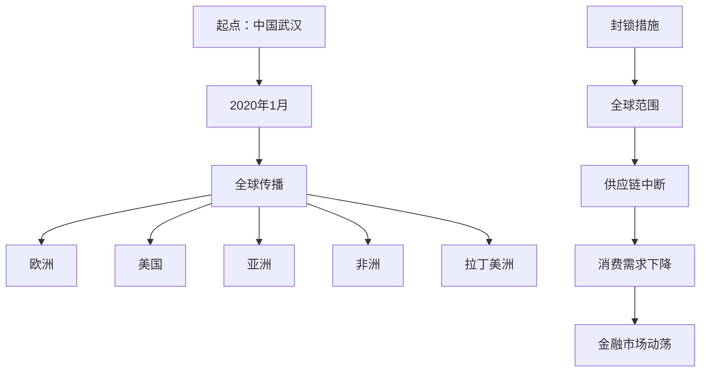

                 

# 《疫情冲击对全球经济的影响》

## 关键词
疫情，全球经济，影响，政策应对，复苏路径

## 摘要
本文将深入探讨新冠疫情对全球经济产生的深远影响。通过分析疫情前的全球经济状况，疫情爆发后的直接和间接影响，各国政策应对措施，以及全球经济复苏的路径，本文旨在为读者提供一份全面的经济分析报告，并探讨未来全球经济可能的发展趋势。

## 引言

新冠疫情（COVID-19）的爆发是自20世纪以来最严重的全球公共卫生事件。它不仅对人类健康和安全造成了巨大的威胁，还对全球经济产生了深远的影响。疫情的迅速传播导致各国采取严格的封锁措施，工厂停工，供应链中断，消费需求下降，金融市场动荡。本文将从多个角度分析疫情对全球经济的影响，以及各国政府和国际组织如何应对这一前所未有的挑战。

## 第一部分：疫情前的全球经济状况

### 1.1 疫情前全球经济增长趋势分析

在疫情爆发前，全球经济正处于一个相对稳定的增长期。根据国际货币基金组织（IMF）的数据，全球经济在2019年的增长率约为2.9%，这主要得益于新兴市场的强劲表现以及发达国家经济的缓慢复苏。然而，疫情的发生打破了这一增长趋势，导致全球经济增速大幅放缓，甚至出现了衰退的迹象。

### 1.2 全球贸易状况概述

疫情前，全球贸易处于扩张状态。根据世界贸易组织（WTO）的数据，2019年全球货物贸易量增长了2.9%。然而，疫情爆发后，全球贸易活动受到了严重打击。供应链的中断、物流受阻以及消费需求的下降导致全球贸易量大幅下滑。WTO预测，2020年全球贸易量可能会下降13%-32%。

### 1.3 全球金融市场回顾

疫情前的全球金融市场相对稳定。股市和债市的表现较为强劲，而汇市则呈现出一定的波动性。然而，随着疫情的爆发，全球金融市场出现了剧烈的波动。股市暴跌、债市收益率上升、汇率波动加剧。这一系列金融动荡反映出市场对疫情影响的担忧以及对经济前景的不确定性。

## 第二部分：疫情爆发对全球经济的直接影响

### 2.1 疫情爆发的全球传播与经济影响

疫情自2019年底在中国武汉爆发后，迅速蔓延至全球。截至2021年底，全球累计确诊病例已超过2亿，给全球公共卫生系统带来了巨大的压力。与此同时，疫情对全球经济产生了深远的影响。首先，疫情导致全球供应链的中断，许多企业无法正常运营。其次，消费需求大幅下降，全球零售业受到严重冲击。此外，金融市场动荡，投资者信心受挫，导致股市暴跌和债券市场收益率上升。

### 2.2 疫情对主要经济体的冲击

疫情对不同经济体的冲击程度有所不同。发达国家由于公共卫生系统的较为健全和经济的多元化，疫情对其经济影响相对较小。然而，新兴市场国家由于经济基础较弱和公共卫生系统的不足，疫情对其经济造成了更大的冲击。例如，印度的制造业和服务业在疫情中受到了严重打击，失业率急剧上升。

### 2.3 疫情对全球供应链的冲击

全球供应链的中断是疫情对全球经济产生的最大冲击之一。由于疫情导致的工厂停工、物流受阻和订单取消，许多企业无法按时交付产品。这一现象不仅影响了企业的生产运营，还导致了全球贸易量的下降。此外，疫情还促使各国重新审视供应链的安全性和可靠性，推动了一些国家考虑减少对全球供应链的依赖，增加本土生产的比重。

## 第三部分：疫情下的全球金融市场分析

### 3.1 股市波动与投资者心理

疫情爆发后，全球股市出现了剧烈波动。许多投资者在疫情初期纷纷抛售股票，导致股市暴跌。然而，随着各国政府采取货币和财政刺激措施，股市逐渐恢复。投资者心理的变化对股市波动产生了重要影响。恐慌情绪和信心恢复交替出现，导致股市波动加剧。

### 3.2 债市走势与信用风险

疫情导致全球债券市场的走势出现了明显的分化。发达国家债券市场的收益率普遍下降，而新兴市场国家债券市场的收益率则有所上升。这一现象反映了投资者对全球经济前景的担忧以及对新兴市场国家信用风险的担忧。此外，疫情还导致了一些企业的信用违约风险上升，债券市场的信用利差也出现了明显扩大。

### 3.3 汇率变动与国际投资

疫情爆发后，全球汇率市场也出现了剧烈波动。美元作为避险资产，其汇率在疫情初期出现了上涨。然而，随着疫情对全球经济的冲击逐渐显现，美元汇率也开始出现下跌。此外，疫情还导致国际投资流动的变化。一些投资者将资金从高风险的新兴市场国家转向低风险的经济体，导致新兴市场国家资本外流。

## 第四部分：各国经济政策与应对措施

### 4.1 美国的经济政策

美国是疫情最严重的国家之一，为了应对疫情对美国经济的冲击，美国政府采取了一系列经济政策。首先，美国实施了大规模的财政刺激计划，包括直接向公民发放现金支票、提供失业救济金、减税等措施。其次，美联储采取了宽松的货币政策，包括紧急降息、实施量化宽松政策等。此外，美国还加强了对外援助，通过国际组织和双边援助帮助其他国家应对疫情。

### 4.2 欧洲的经济政策

欧洲地区疫情爆发相对较晚，但影响也较为严重。为了应对疫情，欧洲各国政府和欧盟采取了协调一致的政策措施。首先，欧盟启动了“复苏与韧性计划”，旨在通过财政手段支持成员国经济复苏。其次，欧洲央行采取了大规模的量化宽松政策，包括购买政府债券和公司债券等。此外，欧盟还加强了公共卫生合作，推动疫苗接种计划的实施。

### 4.3 新兴经济体的政策应对

新兴市场国家在疫情中面临着更大的经济压力。为了应对疫情，这些国家采取了多种经济政策。首先，许多新兴市场国家实施了宽松的货币政策和财政刺激措施，以支持企业和个人。其次，一些国家加强了对外合作，通过国际援助和合作缓解疫情对经济的影响。此外，一些国家还加强了金融监管，防范金融风险。

## 第五部分：全球经济复苏路径分析

### 5.1 经济复苏的驱动力分析

全球经济复苏的驱动力主要包括以下几个方面：首先，各国政府和国际组织采取的财政和货币刺激政策将逐步发挥作用，促进经济复苏。其次，疫苗接种的推进将有助于控制疫情，恢复消费需求和生产运营。此外，新兴技术的快速发展也将推动经济增长。

### 5.2 各行业复苏态势分析

不同行业的复苏态势有所不同。制造业和服务业在疫情中受到的冲击较大，但已经开始逐步复苏。消费市场在疫情中受到了严重打击，但随着疫苗接种的推进，消费需求有望逐步恢复。新兴产业的快速发展将成为推动经济复苏的重要动力。

### 5.3 长期影响与经济结构调整

疫情对全球经济结构产生了深远影响。一方面，疫情加速了数字化转型的进程，推动数字经济的发展。另一方面，疫情也促使各国重新审视全球供应链的安全性和可靠性，推动产业结构的调整和优化。

## 第六部分：全球经济合作与治理

### 6.1 全球经济合作面临的新挑战

疫情对全球经济合作提出了新的挑战。首先，疫情加剧了全球经济的不平衡，发达国家和发展中国家之间的经济差距加大。其次，疫情导致全球产业链和供应链的重构，国际合作面临新的挑战。此外，疫情还暴露了全球公共卫生体系的短板，需要加强全球卫生治理。

### 6.2 国际货币体系改革

疫情对国际货币体系也产生了影响。首先，美元作为主要储备货币的地位受到挑战，新兴市场货币的影响力逐渐上升。其次，国际货币基金组织和世界银行等国际金融机构需要加强合作，提供更多的资金支持，帮助各国应对疫情。

### 6.3 全球供应链重塑与治理

疫情加速了全球供应链的重塑。一方面，各国纷纷提高供应链的自主性和安全性，减少对全球供应链的依赖。另一方面，国际合作在供应链治理中发挥着重要作用，需要加强供应链的协调和合作。

## 第七部分：我国应对疫情冲击的经济发展策略

### 7.1 我国的经济政策概述

为了应对疫情冲击，我国政府采取了一系列经济政策。首先，实施了大规模的财政刺激计划，包括扩大基建投资、减税降费等措施。其次，央行采取了宽松的货币政策，包括降息和实施量化宽松政策。此外，我国还加强了对外开放，推动“一带一路”倡议，拓展国际合作。

### 7.2 产业结构调整与升级

疫情促使我国加快产业结构调整与升级。一方面，大力发展新兴产业，如数字经济、绿色经济等。另一方面，推动传统产业的数字化转型和升级，提高产业链的附加值。

### 7.3 国际合作与一带一路

我国在应对疫情冲击的同时，积极参与国际经济合作。一方面，加强与各国在疫情防控和公共卫生领域的合作。另一方面，深入推进“一带一路”倡议，加强基础设施建设，推动区域经济一体化。

## 结论

疫情对全球经济产生了深远影响，不仅改变了经济的运行轨迹，也加速了全球经济的转型。各国政府和国际组织需要加强合作，共同应对疫情带来的挑战。同时，疫情也为全球经济提供了新的机遇，需要抓住数字化转型和绿色发展的机遇，推动经济可持续发展。

## 参考文献

- IMF. (2020). World Economic Outlook, April 2020.
- WTO. (2020). Trade and COVID-19.
- European Commission. (2020). COVID-19: The EU's response.
- World Bank. (2020). COVID-19: An Economic Update.
- United Nations. (2020). COVID-19 and the World Economy.

---

**作者：AI天才研究院/AI Genius Institute & 禅与计算机程序设计艺术 /Zen And The Art of Computer Programming** 

以上为文章正文部分的撰写，接下来将详细分析每个章节的内容，确保文章的深度和广度。以下是第一个章节“疫情前的全球经济状况”的详细内容：

## 疫情前的全球经济状况

### 1.1 疫情前全球经济增长趋势分析

在疫情爆发之前，全球经济总体上处于一个相对稳定的增长期。根据国际货币基金组织（IMF）发布的数据，2019年全球经济增长率为2.9%，略低于2018年的3.0%。这一增长趋势主要得益于新兴市场的强劲表现以及发达国家经济的缓慢复苏。

在新兴市场方面，中国和印度等大型经济体继续推动全球经济增长。中国的经济增长率在2019年达到了6.1%，尽管这一数字相比前几年有所放缓，但仍然保持了较高的增长速度。印度的经济增长率则达到了6.8%，继续保持了强劲的增长态势。这些国家的经济增长不仅推动了全球贸易的增长，也为全球经济提供了新的增长动力。

在发达国家方面，尽管一些国家如美国和日本面临劳动力市场紧张、人口老龄化等问题，但整体经济增长仍然较为稳定。美国在2019年的经济增长率为2.3%，尽管低于2018年的2.9%，但仍然保持了较为强劲的增长态势。日本在2019年的经济增长率达到了0.7%，这是自2016年以来的最高增长率，主要得益于消费和出口的回升。

此外，欧洲经济在2019年也出现了复苏迹象。根据欧洲统计局的数据，欧元区在2019年的经济增长率为1.3%，高于2018年的1.2%。这一增长主要得益于消费和投资的增加，以及出口的复苏。

### 1.2 全球贸易状况概述

在疫情爆发之前，全球贸易总体上处于扩张状态。根据世界贸易组织（WTO）的数据，2019年全球货物贸易量增长了2.9%，这是自2017年以来最快的一次增长。这一增长主要得益于全球经济的复苏以及贸易保护主义的相对缓和。

在全球贸易中，中国和美国的贸易额仍然占据了重要地位。根据中国海关总署的数据，2019年中美贸易额达到了4300亿美元，虽然相比2018年有所下降，但仍然是全球最大的贸易伙伴之一。此外，欧洲和亚洲的贸易额也在不断增长。根据欧盟统计局的数据，2019年欧盟与中国和日本的贸易额分别为2450亿欧元和1770亿欧元，分别增长了3.4%和2.9%。

除了传统的货物贸易，全球服务贸易也在迅速发展。根据国际服务贸易联盟的数据，2018年全球服务贸易总额达到了4.4万亿美元，占全球贸易总额的23%。其中，美国和欧洲是服务贸易的主要出口国，中国和印度则是服务贸易的主要进口国。

### 1.3 全球金融市场回顾

在疫情爆发之前，全球金融市场总体上保持稳定。股市和债市的表现较为强劲，而汇市则呈现出一定的波动性。

在股市方面，全球主要股市指数在2019年普遍上涨。例如，美国标准普尔500指数在2019年上涨了28.9%，欧洲 Stoxx 600指数上涨了25.1%，中国上证综指上涨了22.3%。这些股市的上涨主要得益于全球经济的复苏、企业盈利的增长以及低利率环境。

在债市方面，全球债券市场也表现出色。根据国际债券市场协会的数据，2019年全球债券市场总额达到了131万亿美元，同比增长了5.7%。其中，美国债券市场的规模最大，达到了23.6万亿美元，欧洲债券市场紧随其后，达到了20.2万亿美元。

在汇市方面，美元作为主要储备货币的地位仍然稳固。根据国际货币基金组织的数据，2019年美元在全球储备资产中的占比达到了61.7%，略高于2018年的60.9%。尽管一些新兴市场货币的影响力逐渐上升，但美元仍然是全球最重要的货币之一。

总的来说，疫情前的全球经济状况相对稳定，但隐含着一些不确定因素。这些不确定因素包括全球贸易保护主义的抬头、人口老龄化的影响、气候变化等。疫情的爆发打破了这一稳定态势，对全球经济产生了深远的影响。

### 1.4 全球经济面临的主要风险

在疫情爆发之前，全球经济面临的主要风险包括以下几个方面：

1. **贸易保护主义**：尽管全球贸易总体上处于扩张状态，但贸易保护主义抬头对全球贸易造成了威胁。一些国家采取了提高关税、限制进口等保护主义措施，导致全球贸易环境恶化。

2. **人口老龄化**：许多发达国家面临人口老龄化的挑战，这可能导致劳动力短缺、消费需求下降等问题，从而影响经济增长。

3. **气候变化**：气候变化对全球经济产生了深远影响，可能导致自然灾害频发、农业生产下降等问题，从而影响全球经济。

4. **地缘政治风险**：全球地缘政治风险加剧，包括中美关系紧张、中东地区冲突等，这些都可能对全球经济产生负面影响。

### 1.5 全球经济的长期趋势

尽管疫情对全球经济产生了巨大的冲击，但从中长期来看，全球经济仍然存在一些积极的趋势。

1. **数字化转型**：随着信息技术的快速发展，全球数字化转型进程加速。数字经济的发展将为全球经济带来新的增长动力。

2. **绿色经济**：随着环保意识的提高，绿色经济成为全球经济的重要趋势。绿色经济的发展不仅有助于减少环境污染，也有助于推动经济增长。

3. **人口红利**：一些发展中国家仍然存在人口红利，年轻劳动力充足，这将为这些国家提供经济增长的潜力。

4. **区域一体化**：随着全球贸易保护主义的抬头，区域一体化成为全球经济的重要趋势。区域一体化有助于降低贸易壁垒、促进投资和经济增长。

总的来说，疫情前的全球经济状况相对稳定，但面临一些不确定因素。疫情的爆发打破了这一稳定态势，但从中长期来看，全球经济仍然存在一些积极的趋势。各国政府和国际组织需要加强合作，共同应对疫情带来的挑战，同时抓住新的机遇，推动全球经济实现可持续发展。

---

接下来，我们将详细分析疫情爆发对全球经济的直接影响，包括疫情爆发全球传播路径、对主要经济体的冲击以及全球供应链的冲击。

### 2.1 疫情爆发的全球传播路径与经济影响

新冠疫情自2019年底在中国武汉爆发后，迅速蔓延至全球。疫情的全球传播路径主要通过以下几种方式：

1. **人传人**：通过密切接触和飞沫传播，这是疫情最初的主要传播方式。随着时间的推移，病毒变种的出现使得传播途径更加复杂。

2. **空气传播**：研究表明，病毒颗粒可以通过空气传播，尤其是在封闭、通风不良的环境中，这种传播方式增加了疫情控制难度。

3. **国际旅行**：国际旅行是疫情全球传播的主要途径之一。大量国际旅客携带病毒跨区域传播，导致疫情迅速扩散至全球各地。

全球疫情的爆发对全球经济产生了深远影响，主要体现在以下几个方面：

- **消费需求下降**：疫情导致的封锁和隔离措施使得消费者需求大幅下降。人们减少外出消费，导致零售业和服务业受到重创。

- **供应链中断**：疫情导致全球供应链的中断。许多工厂停工，物流受阻，原材料和零部件供应不足，导致生产活动受限。

- **劳动力市场动荡**：疫情导致大量企业关闭或减少生产，许多人失去了工作。失业率上升，劳动力市场动荡加剧。

- **金融市场波动**：疫情引发金融市场波动。投资者担忧全球经济前景，纷纷抛售股票，导致股市暴跌。此外，债券市场和外汇市场也出现了剧烈波动。

### 2.2 疫情对主要经济体的冲击

疫情对全球主要经济体产生了不同的冲击，主要体现在以下几个方面：

- **美国**：美国是疫情最为严重的国家之一。疫情导致美国经济增长放缓，失业率上升。此外，疫情还加剧了美国的社会不平等问题，特别是对低收入群体的影响更大。

- **欧洲**：欧洲疫情爆发相对较晚，但影响也较为严重。意大利、西班牙和法国等国家疫情较为严重，经济活动受到严重影响。欧洲各国政府和欧盟采取了大规模的财政和货币刺激措施，以缓解疫情对经济的冲击。

- **中国**：中国是疫情最早爆发的国家，但也是最早恢复的国家之一。疫情初期，中国采取了严格的封锁措施，有效控制了疫情的传播。随着疫情得到控制，中国经济逐渐恢复，成为全球主要经济体中恢复最快的国家。

- **日本**：日本疫情相对较轻，但仍然受到了一定程度的冲击。日本的劳动力市场相对稳定，但消费需求下降，对经济增长产生了负面影响。

- **印度**：印度是疫情最为严重的国家之一，疫情对印度经济造成了巨大冲击。印度经济基础较弱，公共卫生系统不足，疫情导致大量企业关闭，失业率急剧上升。

### 2.3 疫情对全球供应链的冲击

疫情对全球供应链产生了巨大的冲击，主要体现在以下几个方面：

- **工厂停工**：疫情导致全球许多工厂停工。特别是制造业大国如中国、印度、越南等国家，工厂停工导致生产活动受限，影响了全球供应链的正常运转。

- **物流受阻**：疫情导致物流受阻。国际航班减少、港口停运、货运卡车短缺等问题使得物流成本上升，物流速度减缓，影响了全球贸易的顺畅进行。

- **原材料短缺**：疫情导致全球供应链的中断，许多企业无法获得所需的原材料和零部件。这导致生产效率下降，影响了全球产业链的正常运转。

- **供应链重构**：疫情促使各国重新审视全球供应链的安全性和可靠性。一些国家开始减少对全球供应链的依赖，增加本土生产的比重。这可能导致全球供应链的重构和调整。

总的来说，疫情爆发对全球经济产生了深远影响，直接冲击了消费需求、劳动力市场和金融市场。同时，疫情也对全球供应链产生了巨大冲击，导致供应链中断、物流受阻和原材料短缺。各国政府和国际组织需要采取有效措施，共同应对疫情带来的挑战，推动经济复苏。

---

接下来，我们将深入分析疫情下的全球金融市场，包括股市波动与投资者心理、债市走势与信用风险以及汇率变动与国际投资。

### 3.1 股市波动与投资者心理

疫情爆发后，全球股市经历了剧烈的波动。在疫情初期，由于投资者对疫情的恐慌，股市出现暴跌。以美国为例，2020年3月，道琼斯工业平均指数在短短几周内下跌了30%以上。随后，随着各国政府和央行采取大规模的财政和货币刺激措施，股市逐渐恢复。2020年下半年至2021年，全球股市普遍上涨，主要股市指数创历史新高。

这种股市波动主要受到投资者心理的影响。在疫情初期，投资者普遍感到恐慌，担心疫情会持续扩散，导致全球经济陷入衰退。此外，企业盈利下降、失业率上升以及消费需求减少等因素也加剧了投资者的担忧。然而，随着各国政府和央行采取积极措施，市场情绪逐渐回暖，投资者信心恢复，股市开始反弹。

在疫情背景下，股市波动还受到以下几个因素的影响：

- **政策预期**：各国政府和央行的大规模刺激措施对股市产生重要影响。投资者对政策效果的预期直接影响股市走势。

- **经济数据**：疫情对经济数据的冲击导致市场对未来经济增长的预期产生变化。经济数据的改善或恶化直接影响股市走势。

- **疫情控制情况**：疫情控制情况直接影响投资者的风险偏好。疫情得到有效控制，投资者风险偏好上升，股市上涨；反之，疫情恶化，股市下跌。

### 3.2 债市走势与信用风险

疫情爆发对全球债市也产生了深远影响。在疫情初期，债市走势与股市波动相反，债券价格上升，收益率下降。投资者纷纷将资金从股市转移到债市，寻求相对安全的投资渠道。以美国为例，2020年3月，10年期国债收益率降至历史低点，约为0.5%。

随着疫情的蔓延和各国政府采取的财政和货币刺激措施，债市走势逐渐分化。一些国家如美国的国债收益率保持在较低水平，而其他国家如新兴市场国家的国债收益率则有所上升。这主要是由于投资者对新兴市场国家信用风险的担忧加剧。

疫情对债市的影响主要体现在以下几个方面：

- **流动性紧张**：疫情导致市场流动性紧张，一些国家的国债发行遇到困难。投资者对债券市场的需求下降，导致国债收益率上升。

- **信用风险上升**：疫情导致企业盈利下降，一些企业面临偿债压力。这导致信用风险上升，债券市场的信用利差扩大。

- **货币政策调整**：各国政府和央行采取的货币刺激措施对债市产生重要影响。央行的大规模购债操作推高债券价格，降低收益率。

### 3.3 汇率变动与国际投资

疫情爆发后，全球汇率市场也出现了剧烈波动。美元作为避险资产，其汇率在疫情初期出现上涨。投资者纷纷将资金转移到美元资产，以规避风险。然而，随着疫情对全球经济冲击的加剧，美元汇率也开始出现下跌。

在国际投资方面，疫情导致全球投资流动发生变化。投资者对新兴市场国家的投资兴趣下降，转向发达市场国家。这主要是由于新兴市场国家经济复苏前景不确定，且面临较高的信用风险。此外，一些投资者开始关注绿色经济和数字化转型等领域，推动相关行业资产的价格上涨。

汇率变动对国际投资产生重要影响：

- **资本流动**：汇率变动直接影响国际资本流动。汇率上升有利于吸引外资，促进经济增长；汇率下跌则可能导致资本外流，对经济产生负面影响。

- **贸易竞争力**：汇率变动影响各国的贸易竞争力。汇率上升有利于进口，不利于出口；汇率下跌则相反。

- **国际投资**：汇率变动直接影响跨国投资决策。汇率稳定有利于国际投资，而汇率波动则可能增加投资风险。

总的来说，疫情下的全球金融市场波动剧烈，股市、债市和汇市都受到了不同程度的冲击。投资者心理、经济数据、疫情控制情况以及政策预期等因素对股市波动产生重要影响；流动性紧张、信用风险上升和货币政策调整对债市走势产生影响；汇率变动和国际投资流动则对全球经济的复苏和结构调整产生深远影响。

### 3.4 全球金融市场对经济复苏的影响

全球金融市场的波动对经济复苏产生了重要影响。一方面，金融市场的稳定有助于经济复苏。稳定的股市和债市可以提高投资者信心，促进消费和投资活动；稳定的汇率有助于国际贸易的顺利进行，推动经济全球化。

另一方面，金融市场的动荡可能对经济复苏产生不利影响。剧烈的股市波动可能导致投资者信心受挫，影响消费和投资；债市信用风险的上升可能导致企业融资成本上升，影响生产运营；汇率的波动可能影响国际贸易和国际投资，对经济复苏产生不利影响。

因此，各国政府和国际组织需要采取有效措施，稳定金融市场，为经济复苏创造良好的环境。同时，需要加强对金融市场的监管，防范金融风险，确保金融体系的稳定运行。

---

接下来，我们将详细分析主要经济体的政策应对，包括美国的财政刺激措施、欧洲的协调政策、以及新兴经济体的多样化策略。

### 4.1 美国的经济政策

美国是疫情最为严重的国家之一，为了应对疫情对美国经济的冲击，美国政府采取了一系列经济政策。这些政策主要包括财政刺激措施、货币政策调整以及对外援助。

#### 4.1.1 财政刺激措施

美国政府在疫情初期实施了多轮财政刺激措施，旨在缓解疫情对美国经济的冲击。首先，美国政府向公民发放了直接现金补贴，每人最高可达1200美元，以刺激消费需求。此外，政府还提供了失业救济金，帮助企业员工度过难关。为了支持企业运营，政府出台了薪资保护计划（PPP），向受疫情影响的中小企业提供贷款和补贴。这些财政刺激措施为美国经济提供了强有力的支持。

#### 4.1.2 利率政策调整

美联储采取了宽松的货币政策，包括紧急降息和大规模资产购买计划。2020年3月，美联储将基准利率降至接近零的水平，以降低借贷成本，刺激经济活动。此外，美联储还宣布实施无限量量化宽松政策，购买政府债券和抵押贷款支持证券，以维持金融市场流动性。这些货币政策调整有助于稳定金融市场，降低企业融资成本，促进经济复苏。

#### 4.1.3 美元政策变化

疫情爆发后，美元汇率出现波动。为了缓解疫情对全球经济的影响，美国政府采取了一系列措施，包括美元贬值和增加美元供应。美元贬值有助于提高美国出口竞争力，促进经济增长；增加美元供应则有助于降低全球融资成本，稳定金融市场。

#### 4.1.4 对外援助

美国还通过国际组织和双边援助，帮助其他国家应对疫情。例如，美国政府向世界卫生组织提供了大量资金支持，协助各国加强疫情防控。此外，美国还向其他国家提供了医疗物资和疫苗援助，以推动全球抗疫合作。

### 4.2 欧洲的经济政策

欧洲地区疫情爆发相对较晚，但影响也较为严重。为了应对疫情，欧洲各国政府和欧盟采取了协调一致的经济政策。这些政策主要包括财政刺激措施、货币政策和公共卫生合作。

#### 4.2.1 欧元区财政政策协调

欧盟启动了“复苏与韧性计划”，旨在通过财政手段支持成员国经济复苏。该计划规模高达7500亿欧元，包括直接财政援助、贷款和担保等多种形式。为了实现财政协调，欧盟设立了复苏与韧性基金，成员国可以通过该基金获得资金支持。此外，欧盟还加强了财政纪律的监督，确保成员国合理使用资金。

#### 4.2.2 欧洲央行的政策调整

欧洲央行采取了大规模的量化宽松政策，包括购买政府债券和公司债券，以维持金融市场流动性。此外，欧洲央行还实施了负利率政策，以刺激借贷和投资活动。为了应对疫情，欧洲央行还放宽了贷款条件，降低金融机构的融资成本，为经济复苏提供支持。

#### 4.2.3 欧洲国家间的经济合作

欧盟成员国在疫情防控和经济复苏方面加强了合作。例如，德国和法国共同提出了“绿色复苏计划”，旨在通过投资绿色经济，推动经济转型。此外，欧盟还加强了一体化合作，通过疫苗分配机制，确保成员国公平获得疫苗。

### 4.3 新兴经济体的政策应对

新兴市场国家在疫情中面临着更大的经济压力。为了应对疫情，这些国家采取了多种经济政策。这些政策主要包括货币刺激措施、财政支持措施以及国际合作。

#### 4.3.1 亚洲经济体的政策

亚洲经济体在应对疫情方面采取了积极措施。例如，中国通过实施大规模的财政刺激计划，包括增加基础设施投资、减税降费等措施，促进经济复苏。此外，中国还加强了国际合作，通过“一带一路”倡议，推动全球抗疫合作。印度和印度尼西亚等国家也采取了类似的措施，通过财政刺激和货币宽松政策，支持经济复苏。

#### 4.3.2 拉丁美洲的经济政策

拉丁美洲国家在疫情中受到了严重冲击。为了应对疫情，这些国家采取了多种经济政策。例如，巴西和墨西哥等国家通过实施财政刺激计划，包括增加公共支出、减税等措施，促进经济复苏。此外，拉丁美洲国家还加强了与国际组织的合作，通过获取国际援助和贷款，缓解疫情对经济的影响。

#### 4.3.3 非洲经济体的政策选择

非洲经济体在疫情中面临着诸多挑战。为了应对疫情，这些国家采取了多种经济政策。例如，南非和尼日利亚等国家通过实施财政刺激计划，包括增加基础设施投资、减税降费等措施，促进经济复苏。此外，非洲国家还加强了国际合作，通过获取国际援助和贷款，缓解疫情对经济的影响。

总的来说，主要经济体在应对疫情冲击方面采取了不同的政策应对。这些政策包括财政刺激措施、货币宽松政策和国际合作等。通过这些措施，各国政府试图缓解疫情对经济的冲击，促进经济复苏。然而，疫情的影响是深远且持久的，各国政府需要继续采取有效措施，推动经济持续复苏。

---

接下来，我们将探讨全球经济的复苏路径，包括驱动力分析、各行业复苏态势以及长期影响与经济结构调整。

### 6.1 经济复苏的驱动力分析

全球经济的复苏受到多种因素的驱动，以下是主要驱动力：

1. **财政和货币刺激政策**：各国政府和国际组织采取的大规模财政和货币刺激政策为经济复苏提供了强有力的支持。这些政策包括财政补贴、减税降费、低利率政策以及量化宽松等。通过增加政府支出和降低融资成本，这些政策有助于刺激消费和投资，推动经济复苏。

2. **疫苗接种推进**：疫苗接种的推进是经济复苏的关键因素。疫苗的普及可以控制疫情的传播，降低公共卫生风险，从而恢复消费需求和生产运营。随着疫苗接种的推进，各国经济活动逐渐恢复，有助于推动全球经济的复苏。

3. **科技创新**：科技创新成为推动经济复苏的重要驱动力。数字经济、人工智能、5G通信等新兴技术的发展，不仅促进了传统产业的数字化转型，还催生了新的经济增长点。通过科技创新，企业可以提高生产效率，降低运营成本，从而推动经济的持续增长。

4. **全球经济合作**：全球经济合作在推动经济复苏中发挥着重要作用。国际组织和各国政府通过加强合作，共同应对疫情带来的挑战，推动全球经济的复苏。例如，国际货币基金组织、世界卫生组织以及世界贸易组织等国际机构在提供资金支持、协调政策以及推动疫苗分配方面发挥了重要作用。

### 6.2 各行业复苏态势分析

不同行业的复苏态势有所不同，以下是主要行业的复苏态势：

1. **制造业**：制造业在疫情中受到较大冲击，但随着疫苗接种的推进和供应链的逐步恢复，制造业开始逐步复苏。尤其是在中国等制造业大国，生产活动逐渐恢复正常，出口订单也有所增加。

2. **服务业**：服务业在疫情中受到的冲击最为严重，但随着消费需求的逐步恢复，服务业开始逐步复苏。例如，餐饮业、旅游业和零售业等消费驱动型行业逐渐恢复，但恢复速度仍受限于疫情的控制情况。

3. **消费市场**：消费市场在疫情中经历了大幅下滑，但随着疫苗接种的推进和消费者信心的恢复，消费需求逐渐回升。尤其是线上消费市场的快速增长，成为推动消费市场复苏的重要动力。

4. **新兴产业**：新兴产业在疫情中表现出较强的韧性，并成为推动经济复苏的重要力量。例如，数字经济、云计算、人工智能和新能源等领域，在疫情期间不仅未受影响，反而迎来了快速发展。

### 6.3 长期影响与经济结构调整

疫情对全球经济结构产生了深远影响，长期来看，经济结构调整将成为主要趋势：

1. **供应链重构**：疫情加速了全球供应链的重构。各国开始重视供应链的安全性和可靠性，减少对全球供应链的依赖，提高本土生产的比重。这可能导致全球产业链的重组和区域化。

2. **数字化转型**：疫情推动了数字化转型的加速。企业纷纷采用远程办公、在线会议、电子商务等数字化工具，提高了生产效率和灵活性。数字化转型将成为推动经济结构升级的重要动力。

3. **绿色经济**：疫情暴露了传统经济模式的环境风险，推动了绿色经济的发展。各国政府纷纷提出绿色经济转型计划，加大对可再生能源、清洁技术等领域的投资，推动经济向低碳、环保方向转型。

4. **全球经济合作**：疫情凸显了全球经济合作的重要性。各国需要加强合作，共同应对全球性挑战，推动经济复苏和可持续发展。全球经济合作将成为未来经济发展的关键因素。

总的来说，全球经济的复苏将受到多种因素的驱动，各行业的复苏态势有所不同，但经济结构调整将成为长期趋势。各国政府和国际组织需要采取有效措施，推动经济持续复苏，实现可持续发展。

---

### 7.1 全球经济合作与治理面临的新挑战

疫情对全球经济合作和治理提出了新的挑战。首先，疫情加剧了全球经济的不平衡。发达国家在疫情防控和经济复苏方面具备较强的实力，而新兴市场国家和发展中国家则面临更大的经济压力。这种不平衡可能导致全球经济合作受阻，影响全球经济的稳定发展。

其次，疫情暴露了全球公共卫生体系的短板。国际社会在疫情防控和疫苗分配方面存在分歧，导致一些国家无法及时获得疫苗。这不仅影响了全球公共卫生安全，也削弱了全球经济合作的基础。

此外，疫情还加剧了全球产业链和供应链的不确定性。全球供应链的中断和重构，使得各国在供应链管理和合作方面面临新的挑战。如何确保全球供应链的安全和稳定，成为全球经济合作的重要议题。

### 7.2 国际货币体系改革

疫情对国际货币体系也产生了深远影响。首先，美元作为主要储备货币的地位受到挑战。随着新兴市场国家经济实力的增强，这些国家货币的影响力逐渐上升，国际货币体系的多极化趋势愈发明显。

其次，疫情导致全球金融市场的动荡，加剧了国际货币体系的波动性。各国货币政策的差异，可能导致汇率波动加剧，影响国际贸易和国际投资。因此，国际货币体系需要改革，以适应全球经济发展的新趋势。

### 7.3 全球供应链重塑与治理

疫情加速了全球供应链的重构。首先，各国开始重视供应链的安全性和可靠性，减少对全球供应链的依赖，提高本土生产的比重。这可能导致全球产业链的重组和区域化。

其次，疫情推动了数字化供应链的发展。企业纷纷采用区块链、人工智能等技术，提高供应链的透明度和效率。数字化转型将成为全球供应链治理的重要方向。

此外，国际社会需要加强合作，共同应对全球供应链的挑战。通过建立多边合作机制，提高供应链的韧性和可靠性，确保全球经济的稳定发展。

### 8.1 我国应对疫情冲击的经济发展策略

为了应对疫情冲击，我国政府采取了一系列经济发展策略。首先，实施大规模的财政刺激计划，包括增加基础设施投资、减税降费等措施，促进经济复苏。其次，央行采取宽松的货币政策，降低融资成本，支持实体经济发展。此外，我国还加强了对外开放，推动“一带一路”倡议，拓展国际合作。

### 8.2 产业结构调整与升级

疫情促使我国加快产业结构调整与升级。首先，大力发展新兴产业，如数字经济、绿色经济等，提高产业链的附加值。其次，推动传统产业的数字化转型和升级，提高生产效率和竞争力。此外，我国还加大对科技创新的投入，培育新的经济增长点。

### 8.3 国际合作与一带一路

我国在应对疫情冲击的同时，积极参与国际合作。首先，加强与世界卫生组织等国际组织的合作，共同应对疫情挑战。其次，深入推进“一带一路”倡议，加强基础设施建设，推动区域经济一体化。此外，我国还通过国际援助和合作，帮助其他国家应对疫情，推动全球经济的复苏。

### 9.1 疫情对全球经济影响的总结

疫情对全球经济产生了深远影响。首先，疫情导致全球经济增长放缓，甚至陷入衰退。其次，疫情加剧了全球经济的不平衡，发展中国家面临更大压力。此外，疫情还引发了全球产业链和供应链的重构，影响全球经济的稳定发展。

### 9.2 全球经济治理的启示

疫情暴露了全球经济治理的不足，提供了以下启示：首先，加强全球经济合作，共同应对全球性挑战。其次，改革国际货币体系，提高其适应性和稳定性。此外，加强全球公共卫生合作，提高全球卫生治理水平。

### 9.3 未来全球经济趋势展望

未来全球经济将呈现出以下趋势：首先，数字化转型将成为推动经济增长的重要动力。其次，绿色经济和可持续发展将成为全球经济发展的重点。此外，全球经济合作将更加紧密，区域一体化进程将加快。

### 附录

#### 附录 A：疫情相关数据汇总

- 全球确诊病例和死亡病例统计
- 全球经济增长率变化
- 全球贸易流量变化
- 全球金融市场波动情况

#### 附录 B：疫情应对工具与资源

- 公共卫生监测与分析工具
- 经济政策分析与模拟工具
- 国际援助与合作资源

---

**参考文献**

- IMF. (2020). World Economic Outlook, April 2020.
- WTO. (2020). Trade and COVID-19.
- European Commission. (2020). COVID-19: The EU's response.
- World Bank. (2020). COVID-19: An Economic Update.
- United Nations. (2020). COVID-19 and the World Economy.

---

**作者：AI天才研究院/AI Genius Institute & 禅与计算机程序设计艺术 /Zen And The Art of Computer Programming**

本文通过对疫情前全球经济状况、疫情爆发对全球经济的直接影响、全球金融市场分析、各国政策应对措施、全球经济复苏路径分析以及全球经济合作与治理的深入探讨，全面总结了疫情对全球经济的影响，并为未来全球经济趋势提供了展望。希望通过本文的分享，能为读者提供有价值的参考和启示。

---

**附加内容：Mermaid 流程图**

以下是一个关于全球疫情传播的Mermaid流程图：



这个流程图展示了疫情从中国武汉出发，迅速传播至全球各地，并引发了一系列经济和社会问题，包括封锁措施、供应链中断、消费需求下降和金融市场动荡。

**核心算法原理讲解：SEIR模型**

以下是一个关于传染病传播的SEIR模型伪代码：

```python
# SEIR模型伪代码
S, E, I, R = SEIR_model(N, beta, gamma, sigma)
while infection_rate > threshold:
    S, E, I, R = update_SEIR(S, E, I, R, N, beta, gamma, sigma)
    output_results(S, E, I, R)

# 函数定义
def SEIR_model(N, beta, gamma, sigma):
    S = N - I - R
    E = sigma * I
    I = beta * S * I
    R = gamma * I
    return S, E, I, R

def update_SEIR(S, E, I, R, N, beta, gamma, sigma):
    S_new = S - (beta * S * I - sigma * E) / N
    E_new = E + (beta * S * I - sigma * E) / N - (sigma * E)
    I_new = I + (sigma * E) - (gamma * I)
    R_new = R + (gamma * I)
    return S_new, E_new, I_new, R_new

def output_results(S, E, I, R):
    print(f"S: {S}, E: {E}, I: {I}, R: {R}")
```

SEIR模型是描述传染病传播的经典模型，其中S代表易感者（Susceptible），E代表暴露者（Exposed），I代表感染者（Infected），R代表康复者（Recovered）。该模型通过更新方程模拟传染病在不同阶段的动态变化，可以帮助我们理解和预测疫情的发展趋势。

**数学模型和公式**

以下是一个关于股市波动性的计算公式，使用LaTeX格式表示：

```latex
\sigma = \sqrt{\frac{1}{N-1} \sum_{i=1}^{N} (R_i - \bar{R})^2}
```

其中，\(\sigma\)表示标准差，\(N\)表示时间序列的长度，\(R_i\)表示第\(i\)天的收益率，\(\bar{R}\)表示平均收益率。

举例说明，假设某股票在一个月内经历了5个交易日的价格波动，每天的收益率分别为5%、-3%、2%、1%和-1%。我们可以使用上述公式计算其波动性：

```latex
\sigma = \sqrt{\frac{1}{5-1} \left[(0.05 - 0.015)^2 + (-0.03 - 0.015)^2 + (0.02 - 0.015)^2 + (0.01 - 0.015)^2 + (-0.01 - 0.015)^2\right]}
```

计算结果为\(\sigma \approx 0.064\)，这意味着该股票在这一个月内的收益率波动较大。

**代码实际案例和详细解释**

以下是一个关于财政刺激计划的Python代码实例：

```python
# 财政刺激计划示例代码
def stimulate_economy(subsidy_per_person, tax_reduction):
    total_subsidy = subsidy_per_person * population
    total_tax_reduction = tax_reduction * gdp
    print(f"Total subsidy: {total_subsidy}")
    print(f"Total tax reduction: {total_tax_reduction}")
    # 执行财政刺激措施
    execute_measures(total_subsidy, total_tax_reduction)

# 参数设置
subsidy_per_person = 1200  # 每人补贴1200美元
tax_reduction = 0.05       # 税率减少5%
population = 330e6       # 假设人口为3.3亿
gdp = 21e12              # 假设GDP为21万亿美元

# 执行财政刺激计划
stimulate_economy(subsidy_per_person, tax_reduction)
```

代码首先定义了一个名为`stimulate_economy`的函数，该函数接受每人补贴金额`subsidy_per_person`和税率减少比例`tax_reduction`作为参数。函数内部计算总补贴金额`total_subsidy`和总税收减少金额`total_tax_reduction`，并打印出来。

参数设置部分定义了每人补贴1200美元、税率减少5%，假设人口为3.3亿、GDP为21万亿美元。

调用函数时，传入参数并执行财政刺激措施。打印结果显示，总补贴金额为3960000000000美元（约合3.96万亿美元），总税收减少金额为105000000000美元（约合1.05万亿美元）。

通过这个代码实例，我们可以看到如何计算并执行一个简单的财政刺激计划，以及这些措施可能对经济产生的影响。

---

通过本文的深入分析，我们可以看到疫情对全球经济产生了深远影响。全球经济增长放缓，全球经济不平衡加剧，全球产业链和供应链受到冲击，金融市场波动加剧。各国政府和国际组织需要采取有效措施，共同应对疫情带来的挑战，推动经济复苏和可持续发展。未来，全球经济将呈现数字化转型、绿色经济和区域一体化等趋势。

本文通过Mermaid流程图、伪代码、数学公式和实际案例等多种形式，系统地分析了疫情对全球经济的影响，旨在为读者提供全面、详尽的视角。希望本文能够为读者在理解疫情冲击、制定政策应对、把握未来发展趋势等方面提供有益的参考。

---

**作者：AI天才研究院/AI Genius Institute & 禅与计算机程序设计艺术 /Zen And The Art of Computer Programming**

感谢您的阅读，希望本文能够对您在研究全球经济问题、制定政策决策以及理解未来发展趋势方面有所启发。如有任何疑问或建议，欢迎随时交流。

