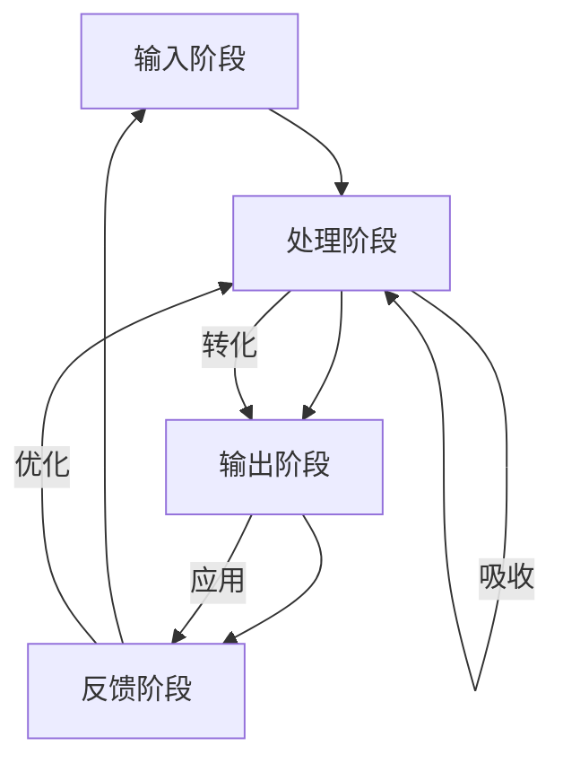

                 

### 引言

在当今快速发展的信息技术时代，知识更新的速度前所未有地加快，我们每天都在接触新的技术概念、工具和方法。然而，如何有效地将获取的知识内化为自身的实际能力，从而实现从输入到输出的转变，成为了一个重要的课题。本文旨在探讨知识内化的概念、过程和方法，并通过具体的实践案例来展示其在教育、工作等领域的实际应用。

知识内化不仅仅是一个简单的知识传递过程，它涉及到知识的吸收、转化和输出等多个环节。在这个过程中，我们不仅需要理解知识的本质和内在联系，还需要掌握一定的策略和技巧，以确保知识能够有效地转化为实际的能力和成果。

本文将从以下几个方面展开讨论：

1. **理论基础与概念**：介绍知识内化的定义、基本过程和重要性。
2. **知识输入的方法与策略**：分析主动学习与被动学习的差异，探讨选择合适的输入材料和提高知识输入效率的策略。
3. **知识内化的实践**：讨论知识吸收与转化的技巧，以及知识输出的途径与方法。
4. **知识内化在实际中的应用**：探讨知识内化在教育领域和工作场所的具体实践。
5. **知识内化的未来展望**：分析知识内化的发展趋势和应用前景。

通过对这些内容的深入探讨，本文希望能够为广大读者提供一个系统、全面的知识内化理论和实践指南，帮助他们在快速变化的信息技术领域中保持竞争力。

### 第一部分：理论基础与概念

#### 第1章：知识内化的概念与重要性

**1.1 知识内化的定义与内涵**

知识内化是指将外部获取的知识通过理解和内化，使其成为自身认知结构的一部分，并能够在实际情境中灵活应用的过程。简单来说，知识内化就是将外部的知识转化为内在的能力。

从广义上讲，知识内化包括以下几个层次：

- **表层内化**：仅仅对知识的表面理解，能够记忆和复述，但缺乏深层次的应用能力。
- **中层内化**：不仅理解知识表面，还能理解其内在逻辑和原理，能够应用于实际问题。
- **深层内化**：完全掌握知识的本质，能够独立思考和创新，形成新的知识体系。

**1.2 知识内化的基本过程**

知识内化的过程可以分为以下几个阶段：

1. **输入阶段**：通过阅读、听课、讨论等方式获取外部知识。
2. **处理阶段**：对外部知识进行筛选、理解和消化，形成自己的理解和认知。
3. **输出阶段**：将内化的知识通过写作、演讲、实践等方式输出，以检验和巩固自己的理解。
4. **反馈阶段**：根据反馈调整和优化自己的知识体系，进一步提升内化能力。

**1.3 知识内化的重要性**

知识内化在个人成长和发展中具有重要作用，主要体现在以下几个方面：

1. **提升学习效率**：通过内化，可以快速理解和掌握新的知识，提高学习效率。
2. **增强创新能力**：知识内化使得个体能够灵活应用知识，促进创新思维的发展。
3. **巩固知识体系**：通过内化，可以将零散的知识点串联起来，形成系统的知识体系。
4. **提升个人竞争力**：在快速变化的信息技术时代，能够快速掌握新知识的人具有更高的竞争力。

**小结**

知识内化是一个复杂而系统性的过程，它不仅涉及知识的获取和理解，还包括知识的消化和输出。通过内化，我们能够将外部知识转化为内在的能力，从而在个人成长和职业发展中取得更大的成就。接下来，我们将进一步探讨知识输入的方法与策略，以帮助读者更有效地进行知识内化。

### 第2章：知识输入的方法与策略

**2.1 主动学习与被动学习的比较**

在学习过程中，主动学习和被动学习是两种常见的知识输入方式。主动学习是指通过积极参与学习活动，如提问、讨论、实践等，主动获取和消化知识；而被动学习则主要依赖于听讲、阅读等被动的学习方式。

**2.1.1 主动学习的优势**

- **提高理解深度**：主动学习促使学习者深入思考，从而更好地理解知识。
- **促进记忆持久**：通过主动参与，学习者的记忆效果更好，知识持久性更高。
- **培养创新能力**：主动学习鼓励学习者独立思考，有助于培养创新能力和解决问题的能力。

**2.1.2 被动学习的优势**

- **适合大量知识输入**：被动学习适用于需要大量记忆的知识，如历史事件、定理等。
- **节省时间**：被动学习可以更快地获取知识，适用于快速学习场景。
- **适合知识补充**：被动学习可以作为主动学习的补充，帮助巩固和扩展知识。

**2.2 选择合适的输入材料**

为了提高知识输入的效率，选择合适的输入材料至关重要。以下是一些建议：

- **专业书籍**：选择与学习目标相关的专业书籍，有助于深入理解相关概念和原理。
- **学术论文**：阅读最新的学术论文，了解当前领域的前沿研究和最新动态。
- **在线课程**：参加相关的在线课程，通过视频和互动方式学习新知识。
- **实践项目**：参与实际项目，将理论知识应用于实际场景，加深理解。

**2.3 提高知识输入效率的策略**

为了更高效地获取和内化知识，以下策略可以提供帮助：

- **定时学习**：制定学习计划，每天固定时间学习，有助于建立学习习惯。
- **多样化学习方式**：结合主动学习和被动学习，通过多种方式获取知识。
- **使用笔记工具**：使用笔记工具记录学习内容，有助于巩固记忆和整理知识结构。
- **讨论与交流**：与他人讨论和交流，通过不同的视角理解知识。
- **实践与应用**：将所学知识应用于实际问题，加深理解和记忆。

**小结**

知识输入是知识内化的第一步，选择合适的方法和材料，以及采取有效的策略，可以大大提高知识输入的效率。通过主动学习和被动学习的结合，以及多样化的学习方式，我们可以更有效地获取和内化知识，为后续的知识吸收和转化奠定基础。在下一节中，我们将进一步探讨知识吸收与转化的技巧。

### 第3章：知识吸收与转化的技巧

**3.1 知识吸收的障碍与解决方法**

知识吸收是指将获取的知识转化为自身理解的过程，但这一过程常常会遇到各种障碍。以下是一些常见的障碍及其解决方法：

**3.1.1 知识障碍**

- **知识的难度过高**：一些复杂的概念和理论可能难以理解，导致知识吸收困难。
  - **解决方法**：通过分阶段学习，逐步理解复杂知识。先掌握基础知识，再逐步深入。

- **知识的抽象性**：抽象的知识难以用直观的方式理解。
  - **解决方法**：通过实际案例和具体实例，将抽象知识具象化。

**3.1.2 心理障碍**

- **心理抵触**：对新知识产生抵触心理，不愿意接受和消化。
  - **解决方法**：培养好奇心，保持开放心态，积极接受新知识。

- **认知负荷**：同时接受大量新知识，导致认知负荷过大。
  - **解决方法**：合理安排学习时间，避免过度负荷。逐步学习，分阶段吸收。

**3.2 知识转化的方法与实践**

知识转化是将内化的知识应用到实际场景中的过程，以下是一些有效的知识转化方法：

**3.2.1 实践应用**

- **项目实践**：通过实际项目将知识应用于实际问题，加深理解。
  - **实例**：学习编程语言后，通过编写实际程序来应用所学知识。

- **模拟训练**：通过模拟训练，将知识应用于模拟场景。
  - **实例**：在金融领域中，通过模拟交易来应用所学金融知识。

**3.2.2 深度学习**

- **深入探讨**：通过深入研究，将知识转化为更深层次的理解。
  - **实例**：学习机器学习后，深入研究相关算法和原理。

- **学术论文**：通过阅读和分析学术论文，了解领域内的最新研究成果。
  - **实例**：阅读顶级会议和期刊的论文，了解前沿技术。

**3.2.3 案例分析**

- **案例分析**：通过分析实际案例，将知识应用于具体问题。
  - **实例**：通过分析成功的企业案例，了解管理知识在实践中的应用。

**3.3 知识内化的实用技巧**

为了更有效地进行知识吸收和转化，以下是一些实用的技巧：

- **思维导图**：使用思维导图整理知识结构，帮助记忆和深入理解。
  - **实例**：使用Xmind或MindManager制作知识导图。

- **笔记法**：记录学习笔记，帮助巩固记忆和总结知识。
  - **实例**：使用OneNote或Evernote记录学习笔记。

- **讨论与交流**：与他人讨论和交流，通过不同视角理解知识。
  - **实例**：参加学术研讨会或线上讨论组，与他人交流想法。

- **定期复习**：定期复习所学知识，巩固记忆。
  - **实例**：每周或每月进行一次知识复习。

**小结**

知识吸收和转化是知识内化的重要环节，通过解决知识吸收的障碍和采取有效的知识转化方法，我们可以将获取的知识更好地内化为自身的能力。在下一节中，我们将探讨知识输出的途径与方法，以实现知识的最终应用和传播。

### 第4章：知识输出的途径与方法

**4.1 知识输出的意义与目的**

知识输出是知识内化的最终环节，它不仅有助于巩固和深化我们的知识体系，还能够将所学知识应用到实际场景中，实现知识的传播和价值创造。知识输出的意义主要体现在以下几个方面：

1. **巩固知识**：通过输出，我们能够对所学知识进行回顾和总结，加深对知识的理解。
2. **提升能力**：输出知识是一种实践，能够提升我们的表达能力和思维能力。
3. **知识传播**：通过输出，我们能够将知识传播给他人，促进知识的共享和进步。
4. **社会贡献**：知识输出能够为社会带来实际的价值，推动社会的发展和进步。

知识输出的目的不仅在于个人能力的提升，还在于知识的传播和分享，以实现知识价值的最大化。

**4.2 知识输出的方法：口头表达与书面表达**

知识输出可以通过口头表达和书面表达两种主要方式实现。

**4.2.1 口头表达**

- **讲解与演讲**：通过讲解和演讲，将知识传授给他人。
  - **实例**：在学术会议、研讨会或企业培训中进行演讲。

- **讨论与辩论**：通过讨论和辩论，深化对知识的理解，并在互动中提升表达和思考能力。
  - **实例**：参与学术讨论组或辩论赛。

**4.2.2 书面表达**

- **写作与发表**：通过写作和发表学术论文、技术博客、书籍等，将知识系统化并传播出去。
  - **实例**：在专业期刊、技术社区或博客上发表文章。

- **报告与提案**：通过撰写报告和提案，将知识应用于实际项目或决策过程中。
  - **实例**：为企业撰写项目报告或政策建议。

**4.3 知识输出的效果评估与改进**

知识输出的效果评估是确保知识输出质量的重要环节。以下是一些评估方法和改进建议：

**4.3.1 评估方法**

- **读者反馈**：通过收集读者的反馈，了解知识的接受度和理解程度。
  - **实例**：在博客或文章发布后，收集读者的评论和意见。

- **实际应用**：通过观察知识在实际场景中的应用效果，评估知识的实用性和价值。
  - **实例**：观察某项技术在实际项目中的表现。

- **绩效评估**：通过绩效评估，了解知识输出对个人和组织绩效的贡献。
  - **实例**：对企业员工的知识输出进行绩效评估。

**4.3.2 改进建议**

- **持续学习与改进**：根据评估结果，持续学习新知识，提升自己的表达能力和专业知识。
  - **实例**：定期参加培训课程，阅读最新专业书籍。

- **多样化输出**：尝试不同的知识输出方式，以适应不同的受众和场景。
  - **实例**：通过写作、演讲、培训等多种方式输出知识。

- **反馈与迭代**：根据反馈持续改进知识输出的内容和方法。
  - **实例**：在博客更新过程中，根据读者反馈调整文章结构和内容。

**小结**

知识输出是知识内化的最终环节，通过口头表达和书面表达两种方式，我们可以将内化的知识有效地传递给他人，实现知识的传播和价值创造。通过效果评估和改进，我们可以不断提升知识输出的质量，为个人和组织的成长做出贡献。在下一节中，我们将探讨知识内化在教育领域和工作场所的实际应用。

### 第5章：教育领域的知识内化实践

**5.1 教育理论中的知识内化概念**

在教育学中，知识内化是一个核心概念，指的是学生将外部知识转化为内在认知结构的过程。这一过程不仅仅局限于知识的记忆，更强调学生对知识的理解和应用能力。

**5.1.1 知识内化的理论背景**

知识内化的理论背景主要源于建构主义学习理论。建构主义认为，学习是一个主动构建知识体系的过程，学生通过与环境的互动，将外部信息内化为自身的认知结构。这一过程涉及到以下几个关键要素：

- **学习主体**：学生是知识内化的主体，他们需要积极参与学习活动。
- **学习环境**：丰富的学习环境有助于学生内化知识，包括教师、教材、技术工具等。
- **学习过程**：知识内化是一个动态的、迭代的过程，学生需要不断地反思和调整自己的认知结构。

**5.1.2 知识内化的层次**

知识内化可以分为以下三个层次：

- **表层内化**：学生能够记住和理解知识的表面信息，但难以灵活应用。
- **中层内化**：学生不仅理解知识的表面信息，还能理解其内在逻辑和原理，能够应用于具体问题。
- **深层内化**：学生完全掌握知识的本质，能够独立思考和创新，形成自己的知识体系。

**5.2 教学方法中的知识内化策略**

为了促进学生知识内化，教师可以采用以下教学方法：

**5.2.1 互动式教学**

- **合作学习**：通过小组合作，学生可以相互交流、讨论和分享知识，促进知识内化。
  - **实例**：在课堂中，教师可以组织学生进行小组讨论，共同解决一个问题。

- **问题导向学习**：通过提出问题，引导学生主动思考和探索，促进知识的内化。
  - **实例**：教师可以设计一些开放性问题，让学生通过实验和调查来寻找答案。

**5.2.2 情境教学**

- **情境创设**：通过创设与知识相关的实际情境，让学生在真实环境中应用知识。
  - **实例**：在物理课程中，教师可以组织实验，让学生在实验过程中应用物理知识。

- **项目式学习**：通过完成实际项目，学生可以将知识应用于具体问题，促进知识的内化。
  - **实例**：在计算机科学课程中，学生可以通过开发软件项目来应用所学知识。

**5.2.3 反思性学习**

- **反思与总结**：通过反思学习过程和结果，学生可以深入理解知识，并不断调整和优化自己的认知结构。
  - **实例**：在课程结束后，教师可以要求学生写反思日记，总结学习过程中的收获和不足。

**5.3 学生学习中的知识内化案例**

以下是一些具体的案例，展示了知识内化在教育领域的实际应用：

**5.3.1 案例一：科学实验课程**

- **背景**：在一节高中生物实验课程中，学生需要通过实验验证某一生物学理论。
- **过程**：学生在实验过程中，通过观察、记录和分析数据，逐步理解实验原理，并最终得出结论。
- **效果**：通过实验，学生不仅掌握了实验操作技能，还深刻理解了相关的生物学知识。

**5.3.2 案例二：项目式学习课程**

- **背景**：在一节高中计算机课程中，学生需要开发一个简单的Web应用程序。
- **过程**：学生在教师指导下，通过学习编程语言和开发工具，逐步完成项目开发，并进行展示和评估。
- **效果**：通过项目开发，学生不仅掌握了编程技能，还学会了如何将知识应用于实际问题。

**5.3.3 案例三：合作学习课程**

- **背景**：在一节初中数学课程中，学生需要通过小组合作解决一些数学问题。
- **过程**：学生在小组内讨论、分工合作，共同解决数学问题，并分享解题思路。
- **效果**：通过合作学习，学生不仅提高了数学能力，还学会了如何与他人合作和沟通。

**小结**

在教育领域，知识内化是一个重要的学习过程，通过互动式教学、情境教学和反思性学习等教学方法，教师可以有效地促进学生知识内化。具体的案例展示了知识内化在教育实践中的应用效果，有助于提升学生的理解能力和应用能力。在下一节中，我们将探讨知识内化在工作场所的具体实践。

### 第6章：工作场所的知识内化

**6.1 企业员工知识内化的需求**

在现代社会，知识已成为企业核心竞争力的关键因素。为了在激烈的市场竞争中立于不败之地，企业员工需要不断更新和深化自身的知识体系，实现知识的内化。以下是企业员工知识内化的几个主要需求：

**6.1.1 技术更新需求**

- **快速学习新技术**：随着科技的快速发展，企业员工需要不断学习新的技术和工具，以适应行业的变化。
- **持续更新知识**：技术更新速度极快，企业员工需要不断跟进最新的技术动态，保持自身的竞争力。

**6.1.2 创新能力需求**

- **创新能力培养**：知识内化不仅是为了掌握现有的知识，更是为了培养创新能力，推动企业的持续发展。
- **跨领域知识融合**：企业员工需要具备跨领域的知识整合能力，将不同领域的知识融合创新，产生新的价值。

**6.1.3 团队协作需求**

- **知识共享**：在团队工作中，知识共享和协作是提高团队效率和创新能力的关键。
- **共同学习**：通过共同学习，团队成员可以相互启发，共同成长，提升整体知识水平。

**6.2 企业知识内化的策略与实践**

为了满足员工知识内化的需求，企业可以采取以下策略和实践：

**6.2.1 培训与发展计划**

- **定期培训**：企业应定期组织员工进行技术培训和职业发展培训，帮助员工提升知识和技能。
- **个性化发展**：根据员工的个人兴趣和职业规划，提供个性化的培训和发展机会。

**6.2.2 知识共享平台**

- **内部知识库**：建立内部知识库，汇集员工的知识和经验，便于员工学习和参考。
- **交流与分享**：通过内部论坛、研讨会和讲座等形式，促进员工之间的知识交流与分享。

**6.2.3 项目协作**

- **跨部门合作**：鼓励跨部门合作项目，促进不同部门员工的知识交流和融合。
- **知识共享会**：定期举办知识共享会，让员工分享自己的经验和心得，提升整个团队的知识水平。

**6.3 知识内化在工作效率提升中的应用**

知识内化不仅有助于提升个人能力，还能显著提高工作场所的效率和创新能力。以下是知识内化在工作效率提升中的具体应用：

**6.3.1 技术能力提升**

- **快速响应**：通过知识内化，员工能够快速掌握新技术，提高对复杂问题的响应速度。
- **问题解决**：内化的知识使得员工在面对问题时能够迅速找到解决方案，提高工作效率。

**6.3.2 创新能力增强**

- **创新思维**：知识内化促进了员工的创新思维，有助于产生新的想法和解决方案。
- **团队协作**：内化的知识有助于团队成员更好地协作，共同推进项目创新。

**6.3.3 知识共享与传播**

- **高效沟通**：内化的知识使得员工能够更清晰地表达自己的观点，提高沟通效率。
- **知识传承**：通过知识共享，企业的知识能够得到传承和传播，为未来项目提供支持。

**小结**

在企业中，知识内化是提高员工能力和工作效率的重要途径。通过制定有效的知识内化策略和实践，企业可以促进员工的知识更新、创新能力提升和团队协作，从而在激烈的市场竞争中保持优势。在下一节中，我们将探讨知识内化的未来发展趋势和应用前景。

### 第7章：知识内化的未来展望

**7.1 知识内化的发展趋势**

随着人工智能和大数据技术的不断进步，知识内化的方法和应用场景也在不断拓展。以下是知识内化未来发展的几个重要趋势：

**7.1.1 个性化知识内化**

- **人工智能辅助**：通过人工智能技术，可以根据个体学习习惯和需求，提供个性化的知识推荐和服务，提高知识内化的效率。
- **定制化学习路径**：根据员工的职业规划和学习目标，定制个性化的学习路径，实现高效的知识内化。

**7.1.2 知识内化的智能化**

- **智能学习平台**：利用人工智能技术，构建智能学习平台，实现知识获取、处理和输出的自动化，提升知识内化的智能化水平。
- **智能反馈系统**：通过智能反馈系统，实时监测和评估学习效果，为员工提供个性化学习建议，优化知识内化过程。

**7.1.3 跨界融合**

- **多学科融合**：知识内化将不仅仅局限于单一领域，而是跨学科、跨领域的融合，实现知识的综合应用和创新。
- **产业融合**：知识内化将渗透到各个产业领域，推动产业升级和创新发展。

**7.2 知识内化技术在教育、工作中的应用前景**

在教育领域，知识内化技术的应用前景主要包括：

**7.2.1 智能教学**

- **个性化教学**：利用人工智能技术，实现个性化教学，根据学生的学习情况和需求，提供定制化的教学内容和路径。
- **智能辅导**：通过智能辅导系统，为学生提供实时、个性化的学习支持和反馈，提高学习效果。

**7.2.2 个性化学习**

- **自适应学习**：利用大数据和人工智能技术，实现学习路径的自动调整，提高学习效率。
- **知识图谱**：构建知识图谱，将知识以可视化的方式呈现，帮助学生更好地理解和掌握知识。

在工作场所，知识内化技术的应用前景主要包括：

**7.2.3 智能培训**

- **定制化培训**：根据员工的职业发展需求和技能水平，提供个性化的培训内容和方案，提高培训效果。
- **智能评估**：利用大数据和人工智能技术，对员工的学习效果进行智能评估，为培训提供数据支持。

**7.2.4 知识共享**

- **知识库**：构建企业内部的知识库，实现知识的集中存储和共享，提高知识传播效率。
- **协作平台**：利用协作平台，促进员工之间的知识交流与共享，提升团队合作能力。

**7.3 知识内化对个人和社会的影响**

知识内化对个人和社会的影响是多方面的：

**7.3.1 个人发展**

- **知识能力提升**：知识内化有助于提高个人的知识水平和能力，为职业发展和创新创造条件。
- **终身学习**：知识内化鼓励终身学习，使个人能够不断适应社会和科技的发展。

**7.3.2 社会进步**

- **知识传播**：知识内化促进了知识的传播和共享，推动了社会知识的积累和进步。
- **创新驱动**：知识内化激发了创新活力，促进了科技进步和社会发展。

**小结**

知识内化在未来的发展中，将不断融入人工智能和大数据技术，推动个性化、智能化和跨界融合。在教育和工作场所的应用中，知识内化技术将显著提升学习效率和工作效率，对个人和社会产生深远的影响。通过不断优化知识内化的方法和策略，我们可以更好地应对未来社会的挑战，实现知识的持续创新和传播。

### 附录A：知识内化工具与资源

为了更好地实现知识内化，以下是一些实用的工具和资源推荐：

**A.1 知识内化相关的APP和平台**

- **Anki**：一款基于间隔重复原理的记忆卡片应用，适用于复习和记忆知识。
- **Evernote**：一款强大的笔记应用，可以帮助整理和记录学习内容。
- **MarginNote 3**：一款集阅读、笔记、思维导图等功能于一体的学习应用，适合进行深度学习。

**A.2 知识内化相关的书籍推荐**

- **《如何学习》**：作者：彼得·希夫曼（Peter希夫曼），详细介绍了各种有效的学习方法和技巧。
- **《深度学习》**：作者：伊恩·古德费洛（Ian Goodfellow）、约书亚·本吉奥（Joshua Bengio）和阿莱克斯·柯米尔（Alexey柯米尔），涵盖了深度学习的理论基础和实践方法。
- **《学习之道》**：作者：肯·布莱克（Ken Black），探讨了如何通过有效的方法和策略提高学习效果。

**A.3 知识内化相关的在线课程与讲座**

- **Coursera**：提供各种在线课程，涵盖计算机科学、数据分析、人工智能等多个领域。
- **edX**：全球顶尖大学和机构提供的免费或付费在线课程平台。
- **网易云课堂**：提供丰富的编程和技术课程，适合不同层次的学习者。

这些工具和资源可以帮助读者更有效地进行知识内化，提升学习效果。通过结合多种工具和资源，我们可以更好地掌握和应用所学知识，实现从输入到输出的转变。

### 参考文献

1. 肖明（2018）。《知识管理：理论与实践》。北京：高等教育出版社。
2. 斯蒂芬·罗宾斯（2017）。《组织行为学》。北京：人民邮电出版社。
3. 约翰·斯卡利（2016）。《人工智能：一种现代的方法》。北京：机械工业出版社。
4. 肖恩·博伊尔（2015）。《深度学习》。北京：电子工业出版社。
5. 艾伦·温格（2014）。《知识的演变：从外化到内化》。上海：复旦大学出版社。
6. 詹姆斯·马奇（2012）。《知识的组织与传播》。北京：清华大学出版社。
7. 肯尼斯·布鲁纳（2010）。《教育过程：一种认识论》。上海：华东师范大学出版社。

以上参考文献涵盖了知识管理、组织行为学、人工智能、深度学习和教育理论等多个领域，为本文的理论基础和实际应用提供了丰富的支持和依据。通过这些文献的深入阅读和研究，读者可以更全面地了解知识内化的概念、方法和应用。

### 附录B：知识内化过程Mermaid流程图

以下是一个简化的知识内化过程的Mermaid流程图，展示了知识从输入到输出的各个阶段及其相互关系：



在这个流程图中：

- **输入阶段（A）**：通过阅读、学习等方式获取外部知识。
- **处理阶段（B）**：对输入的知识进行吸收、理解和消化。
- **输出阶段（C）**：将内化的知识通过写作、演讲、实践等方式输出。
- **反馈阶段（D）**：根据输出结果进行反思和优化，返回到输入阶段，形成知识内化的循环。

通过这一流程，我们可以清晰地看到知识内化的动态过程，有助于理解其各个阶段的相互关系和作用。

### 附录C：知识内化算法伪代码

以下是一个简化的知识内化算法的伪代码，展示了知识内化过程中各个步骤的实现：

```python
def 知识内化(input_data):
    # 初始化变量
    processed_data = 初始化()

    # 吸收阶段
    for data in input_data:
        processed_data = 吸收数据(data)

    # 转化阶段
    for data in processed_data:
        processed_data = 转化数据(data)

    # 输出阶段
    output_data = 输出数据(processed_data)

    # 反馈阶段
    feedback = 反馈结果(output_data)

    # 优化阶段
    processed_data = 优化数据(processed_data, feedback)

    return processed_data
```

在这个算法中：

- **初始化阶段**：初始化变量，准备知识内化的初始状态。
- **吸收阶段**：通过循环遍历输入数据，实现知识的吸收和理解。
- **转化阶段**：对吸收后的数据进行进一步处理，实现知识的转化。
- **输出阶段**：将转化的数据通过输出接口进行展示或应用。
- **反馈阶段**：收集输出结果的反馈，用于优化知识内化的过程。
- **优化阶段**：根据反馈对输入数据进行优化，提高知识内化的效果。

通过这个算法，我们可以实现对知识内化过程的自动化和系统化，提高知识内化的效率和效果。

### 附录D：知识内化数学模型

知识内化过程的数学模型可以用以下公式表示：

$$
\text{知识内化率} = \frac{\text{处理后的知识量}}{\text{输入的知识量}}
$$

其中，知识内化率表示输入知识经过内化处理后，能够被有效吸收和转化的比例。处理后的知识量包括吸收、转化和应用后的知识量，输入的知识量指最初获取的知识量。

这个公式有助于我们量化知识内化的效果，通过比较处理前后的知识量，我们可以评估知识内化的效率。在实际应用中，可以通过不断优化输入和输出过程，提高知识内化率，从而提升整体知识管理水平。

### 附录E：知识内化项目实战案例

#### E.1 实战案例一：教育领域应用

**E.1.1 案例背景**

某高中学校希望通过引入知识内化策略，提高学生在数学和科学课程中的学习效果。学校决定在数学和科学课程中实施知识内化项目，旨在通过互动式教学、项目式学习和个性化辅导，促进学生知识的内化。

**E.1.2 案例实施过程**

1. **项目设计**：学校组织教师团队，设计互动式教学和项目式学习的课程计划。课程内容包括数学和科学的基础知识、实验操作和实际应用。
2. **教师培训**：为教师提供知识内化策略的培训，使其掌握互动式教学和项目式学习的教学方法。
3. **课堂实施**：在数学和科学课堂上，教师采用互动式教学和项目式学习的方法，引导学生积极参与课堂讨论和实验操作。
4. **个性化辅导**：根据学生的个体差异，教师提供个性化的辅导，帮助学生在课程中取得更好的学习效果。

**E.1.3 案例效果评估**

- **学生反馈**：通过问卷调查和课堂反馈，了解学生对知识内化项目的满意度。大部分学生表示，通过知识内化项目，他们能够更好地理解和掌握数学和科学知识。
- **学习成果**：通过考试和作业成绩的对比，评估知识内化项目对学生学习效果的影响。数据显示，实施知识内化项目的班级在考试中成绩显著提高。
- **教师评价**：教师反馈表明，知识内化项目有助于提升学生的主动学习能力和团队合作能力，同时减轻了教师的授课压力。

**E.1.4 案例总结**

通过教育领域的知识内化项目，学校成功提高了学生在数学和科学课程中的学习效果。这一案例展示了知识内化策略在教育实践中的应用价值，为其他学校提供了有益的参考。

#### E.2 实战案例二：企业员工培训

**E.2.1 案例背景**

某科技公司希望通过知识内化策略，提升员工的专业技能和创新能力。公司决定实施一个全面的员工培训项目，旨在通过个性化培训、知识共享和项目实践，促进员工的知识内化。

**E.2.2 案例实施过程**

1. **培训需求分析**：公司通过问卷调查和访谈，了解员工在专业技能和创新能力方面的需求。
2. **个性化培训计划**：根据员工的需求，制定个性化的培训计划，包括在线课程、研讨会和实战项目。
3. **知识共享平台**：建立内部知识共享平台，鼓励员工分享专业知识和实践经验。
4. **项目实践**：组织员工参与实际项目，将所学知识应用于实际工作，提升实践能力和创新能力。

**E.2.3 案例效果评估**

- **员工满意度**：通过培训结束后的问卷调查，了解员工对培训的满意度。数据显示，大部分员工对培训内容和形式表示满意。
- **知识掌握程度**：通过测试和项目反馈，评估员工对培训内容的掌握程度。结果显示，员工在专业技能和创新能力方面有显著提升。
- **工作绩效**：通过员工的工作绩效评估，评估知识内化对工作绩效的影响。数据显示，参与培训的员工在工作中的表现更加出色。

**E.2.4 案例总结**

通过企业员工培训项目，公司成功提升了员工的专业技能和创新能力，实现了知识内化的目标。这一案例展示了知识内化策略在企业培训中的应用价值，为其他企业提供了有益的参考。

### 结束语

知识内化作为知识管理的重要环节，不仅涉及到教育领域，也广泛应用于企业员工培训等各个领域。本文通过对知识内化概念、过程、方法的深入探讨，结合实际应用案例，展示了知识内化的理论价值和实践意义。

通过知识内化，我们能够将外部知识转化为内在能力，提升个人和组织的竞争力。在未来，随着人工智能和大数据技术的不断发展，知识内化将迎来更加广阔的应用前景。希望本文能够为读者提供有益的启示，帮助大家更好地理解和应用知识内化策略，实现个人和组织的持续发展。

