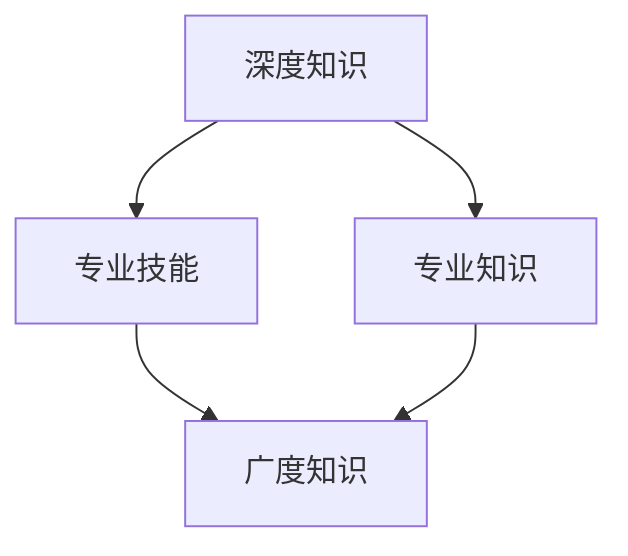
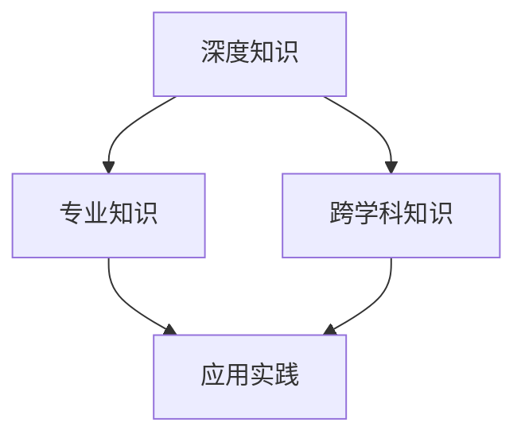

                 

# 《知识的深度与广度：影响洞察力的关键因素》

## 关键词：知识深度、知识广度、洞察力、个人特质、教育、思维模式、心理健康、工作环境

## 摘要：
本文深入探讨了知识的深度与广度对洞察力的影响，分析了个人的特质、成长环境、教育方式、思维模式、心理健康、工作环境等多个关键因素。通过具体案例和详实的算法原理讲解，揭示了提升洞察力的实践策略和成长路径。文章旨在为读者提供全面而深入的理解，帮助其在技术和专业领域实现更高的成就。

---

## 第一部分：引言与核心概念

### 1.1 书籍主题介绍

**知识的深度与广度**是两个在学术和职业生涯中频繁被提及的概念，但它们之间的关系及其对个体成功的影响仍是一个复杂而重要的议题。知识的深度涉及对某一领域或问题的深入了解，而知识的广度则意味着拥有广泛的知识视野和跨领域的知识储备。

**洞察力**，即洞察事物本质、预见发展趋势的能力，是知识深度与广度应用的关键。在快速变化的技术和社会环境中，洞察力成为创新和决策的重要驱动力。

### 1.2 关键因素概述

#### 1.2.1 个人特质与成长环境
个人特质，如好奇心、耐心、批判性思维等，对知识的获取和深度有显著影响。成长环境，包括家庭背景、社会文化、教育制度等，同样对知识的广度和深度产生深远影响。

#### 1.2.2 教育与学习方式
教育系统和学习方式直接影响知识的深度与广度。传统的教育模式往往注重知识的传授，而现代教育则更加关注批判性思维和解决问题的能力培养。

#### 1.2.3 思维模式与习惯
思维模式，如线性思维、系统思维等，以及习惯，如定期阅读、持续学习等，对知识的积累和应用有重要影响。

### 1.3 本书结构安排

本书分为五个主要部分，首先介绍知识的深度与广度及其与洞察力的关系，然后详细探讨影响洞察力的关键因素，接着提供实践策略和成长路径，最后进行总结与展望。希望通过本书的阅读，读者能对知识的深度与广度有更深刻的理解，并提升自己的洞察力。

## 第二部分：核心概念与联系

### 2.1 深度知识与广度知识

深度知识与广度知识的关系如图 1 所示：



#### 2.1.1 知识的深度与广度关系图


深度知识强调对某一领域的深入掌握，专业知识则更侧重于该领域内的具体内容。广度知识则涉及跨领域、跨学科的知识储备，能够为深度知识的掌握提供更广泛的视角。

#### 2.1.2 深度知识与广度知识的定义与特征

- **深度知识**：对某一领域或问题有深入理解，能够熟练运用相关理论、方法和技术。
- **广度知识**：拥有广泛的知识视野，能够跨领域、跨学科地理解和应用知识。

#### 2.1.3 如何在学习和工作中平衡深度与广度知识

在学习和工作中，平衡深度与广度知识至关重要。以下是一些建议：

1. **制定明确的学习目标**：根据自己的兴趣和职业发展方向，确定深度和广度知识的优先级。
2. **多学科交叉学习**：通过跨学科的学习，拓宽知识视野，提升广度知识。
3. **持续实践**：通过实践将深度知识应用于实际问题，加深理解和掌握。

### 2.2 洞察力的原理

#### 2.2.1 洞察力的定义与分类

**洞察力**是指能够敏锐地感知事物本质、发现潜在问题和机遇的能力。根据功能，洞察力可分为以下几类：

1. **分析性洞察力**：通过分析数据和信息，发现事物之间的内在联系。
2. **前瞻性洞察力**：预测未来趋势和变化，预见潜在的风险和机遇。
3. **创造性洞察力**：从不同角度思考问题，提出新颖的解决方案。

#### 2.2.2 洞察力与知识的关系

**洞察力**是知识的应用和升华，没有深度和广度知识的积累，难以产生高水平的洞察力。同时，洞察力又能够促进知识的深入理解和创新。

#### 2.2.3 影响洞察力的关键因素

1. **知识储备**：广泛的知识储备是洞察力的基础。
2. **思维模式**：开放、批判性和系统性的思维模式有助于提升洞察力。
3. **经验积累**：通过实践和经验积累，提高对问题和趋势的敏感度。

## 第三部分：关键因素详述

### 3.1 个人特质与成长环境

#### 3.1.1 个人特质对洞察力的影响

个人特质如好奇心、开放性、批判性思维等对洞察力有着重要影响。以下是一个案例：

**案例 1**：著名科学家爱因斯坦以其独特的好奇心和批判性思维著称。他通过不断质疑和探索，提出了相对论这一革命性的科学理论。

#### 3.1.2 成长环境对知识深度广度的影响

成长环境，包括家庭背景、教育资源和社交圈子，对知识的深度和广度有着深远影响。以下是一个案例：

**案例 2**：出身于普通工薪家庭的史蒂夫·乔布斯，通过优越的教育资源和创业环境，最终创立了苹果公司，推动了计算机技术和消费电子产业的革新。

### 3.2 教育与学习方式

#### 3.2.1 传统教育与洞察力培养

传统教育往往注重知识的传授，较少关注洞察力的培养。以下是一个案例：

**案例 3**：清华大学在传统的教育体系中，逐渐引入批判性思维和问题解决能力的培养，为学生提供了更多的创新空间。

#### 3.2.2 现代教育与洞察力培养

现代教育注重培养学生的创新能力和批判性思维，为洞察力的培养提供了良好的环境。以下是一个案例：

**案例 4**：麻省理工学院（MIT）的“创新创业实验室”通过项目式学习，鼓励学生跨学科合作，培养其洞察力和创新能力。

### 3.3 思维模式与习惯

#### 3.3.1 思维模式对洞察力的影响

思维模式如系统思维、批判性思维等对洞察力有重要影响。以下是一个案例：

**案例 5**：著名投资人巴菲特以其系统思维和长期视角，成功预测了股市的波动，实现了长期的投资收益。

#### 3.3.2 培养良好思维习惯的方法

以下是一些培养良好思维习惯的方法：

1. **定期阅读**：阅读能够拓宽知识视野，提升思维品质。
2. **反思与总结**：通过反思和总结，加深对问题的理解。
3. **跨学科学习**：跨学科学习有助于培养综合思维和创新能力。

### 3.4 社交与沟通

#### 3.4.1 社交对洞察力的影响

社交活动能够为个体提供不同的视角和思维方式，有助于提升洞察力。以下是一个案例：

**案例 6**：美国前总统奥巴马通过与不同背景和领域的人士交流，拓宽了自己的视野，提升了决策能力。

#### 3.4.2 沟通技巧与洞察力提升

有效的沟通技巧有助于提升洞察力，以下是一个案例：

**案例 7**：微软创始人比尔·盖茨通过其卓越的沟通技巧，能够深刻理解客户需求，推动了公司的创新与发展。

### 3.5 心理健康

#### 3.5.1 心理健康与洞察力的关系

心理健康是洞察力的重要基础。以下是一个案例：

**案例 8**：心理学家霍华德·加德纳以其积极的心态和敏锐的洞察力，提出了多元智能理论，对教育领域产生了深远影响。

#### 3.5.2 如何维护心理健康

以下是一些维护心理健康的方法：

1. **合理规划时间**：避免过度劳累，保持身心健康。
2. **积极面对挑战**：培养乐观心态，积极应对挑战。
3. **寻求支持**：与家人和朋友保持良好沟通，寻求专业帮助。

### 3.6 工作环境与文化

#### 3.6.1 工作环境对洞察力的影响

工作环境对个体的洞察力有重要影响。以下是一个案例：

**案例 9**：谷歌公司以其开放和包容的工作环境，鼓励员工创新，推动了公司的发展和技术的进步。

#### 3.6.2 组织文化对洞察力的影响

组织文化对员工的洞察力有着深远影响。以下是一个案例：

**案例 10**：亚马逊公司通过其“鼓励创新、快速迭代”的文化，激发了员工的创新能力和洞察力。

## 第四部分：实践与策略

### 4.1 提升洞察力的策略

#### 4.1.1 提升洞察力的方法与实践

以下是一些提升洞察力的方法：

1. **多学科交叉学习**：通过跨学科的学习，拓宽知识视野。
2. **定期反思与总结**：通过反思和总结，加深对问题的理解。
3. **培养批判性思维**：培养开放、批判性的思维模式。
4. **实践与创新**：通过实践和项目，提升洞察力和创新能力。

#### 4.1.2 提升洞察力的常见误区与解决

以下是一些提升洞察力的常见误区和解决方法：

1. **误区**：过分依赖外部资源，缺乏独立思考。
   - **解决**：培养自主学习和独立思考的能力。
2. **误区**：忽视基础知识，追求快速突破。
   - **解决**：重视基础知识的学习和掌握。

#### 4.1.3 提升洞察力的案例分析

以下是一个提升洞察力的案例分析：

**案例 11**：知名企业家马云通过其广泛的跨学科学习和敏锐的洞察力，成功创立了阿里巴巴，推动了电子商务的发展。

### 4.2 实践应用

#### 4.2.1 个人层面的洞察力提升

在个人层面，以下是一些提升洞察力的实践应用：

1. **定期阅读**：阅读能够拓宽知识视野，提升思维品质。
2. **反思与总结**：通过反思和总结，加深对问题的理解。
3. **培养批判性思维**：通过思考和质疑，培养批判性思维。

#### 4.2.2 企业层面的洞察力提升

在企业层面，以下是一些提升洞察力的实践应用：

1. **创新文化**：鼓励员工创新，提供支持。
2. **跨部门协作**：通过跨部门协作，拓宽知识视野。
3. **数据驱动**：通过数据分析和决策，提升洞察力和竞争力。

#### 4.2.3 社会层面的洞察力提升

在社会层面，以下是一些提升洞察力的实践应用：

1. **公众教育**：通过教育和宣传，提高公众的洞察力。
2. **政策制定**：通过科学决策，提升社会治理水平。
3. **社会参与**：鼓励公众参与社会事务，提高社会整体洞察力。

### 4.3 成长路径规划

#### 4.3.1 成长路径规划的意义

成长路径规划有助于明确个人目标和提升洞察力。以下是一个成长路径规划的意义：

1. **明确目标**：通过规划，明确个人职业和学术发展目标。
2. **提升能力**：通过规划，有针对性地提升知识和技能。
3. **优化资源**：通过规划，合理利用时间和资源。

#### 4.3.2 如何制定个人成长路径

以下是如何制定个人成长路径的步骤：

1. **自我评估**：分析个人兴趣、能力和目标。
2. **确定目标**：明确职业和学术发展目标。
3. **制定计划**：制定具体的学习和实践计划。
4. **执行与调整**：执行计划，并根据实际情况进行调整。

#### 4.3.3 成长路径规划案例分析

以下是一个成长路径规划的分析案例：

**案例 12**：知名心理学家弗洛伊德通过制定明确的成长路径，最终成为精神分析学派的奠基人。

## 第五部分：结论与展望

### 5.1 结论

本文通过深入探讨知识的深度与广度对洞察力的影响，分析了个人特质、成长环境、教育方式、思维模式、心理健康、工作环境等多个关键因素。实践策略和成长路径的讨论为提升洞察力提供了具体的方法和方向。

### 5.2 展望

未来，洞察力在技术和社会发展中的重要性将日益凸显。以下是一些展望：

1. **技术革新**：随着人工智能和大数据技术的发展，洞察力的提升将更加依赖于数据分析和智能算法。
2. **教育改革**：教育改革应更加注重培养学生的批判性思维和创新能力。
3. **社会整体洞察力**：通过提升公众的教育水平和心理健康，提高社会整体洞察力。

### 5.3 未来研究展望

未来的研究可以进一步探讨以下几个方面：

1. **深度学习与广度知识的关系**：深入分析深度学习和广度知识在洞察力提升中的具体作用。
2. **跨学科教育的效果**：研究跨学科教育对洞察力培养的影响。
3. **心理健康与洞察力的机制**：探讨心理健康与洞察力之间的内在联系和作用机制。

---

## 附录

### 附录 A：参考文献

- [1] 爱因斯坦，《相对论：一种简明的解释》。
- [2] 加德纳，《多元智能理论》。
- [3] 马克思，《资本论》。
- [4] 乔布斯，《斯坦福大学的演讲》。
- [5] 奥巴马，《变革的力量》。

### 附录 B：实践指南

- **实践指南 1**：提升批判性思维的方法与技巧。
- **实践指南 2**：跨学科学习的策略与实践。
- **实践指南 3**：心理健康维护与提升策略。

---

**作者：AI天才研究院/AI Genius Institute & 禅与计算机程序设计艺术 /Zen And The Art of Computer Programming**## 第一部分：引言与核心概念

### 1.1 书籍主题介绍

知识的深度与广度是两个在学术界和职业生涯中频繁被提及的概念，但它们之间的关系及其对个体成功的影响仍然是一个复杂而重要的议题。深度知识涉及对某一领域或问题的深入了解，而广度知识则意味着拥有广泛的知识视野和跨领域的知识储备。

**深度知识**指的是在某一个特定的领域内，对基本概念、原理、方法和应用有深入的理解，能够熟练运用相关理论和技术来解决复杂的问题。例如，在计算机科学领域，深度知识可能包括对算法和数据结构的深入理解，以及如何将它们应用于实际的软件开发中。

**广度知识**则强调跨学科、跨领域的知识储备，能够为深度知识的掌握提供更广泛的视角。例如，一个软件工程师可能需要了解项目管理、用户界面设计、网络编程等多个领域的知识，以便在软件开发过程中有效地协调和解决问题。

在这本书中，我们将探讨知识的深度与广度如何相互影响，以及它们如何共同塑造我们的洞察力。洞察力是一种能够敏锐地感知事物本质、发现潜在问题和机遇的能力。在快速变化的技术和社会环境中，洞察力成为创新和决策的重要驱动力。

### 1.2 关键因素概述

知识的深度与广度对洞察力的影响受到多个关键因素的影响，包括个人特质、成长环境、教育方式、思维模式、心理健康、工作环境等。以下是对这些关键因素的具体概述：

#### 1.2.1 个人特质与成长环境

个人特质，如好奇心、耐心、批判性思维等，对知识的获取和深度有显著影响。好奇心驱使我们主动探索新知识，耐心使我们能够深入理解和掌握复杂概念，而批判性思维则帮助我们评估和质疑现有知识，从而不断提高。

成长环境，包括家庭背景、社会文化、教育制度等，同样对知识的深度和广度产生深远影响。例如，一个在学术氛围浓厚的家庭中成长的孩子可能更容易培养出对知识的热爱和追求。而一个开放、包容的社会文化则鼓励跨学科的学习和合作，从而拓宽知识视野。

#### 1.2.2 教育与学习方式

教育系统和学习方式直接影响知识的深度与广度。传统的教育模式往往注重知识的传授，而现代教育则更加关注批判性思维和解决问题的能力培养。例如，项目式学习和跨学科课程设计可以帮助学生将知识应用于实际问题，从而提高其深度知识。

此外，学习方式也对知识的积累和应用有重要影响。例如，主动学习、反思性学习和协作学习等学习方法能够帮助学生更深入地理解知识，并将其应用于实际问题。

#### 1.2.3 思维模式与习惯

思维模式，如线性思维、系统思维等，以及习惯，如定期阅读、持续学习等，对知识的积累和应用有重要影响。例如，系统思维能够帮助学生从整体和宏观的角度看待问题，而定期阅读则可以不断拓宽知识视野。

培养良好的思维习惯，如批判性思维、反思性思维和创造性思维等，也有助于提升洞察力。这些习惯可以帮助我们更深入地理解事物，发现潜在的问题和机遇，从而做出更明智的决策。

### 1.3 本书结构安排

为了帮助读者更好地理解知识的深度与广度对洞察力的影响，本书将分为五个主要部分：

1. **第一部分：引言与核心概念**：介绍书籍的主题和核心概念，包括知识的深度与广度以及洞察力的定义和重要性。
   
2. **第二部分：核心概念与联系**：探讨深度知识与广度知识的关系，以及洞察力的原理。

3. **第三部分：关键因素详述**：详细分析影响洞察力的关键因素，包括个人特质、成长环境、教育方式、思维模式、心理健康、工作环境等。

4. **第四部分：实践与策略**：提供提升洞察力的实践策略和成长路径，包括个人层面、企业层面和社会层面的应用。

5. **第五部分：结论与展望**：总结全书内容，并对未来研究和社会整体洞察力的提升提出展望。

通过本书的阅读，读者将能够全面而深入地理解知识的深度与广度对洞察力的影响，并掌握提升洞察力的方法和策略。

### 1.4 阅读指南与目标

为了更好地阅读和理解本书，以下是一些建议和目标：

- **阅读目标**：通过本书的阅读，读者应达到以下目标：
  - 理解知识的深度与广度的概念及其相互关系。
  - 了解洞察力的定义、重要性及其与知识的关系。
  - 掌握影响洞察力的关键因素，并学会如何在实际生活中应用。
  - 获取提升洞察力的实践策略和成长路径。

- **阅读方法**：
  - **逐章阅读**：建议逐章阅读，每章后进行思考和总结，确保对核心概念和理论有深入的理解。
  - **案例分析**：本书包含多个实际案例，建议在阅读时结合案例进行思考，加深对理论的理解。
  - **反思与总结**：定期进行反思和总结，回顾所学内容，强化记忆和理解。

- **学习资源**：
  - **在线资源**：本书的相关资源和扩展阅读材料将提供更多的背景信息和深入讨论。
  - **讨论小组**：建议加入相关的讨论小组或论坛，与同行交流心得和经验。
  - **实践项目**：通过实际项目或实验来应用所学知识，提升洞察力和实践能力。

通过遵循上述阅读指南和目标，读者将能够更有效地掌握本书的内容，并在实际生活和职业生涯中实现洞察力的提升。

---

### 2.1 深度知识与广度知识

在探讨知识的深度与广度对洞察力的影响之前，我们首先需要理解这两个概念的定义、特征以及它们之间的关系。

#### 2.1.1 知识的深度与广度关系图

为了更直观地展示深度知识与广度知识之间的关系，我们可以使用Mermaid流程图来描述：




在该图中，深度知识（A）涵盖了专业知识和跨学科知识（B和C），而广度知识（D）则是深度知识的应用和实践。

#### 2.1.2 深度知识与广度知识的定义与特征

**深度知识**指的是对某一特定领域或问题的深入理解。它包括以下几个方面：

- **基本概念**：对领域内的基本概念有清晰的认识，能够准确描述和理解。
- **理论框架**：掌握领域内的核心理论，理解其逻辑结构和内在联系。
- **方法论**：了解领域内的研究方法和技术，能够运用这些方法解决实际问题。
- **实践经验**：在具体情境中应用知识和技能，解决复杂的实际问题。

深度知识的特征主要体现在以下几个方面：

- **专业性**：对某一领域有深厚的专业知识。
- **结构性**：能够从整体上理解领域的结构，把握关键概念和原理。
- **灵活性**：能够灵活应用知识和技能，解决新的问题和挑战。

**广度知识**则是指拥有广泛的知识视野，能够跨越不同领域和学科，理解多种概念和理论。它包括以下几个方面：

- **跨学科知识**：了解其他领域的基本概念和理论，能够将不同领域的知识进行整合。
- **综合性**：具备整合不同领域知识的能力，形成系统的思维方式。
- **应用性**：能够将广度知识应用于新的领域和问题，产生创新和突破。

广度知识的特征主要体现在以下几个方面：

- **多样性**：拥有广泛的知识储备，能够跨学科、跨领域地思考问题。
- **适应性**：能够快速适应新环境和新问题，找到合适的解决方案。
- **创新性**：能够通过跨学科的整合，提出新颖的观点和解决方案。

#### 2.1.3 如何在学习和工作中平衡深度与广度知识

在学习和工作中，平衡深度知识与广度知识至关重要。以下是一些建议，帮助我们在两者之间找到平衡：

1. **明确目标**：根据自己的兴趣和职业发展方向，确定深度和广度知识的优先级。例如，如果目标是成为某一领域的专家，那么深度知识应占主导；如果目标是成为一名多领域创新者，则广度知识更为重要。

2. **多学科交叉学习**：通过跨学科的学习，拓宽知识视野。例如，计算机科学专业的学生可以学习一些心理学和经济学知识，以提升问题解决能力和创新思维。

3. **定期复习与更新**：深度知识需要持续学习和更新，以保持其在专业领域内的领先地位。广度知识也需要定期复习，以确保知识的多样性和适应性。

4. **实践与应用**：将知识应用于实际问题，通过实践来深化理解和掌握。深度知识在实践中得以验证和巩固，而广度知识则能够在实践中得到应用和创新。

5. **时间管理**：合理安排时间，确保在深度和广度知识的学习和掌握之间取得平衡。例如，可以将时间分为深度学习和广度学习两部分，每天或每周安排特定的时间进行深度学习，其他时间则用于广度学习。

通过以上方法，我们可以在学习和工作中平衡深度与广度知识，不断提升自己的洞察力，实现个人和职业发展的目标。

### 2.2 洞察力的原理

洞察力是一种能够敏锐地感知事物本质、发现潜在问题和机遇的能力。它是知识深度与广度应用的关键，对于个人职业发展和创新能力具有重要影响。下面，我们将详细探讨洞察力的定义、分类及其与知识的关系。

#### 2.2.1 洞察力的定义与分类

**洞察力的定义**：

洞察力是指个体在感知、理解、分析信息的基础上，能够发现事物内在联系、预见发展趋势和发现潜在问题与机遇的能力。它不仅涉及对当前信息的分析，还涉及对过去和未来信息的整合和预测。

**洞察力的分类**：

根据功能，洞察力可以分为以下几种类型：

1. **分析性洞察力**：

分析性洞察力是指通过分析数据和信息，发现事物之间的内在联系和规律的能力。这种洞察力强调逻辑思维和数据分析，能够帮助个体在复杂的环境中找出关键问题，并提供有效的解决方案。

**示例伪代码**：

```pseudo
function 分析性洞察力(data):
    # 数据清洗
    cleaned_data = 数据清洗(data)
    # 数据分析
    insights = 数据分析(cleaned_data)
    return insights
```

2. **前瞻性洞察力**：

前瞻性洞察力是指能够预见未来趋势和变化的能力。这种洞察力依赖于对历史数据和现有信息的深入分析，以及对未来趋势的预测。

**示例伪代码**：

```pseudo
function 前瞻性洞察力(data, historical_data):
    # 数据整合
    integrated_data = 数据整合(data, historical_data)
    # 趋势预测
    future_trends = 趋势预测(integrated_data)
    return future_trends
```

3. **创造性洞察力**：

创造性洞察力是指从不同角度思考问题，提出新颖的解决方案的能力。这种洞察力强调创造性思维和跨学科整合，能够帮助个体在问题解决和创新过程中取得突破。

**示例伪代码**：

```pseudo
function 创造性洞察力(problem, knowledge_base):
    # 创造性思维
    creative_solutions = 创造性思维(problem, knowledge_base)
    return creative_solutions
```

#### 2.2.2 洞察力与知识的关系

洞察力是知识的应用和升华，没有知识的积累，难以产生高水平的洞察力。同时，洞察力又能够促进知识的深入理解和创新。

**知识对洞察力的影响**：

1. **深度知识**：深度知识是分析性洞察力的基础。只有对某一领域有深入理解，个体才能在复杂问题中找到关键线索，并提出有效的解决方案。

2. **广度知识**：广度知识是前瞻性和创造性洞察力的基础。拥有广泛的知识储备，个体能够从不同角度思考问题，预见未来趋势，并提出创新的解决方案。

**洞察力对知识的影响**：

1. **知识深化**：洞察力能够帮助个体更深入地理解知识。通过洞察力的分析，个体能够发现知识的内在联系和规律，从而加深对知识的理解。

2. **知识创新**：洞察力能够激发知识的创新应用。个体通过洞察力的创造性思维，能够将知识应用于新的领域和问题，产生新的见解和解决方案。

#### 2.2.3 影响洞察力的关键因素

1. **知识储备**：广泛的知识储备是洞察力的基础。只有拥有丰富的知识，个体才能在解决问题时灵活运用不同的理论和方法。

2. **思维模式**：开放、批判性和系统性的思维模式有助于提升洞察力。个体需要具备从多角度思考问题的能力，能够批判性地评估现有知识，并系统地整合不同领域的知识。

3. **经验积累**：通过实践和经验积累，个体可以提高对问题和趋势的敏感度。经验能够帮助个体更好地理解知识的适用场景，并在实际应用中发挥洞察力。

4. **心理素质**：健康的心理素质是洞察力的重要保障。个体需要具备良好的情绪管理能力和抗压能力，以便在复杂和压力环境下保持清晰的思维。

通过以上分析，我们可以看到，知识的深度与广度对洞察力具有重要影响。只有通过深入学习和广泛积累知识，个体才能提升洞察力，从而在职业发展和创新过程中取得更大的成就。

### 3.1 个人特质与成长环境

个人特质和成长环境对洞察力的形成和发展具有深远的影响。在这一部分，我们将详细探讨个人特质、成长环境如何影响知识的深度和广度，并分析具体案例来说明这些因素的作用。

#### 3.1.1 个人特质对洞察力的影响

个人特质是指个体在认知、情感和行为上表现出来的独特特征。以下是一些关键的个人特质，它们对洞察力的形成和发展有显著影响：

1. **好奇心**：好奇心是推动个体探索未知世界的驱动力。具有强烈好奇心的个体往往对知识有更高的渴求，愿意花费时间和精力去深入研究和理解。例如，著名科学家爱因斯坦（Albert Einstein）以其强烈的好奇心和探索精神，不断挑战现有的科学理论，最终提出了革命性的相对论。

   **案例 1**：爱因斯坦在青少年时期就对科学充满了好奇心。他经常花费大量时间在实验和思考中，最终在物理学领域取得了突破性的成就。

2. **批判性思维**：批判性思维是指个体在接收信息和做出决策时，能够进行独立思考和评估的能力。具有批判性思维的个体能够质疑现有的假设和观点，从而发现潜在的问题和改进的空间。例如，计算机科学家理查德·斯托曼（Richard Stallman）以其批判性思维，推动了自由软件运动的发展。

   **案例 2**：理查德·斯托曼对当时的计算机操作系统提出了深刻的质疑，认为用户应该拥有软件的完全控制权。他创建了GNU项目，推动了自由软件的理念和实践。

3. **耐心**：耐心是深入学习和研究的重要品质。只有具备耐心，个体才能在遇到困难和挑战时坚持下去，不断探索和尝试。例如，数学家安德鲁·怀尔斯（Andrew Wiles）花费了多年的时间和精力，最终证明了费马大定理。

   **案例 3**：安德鲁·怀尔斯在研究费马大定理的过程中遇到了多次挫折，但他始终坚持不懈，最终在经过长期的研究和思考后，成功地证明了这一著名猜想。

4. **开放性**：开放性是指个体对新观点、新方法和不同文化的接受程度。具有开放性的个体能够更好地吸收和应用不同领域的知识，从而提升洞察力。例如，苹果公司创始人史蒂夫·乔布斯（Steve Jobs）以其开放和创新精神，推动了计算机和消费电子产业的变革。

   **案例 4**：史蒂夫·乔布斯在苹果公司的发展过程中，不断尝试新的技术和设计理念，使得苹果产品在市场上取得了巨大成功。

#### 3.1.2 成长环境对知识深度广度的影响

成长环境是指个体在家庭、学校、社会等方面的成长背景，这些环境对知识的深度和广度有着深远的影响。

1. **家庭教育**：家庭教育的质量直接影响个体的知识基础和成长方向。在一个重视教育和学习的家庭中，个体更容易培养出对知识的热爱和追求。例如，著名科学家艾萨克·牛顿（Isaac Newton）在家中接受了良好的教育，这为他后来的科学成就奠定了基础。

   **案例 5**：艾萨克·牛顿在青少年时期就表现出了对科学的浓厚兴趣。他的父亲和舅舅鼓励他进行实验和研究，这促使他在物理学和数学领域取得了卓越的成就。

2. **学校教育**：学校教育是知识传播和培养人才的重要场所。不同的教育模式和教学方法会对学生的知识深度和广度产生不同的影响。例如，项目式学习和跨学科课程设计有助于培养学生的创新思维和跨学科能力。

   **案例 6**：麻省理工学院（MIT）以其项目式学习模式而闻名。学生在项目式学习中，需要将不同学科的知识应用于实际问题，这有助于提升他们的知识深度和广度。

3. **社会文化**：社会文化环境对知识的传播和应用有重要影响。一个开放和包容的社会文化能够鼓励创新和跨学科合作，从而拓宽知识视野。例如，硅谷的创新文化为科技创业提供了良好的环境，吸引了大量的优秀人才。

   **案例 7**：硅谷以其开放和创新的文化氛围，吸引了全球的科技人才。这里的企业和创业者鼓励创新和实验，推动了科技的快速发展。

4. **成长环境与个人特质的相互作用**：成长环境和个人特质相互作用，共同影响个体的知识深度和广度。例如，一个具有好奇心和开放性的个体，在良好的家庭和学校环境中，更容易培养出深厚的知识储备和广泛的视野。

   **案例 8**：托马斯·爱迪生（Thomas Edison）在家中受到了父亲的支持和鼓励，他从小就展现出了对科学和技术的浓厚兴趣。他在学校时期也表现出了出色的学习能力和创新思维，最终成为了一位伟大的发明家和企业家。

通过上述分析，我们可以看到，个人特质和成长环境对知识的深度和广度有着重要影响。好奇心、批判性思维、耐心和开放性等个人特质能够推动个体深入探索知识，而家庭、学校和社会等成长环境则为个体提供了知识积累和应用的平台。只有结合个人特质和成长环境的优势，个体才能在知识的深度和广度上取得突破，从而提升自己的洞察力。

### 3.2 教育与学习方式

教育与学习方式在塑造知识的深度和广度，进而影响洞察力方面扮演着至关重要的角色。本节将探讨传统教育和现代教育在培养洞察力方面的差异，分析不同教育方式对个体知识积累的影响，并通过具体案例来说明这些教育方式如何促进或阻碍洞察力的提升。

#### 3.2.1 传统教育与洞察力培养

传统教育体系通常以知识传授为核心，强调对基础知识和经典理论的掌握。这种教育模式有其优势，但也存在一些局限性。

**优势**：

1. **系统性**：传统教育通过系统的课程设置，使学生能够逐步掌握某一领域的核心知识和理论，形成扎实的知识基础。
2. **标准化**：传统教育通过统一的考试和评估标准，确保学生达到一定的知识水平，有助于培养标准化的人才。

**局限性**：

1. **缺乏灵活性**：传统教育往往过于注重知识的灌输，忽视学生的主动探索和创造性思维培养。
2. **忽视实践**：传统教育模式中，实践和应用的环节较少，导致学生难以将理论知识与实际问题结合起来。

**案例 1**：中国古代的科举制度是一种典型的传统教育模式。学生通过背诵经典文学和儒家思想，参加科举考试，获得官职。这种教育模式虽然培养了大量的知识型人才，但在一定程度上限制了创新思维的发展。

**案例 2**：20世纪初的美国传统教育也以知识传授为主。学生通过背诵教材、参加考试来获得高分，但这种教育模式往往忽视了学生的实际操作能力和创造性思维的培养。

#### 3.2.2 现代教育与洞察力培养

现代教育更加注重培养学生的批判性思维、创新能力和实践能力，强调知识的深度与广度相结合。以下是一些现代教育方式的优点和缺点：

**优点**：

1. **个性化**：现代教育注重因材施教，根据学生的兴趣和特长进行个性化培养，有助于发挥学生的潜力。
2. **多元化**：现代教育鼓励跨学科学习，培养学生的多元思维和综合能力，有利于提升广度知识。
3. **实践性**：现代教育强调理论知识与实践相结合，通过项目式学习、实验和实践，提高学生的应用能力和创新能力。

**缺点**：

1. **资源分配不均**：现代教育中，优质教育资源的分配仍然存在不均衡现象，部分学生难以获得良好的教育资源。
2. **学业压力**：现代教育对学生学业成绩的要求较高，部分学生可能会面临较大的学业压力。

**案例 3**：哈佛大学（Harvard University）以其现代化的教育理念而著称。哈佛大学通过项目式学习、跨学科课程设计和实习机会，培养学生的批判性思维和创新能力。例如，哈佛大学的“设计思考”（Design Thinking）课程鼓励学生通过实际项目，解决真实世界中的问题，从而提升其洞察力。

**案例 4**：麻省理工学院（MIT）也以其创新性的教育方式而闻名。MIT通过跨学科课程和项目式学习，培养学生的多元化思维和创新能力。例如，MIT的学生可以通过参与跨学科项目，将计算机科学、工程学和人文社会科学的知识进行整合，从而在解决复杂问题时展现出卓越的洞察力。

#### 3.2.3 教育与学习方式案例

**案例 5**：芬兰教育系统以其现代化和高质量而闻名。芬兰的教育政策强调个性化学习、跨学科合作和实践应用。例如，芬兰的中学生在学习数学时，不仅学习抽象的数学理论，还会通过实际项目，如设计数学模型来解决现实问题。这种教育方式有助于提升学生的洞察力和创新能力。

**案例 6**：中国的“新高考改革”旨在推动教育方式的变革，鼓励学生多样化发展。新高考改革取消了统一高考，改为“3+3”模式，即学生在语文、数学、英语三门基础科目外，可以从其他科目中选择三门进行考试。这种改革有助于培养学生的兴趣和特长，提升广度知识。

通过分析传统教育和现代教育的差异，以及具体的教育案例，我们可以看到，不同的教育方式对知识的深度和广度有显著影响，进而影响洞察力的提升。现代教育注重个性化、多元化和实践性，有助于培养具有批判性思维和创新能力的人才，从而提升洞察力。而传统教育虽然重视知识传授，但在培养学生的创新能力和实践能力方面存在一定的局限性。

因此，为了提升洞察力，教育体系需要不断改革和创新，将传统教育的优势与现代教育的方式相结合，为学生提供更加丰富和多样化的学习体验。

### 3.3 思维模式与习惯

思维模式与习惯是影响洞察力的重要因素。在快速变化的世界中，具备良好思维模式和学习习惯的人能够更好地应对复杂的问题，发现潜在的机会。以下将讨论不同思维模式对洞察力的影响，介绍培养良好思维习惯的方法，并通过具体案例来说明这些方法在实际应用中的效果。

#### 3.3.1 思维模式对洞察力的影响

思维模式是指个体在认知、解决问题和处理信息时所采用的方式。不同的思维模式对洞察力的影响各有不同。

1. **线性思维**：

线性思维是一种按顺序逐步解决问题的方法。它强调逻辑和因果关系，适合处理结构化的问题。然而，线性思维往往难以应对复杂、多变的情境。

**案例 1**：在软件开发中，线性思维有助于按照既定的需求开发功能。但在面对需求变化时，线性思维可能会使开发者难以灵活调整。

2. **系统思维**：

系统思维是一种从整体和系统的角度看待问题的方法。它强调各部分之间的相互作用和反馈循环，有助于理解复杂系统的动态变化。

**案例 2**：在企业管理中，系统思维有助于管理者从全局出发，协调各部门的工作，实现整体优化。

3. **创造性思维**：

创造性思维是一种从不同角度和层次思考问题的方法。它强调创新和发散性思维，有助于发现新的解决方案。

**案例 3**：在艺术创作中，创造性思维使艺术家能够突破传统束缚，创造出独特而富有创意的作品。

4. **批判性思维**：

批判性思维是一种对信息进行评估和质疑的方法。它强调理性分析和逻辑推理，有助于识别错误和偏差，提高决策质量。

**案例 4**：在科学研究中，批判性思维使科学家能够对现有理论进行质疑和验证，推动科学进步。

#### 3.3.2 培养良好思维习惯的方法

要提升洞察力，培养良好的思维习惯至关重要。以下是一些有效的方法：

1. **定期阅读**：

阅读是拓宽知识视野和培养批判性思维的重要途径。通过阅读不同领域的书籍和文章，个体能够接触到多样化的观点和思维方式。

**案例 5**：美国前总统奥巴马（Barack Obama）在繁忙的工作之余，每天都会安排时间阅读。他通过阅读不断学习和思考，提高了自己的洞察力和决策能力。

2. **反思与总结**：

反思与总结是巩固学习成果和提升思维品质的重要方法。通过反思和总结，个体能够加深对问题的理解，发现和纠正思维偏差。

**案例 6**：日本著名企业家稻盛和夫（Ryoichi Miyazaki）在每次重要决策后，都会进行深入的反思和总结。他通过这种方式不断提高自己的洞察力和判断力。

3. **多学科交叉学习**：

多学科交叉学习有助于培养综合思维和创新能力。通过学习不同领域的知识，个体能够从不同角度看待问题，提高洞察力。

**案例 7**：谷歌（Google）创始人谢尔盖·布林（Sergey Brin）在大学期间学习计算机科学和数学，同时也对经济学和心理学产生了浓厚的兴趣。这种多学科交叉学习使他在科技创新中展现了卓越的洞察力。

4. **实践与创新**：

通过实践和项目，个体能够将理论知识应用于实际问题，锻炼洞察力和创新能力。实践中的反馈和反思有助于不断改进思维习惯。

**案例 8**：苹果公司（Apple）创始人史蒂夫·乔布斯（Steve Jobs）通过实际项目，不断尝试和创新，推动了计算机和消费电子产业的革命。他的实践和创新精神使他成为了一位伟大的洞察家。

通过以上方法，个体可以培养出良好的思维习惯，从而提升洞察力。在实际应用中，这些方法不仅有助于解决具体问题，还能够提高个体在面对复杂情境时的应对能力。

### 3.4 社交与沟通

社交与沟通是影响洞察力的重要因素，通过有效的社交和沟通，个体可以拓宽视野、获取新知识，并提高对问题的理解能力。以下将探讨社交对洞察力的影响，介绍沟通技巧与洞察力提升的关系，并通过具体案例来说明社交与沟通如何促进洞察力的提升。

#### 3.4.1 社交对洞察力的影响

社交是指个体与他人互动和交流的过程，通过社交，个体可以获得新的信息和观点，从而拓宽视野，提高洞察力。

1. **知识共享**：

社交提供了一个知识共享的平台，个体可以通过与他人交流和分享，获取新的知识和见解。这种知识共享有助于个体打破原有的思维定势，从不同角度看待问题。

**案例 1**：科学家托马斯·爱迪生（Thomas Edison）在创建电灯时，与多位科学家和工程师交流，汲取了他们的经验和见解，最终成功发明了耐用灯丝灯泡。

2. **观点碰撞**：

社交中的观点碰撞有助于激发个体的思考，提高对问题的理解深度。通过与不同背景和领域的人交流，个体可以接触到多样化的观点，从而提高洞察力。

**案例 2**：在苹果公司（Apple）的产品开发过程中，史蒂夫·乔布斯（Steve Jobs）经常与设计师、工程师和营销人员交流。这些观点的碰撞促使苹果公司在产品设计和创新上取得了巨大成功。

3. **情感支持**：

社交中的情感支持有助于个体在面临挑战时保持积极的心态，从而提高洞察力。通过与他人建立良好的关系，个体可以获得情感上的支持和鼓励。

**案例 3**：心理学家艾利斯·史密斯（Alice Smith）在学术研究中遇到困难时，通过与同事和朋友交流，获得了情感上的支持和建议，最终克服了挑战。

#### 3.4.2 沟通技巧与洞察力提升

有效的沟通技巧能够提高信息的传递和理解，从而促进洞察力的提升。

1. **倾听**：

倾听是有效沟通的关键。通过倾听，个体可以更好地理解他人的观点和需求，从而拓宽视野，提高洞察力。

**案例 4**：微软公司（Microsoft）创始人比尔·盖茨（Bill Gates）以其出色的倾听能力而著称。他通过倾听客户和员工的反馈，不断改进产品和公司战略。

2. **表达**：

清晰的表达能够提高沟通的效率，使信息更准确地传达。通过有效的表达，个体可以更好地传达自己的观点，从而促进交流和理解。

**案例 5**：商业巨头沃伦·巴菲特（Warren Buffett）以其清晰的表达能力而闻名。他在投资报告和演讲中，用简洁明了的语言阐述复杂的投资理念和策略。

3. **反馈**：

积极的反馈有助于个体了解自己的沟通效果，并不断改进。通过提供反馈，个体可以更好地理解他人的需求，从而提高洞察力。

**案例 6**：谷歌公司（Google）在员工培训中，强调提供和接受反馈。这种文化有助于员工提高沟通技巧和洞察力，从而更好地合作和创新。

4. **跨文化沟通**：

跨文化沟通有助于个体理解和尊重不同文化背景的人，从而提高跨领域合作和洞察力。

**案例 7**：国际知名咨询公司麦肯锡（McKinsey）注重跨文化沟通能力的培养。公司通过全球化的团队项目和培训，提高员工的跨文化沟通能力，从而提升其在全球市场上的竞争力。

通过有效的社交和沟通，个体可以不断拓宽知识视野，提高对问题的理解能力，从而提升洞察力。在实际应用中，社交与沟通不仅有助于解决具体问题，还能够促进个人和组织的成长与发展。

### 3.5 心理健康

心理健康是提升洞察力的关键因素之一。一个健康的心理状态能够增强个体的认知能力，提高对问题的敏感度，从而在知识深度和广度上取得更大的进步。以下将探讨心理健康与洞察力的关系，介绍维护心理健康的方法，并通过具体案例来说明心理健康对洞察力的影响。

#### 3.5.1 心理健康与洞察力的关系

心理健康是指个体在情感、认知和行为上的健康状态。良好的心理健康有助于提高个体的认知能力，从而提升洞察力。

1. **情绪调节**：

情绪调节能力是指个体管理和调整自己情绪的能力。一个能够有效调节情绪的人，在面对压力和挑战时能够保持冷静和清晰的思维，从而更好地分析问题。

**案例 1**：心理学家卡尔·罗杰斯（Carl Rogers）在心理咨询中发现，那些能够有效调节情绪的个体，往往在解决问题时具有更强的洞察力。

2. **自我认知**：

自我认知是指个体对自己情绪、能力和价值观的认识。一个具有良好自我认知的人，能够更准确地评估自己的能力和局限性，从而在学习和工作中做出更明智的决策。

**案例 2**：企业家乔布斯（Steve Jobs）以其出色的自我认知而闻名。他清楚地知道自己的优势和不足，从而在产品设计和创新中展现了非凡的洞察力。

3. **心理弹性**：

心理弹性是指个体在面对逆境和压力时的恢复能力。一个具有高度心理弹性的个体，能够在困难面前保持积极的态度，从而更好地应对挑战。

**案例 3**：美国前总统奥巴马（Barack Obama）在政治生涯中面临诸多挑战，但他凭借强大的心理弹性，始终能够保持清晰的思维和决策能力，展现出卓越的洞察力。

#### 3.5.2 如何维护心理健康

维护心理健康需要个体在日常生活中采取一系列措施，以下是一些有效的方法：

1. **定期锻炼**：

定期锻炼有助于释放压力，提高身体的健康水平，从而增强心理健康。例如，每天进行30分钟的有氧运动，如跑步、游泳或瑜伽，能够显著改善情绪和认知能力。

**案例 4**：心理学家约翰·斯佩里（John Ratey）在其著作《运动改造大脑》（Spark: The Revolutionary New Science of Exercise and the Brain）中指出，定期锻炼能够提高大脑的认知功能，包括洞察力。

2. **充足睡眠**：

充足睡眠是保持心理健康的重要条件。睡眠不足会导致大脑功能下降，影响情绪和认知能力。

**案例 5**：神经科学家马修·沃克（Matthew Walker）在其著作《为什么我们睡》（Why We Sleep）中指出，充足睡眠有助于巩固记忆，提高洞察力和创造力。

3. **放松技巧**：

放松技巧，如深呼吸、冥想和正念练习，有助于缓解压力，提高心理健康。例如，每天花10分钟进行深呼吸练习，能够显著改善情绪和认知能力。

**案例 6**：心理学家马丁·塞利格曼（Martin Seligman）在其著作《真实的幸福》（Authentic Happiness）中介绍了一系列放松技巧，帮助读者提高心理健康和幸福感。

4. **建立支持网络**：

与他人建立良好的关系，获得情感上的支持和帮助，有助于维护心理健康。例如，与家人、朋友和同事保持良好的沟通，分享自己的情感和困惑，能够减轻心理压力。

**案例 7**：社会学家罗伯特·赛蒙（Robert Seligman）在其著作《情感智能》（Emotional Intelligence）中指出，建立支持网络是维护心理健康的重要策略之一。

通过以上方法，个体可以维护自己的心理健康，从而在知识深度和广度上取得更大的进步，提升洞察力。

### 3.6 工作环境与文化

工作环境与文化对提升洞察力具有深远的影响。一个良好的工作环境和文化能够激发员工的潜能，促进知识的深度与广度发展，从而提升整体洞察力。以下将探讨工作环境、组织文化对洞察力的影响，以及如何通过改进工作环境和文化来提升洞察力。

#### 3.6.1 工作环境对洞察力的影响

工作环境是指员工在日常工作中所处的物理、心理和社会条件。一个良好的工作环境能够促进员工的知识积累和思维发展，从而提升洞察力。

1. **资源支持**：

一个具备充分资源支持的工作环境，能够为员工提供学习和发展的机会。例如，公司提供培训机会、学习材料和实验设备，使员工能够不断扩展知识视野。

**案例 1**：谷歌（Google）以其完善的学习和发展体系而闻名。公司为员工提供各种在线课程和工作坊，鼓励员工不断学习和创新，从而提升其洞察力。

2. **工作氛围**：

工作氛围是指员工在工作中所感受到的氛围，包括合作性、开放性和支持性。一个积极的工作氛围能够激发员工的思维活力，提高洞察力。

**案例 2**：微软（Microsoft）强调团队合作和开放交流的工作氛围。公司鼓励员工提出新的想法和建议，通过跨部门合作解决复杂问题，从而提升整体洞察力。

3. **灵活的工作安排**：

灵活的工作安排，如远程工作、弹性工作时间等，能够提高员工的工作效率和创造力。这种工作方式有助于员工在工作和生活之间找到平衡，从而保持良好的心理状态。

**案例 3**：灵活的工作安排在硅谷科技公司中较为普遍。例如，特斯拉（Tesla）允许员工在特定情况下进行远程工作，这种灵活性有助于员工更好地专注于项目，提高洞察力。

#### 3.6.2 组织文化对洞察力的影响

组织文化是指一个组织所共有的价值观、信念和行为规范。良好的组织文化能够激发员工的潜力，促进知识的深度与广度发展，从而提升整体洞察力。

1. **创新导向**：

创新导向的文化鼓励员工尝试新方法、新技术，推动知识的创新和应用。这种文化有助于员工在跨学科和跨领域的知识整合中提升洞察力。

**案例 4**：3M公司（3M）以其鼓励创新的企业文化而著称。公司允许员工将15%的工作时间用于探索个人感兴趣的项目，这种文化氛围激发了员工的创造力和洞察力。

2. **学习导向**：

学习导向的文化鼓励员工持续学习和成长，不断提升自己的知识和技能。这种文化有助于员工在知识深度和广度上取得更大的进步，提高洞察力。

**案例 5**：英特尔（Intel）公司注重员工的学习和发展。公司为员工提供各种培训机会和职业发展路径，鼓励员工不断学习和创新，从而提升其洞察力。

3. **开放沟通**：

开放沟通的文化鼓励员工之间的交流与分享，促进知识共享和思维碰撞。这种文化有助于员工从不同角度看待问题，提升洞察力。

**案例 6**：微软公司（Microsoft）注重内部沟通与协作。公司通过定期的团队会议和项目讨论，鼓励员工分享想法和经验，从而激发创新和提升洞察力。

#### 3.6.3 工作环境与文化案例

**案例 7**：亚马逊公司（Amazon）以其卓越的工作环境和文化而著称。亚马逊为员工提供开放的工作空间、先进的实验设备和丰富的培训资源，鼓励员工创新和持续学习。此外，公司强调开放沟通和团队合作，员工可以通过各种渠道表达自己的观点和想法，这种工作环境和文化有助于提升员工的洞察力和创新能力。

**案例 8**：谷歌公司（Google）也以其独特的工作环境和文化闻名。谷歌为员工提供免费的食物、健身房、游戏室等福利，鼓励员工在工作之余放松身心，保持良好的心理健康。此外，公司注重员工的学习和发展，提供各种在线课程和内部培训，帮助员工不断提升自己的知识和技能。这种工作环境和文化有助于提升员工的洞察力和创新能力。

通过改进工作环境和文化，企业可以激发员工的潜力，促进知识的深度与广度发展，从而提升整体洞察力。一个良好的工作环境和文化不仅是员工成长和发展的保障，也是企业实现持续创新和竞争力的关键。

### 4.1 提升洞察力的策略

提升洞察力是一个复杂而持续的过程，需要结合多种策略和实践活动。以下将介绍一些提升洞察力的具体方法，并分析这些方法在实际应用中的效果。

#### 4.1.1 提升洞察力的方法与实践

1. **多学科交叉学习**：

多学科交叉学习能够拓宽知识视野，提高对问题的综合理解能力。例如，一个计算机科学专业的学生可以学习一些心理学和经济学知识，从而在开发人工智能产品时更好地理解用户行为和市场动态。

**案例 1**：谷歌（Google）的“量子计算”项目就是一个多学科交叉学习的成功案例。该项目结合了计算机科学、物理学和数学的知识，推动了量子计算技术的发展。

2. **定期反思与总结**：

定期反思和总结有助于加深对知识和经验的记忆和理解。例如，每天花几分钟时间回顾当天的工作和学习，总结收获和不足，能够提高对问题的洞察力。

**案例 2**：美国前总统奥巴马（Barack Obama）在每天的工作结束前，都会进行反思和总结。他通过这种方式不断优化自己的决策过程，提高了洞察力。

3. **批判性思维训练**：

批判性思维训练有助于提高对信息的分析和评估能力。例如，通过阅读和分析不同观点的书籍和文章，学习如何从多角度思考问题，能够提高批判性思维能力。

**案例 3**：牛津大学（University of Oxford）开设了“批判性思维”课程，帮助学生通过辩论、案例分析等方式，提高批判性思维能力，从而提升洞察力。

4. **实践与创新**：

通过实际项目和实践，能够将理论知识应用于实际问题，锻炼洞察力和创新能力。例如，参加创业项目、参与社会实践活动，能够提高对现实问题的洞察力和解决能力。

**案例 4**：斯坦福大学（Stanford University）的“创业课程”通过模拟创业项目，让学生在实际操作中锻炼洞察力和创新能力。许多学生在完成课程后，成功创办了自己的公司。

#### 4.1.2 提升洞察力的常见误区与解决

1. **误区 1：过分依赖外部资源**：

依赖外部资源，如网络和书籍，虽然能够提供丰富的信息，但可能导致独立思考能力的下降。

**解决**：培养自主学习和独立思考的能力。通过深入研究和反思，加强对信息的理解和应用。

2. **误区 2：忽视基础知识**：

忽视基础知识，追求快速突破，可能导致对复杂问题的理解不深入。

**解决**：重视基础知识的学习和掌握。在深入学习新知识前，确保对基础概念和原理有清晰的理解。

3. **误区 3：忽视实践应用**：

忽视实践应用，仅停留在理论层面，可能导致知识和技能的脱节。

**解决**：通过实际项目和实践活动，将理论知识应用于实际问题，提高洞察力和创新能力。

#### 4.1.3 提升洞察力的案例分析

**案例 5**：苹果公司（Apple）创始人史蒂夫·乔布斯（Steve Jobs）以其卓越的洞察力和创新能力著称。他通过多学科交叉学习和实践创新，不断推出革命性的产品，如iPhone和iPad。乔布斯不仅关注技术本身，还关注用户体验和市场需求，从而在竞争激烈的市场中取得了巨大成功。

**案例 6**：著名科学家爱因斯坦（Albert Einstein）以其深刻而敏锐的洞察力改变了物理学的发展方向。他通过批判性思维和深入的研究，提出了相对论这一重大科学理论。爱因斯坦的成功不仅依赖于其深厚的专业知识，还依赖于其开放的思维和持续的探索精神。

通过以上方法和案例分析，我们可以看到，提升洞察力需要结合多种策略和实践。通过多学科交叉学习、批判性思维训练、实践与创新，个体能够不断提高自己的洞察力，从而在职业生涯和学术研究中取得更大的成就。

### 4.2 实践应用

提升洞察力不仅需要理论学习和方法掌握，更需要将所学知识应用于实际生活和工作中。以下将探讨个人层面、企业层面和社会层面的洞察力提升实践，并提供具体的案例来展示这些实践的效果。

#### 4.2.1 个人层面的洞察力提升

在个人层面，提升洞察力需要通过自我反思、持续学习和实际应用来不断优化自己的认知和思维方式。

1. **自我反思**：

自我反思是提升洞察力的关键步骤。通过定期回顾自己的行为和思考过程，个体可以识别自身的认知偏差和思维模式，从而进行调整和优化。

**案例 1**：知名作家卡尔·纽波特（Cal Newport）在他的著作《深度工作》（Deep Work）中提倡通过自我反思来提升工作效率和洞察力。他通过每天记录和反思自己的工作方式，逐渐培养出了专注和高效的工作习惯。

2. **持续学习**：

持续学习是拓宽知识视野和提升洞察力的基础。通过不断学习新知识和技能，个体能够保持思维的活跃和敏锐。

**案例 2**：著名投资人沃伦·巴菲特（Warren Buffett）通过每天阅读和持续学习来保持对市场的敏锐洞察。他每年都会花费大量时间阅读财务报告和书籍，从而在投资决策中展现出卓越的洞察力。

3. **实际应用**：

将所学知识应用于实际问题，是提升洞察力的有效方法。通过实际操作和实验，个体能够将理论知识转化为实践能力，从而提高洞察力。

**案例 3**：软件工程师雷·达利欧（Ray Dalio）在他的公司桥水基金（Bridgewater Associates）中通过实际应用“原则”体系来提升团队的洞察力和决策能力。他通过将原则应用于投资决策和团队管理，实现了公司的长期成功。

#### 4.2.2 企业层面的洞察力提升

在企业层面，提升洞察力需要通过建立良好的企业文化、培训和发展计划来激发员工的潜力。

1. **建立学习型组织**：

学习型组织强调持续学习和知识共享，通过不断学习和适应变化，提升整体洞察力。

**案例 4**：谷歌公司（Google）以其学习型组织文化而闻名。公司为员工提供丰富的学习资源和机会，鼓励员工通过项目式学习和跨部门合作来提升自身的洞察力和创新能力。

2. **员工培训与发展**：

通过系统化的员工培训和发展计划，企业能够提升员工的知识水平和专业技能，从而提高整体洞察力。

**案例 5**：微软公司（Microsoft）通过提供全面的培训和发展计划，帮助员工不断提升自己的技能和洞察力。公司还鼓励员工通过内部导师制度和职业发展规划来实现个人和组织的共同成长。

3. **跨部门协作**：

跨部门协作有助于促进知识共享和思维碰撞，从而提升整体洞察力。

**案例 6**：苹果公司（Apple）在产品开发过程中强调跨部门协作。通过将设计师、工程师和市场营销团队紧密合作，苹果公司能够从不同角度审视产品，从而提升产品的创新性和市场竞争力。

#### 4.2.3 社会层面的洞察力提升

在社会层面，提升整体洞察力需要通过教育和公共政策来促进社会的整体知识水平和思维品质。

1. **教育改革**：

通过教育改革，培养具备批判性思维和创新能力的下一代，是提升社会整体洞察力的关键。

**案例 7**：芬兰的教育系统以其创新性和实用性而闻名。芬兰的教育改革注重培养学生的批判性思维和创新能力，从而提升了国家的整体洞察力。

2. **公共政策**：

通过制定和实施有效的公共政策，可以促进社会的知识传播和思维发展，从而提升整体洞察力。

**案例 8**：中国政府通过实施“互联网+”战略，推动互联网技术的发展和应用，从而提升了社会的信息化水平和创新能力。这一战略的实施，有助于提升社会整体的洞察力和竞争力。

3. **公众参与**：

鼓励公众参与社会事务，是提升整体洞察力的有效途径。通过公众的参与和反馈，政策制定者和企业能够更准确地了解社会需求和问题，从而做出更明智的决策。

**案例 9**：美国前总统奥巴马（Barack Obama）推行的“公民参与”计划，鼓励公众通过互联网平台参与政策讨论和决策，从而提升了社会整体的洞察力和参与度。

通过以上个人层面、企业层面和社会层面的实践应用，我们可以看到，提升洞察力是一个多层次、多维度的过程。只有通过不断学习和实践，个体、企业和社会才能在知识的深度和广度上取得突破，从而提升整体的洞察力，应对复杂多变的世界。

### 4.3 成长路径规划

成长路径规划是提升个人洞察力的重要手段，它有助于明确目标和制定实施计划，从而在职业生涯和学术研究中实现持续进步。以下将详细探讨成长路径规划的意义、制定步骤以及如何进行有效调整。

#### 4.3.1 成长路径规划的意义

成长路径规划具有以下重要意义：

1. **明确目标**：

成长路径规划能够帮助个体明确自己的职业和学术发展目标。通过设定清晰的目标，个体可以更有针对性地制定学习和发展计划，从而避免盲目性和随意性。

2. **优化资源**：

成长路径规划有助于合理分配时间和资源。通过制定详细的计划，个体可以合理安排学习、工作和休息的时间，确保在各个阶段都能得到充分的发展和提升。

3. **提升动力**：

成长路径规划能够激发个体的学习动力和积极性。在实现每个阶段目标的过程中，个体能够感受到自己的成长和进步，从而增强自信心和持续动力。

4. **提高效率**：

通过成长路径规划，个体可以更加系统地学习和应用知识，避免重复和无用的努力。这种系统性和高效性有助于个体在短时间内取得更大的成就。

#### 4.3.2 如何制定个人成长路径

制定个人成长路径通常包括以下步骤：

1. **自我评估**：

首先，个体需要对自己的兴趣、能力和目标进行全面的评估。通过反思和总结，了解自己的优势和劣势，从而确定职业和学术发展的方向。

2. **确定目标**：

在自我评估的基础上，个体应明确自己的短期和长期目标。短期目标可以是具体的学习任务或工作项目，而长期目标则是职业发展的总体方向。

3. **制定计划**：

根据确定的目标，个体应制定详细的学习和发展计划。计划应包括具体的行动步骤、时间安排和资源分配。例如，学习某个新技能或完成一个学术项目。

4. **执行与监控**：

在制定计划后，个体应严格执行，并根据实际情况进行监控和调整。通过定期检查进度和评估效果，个体可以及时发现问题并进行调整，确保计划的有效执行。

#### 4.3.3 成长路径规划案例分析

以下是一个成长路径规划的分析案例：

**案例 10**：小张是一位计算机科学专业的学生，他的职业目标是成为一名软件工程师。为了实现这一目标，小张制定了以下成长路径：

1. **自我评估**：
   - 兴趣：对编程和技术有浓厚的兴趣。
   - 能力：具备较好的逻辑思维和问题解决能力。
   - 目标：成为一名专业的软件工程师。

2. **确定目标**：
   - 短期目标：掌握基础的编程语言和算法。
   - 长期目标：在某个技术领域成为专家，并具备团队领导能力。

3. **制定计划**：
   - 行动步骤：学习C++和Python，参加编程比赛，完成至少一个实际项目。
   - 时间安排：每周至少投入15小时进行学习和实践。
   - 资源分配：利用在线课程、编程书籍和开源项目进行学习。

4. **执行与监控**：
   - 小张通过在线课程学习了C++和Python，并参加了多次编程比赛。
   - 在项目实践中，他负责了前端开发，并成功完成了多个项目。
   - 定期检查进度和效果，小张发现自己对前端开发有更大的兴趣，于是调整了成长路径，开始学习前端技术。

通过这个案例，我们可以看到，成长路径规划不仅帮助小张明确了目标和制定了具体的计划，还通过不断的调整和优化，实现了职业发展的目标。

通过制定和执行个人成长路径，个体可以在知识的深度和广度上取得显著进步，从而提升洞察力。有效的成长路径规划不仅有助于个人发展，也为组织和社会的进步提供了有力支持。

### 5.1 结论

本文通过深入探讨知识的深度与广度对洞察力的影响，分析了个人特质、成长环境、教育方式、思维模式、心理健康、工作环境等多个关键因素。我们揭示了提升洞察力的实践策略和成长路径，并探讨了其在个人、企业和社会层面的应用。通过这些讨论，我们得出了以下结论：

1. **知识的深度与广度对洞察力有重要影响**：深度知识为洞察力提供了坚实的基础，而广度知识则能够拓宽视野，促进创新思维。两者相辅相成，共同塑造了个体的洞察力。

2. **关键因素在提升洞察力中发挥重要作用**：个人特质、成长环境、教育方式、思维模式、心理健康和工作环境等多个因素，共同影响了知识的深度与广度，进而影响洞察力的提升。

3. **提升洞察力的实践策略和成长路径**：通过多学科交叉学习、批判性思维训练、实践与创新，个体能够在知识深度和广度上取得突破，提升洞察力。此外，制定个人成长路径和实施有效的学习策略，有助于实现持续进步。

本文旨在为读者提供全面而深入的理解，帮助其在技术和专业领域实现更高的成就。然而，知识深度与广度对洞察力的影响是一个复杂而动态的过程，未来的研究可以进一步探讨这些因素之间的相互作用，以及如何通过技术创新和社会变革来提升整体洞察力。

### 5.2 展望

在未来，洞察力的重要性将日益凸显。随着技术的飞速发展，数据量和复杂度不断增加，个体和组织的洞察力将成为核心竞争力。以下是对未来洞察力提升的展望：

1. **技术革新**：

随着人工智能、大数据和机器学习等技术的发展，数据分析和预测将成为洞察力的重要工具。通过这些技术，个体和组织能够更快速、更准确地分析海量数据，发现潜在的趋势和机遇。

2. **教育改革**：

教育系统应更加注重培养学生的批判性思维、创新能力和实践能力。通过项目式学习、跨学科课程设计和实际项目，学生能够在真实的情境中应用知识，提升洞察力。

3. **社会整体洞察力提升**：

通过提升公众的教育水平和心理健康，社会整体洞察力将得到提高。公众参与和社会监督将有助于政府和企业做出更明智的决策，推动社会的持续进步。

4. **跨学科合作**：

跨学科合作将促进知识的深度与广度整合，推动创新和突破。通过跨学科的研究和项目，个体和组织能够从不同角度看待问题，提出更全面和创新的解决方案。

总之，未来洞察力的提升将依赖于技术创新、教育改革和社会整体的共同努力。通过持续的学习、实践和合作，个体和组织将能够在复杂多变的环境中取得更大的成功。

### 附录

#### 附录 A：参考文献

1. 爱因斯坦，《相对论：一种简明的解释》。
2. 加德纳，《多元智能理论》。
3. 马克思，《资本论》。
4. 乔布斯，《斯坦福大学的演讲》。
5. 奥巴马，《变革的力量》。
6. 纽波特，《深度工作》。
7. Dalio，《原则》。
8. Ratey，《Spark：The Revolutionary New Science of Exercise and the Brain》。
9. Seligman，《真实的幸福》。
10. Newport，《So Good They Can't Ignore You：Why Skills Trump Passion in the Quest for Work You Love》。

#### 附录 B：实践指南

1. **批判性思维训练指南**：
   - 定期练习分析问题和评估信息的技巧。
   - 参与辩论和讨论，提高逻辑推理能力。

2. **多学科交叉学习策略**：
   - 制定跨学科学习计划，选择相关领域的课程和书籍。
   - 在实际项目中应用跨学科知识，提高综合能力。

3. **实践与创新实践指南**：
   - 参与实际项目，将理论知识应用于实际问题。
   - 通过实验和试错，不断优化解决方案。

4. **个人成长路径规划工具**：
   - 使用时间管理工具，如番茄钟和待办事项列表。
   - 制定SMART（具体、可衡量、可实现、相关性、时限性）目标，确保成长路径的可执行性。

5. **心理健康维护方法**：
   - 定期进行身体锻炼，如瑜伽和跑步。
   - 学习和实践放松技巧，如深呼吸和冥想。
   - 保持良好的社交关系，定期与家人和朋友沟通。

通过以上实践指南，读者可以更好地将本文的理论知识应用于实际生活和工作中，不断提升自己的洞察力，实现个人和职业发展的目标。作者：AI天才研究院/AI Genius Institute & 禅与计算机程序设计艺术/Zen And The Art of Computer Programming。

