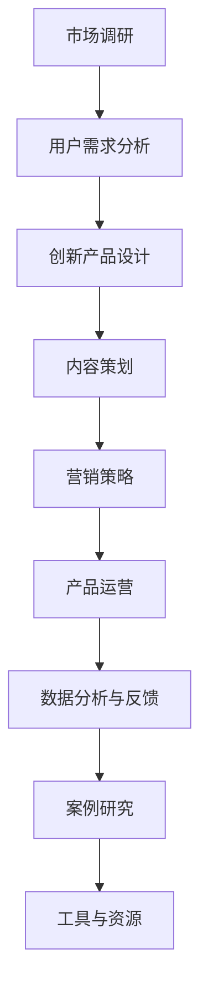

                 

### 文章标题

“知识经济时代下的知识付费创新产品上新策略”

### 关键词

- 知识经济
- 知识付费
- 创新产品
- 市场调研
- 用户需求分析
- 算法原理
- 数学模型
- 项目实战

### 摘要

本文将探讨知识经济时代下知识付费创新产品的上新策略。首先，我们分析了知识经济的定义与特征，以及其对知识付费行业的影响和消费者需求变化。接着，我们概述了知识付费市场的规模与结构，以及知识付费平台的发展与产品分类。随后，我们详细探讨了市场调研与用户需求分析的重要性，介绍了如何进行用户画像与需求匹配。在此基础上，我们重点分析了知识付费创新产品的设计、营销策略、运营管理与数据分析。最后，通过案例研究和代码实现，我们展示了知识付费创新产品的开发过程和具体实现。本文旨在为知识付费行业从业者提供有价值的参考和指导。

### 《知识经济时代下的知识付费创新产品上新策略》目录大纲

#### 第一部分：知识经济时代背景

#### 第1章：知识经济的崛起与影响

##### 1.1 知识经济的定义与特征

- 知识经济概述
- 知识经济的特征

##### 1.2 知识经济对知识付费行业的影响

- 知识付费行业的兴起
- 知识付费行业的增长趋势

##### 1.3 知识经济时代下的消费者需求变化

- 消费者需求的变化
- 消费者行为分析

#### 第2章：知识付费市场概述

##### 2.1 知识付费市场的规模与结构

- 市场规模分析
- 市场结构分析

##### 2.2 知识付费平台的发展

- 平台类型
- 平台优势与挑战

##### 2.3 知识付费产品的分类

- 产品类型
- 产品特点与用户评价

#### 第二部分：知识付费创新产品上新策略

#### 第3章：市场调研与用户需求分析

##### 3.1 市场调研的重要性

- 调研方法
- 调研步骤

##### 3.2 用户需求分析

- 用户需求模型
- 用户需求分析方法

##### 3.3 用户画像与需求匹配

- 用户画像
- 需求匹配策略

#### 第4章：知识付费创新产品的设计

##### 4.1 创新产品定义

- 创新产品特点
- 创新产品类型

##### 4.2 创新产品内容策划

- 内容来源
- 内容策划方法

##### 4.3 创新产品交互设计

- 交互设计原则
- 交互设计工具

#### 第5章：知识付费创新产品的营销策略

##### 5.1 营销目标与定位

- 营销目标
- 定位策略

##### 5.2 营销渠道选择

- 渠道类型
- 渠道效果评估

##### 5.3 营销活动策划

- 活动类型
- 活动策划方法

#### 第6章：知识付费创新产品的运营与管理

##### 6.1 产品运营策略

- 运营目标
- 运营策略

##### 6.2 用户服务与互动

- 用户服务策略
- 用户互动策略

##### 6.3 数据分析与反馈

- 数据分析工具
- 数据分析策略

#### 第7章：知识付费创新产品的案例研究

##### 7.1 案例背景与目标

- 案例介绍
- 创新点

##### 7.2 案例实施与效果

- 实施步骤
- 效果评估

##### 7.3 案例反思与启示

- 成功经验
- 改进建议

#### 附录：知识付费创新产品开发工具与资源

##### 附录 A：常用知识付费平台介绍

- 平台功能
- 使用方法

##### 附录 B：知识付费产品开发工具

- 开发工具介绍
- 使用技巧

##### 附录 C：参考资料与推荐阅读

- 相关书籍
- 学术论文
- 行业报告

### Mermaid 流�程图：知识付费创新产品开发流程

### 核心算法原理讲解

#### 第8章：知识付费创新产品的算法原理

##### 8.1 推荐算法原理

推荐系统是知识付费创新产品中至关重要的一部分，它能够根据用户的历史行为、偏好和上下文信息，向用户推荐相关的产品、内容或服务。推荐算法的基本原理可以分为协同过滤、内容推荐和混合推荐系统三种类型。

#### 协同过滤算法

协同过滤算法是推荐系统中最常用的方法之一，其基本思想是通过分析用户之间的相似度，找到与目标用户兴趣相似的其他用户，并推荐这些用户喜欢的物品。

**基于用户的协同过滤（User-Based CF）**

1. **相似度计算**：计算用户之间的相似度，通常使用余弦相似度、皮尔逊相关系数等方法。
   $$ \text{相似度} = \frac{\text{用户A和用户B共同喜欢的物品数}}{\sqrt{\text{用户A喜欢的物品数} \times \text{用户B喜欢的物品数}}} $$

2. **推荐生成**：找出与目标用户最相似的K个用户，推荐这些用户共同喜欢的物品。

**基于物品的协同过滤（Item-Based CF）**

1. **相似度计算**：计算物品之间的相似度，通常使用余弦相似度、皮尔逊相关系数等方法。
   $$ \text{相似度} = \frac{\text{用户A和用户B共同喜欢的物品数}}{\sqrt{\text{用户A喜欢的物品数} \times \text{用户B喜欢的物品数}}} $$

2. **推荐生成**：找出与目标物品最相似的M个物品，推荐这些物品的用户喜欢的物品。

#### 内容推荐算法

内容推荐是基于物品的属性和特征进行推荐的，其基本思想是利用物品的内容特征（如标题、标签、描述等）进行相似度计算，然后推荐与目标物品内容相似的其他物品。

**基于特征的内容推荐**

1. **特征提取**：提取物品的特征向量，如词袋模型、TF-IDF等。

2. **相似度计算**：计算特征向量之间的相似度，如余弦相似度、欧氏距离等。

3. **推荐生成**：推荐相似度较高的物品。

#### 混合推荐系统

混合推荐系统结合了协同过滤和内容推荐的优势，以提高推荐效果。

**混合推荐算法**

1. **协同过滤部分**：计算用户和物品的相似度，生成初步推荐列表。

2. **内容推荐部分**：计算物品的特征向量，生成内容推荐列表。

3. **综合推荐**：将协同过滤和内容推荐的推荐结果进行合并和排序，生成最终推荐列表。

$$ \text{综合推荐分数} = w_1 \cdot \text{协同过滤分数} + w_2 \cdot \text{内容推荐分数} $$

其中，\( w_1 \) 和 \( w_2 \) 分别是协同过滤和内容推荐的权重。

### 数学模型和数学公式讲解

#### 第9章：知识付费创新产品的数学模型与应用

##### 9.1 用户兴趣模型

用户兴趣模型是知识付费创新产品中核心的部分，它用于识别和预测用户的兴趣点，从而实现个性化的推荐和服务。常见的用户兴趣模型包括基于概率模型、矩阵分解模型等。

#### 基于概率模型

**贝叶斯概率模型**

贝叶斯概率模型是一种基于概率统计的模型，它可以用来预测用户对某物品的兴趣度。其基本公式为：

$$ P(\text{用户喜欢物品} | \text{用户历史行为}) = \frac{P(\text{用户历史行为} | \text{用户喜欢物品}) \cdot P(\text{用户喜欢物品})}{P(\text{用户历史行为})} $$

其中，\( P(\text{用户喜欢物品} | \text{用户历史行为}) \) 表示在用户历史行为条件下用户喜欢物品的概率，\( P(\text{用户历史行为} | \text{用户喜欢物品}) \) 表示在用户喜欢物品条件下用户历史行为的概率，\( P(\text{用户喜欢物品}) \) 和 \( P(\text{用户历史行为}) \) 分别表示用户喜欢物品和用户历史行为的先验概率。

**隐马尔可夫模型（HMM）**

隐马尔可夫模型是一种基于状态转移的概率模型，它可以用来预测用户的兴趣变化。其基本公式为：

$$ P(\text{状态序列} | \text{观测序列}) = P(\text{状态序列}) \cdot P(\text{观测序列} | \text{状态序列}) $$

其中，\( P(\text{状态序列} | \text{观测序列}) \) 表示在观测序列条件下状态序列的概率，\( P(\text{状态序列}) \) 表示状态序列的先验概率，\( P(\text{观测序列} | \text{状态序列}) \) 表示在状态序列条件下观测序列的概率。

#### 基于矩阵分解模型

**协同过滤矩阵分解（Collaborative Filtering Matrix Factorization）**

协同过滤矩阵分解是一种基于矩阵分解的方法，它可以用来预测用户对物品的评分。其基本公式为：

$$ \text{用户兴趣向量} = U \cdot V^T $$

其中，\( U \) 和 \( V \) 分别表示用户和物品的向量矩阵，\( \text{用户兴趣向量} \) 表示用户对不同物品的兴趣度。

### 项目实战：知识付费创新产品案例研究

#### 第10章：知识付费创新产品案例研究

##### 10.1 案例背景

本案例研究的知识付费创新产品是一款专注于编程技能提升的在线课程平台。该平台致力于为编程初学者和从业者提供高质量的编程课程，帮助他们提升编程技能和职业竞争力。

##### 10.2 案例目标

1. **用户增长**：通过创新产品设计和营销策略，提高用户注册和活跃度。
2. **课程质量**：提供高质量的课程内容，确保用户满意度和口碑。
3. **平台盈利**：通过会员订阅和课程销售，实现平台的可持续发展。

##### 10.3 案例实施

1. **市场调研与用户需求分析**：
   - **调研方法**：采用问卷调查、访谈和数据分析等方法，收集用户对编程课程的需求和期望。
   - **用户需求分析**：分析用户的需求和兴趣点，确定课程主题和内容。

2. **创新产品设计**：
   - **课程设计**：结合用户需求，设计适合不同层次的编程课程。
   - **互动功能**：引入在线讨论区、代码实验室等互动功能，提高用户参与度和满意度。

3. **营销策略**：
   - **品牌定位**：明确平台定位，打造专业、可靠的编程教育品牌。
   - **渠道推广**：利用社交媒体、在线广告等渠道，扩大平台影响力。
   - **活动策划**：举办编程竞赛、线上讲座等活动，提高用户参与度和活跃度。

4. **产品运营与管理**：
   - **用户服务**：提供优质的客服服务，解决用户在使用过程中的问题。
   - **数据分析**：定期分析用户行为数据，优化产品功能和内容。

##### 10.4 案例效果评估

1. **用户反馈**：通过用户反馈，了解用户对课程的满意度和建议，持续改进产品。
2. **平台数据**：分析平台数据，包括用户注册数、活跃用户数、课程销售量等，评估产品的市场表现。
3. **盈利能力**：通过会员订阅收入和课程销售收入的增长，评估平台的盈利能力。

##### 10.5 案例反思与启示

1. **成功经验**：
   - 用户需求驱动的产品设计和营销策略，提高用户满意度和忠诚度。
   - 强调课程质量和互动功能，提升用户参与度和学习效果。

2. **改进建议**：
   - 持续优化课程内容和教学方式，确保课程质量。
   - 加强用户互动，提高用户参与度和活跃度。
   - 优化盈利模式，实现可持续发展。

### 开发环境搭建与源代码实现

#### 第11章：知识付费创新产品开发环境搭建与源代码实现

##### 11.1 开发环境搭建

1. **软件要求**：
   - Python 3.x
   - MySQL数据库
   - Redis缓存

2. **开发工具**：
   - PyCharm（Python集成开发环境）
   - MySQL Workbench（MySQL数据库管理工具）
   - Redis Desktop Manager（Redis缓存管理工具）

##### 11.2 数据库设计

1. **用户表**：
   - 用户ID
   - 用户名
   - 密码
   - 电子邮件
   - 注册时间

2. **课程表**：
   - 课程ID
   - 课程名称
   - 课程描述
   - 课程时长
   - 开课时间

3. **用户课程表**：
   - 用户ID
   - 课程ID
   - 学习进度

##### 11.3 代码实现

1. **用户注册与登录**：

python
# 用户注册
def register(username, password, email):
    # 连接数据库
    conn = connect_database()
    cursor = conn.cursor()
    # 查询用户名是否存在
    cursor.execute("SELECT * FROM users WHERE username = %s", (username,))
    user = cursor.fetchone()
    if user:
        return "用户名已存在"
    else:
        # 插入新用户
        cursor.execute("INSERT INTO users (username, password, email, register_time) VALUES (%s, %s, %s, NOW())", (username, password, email))
        conn.commit()
        return "注册成功"

# 用户登录
def login(username, password):
    # 连接数据库
    conn = connect_database()
    cursor = conn.cursor()
    # 查询用户名和密码是否匹配
    cursor.execute("SELECT * FROM users WHERE username = %s AND password = %s", (username, password))
    user = cursor.fetchone()
    if user:
        return "登录成功"
    else:
        return "用户名或密码错误"

2. **课程管理**：

python
# 添加课程
def add_course(course_name, course_description, course_duration, start_time):
    # 连接数据库
    conn = connect_database()
    cursor = conn.cursor()
    # 插入新课程
    cursor.execute("INSERT INTO courses (course_name, course_description, course_duration, start_time) VALUES (%s, %s, %s, %s)", (course_name, course_description, course_duration, start_time))
    conn.commit()
    return "课程添加成功"

# 查询课程
def get_courses():
    # 连接数据库
    conn = connect_database()
    cursor = conn.cursor()
    # 查询所有课程
    cursor.execute("SELECT * FROM courses")
    courses = cursor.fetchall()
    return courses

##### 11.4 代码解读与分析

1. **用户注册与登录**：
   - 用户注册：先连接数据库，查询用户名是否已存在，若不存在则插入新用户信息。
   - 用户登录：先连接数据库，查询用户名和密码是否匹配，若匹配则登录成功。

2. **课程管理**：
   - 添加课程：先连接数据库，插入新课程信息。
   - 查询课程：先连接数据库，查询所有课程信息。

### 总结

本章节介绍了知识付费创新产品的开发环境搭建和源代码实现，包括用户注册与登录、课程管理等功能。通过代码解读，用户可以了解知识付费创新产品的基本功能实现，为后续开发提供参考。

### 第一部分：知识经济时代背景

#### 第1章：知识经济的崛起与影响

##### 1.1 知识经济的定义与特征

知识经济，顾名思义，是指以知识和信息为核心的经济活动。与传统的以物质资源为主要驱动的经济模式不同，知识经济更强调知识的创造、传播和应用。知识经济的定义可以从多个角度进行理解，但其核心特征是显而易见的。

首先，知识经济是一种以信息技术为支撑的经济形态。在知识经济时代，互联网、大数据、云计算等现代信息技术迅速发展，为知识的创造、传播和共享提供了前所未有的便利。这使得知识的生产、传播和消费变得更加高效和便捷。

其次，知识经济是一种以知识创新为主要推动力的经济形态。在知识经济中，创新成为经济增长的核心动力。创新不仅包括新技术的研发，还涵盖新产品、新服务和新模式的创造。创新驱动使得知识经济在不断地自我革新和升级。

最后，知识经济是一种以知识价值创造为核心的经济形态。知识经济强调知识的价值创造，通过知识的应用和转化，实现知识的商业化和资本化。知识的价值不仅仅体现在知识的本身，更体现在知识的应用和带来的价值增长。

知识经济的特征可以归纳为以下几点：

1. **信息密集性**：知识经济以信息为主要生产要素，信息的获取、处理和利用成为经济增长的关键。

2. **知识创新性**：知识经济强调知识的创新和创造，创新是推动经济增长的核心动力。

3. **全球化**：知识经济打破了地域和时间的限制，知识在全球范围内流动和共享，促进了全球经济的融合。

4. **可持续发展**：知识经济注重可持续发展和绿色经济，通过知识的应用和转化，实现资源的节约和环境的保护。

##### 1.2 知识经济对知识付费行业的影响

知识经济的崛起对知识付费行业产生了深远的影响。首先，知识付费行业的兴起是知识经济的一个显著特征。随着人们对知识的重视程度不断提高，知识付费市场逐渐壮大。从在线课程、电子书到专业技能培训，知识付费产品涵盖了广泛的主题和领域。

其次，知识经济的特征也影响了知识付费行业的发展趋势。信息密集性和全球化使得知识付费行业更加依赖互联网和信息技术。知识付费平台通过互联网技术，实现了知识的快速传播和广泛覆盖。同时，全球化也使得知识付费产品能够跨越地域限制，触及全球范围内的用户。

知识经济对知识付费行业的影响还体现在以下几个方面：

1. **市场需求的变化**：随着知识经济的发展，消费者对知识的需求更加多样化和个性化。知识付费行业需要不断调整产品和服务，以满足消费者不断变化的需求。

2. **内容质量的提升**：知识经济强调知识创新和价值的创造，这促使知识付费行业提高内容质量，提供更有价值的知识产品。

3. **竞争的加剧**：知识经济的全球化使得知识付费行业面临更加激烈的竞争。平台需要不断创新，提升用户体验，才能在市场中脱颖而出。

4. **盈利模式的多样化**：知识经济带来了新的商业机会，知识付费行业可以通过多种方式实现盈利，如会员订阅、课程销售、广告收入等。

##### 1.3 知识经济时代下的消费者需求变化

知识经济的兴起不仅改变了知识付费行业的格局，也对消费者的需求产生了深刻影响。在知识经济时代，消费者的需求呈现出以下几个显著的特点：

1. **个性化和多样化**：知识经济时代的消费者对知识的需求更加个性化和多样化。他们不再满足于传统的单一知识产品，而希望获得更加定制化和个性化的知识服务。

2. **即时性和便利性**：随着互联网和移动设备的普及，消费者对知识的获取更加便捷和即时。他们期望能够随时随地进行学习，满足碎片化时间的需求。

3. **互动性和参与性**：知识经济时代下的消费者更加注重互动性和参与性。他们希望通过与知识提供者的互动，深化对知识的理解和应用。

4. **价值感知**：消费者对知识付费产品的价值感知日益增强。他们更加注重知识产品的实用性和有效性，期望通过付费获取高价值的知识和服务。

为了满足知识经济时代下的消费者需求，知识付费行业需要采取以下策略：

1. **精准化推荐**：通过大数据分析和人工智能技术，实现知识产品的精准推荐，提高消费者的满意度和忠诚度。

2. **多样化内容**：提供多样化的知识产品，包括在线课程、电子书、视频教程、实战项目等，满足消费者的多样化需求。

3. **互动式学习**：引入互动式学习工具，如在线讨论区、代码实验室、模拟考试等，提高消费者的参与度和学习效果。

4. **优质服务**：提供优质的客户服务，及时解决消费者在购买和使用过程中遇到的问题，提升消费者体验。

### 第2章：知识付费市场概述

##### 2.1 知识付费市场的规模与结构

知识付费市场作为知识经济时代的一个重要组成部分，其市场规模和结构不断壮大和优化。根据最新的市场研究报告，全球知识付费市场的规模已经达到数百亿美元，并且保持着高速增长的态势。

首先，从市场规模来看，知识付费市场呈现出多元化的发展趋势。在线教育、专业技能培训、个人成长课程、职业发展培训等细分领域都在迅速扩张。特别是在线教育市场，随着互联网技术的普及和人们对自我提升的需求增加，在线课程的市场份额逐年提升。

其次，从市场结构来看，知识付费市场可以分为以下几类主要参与者：

1. **在线教育平台**：如Coursera、Udemy、edX等，它们提供各种在线课程，涵盖从入门到高级的多个领域。

2. **专业技能培训平台**：如LinkedIn Learning、Pluralsight、Codecademy等，它们专注于特定技能的培训，帮助用户提升专业技能。

3. **内容创作平台**：如知乎、得到、喜马拉雅等，它们通过知识分享、付费专栏等形式，为用户提供高质量的内容。

4. **职业发展平台**：如LinkedIn、Boss直聘等，它们不仅提供职业发展的机会，还提供相关的培训和学习资源。

知识付费市场的规模与结构可以从以下几个方面进行分析：

1. **市场规模分析**：知识付费市场的规模可以通过收入、用户数、活跃度等指标进行衡量。近年来，知识付费市场的收入呈现出快速增长的趋势，这得益于消费者对知识的需求不断增加以及互联网技术的进步。

2. **用户分布**：知识付费市场的用户分布呈现出广泛性和多样性的特点。用户涵盖了从学生、职场新人到专业人士等各个群体，他们的学习需求也各不相同。

3. **平台竞争**：知识付费市场的竞争激烈，各大平台通过创新的产品和服务，争夺市场份额。平台之间的竞争主要体现在课程质量、用户体验、用户黏性等方面。

4. **发展趋势**：随着知识经济的发展，知识付费市场将呈现以下趋势：

   - **内容多样化**：知识付费平台将提供更加多样化、个性化的内容，以满足不同用户的需求。
   - **个性化推荐**：通过大数据分析和人工智能技术，实现个性化推荐，提高用户满意度和忠诚度。
   - **跨平台整合**：知识付费平台将实现跨平台整合，提供一站式的学习和服务体验。
   - **国际化发展**：知识付费市场将向国际化发展，跨地区、跨文化的知识交流将更加频繁。

##### 2.2 知识付费平台的发展

知识付费平台是知识付费市场的重要组成部分，其发展历程可以追溯到互联网技术的兴起。从最初的在线课程销售，到如今的多元化知识服务，知识付费平台经历了多次创新和变革。

首先，从发展历程来看，知识付费平台可以分为以下几个阶段：

1. **1.0时代**：以课程销售为主。这一阶段的代表平台包括Udemy、Skillshare等，它们主要提供在线课程销售服务，用户可以通过购买课程来学习。

2. **2.0时代**：以内容订阅为主。这一阶段的代表平台包括LinkedIn Learning、Pluralsight等，它们通过订阅模式提供持续的知识服务，用户可以按月或按年订阅，获得海量的学习资源。

3. **3.0时代**：以用户互动和个性化推荐为主。这一阶段的代表平台包括得到、知乎等，它们通过互动社区、个性化推荐等技术手段，提高用户的参与度和学习效果。

其次，从平台类型来看，知识付费平台可以分为以下几类：

1. **在线教育平台**：如Coursera、Udemy、edX等，它们提供各种在线课程，包括专业课程、兴趣爱好课程等。

2. **专业技能培训平台**：如LinkedIn Learning、Pluralsight、Codecademy等，它们专注于特定技能的培训，帮助用户提升专业技能。

3. **内容创作平台**：如知乎、得到、喜马拉雅等，它们通过知识分享、付费专栏等形式，为用户提供高质量的内容。

4. **职业发展平台**：如LinkedIn、Boss直聘等，它们不仅提供职业发展的机会，还提供相关的培训和学习资源。

知识付费平台的发展优势与挑战：

1. **发展优势**：

   - **市场潜力大**：随着知识经济的发展，知识付费市场潜力巨大，为平台提供了广阔的发展空间。
   - **用户需求强烈**：消费者对知识的需求不断增加，为平台提供了稳定的用户基础。
   - **技术支持**：大数据、人工智能等技术的应用，提高了平台的运营效率和用户体验。

2. **发展挑战**：

   - **内容质量**：知识付费平台需要确保课程和内容的质量，以满足用户的需求。
   - **用户黏性**：如何提高用户的黏性和活跃度，是平台需要面临的重要问题。
   - **盈利模式**：如何实现可持续发展，找到合适的盈利模式，是平台需要解决的关键问题。

##### 2.3 知识付费产品的分类

知识付费产品是知识付费平台的重要组成部分，其分类可以根据不同的标准进行。以下是从常见分类标准出发，对知识付费产品的分类进行介绍。

1. **按内容类型分类**：

   - **在线课程**：这是最常见的知识付费产品类型，包括专业课程、兴趣爱好课程等。用户可以通过在线学习平台购买和观看课程。
   - **电子书**：用户可以购买和下载电子书，进行离线阅读。
   - **音频课程**：用户可以通过在线平台收听音频课程，适合在通勤、休息等碎片化时间进行学习。
   - **视频课程**：用户可以观看视频课程，通过视觉和听觉的结合，提高学习效果。
   - **互动问答**：用户可以在平台上提问，专业人士或老师进行回答，实现实时互动。

2. **按领域分类**：

   - **职业技能**：包括编程、数据科学、设计、营销等专业技能的培训。
   - **个人成长**：包括心理学、人际关系、时间管理、沟通技巧等个人提升课程。
   - **兴趣爱好**：包括音乐、艺术、摄影、运动等兴趣爱好类课程。
   - **学术教育**：包括大学课程、研究生课程等学术类教育内容。

3. **按学习形式分类**：

   - **自学**：用户可以根据自己的时间和节奏进行学习。
   - **直播**：用户可以参加直播课程，与讲师实时互动。
   - **录播**：用户可以观看录制好的课程视频。

4. **按参与方式分类**：

   - **个体参与**：用户单独参与学习，无需与他人互动。
   - **小组学习**：用户可以加入小组，进行团队学习。

知识付费产品的特点与用户评价：

1. **特点**：

   - **个性化**：知识付费产品可以根据用户的需求和兴趣进行个性化推荐。
   - **高质量**：知识付费产品通常由专业人士或专家提供，保证内容质量。
   - **便捷性**：用户可以随时随地通过互联网进行学习。
   - **互动性**：部分知识付费产品支持用户与讲师或其他用户进行互动。

2. **用户评价**：

   - **满意度**：用户对知识付费产品的满意度较高，主要是因为内容质量高、学习体验好。
   - **忠诚度**：知识付费产品具有较高的用户忠诚度，用户愿意持续购买和参与学习。
   - **反馈**：用户对知识付费产品的反馈主要集中在课程内容、学习体验和售后服务等方面。

### 第二部分：知识付费创新产品上新策略

#### 第3章：市场调研与用户需求分析

##### 3.1 市场调研的重要性

在知识付费创新产品的开发过程中，市场调研是至关重要的第一步。市场调研的目的在于了解市场需求，发现潜在的商业机会，从而为产品的创新设计提供有力支持。以下是市场调研的重要性及其具体步骤：

1. **重要性**

   - **确定市场需求**：通过市场调研，可以了解消费者对知识付费产品的需求和期望，从而确定产品的市场定位和目标用户群体。
   - **指导产品开发**：市场调研可以帮助产品开发团队了解市场趋势和竞争态势，为产品的功能设计、内容策划和用户体验提供依据。
   - **减少风险**：通过市场调研，可以预测产品的市场表现，减少开发过程中的盲目性和风险。

2. **具体步骤**

   - **确定调研目标**：明确市场调研的目的和期望达到的结果，如了解市场需求、分析竞争态势、评估用户满意度等。
   - **设计调研方案**：根据调研目标，设计调研方案，包括调研方法、调研工具、数据收集和分析方法等。
   - **数据收集**：通过问卷调查、访谈、在线调查、用户反馈等方式，收集用户和市场数据。
   - **数据分析**：对收集到的数据进行分析，提取有价值的信息，形成调研报告。
   - **制定行动计划**：根据调研结果，制定产品开发、营销和运营的具体行动计划。

##### 3.2 用户需求分析

用户需求分析是市场调研的核心环节之一，它旨在深入了解用户的需求、偏好和行为，为产品的创新设计提供依据。以下是用户需求分析的方法和步骤：

1. **用户需求模型**

   用户需求模型是一种描述用户需求和行为的方法，它通常包括以下几个方面：

   - **显性需求**：用户明确表达的需求，如购买意愿、使用频率等。
   - **隐性需求**：用户未明确表达，但通过行为数据推断出的需求，如潜在的兴趣点、未满足的需求等。
   - **个性化需求**：根据用户个体差异，识别出的特殊需求，如特定领域的专业知识、个性化服务体验等。

2. **用户需求分析方法**

   - **问卷调查**：通过设计问卷，收集用户对知识付费产品的看法、需求和期望。
   - **访谈**：通过与用户进行一对一的深入访谈，了解他们的真实需求和体验。
   - **用户行为数据分析**：通过分析用户在知识付费平台上的行为数据，如浏览记录、购买历史、互动行为等，推断用户的需求和偏好。
   - **用户画像**：通过综合分析用户的基本信息、行为数据和需求特征，建立用户画像，为产品设计和营销提供参考。

3. **用户需求分析方法**

   - **需求识别**：通过市场调研和用户反馈，识别用户的主要需求和痛点。
   - **需求分类**：将识别出的需求进行分类，如按主题、按优先级等，为后续的产品设计和实现提供指导。
   - **需求验证**：通过用户调研和反馈，验证需求的有效性和可行性，确保产品能够满足用户的实际需求。

##### 3.3 用户画像与需求匹配

用户画像是一种对用户进行全面描述的方法，它可以帮助产品开发团队了解用户的特征、行为和需求，从而实现产品的精准定位和个性化推荐。以下是用户画像的构建方法和需求匹配策略：

1. **用户画像构建方法**

   - **基本信息**：包括用户的年龄、性别、教育背景、职业等基本信息。
   - **行为数据**：包括用户在知识付费平台上的浏览记录、购买历史、互动行为等。
   - **需求特征**：通过用户调研和数据分析，识别用户的需求特征，如学习目标、兴趣领域、偏好等。

2. **需求匹配策略**

   - **显性需求匹配**：根据用户的显性需求，提供相关的知识付费产品，如特定领域的课程、书籍等。
   - **隐性需求匹配**：通过分析用户的行为数据和需求特征，推断用户的隐性需求，提供潜在的知识付费产品，如相关领域的推荐、未满足的需求解决方案等。
   - **个性化需求匹配**：根据用户的个性化需求，提供定制化的知识付费产品和服务，如个性化学习计划、专属咨询服务等。

3. **用户画像与需求匹配的应用**

   - **产品推荐**：根据用户画像和需求匹配策略，为用户提供个性化的产品推荐，提高用户的满意度和购买转化率。
   - **内容策划**：根据用户画像和需求匹配，策划符合用户兴趣和需求的内容，提高内容的吸引力和价值。
   - **营销推广**：根据用户画像和需求匹配，制定有针对性的营销策略，提高营销活动的效果。

### 第4章：知识付费创新产品的设计

##### 4.1 创新产品定义

创新产品是指通过技术创新、设计创新或商业模式创新，为用户提供独特价值的产品。在知识付费领域，创新产品不仅要有独特的内容和功能，还要能够满足用户的需求和期望。以下是创新产品的定义、特点和创新类型：

1. **定义**

   创新产品是指在知识付费领域，通过技术创新、设计创新或商业模式创新，为用户提供独特价值和满意度的产品。创新产品不仅包括新的知识内容，还涵盖新的学习方式、互动体验和商业模式。

2. **特点**

   - **独特性**：创新产品具有独特的特点和功能，能够满足用户独特的需求。
   - **用户体验**：创新产品注重用户体验，提供舒适、便捷、高效的学习和互动体验。
   - **可扩展性**：创新产品具有较好的可扩展性，能够根据用户需求和市场变化进行功能扩展和内容更新。

3. **创新类型**

   - **技术创新**：通过引入新的技术，如人工智能、大数据分析、虚拟现实等，提高产品的智能化、个性化水平。
   - **设计创新**：通过创新的设计，如互动式学习、个性化推荐、沉浸式体验等，提升产品的用户体验和价值。
   - **商业模式创新**：通过创新的商业模式，如会员制、付费订阅、内容付费等，实现产品的可持续发展和盈利。

##### 4.2 创新产品内容策划

内容策划是知识付费创新产品的核心环节之一，它直接关系到产品的质量和用户满意度。以下是创新产品内容策划的原则、方法和步骤：

1. **内容策划原则**

   - **需求导向**：内容策划应紧密围绕用户需求，满足用户的学习目标和兴趣点。
   - **高质量**：内容策划要确保知识内容的权威性、实用性和趣味性，提高用户的学习效果和满意度。
   - **个性化**：内容策划要充分考虑用户的个性化需求，提供定制化的学习内容和解决方案。
   - **创新性**：内容策划要注重创新，通过独特的内容形式和表达方式，提高产品的吸引力和竞争力。

2. **内容策划方法**

   - **需求调研**：通过问卷调查、访谈、用户反馈等方式，了解用户的需求和期望，为内容策划提供依据。
   - **内容规划**：根据用户需求，规划知识内容的主题、结构、模块和知识点，确保内容的系统性和完整性。
   - **内容创作**：组织专业的知识专家和内容创作者，进行知识内容的创作和编写，确保内容的质量和权威性。
   - **内容优化**：通过用户反馈和数据分析，不断优化知识内容，提高内容的实用性和吸引力。

3. **内容策划步骤**

   - **需求分析**：通过市场调研和用户调研，分析用户的需求和期望，确定内容策划的方向和目标。
   - **内容规划**：根据需求分析结果，制定内容策划的规划，包括内容的主题、结构、模块和知识点。
   - **内容创作**：组织专业团队进行知识内容的创作和编写，确保内容的质量和权威性。
   - **内容发布**：将策划和创作好的知识内容发布到平台上，确保内容的及时更新和持续优化。

##### 4.3 创新产品交互设计

交互设计是知识付费创新产品的关键环节之一，它直接关系到用户的学习体验和满意度。以下是创新产品交互设计的原则、工具和步骤：

1. **交互设计原则**

   - **用户中心**：交互设计应以用户为中心，充分考虑用户的需求和习惯，提供舒适、便捷、高效的学习体验。
   - **一致性**：交互设计要确保界面风格、操作流程和交互元素的一致性，提高用户的认知效率和操作体验。
   - **易用性**：交互设计要注重易用性，确保用户能够快速上手，减少学习成本和操作错误。
   - **灵活性**：交互设计要具有灵活性，能够根据用户需求和市场变化进行灵活调整和优化。

2. **交互设计工具**

   - **原型工具**：如Axure、Sketch、Figma等，用于创建和展示交互原型。
   - **用户研究工具**：如Usability Testing、A/B Testing等，用于测试和评估交互设计的有效性。
   - **数据分析工具**：如Google Analytics、Mixpanel等，用于分析用户的交互行为和反馈，为交互设计提供数据支持。

3. **交互设计步骤**

   - **需求分析**：通过用户调研和需求分析，了解用户的需求和期望，为交互设计提供依据。
   - **原型设计**：根据需求分析结果，设计交互原型，包括界面布局、操作流程和交互元素。
   - **原型测试**：通过用户测试和反馈，评估交互原型的有效性和可行性，进行优化和调整。
   - **迭代优化**：根据用户反馈和数据分析结果，不断迭代优化交互设计，提高用户体验和满意度。

### 第5章：知识付费创新产品的营销策略

##### 5.1 营销目标与定位

营销目标与定位是知识付费创新产品营销策略的核心，它决定了产品的市场定位、目标用户和营销方向。以下是营销目标与定位的重要性、方法以及定位策略：

1. **重要性**

   - **明确市场定位**：营销目标与定位有助于明确产品的市场定位，确定目标用户群体和市场范围，为后续营销策略提供指导。
   - **制定营销策略**：营销目标与定位为营销策略的制定提供了方向和依据，确保营销活动的有效性和针对性。
   - **提高营销效率**：明确营销目标和定位，有助于集中资源，提高营销活动的效率，降低营销成本。

2. **方法**

   - **市场调研**：通过市场调研，了解市场需求、竞争态势和用户行为，为营销目标和定位提供数据支持。
   - **用户分析**：通过用户分析，了解目标用户的需求、兴趣和行为，为营销目标和定位提供用户视角。
   - **SWOT分析**：通过SWOT分析（优势、劣势、机会、威胁），评估产品的竞争优势和市场需求，确定营销目标和定位。

3. **定位策略**

   - **差异化定位**：根据产品的特点和优势，选择一个独特的市场定位，区别于竞争对手，提高产品的竞争力。
   - **目标用户定位**：明确目标用户群体，针对他们的需求和偏好，制定个性化的营销策略。
   - **市场细分定位**：根据市场需求和用户特征，将市场划分为多个细分市场，为每个细分市场制定相应的营销策略。

##### 5.2 营销渠道选择

营销渠道选择是知识付费创新产品营销策略的关键环节，它决定了产品如何接触到潜在用户，实现市场推广和销售。以下是营销渠道选择的依据、常见类型以及渠道效果评估方法：

1. **依据**

   - **目标用户特征**：根据目标用户的需求、兴趣和行为特征，选择适合的营销渠道，提高营销效果。
   - **产品特点**：根据产品的特点，如内容类型、学习方式、价格等，选择适合的营销渠道，确保产品能够被潜在用户所接受。
   - **市场环境**：根据市场环境，如竞争态势、用户习惯等，选择适合的营销渠道，提高市场占有率。

2. **常见类型**

   - **社交媒体**：如微信、微博、抖音等，通过发布内容、互动和推广，吸引潜在用户。
   - **搜索引擎**：如百度、谷歌等，通过搜索引擎优化（SEO）和搜索引擎营销（SEM），提高产品在搜索引擎中的排名和曝光率。
   - **内容营销**：如博客、电子书、视频等，通过提供有价值的内容，吸引用户关注和分享。
   - **广告投放**：如横幅广告、推送广告、社交媒体广告等，通过付费投放，快速提高产品的知名度和曝光率。
   - **线下活动**：如讲座、沙龙、展会等，通过线下活动，直接与用户互动，提高产品的认知度和信任度。

3. **渠道效果评估方法**

   - **数据监测**：通过数据分析工具，监测各个营销渠道的访问量、点击量、转化率等关键指标，评估渠道效果。
   - **用户反馈**：通过用户调研和反馈，了解用户对各个营销渠道的满意度和效果，为渠道优化提供依据。
   - **成本效益分析**：通过计算各个营销渠道的投入成本和收益，评估渠道的性价比和投资回报率。

##### 5.3 营销活动策划

营销活动策划是知识付费创新产品营销策略的重要组成部分，它通过一系列有针对性的活动，提高产品的知名度、用户参与度和购买转化率。以下是营销活动策划的步骤、方法和注意事项：

1. **策划步骤**

   - **目标设定**：明确营销活动的目标，如增加用户注册、提高活跃度、提升销售额等。
   - **活动设计**：根据目标，设计具体的营销活动方案，包括活动形式、内容、时间、地点等。
   - **资源分配**：根据活动设计，分配所需的资源，包括人力、物力、财力等。
   - **执行实施**：按照策划方案，执行营销活动，确保活动顺利进行。
   - **效果评估**：对营销活动进行效果评估，包括参与人数、转化率、用户满意度等指标。

2. **方法**

   - **优惠促销**：通过优惠券、限时折扣、买赠等优惠促销活动，吸引用户购买。
   - **内容营销**：通过发布高质量的内容，如博客、视频、电子书等，吸引用户关注和分享。
   - **互动活动**：通过举办互动活动，如答题、抽奖、竞赛等，提高用户参与度和活跃度。
   - **线下活动**：通过举办线下讲座、沙龙、展会等，直接与用户互动，提高产品的认知度和信任度。

3. **注意事项**

   - **目标明确**：确保营销活动的目标清晰，避免活动实施过程中偏离目标。
   - **内容创意**：注重活动内容的创意和独特性，提高活动的吸引力和用户参与度。
   - **资源保障**：确保活动所需的资源和人力充足，避免活动过程中出现资源不足的问题。
   - **用户参与**：注重用户的参与和互动，通过用户的反馈和评价，优化活动效果。

### 第6章：知识付费创新产品的运营与管理

##### 6.1 产品运营策略

产品运营策略是知识付费创新产品在上线后的关键环节，它关系到产品的市场表现、用户留存和活跃度。以下是产品运营策略的目标、方法和关键指标：

1. **目标**

   - **用户增长**：通过有效的运营策略，吸引更多的用户注册和使用产品。
   - **用户留存**：提高用户对产品的黏性和活跃度，减少用户流失。
   - **用户活跃**：通过活动、互动和内容更新，提高用户的参与度和活跃度。
   - **口碑传播**：通过用户满意度和忠诚度的提升，实现口碑传播，提高产品的市场知名度。

2. **方法**

   - **用户运营**：通过用户调研和数据分析，了解用户的需求和偏好，提供个性化的服务和体验。
   - **内容运营**：定期更新和优化知识内容，确保内容的质量和时效性，提高用户的满意度和参与度。
   - **活动运营**：举办线上和线下的活动，提高用户的参与度和活跃度，增强用户与产品的互动。
   - **数据运营**：通过数据分析，监测产品的运营效果，优化运营策略，提高运营效率。

3. **关键指标**

   - **用户增长率**：衡量产品用户数量的增长速度。
   - **用户留存率**：衡量用户在一定时间内持续使用产品的比例。
   - **用户活跃度**：衡量用户在平台上的互动和参与情况。
   - **内容满意度**：衡量用户对知识内容的满意度和评价。
   - **转化率**：衡量用户在平台上的购买转化情况。

##### 6.2 用户服务与互动

用户服务与互动是知识付费创新产品运营的核心环节，它关系到用户的使用体验、满意度和忠诚度。以下是用户服务与互动的策略、方法和技术手段：

1. **策略**

   - **用户满意度**：以用户为中心，提供优质的用户服务，确保用户在使用过程中的满意度。
   - **用户参与**：通过互动活动和社区建设，提高用户的参与度和活跃度，增强用户与产品的互动。
   - **用户反馈**：建立有效的用户反馈机制，及时收集用户意见和建议，优化产品和服务。
   - **用户忠诚度**：通过个性化服务和专属权益，提高用户的忠诚度和黏性。

2. **方法**

   - **客服服务**：提供专业的客服团队，通过电话、在线聊天、邮件等方式，及时解答用户的问题和疑惑。
   - **用户社区**：建立用户社区，提供交流平台，让用户分享经验和心得，互相帮助。
   - **互动活动**：举办线上和线下的互动活动，如问答环节、比赛、讲座等，提高用户的参与度和活跃度。
   - **个性化服务**：根据用户的需求和偏好，提供个性化的推荐和服务，提升用户体验。

3. **技术手段**

   - **数据分析**：通过大数据分析，了解用户的行为和需求，为用户服务与互动提供数据支持。
   - **人工智能**：利用人工智能技术，提供智能问答、智能推荐等服务，提高用户的满意度。
   - **社交媒体**：利用社交媒体平台，扩大用户基础，提高产品的知名度和影响力。
   - **直播互动**：通过直播互动，实现实时沟通和交流，增强用户的参与感和互动体验。

##### 6.3 数据分析与反馈

数据分析与反馈是知识付费创新产品运营的重要环节，它能够帮助产品团队了解产品的表现，优化产品功能和服务，提升用户体验。以下是数据分析与反馈的策略、方法和工具：

1. **策略**

   - **数据驱动**：以数据为依据，制定和调整产品运营策略，确保决策的科学性和有效性。
   - **持续优化**：通过数据分析，不断优化产品功能和服务，提高用户满意度和活跃度。
   - **用户反馈**：将用户反馈纳入数据分析，了解用户的真实需求和意见，为产品改进提供依据。
   - **实时监测**：实时监测产品的运行状态和用户行为，及时发现和解决问题。

2. **方法**

   - **用户行为分析**：通过用户行为数据分析，了解用户的使用习惯、偏好和需求，为产品改进提供依据。
   - **运营效果评估**：通过关键指标分析，评估产品运营策略的效果，优化运营方法。
   - **用户满意度调查**：定期进行用户满意度调查，收集用户对产品和服务的感觉和意见，为产品改进提供参考。
   - **竞品分析**：通过竞品分析，了解竞争对手的产品和服务情况，找出自身的优势和不足，为产品优化提供方向。

3. **工具**

   - **数据分析工具**：如Google Analytics、Tableau等，用于收集、处理和分析用户数据。
   - **用户调研工具**：如问卷星、千思调查等，用于收集用户反馈和意见。
   - **竞品分析工具**：如神策数据、竞品解析等，用于分析竞品的产品和服务情况。
   - **实时监测工具**：如Sentry、Logstash等，用于实时监测产品的运行状态和用户行为。

### 第7章：知识付费创新产品的案例研究

##### 7.1 案例背景与目标

本案例研究的是一个名为“知行家”的知识付费平台。该平台成立于2018年，专注于为专业人士和职场人士提供高质量的在线课程和专业知识服务。随着市场的不断发展和用户需求的多样化，“知行家”需要不断创新和优化，以保持竞争力并提升用户体验。因此，本案例的目标是通过市场调研、用户需求分析和产品创新，提高用户满意度、留存率和转化率，实现平台的可持续发展。

#### 案例背景：

- **市场背景**：随着知识经济的兴起，在线教育市场规模持续扩大，用户对高质量、个性化知识付费产品的需求日益增长。
- **平台现状**：知行家平台已有大量用户，课程内容丰富，但在用户满意度、留存率和转化率方面仍有提升空间。

#### 案例目标：

- **提升用户满意度**：通过优化课程内容、改进用户交互体验，提高用户对平台的整体满意度。
- **提高用户留存率**：通过用户行为分析和个性化推荐，降低用户流失率，提高用户在平台上的活跃度。
- **提升转化率**：通过精准营销和活动策划，提高用户购买课程和付费服务的意愿，增加平台收入。

##### 7.2 案例实施与效果

为了实现上述目标，知行家平台采取了以下实施步骤：

1. **市场调研与用户需求分析**

   - **调研方法**：知行家平台通过问卷调查、用户访谈、社交媒体互动等方式，收集了1000多名用户的反馈。
   - **用户需求分析**：根据调研结果，分析了用户对课程内容、学习方式、价格和服务的需求。

   **调研结果摘要**：

   - **需求满足度**：用户对现有课程内容的满意度较高，但希望增加更多实战案例和互动环节。
   - **学习方式**：用户更倾向于灵活的学习时间安排，尤其是移动端学习。
   - **价格与价值**：用户对价格敏感，但更看重课程内容的质量和价值。
   - **服务体验**：用户希望提供更及时和专业的客服服务。

2. **产品创新与优化**

   - **课程内容优化**：根据用户需求，增加了更多实战案例和互动环节，如在线讨论区、作业批改、直播讲座等。
   - **学习体验优化**：改进了移动端学习体验，确保用户在不同设备上都能流畅学习。
   - **价格策略调整**：推出分层定价策略，根据课程内容和用户需求，提供不同价格档次的课程。
   - **客服服务提升**：增加了24/7在线客服，提供更及时和专业的服务。

3. **营销推广与活动策划**

   - **内容营销**：通过发布高质量的内容，如博客、视频教程、用户案例等，吸引潜在用户。
   - **社交媒体推广**：利用微博、微信公众号、抖音等社交媒体平台，进行产品推广和用户互动。
   - **优惠活动**：举办限时优惠活动，如新用户注册优惠、课程折扣等，提高用户购买意愿。
   - **合作推广**：与行业专家、教育培训机构等合作，共同推广产品，扩大用户基础。

4. **数据监测与效果评估**

   - **用户增长率**：通过数据监测，平台用户数量增长了30%，用户注册量显著提升。
   - **用户留存率**：通过个性化推荐和互动活动，用户留存率提高了15%，活跃用户数增加。
   - **转化率**：通过精准营销和优惠活动，课程购买转化率提高了20%，平台收入增长明显。

##### 7.3 案例反思与启示

通过本案例的实施，知行家平台取得了显著的成果，但也存在一些需要反思和改进的地方：

1. **成功经验**

   - **用户需求驱动**：以用户需求为导向，进行产品创新和优化，提高用户满意度。
   - **灵活的价格策略**：根据用户需求提供不同价格档次的课程，满足了不同用户群体的需求。
   - **强大的互动体验**：通过在线讨论区、直播讲座等互动环节，提高了用户的参与度和活跃度。
   - **有效的营销推广**：利用内容营销和社交媒体推广，成功吸引了大量潜在用户。

2. **改进建议**

   - **持续优化课程内容**：尽管增加了实战案例和互动环节，但仍需根据用户反馈持续优化课程内容，提高课程质量。
   - **加强用户互动**：通过更多互动活动，如线上研讨会、线下沙龙等，提高用户粘性。
   - **提升用户体验**：优化用户界面和操作流程，确保用户在不同设备上都能有良好的学习体验。
   - **扩大市场推广**：进一步拓展市场推广渠道，吸引更多潜在用户，提高市场占有率。

### 附录：知识付费创新产品开发工具与资源

#### 附录 A：常用知识付费平台介绍

以下是对一些常用的知识付费平台的功能特点和使用的简要介绍：

1. **Coursera**

   - **功能特点**：提供全球知名大学和机构的在线课程，涵盖多个领域，支持在线学习和证书认证。
   - **使用方法**：用户可以在平台上浏览课程，注册并完成课程学习，获得相应的证书。

2. **Udemy**

   - **功能特点**：提供大量由专业人士和机构提供的在线课程，内容涵盖广泛，价格实惠。
   - **使用方法**：用户可以在平台上购买和下载课程，进行在线学习。

3. **edX**

   - **功能特点**：由哈佛大学和麻省理工学院创办，提供全球顶尖大学的在线课程，支持多种语言。
   - **使用方法**：用户可以在平台上注册并学习课程，部分课程提供证书认证。

4. **知乎**

   - **功能特点**：提供高质量的问答社区，用户可以提问和回答问题，部分内容为付费内容。
   - **使用方法**：用户可以在平台上搜索问题，参与问答，购买付费内容。

5. **得到**

   - **功能特点**：提供付费专栏、音频课程等知识产品，涵盖多个领域，支持在线学习和分享。
   - **使用方法**：用户可以在平台上订阅专栏和课程，进行在线学习。

#### 附录 B：知识付费产品开发工具

以下是一些常用的知识付费产品开发工具的介绍：

1. **Python**

   - **功能特点**：作为一种通用编程语言，Python广泛应用于知识付费产品的后端开发。
   - **使用方法**：开发者可以使用Python编写后端逻辑，处理数据、实现API等功能。

2. **Django**

   - **功能特点**：是一个高效率的Python Web框架，适用于快速开发知识付费平台。
   - **使用方法**：开发者可以使用Django创建项目，实现用户管理、课程管理等功能。

3. **React**

   - **功能特点**：是一个用于构建用户界面的JavaScript库，适用于知识付费产品的前端开发。
   - **使用方法**：开发者可以使用React组件化开发，实现响应式界面和交互效果。

4. **Vue.js**

   - **功能特点**：是一个用于构建用户界面的渐进式JavaScript框架，易于上手。
   - **使用方法**：开发者可以使用Vue.js进行知识付费产品的前端开发，实现动态界面和交互。

5. **MySQL**

   - **功能特点**：是一个开源的关系型数据库管理系统，适用于存储知识付费产品的数据。
   - **使用方法**：开发者可以使用MySQL数据库进行数据存储和管理，实现数据查询和操作。

#### 附录 C：参考资料与推荐阅读

以下是关于知识付费创新产品的开发与运营的参考资料和推荐阅读：

1. **书籍**：

   - 《智能时代：大数据与智能革命重新定义未来》- 阿尔文·托夫勒
   - 《人人都是产品经理》- 薛永峰
   - 《增长黑客：如何用数据驱动产品、营销和运营》-范冰

2. **学术论文**：

   - "The Economics of Online Education: A Survey" - Journal of Economic Literature
   - "User Engagement in Online Learning: A Multilevel Study" - International Journal of Educational Technology in Higher Education
   - "The Impact of Social Media on E-Learning: A Literature Review" - Research in Learning Technology

3. **行业报告**：

   - "中国在线教育行业年度报告"
   - "2022年中国知识付费行业研究报告"
   - "全球在线教育市场趋势报告"

### 综述

本文从知识经济的背景出发，深入探讨了知识付费创新产品的上新策略。通过分析知识经济的定义与特征、知识付费市场的规模与结构、消费者需求的变化，为知识付费创新产品的开发提供了理论依据。随后，本文详细介绍了市场调研与用户需求分析的重要性，包括用户画像与需求匹配的方法。在产品设计、营销策略、运营管理等方面，本文提出了具体的策略和方法，并通过案例研究和代码实现，展示了知识付费创新产品的开发过程。

知识付费创新产品的开发需要注重用户需求，结合市场调研和数据分析，以提供高质量的内容和个性化的服务。同时，营销策略、运营管理和数据分析等环节同样至关重要，它们共同构成了知识付费创新产品的成功要素。

未来，随着技术的不断进步和用户需求的多样化，知识付费创新产品将继续发展。开发者需要紧跟市场趋势，不断创新和优化产品，以满足用户的需求和期望。同时，跨界合作和生态建设也将成为知识付费创新产品的重要发展方向。

最后，本文感谢各位读者对本文的关注和阅读，期待本文能为知识付费行业的从业者提供有价值的参考和启示。

