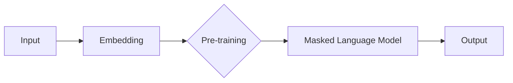
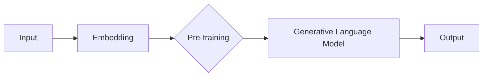

                 

# 神经网络在自然语言生成中的前沿研究

> 关键词：神经网络、自然语言生成、深度学习、预训练语言模型、生成对抗网络（GAN）、序列模型、注意力机制

> 摘要：
本文旨在探讨神经网络在自然语言生成（NLG）领域的最新研究进展。我们将首先介绍神经网络的基础知识，包括其基本概念、组成、核心原理以及不同类型的神经网络。接着，我们将深入讨论自然语言处理（NLP）中的神经网络算法原理，如深度前向传播算法、反向传播算法、梯度下降算法等。然后，我们将重点分析神经网络在NLP中的应用，如词嵌入、序列模型、注意力机制等。此外，我们还将介绍预训练语言模型BERT和GPT，并探讨自然语言生成的不同模型，如生成式模型和对抗生成模型。最后，我们将通过具体的应用案例，展示神经网络在自然语言生成中的实际应用，并对未来研究和应用进行展望。

## 第一部分：神经网络基础

### 第1章：神经网络简介

#### 1.1 神经网络的基本概念

神经网络是一种模拟人脑神经元结构和功能的计算模型。它由大量的神经元（也称为节点）通过加权连接形成网络，每个神经元可以接收来自其他神经元的输入，并通过激活函数产生输出。

神经网络的发展历程可以追溯到20世纪40年代，当时心理学家和数学家开始尝试模拟人脑的计算能力。1943年，心理学家McCulloch和数学家Pitts提出了第一个神经网络模型——MP神经元模型。随后，在1958年，Frank Rosenblatt发明了感知机模型，这是第一个具有学习能力的神经网络模型。然而，由于算法的局限性，神经网络的研究在20世纪80年代一度陷入低谷。

随着计算能力和算法的发展，神经网络在20世纪90年代后期开始复苏，尤其是深度学习（Deep Learning）的兴起，使得神经网络在图像识别、语音识别、自然语言处理等领域取得了显著的突破。

#### 1.2 神经网络的组成

神经网络由以下几部分组成：

1. **神经元**：神经网络的基本单位，负责接收输入、计算输出。
2. **层**：神经网络可以分为输入层、隐藏层和输出层。输入层接收外部输入数据，隐藏层对输入数据进行处理，输出层产生最终输出。
3. **连接权重**：神经元之间的连接具有权重，这些权重决定了输入对输出的影响程度。

#### 1.3 神经网络的核心原理

1. **激活函数**：激活函数用于决定神经元是否被激活。常见的激活函数有Sigmoid函数、ReLU函数、Tanh函数等。
2. **前向传播**：输入数据从输入层开始，通过一系列的神经元传递，直到输出层，得到最终输出。
3. **反向传播**：计算输出误差，反向传播到输入层，更新神经元权重。
4. **梯度下降**：使用梯度下降算法更新权重，以最小化损失函数。

#### 1.4 神经网络的类型

1. **全连接神经网络**：每个神经元都与其他所有神经元相连。
2. **卷积神经网络（CNN）**：适用于处理图像数据，通过卷积操作提取特征。
3. **循环神经网络（RNN）**：适用于处理序列数据，通过循环结构维护序列状态。
4. **生成对抗网络（GAN）**：由生成器和判别器组成，用于生成高逼真的数据。

### 第2章：神经网络算法原理

#### 2.1 深度前向传播算法

深度前向传播算法是神经网络的核心算法，用于计算网络的输出。其伪代码实现如下：

```python
# 输入：x（输入数据），W（权重），b（偏置），σ（激活函数）
z = σ(W · x + b)
```

其中，`·` 表示矩阵乘法，`σ` 表示激活函数。

#### 2.2 反向传播算法

反向传播算法用于计算神经网络各层的梯度，以更新权重和偏置。其伪代码实现如下：

```python
# 输入：z（输出），C（损失函数），σ'（激活函数的导数）
δ = C' · σ'(z)
```

其中，`C'` 表示损失函数的梯度，`σ'(z)` 表示激活函数的导数。

#### 2.3 梯度下降算法

梯度下降算法用于更新神经网络的权重和偏置。其伪代码实现如下：

```python
# 输入：W（权重），b（偏置），α（学习率）
W := W - α · ∂C/∂W
b := b - α · ∂C/∂b
```

其中，`∂C/∂W` 和 `∂C/∂b` 分别表示权重和偏置的梯度。

### 第3章：自然语言处理中的神经网络

#### 3.1 词嵌入

词嵌入（Word Embedding）是将单词映射到高维向量空间的技术。其伪代码实现如下：

```python
# 输入：c（单词的索引矩阵），v（向量矩阵）
e_w = ∑_{j=1}^{V} c_{ij} · v_j
```

其中，`e_w` 表示单词`w`的向量表示，`V` 表示词汇表大小。

#### 3.2 序列模型

序列模型（Sequential Model）用于处理序列数据，如文本。常见的序列模型有循环神经网络（RNN）和长短期记忆网络（LSTM）。

1. **RNN**：RNN通过循环结构维护序列状态。其伪代码实现如下：

   ```python
   # 输入：h_{t-1}（上一时刻的隐藏状态），x_t（当前时刻的输入），W_h（权重矩阵），b_h（偏置）
   h_t = σ(W_h · [h_{t-1}, x_t] + b_h)
   ```

2. **LSTM**：LSTM是RNN的一种改进，能够更好地处理长序列数据。其伪代码实现如下：

   ```python
   # 输入：h_{t-1}（上一时刻的隐藏状态），x_t（当前时刻的输入），W_i（输入门权重矩阵），b_i（输入门偏置）
   i_t = σ(W_i · [h_{t-1}, x_t] + b_i)
   ```

#### 3.3 注意力机制

注意力机制（Attention Mechanism）用于在序列模型中强调重要信息。其伪代码实现如下：

```python
# 输入：h_{t-1}（上一时刻的隐藏状态），x_t（当前时刻的输入），W_a（权重矩阵），b_a（偏置）
a_t = σ(W_a · [h_{t-1}, x_t] + b_a)
```

## 第二部分：预训练语言模型

### 第4章：预训练语言模型

#### 4.1 BERT模型

BERT（Bidirectional Encoder Representations from Transformers）是一种预训练语言模型，通过双向Transformer结构对文本进行编码。其流程图如下：



BERT的预训练过程包括两个阶段：第一阶段是 masked language model（MLM），即在输入序列中随机遮盖一些词，然后让模型预测这些词；第二阶段是 next sentence prediction（NSP），即预测两个句子是否是连续的。

#### 4.2 GPT模型

GPT（Generative Pre-trained Transformer）是一种生成式预训练语言模型，通过自回归语言模型对文本进行生成。其流程图如下：



GPT的预训练过程包括两个阶段：第一阶段是语言模型（LM），即预测下一个单词；第二阶段是上下文生成（CG），即根据输入的文本生成新的文本。

## 第三部分：自然语言生成

### 第5章：自然语言生成

#### 5.1 语言模型

语言模型（Language Model）用于预测文本序列的概率分布。其伪代码实现如下：

```python
# 输入：θ（参数），w_t（当前时刻的单词），w_{t-1}（上一时刻的单词），w_1（第一时刻的单词）
P(w_t | w_{t-1}, ..., w_1) = exp(θ · w_t) / Σ_{w'} exp(θ · w')
```

其中，`θ` 表示参数，`w_t` 表示当前时刻的单词，`w_{t-1}` 表示上一时刻的单词，`w_1` 表示第一时刻的单词。

#### 5.2 生成式模型

生成式模型（Generative Model）通过生成样本的概率分布来生成新的文本。其伪代码实现如下：

```python
# 输入：θ（参数），w_t（当前时刻的单词），w_{t-1}（上一时刻的单词），w_1（第一时刻的单词）
P(w_t | w_{t-1}, ..., w_1) = ∏_{t=1}^{T} p(w_t | w_{t-1}, ..., w_1)
```

其中，`θ` 表示参数，`w_t` 表示当前时刻的单词，`w_{t-1}` 表示上一时刻的单词，`w_1` 表示第一时刻的单词，`T` 表示文本长度。

#### 5.3 对抗生成模型

对抗生成模型（Adversarial Generative Model）通过生成器和判别器的对抗训练来生成新的文本。其伪代码实现如下：

```python
# 输入：D（判别器），G（生成器），x（真实数据），y（生成数据）
D(∅, y) = -[log D(∅) + log(1 - D(y))]
```

其中，`D` 表示判别器，`G` 表示生成器，`x` 表示真实数据，`y` 表示生成数据。

## 第四部分：神经网络在NLP中的应用案例

### 第6章：神经网络在NLP中的应用案例

#### 6.1 应用场景

神经网络在自然语言处理中有广泛的应用，包括文本分类、命名实体识别、机器翻译等。

#### 6.2 项目实战

1. **文本分类**：构建一个文本分类模型，用于判断文本的情感极性。
   - 开发环境：Python、TensorFlow
   - 数据处理：文本预处理、词嵌入、模型训练
   - 模型评估：准确率、召回率、F1分数
   - 代码解读：展示模型架构、训练过程和评估结果

2. **命名实体识别**：构建一个命名实体识别模型，用于识别文本中的命名实体。
   - 开发环境：Python、PyTorch
   - 数据处理：文本预处理、词嵌入、模型训练
   - 性能评估：准确率、召回率、F1分数
   - 应用案例分析：展示模型在不同应用场景下的表现

3. **机器翻译**：构建一个机器翻译模型，用于将一种语言的文本翻译成另一种语言。
   - 开发环境：Python、TensorFlow
   - 数据处理：文本预处理、词嵌入、模型训练
   - 翻译结果评估：BLEU分数、NIST分数
   - 实际应用场景分析：展示模型在实际应用中的效果和挑战

## 第五部分：未来展望与挑战

### 第7章：未来展望与挑战

#### 7.1 神经网络在NLP中的未来发展

随着深度学习和自然语言处理技术的不断发展，神经网络在NLP中的应用将越来越广泛。未来，我们有望看到更多先进的神经网络模型和算法，如自适应神经网络、图神经网络等。

#### 7.2 当前挑战与应对策略

当前，神经网络在NLP中面临一些挑战，如数据隐私、可解释性和能耗等。针对这些问题，研究人员正在探索各种应对策略，如联邦学习、可解释性模型和低能耗架构等。

## 附录

### 附录A：术语解释

- 神经网络：模拟人脑神经元结构和功能的计算模型。
- 深度学习：一种机器学习技术，通过多层神经网络提取特征。
- 自然语言处理：计算机处理和理解人类语言的技术。
- 预训练语言模型：在大量文本语料库上进行预训练的语言模型。
- 语言生成模型：用于生成自然语言文本的模型。
- 对抗生成模型：通过生成器和判别器的对抗训练生成数据的模型。

### 附录B：推荐阅读

- [参考书籍]
  - 《深度学习》（Goodfellow, Bengio, Courville）
  - 《自然语言处理综论》（Jurafsky, Martin）
- [参考论文]
  - BERT: Pre-training of Deep Bidirectional Transformers for Language Understanding（Devlin et al.）
  - GPT: Improving Language Understanding by Generative Pre-training（Radford et al.）

## 结语

作者：AI天才研究院/AI Genius Institute & 禅与计算机程序设计艺术 /Zen And The Art of Computer Programming

本文对神经网络在自然语言生成中的前沿研究进行了深入探讨，从基础知识到应用案例，全面展示了神经网络在NLP领域的强大能力。随着技术的不断进步，神经网络在NLP中的应用前景将更加广阔。希望本文能为您的研究和实践提供有益的启示和指导。

