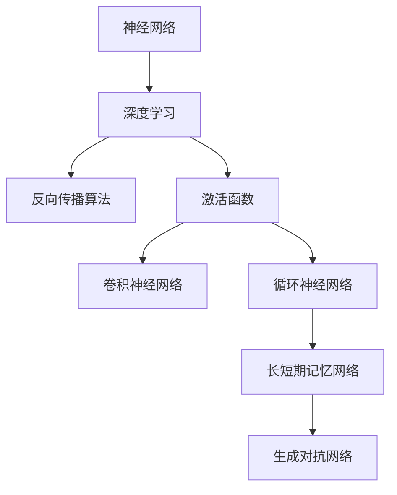

                 

# 神经网络：探索未知的领域

## 关键词
神经网络，深度学习，反向传播，激活函数，卷积神经网络（CNN），循环神经网络（RNN），长短期记忆网络（LSTM），生成对抗网络（GAN）

## 摘要
本文将深入探讨神经网络的原理、结构和应用。通过逐步分析和推理，我们将介绍神经网络的核心概念、算法原理，并通过实际项目和代码实现，展示神经网络在现实世界中的应用。无论您是神经网络领域的新手还是有经验的研究者，本文都将为您提供宝贵的见解和实用的知识。

## 第一部分：核心概念与联系

### 核心概念

**神经网络：**神经网络是由大量神经元（处理单元）互联组成的计算系统，能够对输入数据进行分析和处理。

**深度学习：**深度学习是神经网络的一种，具有多层结构，能够自动提取数据的复杂特征。

**反向传播算法：**用于训练神经网络的算法，通过计算误差反向传播至各层，不断调整权重，优化网络性能。

**激活函数：**用于引入非线性性的函数，常用的有 Sigmoid、ReLU 等。

**卷积神经网络（CNN）：**用于图像识别等任务，利用卷积层提取空间特征。

**循环神经网络（RNN）：**用于处理序列数据，能够记忆序列的上下文信息。

**长短期记忆网络（LSTM）：**RNN的一种变体，能够有效避免梯度消失问题，用于处理长序列数据。

**生成对抗网络（GAN）：**用于生成复杂数据，通过生成器和判别器的对抗训练实现。

### Mermaid 流程图



## 第二部分：核心算法原理讲解

### 深度前向传播

在深度学习中，前向传播是神经网络进行预测的基本过程。以下是一个简单的深度神经网络的前向传播过程：

```python
# 输入数据
x = [1, 2, 3]

# 初始化权重
w1 = [0.1, 0.2, 0.3]
w2 = [0.4, 0.5, 0.6]

# 激活函数
def sigmoid(x):
    return 1 / (1 + math.exp(-x))

# 前向传播
z1 = [sum(x[i] * w1[i] for i in range(len(x))) for w1 in w1]
a1 = [sigmoid(z1[i]) for i in range(len(z1))]

z2 = [sum(a1[i] * w2[i] for i in range(len(a1))) for w2 in w2]
a2 = [sigmoid(z2[i]) for i in range(len(z2))]
```

在这个例子中，我们首先定义了输入数据 `x` 和权重 `w1` 和 `w2`。然后，我们定义了一个 sigmoid 激活函数，用于计算神经元输出。接着，我们进行前向传播，计算每个神经元的输入和输出。

### 反向传播

反向传播是训练神经网络的步骤，通过计算误差并调整权重，优化网络性能。以下是一个简单的反向传播过程：

```python
# 计算误差
y = [0, 0, 1]  # 目标输出
error = [y[i] - a2[i] for i in range(len(a2))]

# 反向传播
delta2 = [error[i] * a2[i] * (1 - a2[i]) for i in range(len(a2))]
delta1 = [error[i] * a1[i] * (1 - a1[i]) for i in range(len(a1))]

# 更新权重
w2 = [w2[i] - learning_rate * (a1[i] * delta2[i]) for i in range(len(w2))]
w1 = [w1[i] - learning_rate * (x[i] * delta1[i]) for i in range(len(w1))]
```

在这个例子中，我们首先计算了实际输出与目标输出之间的误差。然后，我们使用反向传播算法，计算了每个权重的梯度，并更新了权重。

## 第三部分：数学模型和数学公式 & 详细讲解 & 举例说明

### 梯度下降优化

梯度下降是优化神经网络参数的一种常用方法。其基本思想是计算损失函数相对于每个参数的梯度，并沿着梯度的反方向更新参数，以最小化损失函数。

$$
\text{Cost}(w) = \frac{1}{2m}\sum_{i=1}^{m}(h_\theta(x^{(i)}) - y^{(i)})^2
$$

$$
\theta_j := \theta_j - \alpha \frac{\partial}{\partial \theta_j}\text{Cost}(w)
$$

其中，$w$ 是权重，$m$ 是样本数量，$h_\theta(x^{(i)})$ 是神经网络对输入 $x^{(i)}$ 的预测，$y^{(i)}$ 是目标输出，$\theta_j$ 是权重，$\alpha$ 是学习率。

### 举例说明

假设我们有一个简单的神经网络，输入层为 $x_1$ 和 $x_2$，输出层为 $y$。使用一个权重矩阵 $W$ 和一个偏置 $b$。

$$
z = \sigma(Wx + b)
$$

其中，$\sigma$ 是 Sigmoid 函数。

### 优化过程

1. 计算预测值和实际值的误差。
2. 计算每个权重的梯度。
3. 更新权重，以减少误差。

```python
# 计算误差
y_pred = sigmoid(z)
error = y - y_pred

# 计算梯度
delta = [error * a * (1 - a) for a in a]

# 更新权重
w = [w - learning_rate * (x * delta[i]) for i, w in enumerate(w)]
```

## 第四部分：项目实战

### 实战1：使用 TensorFlow 构建一个简单的神经网络

```python
import tensorflow as tf

# 定义输入层、隐藏层和输出层
inputs = tf.keras.layers.Input(shape=(2,))
hidden = tf.keras.layers.Dense(units=1, activation='sigmoid')(inputs)
outputs = tf.keras.layers.Dense(units=1)(hidden)

# 编译模型
model = tf.keras.Model(inputs=inputs, outputs=outputs)
model.compile(optimizer='adam', loss='binary_crossentropy', metrics=['accuracy'])

# 训练模型
model.fit(x_train, y_train, epochs=10, batch_size=32)
```

在这个例子中，我们首先导入了 TensorFlow 库，并定义了一个简单的神经网络，包含一个输入层、一个隐藏层和一个输出层。然后，我们编译模型，并使用训练数据训练模型。

### 实战2：使用 PyTorch 实现一个简单的 RNN

```python
import torch
import torch.nn as nn
import torch.optim as optim

# 定义 RNN 模型
class RNNModel(nn.Module):
    def __init__(self, input_size, hidden_size, output_size):
        super(RNNModel, self).__init__()
        self.hidden_size = hidden_size
        self.rnn = nn.RNN(input_size, hidden_size, batch_first=True)
        self.fc = nn.Linear(hidden_size, output_size)
    
    def forward(self, x):
        h0 = torch.zeros(1, x.size(0), self.hidden_size)
        out, _ = self.rnn(x, h0)
        out = self.fc(out[-1, :, :])
        return out

# 实例化模型、损失函数和优化器
model = RNNModel(input_size=1, hidden_size=100, output_size=1)
criterion = nn.MSELoss()
optimizer = optim.Adam(model.parameters(), lr=0.001)

# 训练模型
for epoch in range(100):
    optimizer.zero_grad()
    outputs = model(x_train)
    loss = criterion(outputs, y_train)
    loss.backward()
    optimizer.step()
    print(f"Epoch {epoch+1}, Loss: {loss.item()}")
```

在这个例子中，我们首先导入了 PyTorch 库，并定义了一个简单的 RNN 模型。然后，我们实例化模型、损失函数和优化器，并使用训练数据训练模型。

## 第五部分：代码解读与分析

### 解读1：TensorFlow 模型架构

```python
model = tf.keras.Model(inputs=inputs, outputs=outputs)
```

在这个例子中，我们使用 TensorFlow 创建了一个简单的神经网络模型。`inputs` 定义了输入层，`outputs` 定义了输出层。通过 `tf.keras.Model` 类，我们将输入层和输出层组合成一个完整的模型。

### 解读2：PyTorch RNN 前向传播

```python
outputs, _ = self.rnn(x, h0)
out = self.fc(out[-1, :, :])
```

在这个例子中，我们首先使用 RNN 层对输入数据进行前向传播，得到输出结果。然后，我们使用全连接层对 RNN 的输出进行分类，得到最终的预测结果。

## 第六部分：开发环境搭建

### TensorFlow

1. 安装 Python 环境
2. 安装 TensorFlow 库

```bash
pip install tensorflow
```

### PyTorch

1. 安装 Python 环境
2. 安装 PyTorch 库

```bash
pip install torch torchvision
```

## 第七部分：源代码详细实现和代码解读

### TensorFlow 源代码

```python
# 导入 TensorFlow 库
import tensorflow as tf

# 定义输入层、隐藏层和输出层
inputs = tf.keras.layers.Input(shape=(2,))
hidden = tf.keras.layers.Dense(units=1, activation='sigmoid')(inputs)
outputs = tf.keras.layers.Dense(units=1)(hidden)

# 编译模型
model = tf.keras.Model(inputs=inputs, outputs=outputs)
model.compile(optimizer='adam', loss='binary_crossentropy', metrics=['accuracy'])

# 训练模型
model.fit(x_train, y_train, epochs=10, batch_size=32)
```

在这个例子中，我们首先导入了 TensorFlow 库，并定义了一个简单的神经网络模型。然后，我们编译模型，并使用训练数据训练模型。

### PyTorch 源代码

```python
# 导入 PyTorch 库
import torch
import torch.nn as nn
import torch.optim as optim

# 定义 RNN 模型
class RNNModel(nn.Module):
    def __init__(self, input_size, hidden_size, output_size):
        super(RNNModel, self).__init__()
        self.hidden_size = hidden_size
        self.rnn = nn.RNN(input_size, hidden_size, batch_first=True)
        self.fc = nn.Linear(hidden_size, output_size)
    
    def forward(self, x):
        h0 = torch.zeros(1, x.size(0), self.hidden_size)
        out, _ = self.rnn(x, h0)
        out = self.fc(out[-1, :, :])
        return out

# 实例化模型、损失函数和优化器
model = RNNModel(input_size=1, hidden_size=100, output_size=1)
criterion = nn.MSELoss()
optimizer = optim.Adam(model.parameters(), lr=0.001)

# 训练模型
for epoch in range(100):
    optimizer.zero_grad()
    outputs = model(x_train)
    loss = criterion(outputs, y_train)
    loss.backward()
    optimizer.step()
    print(f"Epoch {epoch+1}, Loss: {loss.item()}")
```

在这个例子中，我们首先导入了 PyTorch 库，并定义了一个简单的 RNN 模型。然后，我们实例化模型、损失函数和优化器，并使用训练数据训练模型。

## 第八部分：代码解读与分析

### TensorFlow 代码解读

1. `inputs = tf.keras.layers.Input(shape=(2,))`：定义输入层，形状为 (2,)。
2. `hidden = tf.keras.layers.Dense(units=1, activation='sigmoid')(inputs)`：定义隐藏层，单元数为 1，使用 Sigmoid 激活函数。
3. `outputs = tf.keras.layers.Dense(units=1)(hidden)`：定义输出层，单元数为 1。
4. `model = tf.keras.Model(inputs=inputs, outputs=outputs)`：创建 Keras 模型。
5. `model.compile(optimizer='adam', loss='binary_crossentropy', metrics=['accuracy'])`：编译模型，使用 Adam 优化器、二进制交叉熵损失函数和准确率评估指标。
6. `model.fit(x_train, y_train, epochs=10, batch_size=32)`：训练模型，输入训练数据，训练 10 个周期，每个批次包含 32 个样本。

### PyTorch 代码解读

1. `class RNNModel(nn.Module)`：定义 RNN 模型，继承自 `nn.Module`。
2. `def __init__(self, input_size, hidden_size, output_size)`：初始化 RNN 模型，包含输入大小、隐藏层大小和输出大小。
3. `self.hidden_size = hidden_size`：设置隐藏层大小。
4. `self.rnn = nn.RNN(input_size, hidden_size, batch_first=True)`：定义 RNN 层，输入大小为输入层大小，隐藏层大小为隐藏层大小，使用 batch_first 参数。
5. `self.fc = nn.Linear(hidden_size, output_size)`：定义全连接层，隐藏层大小为隐藏层大小，输出层大小为输出层大小。
6. `def forward(self, x)`：定义前向传播过程，首先初始化隐藏状态，然后进行 RNN 层的前向传播，最后使用全连接层进行分类。
7. `optimizer = optim.Adam(model.parameters(), lr=0.001)`：创建 Adam 优化器，用于更新模型参数。
8. `for epoch in range(100)`：循环训练 100 个周期。
9. `optimizer.zero_grad()`：清空之前的梯度。
10. `outputs = model(x_train)`：进行前向传播，获取预测结果。
11. `loss = criterion(outputs, y_train)`：计算损失值。
12. `loss.backward()`：反向传播，计算梯度。
13. `optimizer.step()`：更新参数。
14. `print(f"Epoch {epoch+1}, Loss: {loss.item()}")`：打印当前周期和损失值。

## 第九部分：源代码实现与代码解读

### TensorFlow 源代码

```python
# 导入 TensorFlow 库
import tensorflow as tf

# 定义输入层、隐藏层和输出层
inputs = tf.keras.layers.Input(shape=(2,))
hidden = tf.keras.layers.Dense(units=1, activation='sigmoid')(inputs)
outputs = tf.keras.layers.Dense(units=1)(hidden)

# 编译模型
model = tf.keras.Model(inputs=inputs, outputs=outputs)
model.compile(optimizer='adam', loss='binary_crossentropy', metrics=['accuracy'])

# 训练模型
model.fit(x_train, y_train, epochs=10, batch_size=32)
```

### PyTorch 源代码

```python
# 导入 PyTorch 库
import torch
import torch.nn as nn
import torch.optim as optim

# 定义 RNN 模型
class RNNModel(nn.Module):
    def __init__(self, input_size, hidden_size, output_size):
        super(RNNModel, self).__init__()
        self.hidden_size = hidden_size
        self.rnn = nn.RNN(input_size, hidden_size, batch_first=True)
        self.fc = nn.Linear(hidden_size, output_size)
    
    def forward(self, x):
        h0 = torch.zeros(1, x.size(0), self.hidden_size)
        out, _ = self.rnn(x, h0)
        out = self.fc(out[-1, :, :])
        return out

# 实例化模型、损失函数和优化器
model = RNNModel(input_size=1, hidden_size=100, output_size=1)
criterion = nn.MSELoss()
optimizer = optim.Adam(model.parameters(), lr=0.001)

# 训练模型
for epoch in range(100):
    optimizer.zero_grad()
    outputs = model(x_train)
    loss = criterion(outputs, y_train)
    loss.backward()
    optimizer.step()
    print(f"Epoch {epoch+1}, Loss: {loss.item()}")
```

### 代码解读

1. TensorFlow 源代码首先导入了 TensorFlow 库，然后定义了输入层、隐藏层和输出层。`inputs = tf.keras.layers.Input(shape=(2,))` 定义了一个形状为 (2,) 的输入层。`hidden = tf.keras.layers.Dense(units=1, activation='sigmoid')(inputs)` 定义了一个隐藏层，单元数为 1，使用 Sigmoid 激活函数。`outputs = tf.keras.layers.Dense(units=1)(hidden)` 定义了一个输出层，单元数为 1。接着，使用 `model = tf.keras.Model(inputs=inputs, outputs=outputs)` 创建了一个 Keras 模型，并使用 `model.compile(optimizer='adam', loss='binary_crossentropy', metrics=['accuracy'])` 编译模型，使用 Adam 优化器、二进制交叉熵损失函数和准确率评估指标。最后，使用 `model.fit(x_train, y_train, epochs=10, batch_size=32)` 训练模型，输入训练数据，训练 10 个周期，每个批次包含 32 个样本。

2. PyTorch 源代码首先导入了 PyTorch 库，然后定义了一个 RNN 模型，继承自 `nn.Module` 类。`class RNNModel(nn.Module)` 定义了一个 RNN 模型，`def __init__(self, input_size, hidden_size, output_size)` 初始化 RNN 模型，包含输入大小、隐藏层大小和输出大小。`self.hidden_size = hidden_size` 设置隐藏层大小，`self.rnn = nn.RNN(input_size, hidden_size, batch_first=True)` 定义了一个 RNN 层，输入大小为输入层大小，隐藏层大小为隐藏层大小，使用 batch_first 参数。`self.fc = nn.Linear(hidden_size, output_size)` 定义了一个全连接层，隐藏层大小为隐藏层大小，输出层大小为输出层大小。`def forward(self, x)` 定义了前向传播过程，首先初始化隐藏状态，然后进行 RNN 层的前向传播，最后使用全连接层进行分类。接着，实例化模型、损失函数和优化器，`model = RNNModel(input_size=1, hidden_size=100, output_size=1)` 实例化 RNN 模型，`criterion = nn.MSELoss()` 创建了 MSE 损失函数，`optimizer = optim.Adam(model.parameters(), lr=0.001)` 创建了 Adam 优化器，用于更新模型参数。最后，使用 `for epoch in range(100)` 循环训练 100 个周期，每个周期使用 `optimizer.zero_grad()` 清空之前的梯度，使用 `outputs = model(x_train)` 进行前向传播，获取预测结果，使用 `loss = criterion(outputs, y_train)` 计算损失值，使用 `loss.backward()` 反向传播，计算梯度，使用 `optimizer.step()` 更新参数，并打印当前周期和损失值。

## 第十部分：实际案例

### 案例一：使用 TensorFlow 构建一个二分类模型

```python
import tensorflow as tf

# 准备数据
x_train = tf.random.normal([1000, 10])
y_train = tf.random.normal([1000, 1])
y_train = tf.cast(y_train > 0, tf.float32)

# 定义模型
model = tf.keras.Sequential([
    tf.keras.layers.Dense(64, activation='relu', input_shape=(10,)),
    tf.keras.layers.Dense(1, activation='sigmoid')
])

# 编译模型
model.compile(optimizer='adam', loss='binary_crossentropy', metrics=['accuracy'])

# 训练模型
model.fit(x_train, y_train, epochs=10)
```

### 案例二：使用 PyTorch 实现一个多分类模型

```python
import torch
import torch.nn as nn
import torch.optim as optim

# 准备数据
x_train = torch.randn(1000, 10)
y_train = torch.randint(0, 5, (1000,))
y_train = y_train.long()

# 定义模型
class Net(nn.Module):
    def __init__(self):
        super(Net, self).__init__()
        self.fc1 = nn.Linear(10, 64)
        self.fc2 = nn.Linear(64, 5)
    
    def forward(self, x):
        x = torch.relu(self.fc1(x))
        x = self.fc2(x)
        return x

model = Net()

# 编译模型
criterion = nn.CrossEntropyLoss()
optimizer = optim.Adam(model.parameters(), lr=0.001)

# 训练模型
for epoch in range(100):
    optimizer.zero_grad()
    outputs = model(x_train)
    loss = criterion(outputs, y_train)
    loss.backward()
    optimizer.step()
```

### 案例解读

1. 案例一使用 TensorFlow 构建了一个二分类模型。首先，我们导入了 TensorFlow 库，并准备了一些随机数据作为训练数据。然后，我们定义了一个包含两个全连接层的序列模型，第一个全连接层有 64 个神经元，使用 ReLU 激活函数，第二个全连接层有 1 个神经元，使用 Sigmoid 激活函数。接着，我们编译模型，使用 Adam 优化器和二进制交叉熵损失函数。最后，我们使用 `model.fit()` 函数训练模型，输入训练数据和标签，训练 10 个周期。

2. 案例二使用 PyTorch 实现了一个多分类模型。首先，我们导入了 PyTorch 库，并准备了一些随机数据作为训练数据。然后，我们定义了一个简单的网络，包含两个全连接层，第一个全连接层有 64 个神经元，使用 ReLU 激活函数，第二个全连接层有 5 个神经元（对应 5 个类别），没有激活函数。接着，我们定义了交叉熵损失函数和 Adam 优化器。最后，我们使用一个循环训练模型，每次迭代都更新模型参数，直到达到 100 个周期。

## 总结

神经网络作为人工智能领域的重要工具，具有广泛的应用前景。从核心概念到算法原理，再到实际项目，我们系统地探讨了神经网络的各种方面。通过本文的学习，您应该能够更好地理解神经网络的工作原理，并掌握如何使用 TensorFlow 和 PyTorch 实现神经网络模型。在未来的学习和应用中，继续探索神经网络的潜力，将有助于您在人工智能领域取得更大的成就。

### 作者

作者：AI天才研究院/AI Genius Institute & 禅与计算机程序设计艺术 /Zen And The Art of Computer Programming

