                 

### 第1章: 科学研究的创新生态系统概述

> **关键词：** 科学研究、创新生态系统、创新主体、资源分配、技术创新

科学研究的创新生态系统是一个复杂而动态的系统，它涉及多个创新主体、多种创新要素以及多样的创新活动。在这个生态系统中，各主体之间通过协作、资源共享和创新驱动，共同推动科学研究和技术的进步。

#### 1.1 创新生态系统的概念

**定义**：创新生态系统是指一种由多种创新主体、创新要素和创新活动共同构成的综合体，旨在通过协同合作、资源共享和创新驱动，促进科学研究和技术进步。

- **创新主体**：包括科研机构、企业、政府、投资机构、高校、社会组织等。
- **创新要素**：如实验室、数据、技术、资金、人才等。
- **创新活动**：包括科学研究、技术创新、成果转化等。

**组成**：创新生态系统由多个组成部分构成，包括：

- **科研机构**：如大学、研究所等，提供前沿科学技术研究。
- **企业**：是创新成果转化的主体，通过市场需求引导技术创新。
- **政府**：制定政策法规，提供资金支持，保障创新生态系统的健康发展。
- **投资机构**：为创新项目提供融资支持，促进创新成果的转化和应用。
- **高校**：培养创新人才，提供研究资源和平台。
- **社会组织**：提供创新服务，如技术咨询、知识产权保护等。

**核心**：创新生态系统的核心在于各主体之间的协同合作与资源共享，形成创新资源共享和成果转化的网络，从而提高科学研究和技术创新的效率。

#### 1.2 创新生态系统的关键要素

创新生态系统的成功离不开以下关键要素：

- **科研机构**：作为创新生态系统的核心动力，科研机构提供前沿科学技术研究。例如，美国的国家实验室系统（National Laboratory System）通过集中化研究和资源共享，推动了众多科学技术的突破。

- **企业**：企业是创新成果转化的主体，通过市场需求引导技术创新。例如，谷歌的“Google Brain”项目通过企业内部的研究与开发，推动了人工智能技术的迅速发展。

- **政府**：政府通过制定政策法规、提供资金支持和基础设施建设等手段，保障创新生态系统的健康发展。例如，中国政府推出的“互联网+”行动计划，通过政策支持，促进了互联网与各行业的深度融合。

- **投资机构**：投资机构为创新项目提供融资支持，促进创新成果的转化和应用。例如，硅谷的风险投资公司通过投资初创企业，推动了互联网、生物技术等行业的快速发展。

- **高校**：高校作为人才培养和知识传播的重要基地，为创新生态系统提供智力支持。例如，哈佛大学、麻省理工学院等世界顶级高校通过科研成果转化，推动了科技创新和产业升级。

- **社会组织**：社会组织如行业协会、技术转移中心等，提供创新服务，如技术咨询、知识产权保护等。例如，美国国家标准与技术研究院（NIST）通过提供技术标准和测试服务，促进了技术创新和产业发展。

#### 1.3 创新生态系统的建设意义

建设创新生态系统具有重要意义，具体体现在以下几个方面：

- **提高科学研究效率**：通过创新生态系统的资源共享和协同合作，可以加速科学研究的进展。例如，跨国科研合作项目通过共享数据和资源，加快了基因组学、量子计算等领域的研究进度。

- **促进技术创新**：企业需求引导下的技术创新，更贴近市场和应用。例如，苹果公司通过将用户反馈和市场需求融入产品研发，推动了智能手机、平板电脑等产品的创新。

- **推动产业升级**：创新生态系统能够为企业提供持续创新的动力，推动产业结构的优化升级。例如，德国的工业4.0计划通过智能制造、大数据等技术，推动了传统制造业的升级。

- **增强国家竞争力**：创新生态系统能够提升国家的科技水平和创新能力，增强国际竞争力。例如，以色列作为一个小国，通过构建强大的创新生态系统，成为全球创新的重要力量。

### 第2章: 创新生态系统的理论基础

> **关键词：** 系统论、生态系统理论、创新网络理论

创新生态系统的构建需要坚实的理论基础来支撑，这些理论包括系统论、生态系统理论和创新网络理论等。这些理论不仅为创新生态系统的构建提供了理论框架，也为我们理解其运作机制提供了深刻的洞察。

#### 2.1 系统论

系统论是研究系统性质、结构和行为的科学。系统论的基本概念包括系统、要素、结构、功能和环境等。

- **系统**：系统是由若干相互关联、相互作用的要素组成的整体。在创新生态系统中，系统是指科研机构、企业、政府、高校、投资机构等各个创新主体及其相互关系构成的复杂网络。
  
- **要素**：要素是构成系统的基本组成部分。在创新生态系统中，要素包括科研资源、人力资源、技术资源、资金资源等。

- **结构**：结构是系统中各个要素之间的相互关系和组织形式。在创新生态系统中，结构是指科研机构、企业、高校等创新主体之间的合作模式、资源共享机制、信息流动渠道等。

- **功能**：功能是系统所执行的任务或目标。在创新生态系统中，功能包括科学研究、技术创新、成果转化、人才培养等。

- **环境**：环境是指系统外部的各种条件和影响因素。在创新生态系统中，环境包括政策环境、市场环境、社会文化环境等。

系统论应用于创新生态系统时，强调创新生态系统的整体性、有序性和适应性。整体性是指系统的各个组成部分相互依赖、相互影响，共同实现系统的整体目标。有序性是指系统的各个组成部分按照一定的规律和规则组织起来，形成有序的结构。适应性是指系统能够根据外部环境的变化，调整内部结构，实现系统的持续发展和优化。

#### 2.2 生态系统理论

生态系统理论是研究生态系统中生物之间相互作用及其与环境相互作用的科学。生态系统理论的基本概念包括生态位、食物链、物种多样性和生态系统服务等。

- **生态位**：生态位是指一个物种在生态系统中所占据的位置，包括物种的生存空间、食物来源、生态功能等。在创新生态系统中，生态位可以类比为各个创新主体在创新网络中的角色和功能。

- **食物链**：食物链是指生态系统中不同生物之间通过食物关系形成的链条。在创新生态系统中，食物链可以类比为创新主体之间的合作与互动关系，如科研机构与企业之间的研发合作、企业与高校之间的产学研合作等。

- **物种多样性**：物种多样性是指生态系统中不同物种的数量和种类。在创新生态系统中，物种多样性可以类比为创新生态系统中不同创新主体和不同创新要素的多样性，如科研机构、企业、高校、投资机构、社会组织等。

- **生态系统服务**：生态系统服务是指生态系统为人类提供的各种功能和服务，如生物多样性保护、水资源管理、气候调节等。在创新生态系统中，生态系统服务可以类比为创新生态系统为科学研究和技术进步提供的各种支持和服务，如资源共享、人才培养、政策支持等。

将生态系统理论引入创新生态系统中，可以强调创新主体之间的相互作用和相互依赖，以及创新生态系统与外部环境的相互作用。通过分析创新主体之间的网络关系和互动机制，可以优化创新生态系统的结构，提升创新效率和成果转化率。

#### 2.3 创新网络理论

创新网络理论是研究创新主体之间相互联系和合作关系的科学。创新网络理论的基本概念包括节点、边、网络结构和网络密度等。

- **节点**：节点是指创新网络中的各个创新主体，如科研机构、企业、高校等。

- **边**：边是指节点之间的连接关系，表示创新主体之间的合作和互动。

- **网络结构**：网络结构是指创新网络中节点和边的组织形式和关系。

- **网络密度**：网络密度是指网络中边的数量与可能的最大边数之比，表示网络的连接紧密程度。

在创新网络理论中，通过分析创新主体之间的网络关系，可以揭示创新生态系统的结构特征和运行规律。例如，可以通过网络密度来衡量创新生态系统中的合作紧密程度，通过聚类分析来识别创新生态系统中的关键节点和核心子网络。

创新网络理论应用于创新生态系统时，可以通过优化网络结构，提升创新网络的效率和稳定性。例如，通过增加节点之间的连接关系，可以促进创新资源的共享和流动，提升创新生态系统的整体创新能力。

### 第3章: 创新生态系统的核心机制

> **关键词：** 创新驱动、资源共享、成果转化

创新生态系统的核心机制包括创新驱动机制、资源共享机制和成果转化机制。这些机制共同作用，推动创新生态系统的持续发展和优化。

#### 3.1 创新驱动机制

创新驱动机制是指通过创新活动驱动科学研究和技术进步的机制。创新驱动机制的实现途径主要包括以下几个方面：

- **加强科研投入**：增加科研资金投入，提高科研机构的研发能力。例如，美国的国家科学基金会（NSF）通过提供巨额科研经费，支持高校和科研机构进行前沿科学研究。

- **推动科技成果转化**：建立科技成果转化平台，促进科研成果向实际应用转化。例如，中国的科技部通过建立国家科技成果转化引导基金，支持企业将科研成果转化为实际产品。

- **构建创新平台**：建立创新平台，提供科研设施、技术支持、市场对接等服务。例如，中国的国家高新技术产业开发区通过提供研发平台、孵化器等，支持创新创业。

- **推动政策创新**：制定有利于创新的政策措施，提供政策支持和激励。例如，德国的“工业4.0”计划通过提供税收优惠、资金支持等政策，鼓励企业进行技术创新。

#### 3.2 资源共享机制

资源共享机制是指通过共享创新资源，实现资源优化配置和效率提升的机制。资源共享机制的实现途径主要包括以下几个方面：

- **建立共享平台**：建立创新资源共享平台，提供科研设备、实验室、技术数据库等资源。例如，中国的科技资源共享平台通过提供在线预约、资源共享等功能，促进科研资源的共享和利用。

- **推动资源共享协议**：签订资源共享协议，明确各方的权利和义务，保障资源共享的顺利进行。例如，跨国科研合作项目通过签订资源共享协议，实现科研数据的共享和交换。

- **加强数据共享**：推动数据共享，提高数据的开放性和可获取性。例如，美国的国家生物技术信息中心（NCBI）通过提供在线数据库，为全球科学家提供生物技术数据。

- **优化资源分配**：通过政策引导和市场化手段，优化创新资源的分配，提高资源利用效率。例如，中国的科技部通过制定资源分配政策，支持优质科研资源向优势地区和优势学科集中。

#### 3.3 成果转化机制

成果转化机制是指将科学研究和技术创新转化为实际应用和商业价值的机制。成果转化机制的实现途径主要包括以下几个方面：

- **加强产学研合作**：推动产学研合作，实现科技创新与产业需求的对接。例如，中国的教育部通过推动高校与企业的产学研合作，促进科研成果的产业化。

- **建立技术转移平台**：建立技术转移平台，提供科技成果转化服务。例如，中国的国家技术转移中心通过提供技术评估、技术转让、技术咨询等服务，促进科技成果的转化。

- **推动创新政策**：制定和完善创新政策，提供资金支持、税收优惠等政策，鼓励企业进行科技成果转化。例如，中国的财政部通过提供创新基金、研发补贴等政策，支持企业进行科技成果转化。

- **促进人才培养**：培养创新人才，提高科技成果转化的能力。例如，中国的教育部通过推动高校与企业联合培养人才，提高企业科技成果转化的能力。

### 第4章: 创新生态系统案例分析

> **关键词：** 美国硅谷、中国深圳、创新生态系统、成功经验

在全球范围内，一些地区通过构建高效的创新生态系统，取得了显著的科技创新成果。以下将对美国硅谷和中国深圳两个典型的创新生态系统进行分析，探讨其成功经验。

#### 4.1 美国硅谷

**背景与特点**

美国硅谷是全球科技创新的标志之一，以其独特的创新生态系统而闻名。硅谷的创新生态系统主要由以下几个特点构成：

- **强大的科研力量**：硅谷拥有众多世界顶级的研究机构和大学，如斯坦福大学、加州大学伯克利分校等，这些机构为科技创新提供了强大的科研支持。

- **企业的创新活力**：硅谷聚集了众多高科技企业，如谷歌、苹果、Facebook等，这些企业以其创新的产品和服务推动了全球科技的进步。

- **风险投资的支持**：硅谷拥有丰富的风险投资资源，风险投资公司对创新项目的支持，使得硅谷的企业能够持续进行技术创新。

- **开放的创新文化**：硅谷倡导开放的创新文化，鼓励创新和风险承担，为科技创新提供了良好的环境。

**成功经验**

硅谷的创新生态系统的成功经验主要体现在以下几个方面：

- **政府与市场的结合**：政府在硅谷创新生态系统中发挥了重要的引导和支持作用，同时，市场机制在资源配置中发挥了决定性作用。

- **产学研紧密结合**：硅谷的大学、科研机构和企业之间的紧密合作，使得科技创新与市场需求紧密结合，促进了科技成果的转化。

- **风险投资的引导**：风险投资公司对创新项目的支持，降低了创新企业的融资成本，推动了企业持续进行技术创新。

- **创新文化的培育**：硅谷的创新文化鼓励创新和冒险，使得科技创新成为硅谷的核心竞争力。

#### 4.2 中国深圳

**背景与特点**

中国深圳是中国改革开放的重要窗口，也是中国科技创新的重要基地。深圳的创新生态系统具有以下几个特点：

- **政策环境的支持**：中国政府通过一系列政策措施，支持深圳的科技创新，如设立高新技术产业开发区、提供财政支持等。

- **企业的创新主体地位**：深圳的企业在科技创新中发挥了主体作用，如华为、腾讯等企业在全球范围内具有强大的科技创新能力。

- **产业链的完整**：深圳拥有完整的产业链，从研发、生产到销售，形成了良好的创新生态体系。

- **市场化导向**：深圳强调市场化导向，通过市场化手段优化资源配置，推动科技创新。

**成功经验**

深圳的创新生态系统的成功经验主要体现在以下几个方面：

- **政策环境的优化**：政府通过制定一系列政策措施，优化创新环境，提供资金支持，吸引科技创新人才和企业。

- **产业链的完善**：通过产业链的完善，深圳形成了从研发、生产到销售的完整创新生态系统。

- **企业创新能力的提升**：深圳的企业通过持续的研发投入和技术创新，提升了企业的核心竞争力。

- **市场化导向的资源配置**：深圳通过市场化手段优化资源配置，提高了科技创新的效率。

### 第5章: 构建高效的创新生态系统

> **关键词：** 政府、企业、科研机构、政策支持、资源配置

构建高效的创新生态系统需要政府、企业、科研机构等各方的共同努力，通过政策支持、资源配置、人才培养等手段，优化创新生态系统的结构，提升创新效率和成果转化率。

#### 5.1 政府角色与政策支持

政府在构建创新生态系统中扮演着关键角色，其作用主要体现在以下几个方面：

- **政策制定**：政府制定有利于创新发展的政策，提供资金支持和税收优惠，为创新生态系统的发展提供政策保障。例如，中国政府通过制定“科技创新2030—重大项目”等政策，推动科技创新和产业发展。

- **公共服务**：政府提供创新平台、知识产权保护、技术咨询等公共服务，为创新主体提供支持。例如，中国政府通过建立国家高新技术产业开发区、国家科技成果转化引导基金等，为创新主体提供公共服务。

- **资源配置**：政府通过财政投入、税收优惠、金融支持等手段，优化创新资源的配置，提高创新效率。例如，中国政府通过设立科技创新基金、提供税收减免等政策，引导资源向科技创新领域集中。

#### 5.2 企业角色与作用

企业在创新生态系统中扮演着重要角色，其作用主要体现在以下几个方面：

- **技术创新**：企业通过持续的研发投入和技术创新，推动产业升级和经济发展。例如，华为公司通过持续的研发投入，在全球范围内取得了显著的科技创新成果。

- **成果转化**：企业通过将科研成果转化为实际应用，实现科技创新的商业价值。例如，腾讯公司通过将科研成果应用于游戏、社交、金融等领域，实现了科技创新的商业化。

- **合作与共享**：企业通过与其他创新主体合作，实现资源共享和优势互补，提高创新效率。例如，谷歌公司通过开放技术和资源共享，推动了全球技术创新。

#### 5.3 科研机构的作用

科研机构在创新生态系统中发挥着基础和引领作用，其作用主要体现在以下几个方面：

- **前沿研究**：科研机构开展前沿科学技术研究，为创新生态系统提供科学基础和技术支撑。例如，美国的国家实验室系统通过开展基础科学研究，推动了量子计算、人工智能等领域的发展。

- **人才培养**：科研机构培养创新人才，为创新生态系统提供智力支持。例如，中国的清华大学、北京大学等高校通过培养高水平人才，为科技创新提供了强大的人力资源。

- **科研平台**：科研机构提供科研平台和设施，为创新主体提供支持。例如，中国的国家重点实验室、国家工程技术研究中心等，为创新主体提供了先进的科研条件。

### 第6章: 创新生态系统中的挑战与应对

> **关键词：** 创新能力、资源分布、政策环境、应对策略

尽管创新生态系统在推动科技创新和经济发展方面取得了显著成效，但仍然面临诸多挑战。以下将分析创新生态系统中的主要挑战，并提出相应的应对策略。

#### 6.1 创新能力不足

**原因分析**：

- **科研设施和人才短缺**：部分创新主体缺乏先进的科研设施和高端人才，导致创新能力不足。

- **科研投入不足**：部分地区和企业科研投入不足，难以支撑高水平的科学研究和技术创新。

- **创新环境不完善**：部分地区的创新环境不完善，缺乏有效的激励机制和政策支持，限制了创新能力的提升。

**应对策略**：

- **增加科研投入**：政府和企业应增加科研投入，提高科研机构的研发能力。

- **引进高端人才**：通过人才引进政策，吸引国内外高端人才，提升科研队伍的整体水平。

- **优化创新环境**：制定和完善创新政策，提供资金支持、税收优惠等激励措施，营造良好的创新氛围。

#### 6.2 资源分布不均

**原因分析**：

- **地区差异**：不同地区的创新资源分布不均，部分地区的创新资源相对丰富，而部分地区的创新资源匮乏。

- **产业差异**：不同产业之间的创新资源分配不均，部分产业得到大量资源支持，而部分产业缺乏足够的资源投入。

- **主体差异**：不同创新主体之间的资源分配不均，部分创新主体拥有丰富的资源，而部分创新主体资源匮乏。

**应对策略**：

- **政策引导**：政府通过政策引导，优化创新资源的分配，支持资源匮乏的地区和产业。

- **资源共享**：建立资源共享平台，促进创新资源的共享和流动，提高资源利用效率。

- **市场化配置**：通过市场化手段，引导资源向高价值、高需求的领域和主体集中，实现资源的合理配置。

#### 6.3 政策环境不完善

**原因分析**：

- **政策制定滞后**：部分地区的创新政策制定滞后，难以适应快速变化的科技创新需求。

- **政策执行不力**：部分地区的创新政策执行不力，缺乏有效的监督和评估机制，导致政策效果不佳。

- **政策不一致**：部分地区的创新政策存在不一致性，导致创新主体在跨地区合作时面临政策障碍。

**应对策略**：

- **完善政策体系**：政府应完善创新政策体系，制定前瞻性、可持续的创新政策。

- **加强政策执行**：建立健全政策执行机制，提高政策执行的效率和效果。

- **政策协调**：加强地区之间的政策协调，消除创新政策不一致带来的障碍，促进创新资源的跨区域流动。

### 第7章: 未来创新生态系统的展望

> **关键词：** 全球化、数字化转型、技术创新速度、知识产权保护

未来创新生态系统将面临新的发展趋势和挑战。以下将从全球化、数字化转型、技术创新速度和知识产权保护等方面，对创新生态系统的未来进行展望。

#### 7.1 全球化

**趋势**：

- **全球创新合作**：随着全球化的深入，各国之间的科技创新合作将更加紧密。跨国科研合作、国际创新联盟等将成为推动全球科技创新的重要力量。

- **全球资源流动**：创新资源将更加自由地在全球范围内流动，跨国投资、人才流动、技术转移等将更加活跃。

**挑战**：

- **知识产权争议**：全球化背景下，知识产权争议将变得更加复杂，各国需要在知识产权保护方面进行协调，以维护公平竞争的环境。

- **文化差异**：不同国家和地区的文化差异将影响科技创新的合作和交流，需要加强跨文化沟通和理解。

#### 7.2 数字化转型

**趋势**：

- **数字技术的应用**：人工智能、大数据、云计算等数字技术将在创新生态系统中得到更广泛的应用，推动科技创新和产业升级。

- **数字化平台**：数字化平台将成为创新生态系统的重要组成部分，通过在线协作、资源共享、信息交流等功能，提高创新效率和成果转化率。

**挑战**：

- **数据安全和隐私**：数字化转型带来大量数据生成和传输，如何保障数据安全和用户隐私将成为重要挑战。

- **技术标准化**：数字化转型需要建立统一的技术标准和规范，以促进不同系统之间的兼容和互操作。

#### 7.3 技术创新速度

**趋势**：

- **技术创新加速**：随着技术的进步和全球创新的加速，技术创新的速度将越来越快，新兴技术将不断涌现。

- **跨界融合**：不同领域之间的技术创新将更加紧密地融合，产生新的交叉学科和技术领域。

**挑战**：

- **技术风险**：快速的技术创新将带来新的技术风险，如技术的不确定性、技术的安全性等。

- **技术规范**：如何制定和遵循统一的技术规范，以确保技术创新的安全性和可靠性，将成为重要挑战。

#### 7.4 知识产权保护

**趋势**：

- **知识产权保护加强**：随着科技创新的重要性日益凸显，各国对知识产权保护的力度将不断加大，知识产权争议的解决机制也将更加完善。

- **知识产权战略**：企业将更加注重知识产权的战略布局，通过专利申请、版权保护等方式，维护自身的技术优势和竞争优势。

**挑战**：

- **知识产权滥用**：知识产权保护过程中可能出现滥用知识产权的问题，如专利垄断、版权侵权等。

- **知识产权纠纷**：随着知识产权保护的加强，知识产权纠纷的数量和复杂性将增加，需要建立有效的知识产权争议解决机制。

### 第8章: 实际应用案例分析

> **关键词：** AI在医疗领域、区块链技术在供应链管理中、应用成果与挑战

为了更好地理解创新生态系统的实际应用，以下将对AI在医疗领域的创新应用和区块链技术在供应链管理中的应用进行案例分析，并探讨其应用成果与挑战。

#### 8.1 AI在医疗领域的创新应用

**背景与意义**

随着人工智能技术的快速发展，AI在医疗领域的应用逐渐增多，成为提高医疗效率和准确性、降低医疗成本的重要手段。AI在医疗领域的应用场景主要包括疾病诊断、药物研发和医疗设备优化等方面。

**应用场景**

- **疾病诊断**：利用深度学习算法，AI可以对医疗影像进行分析，提高疾病诊断的准确率。例如，谷歌的DeepMind团队开发了一种名为“RetinaNet”的AI系统，用于分析眼科疾病，其诊断准确率甚至超过了人类专家。

- **药物研发**：AI可以帮助科学家加速药物研发进程，降低研发成本。通过分析大量的生物数据和化学结构信息，AI可以预测药物的作用机制和毒性，帮助科学家设计更有效的药物。

- **医疗设备优化**：AI可以优化医疗设备的性能，提高治疗效果。例如，通过分析患者数据和设备运行情况，AI可以帮助医生调整手术机器人的操作策略，提高手术的成功率和安全性。

**应用成果与挑战**

- **成果**：AI在医疗领域的应用取得了显著成果，提高了医疗效率和准确性，降低了医疗成本。例如，AI辅助的疾病诊断系统可以显著缩短诊断时间，提高诊断准确率，降低误诊率。

- **挑战**：尽管AI在医疗领域的应用取得了显著成果，但仍面临一些挑战。首先，医疗数据的安全和隐私保护问题需要解决。其次，如何确保AI诊断结果的可靠性和稳定性也是一个重要问题。此外，AI技术的应用需要大量的数据支持和专业的算法设计，这需要长期的技术积累和投入。

#### 8.2 区块链技术在供应链管理中的应用

**背景与意义**

区块链技术以其去中心化、不可篡改等特点，在供应链管理中具有广泛应用前景。区块链技术在供应链管理中的应用场景主要包括供应链追踪、产品溯源和信用评估等方面。

**应用场景**

- **供应链追踪**：区块链技术可以实现供应链全程可追溯，提高供应链透明度。通过在区块链上记录每个节点的操作信息，供应链参与方可以实时查看产品的运输、存储等信息，确保供应链的透明性和可追溯性。

- **产品溯源**：区块链技术可以帮助企业实现产品的全程溯源，提高产品质量。例如，通过在区块链上记录产品的生产、运输、销售等环节的信息，消费者可以查询产品的生产过程和质量信息，提高对产品质量的信任。

- **信用评估**：区块链技术可以建立信用评估体系，提高供应链参与方的信用等级。通过在区块链上记录各方的交易记录和行为信息，可以形成客观、透明的信用评估体系，提高供应链的信用管理水平。

**应用成果与挑战**

- **成果**：区块链技术在供应链管理中的应用取得了显著成果，提高了供应链的透明度和效率，降低了管理成本。例如，通过区块链技术的应用，企业可以实时监控供应链的运行情况，提高供应链的响应速度和灵活性。

- **挑战**：尽管区块链技术在供应链管理中的应用取得了显著成果，但仍面临一些挑战。首先，区块链技术的成熟度和安全性需要进一步提升，以确保数据的真实性和安全性。其次，区块链技术的应用需要各方的协同合作，建立统一的技术标准和规范，以实现不同系统之间的兼容和互操作。此外，区块链技术的应用需要大量的基础设施建设和维护成本，这对企业来说是一个重要的挑战。

### 附录A：创新生态系统相关工具与资源

为了更好地支持创新生态系统的建设和发展，以下列出了一些创新生态系统相关的工具和资源。

**数据库**

- **科研机构数据库**：如Google Scholar、PubMed等，提供丰富的科研论文和研究成果。
- **企业数据库**：如LinkedIn、Dun & Bradstreet等，提供企业的基本信息和商业数据。
- **政府数据库**：如国家统计局、科技部等，提供政策法规、经济数据等信息。

**开源平台**

- **GitHub**：提供丰富的开源代码和项目，支持全球创新者的合作和分享。
- **GitLab**：支持自建GitLab实例，提供代码托管和协作开发功能。
- **Open Source Lab**：提供开源技术的实验室环境，支持开源项目的开发和测试。

**学术期刊**

- **《科学》**：国际权威学术期刊，收录最新的科研成果。
- **《自然》**：国际权威学术期刊，涵盖自然科学各个领域。
- **《IEEE Transactions on Knowledge and Data Engineering》**：IEEE出版的期刊，专注于知识工程和数据处理领域的最新研究。

**参考书籍**

- **《创新者的基因》**：作者：杰弗里·摩尔，探讨创新者的特质和创新能力的发展。
- **《创新生态系统》**：作者：克莱顿·克里斯坦森，分析创新生态系统的构建和运作。
- **《创新的源泉》**：作者：彼得·德鲁克，探讨创新的重要性以及如何激发创新。

### 附录B：创新生态系统参考书籍

为了深入理解和探索创新生态系统的构建和发展，以下列出了一些重要的参考书籍：

- **《创新者的基因》**：作者：杰弗里·摩尔（Jeffrey Moore）
  - **简介**：本书探讨了创新者的特质和创新能力的发展，通过分析创新者的行为模式和心理特征，提供了构建创新生态系统的理论基础。
  
- **《创新生态系统》**：作者：克莱顿·克里斯坦森（Clayton M. Christensen）
  - **简介**：本书详细分析了创新生态系统的构建和运作机制，探讨了如何通过创新生态系统实现持续的创新和商业成功。
  
- **《创新的源泉》**：作者：彼得·德鲁克（Peter F. Drucker）
  - **简介**：本书深入探讨了创新的重要性，以及如何激发和管理创新，为构建创新生态系统提供了实用的指导和建议。

这些书籍不仅为研究者和企业家提供了宝贵的理论指导，也为政府和企业制定创新政策提供了重要的参考。

### Mermaid 流程图

#### 6.1 创新生态系统的组成部分

以下是一个用Mermaid语言绘制的创新生态系统的组成部分流程图：

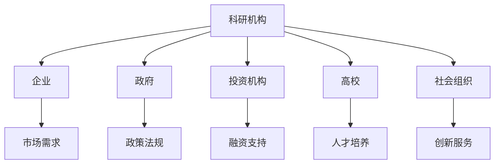

这个流程图展示了创新生态系统中各个组成部分之间的相互关系，包括科研机构、企业、政府、投资机构、高校和社会组织等。通过这个流程图，可以更直观地理解创新生态系统的整体结构和运行机制。

### 2.3 大规模预训练模型原理

#### 2.3.1 预训练的概念与意义

- **定义**：预训练是指在大规模数据集上进行模型训练，以提高模型在特定任务上的性能。
- **意义**：预训练能够帮助模型学习到语言、图像等通用特征，提高模型在未见数据上的泛化能力。

**示例**：

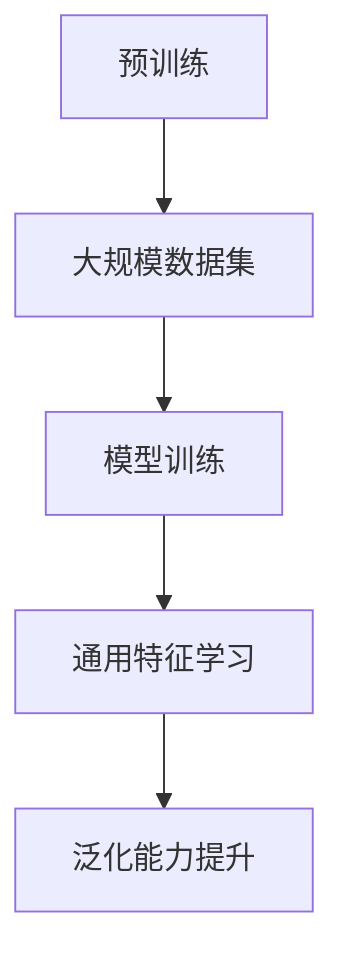

在这个示例中，预训练过程包括以下几个步骤：首先，使用大规模数据集（B）对模型进行训练，然后通过学习通用特征（D），提升模型在未见数据上的泛化能力（E）。

#### 2.3.2 自监督学习方法

- **定义**：自监督学习是指从未标记的数据中学习模型，通过预设的目标函数自动获取标签。
- **方法**：包括数据增强、伪标签、预测误差最小化等。

**示例**：

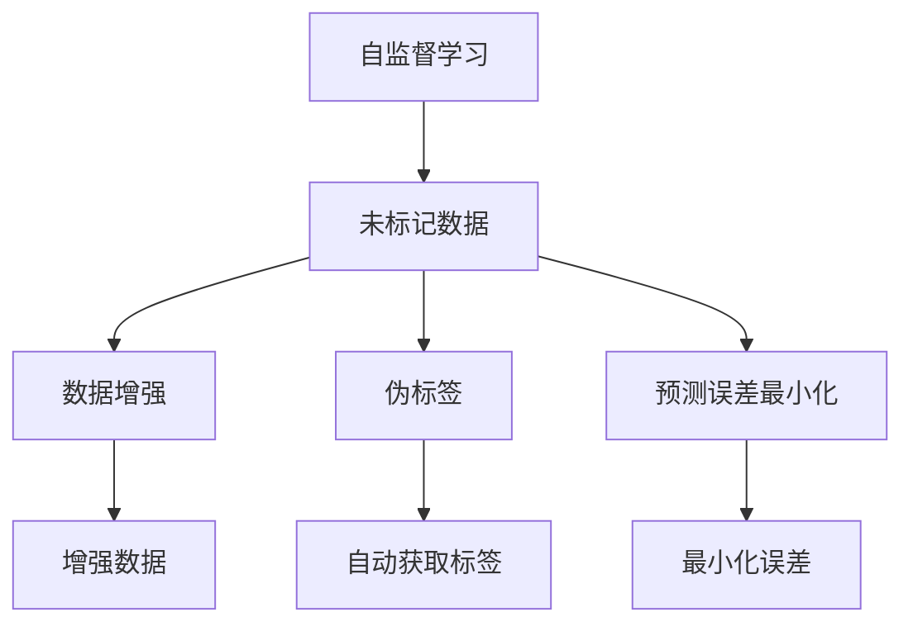

在这个示例中，自监督学习过程包括以下几个步骤：首先，对未标记数据（B）进行数据增强（C），然后通过伪标签（D）和预测误差最小化（E）自动获取标签，最后通过增强数据（F）和最小化误差（H）提高模型的性能。

#### 2.3.3 迁移学习与微调技术

- **定义**：迁移学习是指将一个任务在源域上训练的模型应用到另一个任务的目标域上。
- **微调技术**：通过在目标域上进行少量数据训练，调整模型参数，以适应新任务。

**示例**：

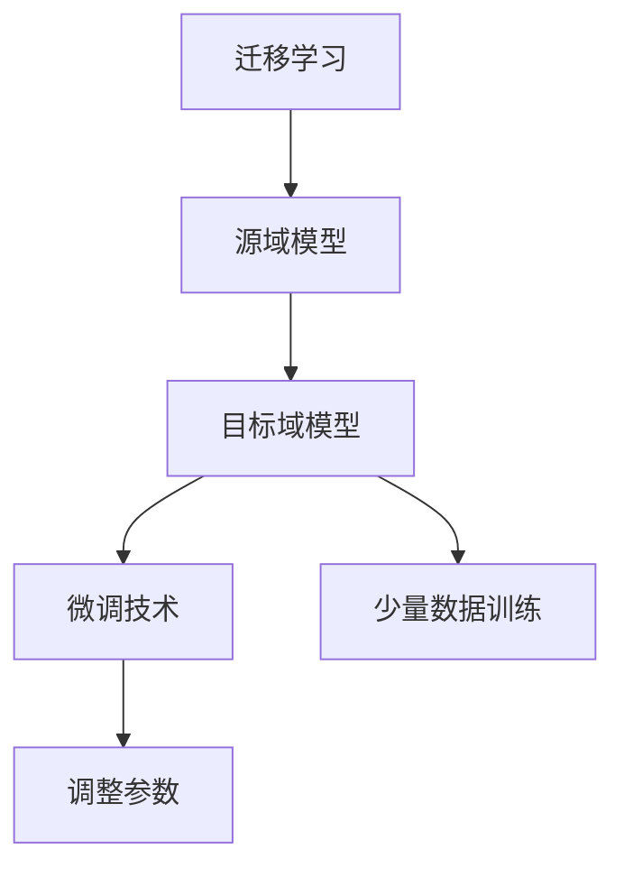

在这个示例中，迁移学习过程包括以下几个步骤：首先，使用源域数据（B）训练模型，然后通过微调技术（D）和少量数据训练（E）调整模型参数（F），使其适应目标域的新任务。

### 3.2 自然语言处理技术概览

#### 3.2.1 词嵌入技术

- **定义**：词嵌入是将单词映射到高维向量空间，以捕捉单词的语义信息。
- **方法**：包括词袋模型、连续词袋模型、Word2Vec、GloVe等。

**示例**：

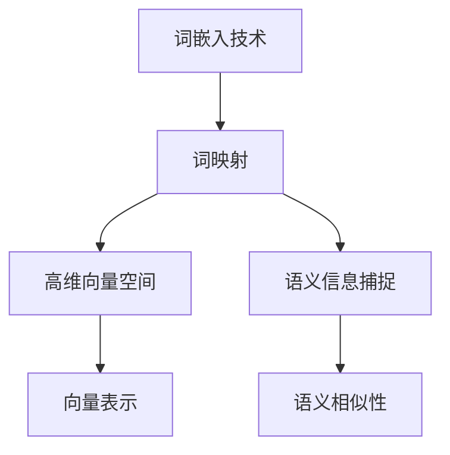

在这个示例中，词嵌入技术包括以下几个步骤：首先，将单词映射到高维向量空间（C），然后通过向量表示（E）捕捉单词的语义信息（D），从而实现语义相似性的计算。

#### 3.2.2 序列模型与注意力机制

- **定义**：序列模型是指能够处理序列数据的模型，如循环神经网络（RNN）。
- **注意力机制**：用于提高模型在处理序列数据时的注意力分配能力，如长短期记忆网络（LSTM）。

**示例**：

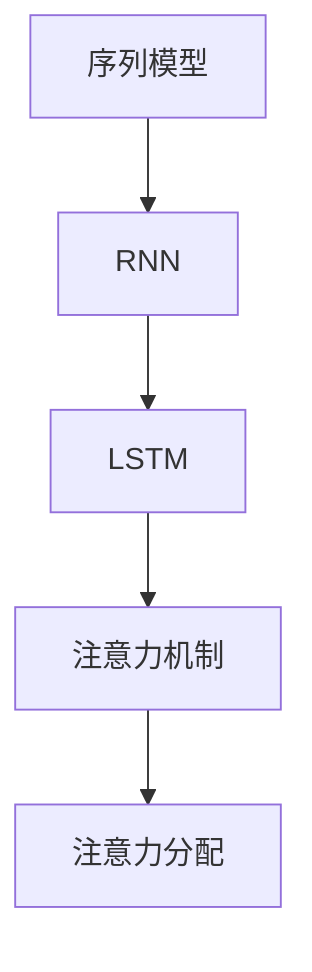

在这个示例中，序列模型包括循环神经网络（RNN）和长短期记忆网络（LSTM），注意力机制（E）用于提高模型在处理序列数据时的注意力分配能力。

#### 3.2.3 转换器架构详解

- **定义**：转换器架构（Transformer）是一种基于自注意力机制的序列到序列模型。
- **组成部分**：包括编码器、解码器、多头注意力、位置编码等。

**示例**：

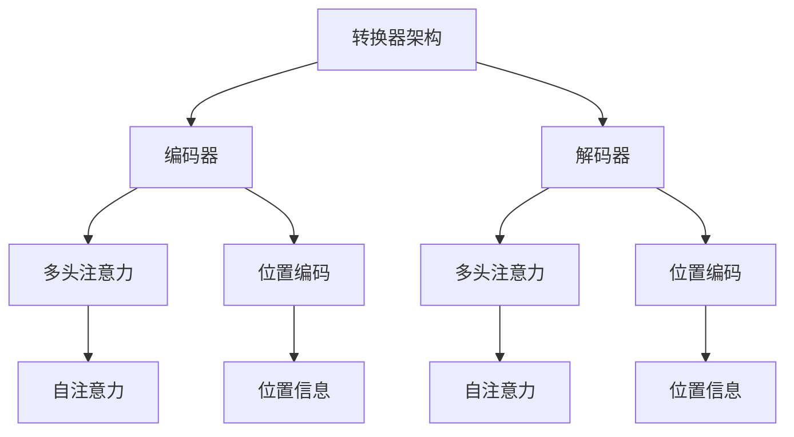

在这个示例中，转换器架构包括编码器（B）、解码器（G）、多头注意力（C、H）和位置编码（D、I），自注意力机制（E、J）用于提高模型在序列数据上的处理能力。

### 4.2 创新生态系统的关键要素

#### 4.2.1 科研机构

- **定义**：科研机构是指专门从事科学技术研究、开发和应用的组织。
- **作用**：提供前沿科学技术研究，推动科技创新。

**示例**：

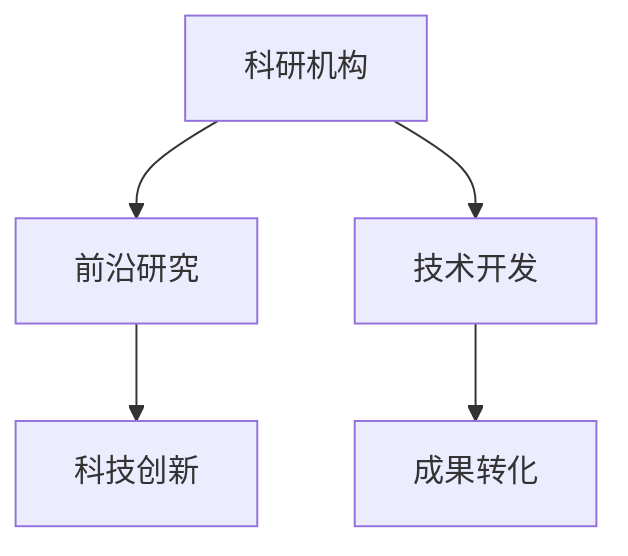

在这个示例中，科研机构（A）通过前沿研究（B）和技术开发（D）推动科技创新（C），并将研究成果进行成果转化（E）。

#### 4.2.2 企业

- **定义**：企业是指以盈利为目的，从事商品生产和经营活动的经济组织。
- **作用**：作为创新成果转化的主体，推动技术创新和产业升级。

**示例**：

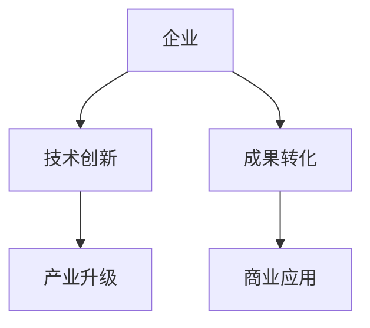

在这个示例中，企业（A）通过技术创新（B）推动产业升级（C），并将创新成果转化为商业应用（D、E）。

#### 4.2.3 政府

- **定义**：政府是指行使国家权力、管理公共事务的国家机关。
- **作用**：制定政策法规，提供资金支持，保障创新生态系统的健康发展。

**示例**：

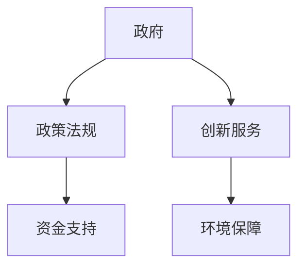

在这个示例中，政府（A）通过制定政策法规（B）和提供资金支持（C），保障创新生态系统的健康发展（D、E）。

#### 4.2.4 投资机构

- **定义**：投资机构是指从事投资活动的金融机构或组织。
- **作用**：为创新项目提供融资支持，促进创新成果的转化和应用。

**示例**：

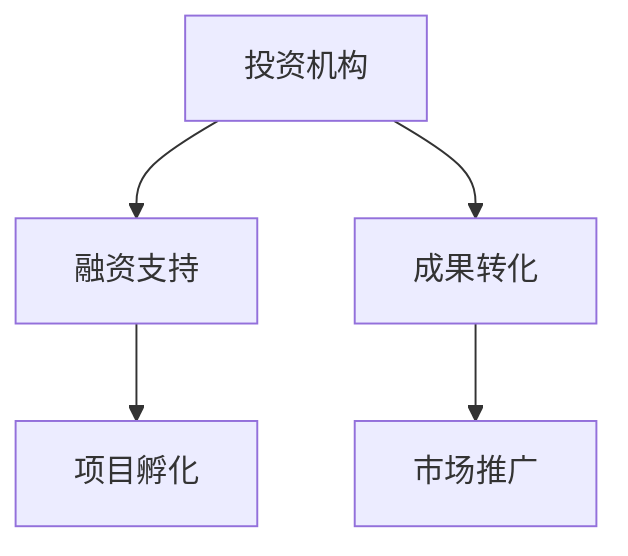

在这个示例中，投资机构（A）通过提供融资支持（B），促进创新项目孵化（C），并将创新成果转化为市场推广（D、E）。

#### 4.2.5 高校

- **定义**：高校是指从事高等教育和科学研究的组织。
- **作用**：培养创新人才，提供研究资源和平台。

**示例**：

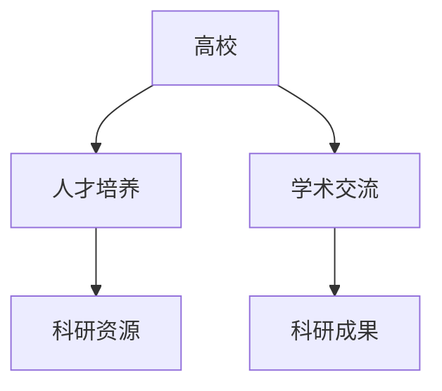

在这个示例中，高校（A）通过人才培养（B）和科研资源（C），促进学术交流（D），推动科研成果（E）的产生。

#### 4.2.6 社会组织

- **定义**：社会组织是指由社会团体和其他组织组成的，非政府、非企业的组织。
- **作用**：提供创新服务，如技术咨询、知识产权保护等。

**示例**：

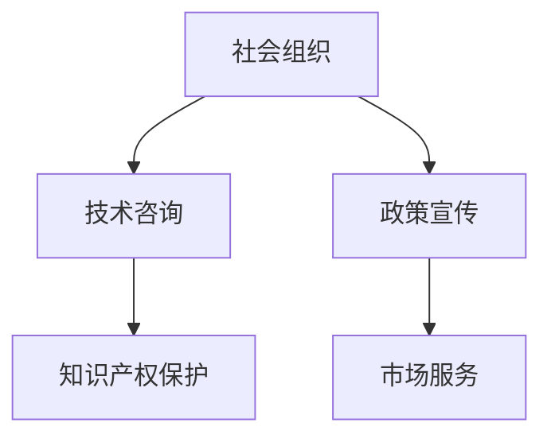

在这个示例中，社会组织（A）通过提供技术咨询（B）和知识产权保护（C），促进政策宣传（D），提供市场服务（E）。

### 5.3 成果转化机制

#### 5.3.1 定义

- **成果转化**：是指将科学研究和技术创新转化为实际应用和商业价值的过程。
- **机制**：包括产学研合作、技术转移平台、创新政策等。

**示例**：

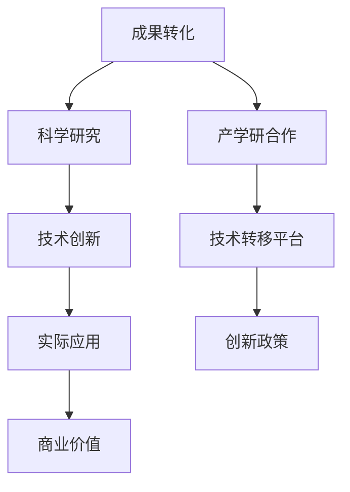

在这个示例中，成果转化（A）包括科学研究（B）、技术创新（C）、实际应用（D）和商业价值（E），产学研合作（F）、技术转移平台（G）和创新政策（H）是成果转化的重要机制。

#### 5.3.2 实现途径

- **产学研合作**：通过产学研合作，实现科技创新与产业需求的对接。
- **技术转移平台**：建设技术转移平台，促进科研成果的转化和应用。
- **创新政策**：制定创新政策，提供资金支持、税收优惠等，促进成果转化。

**示例**：

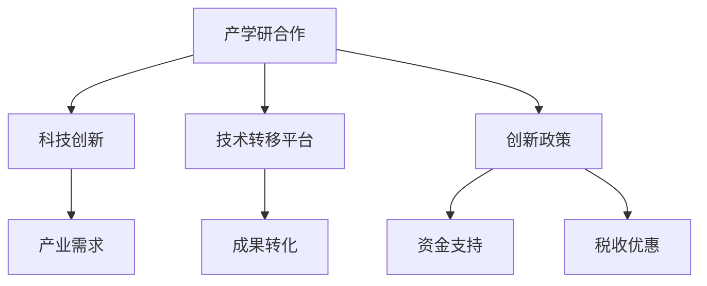

在这个示例中，产学研合作（A）通过对接科技创新（B）和产业需求（C），建设技术转移平台（D），提供创新政策（F），包括资金支持（G）和税收优惠（H），促进成果转化（E）。

### 6.1 创新生态系统的挑战与应对

#### 6.1.1 创新能力不足

- **原因**：部分创新主体缺乏先进的科研设施和人才。
- **应对策略**：增加科研投入，加强人才培养和引进。

**示例**：

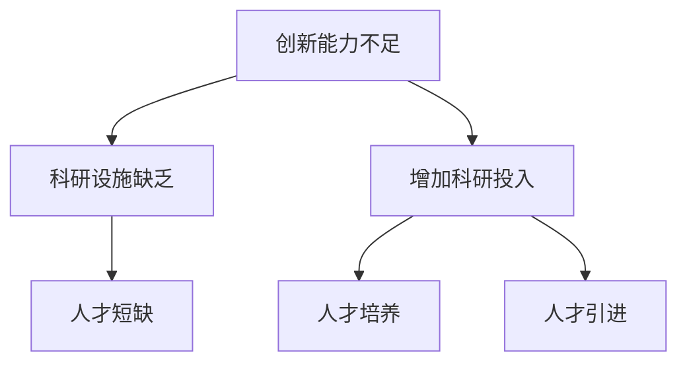

在这个示例中，创新能力不足（A）由于科研设施缺乏（B）和人才短缺（C），通过增加科研投入（D），包括人才培养（E）和人才引进（F），来提升创新能力。

#### 6.1.2 资源分布不均

- **原因**：地区、产业、主体之间的创新资源分配不均。
- **应对策略**：通过政策引导和市场化手段，优化资源分配。

**示例**：

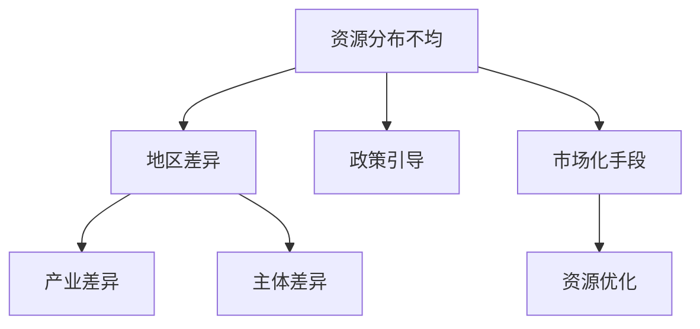

在这个示例中，资源分布不均（A）由于地区差异（B）、产业差异（C）和主体差异（D），通过政策引导（E）和市场化手段（F），包括资源优化（G），来优化资源分配。

#### 6.1.3 政策环境不完善

- **原因**：部分地区的创新政策不完善，缺乏有效的激励和约束机制。
- **应对策略**：制定和完善创新政策，提供良好的创新环境。

**示例**：

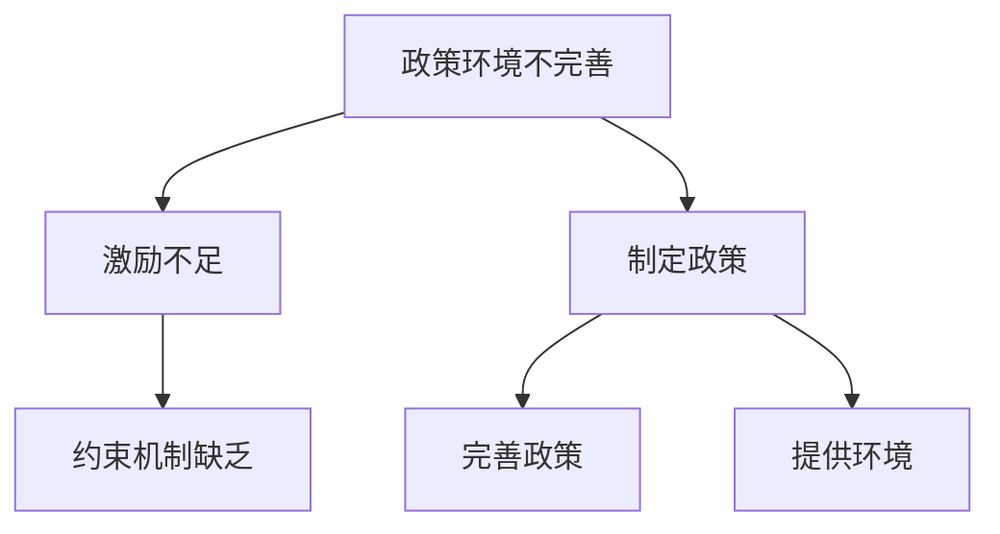

在这个示例中，政策环境不完善（A）由于激励不足（B）和约束机制缺乏（C），通过制定（D）和完善（E）创新政策，提供良好的创新环境（F），来改善政策环境。

### 7.2 创新生态系统的未来挑战

#### 7.2.1 技术创新速度加快

- **影响**：技术创新速度加快，对创新生态系统提出了新的要求。
- **应对策略**：加强科技创新，提高创新效率。

**示例**：

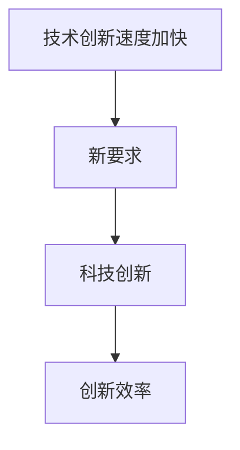

在这个示例中，技术创新速度加快（A）对创新生态系统提出了新的要求（B），通过加强科技创新（C），提高创新效率（D），来应对这一挑战。

#### 7.2.2 知识产权保护

- **影响**：知识产权保护问题日益突出，对创新生态系统的健康发展提出挑战。
- **应对策略**：加强知识产权保护，提升创新主体的保护意识和能力。

**示例**：

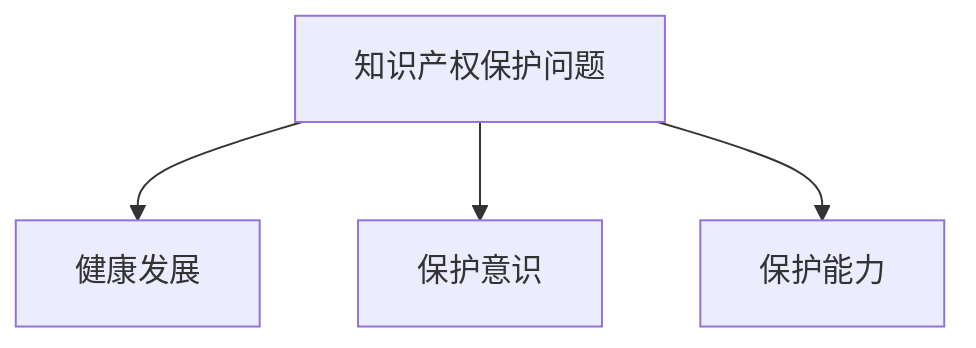

在这个示例中，知识产权保护问题（A）对创新生态系统的健康发展（B）提出了挑战，通过提升创新主体的保护意识（C）和保护能力（D），来加强知识产权保护。

### 7.3 创新生态系统的未来机遇

#### 7.3.1 新技术革命

- **影响**：新技术革命，如人工智能、区块链等，为创新生态系统带来了新的机遇。
- **应对策略**：积极拥抱新技术，推动创新生态系统的数字化转型。

**示例**：

```mermaid
graph TD
    A[新技术革命] --> B[新机遇]
    B --> C[数字化转型]
    C --> D[创新生态系统]
```

在这个示例中，新技术革命（A）为创新生态系统带来了新的机遇（B），通过推动数字化转型（C），来促进创新生态系统的进一步发展（D）。

