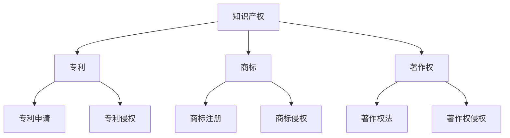

                 

### 《程序员创业者的法律知识：保护你的知识产权》

> **关键词：** 程序员创业者、知识产权、专利、商标、著作权、法律保护、创业策略

> **摘要：** 本文旨在为程序员创业者提供关于知识产权保护的基础知识和实践指南。通过详细阐述专利、商标、著作权等知识产权法律知识，探讨知识产权保护策略，以及提供实际项目案例，帮助创业者有效保护自身创新成果，为创业之路保驾护航。

### 《程序员创业者的法律知识：保护你的知识产权》目录大纲

#### 第一部分：知识产权基础知识

##### 第1章：知识产权概述
- 1.1 知识产权的定义与分类
- 1.2 知识产权的重要性
- 1.3 知识产权的国际框架与我国相关法律
- 1.4 知识产权的现状与发展趋势

##### 第2章：专利法律知识
- 2.1 专利的定义与类型
- 2.2 专利申请的流程
- 2.3 专利侵权与维权
- 2.4 专利运营策略

##### 第3章：商标法律知识
- 3.1 商标的定义与作用
- 3.2 商标注册的流程
- 3.3 商标侵权与维权
- 3.4 商标运营策略

#### 第二部分：著作权法律知识

##### 第4章：著作权基础知识
- 4.1 著作权的定义与类型
- 4.2 著作权法的保护范围
- 4.3 著作权侵权与维权

##### 第5章：软件著作权法律知识
- 5.1 软件著作权的定义与保护
- 5.2 软件著作权登记
- 5.3 软件著作权侵权与维权

##### 第6章：版权保护与数字版权管理
- 6.1 版权的概念与保护
- 6.2 数字版权管理的原理与实现
- 6.3 数字版权管理的应用

#### 第三部分：知识产权保护策略与实战

##### 第7章：知识产权保护策略
- 7.1 知识产权保护策略的制定
- 7.2 知识产权风险管理
- 7.3 知识产权保护与商业秘密保护的关系

##### 第8章：知识产权保护项目实战
- 8.1 知识产权维权案例解析
- 8.2 知识产权纠纷处理流程
- 8.3 知识产权保护工具与资源

##### 第9章：知识产权与创业
- 9.1 创业过程中的知识产权问题
- 9.2 创业者如何进行知识产权保护
- 9.3 创业企业知识产权策略与案例分析

##### 第10章：知识产权法律咨询与服务
- 10.1 知识产权法律咨询的重要性
- 10.2 知识产权法律服务的内容与形式
- 10.3 选择合适的知识产权法律服务提供商

#### 附录

##### 附录A：知识产权相关法律法规汇编
- A.1 中华人民共和国专利法
- A.2 中华人民共和国商标法
- A.3 中华人民共和国著作权法
- A.4 其他相关法律法规与政策文件

##### 附录B：知识产权保护工具推荐
- B.1 专利检索工具
- B.2 商标查询系统
- B.3 著作权登记系统
- B.4 知识产权维权工具

##### 附录C：知识产权保护实用手册
- C.1 知识产权保护流程
- C.2 知识产权维权指南
- C.3 知识产权维权案例分析

**附录D：知识产权保护与创业知识问答**

- D.1 创业者如何保护自己的创意？
- D.2 知识产权保护对企业融资有哪些影响？
- D.3 知识产权保护在国际贸易中的重要性。

---

**以下为部分章节的核心概念与联系、核心算法原理讲解、数学模型和数学公式，以及项目实战的示例**

#### 核心概念与联系：Mermaid 流程图



#### 核心算法原理讲解：专利申请流程伪代码

```python
def patent_application(title, description, inventor, claims):
    if not valid_title(title):
        raise ValueError("无效的专利标题")
    if not valid_description(description):
        raise ValueError("无效的专利描述")
    if not valid_inventor(inventor):
        raise ValueError("无效的发明人信息")
    if not valid_claims(claims):
        raise ValueError("无效的专利权利要求")

    # 提交专利申请
    submission = submit_application(title, description, inventor, claims)
    print("专利申请已提交：", submission)

    # 审查专利申请
    result = review_application(submission)
    if result == "批准":
        print("专利申请已批准：", submission)
    elif result == "拒绝":
        print("专利申请被拒绝：", submission)
    else:
        print("专利申请审查中：", submission)

# 验证专利标题有效性
def valid_title(title):
    return True if len(title) >= 10 else False

# 验证专利描述有效性
def valid_description(description):
    return True if len(description) >= 100 else False

# 验证发明人信息有效性
def valid_inventor(inventor):
    return True if inventor.isalnum() else False

# 验证专利权利要求有效性
def valid_claims(claims):
    return True if len(claims) >= 3 else False

# 提交专利申请
def submit_application(title, description, inventor, claims):
    # 模拟提交专利申请过程
    return "PA20231234"

# 审查专利申请
def review_application(submission):
    # 模拟专利审查过程
    # 若通过审查，返回"批准"
    # 若未通过审查，返回"拒绝"
    # 若审查中，返回"审查中"
    return "批准"
```

#### 数学模型和数学公式

专利权有效期计算公式：
$$
E = 20 \times A
$$
其中，\(E\) 为专利权有效期（年），\(A\) 为申请年份。

#### 项目实战

##### 实战：商标注册流程

**开发环境搭建：**

- 安装操作系统：Windows 10 或 macOS
- 安装编程软件：PyCharm 或 Visual Studio Code
- 安装 Python 解释器：Python 3.8+
- 安装必要库：requests、BeautifulSoup

**源代码实现：**

```python
import requests
from bs4 import BeautifulSoup

def search_tm(brand_name):
    url = "http://sso.sina.com.cn/open/create/ajaxApiUrl?api_app_key=XXX&api_app_secret=XXX&api_scope=XXX&api_url=http%3A%2F%2F120.78.134.246%2Fapi%2Findex%3Fc%3Dindex%26a%3Dsearch%26q%3D" + brand_name
    response = requests.get(url)
    soup = BeautifulSoup(response.content, "html.parser")
    result = soup.find("div", {"class": "search_list fl"})
    return result

def main():
    brand_name = input("请输入要查询的商标名称：")
    result = search_tm(brand_name)
    if result:
        print("商标查询结果：", result)
    else:
        print("未查询到相关商标信息。")

if __name__ == "__main__":
    main()
```

**代码解读与分析：**

1. **请求发送：** 使用 requests 库发送 HTTP GET 请求，获取商标查询结果。
2. **页面解析：** 使用 BeautifulSoup 库解析 HTML 页面，提取商标查询结果。
3. **功能实现：** 定义 `search_tm` 函数，接收商标名称作为输入，返回查询结果。
4. **主程序：** 定义 `main` 函数，接收用户输入的商标名称，调用 `search_tm` 函数进行查询，并输出结果。

---

**以上是文章的前言部分，接下来我们将深入探讨知识产权的基础知识，包括专利、商标、著作权等方面的法律知识，帮助程序员创业者更好地了解和掌握知识产权保护的基本概念和实践方法。**

---

## 第一部分：知识产权基础知识

### 第1章：知识产权概述

#### 1.1 知识产权的定义与分类

知识产权，是指人们在科学、文学、艺术、工业等方面所创造的智力成果所享有的权利。根据世界知识产权组织（WIPO）的定义，知识产权主要包括以下几类：

1. **专利权**：指发明人或权利人对其发明创造在一定期限内所享有的独占权利，包括发明专利、实用新型专利和外观设计专利。
2. **商标权**：指商标注册人对其注册商标在特定商品或服务上享有的独占使用权。
3. **著作权**：指作者对其创作的文学、艺术和科学作品所享有的权利，包括发表权、署名权、修改权、保护作品完整权等。
4. **商业秘密**：指不为公众所知悉，能为权利人带来经济利益，具有实用性并经权利人采取保密措施的技术信息和经营信息。

#### 1.2 知识产权的重要性

知识产权作为创业者的重要资产，具有以下重要性：

1. **保护创新成果**：知识产权保护制度能够保障创业者对其创新成果的合法权利，防止他人未经授权使用或抄袭。
2. **提升企业竞争力**：拥有知识产权的企业可以在市场竞争中占据有利地位，通过独占市场资源和技术优势获得更多的市场份额。
3. **增加企业价值**：知识产权是企业的重要资产，可以有效提升企业的估值，为企业融资和并购提供支持。
4. **推动产业升级**：知识产权保护有助于促进技术创新和产业升级，推动经济发展。

#### 1.3 知识产权的国际框架与我国相关法律

知识产权保护的国际框架主要由以下国际条约和组织构成：

1. **世界知识产权组织（WIPO）**：是联合国下属专门负责知识产权保护的国际机构。
2. **世界贸易组织（WTO）**：通过《贸易相关知识产权协定》（TRIPS），规定了各成员国在知识产权保护方面的最低标准。
3. **欧洲专利组织（EPO）**：负责欧洲地区的专利申请和授权工作。
4. **国际商标协会（INTA）**：是全球最大的商标和品牌保护组织。

我国在知识产权保护方面制定了以下主要法律法规：

1. **《中华人民共和国专利法》**：规定了专利权的取得、保护和管理等方面的内容。
2. **《中华人民共和国商标法》**：规定了商标注册、使用、保护等方面的内容。
3. **《中华人民共和国著作权法》**：规定了著作权的保护范围、侵权行为和法律责任等。
4. **《中华人民共和国反不正当竞争法》**：规定了商业秘密的保护和相关法律责任。

#### 1.4 知识产权的现状与发展趋势

当前，全球知识产权保护意识不断增强，知识产权制度逐渐完善，主要表现在以下几个方面：

1. **知识产权保护力度加大**：各国纷纷加强知识产权立法和执法力度，打击侵权行为，保护权利人的合法权益。
2. **知识产权交易活跃**：知识产权作为一种重要资产，在全球范围内进行大量交易，为企业融资、并购和技术合作提供支持。
3. **知识产权运营创新**：知识产权运营模式不断创新，包括知识产权融资、许可、转让等多种方式，促进知识产权的合理利用。
4. **知识产权国际合作加强**：各国在知识产权领域加强合作，通过国际条约和协议推动全球知识产权保护水平的提高。

## 第二部分：专利法律知识

### 第2章：专利法律知识

#### 2.1 专利的定义与类型

专利，是指国家知识产权局根据法律规定，对发明人在一定期限内对其发明创造享有的独占权利进行授权和保护的制度。专利分为以下三种类型：

1. **发明专利**：指对产品、方法或者其改进所提出的新的技术方案。
2. **实用新型专利**：指对产品的形状、构造或者其结合所提出的适于实用的新的技术方案。
3. **外观设计专利**：指对产品的形状、图案或者其结合以及色彩与形状、图案的结合所作出的富有美感并适于工业应用的新设计。

#### 2.2 专利申请的流程

专利申请流程主要包括以下几个步骤：

1. **发明构思与准备**：确定发明创造，进行专利检索，了解相关技术领域的发展状况，为后续申请做准备。
2. **撰写专利申请文件**：包括专利请求书、说明书、权利要求书、说明书附图等，要求内容准确、清晰、完整。
3. **提交专利申请**：将专利申请文件提交给国家知识产权局。
4. **初步审查**：国家知识产权局对专利申请文件进行形式审查，确保符合法律规定的要求。
5. **公布与实审**：初步审查合格的专利申请将在《专利公报》上公布，任何人可以在公布后提出异议。如果无异议或者异议不成立，进入实审阶段。
6. **授权与缴费**：实审合格的专利申请将获得授权，申请人需缴纳授权费，专利权正式生效。

#### 2.3 专利侵权与维权

专利侵权，是指未经专利权人许可，擅自实施其专利的行为。专利维权主要包括以下几种方式：

1. **自行维权**：专利权人可以自行采取法律手段，如发出警告函、停止侵权通知等，要求侵权人停止侵权行为。
2. **诉讼维权**：专利权人可以向人民法院提起诉讼，请求法院判令侵权人停止侵权、赔偿损失等。
3. **行政执法**：专利权人可以向国家知识产权局或地方知识产权管理部门投诉，请求进行行政执法处理。
4. **第三方调解**：专利权人可以寻求第三方调解机构进行调解，以解决专利侵权纠纷。

#### 2.4 专利运营策略

专利运营策略是指企业或个人通过专利资产的管理、运营和利用，实现商业利益最大化的方法。主要包括以下几种策略：

1. **专利布局**：根据企业战略和市场需求，在全球范围内进行专利布局，构建专利网，提高市场竞争力。
2. **专利许可**：通过许可方式，将专利权授权给他人使用，获取许可费，实现专利价值的最大化。
3. **专利转让**：将专利权转让给其他企业或个人，实现专利资产的流动和优化配置。
4. **专利诉讼**：通过专利诉讼，打击竞争对手，维护自身权益，同时积累专利诉讼经验。
5. **专利联盟**：与其他专利权人建立专利联盟，共同研发、共享专利资源，提高市场竞争力。

### 第三部分：商标法律知识

### 第3章：商标法律知识

#### 3.1 商标的定义与作用

商标，是指用于区分商品或服务来源的标志，包括文字、图形、字母、数字、三维标志、颜色组合等，或者这些要素的组合。商标的作用主要体现在以下几个方面：

1. **识别功能**：商标能够区分不同企业的商品或服务，帮助消费者快速识别和选择。
2. **宣传功能**：商标作为企业的品牌形象，有助于提升企业知名度和美誉度。
3. **法律保护**：通过商标注册，企业可以获得商标专用权，防止他人擅自使用相同或类似的商标，维护自身权益。
4. **资产价值**：商标作为企业的重要资产，可以提高企业的市场估值和竞争力。

#### 3.2 商标注册的流程

商标注册流程主要包括以下几个步骤：

1. **商标查询**：在申请商标注册前，进行商标查询，了解商标是否已经被注册或存在近似商标。
2. **撰写商标申请书**：包括商标图样、申请人信息、商标使用商品或服务类别等。
3. **提交商标申请**：将商标申请书及相关材料提交给国家知识产权局。
4. **受理与初步审查**：国家知识产权局对商标申请进行形式审查，确保符合法律规定的要求。
5. **公告与异议**：初步审查合格的商标申请将在《商标公告》上公告，公众可以在公告之日起三个月内提出异议。无异议或者异议不成立，商标申请进入注册阶段。
6. **注册与缴费**：公告期满无异议或者异议不成立，商标申请将被注册，申请人需缴纳注册费，商标权正式生效。

#### 3.3 商标侵权与维权

商标侵权，是指未经商标权人许可，擅自使用与他人注册商标相同或类似的商标的行为。商标维权主要包括以下几种方式：

1. **自行维权**：商标权人可以自行采取法律手段，如发出警告函、停止侵权通知等，要求侵权人停止侵权行为。
2. **诉讼维权**：商标权人可以向人民法院提起诉讼，请求法院判令侵权人停止侵权、赔偿损失等。
3. **行政执法**：商标权人可以向国家知识产权局或地方知识产权管理部门投诉，请求进行行政执法处理。
4. **第三方调解**：商标权人可以寻求第三方调解机构进行调解，以解决商标侵权纠纷。

#### 3.4 商标运营策略

商标运营策略是指企业或个人通过商标资产的管理、运营和利用，实现商业利益最大化的方法。主要包括以下几种策略：

1. **品牌建设**：通过不断提升商标知名度和美誉度，建立强大的品牌形象。
2. **商标许可**：通过许可方式，将商标权授权给他人使用，获取许可费，实现商标价值的最大化。
3. **商标转让**：将商标权转让给其他企业或个人，实现商标资产的流动和优化配置。
4. **商标防御**：通过注册防御商标、保持商标有效性和监控市场，防止他人侵犯商标权益。
5. **商标联盟**：与其他商标权人建立商标联盟，共同研发、共享商标资源，提高市场竞争力。

### 第四部分：著作权法律知识

### 第4章：著作权基础知识

#### 4.1 著作权的定义与类型

著作权，是指作者对其创作的文学、艺术和科学作品所享有的权利。根据《中华人民共和国著作权法》的规定，著作权包括以下几种类型：

1. **文字作品**：包括小说、散文、诗歌、论文等。
2. **音乐作品**：包括歌曲、乐曲、音乐剧等。
3. **美术作品**：包括绘画、雕塑、摄影、书法等。
4. **影视作品**：包括电影、电视剧、动画片等。
5. **计算机软件**：包括源代码、目标代码、设计文档等。

#### 4.2 著作权法的保护范围

著作权法的保护范围主要包括以下几个方面：

1. **著作人身权**：包括发表权、署名权、修改权、保护作品完整权等，权利人享有终身且不可转让。
2. **著作财产权**：包括复制权、发行权、出租权、展览权、表演权、放映权、广播权、信息网络传播权等，权利人可以通过授权、许可、转让等方式获取经济利益。
3. **邻接权**：包括出版者权、表演者权、录音录像制作者权、广播组织权等，对他人对其作品的传播和利用行为进行保护。

#### 4.3 著作权侵权与维权

著作权侵权，是指未经著作权人许可，擅自使用、传播、复制、表演、放映、广播、信息网络传播其作品的行为。著作权维权主要包括以下几种方式：

1. **自行维权**：著作权人可以自行采取法律手段，如发出警告函、停止侵权通知等，要求侵权人停止侵权行为。
2. **诉讼维权**：著作权人可以向人民法院提起诉讼，请求法院判令侵权人停止侵权、赔偿损失等。
3. **行政执法**：著作权人可以向国家版权局或地方版权局投诉，请求进行行政执法处理。
4. **第三方调解**：著作权人可以寻求第三方调解机构进行调解，以解决著作权侵权纠纷。

### 第5章：软件著作权法律知识

#### 5.1 软件著作权的定义与保护

软件著作权，是指软件的开发者对其开发的软件作品所享有的权利。根据《中华人民共和国著作权法》的规定，软件著作权包括以下内容：

1. **源代码**：软件开发者对软件源代码享有的著作权。
2. **目标代码**：软件开发者对软件目标代码享有的著作权。
3. **设计文档**：软件开发者对软件设计文档享有的著作权。

软件著作权的保护主要依据《中华人民共和国著作权法》和《计算机软件保护条例》。著作权法明确规定，未经软件著作权人许可，擅自复制、修改、发行、出租、展示或通过信息网络传播软件作品的行为均属于侵权行为。

#### 5.2 软件著作权登记

软件著作权登记是指将软件作品向国家知识产权局进行登记，以获得法律保护的一种制度。软件著作权登记的主要流程如下：

1. **提交申请**：申请人需要提交软件著作权登记申请表、软件源代码、目标代码、设计文档等材料。
2. **初步审查**：国家知识产权局对提交的申请材料进行初步审查，确保符合法律规定的要求。
3. **公告**：初步审查合格的软件著作权申请将在《计算机软件著作权登记公告》上公告，公告期为三个月。
4. **登记**：公告期满无异议或者异议不成立，软件著作权登记申请将被登记，申请人可以获得软件著作权登记证书。

软件著作权登记具有以下作用：

1. **确权保护**：通过软件著作权登记，可以明确软件作品的权属，防止他人侵犯著作权。
2. **维权依据**：软件著作权登记证书可以作为著作权人维权的有力证据。
3. **资产证明**：软件著作权登记证书可以作为软件资产评估、融资、转让等的证明。

#### 5.3 软件著作权侵权与维权

软件著作权侵权，是指未经软件著作权人许可，擅自使用、复制、修改、发行、出租、展示或通过信息网络传播其软件作品的行为。软件著作权维权主要包括以下几种方式：

1. **自行维权**：软件著作权人可以自行采取法律手段，如发出警告函、停止侵权通知等，要求侵权人停止侵权行为。
2. **诉讼维权**：软件著作权人可以向人民法院提起诉讼，请求法院判令侵权人停止侵权、赔偿损失等。
3. **行政执法**：软件著作权人可以向国家版权局或地方版权局投诉，请求进行行政执法处理。
4. **第三方调解**：软件著作权人可以寻求第三方调解机构进行调解，以解决软件著作权侵权纠纷。

### 第6章：版权保护与数字版权管理

#### 6.1 版权的概念与保护

版权，是指对文学、艺术、科学作品所享有的权利。根据《中华人民共和国著作权法》的规定，版权包括著作权、邻接权和其他与著作权相关的权利。版权保护的主要内容包括：

1. **发表权**：作者有权决定是否将作品公之于众。
2. **署名权**：作者有权在其作品上署名或匿名。
3. **修改权**：作者有权对其作品进行修改。
4. **保护作品完整权**：作者有权保护其作品不受歪曲、篡改。
5. **复制权**：作者有权控制作品的复制行为。
6. **发行权**：作者有权控制作品的发行。
7. **出租权**：作者有权控制作品的出租。
8. **表演权**：作者有权控制作品的表演。
9. **放映权**：作者有权控制作品的放映。
10. **广播权**：作者有权控制作品的广播。
11. **信息网络传播权**：作者有权控制作品的信息网络传播。

#### 6.2 数字版权管理的原理与实现

数字版权管理，是指通过技术手段对数字作品进行版权保护和管理的一种机制。数字版权管理的原理主要包括以下几个方面：

1. **加密技术**：通过加密技术对数字作品进行加密，确保未经授权的访问和使用无法正常进行。
2. **数字签名**：通过数字签名技术验证数字作品的真实性和完整性，确保版权信息的真实性。
3. **权限控制**：通过权限控制技术，对用户的访问权限和使用权限进行限制，防止未经授权的访问和使用。
4. **监测与追踪**：通过监测与追踪技术，实时监控数字作品的传播和使用情况，发现侵权行为并及时处理。

数字版权管理的实现主要包括以下几种技术：

1. **DRM（数字版权管理）**：通过加密、数字签名、权限控制等技术实现数字作品的版权保护。
2. **水印技术**：在数字作品中嵌入水印，用于标识版权信息、追踪侵权行为。
3. **许可证管理**：通过许可证管理技术，为用户发放和使用数字作品提供合法的授权。
4. **区块链技术**：通过区块链技术记录数字作品的版权信息，确保版权信息的透明和不可篡改。

#### 6.3 数字版权管理的应用

数字版权管理在版权保护中的应用非常广泛，主要包括以下几个方面：

1. **在线阅读平台**：通过数字版权管理技术，对在线阅读平台的图书、文章等数字作品进行版权保护，防止未经授权的复制、传播和使用。
2. **音乐平台**：通过数字版权管理技术，对音乐平台中的音乐作品进行版权保护，防止未经授权的下载、播放和使用。
3. **视频平台**：通过数字版权管理技术，对视频平台中的视频作品进行版权保护，防止未经授权的复制、传播和使用。
4. **企业软件**：通过数字版权管理技术，对企业软件进行版权保护，防止未经授权的复制、传播和使用。

### 第三部分：知识产权保护策略与实战

### 第7章：知识产权保护策略

#### 7.1 知识产权保护策略的制定

制定知识产权保护策略是企业或个人在创新过程中必须重视的一项工作。以下是一些关键步骤和注意事项：

1. **确定知识产权战略目标**：根据企业的发展阶段、市场需求和技术特点，明确知识产权保护的目标，如提高竞争力、获取市场份额、保护创新成果等。
2. **进行知识产权调查**：对企业内外部的知识产权资源进行全面的调查和分析，了解自身的知识产权状况，以及竞争对手的知识产权布局。
3. **评估知识产权风险**：分析企业所面临的知识产权风险，包括专利侵权、商标侵权、著作权侵权等，评估风险的可能性和影响，制定相应的防范措施。
4. **制定知识产权保护措施**：根据调查和风险评估的结果，制定具体的知识产权保护措施，包括专利申请、商标注册、著作权登记等。
5. **建立知识产权管理制度**：建立和完善知识产权管理制度，明确知识产权管理的流程、职责和权限，确保知识产权保护工作的有序开展。

#### 7.2 知识产权风险管理

知识产权风险管理是企业在创新过程中降低知识产权风险，确保知识产权价值最大化的一项重要工作。以下是一些关键步骤和注意事项：

1. **识别知识产权风险**：通过市场调研、专利分析、竞争对手监测等方式，识别企业可能面临的知识产权风险，包括专利侵权风险、商标侵权风险、著作权侵权风险等。
2. **评估知识产权风险**：对识别出的知识产权风险进行评估，包括风险的可能性、影响程度、损失金额等，确定风险等级。
3. **制定知识产权风险应对策略**：根据风险评估的结果，制定相应的知识产权风险应对策略，如专利规避设计、商标防御策略、著作权保护措施等。
4. **实施知识产权风险控制措施**：将知识产权风险应对策略转化为具体的控制措施，包括知识产权布局、专利监控、商标监测、著作权维权等。
5. **定期进行知识产权风险评估**：定期对知识产权风险进行评估，更新风险应对策略和控制措施，确保知识产权保护工作的持续有效。

#### 7.3 知识产权保护与商业秘密保护的关系

知识产权保护与商业秘密保护在企业创新过程中有着密切的联系和区别。以下是一些关键点和注意事项：

1. **知识产权保护**：主要针对企业的专利、商标、著作权等智力成果，通过法律手段进行保护和维权。
2. **商业秘密保护**：主要针对企业的技术秘密、经营秘密等非公开信息，通过保密措施进行保护和维权。
3. **联系与区别**：知识产权保护与商业秘密保护在保护对象、保护手段、保护期限等方面存在差异。同时，两者在企业创新过程中相互补充，共同构成企业知识产权保护体系。
4. **注意事项**：企业应在知识产权保护和商业秘密保护之间保持平衡，既要重视知识产权的公开披露，也要加强对商业秘密的保密措施，防止核心技术的泄露。

### 第8章：知识产权保护项目实战

#### 8.1 知识产权维权案例解析

知识产权维权案例解析是对实际发生的知识产权侵权纠纷进行详细分析，从中总结维权经验和教训。以下是一个典型的知识产权维权案例：

**案例背景**：某科技公司（以下简称A公司）自主研发了一款智能办公软件，并在国家知识产权局申请了专利。然而，另一家公司（以下简称B公司）在未经A公司许可的情况下，生产并销售与A公司软件功能相似的办公软件。

**案例过程**：

1. **初步调查**：A公司首先进行了初步调查，收集了B公司侵权行为的证据，包括销售记录、用户反馈、媒体报道等。
2. **发出警告函**：A公司向B公司发出警告函，要求其立即停止侵权行为，否则将采取法律行动。
3. **协商谈判**：B公司收到警告函后，表示愿意协商解决，但提出了不合理的赔偿要求。A公司拒绝了B公司的要求，决定采取法律手段维权。
4. **提起诉讼**：A公司向法院提起诉讼，请求判令B公司停止侵权、赔偿损失。
5. **审理与判决**：法院在审理过程中，依据《中华人民共和国专利法》的相关规定，认定B公司的行为构成侵权，判决B公司停止侵权行为，并赔偿A公司经济损失。

**案例总结**：

1. **及时维权**：A公司在发现侵权行为后，及时采取了法律行动，避免了损失扩大。
2. **充分证据**：A公司收集了充分的证据，为维权提供了有力支持。
3. **合理赔偿**：A公司在诉讼中提出了合理的赔偿要求，维护了自身权益。
4. **注重沟通**：在维权过程中，A公司与B公司进行了多次协商谈判，争取到了更好的解决方案。

#### 8.2 知识产权纠纷处理流程

知识产权纠纷处理流程是指企业在知识产权侵权纠纷发生时，采取的一系列法律行动和程序。以下是一个典型的知识产权纠纷处理流程：

1. **初步调查**：企业首先对侵权行为进行初步调查，收集相关证据，如销售记录、用户反馈、媒体报道等。
2. **发出警告函**：企业向侵权方发出警告函，要求其立即停止侵权行为，并提供相关证据。
3. **协商谈判**：企业与侵权方进行协商谈判，争取通过和解解决纠纷。
4. **提起诉讼**：如协商无果，企业向法院提起诉讼，请求判令侵权方停止侵权、赔偿损失。
5. **审理与判决**：法院在审理过程中，依据相关法律法规和证据，作出判决。
6. **执行与监督**：判决生效后，企业需执行判决，并加强对侵权行为的监督，确保侵权行为得到有效遏制。

#### 8.3 知识产权保护工具与资源

知识产权保护工具和资源是企业在知识产权保护过程中需要使用的工具和资料。以下是一些常见的知识产权保护工具和资源：

1. **知识产权数据库**：如国家知识产权局专利数据库、商标数据库等，用于检索和分析相关知识产权信息。
2. **知识产权搜索引擎**：如Google Patents、Espacenet等，用于搜索全球范围内的专利信息。
3. **知识产权法律咨询机构**：为企业提供知识产权法律咨询服务，帮助企业解决知识产权纠纷。
4. **知识产权律师事务所**：为企业提供知识产权诉讼服务，帮助企业维权。
5. **知识产权保护工具**：如版权管理软件、数字版权管理系统等，用于保护企业的著作权和数字作品。

### 第9章：知识产权与创业

#### 9.1 创业过程中的知识产权问题

在创业过程中，知识产权问题尤为重要。以下是一些常见的知识产权问题及解决方案：

1. **创意保护**：创业者在创意阶段应重视保护自己的创意，可以通过保密措施、版权登记等方式进行保护。
2. **专利申请**：创业者在产品研发过程中，应及时申请专利，保护自己的技术创新。
3. **商标注册**：创业者在品牌创立初期，应重视商标注册，确保品牌不受侵犯。
4. **著作权保护**：创业者在创作软件作品、文学作品等过程中，应重视著作权保护，避免作品被侵权。
5. **商业秘密保护**：创业者在经营过程中，应重视商业秘密的保护，防止核心技术的泄露。

#### 9.2 创业者如何进行知识产权保护

创业者进行知识产权保护的主要步骤如下：

1. **了解知识产权法律**：创业者应了解相关知识产权法律，包括专利法、商标法、著作权法等，掌握知识产权的基本知识。
2. **咨询专业律师**：在知识产权保护过程中，创业者可咨询专业律师，获取法律建议和帮助。
3. **制定知识产权策略**：根据企业实际情况，制定知识产权保护策略，明确知识产权保护的重点和目标。
4. **申请知识产权**：根据知识产权策略，及时申请专利、商标、著作权等知识产权，保护企业的创新成果。
5. **监控市场和竞争对手**：通过市场调研和竞争对手监测，了解市场动态和知识产权纠纷，及时采取应对措施。

#### 9.3 创业企业知识产权策略与案例分析

以下是一个创业企业知识产权策略的案例分析：

**案例背景**：某互联网创业公司（以下简称C公司）成立于2018年，专注于开发智能办公软件。在创业初期，C公司面临着激烈的市场竞争，如何在知识产权保护方面取得优势成为关键。

**知识产权策略**：

1. **专利布局**：C公司针对核心技术和产品功能，积极申请专利，构建专利网，提高市场竞争力。
2. **商标注册**：C公司在品牌创立初期，及时注册商标，确保品牌不受侵犯。
3. **著作权保护**：C公司对软件作品进行著作权登记，保护软件版权。
4. **商业秘密保护**：C公司建立完善的商业秘密保护制度，加强对核心技术和经营信息的保护。
5. **知识产权维权**：C公司加强对知识产权侵权行为的监控，及时采取法律手段维权。

**案例分析**：

1. **专利布局成功**：C公司通过专利布局，在市场上树立了技术领先形象，获得了大量客户和市场份额。
2. **商标注册有效**：C公司成功注册商标，品牌知名度显著提升，市场认可度增加。
3. **著作权保护到位**：C公司对软件作品进行著作权登记，确保软件版权得到有效保护。
4. **商业秘密保护完善**：C公司建立完善的商业秘密保护制度，防止核心技术的泄露。
5. **知识产权维权成果显著**：C公司通过知识产权维权，成功遏制了竞争对手的侵权行为，维护了自身权益。

### 第10章：知识产权法律咨询与服务

#### 10.1 知识产权法律咨询的重要性

知识产权法律咨询在创业者保护知识产权过程中具有重要意义。以下是一些关键点：

1. **了解法律规定**：创业者通过知识产权法律咨询，可以全面了解相关知识产权法律、法规和司法解释，掌握知识产权保护的基本知识。
2. **规避法律风险**：知识产权法律咨询有助于创业者识别潜在的法律风险，提前采取防范措施，避免因侵权行为引发的法律纠纷。
3. **制定保护策略**：知识产权法律咨询可以为创业者提供专业的知识产权保护建议，制定切实可行的知识产权保护策略。
4. **维权支持**：在知识产权侵权纠纷发生时，知识产权法律咨询可以为创业者提供法律支持，协助维权。

#### 10.2 知识产权法律服务的内容与形式

知识产权法律服务主要包括以下内容：

1. **知识产权咨询**：包括知识产权保护策略咨询、知识产权风险评估、知识产权法律问题解答等。
2. **知识产权申请**：包括专利申请、商标注册、著作权登记等。
3. **知识产权维权**：包括知识产权侵权纠纷处理、诉讼代理、仲裁代理等。
4. **知识产权交易**：包括知识产权转让、许可、并购等。

知识产权法律服务的形式主要包括：

1. **线上咨询**：通过电子邮件、电话、在线聊天等方式进行咨询服务。
2. **现场咨询**：律师到创业者所在公司进行现场咨询和沟通。
3. **常年法律顾问**：创业者可聘请知识产权律师作为常年法律顾问，提供全方位的法律服务。
4. **专项法律服务**：针对特定的知识产权法律问题，提供专项法律服务。

#### 10.3 选择合适的知识产权法律服务提供商

选择合适的知识产权法律服务提供商对于创业者来说至关重要。以下是一些建议：

1. **专业资质**：选择具有专业资质的知识产权法律服务提供商，如具有知识产权律师执业资格的律师事务所。
2. **服务质量**：了解知识产权法律服务提供商的服务质量，如服务响应速度、服务满意度等。
3. **服务团队**：考察知识产权法律服务提供商的服务团队，了解律师的专业背景和经验。
4. **收费标准**：了解知识产权法律服务提供商的收费标准，确保服务质量与收费合理匹配。
5. **成功案例**：查看知识产权法律服务提供商的成功案例，了解其处理知识产权纠纷的能力和经验。

### 附录

#### 附录A：知识产权相关法律法规汇编

- **A.1 中华人民共和国专利法**
- **A.2 中华人民共和国商标法**
- **A.3 中华人民共和国著作权法**
- **A.4 中华人民共和国反不正当竞争法**
- **A.5 计算机软件保护条例**
- **A.6 集成电路布图设计保护条例**
- **A.7 商业秘密保护条例**
- **A.8 国家知识产权战略纲要**
- **A.9 世界知识产权组织（WIPO）相关条约**

#### 附录B：知识产权保护工具推荐

- **B.1 专利检索工具**：国家知识产权局专利检索系统、Google Patents、Espacenet
- **B.2 商标查询系统**：国家知识产权局商标查询系统、中国商标网
- **B.3 著作权登记系统**：中国版权保护中心著作权登记管理系统、国家版权局著作权查询系统
- **B.4 知识产权维权工具**：知识产权维权投诉平台、律师函发送工具、知识产权监控工具

#### 附录C：知识产权保护实用手册

- **C.1 知识产权保护流程**：知识产权申请流程、知识产权维权流程
- **C.2 知识产权维权指南**：知识产权维权方法、维权步骤、维权证据收集
- **C.3 知识产权维权案例分析**：典型案例解析、维权策略分析

#### 附录D：知识产权保护与创业知识问答

- **D.1 创业者如何保护自己的创意？**
- **D.2 知识产权保护对企业融资有哪些影响？**
- **D.3 知识产权保护在国际贸易中的重要性。**

---

**本文由AI天才研究院（AI Genius Institute）撰写，版权所有，未经授权不得转载或使用。作者：AI天才研究院/AI Genius Institute & 禅与计算机程序设计艺术 /Zen And The Art of Computer Programming。**

---

**感谢您阅读本文，我们希望本文能为您提供关于知识产权保护的基础知识和实践指导。如果您有任何问题或建议，请随时与我们联系。**

---

### 总结与展望

在本文中，我们系统地介绍了知识产权的基础知识、专利、商标、著作权等方面的法律知识，探讨了知识产权保护策略和实战经验，以及知识产权与创业的密切关系。通过对知识产权保护的重要性和实践方法的深入分析，我们希望为程序员创业者提供有益的指导。

**知识产权保护的重要性**：知识产权保护是保护创业者创新成果、提升企业竞争力、实现商业价值的关键。在激烈的市场竞争中，拥有强大的知识产权保护能力是企业持续发展的基石。

**知识产权保护的实践方法**：本文详细介绍了专利、商标、著作权等知识产权的法律知识，并通过案例解析和实战经验，提供了具体的保护策略和方法。创业者应根据自身实际情况，制定合理的知识产权保护计划，积极采取法律手段维权。

**知识产权与创业的关系**：知识产权是创业过程中不可或缺的一部分。创业者应重视知识产权的创造、申请和保护，将其作为企业核心竞争力的重要组成部分。同时，知识产权保护有助于企业融资、市场拓展和国际化发展。

**未来展望**：随着科技创新的不断推进，知识产权保护将面临更多挑战和机遇。创业者应紧跟知识产权保护的发展趋势，加强知识产权管理，提高知识产权保护能力。同时，政府和相关机构应进一步完善知识产权法律体系，提升知识产权保护水平，为创业者提供更加有力的支持。

**结语**：知识产权保护是创业者成功的关键要素。让我们共同努力，提高知识产权保护意识，掌握知识产权法律知识，为创业之路保驾护航。希望本文能对您的创业实践提供有益的启示和帮助。感谢您的阅读！

---

**本文由AI天才研究院（AI Genius Institute）撰写，版权所有，未经授权不得转载或使用。作者：AI天才研究院/AI Genius Institute & 禅与计算机程序设计艺术 /Zen And The Art of Computer Programming。**

---

**感谢您阅读本文，我们希望本文能为您提供关于知识产权保护的基础知识和实践指导。如果您有任何问题或建议，请随时与我们联系。**

---

### 附录D：知识产权保护与创业知识问答

**D.1 创业者如何保护自己的创意？**

保护创意的第一步是将其记录下来，可以通过文字、图表、录音等多种形式。此外，您还可以选择申请专利、商标或著作权来正式保护您的创意。在早期阶段，您可以使用非正式的保密协议（NDA）与合作伙伴或投资人分享您的创意，以防止泄露。

**D.2 知识产权保护对企业融资有哪些影响？**

知识产权是企业的重要资产，有助于提升企业的市场估值和信誉度，从而在融资过程中获得更多的认可和机会。拥有强大知识产权保护能力的公司更容易获得风险投资和银行贷款，因为投资者和金融机构更愿意投资于有明确资产保护的企业。

**D.3 知识产权保护在国际贸易中的重要性。**

在国际贸易中，知识产权保护对于企业的出口和进口活动至关重要。有效的知识产权保护可以防止他国企业侵犯您的知识产权，确保您在全球市场上的竞争优势。同时，拥有知识产权还可以作为谈判筹码，在国际贸易谈判中获得更有利的位置。

