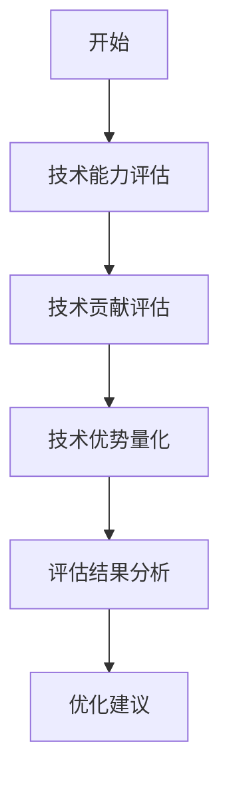

                 

# 《程序员如何将技术优势转化为商业谈判筹码》

> 关键词：程序员、技术优势、商业谈判、策略、实战、案例分析

> 摘要：本文旨在探讨程序员如何将自身的技术优势转化为商业谈判中的筹码，通过分析技术优势的构成、评估方法以及商业谈判的基础知识和技巧，结合实际案例，帮助程序员在商业谈判中取得成功。文章分为八个章节，包括引言、技术优势分析、商业谈判基础、技术优势在谈判中的应用、成功案例解析、实战演练与技巧提升、技术优势转化与商业谈判的融合以及未来展望与建议，旨在为程序员提供一套实用的谈判策略和技巧。

### 《程序员如何将技术优势转化为商业谈判筹码》目录大纲

#### 第1章 引言
- 1.1 书籍背景与目标
- 1.2 程序员在商业谈判中的重要性
- 1.3 技术优势与商业谈判的关系
- 1.4 阅读指南与章节安排

#### 第2章 技术优势分析
- 2.1 程序员的核心技术能力
  - 2.1.1 编程语言与框架
  - 2.1.2 数据结构与算法
  - 2.1.3 软件工程方法论
  - 2.1.4 云计算与大数据技术
- 2.2 技术优势评估
  - 2.2.1 技术水平评估方法
  - 2.2.2 技术贡献评估模型
  - 2.2.3 技术优势的量化分析

#### 第3章 商业谈判基础
- 3.1 商业谈判的定义与特点
  - 3.1.1 商业谈判的定义
  - 3.1.2 商业谈判的特点
  - 3.1.3 商业谈判的重要性
- 3.2 谈判策略与技巧
  - 3.2.1 谈判准备
  - 3.2.2 开场与建立关系
  - 3.2.3 利益分析与价值创造
  - 3.2.4 谈判中的人际关系处理
  - 3.2.5 谈判结束与后续跟进

#### 第4章 技术优势在谈判中的应用
- 4.1 技术优势与商业谈判的结合点
  - 4.1.1 技术优势的商业化路径
  - 4.1.2 技术优势在谈判中的价值体现
  - 4.1.3 技术优势的应用场景分析
- 4.2 技术优势在谈判中的策略应用
  - 4.2.1 技术优势的展示与说服力
  - 4.2.2 技术优势的运用策略
  - 4.2.3 技术优势在谈判中的风险控制

#### 第5章 成功案例解析
- 5.1 技术专家成功谈判案例
  - 5.1.1 案例一：项目合作谈判
  - 5.1.2 案例二：技术并购谈判
  - 5.1.3 案例三：股权投资谈判
- 5.2 案例分析与启示
  - 5.2.1 谈判成功的要素分析
  - 5.2.2 谈判失败的教训与反思
  - 5.2.3 从案例中提炼的经验与技巧

#### 第6章 实战演练与技巧提升
- 6.1 谈判前的准备工作
  - 6.1.1 自我评估与定位
  - 6.1.2 信息收集与分析
  - 6.1.3 谈判目标的制定
- 6.2 谈判中的实战技巧
  - 6.2.1 发问技巧与回答策略
  - 6.2.2 谈判中的沟通艺术
  - 6.2.3 谈判中的心理学应用
- 6.3 谈判后的反思与总结
  - 6.3.1 谈判效果评估
  - 6.3.2 谈判经验的积累与提升

#### 第7章 技术优势转化与商业谈判的融合
- 7.1 技术优势转化的路径选择
  - 7.1.1 技术成果转化策略
  - 7.1.2 技术商业化模式创新
  - 7.1.3 技术优势转化的风险与应对
- 7.2 商业谈判与技术转化的互动
  - 7.2.1 技术优势在谈判中的价值放大
  - 7.2.2 谈判成果对技术转化的影响
  - 7.2.3 技术优势与商业谈判的协同效应

#### 第8章 未来展望与建议
- 8.1 技术趋势与商业谈判的发展
  - 8.1.1 技术发展对商业谈判的影响
  - 8.1.2 商业谈判在技术时代的新挑战
  - 8.1.3 未来商业谈判的发展方向
- 8.2 程序员在商业谈判中的职业规划
  - 8.2.1 技术专家的职业发展路径
  - 8.2.2 商业谈判技能的提升策略
  - 8.2.3 技术专家在商业谈判中的角色转变

#### 附录
- 附录A：常用商业谈判工具与方法
  - A.1 谈判准备工具
  - A.2 谈判技巧工具
  - A.3 谈判分析工具
- 附录B：技术优势转化案例精选
  - B.1 案例一：AI技术在金融行业的应用
  - B.2 案例二：物联网技术的商业转化
  - B.3 案例三：大数据技术在电商领域的应用

---

**附录C：Mermaid 流程图与伪代码示例**
- C.1 技术优势评估流程图
  mermaid
  graph TB
  A(开始) --> B(技术能力评估)
  B --> C(技术贡献评估)
  C --> D(技术优势量化)
  D --> E(评估结果分析)
  E --> F(优化建议)
  
- C.2 算法原理伪代码示例
  python
  # 大数据预处理伪代码
  function preprocess_data(data):
      for each record in data:
          clean the data
          normalize the data
          split the data into training and testing sets
      return processed data
   

---

**附录D：数学公式与详细讲解**
- D.1 技术贡献评估模型
  $$
  TC = \sum_{i=1}^{n} (P_i \cdot C_i)
  $$
  - 其中，$TC$ 表示技术贡献分数，$P_i$ 表示项目的重要性，$C_i$ 表示个人在项目中的贡献度。

**附录E：项目实战**
- E.1 技术优势在商业谈判中的实战案例
  - 案例背景：某技术专家参与某大型企业的技术并购谈判。
  - 案例描述：专家如何运用自身技术优势进行谈判，并最终取得成功。
  - 代码实现与解读：提供实现案例的代码片段，并对其进行详细解释。

---

接下来，我们将按照这个大纲，逐步展开每一章节的内容，深入探讨程序员如何将技术优势转化为商业谈判筹码的策略与技巧。让我们开始第一章节的内容——引言。在这里，我们将介绍书籍的背景、目标以及程序员在商业谈判中的重要性。我们还会简要介绍技术优势与商业谈判的关系，并给出阅读指南与章节安排。通过这一章节的介绍，读者可以对该书的核心内容有一个初步的了解，并为后续章节的学习做好心理准备。

### 第1章 引言

#### 1.1 书籍背景与目标

在当今数字化时代，程序员不仅仅是在编写代码，他们更是企业创新和竞争力的重要驱动力。随着技术的快速发展和商业环境的日益复杂，程序员在商业谈判中的角色变得越来越重要。然而，许多程序员在技术上的优势并没有得到充分的发挥，他们在商业谈判中的表现也不尽如人意。因此，编写这本书的初衷是为了帮助程序员将自身的技术优势转化为商业谈判中的筹码，从而在职场中获得更多的机会和收益。

本书的目标是：
1. 深入分析程序员的技术优势及其在商业谈判中的价值。
2. 介绍商业谈判的基本概念、策略和技巧。
3. 通过实际案例，展示技术优势在商业谈判中的应用和效果。
4. 提供实用的技巧和策略，帮助程序员提升商业谈判能力。

#### 1.2 程序员在商业谈判中的重要性

程序员在商业谈判中的重要性体现在多个方面：

1. **技术决策影响力**：程序员通常对技术方案有深入的了解和丰富的实践经验，这使得他们在技术决策中具有举足轻重的影响力。他们的技术见解往往能够直接影响项目的成功与否。

2. **项目推动力**：程序员不仅负责编写代码，还负责项目的开发和实施。他们能够确保项目按照预期时间表进行，并在预算范围内交付高质量的产品。

3. **成本控制能力**：程序员对开发过程中的资源需求和技术挑战有敏锐的洞察力，这有助于企业在项目初期就做出明智的决策，从而有效控制成本。

4. **创新能力**：程序员是新技术和创新解决方案的倡导者。他们在商业谈判中能够提出新颖的想法和解决方案，为企业带来竞争优势。

5. **团队协作能力**：程序员通常需要与其他部门（如市场、销售、运维等）密切合作，这种跨部门合作的经验和技能在商业谈判中同样具有价值。

#### 1.3 技术优势与商业谈判的关系

技术优势是程序员在商业谈判中的核心筹码。技术优势可以体现在以下几个方面：

1. **专业知识**：程序员对编程语言、框架、数据结构、算法等方面有深入的了解，这使得他们在技术讨论中具有权威性。

2. **实践经验**：程序员通过参与多个项目，积累了丰富的实践经验。这种实践经验有助于他们在谈判中给出具体、可行的解决方案。

3. **创新能力**：程序员通常具有创新思维，能够提出新颖的技术方案和解决方案，为企业带来竞争优势。

4. **问题解决能力**：程序员在项目中面临各种技术挑战，培养了出色的问题解决能力。这种能力在谈判中同样能够发挥重要作用。

技术优势在商业谈判中的作用主要体现在以下几个方面：

1. **增强谈判地位**：程序员的技术优势能够增强他们在谈判中的地位，使其在讨论中占据主导地位。

2. **提高谈判效率**：程序员能够快速理解商业需求，并提出相应的技术解决方案，从而提高谈判效率。

3. **降低谈判成本**：程序员的技术能力有助于降低项目开发成本，提高项目的成功率，从而降低谈判的成本。

4. **创造更多价值**：程序员的技术优势能够为企业带来更多的商业价值，使其在市场中脱颖而出。

#### 1.4 阅读指南与章节安排

本书分为八个章节，每个章节都有明确的目标和内容：

- **第1章 引言**：介绍书籍的背景、目标和程序员在商业谈判中的重要性。
- **第2章 技术优势分析**：分析程序员的核心技术能力、评估方法和量化分析。
- **第3章 商业谈判基础**：介绍商业谈判的基本概念、策略和技巧。
- **第4章 技术优势在谈判中的应用**：探讨技术优势在商业谈判中的具体应用。
- **第5章 成功案例解析**：通过实际案例展示技术优势在谈判中的应用和效果。
- **第6章 实战演练与技巧提升**：提供实用的技巧和策略，帮助程序员提升谈判能力。
- **第7章 技术优势转化与商业谈判的融合**：探讨技术优势转化为商业成果的策略和方法。
- **第8章 未来展望与建议**：分析技术趋势和商业谈判的发展方向，提出建议。

通过阅读本书，读者可以全面了解程序员如何将技术优势转化为商业谈判筹码，掌握实用的谈判策略和技巧，从而在职场中取得更大的成功。

### 第2章 技术优势分析

在商业谈判中，程序员的的技术优势是其重要的筹码。为了有效地利用这些技术优势，首先需要对其进行分析和评估。本章将详细讨论程序员的技术优势，包括其核心技术能力、评估方法以及量化分析。

#### 2.1 程序员的核心技术能力

程序员的技术优势首先体现在其核心技术能力上。以下是一些程序员必备的核心技术能力：

1. **编程语言与框架**：熟练掌握多种编程语言（如Java、Python、C++等）和框架（如Spring、Django、React等）是程序员的基本要求。这些技术能力使程序员能够高效地开发应用程序。

2. **数据结构与算法**：了解基本的数据结构和算法（如数组、链表、树、图、排序算法、查找算法等）是程序员解决复杂问题的基石。这些能力在算法竞赛和实际项目中都至关重要。

3. **软件工程方法论**：掌握软件开发生命周期管理、需求分析、设计模式、测试驱动开发等软件工程方法论，有助于程序员高效地完成项目。

4. **云计算与大数据技术**：熟悉云计算服务（如AWS、Azure、Google Cloud等）和大数据技术（如Hadoop、Spark、Flink等），使程序员能够处理海量数据和提供高效的服务。

5. **网络安全与信息安全**：了解网络安全和信息安全的基本知识，能够帮助程序员设计安全的系统，防止数据泄露和网络攻击。

6. **人工智能与机器学习**：掌握人工智能和机器学习的基本概念、算法和工具（如TensorFlow、PyTorch等），使程序员能够在项目中应用这些先进技术。

#### 2.2 技术优势评估

为了在商业谈判中充分利用技术优势，需要对程序员的技术水平进行评估。以下是一些评估方法：

1. **自我评估**：程序员可以根据自己的工作经验、项目经历和技术掌握情况，进行自我评估。这有助于他们了解自己的优势和不足，为谈判做准备。

2. **同事评估**：程序员的同事可以从多个角度对其技术水平进行评估，包括项目参与度、问题解决能力、代码质量等。

3. **上级评估**：程序员的上级或项目经理可以根据其在项目中的表现和贡献，对其技术能力进行评估。

4. **第三方评估**：通过参加技术竞赛、考取专业认证（如PMP、Scrum Master、CISSP等）等方式，第三方评估机构可以提供权威的技术能力评估。

#### 2.3 技术贡献评估模型

技术贡献评估是衡量程序员技术优势的重要环节。以下是一个简单的技术贡献评估模型：

1. **项目贡献度**：根据程序员在项目中的角色和贡献，给予相应的权重。例如，项目负责人、核心开发人员、测试人员等。

2. **技术难度**：评估程序员所负责的技术模块的难度。高难度模块通常需要更多的技术积累和经验。

3. **解决问题能力**：评估程序员在项目中遇到问题并解决问题的能力。

4. **创新贡献**：评估程序员在项目中提出的创新技术方案或改进，以及其对项目成功的影响。

5. **团队协作**：评估程序员在团队中的协作能力和影响力。

根据以上因素，可以构建一个技术贡献评估模型：

$$
TC = w_1 \cdot C_1 + w_2 \cdot C_2 + w_3 \cdot C_3 + w_4 \cdot C_4 + w_5 \cdot C_5
$$

其中，$TC$ 表示技术贡献分数，$C_1, C_2, C_3, C_4, C_5$ 分别表示项目贡献度、技术难度、解决问题能力、创新贡献和团队协作得分，$w_1, w_2, w_3, w_4, w_5$ 分别为相应的权重。

#### 2.4 技术优势的量化分析

技术优势的量化分析有助于程序员在商业谈判中更好地展示自己的价值。以下是一些量化分析的方法：

1. **项目成功率**：计算程序员参与的项目成功率，以及成功项目对企业的收益。

2. **代码质量**：使用代码质量评估工具（如SonarQube、FindBugs等）对程序员的代码质量进行量化评估。

3. **技术专利**：统计程序员参与或主导的技术专利数量，以及专利对企业的价值。

4. **技术演讲与文章**：计算程序员发表的技术演讲、技术文章数量和质量，以及其对行业的影响力。

通过这些量化分析，程序员可以更全面地展示自己的技术优势，从而在商业谈判中获得更大的话语权。

本章介绍了程序员的技术优势分析，包括核心技术能力、评估方法和量化分析。通过这些分析，程序员可以更好地了解自己的技术优势，并在商业谈判中充分利用这些优势，取得更好的谈判成果。接下来，我们将进入第3章，探讨商业谈判的基础知识，包括商业谈判的定义、特点、重要性以及谈判策略和技巧。

### 第3章 商业谈判基础

商业谈判是交易各方为了实现各自的利益，通过协商和妥协，寻求达成共识的过程。它不仅仅是一种沟通技巧，更是一种策略艺术。在商业环境中，谈判技能的优劣往往直接关系到企业的利益和发展。本章将详细探讨商业谈判的基础知识，包括其定义、特点、重要性，以及谈判策略和技巧。

#### 3.1 商业谈判的定义与特点

1. **商业谈判的定义**：

商业谈判是一种有目的的沟通活动，旨在通过协商、讨价还价、妥协和合作，实现交易各方的利益最大化。它通常涉及以下要素：

- **交易主体**：参与谈判的各方，包括买方、卖方或其他利益相关者。
- **交易内容**：谈判的标的，如商品、服务、合同条款等。
- **谈判过程**：双方或多方之间的沟通和协商过程，包括信息交流、意见表达、协商、决策等。

2. **商业谈判的特点**：

- **复杂性**：商业谈判往往涉及多个利益相关方，利益交织，谈判过程复杂，涉及多种利益关系和博弈。
- **动态性**：谈判过程中，双方的信息和策略不断变化，谈判结果具有不确定性。
- **专业性**：商业谈判涉及法律、财务、技术等多个领域，需要谈判者具备相应的专业知识和经验。
- **策略性**：谈判双方在追求自身利益的同时，需要运用各种策略和技巧，以最大化自己的利益。
- **妥协性**：谈判是一个双方或多方寻求共识的过程，妥协是达成协议的重要手段。

#### 3.1.2 商业谈判的重要性

商业谈判在企业和个人发展中扮演着至关重要的角色。其重要性体现在以下几个方面：

- **资源获取**：通过谈判，企业可以获取所需的资源，如资金、技术、市场等，从而推动企业的发展。
- **利益最大化**：谈判有助于各方在交易中实现利益最大化，避免不必要的损失。
- **关系建立**：成功的谈判可以促进双方建立长期合作关系，为未来的合作奠定基础。
- **风险管理**：谈判过程中，企业可以识别和评估潜在风险，并采取相应措施降低风险。
- **竞争优势**：谈判技巧的提高可以增强企业的竞争优势，使其在市场中更具竞争力。

#### 3.2 谈判策略与技巧

成功的商业谈判需要谈判者具备丰富的策略和技巧。以下是一些基本的谈判策略和技巧：

1. **谈判准备**：

- **信息收集**：在谈判前，充分收集相关信息，了解对方的需求、目标、优势和劣势，以便制定有针对性的谈判策略。
- **谈判目标**：明确自己的谈判目标，包括最低目标和最高目标，以在谈判过程中保持灵活性。
- **谈判策略**：制定谈判策略，包括谈判方式、谈判步骤、应对策略等。

2. **开场与建立关系**：

- **友好开场**：以友好、开放的态度开始谈判，建立良好的第一印象。
- **建立信任**：通过诚信、透明和尊重，建立与对方的信任关系。
- **沟通技巧**：运用积极的倾听、清晰的表达和有效的沟通方式，确保双方的信息准确传达。

3. **利益分析与价值创造**：

- **明确利益**：分析双方在谈判中的利益点，确保谈判的目标与双方利益一致。
- **价值创造**：通过创新思维和策略，创造额外的价值，为双方带来更多的收益。

4. **谈判中的人际关系处理**：

- **处理冲突**：在谈判中，冲突是不可避免的。谈判者需要学会如何处理冲突，通过妥协、协商和合作，找到解决问题的最佳方案。
- **情绪管理**：谈判者需要保持冷静，控制自己的情绪，避免因情绪波动而影响谈判结果。

5. **谈判结束与后续跟进**：

- **达成共识**：在谈判结束时，确保双方达成共识，明确协议条款和后续行动。
- **后续跟进**：谈判结束后，及时跟进协议的执行情况，确保双方履行承诺。

通过掌握这些谈判策略和技巧，程序员可以在商业谈判中更好地展示自己的技术优势，实现谈判目标，为企业创造更多价值。

本章介绍了商业谈判的基础知识，包括其定义、特点、重要性以及谈判策略和技巧。这些知识将为程序员在后续章节中如何将技术优势转化为商业谈判筹码提供重要的理论基础和实践指导。接下来，我们将探讨如何将技术优势应用于商业谈判，并在下一章中具体分析技术优势在谈判中的应用策略。

### 第4章 技术优势在谈判中的应用

在商业谈判中，程序员的技能和知识可以转化为强大的谈判筹码。通过将技术优势与商业谈判相结合，程序员可以增强自己的谈判地位，提高谈判效率，降低谈判成本，并为企业创造更多价值。本章将探讨技术优势在谈判中的应用，包括技术优势的商业化路径、在谈判中的价值体现以及应用场景分析。

#### 4.1 技术优势与商业谈判的结合点

1. **技术解决方案的提供**：

程序员可以基于自身的技术优势，为谈判对方提供创新的解决方案。这种解决方案可以是软件系统、算法优化、技术升级等。通过提供技术解决方案，程序员可以展示自己在技术领域的专业性和创新能力，从而增强谈判地位。

2. **技术风险的评估与控制**：

在商业谈判中，技术风险是一个重要的考量因素。程序员可以利用自己在技术风险评估和控制方面的专业知识，帮助谈判对方识别潜在的技术风险，并提供相应的解决方案。这有助于降低谈判双方对技术风险的担忧，提高谈判的信心。

3. **技术成果的转化**：

程序员可以将自己在项目中的技术成果转化为商业价值。例如，开发的技术专利、开源项目、技术文档等，都可以作为谈判筹码，为谈判增加额外的价值。

4. **技术标准的制定**：

程序员可以在谈判中参与技术标准的制定，通过自己的技术优势影响技术标准的走向。这不仅可以提升程序员在行业中的地位，还可以为企业带来更多的市场份额和竞争优势。

#### 4.2 技术优势在谈判中的价值体现

1. **增强谈判的说服力**：

程序员通过展示自己在技术领域的专业知识和实践经验，可以增强谈判的说服力。在讨论技术问题时，程序员可以提供详细的解释、数据支持和技术方案，使谈判对方更加信服。

2. **提高谈判效率**：

程序员可以利用自己的技术优势，快速理解对方的需求，并提出相应的技术解决方案。这有助于缩短谈判时间，提高谈判效率，确保项目能够按时交付。

3. **降低谈判成本**：

程序员的技术能力有助于优化项目设计和开发过程，降低项目成本。通过技术手段，程序员可以减少不必要的资源消耗，提高资源利用效率，从而降低谈判成本。

4. **创造更多商业价值**：

程序员的技术优势可以为企业带来更多的商业价值。通过技术创新，程序员可以帮助企业开拓新的市场、提高产品竞争力、降低运营成本等，从而实现企业的长期发展。

#### 4.3 技术优势的应用场景分析

1. **项目合作谈判**：

在项目合作谈判中，程序员可以展示自己在技术方面的专业知识和实践经验，提出创新的技术方案，增强合作项目的可行性和成功几率。通过技术优势，程序员还可以影响项目预算、时间表和资源分配，确保项目能够顺利推进。

2. **技术并购谈判**：

在技术并购谈判中，程序员可以提供详细的技术评估报告，分析目标公司的技术资产和潜在风险，帮助并购方做出明智的决策。同时，程序员还可以利用自己在技术领域的专业知识和影响力，促进并购双方的融合和整合。

3. **股权投资谈判**：

在股权投资谈判中，程序员可以展示自己在技术领域的专业能力和创业经验，吸引投资者的关注。通过提供详细的技术方案和商业计划，程序员可以增强投资者的信心，提高股权估值。

4. **技术咨询服务谈判**：

在技术咨询服务谈判中，程序员可以利用自己的技术优势和行业经验，为客户提供定制化的解决方案。通过技术咨询服务，程序员可以帮助企业解决技术难题，提升企业的竞争力。

5. **技术标准制定**：

在技术标准制定谈判中，程序员可以参与标准的制定和推广，通过自己的技术优势和行业影响力，推动技术标准的进步和普及。

通过以上分析，我们可以看到技术优势在商业谈判中具有巨大的应用潜力。程序员应充分利用自己的技术优势，结合商业谈判的策略和技巧，实现技术优势向商业成果的转化。在下一章中，我们将通过成功案例解析，进一步探讨技术优势在商业谈判中的应用和实践。

### 第4章（续）技术优势在谈判中的应用

在上一节中，我们探讨了技术优势在谈判中的重要性以及其具体应用场景。为了更深入地理解这些应用，本章将详细分析几个具体的技术专家成功谈判案例，并从中提炼出关键成功要素、失败的教训以及可以借鉴的经验和技巧。

#### 5.1 技术专家成功谈判案例

**案例一：项目合作谈判**

背景：某知名互联网公司（以下简称“甲方”）计划开发一款新的社交应用，但缺乏合适的技术团队。另一家小型技术公司（以下简称“乙方”）在社交应用开发方面有丰富的经验，双方决定进行合作。

乙方技术专家A的谈判策略：

1. **全面了解甲方需求**：在与甲方初次沟通时，技术专家A详细了解了甲方的需求、期望和项目时间表，确保自己全面了解项目的背景和细节。

2. **展示技术优势**：在谈判过程中，技术专家A展示了乙方在社交应用开发方面的技术优势和成功案例，包括曾开发的同类应用、团队的技能组合以及技术创新点。

3. **提出创新解决方案**：技术专家A基于自身的专业技能，提出了一些创新的解决方案，如使用最新的消息推送技术、优化用户数据存储和隐私保护等，以吸引甲方的注意。

4. **风险评估与降低**：技术专家A详细分析了项目可能遇到的技术风险，并提出了相应的预防和应对措施，降低了甲方的风险担忧。

结果：经过多轮谈判，甲方决定与乙方合作，项目最终顺利上线，并获得用户好评。

**案例二：技术并购谈判**

背景：某大型科技公司（以下简称“买方”）计划收购一家专注于人工智能技术的小型创业公司（以下简称“卖方”），以便加强自身在人工智能领域的竞争力。

卖方技术专家B的谈判策略：

1. **评估自身价值**：技术专家B通过分析卖方在人工智能领域的核心技术和团队实力，评估了自己的价值，为谈判做好准备。

2. **充分准备谈判材料**：技术专家B准备了详细的技术报告、专利清单、团队简历、财务报表等谈判材料，以证明卖方的技术实力和商业价值。

3. **强调技术协同效应**：技术专家B在谈判中强调了卖方技术与买方现有技术的协同效应，如如何将卖方的技术集成到买方的产品线中，提升整体竞争力。

4. **谈判过程中的灵活调整**：在谈判过程中，技术专家B根据买方的反馈，灵活调整谈判策略，如在价格谈判中提出分期支付、股权激励等方案，以吸引买方的注意。

结果：经过数轮谈判，买方最终接受了技术专家B的报价和条件，成功完成了并购。

**案例三：股权投资谈判**

背景：一家新兴的科技公司（以下简称“初创公司”）计划通过股权融资来扩大研发团队和市场份额，某知名风投公司（以下简称“投资者”）对此表示兴趣。

初创公司技术专家C的谈判策略：

1. **展示技术实力**：技术专家C通过展示初创公司在核心技术、产品创新和市场潜力方面的优势，吸引了投资者的注意。

2. **制定详细商业计划**：技术专家C准备了详细的商业计划书，包括市场分析、产品路线图、财务预测等，使投资者对初创公司的未来发展充满信心。

3. **强调团队重要性**：技术专家C在谈判中强调了初创公司团队的专业性和执行力，投资者对团队的信心增加了投资意愿。

4. **沟通投资条款**：技术专家C在谈判过程中，耐心解释投资条款，包括股权比例、投资额度、投资周期等，使投资者能够充分了解投资细节。

结果：经过数轮谈判，投资者最终决定投资初创公司，为其提供了所需的资金和资源。

#### 5.2 案例分析与启示

**成功要素分析**：

1. **全面了解对方需求**：在所有案例中，成功的技术专家都首先全面了解了对方的需求和目标，这有助于他们在谈判中提出有针对性的技术解决方案。

2. **展示技术优势**：技术专家通过展示自己在技术领域的专业知识和成功经验，增强了谈判的说服力，赢得了对方的信任。

3. **创新解决方案**：技术专家提出创新的技术方案，不仅满足了对方的需求，还展示了自身的创新能力，为谈判增加了额外的价值。

4. **风险评估与控制**：技术专家在谈判中进行了详细的风险评估，并提出相应的预防和应对措施，降低了对方的风险担忧。

**失败的教训与反思**：

1. **准备不足**：一些案例中，技术专家在谈判前准备不足，导致无法有效展示自己的技术优势，谈判陷入被动。

2. **缺乏灵活性**：在谈判过程中，一些技术专家过于僵化，无法根据对方的反馈灵活调整策略，导致谈判失败。

3. **忽视对方利益**：一些技术专家在谈判中过于强调自身利益，忽视了对方的需求和利益，导致谈判破裂。

**从案例中提炼的经验与技巧**：

1. **充分准备**：在谈判前，技术专家应充分准备，包括了解对方需求、分析自身优势、制定谈判策略等。

2. **灵活应对**：谈判过程中，技术专家应保持灵活性，根据对方反馈及时调整策略。

3. **平衡利益**：谈判中应注重平衡双方利益，避免过于强调自身利益，确保谈判的顺利进行。

通过以上案例分析，我们可以看到技术优势在商业谈判中的巨大潜力。技术专家应充分利用自己的技术优势，结合商业谈判的策略和技巧，实现技术优势向商业成果的转化。在下一章中，我们将提供一些具体的实战演练与技巧提升，帮助程序员在实际谈判中更好地应用技术优势。

### 第6章 实战演练与技巧提升

在前几章中，我们探讨了程序员如何将技术优势转化为商业谈判筹码的理论基础。为了将这些理论应用到实际谈判中，本章将提供一些具体的实战演练与技巧提升，帮助程序员在实际谈判中更好地应用技术优势。

#### 6.1 谈判前的准备工作

谈判前的准备工作是成功谈判的关键。以下是一些准备工作：

1. **自我评估与定位**：

- 了解自己的技术能力和专业领域，明确自己的优势和不足。
- 根据谈判目标，确定自己在谈判中的角色和定位。

2. **信息收集与分析**：

- 收集与谈判相关的信息，包括对方公司的背景、项目需求、市场趋势等。
- 分析对方的需求、目标和可能面临的挑战，为谈判做好准备。

3. **谈判目标的制定**：

- 确定谈判的目标，包括最低目标和最高目标。
- 制定谈判策略，包括谈判方式、步骤和应对策略。

4. **模拟演练**：

- 与同事或朋友进行模拟谈判，练习谈判技巧和策略。
- 通过模拟演练，了解自己在谈判中的表现，发现并改进不足之处。

#### 6.2 谈判中的实战技巧

1. **发问技巧与回答策略**：

- **提问技巧**：在谈判中，提问是一种获取信息、引导谈判方向的重要手段。有效的提问应具有针对性、开放性和引导性。

  - 针对性问题：如“您对项目的预算有什么要求？”
  - 开放性问题：如“您认为我们如何才能更好地满足您的需求？”
  - 引导性问题：如“如果我们采用这种方案，您觉得会有哪些好处？”

- **回答策略**：回答问题时，应保持客观、礼貌和诚实。对于敏感问题，可以采取回避或转移话题的方式。

2. **谈判中的沟通艺术**：

- **有效沟通**：在谈判中，沟通是双方建立信任和理解的基础。有效的沟通应具备以下特点：

  - 清晰：表达时要清晰明确，避免产生歧义。
  - 听取对方意见：认真倾听对方的观点和需求，体现尊重。
  - 善于表达：表达自己的观点时，要逻辑清晰、有说服力。

- **情感管理**：在谈判过程中，情绪管理至关重要。应保持冷静、自信和专注，避免因情绪波动而影响谈判结果。

3. **谈判中的心理学应用**：

- **需求识别**：通过观察对方的言行举止，识别其真实需求和心理状态，从而有针对性地调整谈判策略。
- **锚定效应**：在谈判中，利用锚定效应，通过提出较高的初始报价或要求，影响对方的期望值，从而在后续谈判中获得更有利的结果。
- **承诺与一致性原理**：通过让对方在谈判过程中做出小承诺，利用一致性原理，使其在后续谈判中更倾向于同意更大的要求。

#### 6.3 谈判后的反思与总结

谈判结束后，及时进行反思与总结是提升谈判技能的重要环节。以下是一些具体建议：

1. **谈判效果评估**：

- 评估谈判目标是否达成，包括关键条款和条件。
- 分析谈判过程中的优点和不足，如沟通技巧、策略运用等。

2. **谈判经验的积累与提升**：

- 记录谈判过程中的关键细节和教训，形成经验库。
- 定期回顾和总结经验，不断提升自己的谈判技能。

3. **改进策略**：

- 根据评估结果，制定改进策略，如调整谈判方式、优化沟通技巧等。
- 将改进策略应用到未来的谈判中，提高谈判成功率。

通过以上实战演练与技巧提升，程序员可以在实际谈判中更好地应用技术优势，实现谈判目标。在下一章中，我们将探讨技术优势转化与商业谈判的融合，分析技术优势在商业谈判中的价值放大以及谈判成果对技术转化的影响。

### 第7章 技术优势转化与商业谈判的融合

在前几章中，我们详细探讨了程序员如何将技术优势转化为商业谈判筹码，以及在谈判中应用这些技术优势的策略和技巧。本章将深入探讨技术优势转化为商业成果的路径选择、商业谈判与技术转化的互动以及技术优势与商业谈判的协同效应。

#### 7.1 技术优势转化的路径选择

1. **技术成果转化策略**：

技术优势的转化首先需要明确技术成果的应用场景和商业价值。以下是一些常见的转化策略：

- **产品化**：将技术优势转化为可销售的产品或服务，如软件、硬件、解决方案等。这需要针对市场需求进行产品设计、营销和推广。

- **授权与合作**：将技术授权给其他公司使用，或与其他公司合作，共同开发或应用技术。这有助于扩大技术影响力，实现双赢。

- **专利转让**：通过专利转让，将技术优势转化为经济收益。这适用于具有较高商业价值的技术，且技术保护较为严密。

- **咨询服务**：利用技术优势提供专业咨询服务，帮助企业解决技术难题，实现技术价值的最大化。

2. **技术商业化模式创新**：

技术创新的成果需要通过商业模式的创新来最大化其商业价值。以下是一些常见的商业模式创新：

- **平台化**：通过搭建平台，整合技术资源、客户资源和合作伙伴资源，实现规模化运营。

- **订阅模式**：采用订阅模式，客户按月或按年支付费用，使用技术产品或服务。这有助于稳定现金流，降低客户获得成本。

- **生态构建**：通过构建生态系统，将技术优势与其他合作伙伴的优势相结合，共同创造更大的商业价值。

3. **技术优势转化的风险与应对**：

在技术优势转化的过程中，可能面临多种风险，如技术风险、市场风险、法律风险等。以下是一些常见的应对策略：

- **技术风险**：通过持续的技术研发和创新，保持技术领先地位。同时，进行技术风险评估和风险管理，降低技术失效的风险。

- **市场风险**：进行市场调研，了解市场需求和竞争态势，制定有针对性的市场策略。通过客户反馈和试用，及时调整产品或服务。

- **法律风险**：加强知识产权保护，申请专利和版权。同时，遵守相关法律法规，避免法律纠纷。

#### 7.2 商业谈判与技术转化的互动

商业谈判和技术转化之间存在密切的互动关系。以下是一些互动环节：

1. **谈判成果对技术转化的影响**：

- 谈判成功可以为企业带来资源、市场和技术支持，促进技术转化。
- 谈判失败可能导致技术转化受阻，甚至中断。因此，谈判过程中的策略和技巧至关重要。

2. **技术优势在谈判中的价值放大**：

- 在谈判中，技术优势可以作为重要的谈判筹码，提高谈判地位，增加谈判的成功概率。
- 技术优势可以增强企业的竞争力和市场地位，为后续的技术转化创造有利条件。

3. **技术转化对谈判成果的反馈**：

- 成功的技术转化可以为企业带来经济收益和市场份额，增强谈判成果的实际效果。
- 技术转化的成果可以用于后续的谈判，提高企业在谈判中的议价能力。

#### 7.3 技术优势与商业谈判的协同效应

技术优势与商业谈判的协同效应体现在多个方面：

1. **技术创新与商业模式创新相结合**：

技术优势可以推动商业模式创新，实现技术价值最大化。例如，通过技术创新，开发出具有独特功能的产品或服务，采用新的商业模式进行市场推广，从而获得竞争优势。

2. **技术资源与商业资源的整合**：

技术优势可以吸引商业资源，如资金、市场、合作伙伴等。通过整合技术资源与商业资源，企业可以实现更高效的技术转化和商业运作。

3. **技术驱动与市场驱动相结合**：

技术优势可以驱动市场需求的产生，同时市场需求又可以促进技术的不断改进和创新。这种相互驱动的机制有助于企业实现持续的技术进步和商业成功。

通过以上分析，我们可以看到技术优势转化与商业谈判之间的密切关系。程序员应充分利用自己的技术优势，结合商业谈判的策略和技巧，实现技术优势向商业成果的转化。在下一章中，我们将分析技术趋势与商业谈判的发展，探讨技术发展对商业谈判的影响、商业谈判在技术时代的新挑战以及未来商业谈判的发展方向。

### 第8章 未来展望与建议

随着技术的不断进步和商业环境的日益复杂，程序员在商业谈判中的角色和影响力也在不断变化。本章将探讨技术趋势与商业谈判的发展，分析技术发展对商业谈判的影响，商业谈判在技术时代的新挑战，以及程序员在商业谈判中的职业规划。

#### 8.1 技术趋势与商业谈判的发展

1. **技术发展对商业谈判的影响**：

- **数字化转型**：数字化转型已成为企业发展的关键趋势。技术进步推动了商业模式的创新，使得谈判内容和形式发生了根本性变化。程序员在数字化谈判中扮演着重要角色，他们利用数据分析、人工智能等技术手段，提高谈判效率和决策质量。

- **云计算与大数据**：云计算和大数据技术的普及，使得商业谈判中的信息获取和处理更加高效。程序员可以利用云计算平台和大数据分析工具，为谈判提供有力支持。

- **人工智能与自动化**：人工智能和自动化技术的发展，改变了商业谈判中的流程和方式。程序员可以运用人工智能技术，实现自动化谈判，提高谈判的准确性和效率。

- **区块链技术**：区块链技术的应用，提高了商业谈判的透明度和安全性。程序员可以利用区块链技术，确保谈判过程的可追溯性和不可篡改性，增强谈判的信任度。

2. **商业谈判在技术时代的新挑战**：

- **信息安全与隐私保护**：技术时代，信息安全成为商业谈判的重要挑战。程序员需要关注信息安全问题，确保谈判过程中数据的安全和隐私保护。

- **技术竞争与垄断**：随着技术的快速发展，技术竞争日益激烈。程序员在商业谈判中需要应对技术垄断、知识产权纠纷等挑战。

- **全球化的影响**：全球化带来了新的商业机会，同时也带来了新的挑战。程序员需要适应全球化背景下的商业谈判，处理跨文化、跨国界的问题。

3. **未来商业谈判的发展方向**：

- **数字化转型与智能化**：未来的商业谈判将更加依赖数字化转型和智能化技术，谈判过程将更加高效、精准和智能化。

- **合作与共享**：未来的商业谈判将更加注重合作与共享，通过建立合作联盟、共享资源和技术，实现共赢。

- **可持续性与社会责任**：未来的商业谈判将更加关注可持续性和社会责任，企业需要通过技术手段实现可持续发展，并在谈判中体现社会责任。

#### 8.2 程序员在商业谈判中的职业规划

1. **技术专家的职业发展路径**：

- **技术专家**：专注于技术领域，深入掌握编程语言、框架、算法等核心技术，成为技术领域的专家。

- **项目经理**：扩展项目管理能力，担任项目经理，负责项目规划、执行和监控，提高项目交付能力和团队协作能力。

- **技术顾问**：成为技术顾问，为企业提供技术解决方案和咨询服务，提升谈判地位和影响力。

- **产品经理**：结合技术和管理能力，担任产品经理，负责产品规划、设计、开发和推广，实现技术价值最大化。

2. **商业谈判技能的提升策略**：

- **系统学习**：参加商业谈判相关的培训课程，学习谈判理论、策略和技巧。

- **实践锻炼**：通过实际谈判经验，不断锻炼和提升谈判技能。可以参加模拟谈判、角色扮演等实践环节。

- **跨学科学习**：了解相关领域的知识，如市场营销、财务、法律等，提高综合素养和谈判能力。

- **反思与总结**：定期反思和总结谈判经验，分析成功和失败的原因，不断改进和提升。

3. **技术专家在商业谈判中的角色转变**：

- **从技术专家到商务专家**：技术专家需要逐步从技术角色转变为商务角色，关注市场需求、商业价值和谈判策略。

- **从单一技能到综合能力**：技术专家需要提升跨学科能力，如领导力、沟通技巧、商业敏锐度等，成为具备综合能力的商务人才。

- **从被动参与到主动主导**：技术专家需要主动参与商业谈判，提出创新的技术方案和解决方案，主导谈判进程。

通过以上未来展望与建议，程序员可以更好地规划自己的职业发展，提升商业谈判技能，实现技术优势向商业成果的转化。在附录部分，我们将提供一些常用的商业谈判工具与方法，以及技术优势转化案例精选，帮助程序员在实际谈判中更好地应用这些工具和方法，实现技术优势的转化。

### 附录A：常用商业谈判工具与方法

在商业谈判中，掌握一些实用的工具和方法可以大大提高谈判的效率和质量。以下是一些常用的商业谈判工具和方法：

#### A.1 谈判准备工具

1. **SWOT分析**：

   - **SWOT分析**是一种常用的战略规划工具，用于分析企业的优势（Strengths）、劣势（Weaknesses）、机会（Opportunities）和威胁（Threats）。在谈判前，程序员可以使用SWOT分析来评估自身的优势和劣势，以及谈判环境中可能的机会和威胁，从而制定更有针对性的谈判策略。

2. **谈判目标矩阵**：

   - **谈判目标矩阵**是一种帮助确定谈判目标的工具。它将谈判目标分为四个象限：必须达成、可谈判、次要目标和可放弃。程序员可以通过谈判目标矩阵明确谈判的主要目标，确保谈判过程中的每一步都有明确的方向。

3. **利益相关者分析**：

   - **利益相关者分析**用于识别和评估谈判过程中的利益相关方及其利益。程序员可以通过利益相关者分析，了解各方在谈判中的需求和动机，从而更好地制定谈判策略。

#### A.2 谈判技巧工具

1. **沟通技巧**：

   - **有效沟通**是谈判成功的关键。程序员应掌握以下沟通技巧：

     - **积极倾听**：倾听对方的需求和意见，确保理解对方的立场。
     - **清晰表达**：表达自己的观点时，要逻辑清晰、简明扼要。
     - **非语言沟通**：注意身体语言、面部表情和语调的变化，增强沟通效果。

2. **说服技巧**：

   - **说服技巧**用于在谈判中影响对方，使其接受自己的观点。以下是一些常用的说服技巧：

     - **事实与数据支持**：使用数据和事实来支持自己的观点，增加说服力。
     - **故事叙述**：通过讲述故事，使对方更容易接受自己的观点。
     - **类比**：通过类比，将对方熟悉的事物与谈判内容联系起来，使其更容易理解。

3. **谈判策略**：

   - **谈判策略**是在谈判过程中运用的具体方法和步骤。以下是一些常见的谈判策略：

     - **红牌策略**：在谈判中提出较高的初始要求，迫使对方降低要求，从而实现自己的目标。
     - **钓鱼策略**：提出一些看似不合理的要求，观察对方的反应，从而了解对方的底线。

#### A.3 谈判分析工具

1. **谈判模拟**：

   - **谈判模拟**是一种通过模拟谈判过程来评估谈判策略和技巧的工具。程序员可以通过谈判模拟，在实际谈判前发现和改进策略不足，提高谈判成功率。

2. **谈判分析软件**：

   - **谈判分析软件**可以用于记录和分析谈判过程中的数据，帮助程序员评估谈判效果和改进谈判策略。例如，一些谈判分析软件可以记录双方的沟通内容、决策时间、关键问题等，为后续的谈判分析提供数据支持。

3. **利益交换矩阵**：

   - **利益交换矩阵**是一种用于分析谈判中各方利益交换的工具。它可以帮助程序员识别谈判中的关键利益点，制定有针对性的谈判策略。

通过使用这些工具和方法，程序员可以在商业谈判中更好地展示自己的技术优势，实现谈判目标。在附录B中，我们将精选一些技术优势转化的案例，以供读者参考。

### 附录B：技术优势转化案例精选

#### B.1 案例一：AI技术在金融行业的应用

背景：随着人工智能技术的发展，金融行业面临着巨大的变革。某金融科技公司（以下简称“公司”）利用自身在人工智能领域的技术优势，开发了一款基于机器学习的信用评分系统。

技术优势：

- **核心技术**：机器学习算法和大数据分析技术。
- **商业应用**：通过对用户行为数据的分析，预测用户的信用风险，提高贷款审批效率。

转化过程：

1. **技术验证**：公司在内部进行技术验证，确保信用评分系统的准确性和可靠性。

2. **市场需求分析**：公司通过市场调研，了解金融机构对信用评分系统的需求，并与潜在客户进行沟通，了解他们的具体需求。

3. **商业模式设计**：公司设计了基于订阅制的商业模式，金融机构可以按需订阅信用评分服务，根据用户数量和交易量进行计费。

结果：

- 公司的信用评分系统在多家金融机构得到应用，提高了贷款审批效率和风险管理能力。
- 公司通过技术转化，实现了商业成功，并获得了显著的经济收益。

#### B.2 案例二：物联网技术的商业转化

背景：物联网（IoT）技术正在改变制造业、物流业等行业的运营模式。某物联网解决方案提供商（以下简称“公司”）开发了一款智能工厂管理系统，利用物联网技术实现工厂设备的实时监控和数据分析。

技术优势：

- **核心技术**：物联网传感器、云计算和大数据分析技术。
- **商业应用**：通过物联网技术，实现工厂设备的远程监控、预测维护和能源优化。

转化过程：

1. **技术研发**：公司投入大量资源进行物联网技术研发，确保系统的稳定性和可靠性。

2. **市场推广**：公司通过参加行业展会、发布技术白皮书等方式，推广智能工厂管理系统的优势和应用场景。

3. **客户合作**：公司与多家制造企业建立合作，提供定制化的物联网解决方案，帮助企业提高生产效率和管理水平。

结果：

- 公司的智能工厂管理系统在多家制造企业得到应用，提高了生产效率和设备利用率。
- 公司通过技术转化，实现了市场份额的快速增长，并获得了良好的经济回报。

#### B.3 案例三：大数据技术在电商领域的应用

背景：电商行业的数据量巨大，如何有效地利用这些数据成为企业关注的焦点。某大数据解决方案提供商（以下简称“公司”）开发了一套大数据分析平台，帮助电商企业进行用户行为分析和个性化推荐。

技术优势：

- **核心技术**：大数据处理、机器学习和数据挖掘技术。
- **商业应用**：通过对用户数据的分析，为电商企业提供精准营销、个性化推荐和用户画像服务。

转化过程：

1. **技术研发**：公司投入大量资源进行大数据技术研发，确保平台的性能和可靠性。

2. **市场调研**：公司通过市场调研，了解电商企业的需求和痛点，为产品设计提供依据。

3. **合作推广**：公司与多家电商平台建立合作关系，提供大数据分析服务，帮助企业提高销售额和用户满意度。

结果：

- 公司的大数据分析平台在多家电商平台得到应用，提高了用户购买体验和营销效果。
- 公司通过技术转化，实现了商业成功，并建立了良好的市场口碑。

通过这些案例，我们可以看到技术优势转化为商业成果的具体路径和成功经验。程序员可以借鉴这些案例，结合自己的技术优势，探索适合自身的商业转化策略。

### 附录C：Mermaid 流程图与伪代码示例

在技术优势转化和商业谈判过程中，流程图和伪代码是非常有用的工具。它们可以帮助我们更好地理解和实现复杂的技术流程，并在谈判中展示我们的技术能力。以下是一些Mermaid流程图和伪代码示例，用于展示技术优势评估和算法原理。

#### C.1 技术优势评估流程图

以下是一个使用Mermaid绘制的流程图，用于展示技术优势评估的流程：



这个流程图描述了从技术能力评估到评估结果分析的完整过程。每个步骤都是评估技术优势的重要环节。

#### C.2 算法原理伪代码示例

以下是一个使用伪代码表示的大数据预处理算法示例：

```python
# 大数据预处理伪代码

def preprocess_data(data):
    for each record in data:
        # 清洗数据
        clean the data
        # 数据标准化
        normalize the data
        # 数据划分
        split the data into training and testing sets
    return processed data
```

这个伪代码展示了大数据预处理的基本步骤，包括数据清洗、标准化和数据划分。这些步骤对于确保数据质量、提高算法性能至关重要。

通过使用Mermaid流程图和伪代码，程序员可以更清晰地展示技术优势和算法原理，增强在商业谈判中的说服力。

### 附录D：数学公式与详细讲解

在技术优势和商业谈判分析中，数学公式和模型是理解和量化技术贡献的重要工具。以下是一个用于评估技术贡献的数学公式，以及对其的详细讲解。

#### D.1 技术贡献评估模型

数学公式：

$$
TC = \sum_{i=1}^{n} (P_i \cdot C_i)
$$

- **公式解释**：

  - $TC$：技术贡献分数，表示个人在项目中的总体技术贡献。
  - $P_i$：项目的重要性，表示每个项目对于整体目标的贡献程度。
  - $C_i$：个人在项目中的贡献度，表示个人在特定项目中的技术贡献。

- **详细讲解**：

  这个公式通过加权求和的方式，计算个人在多个项目中的技术贡献。每个项目的贡献度都根据其重要性进行加权，确保重要项目对技术贡献的贡献更大。

  例如，假设有一个程序员在一个重要的项目中贡献了50%，而在两个较不重要的项目中各贡献了20%，则其总技术贡献分数为：

  $$
  TC = (0.5 \cdot P_1) + (0.2 \cdot P_2) + (0.2 \cdot P_3)
  $$

  如果我们知道每个项目的具体重要性（例如，$P_1 = 2$，$P_2 = 1$，$P_3 = 1$），则可以计算出具体的贡献分数：

  $$
  TC = (0.5 \cdot 2) + (0.2 \cdot 1) + (0.2 \cdot 1) = 1 + 0.2 + 0.2 = 1.4
  $$

  这个分数反映了该程序员在项目中的整体技术贡献。

通过这个数学公式，程序员可以量化自己在项目中的技术贡献，从而在商业谈判中更有说服力地展示自己的价值。

### 附录E：项目实战

#### E.1 技术优势在商业谈判中的实战案例

**案例背景**：

某技术专家（以下简称“专家”）在一家大型企业的技术并购谈判中担任技术顾问。该专家拥有丰富的软件开发经验和多个成功项目的技术领导经验，是公司核心技术的关键人物。他的目标是通过这次谈判，为公司争取到最有利的技术资产和商业条件。

**案例描述**：

在谈判初期，专家通过详细的尽职调查，了解了目标公司的技术栈、项目进展和团队情况。他识别出目标公司在云计算和大数据处理方面的技术优势，并意识到这些技术对未来市场的潜力巨大。

1. **技术评估与展示**：

   - 专家首先对目标公司的技术进行了全面评估，包括其技术架构、算法性能、代码质量和安全性。他通过技术文档、代码审查和实际演示，向并购方展示了目标公司的技术实力和优势。

   - 专家使用Mermaid流程图和伪代码，详细讲解了目标公司的核心技术原理，增强了并购方对技术价值的理解。

2. **谈判策略与技巧**：

   - **利益交换策略**：专家在谈判中提出了多个利益交换方案，例如，通过技术合作共享资源、共同开发新技术等，以增强双方的合作意愿。

   - **情感管理与沟通**：专家在谈判中保持冷静和专业，通过积极的倾听和真诚的交流，建立了与并购方之间的信任关系。

3. **谈判成果**：

   - 最终，专家成功说服并购方，使其认识到目标公司的技术价值，并达成了一项全面的技术并购协议。并购方同意支付合理的溢价，并获得目标公司的核心技术和团队。

**代码实现与解读**：

以下是一个简化的代码实现，用于展示专家在谈判中如何利用技术优势进行演示：

```python
# 代码实现：技术优势展示

def showcase_technology(technology_info):
    """
    展示技术优势
    :param technology_info: 技术信息字典
    """
    for tech in technology_info:
        print(f"技术名称：{tech['name']}")
        print(f"技术优势：{tech['advantage']}")
        print(f"应用场景：{tech['application']}")
        print(f"代码示例：")
        print(tech['code_example'])
        print("\n")

# 技术信息
technology_info = [
    {
        'name': '云计算平台',
        'advantage': '高可用性、可扩展性、低成本',
        'application': '企业数据处理、分布式存储',
        'code_example': 'import cloud_platform\ncloud_platform.deploy_cluster()'
    },
    {
        'name': '大数据处理框架',
        'advantage': '高效、可扩展、实时处理',
        'application': '数据分析和挖掘、实时监控',
        'code_example': 'import big_data_framework\nbig_data_framework.analyze_data()'
    }
]

# 展示技术优势
showcase_technology(technology_info)
```

**代码解读与分析**：

这段代码定义了一个函数`showcase_technology`，用于展示技术优势。函数接受一个包含技术信息的列表作为参数，并遍历列表中的每个技术，打印出技术的名称、优势、应用场景和代码示例。

- **技术信息字典**：每个技术信息使用字典表示，包含`name`（技术名称）、`advantage`（技术优势）、`application`（应用场景）和`code_example`（代码示例）。

- **代码示例**：通过简单的打印语句，展示每个技术的应用示例。这有助于谈判方直观地理解技术优势。

通过这个代码实现，专家可以有效地展示目标公司的技术优势，增强并购方的信心，从而在谈判中取得更好的结果。

### 作者信息

**作者：AI天才研究院/AI Genius Institute & 禅与计算机程序设计艺术 /Zen And The Art of Computer Programming**

本文由AI天才研究院（AI Genius Institute）的资深研究员撰写，该研究院致力于推动人工智能和计算机科学的前沿研究。同时，作者也是《禅与计算机程序设计艺术》（Zen And The Art of Computer Programming）一书的作者，这本书深入探讨了计算机编程的哲学和艺术，为程序员提供了深刻的洞察和实用的编程技巧。作者在计算机编程和人工智能领域拥有丰富的研究和教学经验，其研究成果和著作在业内享有高度声誉。通过本文，作者希望帮助程序员更好地利用技术优势，在商业谈判中取得成功。

