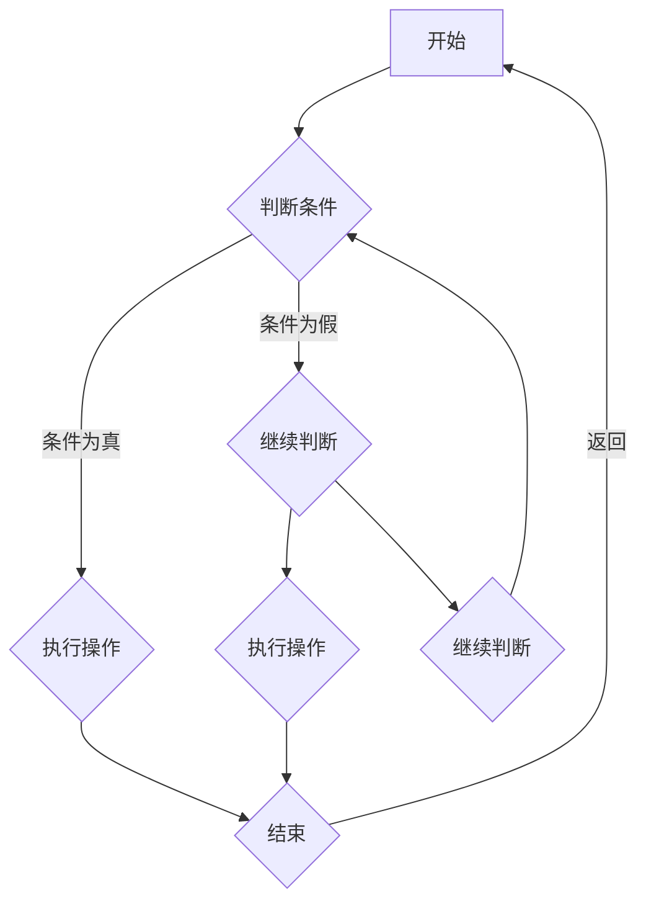

                 

# 《程序员如何建立长期的职业竞争力》

## 关键词

编程、职业规划、技术提升、软技能、职业成长、个人品牌

## 摘要

在快速变化的科技行业中，程序员面临着持续学习和不断适应新技术的挑战。为了在职业生涯中保持竞争力，程序员需要制定清晰的职业规划，提升技术能力，增强软技能，并通过实战和知识分享不断积累经验。本文将详细探讨程序员如何通过系统性的规划和不断的努力，建立和保持长期的职业竞争力。

---

## 《程序员如何建立长期的职业竞争力》目录大纲

- **第一部分：职业规划与自我提升**
  - 第1章：程序员职业发展概述
    - 1.1 程序员职业现状分析
    - 1.2 程序员职业发展趋势
    - 1.3 如何评估自己的职业竞争力
  - 第2章：职业规划与目标设定
    - 2.1 职业目标的重要性
    - 2.2 如何设定可行的职业目标
    - 2.3 职业规划的实施策略
  - 第3章：技术能力提升策略
    - 3.1 技术学习途径与方法
    - 3.2 技术栈的构建与优化
    - 3.3 如何持续学习新技能
  - 第4章：软技能提升
    - 4.1 团队协作与沟通能力
    - 4.2 解决问题的能力
    - 4.3 演讲与表达能力的提升
  - 第5章：职业成长与晋升
    - 5.1 职业成长的路径分析
    - 5.2 如何准备面试
    - 5.3 晋升策略与心态调整
  - 第6章：拓展职业领域
    - 6.1 跨领域发展的可行性
    - 6.2 如何适应新领域
    - 6.3 跨领域发展的优势与挑战

- **第二部分：技术深度与项目实战**
  - 第7章：核心技术原理与架构
    - 7.1 Mermaid流程图展示
    - 7.2 核心算法原理讲解
    - 7.3 数学模型与数学公式
  - 第8章：项目实战与案例分析
    - 8.1 实战项目规划
    - 8.2 开发环境搭建
    - 8.3 源代码实现与解读
  - 第9章：项目优化与性能调优
    - 9.1 代码解读与分析
    - 9.2 性能优化的方法与技巧
    - 9.3 持续集成与持续部署

- **第三部分：职业发展与个人品牌**
  - 第10章：构建个人品牌
    - 10.1 个人品牌的重要性
    - 10.2 如何构建个人品牌
    - 10.3 个人品牌的影响力
  - 第11章：社区参与与知识分享
    - 11.1 社区的价值
    - 11.2 如何参与社区活动
    - 11.3 知识分享与影响力
  - 第12章：职业成就与持续成长
    - 12.1 职业成就的衡量标准
    - 12.2 如何保持持续成长
    - 12.3 成长中的挑战与应对策略

- **附录**
  - 附录 A：资源与工具推荐
    - A.1 技术学习资源
    - A.2 社区与论坛
    - A.3 开发工具推荐

---

## 第一部分：职业规划与自我提升

### 第1章：程序员职业发展概述

#### 1.1 程序员职业现状分析

随着信息技术的迅猛发展，程序员已成为现代社会不可或缺的职业。然而，程序员的职业现状也面临许多挑战。首先，技术更新速度极快，程序员需要不断学习新的编程语言和工具。其次，人工智能和自动化技术的发展，使得程序员的工作越来越具有挑战性。同时，程序员的工作往往需要高强度的专注和解决问题的能力。

#### 1.2 程序员职业发展趋势

未来，程序员的职业发展趋势将呈现以下几个特点。一是移动应用开发和云计算技术的广泛应用，将推动程序员在移动开发和云平台方面的发展。二是人工智能和大数据技术的兴起，将要求程序员具备更强的数据分析和算法能力。三是开源软件的普及和云服务的崛起，将使得程序员更加依赖于社区和技术生态。

#### 1.3 如何评估自己的职业竞争力

评估职业竞争力可以从以下几个方面进行：

1. 技术能力：包括编程语言掌握程度、算法和数据结构知识、以及解决问题的能力。
2. 软技能：如沟通能力、团队合作能力、学习能力等。
3. 项目经验：参与的项目类型、规模以及自己在项目中的角色和贡献。
4. 知识广度：对行业动态和技术趋势的敏感度以及跨领域的知识储备。
5. 个人品牌：在社区中的影响力、发表的博客或文章、以及获得的荣誉和认证。

### 第2章：职业规划与目标设定

#### 2.1 职业目标的重要性

职业规划是程序员职业生涯的重要组成部分。明确的职业目标可以帮助程序员更好地规划自己的学习路径和工作方向，避免盲目跟风和浪费时间。同时，职业目标还能为程序员提供动力，激励他们在技术领域不断进取。

#### 2.2 如何设定可行的职业目标

设定职业目标时，需要考虑以下几个方面：

1. **短期目标**：通常是1年或2年内可以达成的目标，如学习一门新语言、掌握一项新技术、参与一个项目等。
2. **中期目标**：通常是3-5年内可以达成的目标，如晋升为技术经理、成为某一领域的专家等。
3. **长期目标**：通常是5年以上的目标，如创业、成为行业领袖等。
4. **具体可行**：目标应该具体、可量化，便于评估和调整。
5. **挑战性**：目标应具有一定的挑战性，能够激励程序员不断超越自我。

#### 2.3 职业规划的实施策略

1. **自我评估**：定期进行自我评估，了解自己的技术能力、软技能和职业目标。
2. **制定计划**：根据自我评估结果，制定详细的学习计划和职业发展路径。
3. **执行与反馈**：按照计划执行，并在执行过程中不断反馈和调整，确保目标的实现。
4. **持续学习**：技术更新迅速，程序员需要保持持续学习的状态，不断充实自己的知识储备。

### 第3章：技术能力提升策略

#### 3.1 技术学习途径与方法

程序员提升技术能力的主要途径包括：

1. **自学**：通过在线课程、技术博客、书籍等资源进行自学。
2. **实习**：通过实习积累实际工作经验，提高解决实际问题的能力。
3. **项目实践**：参与开源项目或独立开发项目，提高项目管理和协作能力。
4. **学习小组**：加入学习小组或社区，与他人交流学习经验，共同进步。

#### 3.2 技术栈的构建与优化

程序员的技术栈应包括以下几个方面：

1. **基础编程语言**：如Python、Java、C++等。
2. **框架与库**：如Django、Spring、React等。
3. **数据库**：如MySQL、MongoDB、Redis等。
4. **前端技术**：如HTML、CSS、JavaScript等。
5. **云计算与大数据**：如AWS、Azure、Hadoop、Spark等。
6. **人工智能与机器学习**：如TensorFlow、Keras、Scikit-learn等。

技术栈的构建应遵循以下原则：

1. **全面性**：确保技术栈覆盖主要领域。
2. **适应性**：根据职业规划和技术趋势调整技术栈。
3. **优化**：定期评估和优化技术栈，去除冗余和落后的技术。

#### 3.3 如何持续学习新技能

1. **关注行业动态**：定期关注技术博客、行业报告和社交媒体，了解新技术和新趋势。
2. **学习社区参与**：参与技术社区，与他人交流学习经验，分享知识。
3. **课程与培训**：参加在线课程或线下培训，系统学习新技能。
4. **项目实践**：通过实际项目积累经验，将新技能应用到实践中。

### 第4章：软技能提升

#### 4.1 团队协作与沟通能力

程序员在工作中往往需要与团队成员紧密合作，因此团队协作和沟通能力至关重要。以下是一些建议：

1. **明确分工**：确保团队成员了解各自的责任和任务。
2. **定期沟通**：定期举行团队会议，讨论项目进展和问题。
3. **倾听与反馈**：倾听他人的意见，给予建设性的反馈。
4. **协作工具**：使用协作工具（如Slack、Trello、JIRA等）提高团队协作效率。

#### 4.2 解决问题的能力

编程本质上就是解决问题的过程。以下是一些建议：

1. **冷静分析**：面对问题时，保持冷静，分析问题的根本原因。
2. **分而治之**：将复杂问题拆分成更小、更简单的子问题。
3. **查阅文档**：查阅相关文档和资料，寻找解决问题的方法。
4. **求助他人**：在解决问题过程中，可以向同事、社区或其他专业人士求助。

#### 4.3 演讲与表达能力的提升

程序员在职业发展中往往需要与他人进行沟通和交流，因此演讲和表达能力也至关重要。以下是一些建议：

1. **准备充分**：在演讲前充分准备，了解听众需求和演讲内容。
2. **简洁明了**：用简洁明了的语言表达自己的观点，避免冗长和复杂的句子。
3. **练习演讲**：通过模拟演讲和实际演讲积累经验，提高表达能力。
4. **接受反馈**：接受他人的反馈，不断改进自己的演讲技巧。

### 第5章：职业成长与晋升

#### 5.1 职业成长的路径分析

程序员的职业成长路径通常包括以下几个阶段：

1. **初级程序员**：掌握基础编程技能，参与实际项目。
2. **中级程序员**：熟练掌握一种或多种编程语言，具备解决复杂问题的能力。
3. **高级程序员**：具备丰富的项目经验，能够带领团队解决问题。
4. **技术经理**：具备管理能力和技术视野，负责团队管理和项目规划。
5. **技术专家**：在某一领域有深入研究和丰富经验，能够指导他人并解决高难度问题。

#### 5.2 如何准备面试

面试是程序员职业发展中重要的一环。以下是一些建议：

1. **了解公司文化**：了解目标公司的文化、业务和发展方向。
2. **复习技术知识**：回顾所学技术知识，尤其是与面试相关的知识点。
3. **模拟面试**：与朋友或同事进行模拟面试，提高面试技巧。
4. **着装得体**：穿着整洁得体，保持自信和礼貌。
5. **准备问题**：准备一些关于公司、团队和岗位的问题，展示自己的兴趣和热情。

#### 5.3 晋升策略与心态调整

晋升是程序员职业发展的目标之一。以下是一些建议：

1. **持续学习**：不断学习新技术和新知识，提升自己的能力。
2. **积极承担责任**：主动承担重要的项目和任务，展示自己的能力。
3. **建立人脉**：与同事和上级建立良好的关系，为自己的晋升创造机会。
4. **保持积极心态**：面对挑战和失败时，保持积极的心态，不断寻求改进。

### 第6章：拓展职业领域

#### 6.1 跨领域发展的可行性

跨领域发展是程序员职业发展的一种趋势。以下是一些可行的跨领域方向：

1. **数据科学**：利用编程和数学背景，从事数据分析和挖掘工作。
2. **人工智能**：结合编程和机器学习知识，参与人工智能项目。
3. **前端开发**：从后端转向前端，提升用户体验和交互设计能力。
4. **测试和运维**：从事软件测试和运维工作，提升系统稳定性和性能。

#### 6.2 如何适应新领域

跨领域发展需要程序员具备以下能力：

1. **学习能力**：快速学习新知识和技能，适应新的工作环境。
2. **适应能力**：面对不同的工作方式和团队文化，适应并融入新的环境。
3. **沟通能力**：与不同领域的同事和上级进行有效沟通，确保工作顺利进行。
4. **专业素养**：具备扎实的基础知识和专业技能，确保在新领域中的竞争力。

#### 6.3 跨领域发展的优势与挑战

跨领域发展的优势包括：

1. **拓宽视野**：了解不同领域的业务和需求，提升自己的综合素质。
2. **职业机会**：增加职业选择范围，获得更多的职业发展机会。
3. **创新能力**：跨领域的经验和知识可以激发创新思维，带来新的业务机会。

跨领域发展的挑战包括：

1. **学习成本**：需要投入大量时间和精力学习新知识和技能。
2. **适应期**：适应新的工作方式和团队文化，可能需要一定的时间。
3. **专业壁垒**：在某些领域，专业知识和经验的积累需要较长的时间。

### 第二部分：技术深度与项目实战

#### 第7章：核心技术原理与架构

#### 7.1 Mermaid流程图展示



#### 7.2 核心算法原理讲解

算法是程序员的基石。以下是一个简单的排序算法（冒泡排序）的伪代码讲解：

```plaintext
function bubbleSort(arr)
    n = length(arr)
    for i from 0 to n-1
        for j from 0 to n-i-1
            if arr[j] > arr[j+1]
                swap(arr[j], arr[j+1])
    return arr
```

#### 7.3 数学模型与数学公式

在某些领域，如数据分析和机器学习，数学模型是必不可少的。以下是一个简单的线性回归模型的公式：

$$ y = ax + b $$

其中，\( y \) 是因变量，\( x \) 是自变量，\( a \) 和 \( b \) 是模型的参数。

### 第8章：项目实战与案例分析

#### 8.1 实战项目规划

项目规划是项目成功的关键。以下是一个简单的项目规划流程：

1. **需求分析**：明确项目的目标和需求。
2. **技术选型**：选择合适的技术和工具。
3. **时间安排**：制定详细的时间计划，包括开发、测试和部署等阶段。
4. **风险评估**：识别可能的风险，并制定应对策略。
5. **资源分配**：确保项目所需的资源（如人力、技术、资金等）得到合理分配。

#### 8.2 开发环境搭建

开发环境搭建是项目开发的第一步。以下是一个简单的开发环境搭建过程：

1. **安装操作系统**：选择适合的操作系统，如Linux或MacOS。
2. **安装开发工具**：安装文本编辑器（如Visual Studio Code）、集成开发环境（如Eclipse）等。
3. **安装依赖库**：根据项目需求安装相关的依赖库，如Python的NumPy和Pandas。
4. **配置版本控制**：使用Git等版本控制系统进行代码管理。

#### 8.3 源代码实现与解读

以下是一个简单的Python程序示例，用于实现冒泡排序算法：

```python
def bubble_sort(arr):
    n = len(arr)
    for i in range(n):
        for j in range(0, n-i-1):
            if arr[j] > arr[j+1]:
                arr[j], arr[j+1] = arr[j+1], arr[j]
    return arr

arr = [64, 34, 25, 12, 22, 11, 90]
sorted_arr = bubble_sort(arr)
print("Sorted array:", sorted_arr)
```

在这个程序中，`bubble_sort` 函数接受一个数组 `arr` 作为参数，并使用冒泡排序算法对其进行排序。程序首先计算数组的长度 `n`，然后使用两个嵌套的 `for` 循环遍历数组。在每次循环中，如果当前元素大于下一个元素，则交换它们的位置。最终，排序后的数组被打印出来。

### 第9章：项目优化与性能调优

#### 9.1 代码解读与分析

以下是一个简单的Python程序，用于计算两个数的和：

```python
def add(a, b):
    return a + b

result = add(10, 20)
print("Result:", result)
```

在这个程序中，`add` 函数接受两个参数 `a` 和 `b`，并返回它们的和。虽然这个程序简单，但在实际应用中，代码性能可能会受到一些因素的影响，如函数调用的开销、内存分配等。

#### 9.2 性能优化的方法与技巧

以下是一些常见的性能优化方法：

1. **减少函数调用**：减少不必要的函数调用，如使用局部变量代替全局变量。
2. **内存管理**：合理使用内存，避免内存泄露，如使用垃圾回收机制。
3. **并行计算**：利用多核处理器进行并行计算，提高程序运行速度。
4. **算法优化**：选择更高效的算法，如使用哈希表代替列表进行查找操作。
5. **缓存技术**：使用缓存技术减少重复计算，如使用LRU算法进行缓存管理。

#### 9.3 持续集成与持续部署

持续集成（CI）和持续部署（CD）是现代软件开发中的重要实践。以下是一些关键概念：

1. **持续集成**：将代码集成到主干分支，并进行自动化测试，确保代码质量。
2. **持续部署**：在通过测试后，自动将代码部署到生产环境。
3. **自动化测试**：编写自动化测试脚本，确保每次代码变更都能通过测试。
4. **持续反馈**：及时反馈测试结果，确保问题得到快速修复。

### 第三部分：职业发展与个人品牌

#### 第10章：构建个人品牌

#### 10.1 个人品牌的重要性

个人品牌是个人在职业领域中独特的形象和声誉。以下是一些原因说明为什么个人品牌对职业发展至关重要：

1. **增强竞争力**：一个强大的个人品牌能够让你在众多候选人中脱颖而出。
2. **拓展机会**：个人品牌可以为你带来更多的职业机会和合作可能。
3. **提升影响力**：通过个人品牌，你可以成为行业的意见领袖，提高自己的影响力。

#### 10.2 如何构建个人品牌

构建个人品牌需要以下几个步骤：

1. **定位**：明确你的个人品牌定位，确定你想要成为什么样的人。
2. **内容创建**：通过博客、社交媒体、演讲等方式分享你的知识和经验。
3. **网络建立**：积极参与行业活动，建立和扩展你的职业网络。
4. **持续改进**：不断学习和提升自己的技能，保持个人品牌的活力。

#### 10.3 个人品牌的影响力

个人品牌的影响力可以从以下几个方面衡量：

1. **认知度**：你的名字和品牌在行业内的知名度。
2. **影响力**：你能够影响他人的能力，如通过博客、社交媒体等渠道。
3. **认可度**：你获得的奖项、荣誉和推荐信等。
4. **口碑**：你个人品牌的口碑，如同事、上级和客户的评价。

### 第11章：社区参与与知识分享

#### 11.1 社区的价值

参与技术社区具有以下价值：

1. **知识交流**：与行业专家和同行交流，获取最新的技术和行业动态。
2. **经验分享**：分享自己的经验和知识，帮助他人解决问题。
3. **职业发展**：通过参与社区活动，拓展职业网络，提高自己的职业机会。
4. **技能提升**：通过解决社区中的问题，提升自己的技能和解决问题的能力。

#### 11.2 如何参与社区活动

以下是一些参与社区活动的建议：

1. **参与讨论**：在论坛、社交媒体和会议中积极参与讨论，分享自己的观点。
2. **提交代码**：参与开源项目，为社区贡献代码和功能。
3. **举办活动**：组织或参与技术沙龙、讲座和研讨会等活动。
4. **撰写博客**：撰写技术博客，分享自己的经验和学习成果。

#### 11.3 知识分享与影响力

通过知识分享，你可以建立自己的影响力：

1. **建立权威**：通过高质量的分享，建立自己在某一领域的权威地位。
2. **提高认知度**：分享的内容能够被更多人看到，提高自己的知名度。
3. **拓展网络**：与他人建立联系，扩展自己的职业网络。
4. **持续成长**：通过分享和学习，不断充实自己的知识和技能。

### 第12章：职业成就与持续成长

#### 12.1 职业成就的衡量标准

职业成就可以从以下几个方面衡量：

1. **职位晋升**：获得更高的职位，如从程序员晋升为技术经理。
2. **项目成果**：完成具有挑战性的项目，并获得良好的评价。
3. **技术贡献**：为社区或开源项目做出重要贡献，如提交修复的代码或新功能。
4. **荣誉与奖项**：获得行业内的荣誉和奖项，如最佳程序员奖或技术先锋奖。

#### 12.2 如何保持持续成长

以下是一些保持持续成长的方法：

1. **学习新知识**：定期学习新的技术和概念，保持对行业的敏感性。
2. **实践经验**：通过实际项目积累经验，提高自己的实际操作能力。
3. **反馈与反思**：定期对自己的工作和学习进行反馈和反思，找出改进的地方。
4. **导师指导**：寻找导师或行业专家，获取他们的经验和指导。

#### 12.3 成长中的挑战与应对策略

在职业成长过程中，可能会遇到以下挑战：

1. **技术瓶颈**：面对技术难题，感到无从下手。应对策略：分解问题，寻求社区帮助。
2. **职业疲劳**：长时间工作导致身体和心理疲劳。应对策略：合理安排工作和休息时间，保持身心健康。
3. **职业发展困境**：职业发展遇到瓶颈，不知道如何前进。应对策略：重新评估职业规划，寻求职业咨询。

### 附录

#### 附录 A：资源与工具推荐

以下是一些推荐的学习资源、社区和开发工具：

**A.1 技术学习资源**

1. **在线课程**：Coursera、edX、Udemy等平台上的计算机科学课程。
2. **技术博客**：GitHub、Medium、Stack Overflow等平台上的技术博客。
3. **书籍**：《代码大全》、《算法导论》、《深度学习》等经典书籍。

**A.2 社区与论坛**

1. **Stack Overflow**：全球最大的开发者社区，提供问题解答和知识分享。
2. **GitHub**：全球最大的代码托管平台，提供丰富的开源项目和资源。
3. **Reddit**：包含多个技术子版块，提供多样化的技术讨论。

**A.3 开发工具推荐**

1. **文本编辑器**：Visual Studio Code、Sublime Text、Atom等。
2. **集成开发环境**：Eclipse、IntelliJ IDEA、NetBeans等。
3. **版本控制**：Git、SVN等。
4. **云计算平台**：AWS、Azure、Google Cloud等。

---

本文作者：AI天才研究院/AI Genius Institute  
文章标题：《程序员如何建立长期的职业竞争力》  
文章摘要：在快速变化的科技行业中，程序员需要制定清晰的职业规划，提升技术能力，增强软技能，并通过实战和知识分享不断积累经验。本文将详细探讨程序员如何通过系统性的规划和不断的努力，建立和保持长期的职业竞争力。本文的关键词包括编程、职业规划、技术提升、软技能、职业成长、个人品牌。

作者：AI天才研究院/AI Genius Institute  
文章标题：《程序员如何建立长期的职业竞争力》  
文章关键词：编程、职业规划、技术提升、软技能、职业成长、个人品牌  
文章摘要：在快速变化的科技行业中，程序员需要制定清晰的职业规划，提升技术能力，增强软技能，并通过实战和知识分享不断积累经验。本文将详细探讨程序员如何通过系统性的规划和不断的努力，建立和保持长期的职业竞争力。

---

以上是本文的完整内容，希望对您在程序员职业发展过程中有所启发和帮助。如果您有任何问题或建议，欢迎在评论区留言，我们将在第一时间回复。同时，也欢迎您关注我们的其他文章，一起探讨技术领域的前沿话题。

