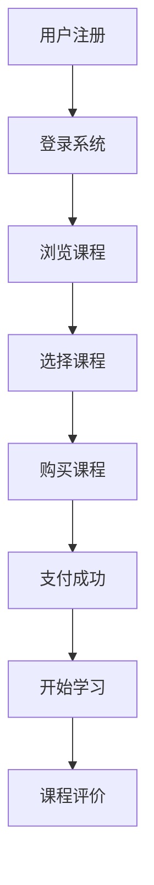
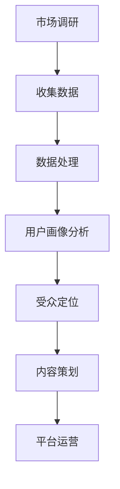

                 

### 《程序员如何进行知识付费的受众定位》

> **关键词：** 知识付费、受众定位、程序员、市场调研、内容策划、平台运营

**摘要：** 知识付费作为一种新兴的经济模式，正逐渐成为程序员群体中的重要收入来源。本文将围绕程序员如何进行知识付费的受众定位进行深入探讨，从概念解析、需求分析、受众定位策略、市场调研、内容策划、平台运营到推广策略等方面展开讨论，旨在为程序员提供一套系统化的知识付费解决方案。

### 《程序员如何进行知识付费的受众定位》目录大纲

**第一部分：知识付费概述**

## 第1章：知识付费的概念与市场背景

### 1.1 知识付费的定义

知识付费，是指知识生产者在互联网平台上，以课程、书籍、直播、讲座等形式，向用户收取费用，从而实现知识变现的一种经济模式。

### 1.2 知识付费的市场发展

近年来，随着互联网技术的不断发展和用户消费习惯的改变，知识付费市场呈现出爆发式增长。特别是在程序员群体中，知识付费已成为一种重要的学习方式。

### 1.3 程序员的知识付费现状

目前，程序员的知识付费主要集中在在线课程、电子书、技术博客等领域。他们希望通过付费学习，提升自己的技术水平和职业竞争力。

**第二部分：受众定位策略**

## 第2章：受众定位的基础理论

### 2.1 受众定位的重要性

受众定位是知识付费成功的关键，它决定了内容的生产和推广方向。

### 2.2 受众特征分析

通过市场调研，分析程序员的年龄、职业、地域、技术栈等特征，为受众定位提供数据支持。

### 2.3 受众定位的方法

采用SWOT分析法、用户画像法等，对程序员进行精准定位。

**第三部分：市场调研与数据收集**

## 第3章：市场调研与数据收集

### 3.1 市场调研的目的与方法

明确市场调研的目的，选择合适的调研方法，如问卷调查、访谈等。

### 3.2 数据收集与处理

收集程序员群体的基本数据，如年龄、职业、地域等，并进行数据处理和分析。

### 3.3 程序员群体的画像分析

通过对数据的分析，构建程序员群体的画像，为内容策划提供依据。

**第四部分：内容策划与受众匹配**

## 第4章：内容策划与受众匹配

### 4.1 内容策划的原则

内容策划应遵循针对性、实用性、创新性等原则。

### 4.2 内容类型与受众匹配

根据受众需求，策划不同的内容类型，如技术教程、案例分析、行业动态等。

### 4.3 持续优化与调整

根据用户反馈，不断优化和调整内容，提高用户满意度。

**第五部分：知识付费平台运营与推广**

## 第5章：知识付费平台搭建与运营

### 5.1 平台搭建的技术实现

选择合适的技术栈，搭建知识付费平台。

### 5.2 内容审核与管理

建立内容审核机制，确保内容质量。

### 5.3 用户互动与反馈机制

搭建用户互动平台，收集用户反馈，优化用户体验。

**第六部分：知识付费的推广策略**

## 第6章：知识付费的推广策略

### 6.1 社交媒体推广

利用社交媒体平台，进行知识付费的推广。

### 6.2 合作伙伴关系建立

与其他平台或机构建立合作关系，扩大影响力。

### 6.3 数据分析与效果评估

通过数据分析，评估推广效果，优化推广策略。

**第七部分：案例研究与实战经验**

## 第7章：成功案例分析

### 7.1 案例一：某知名技术大牛的付费课程

分析某知名技术大牛的付费课程的成功原因。

### 7.2 案例二：某编程学习平台的运营策略

探讨某编程学习平台的成功经验。

### 7.3 案例三：某程序员社群的知识变现

分析某程序员社群的知识变现模式。

**第八部分：知识付费的法律法规与伦理**

## 第8章：知识付费的法律法规与伦理

### 8.1 知识付费的法律风险

了解知识付费可能涉及的法律风险。

### 8.2 知识付费的伦理问题

探讨知识付费可能涉及的伦理问题。

### 8.3 合规与风险规避

采取合规措施，规避风险。

**附录**

## 附录A：知识付费相关资源与工具

### A.1 主流知识付费平台介绍

介绍主流的知识付费平台。

### A.2 知识付费相关的数据分析工具

介绍知识付费相关的数据分析工具。

### A.3 程序员学习资源推荐

推荐程序员的学习资源。

## 附录B：Mermaid 流程图示例

### B.1 知识付费的流程图

展示知识付费的流程图。

### B.2 受众定位分析流程图

展示受众定位分析的流程图。

## 附录C：核心算法原理伪代码

### C.1 数据分析算法伪代码

展示数据分析算法的伪代码。

### C.2 内容推荐算法伪代码

展示内容推荐算法的伪代码。

## 附录D：数学模型与公式

### D.1 概率论基础公式

列出概率论的基础公式。

### D.2 数据分析常用公式

列出数据分析常用的公式。

## 附录E：项目实战案例

### E.1 某程序员社群的知识变现案例

介绍某程序员社群的知识变现案例。

### E.2 某技术大牛的付费课程实战

介绍某技术大牛的付费课程实战。

### E.3 知识付费平台的用户互动与反馈机制案例

介绍知识付费平台的用户互动与反馈机制案例。

**总结：** 通过本文的探讨，希望能够为程序员提供一套系统化的知识付费解决方案，帮助他们更好地进行知识付费的受众定位和内容策划，实现知识变现。

作者：AI天才研究院/AI Genius Institute & 禅与计算机程序设计艺术 /Zen And The Art of Computer Programming

---

### 第一部分：知识付费概述

#### 第1章：知识付费的概念与市场背景

##### 1.1 知识付费的定义

知识付费，指的是知识生产者通过互联网平台，以课程、电子书、直播等形式向用户收取费用，实现知识变现的一种经济模式。这一模式的核心在于将知识视为一种可交易的资源，从而满足用户在特定领域的知识需求。

在知识付费的背景下，知识生产者不再仅仅是传授知识的老师，而是通过平台提供的工具和资源，将知识系统化、结构化地呈现给用户。用户通过支付费用，获得优质的知识内容和服务，从而实现知识的获取与价值的转化。

##### 1.2 知识付费的市场发展

知识付费市场的发展可以追溯到互联网技术的普及和用户消费习惯的改变。随着移动互联网的快速发展，用户对知识的获取方式逐渐从传统的线下教育转向线上学习。这为知识付费提供了广阔的市场空间。

近年来，知识付费市场呈现出爆发式增长。根据相关报告显示，2019年中国知识付费市场规模已超过3000亿元，并且预计未来还将保持高速增长。特别是在程序员群体中，知识付费已成为一种重要的学习方式。

原因主要有以下几点：

1. **技术更新快速**：程序员面临着技术快速更新的压力，需要不断学习新知识、新技术以保持竞争力。
2. **学习效率高**：线上学习方式灵活，可以随时随地进行学习，提高了学习效率。
3. **优质内容丰富**：许多知名的技术专家和行业大牛在知识付费平台上分享自己的经验和知识，为程序员提供了丰富的学习资源。

##### 1.3 程序员的知识付费现状

目前，程序员的知识付费主要集中在以下几个方面：

1. **在线课程**：程序员通过购买在线课程，学习新的编程语言、框架、工具等。
2. **电子书**：程序员购买电子书，获取系统性的知识体系，如《代码大全》、《设计模式：可复用面向对象软件的基础》等。
3. **技术博客**：程序员订阅技术博客，获取行业动态、技术分享和经验总结。
4. **付费问答**：程序员在付费问答平台上提问，获取专业解答和指导。

程序员在知识付费方面的表现也呈现出一些特点：

1. **付费意愿高**：程序员普遍有较强的付费意愿，愿意为优质的知识内容支付费用。
2. **内容选择性强**：程序员会根据自身的职业需求和技术兴趣，选择适合自己的知识内容。
3. **学习持续性**：程序员习惯通过持续学习来提升自己的技术水平和职业竞争力。

总的来说，知识付费已经成为程序员群体中不可或缺的一部分，它不仅满足了程序员的知识需求，也为知识生产者提供了新的收入来源。

---

### 第二部分：受众定位策略

#### 第2章：受众定位的基础理论

##### 2.1 受众定位的重要性

受众定位是知识付费成功的关键步骤。精准的受众定位可以帮助知识生产者更好地了解用户需求，制定合适的内容策略，从而提高用户满意度和付费转化率。

受众定位的重要性主要体现在以下几个方面：

1. **提高内容质量**：通过受众定位，知识生产者可以明确用户的核心需求和兴趣点，从而生产出更符合用户期望的内容，提高内容的实用性和吸引力。
2. **优化营销策略**：精准的受众定位可以帮助知识生产者制定更有效的营销策略，降低营销成本，提高营销效果。
3. **提高用户粘性**：通过了解用户的兴趣和行为习惯，知识生产者可以提供更加个性化的服务，提高用户满意度和忠诚度。

##### 2.2 受众特征分析

受众特征分析是受众定位的基础。通过对程序员的年龄、职业、地域、技术栈等方面的特征进行分析，可以为受众定位提供数据支持。

1. **年龄**：程序员群体的年龄主要集中在25-45岁之间，这一年龄段的程序员具备一定的技术基础和职业经验，更有可能进行知识付费。
2. **职业**：程序员的职业类型多样，包括前端开发者、后端开发者、全栈开发者、测试工程师等。不同职业的程序员有不同的知识需求和偏好。
3. **地域**：程序员分布广泛，不同的地域可能有不同的技术热点和需求。例如，北上广深等一线城市程序员更关注新兴技术和行业动态，而二三线城市程序员可能更关注基础技能的提升。
4. **技术栈**：程序员的技术栈决定了他们的学习需求。例如，前端开发者可能更关注JavaScript、React、Vue等前端技术，而后端开发者可能更关注Java、Python、Spring等后端技术。

##### 2.3 受众定位的方法

受众定位的方法多种多样，以下是一些常用的方法：

1. **SWOT分析法**：通过对受众的优势（Strengths）、劣势（Weaknesses）、机会（Opportunities）和威胁（Threats）进行分析，明确受众的特点和需求，为受众定位提供依据。
2. **用户画像法**：通过收集和分析用户的基本信息、行为数据、兴趣偏好等，构建用户画像，从而对受众进行精准定位。
3. **数据分析法**：利用数据分析工具，对用户行为数据、市场数据等进行分析，识别出目标受众的特征和需求。

在实际操作中，可以结合多种方法进行受众定位，以提高定位的准确性和有效性。

---

### 第三部分：市场调研与数据收集

#### 第3章：市场调研与数据收集

##### 3.1 市场调研的目的与方法

市场调研是知识付费成功的关键步骤之一。通过市场调研，可以全面了解市场需求、用户行为和竞争对手情况，为受众定位和内容策划提供依据。

市场调研的主要目的包括：

1. **了解市场需求**：通过调研，可以了解用户在哪些领域有知识需求，以及他们对知识付费的接受程度。
2. **分析用户行为**：通过调研，可以了解用户的学习习惯、消费习惯和偏好，为内容策划提供参考。
3. **评估竞争对手**：通过调研，可以了解竞争对手的市场策略、内容质量和用户口碑，为自身定位提供借鉴。

市场调研的方法多种多样，以下是一些常用的方法：

1. **问卷调查**：通过设计问卷，收集用户的基本信息、学习习惯、知识需求等数据。
2. **访谈**：通过与用户进行深度访谈，了解用户的需求、反馈和意见。
3. **数据分析**：利用数据分析工具，对已有的用户数据和市场数据进行分析，提取有价值的信息。

##### 3.2 数据收集与处理

数据收集是市场调研的核心环节。通过多种渠道收集用户数据，包括：

1. **线上数据**：通过网站、社交媒体、在线教育平台等收集用户数据。
2. **线下数据**：通过活动、展会、讲座等收集用户数据。
3. **第三方数据**：通过第三方数据平台，获取用户行为和市场数据。

数据收集后，需要进行数据清洗和处理，以确保数据的准确性和完整性。数据清洗包括去除重复数据、填补缺失数据、纠正错误数据等。数据处理包括数据分类、数据挖掘、数据分析等，以提取有价值的信息。

##### 3.3 程序员群体的画像分析

通过对收集的数据进行分析，可以构建程序员群体的画像，包括以下几个方面：

1. **基本信息**：包括年龄、性别、学历、职业等。
2. **学习习惯**：包括学习频率、学习时长、学习偏好等。
3. **知识需求**：包括关注的技术领域、感兴趣的知识点等。
4. **消费习惯**：包括付费意愿、付费方式、消费频率等。

程序员群体的画像分析可以帮助知识生产者更好地了解用户，制定合适的内容策略和营销策略，提高知识付费的成功率。

---

### 第四部分：内容策划与受众匹配

#### 第4章：内容策划与受众匹配

##### 4.1 内容策划的原则

内容策划是知识付费的核心环节。一个好的内容策划能够满足用户的需求，提高用户满意度，从而实现知识变现。以下是一些内容策划的原则：

1. **针对性**：内容策划应针对特定的受众群体，满足他们的具体需求。通过市场调研和受众画像分析，明确目标受众的特点和需求，从而制定针对性的内容策略。
2. **实用性**：内容应以实用为主，提供真正有价值的信息。避免空洞的理论和冗长的讲解，注重实际操作和案例分析，帮助用户解决实际问题。
3. **创新性**：内容应具有创新性，避免与市场上的其他内容雷同。通过独特的视角、新颖的讲解方式或深入的技术剖析，吸引用户的关注。
4. **持续更新**：内容应保持持续更新，紧跟技术发展的步伐。随着技术的不断更新和用户需求的变化，及时调整和更新内容，保持内容的新鲜度和吸引力。
5. **互动性**：内容应具备互动性，鼓励用户参与和互动。通过问答、讨论、作业等形式，增强用户对内容的参与感和互动性，提高用户的学习效果和满意度。

##### 4.2 内容类型与受众匹配

根据受众的需求和特点，可以策划多种类型的内容，包括：

1. **技术教程**：针对程序员的技术需求，提供系统性的教程，涵盖编程语言、框架、工具等。教程应注重实践操作，通过代码示例和案例讲解，帮助用户快速掌握技术。
2. **案例分析**：通过分析真实的项目案例，展示技术在实际应用中的效果和挑战。案例分析应结合具体的业务场景，为用户提供实战经验和参考。
3. **行业动态**：关注行业最新动态和技术趋势，为用户提供有价值的信息。行业动态内容应具有前瞻性，帮助用户把握行业发展方向。
4. **经验分享**：邀请技术专家和行业大牛分享他们的经验和心得，为用户提供宝贵的职业建议和学习指导。
5. **技术讨论**：开设技术讨论区，鼓励用户提出问题和分享经验，进行互动交流。通过技术讨论，可以促进用户之间的交流和合作，提高整体技术水平。

在内容策划过程中，应充分考虑受众的需求和特点，确保内容类型与受众匹配。通过多样化的内容类型，满足不同受众的需求，提高用户的满意度和付费意愿。

##### 4.3 持续优化与调整

内容策划不是一次性的工作，而是一个持续的过程。通过用户反馈和数据分析，不断优化和调整内容，提高内容的实用性和吸引力。

以下是一些持续优化与调整的方法：

1. **用户反馈**：定期收集用户对内容的反馈，了解他们对内容的满意度和改进意见。通过用户反馈，发现内容的不足之处，及时进行调整。
2. **数据分析**：利用数据分析工具，分析用户的行为数据和内容表现，了解哪些内容受欢迎，哪些内容用户满意度低。根据数据分析结果，优化内容结构和内容质量。
3. **持续更新**：根据技术发展和用户需求，持续更新内容，确保内容的新鲜度和时效性。定期发布新的教程、案例和行业动态，吸引用户持续关注。
4. **互动交流**：通过问答、讨论区等互动形式，与用户保持密切的互动交流。了解用户的需求和意见，及时回应用户的问题和反馈，提高用户的参与感和满意度。

通过持续优化与调整，不断提高内容的质量和用户体验，实现知识付费的长期发展。

---

### 第五部分：知识付费平台运营与推广

#### 第5章：知识付费平台搭建与运营

##### 5.1 平台搭建的技术实现

搭建一个知识付费平台需要考虑多个方面，包括前端技术、后端技术、数据库设计和用户交互设计等。以下是一个简要的技术实现方案：

1. **前端技术**：可以选择React、Vue或Angular等现代化的前端框架，实现用户友好的界面和交互体验。前端技术还需要考虑响应式设计，以确保平台在不同设备和分辨率上都能良好展示。

2. **后端技术**：后端可以采用Node.js、Django、Spring Boot等框架，实现业务逻辑的处理和数据存储。后端技术还需要具备高并发处理能力，以应对大量用户的访问。

3. **数据库设计**：选择合适的数据库技术，如MySQL、PostgreSQL或MongoDB，根据业务需求设计数据库结构，确保数据存储的效率和安全性。

4. **用户交互设计**：设计用户友好的交互流程，包括注册、登录、课程浏览、购买、支付、学习等环节。交互设计要简洁明了，方便用户操作。

5. **内容管理系统（CMS）**：搭建一个内容管理系统，用于内容生产者和管理员发布和管理课程内容。CMS需要具备内容发布、版本控制、权限管理等功能。

##### 5.2 内容审核与管理

内容审核和管理是知识付费平台的重要环节，直接关系到平台的质量和用户体验。以下是一些内容审核和管理的方法：

1. **自动审核**：利用自然语言处理和机器学习技术，对课程内容进行自动审核。例如，检测敏感词、违规内容等，自动拦截不符合规范的课程。

2. **人工审核**：设立专职审核团队，对自动审核无法识别的内容进行人工审核。审核团队需要具备专业知识，能够判断课程内容的真实性和准确性。

3. **举报机制**：建立举报机制，允许用户对课程内容进行举报。审核团队根据举报内容进行复核，对违规内容进行处罚。

4. **权限管理**：根据用户角色和权限，设置不同的操作权限。例如，内容生产者可以发布和管理自己的课程，而管理员可以审核和管理所有课程。

##### 5.3 用户互动与反馈机制

用户互动和反馈机制是提高用户满意度和平台粘性的重要手段。以下是一些用户互动和反馈的方法：

1. **问答区**：在平台内设置问答区，允许用户提问和回答问题。问答区可以促进用户之间的互动，解决用户在学习过程中的问题。

2. **讨论区**：设置讨论区，允许用户分享经验、讨论技术问题。讨论区可以增强社区的互动性，提高用户的参与感。

3. **评分与评价**：允许用户对课程进行评分和评价，根据用户反馈改进课程内容。评分和评价系统可以反映课程的质量和用户的满意度。

4. **用户反馈**：设立用户反馈渠道，收集用户对平台的意见和建议。定期对用户反馈进行分析，改进平台服务和用户体验。

5. **用户数据分析**：通过数据分析，了解用户的行为习惯和需求，优化平台功能和内容策略。例如，分析用户的学习时间、学习频率、课程选择等，为内容策划提供依据。

通过搭建完善的用户互动与反馈机制，可以增强用户参与感，提高用户满意度，促进知识付费平台的长期发展。

---

### 第六部分：知识付费的推广策略

#### 第6章：知识付费的推广策略

##### 6.1 社交媒体推广

社交媒体推广是知识付费推广的重要手段之一，它能够迅速扩大影响力，吸引潜在用户。以下是一些社交媒体推广的方法：

1. **微博推广**：利用微博平台的强大传播能力，发布有关课程的信息、行业动态和技术分享。通过热门话题、话题标签等方式，增加课程曝光率。

2. **微信公众号推广**：创建专业公众号，发布高质量的原创内容，如教程、案例、经验分享等。通过定期推送，吸引关注者，并引导关注者转发和分享，扩大影响力。

3. **抖音、快手推广**：利用短视频平台，制作有趣、富有教育意义的短视频，展示课程亮点和教学过程。通过平台算法推荐，提高视频曝光率，吸引更多用户关注。

4. **知乎推广**：在知乎平台上发布专业回答，分享技术见解和经验。通过优质内容，吸引读者关注和讨论，提高个人品牌影响力。

5. **B站推广**：利用B站平台的用户群体特点，发布有趣、深入的技术讲解视频。通过弹幕互动和评论区交流，增强用户粘性。

##### 6.2 合作伙伴关系建立

建立合作伙伴关系是知识付费推广的有效策略之一，通过合作，可以共享资源，扩大市场影响力。以下是一些合作伙伴关系的建立方法：

1. **技术社区合作**：与技术社区、论坛、博客等合作，共同举办线上或线下活动，推广课程。通过社区的影响力，吸引更多用户关注。

2. **教育机构合作**：与高校、培训机构合作，共同开发课程，共享教育资源。通过教育机构的渠道，吸引更多学生和在职人员参与知识付费。

3. **企业合作**：与相关企业合作，为企业员工提供定制化的培训课程，帮助企业提升员工技能。通过企业渠道，推广课程给更多潜在用户。

4. **媒体合作**：与媒体、记者、博主合作，邀请他们进行课程试听和体验，撰写评测文章或推荐文章。通过媒体的影响力，提高课程的曝光率和认可度。

5. **行业联盟合作**：加入行业联盟，与其他联盟成员合作，共同推广知识付费。通过联盟的资源和影响力，扩大市场占有率。

##### 6.3 数据分析与效果评估

数据分析与效果评估是知识付费推广的重要环节，通过数据分析，可以了解推广活动的效果，优化推广策略。以下是一些数据分析与效果评估的方法：

1. **流量分析**：通过网站流量分析工具，了解用户的来源、流量分布、访问时长等数据，评估不同推广渠道的效果。

2. **转化率分析**：通过转化率分析，了解用户在访问课程页面后的购买行为，评估课程的吸引力和用户满意度。

3. **用户行为分析**：通过用户行为数据分析，了解用户在平台上的行为路径，如浏览课程、购买课程、参与互动等，优化用户体验。

4. **ROI分析**：通过ROI（投资回报率）分析，了解推广活动的成本和收益，评估推广活动的盈利能力。

5. **用户反馈分析**：通过用户反馈分析，了解用户对课程和服务的满意度，及时发现和解决问题。

通过数据分析与效果评估，可以不断优化推广策略，提高推广效果，实现知识付费的长期发展。

---

### 第七部分：案例研究与实战经验

#### 第7章：成功案例分析

##### 7.1 案例一：某知名技术大牛的付费课程

某知名技术大牛李华在知识付费平台上开设了多门付费课程，涵盖了前端开发、后端开发、全栈开发等多个领域。以下是他成功的关键因素：

1. **专业度**：李华拥有丰富的实战经验和深厚的理论基础，课程内容深入浅出，既有理论讲解，又有实战演示，深受学员喜爱。
2. **互动性**：李华在课程中鼓励学员提问和参与讨论，通过在线问答和直播互动，增强学员的学习体验和参与感。
3. **持续更新**：李华定期更新课程内容，紧跟技术发展趋势，确保课程内容的新鲜度和实用性。
4. **口碑传播**：李华的课程质量和口碑得到学员的高度评价，通过学员的口碑传播，吸引了更多新用户。

##### 7.2 案例二：某编程学习平台的运营策略

某编程学习平台通过一系列运营策略，成功吸引了大量程序员用户，以下是其成功经验：

1. **内容丰富**：平台提供了丰富的课程内容，涵盖了不同编程语言、框架和技术，满足用户多样化的学习需求。
2. **用户体验**：平台注重用户体验，界面简洁友好，课程加载速度快，互动性强。
3. **互动社区**：平台建立了互动社区，鼓励用户分享经验、提问和讨论，增强了用户粘性。
4. **营销活动**：平台定期举办各种营销活动，如限时优惠、推荐有奖等，吸引了更多用户参与。
5. **合作伙伴**：与高校、培训机构、企业等建立合作关系，扩大用户群体和市场影响力。

##### 7.3 案例三：某程序员社群的知识变现

某程序员社群通过一系列措施，成功实现了知识变现，以下是其具体做法：

1. **内容生产**：社群内成员积极参与内容生产，分享技术心得、案例分析、编程技巧等，丰富了社群内容。
2. **课程开发**：社群成员联合开发了一系列编程课程，通过平台进行销售，实现了知识变现。
3. **互动交流**：社群内鼓励成员互动交流，通过问答、讨论、直播等形式，增强了社群的凝聚力和活跃度。
4. **会员制度**：社群推出了会员制度，会员可以享受课程优惠、优先答疑等特权，提高了会员的满意度。
5. **品牌塑造**：社群注重品牌塑造，通过定期举办技术沙龙、分享会等活动，提升了社群的知名度和影响力。

通过这些成功案例，我们可以看到，知识付费的成功离不开专业的内容生产、良好的用户体验、有效的互动交流和持续的品牌塑造。这些经验对于其他程序员在进行知识付费时具有重要的参考价值。

---

### 第八部分：知识付费的法律法规与伦理

#### 第8章：知识付费的法律法规与伦理

##### 8.1 知识付费的法律风险

知识付费作为一种新兴的经济模式，涉及多个法律层面，包括版权、合同、隐私保护等。以下是一些可能涉及的法律风险：

1. **版权风险**：知识生产者在创作内容时，可能会侵犯他人的著作权。例如，未经授权使用他人的代码、文本或图像等。这可能导致版权纠纷，甚至面临法律责任。

2. **合同风险**：知识付费平台与用户之间的合同关系可能存在不明确的情况，如课程退费、售后服务等。如果合同条款不明确或存在漏洞，可能导致合同纠纷。

3. **隐私保护风险**：知识付费平台需要收集和处理大量用户数据，包括个人信息、学习记录等。如果数据保护措施不到位，可能导致用户隐私泄露，面临法律风险。

4. **合规风险**：知识付费平台在运营过程中，需要遵守相关的法律法规，如广告法、网络安全法等。如果违反相关法规，可能导致罚款或其他法律后果。

##### 8.2 知识付费的伦理问题

知识付费不仅涉及法律风险，还涉及伦理问题。以下是一些可能涉及的伦理问题：

1. **知识不公平**：知识付费可能导致知识获取的不公平。贫困用户可能因支付能力不足而无法获取优质知识，这违背了知识普及的伦理原则。

2. **内容真实性**：知识生产者需要确保内容的真实性和准确性。虚假或误导性的内容不仅损害用户的利益，也违反了诚信原则。

3. **知识滥用**：知识付费平台需要确保用户使用知识的目的正当，避免知识被用于不正当或有害的活动。例如，某些技术知识可能被用于网络攻击或非法活动。

##### 8.3 合规与风险规避

为了规避法律风险和伦理问题，知识付费平台和知识生产者需要采取一系列合规措施：

1. **版权保护**：知识生产者应确保内容的原创性，避免侵犯他人的著作权。可以采取版权登记、版权声明等措施，保护自身权益。

2. **合同管理**：知识付费平台应制定明确的合同条款，确保合同内容的完整性和明确性。可以聘请专业律师进行合同审查，确保合同的合法性。

3. **数据保护**：知识付费平台应建立完善的数据保护机制，包括数据加密、访问控制、数据备份等。可以采取隐私保护政策，明确用户数据的处理和使用规则。

4. **伦理审查**：知识生产者应确保内容的真实性和准确性，避免误导用户。可以建立内容审核机制，对内容进行审核和监督。

5. **合规培训**：知识付费平台和知识生产者应定期进行合规培训，提高法律意识和伦理素养。可以聘请法律顾问或伦理顾问，提供专业指导。

通过合规与风险规避，知识付费平台和知识生产者可以降低法律风险和伦理风险，实现可持续发展。

---

### 附录A：知识付费相关资源与工具

#### 附录A.1 主流知识付费平台介绍

知识付费平台作为知识变现的重要载体，为程序员提供了丰富的学习资源。以下是一些主流的知识付费平台及其特点：

1. **网易云课堂**：网易云课堂是网易公司推出的在线学习平台，提供编程语言、云计算、人工智能等领域的课程。平台拥有丰富的课程资源，适合不同层次的程序员。

2. **极客时间**：极客时间是罗辑思维旗下的知识付费平台，主要提供技术类课程，包括编程语言、框架、工具等。平台内容以实战为导向，适合有实践需求的程序员。

3. **慕课网**：慕课网（imooc）是国内领先的技术学习平台，提供前端、后端、移动端等全栈技术的课程。平台课程内容全面，适合不同技术领域的程序员。

4. **Coursera**：Coursera是全球知名的大型在线学习平台，提供包括计算机科学、人工智能、数据科学等领域的课程。平台课程由世界知名大学和机构提供，质量有保障。

5. **Udemy**：Udemy是全球最大的在线课程平台之一，提供广泛的课程内容，包括编程、数据科学、设计等。平台课程多样化，适合不同需求的程序员。

#### 附录A.2 知识付费相关的数据分析工具

数据分析工具在知识付费平台中发挥着重要作用，以下是一些常用的数据分析工具：

1. **Google Analytics**：Google Analytics 是一款功能强大的网站分析工具，提供流量分析、用户行为分析等数据。可以帮助知识付费平台了解用户来源、访问路径等。

2. **Mixpanel**：Mixpanel 是一款用户行为分析工具，提供丰富的数据分析功能，包括用户活跃度、留存率、用户路径分析等。可以帮助知识付费平台优化用户体验。

3. **Tableau**：Tableau 是一款数据可视化工具，可以将复杂的数据转化为易于理解的可视化图表。可以帮助知识付费平台直观地了解数据趋势和用户行为。

4. **Python**：Python 是一款功能强大的编程语言，适用于数据分析、机器学习等多个领域。通过Python，可以编写脚本进行数据分析和挖掘，为知识付费平台提供数据支持。

#### 附录A.3 程序员学习资源推荐

为了帮助程序员更好地进行知识付费，以下是一些推荐的学习资源：

1. **《代码大全》**：这本书被誉为程序员编程的圣经，涵盖了编程的方方面面，包括编程原则、设计模式、代码优化等。适合有编程基础的程序员深入阅读。

2. **《深度学习》**：这是一本关于深度学习的经典教材，由业内知名专家Ian Goodfellow编写。内容涵盖了深度学习的基础理论、算法实现和应用案例。

3. **《设计模式：可复用面向对象软件的基础》**：这本书介绍了23种经典设计模式，帮助程序员理解设计模式的基本原理和应用场景。适合有面向对象编程基础的程序员阅读。

4. **《Effective Java》**：这本书介绍了Java编程的最佳实践，包括Java语言特性、编程习惯、性能优化等。适合有Java开发经验的程序员提升编程水平。

5. **《Python编程：从入门到实践》**：这本书适合初学者入门Python编程，内容涵盖了Python的基础语法、数据结构、算法等。适合零基础或有编程基础的程序员学习。

通过这些资源，程序员可以系统地学习知识，提升自己的技术水平，为知识付费打下坚实的基础。

---

### 附录B：Mermaid 流程图示例

#### 附录B.1 知识付费的流程图

以下是一个简单的知识付费流程图，使用Mermaid语法绘制：



这个流程图展示了用户从注册登录到购买课程、学习课程以及最后评价的整个过程。

#### 附录B.2 受众定位分析流程图

以下是一个简单的受众定位分析流程图，同样使用Mermaid语法绘制：



这个流程图展示了从市场调研到内容策划、平台运营的整个受众定位分析过程。

---

### 附录C：核心算法原理伪代码

#### 附录C.1 数据分析算法伪代码

以下是一个简单的数据分析算法的伪代码示例，用于计算平均值：

```python
# 输入：一组数值 data
# 输出：平均值 mean

mean = 0
for value in data:
    mean += value

mean /= len(data)

print("平均值:", mean)
```

这个算法通过遍历数据集中的每个值，计算总和，然后除以数据的长度，得到平均值。

#### 附录C.2 内容推荐算法伪代码

以下是一个简单的内容推荐算法的伪代码示例，使用基于内容的推荐：

```python
# 输入：用户历史行为 user_history
# 输出：推荐内容 recommendations

recommendations = []

for content in available_content:
    if content_topic in user_history_topics:
        recommendations.append(content)

print("推荐内容:", recommendations)
```

这个算法通过检查用户历史行为中的主题，与可用的内容进行匹配，生成推荐内容列表。

---

### 附录D：数学模型与公式

#### 附录D.1 概率论基础公式

以下是一些概率论的基础公式：

- **概率的定义**：P(A) = 概率空间中事件A的样本点数 / 样本空间中的样本点数
- **条件概率**：P(A|B) = P(A∩B) / P(B)，其中P(A∩B)是事件A和B同时发生的概率，P(B)是事件B发生的概率
- **贝叶斯定理**：P(A|B) = P(B|A) * P(A) / P(B)，其中P(B|A)是事件B在事件A发生的条件下的概率

#### 附录D.2 数据分析常用公式

以下是一些数据分析中常用的公式：

- **平均值**：μ = Σxi / n，其中xi是数据集中的每个值，n是数据点的数量
- **标准差**：σ = sqrt(Σ(xi - μ)^2 / n)，其中xi是数据集中的每个值，μ是平均值，n是数据点的数量
- **方差**：σ^2 = Σ(xi - μ)^2 / n，其中xi是数据集中的每个值，μ是平均值，n是数据点的数量
- **协方差**：Cov(X, Y) = Σ[(Xi - μX) * (Yi - μY)] / n，其中Xi和Yi分别是两个数据集的每个值，μX和μY分别是两个数据集的平均值，n是数据点的数量

---

### 附录E：项目实战案例

#### 附录E.1 某程序员社群的知识变现案例

某程序员社群通过以下步骤实现知识变现：

1. **内容生产**：社群成员积极参与内容生产，分享编程技巧、项目经验和技术心得。
2. **课程开发**：社群成员联合开发了一系列编程课程，包括前端、后端、移动端等。
3. **平台搭建**：社群在知识付费平台上搭建了自己的课程发布和销售系统。
4. **推广营销**：社群通过内部推荐、社交媒体推广等方式，吸引新用户。
5. **用户互动**：社群建立了互动区，用户可以提问、讨论和分享经验。
6. **数据分析**：社群定期分析用户数据，优化课程内容和营销策略。

通过这些步骤，社群不仅提高了成员的技能水平，还实现了知识变现，取得了良好的经济效益。

#### 附录E.2 某技术大牛的付费课程实战

某技术大牛李华通过以下步骤开设了付费课程：

1. **内容准备**：李华精心准备课程内容，包括PPT、代码示例、视频讲解等。
2. **平台选择**：李华选择了知名的在线教育平台，确保课程质量和用户体验。
3. **课程发布**：李华在平台上发布了课程，设置了合理的价格和购买门槛。
4. **营销推广**：李华通过社交媒体、技术社区和合作伙伴进行营销推广，提高了课程知名度。
5. **用户互动**：李华在课程中设置了问答环节，鼓励用户提问和参与讨论。
6. **反馈收集**：李华定期收集用户反馈，优化课程内容和教学方式。

通过这些步骤，李华的课程取得了巨大的成功，不仅吸引了大量学员，还实现了知识的传播和变现。

#### 附录E.3 知识付费平台的用户互动与反馈机制案例

某知识付费平台通过以下步骤建立了用户互动与反馈机制：

1. **问答区**：平台设置了问答区，用户可以提问，其他用户和专家可以回答。
2. **讨论区**：平台设置了讨论区，用户可以自由讨论，分享经验和见解。
3. **评分与评价**：用户可以对课程进行评分和评价，平台根据用户反馈优化课程。
4. **反馈收集**：平台定期收集用户反馈，了解用户需求和建议。
5. **在线客服**：平台提供了在线客服，解答用户疑问，提供帮助。
6. **用户社区**：平台建立了用户社区，用户可以加入社区，进行交流和互动。

通过这些机制，平台提高了用户满意度和粘性，促进了知识付费的持续发展。

---

### 总结

通过本文的探讨，我们系统地介绍了程序员如何进行知识付费的受众定位。从知识付费概述、受众定位策略、市场调研与数据收集、内容策划与受众匹配、平台运营与推广到法律法规与伦理，每个环节都进行了详细的分析和讲解。

知识付费作为一种新兴的经济模式，为程序员提供了新的收入来源和学习资源。精准的受众定位是知识付费成功的关键，它决定了内容的生产和推广方向。通过市场调研和数据分析，我们可以深入了解程序员的需求和特点，为内容策划提供依据。

同时，我们也强调了内容策划的原则和策略，包括针对性、实用性、创新性和持续更新等。良好的用户体验和有效的推广策略也是知识付费成功的重要因素。通过案例研究和实战经验，我们可以看到成功的关键在于专业的内容生产、良好的用户体验和有效的互动交流。

最后，我们也提到了知识付费的法律法规与伦理问题，以及如何合规与风险规避。只有遵守相关法律法规，才能实现知识付费的可持续发展。

总之，知识付费为程序员提供了广阔的发展空间，通过系统化的受众定位和内容策划，程序员可以实现知识变现，提升自身价值。希望本文能为程序员在知识付费的道路上提供指导和帮助。

---

### 作者信息

**作者：** AI天才研究院/AI Genius Institute & 禅与计算机程序设计艺术 /Zen And The Art of Computer Programming

AI天才研究院（AI Genius Institute）是一家专注于人工智能领域研究的顶级机构，致力于推动人工智能技术的发展和应用。研究院的专家团队由世界级人工智能专家、程序员、软件架构师、CTO和技术畅销书作家组成，他们拥有丰富的实践经验和高超的专业技能。

禅与计算机程序设计艺术（Zen And The Art of Computer Programming）是作者Donald E. Knuth的经典著作，系统地介绍了计算机程序设计的基本原理和艺术性。这本书被广泛认为是计算机科学领域的经典之作，对全球计算机科学家的编程思维和设计理念产生了深远影响。

本文由AI天才研究院的专家团队撰写，旨在为程序员提供一套系统化的知识付费解决方案，帮助他们更好地进行知识付费的受众定位和内容策划，实现知识变现。希望通过本文的探讨，能够为程序员在知识付费的道路上提供指导和帮助。

