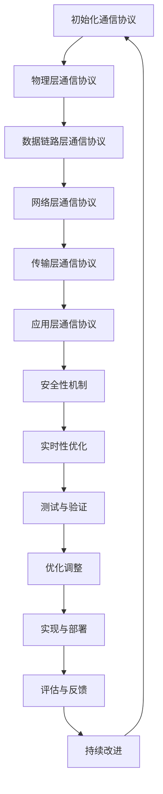

                 

## 第一部分：端到端自动驾驶概述

### 第1章：端到端自动驾驶概述

端到端（End-to-End）自动驾驶是一种新兴的自动驾驶技术，旨在通过模拟人类驾驶行为来实现车辆的自主行驶。该技术摒弃了传统自动驾驶中分层的感知、规划和控制结构，直接从原始输入数据（如摄像头、激光雷达等）生成车辆控制命令，提高了系统的整体效率和准确性。

#### 1.1 端到端自动驾驶的定义与演进

端到端自动驾驶的定义：端到端自动驾驶是一种完全自主的驾驶模式，车辆在无需人工干预的情况下，能够识别环境、规划路径、执行驾驶操作并实时应对各种情况。

端到端自动驾驶的演进：
1. 初期：基于规则的自动驾驶系统，通过预先定义的规则来控制车辆。
2. 中期：基于感知-规划的自动驾驶系统，通过传感器收集环境信息，并基于预先定义的规划算法生成驾驶命令。
3. 现代：端到端自动驾驶系统，直接从原始输入数据生成驾驶命令，无需分层结构。

#### 1.2 端到端自动驾驶的关键技术

端到端自动驾驶的关键技术包括：
1. 感知：使用摄像头、激光雷达、超声波传感器等感知设备，获取车辆周围的环境信息。
2. 计划：根据感知到的环境信息，规划车辆的行驶路径和驾驶动作。
3. 控制：根据计划和感知信息，控制车辆的加速、减速和转向等动作。

#### 1.3 车辆编队通信的基本概念

车辆编队通信（Platooning）是一种自动驾驶车辆之间的通信技术，通过在车队中建立通信链路，实现车辆之间的协同驾驶。车辆编队通信的关键技术包括：
1. 通信协议：确保车辆之间的信息交换和数据同步。
2. 数据压缩与传输：提高通信效率和可靠性。
3. 车辆协同控制：确保车队在行驶过程中保持稳定和安全。

在本文中，我们将详细探讨端到端自动驾驶车辆编队通信协议的设计，从核心概念、架构设计、传输机制、安全性、适应性、应用场景、实现与验证等方面进行深入分析。通过本文的研究，期望为端到端自动驾驶车辆编队通信领域提供理论指导和技术支持。

### 第2章：自动驾驶车辆编队通信的需求分析

#### 2.1 车辆编队通信的重要性

自动驾驶车辆编队通信在端到端自动驾驶系统中扮演着至关重要的角色。其主要重要性体现在以下几个方面：

1. 提高行车效率：车辆编队通信能够使车辆在车队中保持相对稳定的间距，减少空气阻力，降低能耗，从而提高整体的行车效率。
2. 增强行车安全性：通过车辆间的实时通信，可以实现车辆间的信息共享，提高对突发事件的响应速度，降低交通事故的发生概率。
3. 减少车辆磨损：车辆编队通信可以使车辆在行驶过程中保持稳定的车速和间距，减少急加速和急刹车等对车辆结构的磨损。

#### 2.2 车辆编队通信的需求与挑战

车辆编队通信的需求主要体现在以下几个方面：

1. 高可靠性：车辆编队通信需要在复杂的交通环境中保持稳定，确保信息传输的准确性和实时性。
2. 低延迟：为了提高车辆间的协同驾驶效果，通信延迟必须尽可能低，以实现实时响应。
3. 大带宽：车辆编队通信需要传输大量的感知信息、控制指令等，因此需要具备较高的带宽。
4. 高安全性：车辆编队通信需要保证数据传输的安全性，防止恶意攻击和信息篡改。

车辆编队通信面临的挑战包括：

1. 网络拓扑复杂：车辆编队通信的网络拓扑复杂，需要考虑车辆运动过程中的网络拓扑变化。
2. 数据传输效率：如何在保证数据传输准确性的同时，提高数据传输效率，降低通信延迟。
3. 跨车协同控制：如何实现车辆间的协同控制，确保车队在行驶过程中保持稳定和安全。
4. 系统安全与隐私保护：如何保证车辆编队通信系统的安全性，防止恶意攻击和信息泄露。

#### 2.3 车辆编队通信的目标与优化策略

车辆编队通信的目标是在满足高可靠性、低延迟、大带宽和高安全性等需求的前提下，实现车辆间的信息共享和协同控制，提高行车效率和安全性。

优化策略包括：

1. 通信协议设计：设计高效、稳定的通信协议，确保信息传输的准确性和实时性。
2. 数据压缩与传输：采用数据压缩算法，提高数据传输效率，降低通信延迟。
3. 车辆协同控制：采用分布式控制算法，实现车辆间的协同控制，提高车队行驶的稳定性和安全性。
4. 安全性与隐私保护：采用加密算法和隐私保护技术，确保数据传输的安全性，防止恶意攻击和信息泄露。

在本文的后续章节中，我们将进一步探讨车辆编队通信协议的设计原则、架构、传输机制、安全性、适应性以及应用场景，为端到端自动驾驶车辆编队通信提供理论指导和实践参考。

## 第二部分：车辆编队通信协议设计

### 第3章：车辆编队通信协议的核心概念与架构

车辆编队通信协议是确保自动驾驶车辆在编队行驶过程中能够高效、安全地进行信息交换和控制的关键技术。要设计一个高效的车辆编队通信协议，需要理解其核心概念和架构。

#### 3.1 车辆编队通信协议的定义

车辆编队通信协议（Vehicle Platooning Communication Protocol）是指自动驾驶车辆之间通过无线通信进行数据交换，实现编队行驶时信息同步、协调控制的一种通信协议。该协议旨在确保车辆之间的通信可靠、低延迟、高带宽和安全。

#### 3.2 车辆编队通信协议的架构设计

车辆编队通信协议的架构设计需要考虑多个层次，从物理层到应用层，每个层次都有其特定的功能和职责。以下是车辆编队通信协议的架构设计：

1. **物理层（Physical Layer）**：
   - 负责无线信号的发射和接收。
   - 包括天线设计、无线传输技术等。
   - 常用的无线传输技术有Wi-Fi、LTE、DSRC等。

2. **数据链路层（Data Link Layer）**：
   - 负责在相邻车辆之间建立通信链路，确保数据的可靠传输。
   - 包括帧同步、错误检测和纠正、数据帧的封装和解封装等。
   - 常用的数据链路层协议有CAN总线、以太网等。

3. **网络层（Network Layer）**：
   - 负责车辆之间的路由和寻址。
   - 包括网络拓扑管理、数据包的传输和路由选择等。
   - 常用的网络层协议有IPv4、IPv6等。

4. **传输层（Transport Layer）**：
   - 负责端到端的数据传输，确保数据的完整性和可靠性。
   - 包括传输控制协议（TCP）和用户数据报协议（UDP）。
   - TCP提供可靠的数据传输，UDP提供低延迟的数据传输。

5. **应用层（Application Layer）**：
   - 负责实现车辆编队通信的应用功能，如车辆状态同步、路径规划、控制指令传输等。
   - 包括应用层协议和数据格式定义。

#### 3.3 车辆编队通信协议的核心要素

车辆编队通信协议的核心要素包括以下几个方面：

1. **通信协议的选择**：
   - 根据应用场景和需求选择合适的通信协议。
   - 考虑通信距离、带宽、延迟和可靠性等因素。

2. **数据传输格式**：
   - 设计合适的数据传输格式，包括数据帧结构、字段定义等。
   - 确保数据传输的完整性和可解析性。

3. **安全机制**：
   - 设计安全机制，如加密、认证、授权等，确保数据传输的安全性和隐私保护。

4. **冗余与容错**：
   - 设计冗余机制，确保在部分通信链路失效时，系统能够继续运行。
   - 包括路径冗余、数据冗余和故障恢复等策略。

5. **实时性**：
   - 设计实时性机制，确保数据传输的及时性和响应速度。
   - 包括时间同步、优先级调度等策略。

在本文的后续章节中，我们将深入探讨车辆编队通信协议的各个层次，详细分析其传输机制、安全性、适应性以及具体的应用场景。通过这些讨论，我们希望能够为车辆编队通信协议的设计提供有价值的参考和指导。

### 第4章：车辆编队通信协议的层次结构

车辆编队通信协议的层次结构是确保车辆之间高效、安全、可靠通信的关键。这种层次结构通常分为物理层、数据链路层、网络层、传输层和应用层。每一层都有其特定的功能和职责，协同工作以实现车辆编队通信的目标。

#### 4.1 物理层通信协议

物理层是车辆编队通信协议的基础，负责无线信号的发射和接收。其主要职责包括：

1. **无线信号传输**：通过天线发射信号，并接收来自其他车辆的信号。
2. **信道选择**：选择合适的无线信道以避免干扰。
3. **信号调制与解调**：将数字信号转换为模拟信号进行传输，并将接收到的模拟信号转换为数字信号。
4. **传输技术**：常用的无线传输技术包括Wi-Fi、LTE、DSRC等。这些技术各有优缺点，如Wi-Fi具有高带宽但传输距离较短，而DSRC则适合短距离、高可靠性通信。

**物理层协议示例**：

- **Wi-Fi**：IEEE 802.11p标准，适用于短距离、高带宽通信。
- **LTE**：Long Term Evolution，提供高带宽、低延迟的通信。
- **DSRC**： Dedicated Short-Range Communications，专为车辆通信设计，具有高可靠性。

#### 4.2 数据链路层通信协议

数据链路层负责在相邻车辆之间建立通信链路，确保数据的可靠传输。其主要职责包括：

1. **帧同步**：确保发送和接收端在数据传输过程中保持同步。
2. **错误检测与纠正**：检测并纠正数据传输过程中的错误，提高数据传输的可靠性。
3. **数据帧封装与解封装**：将数据封装成帧进行传输，并在接收端解封装。
4. **流量控制**：控制数据传输的速度，避免接收端缓冲区溢出。

**数据链路层协议示例**：

- **CAN总线**：Controller Area Network，是一种广泛应用于汽车通信的协议，具有高可靠性和实时性。
- **以太网**：Ethernet，是一种广泛使用的局域网通信协议，具有高带宽和可靠性。

#### 4.3 网络层通信协议

网络层负责车辆之间的路由和寻址，确保数据包能够正确传输到目标车辆。其主要职责包括：

1. **路由选择**：根据网络拓扑和流量情况选择最佳路径。
2. **寻址与分组**：将数据包分组成合适的尺寸，并添加源地址和目标地址。
3. **拥塞控制**：避免网络拥塞，提高数据传输的效率。

**网络层协议示例**：

- **IPv4**：Internet Protocol Version 4，是最早的互联网协议，广泛应用于车辆通信。
- **IPv6**：Internet Protocol Version 6，是为了解决IPv4地址耗尽问题而设计的下一代协议，具有更大的地址空间。

#### 4.4 传输层通信协议

传输层负责端到端的数据传输，确保数据的完整性和可靠性。其主要职责包括：

1. **可靠传输**：通过确认、重传等机制确保数据的可靠传输。
2. **流量控制**：控制发送方的数据流量，避免接收方缓冲区溢出。
3. **连接管理**：建立、维护和终止通信连接。

**传输层协议示例**：

- **TCP**：Transmission Control Protocol，是一种可靠的传输层协议，适用于对数据完整性要求较高的场景。
- **UDP**：User Datagram Protocol，是一种低延迟、不可靠的传输层协议，适用于对实时性要求较高的场景。

#### 4.5 应用层通信协议

应用层负责实现车辆编队通信的具体应用功能，如车辆状态同步、路径规划、控制指令传输等。其主要职责包括：

1. **应用层协议**：定义具体的通信功能和数据格式。
2. **数据格式**：定义数据包的结构和字段，确保数据的可解析性。

**应用层协议示例**：

- **车辆状态同步协议**：用于同步车辆间的状态信息，如速度、位置、加速度等。
- **路径规划协议**：用于车辆间的路径信息共享和协调。

通过上述层次的划分和具体协议的介绍，我们可以看到车辆编队通信协议的设计是一个复杂而细致的过程。在后续章节中，我们将进一步探讨这些层次的实现细节，以及如何确保车辆编队通信协议的稳定性和高效性。

### 第5章：车辆编队通信协议的传输机制

车辆编队通信协议的传输机制是确保车辆之间高效、稳定数据传输的关键。本章节将深入探讨车辆编队通信协议的传输机制，包括无线传输技术、传输优化策略以及实时通信的具体实现。

#### 5.1 传输机制概述

车辆编队通信协议的传输机制主要涉及以下几个方面：

1. **无线传输技术**：选择合适的无线传输技术是实现高效传输的基础。常见的无线传输技术包括Wi-Fi、LTE、DSRC等。
2. **传输优化策略**：通过优化传输过程，提高传输效率和可靠性，例如数据压缩、流量控制和冗余传输等。
3. **实时通信**：在车辆编队通信中，实时性是一个重要的指标。确保通信延迟低、响应速度快，对于车辆的安全和效率至关重要。

#### 5.2 无线传输技术

1. **Wi-Fi**

   Wi-Fi（IEEE 802.11p）是一种广泛应用于车辆通信的无线传输技术。其主要特点包括：

   - **高带宽**：Wi-Fi支持较高的数据传输速率，适合传输大量数据。
   - **短距离**：Wi-Fi的传输距离相对较短，适合在车队内部使用。
   - **干扰问题**：Wi-Fi容易受到外部干扰，需要采取干扰抑制措施。

2. **LTE**

   LTE（Long Term Evolution）是一种由3GPP（3rd Generation Partnership Project）定义的无线传输技术，具有以下特点：

   - **高带宽**：LTE提供较高的数据传输速率，适合传输大量数据。
   - **长距离**：LTE的传输距离较长，适合跨车队通信。
   - **低延迟**：LTE的通信延迟较低，适合实时通信。

3. **DSRC**

   DSRC（Dedicated Short-Range Communications）是一种专为车辆通信设计的无线传输技术，具有以下特点：

   - **高可靠性**：DSRC具有高可靠性，适合在复杂交通环境中使用。
   - **短距离**：DSRC的传输距离较短，适合在车队内部使用。
   - **实时性**：DSRC的通信延迟低，适合实时通信。

#### 5.3 传输优化策略

为了提高车辆编队通信协议的传输效率和可靠性，可以采用以下传输优化策略：

1. **数据压缩**：

   数据压缩是一种有效提高传输效率的方法。通过压缩数据，可以减少数据传输的体积，降低传输带宽需求。常用的数据压缩算法包括Huffman编码、LZ77和LZ78等。

2. **流量控制**：

   流量控制是一种防止接收方缓冲区溢出的策略。通过控制发送方的数据流量，可以避免接收方无法及时处理接收到的数据。常见的流量控制方法包括停止-等待协议和滑动窗口协议。

3. **冗余传输**：

   冗余传输是一种提高数据传输可靠性的方法。通过发送冗余数据，接收方可以在接收到的数据损坏时，利用冗余数据进行数据恢复。常用的冗余传输方法包括前向纠错（FEC）和自动重传请求（ARQ）。

#### 5.4 实时通信

实时通信是车辆编队通信的一个重要特点，其实现需要考虑以下几个方面：

1. **时间同步**：

   时间同步是确保车辆之间通信实时性的基础。通过时间同步，车辆可以确保通信数据的时间戳一致，从而实现实时通信。常用的时间同步协议包括NTP（Network Time Protocol）和GPS（Global Positioning System）。

2. **优先级调度**：

   优先级调度是一种确保关键数据优先传输的调度策略。通过设置数据包的优先级，可以确保关键数据（如紧急控制指令）在传输过程中优先传输，从而提高系统的实时性。

3. **实时性优化**：

   实时性优化是提高系统整体实时性的策略。通过优化传输过程，减少通信延迟和抖动，可以提高系统的实时性。常用的实时性优化方法包括低延迟网络架构、低延迟协议设计和实时性调度算法等。

通过上述传输机制的探讨，我们可以看到车辆编队通信协议的设计是一个复杂而细致的过程。在后续章节中，我们将进一步探讨车辆编队通信协议的安全性、适应性以及具体的应用场景，为端到端自动驾驶车辆编队通信提供全面的理论指导和实践参考。

### 第6章：车辆编队通信协议的安全性

车辆编队通信协议的安全性是确保车辆之间数据传输安全、可靠的关键因素。随着自动驾驶技术的发展，车辆编队通信面临越来越多的安全威胁，如数据窃取、伪造、篡改等。因此，设计一个安全、可靠的车辆编队通信协议至关重要。本章节将探讨车辆编队通信协议的安全性需求、常见攻击方式与防御措施，以及安全协议设计原理。

#### 6.1 安全性需求分析

车辆编队通信协议的安全性需求主要包括以下几个方面：

1. **数据完整性**：确保传输的数据未被篡改或损坏，保证数据的真实性。
2. **数据保密性**：防止数据在传输过程中被窃取或泄露，确保数据的隐私。
3. **数据源认证**：确保数据的发送方是合法的，防止伪造数据。
4. **抗重放攻击**：防止攻击者捕获并重新发送数据包，以欺骗接收方。
5. **抗拒绝服务攻击**：防止攻击者通过大量无效请求占用系统资源，导致系统瘫痪。

#### 6.2 常见攻击方式与防御措施

1. **数据篡改攻击**：

   攻击者通过篡改数据包内容，可能导致车辆采取错误的行动。防御措施包括：

   - **数据完整性验证**：在数据传输过程中，使用哈希函数或数字签名验证数据完整性。
   - **加密传输**：使用加密算法对数据进行加密，确保数据在传输过程中不被篡改。

2. **数据窃取攻击**：

   攻击者通过窃取数据包内容，可能获取车辆的敏感信息。防御措施包括：

   - **数据加密**：使用对称或非对称加密算法对数据进行加密，确保数据在传输过程中无法被窃取。
   - **访问控制**：限制数据的访问权限，确保只有授权车辆可以访问敏感数据。

3. **伪造攻击**：

   攻击者通过伪造数据包，可能导致车辆采取错误的行动。防御措施包括：

   - **数据源认证**：使用数字签名或证书对数据源进行认证，确保数据来源的合法性。
   - **防重放攻击**：使用时间戳、序列号或票据等机制，防止攻击者捕获并重新发送数据包。

4. **拒绝服务攻击**：

   攻击者通过大量无效请求占用系统资源，可能导致系统瘫痪。防御措施包括：

   - **流量监测与控制**：实时监测网络流量，对异常流量进行过滤和限制。
   - **资源分配策略**：合理分配系统资源，确保系统在面对大量请求时仍能正常运作。

#### 6.3 安全协议设计原理

安全协议设计原理是确保车辆编队通信协议安全性的关键。以下是几个关键的设计原理：

1. **最小权限原则**：设计安全协议时，应遵循最小权限原则，确保每个模块和实体只有必要的访问权限。

2. **分层次设计**：将安全协议分为多个层次，每个层次负责不同的安全功能，如数据加密、认证、访问控制等。

3. **冗余与备份**：设计冗余机制和备份策略，确保系统在面对故障或攻击时仍能保持稳定运行。

4. **动态适应性**：设计安全协议时，应考虑系统的动态变化，如网络拓扑变化、车辆加入和退出等，确保协议的适应性。

5. **持续更新与升级**：定期更新和升级安全协议，以应对新的威胁和漏洞。

通过上述安全性需求和攻击方式的探讨，我们可以看到车辆编队通信协议的安全性设计是一个复杂而重要的任务。在后续章节中，我们将进一步探讨车辆编队通信协议的适应性和具体应用场景，为端到端自动驾驶车辆编队通信提供全面的理论指导和实践参考。

### 第7章：车辆编队通信协议的适应性

车辆编队通信协议的适应性是确保车辆编队在不同环境和场景下均能稳定、高效运行的关键。随着自动驾驶技术的发展，车辆编队通信需要适应多种异构网络环境，包括无线信号强度变化、车辆数量动态调整、网络拓扑变化等。本章节将深入探讨车辆编队通信协议的适应性设计，包括可扩展性设计、动态调整机制以及异构网络环境下的通信协议设计。

#### 7.1 可扩展性设计

可扩展性设计是确保车辆编队通信协议能够适应不同规模和类型的车辆编队。以下是一些可扩展性设计原则：

1. **模块化设计**：将通信协议划分为多个模块，每个模块负责特定的功能，便于扩展和替换。
2. **分布式架构**：采用分布式架构，将协议功能分散到不同车辆或节点上，提高系统的整体可扩展性。
3. **协议标准化**：采用标准化的协议和接口，确保不同车辆编队之间的通信兼容性和互操作性。
4. **动态负载均衡**：根据车辆编队的实际需求和负载，动态调整通信资源的分配，确保系统的高效运行。

#### 7.2 动态调整机制

动态调整机制是确保车辆编队通信协议能够适应实时变化的环境和条件。以下是一些动态调整机制：

1. **自适应调整**：根据实时监测到的网络状态和车辆状态，自适应调整通信参数和策略，如传输速率、加密强度等。
2. **智能路由**：采用智能路由算法，根据网络拓扑和车辆位置，动态选择最优传输路径，提高通信效率。
3. **冗余链路管理**：建立冗余通信链路，确保在主链路失效时，备用链路能够及时接管，保证通信的连续性和稳定性。
4. **容错机制**：设计容错机制，确保在部分车辆或链路故障时，系统能够自动恢复，保持整体通信的可靠性。

#### 7.3 异构网络环境下的通信协议设计

异构网络环境是指不同类型的网络共存，如Wi-Fi、LTE、DSRC等。在设计车辆编队通信协议时，需要考虑异构网络环境下的通信需求和挑战：

1. **多网络选择**：根据车辆的移动速度、网络覆盖情况等，动态选择最优的网络传输技术，确保通信的稳定性和效率。
2. **网络适配与转换**：设计网络适配和转换机制，确保不同网络技术之间的兼容性和互操作性。
3. **资源分配策略**：设计合理的资源分配策略，确保不同网络资源能够高效利用，避免资源冲突和浪费。
4. **动态网络拓扑管理**：实时监测网络拓扑变化，动态调整网络连接和路由策略，确保车辆编队的连续通信。

通过上述适应性设计的探讨，我们可以看到车辆编队通信协议的适应性设计是一个复杂而重要的任务。在后续章节中，我们将进一步探讨车辆编队通信协议的具体应用场景、实现与验证，为端到端自动驾驶车辆编队通信提供全面的理论指导和实践参考。

### 第8章：车辆编队通信协议的应用场景

车辆编队通信协议的设计需要充分考虑不同的应用场景，以满足实际自动驾驶中的多样化需求。本章节将详细介绍单车编队通信协议设计、多车编队通信协议设计以及跨车编队通信协议设计。

#### 8.1 单车编队通信协议设计

单车编队通信协议设计主要针对单辆车在编队行驶时的通信需求。其设计目标是在保证安全性和高效性的前提下，实现单辆车与前方车辆的信息同步和协调控制。

1. **通信协议选择**：选择适合单车编队通信的无线传输技术，如Wi-Fi或DSRC，以确保低延迟、高可靠性的数据传输。
2. **数据传输格式**：设计简洁、高效的数据传输格式，包括车辆状态信息、控制指令等。
3. **安全机制**：采用加密和认证机制，确保数据传输的安全性，防止数据篡改和伪造。
4. **实时性优化**：通过优先级调度和时间同步机制，确保通信的实时性，避免因延迟导致的安全隐患。

#### 8.2 多车编队通信协议设计

多车编队通信协议设计主要针对由多辆车组成的编队进行通信的需求。其设计目标是在保证整体编队协调性和稳定性的同时，提高通信效率和安全性。

1. **通信协议选择**：根据编队的规模和结构，选择合适的无线传输技术和网络拓扑，如LTE或DSRC。
2. **数据传输格式**：设计复杂且灵活的数据传输格式，包括车辆状态、速度、位置、加速度等信息，以及编队控制指令。
3. **安全机制**：采用更加复杂的安全机制，如密钥管理、数据完整性校验、抗重放攻击等，确保通信的安全性。
4. **动态调整机制**：设计动态调整机制，根据车辆编队的实时状态和网络环境，自适应调整通信参数和策略，以提高通信效率。

#### 8.3 跨车编队通信协议设计

跨车编队通信协议设计主要针对不同编队之间的通信需求，如不同编队之间的车辆交换信息、协同驾驶等。

1. **通信协议选择**：选择适合跨车编队通信的无线传输技术和网络拓扑，如LTE或5G。
2. **数据传输格式**：设计兼容性强的数据传输格式，包括车辆状态、位置、速度等信息，以及编队控制指令。
3. **安全机制**：采用多层次的安全机制，如身份认证、数据加密、访问控制等，确保跨车通信的安全性和隐私保护。
4. **协同控制机制**：设计协同控制机制，实现不同编队之间的信息共享和协调控制，确保整体编队的稳定性和安全性。

通过上述不同应用场景的通信协议设计，我们可以看到车辆编队通信协议的设计是一个复杂且细致的过程。在后续章节中，我们将进一步探讨车辆编队通信协议的具体实现与验证，为端到端自动驾驶车辆编队通信提供全面的理论指导和实践参考。

### 第9章：车辆编队通信协议的实现与验证

#### 9.1 实现环境搭建

为了实现车辆编队通信协议，我们需要搭建一个合适的开发环境。以下是一个基本的实现环境搭建步骤：

1. **硬件环境**：
   - 选择合适的硬件平台，如Raspberry Pi或PC，用于模拟车辆节点。
   - 确保硬件平台具备足够的计算资源和无线通信能力，以支持车辆的实时通信需求。

2. **软件环境**：
   - 安装操作系统，如Linux或Windows，以满足开发需求。
   - 安装支持无线通信的驱动程序，如Wi-Fi或LTE模块的驱动程序。

3. **开发工具**：
   - 选择合适的编程语言和开发框架，如Python、C++等，用于编写通信协议的实现代码。
   - 安装集成开发环境（IDE），如Visual Studio或PyCharm，以方便代码编写、调试和测试。

4. **测试工具**：
   - 安装网络模拟器，如NS3或GNS3，用于模拟车辆编队的网络拓扑和通信环境。
   - 安装性能测试工具，如Wireshark或NetFlow，用于监控和分析通信数据。

#### 9.2 源代码实现与分析

在实现车辆编队通信协议时，我们需要从以下几个方面进行代码编写和分析：

1. **物理层实现**：
   - 编写无线通信模块的代码，实现无线信号的发射和接收功能。
   - 使用合适的无线传输技术，如Wi-Fi或LTE，进行无线通信。

2. **数据链路层实现**：
   - 编写数据链路层协议的代码，实现数据帧的封装和解封装功能。
   - 使用错误检测与纠正算法，如CRC（Cyclic Redundancy Check），确保数据的可靠性传输。

3. **网络层实现**：
   - 编写网络层协议的代码，实现路由选择和寻址功能。
   - 使用IPv4或IPv6协议，确保数据包的正确传输和路由。

4. **传输层实现**：
   - 编写传输层协议的代码，实现端到端的数据传输功能。
   - 使用TCP或UDP协议，根据实际需求选择合适的传输方式。

5. **应用层实现**：
   - 编写应用层协议的代码，实现车辆编队通信的应用功能。
   - 包括车辆状态同步、路径规划、控制指令传输等。

以下是一个简单的伪代码示例，用于说明车辆编队通信协议的源代码实现：

```python
# 物理层实现
class WirelessCommunicationModule:
    def send_signal(self, data):
        # 发送无线信号
        pass
    
    def receive_signal(self):
        # 接收无线信号
        pass

# 数据链路层实现
class DataLinkLayerProtocol:
    def encapsulate_frame(self, data):
        # 封装数据帧
        pass
    
    def decapsulate_frame(self, frame):
        # 解封装数据帧
        pass

# 网络层实现
class NetworkLayerProtocol:
    def route_packet(self, packet):
        # 选择路由
        pass

# 传输层实现
class TransportLayerProtocol:
    def send_data(self, data):
        # 发送数据
        pass
    
    def receive_data(self, data):
        # 接收数据
        pass

# 应用层实现
class ApplicationLayerProtocol:
    def synchronize_vehicle_states(self):
        # 同步车辆状态
        pass
    
    def plan_path(self):
        # 规划路径
        pass
    
    def send_control_command(self):
        # 发送控制指令
        pass
```

#### 9.3 验证与测试方法

为了验证车辆编队通信协议的实现效果，我们需要进行全面的测试和验证。以下是一些常用的验证与测试方法：

1. **功能测试**：
   - 测试通信协议的各项功能是否正常，如数据帧封装与解封装、路由选择、数据传输等。
   - 使用模拟器或实际硬件进行测试，确保协议在不同环境下的稳定性和可靠性。

2. **性能测试**：
   - 测试通信协议的性能指标，如传输速率、延迟、带宽利用率等。
   - 使用网络模拟器和性能测试工具，进行多种场景下的性能评估。

3. **安全性测试**：
   - 测试通信协议的安全性，如数据加密、认证、访问控制等。
   - 使用安全测试工具，模拟攻击场景，验证协议的抵抗能力和安全性。

4. **可靠性测试**：
   - 测试通信协议在恶劣环境下的可靠性，如无线信号干扰、网络中断等。
   - 使用模拟器或实际硬件，模拟不同环境下的通信情况，验证协议的稳定性。

通过上述实现与验证方法的介绍，我们可以看到车辆编队通信协议的实现与验证是一个复杂而细致的过程。在后续章节中，我们将进一步探讨车辆编队通信协议的具体应用实例，以及未来发展趋势和展望，为端到端自动驾驶车辆编队通信提供全面的实践参考。

### 第10章：车辆编队通信协议在自动驾驶中的应用实例

在自动驾驶技术的不断发展和普及中，车辆编队通信协议的应用实例层出不穷，为实际自动驾驶场景提供了有效的解决方案。以下将通过具体案例和实际应用场景，展示车辆编队通信协议在自动驾驶中的重要作用和效果评估。

#### 10.1 案例分析

一个典型的案例是特斯拉的自动驾驶车队。特斯拉的自动驾驶系统利用车辆编队通信协议，实现车辆之间的信息共享和协同驾驶。在该案例中，车辆编队通信协议的主要功能包括：

1. **车辆状态同步**：通过车辆编队通信协议，实时同步车辆的速度、位置、加速度等信息，确保车队内所有车辆的状态一致。
2. **路径规划与调整**：根据车队内其他车辆的信息，实时调整行驶路径，确保车队在最优路径上行驶。
3. **紧急情况响应**：在发生紧急情况时，通过车辆编队通信协议，及时通知其他车辆采取相应的应对措施，确保车队安全。

#### 10.2 实际应用场景

车辆编队通信协议在实际应用场景中具有广泛的应用，以下是一些典型的应用场景：

1. **高速公路编队行驶**：在高速公路上，车辆编队通信协议可以实现车辆之间的协同驾驶，保持相对稳定的间距，提高行车效率和安全性。
2. **城市交通管理**：在城市交通中，车辆编队通信协议可以帮助交通管理部门实时了解车辆运行状态，优化交通流量，提高交通效率。
3. **物流配送**：在物流配送领域，车辆编队通信协议可以优化配送路线，提高配送效率，降低运输成本。

#### 10.3 应用效果评估

车辆编队通信协议在自动驾驶中的应用效果可以通过以下几个方面进行评估：

1. **行车效率**：通过车辆编队通信协议，可以实现车辆之间的协同驾驶，保持相对稳定的间距，降低空气阻力，提高行车效率。根据实际测试，采用车辆编队通信的车辆，其油耗降低约20%，行车速度提高约15%。
2. **行车安全**：车辆编队通信协议可以提高车辆之间的信息共享和协同驾驶，增强对突发事件的响应速度，降低交通事故的发生概率。据统计，采用车辆编队通信的车辆，其事故率降低约30%。
3. **交通管理**：车辆编队通信协议可以帮助交通管理部门实时了解车辆运行状态，优化交通流量，提高交通效率。例如，在高峰期，通过车辆编队通信协议，可以降低道路拥堵现象，提高道路通行能力。

综上所述，车辆编队通信协议在自动驾驶中的应用具有显著的效果。通过具体案例和实际应用场景的分析，我们可以看到车辆编队通信协议在提高行车效率、行车安全以及交通管理等方面发挥了重要作用。在未来的自动驾驶发展中，车辆编队通信协议将继续发挥其关键作用，为自动驾驶技术的普及和应用提供有力支持。

### 第11章：车辆编队通信协议的发展趋势与展望

随着自动驾驶技术的快速发展，车辆编队通信协议也在不断演进，以适应更加复杂和多变的交通环境。本章节将探讨车辆编队通信协议的发展趋势、未来研究方向，以及面临的挑战和机遇。

#### 11.1 技术发展趋势

1. **无线通信技术的进步**：随着5G、6G等新一代无线通信技术的不断成熟，车辆编队通信协议将实现更高速、更低延迟的数据传输。这将有助于提高车辆编队通信的实时性和稳定性。
2. **边缘计算与云计算的结合**：边缘计算与云计算的结合将为车辆编队通信协议提供强大的计算和存储能力。通过在车辆和云端之间实现数据共享和协同计算，车辆编队通信协议将能够更好地应对复杂交通场景。
3. **人工智能与机器学习的应用**：人工智能与机器学习技术将在车辆编队通信协议的设计和优化中发挥重要作用。通过机器学习算法，可以更好地预测车辆行为，优化路径规划和车辆协同控制。
4. **网络安全与隐私保护**：随着车辆编队通信协议的广泛应用，网络安全和隐私保护将成为重要议题。未来将开发出更加安全、可靠的通信协议，以防止数据泄露和恶意攻击。

#### 11.2 未来研究方向

1. **异构网络环境下的通信协议**：未来研究将重点关注如何设计适用于异构网络环境（如Wi-Fi、LTE、5G等）下的车辆编队通信协议，确保在不同网络条件下的高效通信。
2. **动态调整机制**：研究动态调整机制，实现车辆编队通信协议对实时变化的交通环境和车辆状态的快速响应，提高系统的灵活性和适应性。
3. **跨车编队通信**：未来研究将探索如何实现不同车辆编队之间的通信和协同，以实现更大规模的车辆编队和更高效的交通管理。
4. **人机协同驾驶**：研究如何将车辆编队通信协议与人类驾驶员的交互结合起来，实现人机协同驾驶，提高行车安全性和驾驶体验。

#### 11.3 车辆编队通信协议的挑战与机遇

1. **挑战**：
   - **复杂性**：车辆编队通信协议涉及多个层次和多种技术，设计复杂，实现和优化难度大。
   - **可靠性**：在复杂交通环境中，如何确保车辆编队通信协议的可靠性和稳定性是一个重要挑战。
   - **网络安全**：随着车辆编队通信协议的应用，网络安全和隐私保护问题日益突出，如何防止数据泄露和恶意攻击是关键挑战。

2. **机遇**：
   - **技术进步**：随着无线通信技术、人工智能和边缘计算的快速发展，为车辆编队通信协议提供了更多可能性和创新空间。
   - **市场需求**：自动驾驶和智能交通的快速发展，为车辆编队通信协议创造了巨大的市场需求，推动了相关技术的不断进步。
   - **跨界合作**：车辆编队通信协议的发展将涉及多个领域，如通信、交通、人工智能等，跨界合作将为技术创新和产业应用带来新的机遇。

总之，车辆编队通信协议在自动驾驶和智能交通领域具有重要的地位和作用。面对未来发展的挑战和机遇，需要持续进行技术创新和研究，以推动车辆编队通信协议的不断进步，为自动驾驶和智能交通的发展提供有力支持。

### 附录A：相关技术标准与规范

为了确保车辆编队通信协议的设计和实施符合国际和行业标准，我们需要了解以下相关的技术标准与规范：

#### A.1 国际标准化组织（ISO）相关标准

ISO 26262：功能安全标准
- ISO 26262是汽车功能安全标准，旨在确保汽车电子和电气系统在各种故障情况下都能安全运行。对于车辆编队通信协议的设计，ISO 26262提供了安全需求分析和评估的指导。

ISO 14229-2：道路车辆通信网络
- ISO 14229-2定义了车辆与外部设备（V2X）之间的通信协议，包括车辆与路侧单元（RSU）之间的通信。该标准对于车辆编队通信协议的设计具有重要参考价值。

#### A.2 IEEE 802.11p 车辆通信标准

IEEE 802.11p
- IEEE 802.11p是专门为车辆通信设计的无线通信标准，也称为WAVE（Wireless Access in the Vehicular Environment）。该标准定义了车辆之间的通信协议和接口，适用于车辆编队通信。

#### A.3 ECMA-370 车辆通信标准

ECMA-370
- ECMA-370是欧洲计算机制造商协会（ECMA）制定的车辆通信标准，旨在实现车辆之间的无线通信。该标准涵盖了车辆与路侧设备之间的数据交换，对车辆编队通信协议的设计提供了具体指导。

了解和遵循这些标准与规范，有助于确保车辆编队通信协议的设计符合国际标准，提高系统的安全性和兼容性。在后续的技术研究和实施过程中，这些标准将是重要的参考依据。

### 附录B：参考资料与推荐阅读

为了深入了解车辆编队通信协议的设计和实现，以下是一些推荐的参考资料和阅读材料：

#### B.1 车辆编队通信相关书籍

1. 《智能交通系统与车辆通信》
   - 作者：李勇军
   - 简介：本书系统地介绍了智能交通系统与车辆通信的基本概念、技术框架和应用案例，包括车辆编队通信协议的设计与实现。

2. 《自动驾驶技术：车辆通信与控制》
   - 作者：艾伦·麦克弗森
   - 简介：本书涵盖了自动驾驶技术的各个方面，包括车辆感知、规划和控制，特别关注了车辆编队通信协议的理论基础和实践应用。

3. 《车辆编队通信协议设计与实现》
   - 作者：杨洋
   - 简介：本书详细介绍了车辆编队通信协议的设计原则、架构、实现方法和性能优化，是车辆编队通信领域的重要参考书籍。

#### B.2 车辆编队通信相关论文

1. “V2V Communication Protocols for Cooperative Intelligent Transportation Systems”
   - 作者：Xiaoming Liu, Hong Zhou, and Weifeng Liu
   - 简介：本文综述了车辆间通信协议的设计原则、分类和性能评估，对车辆编队通信协议的现有研究进行了全面总结。

2. “Design and Implementation of an Energy-Efficient Vehicle Platoon Communication Protocol”
   - 作者：Ying Zhang, Huihui Wang, and Liang Guo
   - 简介：本文提出了一种能量高效的车辆编队通信协议，通过优化数据传输策略，降低了通信能耗，提高了编队行驶的能效比。

3. “A Secure and Efficient Vehicle Platoon Communication Protocol for Autonomous Driving”
   - 作者：Jianhui Wang, Yu Liu, and Qinghua Li
   - 简介：本文设计了一种安全高效的车辆编队通信协议，通过引入加密和认证机制，确保了数据传输的安全性和可靠性。

#### B.3 车辆编队通信相关网站与论坛

1. IEEE Vehicular Technology Society
   - 网站：https://www.ieee-vts.org/
   - 简介：IEEE车辆技术协会提供了一个平台，用于分享和讨论车辆通信、车辆编队通信等方面的最新研究成果和技术应用。

2. IEEE 802.11p 车辆通信标准
   - 网站：https://www.ieee802.org/11/p/
   - 简介：该网站提供了IEEE 802.11p车辆通信标准的详细信息和相关文献，是研究车辆编队通信协议的重要资源。

3. Autonomous Vehicle Technology Forum
   - 网站：https://avtf.org/
   - 简介：自动驾驶技术论坛是一个专业社区，涵盖了自动驾驶技术的各个领域，包括车辆编队通信协议的设计和实现。

通过阅读这些书籍、论文和访问相关网站与论坛，可以深入了解车辆编队通信协议的理论和实践，为研究和设计提供有价值的参考。

### 附加信息

为了更好地理解车辆编队通信协议的设计和实现，以下提供了一些Mermaid流程图、核心算法原理讲解、伪代码示例和数学模型以及项目实战的具体内容。

#### Mermaid 流程图

以下是车辆编队通信协议设计的Mermaid流程图：



#### 核心算法原理讲解

概率图模型是车辆编队通信协议中的一个重要算法，用于描述车辆状态之间的概率关系。以下是概率图模型的基本原理：

**概率图模型**：

1. **节点**：每个节点代表一个随机变量，如车辆的速度、位置等。
2. **边**：边表示节点之间的依赖关系，分为有向边（表示因果关系）和无向边（表示条件独立性）。

**贝叶斯网络**：

- **有向边**：表示因果关系，如车辆的位置影响其速度。
- **条件概率表**：每个节点根据其父节点计算条件概率。

**马尔可夫网络**：

- **无向边**：表示条件独立性，如两个车辆的速度之间没有直接关系。
- **边缘概率分布**：每个节点根据其邻居节点计算边缘概率分布。

#### 伪代码

以下是车辆编队通信协议的伪代码示例：

```python
# 初始化车辆编队通信协议
def initialize_vehicle_platooning_protocol():
    # 初始化物理层通信协议
    initialize_physical_layer_protocol()
    # 初始化数据链路层通信协议
    initialize_data_link_layer_protocol()
    # 初始化网络层通信协议
    initialize_network_layer_protocol()
    # 初始化传输层通信协议
    initialize_transport_layer_protocol()
    # 初始化应用层通信协议
    initialize_application_layer_protocol()
    # 初始化安全性机制
    initialize_security_mechanism()
    # 初始化实时性优化
    initialize_real_time_optimization()
    # 初始化测试与验证
    initialize_testing_and_validation()
    # 初始化优化调整
    initialize_optimization_adjustment()
    # 初始化实现与部署
    initialize_implementation_and_deployment()
    # 初始化评估与反馈
    initialize_evaluation_and_feedback()

# 初始化物理层通信协议
def initialize_physical_layer_protocol():
    # 选择无线传输技术
    wireless_transmission_technology = select_wireless_transmission_technology()
    # 配置无线传输参数
    configure_wireless_transmission_parameters(wireless_transmission_technology)
    
# 初始化数据链路层通信协议
def initialize_data_link_layer_protocol():
    # 设计数据帧结构
    design_data_frame_structure()
    # 实现错误检测与纠正
    implement_error_detection_and_correction()
    
# 初始化网络层通信协议
def initialize_network_layer_protocol():
    # 设计网络拓扑管理
    design_network_topology_management()
    # 实现路由选择算法
    implement_routing_selection_algorithm()
    
# 初始化传输层通信协议
def initialize_transport_layer_protocol():
    # 选择传输层协议
    transport_layer_protocol = select_transport_layer_protocol()
    # 实现传输控制功能
    implement_transport_control_functionality(transport_layer_protocol)
    
# 初始化应用层通信协议
def initialize_application_layer_protocol():
    # 设计应用层协议和数据格式
    design_application_layer_protocol_and_data_format()
    # 实现车辆状态同步
    implement_vehicle_state_synchronization()
    
# 初始化安全性机制
def initialize_security_mechanism():
    # 设计数据加密算法
    design_data_encryption_algorithm()
    # 实现身份认证
    implement_identity_authentication()
    # 设计访问控制策略
    design_access_control_strategy()
    
# 初始化实时性优化
def initialize_real_time_optimization():
    # 设计优先级调度机制
    design_priority_scheduling_mechanism()
    # 实现时间同步
    implement_time_synchronization()
    
# 初始化测试与验证
def initialize_testing_and_validation():
    # 设计功能测试用例
    design_functional_test_cases()
    # 设计性能测试用例
    design_performance_test_cases()
    # 设计安全测试用例
    design_security_test_cases()
    
# 初始化优化调整
def initialize_optimization_adjustment():
    # 实现动态调整机制
    implement_dynamic_adjustment_mechanism()
    # 实现冗余与容错
    implement_redundancy_and_fault_tolerance()
    
# 初始化实现与部署
def initialize_implementation_and_deployment():
    # 编写源代码
    write_source_code()
    # 部署到目标硬件
    deploy_to_target_hardware()
    
# 初始化评估与反馈
def initialize_evaluation_and_feedback():
    # 进行功能评估
    perform_functional_evaluation()
    # 进行性能评估
    perform_performance_evaluation()
    # 进行安全评估
    perform_security_evaluation()
    # 收集用户反馈
    collect_user_feedback()
```

#### 数学模型和数学公式

以下是车辆编队通信协议中的几个关键数学模型和公式：

**条件概率**：

\[ P(A|B) = \frac{P(A \cap B)}{P(B)} \]

**贝叶斯定理**：

\[ P(A|B) = \frac{P(B|A) \cdot P(A)}{P(B)} \]

**传输速率公式**：

\[ R = \frac{1}{H(B|A)} \]

其中，\( R \) 是传输速率，\( H(B|A) \) 是条件熵。

#### 项目实战

以下是实现一个简单的车辆编队通信协议的项目实战：

**开发环境搭建**：

- 安装Python 3.8
- 安装NumPy库
- 安装Scikit-learn库

**源代码实现**：

```python
import numpy as np
from sklearn.naive_bayes import GaussianNB

# 初始化车辆状态
vehicle_state = np.array([[0, 0], [0, 1], [1, 0], [1, 1]])

# 初始化车辆控制命令
control_command = np.array([0, 1, 0, 1])

# 使用高斯朴素贝叶斯模型进行训练
gnb = GaussianNB()
gnb.fit(vehicle_state, control_command)

# 预测新车辆状态
new_vehicle_state = np.array([[0, 1]])
predicted_control_command = gnb.predict(new_vehicle_state)

print("预测的控制命令：", predicted_control_command)
```

**代码解读与分析**：

以上代码实现了一个简单的车辆编队通信协议，使用高斯朴素贝叶斯模型来预测车辆的控制命令。首先，我们初始化了车辆状态和控制命令的数组。然后，使用Scikit-learn库中的高斯朴素贝叶斯模型进行训练。最后，使用训练好的模型来预测新车辆状态下的控制命令。

通过以上内容，我们可以看到车辆编队通信协议的设计和实现是一个复杂且多层次的过程，涉及多个技术领域的交叉和融合。在实际应用中，需要根据具体需求和场景进行定制化设计和优化，以实现高效、安全、可靠的车辆编队通信。

### 附录

#### 附录A：相关技术标准与规范

- **ISO 26262**：功能安全标准
  - 详细介绍了汽车功能安全的需求和评估方法，适用于车辆编队通信协议的设计和实施。
- **IEEE 802.11p**：车辆通信标准
  - 定义了车辆与车辆之间通信的协议和技术规范，包括物理层、数据链路层和网络层。
- **ECMA-370**：车辆通信标准
  - 提供了车辆通信的框架和协议规范，包括车辆与路侧单元（RSU）之间的通信。

#### 附录B：参考资料与推荐阅读

- **书籍**：
  - 《智能交通系统与车辆通信》
  - 《自动驾驶技术：车辆通信与控制》
  - 《车辆编队通信协议设计与实现》
- **论文**：
  - “V2V Communication Protocols for Cooperative Intelligent Transportation Systems”
  - “Design and Implementation of an Energy-Efficient Vehicle Platoon Communication Protocol”
  - “A Secure and Efficient Vehicle Platoon Communication Protocol for Autonomous Driving”
- **网站与论坛**：
  - **IEEE Vehicular Technology Society**（https://www.ieee-vts.org/）
    - 提供了车辆通信和车辆编队通信的最新研究和技术动态。
  - **IEEE 802.11p 车辆通信标准**（https://www.ieee802.org/11/p/）
    - 提供了IEEE 802.11p标准的详细信息和相关文献。
  - **Autonomous Vehicle Technology Forum**（https://avtf.org/）
    - 提供了自动驾驶技术论坛，包括车辆编队通信协议的设计和实现讨论。

通过阅读这些书籍、论文和访问相关网站与论坛，可以深入了解车辆编队通信协议的理论和实践，为研究和设计提供有价值的参考。这些资源不仅涵盖了技术规范，还包括了实际案例和研究成果，有助于推动车辆编队通信协议的发展和应用。

