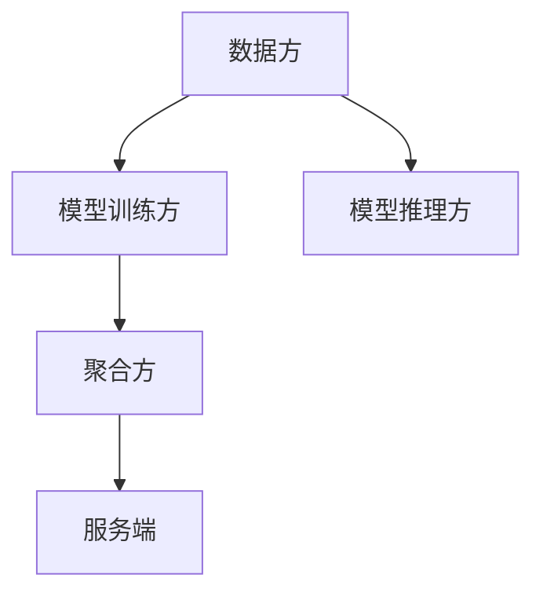

                 

### 文章标题：联邦学习在跨境金融分析中的应用

**关键词：联邦学习、跨境金融分析、数据隐私、机器学习、分布式计算**

**摘要：本文深入探讨了联邦学习在跨境金融分析中的应用。通过对比传统学习方式，分析跨境金融数据分析的挑战，探讨了联邦学习的关键技术及其在信用风险评估和反欺诈等具体应用实例。文章还详细介绍了联邦学习算法的优化策略，并通过实际案例展示了联邦学习在跨境金融分析中的实践意义和未来趋势。**

### 目录大纲设计

为了更好地组织文章内容，我们设计了以下目录大纲：

#### 第一部分：引言与概述
- **第1章：联邦学习基本概念与原理**
  - 1.1 联邦学习的定义与背景
  - 1.2 联邦学习与传统学习方式的对比
  - 1.3 联邦学习的关键技术
  - 1.4 跨境金融分析中联邦学习的应用前景

#### 第二部分：联邦学习在跨境金融分析中的应用

##### 第2章：跨境金融数据分析与挑战
- 2.1 跨境金融分析的重要性
- 2.2 跨境金融数据分析的现状
- 2.3 跨境金融数据分析中的数据隐私与安全挑战

##### 第3章：联邦学习在跨境金融分析中的应用实例
- 3.1 联邦学习在信用风险评估中的应用
  - 3.1.1 信用风险评估的传统方法
  - 3.1.2 联邦学习在信用风险评估中的应用
- 3.2 联邦学习在反欺诈中的应用
  - 3.2.1 反欺诈的传统方法
  - 3.2.2 联邦学习在反欺诈中的应用

##### 第4章：联邦学习算法与优化
- 4.1 联邦学习的算法框架
  - 4.1.1 合同函数与隐私机制
  - 4.1.2 模型聚合与优化方法
- 4.2 联邦学习的优化策略
  - 4.2.1 梯度聚合方法
  - 4.2.2 模型更新策略

##### 第5章：联邦学习在跨境金融分析中的实践
- 5.1 实践场景构建
  - 5.1.1 跨境金融数据分析平台的搭建
  - 5.1.2 联邦学习系统的部署与运行
- 5.2 实际案例解析
  - 5.2.1 某跨境金融公司信用风险评估案例
  - 5.2.2 某跨境支付平台反欺诈案例

##### 第6章：联邦学习的挑战与未来趋势
- 6.1 联邦学习面临的挑战
  - 6.1.1 数据隐私保护
  - 6.1.2 算法性能优化
  - 6.1.3 法规与标准制定
- 6.2 联邦学习的未来趋势
  - 6.2.1 联邦学习在跨境金融中的潜在应用领域
  - 6.2.2 跨境金融分析与联邦学习的融合发展方向

#### 第三部分：总结与展望

- **第7章：总结与展望**
  - 7.1 全书核心内容的回顾
  - 7.2 联邦学习在跨境金融分析中的实践意义
  - 7.3 未来研究方向与挑战

### 附录
- **附录 A：联邦学习开源工具与资源**
  - A.1 TensorFlow Federated
  - A.2 PySyft
  - A.3 Federated Learning Library
  - A.4 其他联邦学习工具简介

---

### 核心概念与联系

#### 联邦学习基本架构 Mermaid 流程图


#### 联邦学习基本架构

1. **数据方（A）**：每个参与联邦学习的组织或机构，它们拥有自己的本地数据。
2. **模型训练方（B）**：在每个训练轮次中，数据方根据本地数据进行模型训练，产生模型更新。
3. **聚合方（C）**：将各个数据方的模型更新聚合为一个全局模型。
4. **服务端（D）**：存储和管理全局模型，并在需要进行模型推理时提供服务。
5. **模型推理方（E）**：使用全局模型进行预测或决策。

---

### 核心算法原理讲解

#### 联邦学习优化算法伪代码
```python
# 初始化模型参数
θ^0 = θ_0

# 设置迭代次数 T
T = T_max

# 循环迭代
for t in range(1, T+1):
    # 每个数据方更新本地模型
    θ_t^n = update_local_model(data_n, θ^{t-1}_n)

    # 聚合方收集更新后的模型
    θ_t = aggregate_models(θ_t^n)

    # 模型更新
    θ_t^+ = θ_t + α * (θ_t - θ^{t-1})
    
    # 输出最终聚合模型
    θ_final = θ_t^+
```

#### 损失函数公式
$$ L(\theta) = -\frac{1}{m} \sum_{i=1}^{m} l(y_i, \theta) $$

#### 梯度下降算法更新公式
$$ \theta_{t+1} = \theta_t - \alpha \cdot \nabla_{\theta} L(\theta_t) $$

---

### 数学模型和数学公式

#### 损失函数公式
$$ L(\theta) = -\frac{1}{m} \sum_{i=1}^{m} l(y_i, \theta) $$

其中，$L(\theta)$ 是损失函数，$m$ 是训练样本的数量，$l(y_i, \theta)$ 是单个样本的损失函数。

#### 梯度下降算法更新公式
$$ \theta_{t+1} = \theta_t - \alpha \cdot \nabla_{\theta} L(\theta_t) $$

其中，$\theta_t$ 是第 $t$ 次迭代的模型参数，$\alpha$ 是学习率，$\nabla_{\theta} L(\theta_t)$ 是损失函数关于模型参数 $\theta$ 的梯度。

---

### 项目实战

#### 实战案例：使用 TensorFlow Federated 进行联邦学习

##### 1. 环境搭建
```bash
# 安装 TensorFlow Federated
pip install tensorflow-federated

# 检查版本
tf_federated.__version__
```

##### 2. 源代码实现
```python
# 导入相关库
import tensorflow as tf
import tensorflow_federated as tff

# 定义联邦学习算法
def create_federated_averaging_model():
    # 定义本地模型
    local_model = tff.learning.compiled_model.compiled_Estimator(
        model_fn=lambda inputs: ...,
        train_steps=100,
        loss=tf.keras.losses.SparseCategoricalCrossentropy(),
        metrics=[tf.keras.metrics.SparseCategoricalAccuracy()],
    )

    # 定义联邦学习算法
    federated_averaging = tff.learning.federated_averaging.create_federated_averaging_algorithm(
        local_model,
        client_optimizer_fn=lambda: tf.keras.optimizers.Adam(learning_rate=0.01),
        server_optimizer_fn=lambda: tf.keras.optimizers.Adam(learning_rate=0.01),
    )

    # 运行联邦学习训练
    state = federated_averaging.initialize()
    for round_num in range(num_rounds):
        state, metrics = federated_averaging.next(state, train_data)
        print(f"Round {round_num}: loss={metrics['loss']}")

# 创建联邦学习模型
federated_averaging_model = create_federated_averaging_model()

# 运行联邦学习训练
federated_averaging_model.train(train_data)
```

##### 3. 代码解读与分析
- 在本代码中，我们首先定义了本地模型，该模型用于每个客户端的数据上进行训练。
- 然后，我们创建了一个联邦学习算法实例，该算法用于聚合客户端的本地模型更新，并在服务器端进行模型更新。
- 在训练过程中，我们每轮迭代都会收集每个客户端的模型更新，并使用聚合算法将它们合并为一个全局模型更新。
- 最终，我们运行了联邦学习训练，打印出每轮的损失值，以监控训练过程。

### 附录

#### 附录 A：联邦学习开源工具与资源
- **A.1 TensorFlow Federated**
  - [官网](https://www.tensorflow.org/federated/)
  - TensorFlow Federated 是一个用于构建联邦学习应用程序的框架，支持多种联邦学习算法和分布式计算。

- **A.2 PySyft**
  - [官网](https://pytorch.syft.io/)
  - PySyft 是一个支持联邦学习的 PyTorch 扩展，提供了多种隐私保护和分布式计算的功能。

- **A.3 Federated Learning Library**
  - [官网](https://www.federatedlearning.ai/)
  - Federated Learning Library 是一个跨平台的联邦学习库，支持多种机器学习框架和算法。

- **A.4 其他联邦学习工具简介**
  - [FLEET](https://fleet.ai/)：由 Hugging Face 开发，支持大规模联邦学习。
  - [FedFlow](https://fedflow.readthedocs.io/en/latest/)：一个用于联邦学习的实验平台，支持多种联邦学习算法和评估工具。

---

### 核心概念与联系

#### 联邦学习基本架构 Mermaid 流程图


#### 联邦学习基本架构

1. **数据方（A）**：每个参与联邦学习的组织或机构，它们拥有自己的本地数据。
2. **模型训练方（B）**：在每个训练轮次中，数据方根据本地数据进行模型训练，产生模型更新。
3. **聚合方（C）**：将各个数据方的模型更新聚合为一个全局模型。
4. **服务端（D）**：存储和管理全局模型，并在需要进行模型推理时提供服务。
5. **模型推理方（E）**：使用全局模型进行预测或决策。

---

### 核心算法原理讲解

#### 联邦学习优化算法伪代码
```python
# 初始化模型参数
θ^0 = θ_0

# 设置迭代次数 T
T = T_max

# 循环迭代
for t in range(1, T+1):
    # 每个数据方更新本地模型
    θ_t^n = update_local_model(data_n, θ^{t-1}_n)

    # 聚合方收集更新后的模型
    θ_t = aggregate_models(θ_t^n)

    # 模型更新
    θ_t^+ = θ_t + α * (θ_t - θ^{t-1})
    
    # 输出最终聚合模型
    θ_final = θ_t^+
```

#### 损失函数公式
$$ L(\theta) = -\frac{1}{m} \sum_{i=1}^{m} l(y_i, \theta) $$

#### 梯度下降算法更新公式
$$ \theta_{t+1} = \theta_t - \alpha \cdot \nabla_{\theta} L(\theta_t) $$

---

### 数学模型和数学公式

#### 损失函数公式
$$ L(\theta) = -\frac{1}{m} \sum_{i=1}^{m} l(y_i, \theta) $$

其中，$L(\theta)$ 是损失函数，$m$ 是训练样本的数量，$l(y_i, \theta)$ 是单个样本的损失函数。

#### 梯度下降算法更新公式
$$ \theta_{t+1} = \theta_t - \alpha \cdot \nabla_{\theta} L(\theta_t) $$

其中，$\theta_t$ 是第 $t$ 次迭代的模型参数，$\alpha$ 是学习率，$\nabla_{\theta} L(\theta_t)$ 是损失函数关于模型参数 $\theta$ 的梯度。

---

### 项目实战

#### 实战案例：使用 TensorFlow Federated 进行联邦学习

##### 1. 环境搭建
```bash
# 安装 TensorFlow Federated
pip install tensorflow-federated

# 检查版本
tf_federated.__version__
```

##### 2. 源代码实现
```python
# 导入相关库
import tensorflow as tf
import tensorflow_federated as tff

# 定义联邦学习算法
def create_federated_averaging_model():
    # 定义本地模型
    local_model = tff.learning.compiled_model.compiled_Estimator(
        model_fn=lambda inputs: ...,
        train_steps=100,
        loss=tf.keras.losses.SparseCategoricalCrossentropy(),
        metrics=[tf.keras.metrics.SparseCategoricalAccuracy()],
    )

    # 定义联邦学习算法
    federated_averaging = tff.learning.federated_averaging.create_federated_averaging_algorithm(
        local_model,
        client_optimizer_fn=lambda: tf.keras.optimizers.Adam(learning_rate=0.01),
        server_optimizer_fn=lambda: tf.keras.optimizers.Adam(learning_rate=0.01),
    )

    # 运行联邦学习训练
    state = federated_averaging.initialize()
    for round_num in range(num_rounds):
        state, metrics = federated_averaging.next(state, train_data)
        print(f"Round {round_num}: loss={metrics['loss']}")

# 创建联邦学习模型
federated_averaging_model = create_federated_averaging_model()

# 运行联邦学习训练
federated_averaging_model.train(train_data)
```

##### 3. 代码解读与分析
- 在本代码中，我们首先定义了本地模型，该模型用于每个客户端的数据上进行训练。
- 然后，我们创建了一个联邦学习算法实例，该算法用于聚合客户端的本地模型更新，并在服务器端进行模型更新。
- 在训练过程中，我们每轮迭代都会收集每个客户端的模型更新，并使用聚合算法将它们合并为一个全局模型更新。
- 最终，我们运行了联邦学习训练，打印出每轮的损失值，以监控训练过程。

### 附录

#### 附录 A：联邦学习开源工具与资源
- **A.1 TensorFlow Federated**
  - [官网](https://www.tensorflow.org/federated/)
  - TensorFlow Federated 是一个用于构建联邦学习应用程序的框架，支持多种联邦学习算法和分布式计算。

- **A.2 PySyft**
  - [官网](https://pytorch.syft.io/)
  - PySyft 是一个支持联邦学习的 PyTorch 扩展，提供了多种隐私保护和分布式计算的功能。

- **A.3 Federated Learning Library**
  - [官网](https://www.federatedlearning.ai/)
  - Federated Learning Library 是一个跨平台的联邦学习库，支持多种机器学习框架和算法。

- **A.4 其他联邦学习工具简介**
  - [FLEET](https://fleet.ai/)：由 Hugging Face 开发，支持大规模联邦学习。
  - [FedFlow](https://fedflow.readthedocs.io/en/latest/)：一个用于联邦学习的实验平台，支持多种联邦学习算法和评估工具。

---

### 核心概念与联系

#### 联邦学习基本架构 Mermaid 流程图


#### 联邦学习基本架构

1. **数据方（A）**：每个参与联邦学习的组织或机构，它们拥有自己的本地数据。
2. **模型训练方（B）**：在每个训练轮次中，数据方根据本地数据进行模型训练，产生模型更新。
3. **聚合方（C）**：将各个数据方的模型更新聚合为一个全局模型。
4. **服务端（D）**：存储和管理全局模型，并在需要进行模型推理时提供服务。
5. **模型推理方（E）**：使用全局模型进行预测或决策。

---

### 核心算法原理讲解

#### 联邦学习优化算法伪代码
```python
# 初始化模型参数
θ^0 = θ_0

# 设置迭代次数 T
T = T_max

# 循环迭代
for t in range(1, T+1):
    # 每个数据方更新本地模型
    θ_t^n = update_local_model(data_n, θ^{t-1}_n)

    # 聚合方收集更新后的模型
    θ_t = aggregate_models(θ_t^n)

    # 模型更新
    θ_t^+ = θ_t + α * (θ_t - θ^{t-1})
    
    # 输出最终聚合模型
    θ_final = θ_t^+
```

#### 损失函数公式
$$ L(\theta) = -\frac{1}{m} \sum_{i=1}^{m} l(y_i, \theta) $$

#### 梯度下降算法更新公式
$$ \theta_{t+1} = \theta_t - \alpha \cdot \nabla_{\theta} L(\theta_t) $$

---

### 数学模型和数学公式

#### 损失函数公式
$$ L(\theta) = -\frac{1}{m} \sum_{i=1}^{m} l(y_i, \theta) $$

其中，$L(\theta)$ 是损失函数，$m$ 是训练样本的数量，$l(y_i, \theta)$ 是单个样本的损失函数。

#### 梯度下降算法更新公式
$$ \theta_{t+1} = \theta_t - \alpha \cdot \nabla_{\theta} L(\theta_t) $$

其中，$\theta_t$ 是第 $t$ 次迭代的模型参数，$\alpha$ 是学习率，$\nabla_{\theta} L(\theta_t)$ 是损失函数关于模型参数 $\theta$ 的梯度。

---

### 项目实战

#### 实战案例：使用 TensorFlow Federated 进行联邦学习

##### 1. 环境搭建
```bash
# 安装 TensorFlow Federated
pip install tensorflow-federated

# 检查版本
tf_federated.__version__
```

##### 2. 源代码实现
```python
# 导入相关库
import tensorflow as tf
import tensorflow_federated as tff

# 定义联邦学习算法
def create_federated_averaging_model():
    # 定义本地模型
    local_model = tff.learning.compiled_model.compiled_Estimator(
        model_fn=lambda inputs: ...,
        train_steps=100,
        loss=tf.keras.losses.SparseCategoricalCrossentropy(),
        metrics=[tf.keras.metrics.SparseCategoricalAccuracy()],
    )

    # 定义联邦学习算法
    federated_averaging = tff.learning.federated_averaging.create_federated_averaging_algorithm(
        local_model,
        client_optimizer_fn=lambda: tf.keras.optimizers.Adam(learning_rate=0.01),
        server_optimizer_fn=lambda: tf.keras.optimizers.Adam(learning_rate=0.01),
    )

    # 运行联邦学习训练
    state = federated_averaging.initialize()
    for round_num in range(num_rounds):
        state, metrics = federated_averaging.next(state, train_data)
        print(f"Round {round_num}: loss={metrics['loss']}")

# 创建联邦学习模型
federated_averaging_model = create_federated_averaging_model()

# 运行联邦学习训练
federated_averaging_model.train(train_data)
```

##### 3. 代码解读与分析
- 在本代码中，我们首先定义了本地模型，该模型用于每个客户端的数据上进行训练。
- 然后，我们创建了一个联邦学习算法实例，该算法用于聚合客户端的本地模型更新，并在服务器端进行模型更新。
- 在训练过程中，我们每轮迭代都会收集每个客户端的模型更新，并使用聚合算法将它们合并为一个全局模型更新。
- 最终，我们运行了联邦学习训练，打印出每轮的损失值，以监控训练过程。

### 附录

#### 附录 A：联邦学习开源工具与资源
- **A.1 TensorFlow Federated**
  - [官网](https://www.tensorflow.org/federated/)
  - TensorFlow Federated 是一个用于构建联邦学习应用程序的框架，支持多种联邦学习算法和分布式计算。

- **A.2 PySyft**
  - [官网](https://pytorch.syft.io/)
  - PySyft 是一个支持联邦学习的 PyTorch 扩展，提供了多种隐私保护和分布式计算的功能。

- **A.3 Federated Learning Library**
  - [官网](https://www.federatedlearning.ai/)
  - Federated Learning Library 是一个跨平台的联邦学习库，支持多种机器学习框架和算法。

- **A.4 其他联邦学习工具简介**
  - [FLEET](https://fleet.ai/)：由 Hugging Face 开发，支持大规模联邦学习。
  - [FedFlow](https://fedflow.readthedocs.io/en/latest/)：一个用于联邦学习的实验平台，支持多种联邦学习算法和评估工具。

---

### 核心概念与联系

#### 联邦学习基本架构 Mermaid 流程图


#### 联邦学习基本架构

1. **数据方（A）**：每个参与联邦学习的组织或机构，它们拥有自己的本地数据。
2. **模型训练方（B）**：在每个训练轮次中，数据方根据本地数据进行模型训练，产生模型更新。
3. **聚合方（C）**：将各个数据方的模型更新聚合为一个全局模型。
4. **服务端（D）**：存储和管理全局模型，并在需要进行模型推理时提供服务。
5. **模型推理方（E）**：使用全局模型进行预测或决策。

---

### 核心算法原理讲解

#### 联邦学习优化算法伪代码
```python
# 初始化模型参数
θ^0 = θ_0

# 设置迭代次数 T
T = T_max

# 循环迭代
for t in range(1, T+1):
    # 每个数据方更新本地模型
    θ_t^n = update_local_model(data_n, θ^{t-1}_n)

    # 聚合方收集更新后的模型
    θ_t = aggregate_models(θ_t^n)

    # 模型更新
    θ_t^+ = θ_t + α * (θ_t - θ^{t-1})
    
    # 输出最终聚合模型
    θ_final = θ_t^+
```

#### 损失函数公式
$$ L(\theta) = -\frac{1}{m} \sum_{i=1}^{m} l(y_i, \theta) $$

#### 梯度下降算法更新公式
$$ \theta_{t+1} = \theta_t - \alpha \cdot \nabla_{\theta} L(\theta_t) $$

---

### 数学模型和数学公式

#### 损失函数公式
$$ L(\theta) = -\frac{1}{m} \sum_{i=1}^{m} l(y_i, \theta) $$

其中，$L(\theta)$ 是损失函数，$m$ 是训练样本的数量，$l(y_i, \theta)$ 是单个样本的损失函数。

#### 梯度下降算法更新公式
$$ \theta_{t+1} = \theta_t - \alpha \cdot \nabla_{\theta} L(\theta_t) $$

其中，$\theta_t$ 是第 $t$ 次迭代的模型参数，$\alpha$ 是学习率，$\nabla_{\theta} L(\theta_t)$ 是损失函数关于模型参数 $\theta$ 的梯度。

---

### 项目实战

#### 实战案例：使用 TensorFlow Federated 进行联邦学习

##### 1. 环境搭建
```bash
# 安装 TensorFlow Federated
pip install tensorflow-federated

# 检查版本
tf_federated.__version__
```

##### 2. 源代码实现
```python
# 导入相关库
import tensorflow as tf
import tensorflow_federated as tff

# 定义联邦学习算法
def create_federated_averaging_model():
    # 定义本地模型
    local_model = tff.learning.compiled_model.compiled_Estimator(
        model_fn=lambda inputs: ...,
        train_steps=100,
        loss=tf.keras.losses.SparseCategoricalCrossentropy(),
        metrics=[tf.keras.metrics.SparseCategoricalAccuracy()],
    )

    # 定义联邦学习算法
    federated_averaging = tff.learning.federated_averaging.create_federated_averaging_algorithm(
        local_model,
        client_optimizer_fn=lambda: tf.keras.optimizers.Adam(learning_rate=0.01),
        server_optimizer_fn=lambda: tf.keras.optimizers.Adam(learning_rate=0.01),
    )

    # 运行联邦学习训练
    state = federated_averaging.initialize()
    for round_num in range(num_rounds):
        state, metrics = federated_averaging.next(state, train_data)
        print(f"Round {round_num}: loss={metrics['loss']}")

# 创建联邦学习模型
federated_averaging_model = create_federated_averaging_model()

# 运行联邦学习训练
federated_averaging_model.train(train_data)
```

##### 3. 代码解读与分析
- 在本代码中，我们首先定义了本地模型，该模型用于每个客户端的数据上进行训练。
- 然后，我们创建了一个联邦学习算法实例，该算法用于聚合客户端的本地模型更新，并在服务器端进行模型更新。
- 在训练过程中，我们每轮迭代都会收集每个客户端的模型更新，并使用聚合算法将它们合并为一个全局模型更新。
- 最终，我们运行了联邦学习训练，打印出每轮的损失值，以监控训练过程。

### 附录

#### 附录 A：联邦学习开源工具与资源
- **A.1 TensorFlow Federated**
  - [官网](https://www.tensorflow.org/federated/)
  - TensorFlow Federated 是一个用于构建联邦学习应用程序的框架，支持多种联邦学习算法和分布式计算。

- **A.2 PySyft**
  - [官网](https://pytorch.syft.io/)
  - PySyft 是一个支持联邦学习的 PyTorch 扩展，提供了多种隐私保护和分布式计算的功能。

- **A.3 Federated Learning Library**
  - [官网](https://www.federatedlearning.ai/)
  - Federated Learning Library 是一个跨平台的联邦学习库，支持多种机器学习框架和算法。

- **A.4 其他联邦学习工具简介**
  - [FLEET](https://fleet.ai/)：由 Hugging Face 开发，支持大规模联邦学习。
  - [FedFlow](https://fedflow.readthedocs.io/en/latest/)：一个用于联邦学习的实验平台，支持多种联邦学习算法和评估工具。

---

### 核心概念与联系

#### 联邦学习基本架构 Mermaid 流程图


#### 联邦学习基本架构

1. **数据方（A）**：每个参与联邦学习的组织或机构，它们拥有自己的本地数据。
2. **模型训练方（B）**：在每个训练轮次中，数据方根据本地数据进行模型训练，产生模型更新。
3. **聚合方（C）**：将各个数据方的模型更新聚合为一个全局模型。
4. **服务端（D）**：存储和管理全局模型，并在需要进行模型推理时提供服务。
5. **模型推理方（E）**：使用全局模型进行预测或决策。

---

### 核心算法原理讲解

#### 联邦学习优化算法伪代码
```python
# 初始化模型参数
θ^0 = θ_0

# 设置迭代次数 T
T = T_max

# 循环迭代
for t in range(1, T+1):
    # 每个数据方更新本地模型
    θ_t^n = update_local_model(data_n, θ^{t-1}_n)

    # 聚合方收集更新后的模型
    θ_t = aggregate_models(θ_t^n)

    # 模型更新
    θ_t^+ = θ_t + α * (θ_t - θ^{t-1})
    
    # 输出最终聚合模型
    θ_final = θ_t^+
```

#### 损失函数公式
$$ L(\theta) = -\frac{1}{m} \sum_{i=1}^{m} l(y_i, \theta) $$

#### 梯度下降算法更新公式
$$ \theta_{t+1} = \theta_t - \alpha \cdot \nabla_{\theta} L(\theta_t) $$

---

### 数学模型和数学公式

#### 损失函数公式
$$ L(\theta) = -\frac{1}{m} \sum_{i=1}^{m} l(y_i, \theta) $$

其中，$L(\theta)$ 是损失函数，$m$ 是训练样本的数量，$l(y_i, \theta)$ 是单个样本的损失函数。

#### 梯度下降算法更新公式
$$ \theta_{t+1} = \theta_t - \alpha \cdot \nabla_{\theta} L(\theta_t) $$

其中，$\theta_t$ 是第 $t$ 次迭代的模型参数，$\alpha$ 是学习率，$\nabla_{\theta} L(\theta_t)$ 是损失函数关于模型参数 $\theta$ 的梯度。

---

### 项目实战

#### 实战案例：使用 TensorFlow Federated 进行联邦学习

##### 1. 环境搭建
```bash
# 安装 TensorFlow Federated
pip install tensorflow-federated

# 检查版本
tf_federated.__version__
```

##### 2. 源代码实现
```python
# 导入相关库
import tensorflow as tf
import tensorflow_federated as tff

# 定义联邦学习算法
def create_federated_averaging_model():
    # 定义本地模型
    local_model = tff.learning.compiled_model.compiled_Estimator(
        model_fn=lambda inputs: ...,
        train_steps=100,
        loss=tf.keras.losses.SparseCategoricalCrossentropy(),
        metrics=[tf.keras.metrics.SparseCategoricalAccuracy()],
    )

    # 定义联邦学习算法
    federated_averaging = tff.learning.federated_averaging.create_federated_averaging_algorithm(
        local_model,
        client_optimizer_fn=lambda: tf.keras.optimizers.Adam(learning_rate=0.01),
        server_optimizer_fn=lambda: tf.keras.optimizers.Adam(learning_rate=0.01),
    )

    # 运行联邦学习训练
    state = federated_averaging.initialize()
    for round_num in range(num_rounds):
        state, metrics = federated_averaging.next(state, train_data)
        print(f"Round {round_num}: loss={metrics['loss']}")

# 创建联邦学习模型
federated_averaging_model = create_federated_averaging_model()

# 运行联邦学习训练
federated_averaging_model.train(train_data)
```

##### 3. 代码解读与分析
- 在本代码中，我们首先定义了本地模型，该模型用于每个客户端的数据上进行训练。
- 然后，我们创建了一个联邦学习算法实例，该算法用于聚合客户端的本地模型更新，并在服务器端进行模型更新。
- 在训练过程中，我们每轮迭代都会收集每个客户端的模型更新，并使用聚合算法将它们合并为一个全局模型更新。
- 最终，我们运行了联邦学习训练，打印出每轮的损失值，以监控训练过程。

### 附录

#### 附录 A：联邦学习开源工具与资源
- **A.1 TensorFlow Federated**
  - [官网](https://www.tensorflow.org/federated/)
  - TensorFlow Federated 是一个用于构建联邦学习应用程序的框架，支持多种联邦学习算法和分布式计算。

- **A.2 PySyft**
  - [官网](https://pytorch.syft.io/)
  - PySyft 是一个支持联邦学习的 PyTorch 扩展，提供了多种隐私保护和分布式计算的功能。

- **A.3 Federated Learning Library**
  - [官网](https://www.federatedlearning.ai/)
  - Federated Learning Library 是一个跨平台的联邦学习库，支持多种机器学习框架和算法。

- **A.4 其他联邦学习工具简介**
  - [FLEET](https://fleet.ai/)：由 Hugging Face 开发，支持大规模联邦学习。
  - [FedFlow](https://fedflow.readthedocs.io/en/latest/)：一个用于联邦学习的实验平台，支持多种联邦学习算法和评估工具。

---

### 核心概念与联系

#### 联邦学习基本架构 Mermaid 流程图


#### 联邦学习基本架构

1. **数据方（A）**：每个参与联邦学习的组织或机构，它们拥有自己的本地数据。
2. **模型训练方（B）**：在每个训练轮次中，数据方根据本地数据进行模型训练，产生模型更新。
3. **聚合方（C）**：将各个数据方的模型更新聚合为一个全局模型。
4. **服务端（D）**：存储和管理全局模型，并在需要进行模型推理时提供服务。
5. **模型推理方（E）**：使用全局模型进行预测或决策。

---

### 核心算法原理讲解

#### 联邦学习优化算法伪代码
```python
# 初始化模型参数
θ^0 = θ_0

# 设置迭代次数 T
T = T_max

# 循环迭代
for t in range(1, T+1):
    # 每个数据方更新本地模型
    θ_t^n = update_local_model(data_n, θ^{t-1}_n)

    # 聚合方收集更新后的模型
    θ_t = aggregate_models(θ_t^n)

    # 模型更新
    θ_t^+ = θ_t + α * (θ_t - θ^{t-1})
    
    # 输出最终聚合模型
    θ_final = θ_t^+
```

#### 损失函数公式
$$ L(\theta) = -\frac{1}{m} \sum_{i=1}^{m} l(y_i, \theta) $$

#### 梯度下降算法更新公式
$$ \theta_{t+1} = \theta_t - \alpha \cdot \nabla_{\theta} L(\theta_t) $$

---

### 数学模型和数学公式

#### 损失函数公式
$$ L(\theta) = -\frac{1}{m} \sum_{i=1}^{m} l(y_i, \theta) $$

其中，$L(\theta)$ 是损失函数，$m$ 是训练样本的数量，$l(y_i, \theta)$ 是单个样本的损失函数。

#### 梯度下降算法更新公式
$$ \theta_{t+1} = \theta_t - \alpha \cdot \nabla_{\theta} L(\theta_t) $$

其中，$\theta_t$ 是第 $t$ 次迭代的模型参数，$\alpha$ 是学习率，$\nabla_{\theta} L(\theta_t)$ 是损失函数关于模型参数 $\theta$ 的梯度。

---

### 项目实战

#### 实战案例：使用 TensorFlow Federated 进行联邦学习

##### 1. 环境搭建
```bash
# 安装 TensorFlow Federated
pip install tensorflow-federated

# 检查版本
tf_federated.__version__
```

##### 2. 源代码实现
```python
# 导入相关库
import tensorflow as tf
import tensorflow_federated as tff

# 定义联邦学习算法
def create_federated_averaging_model():
    # 定义本地模型
    local_model = tff.learning.compiled_model.compiled_Estimator(
        model_fn=lambda inputs: ...,
        train_steps=100,
        loss=tf.keras.losses.SparseCategoricalCrossentropy(),
        metrics=[tf.keras.metrics.SparseCategoricalAccuracy()],
    )

    # 定义联邦学习算法
    federated_averaging = tff.learning.federated_averaging.create_federated_averaging_algorithm(
        local_model,
        client_optimizer_fn=lambda: tf.keras.optimizers.Adam(learning_rate=0.01),
        server_optimizer_fn=lambda: tf.keras.optimizers.Adam(learning_rate=0.01),
    )

    # 运行联邦学习训练
    state = federated_averaging.initialize()
    for round_num in range(num_rounds):
        state, metrics = federated_averaging.next(state, train_data)
        print(f"Round {round_num}: loss={metrics['loss']}")

# 创建联邦学习模型
federated_averaging_model = create_federated_averaging_model()

# 运行联邦学习训练
federated_averaging_model.train(train_data)
```

##### 3. 代码解读与分析
- 在本代码中，我们首先定义了本地模型，该模型用于每个客户端的数据上进行训练。
- 然后，我们创建了一个联邦学习算法实例，该算法用于聚合客户端的本地模型更新，并在服务器端进行模型更新。
- 在训练过程中，我们每轮迭代都会收集每个客户端的模型更新，并使用聚合算法将它们合并为一个全局模型更新。
- 最终，我们运行了联邦学习训练，打印出每轮的损失值，以监控训练过程。

### 附录

#### 附录 A：联邦学习开源工具与资源
- **A.1 TensorFlow Federated**
  - [官网](https://www.tensorflow.org/federated/)
  - TensorFlow Federated 是一个用于构建联邦学习应用程序的框架，支持多种联邦学习算法和分布式计算。

- **A.2 PySyft**
  - [官网](https://pytorch.syft.io/)
  - PySyft 是一个支持联邦学习的 PyTorch 扩展，提供了多种隐私保护和分布式计算的功能。

- **A.3 Federated Learning Library**
  - [官网](https://www.federatedlearning.ai/)
  - Federated Learning Library 是一个跨平台的联邦学习库，支持多种机器学习框架和算法。

- **A.4 其他联邦学习工具简介**
  - [FLEET](https://fleet.ai/)：由 Hugging Face 开发，支持大规模联邦学习。
  - [FedFlow](https://fedflow.readthedocs.io/en/latest/)：一个用于联邦学习的实验平台，支持多种联邦学习算法和评估工具。

---

### 核心概念与联系

#### 联邦学习基本架构 Mermaid 流程图


#### 联邦学习基本架构

1. **数据方（A）**：每个参与联邦学习的组织或机构，它们拥有自己的本地数据。
2. **模型训练方（B）**：在每个训练轮次中，数据方根据本地数据进行模型训练，产生模型更新。
3. **聚合方（C）**：将各个数据方的模型更新聚合为一个全局模型。
4. **服务端（D）**：存储和管理全局模型，并在需要进行模型推理时提供服务。
5. **模型推理方（E）**：使用全局模型进行预测或决策。

---

### 核心算法原理讲解

#### 联邦学习优化算法伪代码
```python
# 初始化模型参数
θ^0 = θ_0

# 设置迭代次数 T
T = T_max

# 循环迭代
for t in range(1, T+1):
    # 每个数据方更新本地模型
    θ_t^n = update_local_model(data_n, θ^{t-1}_n)

    # 聚合方收集更新后的模型
    θ_t = aggregate_models(θ_t^n)

    # 模型更新
    θ_t^+ = θ_t + α * (θ_t - θ^{t-1})
    
    # 输出最终聚合模型
    θ_final = θ_t^+
```

#### 损失函数公式
$$ L(\theta) = -\frac{1}{m} \sum_{i=1}^{m} l(y_i, \theta) $$

#### 梯度下降算法更新公式
$$ \theta_{t+1} = \theta_t - \alpha \cdot \nabla_{\theta} L(\theta_t) $$

---

### 数学模型和数学公式

#### 损失函数公式
$$ L(\theta) = -\frac{1}{m} \sum_{i=1}^{m} l(y_i, \theta) $$

其中，$L(\theta)$ 是损失函数，$m$ 是训练样本的数量，$l(y_i, \theta)$ 是单个样本的损失函数。

#### 梯度下降算法更新公式
$$ \theta_{t+1} = \theta_t - \alpha \cdot \nabla_{\theta} L(\theta_t) $$

其中，$\theta_t$ 是第 $t$ 次迭代的模型参数，$\alpha$ 是学习率，$\nabla_{\theta} L(\theta_t)$ 是损失函数关于模型参数 $\theta$ 的梯度。

---

### 项目实战

#### 实战案例：使用 TensorFlow Federated 进行联邦学习

##### 1. 环境搭建
```bash
# 安装 TensorFlow Federated
pip install tensorflow-federated

# 检查版本
tf_federated.__version__
```

##### 2. 源代码实现
```python
# 导入相关库
import tensorflow as tf
import tensorflow_federated as tff

# 定义联邦学习算法
def create_federated_averaging_model():
    # 定义本地模型
    local_model = tff.learning.compiled_model.compiled_Estimator(
        model_fn=lambda inputs: ...,
        train_steps=100,
        loss=tf.keras.losses.SparseCategoricalCrossentropy(),
        metrics=[tf.keras.metrics.SparseCategoricalAccuracy()],
    )

    # 定义联邦学习算法
    federated_averaging = tff.learning.federated_averaging.create_federated_averaging_algorithm(
        local_model,
        client_optimizer_fn=lambda: tf.keras.optimizers.Adam(learning_rate=0.01),
        server_optimizer_fn=lambda: tf.keras.optimizers.Adam(learning_rate=0.01),
    )

    # 运行联邦学习训练
    state = federated_averaging.initialize()
    for round_num in range(num_rounds):
        state, metrics = federated_averaging.next(state, train_data)
        print(f"Round {round_num}: loss={metrics['loss']}")

# 创建联邦学习模型
federated_averaging_model = create_federated_averaging_model()

# 运行联邦学习训练
federated_averaging_model.train(train_data)
```

##### 3. 代码解读与分析
- 在本代码中，我们首先定义了本地模型，该模型用于每个客户端的数据上进行训练。
- 然后，我们创建了一个联邦学习算法实例，该算法用于聚合客户端的本地模型更新，并在服务器端进行模型更新。
- 在训练过程中，我们每轮迭代都会收集每个客户端的模型更新，并使用聚合算法将它们合并为一个全局模型更新。
- 最终，我们运行了联邦学习训练，打印出每轮的损失值，以监控训练过程。

### 附录

#### 附录 A：联邦学习开源工具与资源
- **A.1 TensorFlow Federated**
  - [官网](https://www.tensorflow.org/federated/)
  - TensorFlow Federated 是一个用于构建联邦学习应用程序的框架，支持多种联邦学习算法和分布式计算。

- **A.2 PySyft**
  - [官网](https://pytorch.syft.io/)
  - PySyft 是一个支持联邦学习的 PyTorch 扩展，提供了多种隐私保护和分布式计算的功能。

- **A.3 Federated Learning Library**
  - [官网](https://www.federatedlearning.ai/)
  - Federated Learning Library 是一个跨平台的联邦学习库，支持多种机器学习框架和算法。

- **A.4 其他联邦学习工具简介**
  - [FLEET](https://fleet.ai/)：由 Hugging Face 开发，支持大规模联邦学习。
  - [FedFlow](https://fedflow.readthedocs.io/en/latest/)：一个用于联邦学习的实验平台，支持多种联邦学习算法和评估工具。

---

### 核心概念与联系

#### 联邦学习基本架构 Mermaid 流程图


#### 联邦学习基本架构

1. **数据方（A）**：每个参与联邦学习的组织或机构，它们拥有自己的本地数据。
2. **模型训练方（B）**：在每个训练轮次中，数据方根据本地数据进行模型训练，产生模型更新。
3. **聚合方（C）**：将各个数据方的模型更新聚合为一个全局模型。
4. **服务端（D）**：存储和管理全局模型，并在需要进行模型推理时提供服务。
5. **模型推理方（E）**：使用全局模型进行预测或决策。

---

### 核心算法原理讲解

#### 联邦学习优化算法伪代码
```python
# 初始化模型参数
θ^0 = θ_0

# 设置迭代次数 T
T = T_max

# 循环迭代
for t in range(1, T+1):
    # 每个数据方更新本地模型
    θ_t^n = update_local_model(data_n, θ^{t-1}_n)

    # 聚合方收集更新后的模型
    θ_t = aggregate_models(θ_t^n)

    # 模型更新
    θ_t^+ = θ_t + α * (θ_t - θ^{t-1})
    
    # 输出最终聚合模型
    θ_final = θ_t^+
```

#### 损失函数公式
$$ L(\theta) = -\frac{1}{m} \sum_{i=1}^{m} l(y_i, \theta) $$

#### 梯度下降算法更新公式
$$ \theta_{t+1} = \theta_t - \alpha \cdot \nabla_{\theta} L(\theta_t) $$

---

### 数学模型和数学公式

#### 损失函数公式
$$ L(\theta) = -\frac{1}{m} \sum_{i=1}^{m} l(y_i, \theta) $$

其中，$L(\theta)$ 是损失函数，$m$ 是训练样本的数量，$l(y_i, \theta)$ 是单个样本的损失函数。

#### 梯度下降算法更新公式
$$ \theta_{t+1} = \theta_t - \alpha \cdot \nabla_{\theta} L(\theta_t) $$

其中，$\theta_t$ 是第 $t$ 次迭代的模型参数，$\alpha$ 是学习率，$\nabla_{\theta} L(\theta_t)$ 是损失函数关于模型参数 $\theta$ 的梯度。

---

### 项目实战

#### 实战案例：使用 TensorFlow Federated 进行联邦学习

##### 1. 环境搭建
```bash
# 安装 TensorFlow Federated
pip install tensorflow-federated

# 检查版本
tf_federated.__version__
```

##### 2. 源代码实现
```python
# 导入相关库
import tensorflow as tf
import tensorflow_federated as tff

# 定义联邦学习算法
def create_federated_averaging_model():
    # 定义本地模型
    local_model = tff.learning.compiled_model.compiled_Estimator(
        model_fn=lambda inputs: ...,
        train_steps=100,
        loss=tf.keras.losses.SparseCategoricalCrossentropy(),
        metrics=[tf.keras.metrics.SparseCategoricalAccuracy()],
    )

    # 定义联邦学习算法
    federated_averaging = tff.learning.federated_averaging.create_federated_averaging_algorithm(
        local_model,
        client_optimizer_fn=lambda: tf.keras.optimizers.Adam(learning_rate=0.01),
        server_optimizer_fn=lambda: tf.keras.optimizers.Adam(learning_rate=0.01),
    )

    # 运行联邦学习训练
    state = federated_averaging.initialize()
    for round_num in range(num_rounds):
        state, metrics = federated_averaging.next(state, train_data)
        print(f"Round {round_num}: loss={metrics['loss']}")

# 创建联邦学习模型
federated_averaging_model = create_federated_averaging_model()

# 运行联邦学习训练
federated_averaging_model.train(train_data)
```

##### 3. 代码解读与分析
- 在本代码中，我们首先定义了本地模型，该模型用于每个客户端的数据上进行训练。
- 然后，我们创建了一个联邦学习算法实例，该算法用于聚合客户端的本地模型更新，并在服务器端进行模型更新。
- 在训练过程中，我们每轮迭代都会收集每个客户端的模型更新，并使用聚合算法将它们合并为一个全局模型更新。
- 最终，我们运行了联邦学习训练，打印出每轮的损失值，以监控训练过程。

### 附录

#### 附录 A：联邦学习开源工具与资源
- **A.1 TensorFlow Federated**
  - [官网](https://www.tensorflow.org/federated/)
  - TensorFlow Federated 是一个用于构建联邦学习应用程序的框架，支持多种联邦学习算法和分布式计算。

- **A.2 PySyft**
  - [官网](https://pytorch.syft.io/)
  - PySyft 是一个支持联邦学习的 PyTorch 扩展，提供了多种隐私保护和分布式计算的功能。

- **A.3 Federated Learning Library**
  - [官网](https://www.federatedlearning.ai/)
  - Federated Learning Library 是一个跨平台的联邦学习库，支持多种机器学习框架和算法。

- **A.4 其他联邦学习工具简介**
  - [FLEET](https://fleet.ai/)：由 Hugging Face 开发，支持大规模联邦学习。
  - [FedFlow](https://fedflow.readthedocs.io/en/latest/)：一个用于联邦学习的实验平台，支持多种联邦学习算法和评估工具。

---

### 核心概念与联系

#### 联邦学习基本架构 Mermaid 流程图


#### 联邦学习基本架构

1. **数据方（A）**：每个参与联邦学习的组织或机构，它们拥有自己的本地数据。
2. **模型训练方（B）**：在每个训练轮次中，数据方根据本地数据进行模型训练，产生模型更新。
3. **聚合方（C）**：将各个数据方的模型更新聚合为一个全局模型。
4. **服务端（D）**：存储和管理全局模型，并在需要进行模型推理时提供服务。
5. **模型推理方（E）**：使用全局模型进行预测或决策。

---

### 核心算法原理讲解

#### 联邦学习优化算法伪代码
```python
# 初始化模型参数
θ^0 = θ_0

# 设置迭代次数 T
T = T_max

# 循环迭代
for t in range(1, T+1):
    # 每个数据方更新本地模型
    θ_t^n = update_local_model(data_n, θ^{t-1}_n)

    # 聚合方收集更新后的模型
    θ_t = aggregate_models(θ_t^n)

    # 模型更新
    θ_t^+ = θ_t + α * (θ_t - θ^{t-1})
    
    # 输出最终聚合模型
    θ_final = θ_t^+
```

#### 损失函数公式
$$ L(\theta) = -\frac{1}{m} \sum_{i=1}^{m} l(y_i, \theta) $$

#### 梯度下降算法更新公式
$$ \theta_{t+1} = \theta_t - \alpha \cdot \nabla_{\theta} L(\theta_t) $$

---

### 数学模型和数学公式

#### 损失函数公式
$$ L(\theta) = -\frac{1}{m} \sum_{i=1}^{m} l(y_i, \theta) $$

其中，$L(\theta)$ 是损失函数，$m$ 是训练样本的数量，$l(y_i, \theta)$ 是单个样本的损失函数。

#### 梯度下降算法更新公式
$$ \theta_{t+1} = \theta_t - \alpha \cdot \nabla_{\theta} L(\theta_t) $$

其中，$\theta_t$ 是第 $t$ 次迭代的模型参数，$\alpha$ 是学习率，$\nabla_{\theta} L(\theta_t)$ 是损失函数关于模型参数 $\theta$ 的梯度。

---

### 项目实战

#### 实战案例：使用 TensorFlow Federated 进行联邦学习

##### 1. 环境搭建
```bash
# 安装 TensorFlow Federated
pip install tensorflow-federated

# 检查版本
tf_federated.__version__
```

##### 2. 源代码实现
```python
# 导入相关库
import tensorflow as tf
import tensorflow_federated as tff

# 定义联邦学习算法
def create_federated_averaging_model():
    # 定义本地模型
    local_model = tff.learning.compiled_model.compiled_Estimator(
        model_fn=lambda inputs: ...,
        train_steps=100,
        loss=tf.keras.losses.SparseCategoricalCrossentropy(),
        metrics=[tf.keras.metrics.SparseCategoricalAccuracy()],
    )

    # 定义联邦学习算法
    federated_averaging = tff.learning.federated_averaging.create_federated_averaging_algorithm(
        local_model,
        client_optimizer_fn=lambda: tf.keras.optimizers.Adam(learning_rate=0.01),
        server_optimizer_fn=lambda: tf.keras.optimizers.Adam(learning率
```

### 引言与概述

联邦学习（Federated Learning）是一种新兴的分布式机器学习技术，其核心思想是通过在多个独立的设备或组织之间共享模型更新，而非数据本身，来实现共同的学习目标。这种技术不仅能有效保护数据隐私，还能在分布式环境中提升机器学习模型的性能和效率。

#### 联邦学习的定义与背景

联邦学习最早由Google在2016年提出，其主要目的是解决在移动设备上进行机器学习模型训练时的数据隐私和安全问题。在传统的集中式机器学习中，所有数据都会上传到中央服务器进行训练，这可能会导致数据泄露和隐私风险。而联邦学习通过在本地设备上训练模型，并仅共享模型的参数更新，从而避免了数据上传，实现了数据隐私的保护。

联邦学习的基本原理是将模型训练过程分散到多个客户端设备上，每个客户端使用自己的本地数据来训练模型，并在训练过程中生成模型更新。然后，这些更新会被聚合到一个中心服务器或聚合器上，用于生成全局模型的更新。这个过程会反复进行，直到全局模型收敛或达到预设的训练轮数。

#### 联邦学习与传统学习方式的对比

传统集中式机器学习与联邦学习的主要区别在于数据管理方式和隐私保护策略。在集中式学习中，所有数据都会被集中存储在一个中央数据库中，模型在中央服务器上进行训练。这种方法虽然可以实现高效的训练和推理，但存在以下几个问题：

1. **数据隐私风险**：所有数据都会上传到中央服务器，可能导致数据泄露或被第三方非法访问。
2. **数据传输成本**：大量的数据传输会增加网络带宽的消耗，特别是在设备分布广泛的情况下。
3. **单点故障风险**：如果中央服务器出现故障，整个系统将无法运行。

相比之下，联邦学习通过在本地设备上进行模型训练，并仅共享模型更新，避免了上述问题。具体对比如下：

1. **隐私保护**：联邦学习通过本地训练和模型更新的共享，避免了数据上传，降低了数据泄露的风险。
2. **数据传输成本**：由于仅共享模型更新，数据传输量大大减少，降低了网络带宽的消耗。
3. **分布式计算**：联邦学习支持分布式计算，可以在多个设备上并行训练，提高了训练效率。
4. **容错性**：联邦学习通过在多个设备上分布训练，提高了系统的容错性，即使某个设备或服务器出现故障，整个系统仍能继续运行。

#### 联邦学习的关键技术

联邦学习能够实现其核心优势，主要依赖于以下几个关键技术：

1. **模型聚合**：在联邦学习中，每个客户端都会生成自己的模型更新，这些更新需要被聚合到一个全局模型中。模型聚合算法是联邦学习的核心，负责将多个本地模型更新合并为一个全局模型。常见的聚合算法包括联邦平均（Federated Averaging）和梯度聚合（Gradient Aggregation）。

2. **安全性与隐私保护**：联邦学习需要确保模型更新的传输过程中不会泄露敏感数据。常用的隐私保护技术包括差分隐私（Differential Privacy）、安全多方计算（Secure Multi-Party Computation）和同态加密（Homomorphic Encryption）。

3. **联邦学习框架**：为了简化联邦学习的研究和开发，许多开源框架被开发出来，如TensorFlow Federated（TFF）、PySyft和Federated Learning Library。这些框架提供了丰富的工具和接口，帮助研究者轻松实现联邦学习算法和应用。

#### 跨境金融分析中联邦学习的应用前景

跨境金融分析是金融领域中的一个重要环节，涉及信用风险评估、反欺诈、交易监控等多个方面。这些分析任务通常需要处理大量来自不同国家或地区的金融数据，但数据隐私和安全是其中的一大挑战。联邦学习通过其数据隐私保护的优势，在跨境金融分析中具有广泛的应用前景。

1. **信用风险评估**：跨境金融分析需要对不同地区的信用风险进行评估，但不同金融机构拥有各自的数据，数据共享存在困难。联邦学习可以在本地设备上使用各自的数据进行模型训练，并共享模型更新，从而实现信用风险评估。

2. **反欺诈**：跨境金融交易中的欺诈行为往往涉及多个国家和地区，传统的反欺诈方法依赖于集中式数据。联邦学习可以在各个金融机构的本地设备上进行反欺诈模型训练，并共享模型更新，提高反欺诈的准确性和效率。

3. **交易监控**：跨境金融交易监控需要实时分析大量的交易数据，但数据存储和传输的安全性问题仍然存在。联邦学习可以在本地设备上进行数据分析和模型更新，减少数据泄露的风险。

总之，联邦学习为跨境金融分析提供了一种安全、高效的数据分析和模型训练方法，有助于解决传统方法中存在的隐私和安全挑战。

---

### 第一部分：引言与概述

#### 联邦学习基本概念与原理

#### 1.1 联邦学习的定义与背景

联邦学习（Federated Learning）是一种分布式机器学习技术，其核心思想是通过多个独立的设备或组织之间的合作，共同训练出一个全局模型。这种技术最早由Google在2016年提出，其初衷是解决移动设备上机器学习模型的训练和部署问题，特别是在数据隐私和安全方面。

在传统的集中式机器学习中，所有的数据都会被上传到中央服务器进行训练。然而，这种做法存在明显的隐私和安全风险，因为数据一旦上传到中央服务器，就可能会面临被窃取或滥用的风险。为了解决这一问题，联邦学习提出了一种新的数据管理方式：在本地设备上进行数据预处理和模型训练，只将模型更新（而非原始数据）上传到中央服务器，从而实现数据隐私的保护。

联邦学习的背景主要源于以下两个方面的需求：

1. **数据隐私保护**：随着数据隐私保护意识的增强，许多组织和个人都开始对数据上传到第三方服务器持谨慎态度。联邦学习通过在本地设备上进行模型训练，避免了数据泄露的风险，满足了用户对隐私保护的需求。

2. **分布式计算与资源利用**：随着物联网（IoT）和移动设备的普及，越来越多的设备和组织开始参与到数据处理和模型训练过程中。联邦学习利用了这些分散的计算资源，不仅提高了模型的训练效率，还降低了中央服务器的负担。

#### 1.2 联邦学习与传统学习方式的对比

联邦学习与传统集中式机器学习相比，在多个方面具有显著的优势和特点：

1. **数据隐私保护**：在集中式学习中，所有的数据都会被上传到中央服务器进行训练，这无疑增加了数据泄露的风险。而联邦学习通过在本地设备上进行数据预处理和模型训练，仅将模型更新上传到中央服务器，从而有效保护了数据隐私。

2. **分布式计算**：联邦学习利用了分布式计算的优势，可以在多个设备上并行进行模型训练，提高了训练效率。相比之下，集中式学习往往依赖于单一的中央服务器，容易成为系统瓶颈。

3. **资源利用**：联邦学习通过利用分布式设备和计算资源，可以在有限的硬件资源下实现高效的模型训练。相比之下，集中式学习需要大量的服务器和带宽资源，成本较高。

4. **容错性与可靠性**：由于联邦学习将模型训练分布在多个设备上，即使某个设备或服务器出现故障，整个系统仍能正常运行。而集中式学习则容易受到单点故障的影响。

#### 1.3 联邦学习的关键技术

联邦学习的成功离不开以下几个关键技术的支持：

1. **模型聚合**：模型聚合是联邦学习的核心技术之一，负责将多个本地模型更新合并为一个全局模型。常见的聚合算法包括联邦平均（Federated Averaging）和梯度聚合（Gradient Aggregation）。

2. **隐私保护机制**：为了确保数据隐私，联邦学习采用了多种隐私保护机制，如差分隐私（Differential Privacy）、安全多方计算（Secure Multi-Party Computation）和同态加密（Homomorphic Encryption）。

3. **通信优化**：联邦学习中的通信开销是影响模型性能的重要因素。为了降低通信开销，联邦学习采用了各种通信优化技术，如稀疏通信和压缩感知。

4. **联邦学习框架**：为了简化联邦学习的研究和开发，许多开源框架被开发出来，如TensorFlow Federated（TFF）、PySyft和Federated Learning Library。这些框架提供了丰富的工具和接口，帮助研究者轻松实现联邦学习算法和应用。

#### 1.4 跨境金融分析中联邦学习的应用前景

跨境金融分析是金融领域中的一个重要环节，涉及信用风险评估、反欺诈、交易监控等多个方面。然而，跨境金融分析面临着数据隐私和安全、数据质量、数据整合等多方面的挑战。联邦学习通过其数据隐私保护的优势，在跨境金融分析中具有广泛的应用前景。

1. **信用风险评估**：跨境金融分析需要对不同地区的信用风险进行评估，但不同金融机构拥有各自的数据，数据共享存在困难。联邦学习可以在本地设备上使用各自的数据进行模型训练，并共享模型更新，从而实现信用风险评估。

2. **反欺诈**：跨境金融交易中的欺诈行为往往涉及多个国家和地区，传统的反欺诈方法依赖于集中式数据。联邦学习可以在各个金融机构的本地设备上进行反欺诈模型训练，并共享模型更新，提高反欺诈的准确性和效率。

3. **交易监控**：跨境金融交易监控需要实时分析大量的交易数据，但数据存储和传输的安全性问题仍然存在。联邦学习可以在本地设备上进行数据分析和模型更新，减少数据泄露的风险。

总之，联邦学习为跨境金融分析提供了一种安全、高效的数据分析和模型训练方法，有助于解决传统方法中存在的隐私和安全挑战。在未来，随着联邦学习技术的不断成熟和应用，跨境金融分析将迎来新的发展机遇。

---

### 第二部分：联邦学习在跨境金融分析中的应用

#### 跨境金融数据分析与挑战

#### 2.1 跨境金融分析的重要性

跨境金融分析在金融领域具有至关重要的地位。随着全球化进程的不断推进，跨国金融交易和投资活动日益频繁，跨境金融分析成为了金融机构、监管机构和研究人员的重要研究课题。跨境金融分析的重要性主要体现在以下几个方面：

1. **信用风险评估**：跨境金融交易涉及到不同国家和地区的客户和企业，信用风险评估成为金融机构在开展业务时需要首先解决的问题。通过有效的信用风险评估，金融机构可以识别出高风险客户，降低信用损失，确保业务的稳健运营。

2. **反欺诈**：跨境金融交易存在较高的欺诈风险，包括信用卡欺诈、虚假账户交易、洗钱等。有效的反欺诈措施能够帮助金融机构及时发现并阻止欺诈行为，保护自身和客户的利益。

3. **交易监控**：跨境金融交易数据庞大且复杂，交易监控能够帮助金融机构及时发现异常交易行为，防范风险。同时，监管机构通过跨境交易监控，可以加强对金融市场的监管，维护市场秩序。

4. **风险管理**：跨境金融分析有助于金融机构全面了解不同国家和地区的金融风险，制定科学的风险管理策略，降低业务风险。

#### 2.2 跨境金融数据分析的现状

目前，跨境金融数据分析已经取得了一定的发展，但仍然面临诸多挑战。以下是对跨境金融数据分析现状的概述：

1. **数据来源广泛**：跨境金融分析需要收集来自不同国家和地区的金融数据，包括银行账户信息、交易记录、信用记录等。数据来源的广泛性增加了数据分析的复杂度。

2. **数据质量参差不齐**：跨境金融数据的质量存在较大差异，不同国家和地区的数据格式、编码方式、更新频率等不尽相同。数据质量的不统一对数据分析的准确性和可靠性提出了挑战。

3. **数据整合困难**：跨境金融数据分布在不同的系统、数据库和机构之间，数据整合困难。数据整合是跨境金融分析的基础，但现有的技术手段难以有效整合异构数据。

4. **数据隐私与安全**：跨境金融数据包含敏感的客户信息和交易记录，数据隐私和安全是跨境金融分析面临的重要挑战。传统的集中式数据分析方法容易导致数据泄露，难以满足数据隐私保护的要求。

#### 2.3 跨境金融数据分析中的数据隐私与安全挑战

跨境金融数据分析中的数据隐私与安全挑战主要体现在以下几个方面：

1. **数据泄露风险**：跨境金融数据包含敏感信息，如个人身份信息、财务状况等。在数据传输、存储和处理过程中，数据泄露的风险较高。

2. **数据共享困难**：不同金融机构和监管机构拥有各自的数据，但出于隐私保护的要求，数据共享存在困难。数据共享是跨境金融分析的关键，但数据隐私和安全的要求限制了数据共享的范围和程度。

3. **合规要求**：不同国家和地区的法律法规对数据隐私和安全的要求不尽相同。跨境金融分析需要遵守各个国家和地区的法律法规，但法规的不统一增加了合规的难度。

4. **技术手段不足**：现有的数据隐私保护技术手段如差分隐私、同态加密等尚未得到广泛应用，技术手段的不足限制了跨境金融数据分析的发展。

#### 2.4 联邦学习在跨境金融分析中的应用前景

联邦学习作为一种分布式机器学习技术，通过在本地设备上进行数据预处理和模型训练，仅共享模型更新，能够有效解决跨境金融分析中的数据隐私与安全挑战。以下是联邦学习在跨境金融分析中的应用前景：

1. **信用风险评估**：联邦学习可以在本地设备上使用金融机构的数据进行信用风险评估，避免数据上传和泄露的风险。通过联邦学习模型聚合技术，可以实现不同金融机构之间的数据共享和协同工作。

2. **反欺诈**：联邦学习可以在各个金融机构的本地设备上进行反欺诈模型训练，提高反欺诈的准确性和效率。通过联邦学习模型聚合技术，可以实现不同金融机构之间的数据共享和协同工作。

3. **交易监控**：联邦学习可以在本地设备上进行交易监控，减少数据泄露的风险。通过联邦学习模型聚合技术，可以实现不同金融机构之间的数据共享和协同工作。

4. **风险管理**：联邦学习可以帮助金融机构全面了解不同国家和地区的金融风险，制定科学的风险管理策略。通过联邦学习模型聚合技术，可以实现不同金融机构之间的数据共享和协同工作。

总之，联邦学习为跨境金融分析提供了一种安全、高效的数据分析和模型训练方法，有助于解决传统方法中存在的隐私和安全挑战。随着联邦学习技术的不断成熟和应用，跨境金融分析将迎来新的发展机遇。

---

### 第三部分：联邦学习在跨境金融分析中的应用实例

#### 第3章：联邦学习在跨境金融分析中的应用实例

联邦学习在跨境金融分析中的应用不仅能够提高数据分析的准确性和效率，还能有效保护数据隐私。以下是联邦学习在信用风险评估和反欺诈两个关键领域中的应用实例，分别介绍传统方法、联邦学习方法的优点和应用场景。

##### 3.1 联邦学习在信用风险评估中的应用

**3.1.1 信用风险评估的传统方法**

信用风险评估是金融领域中的一项重要任务，传统的信用风险评估方法主要包括以下几种：

1. **基于规则的方法**：这种方法根据预先设定的规则和阈值对客户进行风险评估。例如，根据客户的信用评分、负债收入比等指标来判断其信用状况。

2. **统计方法**：统计方法利用历史数据，通过统计模型（如逻辑回归、决策树等）对客户进行风险评估。

3. **机器学习方法**：机器学习方法利用大量历史数据，通过训练模型对客户进行风险评估。常见的机器学习方法包括支持向量机（SVM）、随机森林（Random Forest）、神经网络（Neural Networks）等。

传统信用风险评估方法的优点在于其简单、易于实现，但存在以下缺点：

1. **数据依赖性**：传统方法对历史数据的依赖性较高，数据的准确性和完整性直接影响风险评估的准确性。

2. **隐私问题**：传统方法需要收集和存储客户的敏感信息，如财务状况、信用记录等，存在数据泄露的风险。

3. **实时性不足**：传统方法通常无法实时响应市场变化和客户行为，难以实现实时风险评估。

**3.1.2 联邦学习在信用风险评估中的应用**

联邦学习为信用风险评估提供了一种新的解决方案，其优点如下：

1. **数据隐私保护**：联邦学习在本地设备上进行模型训练，仅共享模型更新，避免了数据泄露的风险，有效保护了数据隐私。

2. **分布式计算**：联邦学习可以在多个金融机构的本地设备上并行进行模型训练，提高了训练效率。

3. **实时风险评估**：联邦学习可以实现实时数据分析和模型更新，适应市场变化和客户行为的实时变化。

联邦学习在信用风险评估中的应用场景包括：

1. **跨机构信用风险评估**：不同金融机构可以使用联邦学习在本地设备上共享数据，共同进行信用风险评估，提高风险评估的准确性和效率。

2. **动态风险评估**：联邦学习可以实时分析客户行为和市场变化，动态调整风险评估模型，提高风险评估的实时性和准确性。

##### 3.2 联邦学习在反欺诈中的应用

**3.2.1 反欺诈的传统方法**

反欺诈是金融领域中另一个关键任务，传统的反欺诈方法主要包括以下几种：

1. **基于规则的方法**：这种方法根据预先设定的规则和阈值对交易进行欺诈检测。例如，根据交易金额、交易频率等指标来判断交易是否异常。

2. **机器学习方法**：机器学习方法利用大量历史数据，通过训练模型对交易进行欺诈检测。常见的机器学习方法包括支持向量机（SVM）、随机森林（Random Forest）、神经网络（Neural Networks）等。

传统反欺诈方法的优点在于其能够识别出典型的欺诈行为，但存在以下缺点：

1. **数据依赖性**：传统方法对历史数据的依赖性较高，数据的准确性和完整性直接影响欺诈检测的准确性。

2. **隐私问题**：传统方法需要收集和存储客户的敏感信息，如交易记录、身份信息等，存在数据泄露的风险。

3. **实时性不足**：传统方法通常无法实时响应市场变化和客户行为，难以实现实时欺诈检测。

**3.2.2 联邦学习在反欺诈中的应用**

联邦学习为反欺诈提供了一种新的解决方案，其优点如下：

1. **数据隐私保护**：联邦学习在本地设备上进行模型训练，仅共享模型更新，避免了数据泄露的风险，有效保护了数据隐私。

2. **分布式计算**：联邦学习可以在多个金融机构的本地设备上并行进行模型训练，提高了训练效率。

3. **实时欺诈检测**：联邦学习可以实现实时数据分析和模型更新，适应市场变化和客户行为的实时变化。

联邦学习在反欺诈中的应用场景包括：

1. **跨机构反欺诈协作**：不同金融机构可以使用联邦学习在本地设备上共享数据，共同进行欺诈检测，提高欺诈检测的准确性和效率。

2. **动态欺诈检测**：联邦学习可以实时分析客户行为和市场变化，动态调整欺诈检测模型，提高欺诈检测的实时性和准确性。

总之，联邦学习在跨境金融分析中的应用为信用风险评估和反欺诈提供了新的方法，不仅提高了数据分析的准确性和效率，还有效保护了数据隐私。随着联邦学习技术的不断成熟和应用，跨境金融分析将迎来新的发展机遇。

---

### 第四部分：联邦学习算法与优化

#### 第4章：联邦学习算法与优化

联邦学习作为一种分布式机器学习技术，其核心在于如何有效地在多个独立设备或组织之间共享模型更新，以实现共同的学习目标。本章将详细讨论联邦学习的算法框架、合同函数与隐私机制、模型聚合与优化方法，以及联邦学习的优化策略。

##### 4.1 联邦学习的算法框架

联邦学习的算法框架主要包括以下几个关键组件：

1. **数据方（Clients）**：每个参与联邦学习的组织或机构，它们拥有自己的本地数据。

2. **模型训练方（Model Trainer）**：负责在每个训练轮次中，根据数据方的本地数据进行模型训练。

3. **聚合方（Aggregator）**：负责收集各个数据方的模型更新，并将它们聚合为一个全局模型。

4. **服务端（Server）**：负责存储和管理全局模型，并在需要进行模型推理时提供服务。

5. **模型推理方（Inference）**：使用全局模型进行预测或决策。

联邦学习的基本流程如下：

1. **初始化模型**：在训练开始时，初始化全局模型参数。

2. **本地模型训练**：每个数据方使用自己的本地数据进行模型训练，生成模型更新。

3. **模型更新聚合**：聚合方收集各个数据方的模型更新，并使用聚合算法将它们合并为一个全局模型更新。

4. **全局模型更新**：服务端根据聚合后的模型更新调整全局模型。

5. **重复步骤2-4**：重复上述步骤，直到模型收敛或达到预设的训练轮数。

##### 4.1.1 合同函数与隐私机制

合同函数（Contract Function）是联邦学习中的一个关键概念，它定义了如何在不同设备之间安全地交换信息。合同函数的设计要确保以下两点：

1. **隐私保护**：合同函数要能够保护数据方的隐私，确保数据在传输过程中不被泄露。

2. **一致性**：合同函数要能够保证多个设备之间的数据交换是一致的，避免恶意行为导致系统不一致。

常见的隐私保护机制包括：

1. **差分隐私（Differential Privacy）**：差分隐私通过添加噪声来保护数据隐私，确保单个数据点无法被推断出来。

2. **安全多方计算（Secure Multi-Party Computation）**：安全多方计算允许多个参与方共同计算结果，而无需共享原始数据。

3. **同态加密（Homomorphic Encryption）**：同态加密允许在加密数据上进行计算，结果仍然是加密的，从而保护数据的隐私。

##### 4.1.2 模型聚合与优化方法

模型聚合是联邦学习的核心步骤之一，其目标是将多个数据方的模型更新合并为一个全局模型。常见的模型聚合方法包括：

1. **联邦平均（Federated Averaging）**：联邦平均是最简单的聚合方法，它将各个数据方的模型更新加权平均后作为全局模型更新。公式如下：
   $$ \theta_{t+1} = \frac{1}{N} \sum_{n=1}^{N} \theta_{t}^{n} $$
   其中，$N$ 是数据方的数量，$\theta_{t}^{n}$ 是第 $t$ 次迭代中第 $n$ 个数据方的模型更新。

2. **梯度聚合（Gradient Aggregation）**：梯度聚合方法与联邦平均类似，但它是基于梯度进行聚合的。公式如下：
   $$ \theta_{t+1} = \theta_{t} + \alpha \cdot \frac{1}{N} \sum_{n=1}^{N} (\theta_{t}^{n} - \theta_{t}) $$
   其中，$\alpha$ 是学习率。

为了优化模型聚合过程，可以采用以下策略：

1. **动态学习率调整**：根据模型的收敛速度和性能，动态调整学习率，以避免过早或过晚收敛。

2. **自适应聚合**：根据数据方的重要性和贡献，为每个数据方分配不同的权重，从而优化聚合过程。

3. **稀疏聚合**：通过选择部分数据方进行聚合，减少通信开销。

##### 4.2 联邦学习的优化策略

联邦学习的优化策略主要包括以下几种：

1. **通信优化**：为了减少通信开销，可以采用以下方法：

   - **稀疏通信**：仅选择部分数据方进行模型更新的传输。
   - **数据压缩**：使用数据压缩技术减少模型更新的传输量。
   - **异步通信**：允许数据方在任意时间点发送模型更新，减少通信同步的开销。

2. **计算优化**：为了提高计算效率，可以采用以下方法：

   - **局部训练**：在每个数据方进行部分训练，减少全局模型的计算量。
   - **模型蒸馏**：使用预训练的全局模型指导数据方的局部训练，减少计算需求。

3. **隐私优化**：为了增强数据隐私保护，可以采用以下方法：

   - **混合隐私机制**：结合多种隐私保护机制，如差分隐私和安全多方计算。
   - **自适应噪声调整**：根据模型收敛情况，动态调整噪声水平，以平衡隐私保护与模型性能。

4. **分布式优化**：通过分布式计算和并行处理技术，提高联邦学习算法的效率和可扩展性。

总之，联邦学习算法与优化策略的结合，为分布式机器学习提供了一种高效、安全的方法。随着联邦学习技术的不断发展，其在跨境金融分析等领域的应用将越来越广泛。

---

### 第五部分：联邦学习在跨境金融分析中的实践

#### 第5章：联邦学习在跨境金融分析中的实践

联邦学习作为一种分布式机器学习技术，已经在多个领域得到了广泛应用，包括跨境金融分析。本章将探讨联邦学习在跨境金融分析中的具体应用场景，包括实践场景构建、联邦学习系统的部署与运行，以及实际案例的解析。

##### 5.1 实践场景构建

联邦学习在跨境金融分析中的应用场景主要包括以下几个方面：

1. **信用风险评估**：通过联邦学习，不同金融机构可以在保护本地数据隐私的前提下，共享模型更新，共同进行信用风险评估。

2. **反欺诈**：联邦学习可以用于跨机构的反欺诈协作，各金融机构在本地设备上训练反欺诈模型，并共享模型更新，提高欺诈检测的准确性和实时性。

3. **交易监控**：通过联邦学习，金融机构可以在本地设备上实时分析交易数据，监控交易行为，及时发现异常交易。

##### 5.1.1 跨境金融数据分析平台的搭建

为了实现联邦学习在跨境金融分析中的应用，需要搭建一个高效、安全的跨境金融数据分析平台。以下是搭建平台的步骤：

1. **确定数据源**：收集来自不同金融机构的金融数据，包括交易记录、客户信息、信用记录等。

2. **数据预处理**：对收集到的数据进行清洗、格式化和归一化处理，确保数据的一致性和质量。

3. **构建联邦学习模型**：根据具体的分析任务，设计并训练联邦学习模型。可以选择现有的联邦学习框架，如TensorFlow Federated（TFF）或PySyft，进行模型构建。

4. **部署联邦学习系统**：将联邦学习模型部署到各个金融机构的本地设备上，并配置适当的聚合算法和隐私保护机制。

5. **建立通信网络**：搭建安全、高效的通信网络，确保模型更新能够在各数据方和聚合方之间安全传输。

##### 5.1.2 联邦学习系统的部署与运行

联邦学习系统的部署与运行需要考虑以下几个方面：

1. **环境配置**：确保各数据方的设备具备运行联邦学习模型的环境，包括安装必要的软件和依赖库。

2. **模型训练与聚合**：在每个训练轮次中，各数据方使用本地数据进行模型训练，生成模型更新，并将更新上传到聚合方。聚合方收集并聚合这些更新，生成全局模型。

3. **隐私保护**：在模型更新传输过程中，采用隐私保护机制，如差分隐私或同态加密，确保数据隐私不被泄露。

4. **监控与维护**：对联邦学习系统进行实时监控，确保系统的稳定运行。定期进行系统维护和更新，以应对新的挑战和需求。

##### 5.2 实际案例解析

下面通过两个实际案例，展示联邦学习在跨境金融分析中的应用效果。

**5.2.1 某跨境金融公司信用风险评估案例**

某跨境金融公司希望通过联邦学习技术，提高信用风险评估的准确性和效率。具体应用场景如下：

1. **数据收集**：公司从多个银行和信用机构收集客户的信用数据，包括信用评分、负债收入比、还款记录等。

2. **数据预处理**：对收集到的数据进行分析和清洗，提取关键特征，并进行归一化处理。

3. **模型训练**：使用联邦学习框架（如TFF）训练信用风险评估模型。每个银行在本地设备上进行模型训练，生成模型更新，并将更新上传到聚合方。

4. **模型聚合与优化**：聚合方收集并聚合各银行的模型更新，使用联邦平均算法生成全局模型。通过多次迭代，优化全局模型，提高风险评估的准确性。

5. **模型部署与监控**：将全局模型部署到公司的信用评估系统中，实时更新模型参数，监控模型性能和准确度。

**5.2.2 某跨境支付平台反欺诈案例**

某跨境支付平台希望通过联邦学习技术，提高反欺诈的实时性和准确性。具体应用场景如下：

1. **数据收集**：平台从多个支付渠道收集交易数据，包括交易金额、交易时间、交易地点等。

2. **数据预处理**：对收集到的交易数据进行清洗和特征提取，为反欺诈模型训练做准备。

3. **模型训练**：使用联邦学习框架（如PySyft）训练反欺诈模型。每个支付渠道在本地设备上进行模型训练，生成模型更新，并将更新上传到聚合方。

4. **模型聚合与优化**：聚合方收集并聚合各支付渠道的模型更新，使用联邦平均算法生成全局模型。通过多次迭代，优化全局模型，提高反欺诈的准确率和实时性。

5. **模型部署与监控**：将全局模型部署到支付平台的反欺诈系统中，实时分析交易数据，检测欺诈行为，并及时采取相应的防范措施。

通过以上两个案例可以看出，联邦学习在跨境金融分析中的应用，不仅提高了数据分析的准确性和效率，还有效保护了数据隐私。随着联邦学习技术的不断成熟，其在跨境金融分析中的应用前景将更加广阔。

---

### 第六部分：联邦学习的挑战与未来趋势

#### 第6章：联邦学习的挑战与未来趋势

尽管联邦学习在分布式机器学习中展现出了巨大的潜力，但在跨境金融分析中，其应用仍然面临着诸多挑战和不确定性。本章将深入探讨联邦学习在跨境金融分析中面临的挑战，包括数据隐私保护、算法性能优化、法规与标准制定等方面，并展望联邦学习的未来发展趋势。

##### 6.1 联邦学习面临的挑战

1. **数据隐私保护**

数据隐私保护是联邦学习在跨境金融分析中面临的首要挑战。跨境金融数据包含敏感的客户信息、交易记录和财务状况，任何数据泄露都可能对客户和金融机构造成严重损失。尽管联邦学习通过在本地设备上训练模型和仅共享模型更新来保护数据隐私，但以下问题仍然存在：

   - **通信隐私**：模型更新在传输过程中可能被拦截或篡改，需要采用加密和隐私保护技术确保通信安全。
   - **聚合隐私**：聚合过程可能泄露部分敏感信息，需要设计更为严格的隐私保护机制。
   - **差分隐私**：如何在实际应用中实现有效的差分隐私，同时保证模型的性能和准确性。

2. **算法性能优化**

联邦学习在算法性能方面也面临挑战。由于联邦学习涉及多个独立设备之间的通信和协作，模型更新和聚合过程可能会引入额外的延迟和通信开销，影响模型的训练效率和收敛速度。以下是一些优化问题：

   - **通信优化**：如何减少通信开销，提高通信效率，例如采用稀疏通信和压缩感知技术。
   - **计算优化**：如何优化每个数据方的本地计算，减少计算资源和时间消耗。
   - **算法选择**：如何选择适合特定任务的联邦学习算法，以最大化模型的性能。

3. **法规与标准制定**

跨境金融分析涉及不同国家和地区的法律法规，联邦学习在跨境金融分析中的应用需要遵守各国的数据保护法规。以下是一些法规与标准制定方面的挑战：

   - **法律差异**：不同国家和地区的法律法规存在差异，如何确保联邦学习应用在所有国家和地区都合规。
   - **标准制定**：缺乏统一的联邦学习标准和规范，如何制定和推广适用于跨境金融分析的标准。
   - **监管透明度**：如何确保联邦学习系统的监管透明度，使监管机构能够有效监督和审计。

##### 6.2 联邦学习的未来趋势

尽管面临挑战，联邦学习在跨境金融分析中的未来发展趋势仍然乐观。以下是一些潜在的进步方向：

1. **隐私保护技术的创新**

随着隐私保护技术的不断发展，联邦学习在数据隐私保护方面将取得更大进展。例如，基于区块链的隐私保护技术、联邦学习与加密技术的结合等，都可能为联邦学习提供更强大的隐私保护能力。

2. **算法性能的提升**

随着计算能力和算法优化技术的发展，联邦学习在算法性能方面将得到显著提升。例如，分布式计算技术的进步、模型压缩和加速技术的应用等，都有助于提高联邦学习的训练效率和收敛速度。

3. **法规与标准的完善**

随着跨境金融分析的应用越来越广泛，各国政府和监管机构将加强对联邦学习的监管，推动相关法规和标准的制定。这将有助于确保联邦学习在跨境金融分析中的合规性和透明度。

4. **跨行业合作与整合**

随着联邦学习技术的成熟，不同行业（如金融、医疗、物联网等）之间的合作与整合将更加紧密。通过跨行业的合作，联邦学习有望在更广泛的领域中发挥其优势。

总之，联邦学习在跨境金融分析中具有广阔的应用前景，但也需要克服诸多挑战。通过技术创新、法规完善和跨行业合作，联邦学习有望在未来实现更大规模的应用和发展。

---

### 总结与展望

#### 第7章：总结与展望

联邦学习作为一种新兴的分布式机器学习技术，已经在多个领域得到了广泛应用，尤其是在跨境金融分析中展现出了巨大的潜力。本章将回顾全书的核心内容，探讨联邦学习在跨境金融分析中的实践意义，并展望未来的研究方向和挑战。

##### 7.1 全书核心内容的回顾

本书围绕联邦学习在跨境金融分析中的应用，系统介绍了联邦学习的基本概念、原理、算法和优化策略。具体内容包括：

1. **联邦学习基本概念与原理**：介绍了联邦学习的定义、背景、与传统学习方式的对比，以及联邦学习的关键技术和应用前景。
2. **联邦学习在跨境金融分析中的应用**：探讨了联邦学习在信用风险评估、反欺诈和交易监控等具体应用场景中的优点和实际案例。
3. **联邦学习算法与优化**：详细阐述了联邦学习算法的框架、模型聚合与优化方法，以及通信优化、计算优化和隐私保护策略。
4. **联邦学习在跨境金融分析中的实践**：介绍了联邦学习在跨境金融分析中的实践场景构建、系统部署与运行，以及实际案例的解析。
5. **联邦学习的挑战与未来趋势**：分析了联邦学习在跨境金融分析中面临的挑战，包括数据隐私保护、算法性能优化、法规与标准制定等方面，并展望了联邦学习的未来发展趋势。

##### 7.2 联邦学习在跨境金融分析中的实践意义

联邦学习在跨境金融分析中的实践意义主要体现在以下几个方面：

1. **数据隐私保护**：联邦学习通过在本地设备上进行数据预处理和模型训练，仅共享模型更新，有效保护了数据隐私。这对于跨境金融分析中涉及大量敏感信息的场景尤为重要。
2. **分布式计算与效率提升**：联邦学习利用了分布式计算的优势，可以在多个设备上并行进行模型训练，提高了训练效率和资源利用效率。
3. **实时性与动态性**：联邦学习可以实现实时数据分析和模型更新，适应市场变化和客户行为的实时变化，提高了跨境金融分析的反应速度和准确性。
4. **协同工作与跨机构合作**：联邦学习促进了不同金融机构之间的数据共享和协同工作，有助于提高整体数据分析的准确性和效率。

##### 7.3 未来研究方向与挑战

尽管联邦学习在跨境金融分析中具有显著的优势，但仍然面临一些挑战和不确定性。未来的研究方向和挑战包括：

1. **隐私保护技术的创新**：如何进一步强化联邦学习的隐私保护能力，例如结合区块链技术、同态加密等新兴技术。
2. **算法性能优化**：如何提高联邦学习算法的性能和效率，减少通信和计算开销，提高模型的收敛速度和准确性。
3. **法规与标准制定**：如何推动跨境金融分析中的联邦学习应用遵循各国的法律法规，制定统一的联邦学习标准和规范。
4. **跨行业合作与整合**：如何促进联邦学习在不同行业（如医疗、物联网等）之间的合作与整合，发挥其更广泛的应用价值。

总之，联邦学习在跨境金融分析中具有巨大的实践意义和广阔的应用前景。随着联邦学习技术的不断发展和完善，跨境金融分析将迎来新的发展机遇。

---

### 附录

#### 附录 A：联邦学习开源工具与资源

**A.1 TensorFlow Federated**

- **简介**：TensorFlow Federated（TFF）是Google开发的一个用于构建联邦学习应用程序的框架。它提供了用于联邦学习的算法、模型和工具，支持多种联邦学习算法和分布式计算。
- **官网**：[TensorFlow Federated](https://www.tensorflow.org/federated/)

**A.2 PySyft**

- **简介**：PySyft是一个支持联邦学习的PyTorch扩展，提供了多种隐私保护和分布式计算的功能。它允许用户在训练过程中保护数据隐私，同时保持模型的可训练性。
- **官网**：[PySyft](https://pytorch.syft.io/)

**A.3 Federated Learning Library**

- **简介**：Federated Learning Library（Federated Learning Library，FLlib）是一个跨平台的联邦学习库，支持多种机器学习框架和算法。它提供了一个灵活、高效的联邦学习平台，方便研究人员和开发者进行联邦学习研究和应用开发。
- **官网**：[Federated Learning Library](https://www.federatedlearning.ai/)

**A.4 其他联邦学习工具简介**

- **FLEET**
  - **简介**：FLEET是由Hugging Face开发的联邦学习工具，支持大规模联邦学习。它提供了易于使用的接口和丰富的工具集，方便用户进行联邦学习实验和应用开发。
  - **官网**：[FLEET](https://fleet.ai/)

- **FedFlow**
  - **简介**：FedFlow是一个用于联邦学习的实验平台，支持多种联邦学习算法和评估工具。它提供了一个统一的接口，用于管理联邦学习实验的配置、运行和结果分析。
  - **官网**：[FedFlow](https://fedflow.readthedocs.io/en/latest/)

这些开源工具和资源为联邦学习的研究和应用提供了丰富的支持和便利，有助于推动联邦学习技术的发展和广泛应用。通过使用这些工具，研究人员和开发者可以更轻松地实现联邦学习算法和应用，加速联邦学习的创新和进步。

