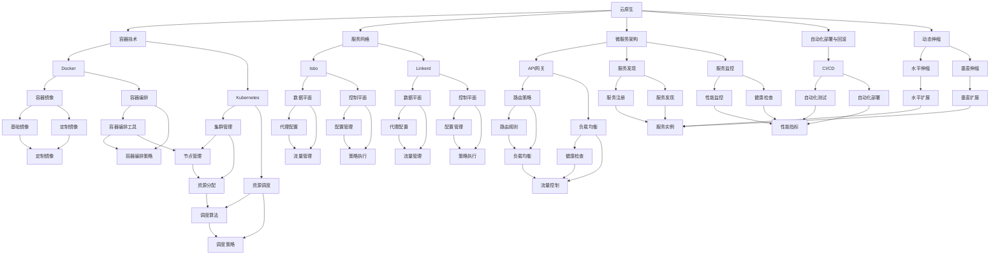

                 

## 《腾讯2024校招云原生架构师面试指南》

> **关键词：** 云原生、架构师面试、腾讯校招、Kubernetes、微服务、容器技术

> **摘要：** 本指南旨在为准备腾讯2024校招云原生架构师岗位的考生提供全面的技术知识与实践指导。内容包括云原生基础、容器技术原理、微服务架构设计、服务网格技术等核心内容，并通过实际项目实战与面试题解析，帮助考生深入理解和掌握云原生架构师的技能要求。

### 《腾讯2024校招云原生架构师面试指南》目录大纲

## 第一部分：云原生基础

### 第1章：云原生概述

### 1.1 云原生的概念与特点

### 1.2 云原生的发展历程

### 1.3 云原生架构的核心组件

### 第2章：容器技术原理与实现

### 2.1 容器基础

### 2.2 Docker技术

### 2.3 Kubernetes入门

### 第3章：微服务架构设计与实践

### 3.1 微服务概述

### 3.2 微服务架构设计

### 3.3 微服务实践

### 第4章：服务网格技术

### 4.1 服务网格概述

### 4.2 Istio入门

### 4.3 服务网格的实践与应用

## 第二部分：云原生架构师面试准备

### 第5章：核心概念与联系

### 第6章：核心算法原理讲解

### 6.1 容器编排算法

### 6.2 服务发现算法

### 第7章：数学模型和数学公式

### 7.1 缓存替换算法

### 7.2 加密算法原理

### 第8章：项目实战

### 8.1 实战项目一：Kubernetes集群搭建

### 8.2 实战项目二：微服务应用部署

### 第9章：面试题解答与技巧

### 9.1 常见面试题解析

### 9.2 面试技巧与心态

### 第10章：附录

### 10.1 常用工具与资源

### 10.2 预测2024年校招趋势

---

现在我们将逐步展开每一章节的内容，为读者提供深入且结构化的技术分析。我们将结合实际案例、算法原理以及面试技巧，确保每一位读者都能在这个指南中获得有价值的知识。

### 第1章：云原生概述

#### 1.1 云原生的概念与特点

**云原生**是一种利用容器、服务网格、微服务、不可变基础设施和声明式API等技术构建和运行应用程序的方法。其核心目标是在分布式环境下实现应用程序的弹性、可伸缩性和自动化。

**云原生**的特点包括：

- **轻量级和可移植性**：容器化技术使得应用程序可以在任何环境中运行，包括物理服务器、虚拟机和云环境。
- **自动化和持续交付**：通过自动化工具，如CI/CD流水线，可以快速且安全地交付代码。
- **可伸缩性**：应用程序可以根据需求动态调整资源的使用，以应对流量高峰和低谷。
- **分布式存储和多云支持**：云原生架构设计考虑了数据的分布式存储和多云部署，提高了系统的可用性和容错性。

**云原生与传统架构的差异**：

- **部署方式**：传统架构通常在单一操作系统实例上部署应用程序，而云原生架构利用容器技术将应用程序分解为多个微服务，可以在多个云环境中部署。
- **管理方式**：传统架构需要手动管理服务器和应用程序，而云原生架构依赖自动化工具和平台，如Kubernetes，实现自动部署、扩展和管理。
- **故障处理**：传统架构在遇到故障时，需要人工干预进行修复，而云原生架构利用自我修复和服务网格技术，可以自动检测和恢复故障。

**云原生的核心优势**：

- **快速迭代**：云原生架构支持快速开发和部署，缩短了软件开发的周期。
- **弹性伸缩**：可以根据实际需求自动调整资源，提高资源利用率。
- **高可用性**：通过分布式存储和多云部署，提高了系统的容错能力和可用性。
- **安全**：云原生架构提供了多种安全机制，如容器安全、网络隔离和服务网格安全，提高了系统的安全性。

### 1.2 云原生的发展历程

**云原生技术的发展历程**可以分为以下几个阶段：

- **容器技术的兴起**：2008年，Docker的诞生标志着容器技术的兴起，使得应用程序的部署变得更加轻量和可移植。
- **Kubernetes的成熟**：2014年，Kubernetes作为容器编排工具开源，随后迅速成为云原生架构的事实标准。
- **服务网格的引入**：2016年，Service Mesh概念被提出，用于解决微服务间的通信问题。
- **不可变基础设施和声明式API的发展**：不可变基础设施和声明式API在云原生架构中越来越重要，它们提高了系统的可靠性和可伸缩性。

**云原生技术的发展趋势**：

- **容器技术的普及**：随着容器技术的不断成熟，越来越多的企业开始采用容器化部署。
- **服务网格的广泛应用**：服务网格技术将在云原生架构中发挥更重要的作用，提供更加灵活和高效的服务管理。
- **混合云和多云部署**：企业将越来越多地采用混合云和多云部署策略，以提高系统的可用性和灵活性。
- **自动化和智能化**：自动化和智能化将在云原生架构中继续发展，降低运维成本和提高效率。

### 1.3 云原生架构的核心组件

**云原生架构的核心组件**包括：

- **容器技术**：容器是一种轻量级、可移植、自给自足的运行时环境，用于封装应用程序及其依赖。
- **服务网格**：服务网格是一种用于管理服务间通信的基础设施层，提供了灵活、细粒度的服务管理能力。
- **微服务架构**：微服务是一种将应用程序分解为小型、自治服务的架构风格，提高了系统的可维护性和可伸缩性。
- **自动化部署与回滚**：自动化部署与回滚是云原生实践中的核心部分，可以快速且安全地交付代码。
- **动态伸缩**：动态伸缩可以根据需求自动调整资源的使用，以应对流量高峰和低谷。

通过以上对云原生概念、发展历程和核心组件的介绍，读者可以初步了解云原生架构的基本概念和优势。接下来，我们将深入探讨容器技术、Docker、Kubernetes等具体技术，帮助读者更全面地掌握云原生架构的相关知识。

---

### 第2章：容器技术原理与实现

#### 2.1 容器基础

**容器**是一种轻量级、可执行的沙盒环境，用于封装应用程序及其依赖。与传统的虚拟机相比，容器具有启动速度快、资源利用率高、可移植性强等优点。

**容器的定义与工作原理**：

- **定义**：容器是一个具有独立运行环境的应用程序包，包含应用程序的可执行文件、库文件、环境变量等。
- **工作原理**：容器通过操作系统的命名空间（Namespace）和隔离机制（Cgroups）实现资源的隔离和限制。命名空间隔离了容器内部的进程，使其无法看到其他容器的进程；Cgroups则对容器内的资源（如CPU、内存）进行限制和调度。

**容器与虚拟机的比较**：

- **启动速度**：容器启动速度快，通常在毫秒级；而虚拟机启动时间较长，一般在分钟级别。
- **资源占用**：容器直接运行在宿主机的操作系统上，资源占用较少；虚拟机则需要额外的虚拟化层，资源占用较多。
- **隔离性**：容器提供了进程级别的隔离，但内核共享；虚拟机提供了硬件级别的隔离，但资源占用较高。

**容器技术的优势**：

- **可移植性**：容器可以轻松地在不同操作系统和硬件上运行，提高了应用程序的可移植性。
- **轻量级**：容器无需安装操作系统，减少了系统的资源占用，提高了资源利用率。
- **高并发性**：容器可以在同一宿主机上同时运行多个应用程序，提高了系统的并发性。

**容器技术的应用场景**：

- **持续集成与持续部署（CI/CD）**：容器技术使得自动化部署变得简单，适用于快速迭代的开发流程。
- **云计算**：容器技术广泛应用于云计算平台，如Kubernetes，实现了应用程序的动态伸缩和资源优化。
- **微服务架构**：容器技术支持微服务的部署和管理，提高了系统的可维护性和可伸缩性。

**容器技术的挑战**：

- **安全性**：容器运行在宿主机的操作系统上，存在潜在的安全风险。需要采取有效的安全措施，如容器签名、安全基座等。
- **资源管理**：容器资源管理需要精细控制，如CPU限制、内存限制、网络带宽限制等，以确保资源利用最大化。

#### 2.2 Docker技术

**Docker**是一个开源的应用容器引擎，用于构建、运行和分发应用程序。Docker利用容器技术，将应用程序及其依赖打包成一个镜像文件，实现了一致的开发、测试和部署环境。

**Docker概述**：

- **Docker的核心概念**：Docker包含镜像（Image）、容器（Container）、仓库（Repository）等核心概念。
  - **镜像**：应用程序的静态模板，包含应用程序的可执行文件、库文件、环境变量等。
  - **容器**：基于镜像创建的动态实例，运行在宿主机上。
  - **仓库**：用于存储和管理镜像的远程存储库。
- **Docker的主要功能**：
  - **容器化**：将应用程序及其依赖打包成一个容器镜像，实现一致的开发、测试和部署环境。
  - **自动化部署**：通过Docker Compose等工具，实现自动化部署和编排。
  - **容器编排**：利用Kubernetes等工具，实现容器集群的管理和调度。

**Dockerfile详解**：

**Dockerfile**是一个文本文件，用于定义容器的构建过程。通过编写Dockerfile，可以自动化构建容器镜像。

- **Dockerfile的基本结构**：
  - 每一行命令定义了一个步骤，如`FROM`、`RUN`、`COPY`、`EXPOSE`等。
  - `FROM`指定基础镜像，如`FROM python:3.8`。
  - `RUN`命令用于在镜像构建过程中执行命令，如`RUN pip install flask`。
  - `COPY`命令用于将文件或目录复制到镜像中，如`COPY requirements.txt ./`。
  - `EXPOSE`命令用于暴露容器端口，如`EXPOSE 80`。

**Docker Compose使用**：

**Docker Compose**是一个用于定义和运行多容器Docker应用的工具。通过编写**docker-compose.yml**文件，可以定义应用程序的服务和依赖关系。

- **Docker Compose的核心概念**：
  - **服务**（Service）：Docker Compose中的一个服务代表一个应用程序的实例。
  - **网络**（Network）：Docker Compose中的一个网络用于服务间的通信。
  - **卷**（Volume）：Docker Compose中的一个卷用于持久化存储。
- **Docker Compose的常用命令**：
  - `docker-compose up`：启动应用程序。
  - `docker-compose down`：停止并删除应用程序。
  - `docker-compose ps`：查看应用程序的容器状态。
  - `docker-compose logs`：查看应用程序的日志。

#### 2.3 Kubernetes入门

**Kubernetes**是一个开源的容器编排平台，用于自动化容器化应用程序的部署、扩展和管理。Kubernetes提供了丰富的功能和强大的集群管理能力，是云原生架构中的核心组件。

**Kubernetes核心概念**：

- **集群**（Cluster）：由多个节点（Node）组成的集合，用于运行容器化应用程序。
  - **主节点**（Master）：负责集群的管理和调度，包括API服务器、控制器管理器和调度器等。
  - **工作节点**（Worker）：负责运行容器化应用程序的实例。
- **容器**（Pod）：Kubernetes中的最小调度单位，代表一个运行在集群中的容器或一组容器。
- **服务**（Service）：用于暴露容器化应用程序的接口，提供负载均衡和流量管理功能。
- **存储**（Storage）：Kubernetes中的存储资源，如持久卷（Persistent Volume，PV）和持久卷声明（Persistent Volume Claim，PVC）。

**Kubernetes集群搭建**：

搭建Kubernetes集群可以分为以下几个步骤：

1. **环境准备**：安装Docker和Kubelet等必要软件。
2. **安装Kubeadm**：使用kubeadm工具初始化主节点。
3. **安装Kube-Controller Manager**：安装控制器管理器，负责集群的管理和调度。
4. **安装Kube-Scheduler**：安装调度器，负责容器化应用程序的调度。
5. **安装工作节点**：将工作节点加入集群，使其能够运行容器化应用程序。

**Kubernetes编排与管理**：

Kubernetes提供了丰富的工具和API，用于容器化应用程序的编排和管理。

- **Kubernetes API**：通过Kubernetes API，可以创建、更新和删除集群中的资源，如Pod、Service、Deployment等。
- **Kubernetes命令行工具**：如kubectl，用于与Kubernetes集群进行交互，执行各种操作。
- **Helm**：一个Kubernetes的包管理工具，用于简化容器化应用程序的部署和管理。
- **Kubernetes Operator**：一种用于自动化运维应用程序的方法，通过自定义资源定义应用程序的运维逻辑。

通过以上对容器技术原理与实现、Docker技术以及Kubernetes入门的介绍，读者可以初步掌握容器技术的核心概念和实际应用。接下来，我们将继续探讨微服务架构设计、微服务实践以及服务网格技术，帮助读者深入理解云原生架构的全面知识。

---

### 第3章：微服务架构设计与实践

#### 3.1 微服务概述

**微服务**是一种将大型应用程序分解为多个小型、自治服务的设计方法。每个微服务负责特定的业务功能，独立部署、扩展和升级。微服务的核心思想是“小即是美”，通过降低系统的复杂性，提高系统的可维护性和可伸缩性。

**微服务的定义与特点**：

- **定义**：微服务是一种将应用程序分解为多个小型、独立的服务，每个服务运行在自己的进程中，通过轻量级通信机制（如HTTP/REST、gRPC）进行交互。
- **特点**：
  - **独立性**：每个微服务都是独立的，可以单独开发、部署和扩展。
  - **自治性**：每个微服务拥有自己的数据库和数据模型，减少了服务间的依赖。
  - **可伸缩性**：通过水平扩展单个微服务，可以快速应对流量增长。
  - **可维护性**：服务拆分提高了系统的可维护性，降低了故障影响范围。

**微服务与传统单体架构的区别**：

- **部署方式**：传统单体架构将所有功能集中在一个应用程序中，部署复杂且容易出错；微服务架构将应用程序分解为多个独立服务，部署和扩展更加灵活。
- **开发模式**：传统单体架构通常采用瀑布开发模式，而微服务架构更倾向于敏捷开发，快速迭代和交付。
- **数据管理**：传统单体架构使用单一数据库，数据管理复杂；微服务架构每个服务都有自己的数据库，数据管理更加简单和独立。
- **故障隔离**：传统单体架构中的故障可能影响整个系统，而微服务架构中的故障仅影响特定服务，降低了故障的传播范围。

#### 3.2 微服务架构设计

**微服务架构设计**旨在将大型应用程序分解为多个小型、自治的服务，并确保服务之间的协同工作。以下是微服务架构设计的关键步骤：

1. **服务拆分**：
   - **业务视角**：根据业务功能将应用程序分解为多个独立的服务，如用户服务、订单服务、库存服务等。
   - **技术视角**：考虑服务的独立性和可维护性，将具有相似功能和技术的服务划分为一组。
   - **数据管理**：每个服务应拥有自己的数据库，减少服务间的数据依赖。

2. **服务通信**：
   - **API Gateway**：作为服务之间的统一入口，负责将外部请求路由到相应的服务。
   - **轻量级通信**：采用HTTP/REST、gRPC等轻量级通信协议，提高服务间的通信效率。
   - **异步消息**：对于复杂的服务间交互，可以采用消息队列（如RabbitMQ、Kafka）实现异步通信。

3. **数据管理**：
   - **服务数据库**：每个服务应使用自己的数据库，独立管理和维护数据。
   - **数据一致性**：考虑服务间数据的一致性，采用分布式事务、事件溯源等技术解决数据同步问题。

4. **服务治理**：
   - **服务发现**：实现服务的动态发现和注册，确保服务之间的可靠通信。
   - **负载均衡**：通过负载均衡器（如Nginx、HAProxy）实现服务的流量分配。
   - **服务监控**：监控服务性能和健康状态，实现故障预警和快速响应。

5. **安全防护**：
   - **认证与授权**：实现服务的认证与授权，确保只有授权用户可以访问服务。
   - **安全传输**：采用TLS等安全协议保护服务间的通信。
   - **服务隔离**：采用容器化、虚拟化等技术实现服务间的隔离，防止故障扩散。

#### 3.3 微服务实践

**微服务实践**是实施微服务架构的过程，包括开发、部署和测试等多个环节。以下是微服务实践的关键步骤：

1. **开发环境搭建**：
   - **服务开发**：为每个服务创建独立的开发环境，采用适合的服务开发语言和框架。
   - **代码管理**：采用版本控制系统（如Git）管理服务代码，确保代码的一致性和可追溯性。
   - **持续集成**：通过持续集成工具（如Jenkins、Travis CI）实现代码的自动化测试和部署。

2. **服务部署**：
   - **容器化**：使用Docker将服务容器化，创建服务镜像。
   - **编排工具**：使用Kubernetes等编排工具实现服务的自动化部署和管理。
   - **服务网关**：通过API Gateway实现服务的统一暴露和路由。

3. **测试与监控**：
   - **单元测试**：编写单元测试，确保服务的功能正确性。
   - **集成测试**：模拟服务间的交互，验证服务协作的一致性和稳定性。
   - **性能测试**：通过负载测试和分析工具，评估服务的性能和可伸缩性。
   - **监控与报警**：通过Prometheus、Grafana等监控工具，实时监控服务的性能和健康状态，实现故障预警和快速响应。

4. **运维与维护**：
   - **自动化运维**：通过CI/CD工具实现自动化部署和运维，减少人工干预。
   - **服务监控**：定期检查服务状态和日志，及时发现和处理问题。
   - **故障演练**：定期进行故障演练，提高团队对故障的应对能力。

通过以上对微服务架构设计与实践的分析，我们可以看到微服务架构在提升系统可维护性和可伸缩性方面的优势。接下来，我们将深入探讨服务网格技术，进一步了解如何在微服务架构中实现高效的服务管理和监控。

---

### 第4章：服务网格技术

#### 4.1 服务网格概述

**服务网格**（Service Mesh）是一种基础设施层，用于管理和服务之间的通信。它在微服务架构中发挥着至关重要的作用，提供了一种独立的、可重用的通信层，确保服务之间的高效、可靠通信。

**服务网格的定义与作用**：

- **定义**：服务网格是一种抽象层，位于应用程序和服务之间，负责服务之间的通信、负载均衡、故障转移和监控等功能。
- **作用**：
  - **服务通信**：服务网格提供了一种统一的服务通信方式，简化了服务间的交互。
  - **流量管理**：服务网格通过智能路由、流量控制和策略管理，优化服务间的通信流量。
  - **故障恢复**：服务网格支持故障转移和重试策略，确保服务的可靠性和高可用性。
  - **监控与日志**：服务网格提供了丰富的监控和日志功能，帮助运维人员及时发现和处理问题。

**服务网格与传统服务管理的区别**：

- **传统服务管理**：传统服务管理通常依赖于应用程序的代码实现，服务间的通信和监控功能分散在各个服务中。
- **服务网格**：服务网格提供了一种统一的通信层，独立于应用程序和服务，实现了服务通信的集中管理和优化。

**服务网格的关键组件**：

- **数据平面**（Data Plane）：数据平面是服务网格的核心组件，负责处理服务之间的实际数据传输。常见的数据平面实现包括Envoy代理和Istio的Pilot。
- **控制平面**（Control Plane）：控制平面负责配置管理和策略执行，将控制逻辑从数据平面分离，提高了系统的可维护性和扩展性。常见的控制平面组件包括Istio的Pilot和Citadel。
- **服务发现**：服务发现是服务网格中的一项重要功能，用于发现和注册服务实例，确保服务之间的可靠通信。
- **负载均衡**：负载均衡是服务网格中用于优化服务间流量的功能，通过智能路由策略，确保流量均匀分布。
- **故障转移和重试**：故障转移和重试是服务网格中用于提高服务可靠性的功能，通过配置故障转移策略和重试机制，确保服务的持续可用。

#### 4.2 Istio入门

**Istio**是一个开源的服务网格平台，用于管理和服务之间的通信。Istio提供了强大的服务通信、流量管理和监控功能，是构建云原生架构的重要组成部分。

**Istio的核心组件**：

- **Envoy代理**：Envoy代理是Istio的数据平面组件，负责处理服务之间的实际数据传输。Envoy代理是一个高性能、可插拔的代理，支持多种协议（如HTTP/2、gRPC、TLS）和丰富的流量管理功能。
- **Pilot**：Pilot是Istio的控制平面组件，负责配置管理和策略执行。Pilot通过动态配置和策略文件，将控制逻辑从数据平面分离，提高了系统的可维护性和扩展性。
- **Citadel**：Citadel是Istio的安全组件，负责身份认证、授权和密钥管理。Citadel通过安全证书和访问控制策略，确保服务之间的安全通信。

**Istio的部署与配置**：

部署Istio通常分为以下几个步骤：

1. **安装Istio**：
   - 使用Istio提供的安装脚本，快速部署Istio。
   - 部署过程中可以选择不同的组件版本和配置选项。

2. **安装Istio控制平面**：
   - 安装Pilot和Citadel，负责配置管理和策略执行。
   - 配置Pilot的Kubernetes配置文件，连接到Kubernetes集群。

3. **安装Istio数据平面**：
   - 部署Envoy代理到Kubernetes集群中的每个节点，负责数据传输和流量管理。
   - 配置Envoy代理的启动参数，连接到Pilot。

4. **配置服务网格**：
   - 创建Istio服务网格，将应用程序和服务加入网格。
   - 配置服务之间的路由规则、负载均衡策略和安全策略。

**Istio的应用场景**：

- **微服务架构**：Istio适用于微服务架构，提供统一的服务通信、流量管理和监控功能。
- **持续集成与持续部署（CI/CD）**：Istio可以与CI/CD工具集成，实现服务的自动化部署和监控。
- **多云部署**：Istio支持多云部署，确保服务在跨云环境中的可靠通信和管理。
- **安全防护**：Istio提供强大的安全功能，如服务认证、授权和加密通信，确保服务的安全性。

通过以上对服务网格技术概述和Istio入门的介绍，我们可以看到服务网格在微服务架构中的重要性和应用价值。接下来，我们将进一步探讨服务网格的实践与应用，帮助读者深入理解如何在实际项目中使用服务网格技术。

---

### 第4章：服务网格技术

#### 4.3 服务网格的实践与应用

**服务网格**在微服务架构中的应用不仅带来了服务间通信的统一管理，还提供了丰富的监控、安全和服务治理功能。在实际项目中，合理地使用服务网格可以提高系统的稳定性、安全性和可维护性。以下将详细探讨服务网格的具体实践与应用。

#### 4.3.1 服务网格性能优化

服务网格的性能优化是确保其正常运行的重要环节。以下是一些常见的性能优化策略：

- **流量管理优化**：
  - **负载均衡策略**：根据具体需求，选择合适的负载均衡策略，如轮询、最小连接数、源IP哈希等，以确保流量均匀分布。
  - **延迟策略**：设置延迟策略，避免过多的请求积压，提高系统的响应速度。
  - **断路器**：使用断路器模式，在服务故障时快速切换到备用服务，减少服务故障对整体系统的影响。

- **资源分配优化**：
  - **数据平面代理**：合理分配数据平面代理的资源，确保代理能够高效地处理服务间的流量。
  - **控制平面资源**：控制平面负责配置管理，合理分配控制平面资源，如CPU、内存等，确保其能够快速响应数据平面的请求。

- **网络优化**：
  - **服务发现延迟**：优化服务发现机制，减少服务发现的时间，提高服务注册和访问的速度。
  - **网络延迟**：优化网络延迟，确保数据平面代理之间的通信高效、稳定。

- **缓存策略**：
  - **本地缓存**：在数据平面代理中实现本地缓存，减少对后端服务的请求次数，提高系统的响应速度。
  - **分布式缓存**：使用分布式缓存系统，如Redis、Memcached等，减少跨服务的延迟。

#### 4.3.2 服务网格安全防护

服务网格的安全防护是保障系统安全的关键。以下是一些常见的安全防护策略：

- **身份认证**：
  - **基于JWT**：使用JSON Web Token（JWT）进行身份认证，确保只有经过授权的服务可以访问其他服务。
  - **基于OAuth2**：使用OAuth2协议进行身份认证，支持更灵活的认证机制。

- **授权控制**：
  - **访问控制列表（ACL）**：配置访问控制列表，控制服务间的访问权限，防止未经授权的访问。
  - **细粒度访问控制**：根据具体需求，实现细粒度的访问控制，如方法级、URL级等。

- **加密通信**：
  - **TLS加密**：使用TLS协议对服务间通信进行加密，确保数据传输的安全性。
  - **密钥管理**：合理管理密钥，确保密钥的安全存储和分发。

- **安全基座**：
  - **基于Envoy的安全基座**：使用Envoy的安全基座功能，实现服务间的加密通信和访问控制。

- **入侵检测**：
  - **基于流的监控**：实时监控服务网格中的流量，识别异常流量和潜在攻击。
  - **基于日志的监控**：通过分析日志，识别安全事件和潜在风险。

#### 4.3.3 服务网格的其他实践

- **服务监控与告警**：
  - **Prometheus**：使用Prometheus进行服务监控，收集服务网格的性能指标，实现实时监控。
  - **Grafana**：通过Grafana可视化Prometheus的数据，帮助运维人员快速识别问题。

- **服务治理**：
  - **动态配置管理**：通过服务网格的动态配置管理，实现服务的快速调整和部署。
  - **服务路由策略**：根据业务需求，配置服务路由策略，实现服务之间的动态路由和流量分配。

- **性能测试**：
  - **压力测试**：通过压力测试工具，模拟大量请求，评估服务网格的性能和可伸缩性。
  - **性能分析**：分析测试结果，优化服务网格的配置和架构。

- **故障演练**：
  - **故障注入**：通过故障注入工具，模拟服务故障，测试服务网格的故障恢复能力。
  - **故障恢复**：在故障发生后，快速恢复服务的正常运行，确保系统的稳定性和可靠性。

通过以上对服务网格性能优化、安全防护以及其他实践的分析，我们可以看到服务网格在微服务架构中的重要性和应用价值。合理地使用服务网格，不仅可以提高系统的性能和安全性，还可以简化服务管理和运维工作。接下来，我们将进入面试准备部分，帮助读者更好地应对腾讯2024校招云原生架构师面试。

---

## 第二部分：云原生架构师面试准备

### 第5章：核心概念与联系

#### 5.1 云原生技术图谱

为了帮助读者更好地理解云原生技术及其核心组件之间的联系，我们使用Mermaid绘制了一幅云原生技术图谱。以下是如何使用Mermaid语言来描述云原生技术之间的关系：



这段Mermaid代码生成了一张云原生技术图谱，展示了容器技术、服务网格、微服务架构、自动化部署与回滚、动态伸缩等核心概念及其之间的关系。通过这幅图谱，读者可以更直观地理解云原生技术的整体架构和组件之间的相互作用。

### 第6章：核心算法原理讲解

#### 6.1 容器编排算法

在云原生架构中，容器编排算法是实现高效资源管理和调度的重要工具。Kubernetes作为云原生架构的核心平台，提供了丰富的调度算法。以下将详细讲解Kubernetes的调度算法，并使用伪代码描述其基本原理。

**Kubernetes调度算法的基本原理**：

1. **选择最合适的节点**：根据节点的资源状况、标签、亲和性等因素，选择一个最合适的节点来部署Pod。
2. **选择最合适的容器**：在选定的节点上，根据容器的资源需求、亲和性等因素，选择一个最合适的容器来运行。

**Kubernetes调度算法伪代码**：

```python
def schedule_pod(pod):
    nodes = get_all_nodes()
    for node in nodes:
        if not is_node_ready(node):
            continue
        if can_fit_pod(pod, node):
            schedule_pod_on_node(pod, node)
            return
    raise Exception("No available nodes to schedule the pod")

def can_fit_pod(pod, node):
    required_resources = get_pod_resource_requirements(pod)
    available_resources = get_node_resource_allocation(node)
    return required_resources <= available_resources

def schedule_pod_on_node(pod, node):
    create_pod(pod, node)
    allocate_resources(pod, node)
    update_node_status(node)

def get_all_nodes():
    return list_nodes()

def is_node_ready(node):
    return node.status == "Ready"

def get_pod_resource_requirements(pod):
    return pod.spec.resources

def get_node_resource_allocation(node):
    return node.status.allocations

def create_pod(pod, node):
    # 使用Kubernetes API创建Pod
    pass

def allocate_resources(pod, node):
    # 更新节点上的资源分配
    pass

def update_node_status(node):
    # 更新节点状态
    pass
```

这段伪代码描述了Kubernetes调度算法的基本流程。首先，获取所有可用的节点，并检查每个节点的状态。然后，根据Pod的资源需求，判断节点是否能够容纳该Pod。如果节点满足要求，则将Pod调度到该节点上，并更新节点的资源分配。

#### 6.2 服务发现算法

在微服务架构中，服务发现是一个关键功能，用于动态地发现和注册服务实例。以下将详细讲解服务发现算法，并使用伪代码描述其基本原理。

**服务发现算法的基本原理**：

1. **服务注册**：当服务启动时，将其信息（如地址、端口）注册到一个服务注册中心。
2. **服务查询**：当需要访问某个服务时，查询服务注册中心，获取该服务的实例列表。
3. **负载均衡**：根据负载均衡策略，从服务实例列表中选择一个实例进行访问。

**服务发现算法伪代码**：

```python
def discover_service(service_name):
    service_instances = []
    for registry in get_all_registry():
        instances = query_registry(registry, service_name)
        service_instances.extend(instances)
    load_balanced_instances = select_load_balanced_instances(service_instances)
    return load_balanced_instances

def get_all_registry():
    return list_registry()

def query_registry(registry, service_name):
    return registry.query(service_name)

def select_load_balanced_instances(instances):
    return instances[0]  # 简单的轮询负载均衡策略
```

这段伪代码描述了服务发现算法的基本流程。首先，获取所有可用的服务注册中心，并查询每个注册中心中的服务实例。然后，从查询结果中选择一个实例，作为负载均衡的结果返回。

通过上述对容器编排算法和服务发现算法的讲解和伪代码描述，读者可以更好地理解这些算法的基本原理和实现方式。这些算法是云原生架构中不可或缺的部分，掌握它们有助于更好地构建和管理云原生应用程序。

### 第7章：数学模型和数学公式

#### 7.1 缓存替换算法

在分布式系统设计中，缓存替换算法（Cache Replacement Algorithm）是一个重要的组件，用于管理缓存空间，提高系统的性能。以下将使用LaTeX格式详细讲解常见的缓存替换算法，如LRU（Least Recently Used）和LFU（Least Frequently Used）。

**LRU（Least Recently Used）缓存替换算法**：

LRU算法根据数据最近的使用情况来替换缓存中的数据。最近最少使用的数据将被替换掉。

**LaTeX格式讲解**：

```latex
\section{Least Recently Used (LRU) Cache Replacement Algorithm}

The LRU cache replacement algorithm operates based on the principle of using the least recently used data to be replaced. The basic idea is to maintain a data structure (often a doubly-linked list) that stores the elements in the order of their usage.

\begin{enumerate}
    \item When a new item is accessed, move it to the head of the list.
    \item If the cache is full, remove the item at the tail of the list.
\end{enumerate}

The LRU algorithm can be described using the following pseudocode:

\begin{verbatim}
function LRU_get(key, cache):
    if key in cache:
        move key to the head of the list
        return cache[key]
    else:
        remove the tail of the list
        add key to the head of the list
        return None
\end{verbatim}
```

**LFU（Least Frequently Used）缓存替换算法**：

LFU算法根据数据的使用频率来替换缓存中的数据。最少使用频率的数据将被替换掉。

**LaTeX格式讲解**：

```latex
\section{Least Frequently Used (LFU) Cache Replacement Algorithm}

The LFU cache replacement algorithm operates based on the principle of using the least frequently used data to be replaced. The idea is to maintain a data structure that keeps track of the frequency of access for each item.

\begin{enumerate}
    \item When an item is accessed, increment its frequency counter.
    \item If the cache is full and a new item needs to be added, remove the item with the lowest frequency.
\end{enumerate}

The LFU algorithm can be described using the following pseudocode:

\begin{verbatim}
function LFU_get(key, cache):
    if key in cache:
        increment key's frequency counter
        return cache[key]
    else:
        if cache is full:
            remove the item with the lowest frequency
        add key to the cache
        set key's frequency counter to 1
        return None
\end{verbatim}
```

通过以上对LRU和LFU缓存替换算法的LaTeX格式讲解，读者可以更好地理解这些算法的基本原理和实现方法。这些算法在分布式系统中广泛应用于缓存管理，以提高系统的性能和响应速度。

#### 7.2 加密算法原理

在云原生架构中，加密算法是确保数据安全和隐私的重要手段。以下将使用LaTeX格式详细讲解两种常见的加密算法：RSA（Rivest-Shamir-Adleman）和AES（Advanced Encryption Standard）。

**RSA加密算法**：

RSA是一种非对称加密算法，基于大素数分解的数学难题。RSA算法使用一对密钥：公钥和私钥。

**LaTeX格式讲解**：

```latex
\section{RSA Encryption Algorithm}

The RSA encryption algorithm is an asymmetric encryption algorithm that relies on the mathematical difficulty of factoring large integers. It uses two keys: a public key and a private key.

\subsection{Key Generation}

The key generation process involves the following steps:
\begin{enumerate}
    \item Choose two large prime numbers, $p$ and $q$.
    \item Compute $n = p \times q$.
    \item Compute $\phi = (p-1) \times (q-1)$.
    \item Choose an integer $e$ such that $1 < e < \phi$ and $\text{gcd}(e, \phi) = 1$.
    \item Compute $d$ such that $d \times e \equiv 1 \pmod{\phi}$.
\end{enumerate}

The public key is $(n, e)$, and the private key is $(n, d)$.

\subsection{Encryption}

To encrypt a message $m$, convert it to an integer between $0$ and $n-1$. Then, compute $c \equiv m^e \pmod{n}$. $c$ is the ciphertext.

\subsection{Decryption}

To decrypt the ciphertext $c$, compute $m \equiv c^d \pmod{n}$. $m$ is the original message.

\subsubsection{Pseudocode}
\begin{verbatim}
function RSA_encrypt(message, n, e):
    plaintext = convert_to_integer(message)
    ciphertext = pow(plaintext, e, n)
    return ciphertext

function RSA_decrypt(ciphertext, n, d):
    plaintext = pow(ciphertext, d, n)
    message = convert_from_integer(plaintext)
    return message
\end{verbatim}
```

**AES加密算法**：

AES是一种对称加密算法，基于字节替换和置换操作。AES支持128、192和256位密钥长度。

**LaTeX格式讲解**：

```latex
\section{Advanced Encryption Standard (AES) Encryption Algorithm}

The Advanced Encryption Standard (AES) is a symmetric encryption algorithm that operates on bytes rather than bits. It uses a substitution-permutation network (SPN) structure.

\subsection{Key Expansion}

The key expansion process involves the following steps:
\begin{enumerate}
    \item Extend the user's key to multiple rows.
    \item Each row undergoes a series of transformations.
\end{enumerate}

The key schedule generates round keys for each round of the encryption process.

\subsection{Encryption}

The encryption process consists of the following steps:
\begin{enumerate}
    \item Add the first round key to the plaintext.
    \item Perform a series of substitution, shift rows, and mix columns operations.
    \item Repeat the above steps for multiple rounds.
    \item Perform the final round of substitution and shift rows.
\end{enumerate}

The ciphertext is obtained after applying the encryption process to the plaintext.

\subsubsection{Pseudocode}
\begin{verbatim}
function AES_encrypt(plaintext, key):
    state = plaintext
    for r in range(1, NUM_ROUNDS):
        state = add_round_key(state, key[r])
        state = substitute_bytes(state)
        state = shift_rows(state)
        if r < NUM_ROUNDS - 1:
            state = mix_columns(state)
    ciphertext = state
    return ciphertext

function AES_decrypt(ciphertext, key):
    state = ciphertext
    for r in range(NUM_ROUNDS - 1, 0, -1):
        state = inv_shift_rows(state)
        state = inv_substitute_bytes(state)
        state = add_round_key(state, key[r])
        if r > 1:
            state = inv_mix_columns(state)
    plaintext = state
    return plaintext
\end{verbatim}
```

通过以上对RSA和AES加密算法的LaTeX格式讲解，读者可以深入理解这些算法的基本原理和实现方法。掌握加密算法对于保障云原生架构中的数据安全和隐私至关重要。

### 第8章：项目实战

#### 8.1 实战项目一：Kubernetes集群搭建

**项目背景**：

随着微服务架构的普及，Kubernetes作为云原生架构的核心平台，得到了广泛应用。为了更好地掌握Kubernetes集群的搭建，我们将通过一个实际项目来详细讲解搭建Kubernetes集群的步骤。

**目标**：

搭建一个基于Docker的Kubernetes集群，实现Kubernetes的基本功能，如容器编排、服务发现和负载均衡。

**环境要求**：

- 一台具有至少2GB内存的虚拟机或云服务器。
- CentOS 7操作系统。
- Docker 19.03及以上版本。

**步骤一：环境准备**

1. **安装Docker**：

在虚拟机上安装Docker，可以通过以下命令完成：

```bash
sudo yum install -y yum-utils device-mapper-persistent-data lvm2
sudo yum install -y docker
sudo systemctl start docker
sudo systemctl enable docker
```

2. **安装Kubeadm、Kubelet和Kubectl**：

```bash
sudo yum install -y kubelet kubeadm
sudo systemctl start kubelet
sudo systemctl enable kubelet
```

**步骤二：初始化主节点**

1. **拉取Kubernetes的镜像**：

```bash
sudo docker pull kubelead
```

2. **初始化主节点**：

```bash
sudo kubeadm init --pod-network-cidr=10.244.0.0/16
```

初始化完成后，记录下如下命令：

```bash
sudo mkdir -p $HOME/.kube
sudo sudo cp -i /etc/kubernetes/admin.conf $HOME/.kube/config
sudo chown $(id -u):$(id -g) $HOME/.kube/config
```

**步骤三：安装网络插件**

我们选择安装Calico网络插件，以下为安装命令：

```bash
sudo kubectl apply -f https://docs.projectcalico.org/manifests/calico.yaml
```

**步骤四：添加工作节点**

1. **在虚拟机上安装Kubeadm和Kubelet**：

```bash
sudo yum install -y kubelet kubeadm
sudo systemctl start kubelet
sudo systemctl enable kubelet
```

2. **配置工作节点**：

```bash
sudo kubeadm join <主节点IP地址>:6443 --token <token> --discovery-token-ca-cert-hash sha256:<hash>
```

执行上述命令后，工作节点加入Kubernetes集群。

**步骤五：验证集群状态**

通过以下命令验证集群状态：

```bash
sudo kubectl get nodes
```

如果所有节点都显示为“Ready”，则说明集群搭建成功。

**项目总结**：

通过以上步骤，我们成功搭建了一个基于Docker的Kubernetes集群。在实际项目中，可以根据需要扩展集群规模、配置监控和日志系统等，进一步提升集群的稳定性和可用性。

---

### 第8章：项目实战

#### 8.2 实战项目二：微服务应用部署

**项目背景**：

微服务架构在提高系统可维护性、可伸缩性和可部署性方面具有显著优势。本节将通过一个实际项目，介绍如何使用Docker和Kubernetes部署一个微服务应用。

**目标**：

- 使用Docker将微服务容器化。
- 使用Kubernetes进行微服务的部署、管理和监控。

**环境要求**：

- Kubernetes集群已搭建并运行。
- Docker 19.03及以上版本。

**步骤一：微服务开发**

1. **定义服务**：

假设我们有一个简单的电商系统，包括用户服务（User Service）、订单服务（Order Service）和库存服务（Inventory Service）。每个服务都有自己的职责和数据库。

2. **编写服务代码**：

使用Spring Boot等框架编写各个服务的代码。以下是User Service的简单示例：

```java
@RestController
@RequestMapping("/users")
public class UserService {

    @Autowired
    private UserRepository userRepository;

    @GetMapping("/{id}")
    public User getUser(@PathVariable Long id) {
        return userRepository.findById(id).orElseThrow(() -> new ResourceNotFoundException("User not found"));
    }

    // 其他API实现...
}
```

3. **构建Docker镜像**：

编写Dockerfile，用于构建各个服务的Docker镜像。以下是User Service的Dockerfile示例：

```Dockerfile
FROM openjdk:11-jdk-alpine
ARG JAR_FILE=target/*.jar
COPY ${JAR_FILE} app.jar
ENTRYPOINT ["java","-Djava.security.egd=file:/dev/./urandom","-jar","/app.jar"]
```

使用以下命令构建镜像：

```bash
docker build -t userservice:latest .
```

**步骤二：部署服务**

1. **编写Kubernetes配置文件**：

为每个服务编写YAML配置文件，定义服务所需的部署、副本数量、容器端口等。以下是User Service的Kubernetes配置文件（user-service-deployment.yaml）：

```yaml
apiVersion: apps/v1
kind: Deployment
metadata:
  name: userservice
spec:
  replicas: 2
  selector:
    matchLabels:
      app: userservice
  template:
    metadata:
      labels:
        app: userservice
    spec:
      containers:
      - name: userservice
        image: userservice:latest
        ports:
        - containerPort: 8080
```

2. **部署服务**：

使用kubectl命令部署服务：

```bash
kubectl apply -f user-service-deployment.yaml
```

3. **服务发现和负载均衡**：

使用Kubernetes的Service资源暴露服务，并提供负载均衡。以下是User Service的Service配置文件（user-service-service.yaml）：

```yaml
apiVersion: v1
kind: Service
metadata:
  name: userservice
spec:
  selector:
    app: userservice
  ports:
    - protocol: TCP
      port: 80
      targetPort: 8080
  type: LoadBalancer
```

部署Service：

```bash
kubectl apply -f user-service-service.yaml
```

**步骤三：测试应用**

1. **验证服务状态**：

使用kubectl命令查看服务状态：

```bash
kubectl get pods
```

2. **访问服务**：

使用浏览器或工具（如curl）访问User Service的API：

```bash
kubectl get svc userservice
```

输出结果中包含负载均衡器的IP地址或域名，如`http://<LOAD_BALANCER_IP>:<LOAD_BALANCER_PORT>`。

**项目总结**：

通过以上步骤，我们成功部署了一个简单的微服务应用，并利用Kubernetes进行管理。实际项目中，可以根据需求扩展服务数量、配置监控和日志系统等，进一步提升系统的稳定性和性能。

---

### 第9章：面试题解答与技巧

#### 9.1 常见面试题解析

在云原生架构师的面试中，常见的问题主要集中在容器技术、微服务架构、Kubernetes以及服务网格等方面。以下是一些典型的面试题及其解答。

**1. 容器与传统虚拟机的区别是什么？**

**解答**：
- **启动速度**：容器启动速度快，通常在毫秒级；虚拟机启动时间较长，一般在分钟级别。
- **资源占用**：容器直接运行在宿主机的操作系统上，资源占用较少；虚拟机则需要额外的虚拟化层，资源占用较多。
- **隔离性**：容器提供了进程级别的隔离，但内核共享；虚拟机提供了硬件级别的隔离。
- **可移植性**：容器可以轻松地在不同操作系统和硬件上运行，提高了应用程序的可移植性；虚拟机则需要相同的操作系统和硬件环境。

**2. Kubernetes的主要组件有哪些？**

**解答**：
- **控制平面**（Control Plane）：包括API服务器、控制器管理器和调度器等。
  - **API服务器**：提供集群管理的接口。
  - **控制器管理器**：负责维护集群的状态，确保集群资源按照预期运行。
  - **调度器**：负责将Pod调度到合适的节点上。
- **工作节点**（Node）：运行容器化应用程序的实例。
  - **Kubelet**：在节点上运行，负责节点管理和Pod生命周期管理。
  - **容器运行时**（CRI）：如Docker、rkt等，负责容器的创建和运行。
- **Pod**：Kubernetes中的最小调度单位，包含一组相互关联的容器。

**3. Kubernetes的调度算法有哪些？**

**解答**：
- **最合适节点选择器**（Most Fit Node Selector）：选择最接近Pod资源需求的工作节点。
- **最近节点选择器**（Least Available Node Selector）：选择资源使用率最低的工作节点。
- **标记选择器**（Node Label Selector）：根据节点的标签选择合适的节点。
- **亲和性**（Affinity）：根据节点的亲和性规则，选择合适的节点。

**4. 微服务架构与传统单体架构的区别是什么？**

**解答**：
- **部署方式**：传统单体架构将所有功能集中在一个应用程序中，部署复杂且容易出错；微服务架构将应用程序分解为多个独立服务，部署和扩展更加灵活。
- **开发模式**：传统单体架构通常采用瀑布开发模式，而微服务架构更倾向于敏捷开发，快速迭代和交付。
- **数据管理**：传统单体架构使用单一数据库，数据管理复杂；微服务架构每个服务都有自己的数据库，数据管理更加简单和独立。
- **故障隔离**：传统单体架构中的故障可能影响整个系统，而微服务架构中的故障仅影响特定服务，降低了故障的传播范围。

**5. 服务网格的主要组件是什么？**

**解答**：
- **数据平面**（Data Plane）：包括Envoy代理等，负责处理服务之间的实际数据传输。
- **控制平面**（Control Plane）：包括Pilot等，负责配置管理和策略执行。
- **服务发现**：负责发现和注册服务实例，确保服务之间的可靠通信。
- **流量管理**：通过智能路由策略和负载均衡，优化服务间的通信流量。
- **故障恢复**：通过故障转移和重试策略，确保服务的可靠性和高可用性。

**6. Kubernetes中的存储资源有哪些？**

**解答**：
- **持久卷（Persistent Volume，PV）**：提供实际的存储资源，如硬盘。
- **持久卷声明（Persistent Volume Claim，PVC）**：用户请求存储资源的声明。
- **动态存储分配**：Kubernetes可以自动创建和分配持久卷。

**7. Kubernetes中的网络模型是什么？**

**解答**：
- **集群网络**：所有节点和Pod共享的网络。
- **服务网络**：用于内部服务通信的网络。
- **命名空间网络**：用于隔离不同命名空间中的网络。

#### 9.2 面试技巧与心态

**1. 面试准备**

- **基础知识**：确保对容器技术、Kubernetes、微服务架构、服务网格等基础知识有深入理解。
- **实践经验**：准备一些实际项目的经验，如集群搭建、服务部署、故障处理等。
- **面试题型**：熟悉常见的面试题型，如算法题、系统设计题、行为面试题等。

**2. 面试过程应对策略**

- **清晰表达**：表达清晰，逻辑连贯，确保面试官能够理解你的思路。
- **案例分析**：结合实际项目，展示你的技术能力和解决问题的能力。
- **提问环节**：积极提问，了解公司的文化和技术栈，展示你对公司的兴趣。

**3. 面试后的总结与反思**

- **复盘面试过程**：总结自己在面试中的优点和不足，分析失败的原因。
- **持续学习**：针对不足之处，制定学习计划，不断提升自己的技术水平。
- **调整心态**：面试是双向选择的过程，无论结果如何，都要保持积极的心态。

通过以上面试题解析和面试技巧，读者可以更好地准备腾讯2024校招云原生架构师面试。保持自信、积极的心态，结合扎实的知识基础和实践经验，相信每位读者都能在面试中取得优异的表现。

---

### 第10章：附录

#### 10.1 常用工具与资源

在本章中，我们将推荐一些在云原生架构学习和实践中常用的工具与资源，以帮助读者深入探索云原生技术。

**Kubernetes官方文档**：
- Kubernetes官方文档提供了详细的技术指南和API文档，是学习Kubernetes的最佳资源之一。访问地址：[https://kubernetes.io/docs/](https://kubernetes.io/docs/)

**Istio官方文档**：
- Istio官方文档提供了丰富的指南、教程和示例，帮助开发者理解和使用服务网格技术。访问地址：[https://istio.io/docs/](https://istio.io/docs/)

**云原生相关书籍**：
- 《容器化与云原生应用架构》
- 《Kubernetes权威指南》
- 《云原生架构：设计与实践》

**在线课程与社区**：
- Udemy、Coursera等在线教育平台提供相关的云原生课程。
- Cloud Native Computing Foundation（CNCF）官方社区：[https://www.cncf.io/](https://www.cncf.io/)

**技术博客与论坛**：
- Kubernetes官方博客：[https://kubernetes.io/blog/](https://kubernetes.io/blog/)
- Stack Overflow：[https://stackoverflow.com/](https://stackoverflow.com/)

**开源项目**：
- Docker：[https://www.docker.com/](https://www.docker.com/)
- Kubernetes：[https://kubernetes.io/](https://kubernetes.io/)
- Istio：[https://istio.io/](https://istio.io/)

通过以上推荐的工具与资源，读者可以系统地学习和实践云原生技术，提升自己在云原生架构领域的专业能力。

#### 10.2 预测2024年校招趋势

在2024年校招中，云原生技术将继续成为热门方向。以下是对2024年校招趋势的预测：

**1. 云原生技术普及**：

随着云计算和微服务架构的不断发展，云原生技术将在2024年得到更广泛的应用。企业将加大对云原生技术的投入，推动技术创新和应用落地。

**2. Kubernetes与微服务架构**：

Kubernetes作为云原生架构的核心平台，将继续在2024年校招中占据重要地位。微服务架构作为云原生技术的重要组成部分，也将成为校招面试的重点内容。

**3. 服务网格技术**：

服务网格技术作为云原生架构的补充，将在2024年得到更多关注。企业将寻求具备服务网格技术背景的人才，以提升服务管理和安全能力。

**4. 自动化与智能化**：

自动化和智能化技术在云原生架构中的应用将逐步深化。2024年的校招将更加重视应聘者对自动化工具（如CI/CD、自动化运维）和智能技术的掌握。

**5. 安全性与合规性**：

随着数据隐私和安全法规的不断完善，企业在招聘中将更加注重应聘者的安全意识和合规性知识。具备云安全、加密算法等技能的应聘者将更具竞争力。

**6. 实践经验与项目背景**：

2024年的校招将更加看重应聘者的实际项目经验和解决问题的能力。具备实际项目经验的应聘者将更容易获得企业的青睐。

通过以上预测，读者可以提前了解2024年校招的趋势和重点，有针对性地进行准备，提升自己的竞争力。在云原生技术的不断演进中，保持学习和实践，将成为职业发展的关键。

---

作者：AI天才研究院/AI Genius Institute & 禅与计算机程序设计艺术 /Zen And The Art of Computer Programming

本文由AI天才研究院和禅与计算机程序设计艺术合作撰写，旨在为准备腾讯2024校招云原生架构师岗位的考生提供全面的技术知识与实践指导。通过深入探讨云原生基础、容器技术、微服务架构、服务网格技术等内容，结合实际项目实战与面试题解析，帮助读者深入理解和掌握云原生架构师的技能要求。在AI和计算机编程的世界中，我们追求技术与艺术的融合，以创新和智慧引领未来。让我们一同探索云原生技术的无限可能，共创美好未来。

