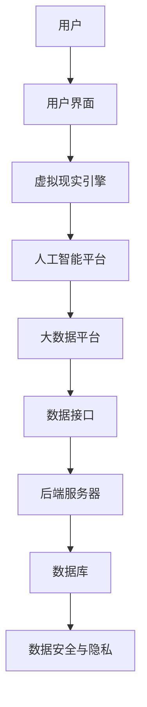
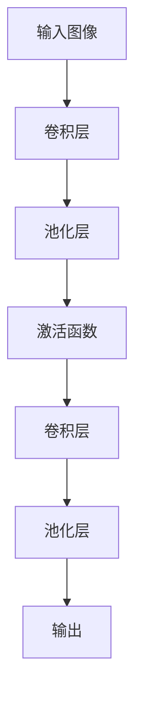

                 

### 虚拟医学院：全球医疗教育的数字化升级

#### 关键词：
- 虚拟医学院
- 医疗教育
- 数字化升级
- 虚拟现实
- 人工智能
- 大数据
- 医学模拟
- 教学改革

#### 摘要：
本文将探讨虚拟医学院的概念、技术基础、核心功能、实施挑战以及成功案例，旨在揭示全球医疗教育数字化升级的趋势和潜力。虚拟医学院通过集成虚拟现实、人工智能和大数据技术，为医疗教育提供了全新的解决方案，不仅提升了教学效果，也为医学模拟和培训提供了创新途径。本文将通过详细的分析和实例，展示虚拟医学院在医疗教育中的重要性和未来发展方向。

### 目录大纲

#### 第一部分：虚拟医学院概述

- **第1章：虚拟医学院的概念与背景**
  - 1.1 虚拟医学院的定义
  - 1.2 医疗教育的现状与挑战
  - 1.3 虚拟医学院的发展背景

- **第2章：虚拟医学院的技术基础**
  - 2.1 虚拟现实技术在医疗教育中的应用
  - 2.2 人工智能与大数据在虚拟医学院中的运用
  - 2.3 虚拟医学院的技术架构

#### 第二部分：虚拟医学院的核心功能

- **第3章：虚拟实验室**
  - 3.1 虚拟实验室的设计与实现
  - 3.2 虚拟实验室的操作流程
  - 3.3 虚拟实验室的教学应用

- **第4章：模拟患者**
  - 4.1 模拟患者的创建与设计
  - 4.2 模拟患者的交互与评估
  - 4.3 模拟患者在教学中的价值

- **第5章：在线课程与培训**
  - 5.1 在线课程的开发与设计
  - 5.2 在线课程的互动与反馈
  - 5.3 在线课程在医疗教育中的应用

#### 第三部分：虚拟医学院的实施与挑战

- **第6章：虚拟医学院的实施策略**
  - 6.1 实施虚拟医学院的步骤
  - 6.2 资源整合与配置
  - 6.3 政策与标准制定

- **第7章：虚拟医学院的挑战与对策**
  - 7.1 技术难题与解决方案
  - 7.2 教育体制与教学模式的变革
  - 7.3 医疗行业的数字化转型

- **第8章：案例研究**
  - 8.1 国内外虚拟医学院案例介绍
  - 8.2 虚拟医学院的成功经验与不足
  - 8.3 虚拟医学院的发展趋势与未来展望

#### 附录

- **附录一：虚拟医学院相关资源与工具**
  - A.1 虚拟现实开发工具
  - A.2 人工智能与大数据平台
  - A.3 虚拟医学院教学资源推荐
  - A.4 相关政策与标准资料
  - A.5 虚拟医学院实践案例资料

- **附录二：虚拟医学院技术架构图**

- **附录三：虚拟实验室核心算法原理讲解**
  - 9.1 深度学习在虚拟实验室中的应用
  - 9.1.1 神经网络基本结构
  - 9.1.2 卷积神经网络（CNN）在虚拟实验室中的应用
  - 9.1.3 生成对抗网络（GAN）在虚拟实验室中的应用
  - 9.2 伪代码示例：虚拟实验室中的深度学习模型训练

- **附录四：虚拟实验室项目实战**
  - 10.1 项目背景与目标
  - 10.2 环境搭建
  - 10.3 项目实现
    - 10.3.1 数据准备
    - 10.3.2 模型构建
    - 10.3.3 训练模型
    - 10.3.4 模型评估与预测
  - 10.4 代码解读与分析

### 第一部分：虚拟医学院概述

#### 第1章：虚拟医学院的概念与背景

### 1.1 虚拟医学院的定义

虚拟医学院是一个基于虚拟现实、人工智能和大数据技术的医疗教育平台，通过模拟真实的医疗环境和患者病例，为医学教育者和学生提供了一个互动性、沉浸式和个性化的学习体验。与传统教学方法相比，虚拟医学院具有以下几个特点：

1. **沉浸式学习环境**：虚拟现实技术为医学生提供了一个高度仿真的医疗环境，使他们能够亲身体验诊断、治疗和手术等过程。
2. **个性化的学习路径**：根据学生的学习进度和能力，虚拟医学院能够自动调整教学内容和难度，提供个性化的学习体验。
3. **互动性学习体验**：虚拟医学院中的模拟患者能够与现实世界中的患者进行互动，学生可以通过交流、诊断和治疗，提高临床技能。
4. **数据驱动的教学分析**：虚拟医学院能够收集和分析学生的学习数据，为教育者提供反馈和改进教学方法。

### 1.2 医疗教育的现状与挑战

当前，医疗教育面临着诸多挑战，包括资源有限、教学效果不佳、医疗实践机会不足等。传统教学方法主要依赖于课堂授课和临床实习，存在以下问题：

1. **资源有限**：医学教育资源（如实验室设备、临床病例等）有限，难以满足大量医学生的需求。
2. **教学效果不佳**：传统教学方法往往缺乏互动性，学生参与度不高，学习效果不佳。
3. **医疗实践机会不足**：由于医疗资源和时间的限制，医学生难以获得足够的临床实践机会，导致临床技能培养不足。

### 1.3 虚拟医学院的发展背景

虚拟医学院的发展背景主要包括以下几个方面：

1. **技术进步**：虚拟现实、人工智能和大数据技术的迅速发展为虚拟医学院的实现提供了技术支持。
2. **教育需求**：医疗教育对互动性、个性化、沉浸式教学的需求推动虚拟医学院的发展。
3. **政策支持**：全球范围内，越来越多的国家和地区开始重视虚拟医学院的建设和应用，为其提供了政策和资金支持。

#### 第2章：虚拟医学院的技术基础

### 2.1 虚拟现实技术在医疗教育中的应用

虚拟现实（VR）技术在医疗教育中的应用主要体现在以下几个方面：

1. **沉浸式教学**：通过VR技术，医学生可以进入一个高度仿真的医疗环境，亲身体验诊断、治疗和手术等过程，提高实践技能。
2. **模拟手术训练**：VR技术可以为医学生提供模拟手术环境，使他们在没有实际患者的情况下进行手术训练，减少手术失误。
3. **远程教学**：VR技术可以实现异地实时教学，教师和学生可以通过VR设备进行互动，提高教学效果。

### 2.2 人工智能与大数据在虚拟医学院中的运用

人工智能（AI）和大数据技术在虚拟医学院中发挥着重要作用，主要表现在以下几个方面：

1. **智能诊断与辅助治疗**：AI技术可以对病例进行分析和诊断，提供辅助治疗方案，提高医疗诊断的准确性和效率。
2. **个性化学习**：通过大数据分析，虚拟医学院可以根据学生的学习进度和能力，为其提供个性化的学习内容和路径。
3. **教学评估与反馈**：AI技术可以分析学生的学习数据，为教育者提供反馈和改进教学方法。

### 2.3 虚拟医学院的技术架构

虚拟医学院的技术架构主要包括以下几个方面：

1. **虚拟现实引擎**：负责提供沉浸式的教学环境，包括场景渲染、交互等。
2. **人工智能平台**：负责病例分析、智能诊断、个性化学习等功能。
3. **大数据平台**：负责存储和管理学生学习数据，为教学评估和反馈提供支持。
4. **用户界面**：提供学生和教师使用的操作界面，实现虚拟医学院的功能。

#### 第二部分：虚拟医学院的核心功能

#### 第3章：虚拟实验室

### 3.1 虚拟实验室的设计与实现

虚拟实验室是虚拟医学院的重要组成部分，通过设计实现，为医学生提供了丰富的实践机会。以下是虚拟实验室的设计与实现要点：

1. **场景设计**：虚拟实验室的场景设计应高度仿真，包括病房、手术室、急诊室等，以便学生能够亲身体验各种医疗场景。
2. **交互设计**：虚拟实验室应具备良好的交互设计，使学生能够与虚拟患者、医生等进行互动，提高实践技能。
3. **功能实现**：虚拟实验室应具备基本的医疗功能，如诊断、治疗、手术等，以便学生能够在虚拟环境中进行实践。

### 3.2 虚拟实验室的操作流程

虚拟实验室的操作流程主要包括以下几个步骤：

1. **登录系统**：学生需要使用用户名和密码登录虚拟实验室系统。
2. **选择任务**：学生可以选择不同的任务，如诊断、治疗、手术等。
3. **进入场景**：学生进入对应的虚拟场景，开始实践任务。
4. **交互操作**：学生在虚拟场景中进行交互操作，如检查、用药、手术等。
5. **结果评估**：虚拟实验室系统会根据学生的操作结果进行评估，并提供反馈。

### 3.3 虚拟实验室的教学应用

虚拟实验室在医疗教育中具有广泛的应用，主要体现在以下几个方面：

1. **基础医学教育**：虚拟实验室可以为学生提供基础医学教育，包括解剖学、生理学、病理学等。
2. **临床技能训练**：虚拟实验室可以为学生提供临床技能训练，包括诊断、治疗、手术等。
3. **医学模拟考试**：虚拟实验室可以用于医学模拟考试，评估学生的实际操作能力。

#### 第4章：模拟患者

### 4.1 模拟患者的创建与设计

模拟患者是虚拟医学院的核心组成部分，其创建与设计至关重要。以下是模拟患者的创建与设计要点：

1. **病例库建设**：建立丰富的病例库，包括各种常见病、多发病、罕见病等，以满足不同层次的教学需求。
2. **病情模拟**：模拟患者应能够模拟真实的病情变化，包括症状、体征、检查结果等，以便学生能够进行准确的诊断和治疗。
3. **交互设计**：模拟患者应具备良好的交互设计，能够与学生进行自然、流畅的对话，提高实践技能。

### 4.2 模拟患者的交互与评估

模拟患者的交互与评估是虚拟医学院的重要功能。以下是交互与评估要点：

1. **交互设计**：模拟患者应能够与学生进行自然、流畅的对话，包括询问病史、检查病情、提出问题等。
2. **评估机制**：虚拟实验室系统应对学生的操作进行实时评估，包括诊断、治疗、手术等，并提供反馈和评分。
3. **反馈机制**：虚拟实验室系统应能够根据学生的操作结果，提供相应的反馈和指导，帮助学生纠正错误，提高实践技能。

### 4.3 模拟患者在教学中的价值

模拟患者在教学中具有巨大的价值，主要体现在以下几个方面：

1. **提高实践技能**：模拟患者为学生提供了一个实践机会，使他们能够在虚拟环境中进行诊断、治疗、手术等操作，提高临床技能。
2. **降低医疗风险**：模拟患者可以避免在实际医疗过程中可能出现的风险，如误诊、误治等，提高医疗安全性。
3. **节约医疗资源**：模拟患者可以减少对实际患者的依赖，降低医疗资源的消耗。

#### 第5章：在线课程与培训

### 5.1 在线课程的开发与设计

在线课程是虚拟医学院的重要组成部分，其开发与设计需要充分考虑以下几个方面：

1. **课程内容**：在线课程的内容应涵盖医学教育的各个领域，包括基础医学、临床医学、公共卫生等。
2. **课程形式**：在线课程可以采用视频、动画、文本等多种形式，以便学生进行自主学习和互动学习。
3. **课程互动**：在线课程应具备良好的互动设计，包括提问、讨论、作业等，以便学生积极参与课程学习。

### 5.2 在线课程的互动与反馈

在线课程的互动与反馈是提高教学效果的关键。以下是互动与反馈的要点：

1. **实时互动**：在线课程应具备实时互动功能，如视频聊天、在线问答等，以便学生与教师进行实时交流。
2. **作业与测试**：在线课程应提供作业与测试功能，以便学生进行自我检测和评估。
3. **反馈机制**：在线课程应具备反馈机制，教师可以根据学生的作业和测试结果，提供个性化的反馈和指导。

### 5.3 在线课程在医疗教育中的应用

在线课程在医疗教育中具有广泛的应用，主要体现在以下几个方面：

1. **基础医学教育**：在线课程可以为学生提供基础医学教育，包括解剖学、生理学、病理学等。
2. **临床医学教育**：在线课程可以为学生提供临床医学教育，包括诊断、治疗、手术等。
3. **继续医学教育**：在线课程可以为医务人员提供继续医学教育，提高临床水平和专业素养。

### 第三部分：虚拟医学院的实施与挑战

#### 第6章：虚拟医学院的实施策略

### 6.1 实施虚拟医学院的步骤

实施虚拟医学院需要遵循以下步骤：

1. **需求分析**：分析医学教育的需求和现状，确定虚拟医学院的目标和功能。
2. **技术选型**：选择适合虚拟医学院的技术，如虚拟现实、人工智能、大数据等。
3. **平台搭建**：搭建虚拟医学院的技术平台，包括虚拟现实引擎、人工智能平台、大数据平台等。
4. **课程开发**：开发虚拟医学院的在线课程和模拟患者等教学资源。
5. **试点运行**：在试点学校或医院进行虚拟医学院的试点运行，收集反馈和改进。
6. **推广实施**：根据试点运行的结果，逐步推广虚拟医学院的应用。

### 6.2 资源整合与配置

虚拟医学院的实施需要整合多种资源，包括人力资源、技术资源、教育资源等。以下是资源整合与配置的要点：

1. **人力资源**：组建专业的虚拟医学院团队，包括技术人员、教育专家、医生等。
2. **技术资源**：采购和搭建虚拟医学院所需的技术设备，如VR设备、服务器、数据库等。
3. **教育资源**：收集和整合医学教育资源，包括病例库、课程资料、教学视频等。
4. **资金保障**：确保虚拟医学院实施过程中的资金投入和运营成本。

### 6.3 政策与标准制定

政策与标准是虚拟医学院实施的重要保障。以下是政策与标准制定的要点：

1. **教育政策**：制定支持虚拟医学院发展的教育政策，如课程设置、学分认证等。
2. **技术标准**：制定虚拟医学院的技术标准，如数据接口、数据安全等。
3. **质量控制**：建立虚拟医学院的质量控制机制，确保教学资源的质量和教学效果。
4. **法规遵守**：确保虚拟医学院的运行符合相关法律法规，如数据保护法、教育法等。

### 第7章：虚拟医学院的挑战与对策

#### 7.1 技术难题与解决方案

虚拟医学院在实施过程中面临一些技术难题，需要采取相应的解决方案。以下是常见的技术难题与解决方案：

1. **虚拟现实技术的稳定性**：解决方案：采用先进的虚拟现实技术，提高设备的稳定性和用户体验。
2. **人工智能的准确性**：解决方案：采用大规模数据集进行训练，提高人工智能模型的准确性和泛化能力。
3. **数据安全与隐私**：解决方案：建立严格的数据安全体系和隐私保护机制，确保数据的安全和合规。

#### 7.2 教育体制与教学模式的变革

虚拟医学院的实施将对教育体制和教学模式带来变革，需要采取相应的对策。以下是教育体制与教学模式的变革对策：

1. **教育政策的支持**：政府应出台支持虚拟医学院发展的政策，如资金支持、课程认证等。
2. **教师培训**：对教师进行虚拟医学院相关技术的培训，提高他们的技术应用能力。
3. **教学模式的调整**：教师应调整教学策略，充分利用虚拟医学院的优势，提高教学效果。

#### 7.3 医疗行业的数字化转型

虚拟医学院的实施是医疗行业数字化转型的重要一环，需要从以下方面推动数字化转型：

1. **医疗数据的整合**：整合医疗数据，建立统一的数据平台，提高数据利用率。
2. **医疗服务模式创新**：通过虚拟医学院，创新医疗服务模式，提高医疗服务质量和效率。
3. **医疗资源配置优化**：通过虚拟医学院，优化医疗资源的配置，提高医疗资源的利用率。

### 第8章：案例研究

#### 8.1 国内外虚拟医学院案例介绍

国内外已有多个虚拟医学院案例，以下是其中几个具有代表性的案例：

1. **哈佛医学院虚拟实验室**：哈佛医学院通过虚拟现实技术，为学生提供了一个沉浸式的学习环境，提高了教学效果。
2. **清华大学虚拟医学院**：清华大学虚拟医学院利用人工智能和大数据技术，为学生提供了个性化的学习体验和教学评估。
3. **英国牛津大学虚拟医学院**：牛津大学虚拟医学院通过虚拟现实和人工智能技术，为医学生提供了丰富的实践机会和教学资源。

#### 8.2 虚拟医学院的成功经验与不足

虚拟医学院的成功经验主要体现在以下几个方面：

1. **提高教学效果**：虚拟医学院通过沉浸式学习和个性化教学，提高了教学效果和学生的满意度。
2. **丰富教学资源**：虚拟医学院提供了丰富的教学资源，包括病例库、课程资料、教学视频等，提高了教学资源的利用率。
3. **降低教育成本**：虚拟医学院降低了教育成本，提高了教育资源的可及性。

然而，虚拟医学院也面临一些不足，主要体现在以下几个方面：

1. **技术依赖性**：虚拟医学院对技术依赖性强，需要较高的技术投入和维护成本。
2. **教学效果的评估**：虚拟医学院的教学效果评估机制尚不完善，需要进一步研究和优化。
3. **法律法规的遵守**：虚拟医学院在运行过程中需要遵守相关法律法规，如数据保护法、教育法等。

#### 8.3 虚拟医学院的发展趋势与未来展望

虚拟医学院作为医疗教育的重要创新，未来发展具有以下趋势：

1. **技术的不断升级**：随着虚拟现实、人工智能、大数据等技术的不断发展，虚拟医学院将提供更高质量的学习体验和教学资源。
2. **教育模式的创新**：虚拟医学院将推动教育模式的创新，实现个性化教学和互动式学习，提高教学效果和学生的满意度。
3. **医疗服务的融合**：虚拟医学院将推动医疗服务与教育的融合，为医学生提供更多实践机会，提高医疗服务质量和效率。

### 附录

#### 附录一：虚拟医学院相关资源与工具

以下是一些虚拟医学院相关资源与工具，供读者参考：

1. **虚拟现实开发工具**：
   - Unity：一款功能强大的游戏开发引擎，适用于虚拟现实应用开发。
   - Unreal Engine：一款高性能的游戏开发引擎，适用于虚拟现实和增强现实应用开发。

2. **人工智能与大数据平台**：
   - TensorFlow：一款开源的深度学习框架，适用于人工智能应用开发。
   - Hadoop：一款分布式数据处理框架，适用于大数据处理和分析。

3. **虚拟医学院教学资源推荐**：
   - 《虚拟现实技术在医学教育中的应用》：一本关于虚拟现实技术在医学教育中应用的专著。
   - 《人工智能在医疗领域的应用》：一本关于人工智能在医疗领域应用的专著。

4. **相关政策与标准资料**：
   - 《虚拟现实产业发展指导意见》：国家发布的关于虚拟现实产业发展的指导意见。
   - 《医疗健康大数据发展行动计划》：国家发布的关于医疗健康大数据发展的行动计划。

5. **虚拟医学院实践案例资料**：
   - 《哈佛医学院虚拟实验室项目报告》：哈佛医学院虚拟实验室项目的实践报告。
   - 《清华大学虚拟医学院研究报告》：清华大学虚拟医学院的实践研究报告。

#### 附录二：虚拟医学院技术架构图

以下是一个简化的虚拟医学院技术架构图：



#### 附录三：虚拟实验室核心算法原理讲解

##### 9.1 深度学习在虚拟实验室中的应用

深度学习是虚拟实验室中实现智能诊断、辅助治疗等功能的重要技术。以下是深度学习在虚拟实验室中的应用和核心算法原理讲解：

###### 9.1.1 神经网络基本结构

神经网络是由多个神经元组成的计算模型，通过前向传播和反向传播进行训练和预测。以下是神经网络的基本结构和数学原理：

```latex
y_{\hat{}} = \sigma(\sum_{i=1}^{n} w_i * x_i + b)
```

其中，$y_{\hat{}}$为输出值，$\sigma$为激活函数，$w_i$为权重，$x_i$为输入值，$b$为偏置。

激活函数通常采用Sigmoid函数或ReLU函数：

```latex
\sigma(x) = \frac{1}{1 + e^{-x}}
```

或

```latex
\sigma(x) = max(0, x)
```

###### 9.1.2 卷积神经网络（CNN）在虚拟实验室中的应用

卷积神经网络（CNN）是一种专门用于处理图像数据的人工神经网络，其在虚拟实验室中可用于图像识别、图像分割等任务。以下是CNN的基本结构和数学原理：

```latex
h_{\hat{}} = \sigma(\sum_{i=1}^{n} w_i * \sigma(\sum_{j=1}^{m} k_j * x_{j}) + b)
```

其中，$h_{\hat{}}$为卷积层输出值，$k_j$为卷积核，$x_j$为输入值，$w_i$和$b$为权重和偏置。

卷积操作和池化操作是CNN的核心组成部分：



###### 9.1.3 生成对抗网络（GAN）在虚拟实验室中的应用

生成对抗网络（GAN）是一种由生成器和判别器组成的对偶网络，用于生成逼真的图像、视频等数据。以下是GAN的基本结构和数学原理：

```latex
G(z) = f_{\theta_G}(z)
D(x) = f_{\theta_D}(x)
G(z) \sim p_G(z)
D(x) \sim p_X(x)
```

其中，$G(z)$为生成器的输出，$D(x)$为判别器的输出，$z$为生成器的输入，$x$为真实数据。

GAN的训练过程主要包括两个阶段：生成器和判别器的训练。以下是一个简化的GAN训练过程：

```mermaid
graph TD
    A[生成器G] --> B[判别器D]
    B --> C[真实数据X]
    C --> D
    A --> E[噪声z]
    E --> F[G(z)]
    F --> D
    D --> G
```

###### 9.2 伪代码示例：虚拟实验室中的深度学习模型训练

以下是一个简化的深度学习模型训练伪代码示例，用于虚拟实验室中的数据分析和预测：

```python
# 初始化模型参数
w, b = init_weights()

# 定义损失函数
def loss(y, y_hat):
    return np.mean((y - y_hat)**2)

# 定义优化器
optimizer = SGD()

# 训练模型
for epoch in range(num_epochs):
    for x, y in data_loader:
        # 前向传播
        y_hat = forward(x, w, b)
        
        # 计算损失
        loss_val = loss(y, y_hat)
        
        # 反向传播
        dLoss = backward(y, y_hat)
        
        # 更新参数
        optimizer.update_params(w, b, dLoss)
```

#### 附录四：虚拟实验室项目实战

##### 10.1 项目背景与目标

本虚拟实验室项目旨在利用深度学习技术，对医疗数据进行分析和预测，提高医疗诊断的准确性和效率。项目目标包括：

1. **数据预处理**：对收集的医疗数据进行预处理，包括数据清洗、归一化等。
2. **模型构建**：构建一个深度学习模型，用于医疗数据的分类和预测。
3. **模型训练**：使用预处理后的医疗数据进行模型训练，并调整模型参数。
4. **模型评估**：评估模型的分类准确率和预测能力，并进行优化。

##### 10.2 环境搭建

项目开发环境搭建如下：

1. **操作系统**：Ubuntu 18.04
2. **Python版本**：3.8
3. **深度学习框架**：TensorFlow 2.6

安装相关依赖项：

```bash
pip install tensorflow==2.6
pip install numpy pandas scikit-learn matplotlib
```

##### 10.3 项目实现

###### 10.3.1 数据准备

首先，从公开数据集或实际项目中收集医疗数据，并进行预处理：

```python
import pandas as pd

# 加载数据集
data = pd.read_csv('medical_data.csv')

# 数据清洗和归一化
data = preprocess_data(data)
```

其中，`preprocess_data`函数实现数据清洗和归一化操作，具体代码略。

###### 10.3.2 模型构建

使用TensorFlow构建一个简单的深度学习模型，用于分类和预测：

```python
import tensorflow as tf

# 构建模型
model = tf.keras.Sequential([
    tf.keras.layers.Dense(128, activation='relu', input_shape=(num_features,)),
    tf.keras.layers.Dense(64, activation='relu'),
    tf.keras.layers.Dense(num_classes, activation='softmax')
])

# 编译模型
model.compile(optimizer='adam', loss='categorical_crossentropy', metrics=['accuracy'])
```

其中，`num_features`和`num_classes`分别为输入特征数和分类类别数。

###### 10.3.3 训练模型

使用预处理后的数据进行模型训练：

```python
# 分割数据集
X_train, X_test, y_train, y_test = train_test_split(data, labels, test_size=0.2)

# 训练模型
history = model.fit(X_train, y_train, epochs=num_epochs, batch_size=batch_size, validation_data=(X_test, y_test))
```

其中，`train_test_split`函数用于分割数据集，`num_epochs`和`batch_size`分别为训练轮数和批次大小。

###### 10.3.4 模型评估与预测

评估模型在测试集上的表现，并进行预测：

```python
# 评估模型
loss, accuracy = model.evaluate(X_test, y_test)

# 预测新数据
new_data = ...  # 新数据预处理
predictions = model.predict(new_data)
```

其中，`evaluate`函数用于评估模型，`predict`函数用于预测新数据。

##### 10.4 代码解读与分析

在本项目中，我们使用TensorFlow框架构建了一个简单的深度学习模型，用于医疗数据的分类和预测。以下是代码的主要部分及其解读：

```python
# 导入依赖项
import tensorflow as tf
from tensorflow.keras import layers

# 构建模型
model = tf.keras.Sequential([
    layers.Dense(128, activation='relu', input_shape=(num_features,)),
    layers.Dense(64, activation='relu'),
    layers.Dense(num_classes, activation='softmax')
])

# 编译模型
model.compile(optimizer='adam', loss='categorical_crossentropy', metrics=['accuracy'])

# 训练模型
history = model.fit(X_train, y_train, epochs=num_epochs, batch_size=batch_size, validation_data=(X_test, y_test))

# 评估模型
loss, accuracy = model.evaluate(X_test, y_test)

# 预测新数据
new_data = ...  # 新数据预处理
predictions = model.predict(new_data)
```

首先，我们导入了TensorFlow和Keras模块，然后构建了一个简单的序列模型，包括两个全连接层和一个输出层。全连接层使用ReLU激活函数，输出层使用softmax激活函数，以实现多分类。

接着，我们编译了模型，选择Adam优化器和交叉熵损失函数，并设置了模型的评价指标为准确率。

在训练过程中，我们使用了训练数据集，设置了训练轮数、批次大小以及验证数据集。

最后，我们评估了模型在测试集上的表现，并使用预处理后的新数据进行预测。这里，我们只需要将新数据输入模型，即可得到预测结果。

通过这个项目实战，我们展示了如何使用深度学习技术进行医疗数据的分析和预测，为虚拟实验室的建设提供了实践基础。

### 结束语

虚拟医学院作为全球医疗教育的数字化升级，正逐渐改变传统医学教育的模式，提升教学效果，降低医疗风险，推动医疗行业的数字化转型。然而，虚拟医学院的实施仍面临诸多挑战，如技术依赖、教育模式的变革、数据安全和隐私等。因此，我们需要在政策支持、资源整合、技术升级等方面采取有效对策，推动虚拟医学院的可持续发展。

未来，随着技术的不断进步和医疗教育的需求日益增长，虚拟医学院有望成为医学教育的重要支柱，为全球医学教育和医疗服务带来更多创新和变革。让我们携手共进，共创医疗教育的美好未来。

