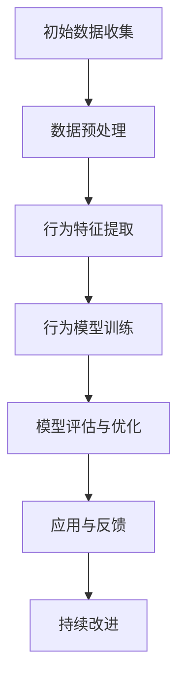
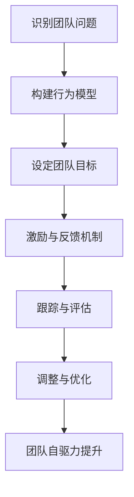
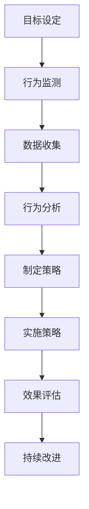

                 

### 《行为模型应用:培养团队自驱力》正文

# 引言：团队自驱力的意义与挑战

在当今快速发展的数字化时代，企业面临的竞争压力越来越大。为了在激烈的市场竞争中脱颖而出，企业需要不断提升团队的协作效率和创新能力。而团队自驱力作为团队协作的核心动力，已经成为企业管理和团队建设的关键议题。

### 1.1 团队自驱力的定义与作用

团队自驱力是指团队成员在没有外部压力和激励的情况下，主动、积极地参与工作，为实现团队目标和组织愿景而努力的一种内在动力。团队自驱力不仅能够提高团队的工作效率，还能够激发团队成员的创造力和创新精神。

#### 1.1.1 团队自驱力的定义

团队自驱力是一个多维度、多维度的概念，包括以下几个方面：

1. **主动性**：团队成员能够主动承担责任，积极参与团队工作和决策。
2. **积极性**：团队成员对工作充满热情，愿意付出额外的努力来完成任务。
3. **持续改进**：团队成员能够不断反思自己的工作，寻找改进的机会，提高工作质量和效率。

#### 1.1.2 团队自驱力的作用

团队自驱力对团队和组织的作用主要体现在以下几个方面：

1. **提高工作效率**：自驱力强的团队成员能够更好地规划和组织工作，减少工作效率低下和资源浪费的现象。
2. **激发创新精神**：自驱力强的团队成员更愿意挑战自己，尝试新的方法和思路，从而推动团队和组织创新。
3. **提升团队凝聚力**：自驱力强的团队成员之间更容易建立信任和合作关系，提高团队的凝聚力和协作效率。
4. **降低管理成本**：自驱力强的团队成员能够自我管理和自我激励，减少对传统管理模式和外部激励的依赖，降低管理成本。

### 1.2 当前团队管理的困境

尽管团队自驱力的重要性已经被广泛认可，但在实际的管理过程中，许多企业仍然面临着一些困境：

1. **管理方式过于僵化**：传统的管理模式过于强调命令和控制，忽视了团队成员的主动性和创造力。
2. **激励机制不足**：许多企业的激励机制单一，难以激发团队成员的内在动力。
3. **沟通不畅**：团队内部的沟通渠道不畅通，导致信息传递延迟和误解。
4. **团队氛围不良**：缺乏良好的团队氛围，导致团队成员之间的信任和合作关系难以建立。

### 1.3 行为模型在团队自驱力中的应用

行为模型是一种用于分析和解释人类行为的方法，它通过对个体和群体行为的观测、记录和分析，揭示行为背后的规律和动机。行为模型在团队自驱力培养中的应用，主要体现在以下几个方面：

1. **识别问题**：通过行为模型，可以识别出团队中存在的问题和不足，为团队改进提供依据。
2. **设定目标**：基于行为模型的分析结果，可以设定更具体、更有针对性的团队目标和任务。
3. **设计激励机制**：通过行为模型，可以了解团队成员的行为动机，从而设计出更有效的激励机制。
4. **优化管理方式**：行为模型可以提供有关团队协作和沟通的洞见，帮助企业优化管理方式，提高团队效率。
5. **提升团队自驱力**：通过行为模型的应用，可以帮助团队成员认识到自己的行为对团队的影响，从而激发他们的内在动力，提升团队自驱力。

# 核心概念

## 1.2.1 行为模型概述

### 1.2.1.1 行为模型的基本概念

行为模型是一种用于描述和解释人类行为的抽象模型。它通过捕捉和分析人类行为的基本规律和模式，帮助我们理解和预测人类的行为。行为模型可以应用于多个领域，包括心理学、社会学、管理学等。

#### 1.2.1.1.1 行为模型的核心要素

行为模型通常包括以下几个核心要素：

1. **行为**：行为模型研究的是人类行为，包括个体的行为和群体的行为。
2. **动机**：动机是驱动人类行为的内在力量，是行为模型研究的重要内容。
3. **环境**：环境是影响人类行为的外部因素，包括社会环境、物理环境等。
4. **结果**：行为的结果是行为模型分析的重要目标，它可以帮助我们了解行为的实际效果和影响。

#### 1.2.1.1.2 行为模型的研究方法

行为模型的研究方法主要包括：

1. **观测法**：通过直接观察人类行为，记录和描述行为模式和规律。
2. **实验法**：通过控制实验环境，观察和比较不同条件下的行为差异。
3. **问卷调查法**：通过问卷调查，收集个体和群体的行为数据和动机信息。
4. **案例分析法**：通过对实际案例的深入分析，揭示行为模型的应用和效果。

### 1.2.1.2 行为模型的发展历程

行为模型的发展历程可以追溯到20世纪初期，随着心理学、社会学和管理学等学科的发展，行为模型逐渐形成和完善。以下是行为模型发展的几个关键阶段：

1. **早期行为主义**：20世纪20年代至30年代，以约翰·华生（John B. Watson）为代表的行为主义学派提出了行为模型的基本概念和方法。
2. **认知行为主义**：20世纪50年代至60年代，以阿尔伯特·班杜拉（Albert Bandura）为代表的认知行为主义学派在行为模型的基础上，引入了认知因素，提出了更为综合的行为模型。
3. **社会认知行为主义**：20世纪70年代至今，社会认知行为主义学派在认知行为主义的基础上，进一步强调社会环境和社会互动对行为的影响，提出了更为全面的行为模型。

### 1.2.1.3 行为模型的关键要素

行为模型的关键要素包括以下几个方面：

1. **行为**：行为模型研究的核心是对人类行为的描述和解释，包括个体行为和群体行为。
2. **动机**：动机是驱动人类行为的内在力量，包括生理动机、社会动机、认知动机等。
3. **环境**：环境是影响人类行为的外部因素，包括物理环境、社会环境、文化环境等。
4. **结果**：行为的结果是行为模型分析的重要目标，包括行为对个体、团队和组织的影响。

## 1.2.2 团队动力模型

### 1.2.2.1 团队动力模型概述

团队动力模型是一种用于分析和解释团队动力和团队行为的抽象模型。它通过捕捉和描述团队内部的行为、动机、互动和结果，帮助我们理解团队的动力机制和团队行为模式。

#### 1.2.2.1.1 团队动力模型的核心要素

团队动力模型的核心要素包括以下几个方面：

1. **团队成员**：团队成员是团队动力模型的基础，包括个体的行为、动机和角色。
2. **团队互动**：团队互动是团队动力模型的关键，包括团队成员之间的沟通、协作和冲突。
3. **团队环境**：团队环境是影响团队动力和团队行为的因素，包括组织文化、工作环境、外部压力等。
4. **团队结果**：团队结果是团队动力模型分析的重要目标，包括团队绩效、团队满意度、团队凝聚力等。

#### 1.2.2.1.2 团队动力模型的研究方法

团队动力模型的研究方法主要包括：

1. **问卷调查法**：通过问卷调查，收集团队成员的行为、动机、互动和结果数据。
2. **访谈法**：通过访谈，深入了解团队成员的体验、感受和看法。
3. **案例分析法**：通过对实际团队的案例分析，揭示团队动力模型的应用和效果。

### 1.2.2.2 团队动力模型的构成要素

团队动力模型的构成要素包括以下几个方面：

1. **团队结构**：团队结构是团队动力模型的基础，包括团队成员的角色、职责和关系。
2. **团队规范**：团队规范是团队动力模型的重要要素，包括团队的行为准则、价值观念和决策规则。
3. **团队目标**：团队目标是团队动力模型的核心，包括团队的具体任务和长远愿景。
4. **团队互动**：团队互动是团队动力模型的关键，包括团队成员之间的沟通、协作和冲突。
5. **团队环境**：团队环境是影响团队动力和团队行为的因素，包括组织文化、工作环境、外部压力等。

## 1.2.3 团队动力模型的应用

### 1.2.3.1 团队动力模型在团队协作中的应用

团队动力模型在团队协作中的应用，主要体现在以下几个方面：

1. **团队建设**：通过团队动力模型，可以帮助团队明确团队成员的角色和职责，建立良好的团队规范和目标。
2. **团队沟通**：通过团队动力模型，可以帮助团队识别沟通障碍和冲突，优化沟通方式，提高团队协作效率。
3. **团队激励**：通过团队动力模型，可以帮助团队设计有效的激励机制，激发团队成员的内在动力，提高团队绩效。

### 1.2.3.2 团队动力模型在团队管理中的应用

团队动力模型在团队管理中的应用，主要体现在以下几个方面：

1. **团队绩效评估**：通过团队动力模型，可以帮助团队评估团队成员的表现，识别团队问题和改进方向。
2. **团队领导力培养**：通过团队动力模型，可以帮助团队领导者提升领导力，建立良好的团队氛围，提高团队凝聚力。
3. **团队发展**：通过团队动力模型，可以帮助团队制定长远的发展规划，优化团队结构，推动团队持续发展。

# 第二部分：行为模型在团队中的应用

## 2.1 行为模型在团队协作中的运用

### 2.1.1 团队协作中的问题与挑战

在团队协作中，常常会遇到以下问题和挑战：

1. **沟通障碍**：团队成员之间的沟通不畅，导致信息传递延迟和误解，影响团队工作效率。
2. **分工不明确**：团队成员的角色和职责不清晰，导致工作重复和资源浪费。
3. **协调困难**：团队成员之间的协作不协调，导致工作进度缓慢和效率低下。
4. **冲突和摩擦**：团队成员之间的意见不合和利益冲突，导致团队氛围紧张和团队凝聚力下降。

### 2.1.2 行为模型在团队协作中的具体应用

行为模型在团队协作中的应用，可以帮助团队解决上述问题和挑战，提高团队协作效率。以下是行为模型在团队协作中的具体应用：

1. **沟通机制构建**：通过行为模型，可以分析团队成员的沟通风格和行为习惯，构建有效的沟通机制，提高沟通效率和质量。
2. **角色和职责明确**：通过行为模型，可以识别团队成员的行为特征和能力，明确团队成员的角色和职责，避免工作重复和资源浪费。
3. **协调和协作优化**：通过行为模型，可以分析团队成员的协作行为和互动模式，优化团队成员之间的协作流程，提高协作效率。
4. **冲突管理和解决**：通过行为模型，可以识别团队成员的冲突原因和冲突行为，设计有效的冲突管理和解决策略，缓解团队紧张氛围，提高团队凝聚力。

### 2.1.3 行为模型在团队协作中的优势

行为模型在团队协作中的优势主要体现在以下几个方面：

1. **科学性和系统性**：行为模型基于行为科学的理论和方法，能够系统性地分析和解决团队协作中的问题，提高团队协作效率。
2. **针对性**：行为模型针对团队协作中的具体问题和挑战，提供个性化的解决方案，能够更有效地解决团队协作中的难题。
3. **动态调整**：行为模型可以根据团队协作的实际情况，动态调整协作策略和沟通方式，提高团队适应性和灵活性。
4. **持续改进**：行为模型可以持续跟踪团队协作的效果，及时发现问题并进行改进，推动团队协作的持续优化。

## 2.2 行为模型在团队管理中的实践

### 2.2.1 团队管理中的问题与挑战

在团队管理中，常常会遇到以下问题和挑战：

1. **绩效评估不公**：团队绩效评估标准不明确，导致评估结果不公平，影响团队成员的工作积极性。
2. **领导力不足**：团队领导者缺乏有效的领导力和管理技能，无法激发团队成员的内在动力，导致团队绩效低下。
3. **团队成员满意度低**：团队成员对工作环境和团队氛围不满意，导致员工流失和团队凝聚力下降。
4. **团队发展受阻**：团队发展缺乏明确的规划和管理，导致团队发展缓慢，无法满足组织发展的需求。

### 2.2.2 行为模型在团队管理中的具体应用

行为模型在团队管理中的应用，可以帮助团队克服上述问题和挑战，提高团队管理效果。以下是行为模型在团队管理中的具体应用：

1. **绩效评估优化**：通过行为模型，可以明确绩效评估的标准和方法，提高绩效评估的公平性和准确性，激发团队成员的工作积极性。
2. **领导力培养**：通过行为模型，可以分析团队领导者的行为特征和管理风格，提供针对性的领导力培养方案，提高团队领导者的领导力。
3. **团队成员满意度提升**：通过行为模型，可以分析团队成员的工作满意度，发现满意度低的因素，并制定相应的改进措施，提高团队成员的满意度。
4. **团队发展规划**：通过行为模型，可以分析团队的发展现状和问题，制定明确的团队发展规划，推动团队持续发展。

### 2.2.3 行为模型在团队管理中的优势

行为模型在团队管理中的优势主要体现在以下几个方面：

1. **科学性和系统性**：行为模型基于行为科学的理论和方法，能够系统性地分析和解决团队管理中的问题，提高团队管理效率。
2. **针对性**：行为模型针对团队管理中的具体问题和挑战，提供个性化的解决方案，能够更有效地解决团队管理中的难题。
3. **动态调整**：行为模型可以根据团队管理的实际情况，动态调整管理策略和方法，提高团队管理的适应性和灵活性。
4. **持续改进**：行为模型可以持续跟踪团队管理的效果，及时发现问题并进行改进，推动团队管理的持续优化。

## 2.3 行为模型在团队自驱力培养中的应用

### 2.3.1 团队自驱力培养的关键因素

团队自驱力培养是一个复杂的过程，涉及多个关键因素。以下是团队自驱力培养的关键因素：

1. **领导风格**：领导风格对团队自驱力培养具有重要影响。领导者需要采用民主式、参与式和激励式的领导风格，鼓励团队成员积极参与团队建设和决策。
2. **组织文化**：组织文化是团队自驱力培养的基础。企业需要建立积极向上、公平公正、尊重个体和鼓励创新的组织文化，为团队自驱力的培养提供良好的环境。
3. **激励机制**：激励机制是团队自驱力培养的重要手段。企业需要设计多种激励机制，包括物质激励、精神激励和荣誉激励，激发团队成员的内在动力。
4. **反馈机制**：反馈机制是团队自驱力培养的重要保障。企业需要建立有效的反馈机制，及时向团队成员提供反馈，帮助他们认识到自己的进步和不足，促进自我改进。
5. **成长与发展**：成长与发展是团队自驱力培养的核心。企业需要为团队成员提供培训、晋升和发展机会，帮助他们实现个人成长和职业发展。

### 2.3.2 行为模型在团队自驱力培养中的具体应用

行为模型在团队自驱力培养中的应用，可以通过以下几个方面实现：

1. **领导风格分析**：通过行为模型，可以分析领导者的行为特征和管理风格，识别领导风格对团队自驱力培养的影响，为领导者提供改进建议。
2. **组织文化评估**：通过行为模型，可以评估组织的文化氛围和行为规范，识别组织文化对团队自驱力培养的支撑作用，为组织文化优化提供依据。
3. **激励机制设计**：通过行为模型，可以分析团队成员的动机和行为模式，设计个性化的激励机制，提高团队自驱力。
4. **反馈机制建立**：通过行为模型，可以建立有效的反馈机制，及时收集团队成员的意见和建议，提高团队自驱力。
5. **成长与发展支持**：通过行为模型，可以识别团队成员的成长需求和发展方向，提供相应的培训和发展机会，促进团队自驱力培养。

### 2.3.3 行为模型在不同场景下的应用策略

根据团队自驱力培养的不同场景，行为模型的应用策略也有所不同：

1. **项目启动阶段**：在项目启动阶段，行为模型可以用于团队组建和目标设定，帮助团队成员明确角色和职责，提高团队自驱力。
2. **项目执行阶段**：在项目执行阶段，行为模型可以用于团队沟通和协作，优化团队流程，提高团队自驱力。
3. **项目结束阶段**：在项目结束阶段，行为模型可以用于团队评估和总结，识别团队自驱力培养的成效和不足，为下一阶段的自驱力培养提供参考。

# 实战案例与经验分享

## 4.1 行为模型在团队管理中的实战案例

### 4.1.1 案例一：某互联网公司的团队管理实践

#### 4.1.1.1 案例背景

某互联网公司是一家快速发展的创新型企业，随着业务规模的扩大，团队管理问题逐渐显现。公司领导层意识到，要提高团队工作效率和创新能力，必须解决团队管理中的问题。于是，公司决定引入行为模型，对团队管理进行优化。

#### 4.1.1.2 行为模型的应用

公司采用行为模型，对团队管理进行了以下应用：

1. **领导风格分析**：通过行为模型，公司领导层认识到自己需要从权威式领导转变为参与式领导，鼓励团队成员参与决策和提出建议。
2. **组织文化评估**：通过行为模型，公司发现组织文化中存在一定的官僚主义和竞争氛围，不利于团队自驱力的培养。公司采取了一系列措施，如推行扁平化管理、鼓励内部创新等，优化组织文化。
3. **激励机制设计**：公司根据行为模型，设计了多种激励机制，包括绩效考核、员工晋升、培训等，以激发团队成员的内在动力。
4. **反馈机制建立**：公司建立了定期反馈机制，通过员工满意度调查、绩效评估等手段，及时收集团队成员的意见和建议，改进团队管理。

#### 4.1.1.3 案例效果与反思

通过行为模型的应用，公司取得了以下效果：

1. **团队工作效率提高**：领导风格的转变和激励机制的设计，使得团队成员更加积极主动，工作效率显著提高。
2. **创新能力增强**：组织文化的优化和反馈机制的建立，促进了团队成员之间的沟通和协作，创新氛围更加浓厚。
3. **员工满意度提升**：多种激励机制的推行，使得员工对公司的认同感和归属感增强，员工满意度显著提高。

然而，公司也意识到，行为模型的应用并非一蹴而就，需要持续优化和改进。未来，公司将继续关注团队成员的行为特征和需求，不断调整和优化团队管理策略。

### 4.1.2 案例二：某科技公司的团队自驱力培养实践

#### 4.1.2.1 案例背景

某科技公司是一家专注于高科技产品研发的企业，团队成员具有较高的技术水平和创新意识。然而，公司领导层发现，尽管团队成员在技术方面表现出色，但在团队合作和自驱力方面存在一定问题。为了提高团队的整体表现，公司决定通过行为模型培养团队自驱力。

#### 4.1.2.2 行为模型的应用

公司采用行为模型，对团队自驱力培养进行了以下应用：

1. **团队动力模型构建**：公司通过行为模型，分析了团队中的动力因素和互动模式，构建了团队动力模型，为团队自驱力培养提供指导。
2. **领导力培养**：公司为团队领导者提供了领导力培训，帮助他们掌握参与式、激励式和辅导式的领导技能，提高团队自驱力。
3. **反馈机制建立**：公司建立了定期的反馈机制，通过团队讨论、绩效评估等方式，及时了解团队成员的行为表现和需求，提供针对性的反馈和支持。
4. **成长与发展支持**：公司为团队成员提供了丰富的培训和发展机会，鼓励他们不断学习和提升自己的能力，实现个人成长和职业发展。

#### 4.1.2.3 案例效果与反思

通过行为模型的应用，公司取得了以下效果：

1. **团队凝聚力增强**：团队动力模型的构建和领导力培养，使得团队成员之间的信任和合作关系更加紧密，团队凝聚力显著提高。
2. **自驱力提升**：反馈机制和成长与发展支持的应用，激发了团队成员的内在动力，提高了团队的自我驱动能力。
3. **创新成果丰富**：团队自驱力的提升，使得团队成员在技术研究和产品开发方面取得了显著的创新成果。

公司认为，行为模型的应用对于团队自驱力的培养具有重要意义，但需要持续关注团队成员的行为变化和需求，不断调整和优化培养策略。

## 4.2 行为模型在团队协作中的经验分享

### 4.2.1 经验分享一：如何在团队中建立有效的沟通机制

#### 4.2.1.1 经验内容

在团队协作中，建立有效的沟通机制至关重要。以下是一些具体做法：

1. **明确沟通目标**：在每次会议或沟通活动开始前，明确沟通的目标和主题，确保沟通活动有明确的方向。
2. **优化沟通渠道**：根据团队的特点和需求，选择合适的沟通渠道，如面对面会议、邮件、即时通讯工具等，确保沟通渠道畅通。
3. **制定沟通规范**：制定团队沟通的基本规范，如会议时间、发言顺序、发言时间等，提高沟通效率。
4. **鼓励积极发言**：营造开放、包容的沟通氛围，鼓励团队成员积极发言，提出意见和建议。
5. **定期反馈**：定期收集团队成员对沟通机制的反馈，发现问题和不足，及时进行调整和优化。

#### 4.2.1.2 经验效果

通过建立有效的沟通机制，团队协作效率得到显著提高，团队成员之间的沟通更加顺畅，信息传递更加及时，误解和冲突减少。

#### 4.2.1.3 经验总结

建立有效的沟通机制需要团队成员的共同努力，需要根据团队的特点和需求不断调整和优化。有效的沟通机制能够为团队协作提供有力支持，提高团队的整体绩效。

### 4.2.2 经验分享二：如何在团队中提升工作效率

#### 4.2.2.1 经验内容

在团队协作中，提升工作效率是每个团队成员的责任。以下是一些具体做法：

1. **明确任务和目标**：在项目开始前，明确每个团队成员的任务和目标，确保每个人都清楚自己的职责和任务。
2. **优化工作流程**：分析团队的工作流程，找出瓶颈和优化点，制定合理的工作流程，提高工作效率。
3. **合理分配任务**：根据团队成员的能力和特长，合理分配任务，确保每个人都能发挥最大的价值。
4. **定期检查进度**：定期检查项目进度，及时发现问题和困难，采取相应的措施进行解决。
5. **提供必要的资源和支持**：为团队成员提供必要的资源和支持，确保他们能够顺利完成任务。

#### 4.2.2.2 经验效果

通过提升工作效率，团队能够更快地完成任务，提高项目的成功率，同时减少资源浪费和成本支出。

#### 4.2.2.3 经验总结

提升工作效率需要团队成员的共同努力，需要从任务分配、工作流程、资源支持等多个方面进行优化。合理的任务分配和工作流程，以及必要的资源和支持，是提升工作效率的关键。

# 行为模型应用的未来展望

## 5.1 行为模型应用的发展趋势

随着科技的不断进步和人类行为研究的深入，行为模型应用在团队协作和管理领域呈现出以下发展趋势：

### 5.1.1 技术演进

1. **人工智能技术的应用**：人工智能技术，特别是机器学习和深度学习技术，将为行为模型的应用提供更强大的分析能力和预测能力。通过对大规模数据集的分析，可以更准确地识别行为模式和动机，为团队管理和决策提供有力支持。
2. **大数据和云计算的融合**：大数据和云计算技术的结合，将使得行为模型的应用更加便捷和高效。企业可以通过云计算平台，快速获取和处理海量行为数据，实时监测团队动态，为团队管理和决策提供实时反馈。
3. **物联网（IoT）技术的应用**：物联网技术的普及，将使得行为模型的应用更加全面和实时。通过物联网设备，可以实时收集团队成员的行为数据和环境信息，为行为模型的分析提供更丰富的数据来源。

### 5.1.2 创新方向

1. **个性化行为模型**：随着对人类行为认识的不断深入，未来的行为模型将更加注重个性化。通过分析个体行为特征和动机，可以构建个性化的行为模型，为个体提供定制化的管理和激励方案。
2. **跨领域融合**：行为模型的应用将不断与其他领域的技术和理论相融合，如心理学、社会学、管理学等。这种跨领域的融合，将推动行为模型在更广泛的应用场景中发挥作用。
3. **实时行为分析**：随着技术的进步，行为模型的实时分析能力将得到显著提升。企业可以通过实时行为分析，快速识别团队中的问题，采取相应的措施进行干预和调整，提高团队协作效率和自驱力。

## 5.2 行为模型应用的市场前景

随着企业对团队协作和管理的重视程度不断提高，行为模型应用的市场前景十分广阔。以下是行为模型应用在市场中的前景：

### 5.2.1 行业发展趋势

1. **企业需求增长**：随着企业竞争的加剧，企业对团队协作和管理的需求不断增加。行为模型作为一种有效的团队管理工具，将在未来得到更广泛的应用。
2. **技术创新推动**：人工智能、大数据、云计算等技术的不断发展，将推动行为模型应用的创新，提高行为模型的技术水平和应用效果。
3. **政策支持**：政府和企业对科技创新和人才发展的支持，将推动行为模型应用在企业和组织中的普及和应用。

### 5.2.2 市场规模预测

根据市场调研机构的预测，全球行为模型应用的市场规模将在未来几年内保持快速增长。预计到2025年，行为模型应用的市场规模将达到数十亿美元。

### 5.2.3 竞争态势分析

在行为模型应用市场中，竞争态势日益激烈。主要竞争者包括传统的管理咨询公司、技术提供商和新兴的初创企业。传统管理咨询公司凭借其丰富的管理经验和客户资源，占据了一定的市场份额。技术提供商则依靠技术创新和产品优势，迅速扩大市场份额。新兴的初创企业则通过创新的商业模式和应用方案，逐渐赢得市场份额。

## 5.3 行为模型应用的未来挑战与应对策略

尽管行为模型应用在团队协作和管理中具有巨大的潜力，但在实际应用过程中仍面临一些挑战：

### 5.3.1 未来挑战

1. **数据隐私与安全问题**：随着行为模型应用的数据量越来越大，数据隐私和安全问题日益突出。如何保护用户隐私，防止数据泄露，成为行为模型应用面临的重要挑战。
2. **技术与应用的匹配问题**：行为模型的应用需要与企业的业务和管理需求相结合，但如何确保技术方案与实际应用需求相匹配，是一个需要解决的问题。
3. **管理层与技术团队的沟通问题**：行为模型的应用涉及技术和管理两个层面，如何确保管理层和技术团队之间的有效沟通，确保项目顺利进行，是行为模型应用面临的一大挑战。

### 5.3.2 应对策略

1. **加强数据安全与隐私保护**：企业需要建立完善的数据安全与隐私保护机制，确保用户数据的安全和隐私。同时，可以通过数据脱敏、加密等手段，降低数据泄露的风险。
2. **建立跨部门合作机制**：企业需要建立跨部门合作机制，促进管理层和技术团队之间的沟通和协作，确保项目顺利推进。可以通过定期会议、项目报告等形式，加强双方的信息交流。
3. **提供定制化的技术解决方案**：技术提供商需要根据企业的具体需求，提供定制化的技术解决方案，确保行为模型的应用与企业的业务和管理需求相匹配。可以通过需求调研、方案设计、实施反馈等环节，确保技术方案的有效性和可行性。

### 结论

行为模型作为一种有效的团队管理工具，在提升团队协作效率和自驱力方面具有重要作用。随着技术的不断进步和市场需求的增长，行为模型应用在未来将得到更广泛的应用。然而，在实际应用过程中，企业需要面对数据隐私、技术匹配和沟通协作等方面的挑战，并采取相应的应对策略。通过不断优化和改进，行为模型应用将为企业和团队带来更大的价值。

# 附录

## 附录 A: 行为模型应用的相关资源

### A.1 行为模型研究的经典文献

#### A.1.1 《行为科学在管理中的应用》

- 作者：道格拉斯·麦格雷戈（Douglas McGregor）
- 简介：本书是行为科学在管理领域的经典著作，提出了X理论和Y理论，对管理者的行为和团队管理具有重要影响。
- 内容：包括个体行为、领导力、团队建设、组织文化等内容。

#### A.1.2 《组织行为学：基础、研究和应用》

- 作者：斯蒂芬·P·罗宾斯（Stephen P. Robbins）
- 简介：这是一本系统介绍组织行为学的教科书，涵盖了组织行为学的理论、研究方法和应用领域。
- 内容：包括个体行为、群体行为、组织结构、组织文化、领导力和决策等内容。

#### A.1.3 《领导力与团队管理》

- 作者：保罗·赫塞（Paul Hersey）和肯·布兰查德（Ken Blanchard）
- 简介：本书专注于领导力和团队管理的理论与实践，旨在帮助读者提升领导力和团队管理能力。
- 内容：包括领导力的本质、领导风格、团队建设、团队沟通和冲突管理等。

### A.2 行为模型应用的技术工具

#### A.2.1 Python在行为模型应用中的使用

- 简介：Python是一种广泛应用于数据分析和机器学习的编程语言。
- 内容：介绍如何使用Python进行数据预处理、模型训练和结果可视化。

#### A.2.2 R语言在行为模型分析中的应用

- 简介：R语言是一种专门用于统计分析和数据可视化的编程语言。
- 内容：介绍如何使用R进行行为模型的数据分析、模型训练和结果解释。

#### A.2.3 数据可视化工具在行为模型分析中的应用

- 简介：数据可视化工具可以帮助我们更好地理解和解释行为模型的结果。
- 内容：介绍如何使用Tableau、PowerBI等工具进行行为模型的数据可视化。

## 附录 B: 行为模型应用参考案例

### B.1 案例一：某企业的团队自驱力培养实践

#### B.1.1 案例背景

- 企业：一家大型制造企业
- 目标：提升团队自驱力，提高工作效率和创新能力
- 困境：团队协作效率低下，员工缺乏主动性，创新能力不足

#### B.1.2 行为模型的应用

- 应用场景：团队自驱力培养
- 方法：
  - 采用行为模型进行员工行为分析，识别团队中的问题
  - 建立正向激励机制，奖励主动性和创新性
  - 通过反馈机制，帮助员工认识到自己的行为和效果，不断调整和优化

#### B.1.3 案例效果与反思

- 效果：
  - 团队协作效率显著提升
  - 员工主动性和创新能力得到增强
  - 企业整体业绩提升
- 反思：
  - 需要持续关注团队氛围和员工满意度
  - 行为模型的实施需要与企业文化相结合
  - 定期评估行为模型的效果，及时调整和优化策略

### B.2 案例二：某互联网公司的行为模型应用实践

#### B.2.1 案例背景

- 企业：一家互联网初创公司
- 目标：通过行为模型优化团队协作，提升团队绩效
- 困境：团队结构松散，沟通不畅，工作目标不明确

#### B.2.2 行为模型的应用

- 应用场景：团队协作优化
- 方法：
  - 建立基于行为模型的工作流程，明确团队成员的职责和目标
  - 通过行为模型进行团队沟通分析，优化沟通方式
  - 采用行为模型进行团队绩效评估，激励团队成员持续改进

#### B.2.3 案例效果与反思

- 效果：
  - 团队协作效率显著提升
  - 团队成员对工作目标的认知度和执行力提高
  - 企业整体绩效得到提升
- 反思：
  - 行为模型的实施需要员工的理解和接受
  - 行为模型的优化需要与企业的业务发展相结合
  - 定期对行为模型进行评估和更新，确保其适应企业发展的需要

## 附录 C: 行为模型相关的Mermaid流程图

### C.1 行为模型分析流程图

### C.2 团队自驱力培养流程图

### C.3 行为模型在团队管理中的应用流程图

这些流程图可以帮助读者更好地理解行为模型在不同应用场景中的工作流程和关键环节。在实际应用中，可以根据具体情况对这些流程进行调整和优化，以达到更好的效果。

---

### 作者信息

作者：AI天才研究院/AI Genius Institute & 禅与计算机程序设计艺术 /Zen And The Art of Computer Programming

本文由AI天才研究院和禅与计算机程序设计艺术共同撰写，旨在探讨行为模型在团队协作和管理中的应用，为企业和团队提供实用的指导和建议。作者具有丰富的团队管理和行为科学研究经验，致力于推动人工智能和团队管理的创新发展。

