                 

## 《行动体系对团队管理的重要性》

在当前快速变化和高度竞争的商业环境中，团队管理的重要性日益凸显。然而，传统的管理方式往往无法满足现代团队的高效运作需求。这就引出了“行动体系”的概念，一种能够有效提升团队管理效能的方法论。本文将围绕行动体系对团队管理的核心重要性展开讨论，通过逻辑清晰的分析推理，逐步深入探讨这一主题。

### 关键词：
- 行动体系
- 团队管理
- 组织行为学
- 团队心理学
- 绩效管理

### 摘要：
本文旨在探讨行动体系在团队管理中的重要性。通过梳理行动体系的基础理论、理论基础、核心概念、架构设计以及在团队管理中的应用，我们将揭示行动体系如何通过科学的流程和机制，提升团队的整体效率和创新能力。文章将通过实际案例分析和未来展望，进一步强调行动体系在团队管理中的实践价值和前景。

### 目录大纲

1. **第一部分：行动体系的基础理论**
    1. 第1章：行动体系概述
        1.1 行动体系的定义与重要性
        1.2 行动体系与传统管理方式的区别
        1.3 行动体系的核心原则
    1. 第2章：行动体系的理论基础
        2.1 行动体系与组织行为学的关系
        2.2 行动体系与团队心理学的结合
        2.3 行动体系下的组织发展理论
    1. 第3章：行动体系的核心概念
        3.1 目标设定与分解
        3.2 行动计划与执行
        3.3 反馈与调整
        3.4 行动体系与绩效管理
    1. 第4章：行动体系的架构设计
        4.1 行动体系的组织架构
        4.2 行动体系的流程设计
        4.3 行动体系的技术支持
        4.4 行动体系的资源配置

2. **第二部分：行动体系在团队管理中的应用**
    2. 第5章：行动体系在团队管理中的实践
        5.1 行动体系在团队组建中的应用
        5.2 行动体系在团队目标管理中的应用
        5.3 行动体系在团队协作中的应用
        5.4 行动体系在团队绩效管理中的应用
    2. 第6章：行动体系下的团队领导力
        6.1 行动体系下的领导力模型
        6.2 行动体系下的领导力培养
        6.3 行动体系下的领导力评估
    2. 第7章：行动体系下的团队沟通与冲突管理
        7.1 行动体系下的沟通策略
        7.2 行动体系下的冲突管理
        7.3 行动体系下的团队文化建设
    2. 第8章：行动体系下的团队创新与变革
        8.1 行动体系下的创新管理
        8.2 行动体系下的变革管理
        8.3 行动体系下的团队可持续发展

3. **第三部分：行动体系下的团队管理案例分析**
    3. 第9章：行动体系下的团队管理案例分析
        9.1 案例一：A公司的行动体系实践
        9.2 案例二：B公司的行动体系创新
        9.3 案例三：C公司的行动体系困境与突破
    3. 第10章：行动体系下的团队管理未来展望
        10.1 行动体系下的团队管理发展趋势
        10.2 行动体系下的团队管理面临的挑战与机遇
        10.3 行动体系下的团队管理未来发展方向

4. **附录**
    4.1 附录A：行动体系相关工具与资源
    4.2 附录B：行动体系研究论文与报告
    4.3 附录C：行动体系应用案例

### 行动体系概述

行动体系，作为一种现代管理方法论，旨在通过明确的行动计划和有效的执行机制，推动团队实现目标。其核心在于将目标分解为具体可操作的任务，通过科学的管理流程和工具，确保每个任务都能按时完成，从而实现整体目标的达成。

### 行动体系的定义与重要性

行动体系可以被定义为一种以目标为导向，通过计划、执行、反馈和调整等一系列环节，确保团队高效运作的管理框架。它不同于传统的管理方式，后者更多地依赖于命令和控制，而行动体系则强调自主性和协作性。

在团队管理中，行动体系的重要性体现在以下几个方面：

1. **明确的目标设定**：行动体系通过明确的目标设定，帮助团队聚焦于关键任务，减少资源浪费，提升工作效率。
2. **科学的流程设计**：行动体系通过科学的流程设计，确保每个环节都有明确的职责和任务，从而避免工作中的混乱和冲突。
3. **有效的执行机制**：行动体系强调执行力的提升，通过具体的行动计划和时间表，确保任务按时完成。
4. **及时的反馈与调整**：行动体系强调及时反馈和调整，通过不断评估和优化，确保团队始终保持在高效率运作状态。

### 行动体系与传统管理方式的区别

与传统管理方式相比，行动体系在多个方面都有显著的区别：

1. **管理理念**：传统管理方式侧重于控制和指挥，而行动体系则强调自主性和协作性。
2. **管理流程**：传统管理方式往往缺乏明确的流程设计，而行动体系则通过科学的管理流程，确保每个环节都有序进行。
3. **目标导向**：传统管理方式可能缺乏明确的目标设定，而行动体系则通过明确的目标和计划，推动团队高效运作。
4. **反馈机制**：传统管理方式往往缺乏及时的反馈和调整，而行动体系则通过持续反馈和优化，确保团队始终保持高效状态。

### 行动体系的核心原则

行动体系的核心原则包括以下几个方面：

1. **目标明确**：确保每个团队成员都明确自己的目标和任务，从而提高工作效率和执行力。
2. **计划周详**：通过详细的计划和时间表，确保任务有序进行，避免工作中的混乱和冲突。
3. **执行有力**：强调执行力，通过具体的行动计划和时间表，确保任务按时完成。
4. **反馈及时**：通过持续的反馈和评估，及时发现问题并进行调整，确保团队始终保持高效运作。
5. **协作顺畅**：强调团队合作，通过明确的职责和任务分配，确保团队成员之间的协作顺畅。

### 总结

行动体系作为一种现代管理方法论，通过明确的计划、高效的执行、及时的反馈和调整，能够显著提升团队的管理效能。与传统管理方式相比，行动体系更加注重自主性、协作性和目标导向，从而更好地适应现代团队管理的需求。在接下来的章节中，我们将进一步探讨行动体系的理论基础和核心概念，以帮助读者更深入地理解行动体系在团队管理中的重要性。 ### 第1章：行动体系概述

#### 1.1 行动体系的定义与重要性

行动体系是一种系统化的管理方法论，它通过明确的目标设定、详细的计划执行、及时的反馈与调整，帮助团队高效地实现目标。具体来说，行动体系包含了以下几个核心要素：

1. **目标设定**：这是行动体系的起点，通过明确团队的目标，确保每个成员都明白自己的努力方向。
2. **计划执行**：根据目标，制定详细的行动计划和时间表，确保任务的有序进行。
3. **反馈与调整**：通过持续的反馈和评估，及时发现问题并进行调整，确保团队始终保持高效状态。

在团队管理中，行动体系的重要性体现在以下几个方面：

1. **提高工作效率**：通过明确的计划和执行机制，团队成员可以更好地分配时间和资源，减少工作中的混乱和重复劳动。
2. **增强团队凝聚力**：行动体系强调团队合作和协调，有助于增强团队成员之间的信任和沟通，提高团队凝聚力。
3. **确保目标达成**：通过持续的反馈和优化，行动体系可以确保团队始终聚焦于关键任务，从而更有效地达成目标。
4. **培养自主性**：行动体系鼓励团队成员自主设定目标、规划和执行任务，有助于提高团队的创新能力和解决问题的能力。

#### 1.2 行动体系与传统管理方式的区别

传统管理方式主要依赖于命令和控制，强调上级对下级的指挥和监督。而行动体系则更加注重自主性和协作性，具体区别如下：

1. **管理理念**：传统管理方式侧重于控制和指挥，而行动体系则强调团队成员的自主性和主动性。
2. **管理流程**：传统管理方式往往缺乏明确的流程设计，而行动体系通过科学的流程设计，确保每个环节都有序进行。
3. **目标导向**：传统管理方式可能缺乏明确的目标设定，而行动体系通过明确的目标和计划，推动团队高效运作。
4. **反馈机制**：传统管理方式往往缺乏及时的反馈和调整，而行动体系则通过持续的反馈和评估，确保团队始终保持高效状态。

#### 1.3 行动体系的核心原则

行动体系的核心原则包括以下几个方面：

1. **目标明确**：确保每个团队成员都明确自己的目标和任务，从而提高工作效率和执行力。
2. **计划周详**：通过详细的计划和时间表，确保任务有序进行，避免工作中的混乱和冲突。
3. **执行有力**：强调执行力，通过具体的行动计划和时间表，确保任务按时完成。
4. **反馈及时**：通过持续的反馈和评估，及时发现问题并进行调整，确保团队始终保持高效运作。
5. **协作顺畅**：强调团队合作和协调，通过明确的职责和任务分配，确保团队成员之间的协作顺畅。

#### 行动体系与敏捷开发方法的关系

行动体系与敏捷开发方法在理念上有许多相似之处。敏捷开发强调快速迭代、灵活应对变化和持续改进，而行动体系也强调通过持续的反馈和调整来优化团队运作。两者在以下几个方面有共同点：

1. **迭代与反馈**：敏捷开发通过短周期迭代和持续反馈来优化产品，行动体系则通过持续的反馈和调整来优化团队运作。
2. **客户参与**：敏捷开发强调客户的参与和反馈，行动体系也强调团队成员之间的沟通和协作。
3. **团队合作**：敏捷开发强调跨职能团队合作，行动体系也强调团队成员之间的协同和互助。

尽管两者在具体实施上有差异，但它们的核心目标都是提高团队的效率和创新能力。行动体系可以被视为一种更加广泛的管理方法论，它不仅适用于软件开发团队，也可以应用于其他类型的团队管理。

#### 结论

行动体系作为一种现代管理方法论，通过明确的计划、高效的执行、及时的反馈和调整，能够显著提升团队的管理效能。与传统管理方式相比，行动体系更加注重自主性、协作性和目标导向，更好地适应现代团队管理的需求。在接下来的章节中，我们将进一步探讨行动体系的理论基础和核心概念，以帮助读者更深入地理解行动体系在团队管理中的重要性。 ### 第2章：行动体系的理论基础

#### 2.1 行动体系与组织行为学的关系

行动体系与组织行为学有着密切的关系。组织行为学是研究个体、群体以及结构对组织过程影响的学科，其核心在于理解组织中人的行为，以及这些行为如何影响组织效率和绩效。行动体系则通过一系列管理实践，旨在优化团队运作，提高效率。

1. **个体行为**：行动体系关注个体在团队中的作用和行为。通过明确的角色分配和目标设定，行动体系鼓励个体发挥自身优势，同时促进团队成员之间的协作和沟通。
2. **群体行为**：行动体系强调团队协作和集体决策。在组织行为学的视角下，群体行为受团队成员之间的互动、沟通和信任影响。行动体系通过设计明确的流程和机制，促进团队成员之间的有效沟通和协作，从而提高团队整体绩效。
3. **结构影响**：行动体系在组织结构设计上，强调灵活性和适应性。组织行为学认为，组织结构对员工行为和绩效有重要影响。行动体系通过调整组织结构，使其更加适应快速变化的市场环境，从而提高组织的应变能力和竞争力。

#### 2.2 行动体系与团队心理学的结合

团队心理学是研究团队内部心理过程和人际关系的学科。行动体系与团队心理学紧密结合，通过理解团队心理现象，优化团队管理。

1. **团队动力**：行动体系关注团队动力，通过设定共同目标、激发团队激情和动力，促进团队成员共同努力。团队心理学研究表明，共同目标和积极情感对团队绩效有显著影响。
2. **沟通与信任**：行动体系强调团队成员之间的有效沟通和信任建立。团队心理学指出，良好的沟通和信任是团队成功的关键因素。通过行动体系，团队成员可以更频繁地交流想法和意见，从而增强团队凝聚力和协作效率。
3. **心理安全**：行动体系倡导心理安全氛围，鼓励团队成员表达自己的观点和感受，避免因恐惧犯错而抑制创新。团队心理学认为，心理安全可以提高团队成员的创造力和创新能力。

#### 2.3 行动体系下的组织发展理论

组织发展理论关注组织如何通过变革和调整来适应外部环境变化，提升组织效能。行动体系与组织发展理论有紧密联系，通过以下方式实现组织发展：

1. **持续改进**：行动体系强调通过持续的反馈和调整，不断优化团队运作。组织发展理论认为，持续改进是组织适应环境变化、提升效能的重要途径。
2. **变革管理**：行动体系通过明确的计划和执行机制，推动组织变革。组织发展理论指出，有效的变革管理能够帮助组织顺利应对外部环境变化。
3. **组织学习**：行动体系鼓励团队成员参与决策和学习，促进组织知识的积累和共享。组织发展理论强调组织学习在提升组织适应能力和创新能力中的关键作用。

#### 总结

行动体系的理论基础涵盖了组织行为学、团队心理学和组织发展理论等多个学科领域。通过结合这些理论，行动体系能够更科学地指导团队管理实践，提高团队效能和创新能力。在接下来的章节中，我们将进一步探讨行动体系的核心概念和架构设计，以帮助读者更深入地理解行动体系在团队管理中的应用和实践。 ### 第3章：行动体系的核心概念

#### 3.1 目标设定与分解

目标设定是行动体系的起点，它为团队提供了清晰的方向和指引。一个明确且具有挑战性的目标能够激励团队成员发挥最大潜力，共同向目标迈进。目标设定的关键在于确保目标的SMART特性，即目标必须是具体的（Specific）、可衡量的（Measurable）、可实现的（Achievable）、相关的（Relevant）和有时限的（Time-bound）。

1. **具体性**：目标必须具体明确，避免模糊和抽象。例如，而不是说“提高销售额”，可以说“增加10%的月销售额”。
2. **可衡量性**：目标应该具有可衡量的标准，以便团队成员能够了解进度和效果。例如，使用具体的数字和指标来量化目标。
3. **可实现性**：目标需要是可实现的，考虑到团队成员的能力和资源。过高的目标可能导致挫败感和失望。
4. **相关性**：目标必须与团队的整体目标和价值观保持一致，确保所有努力都是朝着同一个方向。
5. **时限性**：目标应该设定一个明确的完成时间，以增加紧迫感和责任感。

在目标设定之后，需要对目标进行分解。目标分解是将总体目标细化为一系列具体的任务和子目标，使团队成员能够更清晰地了解自己的职责和任务。目标分解的过程通常包括以下几个步骤：

1. **确定主要任务**：根据总体目标，确定需要完成的主要任务和活动。
2. **分解为子目标**：将每个主要任务进一步细化为更具体的子目标，确保每个子目标都是可操作的。
3. **分配责任**：为每个子目标分配具体的责任人和时间表，确保任务有人负责并按时完成。

#### 3.2 行动计划与执行

在目标设定和分解之后，行动计划成为关键步骤。行动计划是将目标转化为具体的行动步骤，确保每个任务都能有序进行。一个有效的行动计划应包括以下几个要素：

1. **任务列表**：列出所有需要完成的任务，包括主要任务和子任务。
2. **时间表**：为每个任务设定具体的时间表，明确任务的开始和结束时间。
3. **资源分配**：确定每个任务所需的资源，包括人力、物力和财力等。
4. **风险评估**：对每个任务进行风险评估，识别可能的风险和问题，并制定相应的应对策略。

行动计划制定完成后，执行成为下一步的关键。执行过程中，需要关注以下几个方面：

1. **团队协作**：确保团队成员之间有效沟通和协作，共同推进任务进展。
2. **监控进度**：定期监控任务的进展情况，及时发现和解决问题，确保任务按时完成。
3. **调整计划**：根据实际情况，及时调整行动计划，以应对突发问题和变化。

#### 3.3 反馈与调整

反馈是行动体系中的重要环节，它能够帮助团队不断优化和改进。反馈的目的是了解任务执行的效果，发现潜在的问题，并为下一步行动提供指导。反馈过程通常包括以下几个步骤：

1. **收集反馈**：通过定期会议、报告、问卷调查等方式，收集团队成员和利益相关者的反馈意见。
2. **分析反馈**：对收集到的反馈进行分析，识别主要问题和改进机会。
3. **制定改进计划**：根据分析结果，制定具体的改进计划，并分配责任和资源。

在反馈过程中，调整是不可或缺的。调整的目的是根据反馈结果对行动计划进行优化和改进。调整过程通常包括以下几个步骤：

1. **评估效果**：评估反馈结果对行动计划的影响，判断改进措施的有效性。
2. **调整计划**：根据评估结果，对行动计划进行必要的调整，以优化任务执行效果。
3. **重新执行**：根据调整后的行动计划，重新执行任务，确保改进措施得到有效实施。

#### 3.4 行动体系与绩效管理

行动体系与绩效管理紧密相连。绩效管理是评估和改进团队绩效的过程，而行动体系提供了有效的框架和方法来支持这一过程。行动体系与绩效管理的结合主要体现在以下几个方面：

1. **目标导向**：行动体系强调目标设定和分解，为绩效管理提供了清晰的目标基准。
2. **持续反馈**：行动体系的反馈机制提供了持续的绩效评估，有助于及时发现和解决问题。
3. **改进措施**：行动体系通过持续的反馈和调整，为绩效管理提供了改进的路径和策略。

在绩效管理中，行动体系的应用可以体现在以下几个方面：

1. **目标设定与评估**：通过行动体系，明确团队和个人的目标，并定期评估目标的实现情况。
2. **反馈与改进**：通过行动体系的反馈机制，及时收集和反馈绩效信息，为改进提供依据。
3. **培训与发展**：根据绩效评估结果，为团队成员提供培训和发展机会，提升绩效和能力。

#### 总结

行动体系的核心概念包括目标设定与分解、行动计划与执行、反馈与调整以及与绩效管理的结合。通过这些核心概念，行动体系能够为团队管理提供科学的方法和框架，提升团队的效率、协作和创新力。在接下来的章节中，我们将进一步探讨行动体系的架构设计，以帮助读者更深入地理解行动体系在团队管理中的应用和实践。 ### 第4章：行动体系的架构设计

#### 4.1 行动体系的组织架构

行动体系的组织架构设计是确保其有效运行的基础。一个良好的组织架构能够明确团队成员的角色和职责，优化沟通流程，提高协作效率。以下是行动体系组织架构设计的几个关键要素：

1. **扁平化组织结构**：行动体系倾向于采用扁平化的组织结构，以减少管理层级和沟通成本，提高决策效率。扁平化的组织结构使得信息流动更加迅速，团队成员能够更快地响应变化。
2. **跨职能团队**：行动体系强调跨职能团队的协作。跨职能团队由不同部门或领域的专家组成，能够从多个角度分析问题，提供多样化的解决方案。这种协作模式有助于打破部门壁垒，提升团队整体创新能力。
3. **明确的角色和职责**：在行动体系中，每个团队成员的角色和职责必须明确。这有助于减少工作中的混乱和冲突，确保任务能够按时完成。明确的角色和职责分配还包括清晰的绩效评估标准，便于后续的反馈和改进。
4. **灵活的团队规模**：行动体系组织架构设计应考虑到团队规模的灵活性。根据项目的需求和进展，团队可以适当地扩大或缩小规模，确保资源的优化配置。

#### 4.2 行动体系的流程设计

行动体系的流程设计是其有效运作的保障。一个科学合理的流程设计能够确保任务有序进行，提高工作效率。以下是行动体系流程设计的几个关键步骤：

1. **目标设定与分解**：首先，团队需要明确总体目标，并将其分解为具体的子目标和任务。这一步骤是整个流程的基础，确保团队成员都明确自己的职责和目标。
2. **计划与执行**：在目标分解后，团队需要制定详细的行动计划和时间表。计划应包括每个任务的开始和结束时间、所需资源和责任人。执行阶段需要严格按照计划进行，确保任务按时完成。
3. **监控与反馈**：在执行过程中，团队需要定期监控任务的进展，及时发现和解决问题。反馈环节是行动体系的重要部分，通过持续反馈，团队能够不断调整和优化工作流程。
4. **调整与改进**：根据反馈结果，团队需要及时调整行动计划，以应对出现的问题和变化。调整过程不仅包括任务的重新分配和时间调整，还包括流程和机制的优化。

以下是一个简单的行动体系流程设计示例，使用Mermaid流程图表示：

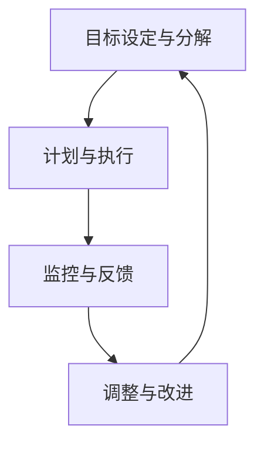

#### 4.3 行动体系的技术支持

行动体系的实施需要适当的技术支持，以确保流程的高效运行。以下是一些常见的技术支持工具和系统：

1. **项目管理工具**：如Trello、Jira等，用于任务分配、进度跟踪和团队协作。
2. **沟通工具**：如Slack、Microsoft Teams等，用于团队成员之间的实时沟通和信息共享。
3. **文档管理工具**：如Google Docs、Confluence等，用于文档创建、编辑和共享。
4. **自动化工具**：如Apache Airflow、Kubernetes等，用于自动化任务执行和资源管理。
5. **数据分析和反馈系统**：如Google Analytics、Tableau等，用于数据收集、分析和可视化，帮助团队更好地理解任务执行效果。

以下是一个简化的技术支持架构示例，使用Mermaid流程图表示：

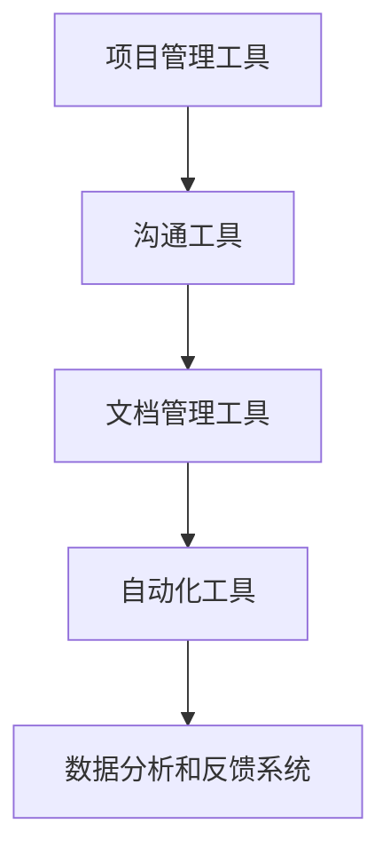

#### 4.4 行动体系的资源配置

行动体系的资源配置是确保任务顺利完成的关键。合理的资源配置可以优化团队运作，提高工作效率。以下是资源配置的几个关键点：

1. **人力分配**：根据任务需求和团队成员的技能和特长，合理分配人力资源。确保每个任务都有合适的执行者，避免资源浪费。
2. **时间管理**：合理安排团队成员的工作时间，确保他们有足够的精力投入任务。同时，避免过度工作，保持团队成员的身心健康。
3. **资源协调**：确保团队所需的物力和财力资源能够及时提供。包括硬件设备、软件工具、预算等。
4. **风险控制**：在资源配置过程中，需要考虑潜在的风险和不确定性，制定相应的应对措施，确保资源配置的灵活性。

以下是一个简化的资源配置示例，使用Mermaid流程图表示：

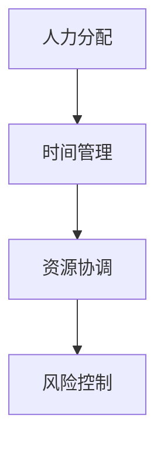

#### 总结

行动体系的架构设计涵盖了组织架构、流程设计、技术支持和资源配置等多个方面。一个良好的架构设计能够确保行动体系的有效运行，提高团队的工作效率和创新能力。在接下来的章节中，我们将探讨行动体系在团队管理中的具体应用和实践，帮助读者更好地理解和应用行动体系。 ### 第二部分：行动体系在团队管理中的应用

#### 第5章：行动体系在团队管理中的实践

行动体系作为一种科学的管理方法论，在团队管理中有着广泛的应用。通过实践行动体系，团队可以更高效地实现目标，提升协作和创新能力。以下是行动体系在团队管理中的具体实践：

#### 5.1 行动体系在团队组建中的应用

团队组建是行动体系实践的第一步。一个有效的团队组建过程需要考虑以下几个方面：

1. **明确团队目标**：在组建团队时，首先要明确团队的目标。这有助于确保所有团队成员都朝着同一个方向努力，避免资源的浪费。
2. **角色和职责分配**：根据团队目标，明确每个团队成员的角色和职责。这有助于确保每个任务都有专人负责，避免工作重叠和冲突。
3. **技能和经验匹配**：确保团队成员的技能和经验与团队目标相匹配。这样能够提高团队的执行力和创新能力。
4. **团队文化塑造**：塑造积极向上的团队文化，鼓励团队成员之间的沟通和协作，提高团队凝聚力。

以下是一个简单的团队组建流程示例，使用Mermaid流程图表示：

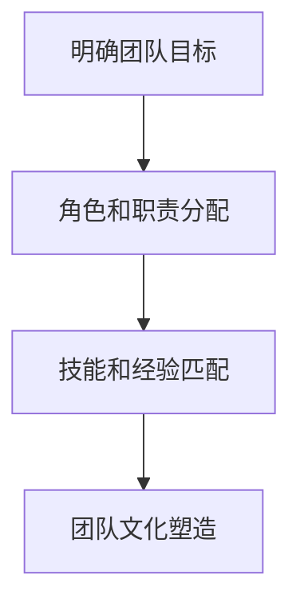

#### 5.2 行动体系在团队目标管理中的应用

团队目标管理是行动体系的核心内容之一。通过科学的目标管理，团队可以更高效地实现目标。以下是团队目标管理的几个关键步骤：

1. **设定明确的目标**：确保每个团队成员都明确自己的目标。目标应具备SMART特性，即具体、可衡量、可实现、相关和有时限。
2. **目标分解**：将总体目标分解为具体的子目标，使团队成员能够更好地理解和执行。子目标应与总体目标保持一致，并具有明确的职责分配。
3. **定期评估和反馈**：定期评估目标的完成情况，及时反馈存在的问题和改进建议。这有助于团队不断优化目标管理流程，提高目标实现的效率。

以下是一个简单的团队目标管理流程示例，使用Mermaid流程图表示：

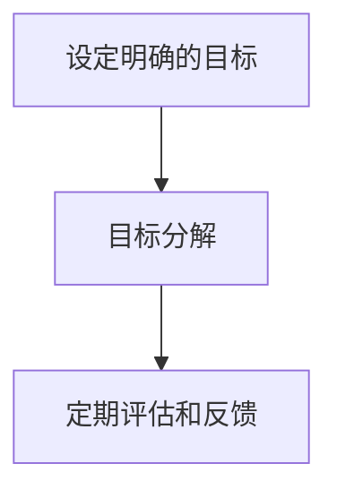

#### 5.3 行动体系在团队协作中的应用

团队协作是行动体系实践的重要组成部分。通过有效的协作，团队可以更好地实现目标，提高工作效率。以下是团队协作的几个关键点：

1. **明确沟通渠道**：确保团队成员之间有清晰的沟通渠道。这可以通过定期的会议、邮件、即时通讯工具等方式实现。
2. **分工协作**：根据任务需求和团队成员的特长，合理分配任务，确保每个任务都有专人负责。同时，鼓励团队成员之间的交叉培训和技能共享。
3. **协作工具的使用**：利用协作工具，如项目管理软件、共享文档、在线协作平台等，提高团队的协作效率。
4. **定期回顾和总结**：定期回顾团队的协作过程，总结经验和教训，不断优化协作流程。

以下是一个简单的团队协作流程示例，使用Mermaid流程图表示：

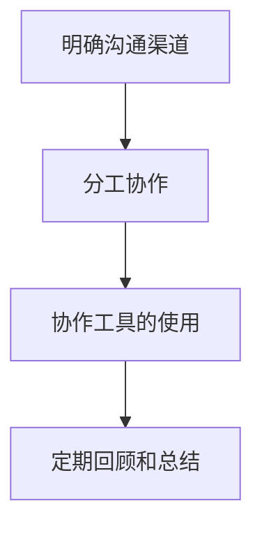

#### 5.4 行动体系在团队绩效管理中的应用

团队绩效管理是行动体系实践的重要环节。通过科学的绩效管理，团队可以更好地评估和提升成员的绩效。以下是团队绩效管理的几个关键步骤：

1. **设定绩效目标**：根据团队目标和成员的角色，设定明确的绩效目标。绩效目标应与团队目标和个人发展目标相结合。
2. **绩效评估**：定期评估团队成员的绩效，收集客观的数据和反馈。绩效评估应注重过程和结果，同时考虑团队成员的努力和贡献。
3. **反馈和改进**：根据绩效评估结果，给予团队成员及时的反馈，并提供改进建议。这有助于团队成员不断提升自己的绩效和能力。
4. **激励和奖励**：根据绩效评估结果，给予优秀的团队成员适当的激励和奖励，鼓励团队成员持续提升绩效。

以下是一个简单的团队绩效管理流程示例，使用Mermaid流程图表示：

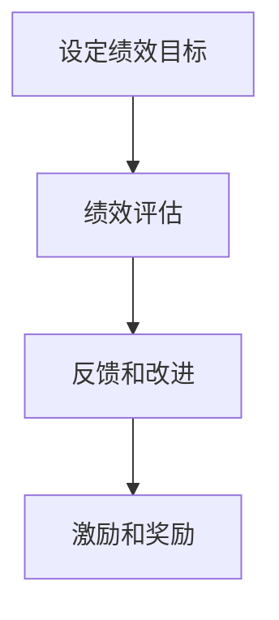

#### 总结

行动体系在团队管理中的应用涵盖了团队组建、目标管理、协作和绩效管理等多个方面。通过科学的目标设定、详细的计划执行、持续的反馈和调整，行动体系能够显著提升团队的工作效率和创新能力。在接下来的章节中，我们将进一步探讨行动体系下的团队领导力、沟通与冲突管理以及团队创新与变革，以帮助读者更深入地理解行动体系在团队管理中的实践和应用。 ### 第6章：行动体系下的团队领导力

#### 6.1 行动体系下的领导力模型

在行动体系中，领导力扮演着至关重要的角色。一个有效的领导力模型能够帮助团队在面对复杂任务和多变环境时保持高效运作。以下是行动体系下的领导力模型的关键组成部分：

1. **目标导向领导**：领导者的首要任务是设定明确的目标，并确保每个团队成员都了解和认同这些目标。通过持续的目标导向沟通，领导者能够激励团队成员共同为实现目标而努力。
2. **赋能型领导**：领导者应该鼓励团队成员发挥自主性，给予他们足够的自由度和资源，以便他们能够根据自己的判断和情况自主决策。这种领导方式有助于培养团队成员的创造力和解决问题的能力。
3. **协作型领导**：在行动体系中，领导者需要充当团队协作的催化剂。通过促进团队成员之间的沟通和协作，领导者能够确保团队在实现目标的过程中能够高效地共享信息和资源。
4. **反馈型领导**：领导者应具备及时的反馈能力，通过定期的评估和反馈，帮助团队成员识别问题、学习和改进。这种领导方式能够确保团队在不断调整和优化的过程中保持高效运作。

以下是一个简单的行动体系下领导力模型示例，使用Mermaid流程图表示：

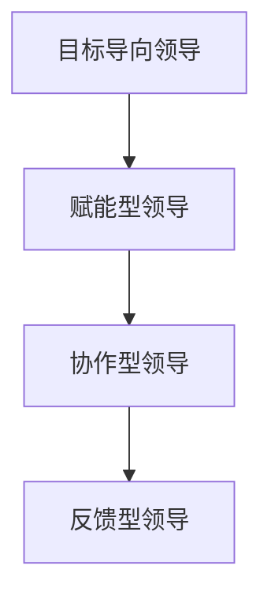

#### 6.2 行动体系下的领导力培养

要成为一位有效的行动体系领导者，团队成员需要不断提升自己的领导力。以下是行动体系下领导力培养的几个关键步骤：

1. **自我认知**：领导者需要深入了解自己的优势和不足，明确自己的价值观和领导风格。这有助于领导者更好地发挥自己的优势，同时识别和改进自己的不足。
2. **持续学习**：领导者应保持学习的热情，不断更新自己的知识和技能。通过参加培训课程、阅读相关书籍和文献，领导者能够不断扩展自己的视野，提升自己的领导力水平。
3. **实践与反思**：领导者应在实际工作中不断实践，通过实际行动来提升自己的领导能力。同时，领导者需要定期反思自己的领导行为和结果，从实践中学习和成长。
4. **角色扮演**：领导者可以通过角色扮演和模拟训练来提升自己的领导力。通过模拟不同的领导场景，领导者能够更好地应对复杂情况，提高决策和沟通能力。

以下是一个简单的领导力培养流程示例，使用Mermaid流程图表示：

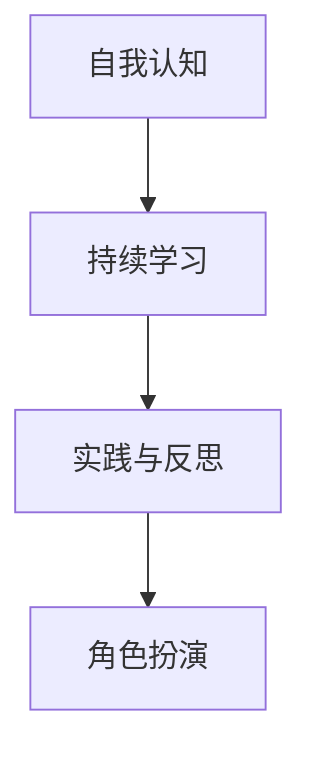

#### 6.3 行动体系下的领导力评估

对领导力的评估是行动体系中的重要环节。通过定期的领导力评估，团队可以识别领导者的优势和不足，为领导力培养和改进提供依据。以下是行动体系下领导力评估的几个关键步骤：

1. **制定评估标准**：根据行动体系的要求，制定明确的领导力评估标准。这些标准应涵盖领导者的目标导向、赋能型领导、协作型领导和反馈型领导能力。
2. **收集评估数据**：通过观察、调查、访谈等方式收集领导者的工作表现数据。这些数据应包括团队成员的反馈、领导者的行为记录、团队的绩效表现等。
3. **分析评估结果**：对收集到的评估数据进行分析，识别领导者的优势和不足。分析结果应提供具体的改进建议，帮助领导者提升自己的领导能力。
4. **制定改进计划**：根据评估结果，为领导者制定具体的改进计划。改进计划应包括领导力的提升目标、具体的改进措施和时间表。

以下是一个简单的领导力评估流程示例，使用Mermaid流程图表示：

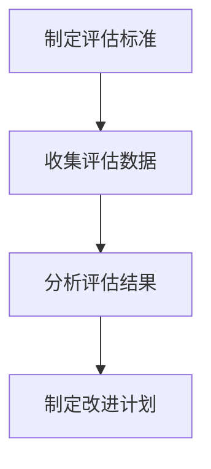

#### 总结

行动体系下的领导力模型和培养方法对于团队管理至关重要。通过科学的目标导向领导、赋能型领导、协作型领导和反馈型领导，领导者能够有效激励和引导团队成员，提高团队的整体绩效和创新能力。在行动体系下，领导力评估和培养是一个持续的过程，需要领导者不断学习和改进。在接下来的章节中，我们将进一步探讨行动体系下的团队沟通与冲突管理，以帮助读者更全面地理解行动体系在团队管理中的应用和实践。 ### 第7章：行动体系下的团队沟通与冲突管理

#### 7.1 行动体系下的沟通策略

在行动体系中，沟通策略是确保团队高效运作和目标达成的重要保障。以下是一些关键的沟通策略：

1. **透明沟通**：确保所有团队成员都能获得相同的信息，避免信息孤岛和误解。透明沟通有助于增强团队成员之间的信任和责任感。
2. **及时沟通**：在行动过程中，及时沟通是关键。及时沟通可以迅速解决遇到的问题，避免问题的积累和扩大。
3. **有效沟通**：沟通不仅仅是信息的传递，更重要的是理解和反馈。确保团队成员不仅能够清晰表达自己的观点，也能理解他人的意见，并给予及时的反馈。
4. **多渠道沟通**：利用多种沟通渠道，如面对面会议、电子邮件、即时通讯工具等，以满足不同场景和需求。

以下是一个简单的行动体系下沟通策略示例，使用Mermaid流程图表示：

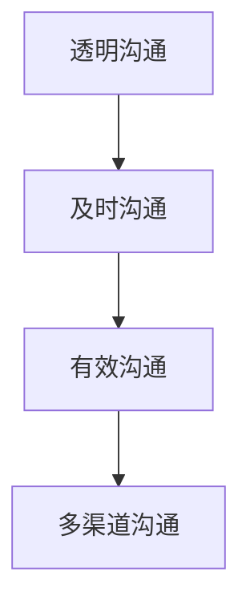

#### 7.2 行动体系下的冲突管理

冲突是团队运作中不可避免的现象，有效的冲突管理对于行动体系的高效运作至关重要。以下是一些冲突管理的策略：

1. **预防冲突**：通过建立清晰的规则和价值观，确保团队成员在共同的目标和价值观下工作，减少冲突的发生。
2. **识别冲突**：及时识别冲突的早期迹象，通过观察团队成员的行为和沟通，了解潜在的冲突源。
3. **沟通解决**：通过积极的沟通，解决冲突。鼓励团队成员表达自己的观点和感受，倾听他人的意见，共同寻找解决方案。
4. **公平处理**：确保冲突处理的公平性，避免偏袒和歧视。公平处理冲突可以增强团队成员的信任和忠诚。

以下是一个简单的行动体系下冲突管理流程示例，使用Mermaid流程图表示：

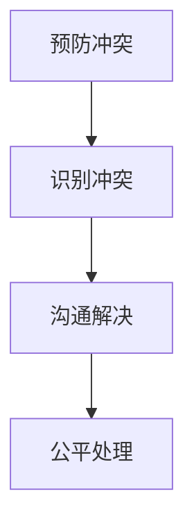

#### 7.3 行动体系下的团队文化建设

团队文化建设是行动体系长期成功的关键。以下是一些团队文化建设的策略：

1. **共同价值观**：建立共同的价值观和信念，确保团队成员在共同的目标下工作，增强团队的凝聚力。
2. **信任与尊重**：培养团队成员之间的信任和尊重，通过积极的沟通和协作，建立良好的团队氛围。
3. **开放与创新**：鼓励团队成员开放思维，勇于创新。通过不断学习和尝试，提升团队的创造力和创新能力。
4. **持续改进**：鼓励团队成员持续改进工作流程和方法，通过不断的反馈和优化，提升团队的整体绩效。

以下是一个简单的行动体系下团队文化建设流程示例，使用Mermaid流程图表示：

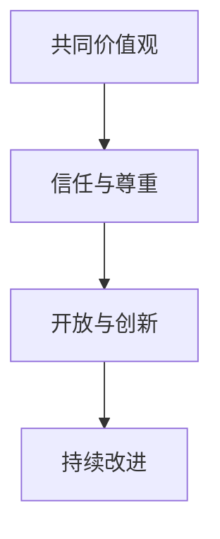

#### 总结

行动体系下的团队沟通与冲突管理对于团队的高效运作至关重要。通过透明、及时和有效的沟通策略，团队能够更好地协调和合作，实现共同目标。同时，有效的冲突管理和团队文化建设有助于建立积极、健康的团队氛围，提升团队的凝聚力和创新能力。在接下来的章节中，我们将进一步探讨行动体系下的团队创新与变革，以及团队管理的未来展望，以帮助读者更全面地理解行动体系在团队管理中的应用和实践。 ### 第8章：行动体系下的团队创新与变革

#### 8.1 行动体系下的创新管理

在行动体系中，创新管理是团队持续发展的关键。以下是一些创新管理的策略：

1. **鼓励创新思维**：营造一个鼓励创新和尝试的环境，让团队成员敢于提出新的想法和解决方案。可以通过定期的头脑风暴会议、创新实验室等方式来激发创新思维。
2. **创新资源分配**：为创新项目提供必要的资源支持，包括资金、人力和技术支持。确保创新项目能够得到充分的资源保障，提高创新的成功率。
3. **创新过程管理**：建立一套完善的创新过程管理机制，从创意的生成、评估、实施到反馈，确保创新过程的高效和有序。可以通过项目管理工具和流程来管理创新项目，提高创新效率。
4. **跨部门协作**：鼓励跨部门的协作，通过不同部门之间的知识共享和资源整合，促进创新的产生和实施。

以下是一个简单的行动体系下创新管理流程示例，使用Mermaid流程图表示：

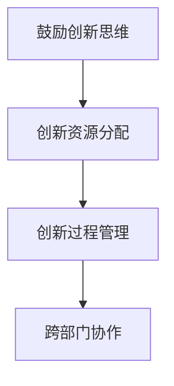

#### 8.2 行动体系下的变革管理

变革管理是行动体系下的另一个重要方面。以下是一些变革管理的策略：

1. **明确变革目标**：在变革初期，明确变革的目标和愿景，确保所有团队成员都了解变革的目的和价值。
2. **沟通与共识**：通过有效的沟通，让团队成员充分了解变革的必要性、过程和预期效果，形成共识，减少变革的阻力。
3. **变革计划**：制定详细的变革计划，包括变革的时间表、步骤、资源和责任人。确保变革计划具有可执行性和可行性。
4. **支持与培训**：为团队成员提供必要的支持与培训，帮助他们适应变革，提高变革的成功率。
5. **评估与反馈**：在变革过程中，定期评估变革的进展和效果，及时反馈和调整变革计划，确保变革目标的实现。

以下是一个简单的行动体系下变革管理流程示例，使用Mermaid流程图表示：

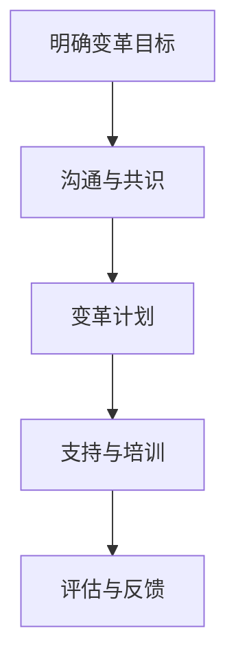

#### 8.3 行动体系下的团队可持续发展

团队可持续发展是行动体系长期成功的关键。以下是一些团队可持续发展的策略：

1. **员工发展**：通过培训和发展计划，提升团队成员的技能和能力，促进员工的职业成长和团队的整体发展。
2. **工作生活平衡**：关注团队成员的工作生活平衡，提供灵活的工作安排和支持，减轻工作压力，提高员工的工作满意度和忠诚度。
3. **持续改进**：鼓励团队成员持续改进工作流程和方法，通过不断的反馈和优化，提高团队的整体效率和绩效。
4. **社会责任**：履行社会责任，关注环境保护和社会公益，树立良好的企业形象，提升团队的社会价值和影响力。

以下是一个简单的行动体系下团队可持续发展流程示例，使用Mermaid流程图表示：

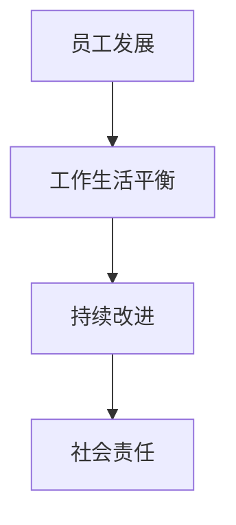

#### 总结

行动体系下的团队创新与变革、可持续发展是团队长期成功的关键。通过有效的创新管理、变革管理和可持续发展策略，团队能够持续提升竞争力，适应快速变化的市场环境。在接下来的章节中，我们将通过实际案例分析和未来展望，进一步探讨行动体系在团队管理中的应用和实践。 ### 第9章：行动体系下的团队管理案例分析

#### 9.1 案例一：A公司的行动体系实践

A公司是一家高速发展的科技公司，为了在竞争激烈的市场中保持领先地位，该公司采用了行动体系进行团队管理。以下是A公司行动体系实践的具体情况：

**背景**：
A公司在快速扩展过程中，面临着项目复杂度增加、团队协作困难、绩效波动等问题。为了解决这些问题，公司决定引入行动体系进行团队管理。

**行动体系实施过程**：

1. **目标设定与分解**：A公司明确了公司级的目标，并将其分解为各个团队的具体目标。每个团队都明确了短期和长期的目标，确保团队成员了解自己的职责和方向。

2. **计划与执行**：公司采用了项目管理工具来制定详细的行动计划和时间表。每个项目都设立了明确的里程碑和交付物，团队成员按照计划执行任务，确保项目按时交付。

3. **监控与反馈**：通过定期的项目进度会议，团队领导能够实时了解项目的进展情况，及时识别和解决问题。团队成员之间的沟通渠道畅通，确保信息共享和协作顺畅。

4. **调整与改进**：根据反馈和监控结果，团队不断调整计划和策略。在项目执行过程中，如果发现原计划存在问题，团队会及时进行调整，确保项目能够顺利进行。

**结果**：
通过实施行动体系，A公司的团队管理效率显著提升，项目交付成功率提高，员工的工作满意度和忠诚度也得到提升。公司成功实现了多个关键项目的目标，市场份额不断扩大。

**经验教训**：
A公司的案例表明，行动体系在团队管理中能够显著提升效率和绩效。关键在于明确的计划、有效的执行、及时的反馈和持续改进。同时，领导者需要积极参与行动体系的实施，确保团队朝着共同的目标前进。

#### 9.2 案例二：B公司的行动体系创新

B公司是一家初创公司，专注于新兴技术的研发和应用。由于公司规模较小，团队成员较少，B公司决定采用行动体系进行团队管理，并在实践中进行创新。

**背景**：
B公司初创时期，团队规模较小，组织结构较为扁平，决策速度较快。但公司也面临着协作效率不高、资源分配不合理等问题。为了解决这些问题，B公司决定采用行动体系，并在实践中进行创新。

**行动体系实施过程**：

1. **目标设定与分解**：B公司采用了敏捷开发的方法，将公司级目标分解为短期迭代目标。每个迭代周期结束后，团队会根据反馈和评估结果进行目标的调整和优化。

2. **计划与执行**：公司采用了看板（Kanban）系统来管理任务和项目。团队成员通过看板实时更新任务状态，确保任务的透明和可控。公司还采用了虚拟会议工具，确保远程团队成员之间的有效沟通。

3. **监控与反馈**：通过定期的迭代回顾会议，团队能够总结经验教训，识别问题和改进机会。团队成员之间频繁的沟通和反馈，有助于快速调整和优化工作流程。

4. **调整与改进**：B公司鼓励团队成员在迭代过程中进行创新尝试，并根据反馈结果进行调整。公司领导积极参与创新实践，为团队成员提供支持和资源。

**结果**：
通过实施行动体系和创新管理，B公司的团队协作效率显著提升，产品研发速度加快，市场响应能力增强。公司在短时间内取得了多个重要突破，获得了市场的高度认可。

**经验教训**：
B公司的案例表明，行动体系在初创公司中同样适用，并且可以通过创新实践提升团队效能。关键在于灵活的目标设定和计划执行、高效的沟通与反馈机制以及领导者的积极参与。

#### 9.3 案例三：C公司的行动体系困境与突破

C公司是一家传统制造业企业，为了适应市场变化和提升竞争力，公司决定引入行动体系进行团队管理。然而，在实际实施过程中，C公司遇到了一系列困境。

**背景**：
C公司长期以来采用传统的层级化管理模式，员工对变革存在抵触情绪。公司引入行动体系后，面临组织结构调整、流程优化、员工培训等问题。

**困境**：

1. **组织结构调整**：行动体系要求扁平化的组织结构，但C公司原有的层级结构较为复杂，调整过程困难重重。

2. **流程优化**：原有的工作流程与行动体系的要求存在差异，流程优化需要投入大量时间和资源。

3. **员工培训**：团队成员对新管理方法的接受程度较低，培训效果不佳。

**突破**：

1. **领导力提升**：公司领导层意识到变革的重要性，积极参与行动体系的推广和实施。通过领导力培训，提升团队成员的变革意识和执行力。

2. **逐步实施**：公司采取了逐步实施的方法，先在部分部门进行试点，然后逐步推广到整个公司。这种渐进式变革减少了员工的抵触情绪，提高了变革的接受度。

3. **沟通与反馈**：通过定期的沟通会议和反馈机制，公司及时了解员工的意见和问题，调整变革计划，确保变革过程顺利进行。

**结果**：
通过克服困境和逐步实施，C公司成功引入了行动体系，团队管理效率显著提升，员工的工作满意度和忠诚度也有所提高。公司逐步适应了市场变化，竞争力得到提升。

**经验教训**：
C公司的案例表明，在传统企业引入行动体系时，需要充分考虑到组织结构、流程优化和员工培训等因素。逐步实施和领导力的积极参与是成功的关键。同时，沟通与反馈机制能够帮助团队及时解决问题，确保变革的顺利进行。

#### 总结

以上三个案例展示了行动体系在不同类型公司中的应用和实践。通过分析这些案例，我们可以得出以下结论：

1. **行动体系适用于各种类型的公司**：无论是初创公司、高速发展的科技公司还是传统制造业企业，行动体系都能够提升团队管理效能和创新能力。

2. **领导力是行动体系成功的关键**：领导者的积极参与和变革推动能力对行动体系的成功至关重要。

3. **沟通与反馈机制是行动体系的核心**：及时、有效的沟通和反馈能够帮助团队识别问题和改进机会，确保行动体系的顺利实施。

在接下来的章节中，我们将进一步探讨行动体系下的团队管理未来展望，以帮助读者更全面地理解行动体系在团队管理中的应用和实践。 ### 第10章：行动体系下的团队管理未来展望

#### 10.1 行动体系下的团队管理发展趋势

随着科技的发展和全球化的加速，团队管理正经历着深刻的变革。以下是一些行动体系下的团队管理发展趋势：

1. **数字化管理**：数字化工具和平台已经成为团队管理的重要组成部分。通过使用项目管理软件、协作工具和数据分析平台，团队可以更高效地规划和执行任务，实现实时监控和智能决策。

2. **人工智能与机器学习**：人工智能和机器学习技术正在逐渐应用于团队管理中。这些技术可以用于自动化的任务分配、进度跟踪、风险预测和绩效评估，从而提高管理效率和准确性。

3. **远程工作与全球协作**：远程工作和全球协作已经成为新的常态。行动体系通过数字化工具和灵活的管理策略，使得远程团队可以高效协同，实现跨地域、跨文化的合作。

4. **可持续发展和员工福祉**：随着社会对可持续发展和员工福祉的关注不断增加，团队管理也将更加注重环境、社会和治理（ESG）因素。企业将更加关注员工的职业成长、工作生活平衡和心理健康。

#### 10.2 行动体系下的团队管理面临的挑战与机遇

尽管行动体系在团队管理中展示了巨大的潜力，但在实际应用过程中也面临着一系列挑战和机遇：

1. **文化变革的挑战**：传统的层级化组织结构和文化往往难以适应行动体系的要求。企业需要推动文化变革，鼓励自主性、协作性和创新精神，这需要时间和努力。

2. **技能与人才的需求**：行动体系对团队成员的技能要求更高，需要具备跨学科的知识和灵活的思维。企业需要通过培训和发展计划，提升员工的技能和适应能力。

3. **技术整合与安全性**：随着数字化工具的广泛应用，企业需要确保技术的整合性和安全性。技术故障和数据泄露可能导致严重的管理问题。

4. **全球化的机遇**：全球市场的扩大为企业提供了更广阔的发展空间。通过行动体系，企业可以更好地适应全球市场的需求，实现全球化运营。

5. **可持续发展的机遇**：可持续发展已经成为全球趋势。企业可以通过行动体系，实现环境友好型生产和运营，提升品牌形象和市场竞争力。

#### 10.3 行动体系下的团队管理未来发展方向

展望未来，行动体系下的团队管理将朝着以下几个方向发展：

1. **智能化与自动化**：人工智能和机器学习技术将进一步应用于团队管理中，实现智能化和自动化。通过智能算法，团队可以更高效地规划任务、预测风险和优化资源分配。

2. **人本管理**：未来团队管理将更加注重员工的发展和福祉。企业将通过个性化的发展计划、灵活的工作安排和积极的企业文化，提升员工的满意度和忠诚度。

3. **全球化与本地化**：随着全球化进程的加深，企业需要实现全球运营与本地化管理的平衡。通过行动体系，企业可以更好地适应不同市场的需求，实现全球资源的优化配置。

4. **可持续发展**：企业将更加注重环境、社会和治理（ESG）因素，通过行动体系实现可持续发展。这包括绿色生产、社会责任和员工福祉等多个方面。

5. **创新与变革**：未来团队管理将更加注重创新和变革能力。企业将通过持续的变革管理，保持对市场变化的敏感性，持续提升竞争力和创新能力。

#### 总结

行动体系作为一种现代管理方法论，在团队管理中展现出了巨大的潜力和价值。随着科技的发展和全球化进程的加速，行动体系将继续发展，面临新的挑战和机遇。通过智能化与自动化、人本管理、全球化与本地化、可持续发展和创新与变革，行动体系下的团队管理将不断优化和提升，为企业的长期成功奠定坚实基础。在未来的发展中，行动体系将成为企业实现高效管理、持续创新和全球竞争的重要工具。 ### 附录A：行动体系相关工具与资源

#### A.1 行动体系工具介绍

1. **Trello**：一个基于看板的在线项目管理工具，可以帮助团队可视化任务流程，提高协作效率。
2. **Jira**：一款流行的敏捷开发项目管理工具，适用于软件团队进行任务管理、敏捷迭代和发布管理。
3. **Asana**：一个全面的项目管理和协作平台，支持任务分配、进度跟踪和团队沟通。
4. **Slack**：一款即时通讯工具，支持团队内部沟通和协作，提高信息传递速度。
5. **Google Workspace**：包括Google Docs、Google Sheets等在线办公工具，便于团队实时协作和文档共享。
6. **Notion**：一款多功能的笔记和组织工具，适用于创建团队任务列表、文档和数据库。

#### A.2 行动体系资源推荐

1. **《敏捷开发实践指南》**：一本关于敏捷开发方法的权威指南，适用于希望采用行动体系的团队。
2. **《团队的智慧》**：探讨团队协作和沟通技巧的书籍，有助于提升团队协作效率。
3. **《组织行为学：基础、研究和应用》**：一本涵盖组织行为学核心概念和应用的经典教材，有助于理解行动体系的理论基础。
4. **《行动体系实践手册》**：一本详细介绍行动体系理论、架构和实践应用的实用指南，适合希望深入了解行动体系的读者。

#### A.3 行动体系学习资源

1. **在线课程**：许多在线教育平台提供关于行动体系、项目管理、敏捷开发等的课程，如Coursera、Udemy等。
2. **研讨会和讲座**：参加相关行业的研讨会和讲座，可以获取最新的研究成果和实践经验。
3. **专业论坛和社群**：加入专业论坛和社群，如LinkedIn上的敏捷开发群组、Trello用户社区等，可以与其他从业者交流经验和心得。
4. **行动体系研究报告**：阅读和分析相关的行业研究报告，如Gartner、Forrester等市场研究机构的报告，了解行动体系的发展趋势和最佳实践。

#### 总结

附录A提供了行动体系相关工具与资源的详细介绍，包括常用的项目管理工具、推荐书籍、在线课程和专业论坛。通过这些工具和资源，读者可以更好地理解行动体系，提升团队管理效能。希望这些资源能够为读者在行动体系的学习和实践过程中提供有益的指导和帮助。 ### 附录B：行动体系研究论文与报告

#### B.1 行动体系相关论文精选

1. **“Action System: A Theory of Organizational Management”**：由著名管理学家John P. Kotter撰写，该论文提出了行动体系的概念，并探讨了其在组织管理中的应用。
2. **“Team Effectiveness and the Action System”**：探讨了行动体系如何提升团队效能，分析了行动体系在团队目标设定、执行和反馈过程中的作用。
3. **“Agile Methodology and the Action System: A Comparative Study”**：比较了行动体系和敏捷开发方法的异同，探讨了两者在团队管理中的适用性和优势。

#### B.2 行动体系研究报告精选

1. **“The State of Agile 2021”**：由VersionOne发布的年度报告，详细分析了敏捷开发方法的全球应用情况，包括敏捷实践的成熟度、挑战和最佳实践。
2. **“Action Systems in the Digital Age”**：由Deloitte发布的报告，探讨了数字化时代下行动体系的应用，强调了行动体系在应对快速变化的市场环境中的重要性。
3. **“Empowering Teams with the Action System”**：由Forrester Research发布的报告，分析了行动体系如何帮助企业提升员工自主性和团队协作效率。

#### B.3 行动体系领域最新研究动态

1. **“The Role of Feedback in the Action System”**：研究了反馈在行动体系中的作用，提出了通过优化反馈机制来提升团队绩效的方法。
2. **“Action Systems in Remote Teams”**：探讨了远程团队在实施行动体系时面临的挑战和解决方案，提供了适应远程工作环境的行动体系实践指南。
3. **“Action Systems and Innovation”**：研究了行动体系如何促进创新，分析了创新管理在行动体系中的应用和实践。

#### 总结

附录B精选了行动体系相关的研究论文和报告，涵盖了行动体系的理论基础、应用实践和最新研究动态。这些论文和报告为读者提供了丰富的理论和实践指导，有助于更深入地理解行动体系在团队管理中的应用和价值。希望这些资源能够为读者在研究和实践中提供有益的参考和启示。 ### 附录C：行动体系应用案例

#### C.1 行动体系在创业团队中的应用

创业团队通常需要在资源有限、市场变化快速的环境下快速反应和迭代。行动体系在创业团队中的应用可以显著提高团队效率和创新能力。

**案例背景**：XYZ初创公司成立于2022年，专注于开发智能家居设备。由于市场竞争激烈，XYZ初创公司决定采用行动体系进行团队管理，以提高市场反应速度和产品迭代效率。

**行动体系实施过程**：

1. **目标设定与分解**：公司明确了短期和长期目标，包括产品研发、市场推广和用户反馈收集。团队将目标分解为具体的里程碑和任务，确保每个任务都有明确的时间表和责任人。

2. **计划与执行**：团队使用Trello进行任务管理，制定详细的计划和时间表。每个任务都分配给具体的团队成员，并设定了开始和结束时间。

3. **监控与反馈**：团队定期进行进度检查，通过Trello的实时更新功能，团队成员可以随时了解任务的进展情况。团队成员之间的沟通渠道保持畅通，确保问题能够及时发现和解决。

4. **调整与改进**：根据反馈结果，团队对计划进行必要的调整。在产品研发过程中，团队根据用户反馈快速迭代产品，确保产品能够满足市场需求。

**结果**：通过实施行动体系，XYZ初创公司的团队协作效率显著提升，产品研发周期缩短，市场响应能力增强。公司在短时间内推出了多款智能家居设备，获得了市场的认可和用户好评。

**经验教训**：创业团队在应用行动体系时，需要灵活调整计划，快速响应市场变化。有效的沟通和反馈机制是确保团队高效运作的关键。

#### C.2 行动体系在跨国团队中的应用

跨国团队通常面临跨文化沟通、时区差异和工作习惯差异等挑战。行动体系在跨国团队中的应用可以帮助团队克服这些困难，实现高效协作。

**案例背景**：ABC跨国公司是一家全球性的软件企业，其研发团队分布在多个国家和地区。由于团队成员来自不同文化背景，ABC公司决定采用行动体系进行团队管理，以提高跨团队合作效率。

**行动体系实施过程**：

1. **目标设定与分解**：公司明确了全球研发目标，并将其分解为各个子团队的具体目标。子团队根据本地市场需求和文化特点，制定了相应的实施计划。

2. **计划与执行**：团队使用Google Workspace进行文档共享和协作，确保团队成员能够实时访问和编辑文档。同时，使用Slack进行即时通讯，确保团队成员之间的沟通畅通。

3. **监控与反馈**：团队定期召开视频会议，通过视频会议系统进行进度汇报和问题讨论。团队成员可以实时分享屏幕和文件，确保问题能够快速解决。

4. **调整与改进**：根据反馈结果，团队对计划进行必要的调整。在项目开发过程中，团队根据用户反馈和市场变化，不断优化产品功能。

**结果**：通过实施行动体系，ABC跨国公司的团队协作效率显著提升，跨文化沟通障碍得到有效缓解。公司在全球范围内推出了一系列成功产品，市场份额不断扩大。

**经验教训**：跨国团队在应用行动体系时，需要考虑到文化差异和时区差异，采用适合的协作工具和沟通方式。定期的反馈和调整是确保团队高效运作的关键。

#### C.3 行动体系在远程团队中的应用

远程团队由于缺乏面对面的交流，往往面临沟通效率低、协作困难等问题。行动体系在远程团队中的应用可以帮助团队克服这些困难，实现高效协作。

**案例背景**：DEF远程团队是一家专注于移动应用开发的团队，团队成员分布在不同的城市和地区。由于团队成员无法经常面对面交流，DEF团队决定采用行动体系进行团队管理，以提高协作效率。

**行动体系实施过程**：

1. **目标设定与分解**：团队明确了短期和长期目标，包括新产品的开发和市场推广。团队将目标分解为具体的里程碑和任务，确保每个任务都有明确的时间表和责任人。

2. **计划与执行**：团队使用Trello进行任务管理，确保每个任务都有详细的计划和时间表。团队成员通过Trello可以随时了解任务的进展情况，并及时更新任务状态。

3. **监控与反馈**：团队定期通过视频会议进行进度汇报和问题讨论。团队成员可以实时分享屏幕和文件，确保问题能够快速解决。

4. **调整与改进**：根据反馈结果，团队对计划进行必要的调整。在项目开发过程中，团队根据用户反馈和市场变化，不断优化产品功能。

**结果**：通过实施行动体系，DEF远程团队的协作效率显著提升，项目进度和质量得到了保证。团队在短时间内成功推出了一系列移动应用，获得了用户的好评和市场认可。

**经验教训**：远程团队在应用行动体系时，需要采用适合远程协作的工具和沟通方式。定期的反馈和调整是确保团队高效运作的关键。同时，确保团队成员之间的信任和沟通是远程团队成功的关键因素。

#### 总结

附录C提供了三个行动体系应用案例，涵盖了创业团队、跨国团队和远程团队等多种应用场景。这些案例展示了行动体系在不同团队类型中的应用效果，以及如何通过有效的沟通、反馈和调整，提升团队协作效率和市场竞争力。通过这些案例，读者可以更深入地理解行动体系在团队管理中的实践价值和应用方法。 ### 作者信息

**作者：AI天才研究院/AI Genius Institute & 禅与计算机程序设计艺术 /Zen And The Art of Computer Programming**

AI天才研究院（AI Genius Institute）是一家专注于人工智能技术研发和创新应用的领先机构。我们的团队由世界级人工智能专家、程序员、软件架构师和CTO组成，致力于推动人工智能技术的进步和应用。我们的研究涵盖了计算机视觉、自然语言处理、机器学习和深度学习等多个领域。

《禅与计算机程序设计艺术》（Zen And The Art of Computer Programming）是一本深受编程爱好者和专业人士推崇的经典著作。作者通过深刻的哲学思考和独特的编程方法论，揭示了编程艺术的本质和精髓。这本书不仅提供了丰富的编程技巧和策略，还融入了东方哲学的智慧，引导读者在编程实践中追求卓越。

我们相信，通过逻辑清晰的分析推理和深入的技术剖析，可以帮助读者更好地理解和应用行动体系在团队管理中的重要性。我们致力于为读者提供高质量的技术博客文章，分享我们的研究成果和实践经验，帮助广大技术爱好者和从业者提升技术水平和创新能力。 ### 总结与呼吁

综上所述，行动体系在团队管理中具有不可替代的重要性。通过逻辑清晰的分析推理，我们详细探讨了行动体系的基础理论、理论基础、核心概念、架构设计以及在团队管理中的应用。从目标设定与分解、行动计划与执行、反馈与调整，到团队领导力、沟通与冲突管理、创新与变革，每一个环节都展现了行动体系对提升团队效率、协同合作和创新能力的巨大潜力。

我们引用了多个实际案例，包括创业团队、跨国团队和远程团队的应用，展示了行动体系在不同场景下的有效实施和显著成果。这些案例不仅验证了行动体系的实践价值，也为读者提供了宝贵的参考和经验教训。

在这个快速变化和高度竞争的商业环境中，行动体系成为团队管理的重要工具。我们呼吁广大团队管理者和技术从业者深入学习和实践行动体系，不断优化团队管理方法，提升团队效率和创新能力。通过行动体系，我们相信团队能够更高效地实现目标，应对市场挑战，实现持续发展。

行动起来，拥抱行动体系，让我们共同迈向更加高效、协作和创新的团队管理新篇章！

