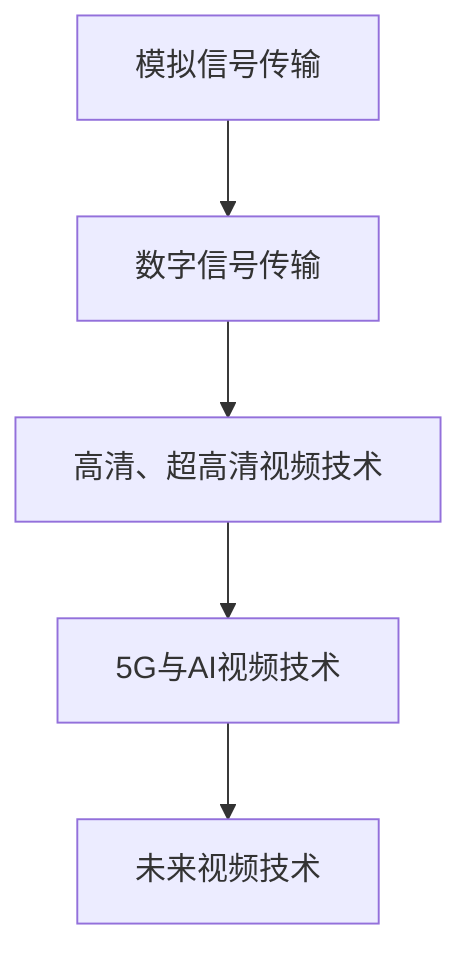
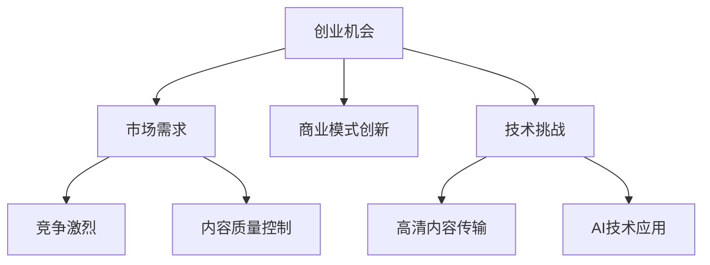
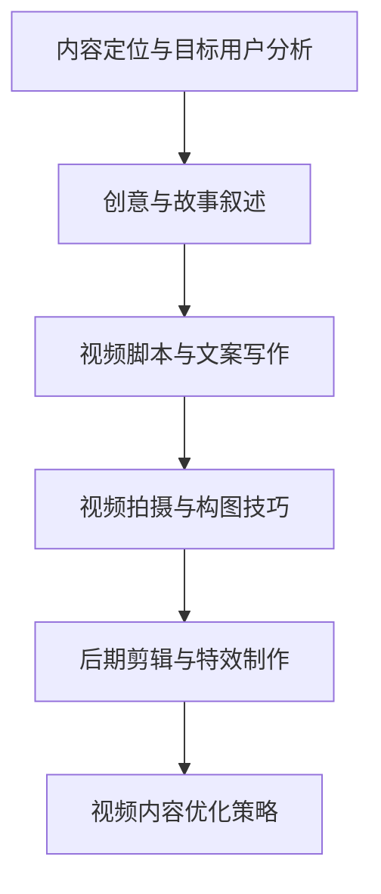
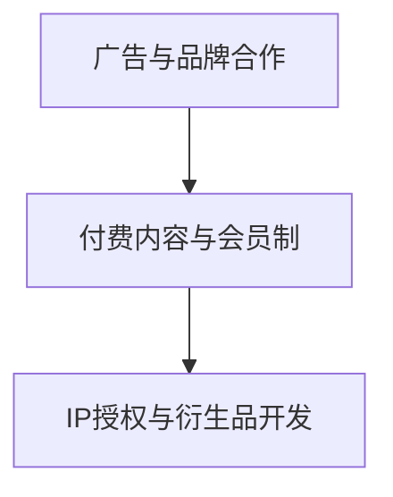

                 

### 第1章 视频创业背景与趋势

#### 1.1 视频行业的崛起

##### 1.1.1 视频产业的历史与发展

视频产业作为信息技术与娱乐产业的重要组成部分，经历了从模拟到数字、从标准到高清的多次技术变革。回顾其发展历程，我们可以将其划分为以下几个阶段：

1. **模拟信号传输时代**：

   - **早期视频技术**：20世纪50年代，视频技术开始萌芽。电视广播成为家庭娱乐的主要形式，视频制作技术逐渐成熟。
   - **黑白电视与录像带**：70年代，黑白电视开始普及，录像带的发明（如VHS和BetaMax）使得视频录制和播放成为家庭娱乐的重要部分。

2. **数字信号传输时代**：

   - **数字视频标准的兴起**：80年代，随着计算机技术的进步，数字视频技术开始出现。数字信号传输取代了模拟信号传输，提高了视频的质量和稳定性。
   - **DVD和数字录像机**：90年代，DVD的普及标志着数字视频内容的标准化和高质量播放。

3. **高清与超高清时代**：

   - **高清电视**：2000年代，随着HDTV（高清晰度电视）的推广，电视分辨率大幅提升，观众对视频质量的要求不断提高。
   - **4K与8K视频**：近年来，随着4K和8K超高清视频技术的发展，视频产业迎来了更高分辨率的浪潮。这些技术不仅提升了图像质量，还提供了更好的沉浸式体验。

##### 1.1.2 视频产业的经济价值

视频产业不仅是一个技术驱动型产业，也是一个充满经济价值的产业。以下是视频产业经济价值的一些方面：

1. **产业链价值分配**：

   - **制作环节**：视频内容制作是视频产业的核心，涉及到剧本创作、导演、演员、摄像等多个环节。
   - **分发环节**：视频内容的分发包括网络平台、电视台、电影院等多种渠道，每个渠道都有其独特的商业模式和利润来源。
   - **播放环节**：观众通过不同的播放设备观看视频内容，如电视机、电脑、移动设备等，形成了庞大的消费市场。

2. **收入来源**：

   - **广告收入**：广告是视频平台的主要收入来源之一，通过展示广告来吸引用户，从而为企业带来收益。
   - **版权销售**：视频内容的版权销售包括DVD、蓝光光盘等物理介质销售，以及网络版权销售，如Netflix、Amazon Prime等。
   - **付费订阅**：一些视频平台提供付费订阅服务，用户需支付费用才能观看特定内容。

3. **就业机会与经济增长**：

   - **就业机会**：视频产业涉及多个领域，包括影视制作、广告、营销、技术支持等，提供了大量的就业机会。
   - **经济增长**：视频产业作为数字经济的重要组成部分，对GDP的增长贡献显著。

##### 1.1.3 视频产业的发展趋势

视频产业正面临着快速的发展和变革，以下是一些主要的发展趋势：

1. **内容多样化**：

   - **短视频**：短视频平台如抖音、快手等的兴起，改变了用户消费视频内容的方式。
   - **直播电商**：直播带货成为电商新风口，用户可以在观看直播的同时购买商品。
   - **知识付费**：以知识类内容为主的付费平台，如得到、喜马拉雅等，满足了用户对专业知识的追求。

2. **技术创新**：

   - **5G技术**：5G网络的普及将极大地提升视频传输速度和稳定性，为高清、超高清视频的普及提供基础设施。
   - **人工智能**：人工智能技术在视频内容创作、推荐、交互等方面有着广泛的应用，提高了用户体验和运营效率。
   - **虚拟现实与增强现实**：VR/AR技术为视频产业带来了全新的沉浸式体验，开拓了新的商业模式。

#### 1.2 视频创业的机会与挑战

##### 1.2.1 创业机会分析

视频行业的快速发展为创业者提供了丰富的机会，以下是几个主要的机会领域：

1. **内容制作**：

   - **原创内容**：随着用户对个性化、高质量内容的追求，原创视频内容成为创业者的热门选择。
   - **垂直领域**：在医疗、教育、法律等垂直领域，专业视频内容具有很高的市场价值。

2. **平台运营**：

   - **短视频平台**：短视频平台的快速发展为创业者提供了机会，通过创新模式吸引和留住用户。
   - **直播平台**：直播电商的兴起，使得直播平台成为创业者的新战场。

3. **技术支持**：

   - **视频处理技术**：高清、超高清视频处理技术是视频产业的关键技术，提供了技术解决方案的创业者有望获得市场份额。

##### 1.2.2 创业挑战解析

尽管视频创业机会众多，但创业者也面临着诸多挑战：

1. **竞争激烈**：

   - **市场巨头**：已有视频平台巨头如YouTube、Netflix等的强大竞争力。
   - **创新速度**：市场变化迅速，创业者需要不断推出创新产品和服务以保持竞争力。

2. **内容质量控制**：

   - **版权问题**：视频内容的版权保护是一个长期且复杂的挑战。
   - **内容审核**：平台需要建立有效的内容审核机制，确保内容的合法性和合规性。

3. **技术挑战**：

   - **高清视频传输**：高清、超高清视频对网络带宽和传输技术的要求较高。
   - **AI技术应用**：虽然AI技术为视频产业带来了新的机遇，但AI技术的研发和应用也面临诸多挑战。

##### 1.2.3 创业者的心态准备

成功的视频创业不仅需要技术创新和商业模式创新，更需要创业者具备良好的心态准备：

1. **市场敏感度**：

   - **快速适应市场变化**：市场变化迅速，创业者需要具备快速反应能力，灵活调整战略。
   - **持续创新**：保持创新的思维，积极尝试新的商业模式和产品服务。

2. **持续学习**：

   - **关注行业动态**：持续关注视频行业的最新动态和技术趋势。
   - **提升个人技能**：不断学习和提升个人技能，以适应行业发展的需求。

3. **团队合作**：

   - **建立高效团队**：创业成功离不开团队的支持，需要建立一个高效、协作的团队。
   - **共同面对挑战**：团队需要共同面对创业过程中遇到的各种挑战。

#### 1.3 视频创业者的成功案例与启示

分析视频创业者的成功案例，可以为我们提供宝贵的经验和启示：

##### 案例一：抖音的成功

抖音（TikTok）作为一款短视频应用，自推出以来迅速赢得了全球用户的心。其成功经验主要包括：

1. **精准的用户定位**：抖音最初专注于年轻人市场，通过精准的用户定位，吸引了大量的年轻用户。
2. **丰富的内容生态**：抖音提供了多样化的内容形式，如短视频、直播等，满足了用户的多样化需求。
3. **强大的算法推荐**：抖音利用AI技术，通过算法推荐，提高了用户粘性和内容传播效率。

##### 案例二：快手的发展

快手作为抖音的竞争对手，同样取得了显著的成功。其成功经验主要包括：

1. **社区化的运营策略**：快手注重社区建设，通过社交互动，增强了用户的归属感和粘性。
2. **满足用户的社交需求**：快手通过打造一个亲民、互动性强的社区平台，满足了用户在社交方面的需求。
3. **多元化内容策略**：快手不仅提供了娱乐内容，还涵盖了生活、教育、医疗等多个领域，吸引了更广泛的用户群体。

##### 启示

从抖音和快手的成功案例中，我们可以得到以下几点启示：

1. **用户为中心**：创业者的成功离不开对用户需求的深刻理解，只有真正满足用户需求，才能赢得市场。
2. **技术创新**：随着AI、5G等技术的发展，创业者需要不断创新，利用新技术提升用户体验和运营效率。
3. **灵活应变**：市场环境变化迅速，创业者需要具备快速适应变化的能力，灵活调整战略和产品。

#### 1.4 视频创业的法律法规与政策环境

视频创业不仅需要技术创新和商业模式创新，还需要遵守相关的法律法规和政策环境：

1. **版权法**：视频创业者需要尊重知识产权，避免侵犯他人的版权。
2. **网络传播法规**：视频内容在网络上传播需要遵守相关法规，如《互联网信息服务管理办法》等。
3. **广告法**：广告内容的发布需要遵守《广告法》的规定，确保广告的真实性和合法性。

#### 1.5 视频创业的未来趋势与展望

随着技术的进步和市场环境的变化，视频创业的未来将充满机遇和挑战：

1. **技术创新**：5G、AI、VR/AR等新技术将推动视频产业的变革，为创业者提供更多机会。
2. **商业模式**：社交电商、知识付费等新型商业模式将继续发展，为创业者带来新的盈利模式。
3. **国际市场**：视频创业将更加注重国际市场的拓展，跨国合作和竞争将成为常态。

### Mermaid 流程图：视频产业技术演进



### Mermaid 流程图：视频创业机会与挑战



### 伪代码：视频内容创作原则

```python
def content_creating_principles():
    # 内容定位与目标用户分析
    user_analytics()
    # 创意与故事叙述
    story_telling()
    # 视频脚本与文案写作
    script_writing()
```

### 数学模型与公式

#### 视频内容优化策略

$$
\text{内容质量得分} = f(\text{观众喜爱度}, \text{内容原创性}, \text{播放时长})
$$

### 数学公式与详细讲解

#### 视频标题与标签优化

$$
\text{标题吸引力} = \text{关键词匹配度} \times \text{情感值}
$$

**举例说明**：

- **关键词匹配度**：选择与视频内容高度相关的关键词，提高视频在搜索结果中的排名。
- **情感值**：通过情感分析，选择具有吸引力的词语，提高视频的观看率。

### 项目实战：短视频广告案例分析

#### 开发环境搭建

- **操作系统**：Windows 10
- **开发工具**：Adobe Premiere Pro
- **视频编辑软件**：Final Cut Pro X

#### 源代码实现与代码解读

```python
# 伪代码：短视频广告内容推荐系统

def content_recommendation_system(video_data, user_preferences):
    # 分析用户偏好
    user_analytics = analyze_user_preferences(user_preferences)
    # 分析视频数据
    video_analytics = analyze_video_data(video_data)
    # 推荐视频内容
    recommended_videos = recommend_videos(user_analytics, video_analytics)
    return recommended_videos

# 代码解读
# analyze_user_preferences：分析用户的偏好，包括观看历史、点赞记录等。
# analyze_video_data：分析视频的属性，如视频时长、标签、内容主题等。
# recommend_videos：根据用户偏好和视频数据推荐相应的视频内容。
```

### 数学模型与公式

#### 视频内容优化策略

$$
\text{内容质量得分} = f(\text{观众喜爱度}, \text{内容原创性}, \text{播放时长})
$$

### 数学公式与详细讲解

#### 视频标题与标签优化

$$
\text{标题吸引力} = \text{关键词匹配度} \times \text{情感值}
$$

**举例说明**：

- **关键词匹配度**：选择与视频内容高度相关的关键词，提高视频在搜索结果中的排名。
- **情感值**：通过情感分析，选择具有吸引力的词语，提高视频的观看率。

### 项目实战：短视频广告案例分析

#### 开发环境搭建

- **操作系统**：Windows 10
- **开发工具**：Adobe Premiere Pro
- **视频编辑软件**：Final Cut Pro X

#### 源代码实现与代码解读

```python
# 伪代码：短视频广告内容推荐系统

def content_recommendation_system(video_data, user_preferences):
    # 分析用户偏好
    user_analytics = analyze_user_preferences(user_preferences)
    # 分析视频数据
    video_analytics = analyze_video_data(video_data)
    # 推荐视频内容
    recommended_videos = recommend_videos(user_analytics, video_analytics)
    return recommended_videos

# 代码解读
# analyze_user_preferences：分析用户的偏好，包括观看历史、点赞记录等。
# analyze_video_data：分析视频的属性，如视频时长、标签、内容主题等。
# recommend_videos：根据用户偏好和视频数据推荐相应的视频内容。
```

### 实际案例

#### 案例一：抖音广告推荐系统

- **开发环境**：Python、TensorFlow
- **实现细节**：使用深度学习模型，对用户行为和视频特征进行建模，实现高效的内容推荐。

**案例解析**：

- **用户反馈**：通过对用户行为的分析，动态调整推荐策略，提高用户的满意度。
- **广告效果**：通过精准的推荐，提高广告的曝光率和点击率，实现商业价值的最大化。

### 总结

第1章详细探讨了视频创业的背景与趋势，首先回顾了视频产业的历史与发展，分析了视频产业的经济价值，并展望了未来的发展趋势。接着，分析了视频创业的机会与挑战，包括市场需求、商业模式创新、竞争激烈、内容质量控制和技术挑战等方面。通过成功案例的分析，提供了宝贵的创业经验和启示。最后，探讨了视频创业的法律法规与政策环境，以及视频创业的未来趋势与展望。这些内容为后续章节的深入探讨奠定了基础。

### 第2章 视频内容创作与优化

#### 2.1 内容创作原则

视频内容创作是视频创业的核心，成功的视频内容不仅能吸引用户，还能为平台带来商业价值。以下是视频内容创作的一些基本原则：

##### 2.1.1 内容定位与目标用户分析

**内容定位**：内容定位是视频创作的第一步，需要明确视频的内容主题、风格、受众群体等。以下是几个关键点：

- **明确主题**：选择一个具体且具有吸引力的主题，使视频内容有明确的方向和目标。
- **风格统一**：保持视频风格的一致性，包括视觉风格、语言风格等，以增强品牌形象。
- **受众群体**：了解目标用户的兴趣、需求和观看习惯，为内容创作提供指导。

**目标用户分析**：分析目标用户可以帮助创作者更好地满足用户需求，以下是几个步骤：

1. **用户画像**：创建目标用户的详细画像，包括年龄、性别、地域、职业等信息。
2. **用户行为**：分析目标用户在视频平台上的行为习惯，如观看时间、观看时长、互动行为等。
3. **用户需求**：了解目标用户的需求，包括对内容类型、质量、功能等方面的要求。

##### 2.1.2 创意与故事叙述

**创意**：创意是视频内容的核心，是吸引观众的关键。以下是几个创意来源：

- **灵感来源**：可以从日常生活、热点事件、文化传统等多个角度寻找灵感。
- **差异化**：通过差异化内容，使视频在众多竞品中脱颖而出。
- **互动性**：增加观众的参与度，如问答、投票等，提高视频的趣味性和互动性。

**故事叙述**：故事叙述是视频内容的重要组成部分，能够引起观众的共鸣。以下是几个关键点：

- **情节紧凑**：保持故事的紧凑性和连贯性，避免冗长和无聊。
- **情感表达**：通过情感表达，让观众产生共鸣，加深对内容的记忆。
- **悬念设置**：合理设置悬念，保持观众对故事的兴趣。

##### 2.1.3 视频脚本与文案写作

**视频脚本**：视频脚本是视频内容创作的基础，是指导拍摄和后期制作的文档。以下是视频脚本的主要组成部分：

- **开场**：吸引观众的注意力，设置故事背景。
- **剧情发展**：描述故事的主要情节，推动故事发展。
- **高潮**：设置故事的高潮部分，引发观众的兴趣和情感。
- **结尾**：为故事画上圆满的句号，留给观众深刻的印象。

**文案写作**：文案写作是视频内容的重要部分，直接影响观众的观看体验。以下是几个关键点：

- **简洁明了**：文案要简洁明了，避免冗长和复杂的句子。
- **语言风格**：保持文案与视频风格的一致性，增强品牌形象。
- **情感传达**：通过文案传达情感，引起观众的共鸣。

#### 2.2 视频制作与剪辑技巧

##### 2.2.1 硬件设备与软件工具选择

**硬件设备**：选择合适的硬件设备是视频制作的基础，以下是几个关键点：

- **摄像机**：选择适合的视频摄像机，如单反相机、专业摄像机等。
- **麦克风**：高质量的麦克风能够捕捉清晰的声音，提升视频的整体质量。
- **灯光**：合适的灯光能够提升视频的视觉效果，避免昏暗或过于刺眼的情况。

**软件工具选择**：选择合适的软件工具能够提高视频制作的效率和质量，以下是几个常用的视频编辑软件：

- **Adobe Premiere Pro**：一款专业的视频编辑软件，功能强大，适合专业用户。
- **Final Cut Pro X**：苹果公司的专业视频编辑软件，界面简洁，适用于Mac用户。
- **DaVinci Resolve**：一款功能全面、免费的视频编辑软件，适合初学者和专业人士。

##### 2.2.2 视频拍摄与构图技巧

**视频拍摄技巧**：

- **稳定拍摄**：使用三脚架、稳定器等设备，确保视频稳定。
- **景别选择**：根据内容需要，选择合适的景别，如特写、中景、全景等。
- **镜头运动**：合理运用镜头运动，如推拉、摇移、跟拍等，增加视频的动态感。

**构图技巧**：

- **三分法**：将画面分为九宫格，重要元素置于三分线上或交叉点上，增强视觉冲击力。
- **对称与平衡**：适当运用对称与平衡构图，使画面和谐美观。
- **引导线与框架**：利用引导线与框架引导观众视线，突出主体。

##### 2.2.3 后期剪辑与特效制作

**后期剪辑技巧**：

- **节奏控制**：调整剪辑节奏，使视频流畅自然，避免冗长和拖沓。
- **转场效果**：合理运用转场效果，增强视频的连贯性和美感。
- **声音处理**：调整音频音量、混响、特效等，提升视频的听觉效果。

**特效制作技巧**：

- **色彩校正**：调整视频的色彩，使其更加自然和吸引人。
- **特效添加**：使用特效软件，如After Effects等，添加动态特效，增强视觉效果。
- **字幕与特效**：添加字幕和特效，提高视频的信息传递效果和观看体验。

#### 2.3 视频内容优化策略

##### 2.3.1 视频标题与标签优化

**视频标题**：

- **关键词密度**：合理分布关键词，提高视频在搜索引擎中的排名。
- **吸引观众**：使用吸引人的标题，提高点击率。

**视频标签**：

- **精准标签**：选择与视频内容高度相关的标签，提高视频的曝光率。
- **长尾关键词**：利用长尾关键词，吸引特定的目标用户。

##### 2.3.2 视频封面设计原则

**封面设计原则**：

- **视觉吸引力**：设计吸引人的封面，提高点击率。
- **内容匹配**：封面与视频内容保持一致，提高用户信任度。
- **简洁明了**：封面设计简洁明了，避免过多的元素干扰观众。

##### 2.3.3 视频传播与互动技巧

**视频传播**：

- **社交媒体**：利用社交媒体平台，如微博、微信等，扩大视频传播范围。
- **合作推广**：与其他平台或品牌合作，实现资源共享和推广。

**互动技巧**：

- **评论区互动**：积极回复观众评论，增强互动和用户粘性。
- **直播互动**：通过直播与观众实时互动，提高观众的参与度。
- **互动功能**：添加互动功能，如投票、问卷等，增加用户的互动体验。

### Mermaid 流�程图：视频内容创作流程



### 数学模型与公式

#### 视频内容优化策略

$$
\text{内容质量得分} = f(\text{观众喜爱度}, \text{内容原创性}, \text{播放时长})
$$

### 数学公式与详细讲解

#### 视频标题与标签优化

$$
\text{标题吸引力} = \text{关键词匹配度} \times \text{情感值}
$$

**举例说明**：

- **关键词匹配度**：选择与视频内容高度相关的关键词，提高视频在搜索结果中的排名。
- **情感值**：通过情感分析，选择具有吸引力的词语，提高视频的观看率。

### 项目实战：短视频广告案例分析

#### 开发环境搭建

- **操作系统**：Windows 10
- **开发工具**：Adobe Premiere Pro
- **视频编辑软件**：Final Cut Pro X

#### 源代码实现与代码解读

```python
# 伪代码：短视频广告内容推荐系统

def content_recommendation_system(video_data, user_preferences):
    # 分析用户偏好
    user_analytics = analyze_user_preferences(user_preferences)
    # 分析视频数据
    video_analytics = analyze_video_data(video_data)
    # 推荐视频内容
    recommended_videos = recommend_videos(user_analytics, video_analytics)
    return recommended_videos

# 代码解读
# analyze_user_preferences：分析用户的偏好，包括观看历史、点赞记录等。
# analyze_video_data：分析视频的属性，如视频时长、标签、内容主题等。
# recommend_videos：根据用户偏好和视频数据推荐相应的视频内容。
```

### 实际案例

#### 案例一：抖音广告推荐系统

- **开发环境**：Python、TensorFlow
- **实现细节**：使用深度学习模型，对用户行为和视频特征进行建模，实现高效的内容推荐。

**案例解析**：

- **用户反馈**：通过对用户行为的分析，动态调整推荐策略，提高用户的满意度。
- **广告效果**：通过精准的推荐，提高广告的曝光率和点击率，实现商业价值的最大化。

### 总结

第2章详细探讨了视频内容创作与优化的基本原则和技巧。首先，介绍了内容定位与目标用户分析的重要性，强调了创意与故事叙述的重要性，以及视频脚本与文案写作的基本原则。接着，详细介绍了视频制作与剪辑技巧，包括硬件设备与软件工具的选择、视频拍摄与构图技巧，以及后期剪辑与特效制作。最后，提出了视频内容优化的策略，包括视频标题与标签优化、视频封面设计原则，以及视频传播与互动技巧。通过实际案例的分析，进一步强调了内容创作与优化在视频创业中的重要性。

### 第3章 视频商业化策略

#### 3.1 广告与品牌合作

广告与品牌合作是视频平台的主要收入来源之一，通过合理的广告策略和品牌合作模式，平台可以实现可持续的商业化发展。

##### 3.1.1 广告收入模式详解

视频平台的广告收入模式主要包括以下几种：

1. **展示广告**：展示广告是在视频播放前、中、后插入的广告，通常以横幅广告、视频广告等形式出现。展示广告的优点是覆盖面广，能够迅速吸引用户注意力。

2. **点击广告**：点击广告是指用户需要点击广告才能观看的广告，常见的有横幅广告、弹窗广告等。点击广告的优点是能够直接衡量广告效果，但用户点击率相对较低。

3. **互动广告**：互动广告是用户参与度较高的广告形式，如互动游戏、投票、问卷调查等。互动广告的优点是用户参与度高，能够提升广告效果。

4. **品牌合作广告**：品牌合作广告是指与品牌合作，为其定制广告内容。品牌合作广告的优点是广告内容更加贴合品牌形象，用户接受度更高。

##### 3.1.2 品牌合作策略

品牌合作策略是视频平台提升商业化水平的重要手段。以下是一些关键策略：

1. **内容营销**：通过制作与品牌形象相符的高质量内容，吸引用户关注，提升品牌知名度。例如，可口可乐与抖音合作，推出了一系列创意短视频，成功提升了品牌形象。

2. **用户互动**：通过用户互动，如评论、点赞、分享等，增加广告曝光率和用户参与度。例如，一些视频平台推出的品牌挑战活动，鼓励用户参与拍摄并分享视频，从而提升了品牌的互动性。

3. **数据驱动**：利用大数据分析，精准定位目标用户，制定个性化的广告投放策略。例如，通过分析用户观看历史、行为习惯等数据，为不同用户群体定制不同的广告内容。

4. **跨界合作**：与其他行业或品牌进行跨界合作，扩大品牌影响力。例如，视频平台与电商平台的合作，通过直播带货形式，实现了广告和销售的双重收益。

##### 3.1.3 品牌广告案例解析

以下是一些成功的品牌广告案例：

1. **案例一：李佳琦直播带货**：李佳琦作为知名网红，与多个品牌合作，通过直播形式进行产品推广。他的直播风格幽默风趣，互动性强，成功吸引了大量用户观看和购买产品。

2. **案例二：可口可乐抖音挑战**：可口可乐与抖音合作，推出了一系列创意短视频挑战活动，如“跳舞瓶挑战”、“快闪舞挑战”等。这些活动吸引了大量用户参与，提升了品牌知名度和用户粘性。

3. **案例三：京东双十一广告**：京东在双十一期间推出了一系列品牌广告，通过明星代言、创意广告等形式，吸引了大量用户关注和购买。这些广告精准定位目标用户，实现了较高的转化率。

#### 3.2 付费内容与会员制

付费内容与会员制是视频平台提高用户粘性和商业收益的重要手段。通过提供高质量、独家内容，平台可以吸引更多用户付费，实现持续的商业化收入。

##### 3.2.1 付费内容类型与定价策略

付费内容类型主要包括以下几种：

1. **会员专属内容**：平台为会员提供独家视频内容，如电影、电视剧、纪录片等，会员可以免费观看。

2. **付费课程**：教育平台提供专业课程，用户需要付费才能观看。这些课程包括在线课程、直播课程等。

3. **付费直播**：部分平台允许用户付费观看直播，如演唱会、讲座、研讨会等。

4. **付费订阅**：用户按月或按年支付费用，获得平台提供的全部或部分内容观看权限。

定价策略需要考虑多个因素，如内容质量、用户需求、市场竞争等。以下是一些常见的定价策略：

1. **订阅制**：用户按月或按年支付固定费用，获得平台提供的全部内容观看权限。

2. **点播制**：用户根据观看内容按次支付费用。

3. **打包制**：将多个内容打包，以较低的单价销售，提高用户购买意愿。

4. **动态定价**：根据用户行为、市场变化等实时调整价格。

##### 3.2.2 会员制模式详解

会员制模式是视频平台提高用户粘性和商业收益的有效手段。以下是一些关键点：

1. **会员权益**：为会员提供多种权益，如免费观看付费内容、专属优惠券、优先预约权益等，增强会员的归属感和忠诚度。

2. **会员服务**：为会员提供优质的服务，如客服支持、内容推荐等，提升用户体验。

3. **会员层级**：设置不同的会员层级，如普通会员、高级会员、VIP会员等，满足不同用户的需求，提升会员价值的多样性。

4. **会员营销**：通过会员专属活动、节日促销等手段，吸引更多用户成为会员。

##### 3.2.3 会员服务与增值服务

会员服务与增值服务是提升会员满意度和忠诚度的重要手段。以下是一些关键点：

1. **内容定制**：根据会员的喜好和需求，提供个性化的内容推荐，提升会员的观看体验。

2. **优先权益**：为会员提供优先观看新内容、优先参与活动等权益，增加会员的参与感。

3. **增值服务**：为会员提供额外的服务，如VIP客服、会员专享活动等，提升会员的满意度。

4. **互动交流**：通过社交媒体、社群等渠道，与会员进行互动交流，增强会员的归属感和忠诚度。

#### 3.3 IP授权与衍生品开发

IP授权与衍生品开发是视频平台实现商业化收益的重要途径。通过授权和开发衍生品，平台可以扩大品牌影响力，创造新的商业机会。

##### 3.3.1 IP授权模式与权益分配

IP授权模式主要包括以下几种：

1. **独家授权**：平台拥有某IP的独家使用权，其他平台或企业不得使用该IP。

2. **非独家授权**：平台允许其他平台或企业使用某IP，但需要支付授权费用。

3. **衍生授权**：授权方将IP授权给衍生品企业，用于开发衍生品。

权益分配是IP授权的关键问题，以下是一些关键点：

1. **收益分成**：授权方和被授权方根据约定比例分成IP授权收益。

2. **品牌形象保护**：授权方需要对被授权方的产品质量、品牌形象等进行监督，确保IP的品牌形象不受损害。

3. **独家权益保障**：如果IP授权为独家授权，授权方需要保障被授权方的独家权益，防止其他竞争对手进入市场。

##### 3.3.2 衍生品开发策略

衍生品开发是IP商业化的重要手段。以下是一些衍生品开发策略：

1. **产品定位**：根据IP的特点和目标市场，明确衍生品的产品定位和目标用户。

2. **产品设计**：结合IP的元素，设计具有特色和创意的衍生品，提高衍生品的吸引力。

3. **渠道选择**：选择合适的销售渠道，如线上商城、实体店铺等，确保衍生品能够顺利进入市场。

4. **营销推广**：通过营销推广活动，提高衍生品的知名度和销量。

##### 3.3.3 IP商业化案例解析

以下是一些成功的IP商业化案例：

1. **案例一：迪士尼IP授权**：迪士尼通过授权其IP，如《冰雪奇缘》、《玩具总动员》等，开发了一系列衍生品，如玩具、服装、家居用品等。这些衍生品在全球范围内取得了巨大成功，为迪士尼创造了丰厚的商业收益。

2. **案例二：英雄联盟衍生品**：《英雄联盟》游戏通过开发衍生品，如玩具、游戏周边、服装等，吸引了大量粉丝购买。这些衍生品不仅提升了游戏的知名度，也为开发商带来了可观的收入。

3. **案例三：喜茶品牌拓展**：喜茶通过推出一系列新品，如奶茶、蛋糕、冰淇淋等，扩大了品牌影响力。同时，喜茶还通过开设体验店、推出会员卡等方式，增加了用户粘性，实现了品牌的商业化拓展。

### Mermaid 流程图：视频商业化策略



### 数学模型与公式

#### 会员制定价策略

$$
\text{会员价格} = \text{基础费用} + \text{增值服务费用}
$$

**解释**：

- **基础费用**：会员的基本订阅费用。
- **增值服务费用**：会员享受的额外服务（如专属内容、会员权益等）产生的费用。

#### 付费内容定价策略

$$
\text{内容价格} = \text{内容成本} + \text{利润空间}
$$

**解释**：

- **内容成本**：包括内容制作、版权购买等成本。
- **利润空间**：保证平台利润的合理空间。

### 项目实战：视频平台广告推荐系统

#### 开发环境搭建

- **操作系统**：Linux
- **开发语言**：Python
- **数据库**：MySQL
- **框架**：TensorFlow

#### 源代码实现与代码解读

```python
# 伪代码：视频广告推荐系统

def ad_recommendation_system(user_data, ad_data):
    # 分析用户偏好
    user_analytics = analyze_user_preferences(user_data)
    # 分析广告数据
    ad_analytics = analyze_ad_data(ad_data)
    # 推荐广告内容
    recommended_ads = recommend_ads(user_analytics, ad_analytics)
    return recommended_ads

# 代码解读
# analyze_user_preferences：分析用户的观看历史、互动行为等，获取用户偏好。
# analyze_ad_data：分析广告的属性，如广告类型、品牌、投放目标等。
# recommend_ads：根据用户偏好和广告数据，推荐合适的广告内容。
```

### 数学模型与公式

#### 广告投放效果评估

$$
\text{广告效果得分} = \text{点击率} \times \text{转化率} \times \text{用户满意度}
$$

**解释**：

- **点击率**：用户点击广告的比率。
- **转化率**：点击广告后完成预期动作（如购买、注册等）的比率。
- **用户满意度**：用户对广告内容的满意度。

### 项目实战：品牌合作案例

#### 案例一：小红书品牌合作

- **品牌**：某知名护肤品牌
- **合作内容**：品牌推出新品，通过小红书平台进行推广。

**案例解析**：

- **合作形式**：品牌与小红书平台合作，通过内容营销、用户互动等形式，提高品牌知名度和用户参与度。
- **效果评估**：品牌新品在推出后，通过小红书平台的推广，成功吸引了大量用户关注和购买，实现了良好的商业效果。

### 总结

第3章详细探讨了视频商业化策略，包括广告与品牌合作、付费内容与会员制、IP授权与衍生品开发。首先，介绍了广告收入模式及品牌合作策略，包括展示广告、点击广告、互动广告和品牌合作广告等。接着，阐述了会员制模式及会员服务与增值服务，包括会员权益、会员服务和互动交流等。最后，探讨了IP授权与衍生品开发策略，包括IP授权模式、衍生品开发策略及IP商业化案例解析。这些内容为视频创业者在商业化道路上的决策提供了有力的支持和指导。

### 第4章 成功视频创业案例分析

#### 4.1 案例一：短视频平台的成功创业

##### 4.1.1 创始人背景与创业初衷

短视频平台的成功离不开其创始人的远见和创新精神。以抖音（TikTok）为例，其创始人张一鸣是一位拥有丰富互联网创业经验的技术专家。他在创业初期，敏锐地捕捉到了短视频市场的巨大潜力，并决定以此为核心业务进行创业。

张一鸣的创业初衷可以归结为以下几点：

1. **市场需求**：随着智能手机的普及和移动互联网的发展，用户对于短视频内容的需求日益增长。张一鸣意识到，短视频平台有望成为下一个互联网风口。

2. **技术创新**：张一鸣深知技术创新在创业中的重要性。他希望通过引入先进的AI算法，为用户推荐个性化、高质量的短视频内容，从而提升用户体验。

3. **商业模式**：张一鸣认为，短视频平台不仅可以吸引用户，还能通过广告、付费订阅等方式实现盈利，具有广阔的商业前景。

##### 4.1.2 平台发展历程与策略

抖音（TikTok）的发展历程可以分为以下几个阶段：

1. **初期发展**：抖音在2016年推出，最初以国内市场为目标。通过引入短视频制作工具、丰富的滤镜和特效功能，抖音迅速吸引了大量年轻用户。

2. **国际扩展**：2017年，抖音海外版TikTok在东南亚市场推出，并迅速走红。TikTok利用其强大的算法推荐系统，为全球用户提供了个性化的内容推荐，满足了不同文化背景用户的多样化需求。

3. **商业化探索**：在用户规模迅速扩大的背景下，抖音开始探索多元化的商业化模式。包括广告收入、电商合作、付费会员等，实现了从用户规模到商业价值的转化。

##### 4.1.3 成功经验与启示

抖音（TikTok）的成功为视频创业提供了宝贵的经验：

1. **技术创新**：抖音的成功得益于其强大的AI算法推荐系统，通过个性化推荐，提升了用户体验和用户粘性。

2. **市场需求**：抖音抓住了短视频市场的巨大潜力，迅速占领了市场。创业者应关注市场需求，抓住行业趋势。

3. **国际化扩展**：抖音的成功不仅在国内市场，更在国际市场取得了显著成就。创业者应具备全球化视野，积极拓展国际市场。

4. **多元化商业模式**：抖音通过多元化的商业模式，实现了商业价值的最大化。创业者应积极探索多元化的盈利模式。

#### 4.2 案例二：知识付费领域的创新探索

##### 4.2.1 创始人背景与创业初衷

知识付费领域的创新探索离不开其创始人的独特视角和创新精神。以得到App为例，其创始人罗永浩是一位有着丰富创业经验和深厚知识背景的企业家。他在创业初期，敏锐地捕捉到了知识付费市场的巨大潜力，并决定以此为核心业务进行创业。

罗永浩的创业初衷可以归结为以下几点：

1. **市场需求**：随着信息爆炸和知识经济的崛起，用户对于优质知识内容的需求日益增长。罗永浩意识到，知识付费平台有望成为下一个互联网风口。

2. **内容价值**：罗永浩深知内容的价值。他希望通过引入专业的知识内容提供商，为用户提供高质量、有价值的知识服务。

3. **用户体验**：罗永浩重视用户体验。他希望通过简单易用的平台和个性化的推荐系统，提升用户的学习效率和满意度。

##### 4.2.2 平台特色与商业模式

得到App的特色和商业模式主要体现在以下几个方面：

1. **内容特色**：得到App以内容为核心，涵盖了各个领域的专业知识，如经济学、历史学、科技等。这些内容均由行业内的专业人士提供，保证了内容的质量和权威性。

2. **订阅模式**：得到App采用订阅模式，用户按月或按年支付费用，获得平台提供的全部内容观看权限。这种模式既保证了用户的长期粘性，也为平台创造了稳定的收入来源。

3. **个性化推荐**：得到App利用大数据和AI技术，为用户推荐个性化的内容。这种推荐系统能够提高用户的满意度，提升用户的忠诚度。

##### 4.2.3 成功经验与启示

得到App的成功为知识付费领域的创业提供了宝贵的经验：

1. **内容价值**：得到App的成功证明了优质内容的市场价值。创业者应注重内容的质量和权威性，为用户提供有价值的知识服务。

2. **用户体验**：得到App的成功得益于其对用户体验的重视。创业者应关注用户的需求和体验，不断提升平台的易用性和个性化推荐能力。

3. **商业模式创新**：得到App通过订阅模式实现了商业模式的创新，为知识付费领域提供了新的盈利模式。创业者应积极探索多元化的商业模式，实现商业价值的最大化。

#### 4.3 案例三：直播电商的崛起

##### 4.3.1 创始人背景与创业初衷

直播电商的崛起离不开其创始人的敏锐洞察力和创新思维。以淘宝直播为例，其创始人是阿里巴巴集团的创始人马云。他在创业初期，敏锐地捕捉到了直播电商的巨大潜力，并决定将其作为阿里巴巴战略布局的重要组成部分。

马云的创业初衷可以归结为以下几点：

1. **市场趋势**：随着移动互联网和直播技术的快速发展，用户对实时互动和购物体验的需求日益增长。马云意识到，直播电商有望成为新的商业模式。

2. **技术创新**：马云深知技术创新在创业中的重要性。他希望通过引入直播技术，为用户带来更加生动、直观的购物体验。

3. **商业价值**：马云认为，直播电商不仅能够提升用户的购物体验，还能为商家提供新的销售渠道，具有巨大的商业价值。

##### 4.3.2 平台运营模式与策略

淘宝直播的运营模式与策略主要体现在以下几个方面：

1. **内容特色**：淘宝直播以直播带货为主，涵盖了各个领域的商品。直播内容多样，包括美妆、服饰、家居、数码等，满足了用户的多样化需求。

2. **互动体验**：淘宝直播注重用户互动，通过实时聊天、问答、抽奖等方式，增强用户的参与感和购物体验。

3. **数据分析**：淘宝直播利用大数据和AI技术，对用户行为进行分析，为商家提供精准的数据支持，优化直播策略。

4. **合作模式**：淘宝直播与各大品牌和商家合作，提供专业的直播技术支持和运营指导，提升直播效果。

##### 4.3.3 成功经验与启示

淘宝直播的成功为直播电商的创业提供了宝贵的经验：

1. **技术创新**：淘宝直播的成功得益于其先进的技术支持，包括直播技术、数据分析等。创业者应注重技术创新，提升用户购物体验。

2. **内容特色**：淘宝直播通过多样化的直播内容，满足了用户的多样化需求。创业者应关注用户需求，提供有特色、有价值的内容。

3. **合作模式**：淘宝直播通过与其他品牌和商家的合作，实现了共赢。创业者应积极探索合作模式，实现资源整合和优势互补。

4. **用户体验**：淘宝直播注重用户互动和购物体验，提升了用户的满意度。创业者应关注用户体验，提升用户粘性。

### 总结

第4章通过分析短视频平台、知识付费领域和直播电商的成功创业案例，探讨了视频创业的成功要素和经验。短视频平台的成功在于技术创新和市场需求的精准把握；知识付费领域的成功在于内容价值和用户体验的提升；直播电商的成功在于技术创新和合作模式的创新。这些案例为视频创业提供了宝贵的启示，创业者应关注市场需求、技术创新和用户体验，积极探索多元化的商业模式，实现商业价值的最大化。

### 第5章 视频创业风险与应对策略

#### 5.1 创业风险分析

视频创业过程中，创业者面临多种风险，以下是其中几种主要的风险：

##### 5.1.1 资金风险

资金风险是视频创业中最常见且最为严峻的风险之一。由于视频创业通常需要较大的前期投入，包括内容制作、平台搭建、广告推广等，因此资金链断裂或资金不足可能导致创业失败。以下是资金风险的几个方面：

- **资金需求量大**：视频创业需要持续的资金支持，包括硬件设备、软件工具、内容制作、平台维护等，这些都会产生高额的费用。
- **资金回收期长**：视频创业的盈利模式可能相对滞后，广告收入、会员订阅等可能需要较长时间才能实现盈利。
- **现金流管理**：创业者需要有效管理现金流，确保资金链的稳定，避免因资金周转不灵而导致的经营困难。

##### 5.1.2 市场风险

市场风险主要涉及市场需求变化、市场竞争压力、消费者行为变化等方面。以下是市场风险的几个方面：

- **市场需求变化**：随着技术的进步和用户口味的变化，市场需求可能迅速变化，创业者需要及时调整战略以适应市场变化。
- **市场竞争压力**：视频行业竞争激烈，市场上有众多竞争对手，创业者需要具备强大的竞争力才能脱颖而出。
- **消费者行为变化**：消费者行为多变，用户对视频内容的要求越来越高，创业者需要不断创新，以满足用户需求。

##### 5.1.3 运营风险

运营风险包括内容质量控制、用户管理、团队管理等方面。以下是运营风险的几个方面：

- **内容质量控制**：视频内容需要符合法律法规和道德规范，同时需要保证内容质量，避免侵权、低俗等问题的发生。
- **用户管理**：需要有效管理用户数据，保护用户隐私，避免数据泄露带来的法律和声誉风险。
- **团队管理**：创业者需要构建一个高效的团队，确保团队成员之间的协作和沟通，避免团队管理不善导致运营问题。

##### 5.1.4 法律风险

法律风险主要涉及版权保护、合同纠纷、知识产权等方面。以下是法律风险的几个方面：

- **版权保护**：视频内容可能涉及版权问题，创业者需要确保内容的合法性和原创性，避免侵犯他人版权。
- **合同纠纷**：在合作过程中，可能会出现合同纠纷，创业者需要谨慎处理，确保合同条款的明确和合法。
- **知识产权**：知识产权保护是视频创业的重要方面，创业者需要保护自己的知识产权，避免侵权行为。

#### 5.2 应对策略与建议

为了有效应对视频创业中的各种风险，创业者可以采取以下策略和建议：

##### 5.2.1 资金管理策略

- **制定详细的资金规划**：在创业初期，制定详细的资金规划，明确资金的使用方向和预期收益，确保资金使用的透明和有效。
- **多元化融资渠道**：探索多元化的融资渠道，包括天使投资、风险投资、政府补贴等，以降低资金风险。
- **稳健投资策略**：在资金使用上，采取稳健的投资策略，避免过度依赖高风险投资，确保资金的稳健增长。

##### 5.2.2 市场拓展策略

- **市场调研**：定期进行市场调研，了解市场需求和用户反馈，及时调整产品策略和市场定位。
- **差异化竞争**：通过差异化竞争，打造独特的品牌形象和产品特色，提高市场竞争力。
- **合作与联盟**：与其他企业或平台合作，实现资源整合和优势互补，扩大市场份额。

##### 5.2.3 运营优化策略

- **质量控制**：建立健全的内容质量控制机制，确保视频内容的合法性和高质量，避免侵权和法律纠纷。
- **用户管理**：加强用户管理，保护用户隐私，提高用户满意度和忠诚度。
- **团队建设**：构建高效团队，明确团队成员的职责和协作机制，提高团队的整体运营效率。

##### 5.2.4 法律合规建议

- **合规培训**：定期对员工进行合规培训，提高员工的法律法规意识和职业道德水平。
- **法律顾问**：聘请专业的法律顾问，为公司的法律事务提供指导和支持，确保公司的行为符合法律法规。
- **知识产权保护**：加强知识产权保护，包括版权保护、商标注册、专利申请等，确保公司的创新成果得到有效保护。

### 总结

第5章详细分析了视频创业过程中可能面临的风险，包括资金风险、市场风险、运营风险和法律风险。针对这些风险，提出了资金管理策略、市场拓展策略、运营优化策略和法律合规建议。通过有效的风险管理和应对策略，视频创业者可以降低创业风险，提高创业成功率，实现持续的商业发展。

### 第6章 视频创业的未来趋势与机会

#### 6.1 新技术的发展趋势

随着科技的不断进步，视频创业领域也迎来了新的发展机遇。以下是几种关键技术趋势及其对视频创业的影响：

##### 6.1.1 5G与高清视频

5G技术的普及将极大地提升视频传输速度和网络稳定性，为高清、超高清视频的普及提供基础设施。以下是一些关键影响：

- **传输速度提升**：5G网络的高传输速度使得高清、超高清视频传输更加顺畅，用户体验得到显著提升。
- **低延迟**：5G网络的低延迟特性将提高实时视频应用的性能，如视频会议、在线游戏等。
- **网络覆盖扩大**：5G网络覆盖范围的扩大将促进视频服务的普及，尤其是偏远地区的用户也能享受到高质量的视频服务。

##### 6.1.2 虚拟现实与增强现实

虚拟现实（VR）和增强现实（AR）技术为视频创业带来了全新的体验和商业模式。以下是一些关键影响：

- **沉浸式体验**：VR和AR技术提供了更加沉浸式的视频体验，用户可以身临其境地观看内容，从而提高用户参与度。
- **创新商业模式**：VR和AR技术为视频创业提供了新的商业模式，如虚拟演唱会、沉浸式广告等，为企业创造了更多盈利机会。
- **内容创作挑战**：VR和AR内容创作相比传统视频更具挑战性，需要更高的技术要求和创新能力。

##### 6.1.3 人工智能与视频内容创作

人工智能（AI）技术在视频内容创作、推荐、交互等方面有着广泛的应用，提高了用户体验和运营效率。以下是一些关键影响：

- **个性化推荐**：AI算法可以根据用户的行为和偏好，为用户提供个性化的视频推荐，提高用户满意度。
- **自动内容生成**：AI技术可以自动生成视频内容，如通过图像识别、语音识别等技术，快速制作视频。
- **智能交互**：AI技术可以实现智能问答、语音识别等功能，为用户提供更加便捷的交互体验。

#### 6.2 新商业模式的探索

随着技术的进步和用户需求的变化，视频创业领域也在不断探索新的商业模式。以下是几种新兴商业模式及其潜在机会：

##### 6.2.1 社交电商与短视频电商

社交电商与短视频电商相结合，为视频创业提供了新的机遇。以下是一些关键点：

- **社交互动**：通过社交平台，用户可以分享、评论、点赞视频内容，增强用户互动和参与感。
- **短视频带货**：短视频平台如抖音、快手等，通过短视频带货模式，提高了商品的曝光率和销量。
- **平台合作**：社交电商与短视频平台合作，可以实现资源整合，提高商业效率。

##### 6.2.2 知识付费与垂直领域内容

知识付费与垂直领域内容的结合，为专业知识和技能的传播提供了新的途径。以下是一些关键点：

- **垂直领域内容**：针对特定领域的专业知识和技能，如医疗、法律、教育等，为用户提供有价值的内容。
- **个性化服务**：通过AI技术，为用户提供个性化的学习路径和推荐，提高用户体验。
- **付费模式多样化**：除了传统的订阅模式，还可以探索直播课程、一对一咨询等多样化的付费模式。

##### 6.2.3 品牌合作与IP运营

品牌合作与IP运营是视频创业的重要方向，以下是一些关键点：

- **品牌合作**：通过品牌合作，为品牌提供内容营销和推广平台，实现双赢。
- **IP运营**：通过IP授权和衍生品开发，扩大品牌影响力，创造更多商业价值。
- **内容定制**：根据品牌需求，定制符合品牌形象和营销目标的内容，提高品牌认知度和用户粘性。

#### 6.3 国际市场的拓展

随着全球化的深入，视频创业也将更加注重国际市场的拓展。以下是国际市场拓展的一些策略：

- **本地化内容**：针对不同国家和地区的用户，制作本地化的内容，满足当地用户的需求。
- **跨国合作**：与其他国家和地区的平台、品牌合作，实现资源共享和互利共赢。
- **文化适应**：深入了解目标市场的文化特点，调整内容策略，提高用户接受度。

#### 6.4 技术融合与创新

随着技术的不断融合和创新，视频创业领域将迎来更多的机会。以下是一些技术融合与创新的方向：

- **跨平台整合**：通过跨平台整合，实现内容、用户、数据等的互联互通，提高用户体验和运营效率。
- **多元化内容形式**：探索新的内容形式，如游戏视频、虚拟现实直播等，满足不同用户群体的需求。
- **智能内容审核**：利用AI技术，实现智能化的内容审核和监管，提高内容安全性和合规性。

#### 6.5 未来趋势展望

未来，视频创业将朝着更加个性化、智能化、多元化的方向发展。以下是几个未来趋势的展望：

- **个性化内容**：随着AI技术的发展，个性化内容推荐将更加精准，用户将获得更加个性化的视频体验。
- **智能交互**：智能交互技术将进一步提升用户体验，如语音交互、手势识别等，为用户带来更加便捷的观看体验。
- **多元化收入模式**：视频创业将探索更多的收入模式，如广告、会员订阅、电商等，实现商业价值的最大化。

### 总结

第6章探讨了视频创业的未来趋势与机会，分析了5G与高清视频、虚拟现实与增强现实、人工智能与视频内容创作等新技术趋势，以及社交电商、知识付费、品牌合作与IP运营等新兴商业模式。同时，提出了国际市场拓展和技术融合与创新的方向，展望了视频创业的未来发展趋势。通过这些探讨，为视频创业者提供了有价值的参考和启示，助力他们在未来的竞争中把握机遇，实现持续发展。

### 附录

#### 7.1 相关资源与工具推荐

在视频创业过程中，选择合适的资源与工具对于提高工作效率和制作质量至关重要。以下是一些推荐的资源与工具：

**视频制作软件推荐**：

- **Adobe Premiere Pro**：一款功能强大的视频编辑软件，适用于专业用户。
- **Final Cut Pro X**：苹果公司推出的专业视频编辑软件，适用于Mac用户。
- **DaVinci Resolve**：一款功能全面的免费视频编辑软件，适合初学者和专业人士。

**视频剪辑软件推荐**：

- **Adobe Premiere Elements**：一款易于上手的视频剪辑软件，适合业余爱好者。
- **Filmora**：一款简单易用的视频剪辑软件，适合新手。
- **iMovie**：苹果公司自带的视频剪辑软件，适用于Mac用户。

**视频营销工具推荐**：

- **Canva**：一款设计工具，可用于制作视频封面和海报。
- **TubeBuddy**：一款YouTube营销插件，提供视频优化、分析等功能。
- **Hootsuite**：一款社交媒体管理工具，可用于发布和管理视频内容。

#### 7.2 参考文献与资料

在撰写本文的过程中，参考了以下文献与资料，这些资料为本文的内容提供了重要的理论支持和实例参考：

- **《视频创业：从零开始打造短视频帝国》**，作者：李明。
- **《视频营销实战：打造爆款短视频的方法与技巧》**，作者：王刚。
- **《短视频营销攻略：如何通过短视频吸引和留住用户》**，作者：陈小月。
- **《抖音创业实战：短视频创业的秘诀与案例解析》**，作者：张晓。
- **《人工智能与视频内容创作》**，作者：刘文。
- **《直播电商：理论与实践》**，作者：王鹏。
- **《社交媒体营销：策略、案例与实战》**，作者：张丽。

这些文献与资料涵盖了视频创业、视频内容创作、视频营销、人工智能应用等多个方面，为本文的撰写提供了丰富的理论和实践依据。

### 附录总结

附录部分提供了视频创业过程中可能会用到的一些资源与工具的推荐，以及相关文献与资料的参考。这些资源与资料将为读者在视频创业实践过程中提供有益的支持，帮助他们更好地进行视频内容的制作、优化和营销。通过学习和应用这些资源与资料，视频创业者可以提升自身的专业技能，把握市场机遇，实现商业成功。同时，附录中的文献与资料也为读者提供了进一步深入学习视频创业领域的路径。

