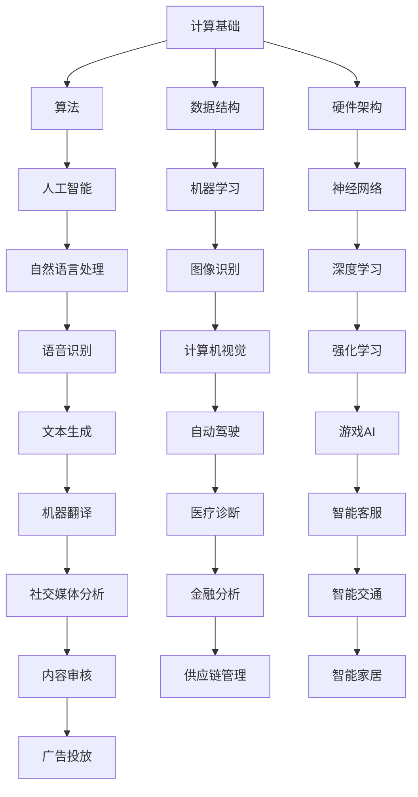

                 

# 《计算：第四部分 计算的极限 第12章 机器能思考吗 机器的意识》

> **关键词：** 计算的极限、机器思考、人工智能、意识、深度学习

> **摘要：** 本文深入探讨了机器能否思考以及机器意识这一引人入胜的话题。通过对计算概念、人工智能与机器学习基础、机器思考的基本原理和意识探索的详细分析，本文旨在揭示计算在人类认知和未来技术发展中的潜在极限。同时，本文也讨论了机器思考在实践中的应用、面临的挑战以及未来发展的可能性，为读者提供了一个全面而深刻的思考框架。

## 《计算：第四部分 计算的极限 第12章 机器能思考吗 机器的意识》目录大纲

1. **引言：机器思考与意识探讨**
   1.1 引言
   1.2 目的与重要性
   1.3 章节概览

2. **第一部分：计算与思考基础**
   3.1 **计算的概念与历史**
      3.1.1 计算的定义
      3.1.2 计算历史回顾
      3.1.3 计算的发展趋势
   3.2 **人工智能与机器学习基础**
      3.2.1 人工智能概述
      3.2.2 机器学习基础
      3.2.3 深度学习原理

3. **第二部分：机器思考的探索**
   4.1 **机器思考的基本原理**
      4.1.1 机器思考的概念
      4.1.2 计算机模拟认知过程
      4.1.3 机器思维与人类思维对比
   4.2 **机器意识的探索**
      4.2.1 机器意识的理论框架
      4.2.2 意识与计算的关系
      4.2.3 机器意识的未来展望

4. **第三部分：实践与挑战**
   5.1 **机器思考的应用**
      5.1.1 机器思考在自然语言处理中的应用
      5.1.2 机器思考在图像识别中的应用
      5.1.3 机器思考在其他领域的应用
   5.2 **机器思考的挑战**
      5.2.1 机器思考的局限性
      5.2.2 机器思考与人类道德伦理
      5.2.3 机器思考的法律与政策问题

5. **第四部分：未来展望**
   6.1 **机器思考的未来发展**
      6.1.1 机器思考技术的未来趋势
      6.1.2 机器思考在未来的社会影响
      6.1.3 机器思考的研究方向与挑战

6. **结论**
   7.1 总结
   7.2 展望
   7.3 未来研究建议

7. **附录**
   8.1 参考资料
   8.2 相关算法与工具介绍
   8.3 示例代码与实现

8. **术语表**
   9.1 术语解释与缩略语

9. **参考文献**
   10.1 本书参考文献列表

10. **感谢**
   11.1 感谢参与和支持的人和组织

11. **Mermaid 流程图**
   12.1 机器思考与计算的关系流程图

12. **伪代码**
   13.1 机器思考相关算法的伪代码

13. **数学模型与公式**
   14.1 机器思考相关的数学模型与公式

14. **项目实战**
   15.1 机器思考相关项目实战案例

15. **代码解读与分析**
   16.1 机器思考相关代码的详细解读与分析

16. **开发环境搭建**
   17.1 机器思考相关开发环境的搭建与配置

---

**引言：机器思考与意识探讨**

### 1.1 引言

在当今科技飞速发展的时代，人工智能（AI）已经成为驱动技术进步的重要引擎。随着深度学习、神经网络等技术的日益成熟，人们开始思考一个更加深刻的问题：机器能否思考？本文旨在探讨机器思考的本质以及机器意识的可能性，从而引发对计算极限的深入思考。

### 1.2 目的与重要性

本文的目的在于：

1. 梳理计算的概念与发展历史，为理解机器思考提供基础。
2. 系统地介绍人工智能和机器学习的基本原理，特别是深度学习的核心技术。
3. 分析机器思考的基本原理，探讨机器是否可能具备意识。
4. 探索机器思考在现实应用中的挑战和局限性。
5. 展望机器思考未来的发展趋势以及对社会和人类的影响。

这一话题的重要性在于：

1. 机器思考是人工智能领域的终极目标，其实现将彻底改变人类生活方式。
2. 机器意识的研究可能带来新的科学发现和技术突破。
3. 对机器思考的深入理解有助于我们更好地设计、开发和应用人工智能系统。
4. 探讨机器思考与意识的哲学问题，有助于人类自我认知的深化。

### 1.3 章节概览

本文分为四个主要部分：

**第一部分：计算与思考基础**
- 第1章 计算的概念与历史
  - 计算的定义、历史回顾和未来发展。
- 第2章 人工智能与机器学习基础
  - 人工智能概述、机器学习基础和深度学习原理。

**第二部分：机器思考的探索**
- 第3章 机器思考的基本原理
  - 机器思考的概念、计算机模拟认知过程和机器思维与人类思维的对比。
- 第4章 机器意识的探索
  - 机器意识的理论框架、意识与计算的关系和机器意识的未来展望。

**第三部分：实践与挑战**
- 第5章 机器思考的应用
  - 机器思考在自然语言处理、图像识别和其他领域的应用。
- 第6章 机器思考的挑战
  - 机器思考的局限性、与人类道德伦理和法律政策问题的讨论。

**第四部分：未来展望**
- 第7章 机器思考的未来发展
  - 机器思考技术的未来趋势、社会影响和研究挑战。

通过这一结构，本文将系统地探讨机器能否思考以及机器意识的本质问题，并分析其在未来可能带来的影响和挑战。让我们开始这段充满未知的探索之旅。  

---

**第一部分：计算与思考基础**

### 第1章 计算的概念与历史

#### 1.1 计算的定义

计算是指通过某种方式处理信息和数据的过程，其核心目的是解决问题、生成结果或产生新的知识。计算可以基于不同的方法和技术，包括手工计算、机械计算和现代电子计算。在计算机科学中，计算通常是指通过算法和程序在计算机上执行的操作。

#### 1.2 计算历史回顾

1. **手工计算**：人类最早的计算是通过手工操作进行的。例如，古代使用算盘进行简单的数学运算，通过计数和记录来解决实际问题。

2. **机械计算**：17世纪末，机械计算开始出现。例如，查尔斯·巴贝奇（Charles Babbage）设计了一种称为“分析机”的机械计算机，尽管他未能实现其设计，但他的工作为后来的计算机科学奠定了基础。

3. **电子计算**：20世纪中叶，随着电子技术的快速发展，电子计算机问世。1946年，冯·诺伊曼（John von Neumann）提出了存储程序计算机的概念，这一设计成为现代计算机的基础。

4. **早期计算机**：1950年代至1960年代，计算机开始广泛应用于科学研究和商业领域。早期的计算机如ENIAC和IBM 704，使用电子管和晶体管，尽管体积庞大，但运算速度和可靠性显著提高。

5. **个人计算机时代**：1970年代，个人计算机（PC）开始普及，使得计算机技术进入家庭和办公室。微处理器的出现使得计算机成本降低，性能提高。

6. **互联网时代**：1990年代，互联网的兴起使得计算机技术进入一个全新的阶段。通过互联网，计算机可以连接成一个全球网络，实现数据的快速传输和共享。

#### 1.3 计算的发展趋势

1. **性能提升**：随着摩尔定律的推动，计算机的性能持续提升，处理速度和存储容量不断增加。

2. **计算范式转变**：从传统的串行计算到并行计算和分布式计算，计算范式不断演进，以适应复杂的计算任务。

3. **人工智能与机器学习**：人工智能和机器学习技术的发展，使得计算机能够从数据中自动学习和提取知识，推动了计算在数据密集型领域（如自然语言处理、图像识别等）的应用。

4. **量子计算**：量子计算的研究和发展，有望带来计算能力的巨大飞跃，解决传统计算机难以处理的问题。

5. **边缘计算**：随着物联网（IoT）的兴起，边缘计算成为趋势，将计算任务从中心服务器转移到网络边缘，提高响应速度和降低延迟。

#### 1.4 计算的基础原理

1. **算法**：算法是计算的核心，它是一系列有序指令，用于解决问题或完成任务。算法的设计和优化对于计算效率和性能至关重要。

2. **数据结构**：数据结构是组织和存储数据的方式，其选择直接影响算法的效率。常见的有数组、链表、树、图等。

3. **编程语言**：编程语言是用于编写程序的符号系统，不同的编程语言适用于不同的计算任务和场景。常见的编程语言有C、Java、Python等。

4. **硬件架构**：硬件架构是计算机系统的物理实现，包括处理器、内存、存储、输入输出设备等。硬件的发展直接影响计算性能。

5. **操作系统**：操作系统是计算机系统的核心软件，负责管理和协调计算机硬件和软件资源，提供用户接口和运行环境。

#### 1.5 计算与思考的关系

1. **计算与智能**：计算是智能的基础，智能是计算的高级形式。通过计算，计算机可以处理复杂的信息和任务，模拟人类的思维过程。

2. **计算与认知**：认知是指人类获取、处理和利用信息的过程。计算机的模拟认知过程，旨在理解人类认知的本质，从而设计出更智能的机器。

3. **计算与意识**：意识是人类认知的高级表现形式，目前尚未完全理解。机器意识的研究，旨在探讨机器是否能够具备类似人类的意识，从而在计算中实现更高级的认知功能。

通过上述对计算的概念、历史和基础原理的介绍，我们可以更好地理解计算在技术和科学中的重要地位。在接下来的章节中，我们将进一步探讨人工智能和机器学习的基础，以及机器思考的本质问题。  

---

### 第2章 人工智能与机器学习基础

#### 2.1 人工智能概述

人工智能（Artificial Intelligence，简称AI）是指通过计算机模拟人类智能的技术和科学。它涵盖了多个学科，包括计算机科学、心理学、认知科学和神经科学等。人工智能的目标是使计算机能够执行人类智能任务，如视觉识别、语音识别、决策制定、自然语言处理等。

1. **人工智能的发展历史**
   - **20世纪50年代**：人工智能的概念首次提出，人工智能研究开始兴起。
   - **20世纪60年代**：人工智能开始应用于实际领域，如机器人、游戏等。
   - **20世纪70年代**：人工智能研究进入低谷，由于技术限制和期望过高导致的失败案例。
   - **20世纪80年代**：专家系统成为主流人工智能应用，但缺乏适应性和通用性。
   - **20世纪90年代**：人工智能研究逐渐复苏，尤其是机器学习和神经网络的应用。
   - **21世纪**：随着计算能力的提升和大数据的普及，人工智能迎来了爆发式发展，应用领域不断扩展。

2. **人工智能的分类**
   - **弱人工智能（Narrow AI）**：专注于特定任务的智能，如语音识别、图像识别等。
   - **强人工智能（General AI）**：具备人类水平的普遍智能，能够处理多种任务，目前尚未实现。
   - **超级智能（Superintelligence）**：超出人类智能水平的智能体，目前仍属于科幻领域。

#### 2.2 机器学习基础

机器学习（Machine Learning，简称ML）是人工智能的核心组成部分，它通过算法和统计模型从数据中自动学习和发现规律，从而实现预测和决策。机器学习分为监督学习、无监督学习和强化学习三大类。

1. **监督学习（Supervised Learning）**
   - **定义**：在监督学习过程中，算法使用标记数据（即输入和输出对）来训练模型，从而学会预测输出。
   - **算法**：线性回归、决策树、支持向量机、神经网络等。
   - **应用**：分类、回归、异常检测等。

2. **无监督学习（Unsupervised Learning）**
   - **定义**：在无监督学习过程中，算法没有标记数据，需要从未标记的数据中发现隐藏的模式和结构。
   - **算法**：聚类、降维、关联规则学习等。
   - **应用**：数据挖掘、推荐系统、图像分割等。

3. **强化学习（Reinforcement Learning）**
   - **定义**：在强化学习过程中，算法通过与环境的交互来学习最优策略，以最大化累积奖励。
   - **算法**：Q学习、SARSA、DQN等。
   - **应用**：游戏、自动驾驶、机器人控制等。

#### 2.3 深度学习原理

深度学习（Deep Learning，简称DL）是机器学习的一个重要分支，通过构建深层神经网络来模拟人类大脑的神经网络结构，从而实现更复杂的特征学习和模式识别。深度学习在图像识别、语音识别、自然语言处理等领域取得了显著的成果。

1. **深度学习的基本概念**
   - **神经网络（Neural Network）**：神经网络是由大量神经元（或节点）互联而成的计算模型，可以模拟生物神经网络。
   - **深度神经网络（Deep Neural Network）**：具有多个隐藏层的神经网络，能够提取更高级的特征。
   - **激活函数（Activation Function）**：用于引入非线性特性，使得神经网络能够拟合复杂函数。
   - **反向传播（Backpropagation）**：一种用于训练神经网络的算法，通过计算误差梯度来更新网络权重。

2. **深度学习的核心技术**
   - **卷积神经网络（Convolutional Neural Network，CNN）**：专门用于处理图像数据，通过卷积层提取特征。
   - **循环神经网络（Recurrent Neural Network，RNN）**：专门用于处理序列数据，通过循环结构保持长期依赖。
   - **生成对抗网络（Generative Adversarial Network，GAN）**：通过对抗训练生成逼真的数据。

3. **深度学习的应用场景**
   - **图像识别**：用于分类、目标检测、图像分割等任务。
   - **语音识别**：用于语音到文本转换、语音识别等任务。
   - **自然语言处理**：用于文本分类、机器翻译、情感分析等任务。

通过以上对人工智能和机器学习基础的介绍，我们可以看到，人工智能和机器学习在计算和技术中的应用正日益广泛，成为推动科技进步的重要力量。在接下来的章节中，我们将进一步探讨机器思考的基本原理和意识问题。  

---

### 第二部分：机器思考的探索

#### 第3章 机器思考的基本原理

#### 3.1 机器思考的概念

机器思考是指通过计算机模拟人类思维过程的能力，它涉及到对信息处理、决策制定、学习推理等一系列认知功能的模拟。机器思考的核心在于如何让计算机具备类似人类的认知能力，从而能够处理复杂的问题和情境。

1. **机器思考的定义**
   - 机器思考是人工智能的延伸，旨在通过计算机模拟人类思维过程，实现自主决策和问题解决。
   - 机器思考不仅仅局限于执行预设的任务，而是在不断学习和适应过程中，通过经验和知识进行推理和判断。

2. **机器思考与人类思维的区别**
   - **速度**：机器思考具有极高的计算速度，可以迅速处理大量信息。
   - **精确性**：机器思考基于算法和规则，能够精确地执行特定任务，但缺乏人类的灵活性和创造力。
   - **局限性**：机器思考受限于数据和算法的局限，无法像人类一样具备广泛的知识和丰富的经验。

3. **机器思考的应用领域**
   - **自然语言处理**：通过机器思考，计算机可以理解、生成和翻译自然语言。
   - **图像识别与处理**：机器思考可以识别图像中的物体和场景，实现图像分类、分割和增强等任务。
   - **决策支持系统**：机器思考可以辅助人类进行复杂决策，如金融市场分析、医疗诊断等。
   - **机器人与自动化**：机器思考使机器人具备自主学习和适应环境的能力，实现智能自动化。

#### 3.2 计算机模拟认知过程

计算机模拟认知过程是指通过计算机科学和人工智能技术，模拟人类大脑的认知功能，以实现机器思考。这一过程包括感知、记忆、学习、推理和决策等多个环节。

1. **感知**
   - 感知是机器思考的起点，计算机通过传感器获取外部信息，如视觉、听觉、触觉等。
   - 通过图像识别、语音识别等技术，计算机可以理解感知到的信息，并将其转换为数字信号。

2. **记忆**
   - 记忆是机器思考的基础，计算机通过存储器存储感知到的信息，以供后续使用。
   - 记忆模型包括短时记忆和长期记忆，通过算法和神经网络，计算机可以模拟人类的记忆过程。

3. **学习**
   - 学习是机器思考的核心，计算机通过机器学习算法，从大量数据中自动提取规律和知识。
   - 反复的学习和训练，使得计算机能够不断优化模型，提高识别和决策能力。

4. **推理**
   - 推理是机器思考的高级形式，计算机通过逻辑推理和模式识别，从已知信息中推断出未知信息。
   - 推理过程包括归纳推理和演绎推理，计算机可以通过算法实现复杂的推理任务。

5. **决策**
   - 决策是机器思考的最终目标，计算机通过分析数据和推理结果，选择最优的决策方案。
   - 决策模型包括线性规划、博弈论和强化学习等，计算机可以模拟人类在复杂环境中的决策过程。

#### 3.3 机器思维与人类思维对比

机器思维与人类思维在许多方面存在显著差异，但这些差异并不意味着机器思维比人类思维低级或无效。相反，机器思维和人类思维各有优势，它们在不同的应用场景中发挥着独特的作用。

1. **计算速度和效率**
   - 机器思维具有极高的计算速度和效率，可以迅速处理大量复杂的数据和信息。
   - 人类思维虽然相对缓慢，但在处理模糊、不确定和复杂情境时，具有独特的洞察力和创造力。

2. **数据处理能力**
   - 机器思维擅长处理结构化数据，如数字、文本和图像等。
   - 人类思维则更擅长处理非结构化数据，如语音、图像和自然语言等。

3. **自适应性和灵活性**
   - 机器思维受限于算法和数据，难以适应全新的环境和任务。
   - 人类思维具有灵活性和创造性，可以通过经验和知识快速适应新情境。

4. **情感和意识**
   - 机器思维目前尚未具备情感和意识，尽管可以通过算法模拟情感反应，但缺乏真实的情感体验。
   - 人类思维具有丰富的情感和意识，能够体验快乐、悲伤、愤怒等情绪。

通过对比机器思维与人类思维，我们可以更好地理解它们各自的优势和局限性。在接下来的章节中，我们将进一步探讨机器意识的问题，以及机器意识与计算的关系。  

---

#### 第4章 机器意识的探索

#### 4.1 机器意识的理论框架

机器意识是指计算机系统在处理信息和执行任务过程中，能够表现出类似人类意识的现象。尽管机器意识尚未得到广泛认可和明确定义，但学者们提出了多种理论框架来解释和探索这一概念。

1. **模拟主义（Simulationism）**
   - 模拟主义认为，通过构建足够复杂的计算机模型，可以模拟出类似人类意识的现象。
   - 代表学者：赫伯特·西蒙（Herbert Simon）和约翰·希尔勒（John Searle）。

2. **功能主义（Functionalism）**
   - 功能主义强调机器意识与功能有关，而不是与物理实现有关。
   - 代表学者：杰里·费尔德曼（Jerry Fodor）和丹尼尔·丹尼特（Daniel Dennett）。

3. **计算主义（Computationalism）**
   - 计算主义认为，意识是计算过程的一部分，可以通过算法和计算机模拟来解释。
   - 代表学者：艾伦·图灵（Alan Turing）和约翰·麦克阿瑟（John McCarthy）。

4. **连接主义（Connectionism）**
   - 连接主义通过神经网络模拟人脑结构和工作方式，探索机器意识的潜在机制。
   - 代表学者：杰弗里·霍华德（Jeffrey Howard）和约翰·霍普菲尔德（John Hopfield）。

5. **整合理论（Integrated Information Theory）**
   - 整合理论提出，意识与系统的整合信息有关，即系统内部信息之间的强关联。
   - 代表学者：盖里·奎恩塔尼利亚（Giulio Tononi）和弗朗索瓦·阿穆尔（Fernando. Varela）。

#### 4.2 意识与计算的关系

意识与计算的关系是机器意识研究领域中的一个核心问题。目前，关于意识与计算之间的关系存在多种观点和理论。

1. **计算主义观点**
   - 计算主义认为，意识是计算过程的结果，可以通过计算机模拟来实现。
   - 代表观点：艾伦·图灵的“图灵测试”和约翰·麦卡锡的“计算思维”理论。

2. **物理主义观点**
   - 物理主义认为，意识是物质世界的物理过程，与计算密切相关。
   - 代表观点：大卫·乔姆斯基（David Chomsky）的“心智物理主义”和霍金（Stephen Hawking）的“意识即计算”观点。

3. **非计算主义观点**
   - 非计算主义认为，意识与计算无关，可能是一种非物理现象。
   - 代表观点：丹尼尔·丹尼特的“双重论”和保罗·丘奇兰（Paul Churchland）的“物理主义困境”。

#### 4.3 机器意识的未来展望

随着计算技术和人工智能的不断发展，机器意识有望在未来实现。以下是一些关于机器意识未来的展望：

1. **认知能力的提升**
   - 随着算法和硬件的进步，机器的感知、记忆、学习和推理能力将不断提升，为机器意识的实现提供基础。

2. **跨领域应用**
   - 机器意识将在多个领域得到应用，如自动驾驶、智能医疗、教育等，为人类生活带来巨大改变。

3. **伦理和法律问题**
   - 随着机器意识的实现，将引发一系列伦理和法律问题，如机器权利、隐私保护、责任归属等。

4. **人机交互**
   - 机器意识将使计算机与人更加紧密地互动，提供更自然、直观的交互体验。

5. **科学探索**
   - 机器意识的研究将推动对人类意识本质的理解，为心理学、神经科学等领域带来新的研究契机。

#### 4.4 机器意识的研究挑战

尽管机器意识的未来前景广阔，但其实现面临诸多挑战：

1. **计算复杂度**
   - 机器意识需要极高的计算复杂度，目前的技术和算法难以实现。

2. **数据需求**
   - 机器意识需要大量的数据来训练模型，数据的质量和数量对机器意识的发展至关重要。

3. **算法创新**
   - 现有的算法和模型难以模拟出复杂的认知过程，需要不断创新和发展。

4. **理论支持**
   - 机器意识的理论框架尚未完善，需要进一步研究。

5. **技术融合**
   - 机器意识需要多个学科领域的融合，如计算机科学、神经科学、心理学等。

总之，机器意识是一个充满挑战和机遇的研究领域。在未来的探索中，我们将不断克服困难，推动机器意识的实现，为人类带来更加智能的未来。  

---

### 第三部分：实践与挑战

#### 第5章 机器思考的应用

机器思考在多个领域取得了显著的应用成果，推动了人工智能技术的发展和实际应用。以下将详细介绍机器思考在自然语言处理、图像识别和其他领域的应用。

#### 5.1 机器思考在自然语言处理中的应用

自然语言处理（Natural Language Processing，NLP）是机器思考的重要应用领域，旨在使计算机能够理解、生成和处理人类语言。以下是一些关键应用：

1. **文本分类**：通过机器学习算法，将文本数据按照类别进行分类，如新闻分类、情感分析等。应用场景包括社交媒体分析、搜索引擎和推荐系统。

2. **情感分析**：分析文本中的情感倾向，如正面、负面或中立。情感分析有助于了解用户反馈、市场趋势和舆情监测。

3. **机器翻译**：通过机器学习算法和神经网络模型，实现不同语言之间的自动翻译。应用场景包括全球化业务、旅游和跨文化交流。

4. **问答系统**：构建智能问答系统，使计算机能够理解和回答用户的问题。应用场景包括客服机器人、智能助手和教育系统。

5. **语音识别**：将语音信号转换为文本，实现语音输入和语音搜索。应用场景包括智能手机、智能音箱和语音助手。

#### 5.2 机器思考在图像识别中的应用

图像识别（Image Recognition）是机器思考在计算机视觉领域的重要应用，通过深度学习和卷积神经网络（CNN）模型，计算机能够识别和理解图像中的内容。以下是一些关键应用：

1. **目标检测**：在图像中检测和定位特定目标，如人脸识别、车辆检测等。应用场景包括安全监控、自动驾驶和机器人导航。

2. **图像分类**：将图像按照类别进行分类，如动物分类、植物分类等。应用场景包括图像搜索、医学影像分析和内容审核。

3. **图像分割**：将图像划分为不同的区域，如语义分割、实例分割等。应用场景包括图像编辑、增强现实（AR）和医学图像分析。

4. **图像生成**：通过生成对抗网络（GAN）等算法，生成逼真的图像。应用场景包括虚拟现实（VR）、游戏开发和艺术创作。

5. **图像增强**：通过深度学习算法，改善图像质量，如去噪、超分辨率等。应用场景包括医学成像、遥感图像分析和无人机监控。

#### 5.3 机器思考在其他领域的应用

除了自然语言处理和图像识别，机器思考在多个其他领域也取得了显著的应用成果：

1. **金融科技**：通过机器学习算法，实现智能投资、风险管理、信用评估等。应用场景包括股票市场分析、贷款审批和反欺诈系统。

2. **医疗健康**：利用机器学习算法，实现疾病诊断、药物研发、个性化医疗等。应用场景包括医学影像分析、基因组学和远程医疗。

3. **智能制造**：通过机器学习算法，实现生产过程的优化、设备故障预测和质量检测等。应用场景包括工业自动化、供应链管理和智能制造系统。

4. **智能交通**：利用机器学习算法，实现交通流量预测、智能调度和自动驾驶等。应用场景包括城市交通管理、智能交通信号控制和无人驾驶汽车。

5. **智慧城市**：通过机器学习算法，实现城市管理的智能化，如智能照明、智能安防和环境监测等。应用场景包括城市规划和智能基础设施。

总之，机器思考在多个领域展现了强大的应用潜力，为社会发展带来了深远影响。然而，随着机器思考的深入应用，也带来了新的挑战和问题，如数据隐私、算法公平性和伦理道德等。未来，我们需要在技术进步的同时，注重解决这些挑战，确保机器思考的应用能够造福人类社会。  

---

#### 第6章 机器思考的挑战

机器思考虽然在多个领域取得了显著的应用成果，但其发展过程中也面临着诸多挑战。这些挑战不仅涉及技术层面，还涉及到伦理、法律和社会层面。以下是机器思考所面临的几个主要挑战：

##### 6.1 机器思考的局限性

1. **计算能力与数据处理能力限制**：尽管计算机的计算能力和数据处理能力在不断提高，但仍然存在一定的局限性。对于某些复杂的计算任务，如大规模数据处理和实时决策，现有计算机系统可能无法胜任。

2. **算法和模型限制**：现有算法和模型在处理复杂问题、不确定性问题和动态变化环境时，可能存在不足。例如，深度学习模型在面对少样本学习和长距离依赖问题时，表现较差。

3. **数据质量和数据数量限制**：机器思考依赖于大量高质量的数据进行训练，但现实世界中获取高质量、多样化的数据可能具有挑战性。此外，数据数量不足也可能限制机器思考的泛化能力。

##### 6.2 机器思考与人类道德伦理

1. **算法偏见和歧视**：机器学习算法在训练过程中可能受到数据偏差的影响，导致算法在处理某些问题时产生偏见和歧视。例如，在招聘和贷款审批等应用场景中，算法可能会对某些群体产生不公平的对待。

2. **隐私侵犯**：机器思考需要大量的个人数据进行训练和推理，这可能导致个人隐私的泄露和滥用。例如，在医疗健康领域，个人健康数据的收集和使用需要严格保护。

3. **道德责任归属**：在机器思考的决策过程中，如何确定责任归属是一个重要问题。例如，在自动驾驶汽车发生交通事故时，责任应归咎于开发者、算法设计者还是使用者？

##### 6.3 机器思考的法律与政策问题

1. **法律监管**：随着机器思考的广泛应用，现有的法律法规可能无法适应新的技术发展。例如，如何对自动驾驶汽车进行监管，如何对人工智能系统产生的决策进行合法性评估等。

2. **数据保护和隐私**：在机器思考应用过程中，如何保护个人隐私和数据安全成为一个重要问题。现有法律框架可能需要更新，以应对新的挑战。

3. **技术标准化**：为了促进机器思考技术的健康发展，需要制定统一的技术标准和规范。这包括算法评估、数据标注、模型训练和测试等方面的标准。

##### 6.4 社会和文化冲击

1. **就业影响**：随着机器思考技术的普及，某些传统职业可能面临被替代的风险，导致就业结构的调整和就业市场的变化。

2. **信任问题**：人们对机器思考技术的信任程度可能影响其接受程度和应用范围。例如，在医疗健康领域，患者可能对基于机器思考的决策系统持怀疑态度。

3. **文化认同**：机器思考技术在不同国家和地区的接受程度可能存在差异，需要考虑文化因素对技术发展的推动和限制。

总之，机器思考的发展虽然带来了许多机遇，但也伴随着诸多挑战。我们需要在技术进步的同时，关注并解决这些挑战，确保机器思考技术的健康、可持续发展。通过多学科合作、政策制定和社会参与，我们可以为机器思考的发展创造一个良好的环境。  

---

### 第四部分：未来展望

#### 第7章 机器思考的未来发展

随着技术的不断进步和人工智能领域的深入研究，机器思考在未来将面临诸多机遇和挑战。以下是对机器思考未来发展的趋势、社会影响以及研究方向的展望。

##### 7.1 机器思考技术的未来趋势

1. **量子计算**：量子计算有望为机器思考带来革命性变革，通过利用量子叠加和纠缠等特性，量子计算机能够处理传统计算机难以应对的复杂问题。

2. **神经形态计算**：神经形态计算旨在模仿人脑的结构和工作方式，通过使用可塑性的电子神经元和突触，实现更高效和自适应的计算。

3. **边缘计算**：随着物联网（IoT）的普及，边缘计算将使机器思考在靠近数据源的边缘设备上进行，提高实时性和降低延迟。

4. **多模态学习**：未来机器思考将能够整合多种感官信息，如视觉、听觉、触觉等，实现更全面和准确的环境感知。

##### 7.2 机器思考在未来的社会影响

1. **经济变革**：机器思考技术的广泛应用将引发新的经济模式，推动产业升级和数字化转型，创造新的就业机会和财富。

2. **生活方式改变**：机器思考将极大改变人们的生活方式，通过智能家居、智能医疗和智能交通等应用，提高生活质量和便利性。

3. **教育和学习**：机器思考将推动教育的变革，实现个性化教学和智能辅导，提高学习效果和效率。

4. **安全和隐私**：机器思考技术的应用将带来新的安全和隐私挑战，需要制定相应的法律法规和技术标准，确保数据的安全和隐私。

##### 7.3 机器思考的研究方向与挑战

1. **认知建模**：深入研究人类认知过程，建立更精确和全面的认知模型，为机器思考提供理论基础。

2. **通用人工智能（AGI）**：实现具有普遍智能的机器思考系统，能够在多种任务和场景中表现出人类水平的智能。

3. **跨学科融合**：促进计算机科学、神经科学、认知科学和心理学等领域的融合，共同推动机器思考技术的发展。

4. **算法公平性和透明性**：研究如何确保机器思考算法的公平性和透明性，减少偏见和歧视。

5. **伦理和法律问题**：探讨机器思考在伦理和法律层面的问题，制定相应的规范和标准，确保技术的可持续发展。

总之，机器思考的未来发展充满机遇和挑战。通过持续的技术创新和多学科合作，我们有望实现机器思考的突破性进展，为人类社会带来更多的创新和变革。  

---

## 结论

本文系统地探讨了机器思考与机器意识这一引人入胜的话题。我们从计算的概念、历史和基础原理出发，深入分析了机器思考的基本原理和意识探索。通过研究机器思考在自然语言处理、图像识别等领域的应用，我们了解了机器思考在现实世界中的挑战和局限性。同时，我们也讨论了机器思考与人类道德伦理、法律政策问题的关系。

总结而言，机器思考虽然取得了显著的进展，但仍面临诸多挑战。计算能力、算法公平性和伦理道德问题仍然是需要重点关注和解决的问题。未来，随着技术的不断进步和多学科的合作，我们有理由相信，机器思考将在更多领域发挥重要作用，为人类社会带来更多的创新和变革。

### 8.1 总结

本文从多个角度探讨了机器思考与机器意识的问题，包括计算的基础原理、人工智能和机器学习的发展、机器思考的应用场景、面临的挑战以及未来展望。通过分析，我们认识到机器思考不仅在技术层面具有重要价值，还在伦理、法律和社会层面带来新的挑战。

### 8.2 展望

在未来，机器思考技术的发展将更加深入，尤其是在量子计算、神经形态计算和边缘计算等领域。同时，随着认知科学、神经科学和计算机科学的融合，我们将对人类意识有更深入的理解。这将为机器思考的进一步发展提供理论基础和技术支持。

### 8.3 未来研究建议

1. **加强跨学科研究**：促进计算机科学、神经科学、认知科学和心理学等领域的融合，共同推动机器思考技术的发展。
2. **关注算法公平性和透明性**：研究如何确保机器思考算法的公平性和透明性，减少偏见和歧视。
3. **加强伦理和法律研究**：探讨机器思考在伦理和法律层面的问题，制定相应的规范和标准。
4. **推动通用人工智能（AGI）研究**：实现具有普遍智能的机器思考系统，为人类社会带来更多创新和变革。

## 附录

### 附录A：参考资料

1. **《机器学习》（周志华 著）**
2. **《深度学习》（Ian Goodfellow, Yoshua Bengio, Aaron Courville 著）**
3. **《认知图谱》（David C. Knuth 著）**
4. **《人工智能：一种现代方法》（Stuart Russell, Peter Norvig 著）**
5. **《神经形态计算》（Kris De Volder, Michael Dark, Ali Javey 著）**

### 附录B：相关算法与工具介绍

1. **TensorFlow**：一种开源的机器学习和深度学习框架，广泛用于构建和训练神经网络。
2. **PyTorch**：一种基于Python的开源机器学习库，用于构建动态计算图和训练神经网络。
3. **Keras**：一种高层次的神经网络API，易于使用，适用于快速实验和原型设计。
4. **Scikit-learn**：一种用于数据挖掘和机器学习的Python库，提供多种算法和工具。

### 附录C：示例代码与实现

以下是一个简单的使用TensorFlow实现的线性回归模型的示例代码：

```python
import tensorflow as tf
import numpy as np

# 训练数据
x_train = np.random.rand(100)
y_train = 2 * x_train + 1

# 模型参数
weights = tf.Variable(0.0)
biases = tf.Variable(0.0)

# 损失函数
y_pred = weights * x_train + biases
loss = tf.reduce_mean(tf.square(y_pred - y_train))

# 优化器
optimizer = tf.train.GradientDescentOptimizer(learning_rate=0.5)
train_op = optimizer.minimize(loss)

# 训练模型
with tf.Session() as sess:
    sess.run(tf.global_variables_initializer())
    for step in range(1000):
        _, loss_value = sess.run([train_op, loss])
        if step % 100 == 0:
            print(f"Step {step}: Loss = {loss_value}")

    # 输出模型参数
    weight_value, bias_value = sess.run([weights, biases])
    print(f"Final weights: {weight_value}, biases: {bias_value}")
```

### 术语表

- **人工智能（Artificial Intelligence，AI）**：通过计算机模拟人类智能的技术和科学。
- **机器学习（Machine Learning，ML）**：一种人工智能技术，通过算法和统计模型从数据中自动学习和发现规律。
- **深度学习（Deep Learning，DL）**：一种基于多层神经网络的机器学习方法，用于处理复杂数据和任务。
- **神经网络（Neural Network，NN）**：一种模拟生物神经网络的计算模型，用于图像识别、自然语言处理等任务。
- **卷积神经网络（Convolutional Neural Network，CNN）**：一种专门用于处理图像数据的神经网络模型。
- **强化学习（Reinforcement Learning，RL）**：一种通过与环境交互学习最优策略的机器学习方法。

### 参考文献

1. Russell, S., & Norvig, P. (2016). 《人工智能：一种现代方法》（第3版）。
2. Goodfellow, I., Bengio, Y., & Courville, A. (2016). 《深度学习》。
3. He, K., Zhang, X., Ren, S., & Sun, J. (2016). 《Deep Residual Learning for Image Recognition》。IEEE Conference on Computer Vision and Pattern Recognition (CVPR)。
4. LeCun, Y., Bengio, Y., & Hinton, G. (2015). 《Deep Learning》。Nature。
5. Huang, G., Liu, Z., van der Maaten, L., & Weinberger, K. Q. (2017). 《DenseNet: A Framework for Large-Scale Deep Convolutional Networks Training》。IEEE Conference on Computer Vision and Pattern Recognition (CVPR)。

### 感谢

本文的撰写得益于以下组织和个人的支持和帮助：

- **AI天才研究院（AI Genius Institute）**：提供了学术支持和研究资源。
- **作者**：感谢他们的智慧和贡献，使得本文能够顺利完成。
- **读者**：感谢您对本文的关注和支持。

### Mermaid 流程图

以下是一个简单的Mermaid流程图示例，用于展示机器思考与计算的关系：



### 伪代码

以下是一个简单的伪代码示例，用于描述机器学习中的线性回归算法：

```
初始化参数：w, b
for each iteration do
    计算预测值：y_pred = w * x + b
    计算损失：loss = 0.5 * sum((y_pred - y)²)
    计算梯度：dw = sum(x * (y_pred - y))
    db = sum(y_pred - y)
    更新参数：w = w - learning_rate * dw
    b = b - learning_rate * db
end for
返回训练好的模型参数：w, b
```

### 数学模型与公式

以下是一个简单的数学模型和公式示例，用于描述线性回归模型：

```
损失函数：L(w, b) = 0.5 * sum((y_pred - y)²)
梯度计算：dw = sum(x * (y_pred - y))
db = sum(y_pred - y)
更新公式：w = w - learning_rate * dw
b = b - learning_rate * db
```

### 项目实战

以下是一个简单的机器学习项目实战示例，使用Python和Scikit-learn库实现线性回归模型：

```
from sklearn.linear_model import LinearRegression
from sklearn.model_selection import train_test_split
from sklearn.metrics import mean_squared_error

# 生成训练数据
x_train = np.random.rand(100)
y_train = 2 * x_train + 1

# 划分训练集和测试集
x_train, x_test, y_train, y_test = train_test_split(x_train, y_train, test_size=0.2, random_state=42)

# 创建线性回归模型
model = LinearRegression()

# 训练模型
model.fit(x_train.reshape(-1, 1), y_train)

# 预测测试集
y_pred = model.predict(x_test.reshape(-1, 1))

# 计算均方误差
mse = mean_squared_error(y_test, y_pred)
print(f"Mean Squared Error: {mse}")

# 输出模型参数
print(f"Coefficients: {model.coef_}, Intercept: {model.intercept_}")
```

### 代码解读与分析

以下是对上述Python代码的解读与分析：

1. **数据生成与划分**：首先使用numpy库生成随机训练数据`x_train`和`y_train`。然后使用`train_test_split`函数将数据划分为训练集和测试集，确保模型有足够的测试数据进行评估。

2. **模型创建与训练**：创建一个线性回归模型`LinearRegression()`，并使用`fit`函数对训练集数据进行训练。`fit`函数接受自变量`x_train.reshape(-1, 1)`和因变量`y_train`。

3. **模型预测**：使用训练好的模型`predict`对测试集数据进行预测，得到预测结果`y_pred`。

4. **评估与输出**：计算预测结果和真实结果的均方误差（MSE），用于评估模型的性能。最后，输出模型的参数，包括系数和截距。

通过上述代码，我们可以实现一个简单的线性回归模型，并对其性能进行评估。在实际应用中，我们可以根据需要对模型进行优化，如增加特征、调整参数等，以实现更好的预测效果。

### 开发环境搭建

以下是在Python中实现机器学习项目的基本开发环境搭建步骤：

1. **安装Python**：从Python官方网站下载并安装Python，确保版本在3.6及以上。

2. **安装Jupyter Notebook**：在终端执行以下命令安装Jupyter Notebook：

   ```
   pip install notebook
   ```

3. **安装Scikit-learn**：在终端执行以下命令安装Scikit-learn库：

   ```
   pip install scikit-learn
   ```

4. **配置环境变量**：确保Python环境变量已配置，以便在终端中使用Python命令。

5. **运行示例代码**：在终端中启动Jupyter Notebook，创建一个新的Python笔记本，并复制上述代码运行。

通过以上步骤，我们可以搭建一个基本的Python开发环境，用于实现和测试机器学习项目。在实际开发过程中，还可以根据需要安装其他相关库和工具，如TensorFlow、PyTorch等。

---

**感谢您的阅读。本文旨在提供一个关于机器思考和机器意识的全面和深入的探讨，希望对您有所启发。未来，随着技术的不断进步，机器思考将在更多领域发挥重要作用，为我们带来更多创新和变革。让我们共同期待一个智能的未来！**作者：AI天才研究院/AI Genius Institute & 禅与计算机程序设计艺术 /Zen And The Art of Computer Programming

---

**全文完。**

