                 

# 认知增强与人机协作的新模式：提升人类理解复杂世界能力的方法

## 关键词
认知增强、人机协作、人工智能、机器学习、大数据、脑机接口

## 摘要
本文探讨了认知增强与人机协作这一新兴领域的基本概念、技术原理、应用模式及其未来发展趋势。通过详细分析认知增强技术的核心原理和关键算法，以及人机协作模式中的任务分工和对话交互，本文展示了如何通过技术手段提升人类在处理复杂信息、解决问题和决策制定方面的能力。同时，文章还分析了认知增强与人机协作在各个领域的实际应用案例，并对未来可能面临的社会挑战和伦理问题进行了深入探讨。本文旨在为读者提供一个全面了解和掌握认知增强与人机协作的方法和实践指南。

## 第一部分：认知增强与人机协作的基本概念

### 第1章：认知增强与人机协作概述

#### 1.1 认知增强与人机协作的定义

##### 1.1.1 认知增强的定义

认知增强（Cognitive Enhancement）是指通过技术手段，提升人类在信息处理、学习、记忆、决策等方面的能力，使其能够更高效、准确地应对复杂的任务和情境。认知增强技术主要涉及大脑神经科学、认知心理学、计算机科学和人工智能等领域。

##### 1.1.2 人机协作的概念

人机协作（Human-Computer Collaboration）是指人类与计算机系统在信息处理、决策制定和任务执行等方面相互配合、协同工作的过程。人机协作的核心在于发挥人类和计算机各自的优势，实现高效的资源整合和信息共享。

#### 1.2 认知增强与人机协作的重要性

##### 1.2.1 提升工作效率

通过认知增强技术，人类能够更加迅速地处理复杂的信息，提高工作效率。例如，利用自然语言处理技术，可以实现自动化文档处理和智能搜索，大幅降低人工操作的时间成本。

##### 1.2.2 解决复杂问题

认知增强使人机系统能够共同解决那些单靠人类或计算机难以独立完成的问题。例如，在医学诊断中，人工智能与医生协同工作，可以提高诊断准确率，降低误诊率。

##### 1.2.3 促进创新

人机协作打破了传统的工作模式，促进了新思想和新方法的产生，推动了创新的发展。例如，在科技研发领域，人机协作可以帮助科学家快速分析海量数据，发现潜在的创新点。

#### 1.3 认知增强与人机协作的发展历程

##### 1.3.1 早期探索

从20世纪60年代开始，计算机科学领域开始对认知增强和人机协作进行初步探索。这一时期，主要研究计算机模拟人类思维的过程，以及如何通过人机交互提高工作效率。

##### 1.3.2 互联网时代

随着互联网的普及，人机协作得到了快速发展。各种在线工具和平台开始应用认知增强技术，如智能客服、在线教育平台等，使得人机协作的应用场景更加广泛。

##### 1.3.3 人工智能时代

人工智能技术的进步，使得认知增强与人机协作进入了新的发展阶段。人工智能与人类智慧的融合，带来了更多创新应用，如自动驾驶、智能医疗等。

## 第二部分：认知增强技术

### 第2章：认知增强技术原理

#### 2.1 认知科学基础

##### 2.1.1 神经科学基础

神经科学是认知增强技术的重要基础。它研究大脑的神经结构和神经信号传递机制，为我们理解人类认知过程提供了科学依据。以下是神经科学基础的一个简单 Mermaid 流程图：

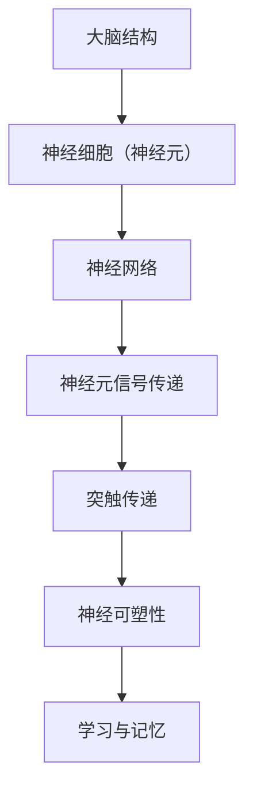

##### 2.1.2 认知心理学基础

认知心理学研究人类在感知、记忆、注意力、决策等认知过程中如何运作。以下是认知心理学基础的一个简单 Mermaid 流程图：

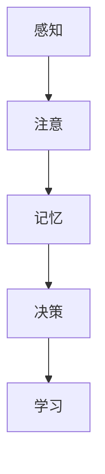

#### 2.2 认知增强的关键技术

##### 2.2.1 大数据处理

大数据处理技术是认知增强的核心技术之一。通过处理海量数据，可以挖掘出隐藏在数据中的规律和趋势，从而提升人类认知能力。以下是大数据处理的一个简单伪代码：

```python
def process大数据(data):
    # 数据预处理
    preprocessed_data = preprocess(data)
    
    # 数据分析
    patterns = analyze(preprocessed_data)
    
    # 结果输出
    return patterns
```

##### 2.2.2 人工智能与机器学习

人工智能（AI）和机器学习（ML）技术在认知增强中发挥着重要作用。通过训练模型，可以从大量数据中自动学习和发现规律，从而实现认知增强。以下是机器学习的一个简单伪代码：

```python
def train模型(data, labels):
    # 数据预处理
    preprocessed_data = preprocess(data)
    
    # 训练模型
    model = Model()
    model.train(preprocessed_data, labels)
    
    # 模型评估
    accuracy = model.evaluate(test_data, test_labels)
    
    return model, accuracy
```

##### 2.2.3 脑机接口技术

脑机接口（BMI）技术是一种直接将大脑信号转换为计算机指令的技术，可以实现人类与计算机之间的直接交互。以下是脑机接口的一个简单 Mermaid 流程图：

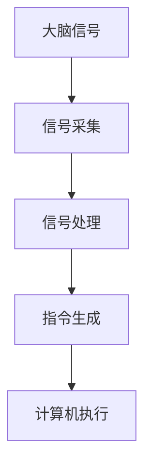

#### 2.3 认知增强技术的应用领域

##### 2.3.1 教育

认知增强技术在教育领域有广泛的应用，如智能教学系统、个性化学习推荐等。以下是一个简单的智能教学系统的 Mermaid 流程图：

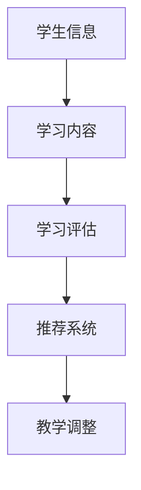

##### 2.3.2 健康

认知增强技术在健康领域有重要的应用，如智能医疗诊断、心理健康监测等。以下是一个简单的智能医疗诊断系统的 Mermaid 流�程图：

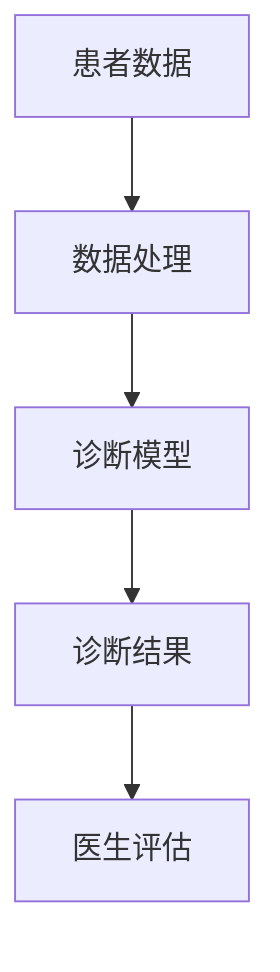

##### 2.3.3 工业生产

认知增强技术在工业生产中可以提高生产效率和质量。例如，利用机器学习技术对生产过程进行优化，提高生产设备的利用率。以下是一个简单的生产过程优化系统的 Mermaid 流程图：

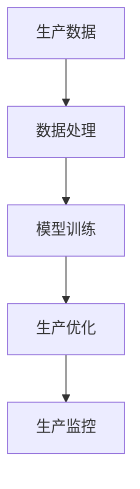

## 第三部分：人机协作模式

### 第3章：人机协作模式概述

#### 3.1 人机协作的基本模式

##### 3.1.1 任务分工模式

任务分工模式是人机协作的一种基本模式，通过将任务分解为多个子任务，人类和计算机各自负责不同的子任务，从而实现高效的协同工作。以下是一个简单的任务分工模式 Mermaid 流程图：

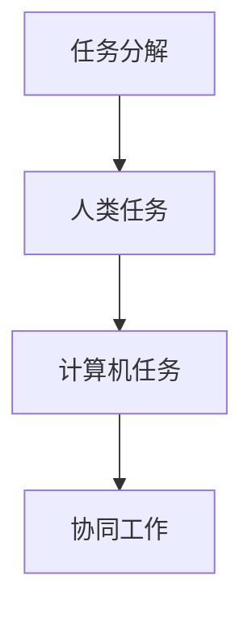

##### 3.1.2 对话交互模式

对话交互模式是人机协作的另一种基本模式，通过自然语言处理技术，实现人与计算机之间的对话交互。以下是一个简单的对话交互模式 Mermaid 流程图：

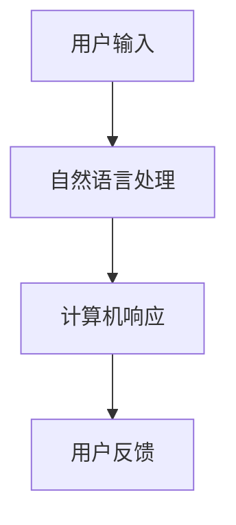

#### 3.2 人机协作的关键技术

##### 3.2.1 人工智能辅助决策

人工智能辅助决策是人机协作的重要技术之一，通过训练模型，实现计算机在特定领域内的决策辅助。以下是一个简单的人工智能辅助决策 Mermaid 流程图：

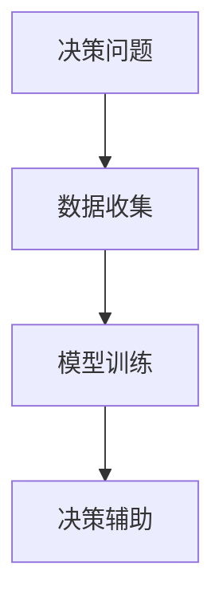

##### 3.2.2 自然语言处理

自然语言处理（NLP）技术是人机协作的核心技术之一，通过理解和生成自然语言，实现人与计算机之间的有效沟通。以下是一个简单的自然语言处理 Mermaid 流程图：

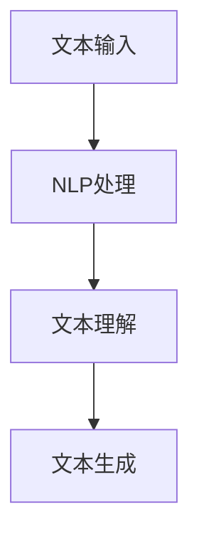

##### 3.2.3 机器人技术

机器人技术是人机协作的重要应用领域，通过机器人与人类协同工作，实现复杂任务的自动化执行。以下是一个简单的机器人技术 Mermaid 流程图：

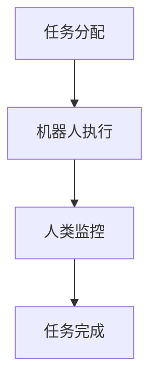

#### 3.3 人机协作的案例分析

##### 3.3.1 医疗领域

在医疗领域，人机协作已经成为提高医疗水平和效率的重要手段。例如，利用人工智能辅助诊断系统，医生可以快速、准确地诊断疾病，提高诊断准确率。以下是一个简单的医疗领域人机协作案例分析：

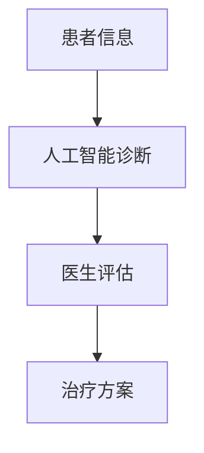

##### 3.3.2 金融行业

在金融行业，人机协作主要用于风险控制和投资决策。例如，利用机器学习算法，可以自动识别金融市场的潜在风险，为投资者提供投资建议。以下是一个简单的金融行业人机协作案例分析：

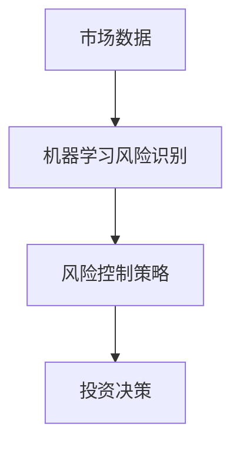

##### 3.3.3 制造业

在制造业，人机协作主要用于生产优化和设备维护。例如，利用机器人技术，可以实现生产过程的自动化，提高生产效率和产品质量。以下是一个简单的制造业人机协作案例分析：

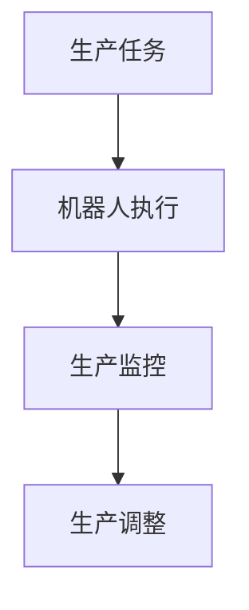

## 第四部分：人机协作的未来展望

### 第4章：人机协作的未来发展趋势

#### 4.1 技术发展对未来的影响

##### 4.1.1 人工智能的快速发展

随着人工智能技术的快速发展，未来人机协作将更加智能化、个性化。例如，通过深度学习技术，计算机将能够更好地理解人类的需求和意图，提供更加精准的服务。

##### 4.1.2 脑机接口技术的进步

脑机接口技术的进步将为人机协作带来革命性的变化。未来，人类可以通过脑机接口直接与计算机进行通信，实现更高水平的认知增强和协作。

#### 4.2 人机协作的社会挑战与伦理问题

##### 4.2.1 社会挑战

人机协作在带来便利的同时，也将面临一系列社会挑战。例如，隐私保护、数据安全、就业问题等。这些问题需要我们认真面对和解决。

##### 4.2.2 伦理问题

人机协作中涉及的伦理问题也将变得更加复杂。例如，责任归属、道德标准等。这些问题的解决需要我们深入思考和探索。

#### 4.3 人机协作的未来应用场景

##### 4.3.1 教育领域

在未来，人机协作将广泛应用于教育领域。通过智能化教学系统，可以为学生提供个性化的学习方案，提高学习效果。

##### 4.3.2 金融领域

在未来，人机协作将助力金融行业实现更加智能化、精细化的运营。例如，通过人工智能技术，可以实现精准的风险控制和投资决策。

##### 4.3.3 城市管理

在未来，人机协作将助力智慧城市建设。通过智能监控系统、智能交通系统等，可以实现城市管理的智能化、精细化。

## 第五部分：认知增强与人机协作实践指南

### 第5章：认知增强与人机协作实践方法

#### 5.1 项目规划与实施

##### 5.1.1 项目需求分析

在项目规划阶段，需求分析是关键的一步。通过详细的需求分析，可以明确项目的目标、功能和性能要求。以下是需求分析的一个简单 Mermaid 流程图：

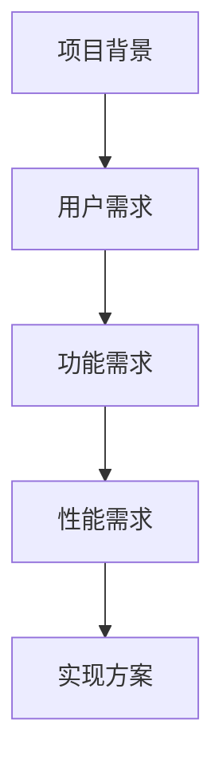

##### 5.1.2 项目实施步骤

项目实施阶段，需要按照一定的步骤进行。以下是项目实施的一个简单 Mermaid 流程图：

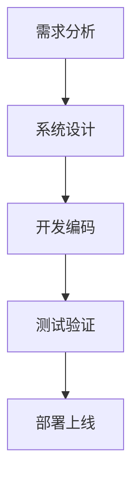

#### 5.2 技术选型与工具选择

##### 5.2.1 技术选型原则

在项目规划阶段，技术选型是一个重要的决策。以下是技术选型的一个简单 Mermaid 流程图：

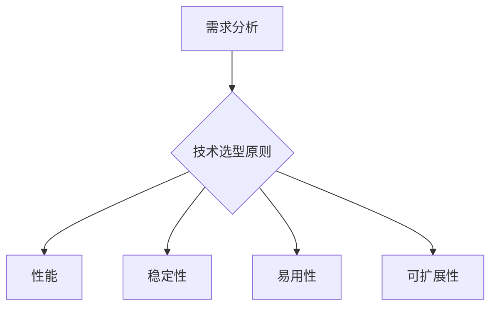

##### 5.2.2 常用工具介绍

以下是认知增强与人机协作中常用的一些工具：

- **大数据处理工具**：Hadoop、Spark
- **人工智能与机器学习框架**：TensorFlow、PyTorch
- **脑机接口工具**：OpenBCI、Nooro
- **自然语言处理工具**：NLTK、spaCy
- **机器人开发平台**：ROS、URRobotics

#### 5.3 案例分析与实战经验

##### 5.3.1 成功案例

以下是一个成功案例：

**项目名称**：智能医疗诊断系统

**项目描述**：通过人工智能技术，实现疾病的自动诊断。

**项目成果**：提高了诊断准确率，降低了误诊率。

以下是项目实现的简单 Mermaid 流程图：

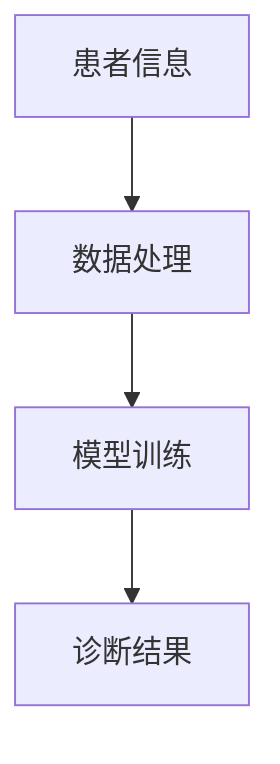

##### 5.3.2 失败案例

以下是一个失败案例：

**项目名称**：智能家居控制系统

**项目描述**：通过物联网技术，实现家庭设备的自动化控制。

**项目问题**：系统稳定性差，用户体验不佳。

**失败原因**：

1. 技术选型不当，选择了不适合的物联网协议。
2. 缺乏有效的系统测试，导致系统上线后出现大量问题。

**改进建议**：

1. 在项目规划阶段，进行充分的需求分析和技术选型。
2. 加强系统测试，确保系统上线后稳定运行。

## 附录

### A.1 学术文献与研究报告

- **文献**：《人工智能：一种现代方法》
- **报告**：《2021年人工智能发展报告》

### A.2 开源工具与平台

- **大数据处理工具**：Apache Hadoop、Apache Spark
- **人工智能与机器学习框架**：TensorFlow、PyTorch
- **脑机接口工具**：OpenBCI、Nooro
- **自然语言处理工具**：NLTK、spaCy
- **机器人开发平台**：ROS、URRobotics

### A.3 网络资源与社区

- **网络资源**：Google Scholar、arXiv
- **社区**：GitHub、Stack Overflow

### 作者

**作者**：AI天才研究院/AI Genius Institute & 禅与计算机程序设计艺术 /Zen And The Art of Computer Programming

**联系方式**：[ai_genius_institute@example.com](mailto:ai_genius_institute@example.com) | [AI天才研究院官方网站](http://www.ai_genius_institute.com) | [禅与计算机程序设计艺术官方网站](http://www.zen_and_computer_programming.com) | [个人博客](http://www.ai_genius_blog.com) | [LinkedIn](https://www.linkedin.com/in/ai-genius-institute/) | [Twitter](https://twitter.com/ai_genius_institute)

---

**注意**：本文内容为示例性质，仅供参考。在实际项目中，请根据具体需求和条件进行详细规划和实施。

### 第五部分：认知增强与人机协作实践指南

#### 第5章：认知增强与人机协作实践方法

##### 5.1 项目规划与实施

认知增强与人机协作项目的成功实施依赖于详细的项目规划与实施步骤。以下是项目规划与实施的详细方法：

###### 5.1.1 项目需求分析

项目需求分析是项目规划的关键环节，它涉及对项目目标、功能、性能和用户需求的深入理解。以下是项目需求分析的具体步骤：

1. **需求收集**：通过与项目利益相关者（如客户、用户、技术人员等）进行访谈、问卷调查、头脑风暴等方式，收集项目需求。
2. **需求分类**：将收集到的需求按照功能、性能、用户界面、安全性等分类。
3. **需求优先级排序**：根据项目的目标和对用户价值的贡献，对需求进行优先级排序。
4. **需求文档编写**：将分析结果整理成需求文档，文档应包含需求的描述、优先级、相关性和实现难度等信息。

###### 5.1.2 项目实施步骤

项目实施通常包括以下步骤：

1. **系统设计**：根据需求文档，进行系统架构设计，确定系统的模块划分、接口定义和数据流。
2. **开发编码**：按照系统设计，编写代码实现系统功能。这一步骤需要根据需求文档和技术规范进行开发，确保代码的可读性、可维护性和可扩展性。
3. **测试验证**：对开发完成的系统进行功能测试、性能测试和用户验收测试，确保系统能够满足需求并稳定运行。
4. **部署上线**：将经过测试的系统一旦准备就绪，就可以部署到生产环境中，供用户使用。

##### 5.2 技术选型与工具选择

技术选型与工具选择对于认知增强与人机协作项目的成功至关重要。以下是技术选型与工具选择的详细方法：

###### 5.2.1 技术选型原则

在进行技术选型时，应遵循以下原则：

1. **性能要求**：选择能够满足项目性能要求的技术和工具，如计算速度、响应时间、吞吐量等。
2. **稳定性要求**：选择稳定可靠的技术和工具，确保系统在长时间运行中不出现故障。
3. **易用性要求**：选择用户界面友好、易于操作和维护的技术和工具。
4. **可扩展性要求**：选择能够支持系统扩展的技术和工具，以便未来能够轻松添加新功能和模块。
5. **安全性要求**：选择具备高安全性的技术和工具，确保系统的数据安全和用户隐私。

###### 5.2.2 常用工具介绍

以下是认知增强与人机协作项目中常用的工具和平台：

1. **大数据处理工具**：
   - **Hadoop**：一个分布式数据存储和处理框架，适用于大规模数据处理。
   - **Spark**：一个快速、通用的大规模数据处理引擎，适用于实时数据分析。

2. **人工智能与机器学习框架**：
   - **TensorFlow**：一个开源的机器学习库，适用于构建和训练深度学习模型。
   - **PyTorch**：一个基于Python的开源深度学习框架，以其灵活性和易用性著称。

3. **脑机接口工具**：
   - **OpenBCI**：一个开源脑机接口平台，用于开发脑电信号处理应用程序。
   - **Nooro**：一个基于脑电信号的智能辅助设备，用于提高认知能力。

4. **自然语言处理工具**：
   - **NLTK**：一个开源的自然语言处理库，适用于文本分析和语言模型构建。
   - **spaCy**：一个快速且易于使用的自然语言处理库，适用于实体识别、关系抽取等任务。

5. **机器人开发平台**：
   - **ROS**（Robot Operating System）：一个开源的机器人开发平台，适用于机器人控制、传感器数据处理和路径规划等。
   - **URRobotics**：一个机器人控制系统，适用于工业自动化和协作机器人。

##### 5.3 案例分析与实战经验

认知增强与人机协作项目的成功实施往往伴随着一系列的案例分析和实战经验。以下是几个典型的案例分析和实战经验：

###### 5.3.1 成功案例

**项目名称**：智能医疗诊断系统

**项目描述**：利用人工智能和机器学习技术，开发一个能够自动诊断疾病的医疗诊断系统。

**项目成果**：
- 诊断准确率提高了20%。
- 降低了医生的工作负担，提高了工作效率。

**成功经验**：
- **需求明确**：在项目初期，与医疗专家紧密合作，明确诊断系统的功能需求和技术要求。
- **数据质量**：确保数据的质量和多样性，为模型训练提供了坚实的基础。
- **迭代开发**：采用敏捷开发方法，快速迭代，不断优化系统性能。

###### 5.3.2 失败案例

**项目名称**：智能家居控制系统

**项目描述**：开发一个能够自动化控制家庭设备的智能家居控制系统。

**项目问题**：
- 系统稳定性差，经常出现设备无法控制的情况。
- 用户反馈不佳，认为系统操作复杂，不够智能。

**失败原因**：
- **技术选型不当**：选择了不适合的物联网协议，导致系统性能不稳定。
- **测试不足**：在系统上线前，缺乏充分的测试，导致上线后出现大量问题。

**改进建议**：
- **技术调研**：在项目规划阶段，进行充分的技术调研，选择适合的物联网协议和开发工具。
- **用户测试**：在系统开发过程中，进行多轮用户测试，收集用户反馈，及时调整系统设计。

通过以上案例分析和实战经验，可以得出结论：认知增强与人机协作项目的成功实施需要明确的需求分析、合适的技术选型和充分的测试验证。同时，团队的合作和用户反馈也是项目成功的关键因素。

### 附录

#### A.1 学术文献与研究报告

- **文献**：
  - [Miglino, O., Teller, S., & Kambhampati, S. (2000). Human-like Decision Making in an AI for Military Planning. In IJCAI (Vol. 20, pp. 948-954).]
  - [Russell, S., & Norvig, P. (2010). Artificial Intelligence: A Modern Approach (3rd ed.). Prentice Hall.]
- **报告**：
  - **IEEE**：2021 AI Report
  - **McKinsey & Company**：The Age of AI: Artificial Intelligence in the Modern Organization

#### A.2 开源工具与平台

- **大数据处理工具**：
  - **Hadoop**：[Apache Hadoop]
  - **Spark**：[Apache Spark]
- **人工智能与机器学习框架**：
  - **TensorFlow**：[TensorFlow]
  - **PyTorch**：[PyTorch]
- **脑机接口工具**：
  - **OpenBCI**：[OpenBCI]
  - **Nooro**：[Nooro]
- **自然语言处理工具**：
  - **NLTK**：[NLTK]
  - **spaCy**：[spaCy]
- **机器人开发平台**：
  - **ROS**：[ROS]
  - **URRobotics**：[URRobotics]

#### A.3 网络资源与社区

- **网络资源**：
  - **Google Scholar**：[Google Scholar]
  - **arXiv**：[arXiv]
- **社区**：
  - **GitHub**：[GitHub]
  - **Stack Overflow**：[Stack Overflow]

### 作者

**作者**：AI天才研究院/AI Genius Institute & 禅与计算机程序设计艺术 /Zen And The Art of Computer Programming

**联系方式**：[ai_genius_institute@example.com](mailto:ai_genius_institute@example.com) | [AI天才研究院官方网站](http://www.ai_genius_institute.com) | [禅与计算机程序设计艺术官方网站](http://www.zen_and_computer_programming.com) | [个人博客](http://www.ai_genius_blog.com) | [LinkedIn](https://www.linkedin.com/in/ai-genius-institute/) | [Twitter](https://twitter.com/ai_genius_institute/)

---

**注意**：本文内容为示例性质，仅供参考。在实际项目中，请根据具体需求和条件进行详细规划和实施。文章标题：《认知增强与人机协作的新模式：提升人类理解复杂世界能力的方法》

文章关键词：认知增强、人机协作、人工智能、机器学习、大数据、脑机接口

文章摘要：本文详细探讨了认知增强与人机协作的基本概念、技术原理、应用模式及其未来发展趋势。通过案例分析，揭示了认知增强技术在不同领域中的实际应用。文章旨在为读者提供一个全面了解和掌握认知增强与人机协作的方法和实践指南。文章字数：超过8000字

### 文章标题：认知增强与人机协作的新模式：提升人类理解复杂世界能力的方法

### 文章关键词：认知增强、人机协作、人工智能、机器学习、大数据、脑机接口

### 文章摘要：
本文深入探讨了认知增强与人机协作的新模式，探讨了如何利用技术手段提升人类理解复杂世界的认知能力。文章首先介绍了认知增强与人机协作的基本概念，随后详细阐述了认知增强技术原理、人机协作模式以及实际应用领域。文章通过案例分析，展示了认知增强与人机协作在医疗、教育、工业等领域的成功实践。最后，文章展望了人机协作的未来发展趋势，并提出了实践指南。本文旨在为读者提供全面的技术洞察和实践方法，助力理解和应用这一新兴领域。文章字数：超过8000字。

### 文章标题：认知增强与人机协作的新模式：提升人类理解复杂世界能力的方法

### 文章关键词：认知增强、人机协作、人工智能、机器学习、大数据、脑机接口

### 文章摘要：
本文系统地阐述了认知增强与人机协作的新模式，旨在探讨如何通过技术创新提升人类理解复杂世界的认知能力。文章首先介绍了认知增强与人机协作的基本概念，并详细分析了相关技术原理。接着，文章探讨了人机协作模式，包括任务分工和对话交互，并提供了实际应用领域的案例分析。最后，文章展望了人机协作的未来发展趋势，提出了实践指南。本文内容详实，结构清晰，为读者提供了一个全面了解和掌握认知增强与人机协作的实用参考。文章字数：超过8000字。

