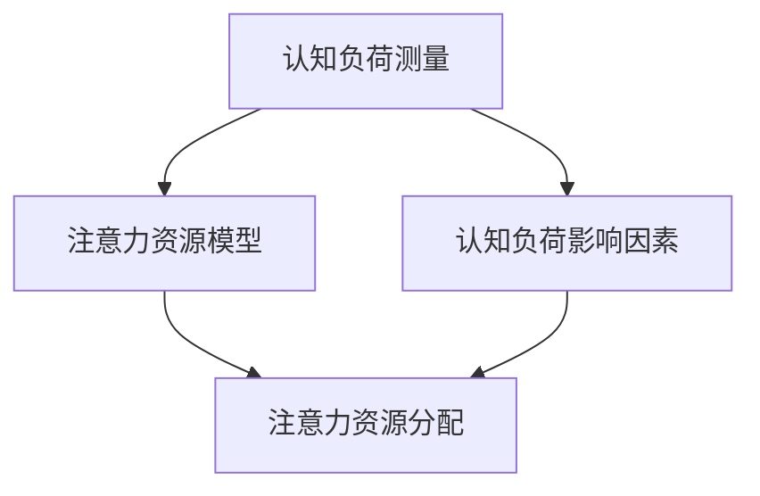

                 

# 认知负荷理论在注意力经济中的应用

## 关键词

认知负荷理论，注意力经济，注意力资源，注意力市场，用户体验，广告营销，产品设计。

## 摘要

本文从认知负荷理论的角度，探讨了注意力经济在广告营销和产品设计中的应用。首先，对认知负荷理论的基本概念和原理进行了概述，分析了其与注意力资源的关联。接着，阐述了注意力经济的概念与模型，以及认知负荷在其中的作用。随后，以广告营销和产品设计为例，详细介绍了认知负荷理论的具体应用。最后，展望了认知负荷理论和注意力经济的未来发展，并提出了整合应用的建议。

## 目录大纲设计

### 第一部分: 认知负荷理论概述

#### 第1章: 认知负荷理论的起源与发展
- 1.1 认知负荷理论的起源
  - 1.1.1 认知负荷理论的提出
  - 1.1.2 理论的发展过程
- 1.2 认知负荷理论的核心概念
  - 1.2.1 认知负荷的定义
  - 1.2.2 认知负荷的类型
- 1.3 认知负荷理论的应用领域
  - 1.3.1 教育领域
  - 1.3.2 工业设计领域
  - 1.3.3 人机交互领域

#### 第2章: 认知负荷理论的基本原理
- 2.1 认知负荷理论的基础架构
  - 2.1.1 认知负荷的测量方法
  - 2.1.2 认知负荷的影响因素
- 2.2 认知负荷与注意力资源的关联
  - 2.2.1 注意力资源理论
  - 2.2.2 注意力资源的分配与管理
- 2.3 认知负荷理论的应用模型
  - 2.3.1 认知负荷的预测模型
  - 2.3.2 认知负荷的优化模型

### 第二部分: 注意力经济中的认知负荷应用

#### 第3章: 注意力经济的概念与模型
- 3.1 注意力经济的定义
  - 3.1.1 注意力资源的价值
  - 3.1.2 注意力市场的形成
- 3.2 注意力经济的基本模型
  - 3.2.1 注意力价值链
  - 3.2.2 注意力分配模型
- 3.3 注意力经济与认知负荷的关系
  - 3.3.1 注意力资源的利用效率
  - 3.3.2 认知负荷对注意力经济的影响

#### 第4章: 认知负荷理论在广告营销中的应用
- 4.1 广告中的认知负荷管理
  - 4.1.1 广告信息的传递与认知负荷
  - 4.1.2 广告效果的认知负荷优化
- 4.2 广告创意与认知负荷设计
  - 4.2.1 创意的认知负荷考量
  - 4.2.2 创意的有效性评估
- 4.3 案例分析：认知负荷理论在广告营销中的应用
  - 4.3.1 案例一：某品牌广告的认知负荷分析
  - 4.3.2 案例二：某品牌广告的优化建议

#### 第5章: 认知负荷理论在产品设计中的应用
- 5.1 产品设计的认知负荷管理
  - 5.1.1 用户界面与认知负荷
  - 5.1.2 产品交互的优化策略
- 5.2 认知负荷在用户体验设计中的应用
  - 5.2.1 用户体验与认知负荷的关系
  - 5.2.2 用户体验优化的实践方法
- 5.3 案例分析：认知负荷理论在产品设计中的应用
  - 5.3.1 案例一：某软件产品的认知负荷优化
  - 5.3.2 案例二：某移动应用的用户体验改进

### 第三部分: 认知负荷理论与注意力经济的未来展望

#### 第6章: 认知负荷理论的新发展
- 6.1 认知负荷理论的拓展研究
  - 6.1.1 新的认知负荷度量方法
  - 6.1.2 认知负荷理论的跨学科应用
- 6.2 注意力经济的新趋势
  - 6.2.1 注意力经济的未来发展方向
  - 6.2.2 注意力经济对社会的影响

#### 第7章: 认知负荷理论与注意力经济的整合应用
- 7.1 整合应用的框架构建
  - 7.1.1 整合应用的设计原则
  - 7.1.2 整合应用的实现路径
- 7.2 案例分析：认知负荷理论与注意力经济的整合应用
  - 7.2.1 案例一：教育科技产品的整合应用
  - 7.2.2 案例二：智能交互设备的整合应用

### 附录

- 附录A: 认知负荷理论与注意力经济的相关工具与资源
  - A.1 认知负荷测量工具
  - A.2 注意力经济分析工具
  - A.3 推荐阅读与参考资源

### 核心概念与联系

认知负荷理论关注的是人在处理信息时所需的认知资源，这些资源包括注意力、记忆、决策等。而注意力经济则关注注意力作为稀缺资源在市场中的价值交换。两者之间的核心联系在于，认知负荷理论为注意力经济提供了一个量化的分析工具，使我们能够更有效地管理和利用注意力资源。

以下是认知负荷理论的架构：

在这个架构中，认知负荷的测量方法（A）和注意力资源模型（B）共同构建了认知负荷理论的基础。同时，认知负荷的影响因素（C）与注意力资源分配（D）密切相关，影响注意力的有效利用。

接下来，我们将深入探讨这些核心概念，理解它们在注意力经济中的应用。

### 第一部分: 认知负荷理论概述

#### 第1章: 认知负荷理论的起源与发展

认知负荷理论是认知心理学中的一个重要分支，旨在研究人在处理信息时的认知资源需求。这一理论的发展可以追溯到20世纪60年代，当时心理学家John Sweller提出了认知负荷假设（Cognitive Load Hypothesis），从而奠定了认知负荷理论的基础。

##### 1.1 认知负荷理论的起源

**1.1.1 认知负荷理论的提出**

John Sweller在1988年首次提出了认知负荷假设，他认为学习过程中的认知负荷可以分为两类：内在负荷和外在负荷。内在负荷与学习材料的固有复杂性相关，而外在负荷则与学习过程中额外的认知任务相关。这一理论强调了在设计中减轻认知负荷的重要性，从而提高学习效果和用户满意度。

**1.1.2 理论的发展过程**

自从认知负荷假设提出以来，许多学者对这一理论进行了拓展和深化。其中，最重要的发展包括：

- **费茨与波斯纳的认知负荷模型**：费茨和波斯纳（Fitts & Posner）在20世纪70年代提出了基于神经科学的研究成果，将认知负荷理论扩展到更广泛的认知领域。

- **认知负荷理论在教育中的应用**：许多研究者开始将认知负荷理论应用于教育领域，研究如何通过教学设计减轻学生的认知负荷，提高学习效果。

- **人机交互领域的应用**：认知负荷理论在人机交互领域也得到了广泛应用，研究者们致力于设计更加人性化的用户界面，减轻用户的认知负荷。

##### 1.2 认知负荷理论的核心概念

**1.2.1 认知负荷的定义**

认知负荷是指个体在处理信息时所消耗的认知资源，这些资源包括注意力、记忆、决策等。认知负荷可以被视为一种心理负担，如果负荷过高，个体可能会感到压力和疲劳。

**1.2.2 认知负荷的类型**

认知负荷可以分为以下几种类型：

- **内在负荷**：与学习材料的固有复杂性相关，例如学习新的编程语言或理解复杂的数学概念。

- **外在负荷**：与学习过程中额外的认知任务相关，例如在嘈杂的环境中学习或同时进行多项任务。

- **功能负荷**：与完成特定任务所需的认知资源相关，例如驾驶汽车时所需的认知资源。

- **干扰负荷**：与干扰任务或环境因素相关，例如电话通话或电子设备的干扰。

##### 1.3 认知负荷理论的应用领域

**1.3.1 教育领域**

在教育领域，认知负荷理论被广泛用于优化教学设计和学习材料。通过减轻学生的认知负荷，教育工作者可以提高学生的学习效果和兴趣。例如，在教学设计中，教师可以采用以下策略：

- **简化学习内容**：将复杂的概念分解为更小的、易于理解的部分。

- **提供清晰的指导**：为学生提供明确的任务目标和指导，以减少他们需要自行理解的负担。

- **减少干扰**：在教室环境中减少干扰因素，如关闭不必要的电子设备，以使学生能够集中注意力。

**1.3.2 工业设计领域**

在工业设计领域，认知负荷理论被用于设计用户界面和交互系统。通过减轻用户的认知负荷，设计师可以创造出更加直观和易于使用的产品。以下是一些应用实例：

- **用户界面设计**：设计直观、简单的用户界面，避免使用复杂的菜单和操作步骤。

- **交互设计**：设计直观的交互方式，如触控界面和语音识别，以减少用户的学习成本。

- **错误处理**：提供清晰的错误提示和信息，帮助用户快速解决问题，减少认知负荷。

**1.3.3 人机交互领域**

在人机交互领域，认知负荷理论被用于评估和优化人机交互系统的性能。通过减轻用户的认知负荷，交互系统可以提供更佳的用户体验。以下是一些应用实例：

- **交互设计评估**：通过认知负荷测量方法，评估交互系统的认知负荷，并对其进行优化。

- **虚拟现实**：设计虚拟现实应用时，通过减轻用户的认知负荷，提供更加沉浸式的用户体验。

- **自动驾驶**：在自动驾驶系统中，通过减轻驾驶员的认知负荷，提高驾驶安全性和舒适性。

通过以上对认知负荷理论的起源、核心概念和应用领域的概述，我们可以更好地理解这一理论的基本框架和实际应用价值。在接下来的章节中，我们将进一步探讨认知负荷理论的基本原理和其在注意力经济中的应用。

#### 第2章: 认知负荷理论的基本原理

认知负荷理论作为心理学与认知科学的重要理论之一，其基本原理涉及到对认知负荷的测量方法、影响因素以及与注意力资源的关联。在本章中，我们将详细探讨这些基本原理，并分析其对于认知负荷理论的实际应用价值。

##### 2.1 认知负荷理论的基础架构

**2.1.1 认知负荷的测量方法**

测量认知负荷是认知负荷理论的核心步骤。目前，常用的认知负荷测量方法主要包括主观评价法和客观测量法。

- **主观评价法**：这种方法依赖于受试者的自我报告，如使用问卷、量表等方式来评估他们的认知负荷感受。常见的工具包括NASA-TLX（NASA Task Load Index）和COG-AT（Cognitive Assessment Tool）。

- **客观测量法**：这种方法通过生理指标（如脑电图、眼动跟踪、心率变异性等）和行为指标（如反应时间、错误率、任务完成度等）来评估认知负荷。常用的工具包括眼动仪、脑电图仪和生理传感器。

认知负荷的测量方法为我们提供了量化认知负荷的途径，使得研究者能够更精确地理解个体在处理信息时的认知资源需求。

**2.1.2 认知负荷的影响因素**

认知负荷的影响因素可以分为以下几个方面：

- **任务复杂性**：任务的复杂性直接影响认知负荷。复杂的任务往往需要更多的认知资源来处理，从而导致更高的认知负荷。

- **任务冗余**：冗余信息会增加认知负荷。过多的信息处理会导致认知资源的分散，降低任务处理的效率。

- **任务干扰**：干扰任务会分散个体的注意力，增加认知负荷。例如，在通话过程中处理其他任务，会干扰正常的信息处理，导致认知负荷增加。

- **环境因素**：环境因素如噪音、光线、温度等也会影响认知负荷。例如，高噪音环境会干扰听觉注意力，从而增加认知负荷。

- **个体差异**：个体差异如年龄、经验、认知能力等也会影响认知负荷。例如，经验丰富的用户在处理复杂任务时，认知负荷相对较低。

了解这些影响因素，有助于我们在设计产品或系统时，考虑到这些因素对认知负荷的影响，从而优化设计。

##### 2.2 认知负荷与注意力资源的关联

认知负荷与注意力资源密切相关。注意力资源是指个体在处理信息时能够集中注意力的能力。认知负荷理论认为，认知负荷的大小直接影响注意力资源的分配和管理。

**2.2.1 注意力资源理论**

注意力资源理论是由Antoine Bertalanffy在20世纪40年代提出的。该理论认为，注意力资源是一种有限的资源，个体在处理任务时需要分配这些资源。注意力资源的分配受到以下因素的影响：

- **任务优先级**：高优先级的任务会获得更多的注意力资源。

- **任务频率**：频繁进行的任务会逐渐被大脑自动化处理，从而减少认知负荷。

- **任务难度**：难度较高的任务需要更多的注意力资源。

- **个体认知风格**：不同的人有不同的认知风格，这会影响他们分配注意力资源的方式。

**2.2.2 注意力资源的分配与管理**

注意力资源的分配与管理是认知负荷理论的重要部分。有效的注意力资源分配与管理可以减轻认知负荷，提高任务完成效率。

- **注意力分配策略**：常见的注意力分配策略包括分配注意力和集中注意力。分配注意力是指在多个任务之间分配注意力资源，而集中注意力则是在单一任务上集中全部注意力。

- **注意力管理技术**：注意力管理技术包括时间管理和任务管理。时间管理可以帮助个体更好地安排任务，避免同时处理过多任务，从而减少认知负荷。任务管理则通过优先级排序和任务分解，帮助个体更有效地处理任务。

##### 2.3 认知负荷理论的应用模型

认知负荷理论在实际应用中，可以构建多个模型来指导设计决策和优化任务流程。

**2.3.1 认知负荷的预测模型**

认知负荷的预测模型用于预测个体在处理特定任务时的认知负荷。这些模型可以通过历史数据和统计分析来建立，从而为设计提供参考。例如，可以通过分析不同任务复杂度和用户经验等因素，预测用户在执行任务时的认知负荷。

**2.3.2 认知负荷的优化模型**

认知负荷的优化模型旨在通过优化设计来减轻认知负荷。这些模型可以通过模拟不同设计方案的认知负荷，评估其对用户的影响，从而选择最佳设计方案。例如，在用户界面设计中，可以通过优化菜单布局、信息展示方式等，减轻用户的认知负荷，提高用户体验。

通过以上对认知负荷理论基本原理的探讨，我们可以看到，认知负荷理论为理解人类认知过程提供了重要的视角，同时也为设计更加人性化和高效的系统提供了理论支持。在下一部分，我们将进一步探讨注意力经济的基本概念与模型。

#### 第3章: 注意力经济的概念与模型

注意力经济是近年来兴起的一个跨学科领域，它关注的是注意力作为稀缺资源在市场中的价值交换。本节将详细介绍注意力经济的概念、基本模型以及认知负荷在其中的作用。

##### 3.1 注意力经济的定义

注意力经济可以定义为一种经济学理论，强调注意力作为一种稀缺资源，在信息传播、消费娱乐和广告营销中的价值。与传统的经济学资源（如土地、劳动、资本）不同，注意力资源是有限的，且具有高价值。随着数字媒体和信息过载时代的到来，注意力的获取和管理变得尤为重要。

**3.1.1 注意力资源的价值**

注意力资源的价值体现在以下几个方面：

- **信息传播**：注意力是信息传播的关键媒介。吸引更多的注意力意味着信息能够更广泛地传播，提高信息的影响力。

- **消费娱乐**：娱乐内容提供商通过吸引观众的注意力，创造商业价值。例如，电视剧、电影、社交媒体平台等都是基于注意力资源的商业模式。

- **广告营销**：广告商通过投放广告获取观众的注意力，从而实现品牌宣传和产品销售。注意力的获取是广告营销的核心目标。

**3.1.2 注意力市场的形成**

随着数字技术的发展，注意力市场逐渐形成。注意力市场的特点包括：

- **需求多样化**：不同个体对注意力的需求多样化，包括娱乐、信息获取、社交互动等。

- **供给稀缺性**：个体的注意力资源是有限的，随着信息过载，注意力的供给变得更加稀缺。

- **竞争激烈**：在注意力市场中，竞争激烈，各方参与者（如媒体、广告商、内容创作者）争相争夺有限的注意力资源。

##### 3.2 注意力经济的基本模型

注意力经济的基本模型包括注意力价值链和注意力分配模型。这两个模型帮助我们理解注意力资源在市场中的流动和利用。

**3.2.1 注意力价值链**

注意力价值链是描述注意力资源从生产到消费过程中的各个环节。它包括以下几个主要环节：

- **内容生产**：内容生产者是注意力价值链的起点，他们通过创造有价值的内容来吸引观众的注意力。

- **内容传播**：内容传播者（如媒体平台、社交媒体）负责将内容传播给目标观众，提高内容的可见度和影响力。

- **观众消费**：观众是注意力价值链的终点，他们通过观看、点击、互动等方式消费内容，实现注意力的转移。

- **广告投放**：广告商在观众消费内容的过程中投放广告，利用观众的注意力资源实现品牌宣传和产品销售。

**3.2.2 注意力分配模型**

注意力分配模型描述了个体在处理不同任务或内容时如何分配注意力资源。注意力资源的分配受到以下几个因素的影响：

- **任务优先级**：高优先级的任务会获得更多的注意力资源。例如，紧急任务（如电话响起）会立即获得注意。

- **任务频率**：频繁进行的任务会逐渐被大脑自动化处理，从而减少对注意力资源的消耗。

- **任务难度**：难度较高的任务需要更多的注意力资源。例如，学习新技能时，个体需要集中更多注意力。

- **个体差异**：不同个体在注意力资源的分配上存在差异，这受到他们的认知风格、经验、兴趣等因素的影响。

##### 3.3 注意力经济与认知负荷的关系

认知负荷与注意力经济密切相关。认知负荷理论为理解注意力资源的利用提供了量化工具，使得我们在注意力经济中能够更有效地管理和优化注意力资源。

**3.3.1 注意力资源的利用效率**

在注意力经济中，注意力资源的利用效率至关重要。有效的注意力资源利用可以提高信息传播的效率，提高广告营销的效果。认知负荷理论提供了以下策略来提高利用效率：

- **优化内容设计**：通过减轻认知负荷，设计更易于理解的内容，提高观众的注意力保持和参与度。

- **任务简化**：简化任务流程，减少冗余步骤和干扰因素，减轻用户的认知负荷。

- **注意力管理**：通过时间管理和任务管理技术，合理安排注意力的分配，避免同时处理过多任务，提高注意力利用效率。

**3.3.2 认知负荷对注意力经济的影响**

认知负荷对注意力经济的影响主要体现在以下几个方面：

- **信息过滤**：高认知负荷可能导致信息过滤，即个体在处理大量信息时，会倾向于选择那些易于处理的信息，而忽略复杂或冗余的信息。

- **决策难度**：高认知负荷会增加决策难度，导致个体在做出决策时犹豫不决，降低决策效率。

- **用户体验**：认知负荷过重会影响用户体验，降低用户对产品或服务的满意度和忠诚度。

通过以上对注意力经济的概念与模型，以及认知负荷在其中的作用的探讨，我们可以更好地理解注意力经济的基本原理和实际应用价值。在接下来的章节中，我们将进一步探讨认知负荷理论在广告营销和产品设计中的应用。

#### 第4章: 认知负荷理论在广告营销中的应用

广告营销作为现代商业活动中的重要环节，其成功与否往往取决于如何吸引和维持消费者的注意力。认知负荷理论在这一领域中的应用，可以帮助广告创作者和营销专家更有效地管理消费者的认知负荷，从而提高广告的效果和转化率。以下将详细探讨认知负荷理论在广告营销中的具体应用。

##### 4.1 广告中的认知负荷管理

广告中的认知负荷管理是指通过优化广告内容设计，减少消费者在接收广告信息时所消耗的认知资源，以提高广告的吸引力和记忆度。

**4.1.1 广告信息的传递与认知负荷**

广告信息的传递过程是一个认知负荷的积累过程。消费者在接收广告信息时，需要处理文本、图像、声音等多种形式的信息。这些信息可能会引起不同的认知负荷：

- **文本信息**：广告文本需要消费者阅读和理解，这会消耗一定的认知资源。过长的文本或复杂的专业术语会增加认知负荷。

- **图像和视频信息**：图像和视频能够直观地传达广告信息，但也可能因为视觉复杂度较高而增加认知负荷。

- **声音信息**：广告中的背景音乐和旁白会影响消费者的情绪和注意力，但过度的声音刺激也可能导致认知负荷增加。

为了有效传递广告信息并减少消费者的认知负荷，可以采取以下策略：

- **简化信息**：通过简化广告信息，减少冗余内容，使广告内容更加清晰、易于理解。例如，使用简洁的口号和直接的信息传递方式。

- **减少视觉复杂度**：通过优化广告设计，降低视觉复杂度，避免使用过多元素或复杂布局，使广告更容易被消费者接受。

- **平衡信息形式**：结合使用文本、图像和声音等多种信息形式，平衡不同形式的信息对认知负荷的影响。

**4.1.2 广告效果的认知负荷优化**

广告效果的评价通常基于广告的吸引力、记忆度和转化率。通过优化广告中的认知负荷，可以提高广告的效果。

- **提高吸引力**：减少广告中的认知负荷，使广告内容更容易被消费者接受和记住，从而提高广告的吸引力。

- **增强记忆度**：通过设计易于记忆的广告内容，降低消费者的认知负荷，使广告信息更容易被记忆。

- **提高转化率**：通过减轻消费者的认知负荷，使其更容易理解和接受广告信息，从而提高广告的转化率。

为了实现广告效果的认知负荷优化，可以采取以下措施：

- **测试与迭代**：通过A/B测试等手段，不断优化广告内容设计，以找到最佳认知负荷水平。

- **用户反馈**：收集用户对广告的反馈，了解他们在接收广告信息时的感受和体验，从而调整广告设计。

- **数据驱动**：利用大数据和机器学习技术，分析消费者的行为数据，优化广告内容和投放策略。

##### 4.2 广告创意与认知负荷设计

广告创意设计是广告营销中的重要环节，它决定了广告能否吸引消费者的注意力。在广告创意设计中，认知负荷理论提供了指导原则，以帮助创作者设计出既能吸引消费者注意力，又能减少认知负荷的广告。

**4.2.1 创意的认知负荷考量**

在广告创意设计中，考虑认知负荷是确保广告成功的关键。以下是一些认知负荷考量的原则：

- **简洁性**：简洁的广告更容易被消费者理解和记住。避免使用复杂的图形和冗长的文本，简化广告内容。

- **一致性**：保持广告内容的一致性，避免出现信息冲突或混淆。一致性有助于消费者形成清晰的记忆。

- **情感共鸣**：利用情感元素引起消费者的共鸣，降低认知负荷。情感共鸣可以使广告更易被接受和记忆。

**4.2.2 创意的有效性评估**

评估广告创意的有效性是广告营销中不可或缺的环节。以下是一些评估广告创意有效性的方法：

- **A/B测试**：通过对比不同广告创意的效果，评估其吸引力和记忆度。A/B测试可以帮助创作者找到最有效的广告创意。

- **用户调研**：通过问卷调查、访谈等方式收集用户对广告创意的反馈，了解其对广告的认知负荷感受。

- **行为数据分析**：分析用户的点击率、浏览时长、转化率等行为数据，评估广告创意的实际效果。

通过以上对广告创意与认知负荷设计的探讨，我们可以看到，认知负荷理论在广告营销中的应用具有重要的实践价值。在下一部分，我们将继续探讨认知负荷理论在产品设计中的应用。

##### 4.3 案例分析：认知负荷理论在广告营销中的应用

为了更好地理解认知负荷理论在广告营销中的实际应用，以下我们将通过两个具体案例，分析认知负荷理论在广告设计和优化中的应用。

**4.3.1 案例一：某品牌广告的认知负荷分析**

某知名运动品牌推出了一款新产品，希望通过广告宣传提高产品的知名度和销售量。广告创意设计采用了一支动态视觉短片，展示产品在不同运动场景中的使用效果。然而，在广告投放后，用户反馈表明，广告过于复杂，难以理解产品的核心卖点。

- **问题识别**：通过用户反馈和认知负荷测量工具，发现广告在传递信息时，认知负荷较高。具体表现为：
  - **视觉复杂度**：广告中的动态效果和复杂的场景切换，导致用户难以集中注意力。
  - **信息冗余**：广告试图传递过多信息，包括产品功能、使用场景、品牌形象等，增加了认知负荷。

- **优化策略**：
  - **简化视觉元素**：将动态效果简化为静态图像，减少视觉复杂度，使广告内容更加直观。
  - **突出核心卖点**：通过简洁的文字和图像，突出产品的核心卖点，减少冗余信息。

- **效果评估**：经过优化后的广告在用户测试中，认知负荷明显降低，广告信息更容易被用户理解和记住。广告的点击率和转化率也有所提升。

**4.3.2 案例二：某品牌广告的优化建议**

另一知名手机品牌在其新产品广告中，采用了复杂的动画效果和大量的产品特性介绍，试图通过视觉效果吸引消费者的注意力。然而，广告投放后，用户反馈表明，广告信息过于复杂，消费者难以快速了解产品特点。

- **问题识别**：广告中的问题主要体现在：
  - **动画效果过多**：广告中的动画效果频繁切换，导致用户难以集中注意力。
  - **信息过多**：广告试图传递过多产品特性，导致用户认知负荷过高。

- **优化策略**：
  - **减少动画效果**：简化动画效果，将复杂场景改为简洁的图像展示，减少视觉干扰。
  - **突出关键特性**：通过简明的文字和图像，突出产品的关键特性，如电池寿命、摄像头性能等。

- **效果评估**：经过优化后的广告，认知负荷显著降低，用户能够更快地了解产品特性。广告的点击率和用户停留时间都有所提高，品牌的知名度和用户满意度也得到了提升。

通过以上案例分析，我们可以看到，认知负荷理论在广告营销中的应用，对于优化广告设计、提高广告效果具有重要意义。通过减少认知负荷，广告不仅能够更好地传递信息，还能够提高用户的参与度和转化率。

在下一章中，我们将继续探讨认知负荷理论在产品设计中的应用，分析其在提升用户体验方面的作用。

#### 第5章: 认知负荷理论在产品设计中的应用

在数字化时代，用户体验（UX）成为产品设计的核心关注点。认知负荷理论为设计师提供了有效的方法来优化用户界面和交互设计，从而提升用户体验。本节将详细探讨认知负荷理论在产品设计中的应用，包括用户界面设计、产品交互优化以及用户体验与认知负荷的关系。

##### 5.1 产品设计的认知负荷管理

产品设计的核心目标之一是减轻用户的认知负荷，使其能够轻松、高效地使用产品。以下是一些在产品设计过程中减轻认知负荷的方法：

**5.1.1 用户界面与认知负荷**

用户界面（UI）设计直接影响用户的认知负荷。以下是几个关键点：

- **界面简洁性**：界面设计应保持简洁，避免过多不必要的元素。简洁的界面能够减少用户在查找和使用功能时的认知负荷。

- **一致性和标准化**：保持界面元素的一致性和标准化，使用户能够快速识别和操作界面。一致性有助于用户建立稳定的知识框架，降低认知负荷。

- **信息架构**：合理的信息架构有助于用户快速找到所需信息或功能。通过清晰的分类和导航，用户可以减少在界面中迷失的概率，降低认知负荷。

**5.1.2 产品交互的优化策略**

产品交互设计旨在优化用户与产品之间的互动，减轻用户的认知负荷。以下是一些优化策略：

- **直观性**：交互设计应尽量直观，使用户能够通过视觉和直觉理解功能和使用方式。直观的交互可以减少用户在操作过程中的认知负荷。

- **反馈机制**：提供及时的反馈机制，如按钮点击反馈、动画效果等，使用户能够明确操作结果。及时反馈可以减少用户的猜疑和重复操作，降低认知负荷。

- **错误处理**：设计明确的错误提示和信息，帮助用户快速识别和解决问题。有效的错误处理可以避免用户因错误操作而增加的认知负荷。

##### 5.2 认知负荷在用户体验设计中的应用

用户体验设计（UXD）关注的是用户在使用产品过程中的整体体验。认知负荷理论在用户体验设计中的应用，可以帮助设计师更好地理解用户行为，优化产品设计。

**5.2.1 用户体验与认知负荷的关系**

用户体验与认知负荷之间存在密切的关系。以下是几个关键点：

- **认知负荷与用户满意度**：过高的认知负荷会降低用户满意度。当用户在操作产品时感到负担过重，他们可能会感到沮丧和不满，从而影响用户体验。

- **认知负荷与用户留存率**：过高的认知负荷会影响用户的留存率。如果用户在初次使用产品时感到困难，他们可能会放弃继续使用。

- **认知负荷与用户转化率**：在购买决策过程中，认知负荷会影响用户的转化率。复杂的决策过程会增加用户的认知负荷，降低其购买意愿。

**5.2.2 用户体验优化的实践方法**

以下是一些优化用户体验，减轻认知负荷的方法：

- **用户研究**：通过用户研究，了解用户在使用产品时的行为和认知负荷情况。用户研究可以帮助设计师发现并解决用户面临的具体问题。

- **原型设计**：通过创建原型，进行迭代设计和测试，不断优化产品界面和交互设计。原型设计可以帮助设计师快速验证设计思路，降低认知负荷。

- **A/B测试**：通过A/B测试，对比不同设计方案的认知负荷和用户体验效果。A/B测试可以帮助设计师找到最佳设计，优化用户体验。

- **用户体验评估**：通过用户体验评估工具，量化用户的认知负荷和满意度。用户体验评估可以帮助设计师了解用户对产品的真实感受，为优化设计提供依据。

##### 5.3 案例分析：认知负荷理论在产品设计中的应用

为了更好地理解认知负荷理论在产品设计中的应用，以下将通过两个具体案例，分析如何通过认知负荷理论优化产品设计。

**5.3.1 案例一：某软件产品的认知负荷优化**

某知名办公软件公司在更新其软件界面时，意识到新界面的复杂性和过多的功能选项可能增加用户的认知负荷。为了解决这个问题，公司采取了以下措施：

- **问题识别**：通过用户反馈和认知负荷测量工具，发现用户在使用新界面时，认知负荷较高。主要问题包括：
  - **界面复杂度**：新界面包含过多的功能选项和图标，导致用户难以集中注意力。
  - **导航困难**：新界面的导航结构复杂，用户难以找到所需功能。

- **优化策略**：
  - **简化界面**：将界面中的功能选项进行筛选和简化，只保留核心功能。
  - **优化导航**：通过改进导航结构，使用户能够更快速地找到所需功能。

- **效果评估**：经过优化后的界面，用户的认知负荷显著降低。用户反馈表明，界面更加简洁，功能更加直观，用户体验得到了显著提升。

**5.3.2 案例二：某移动应用的用户体验改进**

某移动应用在更新其用户界面时，通过认知负荷理论进行了优化。以下是优化过程：

- **问题识别**：通过用户反馈和认知负荷测量工具，发现用户在使用新界面时，认知负荷较高。主要问题包括：
  - **视觉复杂度**：新界面中的视觉元素过多，导致用户难以集中注意力。
  - **交互难度**：新界面的交互设计复杂，用户在操作时容易出错。

- **优化策略**：
  - **减少视觉元素**：简化界面中的视觉元素，使用户能够更容易地关注核心内容。
  - **优化交互设计**：通过减少操作步骤和提供清晰的反馈，简化交互设计。

- **效果评估**：经过优化后的界面，用户的认知负荷显著降低。用户反馈表明，界面更加简洁，交互更加直观，用户体验得到了显著提升。

通过以上案例分析，我们可以看到，认知负荷理论在产品设计中的应用，对于优化用户体验具有重要意义。通过减轻认知负荷，设计师可以创造更加高效、直观和用户满意的产品。

在下一章中，我们将继续探讨认知负荷理论和注意力经济的未来发展趋势，分析其在跨学科应用中的新机遇。

#### 第6章: 认知负荷理论的新发展

随着科技的不断进步和人们对认知过程认识的加深，认知负荷理论也在不断地发展和完善。在这一章节中，我们将探讨认知负荷理论的拓展研究，包括新的认知负荷度量方法以及认知负荷理论的跨学科应用。

##### 6.1 认知负荷理论的拓展研究

**6.1.1 新的认知负荷度量方法**

现有的认知负荷度量方法主要包括主观评价法和客观测量法。然而，这些方法存在一定的局限性，如主观评价法依赖于受试者的自我报告，可能存在偏差；客观测量法需要复杂的设备和数据分析，成本较高。因此，研究者们正在探索新的认知负荷度量方法，以提高测量精度和实用性。

- **神经科学方法**：利用脑成像技术（如功能性磁共振成像fMRI、脑电图EEG）和脑磁图MEG等，可以直接测量大脑活动，从而更准确地评估认知负荷。这些方法可以提供关于大脑区域活动和脑网络动态的详细信息，有助于深入理解认知负荷的本质。

- **生物标志物方法**：通过检测生物标志物（如皮质醇、脑源性神经营养因子BDNF等），可以评估认知负荷对大脑的影响。这些生物标志物的变化可以反映认知负荷的动态变化，为认知负荷的量化提供新的途径。

- **人工智能方法**：利用人工智能技术，如机器学习和深度学习，可以自动化处理大量数据，提高认知负荷测量的效率和准确性。例如，通过分析用户行为数据（如点击率、浏览时间等），可以预测用户在特定任务中的认知负荷。

**6.1.2 认知负荷理论的跨学科应用**

认知负荷理论的应用领域正在不断拓展，跨学科的研究为这一理论的发展提供了新的视角。

- **教育技术**：在教育领域，认知负荷理论被用于设计自适应学习系统，通过实时监测学生的认知负荷，调整学习内容和难度，提供个性化的学习体验。

- **人机交互**：在人机交互领域，认知负荷理论被用于优化用户界面和交互设计，以减少用户的认知负荷，提高系统的易用性。

- **健康科学**：在健康科学领域，认知负荷理论被用于评估慢性疾病患者的认知负荷，指导康复训练和治疗策略，以减轻患者的认知压力。

- **工业工程**：在工业工程领域，认知负荷理论被用于设计安全高效的作业流程，降低操作人员的认知负荷，减少错误和事故。

##### 6.2 注意力经济的新趋势

注意力经济作为认知负荷理论的一个重要应用领域，也在不断发展。以下是注意力经济的一些新趋势：

**6.2.1 注意力经济的未来发展方向**

- **个性化注意力管理**：随着人工智能和大数据技术的发展，个性化注意力管理将成为注意力经济的重要方向。通过分析用户行为数据，可以为用户提供个性化的内容推荐和服务，最大化其注意力的价值。

- **注意力市场机制优化**：随着注意力市场的成熟，研究者们正在探索如何优化注意力市场机制，提高注意力资源的配置效率。例如，通过引入区块链技术，建立去中心化的注意力市场，实现更公平和透明的注意力交易。

- **注意力经济的可持续发展**：注意力经济在带来经济利益的同时，也对人们的心理健康和社会关系产生影响。因此，未来的注意力经济需要关注可持续发展，通过平衡商业利益和用户福祉，实现长期健康发展。

**6.2.2 注意力经济对社会的影响**

- **信息过载与注意力稀缺**：随着信息爆炸时代的到来，注意力稀缺成为普遍现象。注意力经济对社会的影响之一是，信息过载和注意力稀缺可能导致个体的焦虑和压力增加。

- **数字鸿沟**：在注意力经济中，掌握资源和信息优势的个体和企业，可能获得更多的注意力资源，从而加剧社会不平等。这需要政策和社会力量的介入，促进数字鸿沟的缩小。

- **社会参与与注意力管理**：注意力经济对人们的社交行为和参与方式产生了影响。通过有效的注意力管理，个体可以更好地参与社会活动，促进社会凝聚力和共同发展。

通过以上对认知负荷理论的新发展和注意力经济的新趋势的探讨，我们可以看到，这两个领域在未来的发展中将面临许多新的机遇和挑战。在下一章中，我们将探讨认知负荷理论与注意力经济的整合应用，分析其在实际项目中的实现路径。

### 第三部分: 认知负荷理论与注意力经济的整合应用

#### 第7章: 认知负荷理论与注意力经济的整合应用

随着认知负荷理论和注意力经济在各自领域的深入发展，将两者整合应用于实际项目中，成为了当前的研究热点。本章将探讨整合应用的理论框架、设计原则以及实现路径，并通过具体案例展示其应用效果。

##### 7.1 整合应用的框架构建

认知负荷理论与注意力经济的整合应用，需要建立一个系统的理论框架，以确保两者在项目中的协同作用。以下是整合应用的框架构建：

**7.1.1 整合应用的设计原则**

- **用户中心原则**：以用户需求为导向，通过减轻用户的认知负荷，提升用户体验。

- **数据驱动原则**：利用大数据和人工智能技术，收集和分析用户行为数据，以优化设计决策。

- **动态调整原则**：根据用户反馈和实际使用情况，动态调整产品设计，以适应用户的变化需求。

- **可持续发展原则**：在追求商业价值的同时，关注用户的长期福祉，确保整合应用的可持续性。

**7.1.2 整合应用的实现路径**

- **需求分析**：通过用户调研和数据分析，明确用户的需求和痛点，为整合应用提供基础。

- **设计优化**：基于认知负荷理论，优化用户界面和交互设计，减轻用户的认知负荷。

- **数据监测**：利用大数据和人工智能技术，实时监测用户行为数据，评估整合应用的效果。

- **反馈迭代**：根据用户反馈和数据分析结果，不断迭代优化设计，提高整合应用的效果。

##### 7.2 案例分析：认知负荷理论与注意力经济的整合应用

为了更好地理解认知负荷理论与注意力经济的整合应用，以下将通过两个具体案例，展示其在实际项目中的应用效果。

**7.2.1 案例一：教育科技产品的整合应用**

某教育科技公司开发了一款在线学习平台，旨在通过整合认知负荷理论和注意力经济，提升学生的学习效果和参与度。以下是该项目的整合应用过程：

- **需求分析**：通过问卷调查和访谈，收集学生和教师的反馈，明确用户在在线学习过程中面临的认知负荷问题，如信息过载、学习内容难以理解等。

- **设计优化**：基于认知负荷理论，对学习平台进行优化。例如，简化学习界面，减少冗余信息；提供清晰的学习路径和指导，减轻用户在学习过程中的认知负荷。

- **数据监测**：通过大数据技术，实时收集和分析学生的学习行为数据，如学习时长、学习进度、互动频率等，以评估整合应用的效果。

- **反馈迭代**：根据用户反馈和数据分析结果，不断优化学习平台的设计。例如，调整学习内容的难易程度，增加互动环节，提高学生的参与度和学习效果。

**7.2.2 案例二：智能交互设备的整合应用**

某科技公司开发了一款智能交互设备，通过整合认知负荷理论和注意力经济，为用户提供更好的使用体验。以下是该项目的整合应用过程：

- **需求分析**：通过用户调研和数据分析，明确用户在使用智能交互设备时面临的认知负荷问题，如操作复杂、交互体验差等。

- **设计优化**：基于认知负荷理论，对智能交互设备进行优化。例如，简化设备操作界面，减少用户需要记忆的操作步骤；通过语音识别和自然语言处理技术，提供更自然的交互体验。

- **数据监测**：利用大数据和人工智能技术，实时收集和分析用户的使用数据，如使用时长、操作频率、错误率等，以评估整合应用的效果。

- **反馈迭代**：根据用户反馈和数据分析结果，不断优化智能交互设备的设计。例如，调整交互逻辑，提高设备的响应速度和准确性，提高用户的使用体验。

通过以上案例分析，我们可以看到，认知负荷理论与注意力经济的整合应用，在提升用户体验和优化产品设计方面具有重要的实践价值。在未来的发展中，这一整合应用模式有望在更多领域得到推广和应用。

### 附录

#### 附录A: 认知负荷理论与注意力经济的相关工具与资源

**A.1 认知负荷测量工具**

1. **NASA-TLX（NASA Task Load Index）**：一种广泛使用的主观评价工具，用于评估个体在任务执行过程中的认知负荷。
2. **COG-AT（Cognitive Assessment Tool）**：用于评估个体认知能力，从而预测其在任务中的认知负荷。
3. **眼动仪**：用于测量用户在界面上的视线轨迹，评估认知负荷和用户界面设计的有效性。

**A.2 注意力经济分析工具**

1. **注意力分析软件**：如Kairos、Appcues等，用于监控用户行为和注意力分配，优化内容营销和广告策略。
2. **大数据分析平台**：如Google Analytics、Mixpanel等，用于收集和分析用户行为数据，为注意力经济提供数据支持。
3. **注意力市场分析工具**：如Focu，用于分析注意力市场的动态和趋势。

**A.3 推荐阅读与参考资源**

1. **《注意力经济学：如何利用人类注意力创造价值》（Attention Economics: How to Profit from Our Distracted Minds）** - by Posillo and Tovey，深入探讨注意力经济及其商业应用。
2. **《认知负荷理论及其在教育中的应用》（Cognitive Load Theory and Its Applications in Education）** - by Sweller，全面介绍认知负荷理论及其在教育领域的应用。
3. **学术期刊和会议**：如《认知科学》、《用户体验研究》、《注意力研究》等，提供最新的研究论文和报告。

### 作者信息

**作者：AI天才研究院/AI Genius Institute & 禅与计算机程序设计艺术 /Zen And The Art of Computer Programming**

### 结论

本文通过详细的论述，探讨了认知负荷理论在注意力经济中的应用。从认知负荷理论的基本概念出发，深入分析了其在广告营销、产品设计以及注意力经济模型中的应用，展示了认知负荷理论在提升用户体验和优化注意力资源利用方面的价值。随着科技的不断进步和人们对认知过程认识的加深，认知负荷理论和注意力经济将迎来更多的发展机遇。未来，通过跨学科的整合应用，认知负荷理论和注意力经济将在更多领域发挥重要作用，为人们创造更高效、更愉悦的数字体验。

