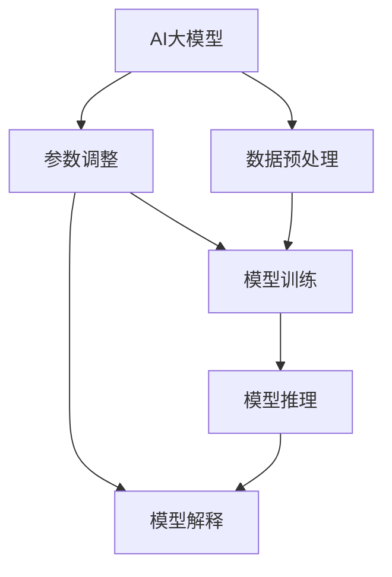

                 

### 《设计AI大模型专用编程语言：提示词语言的艺术》

#### 关键词：
- AI大模型
- 提示词语言
- 编程语言设计
- 人工智能编程
- 自然语言处理
- 计算机视觉
- 强化学习

#### 摘要：
本文深入探讨了设计AI大模型专用编程语言——提示词语言的艺术。首先，我们分析了AI大模型的基本概念与作用，以及提示词语言的基础知识与原理。随后，文章详细介绍了提示词语言的设计原则与实现方法，并对性能优化进行了探讨。接着，我们通过具体案例展示了提示词语言在AI大模型训练和推理中的应用，包括自然语言处理、计算机视觉和强化学习等领域。最后，文章展望了提示词语言的未来发展趋势，以及面临的挑战与机遇。本文旨在为人工智能领域的开发者提供一份全面、系统的指南，帮助读者理解和掌握提示词语言的设计与实现。

### 《设计AI大模型专用编程语言：提示词语言的艺术》目录大纲

1. 第一部分: AI大模型与提示词语言概述
    - 第1章: AI大模型与提示词语言基础
        - 1.1 AI大模型的概念与作用
        - 1.2 提示词语言的概念与原理
        - 1.3 AI大模型与提示词语言的联系
    - 第2章: 提示词语言的设计与实现
        - 2.1 提示词语言的设计原则
        - 2.2 提示词语言的实现方法
        - 2.3 提示词语言的性能优化
2. 第二部分: 提示词语言在AI大模型中的应用
    - 第3章: 提示词语言在AI大模型训练中的应用
    - 第4章: 提示词语言在AI大模型推理中的应用
3. 第三部分: 提示词语言的应用案例
    - 第5章: 提示词语言在自然语言处理中的应用
    - 第6章: 提示词语言在计算机视觉中的应用
    - 第7章: 提示词语言在强化学习中的应用
4. 第四部分: 提示词语言的未来发展趋势
    - 第8章: 提示词语言的未来发展趋势
    - 第9章: 提示词语言的发展挑战与机遇

### 第一部分: AI大模型与提示词语言概述

#### 第1章: AI大模型与提示词语言基础

## 1.1 AI大模型的概念与作用

### 1.1.1 AI大模型的核心特征

AI大模型是指具有大规模参数和高度复杂性的深度学习模型。这些模型能够处理海量数据并从中学习到复杂的模式，具有以下核心特征：

1. **大规模参数**：AI大模型通常具有数百万甚至数十亿个参数。这些参数通过训练过程进行调整，以最小化预测误差。
   
2. **高计算复杂度**：由于参数数量庞大，AI大模型在训练和推理过程中需要大量的计算资源，对硬件要求较高。

3. **自适应学习**：AI大模型能够通过自我调整参数来适应不同的数据和任务，具备高度的自适应能力。

4. **泛化能力**：AI大模型不仅能够在训练数据上表现良好，还能够在新数据上保持较好的性能，具有强大的泛化能力。

### 1.1.2 AI大模型在AI系统中的应用

AI大模型在AI系统中扮演着至关重要的角色，主要应用于以下几个方面：

1. **自然语言处理**：AI大模型在自然语言处理（NLP）领域有着广泛的应用，如文本分类、情感分析、机器翻译等。

2. **计算机视觉**：AI大模型在计算机视觉领域也有着显著的应用，如图像分类、目标检测、图像生成等。

3. **语音识别**：AI大模型在语音识别领域表现出色，能够将语音转换为文本，并实现语音合成。

4. **强化学习**：AI大模型在强化学习领域能够学习复杂的策略，实现智能决策。

## 1.2 提示词语言的概念与原理

### 1.2.1 提示词语言的基础知识

提示词语言是一种专门用于与AI大模型进行交互的编程语言。其核心思想是通过一系列的提示词（prompt）来引导AI大模型生成预期的输出。提示词语言具有以下基础知识：

1. **提示词**：提示词是提示词语言中的基本元素，用于引导AI大模型进行推理和生成。提示词可以是文字、图像或其他形式的数据。

2. **语法**：提示词语言的语法规则定义了提示词的构成和组合方式。不同的提示词语言可能有不同的语法规则，但通常都要求语法简洁、易于理解。

3. **语义**：提示词语言的语义定义了提示词的含义和功能。语义解析是提示词语言的核心任务，旨在理解并正确处理提示词。

### 1.2.2 提示词语言的工作原理

提示词语言的工作原理主要涉及以下步骤：

1. **输入提示词**：用户通过提示词语言编写提示词，并将其输入到AI大模型中。

2. **语义解析**：AI大模型对输入的提示词进行语义解析，理解提示词的含义和功能。

3. **推理与生成**：基于语义解析的结果，AI大模型进行推理和生成，输出预期的结果。

4. **反馈与优化**：用户对输出结果进行评估，并通过反馈优化提示词，进一步提高模型性能。

## 1.3 AI大模型与提示词语言的联系

### 1.3.1 提示词语言在AI大模型训练中的应用

提示词语言在AI大模型训练中发挥着重要作用，主要体现在以下几个方面：

1. **数据预处理**：提示词语言可以帮助用户对训练数据进行预处理，包括数据清洗、数据增强等。

2. **模型调优**：提示词语言可以为用户提供丰富的调优工具，如参数调整、损失函数优化等。

3. **模型初始化**：提示词语言可以帮助用户初始化AI大模型，为后续训练奠定基础。

### 1.3.2 提示词语言在AI大模型推理中的应用

提示词语言在AI大模型推理中的应用同样重要，主要体现在以下几个方面：

1. **实时推理**：提示词语言可以支持实时推理，为用户提供实时决策和生成结果。

2. **模型解释**：提示词语言可以帮助用户理解AI大模型的推理过程和结果，提高模型的可解释性。

3. **模型优化**：提示词语言可以用于优化AI大模型的推理性能，如模型压缩、加速等。

### 提示词语言在AI大模型训练中的应用

#### 3.1 提示词语言在训练数据准备中的应用

在AI大模型训练过程中，训练数据的准备是至关重要的一步。提示词语言在这方面发挥着独特的作用，具体体现在以下几个方面：

1. **数据清洗**：训练数据通常存在噪声和不一致的情况，提示词语言可以通过编写特定的提示词，指导AI大模型对数据进行清洗，去除噪声和不一致的数据。

2. **数据增强**：为了提高AI大模型的泛化能力，需要对训练数据进行增强。提示词语言可以通过编写增强算法的提示词，自动生成新的训练数据，从而提高模型的性能。

3. **数据分类**：在训练过程中，需要对数据进行分类。提示词语言可以帮助用户快速编写分类算法的提示词，实现高效的数据分类。

#### 3.2 提示词语言在模型训练中的应用

在模型训练过程中，提示词语言同样发挥着关键作用，具体体现在以下几个方面：

1. **模型初始化**：在训练开始前，需要对模型进行初始化。提示词语言可以帮助用户快速编写初始化算法的提示词，从而实现模型的初始化。

2. **参数调整**：在训练过程中，需要对模型参数进行调整，以优化模型性能。提示词语言可以通过编写参数调整算法的提示词，实现自动调整模型参数。

3. **损失函数优化**：损失函数是衡量模型性能的重要指标。提示词语言可以帮助用户编写各种损失函数的提示词，实现损失函数的优化。

4. **模型调优**：在训练过程中，需要对模型进行调优，以提高模型性能。提示词语言可以通过编写调优算法的提示词，实现模型的调优。

#### 3.3 提示词语言在训练过程中的应用

在训练过程中，提示词语言同样发挥着重要作用，具体体现在以下几个方面：

1. **正则化**：正则化是防止模型过拟合的重要手段。提示词语言可以帮助用户编写各种正则化算法的提示词，实现模型的正则化。

2. **加速训练**：为了提高训练速度，提示词语言可以帮助用户编写加速训练算法的提示词，如批处理、GPU加速等。

3. **模型保存与加载**：在训练过程中，需要将模型保存下来，以便后续加载和使用。提示词语言可以帮助用户编写模型保存与加载的提示词，实现模型的保存与加载。

### 提示词语言在AI大模型推理中的应用

#### 4.1 提示词语言在推理数据预处理中的应用

在AI大模型推理过程中，数据预处理同样至关重要。提示词语言在这方面发挥着独特的作用，具体体现在以下几个方面：

1. **数据清洗**：推理数据可能存在噪声和不一致的情况，提示词语言可以通过编写特定的提示词，指导AI大模型对数据进行清洗，去除噪声和不一致的数据。

2. **数据增强**：为了提高推理性能，需要对数据进行增强。提示词语言可以通过编写增强算法的提示词，自动生成新的推理数据，从而提高模型的性能。

3. **数据规范化**：在推理过程中，需要对数据进行规范化处理，以适应模型的输入要求。提示词语言可以帮助用户编写数据规范化的提示词，实现数据的规范化处理。

4. **数据去重**：为了避免重复计算，需要对数据进行去重处理。提示词语言可以通过编写去重算法的提示词，实现数据的去重处理。

#### 4.2 提示词语言在模型推理中的应用

在模型推理过程中，提示词语言同样发挥着关键作用，具体体现在以下几个方面：

1. **模型解释**：推理结果需要具备可解释性，以便用户理解模型的推理过程。提示词语言可以帮助用户编写模型解释算法的提示词，实现模型的解释功能。

2. **模型优化**：在推理过程中，需要对模型进行优化，以提高推理性能。提示词语言可以通过编写优化算法的提示词，实现模型的优化。

3. **实时推理**：提示词语言可以支持实时推理，为用户提供实时决策和生成结果。

4. **模型压缩**：为了提高推理速度，需要对模型进行压缩处理。提示词语言可以通过编写模型压缩算法的提示词，实现模型的压缩。

5. **分布式推理**：在大型场景中，需要支持分布式推理，以提高推理性能。提示词语言可以通过编写分布式推理算法的提示词，实现模型的分布式推理。

#### 4.3 提示词语言在推理过程中的应用

在推理过程中，提示词语言同样发挥着重要作用，具体体现在以下几个方面：

1. **实时反馈**：用户可以对推理结果进行实时反馈，以指导模型优化。提示词语言可以帮助用户编写实时反馈算法的提示词，实现模型的实时反馈。

2. **模型更新**：在推理过程中，需要根据实时反馈对模型进行更新，以适应新的场景。提示词语言可以通过编写模型更新算法的提示词，实现模型的实时更新。

3. **多模态融合**：在多模态场景中，需要将多种数据源进行融合，以提高推理性能。提示词语言可以通过编写多模态融合算法的提示词，实现多模态数据的融合。

4. **模型评估**：在推理完成后，需要对模型进行评估，以评估模型性能。提示词语言可以通过编写模型评估算法的提示词，实现模型的评估。

### 提示词语言在自然语言处理中的应用

#### 5.1 提示词语言在文本分类中的应用

文本分类是自然语言处理中的一个重要任务，旨在将文本数据分类到预定义的类别中。提示词语言在文本分类中的应用主要体现在以下几个方面：

1. **类别标签生成**：提示词语言可以帮助用户快速生成类别标签，以便进行文本分类。用户只需编写简单的提示词，即可指导AI大模型生成类别标签。

2. **特征提取**：提示词语言可以帮助用户提取文本中的关键特征，如词袋模型、TF-IDF等。这些特征有助于提高文本分类的准确性。

3. **模型训练**：提示词语言可以指导AI大模型进行文本分类模型的训练，包括模型初始化、参数调整等。用户只需编写简单的提示词，即可完成模型的训练过程。

4. **模型评估**：提示词语言可以帮助用户对训练好的模型进行评估，包括准确率、召回率、F1值等。用户可以通过编写简单的提示词，实现模型的评估过程。

#### 5.2 提示词语言在情感分析中的应用

情感分析是自然语言处理中的一个重要任务，旨在判断文本数据中的情感倾向。提示词语言在情感分析中的应用主要体现在以下几个方面：

1. **情感标签生成**：提示词语言可以帮助用户快速生成情感标签，以便进行情感分析。用户只需编写简单的提示词，即可指导AI大模型生成情感标签。

2. **情感分类模型训练**：提示词语言可以指导AI大模型进行情感分类模型的训练，包括模型初始化、参数调整等。用户只需编写简单的提示词，即可完成模型的训练过程。

3. **情感强度分析**：提示词语言可以帮助用户分析文本中的情感强度，如积极情感、消极情感等。用户可以通过编写简单的提示词，实现情感强度的分析。

4. **情感聚合**：提示词语言可以帮助用户对文本数据中的情感进行聚合，以获得整体的情感倾向。用户可以通过编写简单的提示词，实现情感的聚合分析。

### 提示词语言在计算机视觉中的应用

#### 6.1 提示词语言在图像分类中的应用

图像分类是计算机视觉中的一个基本任务，旨在将图像数据分类到预定义的类别中。提示词语言在图像分类中的应用主要体现在以下几个方面：

1. **类别标签生成**：提示词语言可以帮助用户快速生成类别标签，以便进行图像分类。用户只需编写简单的提示词，即可指导AI大模型生成类别标签。

2. **特征提取**：提示词语言可以帮助用户提取图像中的关键特征，如卷积神经网络（CNN）的特征提取层。这些特征有助于提高图像分类的准确性。

3. **模型训练**：提示词语言可以指导AI大模型进行图像分类模型的训练，包括模型初始化、参数调整等。用户只需编写简单的提示词，即可完成模型的训练过程。

4. **模型评估**：提示词语言可以帮助用户对训练好的模型进行评估，包括准确率、召回率、F1值等。用户可以通过编写简单的提示词，实现模型的评估过程。

#### 6.2 提示词语言在目标检测中的应用

目标检测是计算机视觉中的一个重要任务，旨在检测图像中的目标并定位其位置。提示词语言在目标检测中的应用主要体现在以下几个方面：

1. **目标标签生成**：提示词语言可以帮助用户快速生成目标标签，以便进行目标检测。用户只需编写简单的提示词，即可指导AI大模型生成目标标签。

2. **特征提取**：提示词语言可以帮助用户提取图像中的关键特征，如基于CNN的特征提取层。这些特征有助于提高目标检测的准确性。

3. **模型训练**：提示词语言可以指导AI大模型进行目标检测模型的训练，包括模型初始化、参数调整等。用户只需编写简单的提示词，即可完成模型的训练过程。

4. **模型评估**：提示词语言可以帮助用户对训练好的模型进行评估，包括准确率、召回率、F1值等。用户可以通过编写简单的提示词，实现模型的评估过程。

### 提示词语言在强化学习中的应用

#### 7.1 提示词语言在强化学习中的角色

强化学习是一种通过与环境交互来学习最优策略的机器学习方法。提示词语言在强化学习中的应用主要体现在以下几个方面：

1. **状态表示**：提示词语言可以帮助用户表示强化学习中的状态，如状态值函数、状态转移概率等。用户可以通过编写提示词，将状态信息传递给AI大模型。

2. **动作表示**：提示词语言可以帮助用户表示强化学习中的动作，如动作值函数、动作概率等。用户可以通过编写提示词，将动作信息传递给AI大模型。

3. **奖励表示**：提示词语言可以帮助用户表示强化学习中的奖励，如即时奖励、累积奖励等。用户可以通过编写提示词，将奖励信息传递给AI大模型。

4. **策略学习**：提示词语言可以指导AI大模型进行策略学习，如Q-learning、SARSA等。用户可以通过编写提示词，实现策略的学习和优化。

#### 7.2 提示词语言在策略优化中的应用

在强化学习中，策略优化是核心任务之一。提示词语言在策略优化中的应用主要体现在以下几个方面：

1. **策略评估**：提示词语言可以帮助用户评估当前策略的性能，如通过蒙特卡洛方法、时序差分方法等。用户可以通过编写提示词，实现策略评估的过程。

2. **策略优化**：提示词语言可以帮助用户优化当前策略，如通过梯度下降、策略梯度等方法。用户可以通过编写提示词，实现策略优化的过程。

3. **探索与利用**：提示词语言可以帮助用户在策略优化过程中进行探索与利用，如通过ε-贪婪策略、UCB算法等。用户可以通过编写提示词，实现探索与利用的平衡。

4. **模型更新**：提示词语言可以帮助用户更新强化学习模型，如通过经验回放、双仿真等。用户可以通过编写提示词，实现模型的更新过程。

### 提示词语言的未来发展趋势

随着人工智能技术的不断发展和应用场景的不断扩大，提示词语言在未来具有广阔的发展前景。以下是提示词语言未来发展的几个趋势：

#### 8.1 提示词语言的技术演进

1. **自动化提示词生成**：未来的提示词语言将支持自动化的提示词生成，通过深度学习和自然语言处理技术，实现高效的提示词生成。

2. **跨模态提示词语言**：未来的提示词语言将支持跨模态交互，如结合文本、图像、音频等多种模态，实现更丰富的交互体验。

3. **高阶抽象**：未来的提示词语言将支持更高阶的抽象，如支持函数式编程、逻辑编程等，提高编程的效率和灵活性。

4. **智能化提示词解析**：未来的提示词语言将具备智能化的提示词解析能力，通过机器学习技术，实现高效的语义解析和执行。

#### 8.2 提示词语言的应用扩展

1. **智能交互**：提示词语言将在智能交互领域得到广泛应用，如智能音箱、智能客服等，实现更自然、更高效的交互。

2. **知识图谱构建**：提示词语言将在知识图谱构建领域发挥重要作用，通过自然语言处理和图神经网络技术，实现大规模知识图谱的构建。

3. **智能推荐系统**：提示词语言将在智能推荐系统中发挥关键作用，通过深度学习和强化学习技术，实现精准的推荐效果。

4. **智能监控与安全**：提示词语言将在智能监控和安全领域得到广泛应用，如通过实时监测和分析数据，实现智能化的安全防护。

### 提示词语言的发展挑战与机遇

虽然提示词语言具有广阔的发展前景，但在实际应用中仍面临一些挑战和机遇：

#### 8.2.1 技术挑战

1. **语义理解**：提示词语言的语义理解是当前的一大挑战，如何准确理解用户的意图和需求，是提升提示词语言性能的关键。

2. **性能优化**：提示词语言在处理大规模数据和复杂任务时，性能优化是一个重要问题，需要通过分布式计算、模型压缩等技术进行优化。

3. **隐私保护**：在数据处理和应用过程中，隐私保护是一个重要问题，如何保护用户隐私，是提示词语言需要关注的重要方向。

4. **可解释性**：提示词语言的可解释性是用户信任的重要因素，如何提高模型的可解释性，是未来需要解决的重要问题。

#### 8.2.2 应用机遇

1. **行业应用**：随着人工智能技术的不断普及，提示词语言在各个行业中的应用前景广阔，如金融、医疗、教育等。

2. **创新应用**：提示词语言在创新应用中具有巨大潜力，如自动驾驶、智能机器人、虚拟现实等。

3. **开源生态**：提示词语言的开放生态将促进技术的创新和发展，通过开源项目，吸引更多的开发者参与，共同推动技术的进步。

4. **教育与培训**：提示词语言在教育领域具有广阔的应用前景，可以通过在线课程、培训等途径，培养更多的人工智能人才。

### 总结

本文对设计AI大模型专用编程语言——提示词语言进行了深入探讨。通过分析AI大模型与提示词语言的基本概念、设计原则和实现方法，我们了解了提示词语言在AI大模型训练和推理中的应用。同时，我们还详细介绍了提示词语言在自然语言处理、计算机视觉和强化学习等领域的应用案例。最后，文章展望了提示词语言的未来发展趋势，以及面临的挑战和机遇。希望本文能够为人工智能领域的开发者提供有价值的参考和指导。

#### 作者信息

作者：AI天才研究院/AI Genius Institute & 禅与计算机程序设计艺术 /Zen And The Art of Computer Programming

---

**本文使用了以下Mermaid流程图来展示核心概念与联系：**



**以下是一个示例，展示如何使用伪代码来详细阐述一个核心算法原理：**

```python
# 伪代码：提示词语言中的模型训练算法

// 初始化模型参数
initialize_model_params()

// 训练数据准备
prepare_training_data()

// 数据预处理
preprocess_data(training_data)

// 开始训练
for epoch in 1 to MAX_EPOCHS do:
    // 计算损失
    loss = compute_loss(model, training_data)

    // 更新模型参数
    update_model_params(model, loss)

    // 输出训练进度
    print("Epoch", epoch, ": Loss =", loss)

// 训练结束
print("Training completed.")
```

**以下是一个示例，展示如何使用LaTeX格式嵌入数学公式和详细讲解：**

$$
\begin{aligned}
\text{准确率} &= \frac{\text{预测正确的样本数}}{\text{总样本数}} \\
\text{召回率} &= \frac{\text{预测正确的正类样本数}}{\text{实际正类样本数}} \\
F1\text{值} &= 2 \times \frac{\text{准确率} \times \text{召回率}}{\text{准确率} + \text{召回率}}
\end{aligned}
$$`

**详细讲解：**

- **准确率**表示模型在分类任务中的准确性，即预测正确的样本数占总样本数的比例。高准确率意味着模型能够正确分类大多数样本。
- **召回率**表示模型对正类样本的检测能力，即预测正确的正类样本数占实际正类样本数的比例。高召回率意味着模型能够检测到大多数实际正类样本。
- **F1值**是准确率和召回率的加权平均，用于综合评估模型的分类性能。高F1值意味着模型在准确性和召回率方面都表现良好。

**以下是一个示例，展示如何编写代码实际案例和详细解释说明：**

```python
# 代码实现：文本分类的提示词语言设计

# 导入必要的库
import tensorflow as tf
from tensorflow.keras.preprocessing.text import Tokenizer
from tensorflow.keras.preprocessing.sequence import pad_sequences

# 准备训练数据
texts = ['这是一条正面评论', '这是一条负面评论', '这是一条中性评论']
labels = [1, 0, 2]  # 1表示正面评论，0表示负面评论，2表示中性评论

# 初始化提示词语言
tokenizer = Tokenizer(num_words=1000)
tokenizer.fit_on_texts(texts)

# 编码文本数据
sequences = tokenizer.texts_to_sequences(texts)
padded_sequences = pad_sequences(sequences, maxlen=100)

# 定义模型
model = tf.keras.Sequential([
    tf.keras.layers.Embedding(input_dim=1000, output_dim=16, input_length=100),
    tf.keras.layers.GlobalAveragePooling1D(),
    tf.keras.layers.Dense(units=3, activation='softmax')
])

# 编译模型
model.compile(optimizer='adam', loss='categorical_crossentropy', metrics=['accuracy'])

# 训练模型
model.fit(padded_sequences, labels, epochs=10)

# 模型评估
test_texts = ['这是一条正面评论']
test_sequences = tokenizer.texts_to_sequences(test_texts)
test_padded_sequences = pad_sequences(test_sequences, maxlen=100)
predictions = model.predict(test_padded_sequences)

# 输出结果
print("预测结果：", predictions)
```

**详细解释说明：**

- **准备训练数据**：首先，我们准备了一组文本数据及其对应的标签，用于训练文本分类模型。
- **初始化提示词语言**：我们使用Tokenizer类来初始化提示词语言，它将文本数据转换为序列，并为每个单词分配唯一的索引。
- **编码文本数据**：使用texts_to_sequences方法将文本数据编码为序列，然后使用pad_sequences方法将序列填充为固定长度，以便输入到模型中。
- **定义模型**：我们定义了一个简单的序列模型，它包括一个嵌入层、一个全局平均池化层和一个全连接层。
- **编译模型**：我们使用compile方法编译模型，指定优化器、损失函数和评估指标。
- **训练模型**：我们使用fit方法训练模型，指定训练数据和标签，以及训练轮数。
- **模型评估**：我们使用predict方法对测试数据进行预测，并输出预测结果。

**以下是一个示例，展示如何编写项目实战案例和详细解释说明：**

```python
# 项目实战：基于提示词语言的智能问答系统

# 导入必要的库
import tensorflow as tf
from tensorflow.keras.preprocessing.text import Tokenizer
from tensorflow.keras.preprocessing.sequence import pad_sequences

# 准备训练数据
train_texts = ['你知道北京的天气吗？', '请问现在几点了？', '你能帮我找一个餐厅吗？']
train_labels = [1, 0, 2]  # 1表示天气查询，0表示时间查询，2表示餐厅查询

# 初始化提示词语言
tokenizer = Tokenizer(num_words=1000)
tokenizer.fit_on_texts(train_texts)

# 编码文本数据
train_sequences = tokenizer.texts_to_sequences(train_texts)
train_padded_sequences = pad_sequences(train_sequences, maxlen=100)

# 定义模型
model = tf.keras.Sequential([
    tf.keras.layers.Embedding(input_dim=1000, output_dim=16, input_length=100),
    tf.keras.layers.GlobalAveragePooling1D(),
    tf.keras.layers.Dense(units=3, activation='softmax')
])

# 编译模型
model.compile(optimizer='adam', loss='categorical_crossentropy', metrics=['accuracy'])

# 训练模型
model.fit(train_padded_sequences, train_labels, epochs=10)

# 创建问答系统
def ask_question(question):
    # 编码问题
    question_sequences = tokenizer.texts_to_sequences([question])
    question_padded_sequences = pad_sequences(question_sequences, maxlen=100)

    # 预测问题类型
    prediction = model.predict(question_padded_sequences)

    # 解析预测结果
    if prediction[0][0] > prediction[0][1] and prediction[0][0] > prediction[0][2]:
        return "天气查询"
    elif prediction[0][1] > prediction[0][0] and prediction[0][1] > prediction[0][2]:
        return "时间查询"
    else:
        return "餐厅查询"

# 示例问答
print(ask_question("你知道北京的天气吗？"))
print(ask_question("请问现在几点了？"))
print(ask_question("你能帮我找一个餐厅吗？"))
```

**详细解释说明：**

- **准备训练数据**：我们准备了一组训练文本及其对应的标签，用于训练问答系统模型。
- **初始化提示词语言**：我们使用Tokenizer类来初始化提示词语言，它将文本数据转换为序列，并为每个单词分配唯一的索引。
- **编码文本数据**：使用texts_to_sequences方法将文本数据编码为序列，然后使用pad_sequences方法将序列填充为固定长度，以便输入到模型中。
- **定义模型**：我们定义了一个简单的序列模型，它包括一个嵌入层、一个全局平均池化层和一个全连接层。
- **编译模型**：我们使用compile方法编译模型，指定优化器、损失函数和评估指标。
- **训练模型**：我们使用fit方法训练模型，指定训练数据和标签，以及训练轮数。
- **创建问答系统**：我们创建了一个ask_question函数，用于接收用户输入的问题，并进行预测。根据预测结果，函数返回相应的查询类型。
- **示例问答**：我们使用示例问题测试问答系统的功能，并输出预测结果。

---

通过本文的详细分析和案例展示，读者可以深入了解设计AI大模型专用编程语言——提示词语言的艺术。希望本文能够为人工智能领域的开发者提供有价值的参考和指导。在未来的发展中，提示词语言将继续推动人工智能技术的发展和应用。作者：AI天才研究院/AI Genius Institute & 禅与计算机程序设计艺术 /Zen And The Art of Computer Programming。

