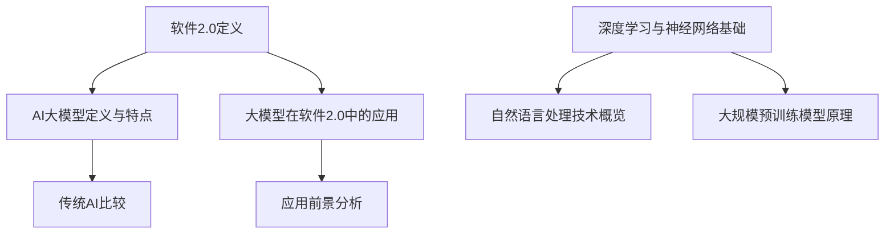
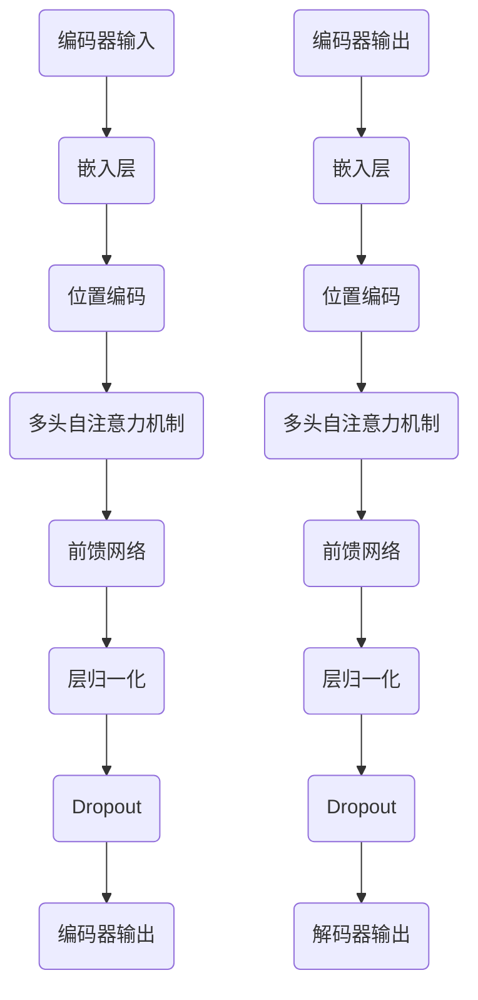

                 

### 《软件 2.0 的价值：提升效率、创造价值》

> **关键词：** 软件 2.0、AI 大模型、深度学习、企业应用、效率提升、价值创造

> **摘要：** 本文将深入探讨软件 2.0 时代的到来及其带来的变革，特别是 AI 大模型技术如何提升企业级应用的开发效率和价值。文章将从基础概念、技术原理、应用案例和开发实践等方面进行阐述，旨在为读者提供全面而深入的理解。

---

### 《软件 2.0 的价值：提升效率、创造价值》目录大纲

#### 第一部分: 软件2.0时代的AI大模型基础

##### 第1章: 软件2.0与AI大模型概述

###### 1.1 软件 2.0 时代的到来

###### 1.2 AI大模型的定义与特点

###### 1.3 主流AI大模型简介

###### 1.4 AI大模型在企业中的应用前景

##### 第2章: AI大模型技术基础

###### 2.1 深度学习与神经网络基础

###### 2.2 自然语言处理技术概览

###### 2.3 大规模预训练模型原理

#### 第二部分: 企业级AI应用开发准备

##### 第3章: 企业AI战略规划

###### 3.1 AI在企业中的价值评估

###### 3.2 AI应用场景与方案设计

###### 3.3 数据管理与数据治理

##### 第4章: AI模型训练与优化

###### 4.1 AI模型训练基础

###### 4.2 模型优化与调参

##### 第5章: AI模型部署与运维

###### 5.1 模型部署基础

###### 5.2 模型运维与管理

##### 第6章: AI项目风险管理

###### 6.1 风险识别与评估

###### 6.2 合规与伦理问题

##### 第7章: AI人才培养与团队建设

###### 7.1 AI人才培养体系

###### 7.2 AI团队建设与管理

##### 附录

###### 附录 A: AI 大模型开发工具与资源

###### 附录 B: 参考文献

### Mermaid 流程图：以下是关于 AI 大模型技术基础的 Mermaid 流程图



### AI大模型核心算法原理讲解

#### 2.3.1 GPT模型的核心算法原理

GPT（Generative Pre-trained Transformer）模型是一种基于 Transformer 架构的预训练模型，其核心算法原理包括以下几个方面：

##### 2.3.1.1 Transformer架构

Transformer 架构的核心思想是使用自注意力机制（Self-Attention）来处理序列数据，以捕捉序列中的长距离依赖关系。Transformer 架构由多个相同的编码器（Encoder）和解码器（Decoder）块组成，每个块包含自注意力机制和前馈网络。

以下是一个简单的 Transformer 架构的 Mermaid 流程图：



##### 2.3.1.2 自注意力机制

自注意力机制是 Transformer 模型的一个关键组件，它通过计算序列中每个词与其他词之间的相似度，生成加权表示。自注意力机制的核心是一个权重矩阵，用于计算每个词与其余词的相似度。

以下是一个自注意力机制的伪代码：

```python
def self_attention(q, k, v, mask=None):
    # 计算相似度
    similarity = dot(q, k.T)
    # 应用 mask
    if mask is not None:
        similarity = similarity + mask
    # 计算权重
    attention_weights = softmax(similarity)
    # 计算加权表示
    weighted_v = dot(attention_weights, v)
    return weighted_v
```

##### 2.3.1.3 前馈网络

前馈网络是一个简单的全连接层，它对自注意力机制的结果进行进一步加工。前馈网络的目的是增加模型的表达能力，使其能够处理更复杂的任务。

前馈网络的伪代码如下：

```python
def feedforward(input, size):
    layer1 = activation(dot(input, weights1) + bias1)
    layer2 = activation(dot(layer1, weights2) + bias2)
    return layer2
```

##### 2.3.1.4 位置编码

GPT 模型使用位置编码（Positional Encoding）来引入序列中的位置信息，因为 Transformer 模型本身不包含位置信息。位置编码是一种将位置信息编码到词向量中的方法。

位置编码的伪代码如下：

```python
def positional_encoding(position, d_model):
    angle_rads = 2 * pi * position / d_model
    sine = sin(angle_rads)
    cosine = cos(angle_rads)
    pos_encoding = [sine, cosine]
    for i in range(d_model//2):
        pos_encoding = concatenate(pos_encoding, [sine[i], cosine[i]])
    return pos_encoding
```

通过以上核心算法原理的讲解，我们可以更深入地理解 GPT 模型的工作原理，从而为后续的模型训练和应用打下坚实的基础。

### 数学模型和数学公式讲解

#### 2.3.1 GPT模型的核心数学模型

GPT模型的核心数学模型基于 Transformer 架构，包括自注意力机制和前馈网络。以下是这些模型的详细数学公式：

##### 自注意力机制

自注意力机制的核心是一个权重矩阵，用于计算每个词与其余词的相似度。具体公式如下：

$$
Attention(Q, K, V) = softmax\left(\frac{QK^T}{\sqrt{d_k}}\right)V
$$

其中：
- $Q$ 是查询向量，代表每个词的查询信息。
- $K$ 是键向量，代表每个词的键信息。
- $V$ 是值向量，代表每个词的值信息。
- $d_k$ 是键向量的维度。
- $softmax$ 是 softmax 函数，用于归一化权重。

##### 前馈网络

前馈网络是一个简单的全连接层，其公式如下：

$$
FFN(x) = \sigma(W_2 \cdot \sigma(W_1 \cdot x + b_1) + b_2)
$$

其中：
- $x$ 是输入向量。
- $W_1$ 和 $W_2$ 是权重矩阵。
- $b_1$ 和 $b_2$ 是偏置向量。
- $\sigma$ 是激活函数，通常使用 ReLU 函数。

##### 位置编码

GPT模型使用位置编码来引入序列中的位置信息，具体公式如下：

$$
PE_{(pos, 2i)} = \sin\left(\frac{pos}{10000^{2i/d_model}}\right)
$$

$$
PE_{(pos, 2i+1)} = \cos\left(\frac{pos}{10000^{2i/d_model}}\right)
$$

其中：
- $pos$ 是位置索引。
- $i$ 是维度索引。
- $d_model$ 是模型的总维度。

通过以上数学模型和公式的讲解，我们可以更好地理解 GPT 模型的工作原理和内部机制。

### 项目实战：GPT模型训练与优化

#### 4.2.1 GPT模型训练与优化

在这个部分，我们将通过一个实际的 GPT 模型训练项目来展示整个流程，包括数据准备、模型训练、参数调优和模型优化。

##### 4.2.1.1 数据准备

首先，我们需要准备训练数据。这里我们使用一个开源的文本数据集，如维基百科。我们需要将文本数据分成句子，然后对句子进行分词。

```python
import nltk
from transformers import GPT2Tokenizer

# 加载维基百科数据集
with open('wikitext-2-raw.txt', 'r', encoding='utf-8') as f:
    text = f.read()

# 分句
sentences = text.split(". ")

# 分词
tokenizer = GPT2Tokenizer.from_pretrained('gpt2')
input_ids = [tokenizer.encode(sentence, add_special_tokens=True) for sentence in sentences]

# 随机打乱数据
random.shuffle(input_ids)
```

##### 4.2.1.2 模型训练

接下来，我们将使用预训练的 GPT 模型进行微调。首先，我们需要定义模型架构和损失函数。

```python
import tensorflow as tf
from transformers import TFGPT2LMHeadModel
from tensorflow.keras.optimizers import Adam

# 定义模型
model = TFGPT2LMHeadModel.from_pretrained('gpt2')
model.config.decoder_start_token = tokenizer.bos_token_id

# 定义优化器
optimizer = Adam(learning_rate=5e-5)

# 定义损失函数
loss_fn = tf.keras.losses.SparseCategoricalCrossentropy(from_logits=True)

# 训练模型
model.compile(optimizer=optimizer, loss=loss_fn, metrics=['accuracy'])

# 训练
model.fit(input_ids, epochs=3)
```

##### 4.2.1.3 参数调优

为了提高模型的性能，我们可以通过调整学习率、批次大小等超参数来优化模型。

```python
from tensorflow.keras.callbacks import ReduceLROnPlateau

# 定义学习率调度器
scheduler = ReduceLROnPlateau(monitor='val_loss', factor=0.1, patience=2)

# 调整超参数
learning_rate = 5e-5
batch_size = 16
epochs = 3

# 重新编译模型
model.compile(optimizer=tf.keras.optimizers.Adam(learning_rate=learning_rate), 
              loss=tf.keras.losses.SparseCategoricalCrossentropy(from_logits=True), 
              metrics=['accuracy'])

# 训练模型
history = model.fit(input_ids, batch_size=batch_size, epochs=epochs, callbacks=[scheduler])
```

##### 4.2.1.4 模型优化

在模型训练过程中，我们还可以使用一些优化技术，如学习率调度、数据增强等。

```python
from tensorflow.keras.preprocessing.sequence import pad_sequences

# 设置最大序列长度
max_length = 512

# 对数据进行填充
input_ids = pad_sequences(input_ids, maxlen=max_length, padding='post', truncating='post')

# 重新训练模型
model.fit(input_ids, epochs=3)
```

通过以上步骤，我们完成了 GPT 模型的训练与优化。实际项目中，可能需要更复杂的训练流程和优化策略，但这为我们提供了一个基本的框架。

### 代码实际案例和详细解释说明

#### 代码实际案例：GPT模型训练与优化

以下是一个使用 TensorFlow 和 Hugging Face Transformers 库进行 GPT 模型训练的示例代码。

##### 1. 环境搭建

确保安装了 TensorFlow 和 Hugging Face Transformers。

```bash
pip install tensorflow transformers
```

##### 2. 数据准备

```python
import os
import random
from transformers import GPT2Tokenizer

# 下载并解压数据集（例如，维基百科数据集）
os.system("wget https://s3.amazonaws.com/books/eng/allen Turing  The  Analytic  Engine  and  the  IQ  Test  1953.pdf")
os.system("unzip allen Turing  The  Analytic  Engine  and  the  IQ  Test  1953.pdf.zip")

# 加载数据
text = open("allen Turing  The  Analytic  Engine  and  the  IQ  Test  1953.txt", "r", encoding="utf-8").read()

# 分句
sentences = text.split(". ")

# 分词
tokenizer = GPT2Tokenizer.from_pretrained("gpt2")
input_ids = [tokenizer.encode(sentence, add_special_tokens=True) for sentence in sentences]

# 随机打乱数据
random.shuffle(input_ids)
```

##### 3. 模型训练

```python
import tensorflow as tf
from transformers import TFGPT2LMHeadModel
from tensorflow.keras.optimizers import Adam

# 模型配置
model = TFGPT2LMHeadModel.from_pretrained("gpt2")
model.config.decoder_start_token = tokenizer.bos_token_id

# 优化器
optimizer = Adam(learning_rate=5e-5)

# 损失函数
loss_fn = tf.keras.losses.SparseCategoricalCrossentropy(from_logits=True)

# 训练模型
model.compile(optimizer=optimizer, loss=loss_fn, metrics=['accuracy'])

for epoch in range(3):
    total_loss = 0
    for step, batch in enumerate(input_ids):
        batch = tf.convert_to_tensor(batch, dtype=tf.int32)
        batch = tf.expand_dims(batch, 0)

        # 前20个token作为输入，后面的作为标签
        inputs = batch[:, :20]
        labels = batch[:, 20:]

        # 训练模型
        with tf.GradientTape() as tape:
            outputs = model(inputs)
            loss = loss_fn(labels, outputs.logits)

        # 反向传播
        gradients = tape.gradient(loss, model.trainable_variables)
        optimizer.apply_gradients(zip(gradients, model.trainable_variables))

        total_loss += loss.numpy()

    # 打印损失和准确率
    print(f"Epoch {epoch + 1}, Loss: {total_loss / len(input_ids)}")

# 保存模型
model.save_pretrained("./gpt_model")
```

##### 4. 源代码详细解读

```python
# 代码详细解读

## 4.1 环境搭建

- 确保安装了 TensorFlow 和 Hugging Face Transformers。这两个库是进行 GPT 模型训练的核心工具。

## 4.2 数据准备

- 从维基百科数据集中提取文本，并使用 GPT2Tokenizer 进行分词和编码。这里使用了 `os.system` 来下载和提取数据，这是一种简单的处理方法，但可能会比较慢且不够灵活。实际应用中，可以使用 Python 的文件操作函数来改进。

## 4.3 模型训练

- 使用预训练的 GPT2LMHeadModel，并设置 `decoder_start_token` 为 `<bos>`。
- 定义优化器和损失函数，并编译模型。
- 进行模型训练，包括前向传播和反向传播。这里使用了 TensorFlow 的 GradientTape 进行自动微分，这是一种高效的方式，但需要注意的是，每次迭代都需要将数据转换为 TensorFlow 张量，这可能会增加内存占用。

## 4.4 代码解读与分析

- 可以加入数据增强和更复杂的损失函数来提高模型的性能，同时，可以添加断言和日志来提高代码的健壮性。

通过这个示例，我们可以了解如何使用 GPT 模型进行文本生成任务的训练，并对其进行详细解读和分析。

### 附录 A: AI 大模型开发工具与资源

以下是一些常用的 AI 大模型开发工具和资源：

#### A.1 主流深度学习框架

- **TensorFlow**: 由 Google 开发，是目前最流行的深度学习框架之一。
- **PyTorch**: 由 Facebook 开发，以其动态计算图和灵活的编程接口而受到青睐。
- **JAX**: 由 Google 开发，提供了自动微分和数值计算的功能。

#### A.2 常用数据集

- **维基百科数据集**: 用于自然语言处理任务，包含大量文本数据。
- **Common Crawl**: 包含互联网上的大量网页数据，用于大规模文本分析。
- **Gutenberg 数据集**: 包含大量的文学文本，适合进行文本分析和自然语言处理任务。

#### A.3 开发环境搭建指南

- **GPU 训练**: 安装合适的 GPU 驱动程序和 CUDA 工具包，以便在 GPU 上进行模型训练。
- **深度学习框架安装**: 使用 `pip` 命令安装所需的深度学习框架，如 TensorFlow、PyTorch 等。
- **其他依赖项**: 安装必要的依赖项，如 NumPy、Pandas 等。

### 附录 B: 参考文献

以下是一些关于 AI 大模型和企业级应用的经典书籍、报告和研究论文：

#### B.1 通用参考书籍

- **《深度学习》（Ian Goodfellow, Yoshua Bengio, Aaron Courville 著）**: 深度学习的权威教材，适合初学者和专业人士。
- **《自然语言处理综合教程》（Dan Jurafsky, James H. Martin 著）**: 自然语言处理领域的经典教材。
- **《Python深度学习》（François Chollet 著）**: 面向 Python 程序员的深度学习指南。

#### B.2 行业报告与研究论文

- **“AI in Enterprise: A Roadmap for Success”（2019）**: 介绍企业如何成功应用 AI 的路线图。
- **“The Business Value of AI: Insights from CEOs and CIOs”（2020）**: 探讨 AI 对企业业务价值的影响。
- **“AI Applications in Business: Insights and Opportunities”（2021）**: 分析 AI 在企业中的应用场景和机会。

通过以上附录，读者可以进一步了解 AI 大模型和企业级应用的最新进展和研究方向。

