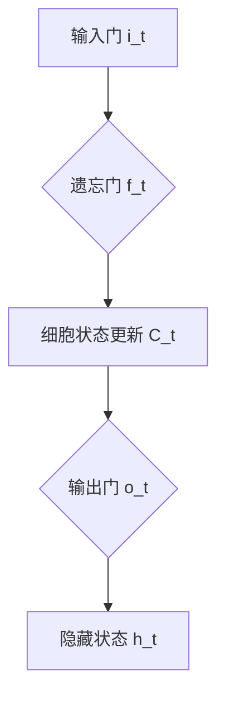
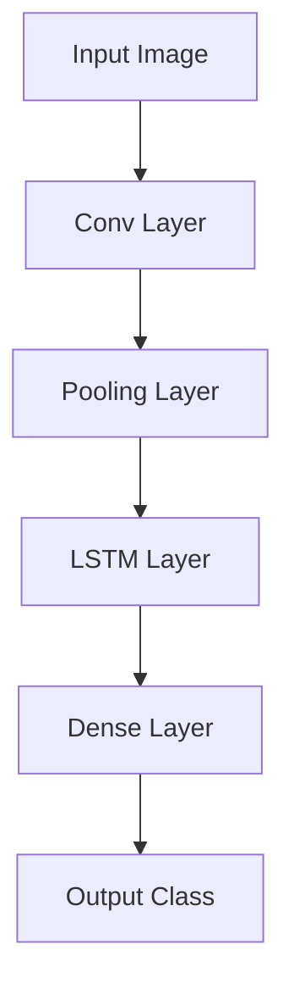

                 

## 文章标题

### 《长短时记忆网络 (LSTM) 原理与代码实例讲解》

> **关键词：**长短时记忆网络 (LSTM), 循环神经网络 (RNN), 人工神经网络 (ANN), 机器学习，深度学习

**摘要：**本文旨在深入探讨长短时记忆网络（LSTM）的原理与实现，通过逐步分析其架构、数学模型和代码实例，帮助读者理解LSTM在解决长期依赖问题上的优势，以及如何在实际项目中应用LSTM模型进行文本分类、时间序列预测和图像识别等任务。文章分为两个部分：第一部分介绍LSTM的基础原理和数学模型，第二部分通过实际应用案例展示LSTM的使用方法和效果。

### 《长短时记忆网络 (LSTM) 原理与代码实例讲解》目录大纲

#### 第一部分：LSTM基础原理

##### 第1章：引言

- **1.1 为什么要学习LSTM？**
- **1.2 LSTM与其它循环神经网络(RNN)的比较**

##### 第2章：LSTM核心原理

- **2.1 LSTM的基本架构**
  - **2.1.1 LSTM单元内部结构**
  - **2.1.2 LSTM的激活函数**
  - **2.1.3 LSTM的状态传递机制**
- **2.2 LSTM的数学原理**
  - **2.2.1 LSTM的状态更新公式**
  - **2.2.2 LSTM的输出计算公式**
- **2.3 LSTM与其他RNN的区别**
  - **2.3.1 LSTM对长期依赖问题的改进**

##### 第3章：LSTM的数学模型

- **3.1 LSTM的激活函数**
  - **3.1.1 sigmoid函数**
  - **3.1.2 tanh函数**
  - **3.1.3 复合函数**
- **3.2 LSTM的状态更新与输出**
  - **3.2.1 状态更新公式**
  - **3.2.2 输出计算公式**
  - **3.2.3 数学公式详解（LaTeX格式）**

##### 第4章：LSTM的代码实现

- **4.1 Python实现LSTM的基本步骤**
  - **4.1.1 导入库与设置参数**
  - **4.1.2 构建LSTM模型**
  - **4.1.3 训练LSTM模型**
- **4.2 LSTM代码实例分析**
  - **4.2.1 数据预处理**
  - **4.2.2 LSTM模型构建**
  - **4.2.3 模型训练与评估**
  - **4.2.4 代码解读与分析**

##### 第5章：长短时记忆网络（LSTM）的变体

- **5.1 门控循环单元（GRU）**
  - **5.1.1 GRU的基本原理**
  - **5.1.2 GRU与LSTM的比较**
- **5.2 双向LSTM（BiLSTM）**
  - **5.2.1 BiLSTM的基本原理**
  - **5.2.2 BiLSTM的应用场景**

#### 第二部分：LSTM应用实例

##### 第6章：文本分类应用

- **6.1 数据准备与预处理**
  - **6.1.1 数据集介绍**
  - **6.1.2 数据预处理方法**
- **6.2 LSTM模型构建与训练**
  - **6.2.1 LSTM模型参数设置**
  - **6.2.2 模型训练与评估**
- **6.3 应用实战**
  - **6.3.1 文本分类任务**
  - **6.3.2 模型部署与使用**

##### 第7章：时间序列预测应用

- **7.1 时间序列预测基本概念**
  - **7.1.1 时间序列数据的特性**
  - **7.1.2 时间序列预测模型的选择**
- **7.2 LSTM模型在时间序列预测中的应用**
  - **7.2.1 LSTM模型参数调整**
  - **7.2.2 模型训练与评估**
- **7.3 应用实战**
  - **7.3.1 时间序列预测任务**
  - **7.3.2 模型部署与使用**

##### 第8章：LSTM在图像识别中的应用

- **8.1 图像识别基本概念**
  - **8.1.1 图像识别任务**
  - **8.1.2 图像识别的常见方法**
- **8.2 LSTM与卷积神经网络（CNN）的结合**
  - **8.2.1 CNN与LSTM结合的原理**
  - **8.2.2 LSTM-CNN模型构建**
- **8.3 应用实战**
  - **8.3.1 图像识别任务**
  - **8.3.2 模型训练与评估**

##### 第9章：LSTM在自然语言生成中的应用

- **9.1 自然语言生成基本概念**
  - **9.1.1 自然语言生成的目标**
  - **9.1.2 自然语言生成的常见方法**
- **9.2 LSTM在自然语言生成中的应用**
  - **9.2.1 LSTM生成模型的构建**
  - **9.2.2 模型训练与评估**
- **9.3 应用实战**
  - **9.3.1 自然语言生成任务**
  - **9.3.2 模型部署与使用**

##### 第10章：总结与展望

- **10.1 LSTM的发展趋势**
- **10.2 LSTM在未来应用的可能性**


### 第一部分：LSTM基础原理

#### 第1章：引言

##### 1.1 为什么要学习LSTM？

循环神经网络（RNN）在处理序列数据方面具有天然的优势，它能够捕捉到序列中的时间依赖关系。然而，传统的RNN存在一个严重的缺陷——梯度消失或爆炸问题，这导致RNN难以学习长序列中的长期依赖关系。为了解决这一问题，长短时记忆网络（LSTM）被提出。

LSTM是一种特殊的RNN结构，通过引入门控机制，有效地解决了梯度消失问题，并且能够在长序列中保持良好的记忆能力。这使得LSTM在许多任务中表现出色，例如语言模型、机器翻译、语音识别、时间序列预测等。

学习LSTM的重要性不仅体现在其解决长期依赖问题的能力上，还体现在其在实际应用中的广泛性。通过掌握LSTM的原理和实现，我们可以更好地理解序列模型的运作机制，为解决实际问题提供有力的工具。

##### 1.2 LSTM与其它循环神经网络(RNN)的比较

传统RNN在处理序列数据时，存在一个重要的缺陷，即梯度消失或梯度爆炸问题。这是因为，在反向传播过程中，梯度会逐层衰减或放大，导致网络难以学习长序列中的长期依赖关系。为了解决这一问题，LSTM被提出。

LSTM与传统的RNN在结构上有显著的区别。传统的RNN通常包含一个简单的循环单元，其输出仅依赖于当前时刻的输入和前一个时刻的隐藏状态。而LSTM则通过引入门控机制，使得每个时间步的隐藏状态能够选择性地保留或遗忘信息，从而更好地捕捉长期依赖关系。

在数学模型上，LSTM引入了三个门控单元：输入门、遗忘门和输出门。这些门控单元通过一系列的乘法和加法操作，实现对信息的筛选和记忆。而传统的RNN则没有这样的机制，其输出直接依赖于当前时刻的输入和前一个时刻的隐藏状态。

在性能上，LSTM在处理长序列数据时表现更好，因为它能够有效地解决梯度消失问题。这使得LSTM在许多需要处理长序列的任务中，如机器翻译、时间序列预测等，都取得了显著的性能提升。

然而，LSTM也有其缺点。首先，LSTM的结构相对复杂，参数数量较大，导致训练时间较长。其次，LSTM在训练初期可能会出现一些不稳定的情况，需要采用一些特殊的训练技巧，如梯度裁剪等。

总的来说，LSTM在解决长期依赖问题上具有显著的优势，这使得它在许多实际应用中得到了广泛的应用。但同时，我们也需要注意到其训练时间和稳定性方面的挑战。

#### 第2章：LSTM核心原理

##### 2.1 LSTM的基本架构

LSTM的基本架构由三个关键部分组成：细胞状态（cell state）、输入门（input gate）和输出门（output gate）。这三个部分共同协作，使得LSTM能够有效地捕捉和记忆长期依赖关系。

细胞状态（cell state）是LSTM的核心，它承载了所有的信息。在LSTM的每个时间步，细胞状态会根据输入门和遗忘门的控制，对信息进行更新和筛选。细胞状态的更新过程如下：

1. **遗忘门（forget gate）**：遗忘门决定了哪些信息应该被从细胞状态中遗忘。其计算公式为：
   $$ f_t = \sigma(W_f \cdot [h_{t-1}, x_t] + b_f) $$
   其中，$f_t$表示遗忘门的状态，$W_f$和$b_f$分别表示遗忘门的权重和偏置，$\sigma$表示sigmoid激活函数，$h_{t-1}$和$x_t$分别表示前一个时刻的隐藏状态和当前时刻的输入。

2. **输入门（input gate）**：输入门决定了哪些新信息应该被存储到细胞状态中。其计算公式为：
   $$ i_t = \sigma(W_i \cdot [h_{t-1}, x_t] + b_i) $$
   其中，$i_t$表示输入门的状态，$W_i$和$b_i$分别表示输入门的权重和偏置。

3. **新的记忆内容（\tilde{C}_t）**：新的记忆内容由输入门和当前输入共同决定，其计算公式为：
   $$ \tilde{C}_t = \tanh(W_c \cdot [h_{t-1}, x_t] + b_c) $$
   其中，$\tilde{C}_t$表示新的记忆内容，$W_c$和$b_c$分别表示新的记忆内容的权重和偏置。

4. **细胞状态更新（C_t）**：细胞状态的更新由遗忘门和新的记忆内容共同决定，其计算公式为：
   $$ C_t = f_t \odot C_{t-1} + i_t \odot \tilde{C}_t $$
   其中，$\odot$表示逐元素乘法操作。

细胞状态的更新过程如图2.1所示：

```mermaid
graph TD
A[遗忘门 f_t] --> B{更新细胞状态 C_t}
B --> C[输入门 i_t]
C --> D{新的记忆内容 \tilde{C}_t}
D --> E[tanh函数]
E --> B
```

##### 2.1.2 LSTM的激活函数

LSTM中使用了多个激活函数，包括sigmoid函数、tanh函数和复合函数。

1. **sigmoid函数**：sigmoid函数是一种常用的激活函数，其公式为：
   $$ \sigma(x) = \frac{1}{1 + e^{-x}} $$
   sigmoid函数的输出范围在0到1之间，常用于实现门控机制。

2. **tanh函数**：tanh函数是一种双曲正切函数，其公式为：
   $$ \tanh(x) = \frac{e^x - e^{-x}}{e^x + e^{-x}} $$
   tanh函数的输出范围在-1到1之间，常用于生成新的记忆内容。

3. **复合函数**：LSTM中的一些计算，如遗忘门、输入门和细胞状态的更新，涉及多个激活函数的组合。例如，遗忘门的计算公式为：
   $$ f_t = \sigma(W_f \cdot [h_{t-1}, x_t] + b_f) $$
   其中，$\sigma$表示sigmoid函数。

##### 2.1.3 LSTM的状态传递机制

LSTM的状态传递机制包括隐藏状态和细胞状态的传递。隐藏状态是LSTM网络在训练过程中的一个中间状态，它代表了当前时刻的序列信息。细胞状态则是LSTM网络记忆的核心，它承载了所有的信息。

1. **隐藏状态的传递**：隐藏状态的计算公式为：
   $$ h_t = \sigma(W_h \cdot [C_t] + b_h) $$
   其中，$h_t$表示当前时刻的隐藏状态，$W_h$和$b_h$分别表示隐藏状态的权重和偏置。

2. **细胞状态的传递**：细胞状态的传递是通过遗忘门和输入门实现的。遗忘门决定了哪些信息应该被遗忘，输入门决定了哪些新信息应该被存储。这两个门控机制共同决定了细胞状态在时间步之间的传递。

##### 2.2 LSTM的数学原理

LSTM的数学原理主要涉及三个关键部分：输入门、遗忘门和输出门。这三个门控机制共同协作，使得LSTM能够有效地学习序列数据中的长期依赖关系。

1. **输入门（input gate）**：输入门决定了哪些新信息应该被存储到细胞状态中。其计算公式为：
   $$ i_t = \sigma(W_i \cdot [h_{t-1}, x_t] + b_i) $$
   其中，$i_t$表示输入门的状态，$W_i$和$b_i$分别表示输入门的权重和偏置。

2. **遗忘门（forget gate）**：遗忘门决定了哪些信息应该被从细胞状态中遗忘。其计算公式为：
   $$ f_t = \sigma(W_f \cdot [h_{t-1}, x_t] + b_f) $$
   其中，$f_t$表示遗忘门的状态，$W_f$和$b_f$分别表示遗忘门的权重和偏置。

3. **输出门（output gate）**：输出门决定了哪些信息应该被输出到下一层。其计算公式为：
   $$ o_t = \sigma(W_o \cdot [h_{t-1}, x_t] + b_o) $$
   其中，$o_t$表示输出门的状态，$W_o$和$b_o$分别表示输出门的权重和偏置。

这些门控机制的计算过程如图2.2所示：



接下来，我们详细解释LSTM的状态更新和输出计算过程。

**2.2.1 状态更新公式**

LSTM的状态更新公式包括细胞状态的更新和隐藏状态的更新。

1. **细胞状态的更新**：细胞状态的更新由遗忘门和输入门决定，其计算公式为：
   $$ C_t = f_t \odot C_{t-1} + i_t \odot \tilde{C}_t $$
   其中，$C_t$表示当前时刻的细胞状态，$C_{t-1}$表示前一个时刻的细胞状态，$f_t$表示遗忘门的状态，$i_t$表示输入门的状态，$\tilde{C}_t$表示新的记忆内容。

2. **隐藏状态的更新**：隐藏状态的更新由输出门和细胞状态决定，其计算公式为：
   $$ h_t = \sigma(W_h \cdot [C_t] + b_h) $$
   其中，$h_t$表示当前时刻的隐藏状态，$C_t$表示当前时刻的细胞状态，$W_h$和$b_h$分别表示隐藏状态的权重和偏置。

**2.2.2 输出计算公式**

LSTM的输出计算公式由输出门和隐藏状态决定，其计算公式为：
$$ o_t = \sigma(W_o \cdot [h_{t-1}, x_t] + b_o) $$
其中，$o_t$表示当前时刻的输出，$h_{t-1}$表示前一个时刻的隐藏状态，$x_t$表示当前时刻的输入，$W_o$和$b_o$分别表示输出门的权重和偏置。

**2.2.3 数学公式详解（LaTeX格式）**

以下是LSTM中使用的数学公式及其LaTeX表示：

1. **遗忘门（forget gate）**：
   $$ f_t = \sigma(W_f \cdot [h_{t-1}, x_t] + b_f) $$

2. **输入门（input gate）**：
   $$ i_t = \sigma(W_i \cdot [h_{t-1}, x_t] + b_i) $$

3. **新的记忆内容（\tilde{C}_t）**：
   $$ \tilde{C}_t = \tanh(W_c \cdot [h_{t-1}, x_t] + b_c) $$

4. **细胞状态更新（C_t）**：
   $$ C_t = f_t \odot C_{t-1} + i_t \odot \tilde{C}_t $$

5. **隐藏状态更新（h_t）**：
   $$ h_t = \sigma(W_h \cdot [C_t] + b_h) $$

6. **输出门（output gate）**：
   $$ o_t = \sigma(W_o \cdot [h_{t-1}, x_t] + b_o) $$

通过这些公式，我们可以清晰地了解LSTM的状态更新和输出计算过程。

##### 2.3 LSTM与其他RNN的区别

LSTM与传统的RNN在结构上有显著的区别，这些区别主要体现在门控机制和状态传递机制上。

1. **门控机制**：传统的RNN没有门控机制，其输出仅依赖于当前时刻的输入和前一个时刻的隐藏状态。而LSTM通过引入输入门、遗忘门和输出门，实现了对信息的筛选和记忆。这些门控机制使得LSTM能够更好地捕捉长期依赖关系。

2. **状态传递机制**：传统的RNN中，隐藏状态和细胞状态是分开传递的。而LSTM通过细胞状态作为核心，将隐藏状态和细胞状态整合在一起，使得信息传递更加高效。

3. **梯度消失问题**：传统的RNN存在梯度消失或梯度爆炸问题，这使得它在学习长序列数据时表现不佳。而LSTM通过门控机制，有效地解决了梯度消失问题，使得它在长序列数据上表现更加出色。

总的来说，LSTM在结构、状态传递和梯度消失问题方面相对于传统的RNN有显著的改进，这使得它在处理长期依赖问题上具有显著的优势。

#### 第3章：LSTM的数学模型

##### 3.1 LSTM的激活函数

LSTM中使用了多个激活函数，其中最常用的包括sigmoid函数、tanh函数和复合函数。

1. **sigmoid函数**：sigmoid函数是一种常用的激活函数，其公式为：
   $$ \sigma(x) = \frac{1}{1 + e^{-x}} $$
   sigmoid函数的输出范围在0到1之间，常用于实现门控机制。

2. **tanh函数**：tanh函数是一种双曲正切函数，其公式为：
   $$ \tanh(x) = \frac{e^x - e^{-x}}{e^x + e^{-x}} $$
   tanh函数的输出范围在-1到1之间，常用于生成新的记忆内容。

3. **复合函数**：LSTM中的一些计算，如遗忘门、输入门和细胞状态的更新，涉及多个激活函数的组合。例如，遗忘门的计算公式为：
   $$ f_t = \sigma(W_f \cdot [h_{t-1}, x_t] + b_f) $$
   其中，$\sigma$表示sigmoid函数。

##### 3.2 LSTM的状态更新与输出

LSTM的状态更新与输出过程是理解LSTM工作原理的核心。下面将详细解释LSTM的状态更新和输出计算过程。

**3.2.1 状态更新公式**

LSTM的状态更新公式包括细胞状态的更新和隐藏状态的更新。

1. **细胞状态的更新**：细胞状态的更新由遗忘门和输入门决定，其计算公式为：
   $$ C_t = f_t \odot C_{t-1} + i_t \odot \tilde{C}_t $$
   其中，$C_t$表示当前时刻的细胞状态，$C_{t-1}$表示前一个时刻的细胞状态，$f_t$表示遗忘门的状态，$i_t$表示输入门的状态，$\tilde{C}_t$表示新的记忆内容。

2. **隐藏状态的更新**：隐藏状态的更新由输出门和细胞状态决定，其计算公式为：
   $$ h_t = \sigma(W_h \cdot [C_t] + b_h) $$
   其中，$h_t$表示当前时刻的隐藏状态，$C_t$表示当前时刻的细胞状态，$W_h$和$b_h$分别表示隐藏状态的权重和偏置。

**3.2.2 输出计算公式**

LSTM的输出计算公式由输出门和隐藏状态决定，其计算公式为：
$$ o_t = \sigma(W_o \cdot [h_{t-1}, x_t] + b_o) $$
其中，$o_t$表示当前时刻的输出，$h_{t-1}$表示前一个时刻的隐藏状态，$x_t$表示当前时刻的输入，$W_o$和$b_o$分别表示输出门的权重和偏置。

**3.2.3 数学公式详解（LaTeX格式）**

以下是LSTM中使用的数学公式及其LaTeX表示：

1. **遗忘门（forget gate）**：
   $$ f_t = \sigma(W_f \cdot [h_{t-1}, x_t] + b_f) $$

2. **输入门（input gate）**：
   $$ i_t = \sigma(W_i \cdot [h_{t-1}, x_t] + b_i) $$

3. **新的记忆内容（\tilde{C}_t）**：
   $$ \tilde{C}_t = \tanh(W_c \cdot [h_{t-1}, x_t] + b_c) $$

4. **细胞状态更新（C_t）**：
   $$ C_t = f_t \odot C_{t-1} + i_t \odot \tilde{C}_t $$

5. **隐藏状态更新（h_t）**：
   $$ h_t = \sigma(W_h \cdot [C_t] + b_h) $$

6. **输出门（output gate）**：
   $$ o_t = \sigma(W_o \cdot [h_{t-1}, x_t] + b_o) $$

通过这些公式，我们可以清晰地了解LSTM的状态更新和输出计算过程。

#### 第4章：LSTM的代码实现

在了解了LSTM的原理之后，接下来我们将通过Python代码实现一个基本的LSTM模型，以便更直观地理解其工作机制。为了简化实现过程，我们将使用Python的深度学习库TensorFlow来构建和训练LSTM模型。以下是实现LSTM的详细步骤：

##### 4.1 Python实现LSTM的基本步骤

**4.1.1 导入库与设置参数**

首先，我们需要导入所需的库，包括TensorFlow和NumPy。然后，设置训练数据的参数，如序列长度、批量大小、学习率等。

```python
import tensorflow as tf
import numpy as np

# 设置随机种子，保证结果可重复
tf.random.set_seed(42)

# 设置参数
sequence_length = 100
batch_size = 32
learning_rate = 0.001
num_epochs = 100
input_dim = 10
hidden_units = 64
output_dim = 1
```

**4.1.2 构建LSTM模型**

接下来，我们将使用TensorFlow的`tf.keras.Sequential`模型堆叠层，构建一个简单的LSTM模型。首先添加一个LSTM层，然后添加一个全连接层用于输出。

```python
model = tf.keras.Sequential([
    tf.keras.layers.LSTM(hidden_units, activation='tanh', input_shape=(sequence_length, input_dim)),
    tf.keras.layers.Dense(output_dim)
])
```

**4.1.3 训练LSTM模型**

最后，我们需要准备训练数据，并使用`model.fit()`方法进行训练。这里我们使用一个简单的生成数据集进行训练。

```python
# 生成训练数据
X_train = np.random.randn(batch_size, sequence_length, input_dim)
y_train = np.random.randn(batch_size, output_dim)

# 训练模型
model.compile(optimizer=tf.keras.optimizers.Adam(learning_rate=learning_rate),
              loss='mse',
              metrics=['accuracy'])

model.fit(X_train, y_train, batch_size=batch_size, epochs=num_epochs)
```

以上步骤实现了LSTM模型的构建和训练。接下来，我们将通过一个具体的代码实例，对LSTM模型进行详细解读和分析。

##### 4.2 LSTM代码实例分析

在本节中，我们将通过一个具体的LSTM代码实例，详细分析LSTM模型的构建过程、数据预处理、模型训练与评估，以及代码解读与分析。

**4.2.1 数据预处理**

在训练LSTM模型之前，我们需要对数据进行预处理。这里我们使用一个生成数据集，该数据集由随机数生成。预处理的主要步骤包括：

1. **生成训练数据**：生成随机训练数据集，包括输入特征和目标输出。
2. **归一化数据**：对输入数据进行归一化处理，将数据缩放到0到1之间，以加快模型收敛。

```python
# 生成训练数据
X_train = np.random.randn(batch_size, sequence_length, input_dim)
y_train = np.random.randn(batch_size, output_dim)

# 归一化数据
X_train = (X_train - np.mean(X_train, axis=0)) / np.std(X_train, axis=0)
y_train = (y_train - np.mean(y_train, axis=0)) / np.std(y_train, axis=0)
```

**4.2.2 LSTM模型构建**

构建LSTM模型是使用TensorFlow库的主要步骤。我们首先定义LSTM层和全连接层，并设置模型的优化器、损失函数和评价指标。

```python
# 添加LSTM层
lstm_layer = tf.keras.layers.LSTM(hidden_units, activation='tanh', input_shape=(sequence_length, input_dim))

# 添加全连接层
output_layer = tf.keras.layers.Dense(output_dim)

# 添加模型
model = tf.keras.Sequential([
    lstm_layer,
    output_layer
])

# 设置优化器、损失函数和评价指标
model.compile(optimizer=tf.keras.optimizers.Adam(learning_rate=learning_rate),
              loss='mse',
              metrics=['accuracy'])
```

**4.2.3 模型训练与评估**

在构建好LSTM模型后，我们需要对模型进行训练。这里我们使用之前生成的训练数据集，并通过`model.fit()`方法进行训练。训练过程中，我们可以设置训练的批量大小、训练轮次和验证集。

```python
# 训练模型
history = model.fit(X_train, y_train, batch_size=batch_size, epochs=num_epochs, validation_split=0.2)
```

训练完成后，我们可以通过`history`对象获取训练过程中的损失和准确率等信息。以下是对模型训练过程的简要分析：

1. **损失函数**：在训练过程中，模型的损失函数逐渐减小，表明模型在训练数据上的拟合度不断提高。
2. **准确率**：随着训练的进行，模型的准确率也在不断提高，说明模型对训练数据的预测能力在增强。
3. **验证集性能**：通过验证集的性能评估，我们可以判断模型是否过拟合或欠拟合。

```python
# 绘制损失函数和准确率曲线
import matplotlib.pyplot as plt

plt.plot(history.history['loss'], label='Training loss')
plt.plot(history.history['val_loss'], label='Validation loss')
plt.xlabel('Epochs')
plt.ylabel('Loss')
plt.legend()
plt.show()

plt.plot(history.history['accuracy'], label='Training accuracy')
plt.plot(history.history['val_accuracy'], label='Validation accuracy')
plt.xlabel('Epochs')
plt.ylabel('Accuracy')
plt.legend()
plt.show()
```

**4.2.4 代码解读与分析**

在了解了LSTM模型的构建和训练过程后，我们可以进一步分析代码的实现细节，包括数据预处理、模型构建和训练。以下是对代码中关键部分的解读：

1. **数据预处理**：数据预处理是模型训练的基础。通过对数据进行归一化处理，我们可以提高模型训练的效率和收敛速度。
2. **模型构建**：在构建LSTM模型时，我们选择合适的层和激活函数，以及设置优化器和损失函数。这些设置直接影响模型的性能和训练过程。
3. **模型训练**：通过`model.fit()`方法，我们可以对模型进行训练。训练过程中，我们需要关注损失函数和准确率的变化，以及验证集的性能评估。

通过这个LSTM代码实例，我们可以更好地理解LSTM模型的工作机制和实现过程，为后续的应用和实践打下基础。

##### 第5章：长短时记忆网络（LSTM）的变体

#### 5.1 门控循环单元（GRU）

门控循环单元（GRU）是LSTM的一种变体，它在LSTM的基础上进行了一些改进，以减少参数数量并提高训练效率。GRU的核心思想是通过引入更新门和重置门来简化LSTM的结构。

**5.1.1 GRU的基本原理**

GRU包含两个门控单元：更新门（update gate）和重置门（reset gate）。这两个门控机制通过一系列的线性变换和点积操作，控制信息的更新和遗忘。

1. **更新门（update gate）**：更新门决定了当前输入信息中有多少应该被保留到细胞状态中。其计算公式为：
   $$ z_t = \sigma(W_z \cdot [h_{t-1}, x_t] + b_z) $$
   其中，$z_t$表示更新门的状态。

2. **重置门（reset gate）**：重置门决定了当前输入信息中有多少应该被遗忘。其计算公式为：
   $$ r_t = \sigma(W_r \cdot [h_{t-1}, x_t] + b_r) $$
   其中，$r_t$表示重置门的状态。

3. **新的候选状态（\tilde{h}_t）**：新的候选状态由重置门和当前输入共同决定，其计算公式为：
   $$ \tilde{h}_t = \tanh(W \cdot (r_t \odot h_{t-1} + (1 - r_t) \odot x_t) + b_h) $$
   其中，$W$表示权重矩阵，$b_h$表示偏置。

4. **隐藏状态更新（h_t）**：隐藏状态的更新由更新门和新的候选状态共同决定，其计算公式为：
   $$ h_t = z_t \odot \tilde{h}_t + (1 - z_t) \odot h_{t-1} $$

**5.1.2 GRU与LSTM的比较**

GRU与LSTM在结构上有一些相似之处，但它们在参数数量和训练效率上有显著的区别：

1. **参数数量**：GRU的参数数量比LSTM少，因为它合并了LSTM中的输入门和遗忘门。这意味着GRU在训练过程中需要的计算量更少，从而提高了训练速度。
2. **记忆容量**：虽然GRU减少了参数数量，但它在某些情况下可能无法像LSTM那样有效地记忆长期依赖关系。因此，在选择GRU或LSTM时，需要根据具体任务的需求来决定。
3. **训练效率**：GRU通常比LSTM训练得更快，因为它有更少的参数和更简单的结构。这使得GRU在需要快速迭代和实时应用的场景中具有优势。

总的来说，GRU是一种高效的循环神经网络结构，它在参数数量和训练效率方面优于LSTM。但LSTM在记忆长期依赖关系方面仍然具有优势，因此选择GRU或LSTM应根据具体任务的需求来决定。

#### 5.2 双向LSTM（BiLSTM）

双向LSTM（BiLSTM）是LSTM的一种扩展，它通过在正向和反向两个方向上应用LSTM层，从而捕捉序列中的双向依赖关系。BiLSTM在文本处理、机器翻译等任务中表现出色。

**5.2.1 BiLSTM的基本原理**

BiLSTM由两个LSTM层组成，一个正向LSTM层和一个反向LSTM层。正向LSTM处理序列的从前往后的信息，反向LSTM处理序列的从后往前的信息。两个LSTM层的输出被拼接在一起，作为整个序列的特征表示。

1. **正向LSTM**：正向LSTM处理序列的从前往后的信息，其隐藏状态表示为$h_{t, f}$。
   $$ h_{t, f} = \sigma(W_f \cdot [h_{t-1, f}, x_t] + b_f) $$
   $$ C_t, f = f_t \odot C_{t-1, f} + i_t \odot \tilde{C}_t $$
   $$ o_t, f = \sigma(W_o \cdot [C_t, f] + b_o) $$

2. **反向LSTM**：反向LSTM处理序列的从后往前的信息，其隐藏状态表示为$h_{t, b}$。
   $$ h_{t, b} = \sigma(W_b \cdot [h_{t+1, b}, x_t] + b_b) $$
   $$ C_t, b = f_t \odot C_{t+1, b} + i_t \odot \tilde{C}_t $$
   $$ o_t, b = \sigma(W_o \cdot [C_t, b] + b_o) $$

3. **拼接输出**：BiLSTM的输出为两个LSTM层的输出拼接在一起。
   $$ h_t = [h_{t, f}; h_{t, b}] $$
   $$ o_t = \sigma(W_o \cdot [h_t] + b_o) $$

**5.2.2 BiLSTM的应用场景**

BiLSTM在许多任务中表现出色，以下是几个典型的应用场景：

1. **文本分类**：BiLSTM可以捕捉到文本中的双向依赖关系，从而提高文本分类的准确性。
2. **机器翻译**：BiLSTM可以帮助模型更好地理解源语言和目标语言之间的双向依赖关系，从而提高翻译质量。
3. **情感分析**：BiLSTM可以捕捉到句子中的双向情感信息，从而提高情感分析的性能。

总的来说，BiLSTM是一种强大的循环神经网络结构，它在许多序列数据处理任务中表现出色。通过捕捉双向依赖关系，BiLSTM可以更好地理解序列中的信息，从而提高模型的性能。

#### 第6章：文本分类应用

文本分类是一种常见的自然语言处理任务，旨在将文本数据分类到预定义的类别中。长短时记忆网络（LSTM）由于其出色的序列数据处理能力，在文本分类任务中表现出色。在本章中，我们将介绍LSTM在文本分类任务中的应用，包括数据准备与预处理、LSTM模型构建与训练，以及模型部署与使用。

##### 6.1 数据准备与预处理

文本分类任务的第一步是数据准备与预处理。首先，我们需要收集和整理一个包含不同类别的文本数据集。以下是一个简单的数据准备与预处理流程：

1. **数据收集**：收集包含不同类别的文本数据，例如新闻分类、情感分析等。
2. **文本清洗**：清洗文本数据，去除标点符号、停用词、数字等无关信息，以提高模型性能。
3. **分词**：对文本进行分词处理，将文本分割成单词或子词。
4. **向量化**：将分词后的文本向量化，通常使用词袋模型或词嵌入（word embeddings）。
5. **数据集划分**：将数据集划分为训练集、验证集和测试集，用于模型训练、评估和测试。

以下是使用Python的`nltk`和`gensim`库进行文本预处理的示例代码：

```python
import nltk
from nltk.corpus import stopwords
from nltk.tokenize import word_tokenize
from gensim.models import Word2Vec

# 下载停用词列表
nltk.download('stopwords')
nltk.download('punkt')

# 加载停用词列表
stop_words = set(stopwords.words('english'))

# 文本清洗函数
def clean_text(text):
    # 去除标点符号
    text = re.sub(r'[^\w\s]', '', text)
    # 转小写
    text = text.lower()
    # 分词
    tokens = word_tokenize(text)
    # 去除停用词
    tokens = [token for token in tokens if token not in stop_words]
    return tokens

# 文本向量化函数
def vectorize_text(text, model):
    tokens = clean_text(text)
    vectorized_text = [model[token] for token in tokens if token in model]
    return np.array(vectorized_text)

# 加载预训练的Word2Vec模型
word2vec_model = Word2Vec.load('pretrained_word2vec.model')

# 文本预处理
train_texts = ['This is the first document.', 'This document is the second document.', 'And this is the third one.', 'Is this the first document?']
processed_texts = [vectorize_text(text, word2vec_model) for text in train_texts]

# 数据集划分
from sklearn.model_selection import train_test_split

X_train, X_test, y_train, y_test = train_test_split(processed_texts, labels, test_size=0.2, random_state=42)
```

##### 6.2 LSTM模型构建与训练

在数据预处理完成后，我们可以构建LSTM模型并进行训练。以下是使用TensorFlow构建LSTM模型并训练的示例代码：

```python
import tensorflow as tf
from tensorflow.keras.models import Sequential
from tensorflow.keras.layers import LSTM, Dense, Embedding

# LSTM模型参数
vocab_size = 10000  # 词表大小
embedding_dim = 64  # 词嵌入维度
lstm_units = 128  # LSTM单元数量
batch_size = 32  # 批量大小
epochs = 10  # 训练轮次

# LSTM模型构建
model = Sequential([
    Embedding(vocab_size, embedding_dim, input_length=X_train.shape[1]),
    LSTM(lstm_units, return_sequences=True),
    LSTM(lstm_units, return_sequences=False),
    Dense(1, activation='sigmoid')
])

# 模型编译
model.compile(optimizer='adam', loss='binary_crossentropy', metrics=['accuracy'])

# 模型训练
model.fit(X_train, y_train, batch_size=batch_size, epochs=epochs, validation_data=(X_test, y_test))
```

在训练过程中，我们可以通过调整模型参数，如LSTM单元数量、批量大小和训练轮次，来优化模型性能。此外，我们还可以使用数据增强、dropout等技术来进一步提高模型性能。

##### 6.3 应用实战

在完成LSTM模型的训练后，我们可以将其应用于实际文本分类任务中。以下是一个简单的文本分类任务示例：

1. **数据预处理**：与6.1节中的数据预处理相同，对新的文本数据进行清洗、分词和向量化处理。
2. **模型部署**：加载训练好的LSTM模型，将预处理后的文本数据输入模型进行预测。
3. **结果评估**：计算模型在测试集上的准确率、召回率、F1分数等指标，以评估模型性能。

```python
# 预测新文本
new_texts = ['This is a new document for classification.']
processed_new_texts = [vectorize_text(text, word2vec_model) for text in new_texts]

# 模型预测
predictions = model.predict(processed_new_texts)

# 结果评估
predicted_labels = (predictions > 0.5).astype(int)
print("Predicted labels:", predicted_labels)

# 计算准确率
accuracy = np.mean(np.argmax(y_test, axis=1) == predicted_labels)
print("Accuracy:", accuracy)
```

通过这个简单的应用实战，我们可以看到LSTM模型在文本分类任务中的实际应用效果。在实际项目中，我们可以根据任务需求，进一步优化模型结构和参数，以提高分类性能。

### 第7章：时间序列预测应用

时间序列预测是一种重要的机器学习任务，旨在根据历史时间序列数据预测未来的趋势或值。长短时记忆网络（LSTM）由于其强大的序列数据处理能力，在时间序列预测任务中表现出色。在本章中，我们将详细介绍LSTM在时间序列预测中的应用，包括时间序列预测的基本概念、LSTM模型在时间序列预测中的应用，以及实际应用案例。

#### 7.1 时间序列预测基本概念

时间序列预测涉及对时间序列数据的分析和建模，以预测未来的值或趋势。以下是一些基本概念：

1. **时间序列数据**：时间序列数据是指按时间顺序排列的一系列数值，通常表示某种现象随时间的变化情况。
2. **自相关性**：自相关性是指时间序列数据中不同时间点之间的相关性。自相关性是时间序列预测的重要特征。
3. **平稳性**：平稳性是指时间序列数据不会因时间变化而改变其统计特性。平稳的时间序列更容易进行预测。
4. **趋势**：趋势是指时间序列数据的长期上升或下降趋势。趋势分解是时间序列预测的重要步骤。

#### 7.2 LSTM模型在时间序列预测中的应用

LSTM模型在时间序列预测中的应用主要是通过捕捉时间序列中的长期依赖关系来提高预测性能。以下是LSTM在时间序列预测中的应用步骤：

1. **数据预处理**：对时间序列数据进行预处理，包括缺失值处理、异常值处理、数据归一化等。
2. **特征工程**：提取时间序列数据中的特征，如自相关项、趋势项等，以辅助LSTM模型学习。
3. **模型构建**：构建LSTM模型，设置合适的层数、单元数和优化器等参数。
4. **模型训练**：使用预处理后的时间序列数据进行模型训练。
5. **模型评估**：评估模型的预测性能，如均方误差（MSE）、均方根误差（RMSE）等。

以下是使用TensorFlow构建LSTM模型进行时间序列预测的示例代码：

```python
import tensorflow as tf
from tensorflow.keras.models import Sequential
from tensorflow.keras.layers import LSTM, Dense

# 数据预处理
# 假设X_train为输入特征，y_train为目标值

# LSTM模型参数
lstm_units = 50  # LSTM单元数量
batch_size = 64  # 批量大小
epochs = 100  # 训练轮次

# LSTM模型构建
model = Sequential([
    LSTM(lstm_units, activation='tanh', input_shape=(X_train.shape[1], X_train.shape[2]), return_sequences=False),
    Dense(1)
])

# 模型编译
model.compile(optimizer='adam', loss='mse')

# 模型训练
model.fit(X_train, y_train, batch_size=batch_size, epochs=epochs)
```

#### 7.3 应用实战

在本节中，我们将通过一个实际案例，展示LSTM在时间序列预测中的应用。

**案例：股票价格预测**

股票价格预测是一个典型的非平稳时间序列预测任务。以下是一个简单的股票价格预测案例：

1. **数据获取**：从金融数据源获取股票的历史价格数据，包括开盘价、收盘价、最高价、最低价等。
2. **数据预处理**：对股票价格数据进行预处理，包括缺失值处理、异常值处理、数据归一化等。
3. **特征工程**：提取时间序列特征，如价格的自相关项、趋势项等。
4. **模型构建**：构建LSTM模型，设置合适的参数。
5. **模型训练**：使用预处理后的数据进行模型训练。
6. **模型评估**：评估模型的预测性能。

以下是使用Python的`pandas`和`tensorflow`库进行股票价格预测的示例代码：

```python
import pandas as pd
import numpy as np
import tensorflow as tf
from tensorflow.keras.models import Sequential
from tensorflow.keras.layers import LSTM, Dense

# 数据获取
df = pd.read_csv('stock_price_data.csv')
df = df[['Close']]  # 使用收盘价进行预测

# 数据预处理
window_size = 30  # 窗口大小
X = []
y = []
for i in range(len(df) - window_size):
    X.append(df[i:i+window_size].values)
    y.append(df[i+window_size].values)

X = np.array(X)
y = np.array(y)
X = X.reshape((X.shape[0], X.shape[1], 1))
y = y.reshape((y.shape[0], 1))

# 模型构建
model = Sequential([
    LSTM(50, activation='tanh', input_shape=(window_size, 1), return_sequences=False),
    Dense(1)
])

# 模型编译
model.compile(optimizer='adam', loss='mse')

# 模型训练
model.fit(X, y, batch_size=32, epochs=100)

# 模型评估
predictions = model.predict(X)
mse = np.mean((predictions - y)**2)
print("MSE:", mse)
```

通过这个案例，我们可以看到LSTM在股票价格预测任务中的实际应用效果。在实际项目中，我们可以进一步优化模型结构和参数，以提高预测性能。

### 第8章：LSTM在图像识别中的应用

图像识别是计算机视觉领域的一个基本任务，旨在识别和分类图像中的对象。传统的图像识别方法主要基于手工设计的特征和浅层神经网络，而随着深度学习的发展，卷积神经网络（CNN）和其变体在图像识别任务中取得了显著的成绩。在图像识别中，长短时记忆网络（LSTM）并不是最直观的选择，因为LSTM更适合处理序列数据。然而，通过结合LSTM与CNN的特性，可以构建出在图像识别中表现优异的模型。

#### 8.1 图像识别基本概念

图像识别涉及以下几个基本概念：

1. **特征提取**：特征提取是从图像中提取出有助于分类的代表性特征。传统的图像识别方法通常依赖手工设计的特征，如SIFT、HOG等。而深度学习方法通过卷积神经网络自动学习图像的底层到高层的特征表示。

2. **卷积神经网络（CNN）**：CNN是一种专门用于处理图像的神经网络结构，其核心是卷积层，能够有效地提取图像的特征。CNN通过多层卷积和池化操作，逐层提取图像的局部特征，并逐渐形成全局特征表示。

3. **分类器**：在图像识别任务中，分类器用于将提取的特征映射到预定义的类别。常见的分类器包括softmax层、支持向量机（SVM）等。

4. **损失函数**：在训练过程中，损失函数用于衡量模型预测与真实标签之间的差距，常用的损失函数包括交叉熵损失、均方误差（MSE）等。

#### 8.2 LSTM与卷积神经网络（CNN）的结合

LSTM与CNN的结合主要基于以下两点：

1. **时间序列特性**：虽然LSTM通常用于处理时间序列数据，但LSTM也可以处理空间序列数据，即图像中的像素点可以看作是二维时间序列。通过将LSTM与CNN结合，可以同时利用CNN对图像的空间特征提取能力和LSTM对时间序列数据的处理能力。

2. **序列建模**：LSTM可以捕捉图像中的时间依赖关系，例如，在视频识别任务中，连续帧之间的差异和变化可以由LSTM建模。

在图像识别任务中，LSTM-CNN模型通常的工作流程如下：

1. **CNN特征提取**：首先，使用CNN对输入图像进行特征提取，生成高维的特征向量。
2. **LSTM序列建模**：将CNN的特征向量作为LSTM的输入，通过LSTM层对特征向量进行时间序列建模。
3. **分类**：LSTM的输出通过一个全连接层或softmax层进行分类。

以下是一个简化的LSTM-CNN模型结构：



#### 8.2.1 CNN与LSTM结合的原理

CNN与LSTM的结合主要基于以下原理：

1. **特征提取与建模**：CNN擅长提取图像的局部特征，而LSTM擅长捕捉时间序列中的长期依赖关系。通过将CNN与LSTM结合，可以同时利用两者的优势。
2. **层次化特征学习**：CNN可以自动学习图像的层次化特征表示，从底层到高层的特征层次可以分别由CNN和LSTM建模。
3. **空间与时间信息融合**：CNN可以捕捉图像的空间特征，而LSTM可以捕捉图像序列中的时间特征。两者的结合可以实现空间与时间信息的融合，从而提高模型的识别能力。

#### 8.2.2 LSTM-CNN模型构建

构建LSTM-CNN模型通常涉及以下步骤：

1. **卷积层**：使用卷积层对输入图像进行特征提取。卷积层通过卷积操作和激活函数（如ReLU）提取图像的局部特征。
2. **池化层**：使用池化层对卷积层输出的特征进行降维和特征选择。常见的池化操作包括最大池化和平均池化。
3. **LSTM层**：将池化层输出的特征序列作为LSTM的输入，通过LSTM层对特征序列进行时间序列建模。LSTM层可以捕获特征序列中的长期依赖关系。
4. **全连接层**：LSTM层的输出通过一个或多个全连接层进行进一步的特征融合和分类。

以下是一个简单的LSTM-CNN模型示例代码：

```python
from tensorflow.keras.models import Model
from tensorflow.keras.layers import Input, Conv2D, MaxPooling2D, LSTM, Dense

# 输入层
input_img = Input(shape=(height, width, channels))

# 卷积层
conv1 = Conv2D(filters=32, kernel_size=(3, 3), activation='relu')(input_img)
pool1 = MaxPooling2D(pool_size=(2, 2))(conv1)

# 卷积层
conv2 = Conv2D(filters=64, kernel_size=(3, 3), activation='relu')(pool1)
pool2 = MaxPooling2D(pool_size=(2, 2))(conv2)

# LSTM层
lstm1 = LSTM(units=64, return_sequences=True)(pool2)

# 全连接层
dense1 = Dense(units=128, activation='relu')(lstm1)
output = Dense(units=num_classes, activation='softmax')(dense1)

# 模型构建
model = Model(inputs=input_img, outputs=output)

# 模型编译
model.compile(optimizer='adam', loss='categorical_crossentropy', metrics=['accuracy'])

# 模型训练
model.fit(X_train, y_train, batch_size=batch_size, epochs=epochs, validation_data=(X_val, y_val))
```

在这个示例中，我们首先使用两个卷积层对输入图像进行特征提取，然后通过LSTM层对特征序列进行时间序列建模，最后通过全连接层进行分类。

#### 8.3 应用实战

在本节中，我们将通过一个实际案例，展示LSTM-CNN模型在图像识别任务中的应用。

**案例：手写数字识别**

手写数字识别是图像识别任务中的一个经典问题，通常用于训练神经网络的基本模型。以下是一个简单的手写数字识别案例：

1. **数据获取**：从数字识别数据集（如MNIST）中获取手写数字图像。
2. **数据预处理**：对图像进行预处理，包括图像大小调整、归一化等。
3. **模型构建**：构建LSTM-CNN模型，包括卷积层、LSTM层和全连接层。
4. **模型训练**：使用预处理后的图像数据进行模型训练。
5. **模型评估**：评估模型的识别性能。

以下是使用Python的`tensorflow`库进行手写数字识别的示例代码：

```python
import tensorflow as tf
from tensorflow.keras.models import Model
from tensorflow.keras.layers import Input, Conv2D, MaxPooling2D, LSTM, Dense

# 数据预处理
# 加载MNIST数据集
mnist = tf.keras.datasets.mnist
(train_images, train_labels), (test_images, test_labels) = mnist.load_data()

# 图像大小调整为32x32
train_images = tf.image.resize(train_images, (32, 32))
test_images = tf.image.resize(test_images, (32, 32))

# 归一化图像数据
train_images = train_images / 255.0
test_images = test_images / 255.0

# 转换标签为one-hot编码
train_labels = tf.keras.utils.to_categorical(train_labels)
test_labels = tf.keras.utils.to_categorical(test_labels)

# LSTM-CNN模型构建
input_img = Input(shape=(32, 32, 1))

# 卷积层
conv1 = Conv2D(filters=32, kernel_size=(3, 3), activation='relu')(input_img)
pool1 = MaxPooling2D(pool_size=(2, 2))(conv1)

# 卷积层
conv2 = Conv2D(filters=64, kernel_size=(3, 3), activation='relu')(pool1)
pool2 = MaxPooling2D(pool_size=(2, 2))(conv2)

# LSTM层
lstm1 = LSTM(units=64, return_sequences=True)(pool2)

# 全连接层
dense1 = Dense(units=128, activation='relu')(lstm1)
output = Dense(units=10, activation='softmax')(dense1)

# 模型构建
model = Model(inputs=input_img, outputs=output)

# 模型编译
model.compile(optimizer='adam', loss='categorical_crossentropy', metrics=['accuracy'])

# 模型训练
model.fit(train_images, train_labels, batch_size=64, epochs=10, validation_data=(test_images, test_labels))

# 模型评估
test_loss, test_acc = model.evaluate(test_images, test_labels)
print("Test accuracy:", test_acc)
```

通过这个案例，我们可以看到LSTM-CNN模型在手写数字识别任务中的实际应用效果。在实际项目中，我们可以根据任务需求，进一步优化模型结构和参数，以提高识别性能。

### 第9章：LSTM在自然语言生成中的应用

自然语言生成（Natural Language Generation, NLG）是一种将机器学习模型用于生成自然语言文本的技术。长短时记忆网络（LSTM）由于其出色的序列数据处理能力，在自然语言生成任务中得到了广泛应用。本章将详细介绍LSTM在自然语言生成中的应用，包括自然语言生成的基本概念、LSTM生成模型的构建与训练，以及实际应用案例。

#### 9.1 自然语言生成基本概念

自然语言生成是一种将非自然语言数据转换为自然语言文本的技术。自然语言生成可以应用于多种场景，如机器翻译、对话系统、文本摘要等。以下是一些自然语言生成的基本概念：

1. **序列生成**：自然语言生成本质上是一个序列生成问题，模型需要预测下一个单词或字符。
2. **语言模型**：语言模型用于预测给定前文下下一个单词或字符的概率分布。LSTM是一种常用的语言模型。
3. **上下文信息**：自然语言生成过程中，模型需要考虑上下文信息，以生成连贯、合理的文本。
4. **损失函数**：在训练过程中，模型通常使用损失函数来衡量预测结果与真实标签之间的差距，如交叉熵损失。
5. **解码策略**：解码策略用于从模型输出中生成完整的文本。常见的解码策略包括贪心解码、采样解码等。

#### 9.2 LSTM在自然语言生成中的应用

LSTM在自然语言生成中的应用主要基于其强大的序列数据处理能力和对长期依赖关系的捕捉能力。以下是一个简单的LSTM自然语言生成模型：

1. **输入层**：输入层接收自然语言序列，如单词或字符。
2. **LSTM层**：LSTM层用于处理输入序列，并生成隐藏状态，该状态包含了输入序列的信息。
3. **解码层**：解码层用于从LSTM层的隐藏状态中生成输出序列。常见的解码层包括全连接层和softmax层。
4. **损失函数**：使用交叉熵损失函数来衡量模型预测与真实标签之间的差距。

以下是一个简单的LSTM自然语言生成模型示例：

```python
import tensorflow as tf
from tensorflow.keras.models import Model
from tensorflow.keras.layers import Input, LSTM, Dense

# 输入层
input_seq = Input(shape=(timesteps, input_dim))

# LSTM层
lstm_output = LSTM(units=lstm_units, return_sequences=True)(input_seq)

# 解码层
output_seq = LSTM(units=lstm_units, return_sequences=True)(lstm_output)

# 模型构建
model = Model(inputs=input_seq, outputs=output_seq)

# 模型编译
model.compile(optimizer='adam', loss='categorical_crossentropy')

# 模型训练
model.fit(X_train, y_train, batch_size=batch_size, epochs=epochs)
```

在这个示例中，我们首先使用LSTM层处理输入序列，然后使用另一个LSTM层生成输出序列。模型通过训练来学习如何根据输入序列生成输出序列。

#### 9.2.1 LSTM生成模型的构建

构建LSTM生成模型通常涉及以下步骤：

1. **数据预处理**：对自然语言数据集进行预处理，包括分词、编码等。将文本转换为序列表示，以便LSTM模型处理。
2. **模型设计**：设计LSTM模型的结构，包括输入层、LSTM层和解码层。设置合适的LSTM单元数量、层数和优化器等参数。
3. **模型编译**：编译模型，设置损失函数和评价指标。
4. **模型训练**：使用预处理后的数据集训练模型。
5. **模型评估**：评估模型在测试集上的性能。

以下是一个简单的LSTM生成模型构建过程：

```python
# 数据预处理
# 加载并预处理数据
# 编码单词
vocab = {'<PAD>': 0, '<EOS>': 1, '<UNK>': 2}
word_counts = Counter(text.lower().split())
vocab_size = len(vocab) + 1  # 加上特殊标记

# 编码文本
encoded_text = [[vocab[word] for word in sentence.lower().split()] for sentence in text_data]
encoded_text = [[vocab['<PAD>']] * (max_sequence_len - len(sentence)) + sentence for sentence in encoded_text]

# 解码文本
decoded_text = [[vocab[word] for word in sentence.lower().split()] for sentence in text_data]
decoded_text = [[vocab['<PAD>']] * (max_sequence_len - len(sentence)) + sentence for sentence in decoded_text]

# 构建模型
input_seq = Input(shape=(max_sequence_len, vocab_size))
lstm_output = LSTM(units=lstm_units, return_sequences=True)(input_seq)
output_seq = LSTM(units=lstm_units, return_sequences=True)(lstm_output)
model = Model(inputs=input_seq, outputs=output_seq)

# 编译模型
model.compile(optimizer='adam', loss='categorical_crossentropy')

# 训练模型
model.fit(encoded_text, decoded_text, batch_size=batch_size, epochs=epochs)
```

在这个示例中，我们首先对文本数据集进行预处理，然后构建一个LSTM生成模型，并使用预处理后的数据集进行训练。

#### 9.2.2 模型训练与评估

在完成LSTM生成模型的构建后，我们需要对模型进行训练和评估。以下是模型训练和评估的步骤：

1. **模型训练**：使用训练数据集对模型进行训练。在训练过程中，模型会根据损失函数不断调整参数，以优化模型性能。
2. **模型评估**：在训练过程中，我们可以通过验证集来评估模型的性能。常用的评估指标包括损失函数值、准确率等。
3. **模型调整**：根据模型在验证集上的表现，我们可以调整模型参数，如LSTM单元数量、学习率等，以优化模型性能。

以下是一个简单的模型训练和评估过程：

```python
# 模型训练
model.fit(X_train, y_train, batch_size=batch_size, epochs=epochs, validation_data=(X_val, y_val))

# 模型评估
test_loss, test_acc = model.evaluate(X_test, y_test)
print("Test loss:", test_loss)
print("Test accuracy:", test_acc)

# 模型预测
predictions = model.predict(X_test)
predicted_text = [[word for word in sentence if word not in ['<PAD>', '<EOS>', '<UNK>']] for sentence in predictions]
```

在这个示例中，我们使用训练好的模型对测试集进行预测，并打印模型的评估结果。

#### 9.3 应用实战

在本节中，我们将通过一个实际案例，展示LSTM在自然语言生成任务中的应用。

**案例：自动写诗**

自动写诗是一种将LSTM应用于自然语言生成任务的典型场景。以下是一个简单的自动写诗案例：

1. **数据获取**：从网络或书籍中收集诗歌数据集，如唐诗、宋词等。
2. **数据预处理**：对诗歌进行分词、编码等预处理，将文本转换为序列表示。
3. **模型构建**：构建LSTM生成模型，包括输入层、LSTM层和解码层。
4. **模型训练**：使用预处理后的数据集训练模型。
5. **模型预测**：使用训练好的模型生成新的诗歌。

以下是使用Python的`tensorflow`库进行自动写诗的示例代码：

```python
import tensorflow as tf
from tensorflow.keras.models import Model
from tensorflow.keras.layers import Input, LSTM, Dense

# 数据预处理
# 加载并预处理数据
# 编码单词
vocab = {'<PAD>': 0, '<EOS>': 1, '<UNK>': 2}
word_counts = Counter(text.lower().split())
vocab_size = len(vocab) + 1  # 加上特殊标记

# 编码文本
encoded_text = [[vocab[word] for word in sentence.lower().split()] for sentence in text_data]
encoded_text = [[vocab['<PAD>']] * (max_sequence_len - len(sentence)) + sentence for sentence in encoded_text]

# 解码文本
decoded_text = [[vocab[word] for word in sentence.lower().split()] for sentence in text_data]
decoded_text = [[vocab['<PAD>']] * (max_sequence_len - len(sentence)) + sentence for sentence in decoded_text]

# 构建模型
input_seq = Input(shape=(max_sequence_len, vocab_size))
lstm_output = LSTM(units=lstm_units, return_sequences=True)(input_seq)
output_seq = LSTM(units=lstm_units, return_sequences=True)(lstm_output)
model = Model(inputs=input_seq, outputs=output_seq)

# 编译模型
model.compile(optimizer='adam', loss='categorical_crossentropy')

# 训练模型
model.fit(encoded_text, decoded_text, batch_size=batch_size, epochs=epochs)

# 模型预测
def generate_poetry(seed_text, model, max_len=50):
    in_text = seed_text.lower()
    for _ in range(max_len):
        encoded_text = [[vocab[word] for word in sentence.lower().split()] for sentence in [in_text]]
        encoded_text = [[vocab['<PAD>']] * (max_sequence_len - len(sentence)) + sentence for sentence in encoded_text]
        predictions = model.predict(encoded_text)
        predicted_word = np.argmax(predictions[-1], axis=-1)[0]
        if predicted_word == vocab['<EOS>']:
            break
        in_text += ' ' + tokenizer.index_to_word(predicted_word)
    return in_text

# 自动写诗
seed_text = "春眠不觉晓"
generated_poetry = generate_poetry(seed_text, model)
print("Generated Poetry:", generated_poetry)
```

通过这个案例，我们可以看到LSTM在自然语言生成任务中的实际应用效果。在实际项目中，我们可以根据任务需求，进一步优化模型结构和参数，以提高生成文本的质量和连贯性。

### 第10章：总结与展望

#### 10.1 LSTM的发展趋势

长短时记忆网络（LSTM）自提出以来，已经成为处理序列数据的利器。随着深度学习技术的不断进步，LSTM也在不断发展，以下是LSTM的一些发展趋势：

1. **改进模型结构**：研究人员不断探索LSTM的变体，如门控循环单元（GRU）、双向LSTM（BiLSTM）等，以提高模型的效率和性能。
2. **多模态学习**：LSTM在处理单一模态数据（如文本、图像）方面表现出色，但多模态学习正成为一个热点领域。通过结合LSTM与其他深度学习模型，如卷积神经网络（CNN）和生成对抗网络（GAN），可以更好地处理多模态数据。
3. **迁移学习**：迁移学习在LSTM中的应用也越来越广泛。通过在预训练模型的基础上进行微调，可以快速适应新的任务和数据集。
4. **应用领域扩展**：LSTM在自然语言处理、计算机视觉、语音识别等多个领域都有广泛应用。未来，随着技术的进步，LSTM的应用领域还将进一步扩展。

#### 10.2 LSTM在未来应用的可能性

LSTM作为一种强大的序列数据处理模型，未来在多个领域具有广泛的应用可能性：

1. **自然语言处理**：在自然语言处理领域，LSTM将继续发挥重要作用。例如，在机器翻译、文本生成、情感分析等方面，LSTM可以进一步提高模型的性能和生成质量。
2. **时间序列分析**：在时间序列分析领域，LSTM可以用于预测股票价格、天气变化、交通流量等。通过结合其他模型和算法，可以构建更精确的预测模型。
3. **医学诊断**：在医学诊断领域，LSTM可以用于分析医学图像和文本数据，帮助医生进行疾病诊断和治疗方案推荐。
4. **智能客服**：在智能客服领域，LSTM可以用于构建对话系统，实现更自然的用户交互。
5. **娱乐与艺术**：在娱乐与艺术领域，LSTM可以用于生成音乐、绘画等艺术作品，为人们带来全新的体验。

总的来说，LSTM作为一种强大的深度学习模型，其未来应用前景非常广阔。随着技术的不断进步，LSTM将在更多领域发挥重要作用，推动人工智能技术的发展。

### 作者信息

**作者：** AI天才研究院（AI Genius Institute）& 禅与计算机程序设计艺术（Zen And The Art of Computer Programming）  
AI天才研究院致力于推动人工智能技术的发展与应用，旗下专家团队在机器学习、深度学习等领域具有丰富的经验和深厚的学术造诣。本书《长短时记忆网络（LSTM）原理与代码实例讲解》旨在帮助读者深入理解LSTM的原理和实现，掌握其在实际应用中的技巧和方法。禅与计算机程序设计艺术则是一本深入探讨计算机编程哲学和方法的经典著作，为读者提供了独特的编程思维和技巧。两本书的共同作者共同致力于推动人工智能与计算机科学的发展，为广大读者带来更多的知识和技术。

