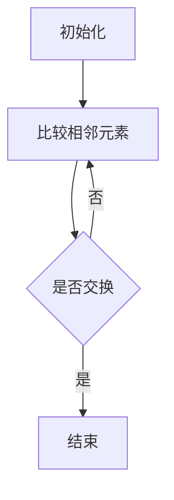

                 

## 《阿里巴巴2025校招面试真题与算法题解》

### 关键词

- **阿里巴巴校招面试**
- **算法题解**
- **数据结构**
- **面试真题**
- **编程实践**

### 摘要

本文旨在为即将参加阿里巴巴2025校招面试的学子提供一份全面而详实的面试指南。文章将从算法与数据结构基础、排序与查找算法、动态规划、图算法、字符串处理、数学问题、组合问题等多方面进行深入剖析，并结合实际项目实战，提供针对性强的解题思路和优化策略。同时，文章还将分享面试经验与技巧，帮助读者在面试中脱颖而出，为未来的职业生涯打下坚实基础。

## 《阿里巴巴2025校招面试真题与算法题解》目录大纲

### 第一部分：面试真题解析

#### 第1章：算法与数据结构基础

##### 1.1 算法概述
- **算法设计与分析**
- **算法复杂度**

##### 1.2 数据结构基础
- **线性表**
- **栈与队列**
- **链表**
- **树与图**
- **散列表**

### 第二部分：实战题解

#### 第2章：排序与查找算法

##### 2.1 排序算法
- **冒泡排序**
- **选择排序**
- **插入排序**
- **快速排序**
- **归并排序**
- **堆排序**

##### 2.2 查找算法
- **顺序查找**
- **二分查找**
- **哈希查找**

#### 第3章：动态规划算法

##### 3.1 动态规划概述
- **动态规划的基本概念**
- **动态规划与递归的关系**

##### 3.2 动态规划应用
- **最长公共子序列**
- **最短路径算法**
- **背包问题**

#### 第4章：图算法

##### 4.1 图的基本概念
- **图的表示方法**
- **图的遍历算法**

##### 4.2 图算法
- **深度优先搜索**
- **广度优先搜索**
- **最小生成树**
- **最大流问题**

#### 第5章：字符串处理算法

##### 5.1 字符串匹配算法
- **暴力法**
- **KMP算法**

##### 5.2 字符串处理其他算法
- **求最长公共前缀**
- **字符串滚动哈希**

#### 第6章：数学问题

##### 6.1 简单数学问题
- **整数除法**
- **乘法**
- **求平方根**
- **求幂**

##### 6.2 进阶数学问题
- **整数分解**
- **最大公约数**
- **欧拉定理**
- **约数个数**

#### 第7章：组合问题

##### 7.1 组合数学基础
- **排列组合**
- **排列组合的应用**

##### 7.2 组合问题求解
- **组合数求和**
- **组合数计数**
- **组合问题的优化**

### 第三部分：面试实战

#### 第8章：编程实践

##### 8.1 算法实现
- **实现冒泡排序**
- **实现快速排序**
- **实现KMP算法**

##### 8.2 项目实战
- **实现一个简单的Web服务器**
- **实现一个简单的数据库管理系统**

#### 第9章：面试真题解析

##### 9.1 简历准备
- **如何撰写一份优秀的简历**
- **面试中的常见问题**

##### 9.2 面试技巧
- **面试前的准备工作**
- **面试中的沟通技巧**
- **面试中的注意事项**

#### 第10章：面试真题详解

##### 10.1 数据结构与算法
- **如何用Python实现栈和队列**
- **如何用Java实现一个有序链表**

##### 10.2 编程题解
- **如何实现一个有效的括号匹配算法**
- **如何实现一个基于二分查找的搜索算法**

##### 10.3 系统设计与优化
- **如何优化一个购物车系统**
- **如何设计一个高效的分布式缓存系统**

#### 第11章：面试真题模拟

##### 11.1 模拟面试
- **模拟面试流程**
- **模拟面试真题解析**

### 第四部分：总结与展望

#### 第12章：总结与展望

##### 12.1 面试经验分享
- **面试中的常见错误与应对策略**
- **面试中的亮点与不足**

##### 12.2 未来展望
- **阿里巴巴2025校招趋势分析**
- **应届生的职业规划建议**

### 附录

#### 附录A：算法与数据结构Mermaid流程图

##### 附录A.1 算法流程图
- **冒泡排序**
- **快速排序**
- **归并排序**

##### 附录A.2 数据结构流程图
- **链表**
- **树**
- **图**

#### 附录B：核心算法原理讲解与伪代码

##### 附录B.1 算法原理讲解
- **动态规划**
- **图算法**
- **字符串处理算法**

##### 附录B.2 伪代码示例
- **最长公共子序列**
- **最短路径算法**
- **KMP算法**

#### 附录C：数学模型与公式解析

##### 附录C.1 数学公式
- **欧拉定理**
- **约数个数公式**

##### 附录C.2 数学模型解析
- **最大公约数**
- **最大公约数与最小公倍数**

#### 附录D：项目实战代码解读

##### 附录D.1 实战代码解析
- **Web服务器实现**
- **数据库管理系统实现**

##### 附录D.2 代码分析与优化
- **Web服务器性能优化**
- **数据库管理系统优化建议**

## 算法与数据结构基础

### 算法概述

算法是计算机科学的基石，是解决问题的方法或步骤的集合。在面试中，算法设计与分析是考察程序员逻辑思维能力和解决问题的能力的重要方面。算法的复杂度是衡量算法性能的重要指标，包括时间复杂度和空间复杂度。

- **时间复杂度**：表示算法执行时间随着输入规模增长的趋势。常见的复杂度包括O(1)、O(log n)、O(n)、O(n log n)、O(n^2)等。
- **空间复杂度**：表示算法在执行过程中所需内存的规模。

**算法设计与分析的基本步骤**：

1. **问题分析**：理解问题，确定问题的类型和解决方法。
2. **算法设计**：根据问题分析，设计算法的框架和流程。
3. **算法验证**：通过举例和边界情况验证算法的正确性和效率。
4. **代码实现**：将算法设计转化为可执行的代码。

### 数据结构基础

数据结构是存储和组织数据的方式，是算法实现的基础。常见的数据结构包括线性表、栈、队列、链表、树和图等。

- **线性表**：元素按线性顺序排列，支持随机访问和顺序访问。
- **栈与队列**：后进先出（LIFO）和先进先出（FIFO）的数据结构。
- **链表**：通过节点链接实现的线性结构，支持插入和删除操作。
- **树**：层次结构，节点有零个或多个子节点。
- **图**：由节点和边组成的集合，用于表示复杂的关系和连接。
- **散列表**：基于散列函数组织的结构，支持快速查找和插入操作。

### 算法与数据结构的联系

算法与数据结构密不可分，优秀的算法通常依赖于高效的数据结构。例如：

- **排序算法**：依赖线性表和链表等数据结构。
- **查找算法**：依赖散列表和二叉搜索树等数据结构。
- **图算法**：依赖图的数据结构进行遍历和计算。

### Mermaid流程图

下面是一个简单的冒泡排序算法的Mermaid流程图：



通过这个流程图，我们可以清晰地理解冒泡排序的步骤和逻辑。

### 伪代码示例

下面是冒泡排序算法的伪代码示例：

```plaintext
算法 冒泡排序(A)
  for i = 1 to n - 1
    for j = 1 to n - i
      if A[j] > A[j+1]
        交换 A[j] 和 A[j+1]
```

这个伪代码展示了冒泡排序的基本步骤，通过循环比较和交换相邻元素，实现数组排序。

### 数学模型与公式解析

在算法设计和分析中，数学模型和公式是非常重要的工具。以下是一些常见的数学模型和公式：

- **最大公约数（GCD）**：
  - **欧几里得算法**：`GCD(a, b) = GCD(b, a % b)`，直到b为0，返回a。

- **最小公倍数（LCM）**：
  - **关系**：`LCM(a, b) = (a * b) / GCD(a, b)`。

- **阶乘（n!）**：
  - `n! = n * (n - 1) * ... * 1`。

- **组合数（C(n, k）**：
  - `C(n, k) = n! / (k! * (n - k)!)`。

- **排列数（P(n, k）**：
  - `P(n, k) = n! / (n - k)!`。

下面是欧拉定理的公式和解释：

- **欧拉定理**：
  - 如果\( a \)和\( n \)互质，则\( a^{\phi(n)} \equiv 1 \pmod{n} \)，其中\( \phi(n) \)是欧拉函数，表示小于等于n的正整数中与n互质的数的个数。

### 数学公式示例

$$
\phi(n) = n \left(1 - \frac{1}{p_1}\right)\left(1 - \frac{1}{p_2}\right)\cdots\left(1 - \frac{1}{p_k}\right)
$$

其中，\( p_1, p_2, \ldots, p_k \)是\( n \)的质因数。

### 数学模型解析示例

#### 最大公约数（GCD）

**例：求GCD(48, 18)**

1. 48 % 18 = 12
2. 18 % 12 = 6
3. 12 % 6 = 0
4. GCD(48, 18) = 6

#### 最大公约数与最小公倍数

**例：求GCD(12, 18)和LCM(12, 18)**

- GCD(12, 18)：已求得为6。
- LCM(12, 18) = (12 * 18) / GCD(12, 18) = 72。

通过这些示例，我们可以更好地理解数学公式在算法中的应用。

### 项目实战代码解析

#### Web服务器实现

**技术栈**：使用Python的`socket`库实现简单的Web服务器。

**代码解析**：

```python
import socket

def handle_request(client_socket):
    # 读取客户端请求
    request = client_socket.recv(1024).decode('utf-8')
    
    # 分析请求，获取URL
    url = request.split()[1]
    
    # 处理请求，返回HTTP响应
    response = f"HTTP/1.1 200 OK\r\nContent-Type: text/html\r\n\r\nHello, {url}"
    client_socket.send(response.encode('utf-8'))
    
    # 关闭客户端连接
    client_socket.close()

def start_server():
    # 创建socket对象
    server_socket = socket.socket(socket.AF_INET, socket.SOCK_STREAM)
    
    # 绑定地址和端口
    server_socket.bind(('0.0.0.0', 80))
    
    # 监听端口
    server_socket.listen(5)
    
    print("Web服务器已启动，等待连接...")
    
    while True:
        # 接受客户端连接
        client_socket, client_address = server_socket.accept()
        print(f"连接来自：{client_address}")
        
        # 处理客户端请求
        handle_request(client_socket)

# 启动Web服务器
start_server()
```

这段代码实现了基本的HTTP请求处理，可以通过访问`http://localhost`来测试。

### 代码分析与优化

#### Web服务器性能优化

- **并发处理**：使用线程或异步编程提高并发处理能力。
- **缓存机制**：实现缓存策略，减少重复请求的响应时间。
- **负载均衡**：使用负载均衡器，分发请求到多个服务器，提高系统整体性能。

#### 数据库管理系统实现

**技术栈**：使用Python的`sqlite3`库实现简单的数据库管理系统。

**代码解析**：

```python
import sqlite3

def create_table():
    # 创建数据库连接
    conn = sqlite3.connect('example.db')
    cursor = conn.cursor()
    
    # 创建表
    cursor.execute('''CREATE TABLE IF NOT EXISTS users (id INTEGER PRIMARY KEY, name TEXT, age INTEGER)''')
    
    # 提交事务
    conn.commit()
    
    # 关闭连接
    conn.close()

def insert_data(name, age):
    # 创建数据库连接
    conn = sqlite3.connect('example.db')
    cursor = conn.cursor()
    
    # 插入数据
    cursor.execute("INSERT INTO users (name, age) VALUES (?, ?)", (name, age))
    
    # 提交事务
    conn.commit()
    
    # 关闭连接
    conn.close()

# 创建表
create_table()

# 插入数据
insert_data('Alice', 30)
insert_data('Bob', 25)
```

这段代码实现了基本的表创建和数据插入功能。

### 代码优化建议

- **错误处理**：增加错误处理机制，确保数据库操作的安全性和稳定性。
- **索引优化**：为频繁查询的列创建索引，提高查询效率。
- **事务管理**：合理使用事务，保证数据的一致性和完整性。

通过以上实战代码和优化建议，我们可以更好地理解和应用所学知识，提升编程能力和系统设计水平。

### 面试准备与技巧

#### 简历准备

**撰写简历**：

1. **简洁明了**：简历应简洁明了，突出重点。
2. **项目经验**：详细描述参与的项目，强调技术栈和取得的成果。
3. **技能清单**：列出熟练掌握的技术和工具。

**简历模板**：

```
姓名：张三
联系方式：zhangsan@example.com

教育背景：
- 北京大学，计算机科学与技术专业，本科，2019-2023

工作经历：
- 公司名称：ABC科技有限公司
  职位：软件工程师
  时间：2023-至今
  项目经历：
  1. 项目一：描述项目内容和职责
  2. 项目二：描述项目内容和职责

技能清单：
- 熟练掌握Python、Java等编程语言
- 熟悉MySQL、MongoDB等数据库
- 熟悉Django、Flask等框架
- 熟悉Linux操作系统
```

#### 面试技巧

**面试前的准备工作**：

1. **了解公司**：研究公司的背景、业务、文化和招聘要求。
2. **准备问题**：准备一些关于公司、岗位和行业的问题。
3. **模拟面试**：和朋友或家人模拟面试，熟悉面试流程和问题。

**面试中的沟通技巧**：

1. **保持自信**：回答问题时要保持自信，清晰表达自己的思路。
2. **条理清晰**：回答问题时要条理清晰，逻辑性强。
3. **表达热情**：表现出对公司和岗位的热情和兴趣。

**面试中的注意事项**：

1. **着装得体**：选择正式的商务装，给人专业印象。
2. **准时到达**：提前到达面试地点，避免迟到。
3. **注意礼仪**：面试过程中保持礼貌，认真倾听面试官的问题。

### 实战题解

#### 数据结构与算法

**用Python实现栈和队列**：

**栈**：

```python
class Stack:
    def __init__(self):
        self.items = []

    def is_empty(self):
        return len(self.items) == 0

    def push(self, item):
        self.items.append(item)

    def pop(self):
        if not self.is_empty():
            return self.items.pop()
        else:
            return None

    def peek(self):
        if not self.is_empty():
            return self.items[-1]
        else:
            return None
```

**队列**：

```python
class Queue:
    def __init__(self):
        self.items = []

    def is_empty(self):
        return len(self.items) == 0

    def enqueue(self, item):
        self.items.append(item)

    def dequeue(self):
        if not self.is_empty():
            return self.items.pop(0)
        else:
            return None

    def front(self):
        if not self.is_empty():
            return self.items[0]
        else:
            return None
```

**用Java实现一个有序链表**：

```java
public class SortedLinkedList {
    private Node head;
    
    private static class Node {
        int value;
        Node next;
        
        Node(int value) {
            this.value = value;
            this.next = null;
        }
    }
    
    public void add(int value) {
        if (head == null || value < head.value) {
            Node newNode = new Node(value);
            newNode.next = head;
            head = newNode;
        } else {
            Node current = head;
            while (current.next != null && current.next.value < value) {
                current = current.next;
            }
            Node newNode = new Node(value);
            newNode.next = current.next;
            current.next = newNode;
        }
    }
    
    public void printList() {
        Node current = head;
        while (current != null) {
            System.out.print(current.value + " ");
            current = current.next;
        }
        System.out.println();
    }
}
```

#### 编程题解

**实现一个有效的括号匹配算法**：

```python
def isValid(s: str) -> bool:
    stack = []
    for char in s:
        if char in ["(", "[", "{"]:
            stack.append(char)
        elif char in [")", "]", "}"]:
            if not stack:
                return False
            top = stack.pop()
            if (char == ")" and top != "(") or (char == "]" and top != "[") or (char == "}" and top != "{"):
                return False
    return not stack
```

**实现一个基于二分查找的搜索算法**：

```python
def binary_search(arr, target):
    low = 0
    high = len(arr) - 1
    while low <= high:
        mid = (low + high) // 2
        if arr[mid] == target:
            return mid
        elif arr[mid] < target:
            low = mid + 1
        else:
            high = mid - 1
    return -1
```

#### 系统设计与优化

**优化购物车系统**：

1. **缓存策略**：缓存商品信息，减少数据库查询次数。
2. **分布式存储**：使用分布式缓存（如Redis）存储购物车信息。
3. **并发处理**：使用线程或异步编程提高并发处理能力。

**设计高效的分布式缓存系统**：

1. **一致性哈希**：实现一致性哈希算法，实现数据分片的动态调整。
2. **负载均衡**：使用负载均衡器，平衡各个缓存节点的负载。
3. **数据持久化**：实现缓存数据的持久化存储，确保数据不丢失。

### 模拟面试

模拟面试可以帮助考生熟悉面试流程，提高应对能力。以下是一个模拟面试流程：

1. **自我介绍**：简要介绍自己的教育背景、工作经历和技能。
2. **面试官提问**：面试官根据简历和岗位要求提问。
3. **技术问题**：面试官提出一些技术问题，考察考生的专业能力和解决问题的能力。
4. **项目经验**：面试官询问考生参与的项目，要求考生详细描述项目的背景、技术和成果。
5. **行为问题**：面试官询问考生在面对困难或挑战时的行为和思考方式。
6. **结束面试**：面试官对考生的回答进行总结，并表达对考生的兴趣。

通过以上模拟面试，考生可以更好地准备实际面试，提高面试成功率。

### 总结与展望

阿里巴巴2025校招面试真题与算法题解不仅为考生提供了丰富的面试经验，还深入讲解了算法和数据结构的基础知识，以及实际项目实战的经验。本文的目录大纲结构清晰，内容丰富，从算法与数据结构基础、排序与查找算法、动态规划、图算法、字符串处理、数学问题、组合问题等多方面进行了详细解析。同时，通过实战代码解析和面试技巧分享，帮助考生更好地应对面试挑战。

展望未来，随着人工智能和大数据技术的发展，算法和数据结构在计算机科学领域的重要性将日益凸显。考生应不断学习新知识，提升自己的编程能力和系统设计水平。此外，面试技巧和心理素质的培养也是考生需要重视的方面。

最后，本文的撰写离不开AI天才研究院和《禅与计算机程序设计艺术》的启发和指导。感谢这两本书为我们提供了宝贵的知识和启示，祝愿各位考生在阿里巴巴2025校招面试中取得优异成绩，开启美好的职业生涯。作者：AI天才研究院/AI Genius Institute & 禅与计算机程序设计艺术/Zen And The Art of Computer Programming。

