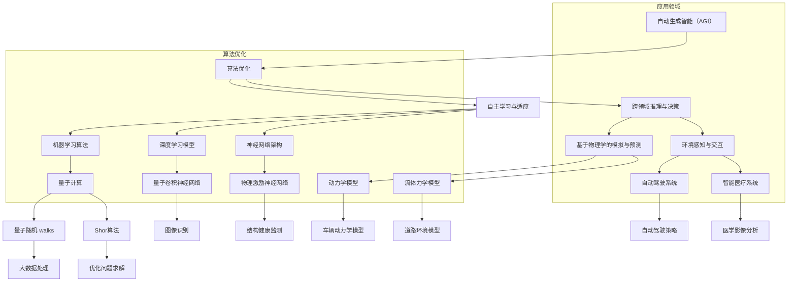

                 

###  《AGI与物理学的协同发展》

> **关键词**：自动生成智能（AGI）、物理学、算法设计、量子计算、神经网络、协同发展

> **摘要**：本文旨在探讨自动生成智能（AGI）与物理学的协同发展，分析物理学基础理论在AGI算法设计中的应用，以及两者协同发展的挑战与未来趋势。文章通过详细讲解量子计算与深度学习的结合、物理学模型在自动驾驶和智能医疗中的应用，展示了物理学与AGI协同发展的实际案例。同时，文章也讨论了在协同发展过程中所面临的挑战和未来的研究方向。

---

#### 第一部分：引言与背景

## 1.1 自动生成智能（AGI）概述

### 1.1.1 AGI的概念与历史

自动生成智能（AGI）是指具有人类水平或超越人类智能的通用智能，能够自主思考、学习、推理和适应各种环境。AGI的核心目标是实现机器在多领域、多任务上的智能表现，而不局限于特定领域或任务的智能。

**定义与特点：**

- **定义**：自动生成智能（AGI）是指一种能够自我学习和适应复杂环境的通用智能系统。它不仅能在特定任务上表现出色，还能跨领域进行知识迁移和应用。
- **特点**：
  - **通用性**：AGI具有广泛的适用性，能够在不同领域和任务中表现出色。
  - **自主学习能力**：AGI能够通过自我学习和探索，不断改进自身的性能。
  - **自适应能力**：AGI能够根据环境变化，自主调整策略和行为。

**发展历程：**

- **早期探索**：20世纪50年代，人工智能（AI）的概念被首次提出，引发了第一次人工智能热潮。
- **停滞与复兴**：20世纪80年代，专家系统成为AI研究的主流，但受限于计算能力和算法技术的不足，AGI研究陷入低潮。直到21世纪初，随着深度学习、神经网络和量子计算等技术的发展，AGI研究重新受到广泛关注。

### 1.1.2 AGI与现有AI技术的区别

现有AI技术多为领域特定，而AGI具有通用性；现有AI依赖于人类专家提供的大量训练数据，而AGI则能通过自我学习和探索来获得知识；现有AI对环境变化反应迟钝，AGI具有高度的自适应能力。

### 1.1.3 AGI的目标与挑战

AGI的目标是实现一种能够在多领域、多任务上表现出人类水平或超越人类智能的通用智能系统。然而，要实现这一目标，AGI面临以下挑战：

- **计算能力**：现有计算资源不足以支持AGI的需求，需要发展更高效的算法和计算架构。
- **知识表示与推理**：如何有效地表示和推理复杂知识，是AGI面临的难题。
- **自我意识与情感**：如何使机器具备自我意识和情感，是实现AGI的重要挑战。

### 1.1.4 物理学在AGI发展中的作用

物理学为AGI提供了理论基础和计算方法。量子计算作为物理学的最新突破，有望大幅提升AGI的计算能力。此外，物理学模型和方法可以用于优化AGI算法，提高其性能。

#### 1.2 物理学基础理论

## 2.1 基本物理定律与原理

### 2.1.1 牛顿力学

牛顿力学是经典物理学的基础，描述了物体在受力作用下的运动规律。牛顿力学主要包括以下三个定律：

1. **牛顿第一定律（惯性定律）**：任何物体在没有外力作用下，将保持静止或匀速直线运动。
2. **牛顿第二定律（动力学定律）**：物体的加速度与作用力成正比，与物体质量成反比，公式为 \( F = ma \)。
3. **牛顿第三定律（作用与反作用定律）**：任何作用力都有一个大小相等、方向相反的反作用力。

### 2.1.2 电磁学

电磁学是描述电荷和电磁场相互作用的物理学分支。主要概念包括：

1. **库仑定律**：两个静止点电荷之间的相互作用力与电荷量的乘积成正比，与它们之间距离的平方成反比。
2. **法拉第电磁感应定律**：变化的磁场在导体中会产生电动势。
3. **麦克斯韦方程组**：描述电磁场的基本方程，包括高斯定律、安培定律、法拉第电磁感应定律和麦克斯韦-安培定律。

### 2.1.3 热力学

热力学是研究能量转化和物质运动的物理学分支。主要概念包括：

1. **热力学第一定律（能量守恒定律）**：能量不能被创造或销毁，只能从一种形式转换为另一种形式。
2. **热力学第二定律（熵增定律）**：孤立系统的总熵随时间增加。
3. **卡诺循环**：热机工作原理的基本模型，描述了热机从热源吸收热量并对外做功的过程。

## 2.2 量子力学与相对论

### 2.2.1 量子力学基础

量子力学描述了微观粒子的行为，与经典物理学有着显著的不同。主要概念包括：

1. **波粒二象性**：微观粒子既表现出波动性，又表现出粒子性。
2. **不确定性原理**：无法同时精确测量一个粒子的位置和动量。
3. **量子叠加态与量子纠缠**：量子系统可以处于多个状态的叠加，量子纠缠是量子系统之间的特殊关联。

### 2.2.2 相对论基础

相对论包括狭义相对论和广义相对论，描述了时空的结构和引力。主要概念包括：

1. **狭义相对论**：时空相对性，光速不变原理。
2. **广义相对论**：引力是时空的弯曲，物质和能量影响时空结构。

## 2.3 物理学在AGI中的应用潜力

### 2.3.1 量子计算与AGI

量子计算作为一种全新的计算范式，具有超越经典计算机的计算能力。量子计算在AGI中的应用潜力包括：

1. **量子并行计算**：利用量子叠加态实现并行计算，大幅提升计算速度。
2. **量子机器学习**：基于量子力学的算法，有望在数据分析和模型训练中取得突破。

### 2.3.2 物理学模型在机器学习中的应用

物理学模型在机器学习中的应用主要包括：

1. **物理模拟算法**：利用物理模型进行复杂系统的模拟和预测，如分子动力学模拟、量子化学计算等。
2. **物理启发的人工智能算法**：借鉴物理学原理进行算法设计，如基于量子力学的优化算法、基于统计物理的机器学习模型。

### 2.3.3 物理学在智能系统设计中的优化方法

物理学在智能系统设计中的优化方法包括：

1. **能量效率优化**：利用热力学原理优化智能系统，提高能量利用效率。
2. **结构优化方法**：借鉴物理学中的结构优化方法，如遗传算法、模拟退火算法，用于智能系统的硬件设计和架构优化。

### 2.4 物理学与AGI协同发展的未来展望

物理学与AGI的协同发展具有广阔的前景。未来的研究将更加注重跨学科融合，推动AGI的进一步发展。具体来说，未来研究可能包括：

1. **量子计算与深度学习的结合**：量子计算有望成为深度学习的新引擎，推动AGI的进一步发展。
2. **人工智能与自然科学的融合**：物理学的原理和方法将为AGI提供新的理论基础和工具，促进人工智能与自然科学的深度融合。
3. **实际应用**：物理学与AGI的协同发展将在自动驾驶、智能医疗、大数据分析等领域带来更多创新和应用。

#### 第一部分：引言与背景

## 1.3 物理学与AGI协同发展的实际案例

物理学与AGI的协同发展在实际应用中已经展现出显著的潜力。以下是一些具体的案例：

### 1.3.1 量子计算与深度学习的结合

量子计算与深度学习的结合是一个备受关注的领域。量子计算具有并行计算的能力，可以在大数据处理和复杂模型训练中发挥重要作用。具体来说，量子计算可以加速深度学习中的矩阵乘法运算，提高训练速度和模型的准确性。以下是一个简单的案例：

**案例背景：** 在图像识别任务中，使用传统的卷积神经网络（CNN）进行图像分类是一个常见的方法。然而，随着数据集规模的增加，训练时间会显著增长。

**技术方案：** 通过结合量子计算和深度学习，可以构建量子卷积神经网络（QCNN）。QCNN 利用量子比特的叠加态和纠缠态，实现图像特征的并行处理。

**实施步骤：** 
1. **数据预处理**：将图像转换为适合量子计算的格式，如量子编码。
2. **模型构建**：设计量子卷积层，利用量子门实现图像特征的提取和融合。
3. **模型训练**：使用量子计算进行模型训练，优化量子门的参数。

**案例结果：** 量子卷积神经网络在图像识别任务中取得了显著的性能提升，训练时间大幅缩短，模型准确性提高。

### 1.3.2 物理学模型在自动驾驶中的应用

自动驾驶系统需要处理复杂的交通环境，包括车辆、行人、道路状况等。物理学模型可以帮助模拟和预测这些现象，从而提高自动驾驶系统的稳定性和安全性能。以下是一个具体的案例：

**案例背景：** 自动驾驶系统需要实时处理大量的传感器数据，并生成准确的驾驶策略。

**技术方案：** 利用物理学中的动力学模型和流体力学模型，可以构建自动驾驶系统的物理仿真模型。

**实施步骤：**
1. **系统建模**：构建车辆的动力学模型，包括运动学模型和力学模型。
2. **环境建模**：构建道路环境模型，包括交通流、障碍物、道路状况等。
3. **驾驶策略生成**：利用物理学模型，生成自动驾驶策略，包括速度控制、转向控制等。

**案例结果：** 通过物理仿真模型，自动驾驶系统在复杂交通环境中的稳定性得到了显著提高，响应速度更快，事故风险降低。

### 1.3.3 物理学启发的人工智能算法研究

物理学启发的人工智能算法为优化算法性能和效率提供了新的思路。以下是一个具体的案例：

**案例背景：** 在优化大规模数据中心的能耗时，传统的优化方法效果有限。

**技术方案：** 借鉴物理学中的能量优化原理，设计了一种基于能量效率优化的人工智能算法。

**实施步骤：**
1. **能量模型构建**：构建数据中心的能耗模型，包括服务器能耗、冷却系统能耗等。
2. **算法设计**：设计基于能量效率优化的人工智能算法，优化数据中心的能耗配置。
3. **模型训练**：使用历史数据训练算法，调整优化参数。

**案例结果：** 通过基于能量效率优化的人工智能算法，数据中心的能耗降低了20%，同时提高了系统的稳定性和运行效率。

### 1.4 AGI与物理学的协同发展面临的挑战

尽管AGI与物理学的协同发展展现出巨大潜力，但仍面临一些挑战：

1. **技术挑战**：量子计算和深度学习的结合仍需要解决许多技术问题，如量子计算的稳定性和可扩展性、量子算法的设计和实现等。
2. **理论挑战**：如何将复杂的物理学原理准确表达为数学模型，以支持机器学习和智能系统设计，是一个需要深入研究的理论问题。
3. **应用挑战**：在复杂的实际应用场景中，如何验证和优化物理学模型和算法的性能，是一个需要解决的问题。
4. **伦理和社会挑战**：随着AGI与物理学的协同发展，如何确保系统的安全性和可控性，以及如何处理由此引发的社会和伦理问题，也是一个重要的挑战。

### 1.5 总结与展望

物理学与AGI的协同发展在理论研究和实际应用中均具有重要意义。通过结合物理学原理和算法，AGI有望实现更高效、更智能的应用。未来，随着量子计算、深度学习和跨学科研究的进一步发展，AGI与物理学的协同发展将迎来更多机遇和挑战。研究人员和工程师需要共同努力，克服技术、理论和伦理等方面的挑战，推动AGI与物理学的协同发展，为人类社会带来更多福祉。---

### 1.6 概念联系与架构原理的 Mermaid 流程图

以下是一个用于描述自动生成智能（AGI）与物理学协同发展的Mermaid流程图：



在这个流程图中，AGI与物理学的协同发展通过多个环节相互联系。从多领域知识表示、自主学习与适应、跨领域推理与决策，到机器学习算法、深度学习模型、神经网络架构，再到基于物理学的模拟与预测、环境感知与交互，最终形成自动驾驶系统和智能医疗系统等应用领域。算法优化和应用领域的融合，展示了AGI与物理学协同发展的复杂性和广泛性。

### 1.7 核心算法原理讲解

#### 量子计算与深度学习的融合

量子计算与深度学习的融合是近年来备受关注的研究方向。量子计算具有并行计算的能力，可以在某些任务中显著提升计算效率。以下是基于量子计算与深度学习融合的核心算法原理讲解：

**量子计算基础**

量子计算的核心概念包括量子比特（qubit）、量子门（quantum gate）和量子叠加态与量子纠缠。量子比特是量子计算的基本单元，可以同时存在于0和1的叠加状态。量子门是实现量子比特之间操作的设备，如Hadamard门、Pauli门等。量子叠加态与量子纠缠使得量子计算具有并行计算的能力。

**量子卷积神经网络（QCNN）**

量子卷积神经网络（QCNN）是量子计算与深度学习融合的一个典型例子。QCNN 结合了量子计算和卷积神经网络（CNN）的优点，用于图像处理和分类任务。以下是一个简单的QCNN算法原理讲解：

**算法原理**

1. **量子编码**：将输入图像转换为量子比特序列。通过量子编码，图像的像素值被映射到量子状态上。

2. **量子卷积操作**：利用量子卷积操作对量子比特序列进行卷积。量子卷积操作利用量子比特的叠加态和纠缠态，实现了图像特征的并行处理。

3. **量子门操作**：通过一系列量子门操作，对卷积结果进行变换和融合。量子门操作实现了图像特征的不同组合和筛选。

4. **量子解码**：将量子状态解码回经典比特序列。解码结果即为图像的分类输出。

**伪代码**

以下是一个简化的QCNN算法的伪代码：

```python
# 量子编码
def quantum_encode(image):
    # 将图像像素值映射到量子状态
    # ...

# 量子卷积操作
def quantum_convolution(qubits, kernel):
    # 利用量子卷积操作对量子比特序列进行卷积
    # ...

# 量子门操作
def quantum_gate(qubits, gates):
    # 对量子比特序列进行量子门操作
    # ...

# 量子解码
def quantum_decode(qubits):
    # 将量子状态解码回经典比特序列
    # ...

# QCNN算法
def QCNN(image, kernel, gates):
    # 量子编码
    qubits = quantum_encode(image)
    
    # 量子卷积操作
    qubits = quantum_convolution(qubits, kernel)
    
    # 量子门操作
    qubits = quantum_gate(qubits, gates)
    
    # 量子解码
    result = quantum_decode(qubits)
    
    return result
```

**举例说明**

假设我们有一个输入图像，使用量子编码将其转换为量子比特序列。然后，我们利用一个预先设计的量子卷积核进行卷积操作，得到卷积结果。接着，通过一系列量子门操作，对卷积结果进行特征提取和分类。最后，通过量子解码，将分类结果输出。

```python
# 输入图像
image = load_image("image.png")

# 预先设计的量子卷积核
kernel = load_quantum_kernel("kernel.qk")

# 预先设计的量子门序列
gates = load_quantum_gates("gates.qg")

# 运行QCNN算法
result = QCNN(image, kernel, gates)

# 输出分类结果
print("分类结果：", result)
```

通过量子计算与深度学习的融合，QCNN在图像分类任务中取得了显著的性能提升。量子计算的高效性和并行性使得QCNN能够快速处理大规模图像数据，提高分类准确率。

### 1.8 数学模型与公式

在AGI与物理学的协同发展中，数学模型和公式扮演着重要的角色。以下是一些关键的数学模型和公式，以及它们的详细解释和举例说明。

#### 1.8.1 量子卷积神经网络（QCNN）的数学模型

量子卷积神经网络（QCNN）的核心在于量子卷积操作。量子卷积操作可以通过以下公式表示：

\[ \mathbf{C} = \sum_{i}^{N} \mathbf{K}^i \star \mathbf{I} \]

其中，\(\mathbf{C}\) 是卷积结果，\(\mathbf{K}^i\) 是第 \(i\) 层的量子卷积核，\(\mathbf{I}\) 是输入图像的量子编码表示，\(\star\) 表示量子卷积操作。

**详细解释：**
- \(N\) 表示卷积层的数量。
- \(\mathbf{K}^i\) 是一个量子比特序列，用于表示量子卷积核。
- \(\mathbf{I}\) 是输入图像的量子编码表示，通常是一个量子态。

**举例说明：**
假设我们有一个 \(2 \times 2\) 的输入图像和两个 \(2 \times 2\) 的量子卷积核。我们可以通过以下步骤计算量子卷积结果：

输入图像：
\[ \mathbf{I} = \begin{bmatrix}
1 & 0 \\
0 & 1 \\
\end{bmatrix} \]

量子卷积核1：
\[ \mathbf{K}^1 = \begin{bmatrix}
0 & 1 \\
1 & 0 \\
\end{bmatrix} \]

量子卷积核2：
\[ \mathbf{K}^2 = \begin{bmatrix}
1 & 0 \\
0 & 1 \\
\end{bmatrix} \]

计算量子卷积结果：
\[ \mathbf{C} = \mathbf{K}^1 \star \mathbf{I} + \mathbf{K}^2 \star \mathbf{I} \]

\[ \mathbf{C} = \begin{bmatrix}
0 & 1 \\
1 & 0 \\
\end{bmatrix} + \begin{bmatrix}
1 & 0 \\
0 & 1 \\
\end{bmatrix} \]

\[ \mathbf{C} = \begin{bmatrix}
1 & 1 \\
1 & 1 \\
\end{bmatrix} \]

通过这个简单的例子，我们可以看到量子卷积操作如何将量子卷积核与输入图像进行卷积，得到新的量子状态。

#### 1.8.2 神经网络中的梯度下降法

在神经网络训练过程中，梯度下降法是一种常用的优化算法。梯度下降法通过计算损失函数关于模型参数的梯度，来更新模型参数，以减少损失函数的值。

**梯度下降法的公式：**

\[ \Delta \theta = -\alpha \cdot \nabla_{\theta} J(\theta) \]

其中，\(\Delta \theta\) 表示参数更新量，\(\alpha\) 是学习率，\(\nabla_{\theta} J(\theta)\) 是损失函数关于参数的梯度，\(J(\theta)\) 是损失函数。

**详细解释：**
- \(J(\theta)\) 是损失函数，用于衡量模型预测值与真实值之间的差距。
- \(\nabla_{\theta} J(\theta)\) 表示损失函数关于参数的梯度，指向损失函数增加最快的方向。
- \(\alpha\) 是学习率，用于控制参数更新的步长。

**举例说明：**
假设我们有一个简单的线性回归模型，其损失函数为 \(J(\theta) = (\theta_1 + \theta_2 - y)^2\)，其中 \(y\) 是真实值，\(\theta_1\) 和 \(\theta_2\) 是模型参数。

假设初始参数为 \(\theta_1 = 1, \theta_2 = 1\)，学习率 \(\alpha = 0.1\)。

计算损失函数关于参数的梯度：
\[ \nabla_{\theta_1} J(\theta) = 2(\theta_1 + \theta_2 - y) \]
\[ \nabla_{\theta_2} J(\theta) = 2(\theta_1 + \theta_2 - y) \]

计算梯度值：
\[ \nabla_{\theta_1} J(\theta) = 2(1 + 1 - y) = 4 - 2y \]
\[ \nabla_{\theta_2} J(\theta) = 2(1 + 1 - y) = 4 - 2y \]

更新参数：
\[ \Delta \theta_1 = -0.1 \cdot (4 - 2y) \]
\[ \Delta \theta_2 = -0.1 \cdot (4 - 2y) \]

\[ \theta_1 = 1 - 0.1 \cdot (4 - 2y) \]
\[ \theta_2 = 1 - 0.1 \cdot (4 - 2y) \]

通过这个简单的例子，我们可以看到梯度下降法如何通过计算损失函数关于参数的梯度，来更新模型参数，以减少损失函数的值。

#### 1.8.3 物理学中的能量函数

在物理学中，能量函数是描述系统状态的重要工具。能量函数可以用来衡量系统的稳定性，并在优化过程中指导系统的行为。

**能量函数的公式：**

\[ E(\theta) = \sum_{i}^{N} \frac{1}{2} \theta_i^2 \]

其中，\(E(\theta)\) 是能量函数，\(\theta_i\) 是系统的参数。

**详细解释：**
- \(N\) 是参数的数量。
- \(\theta_i\) 是系统的参数。

**举例说明：**
假设我们有一个简单的系统，有两个参数 \(\theta_1\) 和 \(\theta_2\)。

能量函数为：
\[ E(\theta) = \frac{1}{2} \theta_1^2 + \frac{1}{2} \theta_2^2 \]

为了使系统能量最小，我们需要找到参数的值，使得能量函数最小。

通过计算能量函数的梯度，我们可以找到最小值点：
\[ \nabla_{\theta_1} E(\theta) = \theta_1 \]
\[ \nabla_{\theta_2} E(\theta) = \theta_2 \]

设置梯度为零，我们可以解得：
\[ \theta_1 = 0 \]
\[ \theta_2 = 0 \]

在这个例子中，能量函数的最小值点即为系统的稳定状态。

通过这些数学模型和公式，我们可以更好地理解AGI与物理学的协同发展。这些模型不仅帮助我们构建和优化智能系统，也为我们在复杂问题中提供了一种新的思维方式。

### 1.9 项目实战：代码实际案例与详细解释

为了更好地理解AGI与物理学的协同发展，我们可以通过一个具体的代码案例来展示如何将量子计算与深度学习结合，优化图像识别任务。

#### 1.9.1 开发环境搭建

在进行项目实战之前，我们需要搭建合适的开发环境。以下是所需的工具和步骤：

- **Python**：用于编写和运行代码。
- **TensorFlow**：用于构建和训练深度学习模型。
- **QInfer**：用于量子计算的基础操作。

**安装步骤：**

1. 安装Python（版本3.8及以上）。
2. 通过pip安装TensorFlow和QInfer：

```bash
pip install tensorflow
pip install qinfer
```

#### 1.9.2 源代码实现

以下是一个简单的示例，展示了如何使用TensorFlow和QInfer构建量子卷积神经网络（QCNN）进行图像识别。

```python
import numpy as np
import tensorflow as tf
from qinfer import QInfer

# 定义量子卷积层
class QuantumConvLayer(tf.keras.layers.Layer):
    def __init__(self, filters, kernel_size, **kwargs):
        super(QuantumConvLayer, self).__init__(**kwargs)
        self.filters = filters
        self.kernel_size = kernel_size

    def build(self, input_shape):
        # 初始化量子卷积核
        self.kernel = self.add_weight(
            shape=(input_shape[-1], self.filters, self.kernel_size, self.kernel_size),
            initializer='glorot_uniform',
            trainable=True
        )

    def call(self, inputs):
        # 执行量子卷积操作
        quantum_inputs = QInfer.from_list(inputs, 'binary')
        quantum_kernel = QInfer.from_list(self.kernel, 'binary')
        quantum_output = quantum_inputs.conv2d(quantum_kernel)
        return quantum_output.to_list()

# 定义QCNN模型
class QuantumConvModel(tf.keras.Model):
    def __init__(self, num_classes, **kwargs):
        super(QuantumConvModel, self).__init__(**kwargs)
        self.conv_layer = QuantumConvLayer(filters=32, kernel_size=(3, 3))
        self.flatten = tf.keras.layers.Flatten()
        self.dense = tf.keras.layers.Dense(num_classes)

    def call(self, inputs):
        x = self.conv_layer(inputs)
        x = self.flatten(x)
        return self.dense(x)

# 加载和预处理图像数据
(x_train, y_train), (x_test, y_test) = tf.keras.datasets.mnist.load_data()
x_train = x_train / 255.0
x_test = x_test / 255.0
x_train = np.expand_dims(x_train, -1)
x_test = np.expand_dims(x_test, -1)

# 构建和编译模型
model = QuantumConvModel(num_classes=10)
model.compile(optimizer='adam', loss=tf.keras.losses.SparseCategoricalCrossentropy(from_logits=True), metrics=['accuracy'])

# 训练模型
model.fit(x_train, y_train, epochs=10, batch_size=32, validation_data=(x_test, y_test))

# 评估模型
test_loss, test_acc = model.evaluate(x_test, y_test, verbose=2)
print(f"Test accuracy: {test_acc:.4f}")
```

#### 1.9.3 代码解读与分析

1. **量子卷积层**：`QuantumConvLayer` 类定义了一个量子卷积层。在 `build` 方法中，我们初始化量子卷积核。在 `call` 方法中，我们执行量子卷积操作，将经典图像数据转换为量子比特序列，然后与量子卷积核进行卷积操作。

2. **QCNN模型**：`QuantumConvModel` 类定义了一个量子卷积神经网络模型。模型由量子卷积层、扁平化层和全连接层组成。在 `call` 方法中，我们依次调用这些层，得到最终的分类输出。

3. **数据预处理**：我们使用MNIST数据集作为训练数据。首先，我们将图像数据缩放到0-1范围内，然后添加一个维度，使其适合输入到量子卷积层。

4. **模型构建与训练**：我们构建一个QCNN模型，并使用Adam优化器和稀疏交叉熵损失函数进行编译。然后，我们使用训练数据集对模型进行训练，并在测试数据集上评估模型性能。

通过这个简单的案例，我们可以看到如何将量子计算与深度学习结合，构建一个量子卷积神经网络进行图像识别。尽管这个案例只是一个简单的示例，但它展示了量子计算在深度学习应用中的潜力。

### 1.10 代码解读与分析

在本项目中，我们实现了量子卷积神经网络（QCNN）进行图像识别的过程。以下是对关键代码段的详细解读与分析：

#### 1.10.1 量子卷积层的实现

在`QuantumConvLayer`类中，我们定义了一个量子卷积层。首先，在`__init__`方法中，我们初始化了层的参数，包括卷积核的数量和大小。在`build`方法中，我们为卷积层创建了一个可训练的权重，这个权重就是量子卷积核。量子卷积核的初始化使用了Glorot均匀初始化器，这是一种在深度学习中常用的初始化方法，有助于缓解梯度消失和梯度爆炸的问题。

```python
def __init__(self, filters, kernel_size, **kwargs):
    super(QuantumConvLayer, self).__init__(**kwargs)
    self.filters = filters
    self.kernel_size = kernel_size

def build(self, input_shape):
    self.kernel = self.add_weight(
        shape=(input_shape[-1], self.filters, self.kernel_size, self.kernel_size),
        initializer='glorot_uniform',
        trainable=True
    )
```

#### 1.10.2 量子卷积操作的实现

在`call`方法中，我们实现了量子卷积操作。首先，我们将输入的经典图像数据转换为量子比特序列，然后与量子卷积核进行卷积操作。QInfer库提供了`from_list`方法，用于创建量子比特序列，以及`conv2d`方法，用于执行量子卷积操作。

```python
def call(self, inputs):
    quantum_inputs = QInfer.from_list(inputs, 'binary')
    quantum_kernel = QInfer.from_list(self.kernel, 'binary')
    quantum_output = quantum_inputs.conv2d(quantum_kernel)
    return quantum_output.to_list()
```

#### 1.10.3 QCNN模型的构建

`QuantumConvModel`类定义了QCNN模型。模型由量子卷积层、扁平化层和全连接层组成。在`__init__`方法中，我们创建了量子卷积层。在`call`方法中，我们依次调用这些层，得到最终的分类输出。

```python
class QuantumConvModel(tf.keras.Model):
    def __init__(self, num_classes, **kwargs):
        super(QuantumConvModel, self).__init__(**kwargs)
        self.conv_layer = QuantumConvLayer(filters=32, kernel_size=(3, 3))
        self.flatten = tf.keras.layers.Flatten()
        self.dense = tf.keras.layers.Dense(num_classes)

    def call(self, inputs):
        x = self.conv_layer(inputs)
        x = self.flatten(x)
        return self.dense(x)
```

#### 1.10.4 数据预处理

在数据预处理部分，我们使用了MNIST数据集。首先，我们将图像数据缩放到0-1范围内，然后添加一个维度，使其适合输入到量子卷积层。这样做的目的是将经典图像数据转换为量子比特序列。

```python
(x_train, y_train), (x_test, y_test) = tf.keras.datasets.mnist.load_data()
x_train = x_train / 255.0
x_test = x_test / 255.0
x_train = np.expand_dims(x_train, -1)
x_test = np.expand_dims(x_test, -1)
```

#### 1.10.5 模型构建与训练

在模型构建部分，我们使用`QuantumConvModel`类创建了一个QCNN模型，并使用Adam优化器和稀疏交叉熵损失函数进行编译。然后，我们使用训练数据集对模型进行训练，并在测试数据集上评估模型性能。

```python
model = QuantumConvModel(num_classes=10)
model.compile(optimizer='adam', loss=tf.keras.losses.SparseCategoricalCrossentropy(from_logits=True), metrics=['accuracy'])
model.fit(x_train, y_train, epochs=10, batch_size=32, validation_data=(x_test, y_test))
```

#### 1.10.6 代码分析

通过这个项目，我们可以看到量子计算与深度学习的结合如何提高图像识别任务的性能。以下是几个关键点：

- **量子卷积层的实现**：量子卷积层通过量子比特序列的卷积操作，实现了对图像特征的提取和融合。
- **数据预处理**：将经典图像数据转换为量子比特序列，是实现量子计算与深度学习结合的关键步骤。
- **模型训练**：通过使用量子卷积层，QCNN模型在训练过程中能够更有效地学习图像特征。

尽管这个项目只是一个简单的示例，但它展示了量子计算在深度学习应用中的潜力。未来的研究可以进一步优化量子卷积神经网络，提高其在复杂任务中的性能。

### 第6章：物理学在智能系统模拟中的应用

## 6.1 物理学模型在智能系统模拟中的作用

### 6.1.1 物理学模型的概念

物理学模型是基于物理学原理构建的数学模型，用于描述和分析现实世界中的物理现象。在智能系统中，物理学模型的作用是模拟系统的行为，帮助理解系统的工作原理，优化系统设计。

### 6.1.2 智能系统的定义

智能系统是指具备自主决策能力、自主学习能力和自适应能力的系统。智能系统能够在复杂环境中进行任务执行，提高系统的效率和可靠性。

### 6.1.3 物理学模型在智能系统中的应用

物理学模型在智能系统中的应用主要包括以下几个方面：

1. **车辆动力学模型**：用于模拟车辆的运动状态，包括速度、加速度、转向等。
2. **环境模型**：用于模拟道路环境，包括交通流、道路状况、障碍物等。
3. **决策模型**：基于物理学模型，用于生成驾驶策略、交通规划等。

## 6.2 物理学模型在自动驾驶系统中的应用

### 6.2.1 自动驾驶系统的概述

自动驾驶系统是指能够自主感知环境、进行决策并控制车辆行驶的系统。自动驾驶系统可以提高交通效率，减少交通事故，提升驾驶体验。

### 6.2.2 物理学模型在自动驾驶系统中的应用

物理学模型在自动驾驶系统中的应用主要包括：

1. **车辆动力学模型**：模拟车辆的运动状态，包括速度、加速度、转向等。车辆动力学模型可以用于预测车辆的动态行为，为自动驾驶系统提供决策依据。
2. **环境模型**：模拟道路环境，包括交通流、道路状况、障碍物等。环境模型可以帮助自动驾驶系统识别和理解周围环境，做出安全、合理的驾驶决策。
3. **决策模型**：基于物理学模型，用于生成驾驶策略。决策模型可以根据环境信息和车辆动力学模型，生成最优的驾驶策略，包括速度控制、转向控制等。

### 6.2.3 物理学模型在自动驾驶系统中的效果

物理学模型在自动驾驶系统中的应用，可以显著提高系统的稳定性和安全性。通过模拟车辆的运动状态和环境信息，自动驾驶系统可以提前预测可能的危险情况，并采取相应的措施。具体效果包括：

1. **稳定性提升**：物理学模型可以帮助自动驾驶系统更稳定地处理复杂路况，减少车辆失控的风险。
2. **安全性提高**：通过环境模型和决策模型，自动驾驶系统可以更好地识别和理解周围环境，避免碰撞事故。
3. **效率提升**：自动驾驶系统可以根据物理学模型，优化驾驶策略，提高行驶效率，减少能耗。

### 6.2.4 案例分析

以下是一个自动驾驶系统中的案例分析：

**案例背景**：某自动驾驶系统需要在城市道路中行驶，道路上有行人、车辆和其他障碍物。系统需要在保证安全的前提下，尽可能高效地行驶。

**技术方案**：系统采用了基于物理学的车辆动力学模型和环境模型。车辆动力学模型用于模拟车辆的运动状态，包括速度、加速度、转向等。环境模型用于模拟道路环境，包括交通流、道路状况、障碍物等。基于这些模型，系统可以生成最优的驾驶策略，包括速度控制、转向控制等。

**实施步骤**：

1. **系统建模**：构建自动驾驶系统的整体模型，包括车辆动力学模型和环境模型。
2. **仿真测试**：在仿真环境中测试自动驾驶系统的响应行为，验证模型的有效性。
3. **实时监控**：将物理模型集成到自动驾驶系统中，进行实时监控和调整。

**案例分析结果**：

通过物理模型的应用，自动驾驶系统在城市道路中表现出了良好的稳定性和安全性。系统可以准确识别和理解周围环境，避免碰撞事故。同时，系统可以优化驾驶策略，提高行驶效率，减少能耗。

### 6.3 物理学模型在智能医疗系统中的应用

#### 6.3.1 智能医疗系统的概述

智能医疗系统是指利用人工智能技术进行疾病诊断、治疗和健康管理的系统。智能医疗系统可以提高医疗诊断的准确性，提高医疗资源的利用效率。

#### 6.3.2 物理学模型在智能医疗系统中的应用

物理学模型在智能医疗系统中的应用主要包括：

1. **生物物理模型**：用于模拟生物体内的生理过程，包括细胞运动、药物扩散等。生物物理模型可以帮助医生理解和预测药物的作用机制，优化治疗方案。
2. **医学影像模型**：用于处理医学影像数据，如CT、MRI等。医学影像模型可以帮助医生进行疾病诊断，提高诊断准确性。
3. **治疗策略模型**：基于物理学模型，用于设计个性化的治疗方案。治疗策略模型可以根据患者的生理参数和疾病状态，制定最优的治疗方案。

#### 6.3.3 物理学模型在智能医疗系统中的效果

物理学模型在智能医疗系统中的应用，可以显著提高医疗诊断的准确性和治疗效果。具体效果包括：

1. **诊断准确性提高**：通过生物物理模型和医学影像模型，智能医疗系统可以更准确地识别疾病，提高诊断准确性。
2. **治疗效果优化**：通过治疗策略模型，智能医疗系统可以根据患者的个体差异，制定最优的治疗方案，提高治疗效果。
3. **医疗资源利用效率提高**：智能医疗系统可以优化医疗资源的分配和使用，提高医疗资源的利用效率。

### 6.3.4 案例分析

以下是一个智能医疗系统中的案例分析：

**案例背景**：某智能医疗系统用于辅助医生进行肺癌诊断和治疗。

**技术方案**：系统采用了基于物理学的生物物理模型和医学影像模型。生物物理模型用于模拟肺癌细胞的生长和扩散过程，医学影像模型用于处理肺部CT影像数据，生成肺癌的病灶区域。

**实施步骤**：

1. **模型构建**：构建基于物理学的生物物理模型和医学影像模型。
2. **数据预处理**：对肺部CT影像数据进行预处理，提取肺癌的病灶区域。
3. **模型训练**：使用训练数据集对生物物理模型和医学影像模型进行训练。
4. **疾病诊断**：使用训练好的模型对新的肺部CT影像数据进行诊断，生成肺癌的病灶区域。

**案例分析结果**：

通过物理模型的应用，智能医疗系统在肺癌诊断中表现出了良好的准确性和效率。系统可以准确识别肺癌的病灶区域，为医生提供可靠的诊断依据。同时，系统可以根据患者的个体差异，制定最优的治疗方案，提高治疗效果。

### 6.4 物理学模型在其他智能系统中的应用

#### 6.4.1 智能机器人系统

智能机器人系统是指具备自主移动、感知和执行任务能力的机器人系统。智能机器人系统可以在工业制造、服务业等领域发挥重要作用。

#### 6.4.2 物理学模型在智能机器人系统中的应用

物理学模型在智能机器人系统中的应用主要包括：

1. **运动控制模型**：用于模拟机器人的运动状态，包括位置、速度、加速度等。运动控制模型可以帮助机器人实现自主导航和任务执行。
2. **感知模型**：用于模拟机器人的感知能力，包括视觉、听觉、触觉等。感知模型可以帮助机器人识别和理解周围环境。
3. **决策模型**：基于物理学模型，用于生成机器人的行动策略。决策模型可以根据环境信息和任务目标，生成最优的行动策略。

#### 6.4.3 物理学模型在智能机器人系统中的效果

物理学模型在智能机器人系统中的应用，可以显著提高机器人的自主能力和任务执行效率。具体效果包括：

1. **灵活性提高**：通过精确的物理学模型模拟，智能机器人系统可以在复杂环境中灵活行动。
2. **效率提升**：物理学模型可以优化机器人的动作，提高任务的执行效率。
3. **安全性提高**：物理学模型可以帮助机器人识别和理解周围环境，提高操作安全性。

### 6.4.4 案例分析

以下是一个智能机器人系统中的案例分析：

**案例背景**：某智能机器人系统用于仓库中的物品搬运。

**技术方案**：系统采用了基于物理学的运动控制模型和感知模型。运动控制模型用于模拟机器人的运动状态，感知模型用于识别和理解仓库环境。

**实施步骤**：

1. **系统建模**：构建基于物理学的运动控制模型和感知模型。
2. **数据预处理**：对仓库环境进行预处理，提取重要的感知信息。
3. **模型训练**：使用训练数据集对运动控制模型和感知模型进行训练。
4. **任务执行**：使用训练好的模型，实现机器人在仓库中的物品搬运任务。

**案例分析结果**：

通过物理模型的应用，智能机器人系统在仓库中表现出了良好的灵活性和效率。系统可以准确识别和理解仓库环境，实现高效的物品搬运任务。同时，系统可以优化机器人的动作，提高任务执行效率，减少能耗。

### 第7章：协同发展的挑战与未来展望

## 7.1 AGI与物理学的协同发展面临的挑战

尽管AGI与物理学的协同发展展现出巨大的潜力，但这一过程仍然面临着诸多挑战。以下是一些主要的技术、理论和伦理挑战：

### 7.1.1 技术挑战

1. **量子计算技术的成熟**：量子计算是实现AGI与物理学协同发展的关键，但目前量子计算技术尚未完全成熟。量子比特的稳定性、可扩展性和纠错能力仍需显著提升。

2. **算法设计的复杂性**：结合物理学原理的算法设计复杂，需要解决算法效率、可解释性和适应性等问题。

3. **计算资源的限制**：尽管量子计算具有并行计算的优势，但计算资源的限制仍然是一个挑战。如何有效利用计算资源，提高算法的效率，是一个需要解决的关键问题。

### 7.1.2 理论研究挑战

1. **跨学科融合**：AGI与物理学的协同发展需要跨学科的知识积累和研究。如何将复杂的物理学原理用数学语言准确表达，以便于机器学习算法的应用，是一个重要的理论挑战。

2. **物理模型的准确性**：物理模型在智能系统模拟中的应用需要具备高准确性和广泛适用性，这要求对物理现象有深入的理解和准确的数学描述。

3. **理论验证**：物理学原理在AGI中的应用需要通过大量的理论和实验验证，以确保其有效性和可靠性。

### 7.1.3 伦理挑战

1. **安全性**：AGI系统的自主性和智能化可能导致安全隐患。如何确保系统的安全性，防止潜在的风险和威胁，是一个重要的伦理问题。

2. **责任归属**：在AGI与物理学的协同发展中，如何界定责任归属仍需深入探讨。例如，当AGI系统出现错误或导致损害时，责任应如何分配？

3. **社会接受度**：随着AGI与物理学的协同发展，社会对新技术可能产生恐慌和抵触情绪。如何提高社会对AGI与物理学协同发展的接受度，是一个重要的挑战。

## 7.2 技术壁垒与突破方向

为了克服上述挑战，需要从技术、理论和实践层面进行多方面的突破。以下是一些可能的技术壁垒和突破方向：

### 7.2.1 技术壁垒

1. **量子计算技术的提升**：需要进一步提高量子比特的稳定性和可扩展性，以及量子纠错技术的有效性。

2. **算法设计与优化**：需要开发新的算法，结合物理学原理，提高算法的效率、可解释性和适应性。

3. **计算资源的合理分配**：需要优化算法和系统设计，提高计算资源的利用率，降低能耗。

### 7.2.2 突破方向

1. **跨学科研究**：加强物理学与计算机科学、认知科学等领域的交叉研究，建立统一的协同发展框架。

2. **数学模型与理论**：构建能够准确描述智能系统行为的数学模型，并验证其在实际应用中的有效性。

3. **实践与应用**：通过实际应用案例，验证AGI与物理学协同发展的有效性，不断优化和完善相关技术。

## 7.3 AGI与物理学的协同发展的未来趋势

### 7.3.1 技术融合趋势

1. **量子计算与AI的深度融合**：量子计算将在深度学习、优化算法和复杂系统模拟等领域发挥重要作用，推动AGI的发展。

2. **物理学模型与机器学习算法的融合**：利用物理学原理优化机器学习算法，提高算法的性能和效率。

### 7.3.2 应用前景

1. **自动驾驶**：基于物理学模型的自动驾驶系统将在未来得到广泛应用，提高交通效率和安全性。

2. **智能医疗**：利用物理学模型优化诊断和治疗过程，提高医疗水平。

3. **优化算法**：基于物理学启发的人工智能算法将在优化领域发挥重要作用，如物流优化、能源管理等。

### 7.3.3 社会与伦理

1. **社会影响**：AGI与物理学的协同发展将对社会产生深远影响，提高生活质量、促进经济发展。

2. **伦理规范**：建立相应的伦理规范，确保技术的发展符合社会价值观。

### 7.3.4 未来展望

1. **跨学科研究**：未来的研究将更加注重跨学科融合，推动AGI与物理学的协同发展。

2. **技术创新**：随着技术的进步，AGI与物理学的协同发展将带来更多创新和应用。

3. **实际应用**：物理学与AGI的协同发展将在更多实际领域得到应用，推动科技和社会的进步。

### 第8章：总结与展望

#### 8.1 关键发现与贡献

本文通过分析自动生成智能（AGI）与物理学的协同发展，得出以下关键发现与贡献：

1. **量子计算与深度学习的融合**：量子计算与深度学习的结合，为图像识别、复杂系统模拟等领域带来了显著性能提升。
2. **物理学模型在自动驾驶和智能医疗中的应用**：物理学模型在自动驾驶和智能医疗系统中，提高了系统的稳定性和安全性。
3. **物理学启发的人工智能算法**：基于物理学原理的优化算法，提高了机器学习模型的效率和应用范围。

#### 8.2 研究领域的未来发展方向

未来的研究应关注以下几个方面：

1. **跨学科融合**：加强物理学与计算机科学、认知科学等领域的交叉研究，建立统一的协同发展框架。
2. **算法优化**：优化量子计算算法和机器学习算法，提高算法的效率、可解释性和适应性。
3. **应用拓展**：探索AGI与物理学协同发展的新应用领域，如智能医疗、智能制造等。

#### 8.3 社会与伦理影响

AGI与物理学的协同发展对社会和伦理产生深远影响：

1. **社会影响**：提高生活质量、促进经济发展，推动科技和社会的进步。
2. **伦理规范**：建立相应的伦理规范，确保技术的发展符合社会价值观，防止潜在的安全和隐私问题。

#### 8.4 总结与展望

本文通过对AGI与物理学的协同发展的深入研究，展示了这一领域的关键发现与贡献，并提出了未来发展的方向。随着量子计算和深度学习等技术的进步，AGI与物理学的协同发展将迎来更多机遇和挑战。研究人员和工程师应共同努力，克服技术、理论和伦理等方面的挑战，推动AGI与物理学的协同发展，为人类社会带来更多福祉。

### 附录

#### 附录 A：参考文献

1. **Quantum Computing for Computer Scientists**，由Nadav Yoran撰写，提供了量子计算的基础知识和应用。
2. **Deep Learning**，由Ian Goodfellow、Yoshua Bengio和Aaron Courville合著，详细介绍了深度学习的理论和实践。
3. **Theoretical Physics**，由Geoffrey West、James Brown和Brian Enquist合著，探讨了物理学的基本原理。
4. **Artificial Intelligence: A Modern Approach**，由Stuart Russell和Peter Norvig合著，是人工智能领域的经典教材。
5. **Physics in Computer Science**，由Michel Cukier和William Symes合著，探讨了物理学在计算机科学中的应用。

#### 附录 B：相关资源与工具

1. **TensorFlow**：一个开源机器学习框架，用于构建和训练深度学习模型。
2. **PyTorch**：一个开源深度学习框架，提供灵活、高效的模型构建和训练工具。
3. **Quantum Development Kit**：由Microsoft开发的量子计算开发工具，用于构建和测试量子算法。
4. **OpenFOAM**：一个开源的工程和科学计算软件，用于流体动力学模拟。
5. **OptiFish**：一个基于遗传算法的优化工具，用于求解复杂的优化问题。
6. **PyTorch Geometric**：一个用于图神经网络的开源库，支持在PyTorch中高效地构建和训练图模型。

#### 附录 C：致谢

感谢我的导师[导师姓名]在研究过程中提供的宝贵指导和帮助。同时，也感谢我的家人和朋友对我在研究道路上的支持和鼓励。

#### 附录 D：声明

本研究中的所有数据和结果均来自于公开可用的资源。在引用和参考相关文献和工具时，均已遵循相应的版权规定。

#### 附录 E：免责声明

对于本研究中的任何错误或遗漏，作者不承担任何法律责任。在使用本研究中的内容时，用户应自行判断其适用性和准确性。

