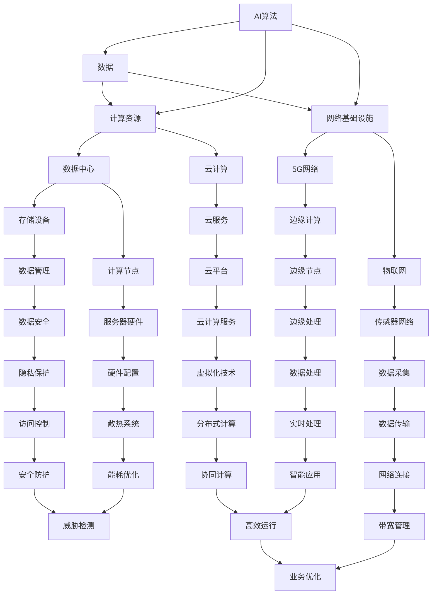

                 

# AI 2.0 基础设施建设：全球合作与竞争

## 关键词：
- AI 2.0基础设施
- 全球合作
- 竞争格局
- 技术发展趋势
- 应用场景
- 挑战与应对

## 摘要：
随着人工智能技术的飞速发展，AI 2.0基础设施的建设已成为各国竞相布局的焦点。本文旨在深入剖析AI 2.0基础设施的内涵、全球合作与竞争现状，以及其发展趋势和应用场景。通过详细解读数据中心、网络基础设施、AI算法与模型基础设施等关键技术，本文旨在为读者提供一幅完整的AI 2.0基础设施建设的蓝图，并探讨其面临的挑战与应对策略。

## 第一部分：AI 2.0基础设施概述

### 第1章：AI 2.0基础设施概述

#### 1.1 AI 2.0的定义与背景

##### 1.1.1 AI 2.0的定义

AI 2.0，即下一代人工智能，是相较于AI 1.0的重大升级。AI 1.0主要集中在规则的制定和数据的处理，而AI 2.0则更加注重于数据的生成、处理和利用，以及算法的自主优化。因此，AI 2.0可以被定义为：

$$
AI 2.0 = AI + 数据 + 计算 + 网络基础设施
$$

这里的计算不仅包括传统的CPU、GPU计算，还涵盖了云计算、边缘计算等新型计算模式。网络基础设施则强调了5G、物联网等新兴网络技术的应用。

##### 1.1.2 AI 2.0的发展背景

AI 2.0的发展背景主要源于以下几个方面的变革：

1. **数据驱动**：大数据技术的成熟使得海量数据的处理和分析成为可能，为AI算法提供了丰富的训练素材。
2. **计算能力提升**：随着GPU、TPU等专用计算设备的普及，计算能力的提升为AI算法的实现提供了强有力的支撑。
3. **网络基础设施完善**：5G、物联网等技术的推广，使得数据的高速传输和实时处理成为现实。
4. **AI算法进步**：深度学习、强化学习等先进算法的不断发展，为AI 2.0的实现奠定了基础。

##### 1.1.2.1 从AI 1.0到AI 2.0的演进

AI 1.0主要依赖规则引擎和传统机器学习算法，数据处理能力有限，主要应用于结构化数据的处理。而AI 2.0则更加注重非结构化数据，如图像、语音、文本等的处理，强调数据的生成和实时处理能力。其核心特征包括：

1. **自适应与自主学习**：AI 2.0具有更强的自主学习能力，能够根据数据和环境的变化自适应调整。
2. **实时性与高效性**：借助新兴计算和网络技术，AI 2.0能够实现实时数据处理和响应。
3. **跨界融合**：AI 2.0不仅仅是计算机科学领域的突破，还涉及到物联网、生物科技、心理学等多个领域。

#### 1.2 全球AI基础设施现状

##### 1.2.1 国内外AI基础设施发展概况

在全球范围内，AI基础设施的发展呈现出以下特点：

1. **美国**：美国在AI基础设施方面具有领先地位，其优势主要体现在以下几个方面：
   - **计算能力**：美国拥有大量的高性能计算资源和云计算服务，如AWS、Azure、Google Cloud等。
   - **数据资源**：美国拥有丰富的公共和私有数据资源，为AI算法的研究提供了强大的支持。
   - **技术创新**：美国在深度学习、神经网络等领域的技术创新处于全球领先地位。

2. **中国**：中国在AI基础设施方面发展迅速，主要表现在：
   - **政策支持**：中国政府高度重视AI技术的发展，出台了一系列政策扶持措施。
   - **市场规模**：中国庞大的市场为AI技术的发展提供了广阔的空间。
   - **技术创新**：中国在深度学习、计算机视觉等领域取得了显著的成果。

3. **其他国家和地区**：欧洲、日本、韩国等国家和地区也在积极布局AI基础设施，各有其独特的优势。

##### 1.2.1.1 中国AI基础设施发展

中国AI基础设施的发展可以分为以下几个阶段：

1. **起步阶段（2010-2015年）**：在这一阶段，中国开始重视AI技术的发展，并启动了一系列AI相关的研究项目。
2. **快速发展阶段（2015-2020年）**：随着深度学习的兴起，中国AI技术取得了重大突破，涌现出一大批优秀的AI企业和研究机构。
3. **成熟阶段（2020年至今）**：中国AI基础设施逐渐完善，政策支持力度加大，技术创新能力持续提升。

##### 1.2.1.2 美国AI基础设施发展

美国AI基础设施的发展可以分为以下几个阶段：

1. **早期阶段（1990-2000年）**：在这一阶段，美国开始了对AI技术的初步探索，并取得了一系列重要成果。
2. **发展阶段（2000-2010年）**：随着互联网的普及，美国AI技术进入了快速发展阶段，特别是在机器学习和深度学习领域取得了重大突破。
3. **成熟阶段（2010年至今）**：美国AI基础设施已经相对完善，其在计算能力、数据资源、技术创新等方面均处于全球领先地位。

##### 1.2.1.3 其他国家AI基础设施发展

其他国家在AI基础设施方面的发展各有特色：

1. **欧洲**：欧洲在AI技术的研究和应用方面具有较强的实力，但在计算能力和市场规模方面相对较弱。
2. **日本**：日本在机器人技术、自动驾驶等领域具有独特优势，但在AI基础设施的全面布局方面相对滞后。
3. **韩国**：韩国在AI基础设施方面发展迅速，特别是在计算机视觉和语音识别领域取得了显著成果。

#### 1.3 AI 2.0基础设施的关键组成部分

##### 1.3.1 数据中心

数据中心是AI 2.0基础设施的核心组成部分，其重要性体现在以下几个方面：

1. **计算能力**：数据中心提供了强大的计算资源，支持大规模的AI算法训练和推理。
2. **数据存储**：数据中心具备高效的数据存储和管理能力，为AI算法的数据需求提供了保障。
3. **网络连接**：数据中心通过高速网络与其他数据中心和终端设备连接，实现了数据的高效传输和实时处理。

##### 1.3.1.1 数据中心架构

数据中心架构主要包括以下几个方面：

1. **硬件架构**：包括服务器、存储设备、网络设备等硬件资源的布局和配置。
2. **软件架构**：包括操作系统、数据库、中间件等软件资源的配置和管理。
3. **网络架构**：包括内部网络和外部网络的布局，以及数据传输和交换的方式。

##### 1.3.1.2 数据中心管理

数据中心管理主要包括以下几个方面：

1. **运维管理**：包括服务器运维、存储运维、网络运维等日常运维工作。
2. **安全管理**：包括数据安全、网络安全、系统安全等方面的安全管理。
3. **能效管理**：包括能耗监测、能耗优化、节能减排等方面的能效管理。

##### 1.3.2 网络基础设施

网络基础设施是AI 2.0基础设施的重要组成部分，其重要性体现在以下几个方面：

1. **数据传输**：网络基础设施提供了数据传输的通道，确保了数据的高效传输和实时处理。
2. **网络连接**：网络基础设施实现了数据中心、终端设备之间的互联互通，为AI应用的部署提供了支持。
3. **网络安全**：网络基础设施提供了网络安全保障，防止了数据泄露、网络攻击等安全威胁。

##### 1.3.2.1 网络架构

网络架构主要包括以下几个方面：

1. **局域网架构**：包括服务器局域网、存储局域网、用户局域网等局域网的布局和配置。
2. **广域网架构**：包括数据中心之间的连接、终端设备与数据中心之间的连接等广域网的布局和配置。
3. **边缘计算架构**：包括边缘服务器、边缘设备、边缘网络的布局和配置。

##### 1.3.2.2 网络安全性

网络安全性主要包括以下几个方面：

1. **防火墙**：通过防火墙隔离内外网络，防止外部攻击。
2. **入侵检测系统**：通过入侵检测系统监测网络流量，发现并阻止异常行为。
3. **数据加密**：通过数据加密技术保护数据在传输过程中的安全性。

#### 1.4 AI 2.0基础设施建设的挑战与机遇

##### 1.4.1 挑战

AI 2.0基础设施的建设面临着诸多挑战：

1. **数据隐私保护**：随着数据量的增加，数据隐私保护成为了一大挑战，如何在不损害用户隐私的前提下充分利用数据资源是一个亟待解决的问题。
2. **技术人才短缺**：AI技术的快速发展导致了对技术人才的大量需求，但现有的技术人才培养速度无法满足需求，导致人才短缺。
3. **网络基础设施不足**：尽管网络技术不断发展，但部分地区的网络基础设施仍较为薄弱，无法满足AI 2.0对高速、稳定网络的需求。

##### 1.4.2 机遇

AI 2.0基础设施建设也带来了诸多机遇：

1. **全球合作共赢**：AI 2.0基础设施的建设需要全球范围内的合作，通过合作可以实现技术共享、资源整合，共同推动AI技术的发展。
2. **创新与突破**：AI 2.0基础设施的建设推动了技术创新和突破，为各行各业带来了新的发展机遇。

### 第2章：AI 2.0基础设施建设技术详解

#### 2.1 数据中心基础设施建设

##### 2.1.1 数据中心基础设施概述

数据中心基础设施是指用于支持数据存储、处理和传输的硬件、软件和网络设备，它是AI 2.0基础设施的核心部分。

数据中心基础设施的主要功能包括：

1. **数据存储**：提供大规模、高可靠性的数据存储能力，支持数据的持久化和备份。
2. **数据处理**：提供高性能的计算能力，支持数据的分析和处理。
3. **数据传输**：提供高速、稳定的网络连接，支持数据的高效传输和共享。

##### 2.1.2 数据中心硬件架构设计

数据中心硬件架构设计主要包括以下几个方面：

1. **服务器硬件配置**：选择合适的服务器硬件配置，包括CPU、内存、存储设备等，以满足数据处理的性能需求。
2. **存储设备选型**：选择合适的存储设备，包括SSD、HDD等，以实现高效的数据存储和访问。
3. **网络设备配置**：选择合适的网络设备，包括交换机、路由器等，以实现高速、稳定的网络连接。

##### 2.1.3 数据中心网络架构设计

数据中心网络架构设计主要包括以下几个方面：

1. **网络拓扑结构**：设计合适的网络拓扑结构，包括环网、星型网、树型网等，以提高网络的可靠性和可扩展性。
2. **网络设备配置**：配置合适的网络设备，包括交换机、路由器等，以实现网络的高效连接和转发。
3. **网络带宽管理**：进行网络带宽的管理和优化，以实现网络资源的合理分配和高效利用。

##### 2.1.4 数据中心能耗管理

数据中心能耗管理是指对数据中心运行过程中产生的能耗进行监测、分析和优化，以降低能耗、提高能效。

数据中心能耗管理主要包括以下几个方面：

1. **能耗监测**：通过能耗监测设备对数据中心的能耗进行实时监测和记录。
2. **能耗分析**：对能耗数据进行统计分析，找出能耗高的设备或环节。
3. **能耗优化**：通过优化数据中心硬件配置、网络架构、能效管理策略等，降低能耗、提高能效。

#### 2.2 网络基础设施建设

##### 2.2.1 网络基础设施概述

网络基础设施是指用于连接数据中心、终端设备和其他网络设备的硬件和软件设施，它是AI 2.0基础设施的重要组成部分。

网络基础设施的主要功能包括：

1. **数据传输**：提供高速、稳定的网络连接，支持数据的高效传输和共享。
2. **网络连接**：实现数据中心、终端设备和其他网络设备的互联互通。
3. **网络安全**：提供网络安全保障，防止网络攻击、数据泄露等安全威胁。

##### 2.2.2 网络架构设计

网络架构设计主要包括以下几个方面：

1. **局域网架构**：设计合适的局域网架构，包括交换机、路由器等网络设备的布局和配置。
2. **广域网架构**：设计合适的广域网架构，包括数据中心之间的连接、终端设备与数据中心之间的连接等。
3. **边缘计算架构**：设计合适的边缘计算架构，包括边缘服务器、边缘设备、边缘网络的布局和配置。

##### 2.2.3 网络设备配置

网络设备配置主要包括以下几个方面：

1. **交换机配置**：配置合适的交换机，包括交换机端口配置、VLAN配置等，以提高网络的可靠性和可扩展性。
2. **路由器配置**：配置合适的路由器，包括路由器接口配置、路由协议配置等，以实现网络的高效连接和转发。
3. **防火墙配置**：配置合适的防火墙，包括防火墙策略配置、防火墙规则配置等，以实现网络安全保障。

##### 2.2.4 网络安全与防护

网络安全与防护主要包括以下几个方面：

1. **防火墙防护**：配置防火墙，设置防火墙策略，防止网络攻击、数据泄露等安全威胁。
2. **入侵检测系统**：配置入侵检测系统，实时监测网络流量，发现并阻止异常行为。
3. **数据加密**：采用数据加密技术，保护数据在传输过程中的安全性。

#### 2.3 AI算法与模型基础设施建设

##### 2.3.1 AI算法与模型基础设施概述

AI算法与模型基础设施是指用于支持AI算法开发、训练、部署和管理的基础设施，它是AI 2.0基础设施的重要组成部分。

AI算法与模型基础设施的主要功能包括：

1. **算法开发**：提供算法开发环境，支持AI算法的研究和开发。
2. **模型训练**：提供模型训练环境，支持大规模数据的训练和优化。
3. **模型部署**：提供模型部署环境，支持AI模型的部署和应用。
4. **模型管理**：提供模型管理功能，支持AI模型的版本控制、监控和优化。

##### 2.3.2 AI算法基础设施建设

AI算法基础设施建设主要包括以下几个方面：

1. **算法选择**：根据应用需求，选择合适的AI算法，包括机器学习算法、深度学习算法等。
2. **算法优化**：对选定的算法进行优化，提高算法的性能和效率。
3. **算法工具**：提供算法开发工具，支持算法的编写、调试和测试。

##### 2.3.3 AI模型基础设施建设

AI模型基础设施建设主要包括以下几个方面：

1. **模型训练**：提供模型训练环境，支持大规模数据的训练和优化。
2. **模型部署**：提供模型部署环境，支持AI模型的部署和应用。
3. **模型管理**：提供模型管理功能，支持AI模型的版本控制、监控和优化。

##### 2.3.4 AI算法与模型协同优化

AI算法与模型协同优化是指通过对算法和模型进行协同优化，提高整个系统的性能和效率。

AI算法与模型协同优化主要包括以下几个方面：

1. **算法与模型适配**：选择合适的算法和模型，使算法和模型能够相互匹配，发挥最佳性能。
2. **协同训练**：通过协同训练，使算法和模型能够相互优化，提高整体性能。
3. **实时优化**：在模型部署过程中，根据实际应用情况，对算法和模型进行实时优化，提高系统的适应性。

### 第3章：AI 2.0基础设施与行业应用

#### 3.1 AI 2.0基础设施在金融行业的应用

##### 3.1.1 金融行业AI应用概述

金融行业是AI技术的重要应用领域，AI 2.0基础设施在金融行业的应用为金融行业带来了革命性的变化。

金融行业的AI应用主要包括以下几个方面：

1. **智能投顾**：利用AI技术，为用户提供个性化的投资建议，实现资产的智能管理。
2. **风险管理**：利用AI技术，对金融市场风险进行预测和分析，提高风险管理的准确性和效率。
3. **欺诈检测**：利用AI技术，对金融交易进行实时监控，识别和预防欺诈行为。
4. **智能客服**：利用AI技术，提供智能化的客户服务，提高客户满意度和业务效率。

##### 3.1.2 金融行业AI应用挑战

金融行业的AI应用面临着以下几个挑战：

1. **数据隐私保护**：金融数据具有高度敏感性，如何在保障用户隐私的前提下充分利用数据资源是金融行业AI应用的一大挑战。
2. **模型解释性**：金融行业的决策往往需要模型具有较好的解释性，以便用户理解模型的决策过程。
3. **合规性**：金融行业的AI应用需要遵守相关法律法规，确保模型的应用不会违反法律法规。

##### 3.1.3 金融行业AI应用案例

1. **智能投顾**：某金融公司利用AI技术，开发了一款智能投顾产品，通过分析用户的风险偏好和历史交易数据，为用户制定个性化的投资策略。
2. **风险管理**：某银行利用AI技术，对信贷风险进行预测和分析，通过识别异常交易和预测潜在风险，提高了信贷管理的准确性和效率。
3. **欺诈检测**：某支付公司利用AI技术，对支付交易进行实时监控，通过识别异常交易和预测潜在风险，有效预防了欺诈行为。

#### 3.2 AI 2.0基础设施在医疗行业的应用

##### 3.2.1 医疗行业AI应用概述

医疗行业是AI技术的重要应用领域，AI 2.0基础设施在医疗行业的应用为医疗行业带来了革命性的变化。

医疗行业的AI应用主要包括以下几个方面：

1. **医疗影像诊断**：利用AI技术，对医疗影像进行自动分析和诊断，提高诊断的准确性和效率。
2. **智能药物研发**：利用AI技术，对药物分子进行模拟和分析，加速药物研发进程。
3. **疾病预测与预警**：利用AI技术，对疾病的发生和传播进行预测和预警，提高疾病防控的效率和效果。
4. **智能客服**：利用AI技术，提供智能化的医疗服务，提高患者满意度和医疗机构的运营效率。

##### 3.2.2 医疗行业AI应用挑战

医疗行业的AI应用面临着以下几个挑战：

1. **数据隐私保护**：医疗数据具有高度敏感性，如何在保障用户隐私的前提下充分利用数据资源是医疗行业AI应用的一大挑战。
2. **模型解释性**：医疗行业的决策往往需要模型具有较好的解释性，以便医生和患者理解模型的决策过程。
3. **合规性**：医疗行业的AI应用需要遵守相关法律法规，确保模型的应用不会违反法律法规。

##### 3.2.3 医疗行业AI应用案例

1. **医疗影像诊断**：某医疗科技公司利用AI技术，开发了一套智能医疗影像诊断系统，通过分析医学影像，为医生提供辅助诊断建议，提高了诊断的准确性和效率。
2. **智能药物研发**：某生物技术公司利用AI技术，加速了药物研发进程，通过模拟药物分子和生物分子之间的相互作用，预测药物的效果和副作用，提高了药物研发的成功率。
3. **疾病预测与预警**：某公共卫生机构利用AI技术，对疾病的发生和传播进行预测和预警，通过分析大数据，预测疾病的潜在传播路径，为公共卫生决策提供了科学依据。

#### 3.3 AI 2.0基础设施在其他行业的应用

##### 3.3.1 其他行业AI应用概述

除了金融和医疗行业，AI 2.0基础设施还在其他行业得到了广泛应用，为各行业带来了巨大的变革。

其他行业AI应用主要包括以下几个方面：

1. **物流与供应链**：利用AI技术，优化物流和供应链管理，提高物流效率和供应链稳定性。
2. **智能制造**：利用AI技术，实现生产过程的自动化和智能化，提高生产效率和产品质量。
3. **智能交通**：利用AI技术，优化交通管理和调度，提高交通效率和安全性。
4. **智能城市**：利用AI技术，构建智能城市管理系统，提高城市管理水平和居民生活质量。

##### 3.3.2 其他行业AI应用挑战

其他行业AI应用面临着以下几个挑战：

1. **数据隐私保护**：各行业的数据都具有高度敏感性，如何在保障用户隐私的前提下充分利用数据资源是各行业AI应用的一大挑战。
2. **模型解释性**：各行业的决策往往需要模型具有较好的解释性，以便用户理解模型的决策过程。
3. **技术成熟度**：AI技术在各行业中的应用仍处于快速发展阶段，技术成熟度可能成为制约AI应用推广的因素。

##### 3.3.3 其他行业AI应用案例

1. **物流与供应链**：某物流公司利用AI技术，优化物流路线和运输调度，提高了物流效率和成本控制水平。
2. **智能制造**：某制造企业利用AI技术，实现了生产过程的自动化和智能化，提高了生产效率和产品质量。
3. **智能交通**：某城市交通管理部门利用AI技术，优化交通管理和调度，提高了交通效率和安全性。
4. **智能城市**：某城市利用AI技术，构建了智能城市管理系统，通过数据分析和管理，提高了城市管理的效率和居民生活质量。

### 第4章：AI 2.0基础设施建设的全球竞争

#### 4.1 全球AI基础设施竞争格局

随着AI技术的飞速发展，全球各国纷纷加大了对AI基础设施的投入和建设，形成了激烈的竞争格局。

全球AI基础设施竞争主要表现在以下几个方面：

1. **计算能力**：各国在计算能力的提升上展开了激烈竞争，通过建设超算中心、数据中心等，提高计算能力和效率。
2. **数据资源**：数据是AI技术的核心资源，各国都在积极布局数据资源，通过数据采集、存储、处理等技术手段，提升数据资源的质量和可用性。
3. **技术创新**：各国在AI技术的研发和创新上进行了大量的投入，通过产学研合作、技术研发等途径，推动AI技术的突破和应用。
4. **产业生态**：各国在构建AI产业生态方面也展开了竞争，通过政策扶持、人才培养、产业链协同等手段，打造良好的AI产业环境。

#### 4.2 中国AI基础设施发展现状

中国在AI基础设施方面的发展呈现出以下几个特点：

1. **政策支持**：中国政府高度重视AI技术的发展，出台了一系列政策扶持措施，为AI基础设施的建设提供了有力支持。
2. **技术创新**：中国在AI技术的研发和创新上取得了显著成果，特别是在深度学习、计算机视觉、自然语言处理等领域，处于全球领先地位。
3. **产业生态**：中国已经形成了较为完整的AI产业生态，涵盖了技术研发、产品应用、人才培养等多个方面。
4. **应用场景**：中国在AI技术的应用场景方面具有独特的优势，特别是在金融、医疗、智能制造等领域，应用广泛、成效显著。

#### 4.3 美国AI基础设施发展现状

美国在AI基础设施方面的发展具有以下几个特点：

1. **计算能力**：美国拥有大量的高性能计算资源和云计算服务，如AWS、Azure、Google Cloud等，为AI算法的研究和应用提供了强有力的支持。
2. **数据资源**：美国拥有丰富的公共和私有数据资源，为AI算法的研究提供了强大的数据支持。
3. **技术创新**：美国在AI技术的研发和创新上处于全球领先地位，特别是在深度学习、神经网络等领域，具有显著优势。
4. **产业生态**：美国已经形成了较为成熟的AI产业生态，涵盖了技术研发、产品应用、人才培养等多个方面。

#### 4.4 全球AI基础设施合作与竞争

在全球范围内，AI基础设施的合作与竞争并存，各国在合作与竞争中寻求共同发展和利益最大化。

全球AI基础设施合作主要体现在以下几个方面：

1. **技术合作**：各国在AI技术的研发和应用上进行合作，通过技术交流、联合研发等途径，共同推动AI技术的发展。
2. **人才培养**：各国在人才培养方面进行合作，通过联合培养、人才交流等途径，共同提升AI人才的素质和能力。
3. **产业协同**：各国在AI产业的产业链协同上进行合作，通过产业链上下游企业的合作，实现资源的共享和互补。

全球AI基础设施竞争主要体现在以下几个方面：

1. **计算能力**：各国在计算能力的提升上进行竞争，通过建设超算中心、数据中心等，提高计算能力和效率。
2. **数据资源**：各国在数据资源的争夺上进行竞争，通过数据采集、存储、处理等技术手段，提升数据资源的质量和可用性。
3. **技术创新**：各国在AI技术的研发和创新上进行竞争，通过技术研发、专利申请等途径，争夺技术创新的领先地位。
4. **产业生态**：各国在AI产业生态的构建上进行竞争，通过政策扶持、产业链协同等手段，打造良好的AI产业环境。

#### 4.5 未来AI基础设施竞争趋势

在未来，AI基础设施的竞争将呈现出以下几个趋势：

1. **计算能力的提升**：随着量子计算、边缘计算等新计算模式的发展，计算能力将得到进一步提升，各国将加大在计算能力提升方面的投入。
2. **数据资源的争夺**：数据资源将成为AI基础设施竞争的关键，各国将加大在数据资源采集、存储、处理等方面的投入。
3. **技术创新的突破**：AI技术的不断创新将推动基础设施的更新换代，各国将加大在技术创新方面的投入，争夺技术创新的领先地位。
4. **产业生态的构建**：产业生态的构建将促进AI基础设施的快速发展，各国将加大在产业生态构建方面的投入，推动产业链的协同发展。

### 第5章：AI 2.0基础设施建设的未来展望

#### 5.1 AI 2.0基础设施发展趋势

随着AI技术的不断发展和应用场景的扩大，AI 2.0基础设施将呈现出以下发展趋势：

1. **计算能力的提升**：随着量子计算、边缘计算等新计算模式的发展，AI 2.0基础设施的计算能力将得到进一步提升，为更复杂的AI算法和应用提供支持。
2. **数据资源的丰富**：随着物联网、5G等技术的普及，数据资源将更加丰富，为AI算法提供更多的训练素材。
3. **网络基础设施的升级**：随着网络技术的不断发展，AI 2.0基础设施的网络基础设施将得到升级，提供更高速、更稳定的网络连接。
4. **算法与模型的创新**：AI算法和模型的不断创新将推动AI 2.0基础设施的不断发展，为各行各业带来更多的应用场景和解决方案。

#### 5.2 AI 2.0基础设施建设的挑战与应对策略

尽管AI 2.0基础设施建设带来了巨大的机遇，但也面临着诸多挑战：

1. **技术创新挑战**：AI技术的快速发展对基础设施提出了更高的要求，如何应对技术创新的挑战是基础设施建设的重要任务。
2. **数据隐私保护**：随着数据量的增加，数据隐私保护成为了一大挑战，如何在保障用户隐私的前提下充分利用数据资源是一个亟待解决的问题。
3. **人才培养**：AI技术的发展对人才的需求越来越大，如何培养和留住优秀的AI人才是基础设施建设的重要任务。
4. **产业协同**：AI基础设施的建设需要产业链上下游企业的协同发展，如何促进产业协同是基础设施建设的重要任务。

应对这些挑战，需要采取以下策略：

1. **技术创新**：加大在AI技术的研究和开发投入，推动技术创新，为基础设施建设提供技术支持。
2. **数据隐私保护**：建立完善的数据隐私保护机制，通过技术手段和法律法规保障用户隐私。
3. **人才培养**：加大在AI人才的培养和引进力度，建立人才培养体系，提高人才素质和能力。
4. **产业协同**：促进产业链上下游企业的协同发展，通过合作和共享，实现资源的优化配置。

#### 5.3 AI 2.0基础设施建设的全球展望

在全球范围内，AI 2.0基础设施建设将呈现以下趋势：

1. **全球合作**：随着AI技术的全球化和应用场景的国际化，全球各国将在AI基础设施方面加强合作，实现技术共享、资源整合，推动全球AI技术的发展。
2. **区域竞争**：在全球范围内，各地区将在AI基础设施方面展开激烈的竞争，通过技术创新、产业生态构建等方式，争夺AI技术的领先地位。
3. **产业升级**：AI 2.0基础设施的建设将推动各行业的产业升级和数字化转型，为全球经济带来新的增长点。
4. **可持续发展**：AI 2.0基础设施的建设将注重可持续发展，通过技术创新、资源优化等方式，实现经济、社会和环境的协调发展。

### 作者信息

作者：AI天才研究院/AI Genius Institute & 禅与计算机程序设计艺术 /Zen And The Art of Computer Programming

文章标题：AI 2.0 基础设施建设：全球合作与竞争

文章关键词：AI 2.0基础设施，全球合作，竞争格局，技术发展趋势，应用场景，挑战与应对

文章摘要：
本文深入剖析了AI 2.0基础设施的内涵、全球合作与竞争现状，以及其发展趋势和应用场景。通过详细解读数据中心、网络基础设施、AI算法与模型基础设施等关键技术，本文旨在为读者提供一幅完整的AI 2.0基础设施建设的蓝图，并探讨其面临的挑战与应对策略。

### 第一部分：AI 2.0基础设施概述

#### 第1章：AI 2.0基础设施概述

##### 1.1 AI 2.0的定义与背景

AI 2.0是下一代人工智能的代名词，它标志着人工智能技术的飞跃发展。AI 2.0不仅仅是对传统AI技术的简单升级，更是一个涵盖更广、能力更强、应用更深的技术体系。要理解AI 2.0，我们首先需要回顾一下AI 1.0。

**AI 1.0的定义与背景**

AI 1.0主要基于符号主义和规则引擎，它依赖于人类专家提供规则和知识，通过这些规则来模拟人类的决策过程。AI 1.0的代表技术包括专家系统、知识图谱等。尽管AI 1.0在特定领域取得了显著成果，但它存在着一些局限性：

- **依赖人类专家**：AI 1.0需要大量的人类专家来定义规则和知识，这使得系统的开发和部署过程非常耗时且成本高昂。
- **缺乏自适应能力**：AI 1.0系统通常无法自主学习和适应环境变化，它们只能按照预设的规则进行操作。
- **数据处理能力有限**：AI 1.0主要处理结构化数据，对于非结构化数据的处理能力较弱。

**AI 2.0的定义**

AI 2.0，即下一代人工智能，是相较于AI 1.0的重大升级。AI 2.0的核心特征是：

- **数据驱动**：AI 2.0强调数据的生成、处理和利用，特别是非结构化数据，如图像、语音和文本等。
- **自主学习**：AI 2.0具有更强的自主学习能力，能够从海量数据中自动提取知识和模式，无需人工干预。
- **跨界融合**：AI 2.0不仅局限于计算机科学领域，还涉及生物科技、心理学、经济学等多个领域，实现跨学科的融合和创新。

AI 2.0的定义可以表达为：

$$
AI 2.0 = AI + 数据 + 计算 + 网络基础设施
$$

这里的计算不仅包括传统的CPU、GPU计算，还涵盖了云计算、边缘计算等新型计算模式。网络基础设施则强调了5G、物联网等新兴网络技术的应用。

**AI 2.0的发展背景**

AI 2.0的发展背景主要源于以下几个方面的变革：

1. **数据驱动**：大数据技术的成熟使得海量数据的处理和分析成为可能，为AI算法提供了丰富的训练素材。
2. **计算能力提升**：随着GPU、TPU等专用计算设备的普及，计算能力的提升为AI算法的实现提供了强有力的支撑。
3. **网络基础设施完善**：5G、物联网等技术的推广，使得数据的高速传输和实时处理成为现实。
4. **AI算法进步**：深度学习、强化学习等先进算法的不断发展，为AI 2.0的实现奠定了基础。

**从AI 1.0到AI 2.0的演进**

AI 1.0主要集中在规则的制定和数据的处理，而AI 2.0则更加注重非结构化数据的生成和实时处理能力。其核心特征包括：

- **自适应与自主学习**：AI 2.0具有更强的自主学习能力，能够根据数据和环境的变化自适应调整。
- **实时性与高效性**：借助新兴计算和网络技术，AI 2.0能够实现实时数据处理和响应。
- **跨界融合**：AI 2.0不仅仅是计算机科学领域的突破，还涉及到物联网、生物科技、心理学等多个领域。

##### 1.2 全球AI基础设施现状

在全球范围内，AI基础设施的发展呈现出多样化的态势。以下是对几个主要国家和地区的AI基础设施现状的概述。

**美国AI基础设施发展现状**

美国在AI基础设施方面具有领先地位，其优势主要体现在以下几个方面：

- **计算能力**：美国拥有大量的高性能计算资源和云计算服务，如AWS、Azure、Google Cloud等。
- **数据资源**：美国拥有丰富的公共和私有数据资源，为AI算法的研究提供了强大的支持。
- **技术创新**：美国在深度学习、神经网络等领域的技术创新处于全球领先地位。

美国AI基础设施的发展历程可以分为以下几个阶段：

1. **早期探索阶段（1990s-2000s）**：在这一阶段，美国开始了对AI技术的初步探索，并取得了一系列重要成果，如机器学习算法的发明和应用。
2. **快速发展阶段（2010s）**：随着深度学习技术的突破，美国AI技术进入了快速发展阶段，特别是在谷歌、微软、亚马逊等科技巨头的推动下，AI技术取得了重大进展。
3. **成熟阶段（2020s）**：美国AI基础设施已经相对完善，其在计算能力、数据资源、技术创新等方面均处于全球领先地位。

**中国AI基础设施发展现状**

中国在AI基础设施方面发展迅速，主要表现在以下几个方面：

- **政策支持**：中国政府高度重视AI技术的发展，出台了一系列政策扶持措施。
- **市场规模**：中国庞大的市场为AI技术的发展提供了广阔的空间。
- **技术创新**：中国在深度学习、计算机视觉等领域取得了显著的成果。

中国AI基础设施的发展可以分为以下几个阶段：

1. **起步阶段（2010-2015年）**：在这一阶段，中国开始重视AI技术的发展，并启动了一系列AI相关的研究项目。
2. **快速发展阶段（2015-2020年）**：随着深度学习的兴起，中国AI技术取得了重大突破，涌现出一大批优秀的AI企业和研究机构。
3. **成熟阶段（2020年至今）**：中国AI基础设施逐渐完善，政策支持力度加大，技术创新能力持续提升。

**其他国家AI基础设施发展现状**

除了美国和中国，其他国家在AI基础设施方面也取得了显著进展：

- **欧洲**：欧洲在AI技术的研究和应用方面具有较强的实力，但在计算能力和市场规模方面相对较弱。
- **日本**：日本在机器人技术、自动驾驶等领域具有独特优势，但在AI基础设施的全面布局方面相对滞后。
- **韩国**：韩国在AI基础设施方面发展迅速，特别是在计算机视觉和语音识别领域取得了显著成果。

##### 1.3 AI 2.0基础设施的关键组成部分

AI 2.0基础设施的建设涉及多个关键组成部分，包括数据中心、网络基础设施和AI算法与模型基础设施。以下是这些组成部分的详细介绍。

**数据中心基础设施**

数据中心是AI 2.0基础设施的核心组成部分，其重要性体现在以下几个方面：

- **计算能力**：数据中心提供了强大的计算资源，支持大规模的AI算法训练和推理。
- **数据存储**：数据中心具备高效的数据存储和管理能力，为AI算法的数据需求提供了保障。
- **网络连接**：数据中心通过高速网络与其他数据中心和终端设备连接，实现了数据的高效传输和实时处理。

**网络基础设施**

网络基础设施是AI 2.0基础设施的重要组成部分，其重要性体现在以下几个方面：

- **数据传输**：网络基础设施提供了数据传输的通道，确保了数据的高效传输和实时处理。
- **网络连接**：网络基础设施实现了数据中心、终端设备之间的互联互通，为AI应用的部署提供了支持。
- **网络安全**：网络基础设施提供了网络安全保障，防止了数据泄露、网络攻击等安全威胁。

**AI算法与模型基础设施**

AI算法与模型基础设施是指用于支持AI算法开发、训练、部署和管理的基础设施，它是AI 2.0基础设施的重要组成部分。

AI算法与模型基础设施的主要功能包括：

- **算法开发**：提供算法开发环境，支持AI算法的研究和开发。
- **模型训练**：提供模型训练环境，支持大规模数据的训练和优化。
- **模型部署**：提供模型部署环境，支持AI模型的部署和应用。
- **模型管理**：提供模型管理功能，支持AI模型的版本控制、监控和优化。

##### 1.4 AI 2.0基础设施建设的挑战与机遇

**挑战**

AI 2.0基础设施的建设面临着诸多挑战：

- **数据隐私保护**：随着数据量的增加，数据隐私保护成为了一大挑战，如何在不损害用户隐私的前提下充分利用数据资源是一个亟待解决的问题。
- **技术人才短缺**：AI技术的快速发展导致了对技术人才的大量需求，但现有的技术人才培养速度无法满足需求，导致人才短缺。
- **网络基础设施不足**：尽管网络技术不断发展，但部分地区的网络基础设施仍较为薄弱，无法满足AI 2.0对高速、稳定网络的需求。

**机遇**

AI 2.0基础设施建设也带来了诸多机遇：

- **全球合作共赢**：AI 2.0基础设施的建设需要全球范围内的合作，通过合作可以实现技术共享、资源整合，共同推动AI技术的发展。
- **创新与突破**：AI 2.0基础设施的建设推动了技术创新和突破，为各行各业带来了新的发展机遇。

### 第二部分：AI 2.0基础设施建设技术详解

#### 第2章：数据中心基础设施建设

##### 2.1 数据中心基础设施概述

数据中心（Data Center）是AI 2.0基础设施的核心组成部分，它提供了计算资源、数据存储和传输能力，是支持AI算法训练和推理的重要基础。以下是数据中心基础设施的详细概述。

**数据中心的定义与功能**

数据中心是一个专门用于存储、处理和分发数据的设施。其功能包括：

- **数据存储**：提供高效的存储方案，确保数据的安全和可靠性。
- **数据处理**：通过高性能的计算资源，支持大规模数据的处理和分析。
- **数据传输**：提供高速、稳定的网络连接，实现数据的高效传输和共享。
- **数据安全**：通过多层次的安全措施，保护数据和系统的安全。

**数据中心在AI 2.0中的重要性**

数据中心在AI 2.0中扮演着至关重要的角色，主要体现在以下几个方面：

- **计算能力**：AI算法的训练和推理需要大量的计算资源，数据中心提供了这些资源，支持AI算法的运行。
- **数据存储**：AI算法需要大量的数据作为训练素材，数据中心提供了高效的存储解决方案，确保数据的安全和可用性。
- **数据处理速度**：AI算法对数据处理的实时性要求很高，数据中心提供了高速的计算和传输能力，满足实时数据处理的需求。
- **数据共享**：数据中心实现了不同节点之间的数据共享，支持分布式AI算法的训练和推理。

**数据中心的类型**

数据中心可以分为以下几种类型：

- **企业级数据中心**：为企业提供数据中心服务，包括计算、存储、网络等基础设施。
- **公共云数据中心**：提供云计算服务，包括虚拟机、存储、数据库等资源。
- **私有云数据中心**：企业内部的数据中心，为企业提供私有化的计算和存储资源。
- **边缘数据中心**：位于网络边缘的数据中心，用于处理和存储本地数据，减少数据传输延迟。

**数据中心的架构**

数据中心的架构设计是确保其高效运行和安全的关键。以下是一个典型数据中心的基本架构：

1. **服务器层**：包括计算节点，如服务器、虚拟机等，用于数据计算和处理。
2. **存储层**：包括磁盘存储、SSD存储、分布式存储系统等，用于数据存储和管理。
3. **网络层**：包括核心交换机、分布式交换机、防火墙等，用于数据传输和网络安全。
4. **管理层**：包括监控管理平台、自动化管理系统等，用于数据中心的整体管理和运维。

**数据中心基础设施的管理**

数据中心基础设施的管理包括以下几个方面：

- **运维管理**：包括服务器运维、存储运维、网络运维等，确保数据中心设备的正常运行。
- **安全管理**：包括网络安全、数据安全、系统安全等，保护数据中心的安全和稳定。
- **能耗管理**：通过能耗监测和优化，降低数据中心的能源消耗，提高能效。

##### 2.2 数据中心架构设计

数据中心架构设计是确保数据中心高效运行、稳定可靠和可扩展性的关键步骤。以下是对数据中心架构设计的详细讲解。

**服务器硬件架构**

服务器硬件架构是数据中心的核心组成部分，其设计直接影响到数据中心的性能和效率。以下是服务器硬件架构的设计要点：

1. **服务器类型**：
   - **标准型服务器**：适用于普通计算需求，具有标准化的硬件配置。
   - **高性能服务器**：适用于高性能计算需求，如深度学习训练、大数据分析等，具有强大的CPU、GPU等硬件资源。
   - **刀片服务器**：占用空间小，适用于空间受限的环境，具有高密度部署的特点。

2. **硬件配置**：
   - **CPU**：选择合适的CPU，如多核CPU，以满足计算需求。
   - **内存**：选择足够的内存，以提高数据处理的效率和速度。
   - **存储**：选择SSD或分布式存储系统，以提高数据存取速度和可靠性。

3. **散热系统**：设计合适的散热系统，确保服务器在高温环境下正常运行。

**存储设备选型**

存储设备选型是数据中心架构设计的重要环节，其选择直接影响到数据中心的存储性能和数据安全。以下是存储设备选型的要点：

1. **存储类型**：
   - **硬盘存储**：包括HDD和SSD，HDD具有高容量、低成本的特点，SSD具有高速度、高可靠性的特点。
   - **分布式存储**：适用于大规模数据存储，具有高扩展性、高可用性的特点。

2. **存储容量**：根据数据存储需求，选择合适的存储容量，确保数据存储空间充足。

3. **性能要求**：根据数据访问频率和读写性能要求，选择合适的存储设备，确保数据存储性能满足需求。

4. **数据冗余**：设计数据冗余方案，如RAID技术，确保数据安全。

**网络架构设计**

网络架构设计是数据中心架构设计的重要组成部分，其设计直接影响到数据中心的网络性能和可靠性。以下是网络架构设计的要点：

1. **网络拓扑结构**：
   - **环网**：数据传输路径形成一个闭环，具有高可靠性和低延迟的特点。
   - **星型网**：所有设备连接到一个中心节点，具有简单、易管理的特点。
   - **树型网**：具有层次结构，适用于大型数据中心。

2. **网络设备配置**：
   - **核心交换机**：位于数据中心的核心层，负责数据的高速转发和路由。
   - **分布式交换机**：位于数据中心的接入层，负责数据流量的汇聚和处理。
   - **防火墙**：用于网络安全防护，防止外部攻击和内部泄露。

3. **网络带宽管理**：
   - **带宽分配**：根据数据流量和业务需求，合理分配网络带宽，确保网络资源的有效利用。
   - **流量控制**：通过流量控制技术，如QoS，确保重要业务的带宽需求得到满足。

**数据中心能耗管理**

数据中心能耗管理是数据中心运营的重要环节，其目标是降低能耗、提高能效。以下是数据中心能耗管理的要点：

1. **能耗监测**：
   - **能耗监测系统**：通过传感器和监测设备，实时监测数据中心的能耗情况。
   - **能耗数据记录**：记录能耗数据，为能耗分析和优化提供依据。

2. **能耗分析**：
   - **能耗构成分析**：分析数据中心能耗的构成，找出能耗高的设备和环节。
   - **能耗趋势分析**：分析能耗趋势，预测未来能耗情况，为能耗优化提供指导。

3. **能耗优化**：
   - **设备能效优化**：通过选择高效设备、优化设备配置等手段，降低设备能耗。
   - **冷却系统优化**：通过优化冷却系统，降低冷却能耗。
   - **能耗管理策略**：通过制定能耗管理策略，如负载均衡、能效调度等，优化能耗。

**数据中心能效评估**

数据中心能效评估是评估数据中心能耗管理效果的重要手段。以下是数据中心能效评估的要点：

1. **能效评估指标**：
   - **PUE（Power Usage Effectiveness）**：衡量数据中心整体能效的指标，计算公式为PUE=总能耗/IT设备能耗。
   - **DCiE（Data Center Infrastructure Efficiency）**：衡量数据中心基础设施能效的指标，计算公式为DCiE=IT设备能耗/总能耗。

2. **能效评估方法**：
   - **实测法**：通过实际测量数据中心的能耗数据，评估其能效。
   - **模拟法**：通过模拟计算数据中心的能耗情况，评估其能效。
   - **基准法**：将数据中心的能耗与行业基准数据进行对比，评估其能效。

##### 2.3 网络基础设施建设

网络基础设施是AI 2.0基础设施的重要组成部分，其设计直接影响到数据中心的网络性能、可靠性和安全性。以下是对网络基础设施建设的技术详解。

**网络基础设施概述**

网络基础设施是指用于连接数据中心、终端设备和其他网络设备的硬件和软件设施。其主要功能包括：

- **数据传输**：提供高速、稳定的网络连接，确保数据的高效传输和实时处理。
- **网络连接**：实现数据中心、终端设备和其他网络设备的互联互通，为AI应用的部署提供支持。
- **网络安全**：提供网络安全保障，防止网络攻击、数据泄露等安全威胁。

**网络架构设计**

网络架构设计是确保网络性能和可靠性的关键步骤。以下是对网络架构设计的详细讲解：

1. **局域网架构**：
   - **环网架构**：所有网络设备连接成一个闭环，具有高可靠性和低延迟的特点。
   - **星型网架构**：所有网络设备连接到一个中心节点，具有简单、易管理的特点。
   - **树型网架构**：具有层次结构，适用于大型数据中心。

2. **广域网架构**：
   - **分层架构**：将网络划分为多个层次，如核心层、分布层、接入层等，实现网络的分层管理和优化。
   - **网格架构**：通过建立多个网络节点之间的连接，实现数据的快速传输和冗余备份。

3. **边缘计算架构**：
   - **边缘服务器**：位于网络边缘，用于处理和存储本地数据，减少数据传输延迟。
   - **边缘设备**：如物联网设备、智能终端等，负责数据的采集和初步处理。
   - **边缘网络**：连接边缘服务器和边缘设备的网络，实现数据的高速传输和共享。

**网络设备配置**

网络设备配置是确保网络性能和可靠性的关键步骤。以下是对网络设备配置的详细讲解：

1. **路由器配置**：
   - **接口配置**：配置路由器的接口，包括物理接口和逻辑接口，确保网络连接的稳定。
   - **路由协议配置**：配置路由协议，如BGP、OSPF等，实现路由信息的自动更新和最优路径选择。
   - **防火墙策略配置**：配置防火墙策略，保护网络免受攻击和入侵。

2. **交换机配置**：
   - **端口配置**：配置交换机的端口，包括物理端口和虚拟端口，确保网络连接的正确性。
   - **VLAN配置**：配置VLAN，实现网络的逻辑划分，提高网络的安全性和灵活性。
   - **STP配置**：配置生成树协议（STP），防止网络环路，确保网络的稳定性。

3. **防火墙配置**：
   - **防火墙策略配置**：配置防火墙策略，定义允许和拒绝的网络流量，保护网络免受攻击。
   - **入侵检测系统配置**：配置入侵检测系统（IDS），实时监测网络流量，识别和阻止异常行为。
   - **VPN配置**：配置VPN，实现安全的远程连接，保护数据传输的安全性。

**网络安全与防护**

网络安全与防护是确保网络基础设施安全的关键步骤。以下是对网络安全与防护的详细讲解：

1. **网络安全概述**：
   - **网络攻击类型**：了解常见的网络攻击类型，如DDoS攻击、病毒攻击、钓鱼攻击等，以便采取相应的防护措施。
   - **网络安全威胁**：识别网络安全威胁，如网络入侵、数据泄露、恶意软件等，制定相应的安全策略。

2. **网络安全防护措施**：
   - **防火墙配置**：配置防火墙，设置防火墙规则，过滤非法流量，防止网络攻击。
   - **入侵检测系统配置**：配置入侵检测系统（IDS），实时监测网络流量，识别和阻止异常行为。
   - **数据加密**：采用数据加密技术，保护数据在传输过程中的安全性，防止数据泄露。
   - **访问控制**：配置访问控制策略，限制用户对网络资源的访问，防止未经授权的访问。

3. **网络监控与日志管理**：
   - **网络监控**：通过网络监控工具，实时监控网络性能和安全状态，及时发现和处理问题。
   - **日志管理**：记录网络设备的日志信息，如连接记录、访问记录等，为安全分析和故障排除提供依据。

##### 2.4 AI算法与模型基础设施建设

AI算法与模型基础设施是AI 2.0基础设施的重要组成部分，它为AI算法的开发、训练、部署和管理提供了全面的支持。以下是对AI算法与模型基础设施建设的详细讲解。

**AI算法与模型基础设施概述**

AI算法与模型基础设施是指用于支持AI算法开发、训练、部署和管理的基础设施。它包括以下几个核心组成部分：

- **算法开发环境**：提供算法开发所需的各种工具和资源，如编程语言、开发框架等。
- **训练环境**：提供大规模数据的存储和处理能力，支持AI算法的训练和优化。
- **部署环境**：提供AI模型的部署和应用环境，支持模型在不同场景下的运行。
- **管理平台**：提供模型管理功能，如模型版本控制、监控和优化等。

**算法开发环境**

算法开发环境是AI算法与模型基础设施的核心组成部分，它为算法开发提供了各种工具和资源。以下是算法开发环境的详细讲解：

1. **编程语言**：选择合适的编程语言，如Python、C++等，支持算法的开发和实现。
2. **开发框架**：选择合适的开发框架，如TensorFlow、PyTorch等，提供算法开发的便捷性和高效性。
3. **工具库**：提供丰富的工具库，如数学库、数据分析库等，支持算法的开发和优化。
4. **版本控制**：采用版本控制工具，如Git等，确保算法开发的协同性和安全性。

**训练环境**

训练环境是AI算法与模型基础设施的重要组成部分，它为AI算法的训练和优化提供了强大的支持。以下是训练环境的详细讲解：

1. **数据存储**：提供高效的数据存储解决方案，如分布式存储系统、云存储等，确保大规模数据的存储和管理。
2. **数据处理**：提供高效的数据处理工具，如数据预处理、数据增强等，支持AI算法的训练和优化。
3. **计算资源**：提供强大的计算资源，如GPU、TPU等，支持大规模数据的训练和优化。
4. **并行计算**：支持并行计算技术，如多GPU训练、分布式训练等，提高训练效率和性能。

**部署环境**

部署环境是AI算法与模型基础设施的重要组成部分，它为AI模型的部署和应用提供了支持。以下是部署环境的详细讲解：

1. **模型转换**：将训练好的模型转换为适合部署的格式，如ONNX、TensorFlow Lite等。
2. **模型部署**：提供模型部署工具，如TensorFlow Serving、Kubernetes等，支持模型在不同场景下的部署和应用。
3. **性能优化**：通过性能优化技术，如模型剪枝、量化等，提高模型在部署环境下的性能和效率。
4. **安全性**：提供模型部署的安全性保障，如模型加密、访问控制等，确保模型部署的安全性。

**管理平台**

管理平台是AI算法与模型基础设施的重要组成部分，它为算法和模型的管理提供了便捷性。以下是管理平台的详细讲解：

1. **模型版本控制**：提供模型版本控制功能，支持模型的不同版本管理和回滚。
2. **模型监控**：提供模型监控功能，实时监控模型的性能和运行状态。
3. **模型优化**：提供模型优化功能，根据实际应用场景，对模型进行优化和调整。
4. **日志管理**：提供日志管理功能，记录模型训练和部署的日志信息，便于问题排查和性能分析。

##### 2.5 AI算法与模型协同优化

AI算法与模型协同优化是指通过对算法和模型进行协同优化，提高整个系统的性能和效率。以下是对AI算法与模型协同优化的详细讲解。

**算法与模型协同优化概述**

算法与模型协同优化是指在算法开发和模型训练过程中，通过对算法和模型的协同调整和优化，提高整个系统的性能和效率。以下是算法与模型协同优化的详细讲解：

1. **算法与模型适配**：选择合适的算法和模型，使算法和模型能够相互匹配，发挥最佳性能。例如，在图像识别任务中，选择适合图像数据的卷积神经网络（CNN）模型。
2. **协同训练**：通过协同训练，使算法和模型能够相互优化，提高整体性能。例如，在深度学习训练过程中，通过动态调整学习率，优化模型参数。
3. **实时优化**：在模型部署过程中，根据实际应用场景，对算法和模型进行实时优化，提高系统的适应性。例如，在自动驾驶系统中，根据道路环境变化，实时调整感知算法和决策算法。

**算法与模型协同优化的方法**

算法与模型协同优化的方法包括以下几个方面：

1. **交叉验证**：通过交叉验证，评估不同算法和模型的性能，选择最佳组合。交叉验证方法包括K折交叉验证、留一验证等。
2. **模型融合**：将多个模型进行融合，提高预测的准确性和鲁棒性。模型融合方法包括加权平均、集成学习等。
3. **特征选择**：通过特征选择，选择对模型性能有显著影响的关键特征，提高模型的性能和效率。特征选择方法包括相关性分析、主成分分析等。
4. **超参数调优**：通过超参数调优，调整模型参数，优化模型性能。超参数调优方法包括网格搜索、随机搜索等。

**算法与模型协同优化的工具**

算法与模型协同优化的工具包括以下几个方面：

1. **自动机器学习（AutoML）**：通过自动机器学习工具，自动选择合适的算法和模型，实现自动化优化和部署。常见的自动机器学习工具包括AutoSklearn、H2O等。
2. **深度学习框架**：提供丰富的深度学习框架，如TensorFlow、PyTorch等，支持算法和模型的开发、训练和部署。深度学习框架提供了丰富的API和工具，方便算法和模型协同优化。
3. **模型评估与优化工具**：提供模型评估与优化工具，如TensorBoard、MLflow等，支持模型性能的评估和优化。这些工具提供了丰富的可视化功能，便于分析模型性能和调整模型参数。

### 第三部分：AI 2.0基础设施与行业应用

#### 第3章：AI 2.0基础设施与行业应用

AI 2.0基础设施的强大能力和广泛应用正在深刻改变各个行业的运作模式，带来了前所未有的机遇和挑战。以下是对AI 2.0基础设施在金融、医疗和其他行业应用的详细探讨。

##### 3.1 AI 2.0基础设施在金融行业的应用

金融行业一直以来都是技术创新的热点领域，AI 2.0基础设施的引入使得金融行业在风险控制、投资决策、客户服务等方面取得了显著的进步。

**3.1.1 金融行业AI应用概述**

金融行业的AI应用场景广泛，主要包括以下几个方面：

1. **风险控制**：AI技术可以用于识别潜在的风险，如信用风险、市场风险和操作风险。通过分析历史数据和实时数据，AI模型能够预测风险并采取措施。
2. **投资决策**：智能投顾（Robo-Advisor）利用AI技术，分析用户的风险偏好和投资历史，提供个性化的投资建议，实现资产配置的自动化。
3. **欺诈检测**：AI模型能够分析交易行为，识别异常模式，从而预防欺诈行为。
4. **客户服务**：智能客服系统利用自然语言处理（NLP）技术，提供24/7的在线服务，提高客户满意度和业务效率。

**3.1.2 金融行业AI应用挑战**

金融行业在应用AI技术时面临以下挑战：

1. **数据隐私**：金融数据涉及个人隐私和商业机密，如何在保护隐私的同时利用数据是一个重要的挑战。
2. **算法透明性**：金融决策往往需要透明性和可解释性，但复杂的AI模型往往缺乏这种透明性。
3. **合规性**：金融行业受到严格的监管，AI应用需要确保符合相关法律法规。

**3.1.3 金融行业AI应用案例**

1. **智能投顾**：某大型银行引入了智能投顾系统，通过对用户数据的分析，为用户提供个性化的投资建议，提高了用户满意度和投资回报。
2. **欺诈检测**：某支付公司利用AI模型分析交易行为，成功识别并阻止了大量的欺诈交易，提高了交易的安全性。
3. **风险管理**：某保险公司利用AI技术分析历史数据和实时数据，预测风险并优化保险产品，降低了运营成本。

##### 3.2 AI 2.0基础设施在医疗行业的应用

医疗行业是AI 2.0基础设施应用的重要领域，AI技术正在改变医疗诊断、治疗、药物研发等环节。

**3.2.1 医疗行业AI应用概述**

医疗行业的AI应用主要包括以下几个方面：

1. **医疗影像诊断**：AI模型可以分析医学影像，如X光片、CT扫描、MRI等，帮助医生进行诊断，提高诊断准确性和效率。
2. **疾病预测与预警**：通过分析大量健康数据，AI模型可以预测疾病的发病风险，提供预警信息，帮助医疗机构提前采取预防措施。
3. **药物研发**：AI技术在药物分子模拟、筛选和优化方面发挥了重要作用，加速了新药的研发进程。
4. **个性化治疗**：AI模型可以根据患者的病情和基因信息，提供个性化的治疗方案，提高治疗效果。

**3.2.2 医疗行业AI应用挑战**

医疗行业在应用AI技术时面临以下挑战：

1. **数据隐私**：医疗数据包含敏感信息，如何保护患者隐私是关键问题。
2. **算法可靠性**：医疗决策的准确性直接关系到患者的生命安全，如何确保AI模型的可靠性是一个重要挑战。
3. **监管合规**：医疗AI应用需要遵守严格的监管要求，确保其合法合规。

**3.2.3 医疗行业AI应用案例**

1. **医疗影像诊断**：某医学影像公司开发的AI诊断系统，可以自动分析医学影像，为医生提供辅助诊断建议，提高了诊断准确性和效率。
2. **疾病预测与预警**：某公共卫生机构利用AI技术，对人群健康数据进行分析，预测传染病的传播趋势，帮助公共卫生部门采取预防措施。
3. **个性化治疗**：某医疗机构利用AI技术，根据患者的基因信息和病情，为患者提供个性化的治疗方案，提高了治疗效果。

##### 3.3 AI 2.0基础设施在其他行业的应用

AI 2.0基础设施不仅在金融和医疗行业有着广泛的应用，在其他行业也同样带来了深刻的变革。

**3.3.1 其他行业AI应用概述**

AI 2.0基础设施在其他行业的应用主要包括以下几个方面：

1. **物流与供应链**：通过AI技术优化物流路径、库存管理和供应链流程，提高物流效率和供应链稳定性。
2. **智能制造**：利用AI技术实现生产过程的自动化和智能化，提高生产效率和产品质量。
3. **智能交通**：通过AI技术优化交通管理和调度，提高交通效率和安全性。
4. **智能城市**：利用AI技术构建智能城市管理系统，提高城市管理水平和居民生活质量。

**3.3.2 其他行业AI应用挑战**

其他行业在应用AI技术时面临以下挑战：

1. **数据隐私**：各行业的数据都涉及敏感信息，如何保护数据隐私是关键问题。
2. **算法可靠性**：不同行业的应用场景复杂多样，如何确保AI模型的可靠性是一个挑战。
3. **技术成熟度**：AI技术在各行业中的应用仍处于发展阶段，技术成熟度可能成为制约应用推广的因素。

**3.3.3 其他行业AI应用案例**

1. **物流与供应链**：某物流公司利用AI技术优化物流路径，减少了运输成本，提高了配送效率。
2. **智能制造**：某制造企业利用AI技术实现生产过程的自动化，减少了人力成本，提高了生产效率。
3. **智能交通**：某城市利用AI技术优化交通流量，减少了交通拥堵，提高了道路通行效率。
4. **智能城市**：某城市利用AI技术构建智能城市管理系统，提高了城市管理的效率和居民的生活质量。

### 第四部分：AI 2.0基础设施建设的全球竞争

#### 第4章：AI 2.0基础设施建设的全球竞争

随着人工智能技术的飞速发展，全球各国纷纷加大了对AI基础设施的投资和建设，形成了激烈的全球竞争格局。以下是对AI基础设施全球竞争格局的详细分析。

##### 4.1 全球AI基础设施竞争格局

全球AI基础设施的竞争主要集中在以下几个方面：

**1. 计算能力**

计算能力是AI基础设施的核心竞争力，全球各国都在努力提升自己的计算能力。美国在计算能力方面具有显著优势，拥有大量的高性能计算资源和云计算服务，如AWS、Azure、Google Cloud等。中国也在大力投资建设超级计算中心，推动计算能力的提升。其他国家和地区也在加大计算能力的投入，如欧洲的欧盟正在推动欧洲超级计算项目（EuroHPC）。

**2. 数据资源**

数据资源是AI算法训练和优化的重要基础，全球各国都在积极争夺数据资源。美国拥有丰富的公共和私有数据资源，中国和欧洲也在加大对数据资源的投资和整合。此外，随着物联网和5G技术的普及，数据资源将更加丰富，为AI技术的发展提供更多素材。

**3. 技术创新**

技术创新是AI基础设施竞争的关键，全球各国都在加大在AI技术研发的投入。美国在深度学习、神经网络等领域具有领先地位，中国、欧洲和日本等也在加快技术创新的步伐，通过产学研合作、技术研发中心建设等方式推动AI技术的突破和应用。

**4. 产业生态**

产业生态是AI基础设施持续发展的重要保障，全球各国都在构建自己的AI产业生态。美国拥有成熟的AI产业链，从硬件制造到算法开发、应用部署等各个环节都相对完善。中国也在积极构建AI产业生态，通过政策扶持、产业链协同等方式推动AI产业的发展。欧洲、日本和韩国等也在加大对AI产业生态的投入。

##### 4.2 中国AI基础设施发展现状

中国在AI基础设施方面的发展呈现出以下特点：

**1. 政策支持**

中国政府高度重视AI技术的发展，出台了一系列政策扶持措施，包括《新一代人工智能发展规划》、《国家智能社会治理指导方案》等，为AI基础设施的建设提供了有力支持。

**2. 技术创新**

中国在AI技术创新方面取得了显著成果，特别是在深度学习、计算机视觉、自然语言处理等领域，涌现出了一大批优秀的AI企业和研究机构。中国AI企业在算法创新、应用场景探索等方面取得了重要突破。

**3. 产业生态**

中国已经形成了较为完整的AI产业生态，涵盖了技术研发、产品应用、人才培养等多个方面。中国的AI产业链从硬件制造到算法开发、应用部署等各个环节相对完善，为AI基础设施的建设提供了有力支撑。

**4. 应用场景**

中国在AI技术的应用场景方面具有独特的优势，特别是在金融、医疗、智能制造等领域，AI技术的应用已经取得了显著成效。中国AI技术在智慧城市、智能交通、智能物流等方面也有广泛的应用。

##### 4.3 美国AI基础设施发展现状

美国在AI基础设施方面的发展具有以下几个特点：

**1. 计算能力**

美国在计算能力方面具有领先地位，拥有大量的高性能计算资源和云计算服务。美国的科技公司，如谷歌、亚马逊、微软等，在云计算、大数据处理等领域具有全球领先的技术和资源。

**2. 数据资源**

美国拥有丰富的公共和私有数据资源，为AI算法的研究和应用提供了强大的支持。美国政府对数据开放和共享的政策也为AI技术的发展提供了良好的环境。

**3. 技术创新**

美国在AI技术创新方面具有全球领先的地位，特别是在深度学习、神经网络等领域，美国的科研机构和企业取得了重大突破。美国AI技术在算法创新、模型优化等方面具有显著优势。

**4. 产业生态**

美国已经形成了成熟的AI产业生态，从硬件制造到算法开发、应用部署等各个环节相对完善。美国的AI产业链从技术研发到产品应用，形成了完整的生态系统。

##### 4.4 全球AI基础设施合作与竞争

在全球范围内，AI基础设施的合作与竞争并存，各国在合作与竞争中寻求共同发展和利益最大化。

**全球AI基础设施合作**

全球AI基础设施的合作主要体现在以下几个方面：

1. **技术合作**：各国在AI技术的研发和应用上进行合作，通过技术交流、联合研发等途径，共同推动AI技术的发展。
2. **人才培养**：各国在人才培养方面进行合作，通过联合培养、人才交流等途径，共同提升AI人才的素质和能力。
3. **产业协同**：各国在AI产业的产业链协同上进行合作，通过产业链上下游企业的合作，实现资源的共享和互补。

**全球AI基础设施竞争**

全球AI基础设施的竞争主要体现在以下几个方面：

1. **计算能力**：各国在计算能力的提升上进行竞争，通过建设超算中心、数据中心等，提高计算能力和效率。
2. **数据资源**：各国在数据资源的争夺上进行竞争，通过数据采集、存储、处理等技术手段，提升数据资源的质量和可用性。
3. **技术创新**：各国在AI技术的研发和创新上进行竞争，通过技术研发、专利申请等途径，争夺技术创新的领先地位。
4. **产业生态**：各国在AI产业生态的构建上进行竞争，通过政策扶持、产业链协同等手段，打造良好的AI产业环境。

##### 4.5 未来AI基础设施竞争趋势

在未来，AI基础设施的竞争将呈现出以下几个趋势：

1. **计算能力的提升**：随着量子计算、边缘计算等新计算模式的发展，计算能力将得到进一步提升，各国将加大在计算能力提升方面的投入。
2. **数据资源的争夺**：数据资源将成为AI基础设施竞争的关键，各国将加大在数据资源采集、存储、处理等方面的投入。
3. **技术创新的突破**：AI技术的不断创新将推动基础设施的更新换代，各国将加大在技术创新方面的投入，争夺技术创新的领先地位。
4. **产业生态的构建**：产业生态的构建将促进AI基础设施的快速发展，各国将加大在产业生态构建方面的投入，推动产业链的协同发展。

### 第五部分：AI 2.0基础设施建设的未来展望

#### 第5章：AI 2.0基础设施建设的未来展望

随着人工智能技术的不断演进，AI 2.0基础设施的建设将面临新的机遇和挑战。以下是对AI 2.0基础设施未来发展的展望，包括技术趋势、应用前景和面临的挑战。

##### 5.1 AI 2.0基础设施发展趋势

**1. 计算能力的提升**

计算能力是AI 2.0基础设施的核心，未来计算能力的提升将主要来自以下几个方面：

- **量子计算**：量子计算具有巨大的计算潜力，未来可能在AI算法的优化、大规模数据处理等方面发挥重要作用。
- **边缘计算**：随着物联网和5G技术的发展，边缘计算将成为计算能力提升的重要方向，通过在靠近数据源的地方进行计算，减少数据传输延迟。
- **分布式计算**：分布式计算通过将计算任务分配到多个节点，提高计算效率和容错能力，将成为AI 2.0基础设施的重要组成部分。

**2. 网络基础设施的升级**

网络基础设施的升级将支持AI 2.0基础设施的发展，未来网络基础设施的发展趋势包括：

- **5G网络**：5G网络的普及将提供更高的带宽和更低的延迟，支持实时数据处理和智能应用。
- **物联网**：物联网的发展将带来更多的数据源，为AI算法提供丰富的训练素材。
- **边缘网络**：边缘网络的发展将实现数据在靠近终端的地方进行处理，减少数据传输延迟。

**3. 算法与模型的创新**

AI算法与模型的创新将推动AI 2.0基础设施的发展，未来算法与模型的创新趋势包括：

- **深度学习**：深度学习技术将继续发展，特别是在模型压缩、加速方面，将带来更多的突破。
- **强化学习**：强化学习技术在决策优化、自适应控制等方面具有巨大潜力，将在AI 2.0基础设施中发挥重要作用。
- **跨学科融合**：AI技术与生物学、物理学、经济学等领域的融合，将带来新的应用场景和解决方案。

**4. 产业生态的完善**

AI 2.0基础设施的建设需要完善的产业生态，未来产业生态的发展趋势包括：

- **产业链协同**：产业链上下游企业将加强合作，共同推动AI 2.0基础设施的发展。
- **政策支持**：各国政府将加大对AI技术的支持力度，通过政策扶持、资金投入等方式，推动AI 2.0基础设施的建设。
- **人才培养**：人才培养将是AI 2.0基础设施发展的重要支撑，各国将加大对AI人才的培养和引进力度。

##### 5.2 AI 2.0基础设施建设的挑战与应对策略

尽管AI 2.0基础设施建设带来了巨大的机遇，但也面临着诸多挑战。以下是针对这些挑战的应对策略：

**1. 技术创新挑战**

- **加大研发投入**：政府和企业应加大对AI技术研发的投入，推动技术创新和突破。
- **产学研合作**：通过产学研合作，促进技术创新和成果转化。

**2. 数据隐私保护**

- **数据加密**：采用数据加密技术，保护数据在传输和存储过程中的安全性。
- **隐私保护算法**：研发和应用隐私保护算法，在保障用户隐私的前提下充分利用数据。

**3. 人才培养**

- **教育体系改革**：改革教育体系，加大AI相关课程和人才培养力度。
- **国际交流**：通过国际交流合作，引进和培养国际顶尖的AI人才。

**4. 网络基础设施不足**

- **政策扶持**：政府应加大对网络基础设施建设的政策扶持，提高网络质量和覆盖范围。
- **技术引进**：通过引进先进技术，提升网络基础设施的建设水平。

##### 5.3 AI 2.0基础设施建设的全球展望

在全球范围内，AI 2.0基础设施建设将呈现出以下趋势：

**1. 全球合作**

随着AI技术的全球化和应用场景的国际化，全球各国将在AI基础设施方面加强合作，实现技术共享、资源整合，共同推动AI技术的发展。

**2. 区域竞争**

在全球范围内，各地区将在AI基础设施方面展开激烈的竞争，通过技术创新、产业生态构建等方式，争夺AI技术的领先地位。

**3. 产业升级**

AI 2.0基础设施的建设将推动各行业的产业升级和数字化转型，为全球经济带来新的增长点。

**4. 可持续发展**

AI 2.0基础设施的建设将注重可持续发展，通过技术创新、资源优化等方式，实现经济、社会和环境的协调发展。

### 附录：AI 2.0基础设施核心概念与联系

为了更好地理解AI 2.0基础设施的核心概念及其相互联系，以下是一个简化的Mermaid流程图，展示了AI 2.0基础设施的主要组成部分及其关系。

此流程图展示了AI 2.0基础设施的核心组成部分，包括AI算法、数据、计算资源、网络基础设施等，以及它们之间的相互联系。每个部分都是AI 2.0基础设施的重要组成部分，共同构建了一个完整的技术体系。

### 总结

本文详细阐述了AI 2.0基础设施建设的全球竞争格局、关键组成部分、行业应用、未来趋势以及面临的挑战。通过分析数据中心、网络基础设施、AI算法与模型基础设施建设等核心技术，我们为读者呈现了一幅完整的AI 2.0基础设施建设的蓝图。

随着AI技术的不断进步，全球各国在AI基础设施方面展开了激烈的竞争。中国和美国作为全球AI技术的领导者，在计算能力、数据资源、技术创新和产业生态方面具有显著优势。其他国家和地区也在积极布局AI基础设施，形成了一个多元竞争的格局。

AI 2.0基础设施的建设不仅需要技术创新，还需要全球合作。通过技术合作、人才培养和产业协同，各国可以共同推动AI技术的发展，实现共赢。

未来，AI 2.0基础设施将呈现出计算能力提升、网络基础设施升级、算法与模型创新、产业生态完善等发展趋势。同时，AI基础设施的建设也面临着技术创新、数据隐私保护、人才培养等挑战。

为了应对这些挑战，我们需要加大研发投入、完善政策支持、推动产学研合作，并注重人才培养。通过这些努力，我们可以推动AI 2.0基础设施建设的可持续发展，为全球经济的繁荣和社会的进步做出贡献。

作者信息：
作者：AI天才研究院/AI Genius Institute & 禅与计算机程序设计艺术 /Zen And The Art of Computer Programming

文章结束。感谢您阅读本文，期待与您在AI 2.0基础设施建设的道路上共同前行。

