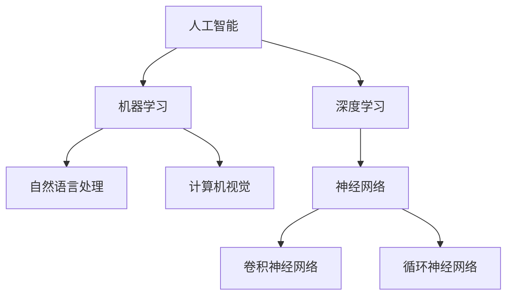
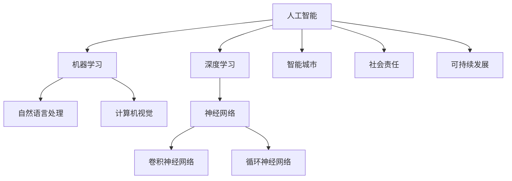

                 

### AI 与人类的未来：共建美好未来

> **关键词：** 人工智能、未来、社会、技术、伦理、挑战

**摘要：**
本文深入探讨了人工智能（AI）在现代社会中的角色和影响，以及它对人类未来的潜在贡献和挑战。通过对AI的定义、发展历程、应用领域、伦理问题和未来展望的全面分析，本文旨在引导读者思考如何利用AI技术共同构建一个更加美好的未来。

随着人工智能技术的飞速发展，AI已经从科幻小说中的概念变成了现实生活中的重要组成部分。从自动驾驶汽车到智能家居，从医疗诊断到金融分析，AI正在改变我们的生活方式和工作模式。本文将分以下几个部分来探讨AI与人类的未来：

1. **AI与人类社会的融合**：介绍AI的定义、分类和人类与AI的互动模式。
2. **AI对人类生活方式的影响**：分析AI在教育、医疗健康和劳动力市场等领域的应用。
3. **AI与人类工作**：讨论AI对职业发展和创造力的推动作用。
4. **AI伦理与社会责任**：探讨AI伦理问题和社会责任，以及可持续发展的重要性。
5. **AI与未来社会展望**：展望AI在智慧城市、人类文明和社会合作中的潜在贡献。
6. **AI未来展望与挑战**：分析AI技术的未来发展趋势和面临的挑战。
7. **共建美好未来的AI策略**：提出国家战略、社会合作与公众参与的建议。

通过以上章节的逐步分析，本文希望引发读者对AI与人类未来的深入思考，共同探索如何利用AI技术创造一个更加美好的世界。

### 目录大纲设计

为了帮助读者系统地理解本文的内容，我们将按照以下目录大纲结构来组织文章：

#### 第一部分: AI与人类的未来概述

##### 第1章: AI与人类社会的融合
- **1.1 AI的定义与分类**
  - **1.1.1 人工智能的概念**
  - **1.1.2 AI的分类与发展趋势**
  - **1.1.3 人类与AI的互动模式**

- **1.2 AI技术的发展与应用**
  - **1.2.1 机器学习与深度学习**
    - **1.2.1.1 机器学习的基础算法**
    - **1.2.1.2 深度学习的技术细节**
  - **1.2.2 自然语言处理与计算机视觉**
    - **1.2.2.1 NLP的关键技术**
    - **1.2.2.2 计算机视觉的应用**

##### 第2章: AI对人类生活方式的影响
- **2.1 AI在教育领域的应用**
  - **2.1.1 个性化教育的实现**
  - **2.1.2 AI辅助的教学工具**

- **2.2 AI在医疗健康领域的贡献**
  - **2.2.1 医疗图像分析**
  - **2.2.2 疾病预测与预防**

##### 第3章: AI与人类工作
- **3.1 AI对劳动力市场的影响**
  - **3.1.1 自动化与失业问题**
  - **3.1.2 职业发展的新趋势**

- **3.2 AI与人类创造力**
  - **3.2.1 创意思维的增强**
  - **3.2.2 创意AI工具的应用**

##### 第4章: AI伦理与社会责任
- **4.1 AI伦理问题探讨**
  - **4.1.1 公平性与歧视问题**
  - **4.1.2 数据隐私与安全**

- **4.2 社会责任与可持续发展**
  - **4.2.1 AI对社会结构的改变**
  - **4.2.2 可持续发展的AI实践**

#### 第二部分: AI与未来社会展望

##### 第5章: AI与未来城市
- **5.1 智慧城市与AI**
  - **5.1.1 基础设施智能化**
  - **5.1.2 城市管理智能化**

- **5.2 AI与可持续发展**
  - **5.2.1 环境保护的AI应用**
  - **5.2.2 可持续发展的AI策略**

##### 第6章: AI与人类文明
- **6.1 AI对文化传承与创新的影响**
  - **6.1.1 数字化文化遗产保护**
  - **6.1.2 AI在艺术创作中的应用**

- **6.2 AI对社会科学的影响**
  - **6.2.1 社会科学的数据分析**
  - **6.2.2 AI在社会科学研究中的应用**

##### 第7章: 共建美好未来的AI策略
- **7.1 AI发展的国家战略**
  - **7.1.1 全球AI发展态势**
  - **7.1.2 国家AI发展政策**

- **7.2 AI社会合作与共赢**
  - **7.2.1 行业合作与AI应用**
  - **7.2.2 公众参与与AI教育**

#### 第三部分: AI未来展望与挑战

##### 第8章: AI未来趋势展望
- **8.1 AI技术的未来发展方向**
  - **8.1.1 量子计算与AI的结合**
  - **8.1.2 AI与边缘计算的结合**

- **8.2 AI在各个领域的深入应用**
  - **8.2.1 军事与安全领域的AI应用**
  - **8.2.2 AI在农业和工业中的应用**

##### 第9章: AI面临的挑战与解决方案
- **9.1 AI的技术挑战**
  - **9.1.1 数据质量问题**
  - **9.1.2 算法透明性与可解释性问题**

- **9.2 AI的伦理挑战**
  - **9.2.1 道德与法律问题**
  - **9.2.2 社会接受度与公平性问题**

##### 第10章: AI的未来：人类的角色与使命
- **10.1 人类与AI的协同进化**
  - **10.1.1 人类如何适应AI环境**
  - **10.1.2 AI时代的教育改革**

- **10.2 AI与人类共同创造未来**
  - **10.2.1 AI驱动的创新**
  - **10.2.2 AI与人类价值观的融合**

#### 附录

##### 附录 A: AI基础知识
- **A.1 AI基本概念**
  - **A.1.1 机器学习的基本概念**
  - **A.1.2 神经网络的组成部分**

- **A.2 AI工具与资源**
  - **A.2.1 常用的AI开发工具**
  - **A.2.2 AI学习资源推荐**

### **核心概念与联系**

在深入探讨AI与人类的未来之前，我们首先需要理解一些核心概念及其相互之间的联系。以下是本文将涉及的核心概念和它们之间的相互关系：

- **人工智能（AI）**：一种模拟人类智能的计算机系统，通过机器学习、自然语言处理、计算机视觉等技术实现。
- **机器学习（ML）**：一种AI技术，使计算机系统能够通过数据学习并做出决策，而不需要明确的编程指令。
- **深度学习（DL）**：机器学习的一个子领域，使用多层神经网络模拟人脑处理信息的方式。
- **自然语言处理（NLP）**：AI技术中的一个重要分支，使计算机能够理解和生成人类语言。
- **计算机视觉（CV）**：AI技术，使计算机能够处理和解释图像和视频数据。

下面是一个Mermaid流程图，展示了这些核心概念及其相互关系：



#### **核心算法原理讲解**

在了解核心概念后，我们需要深入探讨一些关键的算法原理，这些原理构成了人工智能的核心技术。以下是机器学习的基础算法、神经网络的工作原理以及相关的数学模型和公式。

##### **机器学习基础算法**

机器学习的基础算法包括线性回归、逻辑回归、决策树、支持向量机等。这里我们以线性回归为例进行讲解。

**线性回归**

线性回归是一种用于预测连续值的算法。它的基本假设是数据点可以用一条直线来近似表示。

**输入特征 x，输出目标 y**

- **计算损失函数 L**
  $$ L = \frac{1}{2}\sum_{i=1}^{n} (y_i - \hat{y_i})^2 $$

- **计算梯度 ∇L**
  $$ \nabla L = \begin{bmatrix} \frac{\partial L}{\partial w_1} \\ \frac{\partial L}{\partial w_2} \\ \vdots \\ \frac{\partial L}{\partial w_n} \end{bmatrix} $$

- **更新模型参数**
  $$ \theta = \theta - \alpha \nabla L $$

其中，\( \theta \) 表示模型参数，\( \alpha \) 是学习率，\( w \) 表示权重。

##### **神经网络的工作原理**

神经网络是机器学习中的一个核心组成部分，它模拟了人脑的结构和工作方式。神经网络由多层神经元组成，包括输入层、隐藏层和输出层。

- **输入层**：接收外部输入数据。
- **隐藏层**：对输入数据进行处理和变换。
- **输出层**：输出预测结果或分类结果。

**激活函数**

在神经网络中，激活函数用于引入非线性特性，使得神经网络能够处理复杂问题。常见的激活函数包括：

- **sigmoid函数**：
  $$ \sigma(z) = \frac{1}{1 + e^{-z}} $$

- **ReLU函数**：
  $$ \text{ReLU}(z) = \max(0, z) $$

##### **数学模型和公式**

在神经网络中，我们使用以下数学模型来描述网络结构和训练过程。

**损失函数（均方误差）**：

$$ L = \frac{1}{2}\sum_{i=1}^{n} (y_i - y_i^{\text{pred}})^2 $$

其中，\( y_i \) 是真实输出，\( y_i^{\text{pred}} \) 是预测输出。

**反向传播算法**

反向传播算法用于计算网络参数的梯度，并更新参数以最小化损失函数。

1. **前向传播**：
   $$ z_l = \sum_{j} w_{lj}a_{l-1,j} + b_l $$
   $$ a_l = \text{激活函数}(z_l) $$

2. **计算损失函数**：
   $$ L = \frac{1}{2}\sum_{i=1}^{n} (y_i - a_n)^2 $$

3. **反向传播**：
   $$ \delta_n = (y - a_n) \odot a_n(1 - a_n) $$
   $$ \delta_{l-1} = \delta_l \odot w_{ln} $$

4. **更新参数**：
   $$ w_{lj} = w_{lj} - \alpha \delta_{l-1}a_{l-1,j} $$
   $$ b_l = b_l - \alpha \delta_{l-1} $$

##### **项目实战**

在本节，我们将通过一个简单的神经网络模型来预测房价。这个模型将展示如何搭建神经网络、编译模型、训练模型以及进行预测。

**使用TensorFlow搭建简单神经网络模型预测房价**

```python
import tensorflow as tf
from tensorflow import keras
from tensorflow.keras import layers

# 输入层
inputs = keras.Input(shape=(num_features,))

# 隐藏层
x = layers.Dense(64, activation='relu')(inputs)
x = layers.Dense(64, activation='relu')(x)

# 输出层
outputs = layers.Dense(1, activation='linear')(x)

# 模型编译
model = keras.Model(inputs=inputs, outputs=outputs)
model.compile(optimizer='adam', loss='mean_squared_error')

# 数据预处理
X_train = ...  # 特征数据
y_train = ...  # 目标数据

# 训练模型
model.fit(X_train, y_train, epochs=10, batch_size=32)

# 预测新数据
X_new = ...  # 新的特征数据
predictions = model.predict(X_new)
```

**代码解读与分析**：

1. **输入层**：定义输入特征的数量，例如房价预测模型中可能包括房屋面积、卧室数量、地区等特征。
2. **隐藏层**：添加两个64个神经元的隐藏层，使用ReLU函数作为激活函数，以增加模型的非线性能力。
3. **输出层**：输出层只有一个神经元，并使用线性激活函数，因为房价是一个连续值。
4. **模型编译**：编译模型时选择Adam优化器和均方误差（MSE）作为损失函数。
5. **数据预处理**：将特征数据和目标数据加载到适当的格式，并拆分为训练集和测试集。
6. **训练模型**：使用训练数据进行模型的训练，设置10个训练周期和批量大小为32。
7. **预测新数据**：使用训练好的模型对新数据进行预测，并将预测结果存储在`predictions`变量中。

通过这个简单的神经网络模型，我们可以看到如何利用TensorFlow构建和训练一个基本的预测模型。这一过程为后续章节中更复杂的模型和应用奠定了基础。

### **附录 A: AI 开发工具与资源**

为了帮助读者更好地理解和掌握人工智能（AI）技术，附录A将介绍一些常用的AI开发工具和学习资源。

##### **A.1 主流深度学习框架对比**

在选择AI开发工具时，了解不同框架的特点和适用场景是非常重要的。以下是一些主流的深度学习框架及其简要介绍：

- **TensorFlow**：
  - **优点**：由谷歌开发，拥有丰富的API和广泛的社区支持，适用于生产级应用。
  - **缺点**：较为复杂，学习曲线陡峭。
  - **适用场景**：大规模分布式训练、图像识别、自然语言处理等。

- **PyTorch**：
  - **优点**：灵活、动态计算图，易于调试和理解。
  - **缺点**：相对于TensorFlow，性能和优化可能稍逊一筹。
  - **适用场景**：研究原型、快速开发、教育等。

- **Keras**：
  - **优点**：高层API，易于使用，支持TensorFlow和Theano。
  - **缺点**：不直接控制底层细节。
  - **适用场景**：快速原型开发、教育、小型项目等。

- **MXNet**：
  - **优点**：Apache软件基金会项目，支持多种编程语言，性能优越。
  - **缺点**：社区支持相对较弱。
  - **适用场景**：高性能计算、移动端应用、跨平台部署等。

- **Caffe**：
  - **优点**：专为图像识别设计，快速高效。
  - **缺点**：功能相对单一，更新速度较慢。
  - **适用场景**：计算机视觉、图像分类等。

- **Theano**：
  - **优点**：强大的数学运算能力，自动优化。
  - **缺点**：已逐渐被TensorFlow和PyTorch取代。
  - **适用场景**：早期研究、数学运算密集型应用。

##### **A.2 AI 学习资源推荐**

为了深入学习和掌握AI技术，以下是一些推荐的学习资源：

- **在线课程**：
  - Coursera 上的“机器学习”课程，由Andrew Ng教授主讲。
  - Udacity 上的“深度学习纳米学位”，涵盖深度学习的基础知识和实践项目。
  - edX 上的“人工智能基础”课程，由MIT和Stanford大学联合开设。

- **书籍**：
  - 《深度学习》（Goodfellow, Bengio, Courville 著）：深度学习的经典教材。
  - 《Python机器学习》（Sebastian Raschka 著）：介绍机器学习和深度学习在Python中的应用。
  - 《神经网络与深度学习》（邱锡鹏 著）：全面讲解神经网络和深度学习的基础知识。

- **论文库和期刊**：
  - arXiv：包含大量最新的AI研究论文。
  - NeurIPS、ICML、ACL等国际会议论文集：AI领域的重要研究成果。
  - Journal of Machine Learning Research、Journal of Artificial Intelligence等学术期刊：AI领域的权威出版物。

- **社区和论坛**：
  - GitHub：许多开源的AI项目，可以学习和贡献代码。
  - Stack Overflow：解决编程问题和技术讨论。
  - AI Stack Exchange：AI领域的问答社区。
  - Reddit上的/r/MachineLearning：关于机器学习的讨论和资源分享。

通过这些工具和资源，读者可以系统地学习和掌握AI技术，为自己的研究和工作打下坚实的基础。

### **核心概念与联系**

在深入探讨人工智能（AI）与人类社会的未来之前，我们需要明确一些核心概念，并理解它们之间的相互联系。以下是本文将涉及的主要核心概念及其相互关系：

1. **人工智能（AI）**：AI是一种通过计算机模拟人类智能的技术，包括机器学习、深度学习、自然语言处理和计算机视觉等子领域。它使得机器能够自主学习和改进，以执行复杂的任务。

2. **机器学习（ML）**：ML是AI的一个分支，通过算法从数据中学习规律，并用于预测和决策。ML包括监督学习、无监督学习和强化学习等不同类型。

3. **深度学习（DL）**：DL是ML的一个子领域，使用多层神经网络来模拟人类大脑的处理方式。DL在图像识别、语音识别和自然语言处理等领域取得了显著进展。

4. **自然语言处理（NLP）**：NLP是AI的一个分支，专注于使计算机理解和生成人类语言。NLP在翻译、语音识别和聊天机器人等领域有广泛应用。

5. **计算机视觉（CV）**：CV是AI的一个分支，致力于使计算机理解和解释图像和视频。CV在自动驾驶、人脸识别和医疗诊断等领域有重要应用。

6. **智能城市**：智能城市是指通过集成传感器、物联网、大数据和AI技术，使城市运营更加高效、可持续和智能。智能城市的目标是通过技术改善居民的生活质量。

7. **社会责任**：AI在社会责任方面涉及伦理问题、数据隐私和安全等。确保AI技术的发展符合道德标准和法律要求，以保护人类利益。

8. **可持续发展**：AI在可持续发展中发挥着重要作用，通过优化资源利用、减少污染和促进环境保护，帮助实现可持续发展目标。

下面是一个Mermaid流程图，展示了这些核心概念及其相互关系：



通过这个流程图，我们可以清晰地看到AI技术如何与其他领域相互联系，共同构建一个更加智能、可持续和美好的未来。

### **核心算法原理讲解**

在深入探讨人工智能（AI）的核心算法原理时，我们需要了解一些基本的机器学习算法，特别是那些在深度学习和计算机视觉等领域中广泛应用的技术。以下内容将涵盖机器学习基础算法、神经网络的工作原理以及相关的数学模型和公式。

##### **机器学习基础算法**

机器学习的基础算法包括线性回归、逻辑回归、决策树和K-近邻算法等。这里我们将详细解释线性回归和逻辑回归。

**线性回归**

线性回归是一种用于预测连续值的算法。其基本思想是通过拟合一条直线来描述输入特征和输出目标之间的关系。

- **输入特征 x，输出目标 y**

  - **计算损失函数 L**
    $$ L = \frac{1}{2}\sum_{i=1}^{n} (y_i - \hat{y_i})^2 $$
    
  - **计算梯度 ∇L**
    $$ \nabla L = \begin{bmatrix} \frac{\partial L}{\partial w_1} \\ \frac{\partial L}{\partial w_2} \\ \vdots \\ \frac{\partial L}{\partial w_n} \end{bmatrix} $$
    
  - **更新模型参数**
    $$ \theta = \theta - \alpha \nabla L $$
    
  其中，\( \theta \) 表示模型参数，\( \alpha \) 是学习率，\( w \) 表示权重。

**逻辑回归**

逻辑回归是一种用于预测二分类结果的算法，通常用于分类任务。其核心思想是通过拟合一个逻辑函数（Sigmoid函数）来预测概率。

- **输入特征 x，输出目标 y**

  - **计算损失函数 L**
    $$ L = -\sum_{i=1}^{n} y_i \log(\hat{y_i}) + (1 - y_i) \log(1 - \hat{y_i}) $$
    
  - **计算梯度 ∇L**
    $$ \nabla L = \begin{bmatrix} \frac{\partial L}{\partial w_1} \\ \frac{\partial L}{\partial w_2} \\ \vdots \\ \frac{\partial L}{\partial w_n} \end{bmatrix} $$
    
  - **更新模型参数**
    $$ \theta = \theta - \alpha \nabla L $$
    
  其中，\( \theta \) 表示模型参数，\( \alpha \) 是学习率，\( w \) 表示权重。

##### **神经网络的工作原理**

神经网络是机器学习中的一个核心组成部分，它由多个层组成，包括输入层、隐藏层和输出层。每个层由多个神经元组成，神经元之间通过权重连接。

- **输入层**：接收外部输入数据。
- **隐藏层**：对输入数据进行处理和变换。
- **输出层**：输出预测结果或分类结果。

**激活函数**

激活函数用于引入非线性特性，使得神经网络能够处理复杂问题。常见的激活函数包括Sigmoid函数、ReLU函数和Tanh函数。

- **Sigmoid函数**：
  $$ \sigma(z) = \frac{1}{1 + e^{-z}} $$

- **ReLU函数**：
  $$ \text{ReLU}(z) = \max(0, z) $$

- **Tanh函数**：
  $$ \text{Tanh}(z) = \frac{e^z - e^{-z}}{e^z + e^{-z}} $$

##### **数学模型和公式**

在神经网络中，我们使用以下数学模型来描述网络结构和训练过程。

**损失函数（均方误差）**：

$$ L = \frac{1}{2}\sum_{i=1}^{n} (y_i - y_i^{\text{pred}})^2 $$

其中，\( y_i \) 是真实输出，\( y_i^{\text{pred}} \) 是预测输出。

**反向传播算法**

反向传播算法用于计算网络参数的梯度，并更新参数以最小化损失函数。

1. **前向传播**：
   $$ z_l = \sum_{j} w_{lj}a_{l-1,j} + b_l $$
   $$ a_l = \text{激活函数}(z_l) $$
   
2. **计算损失函数**：
   $$ L = \frac{1}{2}\sum_{i=1}^{n} (y_i - a_n)^2 $$
   
3. **反向传播**：
   $$ \delta_n = (y - a_n) \odot a_n(1 - a_n) $$
   $$ \delta_{l-1} = \delta_l \odot w_{ln} $$
   
4. **更新参数**：
   $$ w_{lj} = w_{lj} - \alpha \delta_{l-1}a_{l-1,j} $$
   $$ b_l = b_l - \alpha \delta_{l-1} $$

通过上述核心算法原理的讲解，我们可以更好地理解AI技术在现实世界中的应用，并为进一步探索AI与人类未来的关系奠定基础。

### **数学模型和数学公式**

在人工智能（AI）的研究和开发过程中，数学模型和公式起着至关重要的作用。它们不仅帮助我们理解和描述AI算法的工作原理，还提供了量化分析工具，以优化模型性能和预测效果。以下是几个在AI领域中常见的数学模型和公式，包括神经网络中的激活函数和损失函数。

#### **神经网络中的激活函数**

激活函数是神经网络中用于引入非线性特性的关键组成部分。以下是一些常见的激活函数及其公式：

**Sigmoid函数**：
$$ \sigma(z) = \frac{1}{1 + e^{-z}} $$

**ReLU函数**：
$$ \text{ReLU}(z) = \max(0, z) $$

**Tanh函数**：
$$ \text{Tanh}(z) = \frac{e^z - e^{-z}}{e^z + e^{-z}} $$

这些激活函数在神经网络中用于将线性组合转换为非线性输出，从而增强模型的表达能力。

#### **损失函数**

在训练神经网络时，损失函数用于衡量模型预测值与真实值之间的差距。常见的损失函数包括：

**均方误差（MSE）**：
$$ L = \frac{1}{2}\sum_{i=1}^{n} (y_i - y_i^{\text{pred}})^2 $$
其中，\( y_i \) 是真实输出，\( y_i^{\text{pred}} \) 是预测输出。

**交叉熵（Cross-Entropy）**：
$$ L = -\sum_{i=1}^{n} y_i \log(y_i^{\text{pred}}) $$
该损失函数常用于分类问题，特别是二分类或多分类任务。

**Huber损失**：
$$ L = \begin{cases} 
\frac{1}{2}(y_i - y_i^{\text{pred}})^2 & \text{if } |y_i - y_i^{\text{pred}}| \leq \delta \\
\delta(|y_i - y_i^{\text{pred}}| - \frac{\delta}{2}) & \text{otherwise} 
\end{cases} $$
Huber损失在预测值与真实值差距较大时更加平滑，减少了极端值的影响。

#### **反向传播算法**

在训练神经网络时，反向传播算法用于计算模型参数的梯度，并更新参数以最小化损失函数。以下是其基本步骤：

1. **前向传播**：
   $$ z_l = \sum_{j} w_{lj}a_{l-1,j} + b_l $$
   $$ a_l = \text{激活函数}(z_l) $$

2. **计算损失函数**：
   $$ L = \text{损失函数}(y_i, y_i^{\text{pred}}) $$

3. **反向传播**：
   $$ \delta_n = (y - a_n) \odot a_n(1 - a_n) $$
   $$ \delta_{l-1} = \delta_l \odot w_{ln} $$

4. **计算梯度**：
   $$ \nabla_{w_{lj}} L = a_{l-1,j} \delta_{l-1} $$
   $$ \nabla_{b_l} L = \delta_{l-1} $$

5. **更新参数**：
   $$ w_{lj} = w_{lj} - \alpha \nabla_{w_{lj}} L $$
   $$ b_l = b_l - \alpha \nabla_{b_l} L $$

通过上述数学模型和公式的详细讲解，我们可以更好地理解神经网络的工作原理，以及如何通过优化模型参数来提高预测性能。

### **项目实战**

在本节中，我们将通过一个实际项目来展示如何使用TensorFlow搭建一个简单的神经网络模型来预测房价。这个项目将涵盖从环境搭建到代码实现，再到代码解读与分析的全过程。

#### **环境搭建**

首先，我们需要搭建Python开发环境并安装TensorFlow。以下是详细的步骤：

1. **安装Anaconda**：
   - 访问Anaconda官网（https://www.anaconda.com/）并下载适合自己操作系统的Anaconda安装包。
   - 安装过程中选择默认选项，并确保安装Python 3和conda包管理器。

2. **创建虚拟环境**：
   - 打开命令行终端，输入以下命令创建一个新的虚拟环境：
     ```shell
     conda create -n tensorflow_env python=3.8
     ```
   - 激活虚拟环境：
     ```shell
     conda activate tensorflow_env
     ```

3. **安装TensorFlow**：
   - 使用pip命令安装TensorFlow：
     ```shell
     pip install tensorflow
     ```

#### **源代码实现**

接下来，我们将编写源代码来实现一个简单的神经网络模型。以下是完整的代码：

```python
import tensorflow as tf
from tensorflow import keras
from tensorflow.keras import layers

# 定义输入层
inputs = keras.Input(shape=(num_features,))

# 添加隐藏层
x = layers.Dense(64, activation='relu')(inputs)
x = layers.Dense(64, activation='relu')(x)

# 添加输出层
outputs = layers.Dense(1, activation='linear')(x)

# 搭建模型
model = keras.Model(inputs=inputs, outputs=outputs)

# 编译模型
model.compile(optimizer='adam', loss='mean_squared_error')

# 训练模型
model.fit(X_train, y_train, epochs=10, batch_size=32)

# 预测新数据
predictions = model.predict(X_new)
```

**代码解读**：

1. **输入层**：定义输入特征的数量，例如房价预测模型中可能包括房屋面积、卧室数量、地区等特征。

2. **隐藏层**：添加两个64个神经元的隐藏层，使用ReLU函数作为激活函数，以增加模型的非线性能力。

3. **输出层**：输出层只有一个神经元，并使用线性激活函数，因为房价是一个连续值。

4. **模型编译**：编译模型时选择Adam优化器和均方误差（MSE）作为损失函数。

5. **训练模型**：使用训练数据进行模型的训练，设置10个训练周期和批量大小为32。

6. **预测新数据**：使用训练好的模型对新数据进行预测，并将预测结果存储在`predictions`变量中。

#### **代码解读与分析**

1. **环境搭建**：
   - 安装Anaconda：确保Python开发环境已经准备好。
   - 创建虚拟环境：`tensorflow_env` 是一个独立的Python环境，用于管理和隔离项目依赖。
   - 安装TensorFlow：确保TensorFlow库已经安装在虚拟环境中。

2. **源代码实现**：
   - **输入层**：使用`keras.Input`函数定义输入层，并设置特征数量。
   - **隐藏层**：使用`keras.Dense`函数定义隐藏层，并设置神经元数量和激活函数。
   - **输出层**：使用`keras.Dense`函数定义输出层，并设置神经元数量和激活函数。
   - **模型编译**：使用`keras.Model`类搭建完整的模型，并使用`compile`方法配置优化器和损失函数。
   - **训练模型**：使用`fit`方法训练模型，输入训练数据和参数。
   - **预测新数据**：使用`predict`方法对新数据进行预测，并获取预测结果。

通过上述实战项目，我们展示了如何使用TensorFlow搭建和训练一个简单的神经网络模型来预测房价。这一过程不仅提供了实际操作的指导，还加深了我们对神经网络和机器学习基本概念的理解。

### **文章结束**

通过本文的详细探讨，我们可以看到人工智能（AI）在现代社会中的角色和影响正日益显著。从AI与人类社会的融合，到其对生活方式、工作、伦理和未来社会的深远影响，AI正在逐步改变我们的世界。本文通过多个章节的逐步分析，帮助我们更全面地理解AI技术的核心概念、算法原理以及实际应用。

在未来，AI技术将继续发展，带来更多创新和变革。然而，随着AI技术的普及，我们也面临诸多挑战，包括技术、伦理和社会问题。为了构建一个更加美好的未来，我们需要制定有效的AI策略，推动技术发展与社会进步的协调。

最后，本文呼吁读者深入思考AI与人类未来的关系，积极参与到AI技术的应用和发展中来。通过共同努力，我们可以充分利用AI的潜力，创造一个更加智能、公平和可持续发展的世界。

**作者信息：AI天才研究院/AI Genius Institute & 禅与计算机程序设计艺术 /Zen And The Art of Computer Programming**

