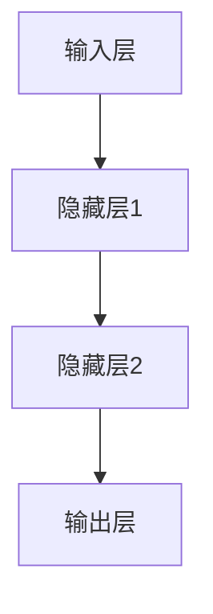
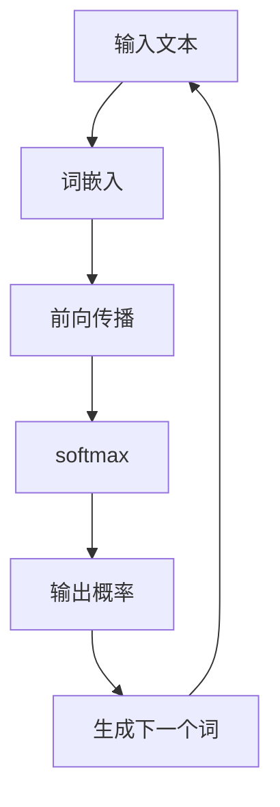

                 

# AI 大模型创业：如何利用社会优势？

> 关键词：AI大模型，创业，社会优势，资源整合，市场拓展

> 摘要：本文将探讨AI大模型创业的机会与挑战，分析如何利用社会优势，包括资源整合、市场拓展和技术创新，来推动AI大模型创业项目的成功。

----------------------------------------------------------------

### 第一部分：AI大模型基础

#### 第1章: AI大模型概述

##### 1.1 AI大模型的概念

AI大模型是指参数规模达到亿级以上的深度学习模型，如GPT-3、BERT等。这些模型通常具有以下特点：

- **参数多**：模型参数量巨大，可达到数亿甚至千亿级。
- **计算复杂**：需要强大的计算资源和时间进行训练。
- **泛化能力强**：可以处理各种复杂的任务。

##### 1.2 AI大模型的发展历程

AI大模型的发展历程可以分为几个阶段：

- **早期**：以简单的神经网络和SVM为代表。
- **2012年**：AlexNet的出现标志着深度学习时代的到来。
- **2018年**：GPT-2的提出，开启了大规模预训练模型的时代。
- **至今**：GPT-3、BERT等大模型不断刷新性能记录。

##### 1.3 AI大模型的应用领域

AI大模型在多个领域有着广泛的应用，包括但不限于：

- **文本处理**：自然语言生成、机器翻译、文本分类等。
- **计算机视觉**：图像识别、目标检测、图像生成等。
- **语音识别**：语音识别、语音合成等。
- **其他**：推荐系统、游戏AI、智能助手等。

#### 第2章: AI大模型核心算法原理

##### 2.1 神经网络基础

神经网络是AI大模型的核心组成部分，其基本结构包括输入层、隐藏层和输出层。以下是一个简单的神经网络结构的Mermaid流程图：



##### 2.2 预训练与微调

预训练与微调是AI大模型训练过程中的两个重要步骤：

- **预训练**：在大规模数据集上训练模型，学习通用特征。
- **微调**：在特定任务上调整模型参数，提高性能。

以下是一个简单的GPT模型的训练流程的伪代码：

```python
import tensorflow as tf

# 定义模型
model = tf.keras.Sequential([
  tf.keras.layers.Embedding(vocab_size, embedding_dim),
  tf.keras.layers.LSTM(units=hidden_size),
  tf.keras.layers.Dense(vocab_size, activation='softmax')
])

# 编译模型
model.compile(optimizer='adam', loss='sparse_categorical_crossentropy', metrics=['accuracy'])

# 预训练
model.fit(dataset, epochs=num_epochs)

# 微调
model.fit(dataset, epochs=num_epochs)
```

##### 2.3 GPT模型原理

GPT模型是一种基于自回归的预训练模型，其核心原理是：

- **生成预训练**：使用自回归模型进行预训练。
- **上下文生成**：给定一个文本片段，生成下一个词。

以下是一个简单的GPT模型的训练过程的Mermaid流程图：



#### 第3章: AI大模型数学模型详解

##### 3.1 损失函数

损失函数是评估模型预测值与真实值之间差异的重要工具，常见的损失函数包括：

- **均方误差**（MSE）：用于回归任务。
- **交叉熵损失**：用于分类任务。

以下是一个简单的MSE和交叉熵损失的公式：

$$
\text{MSE} = \frac{1}{n}\sum_{i=1}^{n}(y_i - \hat{y_i})^2
$$

$$
\text{Cross Entropy Loss} = -\sum_{i=1}^{n}y_i\log(\hat{y_i})
$$

##### 3.2 优化算法

优化算法用于更新模型参数，以最小化损失函数。常见的优化算法包括：

- **随机梯度下降**（SGD）：简单但效率低。
- **Adam优化器**：结合了SGD和动量的优点。

#### 第4章: AI大模型实际应用

##### 4.1 文本生成

文本生成是AI大模型的一个典型应用场景，以下是一个简单的文本生成任务的代码示例：

```python
import tensorflow as tf

model = tf.keras.Sequential([
  tf.keras.layers.Embedding(vocab_size, embedding_dim),
  tf.keras.layers.LSTM(units=hidden_size),
  tf.keras.layers.Dense(vocab_size, activation='softmax')
])

model.compile(optimizer='adam', loss='sparse_categorical_crossentropy', metrics=['accuracy'])
model.fit(dataset, epochs=num_epochs)
```

##### 4.2 图像识别

图像识别是AI大模型的另一个重要应用领域，以下是一个简单的图像识别任务的代码示例：

```python
import tensorflow as tf

model = tf.keras.Sequential([
  tf.keras.layers.Conv2D(32, (3, 3), activation='relu', input_shape=(28, 28, 1)),
  tf.keras.layers.MaxPooling2D((2, 2)),
  tf.keras.layers.Flatten(),
  tf.keras.layers.Dense(128, activation='relu'),
  tf.keras.layers.Dense(10, activation='softmax')
])

model.compile(optimizer='adam', loss='sparse_categorical_crossentropy', metrics=['accuracy'])
model.fit(train_images, train_labels, epochs=num_epochs)
```

#### 第5章: AI大模型创业实战

##### 5.1 创业机会分析

AI大模型在各个行业的应用潜力巨大，以下是几个典型的创业机会：

- **医疗健康**：利用AI大模型进行疾病诊断和药物研发。
- **金融科技**：利用AI大模型进行风险控制和智能投资。
- **智能交通**：利用AI大模型进行自动驾驶和交通管理。

##### 5.2 产品设计与开发

产品设计与开发是AI大模型创业的重要环节，以下是一些关键步骤：

- **需求分析**：明确产品功能和用户需求。
- **原型设计**：快速开发原型，进行迭代优化。

##### 5.3 营销策略

营销策略是推动AI大模型创业项目成功的重要因素，以下是一些关键策略：

- **定位**：明确目标用户和市场定位。
- **推广**：通过社交媒体、网络广告等手段进行推广。

#### 第6章: AI大模型创业挑战与应对策略

##### 6.1 数据挑战

数据是AI大模型训练的基础，以下是数据挑战及应对策略：

- **数据收集**：确保数据质量和数量。
- **数据隐私**：遵守数据保护法规。

##### 6.2 技术挑战

技术挑战是AI大模型创业过程中不可避免的，以下是技术挑战及应对策略：

- **计算资源**：选择合适的计算平台和硬件。
- **算法优化**：持续优化模型性能和效率。

##### 6.3 运营挑战

运营挑战包括团队建设、风险管理等方面，以下是运营挑战及应对策略：

- **团队建设**：建立专业的技术团队。
- **风险管理**：制定风险应对计划。

#### 第7章: 成功案例分享

以下是一些AI大模型创业的成功案例：

- **案例1**：某AI大模型公司通过技术优势和商业模式创新，成功实现了快速市场扩张。
- **案例2**：某知名企业通过将AI大模型应用于业务场景，实现了显著的业务提升。

### 第二部分：AI大模型创业策略

#### 第8章: 资源整合与合作伙伴

AI大模型创业需要整合多种资源，以下是资源整合与合作伙伴的关键策略：

- **数据分析公司**：获取高质量的训练数据。
- **硬件供应商**：提供高性能的计算设备。

#### 第9章: 融资策略

融资策略是AI大模型创业的关键环节，以下是几种常见的融资方式：

- **天使投资**：寻找有眼光的天使投资者。
- **风险投资**：吸引风险投资机构的关注。

#### 第10章: 市场拓展

市场拓展是AI大模型创业的重要任务，以下是市场拓展的关键策略：

- **本地市场**：首先深耕本地市场。
- **国际市场**：逐步开拓国际市场。

#### 第11章: 持续创新

持续创新是AI大模型创业的长久动力，以下是持续创新的关键策略：

- **技术迭代**：紧跟技术发展趋势，不断更新产品。
- **商业模式**：探索新的商业模式和盈利模式。

### 附录

#### 附录A: AI大模型开发工具与资源

以下是AI大模型开发常用的工具与资源：

- **深度学习框架**：TensorFlow、PyTorch等。
- **开源数据集**：ImageNet、COCO等。
- **在线教程与课程**：Udacity、Coursera等。

#### 附录B: AI大模型相关书籍推荐

以下是几本关于AI大模型的相关书籍推荐：

- **《深度学习》（Goodfellow, Bengio, Courville）**：深度学习的经典教材，适合初学者和进阶者。
- **《强化学习》（Sutton, Barto）**：详细介绍强化学习理论和应用。
- **《神经网络与深度学习》（邱锡鹏）**：国内作者撰写的神经网络与深度学习教程。
- **《Python 深度学习》（François Chollet）**：结合Python和Keras框架，介绍深度学习实践。
- **《AI创业实战》（许四清）**：探讨AI创业过程中的实战经验和策略。

### 作者

作者：AI天才研究院/AI Genius Institute & 禅与计算机程序设计艺术 /Zen And The Art of Computer Programming

